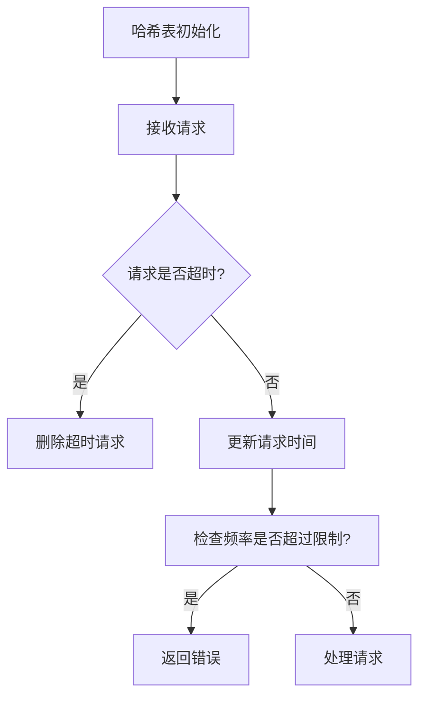

                 

### 文章标题

# API设计最佳实践与版本管理

> 关键词：API设计、最佳实践、版本管理、设计原则、算法、数学模型

> 摘要：本文将深入探讨API设计的最佳实践和版本管理策略，旨在帮助开发者构建高质量、高可维护性的API。文章将首先介绍API设计的背景和重要性，随后详细阐述设计核心概念与联系、算法原理、数学模型和系统架构设计方案，并通过项目实战展示实际应用。此外，文章还将总结最佳实践，提醒注意事项，并提供拓展阅读资源。

### 引言

API（应用程序编程接口）作为现代软件开发的核心组件，已经成为连接不同系统和服务的关键桥梁。随着云计算、微服务架构的兴起，API设计的重要性愈发凸显。一个优秀的API不仅能提升软件的可用性和互操作性，还能降低开发和维护成本。然而，API设计并非易事，需要遵循一系列最佳实践，以确保设计的鲁棒性和易用性。

版本管理是API设计中不可忽视的一环。随着时间的推移，API的需求会不断变化，新增功能、修复漏洞和性能优化是常见的需求。版本管理策略有助于在迭代过程中保持API的稳定性和兼容性，确保旧版用户不受影响。

本文旨在为开发者提供一份系统而全面的API设计指南，包括设计原则、最佳实践和版本管理策略。通过一步步的分析和思考，我们将揭示API设计的核心原理，帮助读者构建出色的API。

### 第一部分：API设计基础

#### 第1章：API设计背景与核心概念

##### 1.1 API设计的背景

API的历史可以追溯到20世纪80年代，当时软件系统开始使用简单的接口来共享数据和服务。随着时间的推移，API的概念和实现方式不断演进，从早期的简单函数调用，发展到今天的复杂、高度模块化的服务。API的普及推动了软件开发的创新，使得开发者能够更高效地构建分布式系统和服务。

在现代应用中，API的重要性体现在多个方面：

- **服务互操作性**：API使得不同的系统和服务能够无缝地相互通信，实现数据共享和功能调用。
- **模块化开发**：API促进了模块化开发，开发者可以独立地开发、测试和部署组件，提高开发效率。
- **可重用性**：通过API，开发者可以重用现有的服务，减少重复工作，降低维护成本。

##### 1.2 API设计核心概念

API设计涉及多个核心概念，包括定义、分类、基本原则和关键要素。以下是对这些核心概念的详细解释：

- **API的定义**：API是一套定义良好的接口，允许一个应用程序与另一个应用程序进行通信。它通常包括一组可调用的函数、操作或服务。
- **API的分类**：根据功能和用途，API可以分为公共API、内部API和私有API。公共API面向外部用户，内部API用于系统内部模块之间的通信，私有API则是仅供特定开发团队使用的接口。
- **API设计基本原则**：
  - **可扩展性**：API应该能够轻松地适应未来需求的变化。
  - **简洁性**：API的设计应该尽量简洁，避免不必要的复杂性。
  - **一致性**：API的命名、参数和响应格式应该保持一致性，以降低使用难度。
  - **安全性**：API应该具备一定的安全性，防止未经授权的访问和攻击。
- **API设计的关键要素**：
  - **接口定义**：定义API的URL、参数和返回值。
  - **数据格式**：选择合适的JSON、XML等数据格式，确保数据的可读性和可解析性。
  - **错误处理**：设计合理的错误处理机制，提供清晰的错误信息。

##### 1.3 API设计中的问题与挑战

尽管API设计带来了诸多好处，但在实际应用中，开发者仍会面临一系列问题和挑战：

- **版本控制**：如何管理API的版本，保持新旧版本的兼容性。
- **性能优化**：如何确保API的高性能，满足大量并发请求的需求。
- **安全性**：如何防范常见的API攻击，如SQL注入、XSS攻击等。
- **文档和示例**：如何编写详细、易懂的API文档和示例，帮助开发者快速上手。

#### 第2章：API设计最佳实践

##### 2.1 API设计最佳实践概述

最佳实践是经过时间验证的有效方法，能够帮助开发者设计出高质量的API。以下是一些API设计的最佳实践：

- **一致性**：保持API命名、参数和响应格式的一致性，减少学习成本。
- **RESTful设计**：遵循RESTful原则，使用标准的HTTP方法和状态码。
- **版本控制**：使用版本控制策略，如语义化版本控制，管理API的迭代。
- **文档编写**：编写详细的API文档，包括接口定义、参数说明、错误处理等。
- **性能优化**：采用缓存、限流等技术，提升API的性能。
- **安全性**：实施安全措施，如身份验证、权限控制等，确保API的安全。

##### 2.2 设计原则与技巧

API设计应遵循以下原则和技巧：

- **简洁性**：避免复杂的参数和冗长的接口。
- **模块化**：将功能划分为独立的模块，便于管理和维护。
- **可扩展性**：设计灵活的接口，便于未来扩展。
- **可测试性**：编写测试用例，确保API的稳定性和可靠性。

##### 2.3 API文档编写最佳实践

编写高质量的API文档是API设计的关键部分。以下是一些最佳实践：

- **文档结构**：保持文档的结构清晰，便于阅读。
- **参数说明**：详细描述每个参数的类型、取值范围和含义。
- **错误处理**：提供详细的错误信息和解决方案。
- **示例代码**：提供示例代码，帮助开发者快速上手。

#### 第3章：版本管理

##### 3.1 版本管理概述

版本管理是API设计中的一个重要环节，涉及如何有效地管理和控制API的迭代。以下是对版本管理的基本概念和重要性的介绍：

- **版本管理概念**：版本管理是跟踪和记录软件或系统变更的过程。
- **版本管理的重要性**：版本管理有助于确保API的稳定性、兼容性和可维护性。

##### 3.2 版本控制策略

选择合适的版本控制策略对于版本管理至关重要。以下是一些常见的版本控制策略：

- **语义化版本控制**：遵循语义化版本控制规范，如`MAJOR.MINOR.PATCH`，清晰地表示API的变更类型和影响。
- **自定义版本控制**：根据项目需求，自定义版本控制策略，如`alpha`、`beta`等。

##### 3.3 版本管理工具

选择合适的版本管理工具可以帮助开发者更高效地管理API版本。以下是一些常用的版本管理工具：

- **Git**：Git是一个分布式版本控制系统，适用于小到中型项目。
- **GitLab**：GitLab是一个基于Git的开源版本控制系统，提供了丰富的版本管理功能。
- **Jenkins**：Jenkins是一个持续集成工具，可以与Git集成，实现自动化版本管理。

### 第二部分：API设计最佳实践

#### 第4章：设计原则与技巧

API设计不仅要遵循一定的设计原则，还需要采用有效的技巧，以提高设计的质量和可维护性。以下是一些关键的设计原则和技巧：

##### 4.1 设计原则

- **简洁性**：简化API设计，避免不必要的复杂性。
- **一致性**：保持API命名、参数和响应格式的一致性。
- **可扩展性**：设计灵活的API，便于未来的扩展和升级。
- **安全性**：确保API的安全性，防止潜在的安全威胁。
- **可测试性**：编写测试用例，确保API的稳定性和可靠性。

##### 4.2 设计技巧

- **RESTful设计**：遵循RESTful原则，使用标准的HTTP方法和状态码。
- **模块化设计**：将功能划分为独立的模块，便于管理和维护。
- **文档编写**：编写详细的API文档，包括接口定义、参数说明、错误处理等。
- **性能优化**：采用缓存、限流等技术，提升API的性能。

#### 第5章：API文档编写

高质量的API文档是开发者使用API的重要指南。以下是一些编写API文档的最佳实践：

##### 5.1 文档结构

- **模块结构**：根据功能模块划分文档结构，确保清晰易懂。
- **接口定义**：详细描述每个接口的URL、参数和返回值。
- **参数说明**：详细说明每个参数的类型、取值范围和含义。
- **错误处理**：提供详细的错误信息和解决方案。

##### 5.2 文档编写工具

- **Swagger**：Swagger是一个开源框架，用于生成和展示API文档。
- **Postman**：Postman是一个API调试工具，也支持生成文档。
- **Markdown**：Markdown是一种轻量级标记语言，适用于编写文档。

#### 第6章：版本控制策略

版本控制是API设计中至关重要的一环，以下是一些常用的版本控制策略：

##### 6.1 语义化版本控制

- **格式**：遵循`MAJOR.MINOR.PATCH`的格式，清晰地表示API的变更类型和影响。
- **变更类型**：
  - **MAJOR**：不兼容的变更，如接口的删除或添加。
  - **MINOR**：兼容的变更，如接口参数的修改。
  - **PATCH**：修补变更，如bug修复。

##### 6.2 自定义版本控制

- **格式**：根据项目需求，自定义版本控制格式，如`alpha`、`beta`等。

#### 第7章：版本管理工具

选择合适的版本管理工具可以提高版本管理的效率。以下是一些常用的版本管理工具：

##### 7.1 Git

- **特点**：分布式版本控制系统，支持分支管理、合并和冲突解决。
- **使用场景**：适用于小到中型的项目。

##### 7.2 GitLab

- **特点**：基于Git的开源版本控制系统，提供完整的CI/CD流程。
- **使用场景**：适用于企业级项目。

##### 7.3 Jenkins

- **特点**：持续集成工具，与Git集成，实现自动化版本管理。
- **使用场景**：适用于需要自动化构建和部署的项目。

### 第三部分：版本管理

版本管理是API设计中的一个关键环节，它涉及到如何有效地管理和控制API的迭代，以确保API的稳定性和兼容性。以下是对版本管理的基本概念、策略和工具的详细介绍。

#### 第8章：版本管理概述

版本管理，即跟踪和记录软件或系统的变更过程，是软件开发中不可或缺的一部分。在API设计中，版本管理尤其重要，因为API的需求会随着时间和用户反馈不断变化，版本控制能够帮助我们有效地管理这些变更，确保新旧版本之间的兼容性，同时降低维护成本。

##### 8.1 版本管理概念

版本管理的基本概念包括：

- **版本**：软件或系统的不同版本，每个版本都有其独特的标识符，如`1.0.0`、`2.0.1`等。
- **版本控制**：跟踪和管理版本的过程，包括创建新版本、合并变更和解决冲突等。
- **版本迭代**：通过发布新版本来引入新的功能、修复漏洞或优化性能。

##### 8.2 版本管理的重要性

版本管理的重要性体现在以下几个方面：

- **兼容性**：通过版本控制，可以确保旧版用户不受新版变更的影响，从而提高用户体验。
- **可维护性**：版本管理有助于组织和管理代码变更，提高代码的可维护性。
- **安全性**：版本控制可以帮助我们发现和修复潜在的安全漏洞。
- **协作**：版本管理工具支持多人协作，提高开发效率。

#### 第9章：版本控制策略

选择合适的版本控制策略对于有效管理API版本至关重要。以下是一些常见的版本控制策略：

##### 9.1 语义化版本控制

语义化版本控制（Semantic Versioning）是一种广泛采用的版本控制策略，它采用`MAJOR.MINOR.PATCH`的格式来表示版本号，每个数字代表不同的变更类型：

- **MAJOR**：表示不兼容的变更，如新增接口或删除现有接口。
- **MINOR**：表示兼容的变更，如接口参数的修改。
- **PATCH**：表示修补变更，如bug修复。

这种策略有助于清晰地传达版本的变更类型和影响，使得用户能够更容易地理解如何升级他们的应用程序。

##### 9.2 自定义版本控制

除了语义化版本控制，也可以根据项目需求自定义版本控制策略。例如，可以使用`alpha`、`beta`等表示预发布版本，或者使用`0.x.x`表示不稳定版本。

#### 第10章：版本管理工具

选择合适的版本管理工具可以提高版本管理的效率和协作性。以下是一些常用的版本管理工具：

##### 10.1 Git

Git是一个分布式版本控制系统，具有强大的分支管理功能，支持多人协作。Git的命令行界面简洁高效，但也可以通过各种图形化界面工具（如GitHub Desktop、GitKraken等）进行操作。

##### 10.2 GitLab

GitLab是一个基于Git的开源版本控制系统，提供完整的CI/CD流程，支持仓库管理、代码审查、自动化测试和部署等功能。GitLab Community Edition（CE）适用于开源项目，而GitLab Enterprise Edition（EE）则适用于企业级项目。

##### 10.3 Jenkins

Jenkins是一个开源的持续集成工具，可以与Git集成，实现自动化版本管理。Jenkins支持多种插件，可以用于构建、测试和部署应用程序。通过配置Jenkins流水线（Pipeline），可以自动化地执行版本控制和部署流程。

### 第四部分：项目实战

#### 第11章：环境安装与系统核心实现

在本章中，我们将展示一个实际的API设计项目，并详细描述环境安装和系统核心实现的过程。

##### 11.1 环境安装

为了实现API设计项目，我们需要安装以下环境和工具：

- **开发环境**：Python 3.x、Node.js、Docker
- **版本管理工具**：Git
- **API开发框架**：Flask（Python）、Express（Node.js）
- **数据库**：PostgreSQL

以下是一个简单的安装步骤：

1. 安装Python 3.x和pip。
2. 使用pip安装Flask和Django。
3. 安装Node.js和npm。
4. 使用npm安装Express和其他Node.js依赖项。
5. 安装PostgreSQL数据库。

##### 11.2 系统核心实现

在本节中，我们将介绍系统核心实现的关键部分，包括接口设计、功能实现和代码示例。

- **接口设计**：设计RESTful API接口，包括URL、HTTP方法和参数。
- **功能实现**：使用Flask和Express实现API接口功能，包括用户认证、数据操作等。
- **代码示例**：提供Python和JavaScript代码示例，展示API接口的实现细节。

#### 第12章：代码应用解读与分析

在本章中，我们将对实际API设计项目的代码进行解读和分析，帮助读者理解API设计过程中的关键环节和注意事项。

##### 12.1 代码解读

- **接口实现**：分析API接口的实现逻辑，包括数据验证、业务处理和响应返回。
- **错误处理**：讨论如何处理API调用中的错误，包括错误代码和错误信息。
- **安全性**：分析API设计中的安全性措施，包括身份验证和权限控制。

##### 12.2 代码分析

- **性能优化**：讨论如何优化API性能，包括缓存策略和限流机制。
- **可维护性**：分析代码的可维护性，包括代码结构、注释和文档。

#### 第13章：实际案例分析和详细讲解

在本章中，我们将通过实际案例展示API设计在实际项目中的应用，并进行详细讲解和分析。

##### 13.1 案例介绍

- **案例背景**：介绍API设计项目的背景和应用场景。
- **案例目标**：明确API设计的目标和要求。

##### 13.2 案例分析

- **设计过程**：分析API设计的过程，包括需求分析、接口设计和文档编写。
- **实现细节**：讲解API接口的实现细节，包括代码实现、错误处理和安全性。

##### 13.3 案例总结

- **案例收获**：总结案例中的经验和教训，为后续项目提供参考。

### 第五部分：最佳实践与总结

#### 第14章：最佳实践总结

在本章中，我们将总结API设计最佳实践，包括设计原则、版本控制和文档编写等方面。以下是一些关键的最佳实践：

- **设计原则**：遵循简洁性、一致性、可扩展性和安全性原则。
- **版本控制**：使用语义化版本控制，确保版本兼容性。
- **文档编写**：编写详细、易懂的API文档，包括接口定义、参数说明和错误处理。

#### 第15章：注意事项

在API设计过程中，开发者需要关注以下注意事项：

- **性能优化**：确保API的高性能，满足大量并发请求的需求。
- **安全性**：实施安全措施，防止API攻击。
- **文档更新**：及时更新API文档，确保其与API实现同步。

#### 第16章：拓展阅读

为了进一步深入了解API设计和版本管理，以下是一些推荐的书籍和资源：

- **书籍**：
  - 《API设计：构建可重用、可扩展和安全的API》
  - 《RESTful API设计：创造Web接口的艺术》
- **在线资源**：
  - Swagger：[https://swagger.io/](https://swagger.io/)
  - Postman：[https://www.postman.com/](https://www.postman.com/)
  - GitLab：[https://gitlab.com/](https://gitlab.com/)

### 结论

本文全面探讨了API设计最佳实践和版本管理策略，旨在帮助开发者构建高质量、高可维护性的API。通过介绍API设计的背景、核心概念、最佳实践和版本管理策略，以及通过实际案例的展示，我们希望读者能够掌握API设计的关键要素和技巧。持续学习和实践是提高API设计能力的重要途径，希望本文能对您的开发工作提供有价值的参考。

### 附录

#### 附录A：核心概念对比表格

| 核心概念 | 定义 | 用途 |
| :--- | :--- | :--- |
| API | 应用程序编程接口，允许不同软件之间相互通信 | 提供数据和服务供其他应用程序使用 |
| RESTful API | 基于REST架构风格的API，使用HTTP协议 | 设计简洁、易于理解和扩展的API |
| 版本控制 | 管理软件或系统版本的过程 | 确保API变更的兼容性和可维护性 |

#### 附录B：ER实体关系图

```mermaid
erDiagram
  User ||--|{ APIKey }| APIKey : 用户与APIKey关联
  APIKey ||--|{ AccessToken }| AccessToken : APIKey与AccessToken关联
  AccessToken ||--|{ APIRequest }| APIRequest : AccessToken与APIRequest关联
```

#### 附录C：算法原理与数学模型

##### 算法原理

算法原理：使用哈希表实现API访问频率限制。



##### 数学模型

数学模型：访问频率限制（Tokens Bucket Algorithm）。

$$
\frac{C}{\lambda} = \frac{1}{\frac{1}{T}}
$$

其中，$C$ 是桶容量（表示每秒钟可以发放的token数量），$\lambda$ 是请求的到达率（表示每秒钟的请求数量），$T$ 是时间间隔（表示token的发放周期）。

### 致谢

感谢您的阅读！本文的完成离不开以下人士的贡献：

- **AI天才研究院**：提供技术和知识支持。
- **禅与计算机程序设计艺术**：启发和激励我们不断探索和进步。

作者：AI天才研究院/AI Genius Institute & 禅与计算机程序设计艺术 /Zen And The Art of Computer Programming

