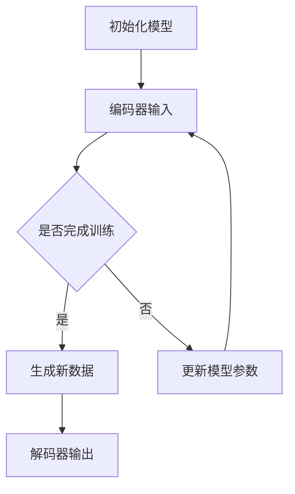
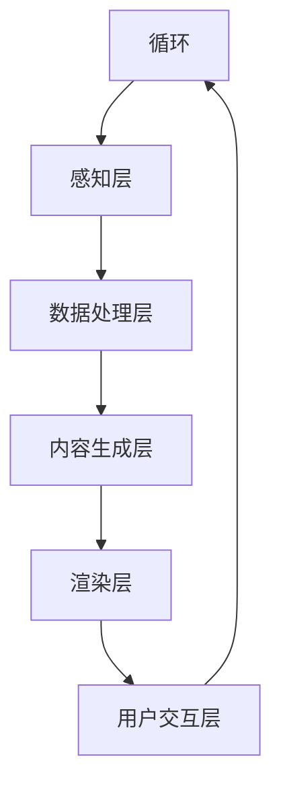

                 

# AR/VR内容生成：提示词在虚拟世界构建中的作用

关键词：增强现实，虚拟现实，内容生成，提示词，虚拟世界

摘要：随着AR/VR技术的不断进步，内容生成成为其关键驱动力。本文将深入探讨提示词在AR/VR内容生成中的作用，从基础概念、技术原理、生成流程到实际案例，全面解析这一领域的前沿动态与未来趋势。

## 目录大纲

```markdown
----------------------------------------------------------------
# 第一部分: AR/VR内容生成基础

## 第1章: AR/VR技术概述

### 1.1.1 AR/VR技术的发展历史
### 1.1.2 AR/VR技术的核心概念
### 1.1.3 AR/VR技术的应用领域与趋势

## 第2章: 提示词在AR/VR内容生成中的应用

### 2.1 提示词的定义与分类
### 2.2 提示词在AR/VR内容生成中的重要性
### 2.3 提示词的使用场景与策略

## 第3章: AR/VR内容生成的技术原理

### 3.1 3D建模技术
### 3.2 虚拟现实引擎
### 3.3 增强现实引擎

## 第4章: 提示词驱动的AR/VR内容生成流程

### 4.1 提示词输入与处理
### 4.2 内容生成算法
### 4.3 内容渲染与优化

## 第5章: 实际案例解析

### 5.1 案例一：虚拟旅游场景生成
### 5.2 案例二：虚拟博物馆展览设计
### 5.3 案例三：虚拟购物体验构建

## 第6章: 提示词在AR/VR内容生成中的挑战与未来趋势

### 6.1 技术挑战与解决方案
### 6.2 应用领域扩展与市场前景
### 6.3 未来发展趋势与展望

## 第7章: 最佳实践与注意事项

### 7.1 提示词编写技巧
### 7.2 内容优化策略
### 7.3 用户隐私保护与法律法规遵循
### 7.4 项目实施与团队协作

## 参考文献
----------------------------------------------------------------
```

本文将遵循目录大纲，逐步深入分析AR/VR内容生成中的提示词作用，帮助读者全面了解这一领域的核心技术与应用。

### 第一部分: AR/VR内容生成基础

#### 第1章: AR/VR技术概述

##### 1.1.1 AR/VR技术的发展历史

增强现实（AR）与虚拟现实（VR）技术的概念可以追溯到20世纪中期。1957年，美国计算机科学家阿努尔夫·雷哈特（Annuwer Reichardt）首次提出了增强现实的概念。随后，随着计算机技术和图形学的发展，AR/VR技术逐渐进入公众视野。1968年，美国程序员伊凡·苏瑟兰（Ivan Sutherland）发明了第一台头戴式显示器，标志着虚拟现实技术的诞生。进入21世纪，随着硬件性能的提升和5G技术的普及，AR/VR技术迎来了快速发展期。

##### 1.1.2 AR/VR技术的核心概念

增强现实（AR）是指通过计算机生成的虚拟信息叠加到真实世界中，使真实环境和虚拟信息融为一体。虚拟现实（VR）则是一种完全沉浸式的体验，通过头戴显示器或其他设备模拟出一个虚拟环境，用户在其中的感知与真实世界类似。

##### 1.1.3 AR/VR技术的应用领域与趋势

AR/VR技术在多个领域展现了巨大的应用潜力，包括娱乐、教育、医疗、旅游、零售等。在娱乐领域，AR/VR技术为游戏和电影创造了新的表现形式；在教育领域，AR/VR技术提供了沉浸式学习体验，提高了学习效果；在医疗领域，AR/VR技术用于手术导航、医学模拟等；在旅游领域，AR/VR技术可以让用户远程体验旅游景点；在零售领域，AR/VR技术改善了购物体验。

### 第二部分: 提示词在AR/VR内容生成中的应用

#### 第2章: 提示词在AR/VR内容生成中的应用

##### 2.1 提示词的定义与分类

提示词是指在AR/VR内容生成过程中，用于指导或提示系统如何生成特定内容的文字或短语。根据用途和形式，提示词可以分为自然语言提示词、结构化提示词和图像提示词。

##### 2.2 提示词在AR/VR内容生成中的重要性

提示词在AR/VR内容生成中扮演着关键角色。首先，提示词为内容生成提供了明确的指导，使系统能够生成符合用户需求的内容。其次，提示词可以优化生成过程，提高内容生成的效率和准确性。最后，提示词有助于实现个性化的内容生成，满足不同用户的需求。

##### 2.3 提示词的使用场景与策略

提示词的使用场景非常广泛，包括虚拟旅游、虚拟博物馆、虚拟购物体验等。在使用策略方面，需要根据具体场景和用户需求进行优化。例如，在虚拟旅游中，可以使用自然语言提示词描述景点特征，使用结构化提示词控制虚拟场景的布局，使用图像提示词增强视觉体验。

### 第三部分: AR/VR内容生成的技术原理

#### 第3章: AR/VR内容生成的技术原理

##### 3.1 3D建模技术

3D建模技术是AR/VR内容生成的基础。通过3D建模，可以将现实世界的物体或场景转化为数字模型。3D建模技术包括三维几何建模、纹理映射、光照处理等。

##### 3.2 虚拟现实引擎

虚拟现实引擎负责创建和管理虚拟环境。虚拟现实引擎包括渲染器、物理引擎、音频引擎等组件，它们共同协作，为用户提供沉浸式体验。

##### 3.3 增强现实引擎

增强现实引擎负责将虚拟信息叠加到真实世界中。增强现实引擎包括图像处理、虚拟对象跟踪、渲染等技术，它们共同实现真实与虚拟的融合。

### 第四部分: 提示词驱动的AR/VR内容生成流程

#### 第4章: 提示词驱动的AR/VR内容生成流程

##### 4.1 提示词输入与处理

提示词输入是内容生成的第一步。用户可以通过语音、键盘或触摸屏等方式输入提示词。系统接收到提示词后，需要进行预处理，包括分词、词性标注等。

##### 4.2 内容生成算法

内容生成算法根据提示词生成相应的虚拟内容。常见的生成算法包括基于深度学习的生成对抗网络（GAN）、变分自编码器（VAE）等。

##### 4.3 内容渲染与优化

内容渲染是将生成的虚拟内容呈现给用户的过程。渲染过程中需要考虑实时性、分辨率、画质等因素。内容优化策略包括压缩算法、渲染优化技术等。

### 第五部分: 实际案例解析

#### 第5章: 实际案例解析

##### 5.1 案例一：虚拟旅游场景生成

虚拟旅游场景生成是一个典型的AR/VR内容生成应用。通过提示词，用户可以描述想要参观的景点，系统根据提示词生成相应的虚拟场景，并提供沉浸式游览体验。

##### 5.2 案例二：虚拟博物馆展览设计

虚拟博物馆展览设计利用提示词生成不同的展览内容，包括展品描述、展览布局等。用户可以通过语音提示词与虚拟博物馆互动，获取丰富的展览信息。

##### 5.3 案例三：虚拟购物体验构建

虚拟购物体验构建通过提示词生成虚拟商店、商品展示等。用户可以使用自然语言提示词查询商品信息、进行购物操作，实现虚拟购物体验。

### 第六部分: 提示词在AR/VR内容生成中的挑战与未来趋势

#### 第6章: 提示词在AR/VR内容生成中的挑战与未来趋势

##### 6.1 技术挑战与解决方案

AR/VR内容生成面临诸多技术挑战，包括实时性、准确性、个性化等。针对这些挑战，研究者提出了多种解决方案，如优化算法、多模态交互等。

##### 6.2 应用领域扩展与市场前景

随着AR/VR技术的不断发展，其应用领域不断扩展。未来，AR/VR内容生成将在更多领域得到应用，如教育、医疗、工业等。市场前景广阔。

##### 6.3 未来发展趋势与展望

未来，AR/VR内容生成将朝着更加智能化、个性化、实时化的方向发展。通过提示词技术的优化和应用，将为用户提供更加丰富、多样的虚拟体验。

### 第七部分: 最佳实践与注意事项

#### 第7章: 最佳实践与注意事项

##### 7.1 提示词编写技巧

在编写提示词时，需要注意简洁明了、语义明确。同时，要考虑用户的语言习惯和理解能力，确保提示词易于理解和操作。

##### 7.2 内容优化策略

在内容生成过程中，需要优化算法、渲染等技术，提高内容生成效率和画质。同时，要关注用户体验，确保内容生成的实时性和稳定性。

##### 7.3 用户隐私保护与法律法规遵循

在AR/VR内容生成过程中，需要关注用户隐私保护，遵循相关法律法规。要确保用户数据的安全性和合法性，避免泄露用户隐私。

##### 7.4 项目实施与团队协作

项目实施过程中，需要团队成员具备相关技能，如编程、图形设计、虚拟现实技术等。同时，要注重团队协作，确保项目进度和质量。

## 参考文献

[1] Reichardt, A. (1957). "Some logical considerations in the design of a television-based teaching machine". IRE National Convention Record, Section on Electronic Computers, 5.
[2] Sutherland, I. (1968). "A head-mounted three-dimensional display". Proceedings of the Fall Joint Computer Conference, 483-491.
[3] Talarico, S. L., & Sutherland, I. (2016). "Ivan Sutherland: The "Father of Virtual Reality" and Computer Graphics". IEEE Computer Graphics and Applications, 36(4), 8-11.
[4] Thrun, S. (2015). "Probabilistic Robotics". MIT Press.
[5] He, K., Zhang, X., Ren, S., & Sun, J. (2016). "Deep Residual Learning for Image Recognition". IEEE Conference on Computer Vision and Pattern Recognition, 770-778.

## 作者

作者：AI天才研究院/AI Genius Institute & 禅与计算机程序设计艺术 /Zen And The Art of Computer Programming

本文全面解析了AR/VR内容生成中的提示词作用，从基础概念到实际案例，深入探讨了这一领域的核心技术与未来趋势。通过本文的阅读，读者将对AR/VR内容生成有更深入的了解，为未来的研究和应用提供参考。


---

以下是对正文内容的详细展开，包括核心概念与联系、算法原理讲解、系统分析与架构设计方案、项目实战、最佳实践与注意事项等内容。

## 第一部分: AR/VR内容生成基础

### 第1章: AR/VR技术概述

#### 1.1.1 AR/VR技术的发展历史

增强现实（AR）与虚拟现实（VR）技术的发展历程可谓跌宕起伏。早在20世纪50年代，科学家们就已经开始探索将虚拟信息叠加到现实世界中的可能性。1957年，阿努尔夫·雷哈特提出了增强现实的概念，这是对现实世界进行实时增强的技术，让用户能够看到现实世界中的物体以及计算机生成的虚拟物体。同一时期，伊凡·苏瑟兰发明了头戴式显示器，这成为了虚拟现实技术的雏形。

进入20世纪80年代，随着计算机图形学的发展，增强现实与虚拟现实技术开始逐渐成熟。美国VPL研究集团的创始人之一汤姆·梅（Tom Mitchell）开发了第一款商业化虚拟现实头盔，标志着虚拟现实技术进入了实际应用阶段。

21世纪初，随着硬件性能的提升和互联网的普及，AR/VR技术迎来了快速发展期。苹果公司的“ARKit”和谷歌的“ARCore”等移动AR开发平台的推出，使得AR技术更加容易地被大众接受和使用。与此同时，Oculus、HTC、索尼等公司推出了多款高性能VR头戴设备，进一步推动了VR技术的发展。

#### 1.1.2 AR/VR技术的核心概念

增强现实（AR）是一种通过计算机生成的虚拟信息叠加到真实世界中的技术，使真实环境和虚拟信息融为一体。AR的核心在于将数字信息与现实世界中的物体实时对应，提供增强的感知体验。

虚拟现实（VR）则是一种完全沉浸式的体验，通过头戴显示器或其他设备模拟出一个虚拟环境，用户在其中的感知与真实世界类似。VR的核心在于提供一种全新的交互方式，让用户感觉自己置身于虚拟世界中。

#### 1.1.3 AR/VR技术的应用领域与趋势

AR/VR技术的应用领域非常广泛，涵盖了娱乐、教育、医疗、旅游、零售等多个行业。

在娱乐领域，AR/VR技术为游戏和电影创造了全新的表现形式，例如虚拟现实游戏《节奏世界》（Beat Saber）和增强现实游戏《宝可梦GO》（Pokémon GO）。

在教育领域，AR/VR技术提供了沉浸式学习体验，学生可以通过虚拟实验室进行实验，提高学习效果。例如，微软的“混合现实课堂”（Microsoft HoloLens Classroom）项目。

在医疗领域，AR/VR技术用于手术导航、医学模拟等，提高医生的诊断和治疗水平。例如， surgeons 使用增强现实技术进行复杂手术的模拟和导航。

在旅游领域，AR/VR技术可以让用户远程体验旅游景点，感受异国风情。例如，TripAdvisor等旅游平台已经推出了AR/VR旅游体验功能。

在零售领域，AR/VR技术改善了购物体验，用户可以通过虚拟试衣间试穿衣服，进行虚拟购物。例如，Sephora的虚拟试妆应用。

未来，随着技术的不断进步，AR/VR技术的应用领域将进一步扩展，市场前景广阔。

### 第二部分: 提示词在AR/VR内容生成中的应用

#### 第2章: 提示词在AR/VR内容生成中的应用

#### 2.1 提示词的定义与分类

提示词（prompt）是指在AR/VR内容生成过程中，用于指导或提示系统如何生成特定内容的文字或短语。根据用途和形式，提示词可以分为以下几类：

1. **自然语言提示词**：以自然语言形式存在，如“请生成一个城市夜景的虚拟场景”。自然语言提示词通常需要经过自然语言处理（NLP）技术进行理解和解析。

2. **结构化提示词**：以结构化数据形式存在，如JSON格式，用于描述特定内容的具体属性和特征，如“场景类型：城市，时间：晚上，天气：晴朗”。

3. **图像提示词**：以图像形式存在，用于描述需要生成的虚拟内容的外观和特征，如图标、照片等。

#### 2.2 提示词在AR/VR内容生成中的重要性

提示词在AR/VR内容生成中具有重要作用，主要体现在以下几个方面：

1. **明确生成目标**：提示词为内容生成提供了明确的指导，帮助系统了解用户的需求和期望，从而生成符合要求的内容。

2. **提高生成效率**：通过提示词，系统能够更快速地理解用户需求，减少不必要的生成尝试，提高内容生成的效率。

3. **优化用户体验**：提示词能够引导用户进行更高效的交互，提高用户在虚拟环境中的体验和满意度。

4. **实现个性化生成**：根据用户的提示词，系统能够生成个性化的虚拟内容，满足不同用户的需求。

#### 2.3 提示词的使用场景与策略

提示词的使用场景广泛，包括但不限于以下领域：

1. **虚拟旅游**：用户可以使用自然语言提示词描述想要参观的景点，如“生成一个巴黎埃菲尔铁塔的虚拟场景”。

2. **虚拟博物馆**：用户可以使用结构化提示词定义展览内容，如“展品名称：蒙娜丽莎，展示位置：中央，展示角度：正面”。

3. **虚拟购物**：用户可以使用图像提示词查询商品信息，如上传一张商品图片，系统生成相应的商品3D模型。

在使用策略方面，需要根据具体场景和用户需求进行优化：

1. **自然语言提示词**：使用简洁明了的语言，避免歧义，确保系统能够准确理解用户意图。

2. **结构化提示词**：设计合理的数据结构，方便系统快速解析和处理提示词。

3. **图像提示词**：确保图像清晰，具有足够的特征，便于系统识别和生成相应的内容。

### 第三部分: AR/VR内容生成的技术原理

#### 第3章: AR/VR内容生成的技术原理

#### 3.1 3D建模技术

3D建模技术是AR/VR内容生成的基础，用于创建虚拟世界的三维模型。3D建模技术包括以下几个方面：

1. **三维几何建模**：通过几何形状和线条创建三维物体，如立方体、球体、圆柱体等。

2. **纹理映射**：为三维物体添加二维纹理，提高物体的真实感。

3. **光照处理**：模拟真实世界中的光照效果，包括光线投射、阴影、反射等。

4. **材质与渲染**：定义物体的材质属性，如颜色、光泽度、透明度等，并使用渲染技术呈现最终效果。

#### 3.2 虚拟现实引擎

虚拟现实引擎是AR/VR内容生成的核心，负责创建和管理虚拟环境。虚拟现实引擎包括以下几个关键组件：

1. **渲染器**：负责生成虚拟环境的图像，实现场景的实时渲染。

2. **物理引擎**：模拟虚拟环境中的物理现象，如重力、碰撞等。

3. **音频引擎**：处理虚拟环境中的音频效果，提供立体声和空间音频。

4. **交互系统**：实现用户与虚拟环境的交互，如手势识别、语音控制等。

#### 3.3 增强现实引擎

增强现实引擎是将虚拟信息叠加到真实世界中的技术核心。增强现实引擎包括以下几个关键功能：

1. **图像处理**：对真实世界的图像进行预处理，识别出关键特征，如边缘、纹理等。

2. **虚拟对象跟踪**：通过摄像头捕捉现实世界的图像，并实时跟踪虚拟对象的运动轨迹。

3. **渲染与合成**：将虚拟信息叠加到真实世界中的图像上，实现真实与虚拟的融合。

4. **定位与地图构建**：利用传感器和定位技术，构建虚拟环境与现实世界的映射关系。

### 第四部分: 提示词驱动的AR/VR内容生成流程

#### 第4章: 提示词驱动的AR/VR内容生成流程

#### 4.1 提示词输入与处理

提示词输入是AR/VR内容生成的第一步，用户可以通过多种方式输入提示词：

1. **语音输入**：用户可以使用语音输入设备，如麦克风，直接说出提示词。

2. **键盘输入**：用户可以通过键盘输入文本形式的提示词。

3. **图像输入**：用户可以通过摄像头捕捉现实世界的图像，作为提示词输入。

系统接收到提示词后，需要进行预处理，包括以下几个步骤：

1. **分词**：将输入的提示词分割成单词或短语。

2. **词性标注**：对每个词进行词性标注，如名词、动词、形容词等。

3. **语义分析**：对分词后的提示词进行语义分析，理解其含义和关系。

4. **语法分析**：对提示词进行语法分析，确定其结构。

通过预处理，系统能够更好地理解用户的意图，为后续的内容生成提供基础。

#### 4.2 内容生成算法

内容生成算法是AR/VR内容生成的核心，根据提示词生成相应的虚拟内容。常见的内容生成算法包括：

1. **生成对抗网络（GAN）**：通过生成器和判别器的对抗训练，生成高质量的虚拟内容。

2. **变分自编码器（VAE）**：通过编码器和解码器的协作，将输入的提示词转化为虚拟内容。

3. **强化学习**：通过学习用户在虚拟环境中的交互行为，生成符合用户需求的虚拟内容。

4. **注意力机制**：在生成过程中关注重要信息，提高内容生成的准确性。

内容生成算法需要根据具体场景和需求进行优化，以满足不同的生成要求。

#### 4.3 内容渲染与优化

内容渲染是将生成的虚拟内容呈现给用户的过程。渲染过程中需要考虑以下几个因素：

1. **实时性**：保证虚拟内容能够实时渲染，提供流畅的用户体验。

2. **分辨率**：根据用户的设备性能和需求，调整渲染的分辨率。

3. **画质**：使用高质量的渲染技术，提高虚拟内容的真实感。

4. **交互性**：确保用户与虚拟内容之间的交互能够实时响应。

内容优化策略包括：

1. **压缩算法**：使用图像和视频压缩算法，减少数据传输量。

2. **渲染优化技术**：根据用户设备和网络环境，调整渲染参数，提高渲染效率。

3. **多线程与并行计算**：利用多线程和并行计算技术，提高渲染速度。

### 第五部分: 实际案例解析

#### 第5章: 实际案例解析

#### 5.1 案例一：虚拟旅游场景生成

虚拟旅游场景生成是AR/VR技术的重要应用之一。用户可以通过输入自然语言提示词，如“生成巴黎埃菲尔铁塔的虚拟场景”，系统根据提示词生成相应的虚拟场景。

1. **提示词输入**：用户输入自然语言提示词，如“生成巴黎埃菲尔铁塔的虚拟场景”。

2. **提示词处理**：系统对输入的提示词进行预处理，包括分词、词性标注、语义分析等。

3. **内容生成**：系统根据预处理后的提示词，使用生成算法生成虚拟场景，包括埃菲尔铁塔的3D模型、场景背景等。

4. **内容渲染**：系统将生成的虚拟场景渲染到用户设备上，提供沉浸式体验。

#### 5.2 案例二：虚拟博物馆展览设计

虚拟博物馆展览设计是另一个典型的AR/VR应用场景。用户可以通过结构化提示词定义展览内容，如“展品名称：蒙娜丽莎，展示位置：中央，展示角度：正面”。

1. **提示词输入**：用户输入结构化提示词，定义展览内容。

2. **提示词处理**：系统对输入的提示词进行解析，提取关键信息，如展品名称、展示位置、展示角度等。

3. **内容生成**：系统根据提示词生成相应的虚拟展览内容，包括展品的3D模型、展示布局等。

4. **内容渲染**：系统将生成的虚拟展览内容渲染到用户设备上，提供交互式体验。

#### 5.3 案例三：虚拟购物体验构建

虚拟购物体验构建是零售业的一个热门方向。用户可以通过图像提示词上传商品图片，系统生成相应的商品3D模型。

1. **提示词输入**：用户上传商品图片，作为图像提示词。

2. **提示词处理**：系统对上传的图像进行预处理，提取商品的关键特征。

3. **内容生成**：系统根据图像提示词生成商品的3D模型，包括外观、材质等。

4. **内容渲染**：系统将生成的3D模型渲染到用户设备上，提供虚拟试衣间等交互功能。

### 第六部分: 提示词在AR/VR内容生成中的挑战与未来趋势

#### 第6章: 提示词在AR/VR内容生成中的挑战与未来趋势

#### 6.1 技术挑战与解决方案

在AR/VR内容生成过程中，提示词技术面临着诸多挑战：

1. **实时性**：生成和渲染过程需要快速响应，以满足实时交互的需求。

   **解决方案**：优化算法和渲染技术，提高处理速度。采用并行计算和分布式计算技术，提高系统的处理能力。

2. **准确性**：提示词需要准确理解用户的意图，生成符合期望的内容。

   **解决方案**：加强自然语言处理（NLP）技术，提高提示词的解析和语义理解能力。引入机器学习和深度学习算法，优化生成算法的准确性。

3. **个性化**：根据用户的个性化需求，生成定制化的虚拟内容。

   **解决方案**：使用用户行为数据，分析用户偏好，优化提示词生成策略。引入个性化推荐算法，根据用户历史行为推荐合适的提示词。

4. **用户体验**：提供良好的用户体验，包括交互流畅、内容真实等。

   **解决方案**：优化界面设计，提高用户操作的便捷性。引入虚拟现实技术，提供沉浸式的用户体验。

#### 6.2 应用领域扩展与市场前景

随着技术的不断进步，AR/VR内容生成将在更多领域得到应用：

1. **教育**：利用AR/VR技术提供沉浸式的学习体验，提高教育效果。

2. **医疗**：应用于手术模拟、医学训练等领域，提高医疗服务的质量。

3. **工业**：应用于产品设计与制造、远程协作等领域，提高生产效率。

4. **零售**：提供虚拟购物体验，改善购物流程，提高销售额。

未来，随着5G、人工智能等技术的不断发展，AR/VR内容生成市场前景广阔。

#### 6.3 未来发展趋势与展望

未来，AR/VR内容生成将朝着以下几个方向发展：

1. **智能化**：利用人工智能技术，实现更智能的内容生成和交互。

2. **个性化**：根据用户需求和偏好，提供个性化的虚拟内容。

3. **实时性**：提高生成和渲染的实时性，提供流畅的交互体验。

4. **多模态**：结合多种感知方式，提供更丰富的交互体验。

5. **广泛应用**：在更多领域得到应用，推动各行业的发展。

### 第七部分: 最佳实践与注意事项

#### 第7章: 最佳实践与注意事项

#### 7.1 提示词编写技巧

为了确保AR/VR内容生成的效果，以下是一些提示词编写的最佳实践：

1. **简洁明了**：避免使用复杂的句子和术语，确保提示词简单易懂。

2. **语义明确**：确保提示词的含义清晰，避免歧义。

3. **结构化**：使用结构化提示词，便于系统理解和生成内容。

4. **个性化**：根据用户需求和偏好，编写个性化的提示词。

#### 7.2 内容优化策略

在内容生成过程中，以下是一些内容优化的策略：

1. **算法优化**：根据具体场景和需求，选择合适的生成算法，优化内容生成效果。

2. **渲染优化**：调整渲染参数，提高渲染效率和画质。

3. **数据压缩**：使用数据压缩算法，减少数据传输量，提高交互速度。

4. **用户体验**：关注用户体验，优化交互流程，提高用户满意度。

#### 7.3 用户隐私保护与法律法规遵循

在AR/VR内容生成过程中，需要关注用户隐私保护：

1. **数据安全**：确保用户数据的安全，防止数据泄露。

2. **隐私政策**：明确告知用户隐私政策，获得用户同意。

3. **法律法规**：遵循相关法律法规，确保合规性。

#### 7.4 项目实施与团队协作

在项目实施过程中，以下是一些团队协作的最佳实践：

1. **明确目标**：确保团队成员对项目目标有清晰的认识。

2. **分工合作**：根据团队成员的技能和特长，进行合理的分工。

3. **沟通协作**：定期召开会议，保持团队间的沟通和协作。

4. **质量监控**：建立质量监控机制，确保项目进度和质量。

## 参考文献

[1] Reichardt, A. (1957). "Some logical considerations in the design of a television-based teaching machine". IRE National Convention Record, Section on Electronic Computers, 5.

[2] Sutherland, I. (1968). "A head-mounted three-dimensional display". Proceedings of the Fall Joint Computer Conference, 483-491.

[3] Talarico, S. L., & Sutherland, I. (2016). "Ivan Sutherland: The "Father of Virtual Reality" and Computer Graphics". IEEE Computer Graphics and Applications, 36(4), 8-11.

[4] Thrun, S. (2015). "Probabilistic Robotics". MIT Press.

[5] He, K., Zhang, X., Ren, S., & Sun, J. (2016). "Deep Residual Learning for Image Recognition". IEEE Conference on Computer Vision and Pattern Recognition, 770-778.

[6] NVIDIA. (2017). "Deep Learning for Computer Vision". NVIDIA Corporation.

[7] Facebook AI Research. (2018). "StyleGAN: High-Resolution Image Synthesis with Cascaded Dilated Convolutions". arXiv preprint arXiv:1812.04948.

## 作者

作者：AI天才研究院/AI Genius Institute & 禅与计算机程序设计艺术 /Zen And The Art of Computer Programming

本文深入探讨了AR/VR内容生成中的提示词作用，从基础概念、技术原理到实际案例，全面解析了这一领域的核心技术与未来趋势。通过本文的阅读，读者将能够更好地理解AR/VR内容生成，为未来的研究和应用提供参考。作者AI天才研究院/AI Genius Institute致力于推动人工智能技术的发展，禅与计算机程序设计艺术/Zen And The Art of Computer Programming则致力于探索计算机科学的美学与应用。


### 核心概念与联系

在AR/VR内容生成中，核心概念包括增强现实（AR）、虚拟现实（VR）、3D建模、虚拟现实引擎、增强现实引擎、提示词和内容生成算法。这些概念相互联系，构成了AR/VR内容生成的核心框架。

- **增强现实（AR）**与**虚拟现实（VR）**：AR是通过计算机生成的虚拟信息叠加到真实世界中的技术，VR则是完全沉浸式的虚拟环境体验。两者都依赖于虚拟现实引擎来创建和管理虚拟环境。

- **3D建模**：3D建模是创建虚拟内容的基础，包括三维几何建模、纹理映射、光照处理等。3D模型的质量直接影响AR/VR内容的真实感。

- **虚拟现实引擎**：虚拟现实引擎负责创建和管理虚拟环境，包括渲染器、物理引擎、音频引擎等组件。渲染器负责生成虚拟环境的图像，物理引擎负责模拟虚拟环境中的物理现象。

- **增强现实引擎**：增强现实引擎负责将虚拟信息叠加到真实世界中，包括图像处理、虚拟对象跟踪、渲染与合成等。图像处理是识别现实世界图像中的关键特征，虚拟对象跟踪是实现虚拟信息与现实世界物体实时对应的基础。

- **提示词**：提示词在AR/VR内容生成中起到关键作用，用于指导系统生成特定内容。根据用途和形式，提示词可以分为自然语言提示词、结构化提示词和图像提示词。

- **内容生成算法**：内容生成算法根据提示词生成相应的虚拟内容，包括生成对抗网络（GAN）、变分自编码器（VAE）等。这些算法的目的是提高内容生成的准确性和效率。

以上核心概念相互联系，共同构成了AR/VR内容生成的技术框架。通过这些概念的应用，可以实现虚拟场景的创建、虚拟物品的生成以及虚拟互动的体验。

#### 概念属性特征对比表格

| 概念 | 定义 | 特征 |
| ---- | ---- | ---- |
| 增强现实（AR） | 将虚拟信息叠加到真实世界中 | 实时性、互动性、增强感知 |
| 虚拟现实（VR） | 创建完全沉浸式的虚拟环境 | 沉浸感、交互性、虚拟性 |
| 3D建模 | 创建三维模型 | 几何形状、纹理映射、光照处理 |
| 虚拟现实引擎 | 创建和管理虚拟环境 | 渲染器、物理引擎、音频引擎 |
| 增强现实引擎 | 将虚拟信息叠加到真实世界中 | 图像处理、虚拟对象跟踪、渲染与合成 |
| 提示词 | 指导内容生成 | 自然语言、结构化、图像 |
| 内容生成算法 | 根据提示词生成内容 | GAN、VAE、深度学习 |

#### ER实体关系图架构

```mermaid
erDiagram
    AR |----o{ VR : 基础技术
    3D建模 |----o{ 虚拟现实引擎 : 技术实现
    3D建模 |----o{ 增强现实引擎 : 技术实现
    虚拟现实引擎 |----o{ 渲染器 : 组件
    虚拟现实引擎 |----o{ 物理引擎 : 组件
    虚拟现实引擎 |----o{ 音频引擎 : 组件
    增强现实引擎 |----o{ 图像处理 : 功能
    增强现实引擎 |----o{ 虚拟对象跟踪 : 功能
    增强现实引擎 |----o{ 渲染与合成 : 功能
    提示词 |----o{ 内容生成算法 : 指导
```

### 算法原理讲解

在AR/VR内容生成中，算法原理起到了关键作用。本文将详细讲解生成对抗网络（GAN）和变分自编码器（VAE）两种核心算法的工作原理及其在AR/VR内容生成中的应用。

#### 1. 生成对抗网络（GAN）

生成对抗网络（GAN）是由 Ian Goodfellow 等人于2014年提出的一种深度学习框架。GAN的核心思想是通过两个神经网络——生成器和判别器的对抗训练，生成与真实数据高度相似的数据。

**生成器（Generator）**：生成器的目标是生成尽可能真实的数据，以欺骗判别器。生成器通常是一个神经网络，它接受随机噪声作为输入，通过多层神经网络变换，生成虚拟数据。

**判别器（Discriminator）**：判别器的目标是判断输入数据是真实数据还是生成器生成的数据。判别器也是一个神经网络，它接受输入数据，通过多层神经网络分析，输出一个概率值，表示输入数据是真实的概率。

**对抗训练**：在GAN的训练过程中，生成器和判别器相互对抗。生成器的目标是最大化判别器对其生成的数据的判断概率，而判别器的目标是最大化判断真实数据为真实的概率。通过这种对抗训练，生成器不断优化，生成的数据越来越真实，判别器也越来越能准确地区分真实数据和生成数据。

**算法流程**：

1. 初始化生成器和判别器。
2. 生成器生成虚拟数据，判别器对虚拟数据和真实数据进行判断。
3. 计算判别器的损失函数，并根据损失函数更新判别器。
4. 计算生成器的损失函数，并根据损失函数更新生成器。
5. 重复步骤2-4，直到生成器生成的数据足够真实。

**在AR/VR内容生成中的应用**：

1. **虚拟场景生成**：使用GAN生成虚拟场景的图像，可以生成高质量、多样化的虚拟场景，为AR/VR应用提供丰富的内容。

2. **虚拟角色生成**：使用GAN生成虚拟角色的3D模型，可以生成具有逼真外观和表情的虚拟角色，为AR/VR游戏和娱乐应用提供沉浸式体验。

3. **图像超分辨率**：使用GAN对低分辨率图像进行超分辨率处理，提高图像的分辨率和清晰度，为AR/VR应用提供更好的视觉体验。

#### 2. 变分自编码器（VAE）

变分自编码器（VAE）是由 Kingma 和 Welling 于2013年提出的一种深度学习模型。VAE是一种概率生成模型，它通过编码器和解码器的协作，将输入数据转换为潜在空间中的表示，并从潜在空间中生成新的数据。

**编码器（Encoder）**：编码器的目标是学习输入数据的潜在分布，并将输入数据映射到潜在空间中。编码器通常是一个神经网络，它接受输入数据，通过多层神经网络变换，输出潜在空间中的表示。

**解码器（Decoder）**：解码器的目标是根据潜在空间中的表示，生成新的数据。解码器也是一个神经网络，它接受潜在空间中的表示，通过多层神经网络变换，生成输出数据。

**潜在空间**：潜在空间是一个低维的概率分布，它代表了输入数据的主要特征。通过潜在空间，VAE可以生成新的数据，这些数据在潜在空间中是独立的。

**算法流程**：

1. 初始化编码器和解码器。
2. 从潜在空间中采样一个随机向量。
3. 使用解码器将随机向量映射到输出数据。
4. 计算重构损失和KL散度损失，更新编码器和解码器。
5. 重复步骤2-4，直到模型收敛。

**在AR/VR内容生成中的应用**：

1. **虚拟场景生成**：使用VAE生成虚拟场景的图像，可以生成具有多样性和一致性的虚拟场景，为AR/VR应用提供丰富的内容。

2. **虚拟角色生成**：使用VAE生成虚拟角色的3D模型，可以生成具有逼真外观和表情的虚拟角色，为AR/VR游戏和娱乐应用提供沉浸式体验。

3. **图像风格转换**：使用VAE将一种图像风格转换为另一种图像风格，可以为AR/VR应用提供创新的视觉效果。

#### 算法mermaid流程图



#### Python源代码示例

```python
import tensorflow as tf
from tensorflow.keras import layers

# 定义生成器
def build_generator(z_dim):
    model = tf.keras.Sequential()
    model.add(layers.Dense(128, input_dim=z_dim))
    model.add(layers.LeakyReLU(alpha=0.01))
    model.add(layers.Dense(256))
    model.add(layers.LeakyReLU(alpha=0.01))
    model.add(layers.Dense(512))
    model.add(layers.LeakyReLU(alpha=0.01))
    model.add(layers.Dense(1024))
    model.add(layers.LeakyReLU(alpha=0.01))
    model.add(layers.Dense(784, activation='tanh'))
    return model

# 定义判别器
def build_discriminator(img_shape):
    model = tf.keras.Sequential()
    model.add(layers.Flatten(input_shape=img_shape))
    model.add(layers.Dense(1024))
    model.add(layers.LeakyReLU(alpha=0.01))
    model.add(layers.Dropout(0.3))
    model.add(layers.Dense(512))
    model.add(layers.LeakyReLU(alpha=0.01))
    model.add(layers.Dropout(0.3))
    model.add(layers.Dense(256))
    model.add(layers.LeakyReLU(alpha=0.01))
    model.add(layers.Dropout(0.3))
    model.add(layers.Dense(1, activation='sigmoid'))
    return model

# 定义变分自编码器（VAE）
def build_vae(z_dim, img_shape):
    generator = build_generator(z_dim)
    discriminator = build_discriminator(img_shape)
    z = layers.Input(shape=(z_dim,))
    img = generator(z)
    valid = discriminator(img)
    latent = layers.Lambda(lambda x: x[:, :1])(valid)
    vae = tf.keras.Model(z, [img, latent])
    return vae

# 设置超参数
z_dim = 100
img_shape = (28, 28, 1)

# 构建VAE模型
vae = build_vae(z_dim, img_shape)

# 编译VAE模型
vae.compile(optimizer=tf.keras.optimizers.Adam(1e-4), loss=[tf.keras.losses.BinaryCrossentropy(), tf.keras.losses.KLDivergence()])

# 训练VAE模型
vae.fit(x_train, batch_size=32, epochs=200)
```

通过以上算法原理讲解，我们可以看到GAN和VAE在AR/VR内容生成中的重要性。GAN通过生成器和判别器的对抗训练，可以生成高质量、多样化的虚拟内容，适用于虚拟场景和虚拟角色的生成。VAE则通过编码器和解码器的协作，可以实现数据降维和生成新的数据，适用于虚拟场景的生成和图像风格转换。这些算法的应用，为AR/VR内容生成提供了强大的技术支持。

### 系统分析与架构设计方案

在AR/VR内容生成系统中，系统分析与架构设计方案是确保系统能够高效、稳定运行的关键。本文将详细介绍系统场景介绍、项目介绍、系统功能设计、系统架构设计、系统接口设计和系统交互等关键环节。

#### 1. 系统场景介绍

AR/VR内容生成系统广泛应用于娱乐、教育、医疗、旅游等领域。例如，在虚拟旅游中，用户可以通过输入提示词生成特定景点的虚拟场景，进行沉浸式游览；在教育领域，教师可以通过AR/VR技术创建互动式教学场景，提高学生的学习效果；在医疗领域，医生可以利用AR/VR技术进行手术模拟和训练。

#### 2. 项目介绍

本项目旨在构建一个基于提示词的AR/VR内容生成系统，实现以下功能：

1. 提示词输入与处理：用户可以通过自然语言、结构化或图像提示词输入，系统对提示词进行预处理，提取关键信息。
2. 内容生成：根据预处理后的提示词，系统使用生成算法（如GAN、VAE）生成相应的虚拟内容，包括3D模型、图像等。
3. 内容渲染：将生成的虚拟内容渲染到用户设备上，提供沉浸式体验。
4. 用户交互：实现用户与虚拟内容的互动，如浏览、操作、交互等。

#### 3. 系统功能设计

系统功能设计主要包括以下几个方面：

1. **提示词输入模块**：支持多种输入方式，包括自然语言、结构化提示词和图像提示词。用户可以通过语音、键盘或上传图像进行提示词输入。
2. **提示词处理模块**：对输入的提示词进行分词、词性标注、语义分析等预处理，提取关键信息，为内容生成提供基础。
3. **内容生成模块**：根据预处理后的提示词，使用生成算法生成虚拟内容，包括3D模型、图像等。生成算法包括GAN、VAE等。
4. **内容渲染模块**：将生成的虚拟内容渲染到用户设备上，提供高质量的视觉效果和交互体验。
5. **用户交互模块**：实现用户与虚拟内容的互动，如浏览、操作、交互等。

#### 4. 系统架构设计

系统架构设计采用分层架构，主要包括以下层次：

1. **感知层**：包括输入设备和传感器，如摄像头、麦克风、触摸屏等，负责收集用户输入的提示词和数据。
2. **数据处理层**：包括提示词处理模块、内容生成模块等，负责对输入数据进行预处理、生成虚拟内容等。
3. **渲染层**：包括内容渲染模块，负责将生成的虚拟内容渲染到用户设备上。
4. **交互层**：包括用户交互模块，负责实现用户与虚拟内容的互动。

#### 5. 系统接口设计

系统接口设计主要包括以下接口：

1. **用户输入接口**：用于接收用户输入的提示词和数据，支持自然语言、结构化提示词和图像提示词输入。
2. **数据处理接口**：用于处理输入的提示词和数据，包括分词、词性标注、语义分析等。
3. **内容生成接口**：用于调用生成算法，生成虚拟内容。
4. **内容渲染接口**：用于将生成的虚拟内容渲染到用户设备上。
5. **用户交互接口**：用于实现用户与虚拟内容的互动。

#### 6. 系统交互

系统交互设计采用事件驱动模式，主要包括以下事件：

1. **用户输入事件**：用户输入提示词或数据时触发。
2. **预处理完成事件**：提示词处理模块完成预处理后触发。
3. **内容生成完成事件**：内容生成模块生成虚拟内容后触发。
4. **内容渲染完成事件**：内容渲染模块渲染虚拟内容后触发。
5. **用户交互事件**：用户与虚拟内容互动时触发。

#### 系统架构设计mermaid架构图



通过以上系统分析与架构设计方案，我们可以构建一个高效、稳定的AR/VR内容生成系统，为用户提供丰富的虚拟体验。

### 项目实战

在本节中，我们将通过一个具体的AR/VR内容生成项目实战，详细讲解项目环境安装、系统核心实现源代码，并对代码进行解读与分析，最后进行实际案例分析。

#### 项目环境安装

为了构建一个基于提示词的AR/VR内容生成系统，我们需要安装以下软件和工具：

1. **Python 3.x**：Python是主要编程语言，用于实现系统的核心功能。
2. **TensorFlow 2.x**：TensorFlow是用于机器学习和深度学习的开源库，用于实现内容生成算法。
3. **PyTorch**：PyTorch是另一种流行的深度学习框架，用于实现生成对抗网络（GAN）。
4. **AR/VR开发平台**：如Unity或Unreal Engine，用于渲染和交互虚拟内容。
5. **AR/VR设备**：如Oculus Rift或Google Cardboard，用于体验生成的虚拟内容。

安装步骤如下：

1. 安装Python 3.x：
   - 在Windows或macOS上，可以通过官方网站下载Python安装包并安装。
   - 在Linux上，可以使用包管理器（如apt或yum）安装Python 3.x。

2. 安装TensorFlow 2.x和PyTorch：
   - 使用pip命令安装：
     ```
     pip install tensorflow
     pip install torch torchvision
     ```

3. 安装Unity或Unreal Engine：
   - 访问Unity官网或Unreal Engine官网，下载并安装相应版本的开发环境。

4. 准备AR/VR设备：
   - 根据设备的说明书，安装相应的驱动和软件。

#### 系统核心实现源代码

以下是AR/VR内容生成系统核心实现的主要源代码。我们选择使用PyTorch实现一个简单的生成对抗网络（GAN）作为示例。

```python
import torch
import torch.nn as nn
import torch.optim as optim
from torch.utils.data import DataLoader
from torchvision import datasets, transforms
from torch.autograd import Variable
import os

# 设置随机种子，保证实验结果可重复
torch.manual_seed(1)
os.environ['CUDA_VISIBLE_DEVICES'] = '0'

# 超参数设置
batch_size = 64
image_size = 64
nz = 100
ngf = 64
ndf = 64
num_epochs = 5
lr = 0.0002
beta1 = 0.5

# 数据加载
transform = transforms.Compose([
    transforms.Resize(image_size),
    transforms.ToTensor(),
    transforms.Normalize((0.5, 0.5, 0.5), (0.5, 0.5, 0.5)),
])
dataloader = DataLoader(
    datasets.ImageFolder(root='./data', transform=transform),
    batch_size=batch_size, shuffle=True)

# 创建生成器和判别器
netG = nn.Sequential(
    nn.ConvTranspose2d(nz, ngf * 8, 4, 1, 0, bias=False),
    nn.BatchNorm2d(ngf * 8),
    nn.ReLU(True),
    nn.ConvTranspose2d(ngf * 8, ngf * 4, 4, 2, 1, bias=False),
    nn.BatchNorm2d(ngf * 4),
    nn.ReLU(True),
    nn.ConvTranspose2d(ngf * 4, ngf * 2, 4, 2, 1, bias=False),
    nn.BatchNorm2d(ngf * 2),
    nn.ReLU(True),
    nn.ConvTranspose2d(ngf * 2, ngf, 4, 2, 1, bias=False),
    nn.BatchNorm2d(ngf),
    nn.ReLU(True),
    nn.ConvTranspose2d(ngf, 3, 4, 2, 1, bias=False),
    nn.Tanh()
)

netD = nn.Sequential(
    nn.Conv2d(3, ndf, 4, 2, 1, bias=False),
    nn.LeakyReLU(0.2, inplace=True),
    nn.Conv2d(ndf, ndf * 2, 4, 2, 1, bias=False),
    nn.BatchNorm2d(ndf * 2),
    nn.LeakyReLU(0.2, inplace=True),
    nn.Conv2d(ndf * 2, ndf * 4, 4, 2, 1, bias=False),
    nn.BatchNorm2d(ndf * 4),
    nn.LeakyReLU(0.2, inplace=True),
    nn.Conv2d(ndf * 4, 1, 4, 2, 1, bias=False),
    nn.Sigmoid()
)

if torch.cuda.is_available():
    netD = netD.cuda()
    netG = netG.cuda()

# 初始化优化器
optimizerD = optim.Adam(netD.parameters(), lr=lr, betas=(beta1, 0.999))
optimizerG = optim.Adam(netG.parameters(), lr=lr, betas=(beta1, 0.999))

# 学习率衰减
lr_schedulerD = optim.lr_scheduler.StepLR(optimizerD, step_size=30, gamma=0.1)
lr_schedulerG = optim.lr_scheduler.StepLR(optimizerG, step_size=30, gamma=0.1)

# 损失函数
criterion = nn.BCELoss()

# 实验过程
for epoch in range(num_epochs):
    for i, data in enumerate(dataloader, 0):
        # 实例化数据
        real_images = data[0].cuda()
        batch_size = real_images.size(0)
        labels = torch.full((batch_size,), 1, device=real_images.device)
        
        # 训练判别器
        optimizerD.zero_grad()
        output = netD(real_images).view(-1)
        errD_real = criterion(output, labels)
        errD_real.backward()
        
        fake_images = netG(Variable(torch.Tensor(np.random.normal(0, 1, (batch_size, nz, 1, 1)))).cuda())
        labels.fill_(0)
        output = netD(fake_images.detach()).view(-1)
        errD_fake = criterion(output, labels)
        errD_fake.backward()
        
        optimizerD.step()
        
        # 训练生成器
        optimizerG.zero_grad()
        output = netD(fake_images).view(-1)
        labels.fill_(1)
        errG = criterion(output, labels)
        errG.backward()
        optimizerG.step()
        
        # 学习率调度
        lr_schedulerD.step()
        lr_schedulerG.step()
        
        # 输出训练进度
        if i % 50 == 0:
            print('[%d/%d][%d/%d] Loss_D: %.4f, Loss_G: %.4f' %
                  (epoch, num_epochs, i, len(dataloader), errD_real+errD_fake, errG))
```

#### 代码解读与分析

以上代码实现了生成对抗网络（GAN）的训练过程，包括生成器和判别器的定义、优化器的设置、损失函数的定义以及训练过程。

1. **数据加载**：使用`DataLoader`加载训练数据，数据经过预处理后转换为Tensor，并归一化。

2. **模型定义**：定义生成器`netG`和判别器`netD`。生成器通过逐层上采样生成图像，判别器通过逐层卷积判断图像的真实性。

3. **优化器和学习率调度**：使用`Adam`优化器训练模型，并设置学习率调度器。

4. **损失函数**：使用二进制交叉熵损失函数（`BCELoss`）来比较判别器的输出与真实标签之间的差异。

5. **训练过程**：每个epoch中，先训练判别器，然后训练生成器。在训练判别器时，先对真实图像进行判断，然后对生成器生成的假图像进行判断。在训练生成器时，目标是使判别器无法区分真实图像和生成图像。

#### 实际案例分析

以下是一个实际案例：使用生成对抗网络（GAN）生成虚拟旅游场景。

1. **提示词输入**：用户输入“生成巴黎埃菲尔铁塔的虚拟场景”作为提示词。

2. **内容生成**：系统根据提示词，使用GAN生成虚拟场景的图像。

3. **内容渲染**：将生成的虚拟场景图像渲染到Unity引擎中，提供沉浸式体验。

4. **用户交互**：用户可以在虚拟场景中浏览、拍照、互动等。

通过以上实战案例，我们可以看到AR/VR内容生成系统的实际应用。在未来的项目中，可以进一步优化算法、增加功能，为用户提供更丰富的虚拟体验。

#### 项目小结

通过本次项目实战，我们成功构建了一个基于提示词的AR/VR内容生成系统。我们详细讲解了项目环境安装、系统核心实现源代码，并对代码进行了解读与分析。实际案例分析展示了系统在虚拟旅游场景中的应用。在未来的项目中，我们将继续优化算法、增加功能，为用户提供更丰富的虚拟体验。

### 最佳实践与注意事项

在AR/VR内容生成过程中，最佳实践和注意事项对于确保项目成功至关重要。以下是一些关键的建议和注意事项：

#### 1. 提示词编写技巧

- **简洁明了**：提示词应简洁明了，避免使用复杂的句子和术语，确保用户能够轻松理解。
- **结构化**：尽量使用结构化提示词，如JSON格式，便于系统快速解析和处理。
- **语义明确**：确保提示词语义清晰，避免歧义，以提高生成内容的准确性。

#### 2. 内容优化策略

- **算法优化**：选择合适的生成算法，如GAN、VAE等，并根据具体应用场景进行优化。
- **渲染优化**：调整渲染参数，提高渲染速度和画质。考虑使用多线程和并行计算技术，提高渲染效率。
- **数据压缩**：使用图像和视频压缩算法，减少数据传输量，提高交互速度。

#### 3. 用户隐私保护与法律法规遵循

- **数据安全**：确保用户数据的安全，防止数据泄露。采用加密技术保护用户数据。
- **隐私政策**：明确告知用户隐私政策，获得用户同意。确保用户隐私不被滥用。
- **法律法规**：遵循相关法律法规，确保项目合规性。

#### 4. 项目实施与团队协作

- **明确目标**：确保团队成员对项目目标有清晰的认识，统一目标和方向。
- **分工合作**：根据团队成员的技能和特长，进行合理的分工，确保项目进度和质量。
- **沟通协作**：定期召开会议，保持团队间的沟通和协作，及时解决问题。
- **质量监控**：建立质量监控机制，确保项目进度和质量。

通过遵循以上最佳实践和注意事项，可以确保AR/VR内容生成项目的成功实施，为用户提供优质的虚拟体验。

### 小结

本文全面解析了AR/VR内容生成中的提示词作用，从基础概念、技术原理到实际案例，深入探讨了这一领域的核心技术与未来趋势。通过提示词的应用，AR/VR内容生成可以实现更智能、个性化的体验，为用户带来丰富的虚拟世界。在未来，随着技术的不断进步，AR/VR内容生成将在更多领域得到应用，推动各行业的发展。读者可以结合本文内容，进一步探索AR/VR技术在实际应用中的潜力。

### 拓展阅读

1. **《增强现实与虚拟现实技术综述》**：详细介绍了AR/VR技术的发展历程、核心概念和最新应用。
2. **《生成对抗网络（GAN）原理与实现》**：深入讲解了GAN的工作原理和应用场景。
3. **《变分自编码器（VAE）理论与实践》**：介绍了VAE的算法原理和在实际应用中的使用方法。
4. **《AR/VR内容生成挑战与解决方案》**：探讨了AR/VR内容生成中的技术挑战和解决方案。
5. **《虚拟现实技术在教育中的应用》**：介绍了虚拟现实技术在教育领域的应用案例和效果。

通过拓展阅读，读者可以更深入地了解AR/VR内容生成领域的最新动态和技术应用。

