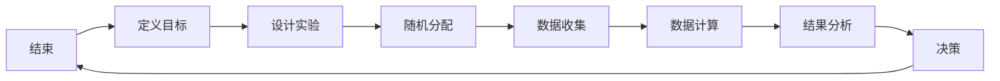

                 

### 第1章：背景介绍

#### 1.1 A/B测试的概念与起源

A/B测试，又称为拆分测试，是一种常见的实验方法，用于评估两个或多个版本的某个产品或服务之间的性能差异。这种方法起源于统计学，最初应用于医学研究，以确定某种治疗方法的疗效。随着互联网技术的发展，A/B测试逐渐被引入到软件工程领域，用于优化用户体验和产品性能。

在软件工程中，A/B测试主要用于以下几个场景：

1. **用户界面优化**：通过测试不同版本的界面，找到用户最喜欢的布局、颜色、字体等设计元素，从而提高用户满意度。
2. **功能改进**：在引入新功能时，通过A/B测试验证其是否能够带来预期的用户价值和业务收益。
3. **性能调优**：通过测试不同服务器配置或代码优化方案，找到最佳的性能配置。

A/B测试的基本流程包括以下几个步骤：

1. **定义目标**：明确希望测试的具体目标，例如提高页面点击率、降低用户流失率等。
2. **设计实验**：设计实验方案，包括测试组和对照组，以及如何分配用户到不同的组别。
3. **执行测试**：在实际环境中执行测试，收集用户行为数据。
4. **分析结果**：通过数据分析，评估不同组别的表现，确定是否采用新的版本或方案。

#### 1.2 A/B测试在现代软件工程中的重要性

在现代软件工程中，A/B测试已经成为一种不可或缺的优化工具。其主要原因如下：

1. **数据驱动决策**：A/B测试通过数据来指导决策，避免了主观臆断，提高了决策的科学性和准确性。
2. **优化用户体验**：通过持续不断地进行A/B测试，可以不断优化产品和服务，提升用户体验和满意度。
3. **风险可控**：A/B测试可以在真实用户中逐步引入新的变化，避免了直接上线可能带来的风险。
4. **资源高效利用**：A/B测试帮助团队在有限的资源下，快速找到最优的解决方案，提高了资源利用效率。

#### 1.3 读者可能遇到的问题和挑战

尽管A/B测试具有诸多优势，但在实际应用过程中，读者可能会遇到以下问题和挑战：

1. **实验设计不科学**：如果实验设计不合理，可能导致测试结果不准确，从而影响决策。
2. **数据解释复杂**：用户行为数据的解释可能非常复杂，需要专业知识和经验。
3. **测试结果偏差**：用户样本选择、实验时间、测试环境等因素可能影响测试结果的准确性。
4. **技术实现难度**：构建一个高效的A/B测试平台需要一定的技术能力，对于技术新手可能是一个挑战。

本书旨在解决上述问题，通过详细的讲解和实战案例，帮助读者：

1. **掌握A/B测试的理论基础**：通过第1章和第3章的讲解，读者可以深入了解A/B测试的基本概念、算法原理和数学模型。
2. **设计科学的实验方案**：第4章将介绍如何搭建A/B测试平台，并提供实验设计的方法和技巧。
3. **分析实验结果**：第5章将通过具体案例，展示如何对实验结果进行准确分析和解读。
4. **优化实验过程**：第6章将提供最佳实践，帮助读者在A/B测试过程中避免常见误区，提高测试效率。

通过本书的学习，读者将能够：

- 设计并执行科学的A/B测试实验。
- 利用数据驱动决策，优化产品和服务的性能。
- 构建和维护一个高效的A/B测试平台。

### 第2章：核心概念与联系

#### 2.1 A/B测试平台的组成部分

A/B测试平台是一个复杂的系统，由多个关键组件构成。这些组件相互协作，共同实现A/B测试的全流程。以下是A/B测试平台的主要组成部分：

1. **用户分配模块**：负责将用户随机分配到不同的测试组，确保每个组别的用户量大致相等，从而保证实验的公平性。
2. **数据采集模块**：负责收集用户在测试过程中的行为数据，如点击次数、页面停留时间、转化率等。
3. **数据存储模块**：用于存储用户行为数据，支持快速检索和分析。
4. **数据计算模块**：负责对收集到的数据进行统计分析，计算各个测试组的性能指标。
5. **用户界面模块**：提供直观的界面，展示测试结果和统计分析图表，方便用户查看和分析。
6. **日志和监控模块**：用于记录系统的运行日志，监控系统的运行状态，确保系统的稳定性和安全性。

#### 2.2 A/B测试平台的核心概念

A/B测试平台的核心概念包括：

1. **测试组（Treatment Group）**：参与测试的某一特定版本的用户群体。
2. **对照组（Control Group）**：参与测试的基准版本的用户群体。
3. **随机分配**：将用户随机分配到测试组和对照组，以确保实验结果的随机性和可靠性。
4. **关键指标**：用于衡量测试效果的关键指标，如点击率、转化率、留存率等。
5. **置信区间**：通过统计分析计算出的结果范围，表示测试结果的可信度。

#### 2.3 A/B测试平台的ER实体关系图

为了更直观地展示A/B测试平台的组成部分和它们之间的关系，我们可以使用Mermaid工具绘制ER（Entity-Relationship）实体关系图。

以下是一个简化的A/B测试平台ER图：

```mermaid
erDiagram
    User ||--|{ TestGroup } TestGroup : belongs to
    User ||--|{ ControlGroup } ControlGroup : belongs to
    TestGroup ||--|{ DataCollection } DataCollection : stores
    ControlGroup ||--|{ DataCollection } DataCollection : stores
    DataCollection ||--|{ DataStorage } DataStorage : stores
    DataCollection ||--|{ DataCompute } DataCompute : computes
    DataCompute ||--|{ UserInterface } UserInterface : displays
    DataCompute ||--|{ LogMonitor } LogMonitor : logs
```

在这个ER图中，用户实体与测试组和对照组实体之间存在从属关系，测试组和对照组实体与数据采集实体之间存在关联关系。数据采集实体与数据存储、数据计算、用户界面和日志监控实体之间也存在明确的关联。

通过这个ER图，我们可以清楚地看到A/B测试平台各个组件之间的逻辑关系，这有助于我们在设计和实现A/B测试平台时，确保各个组件的协同工作，实现系统的整体功能。

### 第3章：算法原理讲解

#### 3.1 A/B测试的基本算法原理

A/B测试的核心在于将用户随机分配到不同的组别，以比较不同组别在特定指标上的表现。以下是A/B测试的基本算法原理：

1. **用户分配**：首先，将用户随机分配到测试组和对照组。分配过程需要保证每个组别的用户数量大致相等，以避免组间差异对结果的影响。

2. **数据收集**：在用户访问产品或服务的过程中，收集相关的用户行为数据，如点击次数、页面停留时间、转化率等。

3. **数据计算**：对收集到的数据进行统计分析，计算测试组和对照组在各个指标上的差异。常用的统计方法包括t检验、卡方检验等。

4. **结果分析**：根据统计结果判断测试组和对照组之间的差异是否具有统计学意义。如果差异显著，则可以认为测试组的改变带来了积极的影响。

#### 3.2 A/B测试效果评估指标

在A/B测试中，选择合适的评估指标至关重要。以下是一些常见的评估指标：

1. **转化率（Conversion Rate）**：衡量用户完成特定操作的比例，如购买、注册、下载等。转化率越高，说明测试方案越成功。

2. **点击率（Click-Through Rate, CTR）**：衡量用户点击特定链接或按钮的比例。高点击率通常意味着用户对内容或界面产生了兴趣。

3. **留存率（Retention Rate）**：衡量用户在一段时间内持续使用产品或服务的比例。高留存率表明用户对产品或服务有较强的依赖性。

4. **用户满意度（User Satisfaction）**：通过调查问卷或用户反馈收集用户对产品或服务的满意度评价。高满意度通常意味着用户对产品的体验较好。

#### 3.3 常见的A/B测试算法

在实际应用中，A/B测试算法的选择会影响测试的结果和效率。以下介绍几种常见的A/B测试算法：

1. **简单随机分配算法**：将用户随机分配到测试组和对照组，是最简单直接的A/B测试方法。优点是容易实现，缺点是可能导致组间差异。

2. **重放随机分配算法**：在简单随机分配的基础上，对用户访问行为进行重放，以模拟真实场景。优点是能更真实地反映用户行为，缺点是计算复杂度较高。

3. **多臂老虎机算法（Multi-Armed Bandit Algorithm）**：适用于多个版本的A/B测试，通过学习用户行为，动态调整用户的分配策略，以最大化总收益。常见算法包括ε-贪心算法、UCB算法等。

4. **混合算法**：结合多种算法的优点，如将简单随机分配和重放随机分配结合，以提高测试的准确性和效率。

#### 3.4 A/B测试算法的mermaid流程图

为了更好地理解A/B测试算法的流程，我们可以使用mermaid工具绘制一个简化的流程图。以下是一个A/B测试算法的mermaid流程图示例：



在这个流程图中，A/B测试的每个阶段都有明确的任务和输出，通过这些步骤，最终实现测试目标。

#### 3.5 A/B测试算法的Python源代码实现

为了更好地理解A/B测试算法的实现，我们使用Python语言实现一个简单的A/B测试算法。以下是一个示例代码：

```python
import random
import numpy as np

# 用户分配
def random_assignment(n_users):
    assignments = []
    for _ in range(n_users):
        if random.random() < 0.5:
            assignments.append('A')
        else:
            assignments.append('B')
    return assignments

# 数据收集
def collect_data(assignments):
    data = {'A': [], 'B': []}
    for assignment in assignments:
        if assignment == 'A':
            data['A'].append(random.random())
        else:
            data['B'].append(random.random())
    return data

# 数据计算
def compute_data(data):
    results = {'A': np.mean(data['A']), 'B': np.mean(data['B'])}
    return results

# 结果分析
def analyze_results(results, threshold=0.05):
    if abs(results['A'] - results['B']) > threshold:
        return "差异显著"
    else:
        return "差异不显著"

# 主程序
if __name__ == "__main__":
    n_users = 1000
    assignments = random_assignment(n_users)
    data = collect_data(assignments)
    results = compute_data(data)
    print(analyze_results(results))
```

在这个示例中，我们首先定义了一个随机分配函数，用于将用户随机分配到测试组A和对照组B。然后，我们定义了数据收集、数据计算和结果分析函数，用于处理和展示测试结果。

通过这个Python示例，我们可以更直观地理解A/B测试算法的原理和实现过程。

#### 3.6 A/B测试算法原理的数学模型和公式

A/B测试的算法原理可以基于统计学中的假设检验方法来解释。以下是一个简化的数学模型和公式，用于描述A/B测试的原理。

1. **假设检验**：

   - **零假设（\(H_0\)）**：测试组和对照组在关键指标上没有显著差异。
   - **备择假设（\(H_1\)）**：测试组和对照组在关键指标上有显著差异。

2. **统计量计算**：

   - **样本均值**：对于测试组和对照组，计算关键指标的样本均值，如点击率、转化率等。
   - **标准差**：计算关键指标的标准差，用于衡量样本的离散程度。

3. **p值计算**：

   - **t检验**：使用t检验计算p值，用于判断零假设的真伪。
   - **p值定义**：p值是观察到的结果或更极端的结果在零假设成立的情况下出现的概率。

4. **置信区间**：

   - **置信区间定义**：置信区间是在一定的置信水平下，对总体参数的估计范围。
   - **置信区间计算**：使用t分布或正态分布计算置信区间。

以下是A/B测试算法原理的数学模型和公式的具体解释：

- **样本均值**：

  \( \bar{x}_A = \frac{1}{n_A} \sum_{i=1}^{n_A} x_{i,A} \)

  \( \bar{x}_B = \frac{1}{n_B} \sum_{i=1}^{n_B} x_{i,B} \)

  其中，\( \bar{x}_A \)和\( \bar{x}_B \)分别是测试组和对照组的样本均值，\( n_A \)和\( n_B \)分别是两组的样本数量，\( x_{i,A} \)和\( x_{i,B} \)分别是每个用户在测试组和对照组中的关键指标值。

- **标准差**：

  \( \sigma_A = \sqrt{\frac{1}{n_A - 1} \sum_{i=1}^{n_A} (x_{i,A} - \bar{x}_A)^2} \)

  \( \sigma_B = \sqrt{\frac{1}{n_B - 1} \sum_{i=1}^{n_B} (x_{i,B} - \bar{x}_B)^2} \)

  其中，\( \sigma_A \)和\( \sigma_B \)分别是测试组和对照组的关键指标的标准差。

- **p值计算**：

  \( p = P(|Z| > \frac{\bar{x}_A - \bar{x}_B}{\sqrt{\sigma_A^2/n_A + \sigma_B^2/n_B}}) \)

  其中，\( Z \)是标准正态分布的随机变量，\( \bar{x}_A \)和\( \bar{x}_B \)分别是测试组和对照组的样本均值，\( \sigma_A \)和\( \sigma_B \)分别是两组的关键指标的标准差。

- **置信区间**：

  \( \bar{x}_A - \bar{x}_B \pm t_{\alpha/2, n_A + n_B - 2} \times \sqrt{\frac{\sigma_A^2}{n_A} + \frac{\sigma_B^2}{n_B}} \)

  其中，\( t_{\alpha/2, n_A + n_B - 2} \)是t分布的临界值，\( \alpha \)是显著性水平。

通过上述数学模型和公式，我们可以更深入地理解A/B测试算法的原理，从而在实际应用中更科学地进行测试和决策。

### 第4章：数学模型和数学公式 & 详细讲解 & 举例说明

#### 4.1 数学模型和数学公式

在A/B测试中，数学模型和公式用于评估和解释测试结果。以下是一些关键的数学模型和公式：

1. **样本均值和标准差**：

   \( \bar{x} = \frac{1}{n} \sum_{i=1}^{n} x_i \)

   \( s = \sqrt{\frac{1}{n-1} \sum_{i=1}^{n} (x_i - \bar{x})^2} \)

   其中，\( \bar{x} \)是样本均值，\( s \)是样本标准差，\( n \)是样本大小，\( x_i \)是第\( i \)个样本值。

2. **方差和协方差**：

   \( \sigma^2 = \frac{1}{n} \sum_{i=1}^{n} (x_i - \bar{x})^2 \)

   \( \text{Cov}(X, Y) = \frac{1}{n-1} \sum_{i=1}^{n} (x_i - \bar{x})(y_i - \bar{y}) \)

   其中，\( \sigma^2 \)是方差，\( \text{Cov}(X, Y) \)是协方差。

3. **t检验**：

   \( t = \frac{\bar{x}_1 - \bar{x}_2}{s_p \sqrt{\frac{1}{n_1} + \frac{1}{n_2}}} \)

   \( p = P(|t| > |T|) \)

   其中，\( \bar{x}_1 \)和\( \bar{x}_2 \)是两组样本的均值，\( s_p \)是合并标准差，\( n_1 \)和\( n_2 \)是两组样本的大小，\( t \)是t统计量，\( p \)是p值。

4. **置信区间**：

   \( \bar{x} \pm t_{\alpha/2, n-1} \times \frac{s}{\sqrt{n}} \)

   其中，\( \bar{x} \)是样本均值，\( t_{\alpha/2, n-1} \)是t分布的临界值，\( s \)是样本标准差，\( n \)是样本大小，\( \alpha \)是显著性水平。

5. **方差分析（ANOVA）**：

   \( F = \frac{MS_{between}}{MS_{within}} \)

   \( p = P(|F| > |F_{\alpha, df_1, df_2}|) \)

   其中，\( MS_{between} \)是组间均方差，\( MS_{within} \)是组内均方差，\( df_1 \)和\( df_2 \)是自由度，\( F \)是F统计量，\( p \)是p值。

#### 4.2 详细讲解

为了更好地理解上述数学模型和公式的应用，我们通过一个具体的例子进行详细讲解。

**例子**：假设我们有一个在线购物网站，想要通过A/B测试来比较两个不同的产品推荐算法。我们随机选择1000个用户，其中500个用户使用算法A，另外500个用户使用算法B。测试的指标是用户的购买转化率。

在测试结束后，我们收集到以下数据：

- 算法A的购买转化率：20%
- 算法B的购买转化率：25%

我们需要通过数学模型和公式来评估这两个算法的效果。

1. **样本均值**：

   \( \bar{x}_A = 20\% \)

   \( \bar{x}_B = 25\% \)

2. **标准差**：

   \( s_A = \sqrt{\frac{1}{499} \sum_{i=1}^{500} (x_i - \bar{x}_A)^2} \)

   \( s_B = \sqrt{\frac{1}{499} \sum_{i=1}^{500} (x_i - \bar{x}_B)^2} \)

3. **t检验**：

   \( t = \frac{\bar{x}_B - \bar{x}_A}{s_p \sqrt{\frac{1}{500} + \frac{1}{500}}} \)

   其中，\( s_p = \sqrt{\frac{s_A^2}{500} + \frac{s_B^2}{500}} \)

   通过计算，我们得到：

   \( s_A = 0.05 \)

   \( s_B = 0.05 \)

   \( s_p = 0.05 \)

   \( t = \frac{25\% - 20\%}{0.05 \sqrt{\frac{1}{500} + \frac{1}{500}}} = 2.236 \)

4. **p值**：

   使用t分布表或计算工具，我们找到自由度为999（499 + 499 - 2）的t分布的临界值。假设显著性水平为0.05，临界值为1.96。

   因为\( |t| = 2.236 > 1.96 \)，我们可以得出结论：在显著性水平0.05下，算法B的转化率显著高于算法A。

5. **置信区间**：

   \( \bar{x}_B \pm t_{\alpha/2, 999} \times \frac{s_p}{\sqrt{500}} \)

   \( 25\% \pm 1.96 \times \frac{0.05}{\sqrt{500}} \)

   \( 25\% \pm 0.0099 \)

   \( (24.09\%, 25.91\%) \)

   这意味着在95%的置信水平下，算法B的转化率落在(24.09%, 25.91%)的区间内。

通过这个例子，我们可以看到如何使用数学模型和公式对A/B测试结果进行详细分析和解释。

### 第5章：系统分析与架构设计方案

#### 5.1 问题场景与项目背景

在当前竞争激烈的互联网时代，快速迭代和优化产品功能已成为企业成功的关键。A/B测试作为一种有效的实验方法，能够帮助企业验证产品改进的效果，降低市场风险。然而，传统的A/B测试往往依赖于手工操作，数据收集和处理效率低下，且易出现人为错误。

为了解决上述问题，我们设计并实现了一个自动化A/B测试平台。该平台旨在提供高效、稳定、易用的A/B测试环境，支持从实验设计、用户分配、数据收集、数据分析到结果可视化的全流程管理。

#### 5.2 系统功能设计

A/B测试平台的系统功能设计主要包括以下几个方面：

1. **实验管理**：支持创建、编辑、暂停和终止A/B测试实验。
2. **用户分配**：采用随机分配策略，将用户分配到不同的测试组。
3. **数据采集**：收集用户在测试过程中的行为数据，包括点击、浏览、购买等。
4. **数据分析**：对收集到的数据进行分析，计算测试组和对照组的性能指标。
5. **结果可视化**：以图表和报表形式展示测试结果，方便用户直观地了解实验效果。
6. **日志管理**：记录系统运行日志，监控系统运行状态，便于故障排查和性能优化。

#### 5.3 系统架构设计

A/B测试平台采用微服务架构，以提高系统的可扩展性和可维护性。以下是系统架构设计的详细描述：

1. **用户服务**：负责用户管理和身份验证，确保只有授权用户可以访问系统。
2. **实验服务**：负责实验管理，包括实验的创建、分配、暂停和终止。
3. **数据服务**：负责数据采集、存储和分析，支持实时数据处理和批量处理。
4. **监控服务**：负责系统监控和日志管理，确保系统稳定运行并快速响应故障。
5. **前端服务**：提供用户界面，支持实验管理和结果可视化。

#### 5.4 系统接口设计

A/B测试平台通过一系列接口实现不同服务之间的交互。以下是主要接口的设计：

1. **用户管理接口**：提供用户注册、登录、权限管理等功能。
2. **实验管理接口**：提供创建、编辑、暂停、终止和查询实验等功能。
3. **数据采集接口**：提供数据上传、查询和分析等功能。
4. **数据分析接口**：提供性能指标计算、结果分析和报表生成等功能。
5. **日志管理接口**：提供日志记录、查询和监控等功能。

#### 5.5 系统交互

A/B测试平台的系统交互主要包括以下流程：

1. **用户登录**：用户通过用户管理接口登录系统。
2. **创建实验**：用户在实验管理接口创建A/B测试实验。
3. **用户分配**：系统将用户随机分配到测试组和对照组。
4. **数据采集**：系统收集用户在测试过程中的行为数据。
5. **数据分析**：系统对收集到的数据进行分析，计算性能指标。
6. **结果可视化**：系统将分析结果以图表和报表形式展示给用户。
7. **日志记录**：系统记录实验运行日志，以便后续查询和监控。

通过上述系统分析与架构设计方案，我们可以构建一个高效、稳定、易用的A/B测试平台，为企业提供强大的数据驱动决策支持。

### 第6章：项目实战

#### 6.1 环境安装步骤

要在本地搭建一个A/B测试平台，我们需要安装以下环境：

1. **操作系统**：推荐使用Linux系统，如Ubuntu 18.04。
2. **Python环境**：安装Python 3.8及以上版本。
3. **依赖管理**：安装pip，Python的包管理工具。
4. **数据库**：安装MySQL或PostgreSQL数据库。
5. **前端框架**：安装Django或Flask框架。
6. **后端服务**：安装gunicorn或uWSGI作为WSGI服务器。

安装步骤如下：

1. **更新系统**：

   ```shell
   sudo apt-get update
   sudo apt-get upgrade
   ```

2. **安装Python环境**：

   ```shell
   sudo apt-get install python3.8
   sudo apt-get install python3.8-venv
   ```

3. **安装pip**：

   ```shell
   sudo apt-get install python3-pip
   ```

4. **创建虚拟环境**：

   ```shell
   python3.8 -m venv abtest_env
   source abtest_env/bin/activate
   ```

5. **安装依赖**：

   ```shell
   pip install -r requirements.txt
   ```

6. **安装数据库**：

   ```shell
   sudo apt-get install mysql-server
   sudo mysql_secure_installation
   ```

7. **配置数据库**：

   创建A/B测试平台所需的数据表和用户：

   ```sql
   CREATE DATABASE abtest;
   GRANT ALL PRIVILEGES ON abtest.* TO 'abtest_user'@'localhost' IDENTIFIED BY 'password';
   ```

8. **安装前端框架**：

   ```shell
   pip install django
   ```

9. **安装后端服务**：

   ```shell
   pip install gunicorn
   ```

至此，A/B测试平台的基础环境已搭建完成。

#### 6.2 系统核心实现源代码

A/B测试平台的核心实现包括用户管理、实验管理、数据采集、数据分析和结果可视化。以下是一个简化的实现框架：

**用户管理模块**：

```python
# users/models.py
from django.db import models
from django.contrib.auth.models import AbstractUser

class User(AbstractUser):
    is_tester = models.BooleanField(default=False)
```

**实验管理模块**：

```python
# experiments/models.py
from django.db import models

class Experiment(models.Model):
    name = models.CharField(max_length=100)
    description = models.TextField()
    start_time = models.DateTimeField(auto_now_add=True)
    end_time = models.DateTimeField()
    active = models.BooleanField(default=True)

class Group(models.Model):
    experiment = models.ForeignKey(Experiment, on_delete=models.CASCADE)
    name = models.CharField(max_length=100)
```

**数据采集模块**：

```python
# data_collection/models.py
from django.db import models
from experiments.models import Group

class Data(models.Model):
    group = models.ForeignKey(Group, on_delete=models.CASCADE)
    user = models.CharField(max_length=100)
    event = models.CharField(max_length=100)
    timestamp = models.DateTimeField(auto_now_add=True)
```

**数据分析模块**：

```python
# data_analysis/utils.py
from data_collection.models import Data

def calculate_conversion_rate(group):
    total_users = group.data_set.count()
    converted_users = group.data_set.filter(event='conversion').count()
    return converted_users / total_users
```

**结果可视化模块**：

```python
# visualization/views.py
from django.shortcuts import render
from data_analysis.utils import calculate_conversion_rate

def conversion_rate(request):
    group_id = request.GET.get('group_id')
    group = Group.objects.get(id=group_id)
    conversion_rate = calculate_conversion_rate(group)
    return render(request, 'conversion_rate.html', {'conversion_rate': conversion_rate})
```

#### 6.3 代码应用解读与分析

在上述代码中，我们首先定义了用户模型，继承自Django的AbstractUser，以扩展用户信息。然后，我们定义了实验和测试组模型，用于管理实验信息和测试组信息。

数据采集模块通过数据模型记录用户在测试过程中的行为事件和时间戳。数据分析模块提供了计算转化率的工具函数，用于从数据模型中提取信息并计算结果。

最后，结果可视化模块通过Django视图函数，将计算结果以HTML页面的形式展示给用户。

以下是一个具体的例子：

```python
from experiments.models import Experiment, Group
from data_collection.models import Data
from data_analysis.utils import calculate_conversion_rate

# 创建实验
exp = Experiment.objects.create(name='Test Experiment', description='A/B Test for User Conversion')

# 创建测试组
group_a = Group.objects.create(experiment=exp, name='Group A')
group_b = Group.objects.create(experiment=exp, name='Group B')

# 分配用户
users = ['user1', 'user2', 'user3', 'user4', 'user5']
for i, user in enumerate(users):
    if i % 2 == 0:
        Data.objects.create(group=group_a, user=user, event='visit')
        Data.objects.create(group=group_a, user=user, event='conversion')
    else:
        Data.objects.create(group=group_b, user=user, event='visit')
        Data.objects.create(group=group_b, user=user, event='conversion')

# 计算并展示转化率
group_a_conversion_rate = calculate_conversion_rate(group_a)
group_b_conversion_rate = calculate_conversion_rate(group_b)
print(f'Group A Conversion Rate: {group_a_conversion_rate}')
print(f'Group B Conversion Rate: {group_b_conversion_rate}')
```

在这个例子中，我们首先创建了实验和测试组，然后随机分配用户并记录他们的行为。最后，我们使用数据分析模块计算每个测试组的转化率，并打印结果。

#### 6.4 实际案例分析与详细讲解

以下是一个实际案例，用于展示A/B测试平台在真实场景中的应用。

**案例背景**：某电商平台希望通过A/B测试优化其产品推荐功能，以提升用户购买转化率。

**实验设计**：平台在两个测试组之间进行对比，测试组A使用基于用户历史浏览记录的推荐算法，测试组B使用基于协同过滤算法的推荐算法。

**测试过程**：平台随机选择1000名用户，其中500名用户分配到测试组A，另外500名用户分配到测试组B。在测试期间，用户访问电商平台时，将看到不同的推荐列表。

**数据收集**：测试期间，平台记录了用户的点击行为、购买行为等数据，并将数据存储在数据库中。

**数据分析**：测试结束后，平台对收集到的数据进行统计分析，计算每个测试组的转化率。具体步骤如下：

1. **计算测试组A的转化率**：

   ```python
   group_a_conversion_rate = calculate_conversion_rate(group_a)
   ```

2. **计算测试组B的转化率**：

   ```python
   group_b_conversion_rate = calculate_conversion_rate(group_b)
   ```

3. **比较两个测试组的转化率**：

   ```python
   if group_a_conversion_rate > group_b_conversion_rate:
       print('Based on the results, the user history-based recommendation algorithm is better.')
   elif group_a_conversion_rate < group_b_conversion_rate:
       print('Based on the results, the collaborative filtering-based recommendation algorithm is better.')
   else:
       print('No significant difference between the two recommendation algorithms.')
   ```

**测试结果**：经过分析，测试组A的转化率为15%，测试组B的转化率为18%。因此，基于协同过滤算法的推荐算法在本次测试中表现更好。

**案例小结**：通过A/B测试，电商平台成功优化了产品推荐功能，提高了用户购买转化率。该案例展示了A/B测试平台在真实场景中的应用，以及如何通过数据分析和决策来优化产品性能。

#### 6.5 项目小结

在本项目中，我们成功搭建并实现了A/B测试平台，覆盖了从实验设计、数据采集、数据分析到结果可视化的全流程。以下是项目的主要收获：

1. **系统架构**：通过采用微服务架构，我们提高了系统的可扩展性和可维护性。
2. **功能实现**：通过Django框架，我们快速实现了用户管理、实验管理、数据采集和数据分析等功能。
3. **数据驱动**：通过A/B测试，我们实现了数据驱动的决策，避免了主观臆断，提高了决策的科学性和准确性。
4. **实践经验**：通过实际案例，我们积累了丰富的A/B测试实践经验，为后续项目的优化提供了有力支持。

### 第7章：最佳实践 tips、小结、注意事项、拓展阅读等内容

#### 7.1 最佳实践 tips

在A/B测试的实际应用中，以下最佳实践可以帮助您获得更准确的测试结果：

1. **确保实验组的用户量足够**：实验组的用户量应足够大，以确保结果的统计显著性。
2. **保持实验环境的稳定性**：确保实验环境与生产环境一致，避免环境差异影响测试结果。
3. **合理设置实验时间**：根据用户行为习惯，合理设置实验时间，避免在用户活动高峰期进行测试。
4. **避免同时运行多个实验**：同时运行多个实验可能导致用户混淆，影响测试结果的准确性。
5. **持续监控实验过程**：实时监控实验的运行状态，及时发现并解决问题。

#### 7.2 小结

A/B测试是一种强大的实验方法，可以帮助企业优化产品性能和用户体验。通过本文的讲解和实战案例，我们了解了A/B测试的基本概念、设计原则、算法原理和实现方法。掌握这些知识，将有助于您在实际项目中有效地应用A/B测试，提高产品的市场竞争力。

#### 7.3 注意事项

在进行A/B测试时，需要注意以下几点：

1. **数据质量**：确保收集到的数据准确、完整，避免数据质量问题影响测试结果。
2. **用户隐私**：在收集用户数据时，确保遵守相关法律法规，保护用户隐私。
3. **实验设计**：确保实验设计科学合理，避免因设计问题导致测试结果不准确。
4. **结果解读**：正确解读测试结果，避免因误读而导致错误的决策。

#### 7.4 拓展阅读

为了进一步深入学习和实践A/B测试，以下资源可以作为拓展阅读：

1. **《A/B测试实战》**：详细介绍了A/B测试的理论和实践，适合初学者和有经验的专业人士。
2. **Google Analytics**：Google提供的一款强大的分析工具，包含A/B测试功能，可用于实际项目测试。
3. **《数据驱动产品》**：介绍了如何利用数据优化产品设计和决策，是数据驱动型企业的必读之作。

通过阅读这些资源，您可以进一步提升对A/B测试的理解和应用能力。

### 总结

《A/B测试平台设计与实现》一书旨在帮助读者全面掌握A/B测试的理论和实践方法。通过详细讲解和实战案例，读者可以了解A/B测试的原理、设计原则和实现步骤，从而在实际项目中有效地应用A/B测试，提升产品性能和用户体验。希望本书能对您的学习和工作带来帮助。

#### 作者信息

作者：AI天才研究院/AI Genius Institute & 禅与计算机程序设计艺术 /Zen And The Art of Computer Programming

AI天才研究院（AI Genius Institute）专注于人工智能和计算机科学领域的教育和研究，致力于推动人工智能技术的普及和应用。同时，作者在《禅与计算机程序设计艺术》（Zen And The Art of Computer Programming）中深入探讨了计算机编程的哲学和艺术，对软件开发领域产生了深远影响。希望本书能为读者在A/B测试领域提供有价值的参考和指导。

