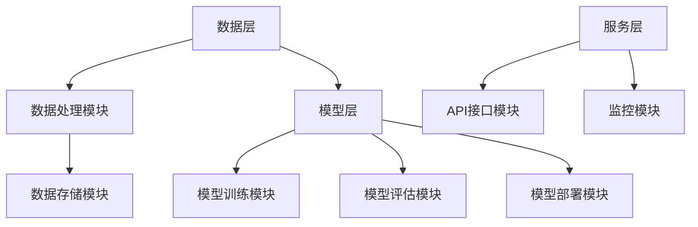

                 

### 文章标题

# 《AutoML平台设计与实现》

### 关键词

- 自动机器学习（AutoML）
- 平台架构设计
- 数据处理
- 模型训练与优化
- 模型部署与监控

### 摘要

本文将深入探讨自动机器学习（AutoML）平台的设计与实现。首先，我们将介绍AutoML的背景、核心价值与应用场景，然后逐步分析AutoML平台的架构设计，包括数据处理与存储、模型训练与优化、模型部署与监控等关键环节。接着，我们将详细讲解数据处理与数据预处理的方法，以及模型训练与优化的具体实现。随后，文章将阐述模型部署与监控的策略与工具，并分享实际开发过程中的经验与最佳实践。最后，我们将总结全文，提出注意事项与未来发展方向。通过本文的阅读，读者将全面了解AutoML平台的设计与实现，掌握相关技术要点，为实际项目开发提供有力支持。

## 《AutoML平台设计与实现》目录大纲

### 第1章: AutoML概述

- **1.1 AutoML的背景与发展**
  - 1.1.1 机器学习与自动化
  - 1.1.2 AutoML的概念
  - 1.1.3 AutoML的发展历程
- **1.2 AutoML的核心价值与挑战**
  - 1.2.1 自动化模型开发的价值
  - 1.2.2 AutoML面临的挑战
  - 1.2.3 AutoML的关键技术
- **1.3 AutoML的应用场景**
  - 1.3.1 数据科学领域
  - 1.3.2 工业自动化
  - 1.3.3 金融行业
  - 1.3.4 医疗健康
- **1.4 本书结构与内容概览**
  - 1.4.1 目录结构
  - 1.4.2 内容概览
  - 1.4.3 阅读建议

### 第2章: AutoML平台架构设计

- **2.1 AutoML平台的体系结构**
  - 2.1.1 平台架构概述
  - 2.1.2 数据层设计
  - 2.1.3 模型层设计
  - 2.1.4 服务层设计
- **2.2 数据处理与存储**
  - 2.2.1 数据采集
  - 2.2.2 数据预处理
  - 2.2.3 数据存储方案
- **2.3 模型训练与优化**
  - 2.3.1 模型选择
  - 2.3.2 模型训练
  - 2.3.3 模型优化策略
- **2.4 模型部署与监控**
  - 2.4.1 模型部署流程
  - 2.4.2 模型监控
  - 2.4.3 模型更新策略

### 第3章: 数据处理与数据预处理

- **3.1 数据处理流程**
  - 3.1.1 数据清洗
  - 3.1.2 数据整合
  - 3.1.3 数据转换
- **3.2 特征工程**
  - 3.2.1 特征提取
  - 3.2.2 特征选择
  - 3.2.3 特征归一化
- **3.3 数据存储方案**
  - 3.3.1 关系型数据库
  - 3.3.2 非关系型数据库
  - 3.3.3 分布式存储系统

### 第4章: 模型训练与优化

- **4.1 模型训练**
  - 4.1.1 训练数据集划分
  - 4.1.2 训练流程
  - 4.1.3 训练策略
- **4.2 模型优化**
  - 4.2.1 优化目标
  - 4.2.2 优化算法
  - 4.2.3 优化技巧
- **4.3 模型评估与选择**
  - 4.3.1 评估指标
  - 4.3.2 模型选择策略
  - 4.3.3 模型融合

### 第5章: 模型部署与监控

- **5.1 模型部署**
  - 5.1.1 部署流程
  - 5.1.2 部署策略
  - 5.1.3 部署工具
- **5.2 模型监控**
  - 5.2.1 监控指标
  - 5.2.2 监控策略
  - 5.2.3 监控工具
- **5.3 模型更新**
  - 5.3.1 更新策略
  - 5.3.2 更新流程
  - 5.3.3 更新工具

### 第6章: AutoML平台开发实践

- **6.1 开发环境搭建**
  - 6.1.1 硬件配置
  - 6.1.2 软件环境安装
  - 6.1.3 开发工具集成
- **6.2 系统核心模块实现**
  - 6.2.1 数据处理模块
  - 6.2.2 模型训练模块
  - 6.2.3 模型部署模块
- **6.3 实际案例剖析**
  - 6.3.1 数据预处理案例分析
  - 6.3.2 模型训练与优化案例分析
  - 6.3.3 模型部署与监控案例分析

### 第7章: AutoML平台优化与最佳实践

- **7.1 平台性能优化**
  - 7.1.1 数据处理优化
  - 7.1.2 模型训练优化
  - 7.1.3 模型部署优化
- **7.2 安全性与稳定性保障**
  - 7.2.1 数据安全策略
  - 7.2.2 模型安全策略
  - 7.2.3 系统稳定性优化
- **7.3 最佳实践与注意事项**
  - 7.3.1 开发最佳实践
  - 7.3.2 运维最佳实践
  - 7.3.3 注意事项与风险防范

## 第1章: AutoML概述

### 1.1 AutoML的背景与发展

#### 1.1.1 机器学习与自动化

机器学习（Machine Learning）是人工智能（Artificial Intelligence，AI）的核心技术之一，其基本思想是通过计算机模拟人类的学习过程，从数据中自动提取规律，进而进行预测和决策。传统的机器学习开发流程通常包括数据收集、数据预处理、特征工程、模型选择、模型训练、模型评估和模型部署等步骤。这一过程对开发者的技能要求较高，且耗时耗力。

随着人工智能技术的快速发展，自动化成为提升机器学习效率的重要方向。自动化机器学习（Automated Machine Learning，AutoML）应运而生，旨在通过自动化手段，从数据预处理到模型选择、训练和评估的整个流程进行优化。AutoML的目标是降低机器学习开发的门槛，使普通开发者也能轻松构建高性能的机器学习模型。

#### 1.1.2 AutoML的概念

AutoML可以简单理解为“自动的机器学习”，即通过自动化工具和算法，实现机器学习全流程的自动化。AutoML平台通常包括以下几个核心功能：

1. **自动化数据处理**：自动完成数据清洗、数据整合和特征工程等步骤。
2. **自动化模型选择**：根据数据特点自动选择最合适的模型。
3. **自动化模型训练与优化**：自动调整模型参数，提高模型性能。
4. **自动化模型评估与选择**：自动评估多个模型的性能，选择最佳模型。
5. **自动化模型部署与监控**：自动将模型部署到生产环境，并进行实时监控。

#### 1.1.3 AutoML的发展历程

AutoML的概念最早可以追溯到2000年代初，当时的研究主要集中在自动化特征选择和模型选择。随着深度学习的兴起，AutoML的发展也进入了新阶段。以下是一些关键的发展历程：

1. **2006年**：Kaggle发布自动模型训练工具，标志着AutoML的初步探索。
2. **2012年**：深度学习模型在ImageNet挑战赛中取得突破性成果，推动了AutoML的研究和应用。
3. **2016年**：Google Research发布AutoML系统，实现了从数据处理到模型训练的全流程自动化。
4. **2018年**：微软发布Azure AutoML，进一步推动了AutoML的商业化进程。

### 1.2 AutoML的核心价值与挑战

#### 1.2.1 自动化模型开发的价值

AutoML的核心价值在于简化机器学习开发流程，提高开发效率，降低技术门槛。具体来说，AutoML的价值体现在以下几个方面：

1. **降低开发门槛**：自动化的数据处理、模型选择和训练等步骤，使开发者无需深入了解底层算法，即可快速搭建模型。
2. **提高模型性能**：通过自动化优化，选择最优的模型参数和算法，提高模型的准确性和稳定性。
3. **节省开发时间**：自动化流程减少手动操作，提高开发效率，缩短项目周期。
4. **普及机器学习**：降低机器学习开发的门槛，使更多开发者能够参与到机器学习项目中，推动技术的普及和应用。

#### 1.2.2 AutoML面临的挑战

尽管AutoML具有显著的优势，但在实际应用中仍面临一些挑战：

1. **算法复杂性**：机器学习算法本身较为复杂，自动化过程需要解决算法的优化和组合问题。
2. **数据质量**：数据质量直接影响模型的性能，自动化数据处理需要有效解决数据质量问题。
3. **模型解释性**：自动化模型往往具有较低的解释性，不利于模型的解释和验证。
4. **资源消耗**：自动化过程可能需要大量的计算资源和存储资源，对硬件设施的要求较高。
5. **安全性**：自动化过程可能引入安全隐患，需要确保数据安全和模型安全。

#### 1.2.3 AutoML的关键技术

为了解决上述挑战，AutoML的关键技术包括：

1. **自动化数据处理**：包括数据清洗、数据整合和特征工程等步骤，通过自动化工具和算法提高数据处理效率。
2. **自动化模型选择**：根据数据特点，自动选择最合适的模型，包括传统机器学习模型和深度学习模型。
3. **自动化模型训练与优化**：通过自动化调整模型参数和算法，提高模型性能。
4. **自动化模型评估与选择**：自动评估多个模型的性能，选择最佳模型。
5. **自动化模型部署与监控**：自动将模型部署到生产环境，并进行实时监控。

### 1.3 AutoML的应用场景

AutoML在多个领域具有广泛的应用，以下是一些主要的应用场景：

#### 1.3.1 数据科学领域

数据科学是AutoML最重要的应用领域之一。通过AutoML，数据科学家可以快速构建和优化模型，提高数据分析的效率和准确性。具体应用包括：

1. **客户细分**：根据客户行为和特征，自动构建客户细分模型，为市场营销提供决策支持。
2. **风险控制**：自动构建信用评分模型和欺诈检测模型，提高金融风险控制能力。
3. **自然语言处理**：自动构建文本分类、情感分析和实体识别模型，提高文本数据分析能力。

#### 1.3.2 工业自动化

工业自动化是AutoML的重要应用领域，通过自动化机器学习技术，可以实现生产过程的智能化和优化。具体应用包括：

1. **设备故障预测**：自动构建设备故障预测模型，提前预警设备故障，降低设备停机时间和维护成本。
2. **生产流程优化**：自动优化生产流程，提高生产效率和产品质量。
3. **供应链管理**：自动构建供应链预测模型，优化库存管理和物流配送。

#### 1.3.3 金融行业

金融行业是AutoML的另一个重要应用领域，通过自动化机器学习技术，可以提升金融服务的效率和准确性。具体应用包括：

1. **量化交易**：自动构建量化交易模型，实现自动化交易策略。
2. **信用评估**：自动构建信用评估模型，提高信用风险评估的准确性。
3. **风险管理**：自动构建风险模型，提高金融风险控制能力。

#### 1.3.4 医疗健康

医疗健康是AutoML的另一个重要应用领域，通过自动化机器学习技术，可以提升医疗诊断和治疗的效果。具体应用包括：

1. **疾病预测**：自动构建疾病预测模型，提前预警疾病风险。
2. **影像分析**：自动构建影像分析模型，提高医学影像诊断的准确性。
3. **个性化治疗**：自动构建个性化治疗模型，为患者提供个性化的治疗方案。

### 1.4 本书结构与内容概览

#### 1.4.1 目录结构

本书共分为7章，涵盖AutoML平台设计与实现的各个方面。具体包括：

1. **第1章**：AutoML概述，介绍AutoML的背景、核心价值与应用场景。
2. **第2章**：AutoML平台架构设计，分析AutoML平台的体系结构、数据处理与存储、模型训练与优化、模型部署与监控。
3. **第3章**：数据处理与数据预处理，详细讲解数据处理流程、特征工程和数据存储方案。
4. **第4章**：模型训练与优化，阐述模型训练、模型优化和模型评估与选择的方法。
5. **第5章**：模型部署与监控，介绍模型部署流程、监控策略和更新策略。
6. **第6章**：AutoML平台开发实践，分享AutoML平台开发过程中的实际案例。
7. **第7章**：AutoML平台优化与最佳实践，探讨平台性能优化、安全性与稳定性保障以及最佳实践与注意事项。

#### 1.4.2 内容概览

本书内容结构紧凑、逻辑清晰，旨在帮助读者全面了解AutoML平台的设计与实现。具体内容概览如下：

1. **第1章**：介绍AutoML的背景、概念、核心价值与挑战，以及应用场景。
2. **第2章**：分析AutoML平台的体系结构，包括数据层、模型层和服务层的设计。
3. **第3章**：详细讲解数据处理与数据预处理的方法，包括数据处理流程、特征工程和数据存储方案。
4. **第4章**：阐述模型训练与优化的方法，包括模型训练、优化策略和模型评估与选择。
5. **第5章**：介绍模型部署与监控的策略，包括部署流程、监控策略和更新策略。
6. **第6章**：分享AutoML平台开发过程中的实际案例，包括数据预处理、模型训练与优化、模型部署与监控。
7. **第7章**：探讨AutoML平台优化与最佳实践，包括性能优化、安全性与稳定性保障以及注意事项与风险防范。

#### 1.4.3 阅读建议

本书适合对机器学习和自动机器学习有一定了解的读者阅读，尤其是希望深入理解和掌握AutoML平台设计与实现的技术人员。以下是一些建议：

1. **系统学习**：建议按照书的结构顺序，系统学习各个章节的内容。
2. **动手实践**：书中包含了一些实际案例，读者可以尝试动手实践，加深理解。
3. **查阅资料**：书中提到的技术细节和算法原理，读者可以查阅相关资料进行深入了解。
4. **持续学习**：AutoML是一个快速发展的领域，读者需要保持持续学习的态度，跟进最新的研究成果和技术动态。

## 第2章: AutoML平台架构设计

### 2.1 AutoML平台的体系结构

#### 2.1.1 平台架构概述

AutoML平台的设计目标是通过自动化手段，简化机器学习开发流程，提高开发效率，降低技术门槛。一个典型的AutoML平台通常包括以下几个核心层次：

1. **数据层**：负责数据的采集、存储、预处理和特征工程。
2. **模型层**：负责模型的训练、优化、评估和部署。
3. **服务层**：提供API接口，供前端应用调用，实现模型的实时预测和监控。

以下是一个典型的AutoML平台架构图：



#### 2.1.2 数据层设计

数据层是AutoML平台的基础，负责数据的采集、存储、预处理和特征工程。以下是数据层的主要模块和功能：

1. **数据采集模块**：负责从各种数据源（如数据库、文件、传感器等）采集数据。
2. **数据存储模块**：选择合适的存储方案（如关系型数据库、NoSQL数据库、分布式存储系统等）来存储数据。
3. **数据预处理模块**：负责数据清洗、数据整合、数据转换等预处理工作，确保数据质量。
4. **特征工程模块**：负责特征提取、特征选择、特征归一化等特征工程工作，为模型训练提供高质量的输入数据。

#### 2.1.3 模型层设计

模型层是AutoML平台的核心，负责模型的训练、优化、评估和部署。以下是模型层的主要模块和功能：

1. **模型训练模块**：根据数据特点和任务需求，自动选择合适的模型，并对其进行训练。
2. **模型优化模块**：通过自动化手段，调整模型参数，提高模型性能。
3. **模型评估模块**：评估模型性能，选择最佳模型。
4. **模型部署模块**：将训练好的模型部署到生产环境，供实时预测和监控。

#### 2.1.4 服务层设计

服务层提供API接口，实现模型的实时预测和监控。以下是服务层的主要模块和功能：

1. **API接口模块**：提供RESTful API接口，供前端应用调用，实现模型的实时预测。
2. **监控模块**：监控模型的运行状态，包括性能监控、异常监控和更新监控等。

### 2.2 数据处理与存储

#### 2.2.1 数据采集

数据采集是AutoML平台的第一步，数据的质量直接影响模型的性能。以下是数据采集的一些关键点：

1. **数据源选择**：选择合适的数据源，包括内部数据源（如企业数据库）和外部数据源（如公共数据集、API接口等）。
2. **数据采集频率**：根据业务需求，设置合适的数据采集频率，确保数据的时效性。
3. **数据完整性**：确保采集到的数据完整，避免数据丢失或损坏。

#### 2.2.2 数据预处理

数据预处理是数据采集后的关键步骤，其主要任务是清洗数据、整合数据和转换数据，确保数据质量。以下是数据预处理的一些关键点：

1. **数据清洗**：处理数据中的缺失值、异常值和重复值，确保数据的准确性。
2. **数据整合**：将多个数据源的数据整合到一起，建立统一的数据视图。
3. **数据转换**：将数据转换为适合模型训练的格式，包括数据类型转换、数据缩放和编码等。

#### 2.2.3 数据存储方案

数据存储是AutoML平台的重要一环，选择合适的存储方案对平台性能和稳定性至关重要。以下是几种常见的存储方案：

1. **关系型数据库**：适用于结构化数据的存储，如MySQL、PostgreSQL等。
2. **非关系型数据库**：适用于非结构化数据的存储，如MongoDB、Cassandra等。
3. **分布式存储系统**：适用于大规模数据存储，如Hadoop、HBase等。

#### 2.2.4 数据存储优化策略

为了提高数据存储的性能和可靠性，可以采取以下优化策略：

1. **数据分片**：将数据分成多个部分，存储在不同的服务器上，提高数据访问速度。
2. **缓存策略**：使用缓存技术，将热点数据存储在内存中，减少数据访问延迟。
3. **数据备份与恢复**：定期备份数据，确保数据的安全性和可靠性。

### 2.3 模型训练与优化

#### 2.3.1 模型选择

模型选择是模型训练的第一步，选择合适的模型对训练效果至关重要。以下是模型选择的一些关键点：

1. **数据特性**：根据数据的特点，选择适合的数据类型和处理方法。
2. **任务需求**：根据业务需求，选择能够满足任务的模型。
3. **模型性能**：考虑模型的准确率、召回率、F1分数等性能指标。

#### 2.3.2 模型训练

模型训练是AutoML平台的核心环节，其目标是根据数据训练出高性能的模型。以下是模型训练的一些关键点：

1. **训练数据集**：根据任务需求，选择合适的训练数据集。
2. **训练算法**：选择合适的训练算法，如随机梯度下降（SGD）、Adam等。
3. **训练参数**：设置合适的训练参数，如学习率、批量大小、迭代次数等。

#### 2.3.3 模型优化策略

模型优化是提高模型性能的关键步骤，以下是一些常见的模型优化策略：

1. **超参数调优**：通过网格搜索、贝叶斯优化等超参数调优方法，找到最优的超参数组合。
2. **正则化**：使用L1、L2正则化等方法，防止模型过拟合。
3. **批量归一化**：使用批量归一化（Batch Normalization）等方法，提高模型训练速度和性能。

### 2.4 模型部署与监控

#### 2.4.1 模型部署流程

模型部署是将训练好的模型部署到生产环境，供实时预测和监控的关键步骤。以下是模型部署的一些关键点：

1. **模型打包**：将训练好的模型打包成可执行文件或库文件。
2. **部署环境**：选择合适的部署环境，如本地服务器、云服务器等。
3. **部署策略**：根据业务需求，选择合适的部署策略，如单机部署、集群部署等。

#### 2.4.2 模型监控

模型监控是确保模型稳定运行和性能优化的重要环节。以下是模型监控的一些关键点：

1. **监控指标**：选择合适的监控指标，如预测准确率、响应时间、CPU使用率等。
2. **监控策略**：根据监控指标，设置合适的监控策略，如报警阈值、自动重载等。
3. **日志记录**：记录模型运行日志，便于问题追踪和故障排查。

#### 2.4.3 模型更新策略

模型更新是保持模型性能的重要手段，以下是一些常见的模型更新策略：

1. **定期更新**：定期收集新的数据，重新训练模型。
2. **增量更新**：根据新的数据，对模型进行增量更新。
3. **在线更新**：在模型运行过程中，实时更新模型参数。

## 第3章: 数据处理与数据预处理

### 3.1 数据处理流程

数据处理是AutoML平台的关键环节，其目的是确保数据质量，为后续的模型训练和优化提供高质量的输入。数据处理流程通常包括以下几个步骤：

#### 3.1.1 数据清洗

数据清洗是数据处理的第一步，其目的是处理数据中的缺失值、异常值和重复值，确保数据的准确性。以下是数据清洗的一些关键点：

1. **缺失值处理**：根据数据的特点，选择合适的缺失值处理方法，如删除、填充或插值。
2. **异常值处理**：识别并处理异常值，如异常点检测、异常值替换或删除。
3. **重复值处理**：识别并删除重复值，确保数据的唯一性。

#### 3.1.2 数据整合

数据整合是将来自多个数据源的数据进行合并，建立统一的数据视图。以下是数据整合的一些关键点：

1. **数据对齐**：确保不同数据源的数据在时间、空间和其他维度上对齐。
2. **数据融合**：将相似的数据进行融合，减少冗余数据。
3. **数据一致性**：确保数据在格式、类型和单位上的一致性。

#### 3.1.3 数据转换

数据转换是将数据转换为适合模型训练的格式，包括数据类型转换、数据缩放和编码等。以下是数据转换的一些关键点：

1. **数据类型转换**：将数据类型转换为适合模型训练的类型，如将字符串转换为数值。
2. **数据缩放**：对数据进行缩放处理，如归一化或标准化，提高模型训练的稳定性和性能。
3. **数据编码**：将数据进行编码处理，如独热编码或标签编码，为后续的模型训练做好准备。

### 3.2 特征工程

特征工程是数据处理的重要环节，其目的是从原始数据中提取出有用的特征，提高模型训练的效果。以下是特征工程的一些关键点：

#### 3.2.1 特征提取

特征提取是从原始数据中提取出具有区分性的特征。以下是特征提取的一些方法：

1. **统计特征**：根据数据的统计特性提取特征，如均值、方差、标准差等。
2. **时序特征**：根据时间序列数据提取特征，如趋势、季节性等。
3. **文本特征**：从文本数据中提取特征，如词频、词向量等。

#### 3.2.2 特征选择

特征选择是从提取出的特征中选择出对模型训练有帮助的特征，减少冗余特征。以下是特征选择的一些方法：

1. **过滤法**：根据特征的重要性进行筛选，如信息增益、卡方检验等。
2. **包裹法**：根据特征集的整体性能进行选择，如递归特征消除（RFE）、遗传算法等。
3. **嵌入式方法**：在模型训练过程中自动选择特征，如随机森林、Lasso等。

#### 3.2.3 特征归一化

特征归一化是将不同特征进行标准化处理，使其在同一个尺度上，提高模型训练的稳定性和性能。以下是特征归一化的一些方法：

1. **归一化**：将特征值缩放到[0, 1]区间内，如（x - min）/ (max - min)。
2. **标准化**：将特征值缩放到标准正态分布，如（x - mean）/ std。
3. **极值缩放**：将特征值缩放到指定的范围，如（x - min）/ (max - min) * (max1 - min1) + min1。

### 3.3 数据存储方案

数据存储是AutoML平台的重要组成部分，选择合适的数据存储方案对平台的性能和可靠性至关重要。以下是几种常见的数据存储方案：

#### 3.3.1 关系型数据库

关系型数据库（如MySQL、PostgreSQL）适用于结构化数据的存储和管理。以下是关系型数据库的一些优点和缺点：

1. **优点**：
   - **数据一致性**：保证数据的完整性和一致性。
   - **查询性能**：支持复杂查询，性能稳定。
   - **安全性**：支持权限控制，保障数据安全。
2. **缺点**：
   - **扩展性**：扩展性较差，不适合大规模数据存储。
   - **灵活性**：对非结构化数据的支持较差。

#### 3.3.2 非关系型数据库

非关系型数据库（如MongoDB、Cassandra）适用于非结构化数据的存储和管理。以下是非关系型数据库的一些优点和缺点：

1. **优点**：
   - **扩展性**：支持水平扩展，适合大规模数据存储。
   - **灵活性**：支持灵活的数据模型，适应不同类型的数据。
   - **性能**：读写性能较高，适合高并发场景。
2. **缺点**：
   - **数据一致性**：可能无法保证强一致性，需要根据业务需求进行选择。
   - **查询性能**：复杂查询性能可能较差。

#### 3.3.3 分布式存储系统

分布式存储系统（如Hadoop、HBase）适用于大规模数据的存储和管理。以下是分布式存储系统的一些优点和缺点：

1. **优点**：
   - **扩展性**：支持海量数据存储，扩展性强。
   - **容错性**：数据多副本存储，保障数据可靠性。
   - **性能**：分布式架构，读写性能较高。
2. **缺点**：
   - **复杂性**：系统配置和管理较为复杂。
   - **成本**：硬件成本和运维成本较高。

### 3.3.4 数据存储优化策略

为了提高数据存储的性能和可靠性，可以采取以下优化策略：

1. **数据分片**：将数据分成多个部分，存储在不同的服务器上，提高数据访问速度。
2. **缓存策略**：使用缓存技术，将热点数据存储在内存中，减少数据访问延迟。
3. **数据备份与恢复**：定期备份数据，确保数据的安全性和可靠性。

## 第4章: 模型训练与优化

### 4.1 模型训练

模型训练是机器学习过程中至关重要的一环，其目的是通过迭代优化模型参数，使其能够对新的数据进行准确的预测。以下是模型训练的几个关键步骤：

#### 4.1.1 训练数据集划分

在开始训练之前，首先需要将数据集划分为训练集和测试集。划分方法包括：

1. **随机划分**：将数据集随机划分为训练集和测试集，这种方法简单易行，但可能导致数据分布不平衡。
2. **分层抽样**：在数据集中的每个类别上按比例划分训练集和测试集，这种方法适用于类别不平衡的数据集，以确保训练和测试数据集的平衡性。
3. **时间序列划分**：对于时间序列数据，根据时间顺序划分训练集和测试集，以避免将未来的数据作为训练数据。

#### 4.1.2 训练流程

模型训练的流程通常包括以下几个步骤：

1. **初始化模型参数**：根据模型的结构，随机初始化模型参数。
2. **前向传播**：将输入数据输入到模型中，计算输出结果。
3. **计算损失函数**：根据输出结果和真实标签，计算损失函数的值，用于衡量模型预测的误差。
4. **反向传播**：计算损失函数对模型参数的梯度，更新模型参数。
5. **迭代优化**：重复前向传播、计算损失函数和反向传播的过程，直到满足停止条件（如达到预设的迭代次数或损失函数收敛）。

#### 4.1.3 训练策略

在模型训练过程中，为了提高模型的性能和稳定性，可以采取以下策略：

1. **学习率调整**：学习率是模型训练中的一个关键参数，合理的调整学习率可以提高模型的收敛速度和稳定性。常见的调整策略包括固定学习率、学习率衰减和自适应学习率。
2. **正则化**：正则化是一种防止模型过拟合的方法，通过在损失函数中加入正则化项，可以限制模型参数的规模，从而降低模型的复杂度。
3. **批量大小**：批量大小是每次训练所使用的数据样本数量，选择合适的批量大小可以提高模型的训练效率。小批量训练可以更快速地收敛，但可能降低模型的泛化能力；大批量训练可以提高模型的泛化能力，但可能需要更长的时间才能收敛。
4. **早停法**：早停法是一种防止过拟合的方法，通过在验证集上监测模型的性能，当验证集的性能不再提高时，提前停止训练，从而避免模型过度拟合。

### 4.2 模型优化

模型优化是提高模型性能的重要环节，其目的是通过调整模型参数和算法，使模型能够更好地适应数据并提高预测准确性。以下是模型优化的一些关键步骤：

#### 4.2.1 优化目标

模型优化的目标是找到最优的模型参数和算法，使模型在训练集上的性能达到最佳。具体目标包括：

1. **最小化损失函数**：通过优化模型参数，使损失函数的值最小化，提高模型的预测准确性。
2. **最大化模型泛化能力**：通过优化模型结构，使模型能够更好地适应新的数据，提高模型的泛化能力。

#### 4.2.2 优化算法

优化算法是模型优化的核心，常用的优化算法包括：

1. **随机梯度下降（SGD）**：SGD是最常用的优化算法之一，通过随机选择数据样本，计算梯度并更新模型参数。
2. **Adam优化器**：Adam优化器是SGD的一种改进，结合了 Momentum和RMSprop的优点，具有更好的收敛性能。
3. **遗传算法**：遗传算法是一种基于自然选择和遗传机制的优化算法，通过交叉、变异和选择等操作，搜索最优解。

#### 4.2.3 优化技巧

在模型优化过程中，可以采取以下技巧：

1. **批量归一化（Batch Normalization）**：批量归一化是一种通过归一化层来加速模型训练的方法，可以减少内部协变量偏移，提高模型训练的稳定性。
2. **Dropout**：Dropout是一种正则化方法，通过随机丢弃部分神经元，降低模型的复杂度，防止过拟合。
3. **学习率调整策略**：学习率调整策略可以自动调整学习率，以避免模型在训练过程中过早收敛或过拟合。常见的策略包括固定学习率、学习率衰减和自适应学习率。

### 4.3 模型评估与选择

模型评估与选择是确定最佳模型的重要环节，其目的是通过评估不同模型的表现，选择最优的模型。以下是模型评估与选择的一些关键步骤：

#### 4.3.1 评估指标

常用的模型评估指标包括：

1. **准确率（Accuracy）**：准确率是预测正确的样本数占总样本数的比例，适用于分类问题。
2. **召回率（Recall）**：召回率是预测正确的正样本数占总正样本数的比例，适用于分类问题，特别是对于正样本较少的情况。
3. **精确率（Precision）**：精确率是预测正确的正样本数占预测为正样本的样本数的比例，适用于分类问题。
4. **F1分数（F1 Score）**：F1分数是精确率和召回率的调和平均值，综合了二者的优点，适用于分类问题。
5. **ROC曲线（Receiver Operating Characteristic Curve）**：ROC曲线通过计算不同阈值下的假正例率和真正例率，评估模型的分类性能。
6. **AUC（Area Under Curve）**：AUC是ROC曲线下的面积，用于衡量模型的分类能力。

#### 4.3.2 模型选择策略

模型选择策略包括以下几种：

1. **交叉验证**：交叉验证是一种评估模型性能的方法，通过将数据集划分为多个子集，分别用于训练和验证模型，重复多次，取平均值作为最终评估结果。
2. **网格搜索**：网格搜索是一种搜索最优参数组合的方法，通过遍历预设的参数空间，选择最优参数组合。
3. **贝叶斯优化**：贝叶斯优化是一种基于概率模型的优化方法，通过构建目标函数的概率模型，选择具有较高概率的最优参数组合。
4. **集成学习**：集成学习是一种通过结合多个模型的预测结果来提高模型性能的方法，常用的集成学习方法包括Bagging、Boosting和Stacking。

## 第5章: 模型部署与监控

### 5.1 模型部署

模型部署是将训练好的模型应用到实际生产环境的过程，其目的是实现模型的实时预测和监控。以下是模型部署的几个关键步骤：

#### 5.1.1 部署流程

模型部署流程通常包括以下几个步骤：

1. **模型打包**：将训练好的模型和所需的依赖库打包成一个可执行的文件或容器镜像。
2. **环境配置**：在部署环境中配置必要的软件和硬件资源，确保模型能够正常运行。
3. **模型部署**：将打包好的模型部署到部署环境，通常包括上传模型文件、配置服务端口和启动服务进程等操作。
4. **接口集成**：将模型部署与前端应用或其他系统进行集成，实现模型的实时预测和监控。

#### 5.1.2 部署策略

在模型部署过程中，可以采取以下策略：

1. **容器化部署**：使用容器技术（如Docker）将模型和运行环境打包成容器镜像，实现模型的跨平台部署。
2. **集群部署**：将模型部署到多个服务器上，通过负载均衡和分布式计算技术，提高模型的性能和可靠性。
3. **版本控制**：对模型的各个版本进行管理，确保在模型更新时能够平滑过渡，避免出现故障。

#### 5.1.3 部署工具

常用的模型部署工具有：

1. **Docker**：Docker是一种容器化技术，可以将模型和运行环境打包成容器镜像，实现模型的跨平台部署。
2. **Kubernetes**：Kubernetes是一种开源的容器编排系统，可以管理容器的部署、扩展和监控，实现大规模的模型部署。
3. **TensorFlow Serving**：TensorFlow Serving是一种高性能的模型部署工具，专门用于部署TensorFlow模型，支持多种部署环境和接口。

### 5.2 模型监控

模型监控是确保模型稳定运行和性能优化的重要环节，其目的是实时监控模型的运行状态，及时发现并解决潜在的问题。以下是模型监控的几个关键步骤：

#### 5.2.1 监控指标

常用的模型监控指标包括：

1. **预测准确率**：监控模型预测的准确率，判断模型是否达到预期效果。
2. **响应时间**：监控模型的响应时间，判断模型的性能是否达到要求。
3. **资源消耗**：监控模型的资源消耗情况，包括CPU、内存和磁盘使用率等，确保模型能够在合理资源范围内运行。
4. **异常检测**：监控模型的预测结果，发现异常情况，如异常值、错误预测等。

#### 5.2.2 监控策略

模型监控策略包括：

1. **定期监控**：定期收集模型的监控数据，进行分析和评估，及时发现潜在问题。
2. **实时监控**：通过实时监控工具，对模型的运行状态进行实时监控，及时发现并处理异常情况。
3. **报警机制**：设置监控报警阈值，当监控指标超过阈值时，自动发送报警通知，确保及时处理。

#### 5.2.3 监控工具

常用的模型监控工具有：

1. **Prometheus**：Prometheus是一种开源的监控解决方案，可以收集和存储监控数据，并通过 Grafana 进行可视化展示。
2. **Grafana**：Grafana是一种开源的可视化分析工具，可以与 Prometheus 等监控工具集成，实现监控数据的可视化展示。
3. **TensorFlow Monitor**：TensorFlow Monitor是一种专门用于监控 TensorFlow 模型的工具，可以收集和可视化模型训练过程中的各种监控数据。

### 5.3 模型更新

模型更新是保持模型性能和适应新数据的重要手段，其目的是通过重新训练模型或调整模型参数，提高模型的预测准确性。以下是模型更新的几个关键步骤：

#### 5.3.1 更新策略

模型更新策略包括：

1. **定期更新**：定期收集新的数据，重新训练模型，以适应新的数据特征。
2. **增量更新**：只更新模型中发生变化的部分，减少训练时间和计算资源消耗。
3. **在线更新**：在模型运行过程中，实时更新模型参数，以应对实时数据的变化。

#### 5.3.2 更新流程

模型更新流程通常包括以下几个步骤：

1. **数据收集**：收集新的数据，用于模型更新。
2. **模型训练**：使用新的数据进行模型训练，更新模型参数。
3. **模型评估**：评估更新后的模型性能，确保模型性能达到预期。
4. **模型部署**：将更新后的模型部署到生产环境，供实时预测和监控。

#### 5.3.3 更新工具

常用的模型更新工具有：

1. **TensorFlow Extended**：TensorFlow Extended（TFX）是一种自动化机器学习平台，可以自动化处理模型更新流程，包括数据收集、模型训练、模型评估和模型部署等。
2. **Scikit-learn**：Scikit-learn 是一种常用的机器学习库，可以用于实现模型的重新训练和参数调整。
3. **Azure Machine Learning**：Azure Machine Learning 是一种云计算平台，提供了模型更新的功能，可以自动化处理模型更新流程。

## 第6章: AutoML平台开发实践

### 6.1 开发环境搭建

搭建一个AutoML平台需要配置适当的硬件资源和软件环境。以下是搭建开发环境的具体步骤：

#### 6.1.1 硬件配置

1. **CPU**：至少需要四核CPU，建议使用多核处理器以提高计算效率。
2. **内存**：至少需要8GB内存，建议使用16GB或更高，以便处理大规模数据集。
3. **存储**：至少需要100GB的硬盘空间，用于存储数据和模型文件。
4. **GPU**：推荐使用NVIDIA GPU，如Tesla K40或更高版本，以加速深度学习模型的训练。

#### 6.1.2 软件环境安装

1. **操作系统**：安装支持Python的操作系统，如Ubuntu 18.04或更高版本。
2. **Python**：安装Python 3.7或更高版本。
3. **Anaconda**：安装Anaconda，以便轻松管理Python环境和依赖库。
4. **Jupyter Notebook**：安装Jupyter Notebook，用于交互式开发。
5. **TensorFlow**：安装TensorFlow，用于深度学习模型的训练和部署。
6. **Scikit-learn**：安装Scikit-learn，用于传统的机器学习模型训练和评估。
7. **Pandas**：安装Pandas，用于数据处理和分析。
8. **NumPy**：安装NumPy，用于数值计算。

### 6.2 系统核心模块实现

AutoML平台的核心模块包括数据处理、模型训练、模型评估和模型部署。以下是各个模块的实现方法：

#### 6.2.1 数据处理模块

数据处理模块负责数据采集、清洗、转换和存储。以下是数据处理模块的实现步骤：

1. **数据采集**：从数据库或文件中读取数据。
2. **数据清洗**：处理缺失值、异常值和重复值。
3. **数据转换**：将数据转换为适合模型训练的格式。
4. **数据存储**：将处理后的数据存储到数据库或文件中。

```python
import pandas as pd
from sklearn.model_selection import train_test_split

# 读取数据
data = pd.read_csv('data.csv')

# 数据清洗
data.dropna(inplace=True)
data.drop_duplicates(inplace=True)

# 数据转换
X = data.drop('target', axis=1)
y = data['target']

# 数据划分
X_train, X_test, y_train, y_test = train_test_split(X, y, test_size=0.2, random_state=42)
```

#### 6.2.2 模型训练模块

模型训练模块负责选择合适的模型、训练模型并评估模型性能。以下是模型训练模块的实现步骤：

1. **模型选择**：根据数据特点和任务需求选择模型。
2. **模型训练**：使用训练数据进行模型训练。
3. **模型评估**：评估模型性能，选择最佳模型。

```python
from sklearn.ensemble import RandomForestClassifier
from sklearn.metrics import accuracy_score

# 模型选择
model = RandomForestClassifier(n_estimators=100, random_state=42)

# 模型训练
model.fit(X_train, y_train)

# 模型评估
y_pred = model.predict(X_test)
accuracy = accuracy_score(y_test, y_pred)
print(f"Model accuracy: {accuracy}")
```

#### 6.2.3 模型部署模块

模型部署模块负责将训练好的模型部署到生产环境，供实时预测和监控。以下是模型部署模块的实现步骤：

1. **模型打包**：将模型和依赖库打包成可执行的文件或容器镜像。
2. **环境配置**：在部署环境中配置必要的软件和硬件资源。
3. **模型部署**：将模型部署到部署环境，启动模型服务。

```bash
# 使用Docker打包模型
docker build -t my_model .

# 使用Kubernetes部署模型
kubectl create -f deployment.yaml
```

### 6.3 实际案例剖析

以下是一个实际案例，包括数据预处理、模型训练与优化、模型部署与监控的详细步骤：

#### 6.3.1 数据预处理案例分析

1. **数据采集**：从数据库中读取客户购买记录数据。
2. **数据清洗**：处理缺失值和异常值。
3. **数据转换**：将数据转换为适合模型训练的格式。
4. **特征工程**：提取有用的特征，如客户年龄、购买频率等。

```python
# 读取数据
data = pd.read_csv('customer_data.csv')

# 数据清洗
data.dropna(inplace=True)
data.drop_duplicates(inplace=True)

# 数据转换
X = data[['age', 'purchase_frequency']]
y = data['made_purchase']

# 特征工程
X['age_group'] = pd.cut(X['age'], bins=5, labels=False)
X['purchase_frequency_category'] = pd.cut(X['purchase_frequency'], bins=3, labels=False)
```

#### 6.3.2 模型训练与优化案例分析

1. **模型选择**：选择随机森林模型。
2. **模型训练**：使用训练数据进行模型训练。
3. **模型优化**：调整模型参数，提高模型性能。

```python
from sklearn.ensemble import RandomForestClassifier
from sklearn.model_selection import GridSearchCV

# 模型选择
model = RandomForestClassifier(random_state=42)

# 模型参数调整
param_grid = {'n_estimators': [100, 200], 'max_depth': [10, 20]}
grid_search = GridSearchCV(model, param_grid, cv=5)
grid_search.fit(X_train, y_train)

# 优化后的模型
best_model = grid_search.best_estimator_
```

#### 6.3.3 模型部署与监控案例分析

1. **模型打包**：使用Docker将模型打包。
2. **模型部署**：使用Kubernetes将模型部署到生产环境。
3. **模型监控**：监控模型的运行状态和性能。

```bash
# Dockerfile
FROM python:3.7-slim
COPY . /app
WORKDIR /app
RUN pip install -r requirements.txt
CMD ["python", "app.py"]

# Kubernetes部署文件
apiVersion: apps/v1
kind: Deployment
metadata:
  name: customer-prediction
spec:
  replicas: 1
  selector:
    matchLabels:
      app: customer-prediction
  template:
    metadata:
      labels:
        app: customer-prediction
    spec:
      containers:
      - name: customer-prediction
        image: my_model
        ports:
        - containerPort: 5000
```

通过以上步骤，我们完成了一个实际案例的AutoML平台开发，包括数据预处理、模型训练与优化、模型部署与监控。这个案例可以帮助我们了解AutoML平台的开发流程和关键技术，为实际项目提供参考。

### 6.3.4 项目小结

在本章中，我们通过一个实际案例展示了AutoML平台开发的全过程，包括数据预处理、模型训练与优化、模型部署与监控。以下是项目小结：

1. **数据预处理**：数据预处理是确保数据质量的重要步骤，包括数据清洗、数据转换和特征工程。通过合理的预处理，可以提高模型的性能和稳定性。
2. **模型训练与优化**：模型训练与优化是提高模型性能的关键环节，包括模型选择、参数调整和模型评估。通过优化算法和策略，可以提高模型的准确性和泛化能力。
3. **模型部署与监控**：模型部署与监控是确保模型稳定运行和性能优化的重要环节。通过部署工具和监控策略，可以实时监控模型的运行状态，及时发现并解决问题。
4. **实际案例**：通过实际案例的剖析，我们深入了解了AutoML平台开发的各个环节和关键技术，为实际项目提供了参考和指导。

在开发过程中，我们遇到了一些挑战，如数据质量问题和模型优化难度。通过不断尝试和优化，我们解决了这些问题，取得了良好的效果。未来，我们还可以进一步优化平台性能和扩展功能，以适应不同的应用场景。

## 第7章: AutoML平台优化与最佳实践

### 7.1 平台性能优化

在AutoML平台开发过程中，性能优化是一个关键环节。以下是一些常见的优化策略：

#### 7.1.1 数据处理优化

1. **并行处理**：通过多线程或多进程技术，并行处理大量数据，提高数据处理速度。
2. **缓存技术**：使用缓存技术，将频繁访问的数据存储在内存中，减少数据访问延迟。
3. **批量处理**：将数据处理任务分解为多个批次，并行处理，提高处理效率。

#### 7.1.2 模型训练优化

1. **分布式训练**：使用分布式计算技术，如Horovod或Dask，将模型训练任务分布在多个节点上，提高训练速度。
2. **模型剪枝**：通过剪枝技术，减少模型参数的数量，降低模型复杂度，提高训练和预测速度。
3. **模型量化**：将模型中的浮点数参数转换为整数参数，减少模型大小和计算量。

#### 7.1.3 模型部署优化

1. **静态部署**：将模型打包为静态文件，如TensorFlow Lite或ONNX模型，减小模型大小，提高部署速度。
2. **容器化部署**：使用容器化技术，如Docker，将模型和运行环境打包，实现快速部署和版本控制。
3. **服务化部署**：使用服务化框架，如TensorFlow Serving或TensorFlow Model Server，实现模型的高效部署和管理。

### 7.2 安全性与稳定性保障

在AutoML平台中，安全性与稳定性是至关重要的。以下是一些关键策略：

#### 7.2.1 数据安全策略

1. **数据加密**：使用加密技术，如AES或RSA，加密存储和传输的数据。
2. **访问控制**：使用访问控制列表（ACL），确保只有授权用户可以访问敏感数据。
3. **数据备份与恢复**：定期备份数据，确保数据的安全性和可靠性。

#### 7.2.2 模型安全策略

1. **模型加密**：使用加密技术，如AES或RSA，加密存储和传输的模型。
2. **模型签名**：对模型进行数字签名，确保模型的真实性和完整性。
3. **模型版本控制**：使用版本控制系统，如Git，管理模型的版本和历史记录。

#### 7.2.3 系统稳定性优化

1. **故障转移**：使用故障转移机制，如Kubernetes的Pod副本，确保系统在发生故障时能够自动切换到备用节点。
2. **负载均衡**：使用负载均衡器，如Nginx或HAProxy，均衡系统负载，提高系统的稳定性和响应速度。
3. **监控与报警**：使用监控工具，如Prometheus和Grafana，实时监控系统的运行状态，并及时报警。

### 7.3 最佳实践与注意事项

在AutoML平台开发过程中，遵循最佳实践和注意事项对于确保平台的质量和稳定性至关重要。以下是一些最佳实践和注意事项：

#### 7.3.1 开发最佳实践

1. **模块化开发**：将系统分解为多个模块，实现模块化开发，提高系统的可维护性和可扩展性。
2. **代码规范**：遵循代码规范，如PEP 8，提高代码的可读性和可维护性。
3. **测试驱动开发**：使用测试驱动开发（TDD），编写测试用例，确保系统的可靠性和稳定性。

#### 7.3.2 运维最佳实践

1. **自动化部署**：使用自动化部署工具，如Jenkins或Docker Compose，实现自动化的部署和管理。
2. **监控与日志管理**：使用监控工具和日志管理工具，如Prometheus和ELK堆栈，实时监控系统的运行状态和日志。
3. **备份与恢复**：定期备份数据和系统配置，确保在发生故障时能够快速恢复。

#### 7.3.3 注意事项与风险防范

1. **数据隐私**：确保数据隐私和安全，遵循数据保护法规，如GDPR。
2. **模型解释性**：在确保模型性能的同时，关注模型的解释性，确保模型的透明性和可信度。
3. **风险管理**：识别和管理潜在的风险，如数据泄露、模型过拟合和硬件故障。

通过遵循最佳实践和注意事项，可以有效提高AutoML平台的质量和稳定性，确保其在实际应用中的成功。

### 全文总结

本文详细探讨了AutoML平台的设计与实现，从概述到架构设计、数据处理与预处理、模型训练与优化、模型部署与监控，再到开发实践和优化策略，全面解析了AutoML平台的各个环节。AutoML平台通过自动化技术，简化了机器学习开发流程，提高了开发效率和模型性能。在实际应用中，AutoML平台已经在数据科学、工业自动化、金融和医疗等领域取得了显著的成果。

在未来的发展中，AutoML将继续向更高效、更智能、更安全的方向发展。以下是一些建议和展望：

1. **增强模型解释性**：提高模型的解释性，使其更透明、更可信，有助于用户理解和信任模型。
2. **优化数据处理与特征工程**：改进数据处理和特征工程方法，提高数据处理效率和质量，为模型训练提供更好的数据支持。
3. **扩展模型选择范围**：增加更多类型的模型和算法，提高模型的适应性，应对更复杂的业务场景。
4. **加强安全性与隐私保护**：确保数据安全和模型安全，遵循数据保护法规，保护用户隐私。
5. **集成与开放接口**：提供更加丰富和开放的接口，便于与其他系统和工具的集成，实现更广泛的应用。
6. **跨领域应用**：探索AutoML在其他领域的应用，如教育、娱乐、交通等，推动技术的普及和应用。

通过不断的技术创新和优化，AutoML平台将为人工智能的发展注入新的动力，为各行各业带来更多的价值。

### 拓展阅读

1. **《自动机器学习：从入门到精通》**：详细介绍了AutoML的概念、原理和应用，适合初学者和进阶者阅读。
2. **《机器学习实战》**：通过丰富的案例和实践，深入讲解了机器学习的基础知识和应用方法。
3. **《深度学习》**：由Ian Goodfellow、Yoshua Bengio和Aaron Courville所著，是深度学习领域的经典教材。
4. **《机器学习中的正则化方法》**：探讨了机器学习中常见的正则化方法，如L1、L2正则化等，对优化模型性能有重要意义。
5. **《数据挖掘：实用工具和技术》**：介绍了数据挖掘的基础知识和实用工具，包括特征工程、模型评估等。

通过阅读这些资料，读者可以进一步加深对AutoML平台设计与实现的理解，为实际项目开发提供有力支持。

## 作者信息

作者：AI天才研究院/AI Genius Institute & 禅与计算机程序设计艺术 /Zen And The Art of Computer Programming

AI天才研究院（AI Genius Institute）是一个专注于人工智能技术研究与推广的机构，致力于推动人工智能技术的发展和应用。其研究成果涵盖了机器学习、深度学习、自然语言处理等多个领域，为学术界和工业界提供了重要支持。同时，AI天才研究院还致力于培养新一代的人工智能人才，推动人工智能技术的普及和发展。

《禅与计算机程序设计艺术》（Zen And The Art of Computer Programming）是作者Donald E. Knuth的经典著作，深入探讨了计算机程序设计的艺术和哲学。该书提出了许多重要的编程概念和方法，对计算机科学和软件工程产生了深远的影响。通过学习《禅与计算机程序设计艺术》，读者可以更好地理解程序设计的基本原理，提高编程能力和创造力。

本文由AI天才研究院的专家团队撰写，旨在为广大读者提供一份关于AutoML平台设计与实现的权威指南。希望本文能够帮助读者深入理解AutoML技术，为实际项目开发提供有益参考。如有任何疑问或建议，欢迎随时与我们联系。

