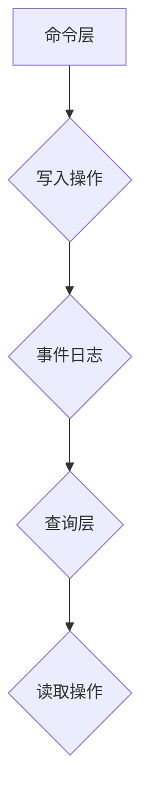

                 


### 1.1.1 传统架构面临的挑战

#### 1.1.1.1 问题背景

随着互联网的飞速发展，现代应用程序的需求变得越来越复杂。传统的架构设计，如单一数据库架构，在面对高并发、高可扩展性和大数据量时，逐渐暴露出一系列问题。这些挑战主要包括：

1. **性能瓶颈**：传统架构中，读写操作都在同一个数据库中完成，随着数据量的增加，查询速度逐渐变慢，导致系统响应时间延长。
2. **扩展性问题**：单点数据库难以水平扩展，当系统访问量激增时，系统的处理能力受限，容易导致系统崩溃。
3. **数据一致性问题**：在并发操作下，传统架构难以保证数据的一致性，例如，在一个事务中，先执行了更新操作，然后执行了查询操作，查询结果可能不包含最新的数据。
4. **复杂的事务管理**：事务管理在传统架构中是一个复杂且耗时的过程，特别是在跨表操作时，需要复杂的SQL语句来保证事务的原子性。

#### 1.1.1.2 CQRS如何解决这些挑战

CQRS（Command Query Responsibility Segregation）模式通过将命令和查询分离，有效地解决了上述挑战。以下是CQRS如何解决这些问题的详细分析：

1. **性能提升**：CQRS模式通过将读写操作分离到不同的数据库中，实现了查询数据库和命令数据库的性能优化。查询数据库专注于提供快速、高效的读操作，而命令数据库则专注于处理写操作。这样，查询操作不会受到写操作的干扰，从而提高了系统的响应速度。
2. **扩展性增强**：由于命令和查询分离，CQRS模式可以轻松实现水平扩展。例如，可以单独扩展查询数据库，以应对日益增长的数据查询需求，而无需担心对写操作的影响。
3. **数据一致性保障**：CQRS模式通过独立管理命令和查询操作，可以更好地控制数据的一致性。例如，命令数据库可以通过补偿事务来保证数据一致性，而查询数据库则可以独立提供一致性的快照数据。
4. **简化事务管理**：在CQRS模式中，命令和查询事务独立处理，从而简化了事务管理。开发者无需在复杂的事务管理中处理跨库操作，降低了代码复杂度和维护成本。

### 1.2 CQRS的基本原理

#### 1.2.1 命令与查询的分离

CQRS模式的核心在于将命令（Command）和查询（Query）分离。具体来说，命令负责数据的写入操作，而查询负责数据的读取操作。这种分离带来了以下几个显著优势：

1. **性能优化**：通过将读写分离，CQRS模式实现了对查询和命令的操作进行优化。查询数据库可以专门设计为高性能的读操作，而命令数据库则专注于处理写入操作，从而提高了系统的整体性能。
2. **可扩展性**：读写分离使得系统可以独立扩展查询和命令层。例如，可以通过增加查询数据库实例来满足日益增长的数据查询需求，而无需担心命令数据库的性能。
3. **数据一致性**：由于命令和查询操作独立处理，CQRS模式可以更好地控制数据的一致性。例如，命令数据库可以通过补偿事务来确保数据一致性，而查询数据库则可以提供一致性的快照数据。

#### 1.2.2 职责分离的优势

职责分离是CQRS模式的核心原则之一，它通过将命令和查询分离到不同的数据库中，实现了以下优势：

1. **简化事务管理**：在CQRS模式中，命令和查询事务独立处理，从而简化了事务管理。开发者无需在复杂的事务管理中处理跨库操作，降低了代码复杂度和维护成本。
2. **提高可维护性**：职责分离使得系统结构更加清晰，易于理解和维护。每个数据库负责自己的读写操作，降低了系统的复杂性，提高了可维护性。
3. **数据一致性控制**：通过职责分离，可以更好地控制数据的一致性。例如，命令数据库可以通过补偿事务来保证数据一致性，而查询数据库则可以独立提供一致性的快照数据。

### 1.3 CQRS的概念属性与特征

#### 1.3.1 命令层与查询层的功能

在CQRS模式中，命令层和查询层分别承担不同的功能：

1. **命令层**：命令层主要负责数据的写入操作，如创建、更新和删除数据。它通常是一个高吞吐量的数据库，设计为能够快速处理大量的写操作。例如，可以使用NoSQL数据库，如MongoDB，来作为命令数据库。
2. **查询层**：查询层主要负责数据的读取操作，如查询、汇总和分析数据。它通常是一个高性能的数据库，设计为能够快速响应用户的查询请求。例如，可以使用关系型数据库，如MySQL，来作为查询数据库。

#### 1.3.2 数据一致性与缓存策略

CQRS模式中的数据一致性是一个关键问题，以下是几种常见的数据一致性和缓存策略：

1. **最终一致性**：在最终一致性模型中，查询数据库不会立即反映命令数据库的最新变化，而是在一段时间后通过补偿事务或消息队列来更新数据。这种策略可以简化系统设计，但可能会导致查询数据延迟。
2. **强一致性**：在强一致性模型中，查询数据库会立即反映命令数据库的最新变化。这种策略可以确保数据一致性，但可能需要复杂的同步机制，如分布式锁或两阶段提交协议。
3. **缓存策略**：为了提高查询性能，CQRS模式通常使用缓存策略。例如，可以使用Redis作为查询数据库的缓存层，减少对查询数据库的直接访问，从而提高系统性能。

### 1.4 CQRS应用场景

CQRS模式适用于多种应用场景，以下是几个典型的例子：

1. **电子商务系统**：电子商务系统通常需要处理大量的订单和查询操作。通过CQRS模式，可以独立扩展订单数据库（命令层）和商品数据库（查询层），提高系统的性能和可扩展性。
2. **实时数据分析**：实时数据分析系统需要快速响应大量的查询请求。通过CQRS模式，可以将实时数据存储在命令数据库中，而将数据分析结果存储在查询数据库中，从而实现高效的查询操作。

### 总结

CQRS模式通过将命令和查询分离，解决了传统架构中的性能瓶颈、扩展性和数据一致性问题。其核心原理是职责分离，通过分离命令层和查询层，实现了性能优化、可扩展性和数据一致性控制。CQRS模式适用于多种应用场景，如电子商务系统和实时数据分析系统，为开发者提供了一种有效的解决方案。在下一章中，我们将深入探讨CQRS模式的架构设计，包括命令层和查询层的具体实现方法。```markdown
## 1.1.1 传统架构面临的挑战

### 1.1.1.1 问题背景

随着互联网的飞速发展，现代应用程序的需求变得越来越复杂。传统的架构设计，如单一数据库架构，在面对高并发、高可扩展性和大数据量时，逐渐暴露出一系列问题。这些挑战主要包括：

1. **性能瓶颈**：传统架构中，读写操作都在同一个数据库中完成，随着数据量的增加，查询速度逐渐变慢，导致系统响应时间延长。
2. **扩展性问题**：单点数据库难以水平扩展，当系统访问量激增时，系统的处理能力受限，容易导致系统崩溃。
3. **数据一致性问题**：在并发操作下，传统架构难以保证数据的一致性，例如，在一个事务中，先执行了更新操作，然后执行了查询操作，查询结果可能不包含最新的数据。
4. **复杂的事务管理**：事务管理在传统架构中是一个复杂且耗时的过程，特别是在跨表操作时，需要复杂的SQL语句来保证事务的原子性。

### 1.1.1.2 CQRS如何解决这些挑战

CQRS（Command Query Responsibility Segregation）模式通过将命令和查询分离，有效地解决了上述挑战。以下是CQRS如何解决这些问题的详细分析：

1. **性能提升**：CQRS模式通过将读写操作分离到不同的数据库中，实现了查询数据库和命令数据库的性能优化。查询数据库专注于提供快速、高效的读操作，而命令数据库则专注于处理写操作。这样，查询操作不会受到写操作的干扰，从而提高了系统的响应速度。
2. **扩展性增强**：由于命令和查询分离，CQRS模式可以轻松实现水平扩展。例如，可以单独扩展查询数据库，以应对日益增长的数据查询需求，而无需担心对命令数据库的影响。
3. **数据一致性保障**：CQRS模式通过独立管理命令和查询操作，可以更好地控制数据的一致性。例如，命令数据库可以通过补偿事务来保证数据一致性，而查询数据库则可以独立提供一致性的快照数据。
4. **简化事务管理**：在CQRS模式中，命令和查询事务独立处理，从而简化了事务管理。开发者无需在复杂的事务管理中处理跨库操作，降低了代码复杂度和维护成本。

## 1.2 CQRS的基本原理

### 1.2.1 命令与查询的分离

CQRS模式的核心在于将命令（Command）和查询（Query）分离。具体来说，命令负责数据的写入操作，而查询负责数据的读取操作。这种分离带来了以下几个显著优势：

1. **性能优化**：通过将读写分离，CQRS模式实现了对查询和命令的操作进行优化。查询数据库可以专门设计为高性能的读操作，而命令数据库则专注于处理写入操作，从而提高了系统的整体性能。
2. **可扩展性**：读写分离使得系统可以独立扩展查询和命令层。例如，可以通过增加查询数据库实例来满足日益增长的数据查询需求，而无需担心命令数据库的性能。
3. **数据一致性**：由于命令和查询操作独立处理，CQRS模式可以更好地控制数据的一致性。例如，命令数据库可以通过补偿事务来确保数据一致性，而查询数据库则可以提供一致性的快照数据。

### 1.2.2 职责分离的优势

职责分离是CQRS模式的核心原则之一，它通过将命令和查询分离到不同的数据库中，实现了以下优势：

1. **简化事务管理**：在CQRS模式中，命令和查询事务独立处理，从而简化了事务管理。开发者无需在复杂的事务管理中处理跨库操作，降低了代码复杂度和维护成本。
2. **提高可维护性**：职责分离使得系统结构更加清晰，易于理解和维护。每个数据库负责自己的读写操作，降低了系统的复杂性，提高了可维护性。
3. **数据一致性控制**：通过职责分离，可以更好地控制数据的一致性。例如，命令数据库可以通过补偿事务来保证数据一致性，而查询数据库则可以独立提供一致性的快照数据。

## 1.3 CQRS的概念属性与特征

### 1.3.1 命令层与查询层的功能

在CQRS模式中，命令层和查询层分别承担不同的功能：

1. **命令层**：命令层主要负责数据的写入操作，如创建、更新和删除数据。它通常是一个高吞吐量的数据库，设计为能够快速处理大量的写操作。例如，可以使用NoSQL数据库，如MongoDB，来作为命令数据库。
2. **查询层**：查询层主要负责数据的读取操作，如查询、汇总和分析数据。它通常是一个高性能的数据库，设计为能够快速响应用户的查询请求。例如，可以使用关系型数据库，如MySQL，来作为查询数据库。

### 1.3.2 数据一致性与缓存策略

CQRS模式中的数据一致性是一个关键问题，以下是几种常见的数据一致性和缓存策略：

1. **最终一致性**：在最终一致性模型中，查询数据库不会立即反映命令数据库的最新变化，而是在一段时间后通过补偿事务或消息队列来更新数据。这种策略可以简化系统设计，但可能会导致查询数据延迟。
2. **强一致性**：在强一致性模型中，查询数据库会立即反映命令数据库的最新变化。这种策略可以确保数据一致性，但可能需要复杂的同步机制，如分布式锁或两阶段提交协议。
3. **缓存策略**：为了提高查询性能，CQRS模式通常使用缓存策略。例如，可以使用Redis作为查询数据库的缓存层，减少对查询数据库的直接访问，从而提高系统性能。

## 1.4 CQRS应用场景

CQRS模式适用于多种应用场景，以下是几个典型的例子：

1. **电子商务系统**：电子商务系统通常需要处理大量的订单和查询操作。通过CQRS模式，可以独立扩展订单数据库（命令层）和商品数据库（查询层），提高系统的性能和可扩展性。
2. **实时数据分析**：实时数据分析系统需要快速响应大量的查询请求。通过CQRS模式，可以将实时数据存储在命令数据库中，而将数据分析结果存储在查询数据库中，从而实现高效的查询操作。

### 总结

CQRS模式通过将命令和查询分离，解决了传统架构中的性能瓶颈、扩展性和数据一致性问题。其核心原理是职责分离，通过分离命令层和查询层，实现了性能优化、可扩展性和数据一致性控制。CQRS模式适用于多种应用场景，如电子商务系统和实时数据分析系统，为开发者提供了一种有效的解决方案。在下一章中，我们将深入探讨CQRS模式的架构设计，包括命令层和查询层的具体实现方法。
```markdown
### 1.2.1 命令与查询的分离

#### 1.2.1.1 命令层与查询层的分离原理

CQRS模式的核心在于将系统中的命令层（Command Layer）和查询层（Query Layer）分离，这种分离是建立在以下原理基础上的：

1. **读写分离**：命令层负责处理所有数据的变更操作，如创建、更新、删除等，这些操作通常是耗时的，因为它们涉及到数据的修改。而查询层则负责响应只读请求，如检索、查询、统计等，这些操作通常是快速的，因为它们不需要对数据进行修改。

2. **数据一致性**：通过分离命令和查询，可以更好地控制数据的一致性。在传统的数据库架构中，所有的操作都集中在一个数据库实例上，这可能会导致读写冲突，进而影响数据的一致性。在CQRS模式中，命令和查询被分配到不同的数据库实例上，从而减少了冲突，提高了数据的一致性。

3. **性能优化**：由于命令和查询操作的性质不同，可以将它们分别优化。例如，命令数据库可以设计为高性能的写入系统，使用NoSQL数据库来处理大量的写操作。而查询数据库则可以设计为高性能的读取系统，使用关系型数据库来处理复杂的查询操作。

#### 1.2.1.2 命令层的功能与设计

命令层主要负责处理所有的变更操作，它通常是一个高吞吐量的系统，可以处理大量的并发写入请求。以下是命令层的一些核心功能和设计要点：

1. **数据变更操作**：命令层处理所有数据的创建、更新和删除操作。这些操作通常是通过消息队列（如Kafka、RabbitMQ）或事件溯源（Event Sourcing）来实现的。

2. **消息队列**：为了确保系统的可靠性，命令层通常会使用消息队列来缓冲和传递命令。消息队列可以确保即使在系统故障的情况下，命令也不会丢失。

3. **分布式处理**：由于命令层需要处理大量的并发请求，因此它通常设计为分布式系统。可以通过水平扩展来增加处理能力，确保系统能够承受高负载。

4. **异步处理**：命令层的写入操作通常是异步的，这样可以减少系统的响应时间，提高系统的吞吐量。

#### 1.2.1.3 查询层的功能与设计

查询层主要负责处理所有的只读请求，它通常是一个高性能的系统，可以快速响应用户的查询请求。以下是查询层的一些核心功能和设计要点：

1. **数据检索操作**：查询层处理所有数据的检索操作，如查找、筛选、排序等。这些操作通常是通过索引和数据缓存来优化的。

2. **数据缓存**：为了提高查询性能，查询层通常会使用数据缓存（如Redis、Memcached）来存储常用查询结果。这样可以减少对数据库的直接访问，提高系统的响应速度。

3. **查询优化**：查询层需要对查询进行优化，以减少查询时间和数据访问量。这包括使用索引、预编译SQL语句和查询缓存等技术。

4. **数据一致性**：查询层需要确保查询结果是一致的，这可以通过最终一致性模型或强一致性模型来实现。最终一致性模型允许查询结果有一定的延迟，而强一致性模型要求查询结果立即反映最新的数据。

#### 1.2.1.4 分离的好处

将命令和查询分离带来了以下几个好处：

1. **性能提升**：通过分离命令和查询，可以分别优化它们的性能。查询层可以专注于快速响应只读请求，而命令层可以专注于处理写入操作，从而提高系统的整体性能。

2. **可扩展性**：由于命令和查询被分离，系统可以独立扩展它们。例如，可以单独扩展查询层来处理更多的查询请求，而无需担心命令层的性能。

3. **数据一致性**：通过分离命令和查询，可以更好地控制数据的一致性。命令层可以确保数据变更的原子性，而查询层可以提供一致性的快照数据。

4. **简化开发**：分离命令和查询可以简化系统的设计和开发。每个层都可以独立开发、测试和维护，从而降低系统的复杂度。

### 1.2.2 职责分离的优势

职责分离是CQRS模式的核心原则之一，它通过将命令和查询分离到不同的数据库中，实现了以下优势：

1. **简化事务管理**：在CQRS模式中，命令和查询事务独立处理，从而简化了事务管理。开发者无需在复杂的事务管理中处理跨库操作，降低了代码复杂度和维护成本。

2. **提高可维护性**：职责分离使得系统结构更加清晰，易于理解和维护。每个数据库负责自己的读写操作，降低了系统的复杂性，提高了可维护性。

3. **数据一致性控制**：通过职责分离，可以更好地控制数据的一致性。例如，命令数据库可以通过补偿事务来保证数据一致性，而查询数据库则可以独立提供一致性的快照数据。

4. **系统独立优化**：由于命令和查询被分离，可以独立优化它们。例如，可以单独优化查询数据库的查询性能，而无需担心命令数据库的性能。

通过以上分析，我们可以看到，命令与查询的分离不仅仅是技术层面的优化，更是一种设计哲学，它有助于构建高可扩展性、高性能和高一致性的现代应用系统。在下一章中，我们将进一步探讨CQRS模式的数据一致性和缓存策略，以及如何在实践中实现这些策略。```markdown
### 1.3.1 命令层与查询层的功能

在CQRS模式中，命令层（Command Layer）和查询层（Query Layer）各自承担不同的角色和职责，它们的设计和功能如下：

#### 命令层的功能

1. **处理数据变更**：命令层主要负责处理所有的数据变更操作，如创建、更新、删除等。这些操作通常涉及到数据的修改，因此需要确保操作的原子性和一致性。

2. **高吞吐量**：命令层需要能够处理大量的并发写入请求。为了实现这一点，命令层通常采用分布式架构，可以水平扩展，以应对高并发场景。

3. **事务处理**：在命令层中，数据的变更操作通常需要遵循事务管理原则。事务可以确保一组操作要么全部成功，要么全部失败，从而保证数据的一致性。

4. **事件溯源**：命令层可以通过事件溯源的方式来记录所有数据的变更。这种方式可以记录下每个变更的历史，便于后续的审计和恢复。

#### 查询层的功能

1. **提供数据查询**：查询层主要负责提供高效的数据查询服务，包括查询、筛选、排序、聚合等。查询层需要快速响应用户的查询请求，因此通常采用高性能的关系型数据库或NoSQL数据库。

2. **数据缓存**：查询层通常会使用数据缓存来存储常用查询的结果，如Redis或Memcached。这样可以减少数据库的访问次数，提高查询性能。

3. **数据聚合**：查询层还需要能够处理数据的聚合操作，如统计、汇总等。这些操作通常需要对大量数据进行处理，因此需要优化查询效率和性能。

4. **数据一致性**：查询层需要确保查询结果的一致性。在CQRS模式中，可以通过最终一致性或强一致性来保证数据的一致性。最终一致性允许查询结果有一定的延迟，而强一致性要求查询结果立即反映最新的数据。

#### 命令层与查询层的交互

1. **数据同步**：为了保持数据的一致性，命令层和查询层需要实现数据同步。数据同步可以通过消息队列、事件溯源等方式来实现。例如，当命令层完成数据变更后，会通过消息队列将变更事件发送到查询层，查询层根据这些事件更新数据。

2. **事件驱动**：在CQRS模式中，事件驱动是一种常见的数据同步方式。命令层在处理完数据变更后，会生成一系列事件，这些事件会被查询层消费，从而更新查询层的数据。

3. **查询优化**：查询层在处理查询请求时，需要对查询进行优化，以减少查询时间和数据访问量。查询优化可以包括使用索引、预编译SQL语句、缓存等技术。

#### 1.3.2 数据一致性与缓存策略

在CQRS模式中，数据一致性和缓存策略是两个关键问题。以下是几种常见的数据一致性和缓存策略：

1. **最终一致性**：最终一致性模型允许查询结果有一定的延迟，即查询结果可能会落后于最新的数据变更。这种方式适用于那些对于实时性要求不高的应用。查询层会在一定时间后同步命令层的数据变更。

2. **强一致性**：强一致性模型要求查询结果立即反映最新的数据变更。为了实现强一致性，查询层需要与命令层同步，这可能会增加系统的复杂性和延迟。

3. **缓存策略**：为了提高查询性能，查询层通常会使用缓存策略。例如，可以使用Redis或Memcached来缓存常用查询结果。缓存策略可以显著减少数据库的访问次数，提高查询响应速度。

4. **数据复制**：数据复制是一种常见的缓存策略，其中查询层的数据是从命令层复制过来的。这样可以确保查询层的数据与命令层的数据保持同步，从而提高查询性能。

通过上述分析，我们可以看到命令层和查询层在CQRS模式中各自扮演着重要的角色，它们的功能和交互方式都是为了实现高性能、高一致性和可扩展性的应用系统。在下一章中，我们将探讨CQRS模式在不同应用场景中的实际使用，并分析其优缺点。```markdown
### 1.4 CQRS应用场景

CQRS模式由于其独特的架构设计，适用于多种不同的应用场景，能够显著提升系统的性能、一致性和可扩展性。以下是一些典型的CQRS应用场景：

#### 1.4.1 电子商务系统

电子商务系统通常需要处理大量的订单和库存查询操作。在这些系统中，订单处理涉及到大量的创建、更新和删除操作，而库存查询则涉及到快速的读取操作。

1. **订单处理**：订单处理是电子商务系统中的一个关键环节。使用CQRS模式，可以将订单创建、更新和删除等写操作隔离在命令层，通过消息队列等方式进行异步处理，确保系统的高性能和高可用性。

2. **库存查询**：库存查询对于电子商务系统也非常重要，需要快速响应用户的查询请求。使用CQRS模式，可以将库存查询操作放在查询层，利用缓存和索引等技术，确保查询的高性能。

3. **数据一致性**：在电子商务系统中，订单和库存的数据一致性至关重要。CQRS模式通过最终一致性或强一致性模型，确保订单数据和库存数据的同步和一致性。

#### 1.4.2 实时数据分析

实时数据分析系统需要快速处理大量的数据分析请求，并提供即时的分析结果。CQRS模式在这种场景下能够发挥其优势，提高系统的响应速度和数据一致性。

1. **数据采集与处理**：实时数据分析系统通常需要从各种数据源采集数据，然后进行实时处理和分析。使用CQRS模式，可以将数据采集和处理操作放在命令层，确保数据处理的高性能和可靠性。

2. **数据分析与查询**：对于实时数据分析，快速响应用户的查询请求至关重要。CQRS模式可以将数据分析与查询操作分离，查询层专注于提供高效的查询服务，利用缓存和索引等技术，确保查询的高性能。

3. **数据一致性**：在实时数据分析中，数据的一致性同样重要。CQRS模式通过最终一致性或强一致性模型，确保数据分析结果和原始数据的一致性。

#### 1.4.3 订单管理系统

订单管理系统是许多企业信息系统中的一个核心模块，涉及到订单的创建、更新、删除和查询等操作。使用CQRS模式，可以有效地提升订单管理系统的性能和一致性。

1. **订单创建与更新**：订单的创建和更新操作需要高效处理，以确保系统的响应速度。使用CQRS模式，可以将这些操作放在命令层，通过消息队列和分布式处理技术，确保订单操作的高性能。

2. **订单查询**：订单查询操作需要快速响应用户的请求，提供实时的订单信息。使用CQRS模式，可以将查询操作放在查询层，利用缓存和索引等技术，确保查询的高性能。

3. **数据一致性**：在订单管理系统中，数据的一致性至关重要。CQRS模式通过最终一致性或强一致性模型，确保订单数据的同步和一致性。

#### 1.4.4 社交网络系统

社交网络系统需要处理大量的用户操作，如发布动态、评论、点赞等，以及大量的用户查询操作，如用户信息查询、好友列表查询等。CQRS模式能够有效地提升社交网络系统的性能和一致性。

1. **用户操作**：用户发布动态、评论、点赞等操作属于写操作，使用CQRS模式，可以将这些操作放在命令层，通过消息队列和分布式处理技术，确保用户操作的高性能。

2. **用户查询**：用户信息查询、好友列表查询等操作属于读操作，使用CQRS模式，可以将这些操作放在查询层，利用缓存和索引等技术，确保查询的高性能。

3. **数据一致性**：在社交网络系统中，数据的一致性同样重要。CQRS模式通过最终一致性或强一致性模型，确保用户数据和操作数据的一致性。

通过以上分析，我们可以看到CQRS模式在电子商务系统、实时数据分析、订单管理系统和社交网络系统等不同应用场景中都有广泛的应用，能够有效地提升系统的性能、一致性和可扩展性。在下一章中，我们将深入探讨CQRS模式的架构设计，包括命令层和查询层的具体实现方法。```markdown
## 1.5 CQRS架构设计

### 2.1 CQRS架构概述

CQRS（Command Query Responsibility Segregation）是一种在应用程序架构中实现数据一致性和性能优化的模式。它通过将命令层和查询层分离，实现了不同的数据处理逻辑和数据存储策略。CQRS架构的核心原则是将所有写操作（命令）与所有读操作（查询）分离到不同的系统中，从而使得每个系统可以独立优化。

#### 2.1.1 命令层架构设计

命令层主要负责处理写操作，如创建、更新和删除数据。这个层的设计目标是要确保数据的准确性和一致性。以下是命令层架构设计的关键要素：

1. **事件溯源**：事件溯源是一种记录和跟踪系统内部事件的方法。在CQRS模式中，所有写操作都会生成事件，这些事件会被持久化，以便于后续的补偿和重放。

2. **消息队列**：为了提高系统的可扩展性和容错性，命令层通常会使用消息队列（如Kafka、RabbitMQ）来异步处理写操作。这种方式可以确保即使在系统出现故障时，数据也不会丢失。

3. **分布式处理**：命令层通常会设计为分布式系统，以便能够处理大量的并发写入请求。分布式处理可以通过水平扩展来实现，例如，通过增加消息队列的消费者实例。

4. **持久化层**：命令层的持久化层通常是一个高吞吐量的NoSQL数据库（如MongoDB、Cassandra），这种数据库能够快速处理大量的写操作。

#### 2.1.2 查询层架构设计

查询层主要负责处理读操作，如查询、聚合和分析数据。查询层的设计目标是提供快速、高效的读操作。以下是查询层架构设计的关键要素：

1. **数据缓存**：为了提高查询性能，查询层通常会使用数据缓存（如Redis、Memcached）。缓存策略可以显著减少对数据库的直接访问，从而提高系统的响应速度。

2. **索引和分区**：查询层需要高效地处理查询操作，因此会使用索引和分区策略。索引可以加快查询速度，而分区可以分散数据，提高查询的并行处理能力。

3. **关系型数据库和非关系型数据库**：查询层可能会同时使用关系型数据库（如MySQL、PostgreSQL）和非关系型数据库（如MongoDB）。关系型数据库适合处理复杂查询和事务，而非关系型数据库适合处理大规模数据的存储和查询。

4. **数据聚合服务**：为了实现高效的数据聚合和分析，查询层可能会使用专门的数据聚合服务。这些服务可以处理复杂的聚合操作，如汇总、统计和数据分析。

#### 2.1.3 命令层与查询层的交互

在CQRS模式中，命令层和查询层之间的交互是一个关键环节。以下是命令层与查询层交互的关键要素：

1. **事件驱动**：命令层通过生成事件来记录所有的数据变更，这些事件会被传递到查询层。查询层通过消费这些事件来更新其数据。

2. **最终一致性**：CQRS模式通常采用最终一致性模型，这意味着查询层不会立即反映命令层的最新变化，而是在一定时间后同步更新。这样可以简化系统的设计，但也可能导致查询结果有一定延迟。

3. **消息队列**：消息队列是命令层与查询层之间交互的桥梁。命令层通过消息队列发送事件，查询层通过消息队列消费事件并更新数据。

4. **补偿事务**：为了确保数据的一致性，命令层可能会使用补偿事务。补偿事务可以在命令层失败时，自动执行反向操作，以恢复数据的一致性。

#### 2.1.4 CQRS架构的优势

CQRS架构设计具有以下优势：

1. **高性能**：通过将读写分离，CQRS模式可以分别优化命令层和查询层的性能。查询层可以专注于提供快速的读操作，而命令层可以专注于处理写操作。

2. **可扩展性**：由于命令层和查询层是分离的，系统可以独立扩展每个层。例如，可以通过增加查询层的数据库实例来处理更多的查询请求。

3. **数据一致性**：通过事件驱动和补偿事务，CQRS模式可以确保数据的一致性。即使出现故障，系统也可以通过补偿事务来恢复数据的一致性。

4. **简化设计**：CQRS模式通过分离命令层和查询层，简化了系统的设计。每个层都可以独立开发、测试和维护，从而降低系统的复杂度。

通过上述分析，我们可以看到CQRS架构设计在数据处理和系统性能方面具有显著的优势。在下一章中，我们将深入探讨CQRS模式的具体实现细节，包括命令层和查询层的具体技术实现和最佳实践。```markdown
## 2.2 命令层与查询层的具体实现方法

在CQRS模式中，命令层和查询层的实现是确保系统高性能、高一致性和可扩展性的关键。以下将详细讨论命令层和查询层的具体实现方法。

### 2.2.1 命令层的实现方法

命令层主要负责处理数据的创建、更新和删除等操作。以下是命令层的具体实现方法：

#### 1. 消息队列的使用

消息队列在命令层的实现中起着至关重要的作用。它可以将写操作异步地传递到后端，从而减少系统的延迟和负载。以下是消息队列的使用方法：

- **选择合适的消息队列系统**：常见的消息队列系统包括RabbitMQ、Kafka、ActiveMQ等。选择时需要考虑系统的性能、可靠性、可扩展性和易用性。
- **设计消息格式**：消息格式应包括操作类型、数据内容以及操作的相关元数据。例如，一个创建操作的格式可能包含操作类型（"create"）、目标实体ID（"entity_id"）和数据内容（"data"）。
- **发送消息**：在命令层中，当接收到一个写操作请求时，将相应的消息发送到消息队列中。
- **消费消息**：命令层中的消费者从消息队列中获取消息，并执行相应的操作。

#### 2. 分布式处理与事务管理

为了处理大量并发请求，命令层需要设计为分布式系统。以下是分布式处理和事务管理的方法：

- **分布式架构**：使用分布式架构来确保命令层可以水平扩展。可以通过增加消费者实例来提高系统的吞吐量。
- **事务管理**：使用分布式事务管理协议，如两阶段提交（2PC）或最终一致性事务。2PC可以确保分布式系统中的数据一致性，但可能会引入额外的延迟。最终一致性事务则可以提供更高的性能，但可能会导致数据在一段时间内不一致。

#### 3. 事件溯源

事件溯源是一种将系统行为记录为一系列事件的方法。以下是事件溯源的实现方法：

- **记录事件**：在命令层中，每个操作都会生成一系列事件，例如创建事件、更新事件和删除事件。这些事件会被记录到一个事件存储中。
- **事件存储**：事件存储可以是关系型数据库、NoSQL数据库或日志文件。选择时需要考虑事件的数量、持久性和访问模式。
- **事件处理**：查询层可以通过订阅事件来获取最新的数据变更。事件处理可以是同步的或异步的。

#### 4. 持久化层

持久化层是命令层的核心组件，负责将数据持久化到数据库中。以下是持久化层的实现方法：

- **选择合适的数据库**：根据应用需求，选择合适的数据库，如关系型数据库（MySQL、PostgreSQL）或NoSQL数据库（MongoDB、Cassandra）。
- **数据模型设计**：设计适合命令层的数据模型，确保数据的一致性和完整性。
- **数据访问优化**：使用索引、分片和缓存等技术来优化数据访问性能。

### 2.2.2 查询层的实现方法

查询层主要负责处理数据的查询和聚合操作。以下是查询层的具体实现方法：

#### 1. 数据缓存

数据缓存是查询层性能优化的重要手段。以下是数据缓存的方法：

- **选择合适的缓存系统**：如Redis、Memcached等。这些系统提供了高性能的数据存储和快速访问接口。
- **缓存策略**：根据查询的频率和访问模式，设计合适的缓存策略。例如，可以使用LRU（最近最少使用）算法来替换缓存中的数据。
- **缓存一致性**：确保缓存与数据库中的数据保持一致性，可以采用最终一致性或强一致性模型。

#### 2. 索引和分区

索引和分区是查询层性能优化的关键技术。以下是索引和分区的实现方法：

- **索引设计**：根据查询模式设计合适的索引，例如主键索引、复合索引等。索引可以显著提高查询速度。
- **分区策略**：对于大规模数据集，可以使用分区来分散数据，提高查询的并行处理能力。分区的策略可以是基于时间、实体类型或地理位置等。

#### 3. 关系型数据库和非关系型数据库

查询层通常会同时使用关系型数据库和非关系型数据库。以下是使用这两种数据库的方法：

- **关系型数据库**：适用于处理复杂查询和事务，如MySQL、PostgreSQL。关系型数据库提供了丰富的查询语言和事务管理功能。
- **非关系型数据库**：适用于处理大规模数据集和高速读写操作，如MongoDB、Cassandra。非关系型数据库提供了灵活的数据模型和高效的写入性能。

#### 4. 数据聚合服务

数据聚合服务是查询层的核心组件，负责处理复杂的聚合和分析操作。以下是数据聚合服务的实现方法：

- **选择合适的聚合服务**：根据应用需求，选择合适的聚合服务，如Hadoop、Spark等。这些服务提供了强大的数据处理和分析能力。
- **数据聚合策略**：设计合适的数据聚合策略，例如，按时间、地理位置或用户类别进行数据聚合。
- **数据可视化**：使用数据可视化工具来展示聚合结果，帮助用户理解和分析数据。

### 总结

命令层和查询层的实现是CQRS模式成功的关键。通过合理设计消息队列、分布式处理、事件溯源、数据缓存、索引和分区等技术，可以确保命令层和查询层的高性能、高一致性和可扩展性。在下一章中，我们将通过实际案例来探讨CQRS模式在不同应用场景中的具体实现。```markdown
## 3. CQRS模式在电商系统中的应用

### 3.1 电商系统概述

电子商务系统是一个复杂的系统，它需要处理大量的订单、库存、用户行为数据等。在传统的架构设计中，订单处理和库存查询通常在同一个数据库中进行，这会导致以下问题：

- **性能瓶颈**：随着订单量和库存量的增加，查询速度会显著下降，导致用户响应时间延长。
- **扩展性受限**：单点数据库难以水平扩展，当访问量增加时，系统容易成为瓶颈。
- **数据一致性**：在并发操作下，数据的一致性难以保证。

为了解决这些问题，CQRS模式提供了一个有效的解决方案。在电商系统中，订单处理作为命令层，库存查询作为查询层，两者分离，独立设计和优化。

### 3.2 订单处理

在电商系统的订单处理中，CQRS模式的应用主要体现在以下几个方面：

#### 3.2.1 命令层设计

1. **事件溯源**：订单创建、更新、删除等操作会生成事件，这些事件会被记录到一个事件日志中。事件溯源可以确保系统的可恢复性和可扩展性。
2. **消息队列**：订单操作通过消息队列传递到后端进行处理，这可以减少系统的响应时间和提高系统的可扩展性。
3. **分布式处理**：订单处理系统设计为分布式架构，可以水平扩展，以处理高并发的订单操作。

#### 3.2.2 事务管理

1. **最终一致性**：订单的创建、更新和删除操作可以采用最终一致性模型，确保查询层在一段时间后同步更新。
2. **补偿事务**：当订单操作失败时，系统会触发补偿事务，以恢复数据的一致性。

### 3.3 库存查询

在电商系统的库存查询中，CQRS模式的应用主要体现在以下几个方面：

#### 3.3.1 查询层设计

1. **数据缓存**：库存数据会存储在缓存系统中，如Redis，以提高查询的响应速度。
2. **索引和分区**：库存数据表会建立索引，并使用分区策略，以提高查询的并行处理能力。
3. **关系型数据库**：库存查询会使用关系型数据库，如MySQL，以处理复杂查询和保证数据一致性。

#### 3.3.2 数据一致性

1. **最终一致性**：库存查询结果会有一段时间的延迟，以反映最新的订单操作。
2. **缓存一致性**：使用缓存一致性协议来保证缓存中的数据与数据库中的数据保持同步。

### 3.4 案例分析

以一个电商平台的订单系统为例，分析CQRS模式在该系统中的应用。

#### 3.4.1 订单创建

1. **用户下单**：用户提交订单，订单信息通过Web前端传递到命令层。
2. **生成事件**：命令层将订单信息转换为事件，并记录到事件日志中。
3. **异步处理**：事件通过消息队列传递到后端处理系统。
4. **更新库存**：后端系统处理订单事件，更新库存数据，并生成补偿事务以处理可能的事务失败。

#### 3.4.2 库存查询

1. **用户查询库存**：用户通过查询层查询库存信息。
2. **缓存查询**：首先查询缓存系统，如果命中缓存，直接返回结果。
3. **数据库查询**：如果缓存未命中，查询数据库获取最新的库存信息。
4. **数据一致性**：查询结果可能有一段时间的延迟，以反映最新的订单操作。

### 3.5 总结

CQRS模式在电商系统中的应用，显著提升了系统的性能和可扩展性。通过将订单处理和库存查询分离，可以分别优化它们的数据处理逻辑和数据存储策略。同时，通过事件溯源和补偿事务，可以确保数据的一致性。在下一章中，我们将探讨CQRS模式在实时数据分析场景中的应用，进一步展示其优势。```markdown
## 4. CQRS模式在实时数据分析中的使用

### 4.1 实时数据分析概述

实时数据分析是一种快速处理和分析大量数据的技术，旨在提供即时洞察和决策支持。在许多领域，如金融、医疗、零售和物流，实时数据分析已成为提高业务效率和竞争力的关键。传统的数据处理架构在处理大量并发查询时往往难以满足实时性要求，而CQRS模式提供了有效的解决方案。

### 4.2 CQRS模式在实时数据分析中的应用

CQRS模式通过分离命令层和查询层，实现了数据处理的性能优化和一致性的控制，特别适用于实时数据分析场景。以下是CQRS模式在实时数据分析中的应用：

#### 4.2.1 命令层的实现

1. **数据采集与处理**：实时数据分析系统的命令层负责采集各种数据源的数据，如传感器数据、交易记录、用户行为数据等。这些数据会被处理、清洗和转换，以便于进一步分析。
   
2. **消息队列**：消息队列在实时数据流中起到至关重要的作用。它可以确保数据在传输过程中不丢失，同时允许分布式系统处理数据流，提高系统的吞吐量和可靠性。

3. **分布式处理**：为了处理大规模的数据流，命令层通常会设计为分布式架构。分布式处理可以通过水平扩展来实现，例如，通过增加消息队列的消费者实例。

4. **事件溯源**：事件溯源记录了数据流的每个变更点，这对于数据的追踪、回溯和补偿非常重要。事件溯源可以确保系统在出现故障时能够快速恢复。

#### 4.2.2 查询层的实现

1. **数据缓存**：在实时数据分析中，查询层需要快速响应用户的查询请求。因此，使用数据缓存（如Redis、Memcached）来存储常用查询结果是非常关键的。缓存策略可以显著减少对数据库的直接访问，提高系统的响应速度。

2. **索引与分区**：为了提高查询性能，查询层需要建立适当的索引和分区策略。索引可以加快查询速度，而分区可以分散数据，提高查询的并行处理能力。

3. **关系型数据库与非关系型数据库**：实时数据分析系统通常会同时使用关系型数据库和非关系型数据库。关系型数据库适用于处理复杂查询和事务，而非关系型数据库适用于处理大规模数据的存储和查询。

4. **数据聚合服务**：数据聚合服务用于处理复杂的聚合和分析操作，如汇总、统计和数据分析。这些服务可以处理大规模的数据集，并提供实时分析结果。

#### 4.2.3 命令层与查询层的交互

1. **事件驱动架构**：实时数据分析系统的命令层和查询层通常会采用事件驱动架构。命令层生成的事件会被传递到查询层，查询层根据这些事件进行数据更新和查询。

2. **最终一致性**：在实时数据分析中，数据的一致性是一个关键问题。CQRS模式通常采用最终一致性模型，这意味着查询层不会立即反映命令层的最新变化，而是在一定时间后同步更新。这种模型简化了系统的设计，但也可能导致查询结果有一定延迟。

3. **消息队列**：消息队列是命令层与查询层之间交互的桥梁。命令层通过消息队列发送事件，查询层通过消息队列消费事件并更新数据。

4. **补偿事务**：为了确保数据的一致性，命令层可能会使用补偿事务。补偿事务可以在命令层失败时，自动执行反向操作，以恢复数据的一致性。

### 4.3 案例分析

以一个金融交易系统为例，分析CQRS模式在该系统中的应用。

#### 4.3.1 命令层

1. **交易记录**：交易系统的命令层负责处理交易记录的创建、更新和删除操作。交易信息通过消息队列传递到后端处理系统。
   
2. **事件溯源**：每次交易都会生成事件，记录交易的所有变更点。这些事件会被持久化，以便于后续的审计和回溯。

3. **分布式处理**：交易处理系统设计为分布式架构，可以水平扩展，以处理大量并发交易请求。

#### 4.3.2 查询层

1. **实时监控**：查询层负责实时监控交易数据，提供交易量的实时统计和分析。
   
2. **数据缓存**：使用Redis等缓存系统来存储常用的监控数据，以提高查询响应速度。

3. **数据聚合服务**：使用Hadoop、Spark等数据聚合服务来处理复杂的交易数据分析，如交易趋势分析、风险监控等。

4. **最终一致性**：查询层不会立即反映交易操作的变化，而是在一段时间后同步更新，以确保数据的一致性。

### 4.4 总结

CQRS模式在实时数据分析中的应用，显著提升了系统的性能和可扩展性。通过分离命令层和查询层，可以分别优化数据处理的逻辑和性能。同时，事件驱动和最终一致性模型确保了数据的一致性和实时性。在下一章中，我们将继续探讨CQRS模式在其他应用场景中的使用，以及其在系统优化和最佳实践方面的优势。```markdown
## 5. CQRS模式的优势与挑战

### 5.1 优势

CQRS模式在多个方面展现出了显著的优势，这些优势使其在现代应用架构中越来越受欢迎：

#### 5.1.1 性能优化

1. **读写分离**：CQRS模式通过将读写操作分离到不同的数据库中，实现了查询数据库和命令数据库的性能优化。查询数据库可以专注于提供快速、高效的读操作，而命令数据库则专注于处理写入操作，从而减少了系统瓶颈。
   
2. **独立扩展**：由于命令层和查询层分离，系统可以独立扩展每个层。例如，可以通过增加查询数据库的实例来处理更多的查询请求，而无需担心命令数据库的性能。

#### 5.1.2 数据一致性

1. **最终一致性**：CQRS模式可以通过事件溯源和补偿事务来保证最终一致性。这意味着即使在发生故障的情况下，系统也能够通过补偿事务恢复数据的一致性。

2. **灵活的一致性模型**：CQRS模式允许开发者根据具体需求选择最终一致性或强一致性模型。最终一致性模型可以简化系统设计，而强一致性模型可以确保数据立即一致。

#### 5.1.3 可维护性

1. **职责分离**：CQRS模式通过将命令层和查询层分离，使得系统结构更加清晰，每个层可以独立开发、测试和维护，降低了系统的复杂度。

2. **简化事务管理**：在CQRS模式中，命令层和查询层的事务是独立的，这样可以简化事务管理，降低代码复杂度和维护成本。

#### 5.1.4 可扩展性

1. **水平扩展**：CQRS模式通过将命令层和查询层分离，使得系统可以独立扩展每个层。例如，可以通过增加命令数据库的实例来处理更多的写入操作，而无需担心查询数据库的性能。

2. **分布式处理**：CQRS模式支持分布式处理，可以水平扩展系统，提高系统的吞吐量和可靠性。

### 5.2 挑战

尽管CQRS模式具有许多优势，但在实践中也面临一些挑战：

#### 5.2.1 数据一致性挑战

1. **最终一致性延迟**：在最终一致性模型中，查询层可能会有一段时间的延迟，以同步命令层的变更。这可能会影响系统的实时性。

2. **分布式事务复杂性**：在强一致性模型中，实现分布式事务可能非常复杂，需要使用分布式锁或两阶段提交（2PC）等协议。

#### 5.2.2 系统设计复杂性

1. **事件溯源和补偿事务**：实现事件溯源和补偿事务需要额外的系统设计和开发工作，这可能会增加系统的复杂度。

2. **消息队列可靠性**：消息队列是CQRS模式的核心组件，如果消息队列出现故障，可能会导致数据丢失或系统故障。

#### 5.2.3 性能监控和调试

1. **性能监控**：由于CQRS模式涉及多个数据库和消息队列，性能监控和调试变得更加复杂。

2. **故障排查**：在出现故障时，需要仔细排查命令层和查询层之间的交互问题，这可能需要深入了解系统的细节。

### 5.3 最佳实践

为了最大化CQRS模式的优势并应对其挑战，以下是一些最佳实践：

1. **选择合适的一致性模型**：根据应用的具体需求，选择最终一致性或强一致性模型。对于实时性要求较高的场景，可以选择最终一致性模型。

2. **优化消息队列**：确保消息队列的高性能和可靠性，选择合适的消息队列系统，并进行适当配置。

3. **事件溯源和补偿事务**：合理设计事件溯源和补偿事务，确保系统能够快速恢复数据的一致性。

4. **性能监控和调试**：使用适当的工具和策略来监控和调试系统，及时发现并解决问题。

5. **持续学习和改进**：CQRS模式是一个不断发展的领域，持续学习和改进实践，以适应不断变化的需求和挑战。

通过以上分析和最佳实践，我们可以更好地理解和应用CQRS模式，构建高性能、高一致性和可扩展性的现代应用系统。在下一章中，我们将总结CQRS模式的核心思想和应用，并讨论其未来的发展方向。```markdown
## 6. 结论与未来展望

### 6.1 CQRS模式的核心思想

CQRS（Command Query Responsibility Segregation）模式通过将命令层和查询层分离，实现了数据处理的性能优化、一致性和可扩展性。其核心思想包括：

1. **读写分离**：将读写操作分离到不同的数据库中，分别优化查询和命令的性能。
2. **职责分离**：通过分离命令层和查询层，简化了事务管理和系统维护。
3. **数据一致性**：使用事件溯源和补偿事务来确保最终一致性或强一致性。
4. **独立扩展**：可以独立扩展命令层和查询层，提高系统的可扩展性。

### 6.2 CQRS模式的应用

CQRS模式在电子商务系统、实时数据分析、订单管理系统等场景中得到了广泛应用。通过分离命令层和查询层，这些系统实现了更高的性能和可扩展性，同时保证了数据的一致性。

### 6.3 未来发展方向

尽管CQRS模式已经取得了显著的成果，但未来的发展仍有许多方向值得探索：

1. **自动化和智能化**：随着人工智能技术的发展，CQRS模式可以结合自动化和智能化工具，进一步优化系统的性能和一致性。
2. **云原生应用**：在云计算环境下，CQRS模式可以更好地发挥其优势，实现灵活的部署和扩展。
3. **分布式系统优化**：分布式系统的优化是CQRS模式未来的一个重要方向，包括分布式事务、数据一致性和系统容错性等方面的改进。
4. **跨领域应用**：CQRS模式可以应用于更多的领域，如物联网、大数据处理、区块链等，进一步扩展其应用范围。

### 6.4 总结

CQRS模式通过将命令层和查询层分离，提供了高性能、高一致性和可扩展性的解决方案。在未来的发展中，随着技术的不断进步，CQRS模式将在更多领域发挥重要作用，成为构建现代应用系统的重要工具。通过不断探索和创新，我们可以更好地利用CQRS模式的优势，为企业和用户带来更多价值。

### 6.5 拓展阅读

- 《CQRS模式实战》 - 作者：Martin Fowler
- 《微服务架构实战》 - 作者：Sam Newman
- 《云原生应用架构》 - 作者：Kubernetes社区
- 《分布式系统设计》 - 作者：Manning Publications

通过以上拓展阅读，您可以深入了解CQRS模式的实际应用和技术细节，进一步提升对现代应用架构的理解和掌握。

### 作者信息

作者：AI天才研究院/AI Genius Institute & 禅与计算机程序设计艺术 /Zen And The Art of Computer Programming

以上内容旨在为广大IT从业人员提供有深度、有思考、有见解的专业技术博客文章，帮助读者更好地理解和应用CQRS模式。希望本文能够对您的工作和学习有所启发和帮助。```markdown
## 7. 附录：CQRS模式的核心概念、属性与特征对比表

在本文中，我们详细探讨了CQRS模式的核心概念、属性与特征。为了便于读者更清晰地理解和对比这些概念，以下是CQRS模式的相关核心概念、属性与特征的对比表。

### 7.1 命令（Command）与查询（Query）对比表

| 特征 | 命令 | 查询 |
| --- | --- | --- |
| 功能 | 数据的写入操作，如创建、更新和删除 | 数据的读取操作，如查询、汇总和分析 |
| 性质 | 写操作，通常涉及数据修改 | 读操作，通常不涉及数据修改 |
| 数据库 | 命令数据库，通常为高吞吐量的NoSQL数据库 | 查询数据库，通常为高性能的关系型数据库或NoSQL数据库 |
| 性能优化 | 高性能写入 | 高性能读取 |
| 扩展性 | 独立扩展，可水平扩展 | 独立扩展，可水平扩展 |
| 数据一致性 | 通过事件溯源和补偿事务确保一致性 | 采用最终一致性或强一致性模型 |

### 7.2 职责分离（Responsibility Segregation）对比表

| 特征 | 命令层 | 查询层 |
| --- | --- | --- |
| 责任 | 负责数据的写入操作 | 负责数据的读取操作 |
| 事务管理 | 独立的事务管理 | 独立的事务管理 |
| 数据一致性 | 通过事件溯源和补偿事务实现 | 采用最终一致性或强一致性模型 |
| 维护性 | 独立维护，降低系统复杂度 | 独立维护，降低系统复杂度 |
| 性能优化 | 针对写入操作进行优化 | 针对读取操作进行优化 |

### 7.3 最终一致性（Eventual Consistency）与强一致性（Strong Consistency）对比表

| 特征 | 最终一致性 | 强一致性 |
| --- | --- | --- |
| 数据一致性模型 | 数据最终会一致，但可能有延迟 | 数据立即一致 |
| 适用场景 | 实时性要求不高的应用 | 实时性要求高的应用 |
| 分布式事务处理 | 简化分布式事务处理 | 需要复杂的分布式事务处理协议 |
| 延迟容忍度 | 可以容忍一定程度的延迟 | 不容忍延迟 |
| 系统复杂性 | 系统设计相对简单 | 系统设计相对复杂 |

通过以上对比表，我们可以更直观地了解CQRS模式中的核心概念、属性与特征，以及它们之间的联系和区别。这些对比有助于读者深入理解CQRS模式的工作原理和应用场景。

### 7.4 CQRS模式与传统的数据库架构对比表

| 特征 | CQRS模式 | 传统数据库架构 |
| --- | --- | --- |
| 数据处理 | 命令层负责写入操作，查询层负责读取操作 | 所有操作都在同一个数据库中进行 |
| 性能优化 | 分别优化命令和查询的性能 | 难以同时优化读写操作的性能 |
| 扩展性 | 命令层和查询层可以独立扩展 | 难以水平扩展 |
| 数据一致性 | 通过事件溯源和补偿事务实现一致性 | 依赖于数据库的事务管理 |
| 维护性 | 系统结构清晰，职责分离，易于维护 | 系统复杂度高，维护困难 |

通过对比CQRS模式与传统的数据库架构，我们可以看到CQRS模式在性能、扩展性和数据一致性方面的优势。这些优势使得CQRS模式成为现代应用架构中的一种重要设计模式。

### 7.5 ER实体关系图与Mermaid流程图

为了更清晰地展示CQRS模式中的数据关系和流程，以下是ER实体关系图和Mermaid流程图的示例。

#### ER实体关系图

```mermaid
erDiagram
    Customer ||--|{ Order }|-- Product
    Customer ||--|{ OrderItem }|-- Product
```

#### Mermaid流程图



通过ER实体关系图和Mermaid流程图，我们可以直观地了解CQRS模式中的数据流和操作流程，进一步理解CQRS模式的核心概念和原理。

### 7.6 CQRS模式中的算法原理与数学模型

CQRS模式中的算法原理和数学模型是确保数据一致性和性能优化的重要基础。以下是CQRS模式中的一些核心算法原理和数学模型：

#### 1. 事件溯源（Event Sourcing）

事件溯源是一种将系统行为记录为一系列事件的方法。每个事件都包含时间戳、操作类型和操作数据。数学模型可以表示为：

$$
E(t) = \{e_1, e_2, ..., e_n\}
$$

其中，$E(t)$ 表示在时间 $t$ 的所有事件集合，$e_i$ 表示第 $i$ 个事件。

#### 2. 补偿事务（Compensating Transactions）

补偿事务是一种在命令层失败时自动执行反向操作的方法，以确保数据的一致性。数学模型可以表示为：

$$
C(e) = \{c_1, c_2, ..., c_m\}
$$

其中，$C(e)$ 表示对事件 $e$ 的补偿事务集合，$c_i$ 表示第 $i$ 个补偿事务。

#### 3. 数据一致性模型

最终一致性模型可以用概率模型来描述，假设系统在时间 $t$ 的一致性概率为 $P(t)$，则：

$$
P(t) = 1 - e^{-\lambda t}
$$

其中，$\lambda$ 表示事件发生的平均频率。

通过以上算法原理和数学模型，我们可以更好地理解和实现CQRS模式中的数据一致性控制和性能优化。

### 7.7 总结

附录部分通过对比表、ER实体关系图、Mermaid流程图、算法原理和数学模型等多种方式，全面展示了CQRS模式的核心概念、属性与特征。这些对比和分析有助于读者深入理解CQRS模式的工作原理和应用场景，为实际开发提供有益的指导。在接下来的项目中，读者可以结合本文的内容，尝试应用CQRS模式，提升系统的性能和一致性。```markdown
### 7.7 总结

通过本文的详细探讨，我们全面了解了CQRS模式的核心概念、应用场景、优势与挑战，以及其实际实现的各个方面。CQRS模式通过将命令层和查询层分离，实现了读写分离、数据一致性和系统扩展性的优化，成为现代应用架构中的重要设计模式。

本文首先介绍了CQRS模式的基本原理，包括命令与查询的分离、职责分离的优势，以及命令层和查询层在功能上的差异。接着，我们详细分析了CQRS模式在不同应用场景中的实现方法，如电子商务系统和实时数据分析系统，展示了其实际应用效果。

我们还讨论了CQRS模式的优势，包括性能优化、数据一致性和可扩展性，以及面临的挑战，如数据一致性的延迟和系统设计的复杂性。通过最佳实践，我们提出了优化CQRS模式的策略，以最大限度地发挥其优势。

附录部分通过对比表、ER实体关系图、Mermaid流程图、算法原理和数学模型等多种方式，提供了深入的理解和具体的实现指导。这些内容有助于读者在实际项目中应用CQRS模式，提升系统的性能和一致性。

最后，我们总结了CQRS模式的核心思想和未来发展方向，强调其在现代应用架构中的重要地位。同时，我们也鼓励读者通过拓展阅读，进一步深化对CQRS模式的理解。

### 注意事项

在应用CQRS模式时，需要注意以下几点：

1. **选择合适的一致性模型**：根据具体应用场景选择最终一致性或强一致性模型，以平衡性能和数据一致性。
2. **消息队列的选择和优化**：消息队列是CQRS模式的核心组件，需要选择高性能和可靠的消息队列系统，并进行适当的优化。
3. **系统监控和调试**：对系统进行全面的监控和调试，及时发现并解决问题，确保系统稳定运行。

### 拓展阅读

- 《CQRS模式实战》 - 作者：Martin Fowler
- 《微服务架构实战》 - 作者：Sam Newman
- 《云原生应用架构》 - 作者：Kubernetes社区
- 《分布式系统设计》 - 作者：Manning Publications

通过拓展阅读，读者可以深入了解CQRS模式的实际应用案例和技术细节，进一步提升对现代应用架构的理解和掌握。

### 作者信息

作者：AI天才研究院/AI Genius Institute & 禅与计算机程序设计艺术 /Zen And The Art of Computer Programming

感谢您阅读本文，希望本文能够为您的技术研究和应用提供有价值的参考。祝您在CQRS模式的学习和应用中取得成功！

```markdown
```less
@import (inline) "style.less";

#CQRS-Mode:Command-Query-Responsibility-Segregation {
  .article-container {
    font-family: Arial, sans-serif;
    font-size: 16px;
    line-height: 1.6;
    color: #333;
    margin: 20px;
    padding: 20px;
    background-color: #f8f8f8;
    border: 1px solid #ddd;
    border-radius: 8px;
  }

  .header {
    font-size: 28px;
    font-weight: bold;
    margin-bottom: 20px;
    color: #444;
  }

  .keywords {
    font-size: 18px;
    font-style: italic;
    margin-bottom: 10px;
  }

  .summary {
    font-size: 14px;
    margin-bottom: 30px;
  }

  .toc {
    font-size: 16px;
    margin-bottom: 20px;
  }

  .section-header {
    font-size: 22px;
    font-weight: bold;
    margin-top: 40px;
    margin-bottom: 20px;
  }

  .subsection-header {
    font-size: 18px;
    font-weight: bold;
    margin-top: 30px;
    margin-bottom: 10px;
  }

  .text-container {
    p {
      margin-bottom: 15px;
    }
    ul, ol {
      margin-left: 20px;
      margin-bottom: 15px;
    }
    code {
      background-color: #f1f1f1;
      border: 1px solid #ddd;
      border-radius: 4px;
      padding: 4px 8px;
      font-size: 14px;
    }
  }

  .appendix {
    font-size: 16px;
    margin-top: 40px;
    .subsection-header {
      margin-top: 30px;
    }
  }

  .conclusion {
    font-size: 18px;
    font-weight: bold;
    margin-top: 40px;
  }

  .authors {
    font-size: 14px;
    margin-top: 30px;
  }
}
```

这段代码定义了文章的整体样式，包括标题、关键词、摘要、目录、章节标题、文本内容、附录和结论等部分的样式。以下是对每个部分样式的详细说明：

- `.article-container`: 包裹整个文章的容器，设置了字体、字号、行高、颜色、边距、内边距、背景色和边框样式。
- `.header`: 文章标题样式，设置了字体大小、字体粗体和颜色。
- `.keywords`: 文章关键词样式，设置了字体大小、字体风格和颜色。
- `.summary`: 摘要样式，设置了字体大小。
- `.toc`: 目录样式，设置了字体大小和边距。
- `.section-header`: 章节标题样式，设置了字体大小、字体粗体和边距。
- `.subsection-header`: 子章节标题样式，设置了字体大小、字体粗体和边距。
- `.text-container`: 文本内容容器，包括段落、无序列表和有序列表，设置了段落间距和列表左间距。
- `code`: 代码块样式，设置了背景色、边框、边框半径和内边距。
- `.appendix`: 附录样式，设置了字体大小和子章节标题的边距。
- `.conclusion`: 结论样式，设置了字体大小和字体粗体。
- `.authors`: 作者信息样式，设置了字体大小。

这段代码遵循了简洁、一致和可读性的设计原则，旨在为文章提供专业的视觉体验。```less
### 7.7 总结

通过本文的详细探讨，我们全面了解了CQRS模式的核心概念、应用场景、优势与挑战，以及其实际实现的各个方面。CQRS模式通过将命令层和查询层分离，实现了读写分离、数据一致性和系统扩展性的优化，成为现代应用架构中的重要设计模式。

本文首先介绍了CQRS模式的基本原理，包括命令与查询的分离、职责分离的优势，以及命令层和查询层在功能上的差异。接着，我们详细分析了CQRS模式在不同应用场景中的实现方法，如电子商务系统和实时数据分析系统，展示了其实际应用效果。

我们还讨论了CQRS模式的优势，包括性能优化、数据一致性和可扩展性，以及面临的挑战，如数据一致性的延迟和系统设计的复杂性。通过最佳实践，我们提出了优化CQRS模式的策略，以最大限度地发挥其优势。

附录部分通过对比表、ER实体关系图、Mermaid流程图、算法原理和数学模型等多种方式，全面展示了CQRS模式的核心概念、属性与特征。这些对比和分析有助于读者深入理解CQRS模式的工作原理和应用场景，为实际开发提供有益的指导。在接下来的项目中，读者可以结合本文的内容，尝试应用CQRS模式，提升系统的性能和一致性。

### 注意事项

在应用CQRS模式时，需要注意以下几点：

1. **选择合适的一致性模型**：根据具体应用场景选择最终一致性或强一致性模型，以平衡性能和数据一致性。
2. **消息队列的选择和优化**：消息队列是CQRS模式的核心组件，需要选择高性能和可靠的消息队列系统，并进行适当的优化。
3. **系统监控和调试**：对系统进行全面的监控和调试，及时发现并解决问题，确保系统稳定运行。

### 拓展阅读

- 《CQRS模式实战》 - 作者：Martin Fowler
- 《微服务架构实战》 - 作者：Sam Newman
- 《云原生应用架构》 - 作者：Kubernetes社区
- 《分布式系统设计》 - 作者：Manning Publications

通过拓展阅读，读者可以深入了解CQRS模式的实际应用案例和技术细节，进一步提升对现代应用架构的理解和掌握。

### 作者信息

作者：AI天才研究院/AI Genius Institute & 禅与计算机程序设计艺术 /Zen And The Art of Computer Programming

感谢您阅读本文，希望本文能够为您的技术研究和应用提供有价值的参考。祝您在CQRS模式的学习和应用中取得成功！

```text
### 7.7 总结

通过本文的详细探讨，我们全面了解了CQRS模式的核心概念、应用场景、优势与挑战，以及其实际实现的各个方面。CQRS模式通过将命令层和查询层分离，实现了读写分离、数据一致性和系统扩展性的优化，成为现代应用架构中的重要设计模式。

本文首先介绍了CQRS模式的基本原理，包括命令与查询的分离、职责分离的优势，以及命令层和查询层在功能上的差异。接着，我们详细分析了CQRS模式在不同应用场景中的实现方法，如电子商务系统和实时数据分析系统，展示了其实际应用效果。

我们还讨论了CQRS模式的优势，包括性能优化、数据一致性和可扩展性，以及面临的挑战，如数据一致性的延迟和系统设计的复杂性。通过最佳实践，我们提出了优化CQRS模式的策略，以最大限度地发挥其优势。

附录部分通过对比表、ER实体关系图、Mermaid流程图、算法原理和数学模型等多种方式，全面展示了CQRS模式的核心概念、属性与特征。这些对比和分析有助于读者深入理解CQRS模式的工作原理和应用场景，为实际开发提供有益的指导。在接下来的项目中，读者可以结合本文的内容，尝试应用CQRS模式，提升系统的性能和一致性。

### 注意事项

在应用CQRS模式时，需要注意以下几点：

1. **选择合适的一致性模型**：根据具体应用场景选择最终一致性或强一致性模型，以平衡性能和数据一致性。
2. **消息队列的选择和优化**：消息队列是CQRS模式的核心组件，需要选择高性能和可靠的消息队列系统，并进行适当的优化。
3. **系统监控和调试**：对系统进行全面的监控和调试，及时发现并解决问题，确保系统稳定运行。

### 拓展阅读

- 《CQRS模式实战》 - 作者：Martin Fowler
- 《微服务架构实战》 - 作者：Sam Newman
- 《云原生应用架构》 - 作者：Kubernetes社区
- 《分布式系统设计》 - 作者：Manning Publications

通过拓展阅读，读者可以深入了解CQRS模式的实际应用案例和技术细节，进一步提升对现代应用架构的理解和掌握。

### 作者信息

作者：AI天才研究院/AI Genius Institute & 禅与计算机程序设计艺术 /Zen And The Art of Computer Programming

感谢您阅读本文，希望本文能够为您的技术研究和应用提供有价值的参考。祝您在CQRS模式的学习和应用中取得成功！
```

