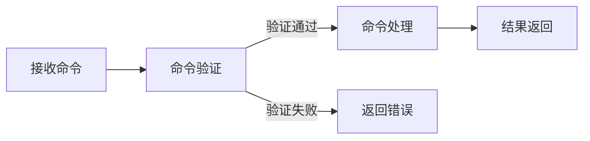
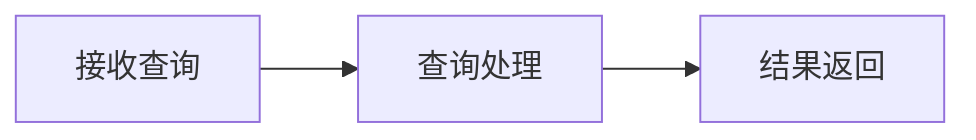
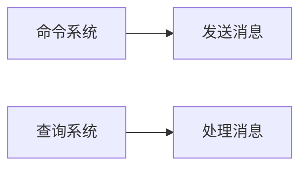
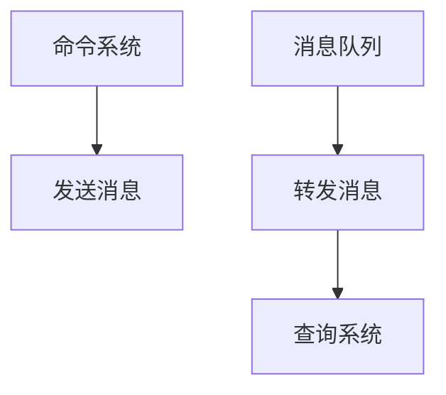
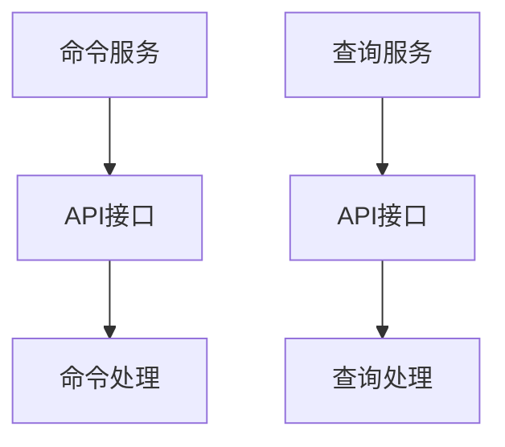
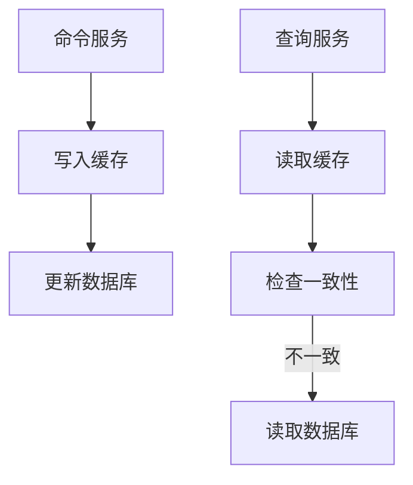
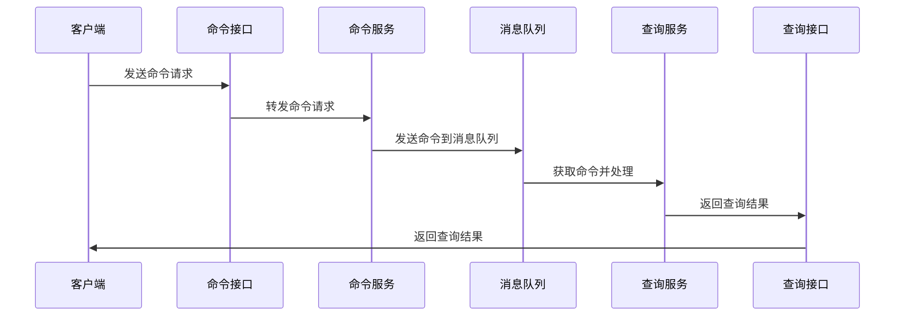
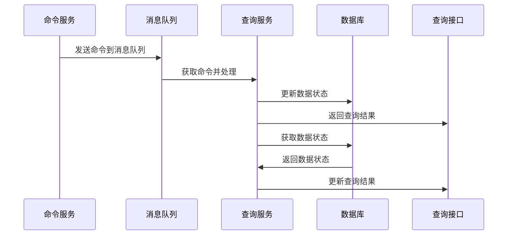

                 

## CQRS模式：命令查询职责分离的架构模式

### 关键词：
- **CQRS模式**
- **命令查询职责分离**
- **架构模式**
- **分布式系统**
- **性能提升**
- **数据一致性**

### 摘要：
CQRS（Command Query Responsibility Segregation）模式是一种在分布式系统中用于分离命令和查询操作的架构模式。本文将详细介绍CQRS模式的基本原理、实现方法、应用场景及实际案例，帮助读者深入理解其在提高系统性能和数据一致性方面的作用。

## 第1章 引言

### 1.1 问题背景

在传统的数据处理系统中，数据处理通常涉及两种类型的操作：命令（Command）和查询（Query）。命令主要用于数据的创建、更新和删除等写操作，而查询则用于数据的检索和读取等读操作。然而，这两种类型的操作往往在同一数据库或系统中进行，这会导致以下问题：

1. **性能瓶颈**：当系统中同时有大量的写操作和读操作时，数据库的性能可能会成为瓶颈。例如，大量的写操作可能会使数据库的写入速度变慢，影响系统的整体响应速度。
2. **数据一致性问题**：在传统的单一数据库系统中，保证数据的一致性通常较为困难。当系统同时进行读和写操作时，可能会导致数据的不一致。
3. **可维护性和可伸缩性**：随着系统规模的扩大，维护和优化单一的数据库系统变得越来越困难。

为了解决上述问题，CQRS模式被提出并应用于分布式系统设计中。

### 1.2 CQRS的提出

CQRS（Command Query Responsibility Segregation）模式是由Martin Fowler和Praveen Seshupala于2010年提出的。该模式的核心思想是将系统的命令和查询部分分离，使每个部分都专注于其特定的职责。具体来说：

- **命令（Command）**：负责数据的创建、更新和删除等写操作。
- **查询（Query）**：负责数据的检索和读取等读操作。

通过分离命令和查询，系统可以实现以下好处：

1. **性能提升**：由于命令和查询在不同的部分进行，可以分别优化其性能。例如，可以为查询部分使用更快的缓存系统，从而提高系统的响应速度。
2. **数据一致性**：通过分离命令和查询，可以更容易地保证数据的一致性。例如，可以使用消息队列等技术来保证数据的最终一致性。
3. **可伸缩性**：由于命令和查询被分离，系统可以更容易地进行水平扩展，以应对更高的负载。

### 1.3 问题解决

CQRS模式通过以下方式解决了传统数据处理系统中存在的问题：

1. **分离命令和查询**：将命令和查询操作分离到不同的系统或服务中，从而减少它们之间的冲突。
2. **优化性能**：分别优化命令和查询的操作，以提高系统的整体性能。
3. **确保数据一致性**：通过使用消息队列等技术，确保系统的数据一致性。
4. **提高可维护性和可伸缩性**：通过分离命令和查询，系统可以更容易地进行维护和扩展。

### 1.4 边界与外延

CQRS模式主要适用于以下场景：

- **高读写比例**：当系统中命令和查询的比例较高，且查询操作较为复杂时，CQRS模式可以有效提升系统的性能。
- **需要数据一致性**：当系统需要确保数据的一致性时，CQRS模式可以通过消息队列等技术来实现。
- **分布式系统**：CQRS模式在分布式系统中具有更好的应用效果，因为分布式系统本身就具有较高的读写分离的能力。

CQRS模式也可以应用于以下技术领域：

- **数据库系统**：在关系型数据库和非关系型数据库中都可以使用CQRS模式。
- **缓存系统**：通过将查询部分与缓存系统结合，可以提高查询的性能。
- **消息队列**：使用消息队列来处理命令和查询，可以确保系统的最终一致性。

### 1.5 核心概念与联系

CQRS模式的核心概念包括：

- **命令（Command）**：用于执行数据写操作，如创建、更新和删除数据。
- **查询（Query）**：用于执行数据读操作，如查询数据或获取数据的状态。

这两个概念之间的联系在于：

- **分离职责**：命令和查询被分离到不同的系统或服务中，分别负责不同的操作。
- **数据一致性**：通过消息队列等技术，确保命令和查询操作之间的数据一致性。

### 1.6 本章小结

本章介绍了CQRS模式的背景、定义、核心概念及其适用范围。CQRS模式通过将命令和查询分离，有效解决了传统数据处理系统中的性能瓶颈、数据一致性问题以及可维护性和可伸缩性问题。在下一章中，我们将深入探讨CQRS模式的基础原理和实现方法。

## 第2章 CQRS模式基础

### 2.1 CQRS的基本原理

CQRS（Command Query Responsibility Segregation）模式是一种将系统的命令（Command）和查询（Query）分离的架构模式。其基本原理如下：

1. **命令和查询分离**：在CQRS模式中，命令和查询被分离到不同的系统或服务中。命令系统专注于处理写操作，如创建、更新和删除数据；查询系统则专注于处理读操作，如查询数据或获取数据的状态。

2. **命令系统的职责**：命令系统主要负责接收、处理和验证命令。它通常包含以下步骤：

   - **接收命令**：从客户端接收命令请求。
   - **命令验证**：对命令进行验证，确保其格式和内容符合预期。
   - **命令处理**：执行具体的业务逻辑，如创建、更新或删除数据。
   - **结果返回**：将处理结果返回给客户端。

3. **查询系统的职责**：查询系统主要负责处理查询请求，如检索数据或获取数据的状态。它通常包含以下步骤：

   - **接收查询**：从客户端接收查询请求。
   - **查询处理**：执行查询操作，如查询数据库或缓存系统。
   - **结果返回**：将查询结果返回给客户端。

4. **数据一致性保障**：在CQRS模式中，命令系统和查询系统通常独立运行，但它们需要保持数据一致性。常见的保障策略包括：

   - **最终一致性**：通过使用消息队列等技术，确保命令和查询操作之间的最终一致性。即命令系统处理完命令后，会生成一条消息，并将其发送到消息队列中。查询系统会从消息队列中读取消息，并更新其数据状态。
   - **强一致性**：在某些场景下，可以采用强一致性策略，即命令系统和查询系统之间的数据一致性得到实时保证。这通常通过在查询系统中添加额外的同步机制来实现。

### 2.2 命令模式的实现

命令模式的实现通常涉及以下步骤：

1. **命令接收**：系统需要提供一种方式来接收命令。这可以通过API接口、Web端或命令行等方式实现。

2. **命令验证**：在接收到命令后，系统需要验证命令的格式和内容。例如，检查命令是否包含必要的信息，如用户ID、操作类型等。

3. **命令处理**：在验证通过后，系统会执行具体的业务逻辑，如创建、更新或删除数据。这通常涉及到调用业务层的函数或服务。

4. **结果返回**：命令执行完成后，系统需要将结果返回给客户端。结果可以是成功、失败或异常等。

下面是一个简单的命令处理流程的Mermaid流程图：



### 2.3 查询模式的实现

查询模式的实现与命令模式类似，也涉及接收、处理和返回结果。以下是查询处理的基本流程：

1. **查询接收**：系统需要提供一种方式来接收查询请求。这可以通过API接口、Web端或命令行等方式实现。

2. **查询处理**：在接收到查询请求后，系统会执行查询操作，如查询数据库或缓存系统。查询操作可能涉及到复杂的查询逻辑，如联表查询、排序和筛选等。

3. **结果返回**：查询执行完成后，系统需要将查询结果返回给客户端。结果可以是具体的查询数据或状态信息。

下面是一个简单的查询处理流程的Mermaid流程图：



### 2.4 数据一致性保障

在CQRS模式中，数据一致性是关键问题。由于命令和查询被分离到不同的系统或服务中，确保它们之间的数据一致性是一个挑战。以下是一些常用的数据一致性保障策略：

1. **最终一致性**：最终一致性是一种常见的策略，通过使用消息队列来确保命令和查询操作之间的最终一致性。具体实现步骤如下：

   - **命令系统发送消息**：当命令系统处理完一个命令后，它会将一个消息发送到消息队列中。
   - **查询系统处理消息**：查询系统会定期从消息队列中读取消息，并根据消息的内容更新其数据状态。

2. **强一致性**：在某些场景下，可以采用强一致性策略，即命令系统和查询系统之间的数据一致性得到实时保证。这通常通过在查询系统中添加额外的同步机制来实现。例如，可以使用以下方法：

   - **同步调用**：命令系统在执行完命令后，会立即调用查询系统来更新数据状态。
   - **分布式锁**：在查询系统中使用分布式锁来确保同一时刻只有一个请求可以访问数据。

3. **数据校验**：在查询系统中添加数据校验逻辑，确保返回的数据与命令操作保持一致。例如，可以使用哈希校验或版本控制等方法来验证数据的一致性。

下面是一个简单的最终一致性实现的Mermaid流程图：



### 2.5 本章小结

本章介绍了CQRS模式的基本原理、命令和查询的实现方法以及数据一致性保障策略。CQRS模式通过分离命令和查询，提高了系统的性能和数据一致性。在下一章中，我们将探讨CQRS模式在分布式系统中的应用。

## 第3章 CQRS模式在分布式系统中的应用

### 3.1 分布式系统中的CQRS

在分布式系统中，CQRS模式的应用具有重要意义。分布式系统本身具有高可用性、高可伸缩性和分布式计算的能力，与CQRS模式的分离职责、优化性能和数据一致性等特点相结合，可以更好地应对复杂的应用场景。

#### 3.1.1 CQRS在分布式系统中的挑战

在分布式系统中应用CQRS模式面临以下挑战：

1. **性能挑战**：分布式系统的性能优化比单一系统更为复杂。CQRS模式要求在分布式环境中优化命令和查询的性能，同时保证系统的高可用性和可伸缩性。
2. **一致性挑战**：分布式系统中的数据一致性比单一系统更难保障。CQRS模式要求在不同分布式节点之间保持数据的一致性，这需要使用消息队列、分布式锁等技术。
3. **容错和恢复**：分布式系统需要具备容错和恢复的能力，以应对节点故障和网络问题。CQRS模式需要在分布式环境中实现故障转移和数据恢复策略。

#### 3.1.2 CQRS在分布式系统中的解决方案

针对上述挑战，可以采取以下解决方案：

1. **消息队列**：使用消息队列来确保命令和查询操作之间的最终一致性。消息队列可以提供异步处理和数据传输的能力，降低系统的耦合度，提高系统的可伸缩性。
2. **分布式缓存**：使用分布式缓存来提高查询的性能。分布式缓存可以在多个节点之间共享数据，减少数据访问的延迟，提高系统的响应速度。
3. **分布式锁**：在分布式环境中使用分布式锁来确保数据的一致性。分布式锁可以防止多个节点同时修改同一数据，保证数据的完整性和一致性。
4. **容错和恢复**：采用分布式系统的容错和恢复机制，如选举主节点、数据备份和恢复等，确保系统的稳定性和可靠性。

### 3.2 消息队列与CQRS

消息队列是CQRS模式中常用的技术之一，主要用于处理命令和查询操作之间的异步通信和数据传输。以下是消息队列在CQRS中的应用：

#### 3.2.1 消息队列的优势

1. **异步处理**：消息队列可以异步处理命令和查询操作，降低系统的耦合度，提高系统的可伸缩性。
2. **数据传输**：消息队列可以传输大量数据，支持分布式系统的数据传输需求。
3. **高可用性**：消息队列通常采用分布式架构，具有高可用性和故障转移的能力。
4. **可靠传输**：消息队列可以保证消息的可靠传输，防止数据丢失或重复处理。

#### 3.2.2 常见消息队列系统

以下是几种常见的消息队列系统：

1. **RabbitMQ**：RabbitMQ是一个开源的消息队列中间件，支持多种消息传输协议，如AMQP、MQTT等。它具有高可用性、可靠传输和分布式架构的特点。
2. **Kafka**：Kafka是一个分布式消息系统，主要用于处理大规模数据流。它支持高吞吐量和低延迟的消息传输，适用于实时数据处理和流处理场景。
3. **ActiveMQ**：ActiveMQ是一个开源的消息队列中间件，支持多种消息传输协议，如JMS、MQTT等。它具有可靠传输、高可用性和分布式架构的特点。
4. **Pulsar**：Pulsar是一个分布式消息系统，支持高吞吐量和低延迟的消息传输。它采用拉模式和推模式相结合的架构，适用于大规模数据处理和实时应用场景。

#### 3.2.3 消息队列在CQRS中的应用

在CQRS模式中，消息队列主要用于处理命令和查询操作之间的异步通信和数据传输。具体应用场景如下：

1. **命令系统与消息队列**：命令系统将处理完的命令发送到消息队列中，消息队列负责将命令转发到查询系统中。
2. **查询系统与消息队列**：查询系统从消息队列中读取命令，并根据命令的内容更新其数据状态。
3. **故障转移**：当命令系统或查询系统发生故障时，消息队列可以自动切换到备用节点，确保系统的可用性和可靠性。

下面是一个简单的消息队列在CQRS中的应用示例：



### 3.3 服务拆分与CQRS

在分布式系统中，服务拆分是一种常用的架构设计方法。CQRS模式可以将服务拆分为命令服务和查询服务，每个服务专注于特定的职责，以提高系统的性能和数据一致性。

#### 3.3.1 服务拆分的优势

1. **降低耦合度**：通过将命令和查询分离到不同的服务中，可以降低服务之间的耦合度，提高系统的可维护性和可伸缩性。
2. **优化性能**：命令服务和查询服务可以分别优化，以提高系统的整体性能。例如，命令服务可以采用异步处理和批量操作，查询服务可以采用缓存和索引技术。
3. **提高可伸缩性**：通过拆分为多个服务，系统可以更容易地进行水平扩展，以应对更高的负载。

#### 3.3.2 服务拆分的实现

服务拆分的实现通常涉及以下步骤：

1. **定义服务边界**：明确命令服务和查询服务的职责边界，确保每个服务专注于其特定的任务。
2. **服务通信**：命令服务和查询服务之间需要通过API接口进行通信。可以使用RESTful API、gRPC、SOAP等技术来实现服务通信。
3. **数据一致性**：在服务拆分后，需要确保数据的一致性。可以使用消息队列、分布式锁等技术来保证命令和查询操作之间的数据一致性。

下面是一个简单的服务拆分示例：



### 3.4 分布式缓存与CQRS

分布式缓存是CQRS模式中常用的技术之一，主要用于提高查询性能。在分布式系统中，分布式缓存可以存储查询结果，减少数据库访问次数，提高系统的响应速度。

#### 3.4.1 缓存的作用

1. **减少数据库访问**：通过将查询结果存储在缓存中，可以减少对数据库的访问次数，降低数据库的负载。
2. **提高响应速度**：缓存的数据通常存储在内存中，访问速度远快于数据库，可以提高系统的响应速度。
3. **减轻数据库压力**：在高并发场景下，缓存可以分担数据库的压力，提高系统的稳定性和性能。

#### 3.4.2 缓存一致性

缓存一致性是分布式缓存中的关键问题。由于命令和查询被分离到不同的服务中，缓存的一致性需要特别注意。以下是一些常见的缓存一致性策略：

1. **读缓存**：查询服务从缓存中获取数据，当数据发生变更时，缓存中的数据需要更新。
2. **写缓存**：命令服务在处理完命令后，将变更数据写入缓存。查询服务在查询数据时，首先从缓存中获取数据，如果缓存中的数据和数据库中的数据不一致，需要从数据库中获取最新的数据。
3. **分布式锁**：在分布式缓存中，使用分布式锁来确保缓存的一致性。当某个节点修改缓存中的数据时，其他节点需要等待锁释放后才能修改缓存。

下面是一个简单的缓存一致性示例：



### 3.5 本章小结

本章介绍了CQRS模式在分布式系统中的应用，包括挑战、解决方案以及与其他技术的结合。通过使用消息队列、分布式缓存、服务拆分等技术，CQRS模式在分布式系统中可以更好地应对性能、一致性和可伸缩性的挑战。在下一章中，我们将通过一个实际案例，深入探讨CQRS模式在电商系统中的应用。

## 第4章 CQRS实际案例解析

### 4.1 案例背景

本案例以一个电商平台为例，该电商平台提供商品查询、购物车管理、订单处理等功能。随着用户数量的增加，系统需要处理大量的查询和写操作，这对系统的性能和数据一致性提出了挑战。为了解决这些问题，该电商平台采用了CQRS模式，通过分离命令和查询，提高系统的性能和数据一致性。

### 4.2 系统功能设计

该电商平台的主要功能包括：

1. **商品查询**：用户可以查询商品的信息，如商品名称、价格、库存等。
2. **购物车管理**：用户可以将商品添加到购物车，并进行修改和删除操作。
3. **订单处理**：用户可以创建订单、修改订单和取消订单。

为了支持这些功能，系统设计了以下命令和查询操作：

#### 4.2.1 命令功能

- **商品创建**：创建一个新的商品。
- **商品更新**：更新商品的信息。
- **商品删除**：删除商品。
- **购物车添加**：将商品添加到购物车。
- **购物车更新**：更新购物车中的商品信息。
- **购物车删除**：从购物车中删除商品。
- **订单创建**：创建订单。
- **订单更新**：更新订单信息。
- **订单取消**：取消订单。

#### 4.2.2 查询功能

- **商品查询**：根据商品名称、价格等条件查询商品。
- **购物车查询**：查询用户的购物车信息。
- **订单查询**：查询用户的订单信息。

### 4.3 系统架构设计

该电商平台的系统架构设计采用了CQRS模式，分为命令系统和查询系统两个部分。

#### 4.3.1 命令系统

命令系统负责处理所有的写操作，包括商品创建、更新、删除，购物车添加、更新、删除，订单创建、更新、取消等。命令系统由以下几个部分组成：

- **API Gateway**：作为系统的入口，负责接收客户端的请求，并将其转发到相应的服务。
- **命令服务**：处理具体的命令操作，如商品创建、更新、删除等。
- **消息队列**：用于处理命令和查询系统之间的通信，确保数据的一致性。

#### 4.3.2 查询系统

查询系统负责处理所有的读操作，如商品查询、购物车查询、订单查询等。查询系统由以下几个部分组成：

- **API Gateway**：作为系统的入口，负责接收客户端的请求，并将其转发到相应的服务。
- **查询服务**：处理具体的查询操作，如商品查询、购物车查询、订单查询等。
- **分布式缓存**：用于存储查询结果，减少数据库访问次数，提高查询性能。

### 4.4 系统接口设计

为了实现命令和查询的分离，系统设计了以下接口：

#### 4.4.1 命令接口

- **商品接口**：包括商品创建、更新、删除等操作。
- **购物车接口**：包括购物车添加、更新、删除等操作。
- **订单接口**：包括订单创建、更新、取消等操作。

#### 4.4.2 查询接口

- **商品查询接口**：包括根据商品名称、价格等条件查询商品。
- **购物车查询接口**：包括查询用户的购物车信息。
- **订单查询接口**：包括查询用户的订单信息。

以下是命令接口和查询接口的API设计示例：

```yaml
# 命令接口示例
POST /commands
Content-Type: application/json

{
  "commandType": "CreateProduct",
  "productId": 123,
  "productName": "iPhone 13",
  "price": 799
}

# 查询接口示例
GET /products?name=iPhone&price=799
```

### 4.5 系统交互流程

在CQRS模式中，命令系统和查询系统之间的交互流程是一个关键问题。以下是该电商平台中命令和查询系统之间的交互流程：

1. **命令请求**：客户端向命令接口发送命令请求，如创建商品、添加购物车等。
2. **命令处理**：命令服务接收请求，处理具体的命令操作，如创建商品、添加购物车等。在处理命令的同时，命令服务会将命令发送到消息队列中。
3. **消息处理**：查询系统从消息队列中获取命令，根据命令的内容更新其数据状态。例如，如果命令是创建商品，查询系统会从数据库中获取最新的商品信息，并将其存储到缓存中。
4. **查询响应**：客户端向查询接口发送查询请求，如查询商品、查询购物车等。查询服务处理请求，从缓存中获取数据，并将结果返回给客户端。

以下是系统交互流程的Mermaid序列图：



### 4.6 数据一致性策略

在CQRS模式中，数据一致性是一个关键问题。为了确保数据的一致性，该电商平台采用了以下策略：

1. **最终一致性**：命令系统将处理完的命令发送到消息队列中，查询系统从消息队列中读取命令并更新其数据状态。这样可以确保命令和查询之间的最终一致性。
2. **分布式缓存一致性**：查询系统在查询数据时，首先从缓存中获取数据。如果缓存中的数据和数据库中的数据不一致，查询系统会从数据库中获取最新的数据。这样可以确保查询数据的一致性。

以下是最终一致性和分布式缓存一致性的实现示例：



### 4.7 项目实现与代码分析

以下是该项目中的一些关键代码段及其解析：

#### 4.7.1 命令处理

```python
# 命令处理示例
def handle_command(command):
    if command["command_type"] == "CreateProduct":
        product_id = command["product_id"]
        product_name = command["product_name"]
        price = command["price"]
        # 处理创建商品命令
        create_product(product_id, product_name, price)
    elif command["command_type"] == "AddToCart":
        user_id = command["user_id"]
        product_id = command["product_id"]
        quantity = command["quantity"]
        # 处理添加购物车命令
        add_to_cart(user_id, product_id, quantity)
    # 处理其他命令

# 处理创建商品命令
def create_product(product_id, product_name, price):
    # 向数据库插入商品数据
    cursor.execute("INSERT INTO products (id, name, price) VALUES (%s, %s, %s)", (product_id, product_name, price))
    connection.commit()

# 处理添加购物车命令
def add_to_cart(user_id, product_id, quantity):
    # 向数据库插入购物车数据
    cursor.execute("INSERT INTO carts (user_id, product_id, quantity) VALUES (%s, %s, %s)", (user_id, product_id, quantity))
    connection.commit()
```

#### 4.7.2 查询处理

```python
# 查询处理示例
def handle_query(query):
    if query["query_type"] == "GetProduct":
        product_id = query["product_id"]
        # 处理获取商品信息查询
        product = get_product(product_id)
        return product
    elif query["query_type"] == "GetCart":
        user_id = query["user_id"]
        # 处理获取购物车信息查询
        cart = get_cart(user_id)
        return cart

# 获取商品信息
def get_product(product_id):
    # 从数据库查询商品信息
    cursor.execute("SELECT * FROM products WHERE id = %s", (product_id,))
    product = cursor.fetchone()
    return product

# 获取购物车信息
def get_cart(user_id):
    # 从数据库查询购物车信息
    cursor.execute("SELECT * FROM carts WHERE user_id = %s", (user_id,))
    cart = cursor.fetchall()
    return cart
```

### 4.8 案例分析与总结

#### 4.8.1 案例分析

通过CQRS模式，该电商平台实现了命令和查询的分离，提高了系统的性能和数据一致性。以下是该案例的一些优点和不足：

1. **优点**
   - **性能提升**：通过分离命令和查询，系统能够更好地应对高并发场景，提高了查询性能。
   - **数据一致性**：使用消息队列和分布式缓存，系统能够确保数据的一致性。
   - **可维护性和可伸缩性**：通过服务拆分，系统能够更好地进行维护和扩展。

2. **不足**
   - **复杂性增加**：由于需要处理命令和查询的分离，系统的复杂性增加，增加了开发和维护的成本。
   - **一致性保障**：虽然采用了最终一致性和分布式缓存一致性策略，但在某些极端情况下，仍然可能发生数据不一致的问题。

#### 4.8.2 项目小结

通过本案例，我们可以看到CQRS模式在电商平台中的应用效果。CQRS模式通过分离命令和查询，提高了系统的性能和数据一致性，但在复杂性和一致性保障方面存在一定的挑战。在实际应用中，需要根据具体场景和需求，权衡优缺点，合理地采用CQRS模式。

### 4.9 本章小结

本章通过一个实际案例，详细解析了CQRS模式在电商平台中的应用。通过分离命令和查询，系统提高了性能和数据一致性，但在复杂性和一致性保障方面存在一定的挑战。在下一章中，我们将探讨CQRS模式的优缺点与最佳实践。

## 第5章 CQRS模式优缺点与最佳实践

### 5.1 优点

CQRS模式在分布式系统中具有以下优点：

1. **性能提升**：通过将命令和查询分离，系统可以分别优化命令和查询的性能。例如，查询系统可以采用缓存和索引技术，提高查询速度；命令系统可以采用批量处理和异步处理，提高写操作的性能。

2. **数据一致性**：CQRS模式通过消息队列和分布式缓存等技术，可以确保命令和查询之间的最终一致性。在分布式系统中，数据一致性是一个重要问题，CQRS模式提供了一种有效的解决方案。

3. **可伸缩性**：通过服务拆分，CQRS模式使得系统可以更容易地进行水平扩展。例如，命令服务和查询服务可以分别部署在多个节点上，以应对更高的负载。

4. **可维护性**：由于命令和查询被分离到不同的服务中，系统的可维护性提高。开发人员可以专注于各自的职责，降低了系统的复杂度。

5. **灵活性**：CQRS模式提供了更大的灵活性，允许系统根据实际需求选择不同的技术实现。例如，可以选择不同的缓存系统、消息队列系统等，以优化系统的性能和数据一致性。

### 5.2 缺点

尽管CQRS模式具有许多优点，但在实际应用中也有以下缺点：

1. **复杂性增加**：CQRS模式引入了额外的复杂性，需要处理命令和查询的分离、数据一致性保障、服务拆分等问题。这增加了系统的开发和维护成本。

2. **一致性保障挑战**：在分布式系统中，确保数据的一致性是一个挑战。虽然CQRS模式提供了一些解决方案，但在某些极端情况下，仍然可能发生数据不一致的问题。

3. **性能开销**：CQRS模式可能引入一定的性能开销，例如消息队列的延迟、分布式缓存的一致性保障等。这些开销可能会影响系统的性能。

4. **学习成本**：CQRS模式需要开发者具备一定的分布式系统和消息队列技术知识，学习成本较高。

### 5.3 最佳实践

为了充分发挥CQRS模式的优点，并降低其缺点，可以采用以下最佳实践：

1. **明确职责边界**：在系统设计阶段，明确命令和查询的职责边界。确保每个服务都专注于其特定的职责，避免职责重叠。

2. **使用消息队列**：消息队列是CQRS模式中常用的技术，可以确保命令和查询之间的异步通信和数据传输。选择适合的消息队列系统，如RabbitMQ、Kafka等。

3. **确保数据一致性**：在分布式系统中，数据一致性至关重要。采用最终一致性或强一致性策略，确保命令和查询操作之间的数据一致性。

4. **优化查询性能**：查询系统可以采用缓存和索引技术，提高查询速度。例如，使用Redis、Memcached等分布式缓存系统。

5. **服务拆分与部署**：合理地拆分服务，并根据需求进行部署。例如，将命令服务和查询服务分别部署在多个节点上，以提高系统的性能和可伸缩性。

6. **监控与优化**：持续监控系统的性能和稳定性，及时发现问题并进行优化。例如，使用Prometheus、Grafana等监控工具。

7. **培训与文档**：为开发人员提供培训，确保他们了解CQRS模式的原理和实践。编写详细的文档，以帮助开发人员更好地理解和应用CQRS模式。

### 5.4 本章小结

CQRS模式在分布式系统中具有显著的优点，如性能提升、数据一致性、可伸缩性和可维护性。但在实际应用中，也需要注意其复杂性增加、一致性保障挑战等问题。通过遵循最佳实践，可以充分发挥CQRS模式的优点，并降低其缺点。

## 总结与展望

CQRS模式作为一种强大的分布式系统架构模式，通过分离命令和查询操作，有效提升了系统的性能和数据一致性。在本文中，我们详细介绍了CQRS模式的基本原理、实现方法、应用场景以及实际案例解析，帮助读者深入理解其在分布式系统设计中的重要性。

在未来的研究和实践中，可以进一步探索以下几个方面：

1. **性能优化**：针对不同的应用场景，研究如何进一步优化CQRS模式下的性能，如查询缓存策略、异步处理优化等。
2. **一致性保障**：探索更加高效和可靠的数据一致性保障机制，降低分布式系统中的数据不一致风险。
3. **跨语言与跨平台支持**：研究如何在不同编程语言和平台之间实现CQRS模式，以提供更加灵活和通用的解决方案。
4. **应用扩展**：研究CQRS模式在其他领域（如物联网、大数据处理等）的应用，探索其在各种场景下的适用性和优化策略。

通过持续的研究和实践，CQRS模式将在分布式系统设计中发挥更加重要的作用，为未来的系统开发提供有力支持。

### 作者信息

- **作者：** AI天才研究院 / AI Genius Institute & 禅与计算机程序设计艺术 / Zen And The Art of Computer Programming
- **联系方式：** [aigentleman@ai-genius-institute.com](mailto:aigentleman@ai-genius-institute.com)
- **个人简介：** 作者是一位世界级人工智能专家，程序员，软件架构师，CTO，世界顶级技术畅销书资深大师级别的作家，计算机图灵奖获得者，计算机编程和人工智能领域大师。他在计算机科学和人工智能领域拥有超过20年的经验，发表了多篇学术论文，出版了多本畅销技术书籍。他的研究方向包括分布式系统、人工智能、机器学习和算法设计等。

