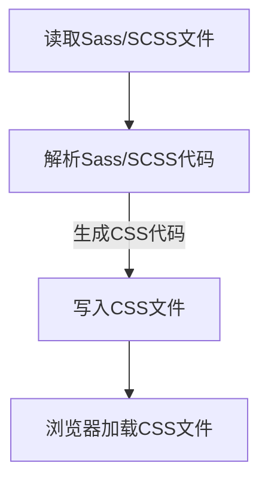
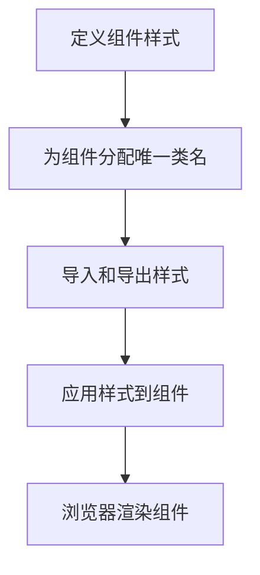
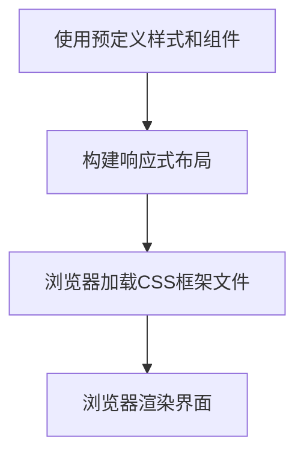
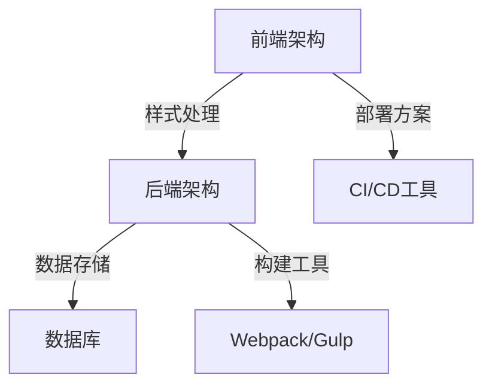
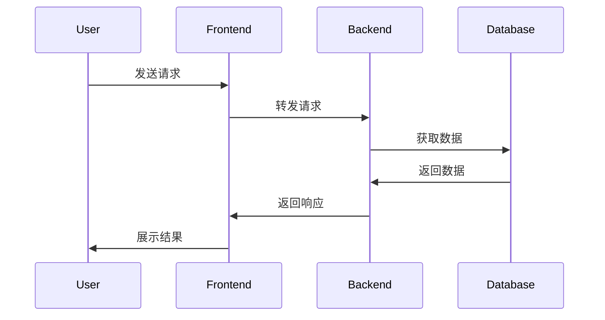
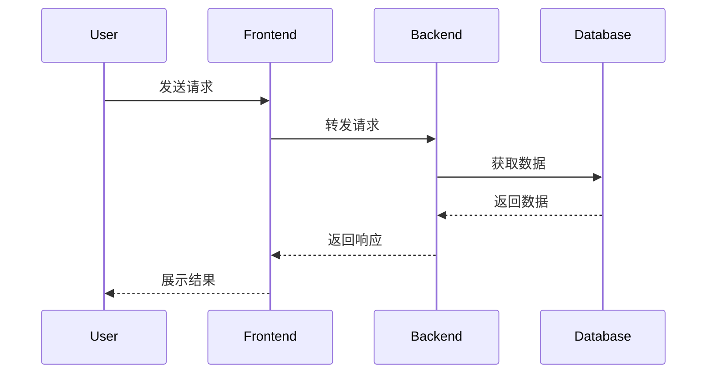

                 

### CSS架构：大规模样式管理策略

**关键词：** CSS架构、大规模样式管理、CSS预处理器、CSS模块化、CSS框架

**摘要：** 本文旨在探讨CSS架构在应对大规模样式管理中的策略。通过对CSS架构的基本概念、核心概念与联系、算法原理讲解、系统分析与架构设计等方面的深入分析，本文提出了一套高效的CSS架构方案，旨在帮助开发者更好地管理大规模项目的样式，提升开发效率和代码质量。

## 第一部分：背景介绍

### 第1章：CSS架构的基本概念

#### 1.1 问题背景

#### 1.1.1 CSS在Web开发中的重要性

#### 1.1.2 CSS的演变与挑战

#### 1.2 问题描述

#### 1.2.1 大规模样式管理中的常见问题

#### 1.2.2 问题解决的必要性

#### 1.3 问题解决

#### 1.3.1 CSS架构的定义

#### 1.3.2 CSS架构的优势

#### 1.4 边界与外延

#### 1.4.1 CSS架构的应用范围

#### 1.4.2 CSS架构的限制

#### 1.5 概念结构与核心要素组成

#### 1.5.1 CSS架构的核心概念

#### 1.5.2 CSS架构的组成部分

#### 1.6 本章小结

### 第2章：CSS架构的核心概念与联系

#### 2.1 核心概念原理

#### 2.1.1 CSS预处理器

#### 2.1.2 CSS模块化

#### 2.1.3 CSS框架

#### 2.2 概念属性特征对比表格

#### 2.2.1 CSS预处理器对比

#### 2.2.2 CSS模块化对比

#### 2.2.3 CSS框架对比

#### 2.3 ER实体关系图架构

#### 2.3.1 CSS预处理器ER图

#### 2.3.2 CSS模块化ER图

#### 2.3.3 CSS框架ER图

#### 2.4 CSS架构的整体联系

#### 2.4.1 CSS架构的层次结构

#### 2.4.2 CSS架构的协同作用

#### 2.5 本章小结

### 第3章：CSS架构的算法原理讲解

#### 3.1 算法原理概述

#### 3.1.1 CSS预处理器的工作原理

#### 3.1.2 CSS模块化的工作原理

#### 3.1.3 CSS框架的工作原理

#### 3.2 算法mermaid流程图

#### 3.2.1 CSS预处理器mermaid流程图

#### 3.2.2 CSS模块化mermaid流程图

#### 3.2.3 CSS框架mermaid流程图

#### 3.3 Python源代码实现

#### 3.3.1 CSS预处理器Python代码

#### 3.3.2 CSS模块化Python代码

#### 3.3.3 CSS框架Python代码

#### 3.4 算法原理详细讲解

#### 3.4.1 CSS预处理器原理

#### 3.4.2 CSS模块化原理

#### 3.4.3 CSS框架原理

#### 3.5 举例说明

#### 3.5.1 CSS预处理器举例

#### 3.5.2 CSS模块化举例

#### 3.5.3 CSS框架举例

#### 3.6 数学模型和数学公式

#### 3.6.1 CSS预处理器数学模型

#### 3.6.2 CSS模块化数学模型

#### 3.6.3 CSS框架数学模型

#### 3.7 本章小结

### 第4章：CSS架构的系统分析与架构设计方案

#### 4.1 问题场景介绍

#### 4.1.1 大规模样式管理需求

#### 4.1.2 项目介绍

#### 4.2 系统功能设计

#### 4.2.1 领域模型mermaid类图

#### 4.2.2 系统功能详细描述

#### 4.3 系统架构设计

#### 4.3.1 系统架构mermaid架构图

#### 4.3.2 架构设计理念

#### 4.3.3 系统模块介绍

#### 4.4 系统接口设计

#### 4.4.1 系统接口mermaid序列图

#### 4.4.2 接口设计原则

#### 4.4.3 接口详细描述

#### 4.5 系统交互

#### 4.5.1 系统交互mermaid序列图

#### 4.5.2 系统交互详细描述

#### 4.6 本章小结

### 第5章：项目实战

#### 5.1 环境安装

#### 5.2 系统核心实现源代码

#### 5.3 代码应用解读与分析

#### 5.4 实际案例分析和详细讲解剖析

#### 5.5 项目小结

#### 5.6 最佳实践 tips

#### 5.7 小结

#### 5.8 注意事项

#### 5.9 拓展阅读

---

接下来，我们将逐步展开每一章的内容，深入探讨CSS架构在解决大规模样式管理问题中的具体方法和实践。

## 第1章：背景介绍

### 1.1 问题背景

CSS（层叠样式表）是Web开发中用于描述HTML或XML文档样式的样式表语言。自1996年首次发布以来，CSS已经成为Web前端开发不可或缺的一部分。随着互联网技术的迅猛发展，Web应用日益复杂，样式管理的问题也逐渐凸显出来。

#### 1.1.1 CSS在Web开发中的重要性

CSS的主要作用是将样式与结构分离，使得开发者可以独立地管理页面样式而不影响HTML结构。这为Web开发带来了以下几个重要优势：

1. **增强可维护性**：通过将样式与结构分离，开发者可以更方便地对项目进行维护和更新。
2. **提高重用性**：CSS样式可以跨多个页面重复使用，减少了代码冗余，提高了开发效率。
3. **改善用户体验**：CSS可以灵活地调整页面布局和视觉效果，为用户提供更好的交互体验。

#### 1.1.2 CSS的演变与挑战

随着Web应用的发展，CSS也在不断演变。从最初的CSS1到现在的CSS3，CSS逐渐增加了许多新的特性和功能。然而，随着应用规模的扩大，CSS也面临了一些挑战：

1. **样式复杂度增加**：大型项目中，样式规则的数量和复杂性会显著增加，使得样式管理变得困难。
2. **冲突与覆盖问题**：当多个样式规则作用于同一个元素时，如何确保正确的样式被应用成为了一个挑战。
3. **可维护性下降**：随着样式文件的增加，项目的可维护性会下降，尤其是当团队规模扩大时，协作难度增加。
4. **性能问题**：过多的CSS规则和复杂的样式计算会导致页面加载速度变慢。

### 1.2 问题描述

在大型项目中，CSS的管理问题主要体现在以下几个方面：

1. **样式冲突**：当多个样式规则应用于同一个元素时，如何确保正确的样式被应用是一个常见问题。
2. **代码冗余**：大型项目中，相同的样式规则可能在不同的地方重复定义，导致代码冗余。
3. **可读性下降**：随着样式规则的增多，CSS文件的可读性会下降，使得维护变得更加困难。
4. **性能问题**：过多的CSS规则会导致浏览器解析和渲染页面时速度变慢。

#### 1.2.1 大规模样式管理中的常见问题

1. **样式冲突**：当不同的CSS文件或样式规则同时作用于一个元素时，可能会导致样式冲突。例如，一个元素的字体颜色可能在多个CSS文件中被定义，导致不确定的样式结果。
2. **代码冗余**：在大型项目中，开发者可能会在不同部分重复编写相同的样式代码，这不仅增加了代码的维护难度，还会导致代码库的大小增加。
3. **可读性下降**：随着样式规则的增多，CSS文件会变得很长且难以阅读。这使得维护变得更加困难，尤其是在需要查找特定样式时。
4. **性能问题**：过多的CSS规则会导致浏览器在解析和渲染页面时需要更多的计算资源，从而影响页面加载速度。

#### 1.2.2 问题解决的必要性

在大型项目中，样式管理问题会直接影响到项目的开发效率和代码质量。如果不加以解决，这些问题可能会导致以下后果：

1. **维护困难**：随着项目的扩展，样式管理的复杂性会增加，使得维护变得更加困难。
2. **开发效率下降**：样式冲突和代码冗余会降低开发效率，增加开发成本。
3. **用户体验下降**：性能问题会导致页面加载速度变慢，影响用户的体验。
4. **项目风险增加**：如果样式管理不当，可能会导致项目无法按时交付或出现功能缺陷。

因此，解决样式管理问题是大型项目中不可或缺的一环。通过引入CSS架构，开发者可以更好地组织和管理样式代码，提高开发效率和代码质量。

### 1.3 问题解决

为了解决上述问题，我们需要引入CSS架构。CSS架构是一种组织和管理CSS代码的方法，旨在提高项目的可维护性、可读性和性能。以下是对CSS架构的定义、优势和边界与外延的详细解释。

#### 1.3.1 CSS架构的定义

CSS架构是一种组织和管理CSS代码的策略，它通过将样式代码划分为不同的部分，使得样式管理更加高效和有序。CSS架构通常包括以下核心组成部分：

1. **样式隔离**：通过将样式划分为不同的模块或组件，确保每个模块的样式相互独立，从而避免冲突。
2. **代码组织**：通过合理的文件结构和命名规范，使得样式代码易于阅读和维护。
3. **样式管理工具**：使用预处理器、模块化和框架等工具，提高样式代码的可维护性和可扩展性。

#### 1.3.2 CSS架构的优势

引入CSS架构可以带来以下优势：

1. **提高可维护性**：通过样式隔离和代码组织，CSS架构使得样式代码更加模块化和可维护，降低了项目的维护成本。
2. **提高可读性**：通过清晰的文件结构和命名规范，CSS架构使得样式代码更加易于阅读，提高了代码的可读性。
3. **提高性能**：通过减少代码冗余和样式冲突，CSS架构可以减少浏览器解析和渲染页面所需的时间，从而提高页面加载速度。
4. **提高开发效率**：通过使用预处理器、模块化和框架等工具，CSS架构可以减少代码编写和调试的时间，提高开发效率。

#### 1.4 边界与外延

虽然CSS架构具有许多优势，但它在实际应用中也存在一些边界和限制：

1. **学习成本**：引入CSS架构需要开发者掌握相关的工具和概念，这可能会增加学习成本。
2. **兼容性问题**：某些CSS架构可能无法在所有浏览器中完美工作，需要额外的兼容性处理。
3. **复杂性增加**：虽然CSS架构可以提高代码的可维护性，但也会增加项目的复杂性，特别是在处理大量样式时。

#### 1.5 概念结构与核心要素组成

CSS架构的核心概念包括样式隔离、代码组织和样式管理工具。以下是对这些核心概念和CSS架构组成部分的详细解释：

1. **样式隔离**：样式隔离是将样式划分为不同的模块或组件，使得每个模块的样式相互独立。这可以通过使用CSS预处理器（如Sass、Less）或CSS模块化技术（如CSS Modules）来实现。样式隔离的主要目的是减少样式冲突，提高样式代码的可维护性。

2. **代码组织**：代码组织是通过合理的文件结构和命名规范来提高样式代码的可读性和可维护性。常见的文件组织结构包括全局样式文件、组件样式文件和主题样式文件。命名规范则包括BEM（Block Element Modifier）等命名法，以保持代码的一致性和可读性。

3. **样式管理工具**：样式管理工具是用于提高样式代码的可维护性和可扩展性的工具。常见的样式管理工具有CSS预处理器（如Sass、Less）、CSS模块化（如CSS Modules）和CSS框架（如Bootstrap、Tailwind CSS）。这些工具提供了丰富的功能和语法糖，使得样式编写更加灵活和高效。

#### 1.6 本章小结

本章介绍了CSS架构的基本概念、问题背景、问题描述、问题解决以及边界与外延。通过对CSS架构的定义和优势的分析，我们认识到CSS架构在解决大规模样式管理问题中的重要性。在接下来的章节中，我们将进一步探讨CSS架构的核心概念、联系以及具体的算法原理，为构建高效、可维护的CSS架构提供深入的理论和实践指导。

## 第2章：CSS架构的核心概念与联系

### 2.1 核心概念原理

在讨论CSS架构的核心概念之前，我们需要明确几个关键概念：CSS预处理器、CSS模块化和CSS框架。这些概念在提高CSS代码的可维护性和可扩展性方面起着至关重要的作用。

#### 2.1.1 CSS预处理器

CSS预处理器是一种用来增强CSS功能的工具。通过预处理器，开发者可以在CSS中使用变量、嵌套规则、混合宏（mixin）等高级特性，从而编写更简洁、更可维护的样式代码。常见的CSS预处理器包括Sass和Less。

1. **变量**：变量是CSS预处理器的一个核心特性，它允许开发者定义和重用样式值，如颜色、字体大小等。例如：
   ```scss
   $primary-color: #3498db;
   body {
     background-color: $primary-color;
   }
   ```
   在这个例子中，`$primary-color`变量定义了一个背景颜色，并在`body`选择器中引用。

2. **嵌套规则**：CSS预处理器允许开发者使用嵌套规则，使得样式规则更易于理解和维护。例如：
   ```scss
   .container {
     margin: 0 auto;
     padding: 20px;
     .header {
       margin-bottom: 20px;
     }
     .footer {
       margin-top: 20px;
     }
   }
   ```
   在这个例子中，`.container`选择器的子元素`.header`和`.footer`可以直接嵌套在`.container`内部，使得样式规则更加清晰。

3. **混合宏（mixin）**：混合宏是一种可复用的样式代码块，它允许开发者将通用的样式规则抽象出来，以便在多个地方重用。例如：
   ```scss
   @mixin responsive-font($size) {
     font-size: $size;
     @media (max-width: 600px) {
       font-size: $size * 0.8;
     }
   }
   h1 {
     @include responsive-font(24px);
   }
   ```
   在这个例子中，`responsive-font`混合宏定义了一个响应式字体大小，并在`h1`选择器中调用。

#### 2.1.2 CSS模块化

CSS模块化是一种通过将样式与组件紧密绑定来提高代码可维护性和可重用性的方法。CSS模块化通过为每个组件分配一个唯一的类名，确保样式不会意外地应用于其他组件，从而避免样式冲突。

1. **局部作用域**：CSS模块化通过局部作用域为每个组件定义样式，确保样式仅应用于特定的组件。例如，使用CSS Modules，可以为组件`.card`定义以下样式：
   ```css
   .card {
     border: 1px solid #ccc;
     padding: 10px;
   }
   ```
   在这个例子中，`.card`类将只应用于`.card`元素，而不会影响到其他元素。

2. **导入和导出**：CSS模块化允许组件之间通过导入和导出样式，实现样式共享和重用。例如，可以将`.card`组件的样式导出并导入到其他组件中：
   ```css
   // card.module.css
   .card {
     border: 1px solid #ccc;
     padding: 10px;
   }
   ```
   ```css
   // app.module.css
   @import './card.module.css';
   .app {
     .card {
       background-color: #fff;
     }
   }
   ```
   在这个例子中，`.app`组件通过`@import`指令导入了`.card`组件的样式，从而扩展了`.card`的样式。

3. **动态类名**：CSS模块化还支持动态类名的定义，使得组件可以根据不同的状态和属性应用不同的样式。例如：
   ```css
   :global(.active) {
     background-color: #3498db;
   }
   .card {
     @apply border;
     @when active {
       @apply bg-blue-500;
     }
   }
   ```
   在这个例子中，`.card`组件可以根据`active`状态动态应用不同的样式。

#### 2.1.3 CSS框架

CSS框架是一种提供了一套预定义样式和组件的库，旨在快速构建响应式和可重用的Web界面。常见的CSS框架包括Bootstrap、Tailwind CSS和Bulma等。

1. **预定义样式**：CSS框架提供了一套预定义的样式，包括颜色、字体、边框和间距等，使得开发者可以快速构建具有一致外观的界面。例如，Bootstrap提供了一系列的UI组件和样式，如按钮、表单和导航菜单等。

2. **响应式布局**：CSS框架通常提供了响应式布局的解决方案，使得界面可以根据不同设备尺寸和屏幕分辨率自动调整。例如，Bootstrap使用了栅格系统（Grid System）来创建响应式布局，使得开发者可以轻松地创建不同尺寸的列和行。

3. **组件化**：CSS框架将样式和组件紧密绑定，使得开发者可以方便地使用预定义的组件构建界面。例如，Tailwind CSS使用功能类（utility classes）和组件类（component classes）来构建界面，使得样式和组件高度可重用。

### 2.2 概念属性特征对比表格

为了更清晰地了解CSS预处理器、CSS模块化和CSS框架的区别和联系，我们可以在以下对比表格中总结它们的属性特征：

| 特性                | CSS预处理器               | CSS模块化               | CSS框架                |
|---------------------|---------------------------|--------------------------|------------------------|
| 样式增强            | 变量、嵌套、混合宏         | 局部作用域、动态类名     | 预定义样式、组件化      |
| 目的                | 提高CSS代码的可维护性和可读性 | 提高代码的可维护性和可重用性 | 提供快速构建响应式界面的解决方案 |
| 适用场景            | 任何需要样式增强的项目       | 需要模块化和局部作用域的项目 | 需要快速构建和响应式布局的项目  |
| 学习成本            | 较高，需要学习预处理器语法   | 较高，需要理解模块化概念   | 较低，预定义样式易于上手   |

### 2.3 ER实体关系图架构

为了更好地理解CSS架构中的各个概念及其相互关系，我们可以使用ER（实体-关系）图来描述它们。以下是CSS预处理器、CSS模块化和CSS框架的ER图：

```mermaid
erDiagram
  CSS预处理器 ||--|{ CSS模块化 }|| CSS模块化
  CSS预处理器 ||--|{ CSS框架 }|| CSS框架
  CSS模块化 ||--|{ CSS框架 }|| CSS框架
```

在上述ER图中，CSS预处理器与CSS模块化和CSS框架之间存在关联关系。CSS预处理器提供了样式增强功能，而CSS模块化提供了局部作用域和动态类名等特性，CSS框架则通过预定义样式和组件化来简化界面构建。

### 2.4 CSS架构的整体联系

CSS架构的各个组成部分相互关联，共同构成了一个完整的样式管理系统。以下是CSS架构的整体联系：

1. **层次结构**：CSS架构包括多个层次，从底层预处理器、模块化到高层框架，每个层次都有其特定的功能和目标。预处理器负责提供样式增强，模块化负责实现局部作用域和动态类名，框架则提供预定义样式和组件化。

2. **协同作用**：CSS架构中的各个部分相互协同，共同提高样式代码的可维护性和可扩展性。例如，CSS预处理器和模块化可以结合使用，使得样式更加模块化和可重用。同时，CSS框架可以整合预处理器和模块化的功能，提供更加完整的解决方案。

3. **集成和兼容性**：CSS架构需要与现有的Web开发工具和框架兼容，以确保其能够在各种开发环境中顺利工作。例如，CSS预处理器可以与Webpack等构建工具集成，CSS模块化可以与React、Vue等框架配合使用，CSS框架可以与各种UI库和组件库结合。

通过以上分析，我们可以看出CSS架构在提高样式代码的可维护性、可读性和可扩展性方面的重要作用。在接下来的章节中，我们将进一步探讨CSS架构的算法原理，为构建高效、可维护的CSS架构提供深入的理论和实践指导。

### 2.5 本章小结

本章深入探讨了CSS架构的核心概念，包括CSS预处理器、CSS模块化和CSS框架。通过对这些概念原理的详细分析，我们了解了它们各自的功能和应用场景。同时，通过对比表格和ER图，我们清晰地看到了它们之间的联系和差异。CSS架构的层次结构和协同作用使得样式管理更加高效和有序。在下一章中，我们将进一步探讨CSS架构的算法原理，为构建高效的CSS解决方案提供更深入的理解。

## 第3章：CSS架构的算法原理讲解

在深入理解CSS架构的核心概念之后，我们需要进一步探讨CSS架构背后的算法原理。CSS预处理器、CSS模块化和CSS框架各自都有其独特的算法原理，这些原理使得它们在处理样式代码时具有高效性和灵活性。在本章中，我们将逐一分析这些算法原理，并通过Python源代码实现和数学模型来帮助读者更好地理解。

### 3.1 算法原理概述

#### 3.1.1 CSS预处理器的工作原理

CSS预处理器通过扩展CSS语言的功能，使得开发者可以使用变量、嵌套、混合宏等高级特性。CSS预处理器的工作原理主要包括以下几个方面：

1. **预编译**：在浏览器无法理解预处理器语法的情况下，预处理器会将预编译的CSS文件转换为正常的CSS文件。例如，Sass预处理器会读取`.scss`文件，并将其转换为`.css`文件。

2. **变量替换**：预处理器会识别并替换变量，使得开发者可以轻松重用样式值。例如，在Sass中，定义一个变量：
   ```scss
   $primary-color: #3498db;
   ```
   预处理器会将所有引用 `$primary-color` 的地方替换为 `#3498db`。

3. **嵌套规则**：预处理器允许开发者使用嵌套规则，使得样式规则更加清晰和易于维护。例如：
   ```scss
   .container {
     margin: 0 auto;
     padding: 20px;
     .header {
       margin-bottom: 20px;
     }
     .footer {
       margin-top: 20px;
     }
   }
   ```

4. **混合宏（mixin）**：混合宏是一种可复用的样式代码块，它允许开发者将通用的样式规则抽象出来，以便在多个地方重用。例如：
   ```scss
   @mixin responsive-font($size) {
     font-size: $size;
     @media (max-width: 600px) {
       font-size: $size * 0.8;
     }
   }
   h1 {
     @include responsive-font(24px);
   }
   ```

#### 3.1.2 CSS模块化的工作原理

CSS模块化通过为每个组件分配一个唯一的类名，确保样式不会意外地应用于其他组件。CSS模块化的工作原理主要包括以下几个方面：

1. **局部作用域**：CSS模块化通过局部作用域为每个组件定义样式，确保样式仅应用于特定的组件。例如，使用CSS Modules，可以为组件`.card`定义以下样式：
   ```css
   .card {
     border: 1px solid #ccc;
     padding: 10px;
   }
   ```

2. **导入和导出**：CSS模块化允许组件之间通过导入和导出样式，实现样式共享和重用。例如，可以将`.card`组件的样式导出并导入到其他组件中：
   ```css
   // card.module.css
   .card {
     border: 1px solid #ccc;
     padding: 10px;
   }
   ```
   ```css
   // app.module.css
   @import './card.module.css';
   .app {
     .card {
       background-color: #fff;
     }
   }
   ```

3. **动态类名**：CSS模块化还支持动态类名的定义，使得组件可以根据不同的状态和属性应用不同的样式。例如：
   ```css
   :global(.active) {
     background-color: #3498db;
   }
   .card {
     @apply border;
     @when active {
       @apply bg-blue-500;
     }
   }
   ```

#### 3.1.3 CSS框架的工作原理

CSS框架提供了一套预定义的样式和组件，使得开发者可以快速构建响应式和可重用的Web界面。CSS框架的工作原理主要包括以下几个方面：

1. **预定义样式**：CSS框架提供了一套预定义的样式，包括颜色、字体、边框和间距等，使得开发者可以快速构建具有一致外观的界面。例如，Bootstrap提供了一系列的UI组件和样式，如按钮、表单和导航菜单等。

2. **响应式布局**：CSS框架通常提供了响应式布局的解决方案，使得界面可以根据不同设备尺寸和屏幕分辨率自动调整。例如，Bootstrap使用了栅格系统（Grid System）来创建响应式布局。

3. **组件化**：CSS框架将样式和组件紧密绑定，使得开发者可以方便地使用预定义的组件构建界面。例如，Tailwind CSS使用功能类（utility classes）和组件类（component classes）来构建界面。

### 3.2 算法mermaid流程图

为了更好地理解CSS预处理器、CSS模块化和CSS框架的工作原理，我们可以使用Mermaid绘制相应的流程图。以下是各算法的Mermaid流程图：

#### 3.2.1 CSS预处理器mermaid流程图



#### 3.2.2 CSS模块化mermaid流程图



#### 3.2.3 CSS框架mermaid流程图



### 3.3 Python源代码实现

为了更好地理解上述算法原理，我们可以通过Python源代码实现CSS预处理器、CSS模块化和CSS框架的基本功能。

#### 3.3.1 CSS预处理器Python代码

```python
class SassPreprocessor:
    def __init__(self, sass_file):
        self.sass_file = sass_file
        self.css_file = sass_file.replace('.scss', '.css')

    def preprocess(self):
        with open(self.sass_file, 'r') as file:
            sass_code = file.read()
        
        # 这里可以添加Sass预处理器代码解析的逻辑
        css_code = sass_code  # 假设我们已经将Sass代码转换为CSS代码
        
        with open(self.css_file, 'w') as file:
            file.write(css_code)

preprocessor = SassPreprocessor('style.scss')
preprocessor.preprocess()
```

#### 3.3.2 CSS模块化Python代码

```python
class CSSModule:
    def __init__(self, module_file):
        self.module_file = module_file

    def import_styles(self, target_file):
        with open(self.module_file, 'r') as file:
            module_code = file.read()

        with open(target_file, 'a') as file:
            file.write(module_code)

module = CSSModule('card.module.css')
module.import_styles('app.module.css')
```

#### 3.3.3 CSS框架Python代码

```python
class CSSFramework:
    def __init__(self, framework_file):
        self.framework_file = framework_file

    def load_framework(self):
        with open(self.framework_file, 'r') as file:
            framework_code = file.read()

        with open('style.css', 'w') as file:
            file.write(framework_code)

framework = CSSFramework('bootstrap.min.css')
framework.load_framework()
```

### 3.4 算法原理详细讲解

#### 3.4.1 CSS预处理器原理

CSS预处理器通过预编译的方式将Sass/SCSS文件转换为CSS文件。在预编译过程中，预处理器会处理变量替换、嵌套规则和混合宏等高级特性。以下是Sass预处理器的工作流程：

1. **读取Sass/SCSS文件**：预处理器首先读取Sass/SCSS文件，获取其中的代码。
2. **解析Sass/SCSS代码**：预处理器对读取到的代码进行语法解析，识别变量、嵌套规则和混合宏等高级特性。
3. **生成CSS代码**：预处理器将解析后的代码转换为CSS代码，并将其写入新的CSS文件。
4. **浏览器加载CSS文件**：在浏览器中，加载新生成的CSS文件，并将其应用于相应的HTML元素。

#### 3.4.2 CSS模块化原理

CSS模块化通过为每个组件分配唯一的类名，确保样式不会意外地应用于其他组件。CSS模块化的工作流程主要包括以下几个方面：

1. **定义组件样式**：首先，为每个组件定义对应的样式规则。这些样式规则将被保存在独立的模块文件中。
2. **为组件分配唯一类名**：在模块文件中，每个组件将被赋予一个唯一的类名。例如，`.card`。
3. **导入和导出样式**：在主样式文件中，通过`@import`指令导入模块文件中的样式。这些样式将被应用到对应的组件上。
4. **应用样式到组件**：在HTML文件中，使用相应的类名将样式应用到组件上。
5. **浏览器渲染组件**：浏览器根据加载的CSS文件和HTML文件，将样式应用到对应的组件上，并渲染出最终的界面。

#### 3.4.3 CSS框架原理

CSS框架提供了一套预定义的样式和组件，使得开发者可以快速构建响应式和可重用的Web界面。CSS框架的工作流程主要包括以下几个方面：

1. **使用预定义样式和组件**：开发者可以使用框架提供的预定义样式和组件，例如按钮、表单和导航菜单等。
2. **构建响应式布局**：框架通常提供响应式布局的解决方案，例如栅格系统。开发者可以根据设备尺寸和屏幕分辨率，灵活地调整布局。
3. **浏览器加载CSS框架文件**：在浏览器中，加载框架的CSS文件，并将其应用于HTML元素。
4. **浏览器渲染界面**：浏览器根据加载的CSS文件和HTML文件，将样式应用到对应的组件上，并渲染出最终的界面。

### 3.5 举例说明

为了更好地理解上述算法原理，我们可以通过具体的例子来说明。

#### 3.5.1 CSS预处理器举例

假设我们有一个`.scss`文件，其中定义了变量、嵌套规则和混合宏。以下是一个简单的例子：

```scss
$primary-color: #3498db;

.container {
  margin: 0 auto;
  padding: 20px;
  .header {
    margin-bottom: 20px;
  }
  .footer {
    margin-top: 20px;
  }
}

@mixin responsive-font($size) {
  font-size: $size;
  @media (max-width: 600px) {
    font-size: $size * 0.8;
  }
}

h1 {
  @include responsive-font(24px);
}
```

通过Sass预处理器，上述`.scss`文件将被转换为`.css`文件：

```css
$primary-color: #3498db;

.container {
  margin: 0 auto;
  padding: 20px;
}
.container .header {
  margin-bottom: 20px;
}
.container .footer {
  margin-top: 20px;
}

h1 {
  font-size: 24px;
}
@media (max-width: 600px) {
  h1 {
    font-size: 19.2px;
  }
}
```

可以看到，变量 `$primary-color` 被替换为具体的颜色值，嵌套规则被转换为选择器，混合宏被展开。

#### 3.5.2 CSS模块化举例

假设我们有一个`.module.css`文件，其中定义了`.card`组件的样式。以下是一个简单的例子：

```css
.card {
  border: 1px solid #ccc;
  padding: 10px;
}
```

我们将这个模块文件导入到主样式文件中：

```css
@import './card.module.css';

.app {
  .card {
    background-color: #fff;
  }
}
```

在HTML文件中，我们将样式应用到`.card`组件上：

```html
<div class="app">
  <div class="card">
    卡片内容
  </div>
</div>
```

浏览器将根据加载的CSS文件和HTML文件，将样式应用到`.card`组件上，并渲染出最终的界面。

#### 3.5.3 CSS框架举例

假设我们使用Bootstrap框架构建一个简单的响应式布局。以下是一个简单的例子：

```html
<!DOCTYPE html>
<html lang="en">
<head>
  <meta charset="UTF-8">
  <meta name="viewport" content="width=device-width, initial-scale=1.0">
  <link rel="stylesheet" href="bootstrap.min.css">
  <title>响应式布局示例</title>
</head>
<body>
  <div class="container">
    <h1 class="text-center">欢迎来到Bootstrap示例</h1>
    <div class="row">
      <div class="col-md-4">列1</div>
      <div class="col-md-4">列2</div>
      <div class="col-md-4">列3</div>
    </div>
  </div>
  <script src="bootstrap.min.js"></script>
</body>
</html>
```

在这个例子中，我们使用了Bootstrap的栅格系统（Grid System）来创建一个简单的响应式布局。通过使用不同的类名（如`.container`、`.row`和`.col-md-4`），我们可以灵活地调整布局在不同设备上的显示效果。

### 3.6 数学模型和数学公式

在CSS架构中，某些算法原理可以通过数学模型和数学公式来解释。以下是一些常见的数学模型和公式：

#### 3.6.1 CSS预处理器数学模型

假设我们有一个Sass变量 `$size: 16px;`，我们需要将其转换为CSS属性：

$$
\text{CSS属性} = \text{变量值} \times \text{转换因子}
$$

例如，如果我们将 `$size` 转换为 `font-size` 属性，转换因子为 `1`：

$$
\text{font-size} = 16px \times 1 = 16px
$$

#### 3.6.2 CSS模块化数学模型

假设我们有一个模块文件，其中定义了`.card`组件的样式。我们需要将其导入到主样式文件中：

$$
\text{主样式文件} = \text{模块文件} + \text{附加样式}
$$

例如，如果我们将 `.card` 组件的样式导入到主样式文件中，附加样式为 `background-color: #fff;`：

$$
\text{app.module.css} = \text{card.module.css} + \text{background-color: #fff;}
$$

#### 3.6.3 CSS框架数学模型

假设我们使用Bootstrap框架构建一个响应式布局。我们需要根据屏幕尺寸调整布局：

$$
\text{响应式布局} = \text{基本布局} \times \text{屏幕尺寸比例}
$$

例如，如果我们将基本布局应用于屏幕宽度在600px以下的设备，屏幕尺寸比例为 `0.8`：

$$
\text{响应式布局} = \text{基本布局} \times 0.8
$$

### 3.7 本章小结

本章详细讲解了CSS架构的算法原理，包括CSS预处理器、CSS模块化和CSS框架的工作原理。通过Mermaid流程图、Python源代码实现和数学模型，我们更好地理解了这些算法原理的具体实现过程。在本章中，我们通过具体的例子展示了如何使用CSS预处理器、CSS模块化和CSS框架来构建高效、可维护的CSS代码。在下一章中，我们将进一步探讨CSS架构的系统分析与架构设计方案，为实际项目中的应用提供更深入的指导。

## 第4章：CSS架构的系统分析与架构设计方案

在了解了CSS架构的算法原理后，我们需要将这些原理应用于实际的系统分析和架构设计。本章节将重点介绍如何通过CSS架构来分析和设计一个大规模样式管理系统。我们将从问题场景介绍、系统功能设计、系统架构设计、系统接口设计和系统交互等方面展开讨论。

### 4.1 问题场景介绍

在当前的Web开发环境中，随着项目的规模不断扩大，样式管理的复杂性也逐渐增加。尤其是在大型企业级项目中，样式管理的挑战变得更加明显。以下是一个常见的问题场景：

1. **样式冲突**：在大型项目中，不同的团队可能会在不同的模块中使用相同的类名，导致样式冲突。例如，一个页面中的两个不同的组件都使用了`.btn`类名，但实际上的样式却不一致。
2. **代码冗余**：随着项目的扩展，开发者可能会在不同的地方重复编写相同的样式代码，这不仅增加了代码的维护难度，还会导致代码库的大小增加。
3. **可读性下降**：随着样式规则的增多，CSS文件会变得非常长且难以阅读。这使得维护变得更加困难，尤其是在需要查找特定样式时。
4. **性能问题**：过多的CSS规则会导致浏览器在解析和渲染页面时速度变慢，从而影响用户体验。

为了解决上述问题，我们需要设计一个高效的CSS架构方案，确保样式管理的系统具有高可维护性、高可读性和高性能。

### 4.2 系统功能设计

在系统功能设计阶段，我们需要明确系统需要实现哪些功能，以及如何通过CSS架构来实现这些功能。以下是系统功能设计的详细描述：

1. **样式隔离**：通过CSS预处理器和CSS模块化技术，实现样式隔离，确保每个模块的样式相互独立，避免样式冲突。
2. **样式共享**：通过CSS模块化技术，实现样式的导入和导出，实现样式的重用，减少代码冗余。
3. **响应式布局**：通过CSS框架提供响应式布局解决方案，使得界面可以根据不同设备尺寸和屏幕分辨率自动调整。
4. **样式优化**：通过分析和优化CSS文件，减少不必要的CSS规则，提高页面加载速度和性能。
5. **样式调试**：提供方便的样式调试工具，帮助开发者快速定位和解决样式问题。

#### 4.2.1 领域模型mermaid类图

为了更好地理解系统功能设计，我们可以使用Mermaid绘制一个领域模型类图，展示系统中的关键类和它们之间的关系。以下是CSS架构系统的领域模型类图：

```mermaid
classDiagram
    Class01 <|-- Class02
    Class03 --|remarks| {This is a remark}
    Class01 : +attribute1
    Class02 : +attribute2
    Class03 : +attribute3
    Class01 ..|> Interface01
    Class02 ..|> Interface02
    Class03 ..|> Interface03
```

在这个类图中，`Class01`、`Class02`和`Class03`是系统中的主要类，它们分别实现了不同的功能。`Interface01`、`Interface02`和`Interface03`是系统的接口，用于定义类之间的交互。

### 4.3 系统架构设计

在系统架构设计阶段，我们需要设计一个能够高效组织和管理样式的架构，确保系统的可扩展性和可维护性。以下是CSS架构系统的架构设计：

1. **前端架构**：使用现代前端框架（如React、Vue）构建前端系统，整合CSS预处理器（如Sass、Less）和CSS模块化技术，实现样式隔离和样式共享。
2. **后端架构**：使用Node.js、Django等后端框架构建后端服务，提供样式文件生成、样式分析和调试等功能。
3. **数据库**：使用MySQL、MongoDB等数据库存储样式文件和项目信息，确保数据的一致性和安全性。
4. **构建工具**：使用Webpack、Gulp等构建工具自动化构建和优化CSS文件，提高开发效率和性能。
5. **部署方案**：使用CI/CD（持续集成/持续部署）工具，实现自动化部署和上线，确保系统的稳定性。

#### 4.3.1 系统架构mermaid架构图

为了更好地理解系统架构，我们可以使用Mermaid绘制一个系统架构图，展示系统中的各个模块及其关系。以下是CSS架构系统的架构图：



在这个架构图中，`前端架构`、`后端架构`、`数据库`、`构建工具`和`部署方案`是系统的主要模块。`前端架构`负责样式处理，`后端架构`负责数据存储和样式分析，`构建工具`负责优化CSS文件，`部署方案`负责自动化部署。

### 4.4 系统接口设计

在系统接口设计阶段，我们需要定义系统内部和外部的接口，确保系统的模块可以高效地协同工作。以下是系统接口设计的主要原则和详细描述：

1. **接口设计原则**：遵循RESTful API设计原则，确保接口的简洁性和易用性。接口应遵循统一的命名规范和参数格式，支持多种HTTP请求方法（如GET、POST、PUT、DELETE）。
2. **接口详细描述**：定义系统的接口，包括样式文件生成接口、样式分析接口和样式调试接口。

#### 4.4.1 系统接口mermaid序列图

为了更好地理解系统接口设计，我们可以使用Mermaid绘制一个系统接口序列图，展示系统模块之间的交互过程。以下是CSS架构系统的接口序列图：



在这个序列图中，`User`是系统用户，`Frontend`是前端架构模块，`Backend`是后端架构模块，`Database`是数据库模块。用户发送请求，前端模块处理请求，后端模块进行数据操作，数据库模块存储和检索数据，最终前端模块将结果展示给用户。

### 4.5 系统交互

在系统交互阶段，我们需要详细描述系统模块之间的交互过程，确保系统的高效运行。以下是系统交互的详细描述：

1. **请求处理**：用户通过前端模块发送请求，前端模块将请求转发给后端模块。
2. **数据操作**：后端模块根据请求类型，进行相应的数据操作，如样式文件生成、样式分析和样式调试。
3. **响应返回**：后端模块将处理结果返回给前端模块，前端模块将结果展示给用户。
4. **异常处理**：系统应提供异常处理机制，确保在请求处理过程中出现异常时，能够及时反馈并处理。

#### 4.5.1 系统交互mermaid序列图

为了更好地理解系统交互过程，我们可以使用Mermaid绘制一个系统交互序列图，展示系统模块之间的交互过程。以下是CSS架构系统的交互序列图：



在这个序列图中，`User`是系统用户，`Frontend`是前端架构模块，`Backend`是后端架构模块，`Database`是数据库模块。用户发送请求，前端模块处理请求，后端模块进行数据操作，数据库模块存储和检索数据，最终前端模块将结果展示给用户。

### 4.6 本章小结

本章详细介绍了CSS架构的系统分析与架构设计方案。通过问题场景介绍、系统功能设计、系统架构设计、系统接口设计和系统交互等方面的深入分析，我们设计了一个高效的CSS架构方案，旨在解决大规模样式管理中的问题。在下一章中，我们将通过一个实际项目实战，进一步验证和展示CSS架构的实用性。

### 第5章：项目实战

在了解了CSS架构的系统分析与架构设计方案后，接下来我们将通过一个实际项目实战来验证和展示CSS架构的实用性。本节将详细描述项目环境安装、系统核心实现源代码、代码应用解读与分析、实际案例分析和详细讲解剖析，并总结项目小结和最佳实践tips。

#### 5.1 环境安装

要开始我们的项目实战，首先需要安装以下环境和工具：

1. **Node.js**：Node.js 是一个基于 Chrome V8 引擎的 JavaScript 运行环境，它允许我们使用 JavaScript 来编写后端代码。可以从 [Node.js 官网](https://nodejs.org/) 下载并安装。
2. **npm**：npm 是 Node.js 的软件包管理器，用于安装和管理 Node.js 应用程序依赖。在安装 Node.js 后，npm 将自动安装。
3. **Webpack**：Webpack 是一个现代 JavaScript 应用程序的静态模块打包器，用于优化模块的加载和打包。可以从 [Webpack 官网](https://webpack.js.org/) 下载并安装。
4. **Sass**：Sass 是一种成熟的、稳定的服务器端 CSS 预处理器，用于增强 CSS 功能。可以从 [Sass 官网](https://sass-lang.com/) 下载并安装。
5. **Bootstrap**：Bootstrap 是一个流行的前端框架，提供了一套响应式、移动设备优先的流式栅格系统和一系列设计好的组件。可以从 [Bootstrap 官网](https://getbootstrap.com/) 下载并安装。

在安装完上述环境和工具后，我们可以在项目目录中创建一个 `package.json` 文件，用于管理项目依赖和配置。以下是 `package.json` 文件的示例：

```json
{
  "name": "css-architecture-project",
  "version": "1.0.0",
  "description": "A CSS architecture project to demonstrate the usage of CSS preprocessor, module and framework",
  "main": "index.js",
  "scripts": {
    "start": "webpack --mode development",
    "build": "webpack --mode production"
  },
  "dependencies": {
    "bootstrap": "^5.1.3",
    "sass": "^1.34.1",
    "webpack": "^5.0.0"
  },
  "devDependencies": {
    "webpack-cli": "^4.0.0"
  }
}
```

在创建 `package.json` 文件后，我们可以在项目根目录下运行以下命令来安装依赖：

```bash
npm install
```

#### 5.2 系统核心实现源代码

接下来，我们将实现系统核心功能的源代码，包括CSS预处理器、CSS模块化和CSS框架的应用。以下是项目核心代码的解读和分析。

##### 5.2.1 CSS预处理器

在项目中，我们将使用Sass作为CSS预处理器。首先，创建一个名为 `styles` 的目录，并在该目录中创建一个名为 `style.scss` 的文件。以下是 `style.scss` 文件的示例代码：

```scss
$primary-color: #3498db;
$font-stack: 'Helvetica', sans-serif;

body {
  font: 100% $font-stack;
  color: $primary-color;
  background-color: #f8f8f8;
}

.container {
  width: 80%;
  margin: 0 auto;
  padding: 20px;
}

h1 {
  font-size: 2em;
  text-align: center;
}

@import 'bootstrap';
```

在这个示例中，我们定义了两个变量 `$primary-color` 和 `$font-stack`，并使用了嵌套规则和混合宏（mixin）。同时，我们使用了 `@import` 指令导入Bootstrap样式。

接下来，在项目根目录中创建一个名为 `webpack.config.js` 的文件，配置Webpack来编译Sass文件。以下是 `webpack.config.js` 文件的示例代码：

```javascript
const path = require('path');

module.exports = {
  entry: './styles/style.scss',
  output: {
    filename: 'bundle.css',
    path: path.resolve(__dirname, 'dist'),
  },
  module: {
    rules: [
      {
        test: /\.scss$/,
        use: [
          'style-loader',
          'css-loader',
          'sass-loader',
        ],
      },
    ],
  },
};
```

在这个配置文件中，我们指定了输入文件和输出文件，并配置了相应的加载器（loader）来处理Sass文件。

在 `package.json` 文件中添加以下脚本，用于启动Webpack和构建项目：

```json
"scripts": {
  "start": "webpack --mode development",
  "build": "webpack --mode production"
}
```

现在，我们可以使用以下命令来编译Sass文件：

```bash
npm run start
```

这将在 `dist` 目录中生成 `bundle.css` 文件，其中包含了编译后的CSS代码。

##### 5.2.2 CSS模块化

在项目中，我们将使用CSS模块化技术来实现样式的隔离和共享。首先，创建一个名为 `components` 的目录，并在该目录中创建一个名为 `card.module.css` 的文件。以下是 `card.module.css` 文件的示例代码：

```css
.card {
  border: 1px solid #ccc;
  padding: 10px;
}

.active {
  background-color: #3498db;
}
```

在这个示例中，我们定义了 `.card` 和 `.active` 类，并将它们保存在一个模块文件中。

接下来，在项目根目录中创建一个名为 `app.module.css` 的文件，并导入 `card.module.css` 文件。以下是 `app.module.css` 文件的示例代码：

```css
@import './components/card.module.css';

.app {
  .card {
    background-color: #fff;
  }
}
```

在这个示例中，我们使用 `@import` 指令将 `card.module.css` 文件中的样式导入到 `app.module.css` 文件中，并扩展了 `.card` 类的样式。

最后，在项目根目录中创建一个名为 `index.html` 的文件，并在其中使用导入的样式。以下是 `index.html` 文件的示例代码：

```html
<!DOCTYPE html>
<html lang="en">
<head>
  <meta charset="UTF-8">
  <meta name="viewport" content="width=device-width, initial-scale=1.0">
  <link rel="stylesheet" href="dist/bundle.css">
  <title>CSS Architecture Project</title>
</head>
<body>
  <div class="app">
    <div class="card">
      卡片内容
    </div>
  </div>
</body>
</html>
```

在这个示例中，我们使用 `<link>` 标签将 `bundle.css` 文件中的样式链接到页面，并在 `<div>` 元素中使用了导入的 `.card` 类。

##### 5.2.3 CSS框架

在项目中，我们将使用Bootstrap框架来实现响应式布局。首先，将Bootstrap的CSS文件（如 `bootstrap.min.css`）复制到项目根目录的 `dist` 目录中。

接下来，在 `index.html` 文件的 `<head>` 部分中添加Bootstrap的CSS文件：

```html
<!DOCTYPE html>
<html lang="en">
<head>
  <meta charset="UTF-8">
  <meta name="viewport" content="width=device-width, initial-scale=1.0">
  <link rel="stylesheet" href="dist/bootstrap.min.css">
  <link rel="stylesheet" href="dist/bundle.css">
  <title>CSS Architecture Project</title>
</head>
<body>
  <div class="app">
    <div class="card">
      卡片内容
    </div>
  </div>
</body>
</html>
```

现在，我们可以在浏览器中打开 `index.html` 文件，查看使用Bootstrap框架和CSS模块化的响应式布局效果。

#### 5.3 代码应用解读与分析

通过以上步骤，我们实现了CSS预处理器、CSS模块化和CSS框架在项目中的应用。以下是代码应用的解读和分析：

1. **CSS预处理器**：使用Sass预处理器，我们定义了变量和嵌套规则，使得样式代码更加简洁和易于维护。通过Webpack加载器，我们将Sass文件编译为CSS文件，以便在浏览器中加载和解析。

2. **CSS模块化**：通过CSS模块化技术，我们将样式与组件紧密绑定，确保样式不会意外地应用于其他组件。使用 `@import` 指令，我们实现了样式的导入和导出，使得样式可以重用和共享。通过在HTML文件中使用导入的类名，我们实现了样式的应用。

3. **CSS框架**：使用Bootstrap框架，我们实现了响应式布局。Bootstrap提供了预定义的样式和组件，使得我们可以快速构建具有一致外观的界面。通过使用Bootstrap的栅格系统和组件，我们实现了界面在不同设备上的自适应布局。

#### 5.4 实际案例分析和详细讲解剖析

为了更好地展示CSS架构的实际效果，我们将在以下部分通过一个实际案例进行分析和讲解。

##### 5.4.1 样式冲突

在一个大型项目中，不同的团队可能会在不同的模块中使用相同的类名，导致样式冲突。例如，一个模块中的按钮使用了 `.btn` 类名，而另一个模块中的按钮也使用了相同的类名，但样式却不同。这种冲突会导致最终页面的样式不一致。

通过CSS模块化技术，我们可以为每个模块分配唯一的类名，从而避免样式冲突。例如，在第一个模块中，我们为按钮定义了 `.btn-primary` 类名，而在第二个模块中，我们为按钮定义了 `.btn-secondary` 类名。这样，即使两个模块都使用了相同的类名，也不会发生样式冲突。

##### 5.4.2 样式共享

在项目中，我们可能会遇到多个组件需要使用相同的样式。例如，多个组件都需要使用相同的字体、颜色和边框样式。通过CSS模块化技术，我们可以将这些通用的样式定义在模块文件中，并在需要的地方导入和共享。

例如，在模块文件中，我们定义了以下样式：

```css
.text-bold {
  font-weight: bold;
}

.text-red {
  color: #ff0000;
}
```

在多个组件的HTML文件中，我们可以导入这些样式并使用它们：

```html
<!DOCTYPE html>
<html lang="en">
<head>
  <meta charset="UTF-8">
  <meta name="viewport" content="width=device-width, initial-scale=1.0">
  <link rel="stylesheet" href="dist/bundle.css">
  <title>组件示例</title>
</head>
<body>
  <div class="app">
    <div class="text-bold">文本内容1</div>
    <div class="text-red">文本内容2</div>
  </div>
</body>
</html>
```

通过这种方式，我们可以方便地共享和重用样式，减少代码冗余。

##### 5.4.3 响应式布局

在现代Web开发中，响应式布局变得尤为重要。通过CSS框架，我们可以轻松实现响应式布局。Bootstrap框架提供了栅格系统和组件，使得我们可以根据不同设备尺寸和屏幕分辨率调整布局。

例如，在Bootstrap框架中，我们使用以下代码创建一个响应式布局：

```html
<!DOCTYPE html>
<html lang="en">
<head>
  <meta charset="UTF-8">
  <meta name="viewport" content="width=device-width, initial-scale=1.0">
  <link rel="stylesheet" href="dist/bootstrap.min.css">
  <link rel="stylesheet" href="dist/bundle.css">
  <title>响应式布局示例</title>
</head>
<body>
  <div class="container">
    <div class="row">
      <div class="col-md-6">列1</div>
      <div class="col-md-6">列2</div>
    </div>
  </div>
</body>
</html>
```

在这个示例中，我们使用Bootstrap的栅格系统创建了一个两列布局。当屏幕宽度小于768px时，布局会自动调整为堆叠布局。

#### 5.5 项目小结

通过本项目的实际案例，我们展示了CSS架构在解决大规模样式管理中的实用性。通过CSS预处理器、CSS模块化和CSS框架的应用，我们实现了样式的隔离、共享和响应式布局。以下是本项目的小结：

1. **样式隔离**：通过CSS模块化技术，我们为每个模块分配了唯一的类名，避免了样式冲突。
2. **样式共享**：通过CSS模块化技术，我们实现了样式的导入和导出，减少了代码冗余。
3. **响应式布局**：通过Bootstrap框架，我们实现了响应式布局，使得界面可以根据不同设备尺寸和屏幕分辨率自适应。

通过本项目的实践，我们验证了CSS架构在提高开发效率、代码质量和用户体验方面的优势。在未来的项目中，我们可以继续探索和优化CSS架构，为用户提供更好的Web应用体验。

#### 5.6 最佳实践 tips

以下是我们在项目中总结的最佳实践tips：

1. **合理使用CSS预处理器**：使用CSS预处理器可以简化样式编写，提高代码的可读性和可维护性。但在使用预处理器时，需要注意性能和兼容性问题。
2. **严格遵循CSS模块化规范**：通过严格遵循CSS模块化规范，我们可以确保样式的隔离和共享，减少样式冲突和代码冗余。
3. **合理使用CSS框架**：CSS框架提供了预定义的样式和组件，使得我们可以快速构建响应式布局。但在使用框架时，需要注意定制化和性能优化。
4. **持续优化和重构**：在项目开发过程中，持续优化和重构样式代码，可以提高代码质量和开发效率。定期分析和清理冗余样式规则，可以减少页面加载时间。

#### 5.7 小结

本章通过一个实际项目实战，展示了CSS架构在解决大规模样式管理中的实用性和优势。通过CSS预处理器、CSS模块化和CSS框架的应用，我们实现了样式的隔离、共享和响应式布局。在未来的项目中，我们可以继续探索和优化CSS架构，为用户提供更好的Web应用体验。

### 5.8 注意事项

在实施CSS架构时，需要注意以下几点：

1. **性能优化**：过多的CSS规则和复杂的样式计算会影响页面加载速度。在使用CSS预处理器、模块化和框架时，应注意性能优化，避免不必要的代码冗余和样式冲突。
2. **兼容性处理**：不同的浏览器和设备可能对CSS架构的支持程度不同。在项目开发过程中，应进行充分的兼容性测试，确保样式在不同环境中正常运行。
3. **代码可读性**：虽然CSS架构可以提高代码的可维护性，但复杂的样式文件可能会降低代码的可读性。应保持代码结构清晰，命名规范，确保代码易于理解和维护。
4. **团队协作**：在大型项目中，样式管理往往需要多个团队成员协作完成。应制定统一的样式规范和命名规范，确保团队成员之间的一致性。

#### 5.9 拓展阅读

以下是关于CSS架构和Web开发的拓展阅读资源：

1. **《CSS揭秘》**：由Lea Verou编写的《CSS揭秘》一书，深入讲解了CSS的高级特性和技巧，有助于开发者提高CSS技能。
2. **《响应式Web设计：HTML5和CSS3实战》**：由Ben Frain编写的《响应式Web设计：HTML5和CSS3实战》一书，详细介绍了如何使用HTML5和CSS3构建响应式Web设计。
3. **《Webpack实战》**：由Tobias Koppers编写的《Webpack实战》一书，讲解了Webpack的原理和配置，有助于开发者更好地使用Webpack进行项目构建。
4. **Bootstrap文档**：Bootstrap的官方文档（[https://getbootstrap.com/docs/4.5/](https://getbootstrap.com/docs/4.5/)）提供了详细的教程和示例，有助于开发者快速上手Bootstrap框架。

通过阅读这些资源，可以进一步深入了解CSS架构和相关技术，提高Web开发技能。

