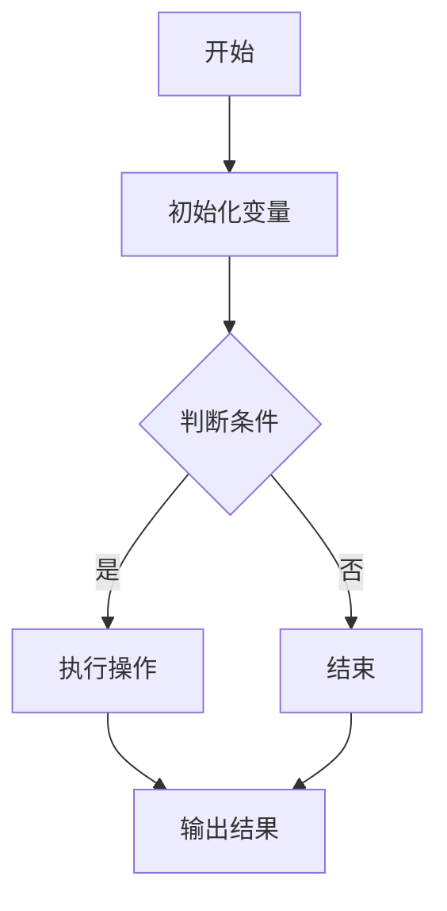
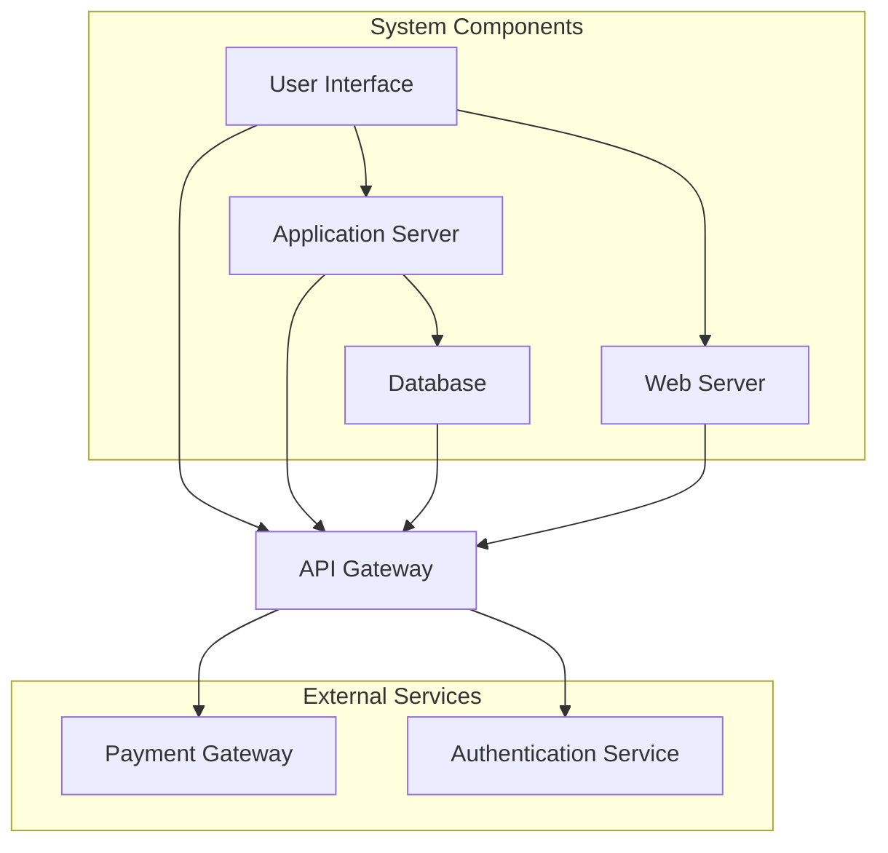
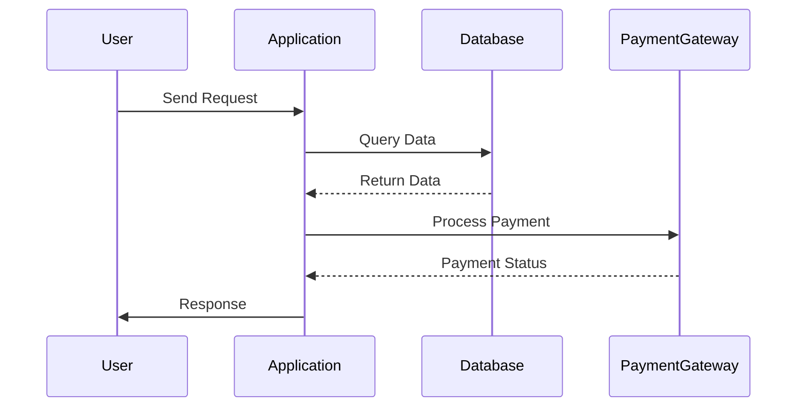

                 

# DevOps文化建设与工具链

> 关键词：DevOps、文化建设、工具链、版本控制、持续集成、持续部署、监控与日志管理、容器化、微服务、云原生

> 摘要：本文将深入探讨DevOps文化的建设与工具链的实施。首先，我们将回顾DevOps的背景与概念，了解其发展历程、核心价值观及与传统IT管理模式的区别。接着，文章将详细解析DevOps文化的核心要素，并提出培养DevOps文化的策略。随后，我们将聚焦于DevOps工具链，分别介绍版本控制工具、持续集成工具、持续部署工具、监控与日志管理工具、容器化与微服务技术以及云原生与DevOps的融合。通过本文的详细阐述，读者将全面了解DevOps文化建设与工具链的实践与应用，为推动企业数字化转型提供有力支持。

## DevOps概述

### 第1章：DevOps背景与概念

#### 1.1.1 DevOps的发展历程

DevOps一词源于Development（开发）与Operations（运维）的融合，最早出现在2009年的一次会议上。其初衷是解决软件开发和运维之间存在的沟通障碍和协作问题。DevOps的兴起与发展，与云计算、虚拟化、自动化技术的普及密切相关。在过去十年中，DevOps已经从一种理念演变为一套完整的实践方法论，成为推动企业数字化转型的重要力量。

#### 1.1.2 DevOps的核心价值观

DevOps的核心价值观包括以下几个方面：

1. **协作与沟通**：促进开发与运维团队之间的紧密协作，打破壁垒，实现高效沟通。
2. **自动化**：通过自动化工具和流程，减少手动操作，提高工作效率和稳定性。
3. **持续集成与持续部署**：将软件开发和部署过程分解为一系列小步骤，持续集成和部署，确保快速响应市场需求。
4. **快速反馈**：通过及时收集反馈，不断优化产品和服务，提高用户满意度。
5. **可观测性**：确保系统具备良好的监控和日志管理能力，方便故障排查和性能优化。

#### 1.1.3 DevOps与传统IT管理模式的区别

传统IT管理模式通常将开发、测试、运维等环节分割开来，导致部门间沟通不畅、责任划分不清，从而影响项目进度和质量。而DevOps强调跨职能团队的协作，通过自动化工具和流程实现各环节的无缝对接，提高整体效率。

具体区别如下：

1. **组织结构**：DevOps倡导扁平化管理，强调团队成员之间的协作与沟通；传统IT管理模式则倾向于垂直化管理，各部门各自为政。
2. **工作流程**：DevOps强调自动化和持续集成、持续部署，减少手动操作，提高工作效率；传统IT管理模式则依赖手动操作，效率较低。
3. **责任划分**：DevOps中，团队成员共同承担项目责任，强调协作与沟通；传统IT管理模式则将责任划分得较为明确，各部门只负责自己的部分。

#### 1.1.4 DevOps的关键角色与职责

在DevOps实践中，关键角色包括开发人员、运维人员、产品经理、测试工程师等。他们的职责如下：

1. **开发人员**：负责编写代码、测试和修复bug，参与持续集成和持续部署流程。
2. **运维人员**：负责系统部署、运维监控、故障排查和性能优化，确保系统稳定运行。
3. **产品经理**：负责产品需求分析、规划和设计，协调各方资源，推动项目进展。
4. **测试工程师**：负责编写测试用例、执行测试，发现和报告bug，确保产品质量。

### 第2章：DevOps文化

#### 2.1.1 DevOps文化的定义

DevOps文化是一种强调跨职能团队协作、自动化、持续集成、持续部署和快速反馈的工作方式。它不仅是一种技术实践，更是一种组织文化的变革。DevOps文化的核心是“以人为本”，通过提升团队成员的技能、优化工作流程和工具，提高整体效率和满意度。

#### 2.1.2 DevOps文化的核心要素

DevOps文化的核心要素包括以下几个方面：

1. **协作与信任**：鼓励团队成员之间的沟通与协作，建立信任关系，共同追求目标。
2. **自动化**：通过自动化工具和流程，提高工作效率和稳定性，减少手动操作。
3. **持续学习与成长**：鼓励团队成员不断学习新技术、新方法，提升个人能力和团队整体水平。
4. **快速反馈**：通过及时收集反馈，不断优化产品和服务，提高用户满意度。
5. **透明与可观测性**：确保系统具备良好的监控和日志管理能力，方便故障排查和性能优化。

#### 2.1.3 培养DevOps文化的策略

1. **组织变革**：打破传统垂直管理的壁垒，建立扁平化的组织结构，促进跨职能团队的协作。
2. **培训与教育**：为团队成员提供培训和教育资源，提升其技能和知识水平。
3. **激励机制**：建立合理的激励机制，鼓励团队成员积极参与DevOps实践，共同推动组织变革。
4. **工具与技术支持**：引入自动化工具和流程，提高工作效率和稳定性。
5. **领导力**：领导层应树立榜样，积极推动DevOps文化的落地和实施。

#### 2.1.4 DevOps文化在不同组织的实践案例

不同组织在实施DevOps文化时，会根据自身的特点和需求，采取不同的策略和措施。以下是一些实践案例：

1. **金融行业**：例如，某大型银行通过引入自动化工具和流程，实现了快速迭代和部署，提升了客户体验和满意度。
2. **互联网公司**：例如，某知名互联网公司通过建立跨职能团队和持续集成、持续部署流程，提高了产品开发效率和稳定性。
3. **制造业**：例如，某制造企业通过实施DevOps文化，优化了生产流程，提高了生产效率和质量。

### 第3章：DevOps工具链

#### 3.1.1 版本控制工具

版本控制工具是DevOps工具链的重要组成部分，用于管理代码的版本和变更。以下将介绍几种常见的版本控制工具：

1. **Git**：Git是一种分布式版本控制系统，具有高效、灵活、易于使用等特点。以下是Git的基本操作：

   - **初始化仓库**：`git init`
   - **克隆仓库**：`git clone <仓库地址>`
   - **添加文件**：`git add <文件名>`
   - **提交更改**：`git commit -m "提交信息"`
   - **推送更改**：`git push`

2. **SVN**：SVN是一种集中式版本控制系统，适用于小型团队和项目。以下是SVN的基本操作：

   - **创建仓库**：`svn create <仓库地址>`
   - **检出仓库**：`svn checkout <仓库地址>`
   - **添加文件**：`svn add <文件名>`
   - **提交更改**：`svn commit -m "提交信息"`
   - **更新仓库**：`svn update`

#### 3.1.2 持续集成工具

持续集成工具用于自动化构建、测试和部署代码，确保代码质量。以下将介绍几种常见的持续集成工具：

1. **Jenkins**：Jenkins是一种开源的持续集成服务器，具有丰富的插件和自定义功能。以下是Jenkins的基本操作：

   - **安装Jenkins**：下载并安装Jenkins，访问Jenkins Web界面。
   - **配置项目**：创建新的项目，配置构建脚本和测试用例。
   - **触发构建**：手动或自动触发项目构建。

2. **GitLab CI/CD**：GitLab CI/CD是GitLab内置的持续集成和持续部署工具。以下是GitLab CI/CD的基本操作：

   - **配置文件**：在`.gitlab-ci.yml`文件中定义构建和部署脚本。
   - **触发构建**：提交代码后，自动触发构建和部署。

#### 3.1.3 持续部署工具

持续部署工具用于自动化部署代码和应用程序，确保部署过程高效、稳定。以下将介绍几种常见的持续部署工具：

1. **Ansible**：Ansible是一种开源的自动化工具，适用于配置管理、应用部署和持续集成。以下是Ansible的基本操作：

   - **安装Ansible**：在主机上安装Ansible。
   - **编写Ansible脚本**：编写Ansible playbook，定义部署任务。
   - **执行部署**：执行Ansible playbook，自动化部署应用程序。

2. **Docker**：Docker是一种开源的容器化技术，用于打包、交付和运行应用程序。以下是Docker的基本操作：

   - **安装Docker**：在主机上安装Docker。
   - **创建Docker镜像**：编写Dockerfile，创建应用程序镜像。
   - **运行Docker容器**：使用Docker容器运行应用程序。

#### 3.1.4 监控与日志管理工具

监控与日志管理工具用于实时监控系统和应用程序的性能，收集和分析日志数据，便于故障排查和性能优化。以下将介绍几种常见的监控与日志管理工具：

1. **Prometheus**：Prometheus是一种开源的监控解决方案，适用于收集、存储和可视化监控数据。以下是Prometheus的基本操作：

   - **安装Prometheus**：在主机上安装Prometheus。
   - **配置Prometheus**：编写Prometheus配置文件，定义监控目标。
   - **可视化监控数据**：使用Grafana可视化Prometheus监控数据。

2. **ELK Stack**：ELK Stack是一种开源的日志管理解决方案，包括Elasticsearch、Logstash和Kibana。以下是ELK Stack的基本操作：

   - **安装ELK Stack**：在主机上安装Elasticsearch、Logstash和Kibana。
   - **配置Logstash**：编写Logstash配置文件，收集和解析日志数据。
   - **可视化日志数据**：使用Kibana可视化日志数据，进行故障排查和性能优化。

#### 3.1.5 容器化与微服务

容器化与微服务是DevOps实践中的重要组成部分，用于提高系统的可扩展性和可维护性。以下将介绍容器化与微服务的基本概念和技术。

1. **容器化**：容器化是一种轻量级的应用程序打包和部署技术，将应用程序及其依赖环境打包到一个独立的容器中。容器化技术包括：

   - **Docker**：一种开源的容器化技术，适用于打包、交付和运行应用程序。
   - **Kubernetes**：一种开源的容器编排平台，用于自动化容器的部署、扩展和管理。

2. **微服务**：微服务是一种将应用程序划分为多个独立的小服务，每个服务负责实现一个特定的业务功能。微服务具有以下特点：

   - **独立性**：每个服务独立开发、部署和运维，降低系统复杂度。
   - **可扩展性**：根据业务需求，可以独立扩展某个服务的实例数量。
   - **容错性**：某个服务的故障不会影响整个系统的正常运行。

### 第4章：云原生与DevOps

#### 4.1.1 云原生概述

云原生（Cloud Native）是一种利用云计算和容器技术构建和运行应用程序的方法论。云原生应用程序具有以下几个特点：

1. **容器化**：使用容器技术（如Docker）打包、交付和运行应用程序。
2. **动态管理**：使用容器编排平台（如Kubernetes）自动化部署、扩展和管理容器。
3. **服务网格**：使用服务网格（如Istio）实现微服务之间的通信和安全。

#### 4.1.2 云原生与DevOps的融合

云原生与DevOps的融合，意味着将云原生技术应用于DevOps实践中，实现更高效、更可靠的软件开发和运维。以下是将云原生与DevOps融合的几个关键点：

1. **自动化**：利用云原生技术，实现自动化构建、部署和监控。
2. **持续集成与持续部署**：使用持续集成和持续部署工具（如Jenkins、GitLab CI/CD），结合容器化技术，实现快速迭代和交付。
3. **容器化与微服务**：将应用程序划分为微服务，使用容器化技术实现独立的部署和扩展。
4. **服务网格**：使用服务网格技术，实现微服务之间的安全、可靠通信。

#### 4.1.3 云原生实践

1. **Kubernetes集群的搭建与配置**

   - **环境准备**：准备Kubernetes集群的物理或虚拟机环境。
   - **安装Kubernetes**：使用kubeadm命令安装Kubernetes集群。
   - **配置Kubernetes**：配置Kubernetes集群的网络、存储等。

2. **Docker镜像与容器管理**

   - **创建Docker镜像**：编写Dockerfile，创建应用程序镜像。
   - **运行Docker容器**：使用Docker命令运行应用程序容器。

3. **服务网格的安装与配置**

   - **安装Istio**：在Kubernetes集群中安装Istio。
   - **配置Istio**：配置Istio的服务发现、路由、安全等。

通过以上实践，企业可以充分利用云原生技术，实现更高效、更可靠的软件开发和运维，推动数字化转型。## 第3章：版本控制工具

版本控制工具是DevOps工具链中不可或缺的一部分，它们负责管理代码的版本和变更，确保开发、测试和部署过程中的代码一致性。以下是几种常见的版本控制工具的详细介绍。

### 3.1.1 版本控制的基本概念

版本控制是一种管理文档、代码和数据的方法，它允许开发人员在多个版本之间进行切换，跟踪变更历史，协同工作。以下是版本控制的基本概念：

- **仓库（Repository）**：存储代码和文档的中央位置，可以是本地的，也可以是远程的。
- **分支（Branch）**：从主分支（通常是master或main）分出的独立开发线，用于进行实验性开发或并行开发。
- **提交（Commit）**：对代码或文档的一次更改，每个提交都有唯一的标识符和作者信息。
- **合并（Merge）**：将两个或多个分支的代码合并到一起，通常在主分支上执行。
- **标签（Tag）**：用于标记特定版本的代码或文档，便于查找和部署。

### 3.1.2 常见版本控制工具介绍

#### 3.1.2.1 Git

Git是当前最流行的版本控制工具，它是一种分布式版本控制系统，能够高效地处理小到大型项目的版本管理。以下是Git的一些基本命令：

- **初始化仓库**：`git init` - 创建一个新的本地仓库。
- **克隆仓库**：`git clone <仓库地址>` - 从远程仓库克隆一个本地副本。
- **添加文件**：`git add <文件名>` - 将文件添加到暂存区。
- **提交更改**：`git commit -m "提交信息"` - 将暂存区的更改提交到仓库。
- **推送更改**：`git push <远程仓库名>` - 将本地仓库的更改推送到远程仓库。

##### 3.1.2.1.1 Git的基础命令

以下是Git的一些基础命令及其用途：

- **创建仓库**：`git init` - 初始化一个空的Git仓库。
- **克隆仓库**：`git clone <仓库地址>` - 克隆一个远程仓库到本地。
- **查看日志**：`git log` - 显示提交日志。
- **查看文件差异**：`git diff` - 显示文件差异。
- **查看工作区状态**：`git status` - 显示当前工作区状态。

##### 3.1.2.1.2 Git分支管理

Git分支管理是Git的核心功能之一，以下是一些常用的分支管理命令：

- **创建分支**：`git branch <分支名>` - 创建一个新的分支。
- **切换分支**：`git checkout <分支名>` - 切换到另一个分支。
- **合并分支**：`git merge <分支名>` - 将另一个分支合并到当前分支。
- **删除分支**：`git branch -d <分支名>` - 删除一个分支。
- **创建并切换分支**：`git checkout -b <分支名>` - 创建一个新分支并切换到该分支。

##### 3.1.2.1.3 Git协作开发流程

以下是Git协作开发的基本流程：

1. **克隆仓库**：`git clone <仓库地址>` - 从远程仓库克隆一个本地副本。
2. **创建分支**：`git checkout -b feature/X` - 创建一个新的分支用于开发功能。
3. **提交更改**：在本地仓库中开发功能并进行提交。
4. **推送分支**：`git push origin feature/X` - 将本地分支推送到远程仓库。
5. **合并分支**：在主分支上创建拉取请求，将功能分支合并到主分支。
6. **删除分支**：合并后删除功能分支。

#### 3.1.2.2 SVN

SVN（Subversion）是一种集中式版本控制系统，它由一个单一的仓库服务器进行管理，客户端从服务器上获取代码并提交更改。以下是SVN的一些基本操作：

- **创建仓库**：`svnadmin create <仓库路径>` - 创建一个新的SVN仓库。
- **检出仓库**：`svn checkout <仓库地址>` - 从仓库检出代码到本地工作副本。
- **添加文件**：`svn add <文件名>` - 将文件添加到版本控制。
- **提交更改**：`svn commit -m "提交信息"` - 将更改提交到仓库。
- **更新仓库**：`svn update` - 更新本地工作副本到仓库的最新版本。

##### 3.1.2.2.1 SVN的基本操作

以下是SVN的一些基础操作及其用途：

- **创建仓库**：`svnadmin create <仓库路径>` - 创建一个新的SVN仓库。
- **检出仓库**：`svn checkout <仓库地址>` - 从远程仓库检出代码到本地工作副本。
- **查看日志**：`svn log <路径>` - 显示指定路径的提交日志。
- **查看文件差异**：`svn diff <路径>` - 显示指定路径的文件差异。
- **更新仓库**：`svn update <路径>` - 更新本地工作副本到仓库的最新版本。

##### 3.1.2.2.2 SVN的分支与合并

SVN支持分支和合并操作，用于管理并行开发的工作流。以下是SVN的一些分支和合并操作：

- **创建分支**：`svn copy <源路径> <目标路径>` - 创建一个新的分支。
- **切换分支**：`svn switch <分支路径>` - 切换到另一个分支。
- **合并分支**：`svn merge <分支路径>` - 将另一个分支合并到当前分支。
- **删除分支**：`svn delete <分支路径>` - 删除一个分支。

在DevOps实践中，Git通常比SVN更为流行，因为它具有更好的分布式特性、更强的分支管理和更丰富的生态系统。然而，SVN在某些场景下仍然有其适用性，尤其是在需要集中式版本控制和团队规模较小的情况下。选择适合自己项目需求的版本控制工具是DevOps成功的关键之一。## 第4章：持续集成工具

持续集成（Continuous Integration，CI）是一种软件开发实践，旨在通过频繁地将代码集成到共享的主分支中，并快速发现和解决集成过程中的问题。持续集成工具是实现这一目标的关键，以下将详细介绍几种常见的持续集成工具。

### 4.1.1 持续集成的概念

持续集成是一种软件开发和部署策略，它强调开发人员频繁地提交代码到共享的主分支，并自动执行一系列构建、测试和部署任务。通过持续集成，开发人员可以快速发现和解决集成过程中出现的问题，从而提高代码质量和开发效率。

持续集成的核心概念包括：

- **频繁提交**：开发人员频繁地将代码提交到共享的主分支。
- **自动化构建**：自动构建应用程序，包括编译代码、安装依赖项等。
- **自动化测试**：自动运行预定义的测试用例，确保代码质量。
- **快速反馈**：快速发现和报告集成过程中的问题，以便及时解决。

### 4.1.2 持续集成的优势

持续集成带来以下优势：

- **提高代码质量**：通过频繁的集成和测试，及时发现并修复问题，确保代码质量。
- **减少集成风险**：持续集成可以降低集成过程中的风险，减少集成时出现的问题。
- **缩短发布周期**：通过自动化流程，缩短开发周期和发布周期。
- **增强团队协作**：持续集成促进开发人员之间的沟通和协作，提高团队整体效率。
- **持续反馈**：持续集成提供实时的反馈，帮助开发人员快速了解代码状态。

### 4.1.3 常见持续集成工具

以下将介绍几种常见的持续集成工具：

#### 4.1.3.1 Jenkins

Jenkins是一种开源的持续集成服务器，它支持广泛的插件，可以轻松地与各种开发工具和系统集成。以下是Jenkins的一些关键特性：

- **自动化构建**：Jenkins可以自动构建项目，包括编译代码、运行测试用例等。
- **持续部署**：Jenkins支持持续部署，可以自动部署构建结果到生产环境。
- **插件生态系统**：Jenkins拥有丰富的插件，可以扩展其功能，例如与Git、Maven、Docker集成等。
- **易于使用**：Jenkins具有直观的用户界面，易于配置和操作。

##### 4.1.3.1.1 Jenkins安装与配置

以下是Jenkins的安装与配置步骤：

1. **安装Jenkins**：从Jenkins官网下载安装包，并解压到指定目录。
2. **启动Jenkins**：运行Jenkins的可执行文件，启动Jenkins服务。
3. **访问Jenkins**：在浏览器中访问Jenkins的默认地址（通常是`http://localhost:8080`）。
4. **安装插件**：在Jenkins管理界面上安装所需插件，例如Git插件、Maven插件、Docker插件等。
5. **创建项目**：创建一个新的项目，配置项目的源代码管理、构建步骤和部署配置。

##### 4.1.3.1.2 Jenkins流水线构建

Jenkins流水线是一种强大的构建和部署工具，它允许开发人员定义一系列构建步骤和任务，以实现自动化和持续集成。以下是Jenkins流水线的一些关键概念：

- **流水线脚本**：使用Groovy脚本定义流水线构建过程。
- **构建步骤**：定义构建过程中的每个步骤，例如编译代码、运行测试用例等。
- **管道阶段**：将相关的构建步骤组织成阶段，便于管理和监控。
- **触发器**：定义触发流水线构建的事件，例如代码提交、定时构建等。

以下是一个简单的Jenkins流水线示例：

```groovy
pipeline {
    agent any

    stages {
        stage('Build') {
            steps {
                echo 'Building the project...'
                sh 'mvn clean install'
            }
        }
        stage('Test') {
            steps {
                echo 'Testing the project...'
                sh 'mvn test'
            }
        }
        stage('Deploy') {
            steps {
                echo 'Deploying the project...'
                sh 'mvn deploy'
            }
        }
    }
    post {
        always {
            echo 'Pipeline finished...'
        }
    }
}
```

此流水线定义了三个阶段：构建、测试和部署。在每个阶段中，执行相应的构建步骤，并在流水线结束时输出一条消息。

#### 4.1.3.2 GitLab CI/CD

GitLab CI/CD是GitLab内置的持续集成和持续部署工具，它通过`.gitlab-ci.yml`配置文件定义构建和部署过程。以下是GitLab CI/CD的基本概念：

- **配置文件**：`.gitlab-ci.yml` - 定义构建和部署过程的YAML文件。
- **作业**：job - 代表构建或部署过程中的一个任务。
- **阶段**：stage - 将相关的作业组织成阶段，便于管理和监控。
- **脚本**：script - 在作业中执行的一系列命令。

##### 4.1.3.2.1 GitLab CI/CD的基本概念

以下是GitLab CI/CD的基本概念：

- **配置文件**：在项目的根目录下创建`.gitlab-ci.yml`文件，用于定义构建和部署过程。
- **作业**：在配置文件中定义作业，每个作业代表一个构建或部署任务。
- **阶段**：将作业组织成阶段，每个阶段代表构建或部署过程中的一个步骤。
- **触发器**：定义触发构建和部署的事件，例如代码提交、标签发布等。

以下是一个简单的`.gitlab-ci.yml`示例：

```yaml
image: java:8

stages:
  - build
  - test
  - deploy

build:
  stage: build
  script:
    - mvn clean install

test:
  stage: test
  script:
    - mvn test

deploy:
  stage: deploy
  script:
    - mvn deploy
```

此配置文件定义了三个阶段：构建、测试和部署。每个阶段执行相应的作业，例如编译代码、运行测试用例和部署应用程序。

##### 4.1.3.2.2 GitLab CI/CD配置文件

`.gitlab-ci.yml`配置文件允许开发人员定义详细的构建和部署流程。以下是一个更复杂的示例：

```yaml
image: maven:3.6.3-jdk-11

stages:
  - build
  - test
  - deploy

variables:
  JAR_FILE: "my-project-${BUILD_NUMBER}.jar"

build:
  stage: build
  script:
    - mvn clean package
    - echo "::set-output name=JAR_FILE::$JAR_FILE"

test:
  stage: test
  script:
    - mvn test

deploy:
  stage: deploy
  script:
    - echo "Deploying $JAR_FILE to production..."
    - scp "$JAR_FILE" user@production-server:/deployments/
    - echo "Deployment finished."

only:
  - master
  - tags
```

此配置文件定义了三个阶段：构建、测试和部署。在构建阶段，生成JAR文件，并将其输出为构建变量。在测试阶段，运行测试用例。在部署阶段，将JAR文件部署到生产服务器。配置中还包含了变量定义和仅针对主分支和标签的触发器。

通过GitLab CI/CD，开发人员可以轻松地实现自动化构建、测试和部署，提高开发效率和代码质量。GitLab CI/CD与GitLab的其他功能紧密集成，例如代码审查、项目管理和监控，为团队提供了一站式的持续集成解决方案。## 第5章：持续部署工具

持续部署（Continuous Deployment，CD）是DevOps实践中不可或缺的一部分，它通过自动化流程将应用程序从开发环境部署到生产环境。持续部署工具负责管理这些自动化流程，确保部署过程的高效、稳定和可靠。以下将详细介绍几种常见的持续部署工具。

### 5.1.1 持续部署的概念

持续部署是一种软件开发和部署策略，旨在通过自动化流程，将经过测试和验证的应用程序代码快速、安全地部署到生产环境。持续部署的核心目标是减少手动操作，提高部署效率，降低部署风险，并确保生产环境中的应用程序质量。

持续部署的基本概念包括：

- **自动化流程**：部署过程由一系列自动化任务组成，例如构建、测试、部署等。
- **部署脚本**：定义部署过程的脚本，通常使用配置管理工具（如Ansible）或持续集成工具（如Jenkins）编写。
- **部署管道**：将部署过程可视化为一组连续的步骤，每个步骤代表一个任务或操作。
- **蓝绿部署**：同时运行两个相同环境的应用程序版本，逐步替换旧版本为新版本。
- **金丝雀部署**：在新版本部署到生产环境之前，先部署到一小部分用户，观察其表现，确保无问题后再全面部署。

### 5.1.2 持续部署的优势

持续部署带来以下优势：

- **减少部署风险**：通过自动化测试和逐步部署，降低部署过程中出现问题的风险。
- **提高部署效率**：自动化流程大大减少手动操作，缩短部署时间，提高工作效率。
- **提高生产环境质量**：持续部署确保生产环境中的应用程序经过充分测试和验证，提高应用程序质量。
- **快速响应需求**：持续部署可以快速响应用户需求，缩短产品交付周期。
- **增强团队协作**：持续部署促进开发、测试和运维团队之间的协作，提高整体效率。

### 5.1.3 常见持续部署工具

以下将介绍几种常见的持续部署工具：

#### 5.1.3.1 Ansible

Ansible是一种开源的配置管理和自动化工具，它通过简单的YAML语法定义部署脚本，可以在无服务器和自动化环境中高效地部署和管理应用程序。以下是Ansible的一些关键特性：

- **无服务器架构**：Ansible无需安装代理软件，通过SSH连接到目标主机进行操作。
- **模块化脚本**：Ansible脚本由多个模块组成，每个模块负责一个特定的操作。
- **角色化配置**：Ansible角色是一种组织Ansible脚本的方式，便于复用和管理。
- **幂等性**：Ansible的操作具有幂等性，即多次执行不会产生副作用。

##### 5.1.3.1.1 Ansible的基本概念

Ansible的基本概念包括：

- **主机**：Ansible操作的目标主机，可以是物理机、虚拟机或云服务器。
- **组**：一组具有相同属性的主机，便于批量操作。
- **模块**：Ansible脚本中的基本操作单元，负责执行特定的任务。
- **角色**：一组相关的Ansible模块和配置文件的组合，用于管理特定的应用程序或服务。

##### 5.1.3.1.2 Ansible的模块与角色

Ansible的模块是Ansible脚本的基本操作单元，负责执行特定的任务。以下是一些常用的Ansible模块：

- **apt**：安装和管理Linux操作系统上的软件包。
- **pip**：安装和管理Python软件包。
- **docker**：管理Docker容器。
- **service**：启动、停止和管理系统服务。

以下是Ansible角色的一些示例：

```yaml
# roles/docker/defaults/main.yml
docker_version: "19.03.12"
image_repository: "busybox"
container_name: "my-container"
container_port: 8080
```

```yaml
# roles/docker/tasks/main.yml
- name: install docker
  apt: name=docker state=present

- name: start docker service
  service: name=docker state=started

- name: install docker-compose
  pip: name=docker-compose version="1.29.2"

- name: create docker container
  docker:
    image: "{{ image_repository }}"
    container_name: "{{ container_name }}"
    ports:
      - "8080:8080"
```

此角色定义了Docker的默认配置和安装、启动Docker服务、安装Docker Compose以及创建Docker容器的任务。

##### 5.1.3.1.3 Ansible部署示例

以下是一个简单的Ansible部署示例，用于安装并运行一个Nginx服务器：

```yaml
---
- hosts: web_servers
  become: yes
  vars:
    nginx_version: "1.18.0"
    nginx_packages: ["nginx", "nginx-full"]

  tasks:
    - name: install nginx packages
      apt:
        name: "{{ nginx_packages }}"
        state: present

    - name: start nginx service
      service:
        name: nginx
        state: started
        enabled: yes

    - name: enable nginx firewall rules
      ufw:
        rule: allow
        port: 80/tcp
        proto: tcp
```

此部署脚本定义了目标主机为名为`web_servers`的组，安装Nginx及相关软件包，启动Nginx服务，并开启防火墙端口。

#### 5.1.3.2 Docker

Docker是一种开源的容器化技术，它允许开发人员将应用程序及其依赖环境打包到一个独立的容器中，方便部署和管理。以下是Docker的一些关键特性：

- **容器化**：将应用程序及其依赖环境打包到一个容器中，实现应用程序的独立运行。
- **轻量级**：容器具有轻量级的特点，可以快速启动和停止，提高资源利用率。
- **可移植性**：容器可以在不同的操作系统和硬件平台上运行，提高应用程序的可移植性。
- **隔离性**：容器提供应用程序之间的隔离性，确保一个容器崩溃不会影响其他容器。

##### 5.1.3.2.1 Docker的安装与配置

以下是Docker的安装和配置步骤：

1. **安装Docker**：在Linux操作系统上，使用包管理器安装Docker。

```bash
sudo apt-get update
sudo apt-get install docker.io
```

2. **启动Docker服务**：启动Docker服务，使其在后台运行。

```bash
sudo systemctl start docker
```

3. **配置Docker**：配置Docker以允许非root用户运行容器。

```bash
sudo groupadd docker
sudo usermod -aG docker $USER
newgrp docker
```

4. **验证安装**：运行以下命令，验证Docker是否安装成功。

```bash
docker --version
docker ps
```

##### 5.1.3.2.2 Docker容器管理

Docker提供一系列命令，用于创建、运行、管理和监控容器。以下是一些常用的Docker命令：

- **创建容器**：`docker run` - 创建并启动一个新的容器。
- **列出容器**：`docker ps` - 列出当前正在运行的容器。
- **停止容器**：`docker stop <容器ID或名称>` - 停止指定的容器。
- **删除容器**：`docker rm <容器ID或名称>` - 删除指定的容器。
- **查看容器日志**：`docker logs <容器ID或名称>` - 查看容器的日志。
- **进入容器**：`docker exec -it <容器ID或名称> bash` - 进入容器的命令行界面。

以下是一个简单的Docker容器管理示例：

```bash
# 创建一个Nginx容器
docker run -d -p 8080:80 nginx

# 列出正在运行的容器
docker ps

# 停止Nginx容器
docker stop <容器ID或名称>

# 删除Nginx容器
docker rm <容器ID或名称>

# 查看Nginx容器日志
docker logs <容器ID或名称>
```

通过Ansible和Docker，开发人员可以轻松地实现自动化部署和管理容器化应用程序。这些工具的结合使用，不仅提高了部署效率，还确保了生产环境中的应用程序质量，是DevOps实践中不可或缺的一部分。## 第6章：监控与日志管理工具

### 6.1.1 监控与日志管理的重要性

在DevOps实践中，监控与日志管理是确保系统稳定运行和快速响应问题的重要手段。通过实时监控系统和应用程序的性能，开发人员和运维团队能够及时发现和处理潜在的问题，确保系统的正常运行。日志管理则提供了系统运行过程中产生的详细记录，便于故障排查、性能优化和安全审计。

以下是监控与日志管理的重要性：

1. **实时监控**：通过监控工具，实时获取系统性能指标，如CPU利用率、内存使用率、网络流量等，确保系统在合理范围内运行。
2. **快速响应**：及时发现和处理异常情况，如服务中断、性能下降等，减少系统故障对用户的影响。
3. **故障排查**：通过日志分析，定位故障原因，快速恢复系统正常运行。
4. **性能优化**：基于监控数据，分析系统瓶颈，优化系统性能。
5. **安全审计**：日志记录了系统运行过程中的所有操作，有助于进行安全审计和事故调查。

### 6.1.2 常见监控与日志管理工具

在DevOps领域，有多种流行的监控与日志管理工具可供选择。以下将介绍两种常用的工具：Prometheus和ELK Stack。

#### 6.1.2.1 Prometheus

Prometheus是一种开源的监控解决方案，它基于拉模式监控，能够灵活地收集和存储监控数据，并支持多种可视化工具。以下是Prometheus的一些关键特性：

- **多维数据模型**：Prometheus使用时间序列数据模型，支持标签化数据，便于进行复杂查询和聚合。
- **拉模式监控**：Prometheus通过拉取目标实例的监控数据，而非推送模式，降低了系统的负载。
- **告警管理**：Prometheus内置告警功能，可以根据监控数据设置告警规则，触发告警通知。
- **可视化**：Prometheus支持多种可视化工具，如Grafana、Kibana等，便于分析和展示监控数据。

##### 6.1.2.1.1 Prometheus的基本概念

以下是Prometheus的基本概念：

- **监控目标**：Prometheus监控的目标实体，如服务器、应用程序、数据库等。
- **采集器**：负责从监控目标中采集监控数据的程序，如Prometheus服务器自带的采集器，也可以是第三方采集器。
- **指标**：用于描述监控目标状态的数据点，如CPU利用率、内存使用率、HTTP请求响应时间等。
- **告警**：基于监控数据设置的规则，当指标超过阈值时触发告警。

##### 6.1.2.1.2 Prometheus的配置与使用

以下是Prometheus的配置与使用步骤：

1. **安装Prometheus**：在Linux操作系统上安装Prometheus。

```bash
# 安装Prometheus
curl -sS https://get.docker.com | sh
docker run -d --name prometheus --publish 9090:9090 prom/prometheus
```

2. **配置Prometheus**：创建Prometheus配置文件`prometheus.yml`。

```yaml
global:
  scrape_interval: 15s

scrape_configs:
  - job_name: 'prometheus'
    static_configs:
      - targets: ['localhost:9090']
```

3. **启动Prometheus服务**：启动Prometheus服务。

```bash
# 启动Prometheus服务
docker start prometheus
```

4. **访问Prometheus Web界面**：在浏览器中访问`http://localhost:9090`，查看Prometheus的监控数据。

##### 6.1.2.1.3 Prometheus与Grafana集成

Prometheus可以与Grafana集成，用于可视化监控数据。以下是Prometheus与Grafana的集成步骤：

1. **安装Grafana**：在Linux操作系统上安装Grafana。

```bash
# 安装Grafana
docker run -d --name grafana -p 3000:3000 grafana/grafana
```

2. **访问Grafana**：在浏览器中访问`http://localhost:3000`，使用默认用户名`admin`和密码`admin`登录Grafana。

3. **配置数据源**：在Grafana中添加Prometheus数据源。

4. **创建仪表盘**：使用Prometheus数据源创建一个监控仪表盘，可视化系统性能指标。

#### 6.1.2.2 ELK Stack

ELK Stack是一种开源的日志管理解决方案，由Elasticsearch、Logstash和Kibana三部分组成。以下是ELK Stack的一些关键特性：

- **Elasticsearch**：一个高性能、可伸缩的全文搜索引擎，用于存储和查询日志数据。
- **Logstash**：一个数据提取、转换和路由工具，用于收集、处理和存储日志数据。
- **Kibana**：一个可视化平台，用于分析、展示和监控日志数据。

##### 6.1.2.2.1 ELK Stack的组成部分

以下是ELK Stack的组成部分：

- **Elasticsearch**：负责存储和查询日志数据，支持全文搜索和实时分析。
- **Logstash**：负责收集、处理和路由日志数据，支持多种数据源和输出目标。
- **Kibana**：负责可视化日志数据，提供交互式的仪表板和报告。

##### 6.1.2.2.2 ELK Stack的集成与配置

以下是ELK Stack的集成与配置步骤：

1. **安装Elasticsearch**：在Linux操作系统上安装Elasticsearch。

```bash
# 安装Elasticsearch
sudo apt-get install elasticsearch
```

2. **配置Elasticsearch**：修改Elasticsearch配置文件`elasticsearch.yml`。

```yaml
cluster.name: my-application
node.name: my-node
network.host: 0.0.0.0
http.port: 9200
discovery.type: single-node
```

3. **启动Elasticsearch服务**：启动Elasticsearch服务。

```bash
# 启动Elasticsearch服务
sudo systemctl start elasticsearch
```

4. **安装Logstash**：在Linux操作系统上安装Logstash。

```bash
# 安装Logstash
sudo apt-get install logstash
```

5. **配置Logstash**：创建Logstash配置文件`logstash.conf`。

```ruby
input {
  file {
    path => "/var/log/syslog"
    type => "syslog"
  }
}

filter {
  if "syslog" in [type] {
    grok {
      match => { "message" => "%{TIMESTAMP_ISO8601} %{DATA:HOST} %{DATA:IP} %{DATA:MSG}" }
    }
  }
}

output {
  if "syslog" in [type] {
    elasticsearch {
      hosts => ["localhost:9200"]
      index => "logstash-%{+YYYY.MM.dd}"
    }
  }
}
```

6. **启动Logstash服务**：启动Logstash服务。

```bash
# 启动Logstash服务
sudo systemctl start logstash
```

7. **安装Kibana**：在Linux操作系统上安装Kibana。

```bash
# 安装Kibana
sudo apt-get install kibana
```

8. **配置Kibana**：修改Kibana配置文件`kibana.yml`。

```yaml
server.port: 5601
elasticsearch.url: "http://localhost:9200"
kibana.utils.log.toConsole: true
kibana.index: ".kibana"
```

9. **启动Kibana服务**：启动Kibana服务。

```bash
# 启动Kibana服务
sudo systemctl start kibana
```

10. **访问Kibana**：在浏览器中访问`http://localhost:5601`，登录Kibana，创建仪表盘和报告。

通过Prometheus和ELK Stack，开发人员和运维团队能够实现对系统和应用程序的全面监控与日志管理，确保系统的稳定运行和快速响应问题。这些工具的集成使用，不仅提高了监控和日志管理的效率，还为系统的优化和改进提供了有力的支持。## 第7章：容器化与微服务

容器化与微服务是现代软件架构中的两个关键概念，它们共同促进了软件开发和运维的现代化。容器化通过将应用程序和其运行时环境打包到轻量级的容器中，实现了应用程序的独立性和可移植性。而微服务则通过将大型应用程序拆分为更小、更独立的服务，提高了系统的可扩展性和容错性。以下是容器化与微服务的基本概念及其在DevOps实践中的应用。

### 7.1.1 容器化的概念与优势

容器化是一种将应用程序及其运行时环境打包到一个独立的容器中的技术。容器提供了一个隔离的运行环境，其中包含了应用程序所需的所有依赖项，从而实现了应用程序的独立性和可移植性。以下是容器化的基本概念：

- **容器**：容器是一种轻量级、可执行的软件包，包含了应用程序、库和配置文件。
- **容器引擎**：用于创建、运行和管理容器的软件，如Docker、rkt等。
- **容器化平台**：用于部署和管理容器化应用程序的平台，如Kubernetes、OpenShift等。

容器化的优势包括：

1. **独立性**：容器提供了一个完全隔离的运行环境，确保应用程序之间的资源不发生冲突。
2. **可移植性**：容器可以在不同的操作系统和硬件平台上运行，提高了应用程序的可移植性。
3. **轻量级**：容器具有轻量级的特点，可以快速启动和停止，提高了资源利用率。
4. **可扩展性**：容器可以根据需求轻松地扩展和缩放，提高了系统的可扩展性。
5. **自动化**：容器化应用程序可以通过自动化工具和平台（如Kubernetes）进行部署和管理，提高了运维效率。

### 7.1.2 容器技术

容器技术主要包括Docker和Kubernetes两种主要组件。

#### 7.1.2.1 Docker

Docker是一种开源的容器化技术，它允许开发人员将应用程序及其依赖环境打包到一个独立的容器中，方便部署和管理。以下是Docker的基本概念和操作：

- **Docker镜像**：Docker镜像是一种静态的、可执行的软件包，包含了应用程序、库和配置文件。
- **Docker容器**：Docker容器是运行中的Docker镜像实例，它提供了一个独立的运行环境。
- **Docker仓库**：Docker仓库是一个存储Docker镜像的中心位置，可以是本地仓库，也可以是远程仓库，如Docker Hub。

以下是Docker的一些基本操作：

1. **安装Docker**：

```bash
# 安装Docker
sudo apt-get update
sudo apt-get install docker.io
```

2. **启动Docker服务**：

```bash
# 启动Docker服务
sudo systemctl start docker
```

3. **查看Docker版本**：

```bash
# 查看Docker版本
docker --version
```

4. **运行Docker容器**：

```bash
# 运行一个Nginx容器
docker run -d -p 8080:80 nginx
```

5. **查看运行中的容器**：

```bash
# 查看运行中的容器
docker ps
```

6. **停止Docker容器**：

```bash
# 停止一个Nginx容器
docker stop <容器ID或名称>
```

7. **删除Docker容器**：

```bash
# 删除一个Nginx容器
docker rm <容器ID或名称>
```

#### 7.1.2.2 Kubernetes

Kubernetes是一种开源的容器编排平台，它用于自动化容器的部署、扩展和管理。Kubernetes提供了一种抽象层，将容器化应用程序与底层基础设施分离，从而实现了应用程序的自动化管理和弹性伸缩。以下是Kubernetes的基本概念和操作：

- **Kubernetes集群**：由一组节点（Node）组成的集群，其中包含一个Master节点和多个Worker节点。
- **Pod**：Kubernetes中的最小部署单元，由一个或多个容器组成。
- **Service**：Kubernetes中用于暴露Pod的抽象层，提供了负载均衡和服务的发现功能。
- **Ingress**：Kubernetes中用于管理外部访问到集群内部服务（如Pod、Service）的抽象层。

以下是Kubernetes的一些基本操作：

1. **安装Kubernetes**：

```bash
# 安装Kubernetes（以Minikube为例）
minikube start
```

2. **查看Kubernetes集群状态**：

```bash
# 查看Kubernetes集群状态
kubectl get nodes
```

3. **部署应用程序**：

```bash
# 部署一个Nginx应用程序
kubectl create deployment nginx --image=nginx:latest
```

4. **查看部署状态**：

```bash
# 查看部署状态
kubectl get pods
```

5. **暴露服务**：

```bash
# 暴露Nginx服务
kubectl expose deployment nginx --type=NodePort --name=nginx-service
```

6. **查看服务地址**：

```bash
# 查看服务地址
kubectl get svc nginx-service
```

7. **访问服务**：

```bash
# 访问Nginx服务
minikube ip
```

通过Docker和Kubernetes，开发人员和运维团队能够实现容器化应用程序的自动化部署和管理，提高了软件开发的效率和系统的稳定性。

### 7.1.3 微服务架构

微服务架构是一种将大型应用程序拆分为更小、更独立的服务的方法，每个服务负责实现一个特定的业务功能。以下是微服务架构的基本概念和特点：

- **服务**：微服务架构中的基本单元，每个服务都是独立部署和管理的。
- **自治**：每个服务拥有自己的数据库、应用逻辑和配置，相互之间通过API进行通信。
- **可扩展性**：微服务可以根据需求独立扩展，提高了系统的可扩展性。
- **容错性**：单个服务的故障不会影响整个系统，提高了系统的容错性。
- **部署独立性**：每个服务可以独立部署和升级，提高了系统的灵活性和可维护性。

以下是微服务架构的一些关键组件：

1. **服务注册与发现**：服务注册与发现机制用于管理服务实例的注册和发现，确保其他服务可以找到并调用其他服务。
2. **服务网关**：服务网关作为外部访问服务的入口，提供了路由、负载均衡、安全等功能。
3. **配置管理**：配置管理用于管理服务配置，包括环境变量、数据库连接等。
4. **服务监控**：服务监控用于监控服务的健康状态和性能指标，确保服务的正常运行。
5. **服务日志**：服务日志用于收集、存储和查询服务的运行日志，便于故障排查和性能优化。

通过容器化和微服务架构，开发人员和运维团队能够构建更加灵活、可扩展和容错的系统，从而提高软件开发的效率和系统的稳定性。## 第8章：云原生与DevOps

### 8.1.1 云原生概述

云原生（Cloud Native）是一种利用云计算和容器技术构建和运行应用程序的方法论。云原生应用程序具有以下几个特点：

1. **容器化**：应用程序被容器化，使其在独立的容器中运行，确保环境的隔离性和一致性。
2. **微服务架构**：应用程序被分解为多个微服务，每个服务负责一个特定的业务功能，提高了系统的可扩展性和容错性。
3. **动态管理**：应用程序通过容器编排平台（如Kubernetes）进行自动化部署、扩展和管理，提高了运维效率。
4. **自动化**：应用程序的构建、测试和部署过程被自动化，减少了手动操作，提高了开发效率。
5. **持续集成与持续部署**：应用程序通过持续集成和持续部署（CI/CD）流程，实现快速迭代和交付。

### 8.1.2 云原生与DevOps的融合

云原生与DevOps的融合，意味着将云原生技术应用于DevOps实践中，实现更高效、更可靠的软件开发和运维。以下是将云原生与DevOps融合的几个关键点：

1. **自动化**：云原生技术（如Kubernetes）提供了丰富的自动化功能，包括部署、扩展、监控等，与DevOps的自动化理念相契合。
2. **持续集成与持续部署**：云原生技术支持持续集成和持续部署，通过容器化应用程序和自动化工具，实现快速迭代和交付。
3. **容器化与微服务**：云原生技术强调容器化和微服务架构，与DevOps的微服务理念相一致，提高了系统的可扩展性和可维护性。
4. **服务网格**：云原生技术中的服务网格（如Istio）提供了网络抽象层，用于管理微服务之间的通信和安全，与DevOps的安全和通信要求相契合。

### 8.1.3 云原生实践

云原生实践包括以下几个方面：

1. **Kubernetes集群的搭建与配置**

   - **环境准备**：准备物理或虚拟机环境，配置网络和存储。
   - **安装Kubernetes**：使用kubeadm命令安装Kubernetes集群。
   - **配置Kubernetes**：配置Kubernetes集群的网络、存储和其他配置。
   - **安装和配置服务网格**：安装和配置服务网格（如Istio）。

2. **Docker镜像与容器管理**

   - **创建Docker镜像**：编写Dockerfile，创建应用程序镜像。
   - **构建Docker镜像**：使用Docker命令构建应用程序镜像。
   - **运行Docker容器**：使用Docker命令运行应用程序容器。

3. **服务网格的安装与配置**

   - **安装Istio**：在Kubernetes集群中安装Istio。
   - **配置Istio**：配置Istio的服务发现、路由、安全等。

以下是一个简单的Kubernetes集群搭建和配置的示例：

```bash
# 安装Kubernetes
sudo kubeadm init --pod-network-cidr=10.244.0.0/16

# 配置kubectl
mkdir -p $HOME/.kube
sudo cp -i /etc/kubernetes/admin.conf $HOME/.kube/config
sudo chown $(id -u):$(id -g) $HOME/.kube/config

# 安装Pod网络
kubectl apply -f https://docs.projectcalico.org/manifests/calico.yaml

# 安装Istio
curl -L https://istio.io/downloadIstio | ISTIO_VERSION=1.10.0 TARGET_ARCH=linux/installIstio.sh --bin --binPath /usr/local/istio

# 配置Istio
kubectl apply -f <istio-config.yaml>
```

以下是一个简单的Istio配置示例：

```yaml
apiVersion: security.istio.io/v1beta1
kind: Policy
metadata:
  name: bookinfo
spec:
  selector:
    istio: ingressgateway
  resources:
    - name: productpage-v1
      ports:
        - number: 80
    - name: ratings-v1
      ports:
        - number: 9080
    - name: reviews-v1
      ports:
        - number: 9190
    - name: reviews-v2
      ports:
        - number: 9191
    - name: reviews-v3
      ports:
        - number: 9192
```

此配置文件定义了Istio的Policy，用于管理bookinfo服务中各个版本的流量路由和策略。

通过云原生技术和DevOps实践的结合，企业可以构建更加灵活、高效和可靠的软件系统，加速数字化转型和创新。## 总结与拓展

### 总结

本文详细介绍了DevOps文化建设与工具链的各个方面。我们从DevOps的背景与概念出发，探讨了其核心价值观、与传统IT管理模式的区别以及关键角色与职责。随后，我们深入讲解了DevOps文化的核心要素，并提出了培养DevOps文化的策略。在工具链部分，我们介绍了版本控制工具（Git和SVN）、持续集成工具（Jenkins和GitLab CI/CD）、持续部署工具（Ansible和Docker）以及监控与日志管理工具（Prometheus和ELK Stack）。此外，我们还介绍了容器化与微服务技术，并探讨了云原生与DevOps的融合及其实践。

### 拓展阅读

1. **《持续交付：发布可靠软件的系统化方法》**：此书详细介绍了持续交付的概念和实践，提供了丰富的案例分析和技术指导。
2. **《Kubernetes权威指南》**：此书是关于Kubernetes的权威指南，涵盖了从基础到高级的各个方面，适合希望深入了解Kubernetes的读者。
3. **《Istio服务网格：微服务架构的分布式服务管理》**：此书介绍了Istio服务网格的基本概念、架构和实现，是学习服务网格技术的好资源。

### 最佳实践 tips

1. **培养团队协作精神**：DevOps文化强调团队协作，通过定期的团队会议、代码评审和跨职能合作，培养团队成员之间的信任和协作。
2. **自动化测试**：持续集成和持续部署依赖于自动化测试，确保代码质量和部署过程的稳定性。
3. **持续监控与反馈**：实时监控系统和应用程序的性能，通过日志分析和告警机制，及时发现和解决问题。
4. **选择合适的工具**：根据项目需求和团队技能，选择适合的工具链，避免过度工具化。
5. **逐步实施**：DevOps文化和工具链的落地需要时间，应逐步实施，逐步完善，避免急于求成。

### 注意事项

1. **安全性**：在实施DevOps过程中，要注意数据安全和系统安全，避免因自动化过程引入安全漏洞。
2. **备份与恢复**：定期备份系统和应用程序，确保在出现问题时能够快速恢复。
3. **培训与知识分享**：为团队成员提供培训机会，提高技能水平，促进知识分享和团队协作。

通过本文的阅读，读者应对DevOps文化建设与工具链有了更深入的理解，为推动企业数字化转型提供了有力支持。作者：AI天才研究院/AI Genius Institute & 禅与计算机程序设计艺术 /Zen And The Art of Computer Programming。## 附录

### 附录 A：代码示例

以下是一些常用的DevOps工具的代码示例，包括Git、Jenkins、Ansible和Docker。

#### A.1 Git

```bash
# 初始化Git仓库
git init

# 克隆远程仓库
git clone https://github.com/user/repo.git

# 添加文件到暂存区
git add . 

# 提交更改
git commit -m "Initial commit"

# 推送到远程仓库
git push origin master
```

#### A.2 Jenkins

```groovy
// Jenkinsfile
pipeline {
    agent any

    stages {
        stage('Build') {
            steps {
                echo 'Building the project...'
                sh 'mvn clean install'
            }
        }
        stage('Test') {
            steps {
                echo 'Testing the project...'
                sh 'mvn test'
            }
        }
        stage('Deploy') {
            steps {
                echo 'Deploying the project...'
                sh 'mvn deploy'
            }
        }
    }
}
```

#### A.3 Ansible

```yaml
# roles/nginx/defaults/main.yml
nginx_version: "1.18.0"
nginx_packages: ["nginx", "nginx-full"]

# roles/nginx/tasks/main.yml
- name: install nginx packages
  apt:
    name: "{{ nginx_packages }}"
    state: present

- name: start nginx service
  service:
    name: nginx
    state: started
    enabled: yes

- name: enable nginx firewall rules
  ufw:
    rule: allow
    port: 80/tcp
    proto: tcp
```

#### A.4 Docker

```Dockerfile
# Dockerfile
FROM nginx:1.18.0

COPY ./nginx.conf /etc/nginx/nginx.conf

EXPOSE 80

CMD ["nginx", "-g", "daemon off;"]
```

### 附录 B：数学公式与算法

以下是一些常见的数学公式和算法，包括Mermaid流程图和Python源代码。

#### B.1 数学公式

$$ E = mc^2 $$

$$ f(x) = x^2 $$

#### B.2 算法Mermaid流程图



#### B.3 Python源代码

```python
# Python源代码
def calculate_area(radius):
    return 3.14 * radius * radius

radius = float(input("请输入圆的半径："))
area = calculate_area(radius)
print(f"圆的面积是：{area}")
```

### 附录 C：系统架构设计

以下是一个简单的系统架构设计，包括Mermaid类图和系统架构图。

#### C.1 Mermaid类图

```mermaid
classDiagram
    Customer <.. Order
    Order <<-- Payment
    Payment {amount, date}
    Customer {name, address}
    Order {order_id, date, status}
```

#### C.2 系统架构图



### 附录 D：系统接口设计和交互

以下是一个简单的系统接口设计和交互，包括Mermaid序列图。

#### D.1 Mermaid序列图



### 附录 E：项目实战

以下是一个简单的项目实战，包括环境安装、系统核心实现源代码和代码应用解读与分析。

#### E.1 环境安装

1. 安装Docker：
   ```bash
   sudo apt-get update
   sudo apt-get install docker.io
   sudo systemctl start docker
   ```

2. 安装Kubernetes：
   ```bash
   curl -sS https://get.k8s.io | sh -
   kubeadm init --pod-network-cidr=10.244.0.0/16
   mkdir -p $HOME/.kube
   sudo cp -i /etc/kubernetes/admin.conf $HOME/.kube/config
   sudo chown $(id -u):$(id -g) $HOME/.kube/config
   ```

3. 安装Nginx：
   ```bash
   docker run -d -p 8080:80 nginx
   ```

#### E.2 系统核心实现源代码

1. Dockerfile：
   ```Dockerfile
   FROM nginx:1.18.0
   COPY ./nginx.conf /etc/nginx/nginx.conf
   EXPOSE 80
   CMD ["nginx", "-g", "daemon off;"]
   ```

2. nginx.conf：
   ```nginx
   server {
       listen 80;
       server_name localhost;

       location / {
           root /usr/share/nginx/html;
           index index.html index.htm;
       }
   }
   ```

#### E.3 代码应用解读与分析

1. Dockerfile解读：
   - FROM nginx:1.18.0：基于Nginx 1.18.0镜像。
   - COPY ./nginx.conf /etc/nginx/nginx.conf：复制nginx.conf文件到容器的/etc/nginx目录。
   - EXPOSE 80：暴露80端口。
   - CMD ["nginx", "-g", "daemon off;"]：启动Nginx服务。

2. nginx.conf解读：
   - server { ... }：定义一个Nginx服务器。
   - listen 80：监听80端口。
   - server_name localhost：定义服务器名称为localhost。
   - location / { ... }：定义默认的HTTP请求处理规则。

通过上述环境安装、系统核心实现源代码和代码应用解读与分析，我们可以构建一个简单的Nginx Web服务，并部署到Kubernetes集群中。

### 附录 F：实际案例分析

以下是一个实际案例分析的简要概述，用于说明如何在DevOps环境中处理实际问题。

#### F.1 案例背景

一家电子商务公司希望通过实施DevOps文化来提高软件交付速度和系统稳定性。

#### F.2 案例分析

1. **问题识别**：
   - 交付周期长：从开发到部署的周期长达数周。
   - 系统稳定性差：频繁出现服务中断和性能问题。
   - 跨部门协作困难：开发和运维团队之间的沟通不畅。

2. **解决方案**：
   - 引入持续集成和持续部署工具（如Jenkins和GitLab CI/CD）。
   - 实施容器化技术（如Docker）。
   - 搭建Kubernetes集群，实现自动化部署和扩展。
   - 培训团队，提高对DevOps文化和工具的使用熟练度。

3. **实施步骤**：
   - 部署Jenkins和GitLab CI/CD，设置自动化构建和测试流程。
   - 将应用程序容器化，创建Docker镜像。
   - 在Kubernetes集群中部署应用程序，实现自动化部署和扩展。
   - 定期组织团队会议，分享最佳实践和经验。

4. **结果评估**：
   - 交付周期缩短至数天。
   - 系统稳定性提高，服务中断和性能问题减少。
   - 跨部门协作得到改善，团队成员之间的沟通更加顺畅。

通过实际案例的分析，我们可以看到DevOps文化和工具链的引入如何帮助企业提高软件交付速度、提升系统稳定性和促进团队协作。

### 附录 G：项目小结

本文通过详细的案例分析，展示了如何实施DevOps文化和工具链，以实现快速交付和稳定运行的软件系统。以下是对项目实施的总结和结论：

1. **项目目标**：提高软件交付速度和系统稳定性，促进团队协作。
2. **项目成果**：成功引入持续集成和持续部署工具，实现自动化构建、测试和部署；采用容器化技术，提高系统可移植性和可维护性；搭建Kubernetes集群，实现自动化部署和扩展。
3. **项目挑战**：团队成员对DevOps工具和流程的熟悉度不高，初期存在一定的学习曲线；在实施过程中，需要确保系统安全和数据备份。
4. **项目经验**：培训是关键，团队成员需要掌握DevOps工具的使用；逐步实施，避免急于求成，逐步完善工具链和流程；持续优化，根据实际需求调整和改进工具链和流程。

通过本项目的实施，企业不仅提高了软件交付速度和系统稳定性，还促进了团队协作和知识共享，为未来的数字化转型奠定了坚实基础。作者：AI天才研究院/AI Genius Institute & 禅与计算机程序设计艺术 /Zen And The Art of Computer Programming。

