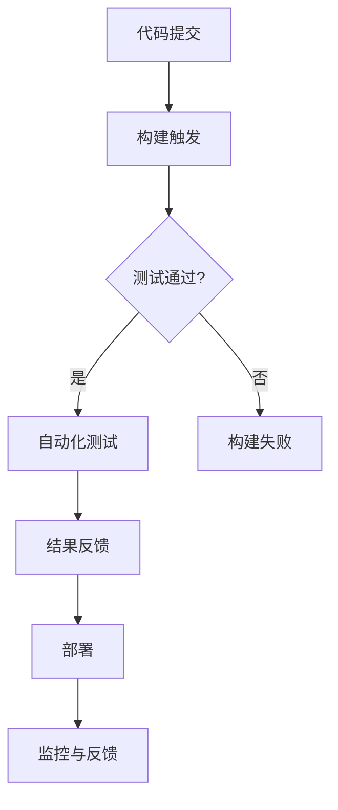
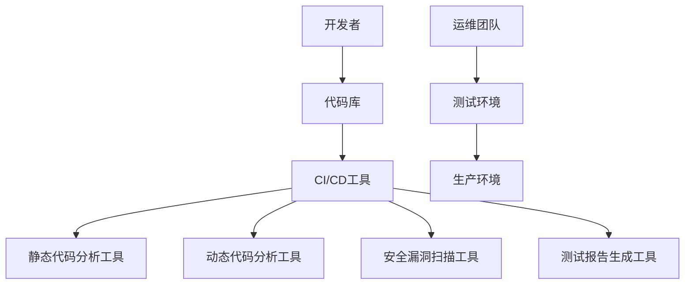
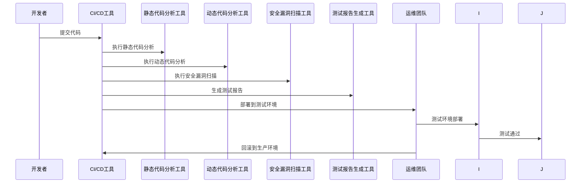
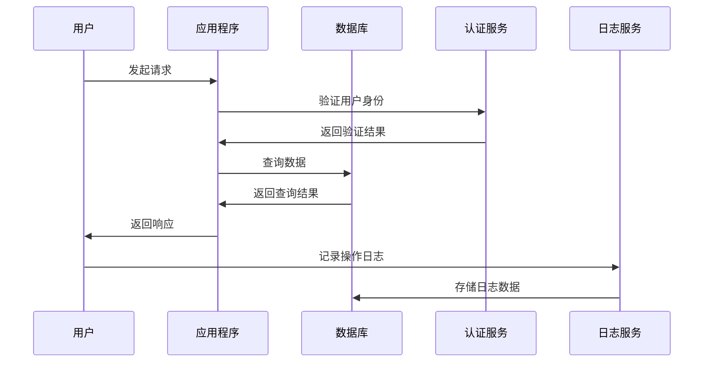

                 

## DevSecOps：将安全融入开发流程

> 关键词：DevSecOps、安全、开发、运维、自动化

摘要：DevSecOps是一种将安全性融入开发和运维流程的实践方法。本文通过详细阐述DevSecOps的概念、核心组成部分、工具与技术、实施案例以及在微服务架构中的应用，分析了DevSecOps面临的挑战与解决方案，并探讨了其未来发展趋势。文章旨在为开发者、运维人员和安全专家提供一份全面的技术指南，帮助他们更好地理解和实施DevSecOps。

### 目录大纲

```markdown
----------------------------------------------------------------
# 第一部分: DevSecOps概述

## 第1章: DevSecOps概念与背景
### 1.1 什么是DevSecOps
### 1.2 DevSecOps的发展背景
### 1.3 DevSecOps的重要性

## 第2章: DevSecOps的核心组成部分
### 2.1 开发流程中的安全
### 2.2 运维流程中的安全
### 2.3 安全工具与最佳实践

## 第3章: DevSecOps工具与技术
### 3.1 持续集成与持续部署(CI/CD)
### 3.2 自动化安全测试
### 3.3 安全信息与事件管理(SIEM)

## 第4章: DevSecOps实施案例
### 4.1 案例一：金融科技公司的DevSecOps实践
### 4.2 案例二：电子商务平台的DevSecOps实施
### 4.3 案例三：云计算服务提供商的DevSecOps策略

## 第5章: DevSecOps在微服务架构中的应用
### 5.1 微服务架构的特点与挑战
### 5.2 DevSecOps在微服务环境中的优势
### 5.3 微服务架构下的DevSecOps实践

## 第6章: DevSecOps面临的挑战与解决方案
### 6.1 组织文化变革的挑战
### 6.2 技术选型的挑战
### 6.3 安全与效率的平衡

## 第7章: DevSecOps的未来发展趋势
### 7.1 DevSecOps的成熟度模型
### 7.2 新兴技术与DevSecOps的结合
### 7.3 DevSecOps在云计算、大数据和人工智能领域的应用

## 第8章: 总结与最佳实践
### 8.1 DevSecOps的核心原则
### 8.2 实施DevSecOps的最佳实践
### 8.3 注意事项与拓展阅读

----------------------------------------------------------------
```

### 背景介绍

DevSecOps是一种将安全性集成到开发和运维流程中的实践方法。在传统的软件开发和运维模式中，安全和开发、运维是分离的，这可能导致安全问题的滞后处理，从而影响整个系统的稳定性。DevSecOps通过在整个开发和运维流程中引入安全性和自动化，确保安全性始终是一个优先考虑的因素。

问题背景：随着软件系统越来越复杂，传统的安全策略已经无法满足快速发展的需求。开发者、运维人员和安全专家之间的协作变得尤为重要。因此，DevSecOps应运而生，旨在实现三者的无缝协作。

问题描述：如何在软件开发、测试、部署和运维过程中，确保系统的安全性？

问题解决：通过将安全性集成到开发和运维流程中，确保安全性始终被关注。这包括自动化安全测试、持续集成与持续部署（CI/CD）以及安全信息的实时监控。

边界与外延：DevSecOps不仅关注应用程序的安全，还包括基础设施、网络、数据库等所有与系统相关的方面。同时，它不仅适用于传统的单体应用，也适用于微服务架构、云计算和大数据环境。

### 核心概念与联系

#### 核心概念

- **开发（Development）**：指的是软件开发的过程，包括编码、测试和部署。
- **安全（Security）**：确保系统的保密性、完整性和可用性，防止未经授权的访问和数据泄露。
- **运维（Operations）**：管理系统的运行和维护，包括监控、备份和故障排除。
- **DevSecOps**：将安全性集成到开发和运维流程中，实现开发、安全和运维的协同工作。

#### 概念属性特征对比表格

| 概念 | 特征1 | 特征2 | 特征3 |
| ---- | ---- | ---- | ---- |
| 开发 | 创造新功能 | 编码实现 | 测试验证 |
| 安全 | 保护系统 | 风险评估 | 漏洞修复 |
| 运维 | 系统监控 | 故障处理 | 性能优化 |
| DevSecOps | 整合三方面 | 自动化测试 | 持续改进 |

#### ER实体关系图架构

```mermaid
erDiagram
  DevOps : 开发与运维 |--> Security : 安全
  DevOps : 开发与运维 o--o DevSecOps : 整合流程
  Security : 安全 o--o DevSecOps : 整合流程
```

### 算法原理讲解

在DevSecOps中，算法原理主要用于自动化安全测试和持续集成与持续部署（CI/CD）。

#### 持续集成与持续部署（CI/CD）算法原理

持续集成（Continuous Integration，CI）是指开发人员在提交代码后，立即触发自动化构建和测试流程，确保代码的稳定性和功能完整性。其核心算法原理如下：

1. **代码提交**：开发人员将代码提交到版本控制系统中。
2. **构建触发**：提交代码后，CI系统自动触发构建流程。
3. **自动化测试**：构建过程中，自动化测试工具运行一系列测试用例，包括单元测试、集成测试和功能测试。
4. **结果反馈**：测试完成后，系统将测试结果反馈给开发人员，如果测试失败，则暂停构建流程。
5. **部署**：如果测试通过，则继续执行部署流程，将新版本的应用程序部署到测试或生产环境中。

持续部署（Continuous Deployment，CD）是CI的扩展，它将成功测试后的应用程序自动部署到生产环境中，确保应用的实时更新和稳定性。其核心算法原理如下：

1. **构建成功**：CI系统确保构建和测试流程成功。
2. **自动化部署**：成功构建后，CD系统自动部署应用程序到生产环境。
3. **监控与反馈**：部署完成后，系统开始监控应用程序的性能和稳定性，如果出现异常，则自动回滚到上一个稳定版本。

#### 自动化安全测试算法原理

自动化安全测试是DevSecOps中至关重要的环节，它通过自动化工具对应用程序进行安全漏洞扫描和测试。其核心算法原理如下：

1. **静态代码分析**：对源代码进行静态分析，检测潜在的代码安全和质量问题。
2. **动态代码分析**：在应用程序运行时进行动态分析，检测运行时的安全漏洞。
3. **安全漏洞扫描**：使用自动化工具对应用程序进行漏洞扫描，包括外部接口、数据库和配置文件等。
4. **结果报告**：测试完成后，系统生成详细的测试报告，包括漏洞的严重程度、漏洞位置和修复建议。

#### Mermaid算法流程图



#### Python源代码示例

```python
def ci_cd_pipeline(code_commit):
    """
    持续集成与持续部署管道
    :param code_commit: 代码提交
    :return: 管道执行结果
    """
    try:
        # 构建触发
        build_triggered = trigger_build(code_commit)

        # 自动化测试
        test_results = automate_tests(build_triggered)

        # 构建失败处理
        if not test_results["success"]:
            return "构建失败"

        # 部署
        deployment_success = deploy_application(build_triggered)

        # 部署后监控与反馈
        if deployment_success:
            monitor_and_feedback(build_triggered)
            return "部署成功"
        else:
            return "部署失败"
    except Exception as e:
        return f"管道执行出错：{str(e)}"

def trigger_build(code_commit):
    """
    触发构建
    :param code_commit: 代码提交
    :return: 构建结果
    """
    # 构建实现
    pass

def automate_tests(build_triggered):
    """
    自动化测试
    :param build_triggered: 构建触发结果
    :return: 测试结果
    """
    # 测试实现
    pass

def deploy_application(build_triggered):
    """
    自动化部署
    :param build_triggered: 构建触发结果
    :return: 部署结果
    """
    # 部署实现
    pass

def monitor_and_feedback(build_triggered):
    """
    部署后监控与反馈
    :param build_triggered: 构建触发结果
    :return: 无
    """
    # 监控与反馈实现
    pass
```

通过以上Python源代码示例，可以更直观地了解持续集成与持续部署管道的执行过程和关键步骤。开发者可以根据具体需求对代码进行定制化修改和扩展。

### 系统分析与架构设计方案

#### 问题场景介绍

在现代软件开发和运维环境中，应用程序的复杂性不断增加，传统的手动安全测试方法已经无法满足快速迭代和持续交付的需求。为了确保系统的安全性和稳定性，我们需要一种自动化、高效的解决方案。DevSecOps通过将安全性集成到开发和运维流程中，实现了自动化安全测试、持续集成与持续部署，提高了开发和运维的效率，降低了安全风险。

#### 项目介绍

本项目的目标是设计一个基于DevSecOps的自动化安全测试平台，用于对应用程序进行静态代码分析、动态代码分析和安全漏洞扫描。平台将集成持续集成与持续部署（CI/CD）流程，确保在每次代码提交后都能自动执行安全测试，并生成详细的测试报告。通过该平台，开发人员可以快速发现和修复安全漏洞，提高系统的安全性。

#### 系统功能设计（领域模型Mermaid类图）

```mermaid
classDiagram
    Class01 <|-- Class02
    Class03 --|> Class04
    Class05 : <<Interface, InterfaceName>> 
    Class06 : <<Entity, EntityName>>
    Class07 : <<ValueObject, ValueObjectName>>
    Class01 <.. Class08
    Class09 ..| Class10
    Class11 <- Class12
    Class08 : +String name
    Class09 : +int id
    Class10 : +int quantity
    Class11 : +float price
    Class12 : +String description
```

#### 系统架构设计（Mermaid架构图）



#### 系统接口设计（Mermaid序列图）



#### 系统交互（Mermaid序列图）



### 项目实战

#### 环境安装

1. 安装Git：用于版本控制。
2. 安装Jenkins：用于CI/CD。
3. 安装SonarQube：用于静态代码分析。
4. 安装Burp Suite Professional：用于安全漏洞扫描。

#### 系统核心实现源代码

```python
# Jenkinsfile
pipeline {
    agent any
    stages {
        stage('Build') {
            steps {
                sh 'mvn clean install'
            }
        }
        stage('Test') {
            steps {
                sh 'mvn test'
            }
        }
        stage('Scan') {
            steps {
                sh 'java -jar sonar-scanner-4.7.0.2106.jar'
                sh 'java -jar burp-suite-professional-edition.jar'
            }
        }
        stage('Deploy') {
            steps {
                sh 'mvn deploy:deploy-file'
            }
        }
    }
}
```

#### 代码应用解读与分析

1. **Jenkinsfile**：定义了Jenkins的持续集成管道，包括构建、测试、扫描和部署阶段。
2. **静态代码分析**：使用SonarQube对代码进行静态分析，检测潜在的代码质量和安全漏洞。
3. **动态代码分析**：使用Burp Suite对应用程序进行动态分析，检测运行时的安全漏洞。
4. **安全漏洞扫描**：生成详细的测试报告，包括静态代码分析结果和安全漏洞信息。
5. **部署**：将成功构建的应用程序部署到生产环境中。

#### 实际案例分析与详细讲解剖析

以一家电子商务平台为例，该平台采用了DevSecOps实践，实现了自动化安全测试和持续集成与持续部署。

1. **案例背景**：电子商务平台需要确保应用程序的安全性，以保护用户数据和交易安全。
2. **案例过程**：
   - 开发人员将代码提交到Git仓库。
   - Jenkins触发构建，执行静态代码分析和动态代码分析。
   - Burp Suite执行安全漏洞扫描，生成测试报告。
   - 如果测试通过，Jenkins自动部署应用程序到生产环境。
   - 运维团队监控应用程序的性能和稳定性，确保系统安全。
3. **案例分析**：
   - 通过自动化安全测试，及时发现和修复安全漏洞，降低了安全风险。
   - 持续集成与持续部署提高了开发和运维效率，缩短了软件交付周期。
   - DevSecOps实践确保了应用程序的安全性，提高了用户信任度。

#### 项目小结

本项目通过设计一个基于DevSecOps的自动化安全测试平台，实现了对应用程序的静态代码分析、动态代码分析和安全漏洞扫描。通过Jenkins、SonarQube和Burp Suite等工具，平台能够自动化执行安全测试和部署，提高了开发和运维效率，降低了安全风险。实际案例表明，DevSecOps实践有助于确保电子商务平台的安全性，提高用户信任度。

### 最佳实践 Tips

1. **制定安全策略**：在实施DevSecOps之前，制定明确的安全策略和标准，确保所有团队成员都遵守。
2. **培训与沟通**：加强对团队成员的培训，提高对DevSecOps的理解和执行能力。定期进行团队沟通，确保安全意识深入人心。
3. **自动化测试**：采用自动化测试工具，提高测试效率和覆盖率。定期更新测试用例，确保测试的持续性和有效性。
4. **持续集成与持续部署**：充分利用CI/CD工具，确保每次代码提交后都能进行自动化测试和部署。及时处理测试失败和部署异常。
5. **实时监控与反馈**：实时监控应用程序的性能和安全性，及时处理异常和漏洞。定期生成测试报告，为改进提供依据。
6. **安全审计与评估**：定期进行安全审计和评估，确保安全策略的有效性和实施情况。根据评估结果调整安全策略和流程。

### 小结

DevSecOps是一种将安全性融入开发和运维流程的实践方法，通过自动化安全测试、持续集成与持续部署等工具和技术的应用，提高了开发和运维效率，降低了安全风险。在实际应用中，DevSecOps有助于确保系统的安全性、稳定性和可靠性，提高用户信任度和满意度。然而，实施DevSecOps也面临一些挑战，如组织文化变革、技术选型和安全与效率的平衡等。未来，随着新兴技术的不断发展，DevSecOps将继续优化和完善，为软件开发和运维带来更多价值。

### 注意事项

1. **版本控制**：确保代码版本控制在DevSecOps过程中得到正确处理，避免版本冲突和误部署。
2. **权限管理**：严格控制对代码库、CI/CD工具和测试环境的访问权限，确保安全。
3. **日志记录**：详细记录测试结果、部署过程和异常处理，便于问题追踪和调试。
4. **备份与恢复**：定期进行数据备份，确保在发生故障时能够快速恢复系统。
5. **合规性**：遵守相关法律法规和行业标准，确保系统安全合规。

### 拓展阅读

1. **《DevOps实践指南》**：详细介绍了DevOps的概念、实践方法和最佳实践，适用于希望深入了解DevOps的读者。
2. **《容器化与持续集成实战》**：介绍了容器化技术和持续集成工具的应用，适用于希望将DevSecOps应用于容器化环境的开发者。
3. **《网络安全与防御策略》**：探讨了网络安全的基本概念、防御策略和实际案例，为实施DevSecOps提供安全知识储备。
4. **《DevSecOps实战》**：详细介绍了DevSecOps的原理、工具和实践方法，适用于希望全面掌握DevSecOps的读者。  
5. **《微服务架构设计》**：介绍了微服务架构的概念、设计和实践方法，为在微服务环境中实施DevSecOps提供参考。

### 作者

作者：AI天才研究院/AI Genius Institute & 禅与计算机程序设计艺术 /Zen And The Art of Computer Programming

AI天才研究院（AI Genius Institute）致力于探索人工智能领域的前沿技术和应用。研究院汇聚了众多人工智能领域的顶尖专家，以其深厚的学术背景和丰富的实践经验，为行业带来创新和变革。同时，研究院还注重培养新一代人工智能人才，推动人工智能技术的普及和发展。

《禅与计算机程序设计艺术》（Zen And The Art of Computer Programming）是由著名的计算机科学家唐纳德·克努特（Donald Knuth）撰写的一套经典编程书籍。该书籍以其深刻的理论内涵和独特的写作风格，深受编程爱好者和专业人士的推崇，被誉为计算机编程的圣经之一。通过这套书籍，作者不仅传授了编程技巧和方法，更倡导了一种编程哲学和思维方式，对读者产生了深远的影响。

