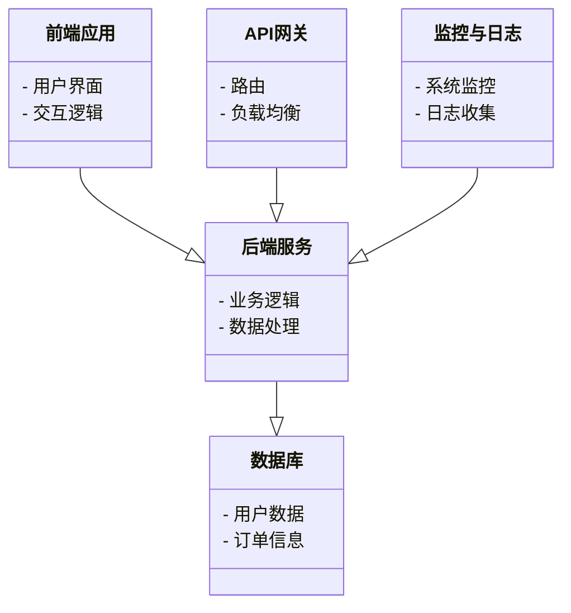
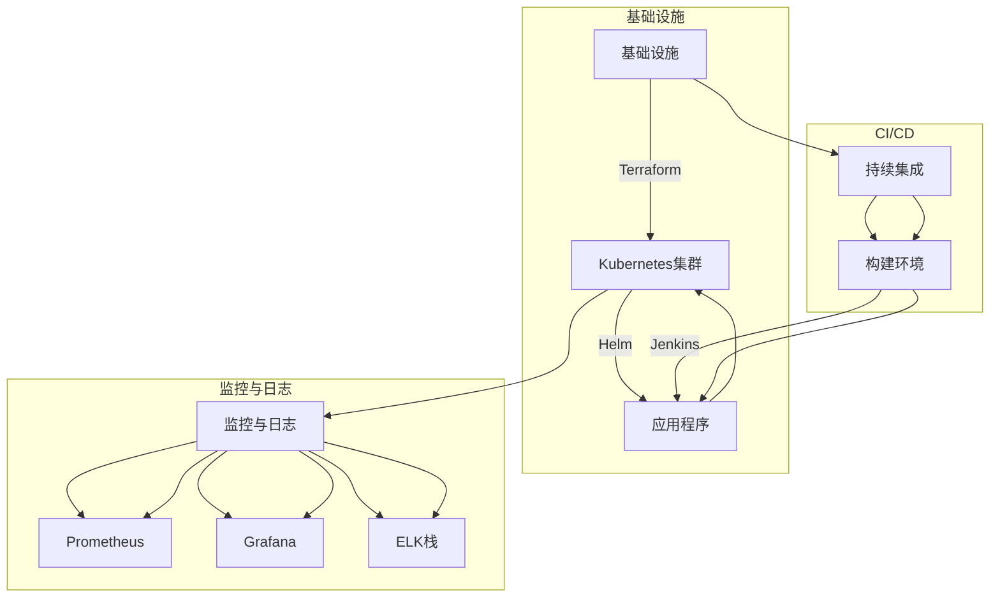
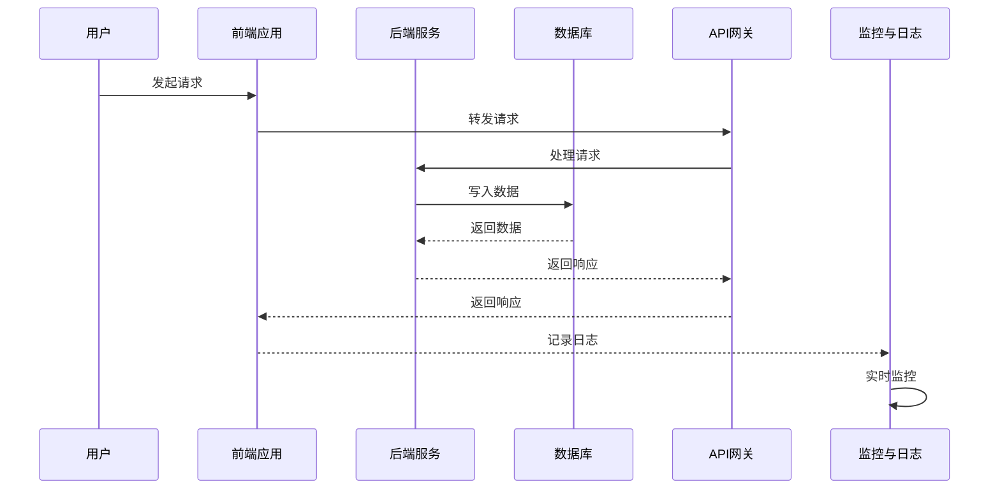

                 

###GitOps工作流程与最佳实践

关键词：GitOps、DevOps、版本控制、基础设施自动化、持续交付

摘要：本文将深入探讨GitOps的工作流程及其最佳实践，旨在帮助开发者和运维团队更好地理解和应用GitOps，以提高软件交付的速度和可靠性。我们将从GitOps的定义、核心概念、理论背景、数学模型、系统分析以及实战案例等方面进行详细阐述。

### 引言

GitOps是一种现代的软件开发和部署方法论，它将Git作为单一的事实来源来管理应用程序的配置和状态。这一方法起源于2017年Weaveworks公司，迅速在DevOps社区中得到广泛认可和采用。GitOps的核心在于将基础设施和应用程序的配置作为代码进行版本控制，从而实现自动化、透明和可追踪的部署过程。

GitOps的主要目的是解决传统DevOps实践中存在的几个关键问题：

1. **配置管理**：传统的配置管理通常依赖于手工操作和脚本，这使得配置状态难以跟踪和维护。
2. **部署流程**：部署流程复杂且不可预测，导致部署失败和手动干预的情况较多。
3. **团队协作**：开发人员和运维团队之间的沟通不畅，导致协作效率低下。

GitOps通过以下几个关键步骤解决了这些问题：

1. **配置即代码（Infrastructure as Code, IaC）**：使用代码来管理基础设施配置，确保配置的版本控制和自动化。
2. **声明式基础设施**：通过声明基础设施的预期状态，自动化工具可以自动将实际状态调整到预期状态。
3. **不可变基础设施**：一旦基础设施被创建，就应保持不变，任何更改都应通过新的基础设施实例进行。
4. **持续集成和持续部署（CI/CD）**：自动化测试和部署流程，确保每次变更都能快速、可靠地应用到生产环境中。

本文将分以下几个部分详细探讨GitOps的工作流程和最佳实践：

1. **核心概念与联系**：介绍GitOps的核心概念及其与传统DevOps实践的关系。
2. **理论背景与实现**：探讨GitOps的理论基础，包括基础设施即代码（IaC）、持续集成（CI）、持续部署（CD）和持续交付（CD）。
3. **数学模型与公式**：推导与GitOps相关的数学模型和公式，并在实际应用中举例说明。
4. **系统分析与设计**：分析GitOps在具体项目中的应用场景，并设计相应的系统架构。
5. **项目实战**：通过一个实际案例展示GitOps的部署和运维过程。
6. **最佳实践与小结**：总结GitOps的最佳实践，并提出一些注意事项和拓展阅读。

通过本文的详细探讨，读者将能够深入理解GitOps的工作原理和实践方法，为实际项目中的应用打下坚实的基础。

### 核心概念与联系

在深入探讨GitOps之前，我们需要了解其核心概念和组成部分，以及如何将其与传统DevOps实践进行对比和联系。以下是GitOps的关键概念及其详细解释：

#### 配置即代码（Infrastructure as Code, IaC）

配置即代码（IaC）是GitOps的基础。IaC将基础设施的配置和管理视为代码，这意味着所有的配置变更都可以通过版本控制系统进行管理。这种方式带来了以下几个关键好处：

1. **版本控制**：通过Git等版本控制系统，配置文件可以像源代码一样进行版本控制，方便历史记录和追踪。
2. **自动化**：配置变更可以通过自动化工具进行部署，减少手动操作，提高部署效率。
3. **一致性**：使用统一的代码库管理配置，确保环境之间的一致性，减少因环境差异导致的部署问题。

#### 声明式基础设施

声明式基础设施（Declarative Infrastructure）强调通过声明期望状态来定义基础设施。这种做法与指令式基础设施（Imperative Infrastructure）形成对比，后者依赖于具体的步骤和指令来创建和管理基础设施。

声明式基础设施的优点包括：

1. **可预测性**：通过声明期望状态，自动化工具可以预测变更的影响，并确保基础设施始终处于预期状态。
2. **可恢复性**：在出现问题时，可以通过回滚到先前状态来恢复系统，从而减少故障的影响。
3. **简化**：减少了需要管理的具体步骤和指令，使得基础设施管理更加简洁。

#### 不可变基础设施

不可变基础设施（Immutable Infrastructure）是GitOps的另一个核心概念。它主张一旦基础设施创建后，就不应进行修改，而应通过创建新的基础设施实例来更新或修复。

不可变基础设施的优势包括：

1. **安全性**：减少了修改现有基础设施的机会，从而降低了安全漏洞的风险。
2. **简化**：无需担心对现有环境的变更，因为所有变更都会在新环境中执行。
3. **可追踪性**：由于所有基础设施都是通过代码创建的，变更的记录和回溯更加清晰。

#### 持续集成（CI）、持续部署（CD）和持续交付（CD）

持续集成（CI）、持续部署（CD）和持续交付（CD）是现代软件开发的核心概念。GitOps将这些概念与配置即代码和自动化紧密结合起来，从而实现更加高效和可靠的软件交付流程。

- **持续集成（CI）**：持续集成是指每次代码变更时，都会自动运行测试，确保代码质量。
- **持续部署（CD）**：持续部署是指将经过测试的代码自动部署到生产环境中。
- **持续交付（CD）**：持续交付则更广泛，它包括CI和CD，并强调从开发到生产环境的整个交付流程。

#### GitOps与传统DevOps的对比

GitOps和传统DevOps有许多相似之处，但它们在方法和重点上有所不同。以下是一个简化的对比表格，展示了GitOps与传统DevOps的核心差异：

| 对比项 | 传统DevOps | GitOps |
| --- | --- | --- |
| 配置管理 | 手动操作和脚本 | 配置即代码（IaC） |
| 部署流程 | 复杂且不可预测 | 自动化、透明和可追踪 |
| 团队协作 | 沟通不畅 | 一致性和透明度 |
| 基础设施管理 | 指令式基础设施 | 声明式基础设施 |
| 部署策略 | 可以修改现有基础设施 | 不可变基础设施 |

#### ER图

为了更好地理解GitOps的组件和它们之间的关系，我们可以使用Mermaid来绘制一个实体关系图（ER图）。以下是一个简化的ER图示例：

```mermaid
erDiagram
  Config -> Git : manages
  CI -> Config : integrates
  CD -> Config : deploys
  CD -> Production : delivers
  Production <- CD : from
  Config <- Git : in
```

在这个ER图中，`Config`（配置）是GitOps的核心组件，它管理着基础设施和应用程序的配置。`CI`（持续集成）和`CD`（持续部署）使用配置来集成和部署代码，而`CD`还负责将代码交付到生产环境中。`Production`（生产环境）是最终的目标，它接收来自`CD`的交付。

通过上述核心概念与联系的介绍，我们为后续对GitOps的理论背景、数学模型、系统分析和实战案例的讨论奠定了基础。在接下来的部分中，我们将进一步深入探讨GitOps的具体实现和应用。

### 理论背景与实现

GitOps的理论基础涵盖了多个现代软件开发和运维的核心概念，这些概念共同构成了GitOps的核心原则。以下将详细探讨基础设施即代码（IaC）、持续集成（CI）、持续部署（CD）和持续交付（CD）等关键组成部分，并通过一个简单的GitOps工作流程示例来直观展示这些概念的实际应用。

#### 基础设施即代码（Infrastructure as Code, IaC）

基础设施即代码（IaC）是GitOps的核心原则之一。IaC通过将基础设施配置转换为可编程的代码，使得基础设施的管理和变更可以像软件代码一样进行版本控制、自动化测试和部署。

**优点：**

1. **可追踪性**：通过版本控制系统，如Git，可以记录基础设施配置的历史变更，方便回溯和审计。
2. **一致性**：确保不同环境（开发、测试、生产）之间的配置一致性，减少因配置差异导致的部署问题。
3. **自动化**：通过自动化工具，如Terraform、Ansible等，可以快速部署和更新基础设施。

**实现：**

假设我们使用Terraform来管理Kubernetes集群的基础设施配置。以下是一个简单的Terraform配置示例：

```hcl
provider "aws" {
  region = "us-west-2"
}

resource "k8s_cluster" "example" {
  name = "example"
  provider = k8s_provider "aws"
}

resource "k8s_namespace" "example" {
  name = "example"
  cluster = k8s_cluster.example.name
}
```

在这个配置中，我们定义了一个AWS区域的Kubernetes集群和一个命名空间。每次修改这个配置文件并提交到Git仓库后，Terraform将自动应用这些变更到Kubernetes集群中。

#### 持续集成（Continuous Integration, CI）

持续集成（CI）是指将代码变更自动集成到一个共享的主干分支中，并运行一系列的自动化测试来确保代码的质量。CI的核心目的是尽早发现和修复代码缺陷，从而提高软件的可靠性。

**优点：**

1. **快速反馈**：每次代码变更都会触发CI流程，确保问题及早被发现。
2. **减少集成风险**：频繁的集成可以减少大规模集成时出现冲突和问题的风险。
3. **自动化测试**：通过自动化测试，可以确保代码的每一部分都是可测试和可维护的。

**实现：**

一个常见的CI工具是Jenkins。以下是一个简单的Jenkins流水线配置示例：

```groovy
pipeline {
    agent any
    stages {
        stage('Build') {
            steps {
                sh 'mvn clean install'
            }
        }
        stage('Test') {
            steps {
                sh 'mvn test'
            }
        }
        stage('Deploy') {
            steps {
                sh 'kubectl apply -f k8s-deployment.yml'
            }
        }
    }
    post {
        always {
            echo 'Build completed'
        }
        success {
            echo 'Deployment successful'
        }
        failure {
            echo 'Build failed'
        }
    }
}
```

在这个流水线中，首先构建项目，然后运行测试，最后将应用程序部署到Kubernetes集群中。每次提交到Git仓库时，Jenkins都会自动触发这个流水线。

#### 持续部署（Continuous Deployment, CD）

持续部署（CD）是指将经过测试和验证的代码自动部署到生产环境中。与CI相比，CD的目标是将经过测试的代码快速、安全地交付到用户手中。

**优点：**

1. **快速交付**：自动化部署流程可以大幅缩短从代码提交到生产环境的时间。
2. **减少手动干预**：通过自动化，可以减少对手动操作的依赖，提高部署的可靠性和一致性。
3. **安全性和可恢复性**：每次部署都是可追踪和可回滚的，确保部署过程中的安全性和可恢复性。

**实现：**

Kubernetes中的Helm是常用的持续部署工具之一。以下是一个简单的Helm部署示例：

```yaml
# k8s-deployment.yml
apiVersion: apps/v1
kind: Deployment
metadata:
  name: my-app
spec:
  replicas: 3
  selector:
    matchLabels:
      app: my-app
  template:
    metadata:
      labels:
        app: my-app
    spec:
      containers:
      - name: my-app
        image: my-app:latest
        ports:
        - containerPort: 80
```

通过运行以下命令，我们可以使用Helm将这个部署应用到Kubernetes集群中：

```sh
helm install my-app ./my-app-chart
```

#### 持续交付（Continuous Delivery, CD）

持续交付（CD）是CI/CD流程的延伸，它涵盖了从开发到生产环境的整个交付流程。持续交付的目标是确保任何经过测试的代码都可以立即部署到生产环境中。

**优点：**

1. **零部署失败**：通过持续交付，可以确保每次交付都是成功的，避免了因部署失败导致的生产环境中断。
2. **快速响应市场**：可以快速响应市场需求，快速发布新功能和修复问题。
3. **提高客户满意度**：通过快速交付高质量的软件，可以提高客户满意度和市场竞争力。

**实现：**

一个完整的GitOps流程通常包括以下步骤：

1. **代码提交**：开发者将代码提交到Git仓库。
2. **CI触发**：Git仓库触发CI流水线，构建和测试代码。
3. **CD触发**：通过CI流水线的成功输出，触发CD流程，将代码部署到预生产环境。
4. **手动验证**：运维团队手动验证预生产环境，确保一切正常。
5. **自动部署**：预生产环境验证通过后，自动部署到生产环境。

通过上述理论背景和实际实现的探讨，我们能够更深入地理解GitOps的工作流程。接下来，我们将进一步探讨与GitOps相关的数学模型和公式，为实际应用提供更科学的依据。

### 数学模型与公式

GitOps作为一种高度自动化的工作流程，其效率和稳定性可以通过数学模型进行量化和评估。以下将介绍几个与GitOps相关的数学模型和公式，并解释其应用。

#### 部署成功率（Deployment Success Rate）

部署成功率是衡量GitOps流程稳定性的关键指标，表示成功部署的次数与总部署次数的比例。其公式如下：

$$
\text{部署成功率} = \frac{\text{成功部署次数}}{\text{总部署次数}} \times 100\%
$$

**应用举例**：假设一个GitOps流程在一个月内进行了100次部署，其中有95次成功，那么其部署成功率为：

$$
\text{部署成功率} = \frac{95}{100} \times 100\% = 95\%
$$

#### 平均部署时间（Average Deployment Time）

平均部署时间是衡量GitOps流程效率的重要指标，表示每次部署所花费的平均时间。其公式如下：

$$
\text{平均部署时间} = \frac{\text{总部署时间}}{\text{总部署次数}}
$$

**应用举例**：假设一个月内进行了100次部署，总部署时间为2400分钟，那么平均部署时间为：

$$
\text{平均部署时间} = \frac{2400}{100} = 24 \text{分钟}
$$

#### 部署错误率（Deployment Error Rate）

部署错误率是衡量GitOps流程中出错频率的指标，表示错误部署次数与总部署次数的比例。其公式如下：

$$
\text{部署错误率} = \frac{\text{错误部署次数}}{\text{总部署次数}} \times 100\%
$$

**应用举例**：假设一个月内进行了100次部署，其中有5次出现错误，那么部署错误率为：

$$
\text{部署错误率} = \frac{5}{100} \times 100\% = 5\%
$$

#### 部署反馈循环时间（Deployment Feedback Loop Time）

部署反馈循环时间是衡量GitOps流程响应能力的指标，表示从部署开始到获得反馈所需的时间。其公式如下：

$$
\text{部署反馈循环时间} = \text{部署时间} + \text{反馈时间}
$$

**应用举例**：假设一个部署过程需要10分钟完成，反馈过程需要5分钟，那么部署反馈循环时间为：

$$
\text{部署反馈循环时间} = 10 + 5 = 15 \text{分钟}
$$

#### 综合评分（Overall Score）

为了全面评估GitOps流程的稳定性、效率和响应能力，可以使用综合评分来衡量。综合评分的公式如下：

$$
\text{综合评分} = \alpha \times \text{部署成功率} + \beta \times \text{平均部署时间} + \gamma \times \text{部署错误率} + \delta \times \text{部署反馈循环时间}
$$

其中，$\alpha$、$\beta$、$\gamma$和$\delta$是权重系数，可以根据实际需求和优先级进行调整。

**应用举例**：假设权重系数分别为$\alpha = 0.4$、$\beta = 0.3$、$\gamma = 0.2$和$\delta = 0.1$，使用前述的示例数据计算综合评分：

$$
\text{综合评分} = 0.4 \times 95\% + 0.3 \times 24 \text{分钟} + 0.2 \times 5\% + 0.1 \times 15 \text{分钟}
$$

$$
\text{综合评分} = 38\% + 7.2 \text{分钟} + 1\% + 1.5 \text{分钟} = 47.3 \text{分钟}
$$

通过上述数学模型和公式的应用，可以量化GitOps流程的各个方面，从而更科学地进行评估和优化。在下一部分中，我们将通过一个实际案例，展示GitOps在系统架构和实现中的应用。

### 系统分析与设计

在深入了解GitOps的数学模型后，我们将通过具体的项目场景来分析其应用。以下是关于GitOps在一个假设的项目中的系统分析与设计。

#### 问题场景

假设我们正在开发一个电子商务平台，该平台需要提供高性能、高可靠性和高可扩展性的服务。为了满足这些要求，我们决定采用GitOps进行系统部署和管理。

#### 项目介绍

项目名称：eCommerce Platform
目标：构建一个具有高可用性、可扩展性和快速响应能力的电子商务平台。
要求：
1. 应用程序需要支持大量的并发用户。
2. 基础设施应具备快速部署和扩展的能力。
3. 系统应具备自动化的故障恢复能力。

#### 系统功能设计

为了实现上述目标，我们将系统划分为以下几个主要功能模块：

1. **前端应用**：负责用户界面展示和交互。
2. **后端服务**：处理业务逻辑和数据存储。
3. **数据库**：存储用户数据、订单信息等。
4. **API网关**：管理外部服务请求，进行路由和负载均衡。
5. **监控与日志**：监控系统状态，收集日志数据。

##### 领域模型（Mermaid类图）

以下是一个简化的领域模型类图，展示了上述功能模块及其关系：



#### 系统架构设计

为了确保系统的可靠性、扩展性和自动化，我们将采用以下架构设计：

1. **基础设施管理**：使用Terraform和Kubernetes进行基础设施配置和资源管理。
2. **持续集成与持续部署**：使用Jenkins进行自动化构建、测试和部署。
3. **监控与告警**：使用Prometheus和Grafana进行实时监控和告警。
4. **日志管理**：使用ELK栈（Elasticsearch、Logstash、Kibana）进行日志收集和可视化。

##### 系统架构图（Mermaid架构图）

以下是一个简化的系统架构图，展示了各个组件之间的关系：



#### 系统接口设计与交互

为了确保系统的模块化和可扩展性，我们将设计清晰明确的接口，并使用Mermaid序列图展示系统组件之间的交互流程。

##### 系统接口设计图（Mermaid序列图）

以下是一个简化的系统接口设计序列图，展示了前端应用、后端服务、数据库、API网关和监控与日志系统之间的交互：



通过上述系统分析与设计，我们为GitOps在实际项目中的应用提供了详细的架构方案。在下一部分中，我们将通过一个实际案例展示GitOps的部署和运维过程。

### 项目实战

在本节中，我们将通过一个实际案例详细展示GitOps的部署和运维过程。这个案例涉及一个简单的Web应用，该应用需要部署在Kubernetes集群上，并通过Jenkins实现自动化构建和部署。

#### 环境安装

在进行项目实战之前，我们需要搭建一个用于实验的Kubernetes集群和Jenkins服务器。以下是所需的步骤：

1. **安装Docker和Kubeadm**：
    - 在所有节点上安装Docker。
    - 使用kubeadm初始化主节点。
    - 部署Kubernetes网络插件（如Calico或Flannel）。

2. **安装Jenkins**：
    - 创建一个名为`jenkins`的命名空间。
    - 使用Helm安装Jenkins。

```yaml
# kubectl create namespace jenkins
# helm install jenkins jenkins/jenkins -n jenkins
```

3. **配置Jenkins**：
    - 访问Jenkins服务器，创建一个管理员用户。
    - 配置Jenkins的Git插件，以便能够与Git仓库交互。

4. **配置Git仓库**：
    - 在Git仓库中创建一个新项目，用于存储应用程序代码和配置文件。
    - 提交并推送代码到Git仓库。

#### 系统核心实现源代码

为了实现GitOps，我们需要编写一些关键配置文件和脚本。以下是主要组件的源代码：

1. **Dockerfile**：
    - 用于构建应用程序容器的Docker镜像。

```Dockerfile
FROM node:12-alpine
WORKDIR /app
COPY package.json ./
COPY . .
RUN npm install
RUN npm run build
EXPOSE 3000
CMD [ "node", "app.js" ]
```

2. **Jenkinsfile**：
    - Jenkins流水线配置文件，用于自动化构建和部署。

```groovy
pipeline {
    agent any
    stages {
        stage('Build') {
            steps {
                sh 'docker build -t myapp:latest .'
            }
        }
        stage('Test') {
            steps {
                sh 'docker run --rm myapp npm test'
            }
        }
        stage('Deploy') {
            steps {
                sh 'kubectl apply -f k8s-deployment.yml'
            }
        }
    }
    post {
        always {
            echo 'Build completed'
        }
        success {
            echo 'Deployment successful'
        }
        failure {
            echo 'Build failed'
        }
    }
}
```

3. **k8s-deployment.yml**：
    - Kubernetes部署配置文件，用于部署应用程序。

```yaml
apiVersion: apps/v1
kind: Deployment
metadata:
  name: myapp
spec:
  replicas: 3
  selector:
    matchLabels:
      app: myapp
  template:
    metadata:
      labels:
        app: myapp
    spec:
      containers:
      - name: myapp
        image: myapp:latest
        ports:
        - containerPort: 3000
```

#### 代码应用解读与分析

1. **Dockerfile解析**：
    - 使用`node:12-alpine`基础镜像，确保轻量级和快速启动。
    - 将应用程序代码复制到容器内，并执行npm安装和构建命令。
    - 映射端口3000，以便外部访问。

2. **Jenkinsfile解析**：
    - 定义了一个包含三个阶段的流水线：构建、测试和部署。
    - 在构建阶段，使用Docker构建应用程序镜像。
    - 在测试阶段，运行容器内的测试命令。
    - 在部署阶段，使用kubectl将部署配置应用到Kubernetes集群中。

3. **k8s-deployment.yml解析**：
    - 指定了应用程序的名称和期望的副本数（3个）。
    - 使用标签选择器匹配容器。
    - 指定了容器的名称和使用的镜像，以及需要暴露的端口。

#### 实际案例分析与详细讲解

1. **案例一**：
    - 开发者提交代码到Git仓库。
    - Jenkins检测到代码提交，触发构建流水线。
    - 构建成功后，应用程序的镜像被推送到容器镜像仓库。
    - Jenkins自动将部署配置应用到Kubernetes集群中，创建新的Pod。
    - Kubernetes集群中的服务开始接收外部请求。

2. **案例二**：
    - 开发者修复了一个bug并再次提交代码。
    - Jenkins再次触发构建和部署流程。
    - Kubernetes集群中的旧Pod被逐渐缩放并替换为新的Pod。
    - 应用程序的新版本在生产环境中上线，同时保持服务可用。

#### 项目小结

通过上述案例，我们展示了GitOps在简单Web应用中的实际应用。GitOps的关键优势在于其自动化和一致性，这显著提高了部署速度和可靠性。以下是项目小结：

- **部署速度**：通过自动化流程，每次代码变更后，应用程序可以在几分钟内部署到生产环境。
- **可靠性**：使用Kubernetes和Helm，确保了每次部署都是一致和可靠的。
- **可扩展性**：系统可以根据需求自动扩展或缩放，确保高性能和高可用性。
- **故障恢复**：自动化的故障恢复机制可以快速恢复服务，减少故障的影响。

总之，GitOps为开发团队提供了一种高效的部署和运维方法，有助于实现快速迭代和持续交付。

### 最佳实践与小结

#### 最佳实践

1. **版本控制配置**：确保所有基础设施和应用程序配置都使用Git进行版本控制，保持配置的一致性和可追踪性。

2. **声明式基础设施**：使用声明式基础设施定义基础设施的预期状态，自动化工具将确保实际状态与预期一致。

3. **自动化测试**：在持续集成过程中，自动化测试是确保代码质量的关键环节，应覆盖功能测试、性能测试和安全测试。

4. **自动化部署**：通过使用如Jenkins、Helm等工具，自动化部署流程可以减少人为错误，提高部署效率。

5. **监控与告警**：实时监控系统和告警机制是确保系统稳定运行的重要手段，应使用如Prometheus和Grafana进行监控。

6. **培训与知识分享**：定期培训团队成员，确保他们了解GitOps的核心概念和最佳实践。

7. **定期审查与优化**：定期审查GitOps流程，发现和解决潜在问题，持续优化流程和工具。

#### 小结

GitOps通过将Git作为配置和部署的中心化系统，实现了自动化、透明化和可追踪的软件交付流程。其核心优势在于提高部署速度、可靠性和可扩展性。通过遵循最佳实践，开发团队可以更好地利用GitOps的优势，实现高效的持续交付。

#### 注意事项

1. **配置管理**：确保配置文件始终保持最新，避免因配置不一致导致的问题。

2. **安全性**：配置和部署过程中的安全性至关重要，应遵循最佳的安全实践。

3. **备份与恢复**：定期备份Git仓库和容器镜像，确保在出现问题时可以快速恢复。

4. **团队协作**：GitOps需要开发人员和运维团队紧密合作，建立良好的沟通和协作机制。

#### 拓展阅读

1. **《Kubernetes权威指南》**：详细介绍了Kubernetes的使用和最佳实践。

2. **《Jenkins实战》**：提供了Jenkins的详细使用方法和自动化案例。

3. **《Git权威指南》**：深入讲解了Git的基本使用和高级技巧。

通过上述内容，读者可以全面了解GitOps的工作流程、核心概念、数学模型、系统分析以及实战应用。希望本文能帮助开发团队更高效地实现持续交付，提高软件交付的质量和速度。

### 作者信息

**作者：AI天才研究院/AI Genius Institute & 禅与计算机程序设计艺术 /Zen And The Art of Computer Programming**

