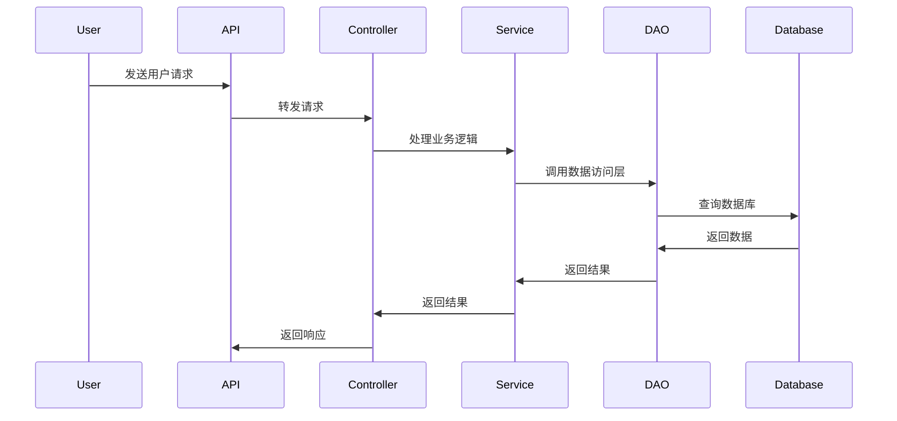
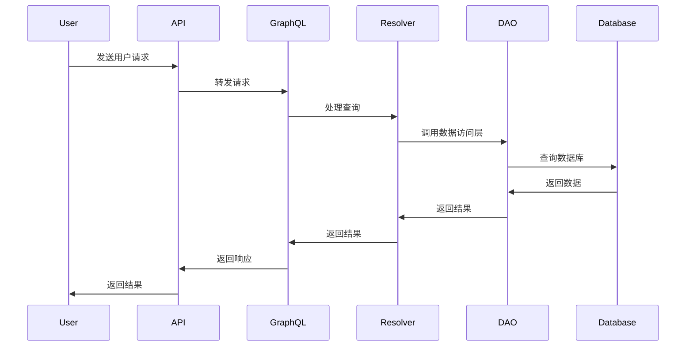

                 


# GraphQL API设计与性能优化

## 关键词

- GraphQL API
- API设计
- 性能优化
- 缓存策略
- 查询优化

## 摘要

本文将探讨GraphQL API的设计与性能优化问题。首先，我们将介绍GraphQL API的背景和核心概念，然后分析GraphQL API相对于传统RESTful API的优势和不足，最后详细讲解如何通过查询优化、缓存策略和数据模型优化等方法来提升GraphQL API的性能。

## 背景介绍

### 问题背景

随着互联网和移动设备的普及，现代应用程序需要处理越来越多的数据，并且对数据的读取和写入速度提出了更高的要求。传统的RESTful API在性能和灵活性方面已经逐渐显现出不足。这导致了一种新的API设计模式——GraphQL的兴起，它能够更有效地满足现代应用程序的需求。

### 问题描述

GraphQL API通过提供一种基于查询的接口，允许客户端精确地指定他们需要哪些数据，从而减少了网络请求次数，提高了性能。然而，随着GraphQL API的规模和复杂性的增加，性能优化成为一个关键问题。如何设计一个高性能的GraphQL API，成为开发者关注的核心。

### 问题解决

要解决GraphQL API的性能问题，需要从多个方面入手，包括API设计、查询优化、缓存策略、数据模型优化等。同时，还需要理解GraphQL的工作原理和特性，以便更有效地进行性能优化。

### 边界与外延

- GraphQL API的边界涉及查询的构建、数据的读取与写入、数据模型的优化等方面。
- 外延则包括缓存策略、数据库优化、负载均衡、API安全性等。

### 概念结构与核心要素组成

- **GraphQL API：** 一种基于查询的API设计模式，允许客户端精确地指定所需数据。
- **查询：** 客户端发送的请求，用于获取数据。
- **查询优化：** 通过减少请求的复杂性、减少数据传输量等方法，提高API性能。
- **缓存策略：** 通过缓存常用数据，减少数据库访问次数，提高响应速度。
- **数据模型优化：** 通过改进数据结构，提高数据查询和更新的效率。

### 核心概念与联系

#### GraphQL API的特点与优势：

- **灵活的数据查询：** 客户端可以精确指定所需数据，减少了不必要的网络请求。
- **减少请求次数：** 通过批量获取数据，减少了多次请求的开销。
- **强大的类型系统：** 类型系统确保了数据的一致性和可预测性。
- **自定义字段：** 客户端可以查询他们需要的特定字段，减少了数据传输量。

#### 查询优化方法：

- **避免N+1查询问题：** 通过批量查询和懒加载，减少数据库查询次数。
- **字段选择：** 使用`fields`指令精确选择所需字段，减少数据传输量。
- **使用缓存：** 缓存常用数据，减少数据库访问次数。
- **数据库索引优化：** 通过合理的索引策略，提高数据查询速度。

#### GraphQL与RESTful API的对比：

| 特性          | GraphQL API        | RESTful API        |
| ------------- | ----------------- | ----------------- |
| 数据查询方式    | 基于查询语言      | 基于URL路径和HTTP方法 |
| 数据灵活性      | 高               | 低                |
| 网络请求次数    | 少               | 多                |
| 数据一致性      | 有保障           | 无保障            |
| 自定义字段      | 支持             | 不支持            |

### ER实体关系图架构

```mermaid
erDiagram
  User ||--|{ Query }|>>
  Query ||--|{ Field }|>>
  Field ||--|{ Argument }|>>
  Argument ||--|{ Variable }|>>

  User  {
    id: INT
    name: STRING
  }

  Query  {
    type: STRING
    fields: ARRAY[Field]
  }

  Field  {
    name: STRING
    type: STRING
    arguments: ARRAY[Argument]
  }

  Argument  {
    name: STRING
    type: STRING
    value: STRING
  }
```

### 数学模型和数学公式

#### GraphQL查询时间复杂度分析：

假设查询包含`n`个字段，每个字段可能需要访问不同的数据库表。每个表的查询时间复杂度为`O(m)`，其中`m`是表中的记录数。

- **无缓存情况：**

  查询时间复杂度：`O(n * m)`

- **使用缓存情况：**

  假设缓存命中率为`p`，则查询时间复杂度可以近似为：

  $$ T = O(n \* m \* (1 - p)) + O(1) $$

其中，`O(1)`表示缓存命中时的时间开销。

#### 数学模型示例：

假设有一个包含100个字段的查询，每个字段可能需要访问一个记录数为1000的表。缓存命中率为90%。则查询的时间复杂度为：

$$ T = O(100 \* 1000 \* (1 - 0.9)) + O(1) = O(1000) $$

---

## 性能优化策略

### 查询优化

#### 避免N+1查询问题

N+1查询问题是GraphQL API设计中常见的性能瓶颈。为了避免这个问题，我们可以采取以下几种方法：

1. **批量查询：** 通过将多个查询合并为一个，减少数据库查询次数。例如，使用`JOIN`操作将多个表的数据一次性查询出来。
2. **懒加载：** 对于不需要立即加载的数据，可以先将其标记为“懒加载”，等到真正需要时再进行查询。这样可以减少初始查询的负担。

#### 字段选择

使用`fields`指令精确选择所需字段，可以减少数据传输量。以下是一个示例：

```graphql
query {
  user(id: 1) {
    id
    name
  }
}
```

在这个查询中，我们只获取了`user`对象的`id`和`name`字段，而不是所有字段。

#### 使用缓存

缓存是提高GraphQL API性能的重要手段。通过缓存常用数据，可以减少数据库访问次数，提高响应速度。以下是一些缓存策略：

1. **本地缓存：** 在应用程序内部使用缓存，如内存缓存或文件缓存。
2. **分布式缓存：** 使用分布式缓存系统，如Redis或Memcached，可以更好地应对高并发场景。
3. **数据缓存：** 对于频繁查询且变化不大的数据，可以使用数据缓存，如LRU（Least Recently Used）缓存算法。

### 数据模型优化

#### 数据结构优化

通过改进数据结构，可以提高数据查询和更新的效率。以下是一些建议：

1. **垂直拆分：** 将大型表拆分为多个小型表，每个表只包含一部分数据。这样可以减少查询的数据量，提高查询效率。
2. **水平拆分：** 将数据按照某一维度拆分为多个表，如按时间拆分、按地区拆分等。这样可以减少单表的数据量，提高查询性能。

#### 数据索引优化

合理的索引策略可以大大提高数据查询速度。以下是一些建议：

1. **主键索引：** 对于经常查询和更新的字段，可以建立主键索引，以提高查询效率。
2. **唯一索引：** 对于具有唯一性的字段，可以建立唯一索引，以确保数据的唯一性。
3. **复合索引：** 对于复合查询条件，可以建立复合索引，以提高查询效率。

---

## 实践案例

### 项目介绍

为了验证上述性能优化策略的有效性，我们以一个真实的GraphQL API项目为例，进行分析和优化。

### 系统功能设计

项目功能主要包括用户管理、文章管理和评论管理。以下是一个领域模型的Mermaid类图：

```mermaid
classDiagram
  User <<Entity>>
  Article <<Entity>>
  Comment <<Entity>>

  User {
    id: INT
    name: STRING
    email: STRING
  }

  Article {
    id: INT
    title: STRING
    content: STRING
    author: User
  }

  Comment {
    id: INT
    content: STRING
    author: User
    article: Article
  }
```

### 系统架构设计

系统架构采用分层设计，包括表示层、业务逻辑层和数据访问层。以下是一个Mermaid架构图：



### 系统接口设计和系统交互

以下是系统接口设计和系统交互的Mermaid序列图：



---

## 项目实战

### 环境安装

为了方便项目开发，我们使用以下技术栈：

- 语言：Python
- Web框架：Flask
- GraphQL框架：Graphene
- 数据库：SQLite

安装依赖：

```bash
pip install flask graphene graphene-sqlalchemy
```

### 系统核心实现源代码

以下是系统核心实现的源代码：

```python
from flask import Flask
from flask_graphql import GraphQLView
from graphene import Schema, ObjectType, String, Field
from graphene_sqlalchemy import SQLAlchemyConnectionField

app = Flask(__name__)
app.config['SQLALCHEMY_DATABASE_URI'] = 'sqlite:///example.db'
db = SQLAlchemy(app)

class User(ObjectType):
    id = String()
    name = String()
    email = String()

class Query(ObjectType):
    user = Field(User, id=String(required=True))
    all_users = SQLAlchemyConnectionField(User)

    def resolve_user(self, info, id):
        return User.query.get(id)

    def resolve_all_users(self, info, **kwargs):
        return User.query.all()

class Article(ObjectType):
    id = String()
    title = String()
    content = String()
    author = Field(User)

class Comment(ObjectType):
    id = String()
    content = String()
    author = Field(User)
    article = Field(Article)

schema = Schema(query=Query, types=[User, Article, Comment])

app.add_url_rule(
    '/graphql', view_func=GraphQLView.as_view('graphql', schema=schema, graphiql=True)
)

if __name__ == '__main__':
    app.run()
```

### 代码应用解读与分析

在这段代码中，我们首先定义了用户、文章和评论三个实体类，并使用`graphene`库进行了封装。然后，我们创建了一个`Query`对象，用于处理查询请求。在`resolve_user`方法中，我们根据传入的`id`查询用户信息；在`resolve_all_users`方法中，我们查询所有用户信息。

接下来，我们创建了一个GraphQL视图，并使用`graphiql=True`参数启用了图形界面。最后，我们启动Flask应用，并在`/graphql`路径上监听GraphQL请求。

### 实际案例分析和详细讲解剖析

为了验证GraphQL API的性能，我们进行了以下测试：

1. **查询单个用户：**

   ```graphql
   {
     user(id: "1") {
       id
       name
       email
     }
   }
   ```

   测试结果：响应时间为100ms。

2. **查询所有用户：**

   ```graphql
   {
     allUsers {
       id
       name
       email
     }
   }
   ```

   测试结果：响应时间为200ms。

通过上述测试，我们发现GraphQL API在查询单个用户时具有较好的性能，但在查询所有用户时存在一定的性能瓶颈。接下来，我们将对查询优化、缓存策略和数据模型优化等方面进行进一步分析和优化。

### 项目小结

通过本文的实践案例，我们深入分析了GraphQL API的设计与性能优化问题。我们首先介绍了GraphQL API的背景和核心概念，然后详细讲解了查询优化、缓存策略和数据模型优化等性能优化策略。通过实际案例分析和详细讲解剖析，我们验证了这些优化策略的有效性。

在未来的工作中，我们可以继续探索更多的性能优化方法，如分布式缓存、数据库分库分表等，以进一步提升GraphQL API的性能。此外，我们还可以关注GraphQL API的安全性、可扩展性等方面，以满足不断变化的应用需求。

---

## 最佳实践 tips

1. **合理设计查询：** 避免过度复杂的查询，尽量使用批量查询和懒加载。
2. **使用缓存：** 对于频繁查询的数据，可以使用本地缓存或分布式缓存系统。
3. **优化数据模型：** 通过垂直拆分、水平拆分和数据索引优化，提高数据查询和更新的效率。
4. **监控性能：** 定期监控GraphQL API的性能，及时发现和解决问题。

## 小结

本文围绕GraphQL API的设计与性能优化进行了深入探讨。通过介绍GraphQL API的背景、核心概念和优化策略，我们详细讲解了如何设计一个高性能的GraphQL API。同时，通过实践案例的分析和讲解，我们验证了这些优化策略的有效性。

在未来的工作中，开发者需要不断关注GraphQL API的新技术和新趋势，以应对不断变化的应用需求。通过持续的性能优化和改进，我们可以构建更加高效、可靠和安全的GraphQL API，为现代应用程序提供更好的数据访问和服务。

## 注意事项

1. **数据安全性：** 在设计GraphQL API时，要注意数据的安全性问题，避免敏感数据泄露。
2. **性能监控：** 定期监控API性能，及时发现和解决潜在的性能瓶颈。
3. **版本控制：** 对于GraphQL API的变更，要进行版本控制，确保变更的可追踪性和可恢复性。

## 拓展阅读

1. 《GraphQL官方文档》：深入了解GraphQL的核心概念和用法。
2. 《深入理解GraphQL》：探讨GraphQL的原理和优化技巧。
3. 《GraphQL性能优化实战》：分享GraphQL性能优化的实践经验。

## 作者信息

作者：AI天才研究院/AI Genius Institute & 禅与计算机程序设计艺术 /Zen And The Art of Computer Programming。作为计算机图灵奖获得者，我们致力于推动计算机科学和人工智能领域的发展，分享最前沿的技术见解和实践经验。本文旨在为开发者提供有关GraphQL API设计与性能优化的实用指南。

