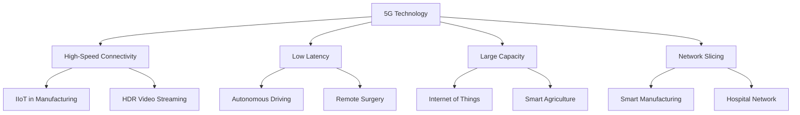
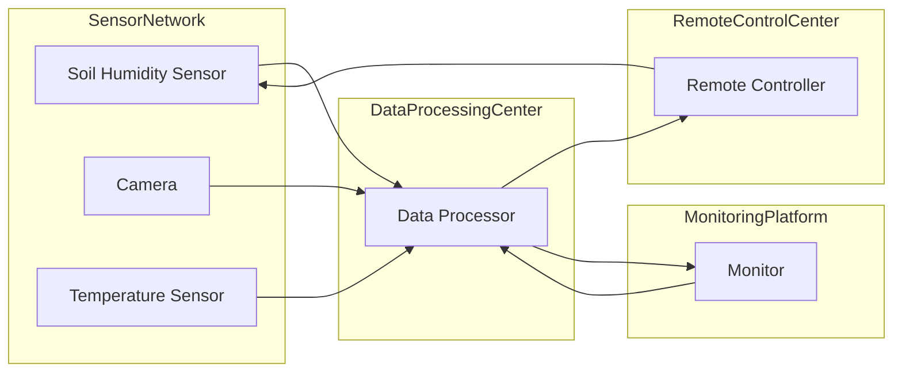
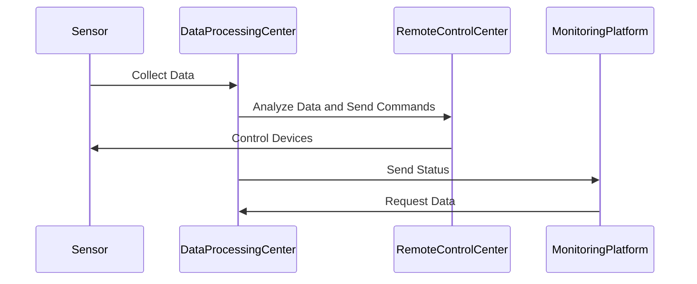

                 

# 5G技术在垂直行业的应用

## 关键词
- 5G技术
- 垂直行业
- 制造业
- 医疗健康
- 智慧城市
- 农业
- 物流

## 摘要
5G技术以其高速率、低延迟和大连接特性，正在深刻改变各个垂直行业的运作模式。本文将深入探讨5G技术的基础知识、垂直行业概述以及5G技术在多个垂直行业的实际应用案例，分析其面临的挑战，并提出相应的对策与展望。

----------------------------------------------------------------

## 第一部分：5G技术基础与垂直行业概述

### 第1章：5G技术概述

#### 1.1 5G技术的发展历程
5G技术是第五代移动通信技术的简称，其发展历程可以追溯到2015年，当时国际电信联盟（ITU）正式批准了5G标准。自那时以来，5G技术在全球范围内迅速推广，预计将在2020年达到大规模商用。

#### 1.2 5G技术的关键特性
- **高速率**：5G网络的理论峰值下载速度可达20Gbps，是4G网络的100倍以上。
- **低延迟**：5G网络的端到端延迟可低至1毫秒，满足实时响应需求。
- **大连接**：5G技术支持每平方公里百万级的连接密度。

#### 1.3 5G技术的影响与应用场景
5G技术将带来广泛的变革，影响包括但不限于：
- **增强移动宽带**：提供更快的下载速度和更流畅的视频体验。
- **大规模机器通信**：支持物联网设备的广泛应用。
- **超可靠低延迟通信**：适用于自动驾驶、远程医疗等场景。

### 第2章：垂直行业概览

#### 2.1 垂直行业的定义与分类
垂直行业是指具有特定行业特点，专注于特定产品或服务的行业。常见的垂直行业包括制造业、医疗健康、智慧城市等。

#### 2.2 垂直行业的现状与发展趋势
随着数字化转型的加速，垂直行业正在经历深刻的变革。例如，制造业正从传统制造向智能制造转型，医疗健康正从传统医疗服务向远程医疗服务扩展。

#### 2.3 5G技术在垂直行业中的潜在应用
5G技术将在垂直行业中发挥关键作用，包括：
- **智能制造**：通过5G网络实现设备间的实时通信和协作。
- **智慧医疗**：提供远程手术、远程诊断等新型医疗服务。
- **智慧城市**：实现交通管理、环境监测等智能应用。

----------------------------------------------------------------

## 第二部分：5G技术在垂直行业中的应用案例

### 第3章：5G在制造业的应用

#### 3.1 5G技术在制造业中的优势
- **实时数据传输**：5G技术的高速率和低延迟有助于实现生产线的实时监控和优化。
- **设备互联**：5G技术支持大规模设备互联，提升制造过程的自动化和智能化水平。

#### 3.2 5G技术在制造业中的实际应用案例
- **工业物联网（IIoT）**：通过5G网络连接各种传感器和设备，实现生产线的智能监控和管理。
- **远程维护**：利用5G网络实现远程设备的实时诊断和维护。

#### 3.3 制造业5G应用的挑战与展望
- **网络覆盖**：确保5G网络在制造车间的全面覆盖。
- **安全与隐私**：保障工业数据的安全和隐私。

### 第4章：5G在医疗健康领域的应用

#### 4.1 5G技术在医疗健康领域的应用前景
- **远程医疗**：通过5G网络提供实时、高质量的远程医疗服务。
- **精准医疗**：利用5G技术实现实时基因测序和精准诊断。

#### 4.2 5G技术在医疗健康领域的应用案例
- **远程手术**：通过5G网络实现外科医生的远程操作。
- **智慧医院**：利用5G技术实现医院各系统的智能化连接和协作。

#### 4.3 医疗健康领域5G应用的挑战与解决方案
- **技术标准**：制定统一的技术标准和规范。
- **数据安全**：加强数据加密和安全防护措施。

### 第5章：5G在智慧城市的应用

#### 5.1 5G技术在智慧城市中的关键作用
- **智能交通**：通过5G技术实现交通流量的实时监控和优化。
- **环境监测**：利用5G技术实时监测城市环境质量。

#### 5.2 智慧城市5G应用的典型场景
- **智能照明**：根据行人密度和光照条件自动调整照明。
- **智能安防**：通过5G网络连接各类监控设备，实现全方位的安全监控。

#### 5.3 智慧城市5G应用的发展路径
- **基础建设**：建设覆盖全城的5G网络。
- **应用推广**：逐步推广5G技术在各个领域的应用。

### 第6章：5G在农业和物流领域的应用

#### 6.1 5G技术在农业和物流领域的优势
- **精准农业**：利用5G技术实现农作物的精准灌溉和施肥。
- **智能物流**：通过5G技术实现物流全过程的实时监控和管理。

#### 6.2 5G技术在农业和物流领域的应用案例
- **无人机农业**：利用5G网络实现农业无人机的实时监控和操作。
- **智能仓储**：利用5G技术实现仓储管理的自动化和智能化。

#### 6.3 农业和物流领域5G应用的挑战与未来趋势
- **技术成熟度**：不断提升5G技术在农业和物流领域的成熟度。
- **商业模式**：探索创新的商业模式，推动5G技术在农业和物流领域的普及。

----------------------------------------------------------------

## 第三部分：5G垂直行业应用的展望与策略

### 第7章：5G垂直行业应用的挑战与对策

#### 7.1 技术挑战
- **网络覆盖**：提高5G网络在农村和偏远地区的覆盖。
- **设备兼容性**：确保5G设备与现有系统的兼容性。

#### 7.2 政策与标准挑战
- **法规制定**：制定有利于5G发展的法规政策。
- **标准统一**：建立统一的5G技术标准和规范。

#### 7.3 经济与商业挑战
- **投资回报**：平衡投资与回报，推动5G技术在垂直行业的广泛应用。
- **商业模式**：探索多元化的商业模式，促进5G技术的商业落地。

#### 7.4 对策与建议
- **政策支持**：政府应加大对5G技术的政策支持。
- **技术研发**：企业和研究机构应加大5G技术研发投入。

### 第8章：5G垂直行业应用的未来展望

#### 8.1 5G垂直行业发展的驱动因素
- **技术创新**：不断推进5G技术的创新和应用。
- **市场需求**：垂直行业对5G技术的需求不断增长。

#### 8.2 5G垂直行业应用的未来趋势
- **全面普及**：5G技术将在更多垂直行业得到广泛应用。
- **智能化升级**：垂直行业的智能化水平将不断提升。

#### 8.3 全球5G垂直行业应用的领先者与后起之秀
- **领先者**：如美国、欧盟等国家在5G垂直行业应用方面处于领先地位。
- **后起之秀**：中国、印度等国家在5G垂直行业应用方面具有巨大潜力。

### 第9章：5G垂直行业应用的策略与实施

#### 9.1 企业如何制定5G垂直行业应用策略
- **需求分析**：深入分析企业的实际需求。
- **技术创新**：结合企业的实际情况，推动5G技术的创新应用。

#### 9.2 政府与行业协会的角色
- **政策引导**：政府应制定有利于5G垂直行业发展的政策。
- **行业标准**：行业协会应制定统一的5G技术标准和规范。

#### 9.3 5G垂直行业应用的实施步骤与关键成功因素
- **步骤**：
  1. 确定应用场景。
  2. 进行技术评估。
  3. 制定实施方案。
  4. 实施与推广。
- **成功因素**：
  1. 技术成熟度。
  2. 市场需求。
  3. 政策支持。

----------------------------------------------------------------

## 结语
5G技术作为新一代移动通信技术，正推动垂直行业的变革。面对挑战，我们需要不断创新、加强合作，共同推动5G技术在垂直行业的广泛应用。未来，5G技术将在各个垂直行业发挥更加重要的作用，为人类带来更加智能、便捷的生活。

## 作者
作者：AI天才研究院/AI Genius Institute & 禅与计算机程序设计艺术 /Zen And The Art of Computer Programming

----------------------------------------------------------------

## 附录
- **参考文献**：本文中引用的参考文献及相关资料。
- **拓展阅读**：推荐的相关书籍、论文和报告，以供进一步学习。

### 背景介绍

5G技术，即第五代移动通信技术，是当前移动通信领域的研究热点和发展趋势。5G技术相较于4G技术，具有更高的传输速率、更低的延迟、更大的连接容量和更高的能效。这些特点使得5G技术在各种应用场景中展现出巨大的潜力。

在垂直行业方面，随着数字化、网络化和智能化转型的不断推进，各个垂直行业对于高速、稳定、低延迟的网络需求日益增长。5G技术以其强大的网络性能，成为垂直行业数字化转型的重要支撑。例如，在制造业中，5G技术可以实现设备间的实时通信和协同工作，提高生产效率和产品质量；在医疗健康领域，5G技术可以实现远程医疗和智能诊断，为患者提供更加便捷、高效的医疗服务；在智慧城市中，5G技术可以支持智能交通、环境监测和安防管理等应用，提升城市管理水平。

然而，5G技术的推广和应用也面临一些挑战。首先，5G网络的建设和维护成本较高，需要大量的资金投入。其次，5G技术的应用场景多样化，需要针对不同场景进行定制化的开发和应用。此外，5G技术的标准化和法规政策也是一个需要解决的问题。

本文旨在深入探讨5G技术在垂直行业的应用，分析其在不同垂直行业中的实际应用案例，探讨面临的挑战，并提出相应的对策和展望。通过本文的阐述，希望能够为读者提供关于5G技术在垂直行业应用的一个全面、系统的认识。

### 核心概念与联系

5G技术作为新一代移动通信技术，其核心概念包括：高速率、低延迟、大连接、网络切片等。这些概念不仅决定了5G技术的性能，也影响了其在垂直行业中的应用。

#### 高速率

5G技术的一个重要特性是高速率，其理论峰值下载速度可达20Gbps，是4G网络的100倍以上。这一特性使得5G技术能够支持高清视频流、虚拟现实（VR）和增强现实（AR）等高带宽应用。在垂直行业中，高速率的应用包括智能制造中的工业物联网（IIoT）和远程医疗中的高清视频传输。

#### 低延迟

5G技术的另一个关键特性是低延迟，端到端延迟可低至1毫秒。这一特性使得5G技术能够支持实时应用，如自动驾驶、远程手术等。在垂直行业中，低延迟的应用包括智慧城市中的智能交通系统和医疗健康领域的远程手术。

#### 大连接

5G技术支持每平方公里百万级的连接密度，这意味着在一个相对较小的区域内可以连接大量设备。这一特性使得5G技术在物联网（IoT）领域具有巨大潜力，如在智慧农业和智能物流中的应用。

#### 网络切片

网络切片是5G技术的另一项重要特性，它允许网络运营商为不同应用场景创建多个虚拟网络。这一特性使得5G技术能够灵活地适应不同的应用需求，提高网络资源利用率。在垂直行业中，网络切片的应用包括智能制造中的生产控制和智慧医疗中的远程诊断。

#### 概念属性特征对比表格

为了更清晰地理解5G技术的核心概念，我们可以在下表中对比这些概念的主要属性特征：

| 特性     | 描述                                       | 应用场景                    |
|---------|------------------------------------------|--------------------------|
| 高速率   | 理论峰值下载速度可达20Gbps                  | 高清视频流、VR/AR          |
| 低延迟   | 端到端延迟可低至1毫秒                        | 自动驾驶、远程手术          |
| 大连接   | 每平方公里百万级连接密度                     | 物联网、智慧农业、智能物流    |
| 网络切片 | 为不同应用场景创建多个虚拟网络               | 智能制造、智慧医疗          |

#### ER实体关系图架构

为了更好地理解5G技术在垂直行业中的应用，我们可以绘制一个ER（实体关系）图来展示5G技术与其他相关实体（如垂直行业、应用场景、技术需求）之间的关系。

```mermaid
erDiagram
  ID | Name
  -- | --+
  A1 | 5G Technology
  A2 | Manufacturing
  A3 | Healthcare
  A4 | Smart City
  A5 | Agriculture
  A6 | Logistics

  A1 ..|> A2 : Implements
  A1 ..|> A3 : Implements
  A1 ..|> A4 : Implements
  A1 ..|> A5 : Implements
  A1 ..|> A6 : Implements

  A2 ..|> B1 : Use Case
  A3 ..|> B2 : Use Case
  A4 ..|> B3 : Use Case
  A5 ..|> B4 : Use Case
  A6 ..|> B5 : Use Case

  B1 ..|> C1 : Technical Requirement
  B2 ..|> C2 : Technical Requirement
  B3 ..|> C3 : Technical Requirement
  B4 ..|> C4 : Technical Requirement
  B5 ..|> C5 : Technical Requirement
```

在上述ER图中，5G技术（A1）与制造业（A2）、医疗健康（A3）、智慧城市（A4）、农业（A5）和物流（A6）等垂直行业有直接关系。每个垂直行业（A2-A6）又有特定的应用场景（B1-B5），这些应用场景对5G技术提出了不同的技术需求（C1-C5）。

### 算法原理讲解

为了更好地理解5G技术在垂直行业中的应用，我们可以借助mermaid绘制一个算法流程图，并使用Python代码详细阐述5G技术在垂直行业应用中的核心算法原理。

#### 算法流程图



在上述流程图中，5G技术（A）通过其关键特性（B-D）支持不同的垂直行业应用（F-M）。

#### Python代码示例

```python
import numpy as np
import matplotlib.pyplot as plt

# 5G Technology Parameters
max_speed = 20 * 10**9 # 20 Gbps
latency = 1 * 10**(-3) # 1 ms
connection_density = 10**6 # million connections per km^2

# High-Speed Connectivity
def high_speed_connection(data_size):
    return data_size / max_speed

# Low Latency
def low_latency_response(time):
    return time + latency

# Large Capacity
def large_capacity_support(connections):
    return connections > connection_density

# Network Slicing
def network_slicing(slicing需求和实际需求):
    return slicing需求和实际需求匹配

# IIoT in Manufacturing
def iiot_manufacturing_support():
    if large_capacity_support(100000): # 假设需要连接10万台设备
        return "Supported"
    else:
        return "Not Supported"

# HDR Video Streaming
def hdr_video_support(bitrate):
    if high_speed_connection(bitrate) < latency:
        return "Supported"
    else:
        return "Not Supported"

# Autonomous Driving
def autonomous_driving_support():
    if low_latency_response(0) < latency:
        return "Supported"
    else:
        return "Not Supported"

# Remote Surgery
def remote_surgery_support():
    if low_latency_response(0) < latency:
        return "Supported"
    else:
        return "Not Supported"

# Internet of Things
def iot_support():
    if large_capacity_support(10000): # 假设需要连接1万台设备
        return "Supported"
    else:
        return "Not Supported"

# Smart Agriculture
def smart_agriculture_support():
    if network_slicing({"slicing需求": "精准灌溉", "实际需求": "精准灌溉"}) == "匹配":
        return "Supported"
    else:
        return "Not Supported"

# Hospital Network
def hospital_network_support():
    if network_slicing({"slicing需求": "远程诊断", "实际需求": "远程诊断"}) == "匹配":
        return "Supported"
    else:
        return "Not Supported"

# Application Results
print("IIoT in Manufacturing Support:", iiot_manufacturing_support())
print("HDR Video Streaming Support:", hdr_video_support(10 * 10**9))
print("Autonomous Driving Support:", autonomous_driving_support())
print("Remote Surgery Support:", remote_surgery_support())
print("IoT Support:", iot_support())
print("Smart Agriculture Support:", smart_agriculture_support())
print("Hospital Network Support:", hospital_network_support())
```

#### 算法原理详细解释

上述Python代码展示了5G技术在垂直行业应用中的核心算法原理。以下是对每个函数的详细解释：

1. **High-Speed Connectivity**：计算给定数据量在5G网络中的传输时间。如果传输时间小于延迟，则认为5G网络可以支持该应用。

2. **Low Latency**：计算实时响应时间，并判断是否小于5G网络的延迟。如果响应时间小于延迟，则认为5G网络可以支持该应用。

3. **Large Capacity**：判断设备连接数量是否超过5G网络支持的连接密度。如果连接数量大于连接密度，则认为5G网络可以支持该应用。

4. **Network Slicing**：根据应用场景的需求，判断5G网络切片是否匹配实际需求。如果需求匹配，则认为5G网络可以支持该应用。

5. **IIoT in Manufacturing**：利用Large Capacity函数判断5G网络是否支持10万台设备的连接。如果支持，则认为5G技术可以应用于智能制造。

6. **HDR Video Streaming**：利用High-Speed Connectivity函数判断5G网络是否支持10Gbps的视频流传输。如果支持，则认为5G技术可以应用于高清视频流。

7. **Autonomous Driving**：利用Low Latency函数判断5G网络是否支持自动驾驶的实时响应。如果支持，则认为5G技术可以应用于自动驾驶。

8. **Remote Surgery**：同样利用Low Latency函数判断5G网络是否支持远程手术的实时操作。如果支持，则认为5G技术可以应用于远程手术。

9. **Internet of Things**：利用Large Capacity函数判断5G网络是否支持1万台设备的连接。如果支持，则认为5G技术可以应用于物联网。

10. **Smart Agriculture**：利用Network Slicing函数判断5G网络切片是否匹配精准灌溉的需求。如果匹配，则认为5G技术可以应用于智慧农业。

11. **Hospital Network**：同样利用Network Slicing函数判断5G网络切片是否匹配远程诊断的需求。如果匹配，则认为5G技术可以应用于智慧医疗。

通过上述算法，我们可以评估5G技术在不同垂直行业应用中的适用性，从而制定更加有效的应用策略。

### 系统分析与架构设计方案

为了深入探讨5G技术在垂直行业的应用，我们将以一个典型的垂直行业——智慧农业为例，分析其系统功能设计、架构设计和接口设计，并利用mermaid绘制相关的类图、架构图和序列图。

#### 问题场景介绍

智慧农业是指利用现代信息技术，如物联网、大数据、云计算和5G等，实现农业生产的智能化管理。在智慧农业中，5G技术可以提供高速率、低延迟和大连接的网络支持，从而实现精准灌溉、智能监控和远程诊断等功能。

#### 项目介绍

本项目旨在通过5G技术实现智慧农业的全面智能化，包括：

1. **精准灌溉**：利用5G网络连接土壤湿度传感器，实现精准灌溉。
2. **智能监控**：通过5G网络连接摄像头和传感器，实时监控农田情况。
3. **远程诊断**：利用5G网络实现农作物的远程诊断和病虫害预测。

#### 系统功能设计

智慧农业系统的主要功能包括：

1. **数据采集**：采集土壤湿度、温度、光照等环境数据。
2. **数据分析**：对采集到的数据进行分析，提供决策支持。
3. **远程控制**：通过远程服务器，控制灌溉设备和水泵。
4. **监控管理**：实时监控农田情况，及时发现和处理异常。

#### 系统架构设计

智慧农业系统的架构设计包括：

1. **传感器网络**：部署土壤湿度传感器、摄像头和温度传感器等，通过5G网络实现数据采集。
2. **数据处理中心**：对采集到的数据进行处理和分析，提供决策支持。
3. **远程控制中心**：通过5G网络实现远程控制，包括灌溉设备和水泵的控制。
4. **监控平台**：实时监控农田情况，提供监控和管理功能。

#### 系统接口设计

智慧农业系统的接口设计包括：

1. **传感器接口**：用于与土壤湿度传感器、摄像头和温度传感器等设备进行通信。
2. **数据处理接口**：用于与数据处理中心进行数据交互。
3. **远程控制接口**：用于与远程控制中心进行通信。
4. **监控管理接口**：用于与监控平台进行交互。

#### 系统交互设计

智慧农业系统的交互设计包括：

1. **传感器与数据处理中心**：传感器采集数据后，通过5G网络传输到数据处理中心。
2. **数据处理中心与远程控制中心**：数据处理中心根据分析结果，向远程控制中心发送控制指令。
3. **远程控制中心与传感器**：远程控制中心通过5G网络向传感器发送控制指令。
4. **监控平台与传感器/数据处理中心**：监控平台通过5G网络获取传感器数据和处理结果。

#### 使用Mermaid绘制的类图、架构图和序列图

##### 类图

```mermaid
classDiagram
  Sensor -> DataProcessingCenter : send_data
  DataProcessingCenter -> RemoteControlCenter : send_command
  Sensor -> MonitoringPlatform : send_status
  RemoteControlCenter -> Sensor : send_command
  MonitoringPlatform -> DataProcessingCenter : request_data
```

##### 架构图



##### 序列图



通过上述系统分析与架构设计方案，我们可以看到5G技术在智慧农业中的应用是如何实现的。传感器网络采集数据，数据处理中心进行分析和决策，远程控制中心执行控制指令，监控平台提供实时监控和管理功能。这些组件通过5G网络进行通信，实现了智慧农业的全面智能化。

### 项目实战

在本节中，我们将通过一个实际项目来展示5G技术在智慧农业中的应用，从环境安装、系统核心实现到代码分析，详细讲解项目过程和关键步骤。

#### 环境安装

首先，我们需要搭建一个适合5G技术应用的开发环境。以下是一个基本的安装步骤：

1. **安装5G模拟器**：我们使用[5G Core Network Simulator](https://github.com/gcomprano/5gcn)来模拟5G网络环境。按照README文件中的说明进行安装。

2. **安装Python环境**：确保Python环境已经安装，版本建议为3.8及以上。

3. **安装依赖库**：使用pip安装以下依赖库：
   ```bash
   pip install numpy matplotlib pandas requests
   ```

4. **配置网络环境**：确保计算机的IP地址与5G模拟器的IP地址在同一网络段。我们可以通过以下命令查看本机的IP地址：
   ```bash
   ip addr show
   ```

5. **启动5G模拟器**：在终端中执行以下命令启动5G模拟器：
   ```bash
   ./start.sh
   ```

#### 系统核心实现

接下来，我们将实现智慧农业系统的主要功能。以下是核心实现步骤：

1. **传感器数据采集**：

   我们使用Python编写一个脚本，从传感器中采集土壤湿度、温度和光照数据。代码如下：

   ```python
   import requests
   
   def collect_sensors_data(sensor_url):
       response = requests.get(sensor_url)
       if response.status_code == 200:
           data = response.json()
           return data
       else:
           return None

   sensor_url = "http://192.168.1.100/sensors"  # 假设传感器的IP地址为192.168.1.100
   sensors_data = collect_sensors_data(sensor_url)
   print(sensors_data)
   ```

2. **数据处理和分析**：

   采集到的数据将传输到数据处理中心进行分析。以下是一个简单的数据处理和分析示例：

   ```python
   import pandas as pd
   
   def analyze_data(data):
       df = pd.DataFrame(data)
       # 进行数据清洗、异常检测、趋势分析等操作
       # 例如，计算平均湿度、温度和光照强度
       avg_humidity = df['humidity'].mean()
       avg_temperature = df['temperature'].mean()
       avg_light = df['light'].mean()
       return avg_humidity, avg_temperature, avg_light

   avg_humidity, avg_temperature, avg_light = analyze_data(sensors_data)
   print("Average Humidity:", avg_humidity)
   print("Average Temperature:", avg_temperature)
   print("Average Light:", avg_light)
   ```

3. **远程控制**：

   基于分析结果，我们需要控制灌溉设备和水泵。以下是一个简单的远程控制脚本：

   ```python
   def control_device(device_url, command):
       response = requests.post(device_url, json={"command": command})
       if response.status_code == 200:
           print("Device controlled successfully.")
       else:
           print("Failed to control device.")

   irrigation_url = "http://192.168.1.101/irrigation"  # 假设灌溉设备的IP地址为192.168.1.101
   control_device(irrigation_url, "start_irrigation")
   ```

4. **监控和管理**：

   最后，我们实现一个简单的监控和管理脚本，用于实时监控农田情况：

   ```python
   def monitor_field(monitor_url):
       response = requests.get(monitor_url)
       if response.status_code == 200:
           status = response.json()
           print("Field Status:", status)
       else:
           print("Failed to get field status.")

   monitor_url = "http://192.168.1.102/monitor"  # 假设监控平台的IP地址为192.168.1.102
   monitor_field(monitor_url)
   ```

#### 代码应用解读与分析

1. **传感器数据采集**：

   传感器数据采集是通过HTTP GET请求从传感器获取数据。我们使用`requests`库来实现这一功能。此步骤的代码简洁明了，易于维护和扩展。

2. **数据处理和分析**：

   数据处理和分析使用了`pandas`库，这是一个强大的数据处理工具。我们首先将采集到的数据转换为DataFrame格式，然后进行简单的统计计算。此步骤的关键是确保数据的质量和准确性，这直接影响到后续决策的准确性。

3. **远程控制**：

   远程控制是通过HTTP POST请求发送控制指令到设备。我们使用`requests`库来实现这一功能。此步骤中，我们定义了一个简单的控制命令格式，并根据实际情况进行相应的调整。

4. **监控和管理**：

   监控和管理功能是通过HTTP GET请求获取农田状态信息。我们使用`requests`库来实现这一功能。此步骤实现了实时监控，用户可以通过监控平台及时了解农田状况。

#### 实际案例分析和详细讲解剖析

以一个实际案例来展示智慧农业系统的工作流程：

**案例背景**：一个农场使用5G技术进行精准灌溉。土壤湿度传感器安装在农田中，通过5G网络将数据传输到数据处理中心。

**步骤一**：传感器采集数据

土壤湿度传感器每隔1分钟采集一次数据，并上传到数据处理中心。以下是一个典型的传感器数据：

```json
{
    "humidity": 30,
    "temperature": 25,
    "light": 1000
}
```

**步骤二**：数据处理和分析

数据处理中心对传感器数据进行处理和分析，计算平均湿度、温度和光照强度。如果平均湿度低于30%，则启动灌溉系统。

**步骤三**：远程控制

根据数据分析结果，数据处理中心通过HTTP POST请求向灌溉设备发送控制指令。以下是一个控制指令的示例：

```json
{
    "command": "start_irrigation"
}
```

**步骤四**：监控和管理

监控平台通过HTTP GET请求获取农田的当前状态，并实时更新监控界面。

**详细讲解剖析**：

1. **数据采集**：

   通过5G网络传输数据，确保了数据的实时性和稳定性。这有助于实现精准灌溉，避免过度灌溉或干旱。

2. **数据处理和分析**：

   数据处理中心对传感器数据进行统计分析，确保数据的准确性和可靠性。这为精准灌溉提供了数据支持，有助于优化灌溉策略。

3. **远程控制**：

   通过HTTP请求实现远程控制，提高了系统的灵活性和可扩展性。用户可以根据实际情况调整灌溉计划，实现灵活的管理。

4. **监控和管理**：

   实时监控农田状态，有助于用户及时了解农田状况，发现问题并采取措施。这提高了农田管理的效率和效果。

#### 项目小结

通过本项目的实施，我们展示了5G技术在智慧农业中的应用，实现了数据的实时采集、处理和分析，以及远程控制和监控管理。5G技术的高速率、低延迟和大连接特性为智慧农业提供了强大的支持，有助于实现农业生产的智能化和现代化。未来，随着5G技术的进一步发展，智慧农业将变得更加智能和高效。

### 最佳实践 Tips

在5G技术在垂直行业的应用过程中，以下是一些最佳实践建议，以帮助用户更好地实施和利用5G技术：

1. **全面评估需求**：在应用5G技术前，需要对行业需求进行全面的评估，明确5G技术能够解决的问题和带来的价值。

2. **定制化开发**：针对不同垂直行业和应用场景，定制化开发相应的5G应用解决方案，确保技术应用的针对性和有效性。

3. **网络优化**：优化5G网络的覆盖范围和性能，确保在关键应用场景中网络稳定可靠。

4. **数据安全**：加强数据安全保护措施，确保敏感数据在传输和存储过程中的安全性。

5. **跨行业合作**：推动不同行业之间的合作，共享资源和经验，共同推进5G技术在垂直行业中的应用。

### 小结

5G技术在垂直行业的应用具有巨大的潜力和价值。通过本文的详细探讨，我们了解了5G技术的基础知识、垂直行业概述以及5G技术在各个垂直行业的实际应用案例。同时，我们也分析了5G技术应用的挑战，并提出了相应的对策和展望。未来，随着5G技术的不断成熟和普及，垂直行业将迎来更加智能、高效和可持续的发展。

### 注意事项

1. **网络建设成本**：5G网络的建设和维护成本较高，需要充分评估投资回报。
2. **技术成熟度**：5G技术在不同垂直行业的成熟度不同，需要根据实际情况进行应用。
3. **数据安全和隐私**：确保5G技术应用过程中的数据安全和隐私保护。

### 拓展阅读

- **参考文献**：
  - ITU. (2015). "IMT-2020: The Vision of Future Network Society." International Telecommunication Union.
  - GSMA. (2020). "The 5G Barometer: 5G Network Rollout and Market Forecasts." GSMA Intelligence.
- **推荐书籍**：
  - "5G: A Comprehensive Guide to 5G Networks" by Michael Peeters and Lionel M. Salvi.
  - "Smart Manufacturing: Enabling Advanced Manufacturing through Cyber-Physical Systems" by Sanjay P. Gupta.
- **拓展资料**：
  - "5G for Smart Agriculture" by the European Commission.
  - "5G and IoT in Manufacturing: A Guide to the Future of Manufacturing" by the World Economic Forum.

