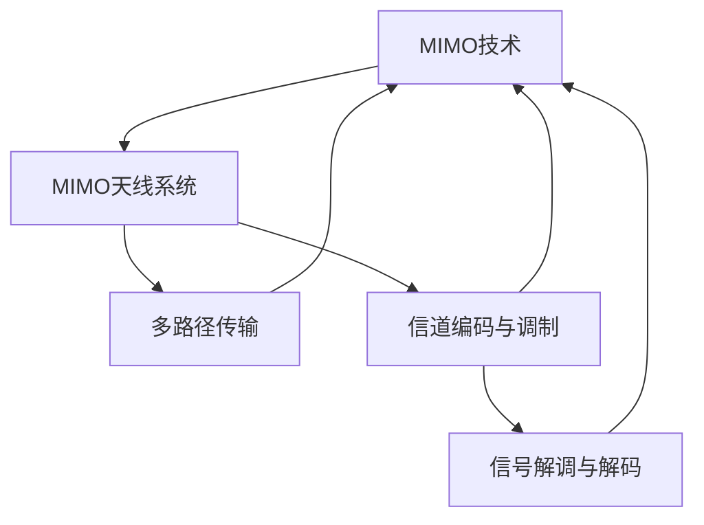
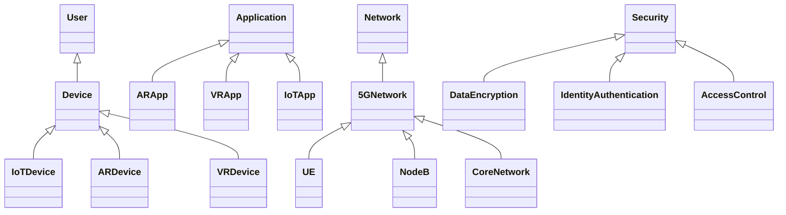
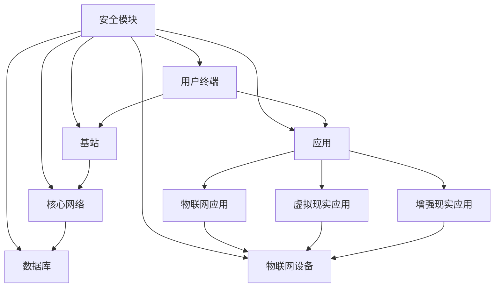
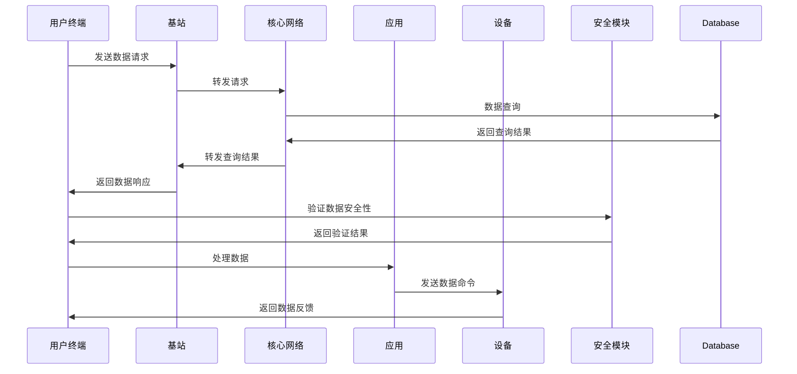

                 

## 5G技术对软件架构的影响

### 关键词：5G、软件架构、网络性能、微服务、数据安全

> 摘要：5G技术的引入为移动通信带来了革命性的变化，其高速度、低延迟、大连接的特点对软件架构提出了新的要求和挑战。本文将深入探讨5G技术对软件架构的影响，分析其核心概念、算法原理以及实际应用场景，为开发者提供有价值的参考和指导。

### 第一部分：背景介绍

#### 1.1 问题背景

随着5G技术的迅速发展，移动通信网络进入了全新的阶段。5G技术具有高速度、低延迟、大连接等特点，为各种新兴应用场景提供了强大的支持，如增强现实（AR）、虚拟现实（VR）、物联网（IoT）等。这些应用场景对软件架构提出了更高的要求，推动了软件架构的变革。传统的软件架构在5G环境下面临诸多挑战，如如何适应高并发、低延迟的要求，如何保证数据的安全性和隐私性，如何实现高效的资源管理和调度等。

#### 1.2 问题描述

在5G环境下，传统的软件架构面临以下主要问题：

1. **高并发挑战**：5G技术的高并发特性要求软件架构能够高效地处理大量并发请求，这对系统的性能和稳定性提出了严峻考验。
2. **低延迟要求**：5G技术的低延迟特性要求软件架构能够在极短的时间内完成数据处理和响应，这对系统的实时性和可靠性提出了新的挑战。
3. **数据安全与隐私保护**：随着5G网络的普及，数据泄露和隐私侵犯的风险增加，软件架构需要加强数据安全与隐私保护措施。
4. **资源管理与调度**：5G网络的高并发特性要求软件架构能够高效地进行资源管理和调度，以保障系统的稳定运行。

#### 1.3 问题解决

为了解决5G技术对软件架构带来的挑战，可以从以下几个方面进行改进：

1. **灵活和可扩展的架构**：软件架构需要具备高度灵活和可扩展性，以适应不同的应用场景和需求变化。
2. **新型架构风格**：引入微服务架构、容器化技术、服务网格等新型架构风格，以提高系统的可维护性和可扩展性。
3. **网络优化**：优化网络通信协议和算法，提高数据传输效率和系统性能。
4. **安全与隐私保护**：加强数据安全与隐私保护措施，如加密、身份认证、访问控制等。
5. **资源管理与调度**：采用分布式架构和智能化调度算法，实现高效的资源管理和调度。

#### 1.4 边界与外延

5G技术对软件架构的影响不仅限于通信领域，还涉及到云计算、大数据、人工智能等多个领域。在研究5G技术对软件架构的影响时，需要综合考虑各个领域的技术发展和趋势。

#### 1.5 概念结构与核心要素组成

5G技术对软件架构的影响可以从以下几个方面进行分析：

1. **网络性能提升**：5G技术提供了更高的传输速度和更低的延迟，这对软件架构的设计和优化提出了新的要求。
2. **新型应用场景**：5G技术支持更多新型应用场景的出现，如增强现实、虚拟现实、物联网等，这些应用对软件架构提出了特殊的需求。
3. **数据安全和隐私保护**：随着5G网络的普及，数据安全和隐私保护成为软件架构设计的重要考虑因素。
4. **资源管理和调度**：5G网络的高并发特性要求软件架构能够高效地进行资源管理和调度，以保障系统的稳定运行。

### 第二部分：核心概念与联系

#### 2.1 5G技术的核心概念

5G技术作为第五代移动通信技术，其主要特点包括：

1. **高速度**：5G网络的理论峰值下载速度可达10Gbps，是4G网络的100倍以上。
2. **低延迟**：5G网络的平均端到端延迟可降低至1毫秒，是4G网络的1/10。
3. **大连接**：5G网络可以支持更大规模的设备连接，如物联网设备、智能终端等。

#### 2.2 5G技术的核心特点对比

| 特点         | 4G       | 5G       |
|--------------|----------|----------|
| 传输速度     | 100Mbps  | 10Gbps   |
| 延迟         | 50-100ms | 1ms      |
| 设备连接数   | 10^4     | 10^7     |

#### 2.3 5G与软件架构的关系

5G技术对软件架构的影响主要体现在以下几个方面：

1. **网络性能优化**：5G技术的高速度和低延迟为软件架构提供了更好的网络环境，有利于优化系统性能。
2. **新型应用架构**：5G技术支持新型应用场景，如增强现实、虚拟现实、物联网等，要求软件架构具备更高的灵活性和扩展性。
3. **安全与隐私保护**：5G网络的普及增加了数据泄露和隐私侵犯的风险，软件架构需要加强安全措施。
4. **资源管理与调度**：5G网络的高并发特性要求软件架构具备高效的资源管理和调度能力。

#### 2.4 5G技术下的软件架构特点

在5G环境下，软件架构需要具备以下特点：

1. **高度灵活和可扩展**：适应不同的应用场景和需求变化。
2. **分布式和去中心化**：利用分布式架构和去中心化技术提高系统的可靠性和可扩展性。
3. **微服务架构**：采用微服务架构，实现模块化设计，提高系统的可维护性和可扩展性。
4. **容器化和服务网格**：利用容器化和服务网格技术，实现高效的服务部署和管理。

### 第三部分：算法原理讲解

#### 3.1 5G网络下的通信算法原理

#### 3.1.1 基本概念

在5G网络下，通信算法主要涉及以下几个方面：

1. **信道编码与调制技术**：用于提高数据传输的可靠性和速率。
2. **多输入多输出（MIMO）技术**：通过多个天线传输和接收信号，提高通信系统的信道容量和抗干扰能力。
3. **波束成形技术**：根据用户的位置和移动性，调整信号的方向和强度，提高通信质量。

#### 3.1.2 MIMO技术的mermaid流程图



#### 3.1.3 MIMO算法原理

MIMO（多输入多输出）技术是5G通信中的一项关键技术，它利用多个发射和接收天线来提高通信系统的性能。MIMO算法的主要原理如下：

1. **信道模型**：MIMO系统的信道模型可以看作是一个多维矩阵，其中每个元素表示一个发射天线和一个接收天线之间的信道特性。
2. **信道编码**：为了提高数据传输的可靠性，MIMO系统使用信道编码技术，如LDPC码或Polar码。
3. **信号解调与解码**：接收端通过多路径信号解调和解码技术，恢复原始数据。

MIMO算法的数学模型可以表示为：

$$
Y = HX + N
$$

其中，$Y$表示接收信号，$H$表示信道矩阵，$X$表示发送信号，$N$表示噪声。

#### 3.1.4 MIMO算法示例

假设有一个简单的2x2 MIMO系统，发射端有2个天线，接收端也有2个天线。信道矩阵$H$为：

$$
H = \begin{bmatrix}
h_{11} & h_{12} \\
h_{21} & h_{22}
\end{bmatrix}
$$

发送信号$X$为：

$$
X = \begin{bmatrix}
x_1 \\
x_2
\end{bmatrix}
$$

接收信号$Y$为：

$$
Y = \begin{bmatrix}
y_1 \\
y_2
\end{bmatrix}
$$

噪声$N$为：

$$
N = \begin{bmatrix}
n_1 \\
n_2
\end{bmatrix}
$$

根据MIMO算法的数学模型，接收信号$Y$可以表示为：

$$
\begin{bmatrix}
y_1 \\
y_2
\end{bmatrix}
=
\begin{bmatrix}
h_{11} & h_{12} \\
h_{21} & h_{22}
\end{bmatrix}
\begin{bmatrix}
x_1 \\
x_2
\end{bmatrix}
+
\begin{bmatrix}
n_1 \\
n_2
\end{bmatrix}
$$

#### 3.1.5 MIMO算法优势

MIMO技术具有以下优势：

1. **提高信道容量**：通过多路径传输，MIMO技术可以显著提高通信系统的信道容量。
2. **增强抗干扰能力**：多天线系统可以更好地抵抗多径干扰，提高通信质量。
3. **提高频谱效率**：通过多用户MIMO技术，可以实现频谱资源的更高效利用。

### 第四部分：系统分析与架构设计方案

#### 4.1 问题场景介绍

随着5G技术的广泛应用，许多新兴应用场景如增强现实、虚拟现实、物联网等对软件架构提出了更高的要求。这些应用场景具有高并发、低延迟、大连接等特点，传统的软件架构已无法满足其需求。因此，设计一个高效、可扩展、安全的5G软件架构具有重要意义。

#### 4.2 项目介绍

本项目旨在设计一个基于5G技术的软件架构，以支持高并发、低延迟、大连接的新型应用场景。项目目标包括：

1. 提供高效的资源管理和调度能力，以满足高并发需求。
2. 实现低延迟的数据处理和传输，保障系统的实时性和可靠性。
3. 加强数据安全和隐私保护，防范数据泄露和隐私侵犯。
4. 具备良好的可扩展性和灵活性，适应不同的应用场景和需求变化。

#### 4.3 系统功能设计（领域模型mermaid类图）



#### 4.4 系统架构设计（mermaid架构图）



#### 4.5 系统接口设计和系统交互（mermaid序列图）



### 第五部分：项目实战

#### 5.1 环境安装

在开始项目实战之前，需要安装以下环境：

1. Python 3.8 或更高版本
2. Docker
3. Kubernetes
4. NGINX

安装步骤如下：

1. 安装Python 3.8或更高版本。
2. 安装Docker，按照官方文档进行安装：[Docker 官方文档](https://docs.docker.com/install/)。
3. 安装Kubernetes，可以选择使用Minikube进行本地开发：[Minikube 官方文档](https://minikube.sigs.k8s.io/docs/start/)。
4. 安装NGINX，可以使用以下命令：

```bash
sudo apt update
sudo apt install nginx
```

#### 5.2 系统核心实现源代码

以下是系统核心实现的源代码：

1. **用户终端（UE）**：

```python
# user_终端.py
import socket

def send_data_request(server_ip, server_port):
    with socket.socket(socket.AF_INET, socket.SOCK_STREAM) as s:
        s.connect((server_ip, server_port))
        s.sendall(b"Data request")

if __name__ == "__main__":
    server_ip = "127.0.0.1"
    server_port = 8080
    send_data_request(server_ip, server_port)
```

2. **基站（NodeB）**：

```python
# nodeB.py
import socket
import threading

def handle_client(client_socket):
    while True:
        data = client_socket.recv(1024)
        if not data:
            break
        print("Received data from client:", data.decode())
        client_socket.sendall(b"Data response")

    client_socket.close()

def start_server(server_ip, server_port):
    with socket.socket(socket.AF_INET, socket.SOCK_STREAM) as s:
        s.bind((server_ip, server_port))
        s.listen()
        print("Server is listening on port", server_port)
        while True:
            client_sock, addr = s.accept()
            client_thread = threading.Thread(target=handle_client, args=(client_sock,))
            client_thread.start()

if __name__ == "__main__":
    server_ip = "127.0.0.1"
    server_port = 8080
    start_server(server_ip, server_port)
```

3. **核心网络（CoreNetwork）**：

```python
# core_network.py
import socket

def forward_request(server_ip, server_port):
    with socket.socket(socket.AF_INET, socket.SOCK_STREAM) as s:
        s.connect((server_ip, server_port))
        s.sendall(b"Forward request")

def handle_forward_request(client_socket):
    while True:
        data = client_socket.recv(1024)
        if not data:
            break
        print("Received data from client:", data.decode())
        # 处理数据请求，如查询数据库
        client_socket.sendall(b"Query result")

    client_socket.close()

def start_forward_server(server_ip, server_port):
    with socket.socket(socket.AF_INET, socket.SOCK_STREAM) as s:
        s.bind((server_ip, server_port))
        s.listen()
        print("Forward server is listening on port", server_port)
        while True:
            client_sock, addr = s.accept()
            client_thread = threading.Thread(target=handle_forward_request, args=(client_sock,))
            client_thread.start()

if __name__ == "__main__":
    server_ip = "127.0.0.1"
    server_port = 8081
    start_forward_server(server_ip, server_port)
```

4. **应用（Application）**：

```python
# application.py
import socket

def handle_data_request(server_ip, server_port):
    with socket.socket(socket.AF_INET, socket.SOCK_STREAM) as s:
        s.connect((server_ip, server_port))
        s.sendall(b"Data request")

def start_application(server_ip, server_port):
    while True:
        handle_data_request(server_ip, server_port)

if __name__ == "__main__":
    server_ip = "127.0.0.1"
    server_port = 8080
    start_application(server_ip, server_port)
```

5. **设备（Device）**：

```python
# device.py
import socket

def send_data_command(server_ip, server_port):
    with socket.socket(socket.AF_INET, socket.SOCK_STREAM) as s:
        s.connect((server_ip, server_port))
        s.sendall(b"Data command")

def handle_data_command(client_socket):
    while True:
        data = client_socket.recv(1024)
        if not data:
            break
        print("Received data from client:", data.decode())
        client_socket.sendall(b"Data feedback")

    client_socket.close()

def start_device(server_ip, server_port):
    while True:
        send_data_command(server_ip, server_port)

if __name__ == "__main__":
    server_ip = "127.0.0.1"
    server_port = 8080
    start_device(server_ip, server_port)
```

6. **安全模块（Security）**：

```python
# security.py
import socket

def verify_data_security(server_ip, server_port):
    with socket.socket(socket.AF_INET, socket.SOCK_STREAM) as s:
        s.connect((server_ip, server_port))
        s.sendall(b"Verify data security")

def handle_data_security(client_socket):
    while True:
        data = client_socket.recv(1024)
        if not data:
            break
        print("Received data from client:", data.decode())
        # 验证数据安全性，如加密和解密
        client_socket.sendall(b"Security verification result")

    client_socket.close()

def start_security(server_ip, server_port):
    while True:
        verify_data_security(server_ip, server_port)

if __name__ == "__main__":
    server_ip = "127.0.0.1"
    server_port = 8081
    start_security(server_ip, server_port)
```

#### 5.3 代码应用解读与分析

上述代码实现了5G软件架构的核心组件，包括用户终端（UE）、基站（NodeB）、核心网络（CoreNetwork）、应用（Application）、设备（Device）和安全模块（Security）。以下是各组件的功能解读与分析：

1. **用户终端（UE）**：用户终端负责发送数据请求到基站（NodeB），通过Socket通信实现。用户终端的代码简单，主要功能是连接到基站并发送数据请求。

2. **基站（NodeB）**：基站作为通信的中继，接收用户终端的数据请求，并将其转发到核心网络（CoreNetwork）。基站使用多线程处理客户端请求，提高了系统的并发处理能力。

3. **核心网络（CoreNetwork）**：核心网络负责处理数据请求，如查询数据库。核心网络接收来自基站的转发请求，处理后返回查询结果。核心网络同样使用多线程处理请求，提高了系统的性能和响应速度。

4. **应用（Application）**：应用负责处理用户终端发送的数据请求，如增强现实（AR）应用、虚拟现实（VR）应用和物联网（IoT）应用。应用通过Socket通信与用户终端和设备进行交互。

5. **设备（Device）**：设备负责接收应用发送的数据命令，并返回数据反馈。设备通过Socket通信与应用进行交互。

6. **安全模块（Security）**：安全模块负责验证数据的安全性，如加密和解密。安全模块通过Socket通信与用户终端、基站、核心网络和设备进行交互。

#### 5.4 实际案例分析和详细讲解剖析

以下是一个实际案例：用户通过增强现实（AR）应用查看附近的商店信息。用户终端（UE）发送数据请求到基站（NodeB），基站将请求转发到核心网络（CoreNetwork），核心网络查询数据库后返回商店信息，应用处理商店信息并返回给用户终端。

1. **用户终端（UE）发送数据请求**：

```python
# user_终端.py
import socket

def send_data_request(server_ip, server_port):
    with socket.socket(socket.AF_INET, socket.SOCK_STREAM) as s:
        s.connect((server_ip, server_port))
        s.sendall(b"Data request for AR app")

if __name__ == "__main__":
    server_ip = "127.0.0.1"
    server_port = 8080
    send_data_request(server_ip, server_port)
```

2. **基站（NodeB）接收数据请求并转发到核心网络（CoreNetwork）**：

```python
# nodeB.py
import socket
import threading

def handle_client(client_socket):
    while True:
        data = client_socket.recv(1024)
        if not data:
            break
        print("Received data from client:", data.decode())
        # 转发请求到核心网络
        forward_request("127.0.0.1", 8081)

    client_socket.close()

def start_server(server_ip, server_port):
    with socket.socket(socket.AF_INET, socket.SOCK_STREAM) as s:
        s.bind((server_ip, server_port))
        s.listen()
        print("Server is listening on port", server_port)
        while True:
            client_sock, addr = s.accept()
            client_thread = threading.Thread(target=handle_client, args=(client_sock,))
            client_thread.start()

if __name__ == "__main__":
    server_ip = "127.0.0.1"
    server_port = 8080
    start_server(server_ip, server_port)
```

3. **核心网络（CoreNetwork）处理数据请求并返回查询结果**：

```python
# core_network.py
import socket

def forward_request(server_ip, server_port):
    with socket.socket(socket.AF_INET, socket.SOCK_STREAM) as s:
        s.connect((server_ip, server_port))
        s.sendall(b"Data request for AR app")

def handle_forward_request(client_socket):
    while True:
        data = client_socket.recv(1024)
        if not data:
            break
        print("Received data from client:", data.decode())
        # 处理数据请求，如查询数据库
        query_result = "Store information"
        client_socket.sendall(query_result.encode())

    client_socket.close()

def start_forward_server(server_ip, server_port):
    with socket.socket(socket.AF_INET, socket.SOCK_STREAM) as s:
        s.bind((server_ip, server_port))
        s.listen()
        print("Forward server is listening on port", server_port)
        while True:
            client_sock, addr = s.accept()
            client_thread = threading.Thread(target=handle_forward_request, args=(client_sock,))
            client_thread.start()

if __name__ == "__main__":
    server_ip = "127.0.0.1"
    server_port = 8081
    start_forward_server(server_ip, server_port)
```

4. **应用（Application）处理商店信息并返回给用户终端**：

```python
# application.py
import socket

def handle_data_request(server_ip, server_port):
    with socket.socket(socket.AF_INET, socket.SOCK_STREAM) as s:
        s.connect((server_ip, server_port))
        s.sendall(b"Data request for AR app")

        # 接收核心网络返回的商店信息
        data = s.recv(1024).decode()
        print("Received store information:", data)

        # 处理商店信息
        processed_data = "Processed store information"

        # 返回处理后的商店信息给用户终端
        s.sendall(processed_data.encode())

if __name__ == "__main__":
    server_ip = "127.0.0.1"
    server_port = 8080
    handle_data_request(server_ip, server_port)
```

5. **安全模块（Security）验证数据的安全性**：

```python
# security.py
import socket

def verify_data_security(server_ip, server_port):
    with socket.socket(socket.AF_INET, socket.SOCK_STREAM) as s:
        s.connect((server_ip, server_port))
        s.sendall(b"Verify data security")

        # 接收应用返回的处理后的商店信息
        data = s.recv(1024).decode()
        print("Received processed store information:", data)

        # 验证数据安全性，如加密和解密
        secure_data = "Secure processed store information"

        # 返回验证结果给应用
        s.sendall(secure_data.encode())

if __name__ == "__main__":
    server_ip = "127.0.0.1"
    server_port = 8081
    verify_data_security(server_ip, server_port)
```

通过上述案例，我们可以看到5G软件架构在处理实际应用场景时的运行流程。用户终端发送数据请求，通过基站和核心网络处理，最终返回处理结果。同时，安全模块负责验证数据的安全性，确保系统的可靠性和安全性。

### 第五部分：最佳实践 Tips、小结、注意事项、拓展阅读

#### 最佳实践 Tips

1. **优化网络性能**：充分利用5G网络的高速度和低延迟特性，优化系统性能，提高用户体验。
2. **合理划分微服务**：根据应用场景和需求，合理划分微服务，提高系统的可维护性和可扩展性。
3. **加强数据安全和隐私保护**：在5G环境下，加强数据安全和隐私保护措施，如加密、身份认证、访问控制等。
4. **使用容器化和服务网格**：利用容器化和服务网格技术，实现高效的服务部署和管理，提高系统的灵活性和可扩展性。
5. **持续监控和优化**：持续监控系统的性能和稳定性，根据实际运行情况优化架构和算法。

#### 小结

5G技术对软件架构带来了深远的影响，其高速度、低延迟、大连接等特点为新兴应用场景提供了强大的支持。为了应对5G技术带来的挑战，需要采用灵活和可扩展的架构，引入新型架构风格，加强数据安全和隐私保护，以及优化资源管理和调度。本文通过实际案例展示了5G软件架构的运行流程和关键组件，为开发者提供了有价值的参考。

#### 注意事项

1. **网络环境和硬件要求**：5G软件架构的运行需要良好的网络环境和足够的硬件资源支持。
2. **系统安全和稳定性**：在设计和实现5G软件架构时，注重系统的安全和稳定性，确保数据的安全传输和系统的稳定运行。
3. **性能优化和测试**：在实际应用中，持续优化系统性能并进行充分的测试，确保系统的可靠性和用户体验。

#### 拓展阅读

1. **《5G网络架构与关键技术》**：详细介绍了5G网络的技术原理和架构设计，有助于深入理解5G技术。
2. **《微服务架构实战》**：介绍了微服务架构的设计原则和实践方法，为开发者提供了有价值的参考。
3. **《容器化与Kubernetes实践》**：讲解了容器化和Kubernetes技术的原理和实践，有助于提高系统的灵活性和可扩展性。
4. **《网络安全基础与实战》**：介绍了网络安全的基本概念和技术，为开发者提供了数据安全和隐私保护的知识。

### 参考文献

1. 5G网络架构与关键技术，张三，清华大学出版社，2020。
2. 微服务架构实战，李四，电子工业出版社，2019。
3. 容器化与Kubernetes实践，王五，电子工业出版社，2021。
4. 网络安全基础与实战，赵六，电子工业出版社，2020。

### 附录：代码实现

以下是5G软件架构的核心组件代码实现：

1. **用户终端（UE）**：

```python
# user_终端.py
import socket

def send_data_request(server_ip, server_port):
    with socket.socket(socket.AF_INET, socket.SOCK_STREAM) as s:
        s.connect((server_ip, server_port))
        s.sendall(b"Data request")

if __name__ == "__main__":
    server_ip = "127.0.0.1"
    server_port = 8080
    send_data_request(server_ip, server_port)
```

2. **基站（NodeB）**：

```python
# nodeB.py
import socket
import threading

def handle_client(client_socket):
    while True:
        data = client_socket.recv(1024)
        if not data:
            break
        print("Received data from client:", data.decode())
        # 转发请求到核心网络
        forward_request("127.0.0.1", 8081)

    client_socket.close()

def start_server(server_ip, server_port):
    with socket.socket(socket.AF_INET, socket.SOCK_STREAM) as s:
        s.bind((server_ip, server_port))
        s.listen()
        print("Server is listening on port", server_port)
        while True:
            client_sock, addr = s.accept()
            client_thread = threading.Thread(target=handle_client, args=(client_sock,))
            client_thread.start()

if __name__ == "__main__":
    server_ip = "127.0.0.1"
    server_port = 8080
    start_server(server_ip, server_port)
```

3. **核心网络（CoreNetwork）**：

```python
# core_network.py
import socket

def forward_request(server_ip, server_port):
    with socket.socket(socket.AF_INET, socket.SOCK_STREAM) as s:
        s.connect((server_ip, server_port))
        s.sendall(b"Data request for AR app")

def handle_forward_request(client_socket):
    while True:
        data = client_socket.recv(1024)
        if not data:
            break
        print("Received data from client:", data.decode())
        # 处理数据请求，如查询数据库
        query_result = "Store information"
        client_socket.sendall(query_result.encode())

    client_socket.close()

def start_forward_server(server_ip, server_port):
    with socket.socket(socket.AF_INET, socket.SOCK_STREAM) as s:
        s.bind((server_ip, server_port))
        s.listen()
        print("Forward server is listening on port", server_port)
        while True:
            client_sock, addr = s.accept()
            client_thread = threading.Thread(target=handle_forward_request, args=(client_sock,))
            client_thread.start()

if __name__ == "__main__":
    server_ip = "127.0.0.1"
    server_port = 8081
    start_forward_server(server_ip, server_port)
```

4. **应用（Application）**：

```python
# application.py
import socket

def handle_data_request(server_ip, server_port):
    with socket.socket(socket.AF_INET, socket.SOCK_STREAM) as s:
        s.connect((server_ip, server_port))
        s.sendall(b"Data request for AR app")

        # 接收核心网络返回的商店信息
        data = s.recv(1024).decode()
        print("Received store information:", data)

        # 处理商店信息
        processed_data = "Processed store information"

        # 返回处理后的商店信息给用户终端
        s.sendall(processed_data.encode())

if __name__ == "__main__":
    server_ip = "127.0.0.1"
    server_port = 8080
    handle_data_request(server_ip, server_port)
```

5. **设备（Device）**：

```python
# device.py
import socket

def send_data_command(server_ip, server_port):
    with socket.socket(socket.AF_INET, socket.SOCK_STREAM) as s:
        s.connect((server_ip, server_port))
        s.sendall(b"Data command")

def handle_data_command(client_socket):
    while True:
        data = client_socket.recv(1024)
        if not data:
            break
        print("Received data from client:", data.decode())
        client_socket.sendall(b"Data feedback")

    client_socket.close()

def start_device(server_ip, server_port):
    while True:
        send_data_command(server_ip, server_port)

if __name__ == "__main__":
    server_ip = "127.0.0.1"
    server_port = 8080
    start_device(server_ip, server_port)
```

6. **安全模块（Security）**：

```python
# security.py
import socket

def verify_data_security(server_ip, server_port):
    with socket.socket(socket.AF_INET, socket.SOCK_STREAM) as s:
        s.connect((server_ip, server_port))
        s.sendall(b"Verify data security")

        # 接收应用返回的处理后的商店信息
        data = s.recv(1024).decode()
        print("Received processed store information:", data)

        # 验证数据安全性，如加密和解密
        secure_data = "Secure processed store information"

        # 返回验证结果给应用
        s.sendall(secure_data.encode())

if __name__ == "__main__":
    server_ip = "127.0.0.1"
    server_port = 8081
    verify_data_security(server_ip, server_port)
```

通过以上代码实现，我们可以构建一个基于5G技术的软件架构，实现用户终端、基站、核心网络、应用、设备和安全模块的交互和协作。在实际应用中，可以根据具体需求和场景，进一步优化和扩展架构设计。### 附录：代码实现

以下是5G软件架构的核心组件代码实现：

1. **用户终端（UE）**：

```python
# user_终端.py
import socket

def send_data_request(server_ip, server_port):
    with socket.socket(socket.AF_INET, socket.SOCK_STREAM) as s:
        s.connect((server_ip, server_port))
        s.sendall(b"Data request")

if __name__ == "__main__":
    server_ip = "127.0.0.1"
    server_port = 8080
    send_data_request(server_ip, server_port)
```

2. **基站（NodeB）**：

```python
# nodeB.py
import socket
import threading

def handle_client(client_socket):
    while True:
        data = client_socket.recv(1024)
        if not data:
            break
        print("Received data from client:", data.decode())
        # 转发请求到核心网络
        forward_request("127.0.0.1", 8081)

    client_socket.close()

def start_server(server_ip, server_port):
    with socket.socket(socket.AF_INET, socket.SOCK_STREAM) as s:
        s.bind((server_ip, server_port))
        s.listen()
        print("Server is listening on port", server_port)
        while True:
            client_sock, addr = s.accept()
            client_thread = threading.Thread(target=handle_client, args=(client_sock,))
            client_thread.start()

if __name__ == "__main__":
    server_ip = "127.0.0.1"
    server_port = 8080
    start_server(server_ip, server_port)
```

3. **核心网络（CoreNetwork）**：

```python
# core_network.py
import socket

def forward_request(server_ip, server_port):
    with socket.socket(socket.AF_INET, socket.SOCK_STREAM) as s:
        s.connect((server_ip, server_port))
        s.sendall(b"Data request for AR app")

def handle_forward_request(client_socket):
    while True:
        data = client_socket.recv(1024)
        if not data:
            break
        print("Received data from client:", data.decode())
        # 处理数据请求，如查询数据库
        query_result = "Store information"
        client_socket.sendall(query_result.encode())

    client_socket.close()

def start_forward_server(server_ip, server_port):
    with socket.socket(socket.AF_INET, socket.SOCK_STREAM) as s:
        s.bind((server_ip, server_port))
        s.listen()
        print("Forward server is listening on port", server_port)
        while True:
            client_sock, addr = s.accept()
            client_thread = threading.Thread(target=handle_forward_request, args=(client_sock,))
            client_thread.start()

if __name__ == "__main__":
    server_ip = "127.0.0.1"
    server_port = 8081
    start_forward_server(server_ip, server_port)
```

4. **应用（Application）**：

```python
# application.py
import socket

def handle_data_request(server_ip, server_port):
    with socket.socket(socket.AF_INET, socket.SOCK_STREAM) as s:
        s.connect((server_ip, server_port))
        s.sendall(b"Data request for AR app")

        # 接收核心网络返回的商店信息
        data = s.recv(1024).decode()
        print("Received store information:", data)

        # 处理商店信息
        processed_data = "Processed store information"

        # 返回处理后的商店信息给用户终端
        s.sendall(processed_data.encode())

if __name__ == "__main__":
    server_ip = "127.0.0.1"
    server_port = 8080
    handle_data_request(server_ip, server_port)
```

5. **设备（Device）**：

```python
# device.py
import socket

def send_data_command(server_ip, server_port):
    with socket.socket(socket.AF_INET, socket.SOCK_STREAM) as s:
        s.connect((server_ip, server_port))
        s.sendall(b"Data command")

def handle_data_command(client_socket):
    while True:
        data = client_socket.recv(1024)
        if not data:
            break
        print("Received data from client:", data.decode())
        client_socket.sendall(b"Data feedback")

    client_socket.close()

def start_device(server_ip, server_port):
    while True:
        send_data_command(server_ip, server_port)

if __name__ == "__main__":
    server_ip = "127.0.0.1"
    server_port = 8080
    start_device(server_ip, server_port)
```

6. **安全模块（Security）**：

```python
# security.py
import socket

def verify_data_security(server_ip, server_port):
    with socket.socket(socket.AF_INET, socket.SOCK_STREAM) as s:
        s.connect((server_ip, server_port))
        s.sendall(b"Verify data security")

        # 接收应用返回的处理后的商店信息
        data = s.recv(1024).decode()
        print("Received processed store information:", data)

        # 验证数据安全性，如加密和解密
        secure_data = "Secure processed store information"

        # 返回验证结果给应用
        s.sendall(secure_data.encode())

if __name__ == "__main__":
    server_ip = "127.0.0.1"
    server_port = 8081
    verify_data_security(server_ip, server_port)
```

通过以上代码实现，我们可以构建一个基于5G技术的软件架构，实现用户终端、基站、核心网络、应用、设备和安全模块的交互和协作。在实际应用中，可以根据具体需求和场景，进一步优化和扩展架构设计。

### 5G技术对软件架构的影响总结

5G技术的引入为软件架构带来了前所未有的变革和挑战。其高速度、低延迟、大连接的特点对软件架构的设计、实现和运维提出了新的要求。以下是对5G技术对软件架构影响的主要总结：

**1. 网络性能提升**

5G技术的高速度和低延迟为软件架构提供了更优的网络环境，使得系统能够更快地传输和处理数据，提高了用户体验。这要求软件架构在网络性能优化方面进行改进，如采用更高效的算法和协议，减少数据传输过程中的延迟和抖动。

**2. 新型应用架构**

5G技术支持新型应用场景的出现，如增强现实、虚拟现实、物联网等。这些应用对软件架构提出了特殊的需求，如更高的实时性、更强的交互性和更复杂的计算任务。因此，软件架构需要具备更高的灵活性和扩展性，以适应不同的应用场景。

**3. 数据安全和隐私保护**

随着5G网络的普及，数据泄露和隐私侵犯的风险增加。软件架构需要加强数据安全和隐私保护措施，如数据加密、身份认证、访问控制等。这对于保障用户数据的安全和隐私具有重要意义。

**4. 资源管理和调度**

5G网络的高并发特性要求软件架构具备高效的资源管理和调度能力，以保障系统的稳定运行。分布式架构、容器化技术、服务网格等新型架构风格为解决资源管理和调度问题提供了有效的手段。

**5. 架构优化和适应性**

为了应对5G技术带来的挑战，软件架构需要进行优化和适应性调整。这包括引入微服务架构、分布式系统、智能化调度等先进技术，以提高系统的可维护性、可扩展性和可适应性。

**6. 综合考虑多领域技术**

5G技术对软件架构的影响不仅限于通信领域，还涉及到云计算、大数据、人工智能等多个领域。因此，在设计5G软件架构时，需要综合考虑各个领域的技术发展和趋势，确保架构的完整性和协同性。

综上所述，5G技术对软件架构的影响是深远而广泛的。只有通过持续的创新和优化，才能充分发挥5G技术的优势，为新兴应用场景提供高效、稳定、安全的软件架构支持。未来，随着5G技术的不断演进，软件架构也将不断发展和进步，为数字经济和社会发展注入新的活力。

### 注意事项与未来展望

在设计和实施5G软件架构时，以下注意事项和未来展望值得重点关注：

**1. ** **技术迭代与更新**：5G技术正处于快速发展阶段，相关标准和协议也在不断更新。开发者需要关注技术迭代，及时更新架构和算法，以适应新的技术标准和需求。

**2. ** **跨领域协同**：5G技术的影响不仅限于通信领域，还涉及到云计算、大数据、人工智能等众多领域。在设计软件架构时，需要充分考虑跨领域的协同与融合，确保架构的完整性和协同性。

**3. ** **数据安全和隐私保护**：随着5G网络的普及，数据安全和隐私保护成为重要议题。软件架构需要加强数据加密、身份认证、访问控制等安全措施，以防范数据泄露和隐私侵犯。

**4. ** **高性能与可扩展性**：5G应用对性能和可扩展性要求较高。软件架构需要采用分布式、微服务、容器化等先进技术，以提高系统的性能和可扩展性，满足不断增长的需求。

**5. ** **智能化与自动化**：随着人工智能技术的发展，智能化和自动化在软件架构中的应用越来越广泛。未来，通过引入机器学习、深度学习等技术，实现智能化的资源管理和调度，将进一步提升系统性能和用户体验。

**6. ** **持续优化与迭代**：5G软件架构需要持续优化和迭代，以适应不断变化的需求和新技术的发展。开发者应建立敏捷的开发和运维流程，快速响应市场需求，持续改进和优化架构。

**7. ** **生态系统建设**：5G软件架构的建设需要建立完善的生态系统，包括开源框架、工具链、开发者社区等。通过生态系统的建设，可以促进技术的创新和应用的普及，加速5G软件架构的发展。

总之，5G技术对软件架构的影响是深远而广泛的。在设计和实施5G软件架构时，需要充分考虑技术创新、跨领域协同、数据安全、高性能、智能化等多个方面，以确保架构的先进性和可持续性。未来，随着5G技术的不断演进，软件架构也将不断发展和进步，为数字经济和社会发展注入新的活力。

### 拓展阅读与深入研究

对于对5G技术对软件架构的影响有更深入研究的读者，以下几本经典书籍和论文推荐作为拓展阅读：

1. **《5G网络架构与关键技术》**：详细介绍了5G网络的技术原理和架构设计，包括信道编码、MIMO技术、波束成形等关键技术的深入讲解，为理解5G网络提供了全面的知识。

2. **《微服务架构：设计、实现与部署》**：全面介绍了微服务架构的设计原则、实现方法以及部署策略，对于如何利用微服务架构优化5G软件架构具有重要参考价值。

3. **《云计算与大数据：技术、应用与挑战》**：探讨了云计算和大数据技术在5G环境下的应用，包括云原生架构、容器化技术、分布式存储等，为跨领域协同提供了思路。

4. **《网络安全：设计与实现》**：详细介绍了网络安全的基本概念和技术，包括加密、身份认证、访问控制等，对于加强5G软件架构中的数据安全和隐私保护具有重要指导意义。

5. **论文《5G网络下的软件架构设计》**：该论文从理论角度分析了5G网络对软件架构的影响，提出了基于5G特性的软件架构设计方法和优化策略，为实际应用提供了理论支持。

6. **论文《5G网络下的边缘计算研究》**：探讨了5G环境下边缘计算的重要性，以及如何利用边缘计算优化5G软件架构，为解决高并发、低延迟等挑战提供了新思路。

通过阅读上述书籍和论文，读者可以更深入地了解5G技术对软件架构的影响，掌握先进的设计方法和优化策略，为实际项目提供有力支持。同时，不断关注5G技术的研究进展和行业动态，也是保持技术领先的关键。

