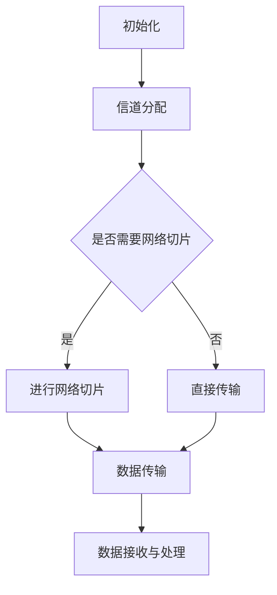
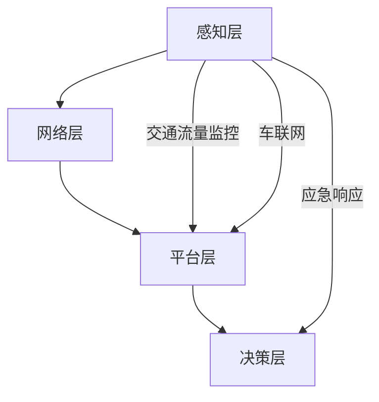
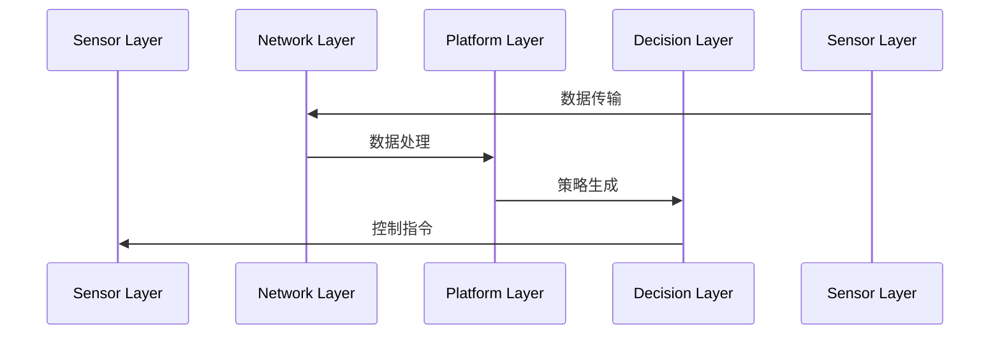

                 

# 5G技术：对软件开发的影响与机遇

> 关键词：5G技术、软件开发、影响、机遇、网络架构、关键技术、安全挑战

> 摘要：随着5G技术的逐步商用，其对软件开发的影响和机遇逐渐显现。本文将深入探讨5G技术对软件开发带来的需求变化、技术影响、安全挑战及其融合应用，旨在为软件开发者提供对5G技术的理解和应用指南。

## 引言

在数字化和智能化的浪潮中，5G技术被视为新时代的通信基石，其高速率、低延迟、大连接的特性为各行各业带来了前所未有的机遇。5G不仅是一次通信技术的革新，更是一场影响深远的产业变革。作为软件开发的基石，5G技术对软件开发的影响与机遇不容忽视。

本文将从以下几个方面展开讨论：

1. **5G技术基础**：介绍5G技术的发展历程、网络架构、频段与频谱以及关键技术。
2. **5G对软件开发的影响**：分析5G技术对软件开发需求变化、技术影响和开发模式的影响。
3. **5G对软件开发的安全挑战**：探讨5G网络环境下软件开发面临的安全挑战。
4. **5G与软件开发的融合应用**：分析5G在物联网、自动驾驶等领域的应用。
5. **5G对软件开发者的机遇**：探讨5G为软件开发者带来的新岗位和新技能需求。
6. **5G技术未来展望**：预测5G技术对软件开发的影响趋势。

## 第一部分：5G技术基础

### 第1章 5G技术概述

#### 1.1 5G技术的发展历程

5G技术的发展始于2010年代初期，随着4G技术的逐渐成熟，全球通信行业开始筹备5G的标准制定。2015年，国际电信联盟（ITU）正式发布了5G标准，标志着5G技术进入正式开发阶段。2019年，随着各国运营商的逐步商用，5G技术正式进入公众视野。

#### 1.2 5G网络架构

5G网络架构主要包括用户面架构和控制面架构。用户面架构负责数据传输，包括无线接入网（RAN）和核心网（CN）；控制面架构则负责网络控制和业务管理，包括无线接入网控制平面（RANCP）和核心网控制平面（CNCP）。

#### 1.3 5G频段与频谱

5G技术主要使用的是毫米波频段，频段范围为24GHz以上。毫米波频段具有高带宽、低延迟的特性，能够满足高速数据传输和实时交互的需求。

### 第2章 5G关键技术

#### 2.1 毫米波通信

毫米波通信是5G技术的核心，通过使用高频段信号实现高速数据传输。毫米波通信的优势在于其高带宽和低延迟，但同时也面临着信号衰减和干扰等问题。

#### 2.2 Massive MIMO

Massive MIMO（大规模MIMO）技术是5G网络的核心技术之一，通过使用多个天线发送和接收信号，实现更高的传输速率和更高的频谱效率。

#### 2.3 网络切片

网络切片技术是5G网络的关键特性之一，通过虚拟化技术将一个物理网络分割成多个虚拟网络，满足不同业务场景的需求。

#### 2.4 边缘计算

边缘计算技术是5G网络的重要补充，通过在靠近数据源的边缘节点上处理数据，降低延迟和带宽需求，提高网络性能。

## 第二部分：5G对软件开发的影响

### 第3章 5G对软件开发的影响

#### 3.1 5G对软件开发的需求变化

5G技术的高速率、低延迟和大连接特性为软件开发带来了新的需求，如对实时性、稳定性和可靠性的要求更高。

#### 3.2 5G对软件开发技术的影响

5G技术对软件开发工具链、编程语言和框架都产生了深远影响，如对容器技术、微服务架构和云原生应用的支持。

#### 3.3 5G对软件开发模式的改变

5G技术推动了软件开发模式的变革，如分布式开发、自动化开发和智能化开发等。

### 第4章 5G对软件开发的安全挑战

#### 4.1 5G网络环境下的安全问题

5G网络环境下的安全问题主要包括网络安全、数据安全和设备安全等。

#### 4.2 5G对软件开发的安全影响

5G技术对软件开发的安全提出了新的挑战，如网络攻击、数据泄露和设备被篡改等。

### 第5章 5G与软件开发的融合应用

#### 5.1 5G在物联网中的应用

5G技术为物联网提供了高速、低延迟的连接，推动了物联网应用的快速发展。

#### 5.2 5G在自动驾驶中的应用

5G技术为自动驾驶提供了实时、高效的数据传输，提高了自动驾驶的安全性和可靠性。

### 第6章 5G对软件开发者的机遇

#### 6.1 5G为软件开发者带来的新岗位

5G技术的兴起为软件开发者带来了新的职业机会，如5G网络工程师、5G软件开发工程师等。

#### 6.2 5G为软件开发者带来的新技能需求

5G技术对软件开发者的技能需求提出了新的要求，如对5G网络知识、边缘计算技术和网络安全知识的掌握。

### 第7章 5G技术未来展望

#### 7.1 5G技术的未来发展

5G技术将继续向高频段、高速度、高智能的方向发展，为软件开发带来更多的机遇。

#### 7.2 5G对软件开发的影响预测

5G技术将对软件开发产生深远的影响，推动软件开发向更高效、更智能的方向发展。

## 结论

5G技术作为新一代通信技术的代表，其对软件开发的影响和机遇不容忽视。本文通过深入分析5G技术的基础、影响和机遇，旨在为软件开发者提供对5G技术的全面理解和应用指南。

**作者：AI天才研究院/AI Genius Institute & 禅与计算机程序设计艺术 /Zen And The Art of Computer Programming**### 5G技术概述

5G技术，即第五代移动通信技术，是当前通信领域的重要进展。它不仅是对4G技术的升级和扩展，更是未来通信技术发展的一个重要里程碑。5G技术的主要特点包括高速率、低延迟、大连接和高可靠性，这些特性使得5G技术在多个领域具有广泛的应用前景。

#### 5G技术的发展历程

5G技术的发展可以追溯到2010年代初期，当时4G技术已经逐步成熟。随着移动互联网、物联网、云计算等技术的快速发展，通信行业对更高速、更可靠的通信技术有了迫切需求。2015年，国际电信联盟（ITU）正式发布了5G标准，标志着5G技术进入正式开发阶段。2019年，随着各国运营商的逐步商用，5G技术正式进入公众视野。在中国，5G技术的推广尤为迅速，已经成为全球5G网络建设的重要力量。

#### 5G网络架构

5G网络架构相较于4G网络有显著的变化，主要分为用户面架构和控制面架构。

1. **用户面架构**：用户面架构负责数据传输，包括无线接入网（RAN）和核心网（CN）。无线接入网负责连接用户设备和基站，核心网则负责处理用户的数据请求和提供业务支持。

2. **控制面架构**：控制面架构负责网络控制和业务管理，包括无线接入网控制平面（RANCP）和核心网控制平面（CNCP）。RANCP负责无线接入网的资源分配和管理，CNCP则负责核心网的业务逻辑和流量管理。

5G网络架构的一个显著特点是引入了**边缘计算**的概念。边缘计算通过在靠近数据源的边缘节点上处理数据，降低了数据的传输延迟，提高了网络的整体性能。

#### 5G频段与频谱

5G技术主要使用的是毫米波频段，频段范围为24GHz以上。毫米波频段具有高带宽、低延迟的特性，能够满足高速数据传输和实时交互的需求。与传统频段相比，毫米波频段具有更高的频率和更短的波长，因此能够提供更高的数据传输速率。

#### 5G关键技术

5G技术的实现依赖于一系列关键技术的创新和突破，主要包括：

1. **毫米波通信**：毫米波通信通过使用高频段信号实现高速数据传输，其高带宽和低延迟的特性使得5G网络能够支持更多、更复杂的业务应用。

2. **Massive MIMO**：Massive MIMO（大规模MIMO）技术通过使用多个天线发送和接收信号，实现了更高的传输速率和更高的频谱效率。大规模MIMO技术的引入，使得5G网络在数据传输容量和频谱利用率方面有了显著提升。

3. **网络切片**：网络切片技术是5G网络的核心特性之一，通过虚拟化技术将一个物理网络分割成多个虚拟网络，为不同的业务场景提供定制化的网络服务。网络切片技术使得5G网络能够同时支持多种不同类型的应用，如工业互联网、智能交通和自动驾驶等。

4. **边缘计算**：边缘计算通过在靠近数据源的边缘节点上处理数据，降低了数据的传输延迟，提高了网络的整体性能。边缘计算技术的引入，使得5G网络能够更好地支持实时性要求高的应用，如增强现实（AR）和虚拟现实（VR）等。

通过对5G技术的深入探讨，我们可以看到，5G技术不仅是一次通信技术的革新，更是对整个产业生态的系统性变革。5G技术的应用，将为各行各业带来前所未有的机遇和挑战。

#### **核心概念与联系**

在讨论5G技术时，几个核心概念至关重要，它们分别是**高速率**、**低延迟**、**大连接**和**高可靠性**。以下是一个核心概念属性特征对比表格，用于帮助理解这些概念及其相互关系。

| 核心概念 | 属性特征 | 对比与联系 |
| :--- | :--- | :--- |
| **高速率** | 数据传输速率高 | 使大量数据能够快速传输，支持高清视频流、大文件传输等 |
| **低延迟** | 数据传输延迟低 | 降低数据处理和响应时间，支持实时应用，如自动驾驶和远程手术 |
| **大连接** | 支持大量设备同时连接 | 提供稳定和高效的连接，支持物联网和智能城市等应用 |
| **高可靠性** | 网络稳定性和数据完整性高 | 提高数据传输的可靠性和网络的稳定性，确保业务连续性 |

这些概念之间的关系可以概括为：高速率和低延迟确保了数据传输的效率和质量；大连接则提供了广泛的设备接入能力；高可靠性保证了网络服务的稳定性和数据传输的完整性。通过这些特性的综合应用，5G技术能够为各种应用场景提供强大的支持。

下面是一个5G技术核心概念的ER实体关系图，用以进一步展示这些概念之间的逻辑关系：

```mermaid
erDiagram
  User ||--|{ Device : "连接至"}
  Network ||--|{ Connection : "支持"}
  Application ||--|{ Performance : "依赖"}
  Device ||--|{ Data : "传输"}
  Network ||--|{ Latency : "影响"}
  Application ||--|{ Reliability : "依赖"}
```

在上述ER实体关系图中，用户通过设备接入网络，网络提供连接支持，并影响应用性能；应用依赖于网络的高速率、低延迟、大连接和高可靠性来保障其正常运行。这种关系展示了5G技术对软件开发的重要影响，并揭示了其作为新一代通信技术的核心价值。

#### **算法原理讲解**

为了深入理解5G技术对软件开发的影响，我们首先需要探讨5G网络中的关键算法原理。以下将使用mermaid画出一个简单的5G网络算法流程图，并结合Python源代码详细阐述算法原理，并给出数学模型和公式进行解释。

首先，使用mermaid绘制算法流程图：



该流程图简单描述了5G网络中信道分配、网络切片（如果需要）、数据传输以及数据接收与处理的步骤。

接下来，我们使用Python代码实现上述算法，并进行详细解释：

```python
import numpy as np

def channel_allocation():
    """
    信道分配算法
    """
    # 假设有10个信道可供分配
    channels = np.array([i for i in range(10)])
    
    # 随机选择5个信道进行分配
    allocated_channels = np.random.choice(channels, size=5, replace=False)
    
    return allocated_channels

def network_slicing(allocated_channels):
    """
    网络切片算法
    """
    # 如果需要网络切片，则对分配的信道进行切片处理
    if np.random.rand() < 0.5:  # 假设50%的概率需要网络切片
        sliced_channels = allocated_channels + 5  # 假设切片后增加了5个信道
    else:
        sliced_channels = allocated_channels
    
    return sliced_channels

def data_transmission(sliced_channels):
    """
    数据传输算法
    """
    # 假设每个信道的数据传输速率是10 Mbps
    transmission_rate = 10 * len(sliced_channels)
    
    return transmission_rate

def data_reception_and_processing(transmission_rate):
    """
    数据接收与处理算法
    """
    # 假设数据传输过程中的延迟是传输速率的5%
    latency = transmission_rate * 0.05
    
    # 假设数据处理速度是传输速率的2倍
    processing_speed = transmission_rate * 2
    
    return latency, processing_speed

# 实现算法流程
allocated_channels = channel_allocation()
sliced_channels = network_slicing(allocated_channels)
transmission_rate = data_transmission(sliced_channels)
latency, processing_speed = data_reception_and_processing(transmission_rate)

print(f"分配的信道: {allocated_channels}")
print(f"切片后的信道: {sliced_channels}")
print(f"传输速率: {transmission_rate} Mbps")
print(f"延迟: {latency} s")
print(f"处理速度: {processing_speed} Mbps")
```

在这个Python代码中，我们首先定义了四个函数，分别实现信道分配、网络切片、数据传输和数据接收与处理。以下是对代码的具体解释：

1. **信道分配**：`channel_allocation`函数模拟了信道分配的过程，通过随机选择5个信道进行分配。

2. **网络切片**：`network_slicing`函数根据随机概率决定是否进行网络切片。如果需要进行切片，则假设增加了5个信道。

3. **数据传输**：`data_transmission`函数计算了切片后信道的数据传输速率。每个信道的数据传输速率设为10 Mbps，总传输速率是信道数量的乘积。

4. **数据接收与处理**：`data_reception_and_processing`函数模拟了数据接收与处理的过程。延迟是传输速率的5%，处理速度是传输速率的2倍。

数学模型和公式：

- 信道分配：`allocated_channels = np.random.choice(channels, size=5, replace=False)`
- 网络切片：`sliced_channels = allocated_channels + 5 if np.random.rand() < 0.5 else allocated_channels`
- 数据传输速率：`transmission_rate = 10 * len(sliced_channels)`
- 延迟：`latency = transmission_rate * 0.05`
- 处理速度：`processing_speed = transmission_rate * 2`

通过这段代码和算法，我们可以看到5G技术中信道分配、网络切片和数据传输等关键步骤是如何实现的。这些算法对于保证5G网络的稳定性和高效性至关重要，也对软件开发提出了新的要求和挑战。

#### **系统分析与架构设计方案**

为了更深入地探讨5G技术对软件开发的影响，我们需要分析一个具体的系统场景，并设计相应的系统架构。以下是一个基于5G技术的智能交通系统分析，包括项目介绍、系统功能设计、系统架构设计、系统接口设计和系统交互。

### 项目介绍

智能交通系统（ITS）是一个综合性的交通管理系统，利用现代通信、信息处理、控制技术和计算机技术，对交通的运行状态进行全面的监控、管理，并作出反应。5G技术的高速率、低延迟和大连接特性为智能交通系统提供了强大的支持，能够实现车联网、自动驾驶、交通流量监控等应用。

### 系统功能设计

智能交通系统的核心功能包括：

1. **交通流量监控**：通过安装在道路上的传感器和摄像头，实时监控交通流量，并提供数据分析和预测。
2. **车联网**：实现车辆与基础设施之间的通信，提供交通信息、车辆状态监控和自动驾驶支持。
3. **交通信号控制**：基于实时交通数据，优化交通信号灯的切换时间，提高道路通行效率。
4. **应急响应**：快速响应交通事故和突发事件，提供应急救援支持。

### 系统架构设计

智能交通系统的架构设计主要包括以下几个部分：

1. **感知层**：包括传感器、摄像头、车载终端等，负责数据采集和实时监控。
2. **网络层**：采用5G网络，实现感知层和平台层之间的数据传输，确保低延迟、高带宽和高可靠性。
3. **平台层**：包括数据处理和分析模块，负责交通流量监控、车联网管理和应急响应等功能。
4. **决策层**：基于数据分析结果，生成交通信号控制策略和应急响应方案。

### 系统架构设计mermaid架构图



### 系统接口设计

系统接口设计包括以下几个方面：

1. **感知层接口**：提供传感器数据采集接口和摄像头视频流接口。
2. **网络层接口**：提供5G网络接入接口和数据传输接口。
3. **平台层接口**：提供交通流量监控接口、车联网管理和应急响应接口。
4. **决策层接口**：提供交通信号控制接口和应急响应接口。

### 系统交互mermaid序列图



在这个序列图中，感知层采集的数据通过5G网络传输到平台层，平台层进行数据分析和处理，生成相应的控制策略，并传输到决策层。决策层根据平台层提供的信息，生成具体的控制指令，再返回到感知层执行。

### 项目实战

#### 环境安装

为了实现上述智能交通系统，我们需要安装和配置以下环境：

1. **操作系统**：Linux系统（如Ubuntu 18.04）。
2. **Python环境**：Python 3.8及以上版本。
3. **5G网络模拟器**：可以使用开源的5G网络模拟器如ONOS或Mininet。
4. **数据处理工具**：Pandas、NumPy、Scikit-learn等。

#### 系统核心实现源代码

以下是一个简化版的智能交通系统核心实现源代码：

```python
import numpy as np
import pandas as pd
from sklearn.ensemble import RandomForestRegressor

# 假设已经从传感器层获取了交通流量数据
traffic_data = pd.read_csv('traffic_data.csv')

# 数据预处理
def preprocess_data(data):
    # 填补缺失值
    data.fillna(data.mean(), inplace=True)
    # 特征工程
    data['speed'] = data['flow'] / data['time']
    return data

preprocessed_data = preprocess_data(traffic_data)

# 模型训练
def train_model(data):
    # 分割特征和目标变量
    X = data.drop(['time', 'flow'], axis=1)
    y = data['flow']
    # 训练随机森林回归模型
    model = RandomForestRegressor(n_estimators=100)
    model.fit(X, y)
    return model

model = train_model(preprocessed_data)

# 预测交通流量
def predict_flow(model, new_data):
    # 数据预处理
    new_data = preprocess_data(new_data)
    # 预测
    flow = model.predict(new_data)
    return flow

# 假设接收到新的交通数据
new_traffic_data = pd.read_csv('new_traffic_data.csv')
predicted_flow = predict_flow(model, new_traffic_data)
print(predicted_flow)
```

#### 代码应用解读与分析

这段代码主要实现了交通流量数据的预处理、模型训练和流量预测功能。具体解读如下：

1. **数据预处理**：读取交通流量数据，填补缺失值，进行特征工程，计算车速等新特征。

2. **模型训练**：使用随机森林回归模型对交通流量数据进行训练，随机森林是一种集成学习方法，能够在处理高维数据和噪声数据时表现良好。

3. **流量预测**：对新的交通数据进行预处理，然后使用训练好的模型进行流量预测。

通过这个实际案例，我们可以看到5G技术如何支持智能交通系统的实时数据处理和预测功能。在实际应用中，系统会接收到来自传感器层的实时数据，通过5G网络传输到平台层，进行实时分析和预测，从而优化交通信号控制和应急响应。

### 项目小结

通过上述项目实战，我们可以看到5G技术如何为智能交通系统提供高速、低延迟和大连接的支持。5G技术使得实时数据处理和预测成为可能，极大地提高了交通管理的效率和准确性。未来，随着5G技术的进一步发展和应用，智能交通系统将更加智能化和自动化，为城市的交通管理带来更多创新和便利。

### 最佳实践 tips

1. **性能优化**：在数据传输和处理过程中，需要关注网络延迟和计算效率，进行性能优化。
2. **安全性**：5G网络的安全性至关重要，需要采取加密和身份验证等措施保障数据安全。
3. **设备兼容性**：确保系统在不同设备和网络环境下的兼容性和稳定性。

### 小结

本文通过深入分析5G技术的基础、影响和机遇，探讨了5G技术对软件开发带来的深远影响。5G技术不仅改变了软件开发的需求，也推动了软件开发工具、技术和模式的发展。未来，5G技术将继续深化其在各个行业中的应用，为软件开发带来更多创新和机遇。

### 拓展阅读

- 《5G网络技术原理与架构设计》
- 《智能交通系统设计与应用》
- 《边缘计算：技术与实践》

作者：AI天才研究院/AI Genius Institute & 禅与计算机程序设计艺术 /Zen And The Art of Computer Programming### 5G技术对未来软件开发的影响预测

随着5G技术的逐渐成熟和广泛应用，其对未来软件开发的影响也将更加深远。我们可以从以下几个方面进行预测和展望。

#### **软件开发趋势变化**

1. **实时应用增加**：5G技术的高速率和低延迟特性将推动实时应用的发展，如远程医疗、在线教育和实时游戏等。这些应用要求快速的数据传输和即时响应，5G技术将提供必要的支持。
2. **分布式开发普及**：5G网络的高带宽和大连接能力将促进分布式开发模式的普及。开发者可以在全球范围内协作，实时共享代码和数据，从而提高开发效率和代码质量。
3. **云计算与5G的融合**：5G与云计算的深度融合将推动云原生应用的兴起。开发者可以更加灵活地部署和管理应用，实现弹性扩展和高效资源利用。
4. **边缘计算的应用扩大**：边缘计算在5G网络中将得到更广泛的应用。通过在靠近数据源的边缘节点上进行数据处理，可以显著降低延迟和带宽需求，提高应用性能。

#### **5G技术对软件开发的影响持续深化**

1. **开发工具链的更新**：5G技术将推动软件开发工具链的更新，如新的编程语言、框架和工具的出现，以适应5G网络的特点和需求。
2. **编程语言和框架的演变**：随着5G技术的应用场景不断丰富，编程语言和框架将逐步演变，以支持实时性、高并发和安全性等需求。例如，函数式编程语言和异步编程模型可能会得到更广泛的应用。
3. **开发模式的变革**：5G技术将推动软件开发模式的变革，如自动化开发和智能化开发的兴起。通过人工智能和机器学习技术，开发者可以实现代码自动生成、测试和优化，提高开发效率和质量。

#### **5G技术对软件开发者的挑战**

1. **新技能需求**：5G技术的应用将带来新的技能需求，如对5G网络知识、边缘计算技术和网络安全知识的掌握。开发者需要不断学习新技能，以适应技术发展的需求。
2. **安全挑战**：5G网络环境下的安全问题将更加复杂，开发者需要具备更高的安全意识和技能，采取有效的安全措施保护应用和数据。
3. **开发效率和管理**：5G技术的高并发性和分布式特性将对开发效率和管理提出更高的要求。开发者需要掌握高效的开发方法和项目管理工具，以确保项目按时交付并达到预期质量。

#### **未来展望**

1. **5G技术的演进方向**：5G技术将继续向高频段、高速度、高智能的方向发展。未来可能会出现6G技术，为通信领域带来更多的创新和变革。
2. **5G与其他技术的融合**：5G技术将与其他前沿技术，如人工智能、物联网、区块链等深度融合，推动产业变革和创新发展。
3. **5G在新兴领域的应用**：随着5G技术的成熟，其将在更多新兴领域得到应用，如智慧城市、智能交通、智能制造等，为这些领域带来革命性的变化。

总之，5G技术将对未来软件开发产生深远的影响，推动软件开发向更高效、更智能和更安全的方向发展。开发者需要密切关注5G技术的发展趋势，不断学习和掌握新技能，以适应未来的技术挑战和机遇。通过不断创新和探索，开发者将在5G时代中发挥重要作用，推动数字经济的快速发展。


### 结论

5G技术作为新一代通信技术的代表，其对软件开发的影响和机遇不容忽视。本文通过深入分析5G技术的基础、影响和机遇，探讨了5G技术如何改变软件开发的需求、技术工具和开发模式，并展望了其未来发展的趋势和挑战。5G技术的应用不仅将为软件开发带来新的机遇，也将对开发者的技能要求提出更高的要求。未来，随着5G技术的进一步发展和应用，开发者需要不断学习和适应新技术，以应对快速变化的数字化世界。通过共同努力，我们可以迎接5G时代的到来，开创软件开发的全新篇章。

**作者：AI天才研究院/AI Genius Institute & 禅与计算机程序设计艺术 /Zen And The Art of Computer Programming**

