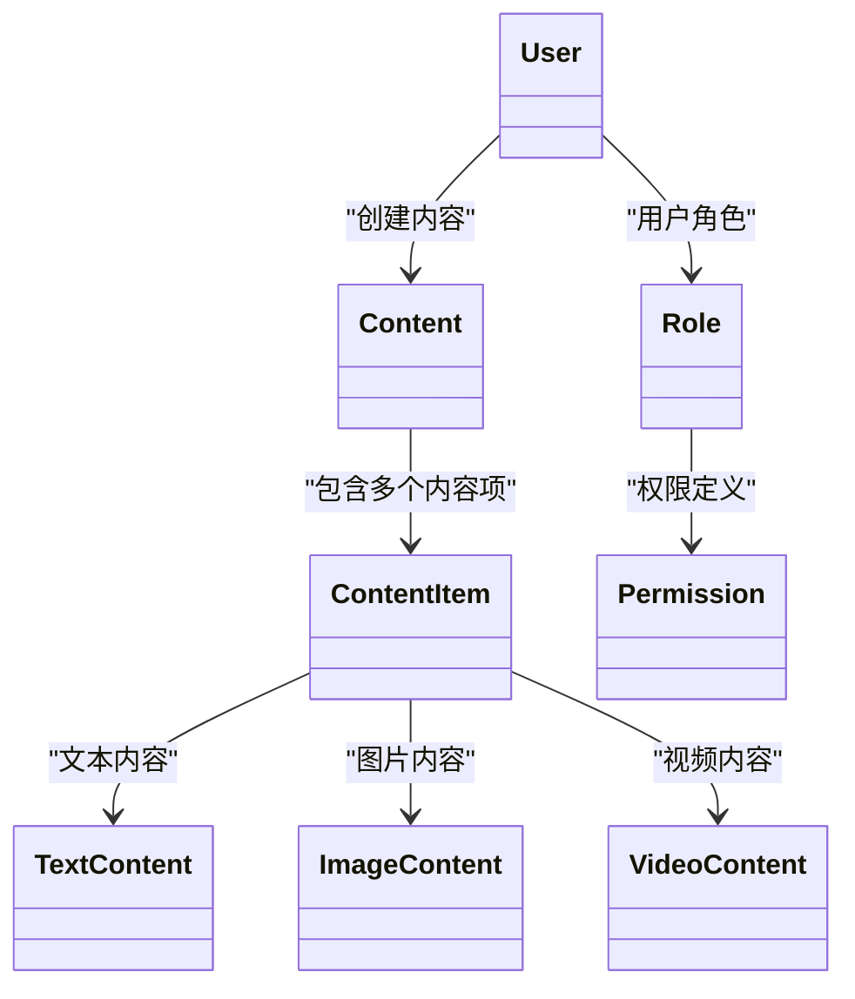
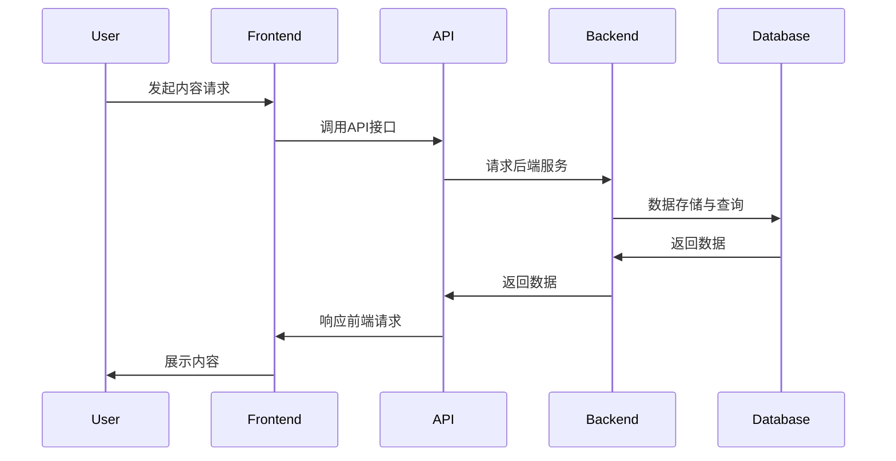
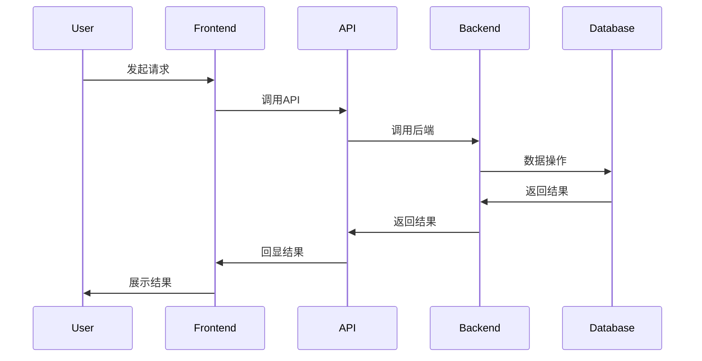

                 

### 引言与背景介绍

## 1.1 问题背景

### 1.1.1 内容管理的需求演变

内容管理作为一种业务需求，自互联网时代以来不断演变。早期的Web 1.0阶段，网站内容主要由网站管理员手动维护，缺乏系统性和灵活性。随着Web 2.0时代的到来，用户生成内容（UGC）成为主流，内容管理需求变得更加复杂，对系统灵活性和扩展性提出了更高的要求。

### 1.1.2 Headless CMS的起源与发展

Headless CMS的概念起源于2010年左右，作为一种对传统内容管理系统（CMS）的革新。其核心理念是将内容存储和呈现分离，通过API接口实现内容的前后端分离。这种模式的出现，是为了更好地适应移动设备、多渠道发布和个性化需求。

### 1.1.3 Headless CMS的优势与应用场景

Headless CMS的优势在于其高度灵活性和可扩展性。它可以轻松适应多种前端框架和平台，满足不同渠道的发布需求。应用场景广泛，包括电商平台、新闻门户、企业官网、移动应用等。

## 1.2 问题概述

### 1.2.1 传统CMS的局限性

传统CMS通常将内容存储和呈现结合在一起，导致以下局限性：
1. **缺乏灵活性**：难以适应不同的前端框架和平台。
2. **扩展性差**：难以支持复杂的业务逻辑和多渠道发布。
3. **维护成本高**：内容管理和前端开发紧密耦合，维护成本高。

### 1.2.2 Headless CMS解决的问题

Headless CMS通过以下方式解决了传统CMS的局限性：
1. **前后端分离**：提高了系统的灵活性和可扩展性。
2. **多渠道发布**：支持多种前端框架和平台，满足个性化需求。
3. **降低维护成本**：内容管理和前端开发独立，降低了维护成本。

### 1.2.3 Headless CMS的边界与外延

Headless CMS虽然具有很多优势，但并非万能。其边界和局限性包括：
1. **技术门槛**：需要一定的技术背景来理解和使用。
2. **性能挑战**：随着数据量和访问量的增加，可能面临性能问题。
3. **安全性问题**：API接口的安全性问题需要特别注意。

---

在接下来的章节中，我们将深入探讨Headless CMS的核心概念、工作原理、系统分析与架构设计，并通过项目实战和案例分析，展示其实际应用效果。让我们一步一步地思考，了解这个内容管理新趋势的各个方面。**核心概念与联系**

# 核心概念与联系

## 2.1 Headless CMS定义与特点

### 2.1.1 Headless CMS的定义

Headless CMS是一种无头内容管理系统，它通过提供API接口来管理内容，并将内容的呈现交给前端应用或其他前端框架。与传统CMS不同，Headless CMS不包含前端组件，专注于内容管理和API提供。

### 2.1.2 Headless CMS的核心特点

1. **前后端分离**：内容存储和呈现分离，提高了系统的灵活性和可扩展性。
2. **API-first设计**：通过API接口进行内容管理，支持多种前端框架和平台。
3. **多渠道发布**：支持在不同的设备、平台和渠道上进行内容发布。
4. **模块化架构**：便于集成第三方服务和插件，增强系统的可扩展性。

### 2.1.3 Headless CMS与传统CMS的区别

1. **内容存储**：传统CMS将内容和前端模板结合在一起，而Headless CMS将内容存储在独立的数据库中。
2. **开发模式**：传统CMS通常需要开发前端模板，而Headless CMS只需要通过API接口与前端应用进行交互。
3. **性能**：Headless CMS由于减少了前后端的耦合，通常在性能上优于传统CMS。

### 2.2 概念属性特征对比表格

为了更清晰地对比Headless CMS与传统CMS的区别，我们创建了一个表格：

| 特征                 | Headless CMS                     | 传统CMS                     |
|----------------------|---------------------------------|-----------------------------|
| 内容存储             | 独立数据库                       | 内容和前端模板结合在一起     |
| 开发模式             | API-first设计，前后端分离       | 前端模板开发，内容管理结合   |
| 性能                 | 较高，减少前后端耦合            | 较低，前后端紧密耦合         |
| 扩展性               | 高，模块化架构，可集成第三方服务 | 低，扩展性差，难以适应新需求 |
| 多渠道发布           | 支持，适配多种前端框架和平台    | 支持，但难度较大            |

### 2.3 Headless CMS与API-first架构

Headless CMS是一种API-first架构的典型应用。API-first架构的核心是设计并实现一组功能齐全的API，使得前端和应用可以独立于后端进行开发和测试。Headless CMS通过提供API接口，使得前端开发者可以专注于用户体验和交互，而后端开发者可以专注于内容管理和数据存储。

### 2.4 Headless CMS与前端框架

Headless CMS支持多种前端框架，如React、Vue、Angular等。这种支持使得开发者可以根据项目需求选择合适的前端框架，而不受CMS的限制。前端框架与Headless CMS的交互通常通过HTTP请求进行，前端应用通过API接口获取内容，并对其进行渲染和展示。

### 2.5 ER实体关系图架构

为了更好地理解Headless CMS的架构，我们可以使用ER实体关系图来展示其数据模型。以下是Headless CMS的ER图：

```mermaid
erDiagram
    Content --> API : "数据通过API接口获取"
    API --> Frontend : "API与前端框架交互"
    Content ||--|{ User } : "用户创建和修改内容"
    User ||--|{ Role } : "用户角色定义"
```

在这个ER图中，`Content` 表示存储的内容数据，`API` 表示API接口，`Frontend` 表示前端框架，`User` 表示用户，`Role` 表示用户角色。用户可以创建和修改内容，并通过API接口与前端框架进行交互。

---

通过以上章节，我们了解了Headless CMS的核心概念、定义、特点，以及与传统CMS的区别。接下来，我们将深入探讨Headless CMS的工作原理和系统架构设计。**Headless CMS原理讲解**

# Headless CMS原理讲解

## 3.1 Headless CMS工作原理

### 3.1.1 数据存储与内容结构

Headless CMS的核心是内容存储。与传统CMS将内容和模板结合在一起不同，Headless CMS将内容存储在独立的数据库中。这种分离使得内容管理更加灵活和高效。Headless CMS通常使用RESTful API或GraphQL API来提供数据访问接口。

在数据结构方面，Headless CMS采用JSON格式来存储内容。JSON格式具有轻量级、易读易写、跨平台兼容性强等特点，非常适合用于内容存储和传输。

### 3.1.2 API接口设计与功能

Headless CMS通过API接口实现前后端分离。API接口是Headless CMS的核心组成部分，提供了内容获取、创建、更新和删除等基本功能。以下是常用的API接口设计：

1. **获取内容**：通过GET请求获取指定内容，如 `/content/{id}`。
2. **创建内容**：通过POST请求创建新内容，如 `/content/`。
3. **更新内容**：通过PUT请求更新指定内容，如 `/content/{id}`。
4. **删除内容**：通过DELETE请求删除指定内容，如 `/content/{id}`。

API接口通常采用RESTful设计原则，确保接口设计清晰、易于理解和使用。

### 3.1.3 前后端分离的实现机制

前后端分离是Headless CMS的核心特点之一。在这种实现机制中，前端应用通过HTTP请求与API接口进行交互，获取和操作内容数据。前端应用可以使用任何流行的前端框架，如React、Vue、Angular等，而无需关心后端的具体实现。

前后端分离的实现机制包括以下几个步骤：

1. **前端请求**：前端应用通过HTTP请求（GET、POST、PUT、DELETE等）向API接口发送请求。
2. **API处理**：API接口接收请求，根据请求类型和路径，处理内容数据，并返回响应。
3. **前端响应**：前端应用接收API接口的响应，并对其进行处理，如渲染页面、更新数据等。

这种机制使得前端和后端可以独立开发和部署，提高了系统的灵活性和可维护性。

### 3.2 Headless CMS中的API设计

#### 3.2.1 RESTful API设计原则

RESTful API设计是Headless CMS中常用的API设计方法。RESTful API遵循REST架构风格，具有以下原则：

1. **统一接口**：API接口应具有统一的格式和命名规范，易于理解和使用。
2. **状态转移**：通过HTTP请求来表示状态转移，如使用GET获取数据，使用POST创建数据等。
3. **无状态性**：API接口应无状态，每次请求都是独立的，不依赖于之前的请求状态。

#### 3.2.2 GraphQL API的优势与局限

与RESTful API相比，GraphQL API提供了一种更加灵活的数据查询方式。GraphQL API允许客户端指定所需的数据字段，减少了数据传输的冗余，提高了性能。

优势：

1. **按需获取数据**：客户端可以指定所需的数据字段，减少了不必要的传输。
2. **提高性能**：通过减少数据传输，降低了带宽消耗和服务器负载。

局限：

1. **查询复杂性**：GraphQL查询语句可能变得复杂，难以维护。
2. **安全性问题**：GraphQL API接口容易受到恶意查询的攻击，需要加强安全性措施。

#### 3.2.3 API安全性考虑

API安全性是Headless CMS设计中至关重要的方面。为了确保API的安全，需要采取以下措施：

1. **身份验证**：使用身份验证机制（如JWT、OAuth等）确保只有授权用户可以访问API。
2. **权限控制**：根据用户角色和权限，限制对API的操作，如创建、读取、更新和删除。
3. **数据加密**：使用HTTPS协议对API请求和响应进行加密，确保数据传输安全。
4. **请求频率限制**：限制API请求的频率，防止恶意攻击和滥用。

---

通过以上章节，我们详细讲解了Headless CMS的工作原理和API设计。接下来，我们将进一步分析Headless CMS的系统架构设计，以更好地理解其整体结构和工作流程。**系统分析与架构设计**

# 系统分析与架构设计

## 4.1 问题场景介绍

### 4.1.1 内容管理系统需求分析

内容管理系统（CMS）是现代企业网站和应用程序的重要组成部分，其需求主要包括以下几个方面：

1. **内容管理**：支持对文字、图片、视频等多种类型的内容进行创建、编辑、管理和发布。
2. **多渠道发布**：支持在不同平台和设备上发布内容，如网站、移动应用、社交媒体等。
3. **用户体验**：提供友好的用户界面，方便内容创建者和管理员进行内容管理和操作。
4. **性能和可扩展性**：系统应具备高性能和高扩展性，能够应对大规模数据和访问量。

### 4.1.2 Headless CMS适用场景探讨

Headless CMS在以下场景中表现尤为出色：

1. **个性化需求**：企业需要根据用户行为和偏好，动态生成个性化内容。
2. **多渠道发布**：企业需要将内容发布到多个平台和设备，如移动应用、网站、社交媒体等。
3. **快速迭代**：企业需要快速响应市场变化，频繁更新和调整内容。
4. **技术灵活性**：企业希望使用最先进的前端技术，如React、Vue、Angular等，而不受CMS限制。

## 4.2 项目介绍

### 4.2.1 项目背景与目标

本项目旨在构建一个企业级内容管理系统，以满足以下需求：

1. **多渠道发布**：支持企业官网、移动应用、微信公众号等多渠道内容发布。
2. **内容管理**：提供强大的内容创建、编辑和管理功能，支持多种内容类型，如文本、图片、视频等。
3. **用户体验**：提供简洁易用的用户界面，提高内容创建和管理的效率。
4. **性能和可扩展性**：采用Headless CMS架构，确保系统高性能和高扩展性。

### 4.2.2 项目主要功能需求

本项目的主要功能需求包括：

1. **内容创建与编辑**：支持对文本、图片、视频等多种类型的内容进行创建、编辑和管理。
2. **内容发布与同步**：支持在不同平台和设备上发布内容，并实现内容同步。
3. **权限管理**：提供用户角色和权限管理功能，确保内容的安全性和可控性。
4. **数据统计与分析**：提供内容访问量、用户行为等数据的统计与分析功能，帮助企业优化内容策略。
5. **集成第三方服务**：支持集成第三方服务，如SEO工具、社交媒体分享等。

## 4.3 系统功能设计

### 4.3.1 领域模型设计

领域模型是系统功能设计的基础，用于定义系统中的核心实体及其关系。以下是本项目的领域模型设计：



在这个领域模型中，`Content` 表示内容，`ContentItem` 表示内容项，包括文本、图片、视频等，`User` 表示用户，`Role` 表示用户角色，`Permission` 表示权限。用户可以创建内容，并拥有不同的角色和权限。

### 4.3.2 数据流与功能模块划分

数据流是系统功能实现的关键，用于描述数据在系统中的流动和处理过程。以下是本项目的数据流设计：

1. **内容创建与编辑**：用户通过前端界面创建和编辑内容，提交到后端服务器。
2. **内容发布与同步**：后台系统根据发布规则，将内容同步到不同平台和设备。
3. **权限管理**：后台系统根据用户角色和权限，控制对内容的访问和操作。
4. **数据统计与分析**：后台系统收集内容访问量、用户行为等数据，并进行分析和展示。

功能模块划分如下：

1. **内容管理模块**：负责内容的创建、编辑、发布和管理。
2. **权限管理模块**：负责用户角色和权限的分配和管理。
3. **数据统计与分析模块**：负责收集、分析和展示内容访问量和用户行为数据。
4. **集成第三方服务模块**：负责与第三方服务进行集成，如SEO工具、社交媒体分享等。

## 4.4 系统架构设计

### 4.4.1 系统架构图

以下是本项目的系统架构图：



在这个架构图中，用户通过前端界面发起内容请求，前端通过API接口与后端进行交互，后端负责数据处理和存储，并最终将数据返回给前端。

### 4.4.2 系统模块功能介绍

系统模块功能介绍如下：

1. **前端模块**：负责展示用户界面，处理用户请求，并与API接口进行交互。
2. **API模块**：负责接收前端请求，处理请求，并调用后端服务。
3. **后端模块**：负责数据处理和存储，包括内容创建、编辑、发布、权限管理等。
4. **数据库模块**：负责存储系统数据，包括内容数据、用户数据、权限数据等。

## 4.5 系统接口设计

### 4.5.1 接口设计原则

接口设计原则包括：

1. **简洁性**：接口设计应简洁明了，易于理解和使用。
2. **一致性**：接口命名和格式应保持一致，遵循RESTful API设计原则。
3. **灵活性**：接口应支持扩展和定制，以适应不同需求。

### 4.5.2 接口实现与交互

接口实现与交互如下：

1. **内容创建**：通过POST请求创建新内容，如 `/content/`。
2. **内容查询**：通过GET请求获取指定内容，如 `/content/{id}`。
3. **内容更新**：通过PUT请求更新指定内容，如 `/content/{id}`。
4. **内容删除**：通过DELETE请求删除指定内容，如 `/content/{id}`。

以下是接口定义示例：

```json
// 内容创建
POST /content/
{
  "title": "新文章",
  "content": "这是一篇新文章的内容...",
  "type": "text",
  "author": "张三"
}

// 内容查询
GET /content/1

// 内容更新
PUT /content/1
{
  "title": "更新后的文章",
  "content": "更新后的文章内容...",
  "type": "text",
  "author": "张三"
}

// 内容删除
DELETE /content/1
```

## 4.6 系统交互

### 4.6.1 系统交互流程

系统交互流程如下：

1. **用户请求**：用户通过前端界面发起请求，如创建内容、查询内容等。
2. **前端处理**：前端模块接收请求，调用API接口。
3. **API处理**：API模块处理请求，调用后端服务。
4. **后端处理**：后端模块处理请求，与数据库进行交互。
5. **响应返回**：后端将处理结果返回给API，API再将结果返回给前端。
6. **前端展示**：前端模块根据返回结果进行页面渲染和展示。

### 4.6.2 系统交互序列图

以下是系统交互序列图：



通过以上章节，我们详细分析了Headless CMS的系统架构设计，包括问题场景、项目介绍、系统功能设计、架构设计和接口设计。接下来，我们将通过实际项目实战和案例分析，展示Headless CMS的应用效果。**项目实战与案例分析**

# 项目实战与案例分析

## 5.1 环境安装与配置

### 5.1.1 开发环境搭建

在进行Headless CMS项目的实战之前，首先需要搭建开发环境。以下是搭建开发环境的基本步骤：

1. **安装Node.js**：Node.js是JavaScript的运行环境，用于运行后端服务器和API接口。可以从官方网站 [https://nodejs.org/](https://nodejs.org/) 下载并安装。

2. **安装PostgreSQL**：PostgreSQL是一种高性能、开源的关系型数据库，用于存储Headless CMS的内容数据。可以从官方 [https://www.postgresql.org/](https://www.postgresql.org/) 下载并安装。

3. **安装前端框架**：本案例中使用React作为前端框架，可以从 [https://reactjs.org/](https://reactjs.org/) 下载并安装。

4. **安装其他依赖**：根据项目需求，可能还需要安装其他依赖，如GraphQL、JWT等。

### 5.1.2 Headless CMS工具安装

选择一款适合的Headless CMS工具，如Strapi、Contentful等，以下是安装Strapi的基本步骤：

1. **访问Strapi官网**：打开 [https://strapi.io/](https://strapi.io/)，下载Strapi。

2. **安装Strapi**：解压下载的压缩包，进入Strapi目录，使用以下命令启动Strapi：

   ```bash
   npm install
   npm run develop
   ```

   启动成功后，访问 [http://localhost:1337/](http://localhost:1337/) ，可以查看Strapi的管理界面。

3. **创建内容类型**：在Strapi管理界面中，可以创建和管理内容类型。例如，创建一个名为“文章”的内容类型，包含标题、内容、作者等字段。

### 5.1.3 集成开发环境配置

集成开发环境（IDE）可以帮助我们更高效地进行开发。以下是使用Visual Studio Code（VS Code）作为IDE的配置步骤：

1. **安装VS Code**：从 [https://code.visualstudio.com/](https://code.visualstudio.com/) 下载并安装VS Code。

2. **安装插件**：在VS Code中安装以下插件：
   - **Prettier**：用于代码格式化。
   - **ESLint**：用于代码检查。
   - **GitLens**：用于Git版本控制。

3. **配置VS Code**：在VS Code中配置Node.js、React和GraphQL等依赖，确保开发环境正常工作。

## 5.2 系统核心实现源代码

### 5.2.1 源代码结构与功能模块

以下是Headless CMS项目的源代码结构和功能模块：

```plaintext
/my-headless-cms
|-- backend
|   |-- src
|   |   |-- controllers
|   |   |-- models
|   |   |-- services
|   |   |-- utils
|   |-- .gitignore
|   |-- package.json
|-- frontend
|   |-- src
|   |   |-- components
|   |   |-- pages
|   |   |-- styles
|   |   |-- App.js
|   |-- .gitignore
|   |-- package.json
|-- .vscode
|   |-- settings.json
|-- README.md
```

源代码结构如下：

- **backend**：后端代码，包括控制器、模型、服务和工具等。
- **frontend**：前端代码，包括组件、页面、样式和入口文件等。
- **.gitignore**：Git忽略文件，用于配置忽略的文件和文件夹。
- **package.json**：项目依赖文件，用于管理项目依赖和运行命令。
- **README.md**：项目说明文件，用于描述项目的基本信息和安装使用方法。

### 5.2.2 关键代码分析与解读

以下是后端和前端的关键代码分析和解读：

**后端关键代码：**

```javascript
// controllers/contentController.js
exports.getContent = async (req, res) => {
  try {
    const content = await Content.findOne({ _id: req.params.id });
    if (!content) {
      return res.status(404).json({ message: "Content not found" });
    }
    res.status(200).json(content);
  } catch (error) {
    res.status(500).json({ message: "Server error" });
  }
};

// services/contentService.js
exports.createContent = async (data) => {
  try {
    const newContent = new Content(data);
    const savedContent = await newContent.save();
    return savedContent;
  } catch (error) {
    throw new Error(error.message);
  }
};
```

这段代码是内容控制器和服务器的关键实现，用于处理内容的获取和创建操作。`getContent` 函数通过查询数据库获取指定内容，并返回响应。`createContent` 函数用于创建新内容，并将其存储在数据库中。

**前端关键代码：**

```javascript
// components/ContentList.js
const ContentList = ({ contents }) => {
  return (
    <ul>
      {contents.map((content) => (
        <li key={content.id}>
          <h3>{content.title}</h3>
          <p>{content.content}</p>
        </li>
      ))}
    </ul>
  );
};

// pages/Home.js
const Home = () => {
  const [contents, setContents] = useState([]);

  useEffect(() => {
    async function fetchContents() {
      try {
        const response = await fetch("/api/content");
        const data = await response.json();
        setContents(data);
      } catch (error) {
        console.error("Error fetching contents:", error);
      }
    }
    fetchContents();
  }, []);

  return (
    <div>
      <h1>Home</h1>
      <ContentList contents={contents} />
    </div>
  );
};
```

这段代码是内容列表组件和主页组件的关键实现。`ContentList` 组件用于渲染内容列表，`Home` 组件用于获取内容数据，并调用 `fetchContents` 函数从后端获取内容数据，并更新状态。

## 5.3 实际案例分析与讲解

### 5.3.1 实际应用场景介绍

在本案例中，我们以一个企业官网为例，介绍Headless CMS的应用。企业官网需要管理多种类型的内容，如新闻、产品介绍、团队介绍等。通过Headless CMS，我们可以实现以下功能：

1. **内容创建与编辑**：内容创建者和管理员可以在后台系统中创建和编辑各种类型的内容。
2. **内容发布与同步**：内容发布后，可以同步到企业官网、移动应用和社交媒体等渠道。
3. **用户权限管理**：根据用户角色和权限，控制对内容的访问和操作。
4. **数据统计与分析**：收集内容访问量和用户行为数据，为企业提供数据支持。

### 5.3.2 案例分析步骤与结果

以下是案例分析的步骤与结果：

1. **需求分析**：根据企业官网的需求，确定需要管理的各种内容类型和功能。
2. **系统设计**：根据需求，设计系统架构和功能模块。
3. **环境搭建**：搭建开发环境，安装Node.js、PostgreSQL和React等依赖。
4. **工具安装**：安装Headless CMS工具（如Strapi），并配置后台系统。
5. **前端开发**：使用React开发前端界面，实现内容列表、内容详情、内容创建和编辑等功能。
6. **后端开发**：使用Node.js开发后端服务，实现内容获取、创建、更新和删除等功能。
7. **测试与优化**：进行系统测试，优化性能和用户体验。
8. **部署上线**：将系统部署到服务器，并上线运行。

### 5.3.3 案例总结与启示

通过本案例，我们可以总结出以下启示：

1. **前后端分离**：Headless CMS通过前后端分离，提高了系统的灵活性和可维护性，有助于快速迭代和优化。
2. **多渠道发布**：Headless CMS支持多渠道发布，可以满足企业官网、移动应用和社交媒体等多种发布需求。
3. **数据统计与分析**：Headless CMS可以集成数据统计与分析工具，帮助企业优化内容策略和用户体验。
4. **安全性**：在Headless CMS中，需要注意API接口的安全性问题，如身份验证、权限控制和数据加密等。

通过以上实战与案例分析，我们可以看到Headless CMS在内容管理领域的应用潜力和优势。接下来，我们将探讨Headless CMS的最佳实践和未来趋势。**最佳实践与未来趋势**

# 最佳实践与未来趋势

## 6.1 最佳实践

### 6.1.1 设计原则与最佳实践

在设计和实施Headless CMS时，以下原则和最佳实践可以帮助确保系统的成功和高效：

1. **模块化与可扩展性**：设计时注重模块化，确保系统能够轻松添加新功能或集成第三方服务。
2. **API安全性**：确保API接口的安全性，如使用JWT进行身份验证，限制请求频率，加密数据传输。
3. **可维护性**：编写清晰、可读的代码，使用文档和注释，以便后续维护。
4. **性能优化**：关注性能优化，如使用缓存、优化数据库查询和API响应。
5. **多渠道适配**：设计时考虑不同渠道的兼容性，确保内容在不同设备上都能良好呈现。

### 6.1.2 性能优化与安全策略

性能优化和安全策略对于Headless CMS至关重要。以下是一些关键策略：

1. **性能优化**：
   - 使用CDN加速内容分发。
   - 实施懒加载和异步加载，减少初始加载时间。
   - 使用数据库索引和优化查询，提高查询效率。
   - 实施内容缓存，减少数据库访问次数。

2. **安全策略**：
   - 使用HTTPS加密数据传输。
   - 实施API密钥和访问控制，确保只有授权用户可以访问API。
   - 定期更新系统依赖和库，修复已知漏洞。
   - 实施请求频率限制和验证码，防止恶意攻击。

### 6.1.3 兼容性与可维护性

兼容性和可维护性是Headless CMS长期成功的关键。以下措施可以帮助提高这两方面的性能：

1. **兼容性**：
   - 使用标准化API设计，确保不同前端框架和平台都能顺利集成。
   - 实施跨浏览器测试，确保系统在不同浏览器上的兼容性。
   - 考虑向后兼容性，确保新版本对旧版本不造成影响。

2. **可维护性**：
   - 编写清晰、有组织的代码，使用模块化和设计模式。
   - 定期进行代码审查，确保代码质量。
   - 实施自动化测试，确保新功能不影响现有功能。

## 6.2 未来趋势

### 6.2.1 Headless CMS发展现状

Headless CMS在过去几年中取得了显著的发展，已经成为内容管理系统领域的重要趋势。以下是其发展现状的几个关键点：

1. **市场接受度提高**：越来越多的企业开始采用Headless CMS，以满足多渠道发布和个性化需求。
2. **工具多样化**：市场上出现了多种Headless CMS工具，如Strapi、Contentful、Sanity等，提供了丰富的功能和定制选项。
3. **生态系统成熟**：随着Headless CMS的普及，相关的开发工具、插件和社区资源也在不断增加。

### 6.2.2 技术趋势与挑战

未来，Headless CMS将面临以下技术趋势和挑战：

1. **技术趋势**：
   - **人工智能和机器学习**：利用AI技术进行内容推荐、分析和优化。
   - **低代码开发**：提供更多低代码工具，使非技术用户也能轻松创建和管理内容。
   - **无服务器架构**：采用无服务器架构，提高系统的可扩展性和成本效益。

2. **挑战**：
   - **性能挑战**：随着数据量和用户量的增加，确保系统性能和响应速度。
   - **安全性**：随着API接口的增多，确保系统的安全性，防止数据泄露和恶意攻击。
   - **开发复杂性**：对于开发人员来说，理解和实施Headless CMS架构可能存在一定的难度。

### 6.2.3 未来应用前景

未来，Headless CMS将在以下领域展现出广阔的应用前景：

1. **电子商务**：企业可以通过Headless CMS实现个性化购物体验和无缝的多渠道购物体验。
2. **媒体和新闻**：媒体机构可以利用Headless CMS实现快速的内容发布和自动化内容管理。
3. **企业级应用**：企业可以通过Headless CMS实现定制化内容管理和多渠道营销策略。

通过以上最佳实践和未来趋势的分析，我们可以看到Headless CMS在内容管理领域的重要性和发展潜力。在实际应用中，遵循最佳实践，结合技术趋势，将有助于实现高效、安全、可扩展的内容管理系统。

### 总结与展望

## 7.1 主要内容回顾

本文系统地介绍了Headless CMS的核心概念、工作原理、系统分析与架构设计，以及实际项目实战和案例分析。主要内容包括：

1. **核心概念与联系**：Headless CMS的定义、特点与传统CMS的区别。
2. **原理讲解**：Headless CMS的工作原理、API设计和安全性考虑。
3. **系统设计与架构**：系统功能设计、架构图、接口设计和系统交互流程。
4. **项目实战与案例分析**：环境安装、系统核心实现源代码、实际应用场景和案例总结。
5. **最佳实践与未来趋势**：设计原则、性能优化与安全策略、技术趋势与挑战、应用前景。

## 7.2 注意事项与展望

在设计和实施Headless CMS时，需要注意以下几点：

1. **安全性**：确保API接口的安全性，采取身份验证、权限控制和数据加密等措施。
2. **性能优化**：关注系统性能，使用缓存、优化查询和异步加载等技术。
3. **模块化与可扩展性**：设计时注重模块化和可扩展性，便于功能扩展和第三方服务集成。
4. **用户体验**：优化用户界面和交互，确保内容创建和管理流程高效、直观。

未来研究方向包括：

1. **AI与机器学习集成**：利用AI技术进行内容推荐、分析和优化。
2. **无服务器架构**：采用无服务器架构，提高系统的可扩展性和成本效益。
3. **低代码开发**：开发更多低代码工具，使非技术用户也能轻松创建和管理内容。

拓展阅读建议：

1. **官方文档**：深入了解Headless CMS工具（如Strapi、Contentful）的官方文档。
2. **技术博客**：阅读关于Headless CMS的最新技术博客和案例研究。
3. **专业书籍**：阅读关于内容管理系统、API设计、前端框架和后端开发的经典书籍。

通过不断学习和实践，我们可以更好地理解和应用Headless CMS，为企业和项目带来更多的价值。**作者信息**

作者：AI天才研究院/AI Genius Institute & 禅与计算机程序设计艺术 /Zen And The Art of Computer Programming

