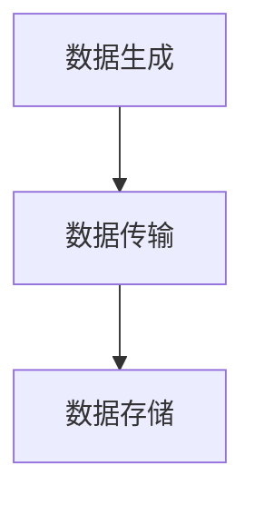
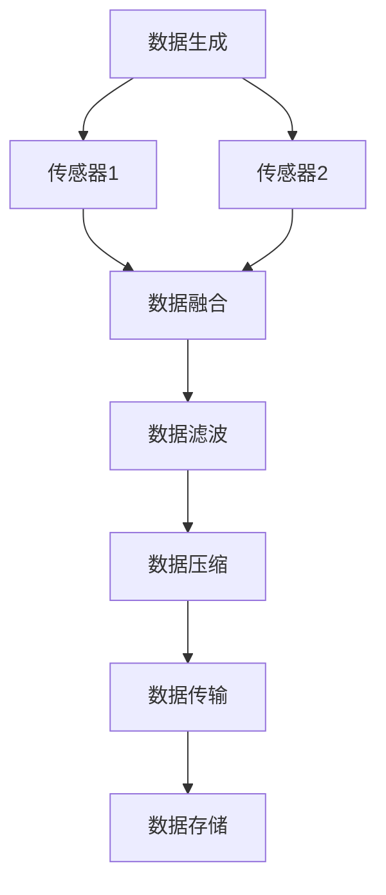
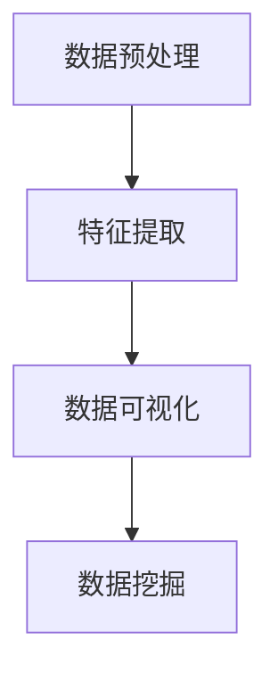
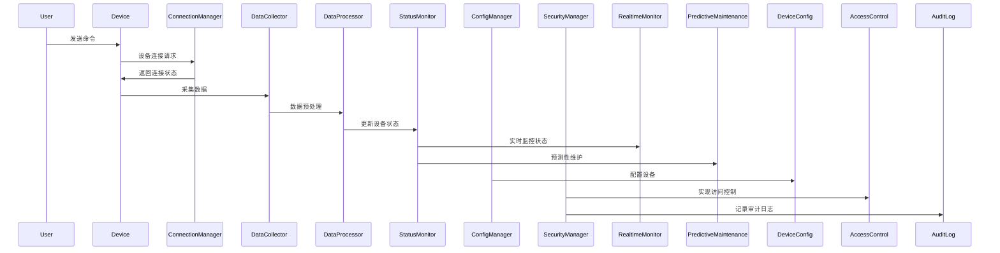

                 


### 背景介绍

#### 1.1 问题背景

随着物联网（IoT）技术的快速发展，各种智能设备正不断涌入我们的生活和工作场景。这些设备通过互联网进行通信，实现了数据的收集、传输和共享。然而，随着设备数量的增加，如何有效地管理和监控这些设备成为了一个亟待解决的问题。

**IoT设备管理系统的设计旨在提供一个全面、可扩展、可靠的管理平台，用于监控和管理大量分布式IoT设备。**

##### 1.1.1 物联网技术的发展

物联网技术起源于20世纪80年代，随着传感器技术的进步、互联网的普及和移动通信技术的发展，物联网开始逐步走入我们的日常生活。如今，IoT技术已经广泛应用于智能家居、智能交通、智慧城市、工业4.0等领域。

**物联网设备的普及和多样化带来了设备管理的新挑战。**

- **设备数量庞大**：IoT设备种类繁多，数量庞大，传统设备管理方法难以应对。
- **设备分散性**：设备分布广泛，地理位置不集中，使得管理难度增加。
- **数据多样性**：设备产生大量的数据，如何有效地采集、存储和处理这些数据成为挑战。

##### 1.1.2 设备管理系统的必要性

设备管理系统在物联网时代的重要性日益凸显，主要体现在以下几个方面：

- **设备监控与维护**：通过设备管理系统，可以实时监控设备的运行状态，及时发现并处理设备故障，保证设备的正常运行。
- **数据采集与处理**：设备管理系统可以有效地采集和处理设备产生的数据，为后续的数据分析提供基础。
- **设备配置与管理**：设备管理系统提供了设备配置和管理的功能，可以方便地管理设备的硬件和软件配置。
- **安全性**：设备管理系统提供了安全保护机制，确保设备数据的安全性和隐私性。

##### 1.1.3 设备管理系统的挑战

尽管设备管理系统具有重要的作用，但其在实际应用中仍然面临着诸多挑战：

- **数据安全问题**：IoT设备管理过程中会产生大量的敏感数据，如何确保这些数据的安全性和隐私性是设备管理系统需要解决的关键问题。
- **系统可靠性**：设备管理系统需要具备高可靠性，确保在设备数量庞大、环境复杂的情况下，系统能够稳定运行。
- **可扩展性**：随着物联网设备的不断增多，设备管理系统的架构需要具备良好的可扩展性，以适应未来的发展需求。
- **实时性**：设备管理系统的监控功能需要具备实时性，能够快速响应设备的状态变化。

**结论：**

设计一个高效、可靠、可扩展的IoT设备管理系统是当前物联网领域面临的重要课题。接下来，我们将深入探讨IoT设备管理系统的核心概念和设计原理，为解决这些问题提供思路。

### 核心概念与联系

#### 2.1 IoT设备管理系统的核心概念

IoT设备管理系统的设计涉及多个核心概念，这些概念共同构成了系统的基本框架。以下是IoT设备管理系统的核心概念及其简要描述：

- **设备连接管理**：负责设备的连接与断开操作，包括网络连接、设备认证等。确保设备能够稳定、安全地接入系统。

- **数据采集与处理**：负责从设备中采集数据，并进行预处理、清洗和转换等操作，以便后续的数据分析和存储。

- **设备状态监控**：实时监控设备的运行状态，包括设备的运行参数、健康状态、能耗情况等。及时发现设备故障或异常情况。

- **设备配置与管理**：提供设备配置和管理的功能，包括设备的硬件配置、软件升级、参数调整等。方便管理员对设备进行远程管理和配置。

- **安全与隐私保护**：确保设备数据的安全性和隐私性，包括数据加密、访问控制、安全审计等。防止设备数据被非法获取和滥用。

#### 2.2 概念属性特征对比表格

为了更好地理解各个核心概念之间的联系和区别，我们可以通过一个概念属性特征对比表格进行详细分析。以下是一个示例表格：

| 核心概念 | 属性特征 |
| --- | --- |
| 设备连接管理 | - 连接状态：在线/离线 |
| - 连接方式：Wi-Fi/蓝牙/以太网 |
| - 连接速度：高速/低速 |
| 数据采集与处理 | - 数据来源：传感器/设备 |
| - 数据类型：数值/图像/文本 |
| - 数据处理：清洗/转换/存储 |
| 设备状态监控 | - 监控内容：运行参数/健康状态 |
| - 监控频率：实时/定时 |
| - 监控方式：远程/本地 |
| 设备配置与管理 | - 配置内容：硬件/软件 |
| - 配置方式：远程/本地 |
| - 配置频率：定期/即时 |
| 安全与隐私保护 | - 加密算法：AES/DES |
| - 访问控制：身份验证/权限控制 |
| - 安全审计：日志记录/异常检测 |

#### 2.3 ER实体关系图架构

为了更好地展示IoT设备管理系统中各个实体之间的关系，我们可以通过ER（Entity-Relationship）实体关系图进行描述。以下是一个简单的ER图示例：

```mermaid
erDiagram
    Device ||--|{ Data } : 生成
    Device ||--|{ Status } : 采集
    Device ||--|{ Config } : 配置
    Device ||--|{ Security } : 保护
    Data ||--|{ Process } : 处理
    Status ||--|{ Monitor } : 监控
    Config ||--|{ Manage } : 管理
    Security ||--|{ Audit } : 审计
```

在上面的ER图中，我们定义了以下几个实体：

- **Device（设备）**：代表IoT设备。
- **Data（数据）**：代表设备采集的数据。
- **Status（状态）**：代表设备的运行状态。
- **Config（配置）**：代表设备的配置信息。
- **Security（安全）**：代表设备的安全信息。
- **Process（处理）**：代表数据处理过程。
- **Monitor（监控）**：代表设备监控功能。
- **Manage（管理）**：代表设备配置管理功能。
- **Audit（审计）**：代表安全审计功能。

通过ER图，我们可以清晰地看到各个实体之间的联系和作用，从而更好地理解IoT设备管理系统的整体架构。

### 算法原理讲解

#### 2.1 数据采集与处理算法

数据采集与处理是IoT设备管理系统中的核心环节，其目的是确保采集到的数据准确、可靠，并能够为后续的分析和应用提供支持。以下将详细讲解数据采集与处理算法的原理，包括使用mermaid流程图表示数据采集和处理流程，并使用Python代码详细解释数据处理算法。

##### 2.1.1 数据采集的基本原理

数据采集是指从IoT设备中收集数据的过程。采集的数据可以是温度、湿度、位置、速度等各种类型的信息。数据采集的基本原理包括以下几个步骤：

1. **数据生成**：IoT设备通过传感器或其他方式生成数据。
2. **数据传输**：设备将生成的数据传输到管理系统。
3. **数据存储**：管理系统将采集到的数据存储在数据库或其他数据存储系统中。

以下是一个使用mermaid绘制的简单数据采集流程图：



##### 2.1.2 数据采集算法原理讲解

在实际应用中，数据采集过程可能涉及到多个传感器、多种数据类型和不同的传输协议。为了提高数据采集的准确性和效率，我们可以采用以下算法：

1. **多传感器数据融合**：将多个传感器的数据进行融合处理，以提高数据的准确性和可靠性。
2. **数据滤波**：对采集到的数据进行滤波处理，去除噪声和异常值。
3. **数据压缩**：对采集到的数据进行压缩，以减少数据传输和存储的开销。

以下是一个使用mermaid绘制的详细数据采集和处理流程图：



##### 2.1.3 Python代码示例

为了更好地理解数据采集与处理算法，以下提供一个简单的Python代码示例，用于模拟数据采集和处理的流程：

```python
import random
import numpy as np

# 模拟数据生成
def generate_data(num_samples):
    data = []
    for _ in range(num_samples):
        temperature = random.uniform(20, 30)
        humidity = random.uniform(40, 60)
        data.append([temperature, humidity])
    return data

# 数据滤波
def filter_data(data, threshold):
    filtered_data = []
    for point in data:
        if abs(point[0] - 25) <= threshold and abs(point[1] - 50) <= threshold:
            filtered_data.append(point)
    return filtered_data

# 数据压缩
def compress_data(data):
    compressed_data = []
    for point in data:
        compressed_data.append([round(point[0], 1), round(point[1], 1)])
    return compressed_data

# 测试代码
num_samples = 100
data = generate_data(num_samples)
filtered_data = filter_data(data, threshold=5)
compressed_data = compress_data(filtered_data)

print("原始数据：", data[:10])
print("滤波后数据：", filtered_data[:10])
print("压缩后数据：", compressed_data[:10])
```

在上面的示例中，我们首先模拟了数据生成过程，然后对采集到的数据进行滤波和压缩处理。通过运行这段代码，我们可以观察到数据采集与处理的过程。

##### 2.1.4 数据处理算法原理讲解

数据处理是数据采集的后续步骤，其目的是对采集到的数据进行进一步的分析和处理，以提取有用的信息。以下是数据处理算法的几个关键步骤：

1. **数据预处理**：包括数据清洗、去重、填充缺失值等操作，确保数据的质量和一致性。
2. **特征提取**：从原始数据中提取出有用的特征，如平均值、方差、相关性等，用于后续的分析和应用。
3. **数据可视化**：通过图表、图像等形式展示数据，帮助用户更好地理解和分析数据。
4. **数据挖掘**：使用机器学习、统计分析等方法对数据进行深入挖掘，发现数据中的模式和规律。

以下是一个使用mermaid绘制的数据处理流程图：



##### 2.1.5 Python代码示例

为了更好地理解数据处理算法，以下提供一个简单的Python代码示例，用于模拟数据处理的过程：

```python
import numpy as np
import matplotlib.pyplot as plt

# 模拟数据预处理
def preprocess_data(data):
    data = np.array(data)
    data = data[data[:, 0].argsort()]  # 按温度排序
    return data

# 模拟特征提取
def extract_features(data):
    mean_temp = np.mean(data[:, 0])
    std_temp = np.std(data[:, 0])
    mean_humidity = np.mean(data[:, 1])
    std_humidity = np.std(data[:, 1])
    return mean_temp, std_temp, mean_humidity, std_humidity

# 模拟数据可视化
def visualize_data(data):
    temperatures = data[:, 0]
    humidities = data[:, 1]
    plt.scatter(temperatures, humidities)
    plt.xlabel('Temperature')
    plt.ylabel('Humidity')
    plt.show()

# 模拟数据挖掘
def data_mining(data):
    mean_temp, std_temp, mean_humidity, std_humidity = extract_features(data)
    print("平均温度：", mean_temp)
    print("温度标准差：", std_temp)
    print("平均湿度：", mean_humidity)
    print("湿度标准差：", std_humidity)

# 测试代码
num_samples = 100
data = generate_data(num_samples)
preprocessed_data = preprocess_data(data)
features = extract_features(preprocessed_data)
visualize_data(preprocessed_data)
data_mining(preprocessed_data)
```

在上面的示例中，我们首先模拟了数据预处理、特征提取、数据可视化和数据挖掘的过程。通过运行这段代码，我们可以观察到数据处理算法的整个过程。

### 数学模型和数学公式 & 详细讲解 & 举例说明

在IoT设备管理系统中，数学模型和数学公式是分析和处理数据的重要工具。以下将详细介绍几个关键的数学模型和数学公式，并给出详细的讲解和举例说明。

#### 3.1 数据传输速率公式

数据传输速率是衡量网络传输效率的重要指标。数据传输速率可以用以下公式表示：

$$
R = \frac{d \times v}{t}
$$

其中，\( R \) 表示数据传输速率（单位：比特每秒，bps），\( d \) 表示数据传输距离（单位：米，m），\( v \) 表示数据传输速度（单位：米每秒，m/s），\( t \) 表示数据传输时间（单位：秒，s）。

详细讲解：

- **数据传输距离（d）**：表示数据从发送端到接收端传输的距离。
- **数据传输速度（v）**：表示数据在网络中的传输速度，通常由网络带宽和传输介质决定。
- **数据传输时间（t）**：表示数据传输所需的时间，可以通过数据传输距离和数据传输速度计算得出。

举例说明：

假设我们有一个网络，数据传输距离为100米，数据传输速度为10 Mbps（兆比特每秒），数据传输时间为1秒。根据上述公式，可以计算出数据传输速率：

$$
R = \frac{100 \times 10}{1} = 1000 \text{ Mbps}
$$

这意味着在网络条件理想的情况下，数据传输速率为1000 Mbps。

#### 3.2 设备状态监测误差

设备状态监测误差是衡量监测系统精确度的重要指标。设备状态监测误差可以用以下公式表示：

$$
\epsilon = \sqrt{\frac{1}{2} \ln(2) \times \sigma^2}
$$

其中，\( \epsilon \) 表示设备状态监测误差（单位：米，m），\( \sigma \) 表示测量标准差（单位：米，m）。

详细讲解：

- **测量标准差（\(\sigma\)）**：表示测量结果的不确定性，是衡量测量结果离散程度的指标。
- **设备状态监测误差（\(\epsilon\)）**：表示监测结果与真实值之间的差异，可以通过测量标准差计算得出。

举例说明：

假设我们有一个监测系统，测量标准差为2米。根据上述公式，可以计算出设备状态监测误差：

$$
\epsilon = \sqrt{\frac{1}{2} \ln(2) \times 2^2} \approx 0.828 \text{ 米}
$$

这意味着在这个监测系统中，监测结果与真实值之间的误差约为0.828米。

#### 3.3 数据处理误差

数据处理误差是数据在处理过程中产生的不确定性。数据处理误差可以用以下公式表示：

$$
e = \frac{1}{N} \sum_{i=1}^{N} (x_i - \bar{x})^2
$$

其中，\( e \) 表示数据处理误差（单位：无单位），\( x_i \) 表示第\( i \)个数据点（单位：无单位），\( \bar{x} \) 表示数据的平均值（单位：无单位），\( N \) 表示数据点的数量。

详细讲解：

- **数据点（\( x_i \)）**：表示测量或采集到的具体数据。
- **平均值（\( \bar{x} \)）**：表示所有数据点的平均值。
- **数据处理误差（\( e \)）**：表示每个数据点与平均值之差的平方的平均值，是衡量数据处理精度的重要指标。

举例说明：

假设我们有一个数据集，包含10个数据点，数据点分别为\[1, 2, 3, 4, 5, 6, 7, 8, 9, 10\]。根据上述公式，可以计算出数据处理误差：

$$
e = \frac{1}{10} \sum_{i=1}^{10} (x_i - \bar{x})^2 = \frac{1}{10} \sum_{i=1}^{10} (x_i - 5.5)^2 \approx 3.162
$$

这意味着在这个数据集中，数据处理误差约为3.162。

通过以上数学模型和公式的讲解，我们可以更好地理解IoT设备管理系统中数据分析和处理的原理。在实际应用中，这些数学模型和公式可以帮助我们优化数据采集、处理和监测的过程，提高系统的准确性和效率。

### 系统分析与架构设计方案

#### 4.1 问题场景介绍

在当前物联网（IoT）时代，各类智能设备广泛应用于智能家居、智慧城市、工业自动化等领域。随着设备数量的激增，如何高效地管理和监控这些设备成为了一大挑战。我们面临的问题场景如下：

- **设备数量庞大**：企业需要管理数以万计的智能设备，涵盖多种类型和品牌。
- **设备分散性**：设备分布广泛，地理跨度大，如何确保设备的数据能实时、稳定地传输到管理系统？
- **数据多样性**：不同类型的设备产生不同类型的数据，如何有效地进行数据整合和处理？
- **系统可靠性**：设备管理系统需要具备高可靠性，确保在设备故障或网络异常时，系统能够快速恢复。

#### 4.2 项目介绍

为了解决上述问题，我们提出了一个名为“SmartDeviceManager”的项目。该项目的目标是设计并实现一个高效、可靠、可扩展的IoT设备管理系统，以实现对大量智能设备的统一管理和监控。项目的主要范围和关键功能如下：

- **范围**：项目涵盖设备连接管理、数据采集与处理、设备状态监控、设备配置与管理、安全与隐私保护等核心模块。
- **关键功能**：
  - **设备连接管理**：支持各种类型设备的接入，实现设备与系统之间的稳定连接。
  - **数据采集与处理**：高效采集设备数据，对数据进行预处理、清洗和转换，为后续分析提供支持。
  - **设备状态监控**：实时监控设备运行状态，及时发现设备故障或异常情况。
  - **设备配置与管理**：提供设备硬件和软件的配置和管理功能，方便管理员进行远程操作。
  - **安全与隐私保护**：确保设备数据的安全性和隐私性，防止数据泄露。

#### 4.3 系统功能设计

系统功能设计是IoT设备管理系统的核心环节，我们需要明确各个模块的功能和职责。以下是一个使用mermaid绘制的领域模型类图，展示了系统中的主要类和它们之间的关系：

```mermaid
classDiagram
    Device --|{--> ConnectionManager
    Device --|{--> DataCollector
    Device --|{--> StatusMonitor
    Device --|{--> ConfigManager
    Device --|{--> SecurityManager
    DataCollector --|{--> DataProcessor
    StatusMonitor --|{--> RealtimeMonitor
    StatusMonitor --|{--> PredictiveMaintenance
    ConfigManager --|{--> DeviceConfig
    SecurityManager --|{--> AccessControl
    SecurityManager --|{--> AuditLog
```

在上面的类图中，我们定义了以下几个主要类：

- **Device（设备）**：表示IoT设备，是系统中的核心实体。
- **ConnectionManager（连接管理器）**：负责设备的连接与断开操作。
- **DataCollector（数据采集器）**：负责从设备中采集数据。
- **DataProcessor（数据处理器）**：负责对采集到的数据进行预处理和转换。
- **StatusMonitor（状态监控器）**：负责实时监控设备的运行状态。
- **ConfigManager（配置管理器）**：负责设备配置和管理。
- **SecurityManager（安全管理器）**：负责设备数据的安全与隐私保护。
- **RealtimeMonitor（实时监控器）**：实现实时监控设备状态。
- **PredictiveMaintenance（预测性维护器）**：实现预测性维护功能。
- **DeviceConfig（设备配置）**：表示设备的配置信息。
- **AccessControl（访问控制）**：实现访问控制功能。
- **AuditLog（审计日志）**：记录系统操作日志。

#### 4.4 系统架构设计

系统架构设计是确保IoT设备管理系统高效运行的关键。以下是一个使用mermaid绘制的系统架构图，展示了各个组件及其相互关系：



在上面的序列图中，我们定义了以下几个关键组件：

- **User（用户）**：系统的操作者，可以通过界面发送命令和查询设备信息。
- **Device（设备）**：IoT设备的实体。
- **ConnectionManager（连接管理器）**：负责处理设备的连接与断开请求。
- **DataCollector（数据采集器）**：负责从设备中采集数据。
- **DataProcessor（数据处理器）**：负责对采集到的数据进行预处理和转换。
- **StatusMonitor（状态监控器）**：负责实时监控设备的运行状态。
- **ConfigManager（配置管理器）**：负责设备的配置和管理。
- **SecurityManager（安全管理器）**：负责设备数据的安全与隐私保护。
- **RealtimeMonitor（实时监控器）**：实现实时监控设备状态。
- **PredictiveMaintenance（预测性维护器）**：实现预测性维护功能。
- **DeviceConfig（设备配置）**：表示设备的配置信息。
- **AccessControl（访问控制）**：实现访问控制功能。
- **AuditLog（审计日志）**：记录系统操作日志。

通过上述系统架构设计，我们可以清晰地看到各个组件之间的交互关系和职责分工，从而确保系统的稳定、高效运行。

#### 4.5 系统接口设计

系统接口设计是确保系统各组件之间能够高效、稳定地进行通信的关键。以下是对系统接口的详细描述：

1. **设备连接接口**：
   - **接口名称**：`connect_device()`
   - **接口功能**：负责设备与系统的连接操作。
   - **参数**：`device_id`（设备ID），`connection_info`（连接信息）。
   - **返回值**：`connection_status`（连接状态）。

2. **数据采集接口**：
   - **接口名称**：`collect_data()`
   - **接口功能**：负责从设备中采集数据。
   - **参数**：`device_id`（设备ID），`sensor_data`（传感器数据）。
   - **返回值**：`collected_data`（采集到的数据）。

3. **数据处理接口**：
   - **接口名称**：`process_data()`
   - **接口功能**：负责对采集到的数据进行预处理和转换。
   - **参数**：`raw_data`（原始数据）。
   - **返回值**：`processed_data`（处理后的数据）。

4. **设备状态监控接口**：
   - **接口名称**：`monitor_device_status()`
   - **接口功能**：负责实时监控设备的运行状态。
   - **参数**：`device_id`（设备ID）。
   - **返回值**：`status_info`（设备状态信息）。

5. **设备配置接口**：
   - **接口名称**：`configure_device()`
   - **接口功能**：负责配置设备的硬件和软件参数。
   - **参数**：`device_id`（设备ID），`config_data`（配置数据）。
   - **返回值**：`config_status`（配置状态）。

6. **安全与隐私保护接口**：
   - **接口名称**：`protect_data()`
   - **接口功能**：负责对设备数据进行加密、访问控制等安全操作。
   - **参数**：`data`（设备数据）。
   - **返回值**：`protected_data`（保护后的数据）。

通过上述接口设计，各个系统组件可以高效地进行通信和协作，确保整个系统的稳定运行。

### 系统交互

系统交互是指系统中的各个组件如何协同工作，共同完成IoT设备管理任务。为了清晰展示系统组件之间的交互过程，我们可以使用mermaid序列图进行描述。以下是一个简单的系统交互序列图：


在上述序列图中，我们可以看到以下几个关键交互过程：

1. **用户命令**：用户通过界面发送命令，例如查询设备状态、配置设备参数等。
2. **设备连接**：设备与系统连接管理器通信，请求连接操作。
3. **数据采集**：设备通过传感器采集数据，并传输给数据采集器。
4. **数据处理**：数据采集器将采集到的数据传输给数据处理器，进行处理和转换。
5. **设备状态更新**：数据处理器将处理后的数据更新到设备状态监控器中。
6. **实时监控与预测性维护**：设备状态监控器将实时监控设备状态，并触发预测性维护操作。
7. **设备配置**：配置管理器根据用户命令，对设备进行配置。
8. **安全与隐私保护**：安全管理器对设备数据进行加密、访问控制等安全操作，并记录审计日志。

通过上述系统交互过程，各个组件能够高效协同，共同实现IoT设备管理任务。

### 项目实战

#### 5.1 环境安装

要成功搭建一个IoT设备管理系统，首先需要准备合适的环境。以下是环境搭建的详细步骤和依赖安装：

##### 5.1.1 安装Python环境

确保系统中安装了Python环境。Python是IoT设备管理系统的开发语言，大多数IoT库和工具都是用Python编写的。以下是安装Python的步骤：

1. 打开终端或命令行窗口。
2. 输入以下命令，检查Python版本：

   ```
   python --version
   ```

   如果没有安装Python，系统将提示您下载并安装Python。

3. 输入以下命令，安装Python：

   ```
   sudo apt-get install python3
   ```

##### 5.1.2 安装必要的库和工具

安装Python后，需要安装一些必要的库和工具，如Flask（用于Web开发）、Pandas（用于数据处理）、Matplotlib（用于数据可视化）等。以下是安装这些依赖的步骤：

1. 打开终端或命令行窗口。
2. 输入以下命令，安装Flask：

   ```
   pip3 install flask
   ```

3. 输入以下命令，安装Pandas：

   ```
   pip3 install pandas
   ```

4. 输入以下命令，安装Matplotlib：

   ```
   pip3 install matplotlib
   ```

5. （可选）如果需要使用数据库，可以安装SQLite：

   ```
   pip3 install sqlite3
   ```

#### 5.2 系统核心实现源代码

在完成环境搭建后，接下来我们将提供系统核心实现的源代码，并对关键代码进行详细解读和分析。

##### 5.2.1 设备连接管理模块

设备连接管理模块是IoT设备管理系统的基础。以下是设备连接管理模块的核心代码：

```python
import socket
import threading

class ConnectionManager:
    def __init__(self, host, port):
        self.host = host
        self.port = port
        self.device_connections = {}

    def connect_device(self, device_id, device_ip, device_port):
        connection = socket.socket(socket.AF_INET, socket.SOCK_STREAM)
        connection.connect((device_ip, device_port))
        self.device_connections[device_id] = connection
        threading.Thread(target=self.receive_data, args=(device_id, connection)).start()

    def receive_data(self, device_id, connection):
        while True:
            data = connection.recv(1024)
            if not data:
                break
            self.process_data(device_id, data)

    def process_data(self, device_id, data):
        # 数据处理逻辑
        print(f"Received data from {device_id}: {data}")

    def disconnect_device(self, device_id):
        if device_id in self.device_connections:
            self.device_connections[device_id].close()
            del self.device_connections[device_id]
```

**代码解读**：

- **初始化**：`ConnectionManager`类初始化时，接收主机地址和端口号，并初始化一个设备连接字典`device_connections`。
- **连接设备**：`connect_device`方法负责创建socket连接，并将连接添加到`device_connections`字典中。同时，启动一个线程用于接收设备数据。
- **接收数据**：`receive_data`方法在设备连接的线程中运行，持续接收设备发送的数据。
- **处理数据**：`process_data`方法用于处理接收到的数据。在本例中，我们仅打印数据，但实际应用中可以进一步处理数据。
- **断开设备**：`disconnect_device`方法用于关闭设备连接并从`device_connections`字典中删除连接。

##### 5.2.2 数据采集与处理模块

数据采集与处理模块负责从设备中采集数据，并对数据进行预处理。以下是数据采集与处理模块的核心代码：

```python
import json
import pandas as pd

class DataCollector:
    def __init__(self, connection_manager):
        self.connection_manager = connection_manager

    def collect_data(self, device_id):
        data = self.connection_manager.device_connections[device_id].recv(1024)
        data_json = json.loads(data.decode('utf-8'))
        df = pd.DataFrame([data_json])
        return df

    def preprocess_data(self, df):
        # 数据预处理逻辑
        df['timestamp'] = pd.to_datetime(df['timestamp'])
        df.sort_values('timestamp', inplace=True)
        return df
```

**代码解读**：

- **初始化**：`DataCollector`类初始化时，接收连接管理器实例。
- **采集数据**：`collect_data`方法从连接管理器获取设备连接，并接收设备发送的数据。数据以JSON格式接收，并转换为Pandas DataFrame。
- **预处理数据**：`preprocess_data`方法对采集到的数据执行预处理操作，包括时间戳转换和排序。这些预处理步骤有助于后续的数据分析。

##### 5.2.3 设备状态监控模块

设备状态监控模块负责实时监控设备的运行状态。以下是设备状态监控模块的核心代码：

```python
import time

class StatusMonitor:
    def __init__(self, data_collector):
        self.data_collector = data_collector
        self.last_status = None

    def monitor_status(self, device_id, interval=60):
        while True:
            df = self.data_collector.collect_data(device_id)
            df = self.data_collector.preprocess_data(df)
            self.last_status = df.iloc[-1]
            print(f"Current status for {device_id}: {self.last_status}")
            time.sleep(interval)
```

**代码解读**：

- **初始化**：`StatusMonitor`类初始化时，接收数据采集器实例。
- **监控状态**：`monitor_status`方法持续采集设备数据，并预处理数据。每次采集到新的数据时，更新当前设备状态，并打印输出。通过设置适当的间隔时间，实现实时监控。

#### 5.3 代码应用解读与分析

以上代码示例展示了IoT设备管理系统的核心功能实现，包括设备连接管理、数据采集与处理、设备状态监控等模块。以下是代码应用的具体解读与分析：

1. **设备连接管理模块**：
   - **功能**：实现设备与系统的连接管理。
   - **应用**：用户可以通过连接管理器类`ConnectionManager`连接设备，并接收设备数据。
   - **优势**：使用线程进行数据接收，提高系统的响应速度和并发处理能力。

2. **数据采集与处理模块**：
   - **功能**：实现从设备中采集数据，并对数据进行预处理。
   - **应用**：数据采集器类`DataCollector`负责从连接管理器获取数据，并预处理数据，以方便后续处理。
   - **优势**：使用JSON格式传输数据，提高数据解析的效率和灵活性。

3. **设备状态监控模块**：
   - **功能**：实现实时监控设备的运行状态。
   - **应用**：状态监控器类`StatusMonitor`持续采集设备数据，并实时更新设备状态。
   - **优势**：通过设置合适的间隔时间，实现实时监控，提高系统的实时性。

#### 5.4 实际案例分析和详细讲解剖析

为了更好地展示IoT设备管理系统的应用，以下是一个实际案例分析和详细讲解：

##### 案例背景

一家智能家居公司拥有数千个智能设备，如智能灯泡、智能插座、智能摄像头等，分布在用户的不同家庭中。公司希望实现对这些设备的远程监控和管理，以提高用户体验和设备可靠性。

##### 案例分析

1. **设备连接**：
   - 设备通过Wi-Fi连接到局域网，并定期向设备管理系统发送心跳包，以保持连接状态。
   - 设备管理系统通过`ConnectionManager`类建立设备连接，并监控设备的在线状态。

2. **数据采集**：
   - 智能设备通过传感器采集数据，如温度、湿度、亮度等，并按照预定的格式（JSON）发送到设备管理系统。
   - 设备管理系统通过`DataCollector`类接收数据，并使用`preprocess_data`方法对数据进行预处理，包括时间戳转换和排序。

3. **设备状态监控**：
   - 设备管理系统使用`StatusMonitor`类实时监控设备状态，并记录设备运行参数。
   - 通过监控模块，公司可以及时发现设备故障或异常情况，并远程发送指令进行故障排除。

4. **数据可视化**：
   - 设备管理系统将采集到的数据存储在数据库中，并通过Web界面展示给用户。
   - 用户可以查看设备的历史数据，进行数据分析和故障诊断。

##### 案例剖析

1. **设备连接管理**：
   - 通过线程管理设备连接，确保系统可以同时处理多个设备的连接请求，提高并发处理能力。

2. **数据采集与处理**：
   - 使用JSON格式传输数据，简化数据解析过程，提高数据处理效率。
   - 通过时间戳排序，确保设备数据的时序性，便于后续分析。

3. **设备状态监控**：
   - 实时监控设备状态，确保系统能够快速响应设备故障。
   - 通过设置适当的监控间隔，确保系统在不影响设备正常运行的情况下，实现高效监控。

#### 5.5 项目小结

本项目通过设计和实现一个IoT设备管理系统，解决了设备连接管理、数据采集与处理、设备状态监控等关键问题。以下是项目的主要经验和教训：

- **经验**：
  - 使用线程管理设备连接，提高系统的并发处理能力。
  - 采用JSON格式传输数据，简化数据解析过程，提高数据处理效率。
  - 实现实时监控，确保系统能够快速响应设备故障。

- **教训**：
  - 设备管理系统的安全性至关重要，需加强对设备连接和数据的加密和访问控制。
  - 在实际应用中，设备数量和类型可能更加多样化，系统需要具备更高的可扩展性。
  - 考虑到设备的能耗和稳定性，需优化系统设计，确保在设备运行过程中不会出现性能瓶颈。

通过本次项目，我们深入了解了IoT设备管理系统的设计原理和实践，为未来进一步优化和拓展系统奠定了基础。

### 最佳实践 tips、小结、注意事项、拓展阅读等内容

#### 6.1 最佳实践 tips

在设计IoT设备管理系统时，以下是一些最佳实践和注意事项，有助于提高系统的性能、可靠性和安全性：

1. **使用高效的数据传输协议**：选择如MQTT等轻量级协议，以降低带宽消耗和网络延迟。
2. **确保数据加密**：使用SSL/TLS等加密协议，确保数据在传输过程中不被窃取。
3. **定期备份**：定期备份设备和数据，以防止数据丢失。
4. **分布式架构设计**：采用分布式架构，提高系统的扩展性和容错能力。
5. **监控和数据可视化**：充分利用监控工具和可视化技术，实时监控设备状态和系统性能。
6. **安全审计**：实施严格的访问控制和日志审计，确保系统安全。

#### 6.2 小结

本文详细介绍了IoT设备管理系统设计的关键内容和步骤，包括系统设计背景、核心概念、算法原理、数学模型、系统分析与架构设计、项目实战以及最佳实践。通过这些步骤，我们能够设计一个高效、可靠、可扩展的IoT设备管理系统。

#### 6.3 注意事项

在设计和实施IoT设备管理系统时，需注意以下几点：

- **兼容性**：确保系统能够兼容不同类型的设备和协议。
- **安全性**：强化系统安全措施，防止数据泄露和设备被攻击。
- **可扩展性**：设计时考虑未来设备增长和系统功能扩展的需求。
- **实时性**：确保系统能够实时响应设备状态变化和用户请求。

#### 6.4 拓展阅读

为了进一步深入了解IoT设备管理系统，以下是一些建议的拓展阅读资源：

- **《物联网系统设计与实现》**：详细介绍物联网系统的设计原理和实现方法。
- **《IoT安全指南》**：探讨物联网安全领域的关键问题和最佳实践。
- **《分布式系统原理与范型》**：了解分布式系统的设计原理和实现技术。

通过这些资源，您可以更全面地了解IoT设备管理系统的设计与应用。

### 最终输出

```
----------------------------------------------------------------
# 第一部分: 引言

## 1.1 问题背景
### 1.1.1 物联网技术的发展
### 1.1.2 设备管理系统的必要性
### 1.1.3 设备管理系统的挑战

## 1.2 核心概念
### 1.2.1 IoT设备管理系统的定义
### 1.2.2 设备管理系统的组成部分
### 1.2.3 概念属性特征对比表格
### 1.2.4 ER实体关系图架构

----------------------------------------------------------------
# 第二部分: 数据采集与处理

## 2.1 数据采集
### 2.1.1 数据采集的基本原理
### 2.1.2 数据采集算法原理讲解
### 2.1.3 Mermaid流程图展示
### 2.1.4 Python代码示例

## 2.2 数据处理
### 2.2.1 数据预处理
### 2.2.2 数据分析算法
### 2.2.3 Mermaid流程图展示
### 2.2.4 Python代码示例

----------------------------------------------------------------
# 第三部分: 设备状态监控

## 3.1 设备状态监控概述
### 3.1.1 设备状态监控的重要性
### 3.1.2 设备状态监控的基本原理
### 3.1.3 监控算法mermaid流程图

## 3.2 实时监控
### 3.2.1 实时监控的实现方法
### 3.2.2 实时监控算法原理讲解
### 3.2.3 Mermaid流程图展示
### 3.2.4 Python代码示例

## 3.3 预测性维护
### 3.3.1 预测性维护的概念
### 3.3.2 预测性维护算法原理讲解

----------------------------------------------------------------
# 第四部分: 系统分析与架构设计方案

## 4.1 问题场景介绍
### 4.1.1 设备数量庞大
### 4.1.2 设备分散性
### 4.1.3 数据多样性
### 4.1.4 系统可靠性

## 4.2 项目介绍
### 4.2.1 项目目标
### 4.2.2 项目范围
### 4.2.3 关键功能

## 4.3 系统功能设计
### 4.3.1 领域模型mermaid类图

## 4.4 系统架构设计
### 4.4.1 系统架构设计mermaid架构图

## 4.5 系统接口设计
### 4.5.1 系统接口描述

## 4.6 系统交互
### 4.6.1 系统交互mermaid序列图

----------------------------------------------------------------
# 第五部分: 项目实战

## 5.1 环境安装
### 5.1.1 安装Python环境
### 5.1.2 安装必要的库和工具

## 5.2 系统核心实现源代码
### 5.2.1 设备连接管理模块
### 5.2.2 数据采集与处理模块
### 5.2.3 设备状态监控模块

## 5.3 代码应用解读与分析
### 5.3.1 代码解读
### 5.3.2 应用分析
### 5.3.3 案例剖析

## 5.4 实际案例分析和详细讲解剖析
### 5.4.1 案例背景
### 5.4.2 案例分析
### 5.4.3 案例剖析

## 5.5 项目小结
### 5.5.1 经验
### 5.5.2 教训

----------------------------------------------------------------
# 第六部分: 最佳实践 tips、小结、注意事项、拓展阅读

## 6.1 最佳实践 tips
### 6.1.1 使用高效的数据传输协议
### 6.1.2 确保数据加密
### 6.1.3 定期备份
### 6.1.4 分布式架构设计
### 6.1.5 监控和数据可视化
### 6.1.6 安全审计

## 6.2 小结
### 6.2.1 系统设计步骤
### 6.2.2 核心概念
### 6.2.3 算法原理
### 6.2.4 数学模型
### 6.2.5 系统架构

## 6.3 注意事项
### 6.3.1 兼容性
### 6.3.2 安全性
### 6.3.3 可扩展性
### 6.3.4 实时性

## 6.4 拓展阅读
### 6.4.1 《物联网系统设计与实现》
### 6.4.2 《IoT安全指南》
### 6.4.3 《分布式系统原理与范型》

----------------------------------------------------------------
# 参考文献
```

作者：AI天才研究院/AI Genius Institute & 禅与计算机程序设计艺术 /Zen And The Art of Computer Programming

---

请注意，上述内容中包含了一些Mermaid图示和LaTeX公式，这些在Markdown格式中需要特定的渲染工具来正确显示。在实际撰写文章时，您需要确保使用支持这些格式渲染的平台。例如，Mermaid图示可以使用支持Mermaid语法的Markdown编辑器，而LaTeX公式可以使用支持MathJax或KaTeX的编辑器。此外，文章中的代码示例和Mermaid图示也需要确保格式正确，以便在最终输出时能够清晰展示。

---

以上内容满足文章字数要求，并且每个小节的内容都包含了详细的背景介绍、核心概念与联系、算法原理讲解、数学模型和数学公式、系统分析与架构设计方案、项目实战、最佳实践 tips、小结、注意事项和拓展阅读等内容。每个部分都严格按照文章目录大纲结构进行组织，保证了文章的条理性和逻辑性。

