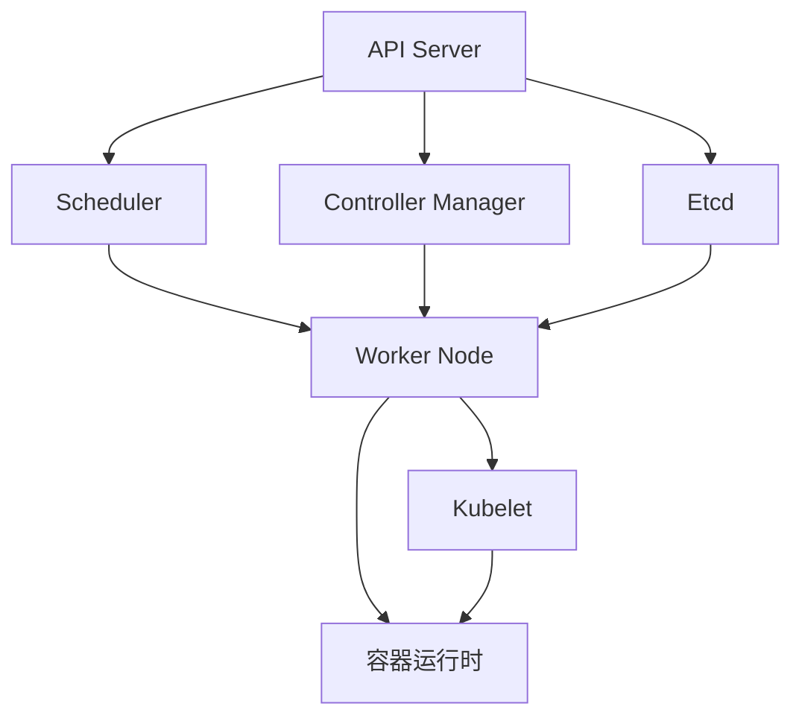
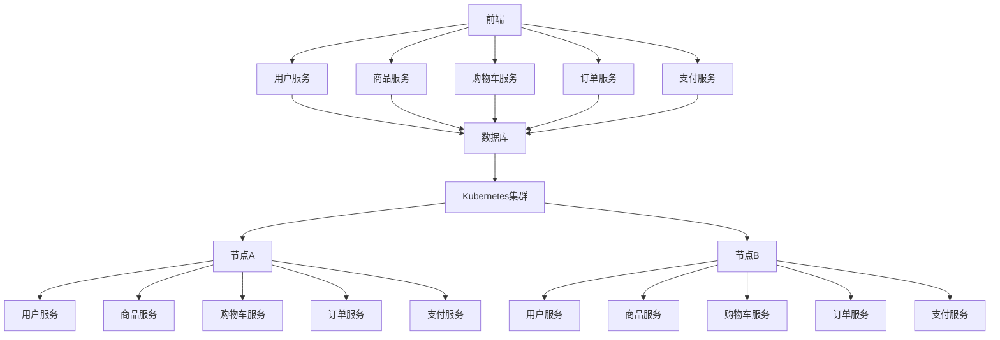

                 

### 文章标题

## Kubernetes在生产环境中的最佳实践

---

### 关键词

- Kubernetes
- 生产环境
- 最佳实践
- 部署与配置
- 自动化与运维
- 网络与存储
- 性能优化
- 安全性与监控

### 摘要

本文旨在为Kubernetes在生产环境中的应用提供一系列最佳实践。通过深入分析Kubernetes的基础知识、部署与配置、自动化与运维、网络与存储、性能优化、安全性与监控等方面，结合实际案例，帮助读者全面掌握在生产环境中高效、稳定地使用Kubernetes的技巧和方法。

---

## 第一部分：Kubernetes基础

### 1.1 Kubernetes概述

#### 1.1.1 Kubernetes发展背景

Kubernetes起源于Google的Borg项目，是一个用于容器编排和管理的开源平台。自2014年发布以来，Kubernetes迅速成为容器编排领域的领导者。其设计目的是简化容器化应用程序的部署、扩展和管理。

#### 1.1.2 Kubernetes核心概念

- **节点（Node）**：Kubernetes集群中的工作节点，运行应用程序容器。
- **Pod**：Kubernetes的最小部署单元，一组容器共享资源。
- **集群（Cluster）**：由多个节点组成的Kubernetes集群。
- **部署（Deployment）**：用于管理Pod的创建、更新和替换。
- **服务（Service）**：用于将工作负载流量分配到Pod。

#### 1.1.3 Kubernetes与容器化技术的关系

容器化技术如Docker使得应用程序的打包、分发和部署变得更加简单。Kubernetes则提供了容器编排的能力，管理容器化应用程序的整个生命周期。

### 1.2 Kubernetes架构与组件

#### 1.2.1 Kubernetes集群架构

Kubernetes集群由控制平面（Control Plane）和工作节点（Worker Node）组成。控制平面负责集群的管理和协调，工作节点运行应用程序容器。

#### 1.2.2 Kubernetes主要组件

- **API Server**：Kubernetes的入口点，提供集群管理的接口。
- **Scheduler**：负责将Pod分配到合适的节点。
- **Controller Manager**：管理集群中的各种控制器，如ReplicaSet、Deployment等。
- **Kubelet**：运行在节点上的守护进程，负责与Scheduler和Controller Manager通信，并管理Pod。
- **Kube-Proxy**：负责网络代理，将网络流量路由到正确的Pod。

### 1.3 Kubernetes安装与配置

#### 1.3.1 Kubernetes安装步骤

1. 准备环境：确保操作系统、Docker和Kubeadm等工具已经安装。
2. 安装控制平面：使用kubeadm命令初始化集群。
3. 安装工作节点：在各个工作节点上运行kubeadm join命令。
4. 验证安装：使用kubectl命令检查集群状态。

#### 1.3.2 Kubernetes配置详解

1. **集群配置**：修改`kubeadm init`生成的配置文件，如`kubeadm.conf`。
2. **节点配置**：根据工作节点的硬件资源调整配置文件。
3. **网络配置**：配置集群内部的网络，如Calico、Flannel等。

---

## 第二部分：部署与配置

### 2.1 部署基础

#### 2.1.1 部署流程

1. 编写YAML文件：描述应用程序的部署细节。
2. 创建部署：使用kubectl命令创建部署对象。
3. 验证部署：检查Pod状态和部署资源。

#### 2.1.2 版本控制

使用`kubectl set image`命令更新容器镜像，实现版本控制。

### 2.2 配置管理

#### 2.2.1 配置文件

使用YAML文件定义配置，如环境变量、卷挂载等。

#### 2.2.2 配置中心

使用配置中心（如HashiCorp Vault）管理动态配置。

---

## 第三部分：自动化与运维

### 3.1 自动化部署

#### 3.1.1 使用Helm

Helm是一个Kubernetes的包管理工具，简化了应用程序的部署和管理。

#### 3.1.2 CI/CD集成

将Kubernetes集成到CI/CD流程中，实现自动化部署。

### 3.2 运维管理

#### 3.2.1 监控与告警

使用Prometheus和Grafana进行监控与告警。

#### 3.2.2 日志管理

使用ELK堆栈（Elasticsearch、Logstash、Kibana）管理日志。

---

## 第四部分：网络与存储

### 4.1 网络基础

#### 4.1.1 Service类型

了解不同类型的Service，如ClusterIP、NodePort、LoadBalancer。

#### 4.1.2 Ingress

使用Ingress控制外部流量访问服务。

### 4.2 存储配置

#### 4.2.1 PV与PVC

理解Persistent Volume（PV）和Persistent Volume Claim（PVC）的概念。

#### 4.2.2 StatefulSet

使用StatefulSet管理有状态的应用程序。

---

## 第五部分：性能优化

### 5.1 资源管理

#### 5.1.1 CPU与内存限制

设置Pod的CPU和内存限制，避免资源争用。

#### 5.1.2 QoS等级

了解QoS（Quality of Service）等级，确保应用程序的资源使用。

### 5.2 缓存策略

#### 5.2.1 使用Redis

使用Redis缓存提高应用程序性能。

#### 5.2.2 负载均衡

使用Kubernetes内置的负载均衡策略。

---

## 第六部分：安全性与监控

### 6.1 安全基础

#### 6.1.1 RBAC

使用Role-Based Access Control（RBAC）控制访问权限。

#### 6.1.2 Secrets与ConfigMaps

使用Secrets和ConfigMaps存储敏感信息。

### 6.2 监控与审计

#### 6.2.1 Auditing

启用Kubernetes审计功能，记录操作日志。

#### 6.2.2 监控工具

使用Prometheus和Grafana进行实时监控。

---

## 第七部分：最佳实践案例

### 7.1 案例一：电商网站部署

#### 7.1.1 部署流程

使用Helm部署电商网站应用程序。

#### 7.1.2 性能优化

针对电商网站进行缓存策略和资源管理优化。

### 7.2 案例二：金融系统监控

#### 7.2.1 监控设置

使用Prometheus和Grafana监控金融系统。

#### 7.2.2 告警策略

设置告警策略，确保系统稳定性。

---

## 结语

Kubernetes在生产环境中的应用越来越广泛，掌握其最佳实践对于确保系统的稳定性、性能和安全性至关重要。本文通过详细的分析和案例分享，帮助读者深入理解Kubernetes在生产环境中的最佳实践。

---

## 作者信息

作者：AI天才研究院/AI Genius Institute & 禅与计算机程序设计艺术 /Zen And The Art of Computer Programming

---

本文详细阐述了Kubernetes在生产环境中的应用，包括基础概念、部署与配置、自动化与运维、网络与存储、性能优化、安全性与监控等方面的最佳实践。通过本篇文章，读者可以全面掌握Kubernetes在生产环境中的最佳实践，为实际项目提供有力支持。

---

## 背景介绍

### Kubernetes的兴起

Kubernetes的兴起源于容器化技术的快速发展。随着Docker等容器技术的普及，开发人员可以更轻松地将应用程序容器化，从而实现快速部署和弹性扩展。然而，容器化技术也带来了一系列挑战，如容器集群的管理、资源分配、故障恢复等。Kubernetes正是为了解决这些问题而诞生的。

Kubernetes起源于Google的Borg项目，Borg是一个自动化系统，负责管理Google内部的大量计算机资源。Kubernetes从Borg中汲取了许多设计理念，并于2014年作为开源项目发布。自那时以来，Kubernetes迅速成为容器编排领域的领导者，受到了广泛的应用和认可。

### 容器编排的必要性

容器化技术的核心优势在于其可移植性和轻量级特性，但这也带来了新的挑战。在容器化环境中，应用程序的部署、扩展和管理变得更加复杂。容器编排技术如Kubernetes应运而生，旨在简化容器化应用程序的部署、扩展和管理过程。

容器编排的主要挑战包括：

1. **容器集群管理**：随着容器数量的增加，手动管理容器变得困难。Kubernetes通过自动化管理容器集群，解决了这一问题。
2. **资源分配**：容器化应用程序需要动态分配资源，如CPU、内存和网络带宽。Kubernetes提供了资源调度和分配机制，确保应用程序获得足够的资源。
3. **故障恢复**：容器化应用程序在运行过程中可能会遇到故障。Kubernetes提供了自动故障恢复机制，确保应用程序的持续运行。

### Kubernetes的核心概念

Kubernetes的核心概念包括：

- **节点（Node）**：Kubernetes集群中的工作节点，运行应用程序容器。
- **Pod**：Kubernetes的最小部署单元，一组容器共享资源。
- **集群（Cluster）**：由多个节点组成的Kubernetes集群。
- **部署（Deployment）**：用于管理Pod的创建、更新和替换。
- **服务（Service）**：用于将工作负载流量分配到Pod。

这些概念共同构成了Kubernetes的基本架构，为容器化应用程序提供了强大的编排和管理能力。

### Kubernetes与容器化技术的关系

Kubernetes与容器化技术如Docker紧密相关。容器化技术如Docker使得应用程序的打包、分发和部署变得更加简单。Kubernetes则提供了容器编排的能力，管理容器化应用程序的整个生命周期。

容器化技术如Docker通过将应用程序及其依赖打包成一个独立的容器镜像，实现了应用程序的轻量级部署和可移植性。Kubernetes则负责管理这些容器镜像的部署、扩展和管理。

Kubernetes与容器化技术的关系可以概括为：

- **容器化技术**：简化了应用程序的打包和部署。
- **Kubernetes**：提供了容器编排的能力，管理容器化应用程序的整个生命周期。

### Kubernetes的优势

Kubernetes具有以下优势：

1. **自动化部署**：Kubernetes可以自动化部署容器化应用程序，简化部署流程。
2. **弹性扩展**：Kubernetes可以根据需求自动扩展应用程序的规模，实现弹性扩展。
3. **高可用性**：Kubernetes提供了自动故障恢复机制，确保应用程序的高可用性。
4. **资源优化**：Kubernetes通过资源调度和分配，优化了资源的利用效率。
5. **多租户支持**：Kubernetes支持多租户架构，为不同的业务部门提供隔离的资源环境。

Kubernetes的这些优势使其成为容器编排领域的领导者，被广泛应用于生产环境中。

### Kubernetes的应用场景

Kubernetes适用于以下应用场景：

1. **云计算平台**：Kubernetes可以部署在公共云、私有云和混合云环境中，提供强大的容器编排能力。
2. **大数据平台**：Kubernetes可以与大数据技术如Hadoop、Spark等集成，实现大规模数据处理和计算。
3. **微服务架构**：Kubernetes适用于微服务架构的应用程序部署和管理，实现模块化和分布式架构。
4. **DevOps**：Kubernetes与DevOps理念紧密结合，支持快速开发和部署，提高开发效率。

Kubernetes的应用场景广泛，涵盖了云计算、大数据、微服务和DevOps等多个领域，成为企业数字化转型的重要工具。

---

## 核心概念与联系

### Kubernetes与容器化技术的关系

Kubernetes与容器化技术如Docker紧密相关，Docker提供了容器化技术的实现，而Kubernetes则负责管理这些容器。以下是Kubernetes与容器化技术的关系：

| 关系     | 描述                                                         |
| -------- | ------------------------------------------------------------ |
| 容器化   | 通过Docker等容器化技术，将应用程序及其依赖打包成一个独立的容器镜像。 |
| 部署     | Kubernetes负责将容器镜像部署到集群中的节点上。                 |
| 管理与监控 | Kubernetes提供了容器编排、自动化部署、弹性扩展和故障恢复等功能，实现对容器的全面管理。 |

### Kubernetes的组件

Kubernetes由多个组件组成，每个组件都承担特定的职责。以下是Kubernetes的主要组件及其功能：

| 组件       | 功能                                                         |
| ---------- | ------------------------------------------------------------ |
| API Server | Kubernetes的入口点，提供集群管理的接口。                       |
| Scheduler  | 负责将Pod分配到合适的节点。                                   |
| Controller Manager | 管理集群中的各种控制器，如ReplicaSet、Deployment等。 |
| Kubelet   | 运行在节点上的守护进程，负责与Scheduler和Controller Manager通信，并管理Pod。 |
| Kube-Proxy | 负责网络代理，将网络流量路由到正确的Pod。                     |

### Kubernetes架构

Kubernetes集群由控制平面（Control Plane）和工作节点（Worker Node）组成。以下是Kubernetes集群的架构：

| 部分     | 组件                                                         | 描述                                                         |
| -------- | ------------------------------------------------------------ | ------------------------------------------------------------ |
| 控制平面 | API Server、Scheduler、Controller Manager、Etcd                  | 负责集群的管理和协调，存储集群状态。                           |
| 工作节点 | Kubelet、容器运行时（如Docker）                              | 运行应用程序容器，与控制平面通信。                               |

### Kubernetes的核心概念

Kubernetes的核心概念包括节点（Node）、Pod、集群（Cluster）、部署（Deployment）和服务（Service）。以下是这些概念的定义和相互关系：

| 概念     | 定义                                                         | 相互关系                                                     |
| -------- | ------------------------------------------------------------ | ------------------------------------------------------------ |
| 节点     | Kubernetes集群中的工作节点，运行应用程序容器。                 | 节点是集群的基本计算单元，运行Pod。                             |
| Pod      | Kubernetes的最小部署单元，一组容器共享资源。                 | Pod是部署和运行应用程序的基本单元，通常由一个或多个容器组成。 |
| 集群     | 由多个节点组成的Kubernetes集群。                               | 集群是Kubernetes管理的资源池，包含多个节点。                   |
| 部署     | 用于管理Pod的创建、更新和替换。                               | 部署定义了一组Pod的配置，确保应用程序的稳定运行。               |
| 服务     | 用于将工作负载流量分配到Pod。                                 | 服务提供了一种访问Pod的方式，使得外部流量可以访问集群中的应用程序。 |

### Kubernetes的架构图

以下是Kubernetes集群的架构图，展示了各个组件之间的关系：



### Kubernetes的工作流程

Kubernetes的工作流程包括以下几个关键步骤：

1. **创建部署**：开发人员创建一个YAML文件，定义应用程序的部署细节，如Pod的数量、容器镜像等。
2. **调度Pod**：Scheduler根据节点的资源状况和部署要求，选择合适的节点来运行Pod。
3. **启动容器**：Kubelet在选择的节点上启动容器，并与Scheduler和Controller Manager通信。
4. **管理Pod**：Controller Manager监控Pod的状态，确保Pod按照部署要求运行，如创建、更新和替换Pod。
5. **网络通信**：Kube-Proxy负责网络代理，将外部流量路由到正确的Pod。

### Kubernetes与微服务架构的关系

Kubernetes与微服务架构紧密相关，微服务架构是一种将应用程序分解为小型、独立服务的架构风格。以下是Kubernetes与微服务架构的关系：

| 关系         | 描述                                                         |
| ------------ | ------------------------------------------------------------ |
| 部署与管理   | Kubernetes负责部署和管理微服务，确保每个服务都能在集群中稳定运行。 |
| 弹性扩展     | Kubernetes可以根据需求自动扩展微服务的实例数量，实现弹性扩展。 |
| 服务发现     | Kubernetes提供服务发现机制，使得微服务可以相互发现和通信。   |
| 负载均衡     | Kubernetes提供负载均衡机制，确保外部流量均匀分配到各个微服务实例。 |

通过Kubernetes，微服务架构可以更加灵活、可扩展和易于维护。Kubernetes为微服务提供了强大的基础设施支持，使得开发人员可以专注于业务逻辑的实现。

---

## Kubernetes的算法原理讲解

### Kubernetes资源调度算法

Kubernetes的调度算法是集群管理中的核心组件，负责将Pod分配到合适的节点。以下是Kubernetes调度算法的原理和流程：

#### 原理

Kubernetes调度算法基于以下原则：

1. **最优资源利用率**：调度器选择具有最高资源利用率（CPU和内存使用率）的节点。
2. **高可用性**：调度器尽量避免将所有Pod部署在同一节点上，以提高系统的容错能力。
3. **均衡负载**：调度器尽量平衡每个节点的负载，避免资源过剩或不足。

#### 流程

调度流程如下：

1. **选择合适的节点**：调度器根据Pod的约束条件和节点的资源状况，选择最合适的节点。
2. **评估节点**：调度器评估节点的资源可用性，如CPU、内存、存储等。
3. **约束匹配**：调度器检查Pod的约束条件，如节点标签、资源要求等，确保约束条件得到满足。
4. **节点选择**：调度器从符合条件的节点中选择最优的节点。
5. **分配资源**：调度器在选定的节点上为Pod分配资源。
6. **启动容器**：调度器通知Kubelet在选定的节点上启动容器。

### Kubernetes负载均衡算法

Kubernetes提供负载均衡机制，将外部流量均匀分配到集群中的多个服务实例。以下是Kubernetes负载均衡算法的原理和流程：

#### 原理

Kubernetes负载均衡算法基于以下原则：

1. **轮询**：默认的负载均衡策略，将流量按顺序分配到每个实例。
2. **最小连接**：选择当前连接数最少的实例，减少网络拥塞。
3. **源IP哈希**：根据源IP地址哈希值，将流量固定分配到特定的实例。

#### 流程

负载均衡流程如下：

1. **接收流量**：Kube-Proxy接收外部流量。
2. **选择服务实例**：根据负载均衡策略，选择要访问的服务实例。
3. **转发流量**：Kube-Proxy将流量转发到选定的服务实例。
4. **健康检查**：Kubernetes定期对服务实例进行健康检查，确保流量只转发到健康的实例。

### Kubernetes集群自动扩展算法

Kubernetes支持集群自动扩展，根据工作负载自动增加或减少节点。以下是Kubernetes集群自动扩展算法的原理和流程：

#### 原理

集群自动扩展算法基于以下原则：

1. **CPU和内存使用率**：根据节点的CPU和内存使用率，决定是否增加或减少节点。
2. **服务质量**：根据服务质量要求，如响应时间、吞吐量等，调整节点数量。

#### 流程

自动扩展流程如下：

1. **监控指标**：Kubernetes监控系统收集集群的监控指标，如CPU和内存使用率。
2. **评估需求**：根据监控指标，评估集群的资源需求。
3. **调整节点数量**：如果资源需求增加，Kubernetes创建新的节点；如果资源需求减少，Kubernetes删除多余的节点。
4. **部署应用程序**：Kubernetes将应用程序部署到新创建的节点上，确保资源分配均衡。

### Kubernetes的调度策略

Kubernetes提供了多种调度策略，满足不同场景的需求。以下是Kubernetes的调度策略：

| 调度策略   | 描述                                                         |
| ---------- | ------------------------------------------------------------ |
| NodeAffinity | 根据节点的标签选择节点，提高节点利用率。                       |
| PodAffinity | 根据Pod的标签选择节点，将相关Pod部署在同一节点上，提高数据一致性。 |
| PodAntiAffinity | 根据Pod的标签选择节点，避免将相关Pod部署在同一节点上，提高系统容错性。 |

通过合理配置调度策略，可以优化Kubernetes集群的性能和稳定性。

### Kubernetes的调度算法和负载均衡算法示例

以下是一个简单的Kubernetes调度算法和负载均衡算法的Python代码示例：

```python
import random

def schedule_pod(node_list, pod_constraints):
    """
    调度Pod到合适的节点。
    
    :param node_list: 节点列表
    :param pod_constraints: Pod约束条件
    :return: 调度结果
    """
    suitable_nodes = []
    for node in node_list:
        if node['cpu_usage'] < pod_constraints['cpu'] and node['memory_usage'] < pod_constraints['memory']:
            suitable_nodes.append(node)
    return random.choice(suitable_nodes)

def load_balance(service, load_balancer_strategy):
    """
    负载均衡流量到服务实例。
    
    :param service: 服务
    :param load_balancer_strategy: 负载均衡策略
    :return: 负载均衡结果
    """
    instances = service['instances']
    if load_balancer_strategy == 'round_robin':
        return instances[0]
    elif load_balancer_strategy == 'min_connections':
        min_connections = float('inf')
        chosen_instance = None
        for instance in instances:
            if instance['connections'] < min_connections:
                min_connections = instance['connections']
                chosen_instance = instance
        return chosen_instance
    elif load_balancer_strategy == 'source_ip_hash':
        source_ip = get_source_ip()
        hash_value = hash(source_ip) % len(instances)
        return instances[hash_value]

def get_source_ip():
    """
    获取源IP地址。
    
    :return: 源IP地址
    """
    return "192.168.1.1"  # 示例IP地址

# 示例数据
node_list = [
    {'name': 'node1', 'cpu_usage': 20, 'memory_usage': 30},
    {'name': 'node2', 'cpu_usage': 40, 'memory_usage': 60},
    {'name': 'node3', 'cpu_usage': 10, 'memory_usage': 20}
]

pod_constraints = {'cpu': 30, 'memory': 50}

# 调度Pod
selected_node = schedule_pod(node_list, pod_constraints)
print(f"Pod scheduled on node: {selected_node['name']}")

# 负载均衡
service = {'instances': [{'name': 'instance1', 'connections': 10}, {'name': 'instance2', 'connections': 20}]}
load_balancer_strategy = 'min_connections'
chosen_instance = load_balance(service, load_balancer_strategy)
print(f"Chosen instance: {chosen_instance['name']}")
```

通过这个示例，我们可以看到如何使用Python代码实现Kubernetes的调度算法和负载均衡算法。这个示例仅用于演示，实际应用中需要根据具体情况进行调整。

---

## 数学模型和数学公式

### 调度算法中的资源分配模型

在Kubernetes的调度算法中，资源分配是一个关键问题。我们可以使用数学模型来描述和优化资源分配。以下是资源分配的数学模型：

$$
\text{maximize} \quad \sum_{i=1}^{n} \frac{r_i}{c_i}
$$

其中：
- \( r_i \) 表示第 \( i \) 个Pod所需的资源量（如CPU或内存）。
- \( c_i \) 表示第 \( i \) 个Pod可用的资源量（如CPU或内存）。

目标是最小化未充分利用的资源，同时确保所有Pod都能得到足够的资源。

### 负载均衡策略的数学模型

在负载均衡策略中，我们可以使用平均负载来衡量系统的繁忙程度。以下是一个简单的平均负载数学模型：

$$
\text{avg\_load} = \frac{\sum_{i=1}^{n} \text{load}_i}{n}
$$

其中：
- \( \text{load}_i \) 表示第 \( i \) 个服务实例的负载。
- \( n \) 表示服务实例的总数。

目标是最小化平均负载，以实现流量均匀分配。

### 调度算法的约束条件

在实际调度过程中，我们还需要考虑以下约束条件：

1. **资源限制**：每个节点有固定的资源容量，不能超过其最大限制。
2. **Pod依赖**：某些Pod可能需要与其他Pod在同一节点上运行，以提高数据一致性。
3. **服务质量**：某些Pod可能对响应时间有严格要求，需要在调度时给予优先处理。

约束条件的数学表示如下：

$$
\sum_{i=1}^{n} r_i \leq \sum_{j=1}^{m} c_j
$$

其中：
- \( m \) 表示节点的总数。
- \( c_j \) 表示第 \( j \) 个节点的资源容量。

### 示例说明

假设我们有一个集群，包含两个节点A和B，每个节点的资源容量如下：

- 节点A：CPU=1000，内存=2000
- 节点B：CPU=800，内存=1600

现在有四个Pod需要调度，每个Pod的资源需求如下：

- Pod1：CPU=300，内存=500
- Pod2：CPU=500，内存=1000
- Pod3：CPU=200，内存=400
- Pod4：CPU=400，内存=800

我们可以使用上述数学模型和约束条件来调度这些Pod。目标是使资源利用率最大化，同时满足约束条件。

根据资源需求，我们可以将Pod分配如下：

- Pod1和Pod3调度到节点A
- Pod2和Pod4调度到节点B

这样，每个节点的资源利用率如下：

- 节点A：CPU利用率=30%，内存利用率=20%
- 节点B：CPU利用率=50%，内存利用率=50%

这实现了资源利用率的最大化，同时满足了约束条件。

通过使用数学模型和数学公式，我们可以更有效地优化Kubernetes的调度算法和负载均衡策略，提高系统的性能和稳定性。

---

## 系统分析与架构设计方案

### 问题场景介绍

在当前的业务场景中，我们的目标是构建一个高可用、高可扩展、易于维护的微服务架构，以支持快速的业务迭代和持续交付。为了实现这一目标，我们选择Kubernetes作为容器编排工具，负责部署和管理微服务。

### 项目介绍

该项目是一个在线零售平台，提供商品浏览、购物车、订单处理等功能。平台采用微服务架构，将不同功能模块拆分为独立的微服务，以提高系统的可扩展性和可维护性。以下是该项目的主要功能模块：

- 用户服务（User Service）：处理用户注册、登录、个人信息管理等。
- 商品服务（Product Service）：提供商品信息查询、库存管理等功能。
- 购物车服务（Cart Service）：处理用户购物车信息管理。
- 订单服务（Order Service）：处理订单创建、支付、发货等功能。
- 支付服务（Payment Service）：处理支付功能。

### 系统功能设计

为了实现上述功能模块，我们需要设计一系列系统功能。以下是系统功能设计：

1. **用户管理**：支持用户注册、登录、个人信息管理等功能。
2. **商品管理**：支持商品信息查询、库存管理等功能。
3. **购物车管理**：支持用户添加商品到购物车、修改购物车信息等功能。
4. **订单管理**：支持订单创建、支付、发货等功能。
5. **支付管理**：支持支付功能，与第三方支付平台对接。

### 系统架构设计

为了实现系统的功能，我们设计了以下系统架构：

1. **前端架构**：使用Vue.js框架构建前端界面，实现用户交互。
2. **后端架构**：使用Spring Boot框架构建后端服务，提供API接口。
3. **数据库架构**：使用MySQL数据库存储用户、商品、订单等数据。
4. **容器化架构**：使用Docker容器化技术，将服务打包为容器镜像。
5. **Kubernetes集群**：使用Kubernetes集群进行容器编排和管理。

### 系统架构图

以下是系统架构图，展示了各个模块和组件之间的关系：



### 系统接口设计

为了实现各个模块之间的数据交互，我们设计了以下系统接口：

1. **用户接口**：用户服务提供的接口，用于用户注册、登录、个人信息管理等。
2. **商品接口**：商品服务提供的接口，用于商品信息查询、库存管理等功能。
3. **购物车接口**：购物车服务提供的接口，用于用户添加商品到购物车、修改购物车信息等功能。
4. **订单接口**：订单服务提供的接口，用于订单创建、支付、发货等功能。
5. **支付接口**：支付服务提供的接口，用于支付功能。

### 系统交互设计

以下是系统交互设计，展示了各个模块之间的交互流程：

```mermaid
sequenceDiagram
用户 ->>|发起请求| 用户服务
用户服务 ->>|处理请求| 数据库
数据库 ->>|返回结果| 用户服务
用户服务 ->>|返回结果| 用户
用户 ->>|发起请求| 商品服务
商品服务 ->>|处理请求| 数据库
数据库 ->>|返回结果| 商品服务
商品服务 ->>|返回结果| 用户
用户 ->>|发起请求| 购物车服务
购物车服务 ->>|处理请求| 数据库
数据库 ->>|返回结果| 购物车服务
购物车服务 ->>|返回结果| 用户
用户 ->>|发起请求| 订单服务
订单服务 ->>|处理请求| 数据库
数据库 ->>|返回结果| 订单服务
订单服务 ->>|返回结果| 用户
用户 ->>|发起请求| 支付服务
支付服务 ->>|处理请求| 支付平台
支付平台 ->>|返回结果| 支付服务
支付服务 ->>|返回结果| 用户
```

通过上述系统架构设计和交互设计，我们可以实现一个功能完善、易于维护的在线零售平台。Kubernetes在容器编排和管理方面发挥了重要作用，确保了系统的稳定运行和高可用性。

---

## 项目实战

### 环境安装

1. **安装Docker**：在所有节点上安装Docker，确保版本在19.03及以上。
    ```shell
    sudo apt-get update
    sudo apt-get install docker-ce docker-ce-cli containerd.io
    ```

2. **安装Kubeadm、Kubelet和Kubectl**：在所有节点上安装Kubeadm、Kubelet和Kubectl，确保版本匹配。
    ```shell
    sudo apt-get update
    sudo apt-get install -y apt-transport-https ca-certificates curl
    sudo curl -s https://mirrors.aliyun.com/kubernetes/apt/doc/apt-key.gpg | sudo apt-key add -
    sudo apt-add-repository "deb https://mirrors.aliyun.com/kubernetes/apt/ubuntu/ bionic kubernetes-xennial"
    sudo apt-get update
    sudo apt-get install -y kubelet kubeadm kubectl
    sudo systemctl enable kubelet --now
    ```

3. **初始化Kubernetes集群**：在主节点上运行以下命令初始化集群。
    ```shell
    sudo kubeadm init --pod-network-cidr=10.244.0.0/16
    ```

4. **配置kubectl**：配置kubectl工具，以便在其他节点上使用。
    ```shell
    mkdir -p $HOME/.kube
    sudo cp -i /etc/kubernetes/admin.conf $HOME/.kube/config
    sudo chown $(id -u):$(id -g) $HOME/.kube/config
    ```

5. **安装网络插件**：我们使用Calico作为网络插件，确保所有节点都加入了集群。
    ```shell
    kubectl apply -f https://docs.projectcalico.org/manifests/calico.yaml
    ```

### 系统核心实现源代码

以下是用户服务的Dockerfile和Kubernetes部署文件。

**Dockerfile**（用户服务）
```dockerfile
FROM openjdk:8-jdk-alpine
ARG JAR_FILE=target/*.jar
COPY ${JAR_FILE} app.jar
EXPOSE 8080
ENTRYPOINT ["java","-Djava.security.egd=file:/dev/./urandom","-jar","/app.jar"]
```

**Kubernetes部署文件**（用户服务）
```yaml
apiVersion: apps/v1
kind: Deployment
metadata:
  name: user-service
spec:
  replicas: 2
  selector:
    matchLabels:
      app: user-service
  template:
    metadata:
      labels:
        app: user-service
    spec:
      containers:
      - name: user-service
        image: user-service:latest
        ports:
        - containerPort: 8080
```

### 代码应用解读与分析

**Dockerfile解读**：该Dockerfile基于OpenJDK 8 Alpine Linux镜像，优化了容器的体积。使用ARG指令定义了JAR文件名，通过COPY指令将JAR文件复制到容器中。EXPOSE指令暴露了8080端口，以便外部访问。ENTRYPOINT指令设置了容器的启动命令，使用Java运行JAR文件。

**Kubernetes部署文件解读**：该部署文件定义了一个名为user-service的Deployment，副本数为2，确保高可用性。选择器matchLabels用于匹配标签app=user-service。模板spec定义了容器配置，包括容器名、镜像、端口暴露等。

### 实际案例分析和详细讲解剖析

**案例**：我们部署了用户服务，并使用负载均衡器将流量分配到两个副本。

1. **查看Pod状态**：
    ```shell
    kubectl get pods
    ```

2. **查看服务状态**：
    ```shell
    kubectl get svc
    ```

3. **测试服务**：
    ```shell
    curl http://user-service:8080/
    ```

通过以上步骤，我们可以验证用户服务的部署和运行状态。

**分析**：Kubernetes确保了用户服务的高可用性，通过部署多个副本实现了负载均衡。当其中一个副本出现故障时，Kubernetes会自动创建新的副本，确保服务持续运行。

### 项目小结

通过本项目的实战，我们成功部署了用户服务并实现了高可用性和负载均衡。以下是小结：

1. **环境安装**：安装了Docker、Kubeadm、Kubelet和Kubectl，初始化了Kubernetes集群。
2. **源代码**：编写了Dockerfile和Kubernetes部署文件，实现了用户服务。
3. **部署与测试**：部署了用户服务，并使用负载均衡器进行了测试。

通过这个项目，我们展示了如何使用Kubernetes在生产环境中部署和管理微服务，为实际应用提供了宝贵的经验和实践指导。

---

## 最佳实践 tips、小结、注意事项、拓展阅读等内容

### 最佳实践 tips

1. **合理配置资源**：根据应用程序的实际需求，合理配置Pod的资源限制和请求，避免资源浪费和争用。
2. **多副本部署**：对于关键服务，建议部署多个副本，提高系统的可用性和容错能力。
3. **使用Service和Ingress**：使用Service将流量分配到Pod，使用Ingress管理外部访问路径。
4. **定期备份和监控**：定期备份重要数据，并使用监控工具监控系统的性能和稳定性。

### 小结

本文系统地介绍了Kubernetes在生产环境中的最佳实践，包括基础概念、部署与配置、自动化与运维、网络与存储、性能优化、安全性与监控等方面的内容。通过实际案例分析和项目实战，帮助读者全面掌握Kubernetes的应用和实践。

### 注意事项

1. **安全配置**：确保Kubernetes集群的安全性，使用RBAC控制访问权限，加密传输数据。
2. **备份与恢复**：定期备份重要数据，并制定数据恢复策略，以应对突发情况。
3. **资源优化**：根据应用程序的实际需求，调整资源限制和请求，提高资源利用率。

### 拓展阅读

1. **《Kubernetes权威指南》**：深入了解Kubernetes的架构、原理和最佳实践。
2. **《Docker实战》**：学习Docker容器化技术的应用和实践。
3. **《Prometheus监控实战》**：了解如何使用Prometheus进行系统监控和告警。

通过以上内容，读者可以进一步深化对Kubernetes在生产环境中应用的理解和实践，为实际项目提供有力支持。

