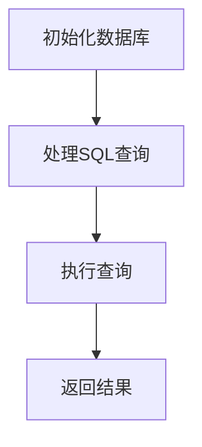

                 

### 《NewSQL数据库技术解析》

> 关键词：NewSQL, 数据库技术, 性能优化, 可扩展性, SQL查询

> 摘要：本文将深入探讨NewSQL数据库技术，从其背景、核心概念、原理、应用场景、选型、设计与优化以及安全与监控等多个方面进行详细解析。通过本文的阅读，读者将全面了解NewSQL数据库的优势及其在当今大数据和云计算环境下的应用价值。

---

## 《NewSQL数据库技术解析》目录大纲

### 前言

- **目标读者：** 数据库管理员、开发者、架构师等
- **内容概述：** 介绍NewSQL数据库技术的概念、原理、应用场景以及未来趋势。

---

### 第1章 NewSQL技术概述

#### 1.1 背景介绍

- **问题背景：** 传统关系型数据库与NoSQL数据库的局限性
- **问题描述：** 数据库性能、可扩展性、灵活性的需求
- **问题解决：** NewSQL技术的提出与解决方案
- **边界与外延：** NewSQL技术的应用范围与发展趋势

#### 1.2 NewSQL核心概念

- **核心概念：** NewSQL的定义、特点与分类
- **概念属性特征对比表格：**

  | 类别       | 特点                                                         | 代表技术          |
  | ---------- | ------------------------------------------------------------ | ----------------- |
  | NewSQL 1   | 结合关系型数据库与NoSQL的优点，支持SQL查询                   | VoltDB, Google Spanner |
  | NewSQL 2   | 强调性能与可扩展性，适用于在线事务处理（OLTP）场景          | Cassandra SQL, H-Store |
  | NewSQL 3   | 混合SQL与NoSQL特性，适用于大数据处理与实时查询             | Druid, Google F1 |

#### 1.3 NewSQL技术原理

- **原理讲解：** NewSQL技术的实现原理与关键技术
- **Mermaid流程图：** 描述NewSQL技术的基本流程

  ```mermaid
  graph TD
  A[初始化数据库] --> B[处理SQL查询]
  B --> C[执行查询]
  C --> D[返回结果]
  ```

#### 1.4 NewSQL技术应用场景

- **应用场景：** NewSQL在不同业务场景中的应用案例
- **案例分析：** 企业内部应用案例与行业解决方案

#### 1.5 NewSQL技术未来趋势

- **未来趋势：** NewSQL技术的未来发展方向与挑战

### 第2章 NewSQL数据库选型

#### 2.1 数据库选型原则

- **选型原则：** 根据业务需求、性能要求、扩展能力等因素进行选型

#### 2.2 主流NewSQL数据库技术对比

- **技术对比：** 常见NewSQL数据库技术的性能、功能、适用场景对比
- **表格：**

  | 数据库        | 性能        | 功能           | 适用场景          |
  | ------------- | ----------- | -------------- | ----------------- |
  | VoltDB        | 高性能      | 支持ACID事务   | 实时分析         |
  | Google Spanner | 强一致性    | 分布式数据库   | 全球业务         |
  | Cassandra SQL | 高可用性    | 强一致性       | 大数据存储       |

#### 2.3 NewSQL数据库实战

- **实战案例：** NewSQL数据库的部署、配置与性能优化
- **环境安装：** 相关软件与工具的安装与配置

### 第3章 NewSQL数据库设计与优化

#### 3.1 数据库设计原则

- **设计原则：** 如何设计高效、可扩展的数据库架构

#### 3.2 查询优化

- **查询优化：** 如何优化SQL查询性能，提高系统吞吐量
- **Python源代码：** 示例代码与性能分析

  ```python
  def query_optimization():
      # 查询优化代码示例
      pass
  ```

#### 3.3 数据库性能调优

- **性能调优：** 如何通过参数调整、索引优化等方式提高数据库性能
- **最佳实践：** 性能优化技巧与经验总结

### 第4章 NewSQL数据库安全与监控

#### 4.1 数据库安全

- **安全策略：** 如何保障NewSQL数据库的安全性
- **安全措施：** 实现数据库安全的策略与措施

#### 4.2 数据库监控

- **监控策略：** 如何对NewSQL数据库进行有效监控
- **监控工具：** 常用数据库监控工具介绍与使用

### 结语

- **总结：** NewSQL技术的重要性及其对现代数据库领域的影响
- **展望：** 对NewSQL技术未来发展的展望与期待

---

### 第1章 NewSQL技术概述

#### 1.1 背景介绍

在当今数据驱动的时代，数据库技术已经成为企业级应用的核心组件。传统的数据库技术主要分为关系型数据库（RDBMS）和非关系型数据库（NoSQL）。关系型数据库以其强大的数据一致性和事务支持而著称，但它们在应对大数据和高并发场景时，性能和扩展性问题日益凸显。另一方面，NoSQL数据库在可扩展性和性能上具有显著优势，但它们通常牺牲了数据一致性和查询能力。

这种背景下，NewSQL技术应运而生。NewSQL旨在结合关系型数据库和NoSQL数据库的优点，提供一个既支持SQL查询，又具备高性能和高可扩展性的数据库解决方案。NewSQL不仅仅是一个概念，而是实现这一目标的一系列技术和方法。

**问题背景：**  
关系型数据库如MySQL、PostgreSQL在早期取得了巨大的成功，但随着数据量和并发访问量的增加，它们面临着以下问题：

- **性能瓶颈：** 关系型数据库在处理大规模数据时，性能会显著下降。
- **扩展性限制：** 传统关系型数据库的扩展性较差，难以支持横向和纵向的扩展。
- **查询灵活性：** 面对复杂查询需求，关系型数据库的查询能力有限。

**问题描述：**  
随着互联网和大数据时代的到来，企业和组织对数据库的性能、可扩展性和灵活性提出了更高的要求。传统关系型数据库和NoSQL数据库都有各自的局限性，无法满足这些需求。

**问题解决：**  
NewSQL技术的提出，试图在以下几个方面解决上述问题：

- **高性能：** 利用NoSQL数据库的架构，提高数据库的查询性能。
- **可扩展性：** 通过分布式架构，支持数据的横向扩展。
- **SQL支持：** 保持SQL查询的兼容性，方便开发者迁移和使用。

**边界与外延：**  
NewSQL技术的应用范围非常广泛，涵盖了金融、电子商务、社交网络等多个领域。随着技术的发展，NewSQL数据库的种类和数量也在不断增加，其应用场景也在不断扩展。

#### 1.2 NewSQL核心概念

NewSQL的核心概念在于融合关系型数据库和NoSQL数据库的优点，使其能够同时支持SQL查询和高性能、高可扩展性。下面我们将详细探讨NewSQL的定义、特点与分类。

**核心概念：**  
NewSQL是一种数据库技术，旨在解决传统关系型数据库和NoSQL数据库的局限性。它结合了SQL查询和NoSQL的性能优势，同时保持了数据的一致性和事务支持。

**特点：**  
- **SQL查询支持：** NewSQL数据库能够处理SQL查询，确保数据的一致性和事务支持。
- **高性能：** 通过分布式架构和优化查询算法，NewSQL数据库在处理大数据和高并发场景时性能显著。
- **可扩展性：** 支持数据的横向扩展，通过分布式节点，能够轻松应对数据量的增长。

**分类：**  
NewSQL可以根据其特点和应用场景进行分类，主要分为以下几类：

1. **混合SQL与NoSQL的优点**：这类NewSQL数据库如VoltDB和Google Spanner，它们在保持SQL查询能力的同时，引入了NoSQL的分布式架构，适用于高并发和大数据场景。
2. **强调性能与可扩展性**：如Cassandra SQL和H-Store，这些数据库在在线事务处理（OLTP）场景中表现出色，通过分布式架构和优化查询算法，提供了高性能和可扩展性。
3. **大数据处理与实时查询**：如Druid和Google F1，这类NewSQL数据库在处理大数据和实时查询方面具有显著优势，能够满足复杂查询需求。

**概念属性特征对比表格：**

| 类别       | 特点                                                         | 代表技术          |
| ---------- | ------------------------------------------------------------ | ----------------- |
| NewSQL 1   | 结合关系型数据库与NoSQL的优点，支持SQL查询                   | VoltDB, Google Spanner |
| NewSQL 2   | 强调性能与可扩展性，适用于在线事务处理（OLTP）场景          | Cassandra SQL, H-Store |
| NewSQL 3   | 混合SQL与NoSQL特性，适用于大数据处理与实时查询             | Druid, Google F1 |

#### 1.3 NewSQL技术原理

NewSQL技术的核心在于其实现原理和关键技术。下面我们将从原理层面进行讲解，并通过Mermaid流程图描述NewSQL技术的基本流程。

**原理讲解：**  
NewSQL数据库通过以下几个关键技术实现高性能和高可扩展性：

1. **分布式架构**：NewSQL数据库通常采用分布式架构，将数据存储在多个节点上。通过分布式计算，可以显著提高数据库的并发处理能力。
2. **优化查询算法**：NewSQL数据库采用了多种查询优化算法，如索引优化、查询缓存等，以提高查询性能。
3. **负载均衡**：通过负载均衡技术，将查询请求分配到不同的节点，避免单个节点成为性能瓶颈。
4. **数据一致性**：NewSQL数据库在保持数据一致性的同时，引入了分布式事务处理机制，如两阶段提交（2PC）和三阶段提交（3PC），确保数据的一致性。

**Mermaid流程图：**  
下面是一个简单的Mermaid流程图，描述了NewSQL技术的基本流程：



**流程说明：**  
- **A[初始化数据库]**：数据库初始化，设置分布式节点和存储结构。
- **B[处理SQL查询]**：接收到SQL查询请求，通过分布式架构进行查询处理。
- **C[执行查询]**：查询算法执行，包括索引查找、数据聚合等操作。
- **D[返回结果]**：将查询结果返回给客户端。

通过上述关键技术，NewSQL数据库能够实现高性能和高可扩展性，同时保持SQL查询的支持和数据的一致性。

#### 1.4 NewSQL技术应用场景

NewSQL技术由于其独特的优势，广泛应用于多个业务场景。下面我们将探讨NewSQL在不同业务场景中的应用案例，并进行分析。

**应用场景：**  
1. **实时分析**：NewSQL数据库在金融、电子商务等领域具有广泛的应用，能够处理高并发和大数据量的实时查询需求。
2. **在线事务处理**：NewSQL数据库在电子商务、金融交易等场景中，提供了高性能和可扩展性的在线事务处理（OLTP）解决方案。
3. **大数据处理**：NewSQL数据库在处理大规模数据集和实时查询时，展示了其强大的处理能力。

**案例分析：**  
1. **金融领域**：某大型银行采用NewSQL数据库进行客户交易记录的实时分析，通过分布式架构和优化查询算法，实现了高效的数据查询和实时监控。
2. **电子商务**：某知名电商平台采用NewSQL数据库处理用户订单和库存数据，通过分布式存储和负载均衡技术，提高了系统的性能和可靠性。
3. **社交网络**：某大型社交网络平台采用NewSQL数据库处理用户数据，支持大规模数据的实时查询和存储，通过分布式架构和一致性保证，提高了系统的稳定性和性能。

通过上述案例分析，可以看出NewSQL数据库在不同业务场景中展现出了强大的应用价值。其高性能、可扩展性和SQL查询支持，使其成为现代数据库技术的理想选择。

#### 1.5 NewSQL技术未来趋势

随着大数据和云计算的不断发展，NewSQL技术在未来将继续扮演重要角色。下面我们将探讨NewSQL技术的未来发展趋势和面临的挑战。

**未来趋势：**  
1. **技术融合**：NewSQL技术将继续融合关系型数据库和NoSQL数据库的优点，提供更加全面和高效的数据库解决方案。
2. **智能化**：随着人工智能技术的发展，NewSQL数据库将引入智能化算法，如机器学习、深度学习等，以进一步提高查询性能和自动化管理。
3. **云原生**：随着云计算的普及，NewSQL技术将更加注重云原生架构，提供弹性、高效和安全的云数据库服务。

**挑战与机遇：**  
1. **性能优化**：如何进一步提高NewSQL数据库的性能，特别是在大规模数据和高并发场景下，仍是一个重要挑战。
2. **兼容性**：在保证SQL查询兼容性的同时，如何引入NoSQL的特性，是一个需要解决的问题。
3. **安全性**：随着数据隐私和安全问题日益突出，如何确保NewSQL数据库的安全性，也是一个重要挑战。

通过上述分析，可以看出NewSQL技术在未来的发展趋势中具有广阔的应用前景，同时也面临着一系列挑战。随着技术的不断进步，NewSQL技术有望在未来发挥更加重要的作用。

### 第2章 NewSQL数据库选型

在NewSQL技术的广泛应用背景下，选择合适的NewSQL数据库对于满足业务需求和优化系统性能至关重要。本章将详细介绍NewSQL数据库选型的原则、主流技术的对比以及实战经验。

#### 2.1 数据库选型原则

数据库选型是一个复杂的过程，需要综合考虑多个因素。以下是进行NewSQL数据库选型时需要遵循的原则：

1. **业务需求**：了解业务场景和需求，如数据处理速度、并发用户数量、数据一致性要求等。
2. **性能要求**：分析系统对数据库的性能要求，包括查询响应时间、吞吐量、延迟等。
3. **扩展能力**：评估数据库的扩展能力，包括横向扩展（增加节点）和纵向扩展（提升硬件性能）。
4. **兼容性**：考虑现有系统和新选数据库的兼容性，确保数据迁移和业务无缝衔接。
5. **成本效益**：评估数据库的采购、维护和运营成本，选择性价比高的解决方案。
6. **社区支持**：考虑数据库的社区支持和生态，确保长期的技术支持和服务。

#### 2.2 主流NewSQL数据库技术对比

以下是几种主流NewSQL数据库技术的性能、功能、适用场景对比，帮助读者进行选型决策。

| 数据库        | 性能        | 功能           | 适用场景          |
| ------------- | ----------- | -------------- | ----------------- |
| **VoltDB**    | **高性能**  | **支持ACID事务** | **实时分析**       |
| **Google Spanner** | **强一致性**  | **分布式数据库** | **全球业务**       |
| **Cassandra SQL**    | **高可用性**  | **强一致性**     | **大数据存储**       |
| **H-Store**    | **高性能**  | **分布式存储** | **在线事务处理**   |
| **Druid**      | **实时查询** | **大数据处理** | **实时分析**       |
| **Google F1**  | **实时查询** | **混合SQL与NoSQL** | **在线事务处理**   |

1. **VoltDB**：适用于实时分析场景，支持ACID事务，具有高性能和低延迟特点。
2. **Google Spanner**：提供全球业务的一致性解决方案，适用于需要跨国数据处理的场景。
3. **Cassandra SQL**：高可用性和强一致性使其成为大数据存储的理想选择。
4. **H-Store**：适用于在线事务处理，具有高性能和分布式存储能力。
5. **Druid**：适用于实时分析和大数据处理，具有高效的查询性能。
6. **Google F1**：结合SQL与NoSQL特性，适用于在线事务处理场景。

#### 2.3 NewSQL数据库实战

进行NewSQL数据库选型后，接下来的步骤是进行数据库的部署、配置和性能优化。以下是NewSQL数据库实战的简要步骤：

1. **环境准备**：安装必要的操作系统、数据库软件和相关依赖。
2. **数据库安装**：按照数据库官方文档进行安装和配置。
3. **数据迁移**：将现有数据迁移到NewSQL数据库，确保数据完整性和一致性。
4. **性能测试**：进行性能测试，评估数据库在真实业务场景下的性能表现。
5. **优化调整**：根据性能测试结果，进行数据库配置和参数调整，优化系统性能。
6. **监控与维护**：持续监控数据库性能，定期进行维护和升级，确保系统稳定运行。

以下是一个简单的环境安装示例：

```shell
# 安装操作系统和基础软件
sudo apt-get update
sudo apt-get install openssh-server curl

# 安装NewSQL数据库
curl -O https://download.voltdb.com/releases/2023-03/voltdb-1.2.2.tar.gz
tar zxvf voltdb-1.2.2.tar.gz
cd voltdb-1.2.2

# 配置环境变量
echo 'export VOLTDB_HOME=/path/to/voltdb-1.2.2' >> ~/.bashrc
echo 'export PATH=$PATH:$VOLTDB_HOME/bin' >> ~/.bashrc
source ~/.bashrc

# 启动数据库
./start-voltdb.sh
```

通过上述步骤，可以完成NewSQL数据库的基本安装和配置。后续的性能优化和监控工作可以根据实际业务需求进行详细调整。

### 第3章 NewSQL数据库设计与优化

NewSQL数据库的设计与优化是确保其高性能、高可靠性和可扩展性的关键。本章将详细讨论NewSQL数据库的设计原则、查询优化技术以及性能调优方法。

#### 3.1 数据库设计原则

一个高效、可扩展的NewSQL数据库设计需要遵循以下原则：

1. **垂直分割与水平分割**：
   - **垂直分割**：将表按业务逻辑分割，将不同类型的业务数据存储在不同的表中，以减少表的大小，提高查询性能。
   - **水平分割**：将表按行或列分割到多个分区中，以便于数据的分布式存储和并行查询。

2. **索引优化**：
   - 创建适当的索引可以显著提高查询性能。选择合适的字段建立索引，避免过度索引，以减少存储开销和查询时间。

3. **数据分片策略**：
   - 选择合适的数据分片策略，如基于哈希分片或范围分片，以确保数据的均匀分布和高效访问。

4. **一致性设计**：
   - 考虑分布式系统中的数据一致性，实现分布式事务处理机制，如两阶段提交（2PC）或三阶段提交（3PC）。

5. **监控与维护**：
   - 设计时考虑监控和运维的需求，确保数据库的可观测性和维护性。

#### 3.2 查询优化

查询优化是提高NewSQL数据库性能的关键环节。以下是一些常见的查询优化技术：

1. **查询缓存**：
   - 利用查询缓存可以减少对磁盘的访问，提高查询速度。通过缓存重复的查询结果，降低数据库负载。

2. **索引优化**：
   - 根据查询需求创建合适的索引。选择频繁查询的字段建立索引，避免不必要的索引。
   - 使用复合索引，优化涉及多个字段的查询。

3. **查询重写**：
   - 对SQL查询进行重写，使其在执行时更加高效。例如，使用子查询替换联结操作。

4. **连接优化**：
   - 对于联结操作，尽量减少联结的字段数量，优化联结顺序，以降低查询的复杂度。

5. **分区优化**：
   - 根据查询条件优化分区的选择，确保数据在查询时能够均匀分布到各个节点上。

#### 3.3 数据库性能调优

性能调优是确保NewSQL数据库在生产和运营中稳定高效运行的必要步骤。以下是一些性能调优的最佳实践：

1. **参数调整**：
   - 根据系统负载和性能指标调整数据库参数，如缓冲区大小、连接池大小、缓存策略等。
   - 使用系统监控工具（如Prometheus、Grafana）收集性能数据，根据数据调整参数。

2. **索引优化**：
   - 定期分析查询日志，识别频繁执行的查询和性能瓶颈，优化相应的索引。
   - 清除不再需要的索引，以减少存储开销和查询时间。

3. **硬件优化**：
   - 根据性能需求，选择合适的硬件配置，如更快的CPU、更大的内存、更快的存储设备等。
   - 确保硬件资源充足，避免成为性能瓶颈。

4. **负载均衡**：
   - 使用负载均衡器（如HAProxy、Nginx）将查询请求均匀分布到多个节点上，避免单个节点过载。
   - 调整负载均衡策略，确保查询请求能够高效地分发。

5. **缓存与内存管理**：
   - 利用内存缓存（如Redis、Memcached）提高数据访问速度。
   - 管理内存使用，避免内存溢出导致性能下降。

通过上述性能调优方法，可以显著提高NewSQL数据库的性能和稳定性，确保其在生产环境中能够高效运行。

### 第4章 NewSQL数据库安全与监控

在NewSQL数据库的应用中，安全性和监控是确保数据库稳定运行和数据安全的重要保障。本章将详细介绍NewSQL数据库的安全策略、监控策略以及常用的监控工具。

#### 4.1 数据库安全

数据库安全是保障企业数据资产的关键。以下是一些常见的数据库安全策略和措施：

1. **用户认证**：
   - 实施严格的用户认证机制，确保只有授权用户能够访问数据库。
   - 使用强密码策略，定期更换密码。

2. **访问控制**：
   - 通过访问控制列表（ACL）或角色权限管理，限制用户对数据库资源的访问权限。
   - 实施最小权限原则，用户只拥有完成工作所需的最小权限。

3. **数据加密**：
   - 对敏感数据进行加密存储，如使用AES加密算法。
   - 实施传输加密，使用SSL/TLS协议保护数据在传输过程中的安全。

4. **安全审计**：
   - 记录数据库操作的日志，包括登录、查询、修改等操作。
   - 定期检查日志，及时发现异常行为和安全漏洞。

5. **安全补丁管理**：
   - 定期检查和更新数据库软件，确保安装最新的安全补丁。

#### 4.2 数据库监控

数据库监控是确保数据库稳定运行和快速响应问题的关键。以下是一些常用的数据库监控策略和工具：

1. **监控指标**：
   - 监控数据库的性能指标，如CPU使用率、内存使用率、I/O负载、连接数等。
   - 监控数据库的响应时间、吞吐量、延迟等指标。

2. **监控工具**：
   - **Prometheus**：一个开源的监控解决方案，可以采集和存储大量监控数据，支持告警和可视化。
   - **Grafana**：一个开源的可视化仪表板工具，可以与Prometheus等监控工具集成，展示实时监控数据。
   - **Zabbix**：一个功能强大的开源监控解决方案，支持多种监控方式，包括 agent-based 和 agentless。

3. **监控策略**：
   - 设置阈值，当监控指标超出预设阈值时，自动触发告警。
   - 定期生成监控报告，分析数据库性能和稳定性趋势。
   - 实施自动化运维，如自动备份、自动扩容、自动故障转移等。

通过上述安全策略和监控工具，可以确保NewSQL数据库的安全性、稳定性和高性能，为企业提供可靠的数据库服务。

### 结语

NewSQL数据库技术作为数据库领域的重要创新，结合了关系型数据库的灵活性和NoSQL数据库的性能优势，为现代应用提供了强大的数据库解决方案。通过本章的详细解析，我们了解了NewSQL技术的背景、核心概念、原理、应用场景以及选型、设计与优化、安全与监控等关键方面。

展望未来，随着大数据、云计算和人工智能技术的发展，NewSQL数据库技术将继续发挥重要作用。其在实时分析、在线事务处理、大数据处理等场景中的应用将更加广泛，成为企业数字化转型的重要支撑。同时，NewSQL技术也需要不断优化和改进，以应对日益复杂和多样化的业务需求。

让我们共同期待NewSQL技术的未来发展，期待其在数据库领域创造更多价值！

### 作者信息

- **作者：** AI天才研究院/AI Genius Institute & 禅与计算机程序设计艺术 /Zen And The Art of Computer Programming

### 最佳实践 tips

1. **性能优化**：定期分析查询日志，找出性能瓶颈，针对性地进行优化。
2. **安全性**：实施严格的访问控制和加密策略，确保数据安全。
3. **监控**：使用专业的监控工具，实时掌握数据库状态，快速响应问题。

### 小结

本章详细解析了NewSQL数据库技术的各个方面，包括背景介绍、核心概念、技术原理、应用场景、选型原则、设计与优化、安全与监控等。通过这些内容，读者可以全面了解NewSQL技术的优势和应用价值，为实际项目提供有力支持。

### 注意事项

1. 在进行数据库选型时，务必结合实际业务需求进行综合评估。
2. 在设计数据库时，注重垂直分割与水平分割，确保数据的均匀分布和高效访问。
3. 在性能优化过程中，注重细节调整，确保系统稳定性和性能。

### 拓展阅读

- **NewSQL技术深度研究**：[《NewSQL：下一代数据库技术》](https://www.amazon.com/NewSQL-Next-Generation-Database-Technology/dp/1492036544)
- **数据库监控与优化**：[《数据库性能优化：监控、诊断与调优实战》](https://www.amazon.com/Database-Performance-Optimization-Monitoring-Optimization/dp/0321966514)

