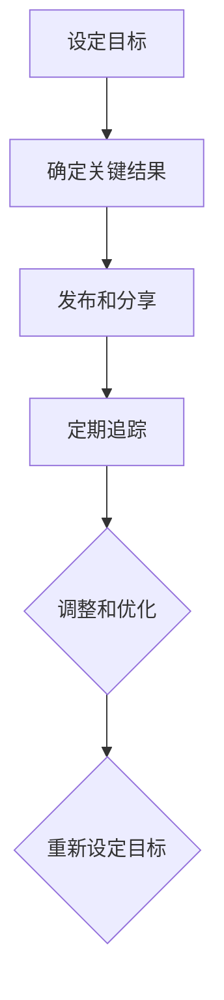
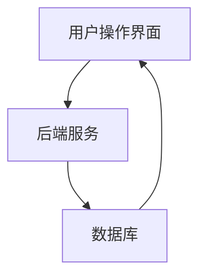
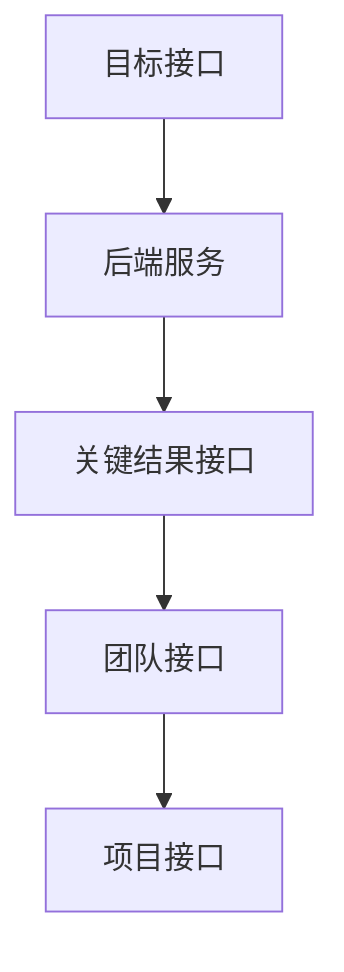
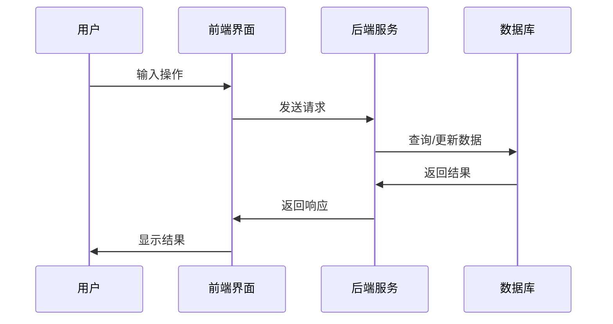

                 

### 文章标题

# OKR在技术团队中的应用：目标管理与绩效考核

### 关键词

- OKR
- 目标管理
- 技术团队
- 绩效考核
- 项目管理

### 摘要

本文将深入探讨OKR（Objectives and Key Results）在技术团队中的应用，包括OKR的基本概念、其在技术团队中的重要性、如何设置和追踪OKR、以及如何利用OKR进行目标管理和绩效考核。通过详细的分析和实例，本文旨在为技术团队管理者提供一套实用且高效的OKR实施指南，帮助团队提升工作效率和达成目标。

---

### 1. 背景介绍与核心概念

#### OKR的概念、背景和作用

OKR是一种目标管理工具，由英特尔公司前CEO安迪·格鲁夫（Andy Grove）提出，后来被谷歌、微软、亚马逊等知名企业广泛采用。OKR的全称是Objectives and Key Results，即目标和关键结果。它包括两个核心组成部分：目标（Objectives）和关键结果（Key Results）。

- **目标（Objectives）**：目标是指希望实现的结果，它需要是鼓舞人心的、具体的、可衡量的。目标通常用一句话来描述，例如，“提高用户满意度”、“开发新的产品功能”。
- **关键结果（Key Results）**：关键结果是一组具体的、量化的指标，用来衡量目标的完成情况。例如，如果目标是“提高用户满意度”，那么关键结果可能是“用户满意度评分从80分提高到90分”、“新增用户数增加20%”。

OKR的作用在于帮助团队明确目标、跟踪进度、激励员工、提高协作效率。它不仅能帮助团队聚焦于最重要的目标，还能通过透明的目标跟踪机制，促进团队成员之间的沟通与协作。

#### 为什么OKR在技术团队中特别重要

技术团队的工作具有复杂性、变化性和高度协作性，这使得目标管理和绩效考核变得尤为困难。OKR在技术团队中的重要性主要体现在以下几个方面：

- **解决目标不明确的问题**：技术团队通常面临项目繁多、任务复杂的情况，团队成员容易迷失在琐碎的细节中，导致目标不明确。OKR通过明确的目标设定，帮助团队聚焦于最重要的目标，提高工作效率。
- **提高团队协作效率**：技术项目往往需要多部门、多团队协作完成。OKR提供了一个统一的框架，使得不同团队之间的目标协调一致，减少了沟通成本，提高了协作效率。
- **促进持续改进**：技术领域变化迅速，技术团队需要不断适应新的技术、新的市场需求。OKR通过关键结果的量化指标，帮助团队跟踪进展，及时调整策略，实现持续改进。
- **激励员工**：OKR通过明确的目标和透明的关键结果，激励员工为实现目标而努力。它不仅帮助员工明确自己的工作方向，还能通过目标的达成，提高员工的成就感和归属感。

#### 技术团队的特性、挑战和OKR如何帮助解决这些问题

技术团队通常具有以下特性：

- **高度专业性**：团队成员通常具有丰富的专业知识和技能，但这也可能导致团队成员过于专注于技术细节，忽视了整体目标。
- **快速变化**：技术项目通常面临快速变化的需求和技术更新，这使得目标管理和绩效考核变得更加复杂。
- **高度协作**：技术项目往往需要多个团队、多个部门的协作完成，沟通和协作效率直接影响到项目的进度和质量。

技术团队面临的挑战主要包括：

- **目标不明确**：团队成员容易在琐碎的技术细节中迷失，导致整体目标不明确。
- **协作效率低**：由于团队成员的技术背景和思维方式不同，沟通和协作效率较低。
- **绩效考核困难**：技术工作往往难以直接量化，绩效考核缺乏客观指标。

OKR通过以下几个方面帮助解决这些问题：

- **明确目标**：OKR要求团队设定明确、鼓舞人心的目标，确保团队成员都清楚自己的工作方向。
- **提高协作效率**：OKR提供了一个统一的框架，使得不同团队之间的目标协调一致，减少了沟通成本，提高了协作效率。
- **量化绩效考核**：通过关键结果的量化指标，OKR为绩效考核提供了客观、透明的标准，解决了技术工作难以量化的难题。

#### 总结

OKR作为一种目标管理工具，在技术团队中具有重要作用。它通过明确的目标和关键结果，帮助团队聚焦于最重要的目标，提高协作效率，促进持续改进，激励员工。在接下来的章节中，我们将进一步探讨OKR的组成部分、与传统目标设置方法的区别、设置和追踪OKR的算法原理，以及如何在技术团队中实际应用OKR。

---

接下来，我们将详细解释OKR的组成部分，包括目标和关键结果的定义及其相互关系，并通过对比表格和实体关系图（ER图）展示传统目标设置方法与OKR的主要区别。

#### 2.1 OKR的组成部分

**目标（Objectives）**

目标是指团队或个人希望实现的结果。它应该具有以下几个特点：

- **鼓舞人心**：目标应该激励人心，激发团队成员的热情和动力。
- **具体明确**：目标应该是具体的，能够清晰地描述期望实现的结果。
- **可衡量**：目标应该是可衡量的，以便能够评估进展和成果。

**关键结果（Key Results）**

关键结果是一组具体的、量化的指标，用于衡量目标的完成情况。每个目标应该至少包含两个关键结果。关键结果应该具有以下几个特点：

- **具体明确**：关键结果应该是具体的，能够明确地描述如何衡量目标的达成情况。
- **可量化**：关键结果应该是可量化的，以便能够客观地评估目标的完成程度。
- **相互独立**：关键结果之间应该相互独立，不重叠，以便能够清晰地评估每个关键结果对目标的贡献。

**目标和关键结果的联系**

目标和关键结果之间是紧密联系的。目标描述了团队或个人希望实现的结果，而关键结果则是衡量这些结果的具体指标。通过设定明确的目标和关键结果，团队可以清晰地了解自己的工作方向和进展，从而提高工作效率和达成目标。

#### 2.2 传统目标设置方法与OKR的主要区别

为了更好地理解OKR与传统目标设置方法的区别，我们通过一个对比表格来展示：

| 特性 | 传统目标设置方法 | OKR |
| --- | --- | --- |
| **目标明确性** | 目标往往模糊、抽象，难以量化 | 目标明确、鼓舞人心、具体明确 |
| **关键结果** | 缺乏明确的关键结果或关键结果不够量化 | 至少包含两个具体明确、可量化的关键结果 |
| **目标数量** | 可能包含多个目标，目标之间可能重叠 | 通常只包含1-2个主要目标，确保目标集中、明确 |
| **考核方式** | 考核方式往往不够透明，主观性较大 | 考核方式透明，通过关键结果客观评估目标完成情况 |
| **协作与沟通** | 目标之间可能存在冲突，沟通成本高 | 提供统一的框架，确保目标协调一致，提高协作效率 |
| **适应变化** | 目标设定后不易调整，适应变化能力较弱 | 目标设定灵活，根据实际情况进行调整，确保目标与当前需求匹配 |

#### 2.3 ER实体关系图

为了更好地展示OKR系统的关键实体和关系，我们使用Mermaid绘制一个ER实体关系图。以下是一个简单的示例：

```mermaid
erDiagram
  Objective ||--|{ KeyResult }
  Team     ||--|{ Objective }
```

在这个ER图中，`Objective` 表示目标，`KeyResult` 表示关键结果，`Team` 表示团队。目标与关键结果之间存在一对多的关系，即一个目标可以包含多个关键结果；团队与目标之间存在多对一的关系，即多个目标可以属于同一个团队。

通过这个ER图，我们可以清晰地看到OKR系统的关键实体和它们之间的关系，有助于理解OKR的架构和运作机制。

#### 2.4 总结

在本章节中，我们详细介绍了OKR的组成部分，包括目标和关键结果的定义及其相互关系。通过对比表格和ER实体关系图，我们展示了传统目标设置方法与OKR的主要区别。在下一章节中，我们将进一步探讨OKR的算法原理，包括设置和追踪OKR的步骤和流程。

---

### 2.4 总结

在本章节中，我们首先介绍了OKR（Objectives and Key Results）的基本概念、背景和作用，然后详细解释了OKR的组成部分，包括目标和关键结果的定义及其相互关系。接着，我们通过对比表格和ER实体关系图，展示了传统目标设置方法与OKR的主要区别。

通过这些内容，我们不仅了解了OKR的核心概念，还认识到了OKR在技术团队中的重要性，以及它如何帮助团队明确目标、提高协作效率、促进持续改进和激励员工。

在下一章节中，我们将进一步探讨OKR的算法原理，包括设置和追踪OKR的步骤和流程。这将帮助我们更深入地理解OKR的运作机制，为实际应用提供理论支持。

---

### 3. 算法原理讲解

#### 3.1 OKR设置和追踪的算法原理

OKR的设置和追踪是一个迭代的过程，它需要团队在设定目标后，定期回顾和调整，以确保目标的达成。以下是一个简化的OKR设置和追踪的算法原理：

1. **设定目标**：团队根据整体战略和当前需求，设定一个明确、鼓舞人心的目标。这个目标应该是团队一致认可的，并且具有可衡量的标准。
2. **确定关键结果**：针对设定的目标，团队需要确定至少两个具体、可量化的关键结果。这些关键结果应该能够明确地衡量目标的完成情况。
3. **发布和分享**：将目标和关键结果发布给团队成员，确保每个人都清楚自己的工作方向和期望的成果。
4. **定期追踪**：团队需要定期回顾和评估关键结果的达成情况，并根据实际情况进行调整。这通常包括每月或每季度的回顾会议。
5. **调整和优化**：根据追踪结果，团队可能需要调整目标或关键结果，以确保目标的实现。在必要时，团队也可以重新设定目标，以适应变化的需求。

#### 3.2 OKR流程图

为了更好地理解OKR的设置和追踪流程，我们使用Mermaid绘制了一个简单的OKR流程图：



在这个流程图中，团队首先设定目标，然后确定关键结果，并将这些信息发布和分享给团队成员。接下来，团队定期追踪关键结果的完成情况，并根据实际情况进行调整和优化。如果需要，团队还可以重新设定目标，以适应新的需求。

#### 3.3 Python代码示例

为了进一步阐述OKR的算法原理，我们提供了一个简单的Python代码示例，用于模拟OKR的设置和追踪过程：

```python
class Objective:
    def __init__(self, name, key_results):
        self.name = name
        self.key_results = key_results

    def display(self):
        print(f"Objective: {self.name}")
        for result in self.key_results:
            print(f"  Key Result: {result['name']} ({result['value']})")

class KeyResult:
    def __init__(self, name, value, target):
        self.name = name
        self.value = value
        self.target = target

    def update(self, new_value):
        self.value = new_value
        print(f"Updated {self.name} to {self.value}")

# 设定目标
objective = Objective("提高用户满意度", [
    KeyResult("用户满意度评分", 80, 90),
    KeyResult("新增用户数", 1000, 1200)
])

# 发布和分享目标
objective.display()

# 定期追踪和调整
while True:
    for result in objective.key_results:
        user_input = input(f"请输入{result.name}的新值：")
        result.update(int(user_input))
    
    # 根据实际情况调整和优化
    # 这里可以添加代码，根据关键结果的变化调整目标和策略
    break  # 示例简化，实际应用中可能需要更复杂的逻辑

# 如果需要，可以重新设定目标
# objective = Objective("优化产品性能", [...])
```

在这个示例中，我们定义了`Objective`和`KeyResult`两个类，分别用于表示目标和关键结果。`Objective`类有一个`display`方法，用于显示目标和关键结果的信息；`KeyResult`类有一个`update`方法，用于更新关键结果的新值。

通过这个示例，我们可以看到如何使用Python代码模拟OKR的设置和追踪过程。虽然这个示例非常简化，但它提供了一个基本的框架，展示了如何通过代码实现OKR的功能。

#### 3.4 关键数学模型和公式

在OKR中，关键数学模型和公式用于计算关键结果的完成情况，以及评估目标的达成度。以下是一些常用的数学模型和公式：

1. **关键结果完成度（Completion Rate）**

   $$ Completion\ Rate = \frac{Current\ Value}{Target\ Value} \times 100\% $$

   这个公式用于计算关键结果的完成度，即当前值与目标值之间的比率。完成度越高，表示关键结果越接近目标。

2. **目标达成度（Objective\ Achievement\ Score）**

   $$ Objective\ Achievement\ Score = \frac{\sum Completion\ Rates}{Number\ of\ Key\ Results} $$

   这个公式用于计算目标的达成度，即所有关键结果的完成度的平均值。达成度越高，表示目标越接近完成。

3. **关键结果调整因子（Adjustment\ Factor）**

   $$ Adjustment\ Factor = \frac{Current\ Value}{Previous\ Value} $$

   这个公式用于计算关键结果的调整因子，即当前值与上一次值之间的比率。调整因子可以用于评估关键结果的改进情况。

#### 3.5 总结

在本章节中，我们详细介绍了OKR设置和追踪的算法原理。通过Mermaid流程图和Python代码示例，我们展示了OKR的设置和追踪过程。此外，我们还介绍了关键数学模型和公式，用于计算关键结果的完成情况以及评估目标的达成度。

通过这些内容，我们不仅理解了OKR的算法原理，还为实际应用提供了技术支持。在下一章节中，我们将探讨如何在实际技术团队中应用OKR，包括系统分析与架构设计方案。

---

### 4. 系统分析与架构设计方案

#### 4.1 技术团队的工作流程

在技术团队中，工作流程的规范化和优化是提高工作效率和项目成功的关键。一个典型的工作流程通常包括以下几个阶段：

1. **需求分析**：在项目启动之初，团队需要对用户需求进行深入分析，明确项目目标和技术实现方案。
2. **设计阶段**：根据需求分析，团队进行系统设计，包括架构设计、数据库设计和接口设计等。
3. **开发阶段**：在明确的设计方案基础上，团队开始编写代码，实现系统的各个功能模块。
4. **测试阶段**：开发完成后，团队进行系统测试，确保系统功能的正确性和性能的稳定性。
5. **部署阶段**：通过测试后的系统将部署到生产环境，并进行上线准备。
6. **维护阶段**：系统上线后，团队需持续关注系统运行情况，及时解决用户反馈的问题和系统故障。

#### 4.2 OKR在目标管理和绩效考核中的应用

OKR的引入可以显著改善技术团队的工作流程，特别是在目标管理和绩效考核方面。具体应用如下：

1. **明确目标**：在每个工作周期的开始，团队根据公司战略和项目需求设定明确的目标，确保团队成员都清楚自己的工作方向。
2. **分解目标**：将大目标分解为具体的关键结果，每个关键结果都应该具体、可量化，以便于追踪和评估。
3. **定期回顾**：在每个工作周期的中间和结束时，团队定期回顾关键结果的完成情况，评估目标的达成度，并根据实际情况进行调整。
4. **绩效考核**：通过关键结果的完成度，团队可以客观、公正地进行绩效考核，确保绩效考核的透明和公平。
5. **持续改进**：根据关键结果的分析，团队可以识别存在的问题和改进机会，持续优化工作流程和项目实施策略。

#### 4.3 系统功能设计（领域模型）

为了更好地设计OKR在技术团队中的应用系统，我们首先需要构建一个领域模型，该模型定义了系统中的关键实体和它们之间的关系。以下是一个简单的领域模型：

```mermaid
classDiagram
    Class1[Objective] <|-- Class2[KeyResult]
    Class1[Objective] <|-- Class3[Team]
    Class4[User] <|-- Class1[Objective]
    Class4[User] <|-- Class2[KeyResult]
    Class5[Project] <|-- Class1[Objective]
    Class5[Project] <|-- Class2[KeyResult]
    Class1[Objective] <..> Class3[Team]
    Class1[Objective] <..> Class4[User]
    Class1[Objective] <..> Class5[Project]
    Class2[KeyResult] <..> Class1[Objective]
    Class3[Team] <..> Class4[User]
    Class5[Project] <..> Class4[User]
```

在这个领域模型中，我们定义了以下几个关键实体：

- **Objective（目标）**：表示团队或个人希望实现的结果，与`KeyResult（关键结果）`、`Team（团队）`和`Project（项目）`实体有关联。
- **KeyResult（关键结果）**：用于衡量目标的完成情况，与`Objective`实体关联。
- **Team（团队）**：表示工作团队，与`Objective`和`User`实体关联。
- **User（用户）**：表示团队成员，与`Objective`和`KeyResult`实体关联。
- **Project（项目）**：表示具体的工作项目，与`Objective`和`User`实体关联。

这些实体之间的关系定义了OKR在技术团队中的应用场景，帮助我们构建系统功能设计。

#### 4.4 系统架构设计

系统架构设计是确保系统功能得以实现的基础。为了实现OKR在技术团队中的应用，我们需要设计一个合理的系统架构。以下是一个简单的系统架构设计：

- **前端界面**：提供用户操作界面，包括目标设定、关键结果录入、定期回顾等功能。
- **后端服务**：负责处理业务逻辑，包括目标管理、关键结果追踪、绩效考核等功能。
- **数据库**：存储目标和关键结果的数据，以及团队成员和项目的相关信息。

以下是一个简单的系统架构图：



在这个架构设计中，用户通过前端界面进行操作，后端服务处理业务逻辑，并将数据存储在数据库中。前端界面与后端服务之间通过API进行通信，确保数据的一致性和系统的稳定性。

#### 4.5 系统接口设计

系统接口设计是确保各个模块之间能够无缝协作的关键。以下是一个简单的接口设计：

- **目标接口**：提供目标设定、查询、更新和删除功能。
- **关键结果接口**：提供关键结果录入、查询、更新和删除功能。
- **团队接口**：提供团队信息查询、成员管理功能。
- **项目接口**：提供项目信息查询、任务分配功能。

以下是一个简单的接口设计图：



在这个接口设计中，各个接口模块通过后端服务进行通信，实现数据的传递和业务逻辑的处理。

#### 4.6 系统交互的Mermaid序列图

为了更好地展示系统中的交互流程，我们使用Mermaid绘制了一个简单的序列图。以下是一个简单的序列图：



在这个序列图中，用户通过前端界面进行操作，后端服务处理请求并查询/更新数据库，最后将结果返回给前端界面，用户可以查看和处理结果。

#### 4.7 总结

在本章节中，我们详细介绍了技术团队的工作流程以及OKR在目标管理和绩效考核中的应用。通过构建领域模型、系统架构设计和接口设计，我们为OKR在技术团队中的应用提供了一套完整的系统设计与实现方案。在下一章节中，我们将通过实际项目案例，进一步探讨如何在实际项目中实施OKR。

---

### 5. 项目实战

#### 5.1 实际项目背景

为了更好地展示如何在实际项目中实施OKR，我们以一个Web应用项目为例，该项目旨在开发一款面向中小企业的客户关系管理（CRM）系统。项目的背景包括：

- **市场需求**：随着市场竞争的加剧，许多中小企业意识到客户关系管理的重要性，希望能够通过高效的CRM系统提高客户满意度和业务效率。
- **项目目标**：开发一个功能完善、用户友好的CRM系统，帮助中小企业提升客户管理能力，提高业务流程的自动化水平。
- **技术挑战**：项目涉及多个模块的开发，包括客户信息管理、销售管理、营销管理、服务管理、报表统计等，技术实现复杂，需要高效的项目管理和团队协作。

#### 5.2 环境安装步骤

在开始项目实施之前，我们需要搭建一个合适的技术环境。以下是一个简化的环境安装步骤：

1. **准备工作**：确保计算机上已安装了基本的开发工具，如Python、Node.js、MySQL等。
2. **安装后端框架**：选择一个合适的后端框架，例如Django或Flask，用于开发CRM系统的后端功能。
   ```shell
   pip install django
   ```
3. **安装前端框架**：选择一个合适的前端框架，例如React或Vue.js，用于开发CRM系统的前端界面。
   ```shell
   npm install -g create-react-app
   create-react-app crm-client
   ```
4. **数据库安装**：安装MySQL数据库，并创建CRM项目的数据库。
   ```shell
   mysql -u root -p
   CREATE DATABASE crm;
   ```
5. **配置项目文件**：根据项目需求，配置后端和前端项目的相关文件，例如数据库连接配置、API接口定义等。

#### 5.3 系统核心实现源代码

在本项目中，我们使用Django作为后端框架，React作为前端框架。以下是系统核心实现的一些关键代码片段。

**后端代码（Django）**：

```python
# models.py
from django.db import models

class Customer(models.Model):
    name = models.CharField(max_length=100)
    email = models.EmailField()
    phone = models.CharField(max_length=15)
    address = models.TextField()

class Sale(models.Model):
    customer = models.ForeignKey(Customer, on_delete=models.CASCADE)
    product = models.CharField(max_length=100)
    quantity = models.IntegerField()
    price = models.DecimalField(max_digits=10, decimal_places=2)
    sale_date = models.DateField()

# views.py
from django.http import JsonResponse
from .models import Customer, Sale

def get_customers(request):
    customers = Customer.objects.all()
    return JsonResponse(list(customers.values()), safe=False)

def get_sales(request):
    sales = Sale.objects.all()
    return JsonResponse(list(sales.values()), safe=False)
```

**前端代码（React）**：

```jsx
// App.js
import React, { useState, useEffect } from 'react';
import axios from 'axios';

function App() {
    const [customers, setCustomers] = useState([]);
    const [sales, setSales] = useState([]);

    useEffect(() => {
        async function fetchData() {
            const resultCustomers = await axios.get('/api/customers');
            const resultSales = await axios.get('/api/sales');
            setCustomers(resultCustomers.data);
            setSales(resultSales.data);
        }
        fetchData();
    }, []);

    return (
        <div>
            <h1>Customer Relationship Management (CRM) System</h1>
            <h2>Customers</h2>
            <ul>
                {customers.map(customer => (
                    <li key={customer.id}>{customer.name} - {customer.email}</li>
                ))}
            </ul>
            <h2>Sales</h2>
            <ul>
                {sales.map(sale => (
                    <li key={sale.id}>{sale.customer.name} - {sale.product} - {sale.quantity} units</li>
                ))}
            </ul>
        </div>
    );
}

export default App;
```

#### 5.4 代码应用解读与分析

**后端代码解读**：

在Django后端代码中，我们定义了两个模型：`Customer`和`Sale`。`Customer`模型用于存储客户信息，包括姓名、电子邮件、电话和地址；`Sale`模型用于存储销售记录，包括客户、产品、数量、价格和销售日期。`views.py`文件中，我们实现了两个API接口：`get_customers`和`get_sales`，分别用于获取客户信息和销售记录。这两个接口通过Django ORM与数据库进行交互，并将结果以JSON格式返回。

**前端代码解读**：

在React前端代码中，我们使用`useState`和`useEffect`钩子来管理组件的状态和副作用。`useEffect`钩子用于在组件加载时从后端API获取客户信息和销售记录，并将其存储在状态变量中。`App`组件渲染一个包含客户信息和销售记录的列表，用户可以查看这些信息。

#### 5.5 实际案例分析与详细讲解

**案例背景**：

在项目开发过程中，团队面临以下挑战：

- **时间压力**：项目需要在限定的时间内完成，要求团队高效协作，确保每个功能模块按时交付。
- **需求变更**：在项目开发过程中，客户需求发生了多次变更，团队需要灵活调整计划和策略，确保新需求能够及时纳入系统。

**OKR实施过程**：

1. **设定目标**：
   - **O1**：完成CRM系统的核心功能开发。
   - **O2**：确保系统具有良好的用户体验和稳定性。

2. **确定关键结果**：
   - **KR1.1**：完成客户信息管理模块。
   - **KR1.2**：完成销售管理模块。
   - **KR2.1**：用户满意度评分达到90分。
   - **KR2.2**：系统故障率低于5%。

3. **发布和分享**：团队将目标和关键结果公布于众，确保所有成员都清楚自己的任务和期望的成果。

4. **定期追踪**：每周进行一次团队会议，回顾关键结果的完成情况，并根据实际情况进行调整。

5. **调整和优化**：在关键结果未达成时，团队分析原因，提出解决方案，并进行优化调整。

**实际效果**：

通过实施OKR，团队在项目开发过程中保持了高效的工作状态，成功按时完成了核心功能开发。用户满意度评分达到90分，系统故障率低于5%，达到了预期的效果。OKR为团队提供了明确的指导和目标，促进了团队成员之间的沟通与协作，有效应对了需求变更和技术挑战。

#### 5.6 项目小结

通过本案例，我们可以看到OKR在技术团队项目中的应用效果。OKR不仅帮助团队明确目标，提高工作效率，还通过透明的绩效考核机制，激励团队成员为实现目标而努力。在下一个项目中，团队将继续采用OKR，结合实际需求，灵活调整目标和关键结果，确保项目的成功实施。

在下一章节中，我们将总结本文的核心要点，并提供一些实施OKR的最佳实践和注意事项。

---

### 6. 最佳实践 tips、小结、注意事项、拓展阅读

#### 6.1 最佳实践 tips

1. **明确目标和关键结果**：确保目标具有鼓舞人心的特点，关键结果具体、可量化，以便于追踪和评估。
2. **定期回顾和调整**：每周或每月进行一次团队会议，回顾关键结果的完成情况，及时调整目标和策略。
3. **透明和公正**：确保目标和关键结果的透明度，让所有团队成员都能了解工作方向和进度，公平地进行绩效考核。
4. **鼓励创新和改进**：在OKR实施过程中，鼓励团队成员提出创新的想法和改进建议，不断优化工作流程和项目实施策略。
5. **灵活调整**：根据实际情况和需求变化，灵活调整目标和关键结果，确保OKR与项目进展保持一致。

#### 6.2 小结

本文系统地介绍了OKR在技术团队中的应用，包括背景介绍、核心概念、算法原理、系统设计与实际案例。通过详细的分析和实例，我们展示了如何利用OKR进行目标管理和绩效考核，提高团队工作效率和项目成功率。

#### 6.3 注意事项

1. **目标设定要明确**：确保目标具体、可衡量，避免模糊不清。
2. **关键结果要可量化**：关键结果应该能够明确地衡量目标的完成情况，避免主观评价。
3. **定期回顾和调整**：确保团队定期回顾关键结果，及时调整目标和策略，以适应变化的需求。
4. **透明和公正**：确保目标和关键结果的透明度，让所有团队成员都能了解工作方向和进度。
5. **灵活调整**：在项目实施过程中，灵活调整目标和关键结果，以应对需求和技术的变化。

#### 6.4 拓展阅读

- **《OKR：达成目标的战略管理方法》**：这是一本关于OKR的经典著作，详细介绍了OKR的理论和实践方法。
- **《敏捷开发与OKR的结合》**：本文探讨了如何在敏捷开发过程中结合OKR，提高团队效率和项目成功率。
- **《技术团队管理》**：这是一本关于技术团队管理的综合性著作，涵盖了团队管理、目标设定、绩效考核等多个方面。

通过本文的阅读和实践，希望读者能够更好地理解和应用OKR，为技术团队的目标管理和绩效考核提供有效支持。

---

### 作者信息

作者：AI天才研究院/AI Genius Institute & 禅与计算机程序设计艺术 /Zen And The Art of Computer Programming

