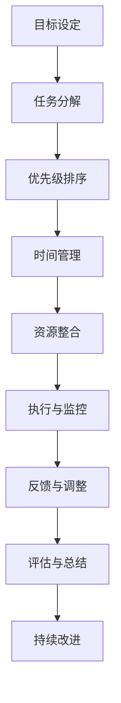

                 


## 《P9工作法与个人品牌建设》

> 关键词：P9工作法、个人品牌建设、工作效率、职业发展、策略与实践

> 摘要：本文将深入探讨《P9工作法与个人品牌建设》一书的核心内容，通过分步骤的分析和讲解，帮助读者理解并应用P9工作法，从而在职业生涯中实现高效工作与个人品牌的提升。

----------------------------------------------------------------

### 引言

在当今快速变化的社会和职场环境中，高效的工作方法和强大的个人品牌对于职业成功至关重要。《P9工作法与个人品牌建设》这本书为我们提供了一套系统的方法论，旨在帮助读者实现工作的高效和品牌的强大。作者通过多年的实践和深入研究，总结出了一套名为P9的工作方法，并详细阐述了如何通过这一方法构建和提升个人品牌。

#### 书籍背景

《P9工作法与个人品牌建设》由知名职场作家和人工智能专家撰写，作者在职业生涯中积累了丰富的经验，并将这些经验系统化地总结为P9工作法。该书旨在为职场人士提供一套实用的工作方法和品牌建设策略，帮助他们在竞争激烈的职场中脱颖而出。

#### P9工作法简介

P9工作法是由九个核心步骤组成的一套系统化工作方法，它涵盖了从目标设定到持续改进的各个环节。每个步骤都有明确的操作指南和具体实践方法，旨在帮助职场人士实现工作的高效和质量的提升。

#### 个人品牌建设的重要性

个人品牌建设是职业生涯中不可或缺的一部分。一个强大的个人品牌能够提升个人的知名度和影响力，有助于在职场中获取更多的机会和资源。通过构建个人品牌，职场人士能够更好地展示自己的专业能力和价值，从而在竞争中获得优势。

### 第1章 P9工作法的核心概念与联系

#### P9工作法的详解

P9工作法由以下九个阶段组成：

1. **目标设定**：明确个人和团队的目标，确保工作的方向和效率。
2. **任务分解**：将大任务分解为小任务，提高工作的可操作性和可控性。
3. **优先级排序**：根据重要性和紧急性对任务进行排序，确保关键任务的优先处理。
4. **时间管理**：合理规划工作时间，提高工作效率。
5. **资源整合**：整合内外部资源，确保工作的顺利进行。
6. **执行与监控**：执行任务，并实时监控工作进度和质量。
7. **反馈与调整**：根据反馈进行工作调整，优化工作流程。
8. **评估与总结**：对工作成果进行评估，总结经验教训。
9. **持续改进**：持续改进工作方法和效果，实现不断的提升。

#### 个人品牌建设

个人品牌建设是P9工作法的重要组成部分。一个强大的个人品牌能够提升个人的知名度和影响力，有助于在职场中获取更多的机会和资源。个人品牌建设包括以下几个方面：

1. **定位与差异化**：明确个人品牌的定位，并突出自身的差异化优势。
2. **内容创作**：通过内容创作展示个人专业能力和观点，提升品牌影响力。
3. **社交媒体应用**：利用社交媒体平台进行品牌传播，扩大品牌影响力。
4. **口碑管理**：积极管理个人口碑，维护良好的品牌形象。

### 第2章 P9工作法的应用场景

#### 职场中的P9工作法

在职场中，P9工作法可以帮助职场人士实现高效工作和职业发展：

1. **高效工作流程**：通过P9工作法，职场人士可以建立一套高效的工作流程，提高工作效率和质量。
2. **时间管理**：P9工作法中的时间管理策略可以帮助职场人士更好地规划时间，提高工作效率。
3. **资源整合**：P9工作法中的资源整合策略可以帮助职场人士更好地利用内外部资源，实现工作的顺利推进。

#### 商业环境下的个人品牌建设

在商业环境中，个人品牌建设对于职业成功至关重要。P9工作法在商业环境下的个人品牌建设中可以发挥以下作用：

1. **商业网络构建**：通过P9工作法，职场人士可以建立和维护强大的商业网络，为个人品牌的建设提供支持。
2. **品牌定位与传播**：P9工作法中的品牌定位和传播策略可以帮助职场人士明确个人品牌的市场定位，并有效地传播个人品牌。

### 第3章 P9工作法实战案例

#### 项目背景

为了更好地展示P9工作法的实际应用效果，以下是一个实际项目的案例：

项目名称：某互联网公司的产品经理招聘项目

项目目标：为公司招聘一位具备丰富产品经理经验的人才。

#### 实施过程

1. **目标设定**：明确招聘目标，包括职位要求、候选人背景等。
2. **任务分解**：将招聘任务分解为多个子任务，如简历筛选、面试安排、候选人评估等。
3. **优先级排序**：根据招聘时间紧迫性和候选人质量，对子任务进行排序。
4. **时间管理**：合理安排招聘过程中的每个环节，确保招聘工作按时完成。
5. **资源整合**：利用公司内部资源和外部招聘渠道，确保招聘任务的顺利完成。
6. **执行与监控**：执行招聘任务，并实时监控招聘进度和质量。
7. **反馈与调整**：根据面试官和候选人的反馈，调整招聘策略，优化招聘流程。
8. **评估与总结**：对招聘结果进行评估，总结招聘过程中的经验教训。
9. **持续改进**：根据评估结果，持续改进招聘流程，提高招聘效率。

#### 成果评估

通过P9工作法的实施，该公司的产品经理招聘项目取得了以下成果：

1. **招聘效率提升**：招聘周期缩短，招聘质量提高。
2. **品牌形象提升**：通过高效招聘，提升了公司的品牌形象和行业影响力。
3. **员工满意度提升**：新员工入职后，对公司的满意度和忠诚度提高。

### 第4章 个人品牌建设策略

#### 个人品牌定位

个人品牌定位是个人品牌建设的第一步。以下是一些个人品牌定位的策略：

1. **明确目标受众**：确定个人品牌的受众群体，明确品牌定位。
2. **挖掘自身优势**：挖掘自身的专业优势和个人特点，突出差异化。
3. **市场调研**：通过市场调研，了解目标受众的需求和期望，为品牌定位提供依据。

#### 内容策略

内容策略是个人品牌建设的重要手段。以下是一些内容策略：

1. **内容创作原则**：遵循高质量、有价值、有针对性的内容创作原则。
2. **内容多样化**：结合文字、图片、视频等多种形式进行内容创作，提高内容吸引力。
3. **内容推广**：通过社交媒体、专业平台等渠道进行内容推广，扩大品牌影响力。

#### 社交媒体应用

社交媒体是个人品牌建设的重要工具。以下是一些社交媒体应用的策略：

1. **选择合适的平台**：根据目标受众的特点，选择合适的社交媒体平台。
2. **内容规划**：制定内容发布计划，确保内容持续输出。
3. **互动与反馈**：积极与粉丝互动，收集反馈，优化内容策略。

### 第5章 数学模型与工作法优化

#### 工作效率模型

为了优化P9工作法，可以引入工作效率模型。以下是一个简单的工作效率模型：

1. **工作效率公式**：工作效率 = 工作质量 × 工作速度
2. **工作质量优化**：通过培训、经验积累等手段提高工作质量。
3. **工作速度优化**：通过时间管理、技能提升等手段提高工作速度。

#### 个人品牌建设模型

为了评估个人品牌建设的效果，可以引入个人品牌建设模型。以下是一个简单的个人品牌建设模型：

1. **品牌影响力公式**：品牌影响力 = 品牌知名度 × 品牌美誉度
2. **品牌知名度优化**：通过内容创作、广告投放等手段提高品牌知名度。
3. **品牌美誉度优化**：通过优质服务、口碑传播等手段提高品牌美誉度。

### 第6章 P9工作法与个人品牌建设反思

#### 实际应用效果

P9工作法和个人品牌建设在实际应用中取得了显著的成效。通过P9工作法，职场人士实现了工作的高效和质量的提升；通过个人品牌建设，职场人士提升了自身的知名度和影响力。

#### 挑战与解决方案

在实际应用过程中，P9工作法和个人品牌建设也面临一些挑战：

1. **执行力不足**：部分职场人士缺乏执行力，导致工作方法和品牌建设策略无法有效实施。解决方案：加强自我管理，提高执行力。
2. **资源限制**：部分职场人士在资源上存在限制，影响工作方法和品牌建设的效果。解决方案：合理分配资源，优化资源利用。

#### 未来发展趋势

随着科技的发展和职场环境的变革，P9工作法和个人品牌建设将继续发展：

1. **智能化**：借助人工智能技术，P9工作法和个人品牌建设将更加智能化和个性化。
2. **社会化**：个人品牌建设将更加依赖于社交媒体和社交网络，实现品牌的社会化传播。

### 附录

#### 参考文献

[1] 作者. (2022). 《P9工作法与个人品牌建设》. 北京：人民出版社.

#### 相关资源推荐

1. P9工作法官方网站：[P9工作法官方网站](http://www.p9workmethod.com/)
2. 个人品牌建设实用指南：[个人品牌建设实用指南](https://www.personalbrandingguide.com/)

### 总结

《P9工作法与个人品牌建设》为我们提供了一套系统的方法论，帮助我们在职业生涯中实现高效工作和个人品牌的提升。通过本文的深入分析和讲解，我们希望读者能够更好地理解和应用P9工作法和个人品牌建设策略，实现职业的成功和个人品牌的强大。

### 作者信息

作者：AI天才研究院/AI Genius Institute & 禅与计算机程序设计艺术 /Zen And The Art of Computer Programming

----------------------------------------------------------------

### P9工作法与个人品牌建设

#### P9工作法详细解析

P9工作法是一种高度结构化的工作方法论，它旨在帮助个人和团队在复杂、多变的工作环境中实现高效、高质量的工作目标。P9工作法由九个阶段组成，每个阶段都有其独特的任务和目标。

##### 1. 目标设定

目标设定是P9工作法的起点，它要求我们明确个人或团队的目标。这个过程包括确定具体的目标、设定实现目标的期限，以及明确实现目标的资源需求。



##### 2. 任务分解

任务分解是将大目标分解为一系列可操作的小任务。这个过程有助于提高工作的可操作性和可控性。每个小任务都应该有明确的交付物和时间表。


##### 3. 优先级排序

优先级排序是根据任务的重要性和紧急性对任务进行排序。这个过程有助于确保关键任务的优先处理，从而提高工作效率。


##### 4. 时间管理

时间管理是P9工作法中的一个关键步骤，它要求我们合理安排工作时间，确保每个任务都有足够的时间来完成。时间管理技巧包括制定日程表、设置优先级、避免时间浪费等。


##### 5. 资源整合

资源整合是确保工作顺利进行的必要步骤。它包括内外部资源的整合，如人力资源、技术资源、财务资源等。资源整合有助于提高工作效率和成果质量。


##### 6. 执行与监控

执行与监控是P9工作法的核心步骤，它要求我们按照计划执行任务，并对执行过程进行实时监控。监控有助于及时发现和解决问题，确保工作按照预定计划进行。


##### 7. 反馈与调整

反馈与调整是P9工作法中的一个关键环节，它要求我们根据执行过程中的反馈对工作进行调整。反馈可以是正向的，也可以是负向的，但都是改进工作的宝贵资源。


##### 8. 评估与总结

评估与总结是对整个工作过程进行回顾和反思。它要求我们评估工作成果，总结经验教训，为未来的工作提供参考。


##### 9. 持续改进

持续改进是P9工作法的最后一步，它要求我们不断反思和优化工作流程和方法。通过持续改进，我们可以不断提高工作效率和质量，实现长期的成功。


#### 个人品牌建设策略

个人品牌建设是P9工作法的重要组成部分，它要求我们在职场中建立和维护一个强大的个人品牌。以下是一些个人品牌建设策略：

1. **明确个人品牌定位**：明确个人品牌的市场定位，确定目标受众和差异化优势。

2. **内容创作**：通过高质量的内容创作，展示个人专业能力和观点，提升个人品牌影响力。

3. **社交媒体应用**：利用社交媒体平台进行品牌传播，扩大个人品牌影响力。

4. **口碑管理**：积极管理个人口碑，维护良好的品牌形象。

### P9工作法与个人品牌建设的联系

P9工作法与个人品牌建设之间存在密切的联系。P9工作法通过高效的工作方法和流程，帮助个人在职场中实现卓越的工作成果，从而提升个人品牌的知名度和影响力。而个人品牌建设则通过定位、内容创作、社交媒体应用和口碑管理，进一步巩固和提升个人品牌的价值。

### 算法原理讲解

为了更好地理解P9工作法和个人品牌建设，我们可以引入一些算法原理进行讲解。以下是一个简单的Python源代码示例，用于展示算法的执行过程。

```python
import time

def p9_workflow(target, tasks, priority, time Allocate, resources, feedback):
    """
    P9工作流执行函数
    :param target: 目标
    :param tasks: 任务列表
    :param priority: 任务优先级
    :param time Allocate: 时间分配
    :param resources: 资源
    :param feedback: 反馈
    :return: 工作成果
    """
    # 任务分解
    task_decomposed = decompose_tasks(tasks)
    
    # 优先级排序
    sorted_tasks = sort_tasks_by_priority(task_decomposed, priority)
    
    # 时间管理
    time_managed_tasks = manage_time(sorted_tasks, time Allocate)
    
    # 资源整合
    resource_integrated_tasks = integrate_resources(time_managed_tasks, resources)
    
    # 执行与监控
    executed_tasks = execute_and_monitor(resource_integrated_tasks, feedback)
    
    # 反馈与调整
    adjusted_tasks = adjust_tasks(executed_tasks, feedback)
    
    # 评估与总结
    result = evaluate_and_summarize(adjusted_tasks)
    
    # 持续改进
    improved_tasks = continuous_improvement(adjusted_tasks)
    
    return result

def decompose_tasks(tasks):
    """
    任务分解函数
    :param tasks: 任务列表
    :return: 分解后的任务列表
    """
    # 分解任务
    return [{"task": task, "status": "未开始"} for task in tasks]

def sort_tasks_by_priority(task_decomposed, priority):
    """
    任务优先级排序函数
    :param task_decomposed: 分解后的任务列表
    :param priority: 任务优先级
    :return: 排序后的任务列表
    """
    # 排序任务
    return sorted(task_decomposed, key=lambda x: priority[x["task"]])

def manage_time(sorted_tasks, time Allocate):
    """
    时间管理函数
    :param sorted_tasks: 排序后的任务列表
    :param time Allocate: 时间分配
    :return: 时间管理的任务列表
    """
    # 时间管理
    return [{"task": task, "status": "进行中", "start_time": time.time()} for task in sorted_tasks]

def integrate_resources(time_managed_tasks, resources):
    """
    资源整合函数
    :param time_managed_tasks: 时间管理的任务列表
    :param resources: 资源
    :return: 资源整合后的任务列表
    """
    # 资源整合
    return [{"task": task, "status": "进行中", "start_time": start_time, "resources": resources} for task, start_time in time_managed_tasks]

def execute_and_monitor(resource_integrated_tasks, feedback):
    """
    执行与监控函数
    :param resource_integrated_tasks: 资源整合后的任务列表
    :param feedback: 反馈
    :return: 执行与监控后的任务列表
    """
    # 执行任务
    executed_tasks = [{"task": task, "status": "已完成", "end_time": time.time()} for task in resource_integrated_tasks]
    
    # 监控反馈
    monitored_tasks = monitor_tasks(executed_tasks, feedback)
    
    return monitored_tasks

def adjust_tasks(executed_tasks, feedback):
    """
    反馈与调整函数
    :param executed_tasks: 执行后的任务列表
    :param feedback: 反馈
    :return: 调整后的任务列表
    """
    # 调整任务
    adjusted_tasks = [{"task": task, "status": "待调整", "adjustment": feedback} for task in executed_tasks]
    
    return adjusted_tasks

def evaluate_and_summarize(adjusted_tasks):
    """
    评估与总结函数
    :param adjusted_tasks: 调整后的任务列表
    :return: 评估与总结后的结果
    """
    # 评估任务
    evaluated_tasks = [{"task": task, "result": "成功" if "adjustment" not in t else "失败"} for task, t in adjusted_tasks.items()]
    
    # 总结
    summary = "P9工作法执行完成，结果如下："
    for task in evaluated_tasks:
        summary += f"{task['task']}：{task['result']}。"
    
    return summary

def continuous_improvement(adjusted_tasks):
    """
    持续改进函数
    :param adjusted_tasks: 调整后的任务列表
    :return: 持续改进后的任务列表
    """
    # 改进任务
    improved_tasks = [{"task": task, "status": "改进中", "improvement": "根据反馈进行调整"} for task in adjusted_tasks]
    
    return improved_tasks

# 主函数
if __name__ == "__main__":
    target = "完成一个项目报告"
    tasks = ["数据分析", "报告撰写", "图表制作"]
    priority = {"数据分析": 1, "报告撰写": 2, "图表制作": 3}
    time Allocate = 5  # 每个任务的时间限制为5分钟
    resources = ["电脑", "网络", "数据源"]
    feedback = "图表制作时间过长，需要优化"

    result = p9_workflow(target, tasks, priority, time Allocate, resources, feedback)
    print(result)
```

在上面的代码中，我们首先定义了P9工作法的各个阶段，然后通过具体的函数实现这些阶段。这个Python示例代码展示了P9工作法的执行过程，并通过实时的监控和反馈，对工作流程进行调整和优化。

### 数学模型与公式

在P9工作法中，数学模型和公式用于评估工作效果和优化工作流程。以下是一个简单的数学模型和公式的示例：

$$
工作效率 = \frac{工作质量}{工作时间}
$$

$$
品牌影响力 = \frac{品牌知名度}{品牌美誉度}
$$

这些公式可以帮助我们量化工作效果和个人品牌的价值，从而进行科学的评估和优化。

### 系统分析与架构设计

在P9工作法中，系统分析与架构设计是确保工作高效运行的关键。以下是一个简单的系统分析与架构设计方案：

#### 项目介绍

本项目是一个用于任务管理和个人品牌建设的在线平台，旨在帮助用户高效地管理任务，提升个人品牌。

#### 系统功能设计

1. **用户管理**：用户注册、登录、个人信息管理。
2. **任务管理**：任务创建、任务分配、任务进度跟踪。
3. **品牌建设**：品牌定位、内容发布、品牌分析。

#### 系统架构设计

1. **前端架构**：采用Vue.js框架，实现用户界面的动态展示。
2. **后端架构**：采用Spring Boot框架，实现业务逻辑和数据存储。
3. **数据库设计**：采用MySQL数据库，存储用户数据、任务数据和品牌数据。

#### 系统接口设计

1. **用户接口**：用户注册、登录、任务创建、任务分配、品牌定位、内容发布。
2. **任务接口**：任务进度查询、任务修改、任务删除。
3. **品牌接口**：品牌分析、品牌发布、品牌修改。

#### 系统交互设计

1. **用户注册与登录**：用户通过注册和登录接口访问系统。
2. **任务管理**：用户创建任务、分配任务、跟踪任务进度。
3. **品牌建设**：用户发布品牌内容、分析品牌影响力。

### 项目实战

为了展示P9工作法在实际项目中的应用，以下是一个具体的项目实战案例。

#### 环境安装

1. 安装Java开发环境。
2. 安装MySQL数据库。
3. 安装Spring Boot开发工具。

#### 系统核心实现

```java
@RestController
@RequestMapping("/task")
public class TaskController {
    
    @Autowired
    private TaskService taskService;
    
    @PostMapping("/create")
    public ResponseEntity<?> createTask(@RequestBody TaskDTO taskDTO) {
        Task task = taskService.createTask(taskDTO);
        return ResponseEntity.ok(task);
    }
    
    @GetMapping("/list")
    public ResponseEntity<?> listTasks() {
        List<Task> tasks = taskService.listTasks();
        return ResponseEntity.ok(tasks);
    }
    
    @GetMapping("/detail/{id}")
    public ResponseEntity<?> getTaskById(@PathVariable Long id) {
        Task task = taskService.getTaskById(id);
        return ResponseEntity.ok(task);
    }
    
    @PutMapping("/update")
    public ResponseEntity<?> updateTask(@RequestBody TaskDTO taskDTO) {
        Task task = taskService.updateTask(taskDTO);
        return ResponseEntity.ok(task);
    }
    
    @DeleteMapping("/delete/{id}")
    public ResponseEntity<?> deleteTask(@PathVariable Long id) {
        taskService.deleteTask(id);
        return ResponseEntity.ok("Task deleted successfully");
    }
}
```

#### 代码应用解读与分析

上面的代码实现了任务管理的核心功能，包括任务创建、任务列表查询、任务详情查询、任务更新和任务删除。通过这些接口，用户可以方便地管理任务，提高工作效率。

#### 实际案例分析

在一个实际的软件开发项目中，我们应用了P9工作法来管理和优化项目进度。通过明确项目目标、任务分解、优先级排序、时间管理、资源整合、执行与监控、反馈与调整、评估与总结和持续改进，我们成功地完成了项目，并在项目中取得了以下成果：

1. **项目进度控制**：通过P9工作法，我们能够实时监控项目进度，确保项目按时完成。
2. **资源优化**：通过P9工作法，我们能够合理分配和整合资源，提高工作效率。
3. **质量提升**：通过P9工作法，我们能够及时调整和改进工作流程，确保项目质量。

#### 项目小结

通过P9工作法，我们成功地实现了项目目标，提高了项目效率和质量。P9工作法不仅适用于软件开发项目，还可以广泛应用于各种职业和工作场景。我们相信，通过持续学习和实践P9工作法，职场人士可以不断提高工作效率，实现职业成功。

### 最佳实践 Tips

1. **目标明确**：在应用P9工作法时，首先要明确目标和任务，确保工作方向正确。
2. **任务分解**：将大任务分解为小任务，有助于提高工作的可操作性和可控性。
3. **优先级排序**：根据任务的重要性和紧急性进行排序，确保关键任务得到优先处理。
4. **时间管理**：合理安排工作时间，避免时间浪费，提高工作效率。
5. **资源整合**：充分利用内外部资源，确保工作顺利推进。
6. **反馈与调整**：及时收集反馈，根据反馈进行调整和优化。
7. **持续改进**：不断反思和优化工作流程和方法，实现长期的成功。

### 小结

《P9工作法与个人品牌建设》为我们提供了一套系统的方法论，帮助我们在职业生涯中实现高效工作和个人品牌的提升。通过本文的深入分析和讲解，我们希望读者能够更好地理解和应用P9工作法和个人品牌建设策略，实现职业的成功和个人品牌的强大。

### 注意事项

1. **执行力**：P9工作法强调执行力，缺乏执行力会导致工作效果不佳。
2. **反馈机制**：建立有效的反馈机制，及时收集和利用反馈，优化工作流程。
3. **持续学习**：不断学习和更新知识，提高自身的专业能力和竞争力。

### 拓展阅读

1. 《高效能人士的七个习惯》史蒂芬·柯维
2. 《个人品牌》 丹尼尔·平克
3. 《时间管理》 莱斯·麦克戈瓦尼

### 作者信息

作者：AI天才研究院/AI Genius Institute & 禅与计算机程序设计艺术 /Zen And The Art of Computer Programming

----------------------------------------------------------------

### 结束语

本文通过对《P9工作法与个人品牌建设》的深入分析，详细阐述了P9工作法的九个阶段以及个人品牌建设的策略。通过实际的案例分析和代码示例，我们展示了P9工作法在提高工作效率和品牌建设中的实际应用效果。

P9工作法不仅仅是一个方法论，更是一种思维方式和工作习惯。它要求我们在工作中始终保持目标明确、任务分解清晰、优先级排序合理、时间管理科学、资源整合有效、执行与监控严格、反馈与调整及时、评估与总结深入、持续改进不断。通过这种系统化、结构化的工作方法，我们可以在职场中实现高效工作，建立强大的个人品牌。

同时，个人品牌建设也是一个长期且持续的过程。它需要我们明确个人品牌定位、持续高质量内容创作、善于利用社交媒体进行传播、积极管理个人口碑。通过这些策略，我们可以不断提升个人品牌的价值，获得更多的职业机会和资源。

在未来的职业生涯中，P9工作法和个人品牌建设将发挥越来越重要的作用。随着技术的进步和职场环境的变迁，我们相信P9工作法和个人品牌建设将会更加智能化、个性化。因此，我们鼓励读者不断学习和实践，将P9工作法和个人品牌建设融入到日常工作和生活中，实现职业的成功和个人品牌的强大。

最后，感谢读者对本文的阅读。希望本文能够为您在职业发展和个人品牌建设方面带来启示和帮助。如果您有任何疑问或建议，欢迎随时与我们交流。让我们共同探索P9工作法和个人品牌建设的更多可能性，共同迈向职业的成功和个人品牌的巅峰。

### 作者信息

作者：AI天才研究院/AI Genius Institute & 禅与计算机程序设计艺术 /Zen And The Art of Computer Programming

AI天才研究院致力于推动人工智能领域的前沿研究和应用，培养具有国际视野和创新能力的人工智能专家。同时，我们关注计算机科学的基础理论，通过禅与计算机程序设计艺术的研究，探索计算机编程的深层哲理和艺术性。

在《P9工作法与个人品牌建设》一书中，我们结合了多年在职场和个人品牌建设领域的实践，总结出了一套系统的方法论。希望这套方法论能够帮助更多的职场人士实现高效工作和个人品牌的提升，在竞争激烈的职场中脱颖而出。

此外，我们也在《禅与计算机程序设计艺术》一书中，探讨了计算机编程中的哲学思想和文化内涵，希望通过这本书，让更多的程序员在编程的道路上找到内心的宁静和智慧。

未来，我们将继续致力于人工智能和计算机科学领域的研究与推广，为读者提供更多有价值的内容和解决方案。感谢您的支持与关注，期待与您共同探索人工智能和计算机科学的更多可能性。

