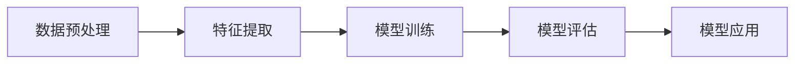

                 

### P9工作法：夯实技术硬实力、架构力和领导力

> 关键词：P9工作法、技术硬实力、架构力、领导力、软件2.0、AI大模型

> 摘要：本文将探讨P9工作法，通过深入解析技术硬实力、架构力和领导力的核心要素，帮助开发者夯实这些能力。我们将结合软件2.0和AI大模型的概念，逐步分析其在现代软件开发中的应用前景，并探讨如何通过P9工作法实现技术能力的全面提升。

### 第一部分: 背景

随着信息技术的飞速发展，软件开发已经从传统的单体架构演变为复杂的多层架构。在这一过程中，开发者不仅需要具备扎实的技术功底，还需要具备系统架构和领导力。然而，如何在实际工作中有效地提升这些能力，成为了许多开发者的困惑。P9工作法应运而生，它提供了一种系统化、可操作的方法，帮助开发者全面提升技术硬实力、架构力和领导力。

#### 核心概念介绍

**问题背景**：

随着互联网的普及和云计算、大数据、人工智能等新兴技术的不断发展，软件开发的复杂度和规模不断增长。传统的软件开发方法已无法满足现代企业对高效、灵活和可扩展性的需求。为了应对这一挑战，软件2.0概念应运而生，它强调以数据为中心，通过大数据、云计算、人工智能等先进技术，实现软件的智能化和自动化。

**问题描述**：

软件2.0的目标是实现软件的自主进化，提升软件系统的智能性、稳定性和可靠性。然而，这一目标的实现离不开高效的大模型技术，特别是AI大模型，它能够处理海量数据，提供智能决策支持。

**问题解决**：

通过引入AI大模型，软件2.0可以显著提升其功能性和智能化水平，从而在复杂环境下实现高效的决策和执行。

**边界与外延**：

软件2.0和AI大模型的应用范围非常广泛，涵盖了从企业运营、生产管理到客户服务等多个领域。

**概念结构与核心要素组成**：

- **软件2.0**：以数据为中心，强调软件的智能化和自动化。
- **AI大模型**：通过深度学习、大数据等技术，实现海量数据的智能处理。

---

### 第二部分: AI大模型的定义与特点

#### 核心概念与联系

**核心概念**：

AI大模型是一种能够处理海量数据的智能系统，通过深度学习等技术，从数据中提取有用信息，实现智能决策和预测。

**概念属性特征对比表格**：

| 特征 | 传统AI | AI大模型 |
| --- | --- | --- |
| 数据量 | 小规模 | 海量 |
| 复杂度 | 简单任务 | 复杂任务 |
| 学习能力 | 有限 | 强大 |

**ER实体关系图架构**：

```mermaid
erDiagram
    A inheritance B {
        U1 : "small-scale AI"
        U2 : "data size"
    }
    A inheritance C {
        U3 : "complex task"
        U4 : "learning ability"
    }
```

---

### 第三部分: AI大模型在企业中的应用前景

#### 潜在应用领域

**客户服务**：

通过AI大模型，企业可以提供个性化的客户服务，提升客户满意度。例如，通过分析客户的历史行为和偏好，AI大模型可以智能地推荐产品和服务，提高转化率。

**生产管理**：

AI大模型可以优化生产流程，提高生产效率。例如，通过预测设备故障和优化生产计划，AI大模型可以帮助企业降低成本，提高竞争力。

**企业运营**：

通过数据分析和预测，企业可以更好地进行决策，降低运营成本。例如，通过分析市场数据和竞争对手情况，AI大模型可以帮助企业制定更有效的市场营销策略。

#### 企业采用AI大模型的优势

**提升智能性**：

AI大模型可以处理海量数据，提供智能决策支持，帮助企业在复杂环境下做出更准确的决策。

**提高效率**：

自动化和智能化可以显著提升工作效率，减少人工干预，降低运营成本。

**降低成本**：

通过优化流程和降低运营成本，企业可以获得更大的利润空间。

#### AI大模型应用的挑战与机遇

**挑战**：

- 数据隐私和安全问题
- 技术实现和人才短缺
- 法律法规和政策限制

**机遇**：

- 市场需求不断扩大
- 技术的不断进步
- 政策支持与鼓励

---

### 第四部分: AI大模型的技术原理

#### 算法原理讲解

**算法流程图**：



**数学模型和公式**：

1. **损失函数**：

   $$ L(\theta) = -\frac{1}{m}\sum_{i=1}^{m}y^{(i)}\log(h_\theta(x^{(i)})) $$

2. **梯度下降算法**：

   $$ \theta_j := \theta_j - \alpha \frac{\partial L(\theta)}{\partial \theta_j} $$

**举例说明**：

假设我们有一个线性回归模型，目标是预测房价。数据集包含多个特征，如房屋面积、房龄等。我们使用梯度下降算法来训练模型。

```python
# 源代码示例
def compute_loss(theta, X, y):
    m = len(y)
    predictions = X.dot(theta)
    error = predictions - y
    loss = (1 / (2 * m)) * error.dot(error)
    return loss

def gradient_descent(theta, X, y, alpha, iterations):
    for i in range(iterations):
        loss = compute_loss(theta, X, y)
        predictions = X.dot(theta)
        error = predictions - y
        gradient = X.T.dot(error)
        theta -= alpha * gradient
    return theta
```

---

### 第五部分: P9工作法在AI大模型开发中的应用

#### 核心原则

**目标明确**：

在开始AI大模型开发之前，明确项目目标和预期成果，确保团队对项目的理解和期望一致。

**需求分析**：

深入分析业务需求，明确数据来源、数据处理流程、模型输出要求等，确保模型能够满足业务需求。

**架构设计**：

设计合理的系统架构，包括数据存储、数据处理、模型训练和模型部署等模块，确保系统的高效性和可扩展性。

**团队合作**：

建立高效的团队合作模式，明确团队成员的角色和职责，确保团队成员之间的沟通畅通。

**持续迭代**：

在模型开发过程中，持续进行迭代和优化，通过数据分析和模型评估，不断改进模型性能。

#### 实践案例

**案例1：客户服务优化**

某企业希望通过AI大模型优化客户服务，提高客户满意度。通过P9工作法，团队明确了目标，分析了客户数据，设计了客户服务系统架构，并建立了高效的团队合作模式。经过多次迭代和优化，最终实现了客户服务质量的显著提升。

**案例2：生产流程优化**

某制造企业希望通过AI大模型优化生产流程，提高生产效率。通过P9工作法，团队明确了项目目标，分析了生产数据，设计了生产系统架构，并建立了高效的团队合作模式。经过多次迭代和优化，最终实现了生产效率的显著提升。

---

### 第六部分: P9工作法在技术硬实力、架构力和领导力提升中的应用

#### 技术硬实力

**目标**：

提升开发者的编程能力、算法能力和系统设计能力，确保能够在复杂场景下进行高效开发。

**实践方法**：

1. **持续学习**：关注技术动态，学习最新的编程语言、框架和算法，不断提升自己的技术水平。
2. **项目实战**：通过实际项目，锻炼自己的编程能力和系统设计能力，解决实际问题。
3. **技术分享**：定期进行技术分享，与他人交流学习，提升自己的技术视野。

#### 架构力

**目标**：

提升开发者对系统架构的理解和设计能力，确保系统能够满足业务需求，具备高可用性和可扩展性。

**实践方法**：

1. **架构设计**：学习并掌握常见的系统架构设计模式，能够根据业务需求设计合理的系统架构。
2. **技术选型**：根据业务需求，选择合适的编程语言、框架和中间件，确保系统的稳定性和性能。
3. **架构评审**：定期进行架构评审，确保系统架构的合理性和高效性。

#### 领导力

**目标**：

提升开发者的团队领导能力和项目管理能力，确保团队能够高效协作，实现项目目标。

**实践方法**：

1. **团队建设**：建立良好的团队氛围，增强团队成员之间的信任和协作。
2. **沟通协调**：提升沟通能力，确保团队成员能够清晰传达自己的想法和需求。
3. **项目管理**：学习并掌握项目管理的方法和工具，确保项目能够按计划推进。

---

### 第七部分: 最佳实践与总结

#### 最佳实践

1. **技术沉淀**：定期进行技术总结和分享，将个人的经验和知识转化为团队的知识资产。
2. **持续迭代**：在项目开发过程中，不断进行迭代和优化，确保系统的高效性和稳定性。
3. **人才培养**：关注团队成员的成长，提供培训和指导，提升团队的整体能力。

#### 小结

P9工作法提供了一种系统化、可操作的方法，帮助开发者夯实技术硬实力、架构力和领导力。通过明确的目标、深入的需求分析、合理的系统架构设计和高效的团队合作，开发者可以在现代软件开发中实现技术能力的全面提升。

#### 注意事项

1. **适应变化**：技术发展迅速，开发者需要保持学习的热情，适应技术变化。
2. **重视团队**：团队合作是项目成功的关键，开发者需要注重团队建设和沟通协调。
3. **持续改进**：在项目开发过程中，不断进行迭代和优化，确保系统的高效性和稳定性。

#### 拓展阅读

1. 《人工智能：一种现代方法》
2. 《软件架构设计：实践者指南》
3. 《项目管理：理论与实践》

---

### 作者信息

作者：AI天才研究院/AI Genius Institute & 禅与计算机程序设计艺术 /Zen And The Art of Computer Programming

