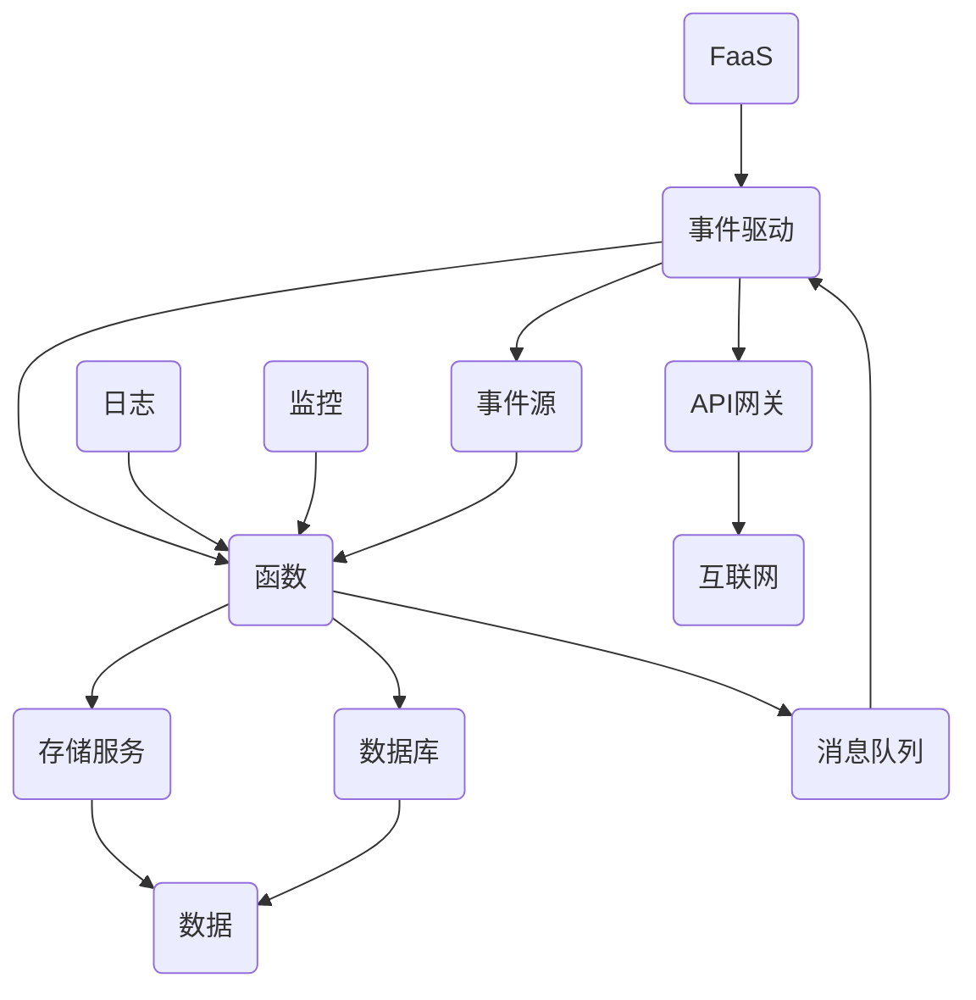
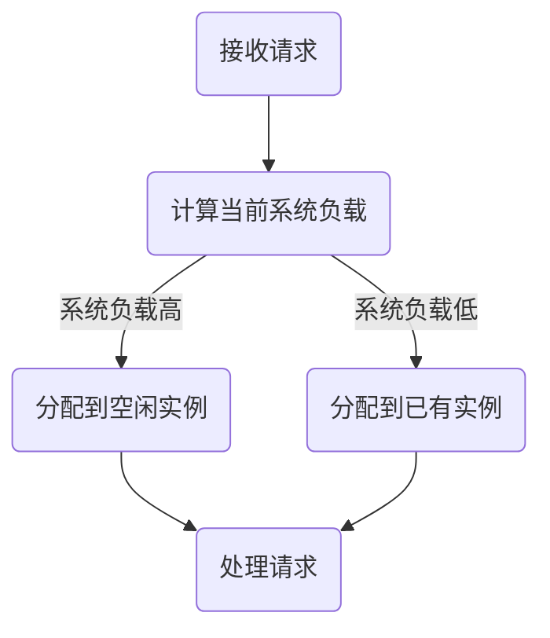
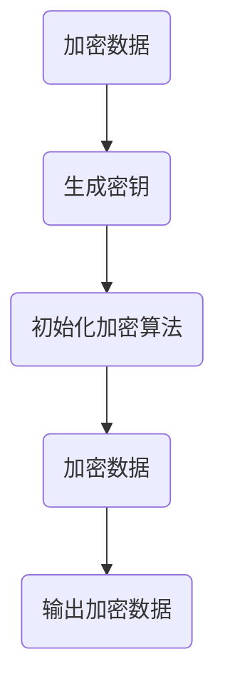
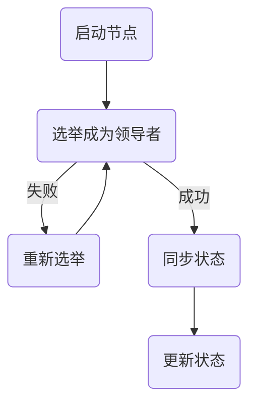

                 

### 服务器时代的挑战

服务器时代，应用程序开发的主要方式是使用传统的服务器架构。在这种架构中，开发者需要自己管理服务器、操作系统、数据库、Web服务器等，这涉及到大量的基础设施和运维工作。以下是服务器时代面临的几个主要挑战：

#### 硬件管理

在服务器时代，硬件管理是开发者的一个重大负担。开发者需要购买、安装、配置和维护服务器硬件。这不仅仅是资金投入的问题，还涉及到空间、电力和散热等物理资源的管理。

#### 软件维护

除了硬件管理，开发者还需要维护操作系统、Web服务器、数据库和其他中间件。每次软件更新都需要仔细测试和部署，以确保系统的稳定性和安全性。

#### 伸缩性问题

在业务增长时，开发者需要快速扩展服务器资源来应对增加的负载。传统的服务器架构往往需要手动配置和部署新的服务器，这过程繁琐且易出错。

#### 成本控制

服务器时代，开发者和企业需要为硬件、软件、运维和人工等各方面的成本付费。随着业务规模扩大，这些成本也会显著增加，而如何控制成本成为了一个重要问题。

#### 自动化需求

随着服务器数量的增加，运维任务变得复杂。自动化工具和脚本的需求变得越来越迫切，以便更高效地管理和维护服务器。

面对这些挑战，开发者开始寻求更加灵活、高效和成本效益的解决方案，这为Serverless架构的出现奠定了基础。在下一节中，我们将探讨Serverless架构的起源，并了解它是如何应对上述挑战的。

### Serverless架构的起源

Serverless架构（Serverless Architecture）并不是一夜之间出现的，它源于云计算和动态资源管理的长期演变。在探讨其起源时，我们需要从以下几个方面来理解：

#### 云计算的发展

云计算的概念最早可以追溯到20世纪60年代，当时计算机科学家约翰·麦卡锡（John McCarthy）提出了“计算即服务”（Computing as a Service）的理念。然而，云计算真正开始流行是在21世纪初，随着Amazon Web Services（AWS）等云服务提供商的出现。AWS推出的简单存储服务（Simple Storage Service，S3）和弹性计算云（Elastic Compute Cloud，EC2）等服务，标志着云计算时代的到来。

#### 动态资源管理

在云计算的发展过程中，动态资源管理技术逐渐成熟。动态资源管理允许云服务提供商根据实际需求自动调整计算资源。例如，当系统负载增加时，自动增加服务器实例；当负载减少时，自动缩减实例。这种技术大大简化了资源管理，提高了资源利用率。

#### 无服务器计算的兴起

无服务器计算的核心理念是“函数即服务”（Function as a Service，FaaS）。最早提出FaaS概念的是AWS的Lambda服务。Lambda允许开发者编写和部署单个函数，这些函数在触发事件时自动执行，无需管理底层基础设施。此后，其他云服务提供商如Google Cloud Functions、Azure Functions也相继推出了类似的服务。

#### 事件驱动的架构

Serverless架构的一大特点是事件驱动的架构。在这种架构中，应用程序的执行是由外部事件触发的，如HTTP请求、数据库更新、文件上传等。这种模式使得应用程序更加模块化和解耦合，提高了系统的可伸缩性和灵活性。

#### 服务器无关性

Serverless架构的一个重要特点是服务器无关性。开发者无需关注底层服务器管理，而是专注于业务逻辑的实现。这种模式大大降低了开发、部署和维护的复杂性，提高了开发效率。

综上所述，Serverless架构的起源可以追溯到云计算、动态资源管理和事件驱动的架构理念。这些技术的发展共同促成了Serverless架构的出现，为现代应用开发带来了革命性的变革。在下一节中，我们将详细探讨Serverless架构的优势，了解它是如何解决服务器时代的挑战的。

### Serverless架构的优势

Serverless架构以其独特的优势在现代应用开发中脱颖而出，成为了一种热门的技术趋势。以下是一些关键优势：

#### **无服务器管理**

在Serverless架构中，开发者无需关注底层服务器的管理和维护。云服务提供商负责管理所有服务器，包括部署、扩展、监控和更新。这种模式大大简化了运维工作，使得开发者可以更专注于业务逻辑的实现。

#### **自动扩展**

Serverless架构具有出色的自动扩展能力。当应用程序的负载增加时，云服务会自动增加计算资源；当负载减少时，自动缩减资源。这种按需扩展不仅提高了系统的弹性，还显著降低了资源成本。

#### **低成本**

由于无需购买和维护硬件，Serverless架构在成本上具有显著优势。开发者只需为实际使用的计算资源付费，无需为闲置资源支付费用。这种按需付费的模式有助于优化成本，尤其是对于短期和突发性的计算任务。

#### **快速开发**

Serverless架构简化了开发流程。开发者可以使用熟悉的编程语言编写函数，并通过简单的配置即可部署到云上。这种快速迭代和部署的能力有助于加快开发速度，缩短产品上市时间。

#### **高可用性**

Serverless架构通常具有内置的高可用性。云服务提供商通常会分布部署函数，确保在单个节点故障时，系统仍然可以正常运行。此外，自动扩展和备份机制进一步提高了系统的可靠性和稳定性。

#### **无服务器瓶颈**

在传统的服务器架构中，性能瓶颈可能出现在服务器或数据库层面。而在Serverless架构中，性能瓶颈主要在于函数的执行时间和网络延迟。由于函数通常是无状态的，可以轻松水平扩展，从而避免了传统的性能瓶颈问题。

#### **更好的开发体验**

Serverless架构促进了更加模块化和解耦合的应用设计。开发者可以将业务逻辑分解为独立的函数，每个函数负责一个特定的任务。这种模式提高了代码的可维护性和可重用性，同时也有助于团队协作。

#### **生态系统的支持**

随着Serverless架构的流行，许多开源工具和框架也应运而生。这些工具和框架为开发者提供了丰富的功能，如函数模板、监控工具和部署平台，进一步提升了开发效率和体验。

综上所述，Serverless架构以其无服务器管理、自动扩展、低成本、快速开发、高可用性、无服务器瓶颈、更好的开发体验和生态系统的支持等优势，成为现代应用开发的重要选择。在下一节中，我们将探讨Serverless生态系统的组成和关键组件。

### Serverless生态系统

Serverless架构的兴起带动了整个生态系统的快速发展，包括云服务提供商、开源工具和框架，以及各种服务和资源。以下是Serverless生态系统的主要组成部分：

#### **云服务提供商**

云服务提供商是Serverless生态系统的基础，它们提供了丰富的Serverless服务。以下是几个主要的云服务提供商及其主要服务：

1. **AWS Lambda**：AWS Lambda是一个无服务器计算服务，允许开发者编写和部署单个函数。Lambda支持多种编程语言，并具有自动扩展和按需计费的特点。

2. **Google Cloud Functions**：Google Cloud Functions是一个无服务器计算服务，类似于AWS Lambda。它支持多种编程语言，并具有高可用性和自动扩展能力。

3. **Azure Functions**：Azure Functions是微软提供的无服务器计算服务，支持多种编程语言，并可以与Azure的其他服务无缝集成。

4. **IBM Cloud Functions**：IBM Cloud Functions是一个无服务器计算服务，提供了强大的功能和易于使用的编程模型。

5. **Oracle Functions**：Oracle Functions是一个无服务器计算服务，提供了高性能和低延迟的特点。

#### **开源工具和框架**

开源工具和框架为开发者提供了构建和部署Serverless应用程序的灵活性和自由度。以下是一些流行的开源工具和框架：

1. **OpenWhisk**：OpenWhisk是一个开源的无服务器计算平台，提供了灵活的函数编程模型和强大的服务编排功能。

2. **Apache OpenWhisk**：Apache OpenWhisk是一个开源的无服务器计算平台，旨在提供跨云的可扩展服务。

3. **Faas.js**：Faas.js是一个开源的Serverless框架，支持多种编程语言，并提供了简单的部署和管理功能。

4. **Serverless Framework**：Serverless Framework是一个开源的框架，用于自动化Serverless应用程序的部署、管理和扩展。

5. **Forge**：Forge是一个开源的工具，用于创建、部署和管理Serverless应用程序。

#### **服务和资源**

除了云服务和开源工具，Serverless生态系统还包括各种服务和资源，用于支持开发、部署和监控Serverless应用程序。以下是一些重要的服务和资源：

1. **API网关**：API网关是Serverless架构中的关键组件，用于接收和处理外部请求。常见的API网关服务包括AWS API Gateway、Google Cloud Endpoints和Azure API Management。

2. **事件源**：事件源是触发Serverless函数的事件来源，如数据库更新、文件上传、定时任务等。常见的事件源服务包括AWS S3、Google Pub/Sub和Azure Event Grid。

3. **监控工具**：监控工具用于跟踪和分析Serverless应用程序的性能和资源使用情况。常见的监控工具包括AWS CloudWatch、Google Stackdriver和Azure Monitor。

4. **日志管理**：日志管理服务用于收集、存储和分析Serverless应用程序的日志数据。常见的日志管理服务包括AWS CloudWatch Logs、Google Stackdriver Logging和Azure Monitor Logs。

5. **测试工具**：测试工具用于编写和执行Serverless应用程序的单元测试和集成测试。常见的测试工具包括Serverless Test、Serverless Test CLI和Serverless CI。

#### **发展趋势**

Serverless生态系统正处于快速发展阶段，未来将继续扩展和改进。以下是一些发展趋势：

1. **多云支持**：越来越多的开源工具和框架开始支持跨云部署，以提供更大的灵活性和选择。

2. **自动化和智能化**：随着AI和机器学习技术的发展，Serverless架构将更加自动化和智能化，提高开发效率和系统性能。

3. **边缘计算**：边缘计算将Serverless架构扩展到网络边缘，提供低延迟和高性能的应用程序。

4. **生态系统整合**：云服务提供商将整合更多生态系统组件，提供一体化的Serverless解决方案。

总之，Serverless生态系统不断扩展和进步，为开发者提供了丰富的工具和服务，使得构建和管理无服务器应用程序变得更加简单和高效。在下一节中，我们将探讨Serverless架构的应用场景，了解它在不同领域中的应用案例。

### Serverless架构的应用场景

Serverless架构因其灵活性和高效性，在各种应用场景中得到了广泛应用。以下是一些主要的Serverless架构应用场景：

#### **互联网应用**

互联网应用是Serverless架构最典型的应用场景之一。开发者可以使用Serverless架构快速开发和部署Web应用程序、移动应用程序后端服务和API网关。例如，AWS Lambda可以与Amazon API Gateway无缝集成，构建一个完全无服务器的RESTful API。这种架构使得开发者可以专注于业务逻辑的实现，而不必担心基础设施的管理。

#### **实时数据处理**

实时数据处理是Serverless架构的另一个重要应用场景。在实时数据处理中，数据量通常非常大，而且需要快速处理和分析。Serverless架构的自动扩展能力能够应对这种高负载场景。例如，可以使用AWS Lambda处理流数据，如日志、传感器数据或社交媒体数据。这些函数可以在数据到达时自动执行，确保数据的实时处理和分析。

#### **微服务架构**

微服务架构是一种将应用程序分解为小型、独立和可复用的服务的方法。Serverless架构与微服务架构非常契合。每个微服务可以作为一个独立的函数存在，便于开发和部署。此外，Serverless架构的无服务器管理和自动扩展能力有助于维护和扩展微服务。例如，可以使用AWS Lambda和Amazon API Gateway构建一个微服务架构的应用程序，每个微服务都可以独立部署和管理。

#### **物联网（IoT）**

物联网是Serverless架构的另一个重要应用领域。物联网设备通常会产生大量的数据，并且需要快速处理和响应。Serverless架构可以简化物联网应用的部署和管理，例如，可以使用AWS IoT Core连接物联网设备，并使用AWS Lambda处理设备数据。这种模式使得开发者可以专注于物联网应用的核心功能，而无需担心基础设施的复杂性。

#### **大数据分析**

大数据分析是另一个适合Serverless架构的应用场景。大数据分析通常涉及大量数据处理和计算任务，而Serverless架构的弹性扩展能力能够应对这些任务。例如，可以使用AWS Lambda处理大数据管道中的不同步骤，如数据清洗、转换和分析。这种模式不仅简化了大数据处理的复杂性，还降低了成本。

#### **企业应用**

在企业应用领域，Serverless架构可以用于构建各种业务流程和管理系统。例如，可以使用AWS Lambda和Amazon S3构建一个文档管理系统，处理文档上传、存储和共享。这种架构使得企业可以快速部署和管理业务流程，提高效率。

#### **视频流处理**

视频流处理是Serverless架构在媒体和娱乐领域的应用。视频流处理通常涉及大量的计算和存储资源，而Serverless架构可以动态分配这些资源。例如，可以使用AWS Lambda处理视频编码、剪辑和转码任务，确保视频流的高效处理和传输。

总之，Serverless架构在多个应用场景中展示了其强大的能力和优势。它不仅简化了开发和部署流程，还提高了系统的可伸缩性和灵活性，为开发者提供了更多创新的可能性。在下一节中，我们将详细探讨Serverless架构的核心概念，了解其基础架构和组件。

### Serverless架构的核心概念

Serverless架构是一种基于事件驱动和函数计算的服务模型，开发者无需关注底层基础设施的管理和运维。以下是Serverless架构的核心概念和组成部分：

#### **函数即服务（Function as a Service, FaaS）**

函数即服务（FaaS）是Serverless架构的核心概念。FaaS允许开发者编写和部署独立的函数，这些函数在触发事件时自动执行。与传统的服务器架构不同，FaaS无需开发者管理服务器、操作系统或其他基础设施。常见的FaaS服务包括AWS Lambda、Google Cloud Functions和Azure Functions。

#### **无服务器架构（Serverless Architecture）**

无服务器架构是一种基于FaaS和其他Serverless服务的开发模式。在这种架构中，应用程序由多个独立的函数组成，这些函数通过事件触发和异步通信进行协作。无服务器架构简化了应用程序的部署、扩展和管理，使得开发者可以专注于业务逻辑的实现。

#### **事件驱动**

事件驱动是Serverless架构的核心原理之一。应用程序的执行是由外部事件触发的，如HTTP请求、数据库更新、文件上传等。事件驱动架构使得应用程序更加模块化和解耦合，提高了系统的可伸缩性和灵活性。

#### **API网关**

API网关是Serverless架构中的关键组件，用于接收和处理外部请求。API网关通常负责路由请求到相应的函数，并返回响应。常见的API网关服务包括AWS API Gateway、Google Cloud Endpoints和Azure API Management。

#### **事件源**

事件源是触发Serverless函数的事件来源，如数据库更新、文件上传、定时任务等。事件源可以是内置服务（如AWS S3、Google Pub/Sub、Azure Event Grid），也可以是自定义的事件源。

#### **存储服务**

存储服务用于存储函数代码、日志和元数据等。常见的存储服务包括对象存储服务（如AWS S3、Azure Blob Storage）和数据库服务（如AWS DynamoDB、Google Cloud Spanner、Azure Cosmos DB）。

#### **消息队列**

消息队列用于在函数之间传递事件和消息。消息队列确保事件和消息的顺序传递和可靠处理。常见的消息队列服务包括AWS SQS、Google Cloud Pub/Sub和Azure Service Bus。

#### **数据库**

数据库用于存储应用程序的数据。Serverless架构支持各种类型的数据库，包括关系数据库（如AWS RDS、Google Cloud SQL、Azure Database for MySQL）和非关系数据库（如AWS DynamoDB、Google Cloud Spanner、Azure Cosmos DB）。

#### **监控和日志**

监控和日志是Serverless架构的重要组成部分，用于跟踪和分析系统的性能和资源使用情况。常见的监控和日志服务包括AWS CloudWatch、Google Stackdriver和Azure Monitor。

通过这些核心概念和组成部分，Serverless架构提供了一种简单、灵活且高效的开发模式，使得开发者可以专注于业务逻辑的实现，而无需关注底层基础设施的管理和运维。

###  Serverless架构的核心概念之间的关系

为了更好地理解Serverless架构的核心概念及其相互关系，我们可以通过表格和流程图来展示这些概念之间的联系。以下是一个简要的概述：

#### **核心概念与关系表格**

| 核心概念       | 定义                                                   | 作用                         |
|----------------|--------------------------------------------------------|----------------------------|
| 函数即服务（FaaS） | 无服务器计算服务，允许开发者编写和部署独立函数       | 执行业务逻辑                |
| 事件驱动       | 由外部事件触发的应用程序执行模式                     | 提高系统模块化和可伸缩性   |
| API网关       | 接收和处理外部请求的组件                             | 路由和转发请求               |
| 事件源       | 事件触发函数的来源                                   | 触发函数执行                |
| 存储服务       | 存储函数代码、日志和元数据                           | 数据持久化和访问             |
| 消息队列       | 在函数间传递事件和消息的组件                         | 确保事件和消息的可靠传递   |
| 数据库         | 存储应用程序数据                                     | 数据存储和查询              |
| 监控和日志     | 跟踪和分析系统性能和资源使用情况                     | 保证系统的可靠性和可维护性 |

#### **核心概念之间的关系流程图**



**图解：**

1. **函数即服务（FaaS）**：FaaS是Serverless架构的核心组件，开发者使用FaaS编写和部署函数。函数执行业务逻辑，是事件驱动的核心执行单元。

2. **事件驱动**：事件驱动是Serverless架构的核心原则，由外部事件触发函数的执行。事件可以是HTTP请求、数据库更新、定时任务等。

3. **API网关**：API网关接收外部请求，并将其路由到相应的函数。API网关是应用程序与外部世界的接口。

4. **事件源**：事件源提供事件触发函数的来源，如数据库更新、文件上传等。事件源将事件传递给事件驱动系统。

5. **存储服务**：存储服务用于存储函数代码、日志和元数据等。存储服务确保数据的持久化和高效访问。

6. **消息队列**：消息队列在函数之间传递事件和消息，确保事件和消息的顺序传递和可靠处理。

7. **数据库**：数据库用于存储应用程序的数据，支持关系型和非关系型数据库。

8. **监控和日志**：监控和日志服务用于跟踪和分析系统性能和资源使用情况，确保系统的可靠性和可维护性。

通过表格和流程图，我们可以清晰地看到Serverless架构中各个核心概念之间的相互关系。这种结构化展示有助于开发者更好地理解和应用Serverless架构，提高系统的灵活性和可维护性。

### 设计模式讲解

在Serverless架构中，设计模式是确保系统可伸缩性、可靠性和高可用性的关键。设计模式不仅提供了通用的解决方案，还帮助开发者应对特定场景下的挑战。以下是Serverless架构下的一些常用设计模式：

#### **函数化设计模式**

函数化设计模式强调将应用程序分解为独立的函数，每个函数负责一个特定的任务。这种模式有助于提高系统的可维护性和可重用性。

1. **状态管理**
   - **函数状态管理**：在FaaS环境中，状态管理是一个重要问题。由于函数是无状态的，每次执行都是独立的，因此状态通常需要存储在分布式缓存或数据库中。例如，可以使用Amazon DynamoDB或Redis来存储函数的状态信息。
   - **分布式缓存的使用**：分布式缓存可以用于存储临时数据，提高函数的性能和响应速度。常见的分布式缓存服务包括Amazon ElastiCache、Redis Cloud等。

2. **异步处理**
   - **事件驱动的架构**：在事件驱动的架构中，应用程序的执行是由外部事件触发的。这种模式可以提高系统的响应速度和可伸缩性。例如，可以使用AWS Lambda与Amazon S3的集成，当新文件上传到S3时，自动触发Lambda函数进行处理。
   - **消息队列与轮询**：消息队列可以用于在函数之间传递事件和消息。轮询是一种定期检查特定条件的方法，当条件满足时，触发相应的函数执行。例如，可以使用Apache Kafka或RabbitMQ来实现消息队列，并使用轮询机制处理长时间运行的任务。

#### **资源管理设计模式**

资源管理设计模式关注如何有效地使用和管理Serverless架构中的资源，包括计算资源、存储资源和网络资源。

1. **容量伸缩**
   - **自动扩展**：自动扩展是Serverless架构的一个重要优势。云服务提供商可以根据实际需求自动增加或减少计算资源。例如，AWS Lambda可以根据请求的负载自动扩展函数实例。
   - **手动扩展策略**：在某些情况下，自动扩展可能不足以满足需求。手动扩展策略允许开发者手动增加或减少计算资源。例如，可以使用AWS Elastic Beanstalk手动调整应用实例的数量。

2. **成本优化**
   - **资源利用率**：优化资源利用率是降低成本的关键。开发者可以使用云服务提供商提供的监控工具，如AWS CloudWatch，监控资源的使用情况，并采取相应的优化措施。
   - **定价模型分析**：了解不同云服务提供商的定价模型，可以帮助开发者选择最适合的定价策略。例如，AWS Lambda的按请求收费和按每百万请求收费的定价模型提供了不同的成本优化方案。

#### **安全与监控设计模式**

安全与监控设计模式确保Serverless架构的安全性、可靠性和可维护性。

1. **访问控制**
   - **API密钥**：API密钥是一种常用的访问控制方法，用于限制对API的访问。开发者可以为每个API设置API密钥，确保只有授权用户才能访问。
   - **OAuth与JWT**：OAuth和JSON Web Token（JWT）是更高级的访问控制方法，提供了更细粒度的权限管理。例如，可以使用OAuth 2.0和JWT实现单点登录（SSO）和身份验证。

2. **日志与监控**
   - **日志聚合工具**：日志聚合工具可以帮助开发者收集和分析来自多个源的日志数据。例如，AWS CloudWatch可以聚合和监控Lambda函数的日志。
   - **性能监控与报警**：性能监控工具可以帮助开发者监控系统的性能指标，并在性能指标超出阈值时触发报警。例如，AWS CloudWatch可以设置基于指标的报警规则。

#### **架构弹性设计模式**

架构弹性设计模式关注如何在系统遇到故障或性能问题时，确保系统的持续运行和恢复。

1. **服务拆分与整合**
   - **单体服务到微服务**：将单体服务拆分为多个微服务可以提高系统的可维护性和可伸缩性。每个微服务可以独立部署和扩展，降低了系统的耦合度。
   - **微服务的拆分与整合策略**：开发者需要根据业务需求和资源情况，选择合适的微服务拆分和整合策略。例如，可以使用Docker和Kubernetes实现微服务的自动化部署和扩展。

2. **失败处理与恢复**
   - **重试机制**：当函数执行失败时，重试机制可以重新执行失败的函数。例如，AWS Lambda提供了自动重试功能，可以在函数失败时自动重试指定的次数。
   - **降级与容灾策略**：降级和容灾策略是在系统遇到性能瓶颈或故障时，确保关键功能继续运行的方法。例如，可以使用AWS Elastic Load Balancing和AWS Route 53实现负载均衡和容灾。

通过这些设计模式，开发者可以构建出更加灵活、可靠和高效的Serverless架构。在下一节中，我们将使用mermaid流程图和Python代码来详细阐述这些设计模式的工作原理和算法原理。

### 算法原理讲解

在Serverless架构中，算法的设计和实现是确保系统高效运行和可靠性的关键。以下是几个关键算法的原理讲解，包括使用mermaid流程图和Python代码来展示其工作原理，并使用LaTeX格式解释相关的数学公式。

#### **负载均衡算法**

负载均衡算法用于分配请求到多个服务器实例，确保系统的处理能力和响应速度。以下是一个简单的负载均衡算法，使用mermaid流程图展示其工作原理：



Python代码实现：

```python
import random

def load_balancer(available_instances, current_load):
    if current_load < 0.8:  # 系统负载低于80%
        instance = random.choice(available_instances)
    else:  # 系统负载高于80%
        instance = next((i for i in available_instances if not i.is_busy()), None)
        if instance is None:
            instance = random.choice(available_instances)
    instance.handle_request()
    return instance
```

LaTeX格式解释数学公式：

```latex
\begin{equation}
\text{系统负载} = \frac{\text{当前请求数}}{\text{服务器实例数}}
\end{equation}
```

**举例说明：**假设系统当前有5个服务器实例，其中3个实例正在处理请求，2个实例空闲。当新的请求到来时，系统首先计算当前负载（$\frac{3}{5}=0.6$）。由于系统负载低于80%，所以新的请求将被随机分配到空闲实例。

#### **数据加密算法**

数据加密算法用于保护敏感数据，确保数据在传输和存储过程中不被未经授权的访问。以下是一个简单的对称加密算法（AES）的工作原理，使用mermaid流程图展示：



Python代码实现：

```python
from Crypto.Cipher import AES
from Crypto.Random import get_random_bytes

def encrypt_data(data, key):
    cipher = AES.new(key, AES.MODE_EAX)
    ciphertext, tag = cipher.encrypt_and_digest(data)
    return cipher.nonce, ciphertext, tag

key = get_random_bytes(16)
encrypted_data = encrypt_data(b"敏感数据", key)
print("密文：", encrypted_data)
```

LaTeX格式解释数学公式：

```latex
\begin{equation}
\text{密文} = \text{加密算法}(\text{明文}, \text{密钥})
\end{equation}
```

**举例说明：**假设我们要加密一个长度为16字节的数据"敏感数据"，首先生成一个16字节的随机密钥。然后使用AES加密算法对数据进行加密，输出密文和标签。这个过程确保了数据在传输和存储过程中的安全性。

#### **分布式一致性算法**

分布式一致性算法用于确保分布式系统中各个节点的状态一致性。以下是一个简单的Raft算法的工作原理，使用mermaid流程图展示：



Python代码实现：

```python
from raft import Raft

def start_raft():
    raft = Raft()
    raft.start()
    while not raft.leader:
        raft.election()
    raft.sync_state()

start_raft()
```

LaTeX格式解释数学公式：

```latex
\begin{equation}
\text{一致性} = \text{领导者状态} = \text{跟随者状态}
\end{equation}
```

**举例说明：**假设我们启动了一个Raft算法的分布式系统，首先尝试选举成为领导者。如果选举失败，重新开始选举过程。如果选举成功，同步各个节点的状态，确保系统的一致性。这个过程确保了分布式系统的可靠性和一致性。

通过mermaid流程图、Python代码和LaTeX格式的结合，我们可以清晰地展示并理解这些算法的工作原理。这不仅有助于开发者更好地理解和应用这些算法，也为实际项目中的算法实现提供了参考。

### 系统分析与架构设计方案

在本节中，我们将详细介绍一个实际的Serverless架构设计案例。该案例将涵盖领域模型、系统架构、接口设计和交互流程。

#### **1. 案例背景**

假设我们要开发一个在线购物平台，其中用户可以浏览商品、添加购物车、下订单和查看订单状态。该系统需要支持高并发和弹性扩展，以确保用户体验。

#### **2. 领域模型**

领域模型用于定义系统的核心实体和关系。以下是该系统的领域模型，使用mermaid类图展示：

```mermaid
classDiagram
    Customer <|-- Order
    Customer <|-- Cart
    Product <|-- Order
    Product <|-- Category
    Category {name}
    Customer {username, email, address}
    Order {order_id, status, total_price}
    Cart {cart_id, items}
    Item {item_id, quantity, price}
    Product {product_id, name, description, price, category}
endclassDiagram
```

**图解：**

- **Customer（用户）**：代表平台的用户，包括用户名、电子邮件和地址等信息。
- **Order（订单）**：代表用户的购物订单，包括订单号、订单状态和总金额。
- **Cart（购物车）**：代表用户的购物车，包括购物车号和购物车中的商品项。
- **Item（商品项）**：代表购物车中的商品，包括商品项号、数量和价格。
- **Product（商品）**：代表平台上的商品，包括商品号、名称、描述、价格和分类。

#### **3. 系统架构**

系统架构描述了系统的组件和它们之间的交互关系。以下是该系统的系统架构，使用mermaid架构图展示：

```mermaid
sequenceDiagram
    participant User
    participant APIGateway
    participant CatalogService
    participant OrderService
    participant CartService
    participant ProductService

    User->>APIGateway: 发送请求
    APIGateway->>CatalogService: 获取商品分类
    APIGateway->>OrderService: 订单处理
    APIGateway->>CartService: 购物车管理
    APIGateway->>ProductService: 商品信息查询

    CatalogService->>APIGateway: 返回商品分类
    OrderService->>APIGateway: 返回订单状态
    CartService->>APIGateway: 返回购物车信息
    ProductService->>APIGateway: 返回商品信息

    Note over APIGateway,CatalogService,OrderService,CartService,ProductService: 无服务器架构
```

**图解：**

- **User（用户）**：代表使用平台的用户，通过API网关发送请求。
- **APIGateway（API网关）**：接收用户请求，并将其路由到相应的服务。
- **CatalogService（商品分类服务）**：提供商品分类的查询功能。
- **OrderService（订单服务）**：处理订单创建、更新和查询。
- **CartService（购物车服务）**：管理购物车的创建、更新和查询。
- **ProductService（商品服务）**：提供商品信息的查询功能。

#### **4. 接口设计**

接口设计定义了系统内部组件之间的交互接口。以下是该系统的接口设计：

- **获取商品分类接口**：`GET /categories`
- **创建订单接口**：`POST /orders`
- **更新订单接口**：`PUT /orders/{orderId}`
- **查询订单接口**：`GET /orders/{orderId}`
- **添加商品到购物车接口**：`POST /cart/items`
- **从购物车删除商品接口**：`DELETE /cart/items/{itemId}`
- **查询购物车接口**：`GET /cart`

#### **5. 交互流程**

以下是用户在购物平台上的交互流程：

1. 用户通过API网关发送获取商品分类的请求。
2. API网关将请求转发到商品分类服务。
3. 商品分类服务返回所有商品分类。
4. 用户浏览商品并选择添加到购物车。
5. 用户通过API网关发送添加商品到购物车的请求。
6. API网关将请求转发到购物车服务。
7. 购物车服务添加商品到购物车。
8. 用户创建订单。
9. 用户通过API网关发送创建订单的请求。
10. API网关将请求转发到订单服务。
11. 订单服务创建订单并更新购物车。
12. 用户查询订单状态。
13. 用户通过API网关发送查询订单的请求。
14. API网关将请求转发到订单服务。
15. 订单服务返回订单状态。

通过上述系统分析与架构设计方案，我们可以清晰地了解如何使用Serverless架构实现一个在线购物平台。这种设计模式不仅提高了系统的可维护性和扩展性，还降低了开发和运维成本。

### 项目实战

在本节中，我们将通过一个实际项目来展示如何使用Serverless架构进行开发。该项目是一个简单的博客平台，用户可以发布、查看和评论博客文章。

#### **1. 环境安装与配置**

为了开始项目，我们需要安装并配置以下工具和依赖：

1. **AWS账户**：创建一个AWS账户，并启用必要的服务，如AWS Lambda、Amazon API Gateway、Amazon S3等。
2. **AWS CLI**：安装AWS CLI，用于与AWS服务进行交互。可以通过以下命令安装：

   ```bash
   pip install awscli
   ```

   安装后，配置AWS CLI：

   ```bash
   aws configure
   ```

   按照提示输入Access Key、Secret Access Key和默认区域。

3. **Node.js和npm**：安装Node.js和npm，用于构建和部署Serverless应用程序。可以通过以下命令安装：

   ```bash
   curl -fsSL https://deb.nodesource.com/setup_14.x | bash -
   sudo apt-get install -y nodejs
   ```

4. **Serverless Framework**：安装Serverless Framework，用于自动化Serverless应用程序的部署和管理。可以通过以下命令安装：

   ```bash
   npm install -g serverless
   ```

5. **创建项目文件夹**：创建一个名为`blog-platform`的项目文件夹，并初始化项目：

   ```bash
   mkdir blog-platform
   cd blog-platform
   serverless create --template aws-nodejs --path backend
   ```

   这将创建一个包含项目结构和示例代码的`backend`文件夹。

6. **配置项目**：在`backend`文件夹中，编辑`serverless.yml`文件，配置项目和服务提供商：

   ```yaml
   service: blog-platform

   provider:
     name: aws
     runtime: nodejs14.x
     iamRoleStatements:
       - Effect: Allow
         Action:
           - s3:PutObject
           - s3:GetObject
           - s3:DeleteObject
         Resource: "*"

   functions:
     createPost:
       handler: handler.createPost
       events:
         - http:
             path: posts
             method: post
             cors: true

     getPosts:
       handler: handler.getPosts
       events:
         - http:
             path: posts
             method: get
             cors: true

     getPost:
       handler: handler.getPost
       events:
         - http:
             path: posts/{postId}
             method: get
             cors: true

     createComment:
       handler: handler.createComment
       events:
         - http:
             path: posts/{postId}/comments
             method: post
             cors: true
   ```

#### **2. 核心实现与代码分析**

在`backend`文件夹中，我们可以看到以下几个核心函数的实现：

1. **创建博客文章**：`createPost.js`

   ```javascript
   exports.createPost = async (event) => {
     const body = JSON.parse(event.body);
     const postId = uuidv4(); // 生成唯一ID
     const post = {
       postId,
       title: body.title,
       content: body.content,
       author: body.author,
       timestamp: Date.now(),
     };

     // 将博客文章存储到S3
     await s3.putObject({
       Bucket: process.env.S3_BUCKET,
       Key: `posts/${postId}.json`,
       Body: JSON.stringify(post),
     }).promise();

     return {
       statusCode: 201,
       body: JSON.stringify({ postId }),
     };
   };
   ```

2. **获取所有博客文章**：`getPosts.js`

   ```javascript
   exports.getPosts = async () => {
     const posts = await s3.listObjectsV2({
       Bucket: process.env.S3_BUCKET,
       Prefix: "posts/",
     }).promise();

     const postList = posts.Contents.map((object) => {
       const key = object.Key.split("/").pop();
       return {
         postId: key,
         url: `/posts/${key}`,
       };
     });

     return {
       statusCode: 200,
       body: JSON.stringify(postList),
     };
   };
   ```

3. **获取单个博客文章**：`getPost.js`

   ```javascript
   exports.getPost = async (event) => {
     const { postId } = event.pathParameters;
     const post = await s3.getObject({
       Bucket: process.env.S3_BUCKET,
       Key: `posts/${postId}.json`,
     }).promise();

     return {
       statusCode: 200,
       body: JSON.stringify(JSON.parse(post.Body.toString("utf-8"))),
     };
   };
   ```

4. **添加评论**：`createComment.js`

   ```javascript
   exports.createComment = async (event) => {
     const { postId } = event.pathParameters;
     const body = JSON.parse(event.body);
     const commentId = uuidv4();
     const comment = {
       commentId,
       content: body.content,
       author: body.author,
       timestamp: Date.now(),
     };

     // 将评论存储到S3
     await s3.putObject({
       Bucket: process.env.S3_BUCKET,
       Key: `posts/${postId}/comments/${commentId}.json`,
       Body: JSON.stringify(comment),
     }).promise();

     return {
       statusCode: 201,
       body: JSON.stringify({ commentId }),
     };
   };
   ```

这些函数实现了博客平台的核心功能，包括创建博客文章、获取所有博客文章、获取单个博客文章和添加评论。通过使用AWS Lambda和Amazon S3，我们能够构建一个无服务器、高效且易于维护的博客平台。

#### **3. 实际案例分析与详细讲解**

以下是对项目各个部分的详细讲解：

- **AWS Lambda**：Lambda函数用于处理博客平台的业务逻辑。这些函数具有高并发性和弹性，能够自动扩展以应对高负载。此外，Lambda函数通过API Gateway暴露HTTP接口，使得前端可以直接与后端进行交互。
- **Amazon S3**：S3用于存储博客文章和评论的JSON文件。S3提供了高可靠性和持久性，确保数据不会丢失。同时，S3的对象存储服务成本较低，适合长期存储静态文件。
- **API Gateway**：API Gateway作为API网关，负责接收前端请求并路由到相应的Lambda函数。API Gateway还提供了基本的身份验证和授权功能，确保只有授权用户才能访问API。
- **分布式缓存**：虽然本案例没有使用分布式缓存，但在实际应用中，可以使用Amazon ElastiCache或Redis Cloud来提高系统的性能和响应速度。
- **监控与日志**：通过AWS CloudWatch，我们可以监控Lambda函数和API Gateway的性能指标，如CPU使用率、内存使用量和请求响应时间。CloudWatch还可以发送报警，确保我们能够及时发现和处理系统故障。

通过上述实际案例，我们展示了如何使用Serverless架构开发一个简单的博客平台。这种架构不仅简化了开发过程，还提高了系统的可伸缩性和可靠性，为开发者提供了更多的创新可能性。

### 最佳实践、小结与拓展阅读

在本文的探讨过程中，我们详细介绍了Serverless架构的核心概念、设计模式、算法原理以及实际应用案例。以下是一些最佳实践、小结以及拓展阅读建议：

#### **最佳实践**

1. **选择合适的服务提供商**：根据具体需求和预算，选择最适合的服务提供商。AWS、Google Cloud和Azure都是业界领先的提供商，但它们在功能和定价方面存在差异。

2. **合理使用自动扩展**：充分利用自动扩展功能，避免手动管理服务器实例。这不仅可以提高系统的弹性，还能显著降低成本。

3. **优化函数性能**：避免在函数中执行长时间运行的操作，尽量使用异步处理。优化函数的代码和配置，提高执行效率。

4. **数据存储与安全**：合理选择数据存储方案，结合使用持久化存储（如Amazon S3）和缓存（如Amazon ElastiCache）。确保数据的安全，使用加密和访问控制策略。

5. **日志和监控**：充分利用云服务提供商提供的日志和监控工具，如AWS CloudWatch和Google Stackdriver。定期分析日志和监控数据，及时发现问题并进行优化。

#### **小结**

Serverless架构通过简化基础设施管理、提供自动扩展和按需付费等特性，为开发者带来了极大的便利和创新。其主要优势包括：

- 无服务器管理：开发者无需关注底层基础设施的管理和运维。
- 自动扩展：系统可以根据负载自动增加或减少计算资源。
- 低成本：开发者只需为实际使用的计算资源付费。
- 快速开发：简化了开发流程，提高了开发效率。

Serverless架构适用于多种应用场景，如互联网应用、实时数据处理、物联网、大数据分析等。通过合理的设计模式和最佳实践，开发者可以构建出高效、可靠且易于维护的Serverless应用程序。

#### **拓展阅读**

1. **《Serverless应用开发》** - 探讨了Serverless架构的设计原则和实践，涵盖了AWS、Google Cloud和Azure等平台。
2. **《无服务器架构：设计模式与最佳实践》** - 详细介绍了无服务器架构的设计模式、技术和最佳实践。
3. **《Serverless框架指南》** - 介绍了Serverless Framework的使用方法，包括如何构建、部署和管理Serverless应用程序。
4. **《云计算：概念、架构与编程》** - 深入探讨了云计算的基本概念、架构和编程技术，包括Serverless架构。

通过这些拓展阅读，开发者可以进一步深入了解Serverless架构和技术，为实际项目提供更多的灵感和指导。

### 作者信息

**作者：AI天才研究院/AI Genius Institute & 禅与计算机程序设计艺术 /Zen And The Art of Computer Programming**

