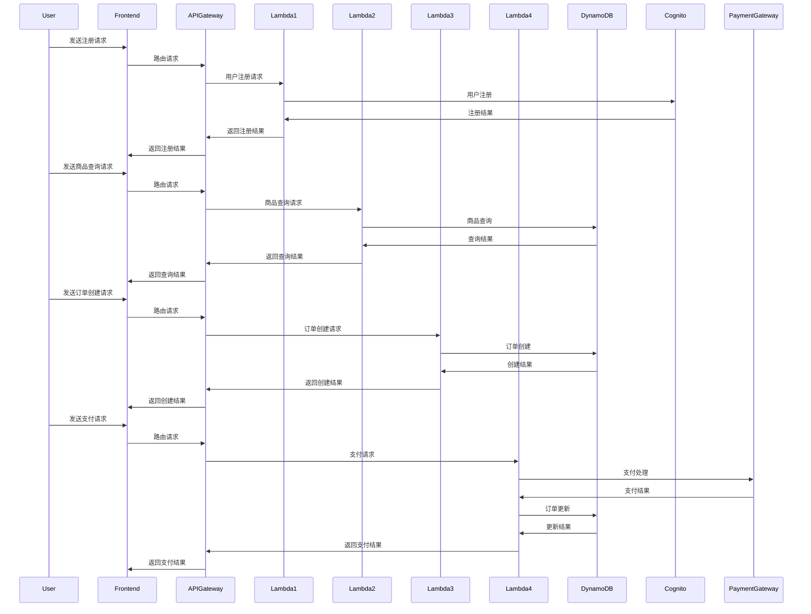

                 

## Serverless架构与实践

### 关键词：Serverless、架构、实践、函数即服务、事件驱动

> 摘要：本文旨在深入探讨Serverless架构的概念、原理、实践与应用，帮助读者理解并掌握这种新兴的云计算模型。通过详细的案例分析和技术讲解，本文将展示Serverless架构如何解决传统云计算架构中的诸多问题，并提供实用的最佳实践。

### 目录

1. **Serverless架构概述**  
   1.1. Serverless架构的概念  
   1.2. Serverless与传统架构的差异  
   1.3. Serverless的优势与挑战

2. **核心概念与联系**  
   2.1. 服务端与客户端的关系  
   2.2. 事件驱动架构  
   2.3. FaaS与BaaS

3. **Serverless架构工作原理**  
   3.1. 函数即服务（FaaS）  
   3.2. 事件驱动与自动扩展  
   3.3. 无服务器数据库（BaaS）

4. **关键技术与实现**  
   4.1. 编写可调用的函数  
   4.2. API网关的设计与实现  
   4.3. 自动化与编排

5. **系统分析与架构设计**  
   5.1. 服务器端架构设计  
   5.2. 客户端架构设计  
   5.3. 系统集成与部署

6. **项目实战**  
   6.1. 实战一：构建一个简单的FaaS应用  
   6.2. 实战二：使用API网关实现微服务  
   6.3. 实战三：自动化部署与监控

7. **最佳实践与总结**  
   7.1. 最佳实践  
   7.2. 注意事项  
   7.3. 拓展阅读

### 1. Serverless架构概述

#### 1.1. Serverless架构的概念

Serverless架构，顾名思义，是一种不依赖于传统服务器模型的计算架构。在这种架构中，开发者无需关注底层服务器硬件的管理和运维，而是专注于编写业务逻辑代码。Serverless架构的核心思想是将应用程序分解为一系列小型、独立的函数，这些函数可以在需要时自动执行，并按需收费。

Serverless架构通常由函数即服务（Function as a Service，FaaS）和后端即服务（Backend as a Service，BaaS）两部分组成。FaaS提供了一种在云平台上运行和扩展函数的服务，而BaaS则提供了无需编写后端代码的数据库、存储和其他基础服务。

#### 1.2. Serverless与传统架构的差异

与传统云计算架构相比，Serverless架构具有以下显著差异：

1. **无服务器管理**：开发者无需关心底层服务器硬件的配置、部署和运维，大大降低了运维成本。
2. **按需扩展**：Serverless架构可以根据实际负载自动扩展或缩小计算资源，提高了系统的弹性和效率。
3. **成本优化**：Serverless架构按照实际使用的计算时间和存储量收费，相比传统模式更具成本效益。
4. **开发效率**：Serverless架构简化了应用程序的部署和运维过程，使得开发者可以更加专注于业务逻辑的开发。

然而，Serverless架构也面临一些挑战，如依赖性管理、安全性问题和函数性能等。这些问题将在后续章节中详细讨论。

#### 1.3. Serverless的优势与挑战

Serverless架构的优势体现在多个方面：

1. **成本效益**：Serverless架构通过按需收费和自动扩展，降低了基础设施成本和运营费用。
2. **弹性伸缩**：根据实际需求动态调整计算资源，提高了系统的可用性和响应速度。
3. **开发效率**：简化了应用程序的部署和管理，使得开发者能够更快地交付功能。
4. **生态支持**：众多云服务提供商如AWS、Azure、Google Cloud等提供了丰富的Serverless服务，方便开发者进行集成和开发。

然而，Serverless架构也带来了一些挑战：

1. **依赖性管理**：由于Serverless服务通常是第三方提供的，开发者需要管理不同服务之间的依赖关系。
2. **安全性问题**：Serverless应用程序的安全性可能受到云服务提供商的安全策略和限制的影响。
3. **函数性能**：在极端负载下，Serverless函数的性能可能受到影响，需要优化函数设计和资源分配。

在接下来的章节中，我们将深入探讨Serverless架构的核心概念、工作原理、实现技术和应用实践，帮助读者全面了解并掌握这种新兴的云计算模型。

### 2. 核心概念与联系

在深入探讨Serverless架构之前，我们需要了解几个核心概念及其相互联系。这些概念包括服务端与客户端的关系、事件驱动架构以及函数即服务（FaaS）和后端即服务（BaaS）。

#### 2.1. 服务端与客户端的关系

在传统的客户端-服务器架构中，客户端负责发送请求并显示数据，而服务器负责处理请求和数据存储。在Serverless架构中，这种关系发生了变化。客户端与无服务器函数直接交互，无需通过传统的服务器层。无服务器函数作为服务端的一部分，负责处理客户端的请求并在需要时触发其他函数或服务。

这种服务端与客户端的新关系带来了更高的灵活性。开发者可以更专注于业务逻辑的实现，无需担心底层服务器的运维问题。同时，客户端也可以直接访问无服务器函数，减少了中间层的复杂性。

#### 2.2. 事件驱动架构

事件驱动架构是Serverless架构的核心之一。在这种架构中，应用程序的执行是由外部事件触发的。例如，一个HTTP请求、一个文件上传或数据库变更等都可以触发一个无服务器函数。事件驱动架构的优势在于其高效性和灵活性。系统可以根据实际需求动态调整资源，并在不需要时自动释放资源。

事件驱动架构的实现依赖于事件中心和事件队列。事件中心负责接收和存储事件，而事件队列则负责将事件分发给相应的函数。在Serverless架构中，事件通常由API网关、消息队列或第三方服务触发。这些事件可以是同步的，也可以是异步的，从而实现了高并发处理和弹性伸缩。

#### 2.3. FaaS与BaaS

函数即服务（FaaS）和后端即服务（BaaS）是Serverless架构的两个重要组成部分。

**FaaS**，即Function as a Service，提供了一种将应用程序分解为一系列函数的服务。开发者只需编写和部署函数，无需关心底层基础设施的管理和运维。FaaS的优势在于其高可伸缩性、灵活性和低成本。常见的FaaS平台包括AWS Lambda、Google Cloud Functions和Azure Functions。

**BaaS**，即Backend as a Service，提供了一种无需编写后端代码的解决方案。BaaS通常包括数据库、存储、身份验证、推送通知等基础服务。开发者可以轻松集成这些服务，而无需关注底层实现的复杂性。BaaS的优势在于其简便性和快速开发能力，常见的BaaS平台包括AWS Amplify、Google Firebase和Azure App Service。

FaaS和BaaS之间的关系在于，它们共同构成了Serverless架构的基石。FaaS提供了灵活的函数计算能力，而BaaS则提供了完整的后端支持。开发者可以根据实际需求选择使用FaaS或BaaS，或两者结合，构建强大的Serverless应用程序。

#### 2.4. 核心概念比较

为了更好地理解这些核心概念，我们可以通过一个比较表格来展示它们的主要属性和特点。

| 概念       | 定义                                                       | 主要属性                                                       |  
|------------|------------------------------------------------------------|------------------------------------------------------------|  
| 服务端与客户端 | 客户端与无服务器函数直接交互，无需传统服务器层           | 灵活性、高并发处理、简化开发流程               |  
| 事件驱动架构 | 应用程序的执行由外部事件触发                             | 高效性、动态资源调整、弹性伸缩               |  
| FaaS       | 将应用程序分解为一系列函数的服务                         | 高可伸缩性、灵活性、低成本               |  
| BaaS       | 提供无需编写后端代码的解决方案，包括数据库、存储等基础服务 | 简便性、快速开发、减少后端实现复杂性           |

#### 2.5. ER实体关系图

为了更直观地展示这些概念之间的关系，我们可以使用Mermaid工具绘制一个ER实体关系图。

```mermaid  
entityRelation  
  "客户端" --|> "服务端"  
  "客户端" --|> "函数"  
  "服务端" --|> "事件驱动架构"  
  "服务端" --|> "FaaS"  
  "服务端" --|> "BaaS"  
  "事件驱动架构" --|> "事件中心"  
  "事件驱动架构" --|> "事件队列"  
```

通过这个ER实体关系图，我们可以清晰地看到客户端、服务端、函数、事件驱动架构、FaaS和BaaS之间的相互关系，为后续章节的内容提供了直观的参考。

### 3. Serverless架构工作原理

Serverless架构的工作原理涉及到多个关键技术和组件。在这一部分，我们将逐步分析这些技术和组件，以揭示Serverless架构的核心工作机制。

#### 3.1. 函数即服务（FaaS）

函数即服务（FaaS）是Serverless架构的核心组成部分之一。FaaS提供了一种将应用程序分解为一系列小型、独立的函数的服务。这些函数可以在需要时自动执行，无需关注底层基础设施的管理。

FaaS的基本原理可以概括为以下几个步骤：

1. **函数编写**：开发者使用编程语言（如JavaScript、Python、Go等）编写函数代码，这些函数通常是非常简短和独立的业务逻辑。
2. **函数部署**：将编写的函数部署到FaaS平台，如AWS Lambda、Google Cloud Functions或Azure Functions。部署过程中，开发者需要配置函数的内存、超时时间和触发事件。
3. **函数调用**：当触发事件发生时，例如HTTP请求或定时任务，FaaS平台会自动执行相应的函数。函数执行完成后，会返回结果或触发其他事件。
4. **函数监控与日志**：FaaS平台提供监控和日志功能，以便开发者了解函数的执行情况、性能指标和错误日志。

FaaS的优势在于其高可伸缩性、灵活性和低成本。由于函数是按需执行的，因此在低负载时可以节省大量资源，而在高负载时可以自动扩展处理能力。

#### 3.2. 事件驱动与自动扩展

事件驱动是Serverless架构的核心特点之一。在事件驱动架构中，应用程序的执行是由外部事件触发的。这些事件可以是定时任务、HTTP请求、文件上传、数据库变更等。

事件驱动的优势在于其高效性和灵活性。系统可以根据实际需求动态调整资源，并在不需要时自动释放资源。事件驱动的实现依赖于事件中心和事件队列。

1. **事件中心**：事件中心负责接收和存储事件。在FaaS平台上，事件中心通常与API网关集成，以接收来自外部系统的请求。例如，AWS Lambda中的API网关可以接收HTTP请求并将其转换为事件。
2. **事件队列**：事件队列负责将事件分发给相应的函数。事件队列通常采用异步处理模式，以确保高并发处理和系统稳定性。在FaaS平台上，事件队列通常与函数服务紧密集成。

自动扩展是Serverless架构的另一个关键特点。在自动扩展机制下，系统可以根据实际负载动态调整计算资源。

1. **自动扩展策略**：开发者可以在FaaS平台中配置自动扩展策略，例如基于CPU使用率、内存使用率或请求速率。平台会根据这些策略自动调整函数实例的数量。
2. **实例管理**：自动扩展机制涉及实例的创建、销毁和管理。在FaaS平台上，实例管理通常由平台自身完成，开发者无需关心底层细节。

#### 3.3. 无服务器数据库（BaaS）

无服务器数据库（BaaS）是Serverless架构的另一个重要组成部分。BaaS提供了一种无需编写后端代码的数据库解决方案，通常包括关系数据库和NoSQL数据库。

BaaS的基本原理可以概括为以下几个步骤：

1. **数据库选择**：开发者可以选择适合业务需求的关系数据库或NoSQL数据库。例如，AWS Amplify提供关系数据库（如MySQL、PostgreSQL）和NoSQL数据库（如MongoDB、DynamoDB）。
2. **数据库部署**：开发者无需关心数据库的部署和运维，只需在BaaS平台上创建数据库实例。实例创建过程中，开发者可以配置数据库的存储容量、备份策略和性能指标。
3. **数据操作**：开发者可以使用简单的API或SDK进行数据的增删改查操作。BaaS平台通常提供自动索引、分片和复制等功能，以提高数据库的性能和可用性。
4. **数据监控与日志**：BaaS平台提供监控和日志功能，以便开发者了解数据库的性能、使用情况和错误日志。

BaaS的优势在于其简便性、快速开发能力和高可用性。开发者无需关注数据库的底层实现，只需专注于业务逻辑的开发。

#### 3.4. API网关的设计与实现

API网关是Serverless架构中的关键组件之一。API网关负责接收外部请求并将其路由到相应的函数或服务。通过API网关，开发者可以实现统一的接口设计和权限控制。

API网关的设计与实现包括以下几个关键步骤：

1. **接口设计**：开发者需要设计API的接口定义，包括请求和响应的格式、参数和状态码等。可以使用Swagger或OpenAPI等工具进行接口文档的编写。
2. **路由策略**：API网关需要根据请求的URL和HTTP方法路由到相应的函数或服务。路由策略可以是基于URL路径、查询参数或HTTP方法等。
3. **权限控制**：API网关可以实现对API请求的认证和授权，确保只有合法的用户和应用程序可以访问API。常用的权限控制机制包括OAuth2、JWT和API密钥等。
4. **负载均衡**：API网关可以实现负载均衡，将请求分配到多个后端函数实例，以避免单点故障和提高系统的可用性。

API网关的设计与实现有助于提高系统的可扩展性和稳定性，同时简化开发者的接口管理任务。

#### 3.5. 自动化与编排

在Serverless架构中，自动化和编排是关键组成部分。自动化是指通过脚本或工具自动完成日常运维任务，如部署、监控和日志管理等。编排是指通过编排工具将多个服务或函数组合成一个完整的系统。

自动化和编排的实现包括以下几个步骤：

1. **脚本编写**：开发者可以使用Shell、Python或Go等语言编写自动化脚本，用于自动化部署、监控和日志管理等任务。
2. **编排工具**：常用的编排工具包括Apache Kafka、AWS Step Functions和Azure Logic Apps等。这些工具可以帮助开发者将多个服务或函数组合成一个完整的系统，实现自动化和流式处理。
3. **集成与调试**：开发者需要将自动化脚本和编排工具集成到现有的系统架构中，并进行调试和优化，以确保系统的稳定性和性能。

自动化和编排可以提高系统的可靠性和可维护性，减少人工干预，降低运维成本。

#### 3.6. 实际案例

为了更好地理解Serverless架构的工作原理，我们可以通过一个实际案例来展示其实现过程。

假设我们需要构建一个简单的博客系统，包括文章发布、评论管理和用户管理功能。

1. **函数编写**：开发者使用Python编写发布文章、评论管理和用户管理的函数代码。每个函数实现一个具体的业务逻辑，例如：
    ```python
    def publish_article(article_data):
        # 实现发布文章的逻辑
        pass
    
    def manage_comments(comment_data):
        # 实现评论管理的逻辑
        pass
    
    def manage_users(user_data):
        # 实现用户管理的逻辑
        pass
    ```

2. **函数部署**：将编写的函数部署到AWS Lambda平台，并配置相应的触发器和权限。例如，可以使用API网关触发发布文章函数，使用事件触发器触发评论管理和用户管理函数。

3. **API网关设计与实现**：设计API接口，并使用AWS API网关将其与发布文章、评论管理和用户管理函数进行路由。接口定义如下：
    ```yaml
    paths:
      /publish-article:
        post:
          x-amazon-apigateway-integration:
            uri:
              functionUri: "arn:aws:lambda:REGION:ACCOUNT_ID:function:FUNCTION_NAME"
              httpMethod: "POST"
              type: "aws_proxy"
              uri: "https://lambdaREGION.amazonaws.com/2015-03-31/functions/FUNCTION_ARN/invocations"

      /manage-comments:
        post:
          x-amazon-apigateway-integration:
            uri:
              functionUri: "arn:aws:lambda:REGION:ACCOUNT_ID:function:FUNCTION_NAME"
              httpMethod: "POST"
              type: "aws_proxy"
              uri: "https://lambdaREGION.amazonaws.com/2015-03-31/functions/FUNCTION_ARN/invocations"

      /manage-users:
        post:
          x-amazon-apigateway-integration:
            uri:
              functionUri: "arn:aws:lambda:REGION:ACCOUNT_ID:function:FUNCTION_NAME"
              httpMethod: "POST"
              type: "aws_proxy"
              uri: "https://lambdaREGION.amazonaws.com/2015-03-31/functions/FUNCTION_ARN/invocations"
    ```

4. **自动扩展与监控**：配置AWS Lambda的自动扩展策略，根据请求负载自动调整函数实例的数量。同时，使用AWS CloudWatch监控函数的执行情况和性能指标，以便及时发现问题并进行优化。

通过这个实际案例，我们可以清晰地看到Serverless架构的实现过程。开发者只需关注业务逻辑的实现，无需关心底层基础设施的管理，从而大大提高了开发效率和系统稳定性。

### 4. 关键技术与实现

Serverless架构的核心在于其高度模块化和自动化的特性，这使得开发者能够更加专注于业务逻辑的实现，而无需担心底层基础设施的复杂性。在这一部分，我们将详细探讨Serverless架构中的关键技术与实现，包括编写可调用的函数、API网关的设计与实现、以及自动化与编排。

#### 4.1. 编写可调用的函数

在Serverless架构中，编写可调用的函数是第一步。函数是Serverless架构的基本构建块，可以按需执行，并且只在需要时占用资源。以下是编写可调用函数的基本步骤：

1. **选择编程语言**：Serverless架构支持多种编程语言，如JavaScript、Python、Java、Go等。开发者可以根据项目需求和自身熟悉程度选择合适的编程语言。

2. **编写函数代码**：以Python为例，一个简单的函数代码如下：

   ```python
   def handle_request(event, context):
       # 获取请求参数
       body = event.get('body', {})
       message = body.get('message', 'Hello, World!')

       # 返回响应
       return {
           'statusCode': 200,
           'body': json.dumps({'message': message})
       }
   ```

   在这个例子中，`handle_request` 函数接收一个事件对象和一个上下文对象，然后根据事件对象的`body`部分提取消息，并返回一个包含消息的JSON响应。

3. **部署函数**：编写完函数代码后，需要将其部署到Serverless平台。以AWS Lambda为例，可以通过AWS Management Console、AWS CLI或Serverless Framework等工具进行部署。部署过程中，需要上传函数代码，并配置函数的内存、超时时间和触发器。

#### 4.2. API网关的设计与实现

API网关是Serverless架构中的重要组件，负责接收外部请求并将其路由到相应的函数。以下是API网关的设计与实现步骤：

1. **设计API接口**：首先需要设计API的接口定义，包括请求和响应的格式、参数和状态码等。可以使用Swagger或OpenAPI等工具编写API文档。

2. **创建API网关**：在Serverless平台（如AWS API Gateway、Azure API Management）上创建API网关。在创建过程中，根据API文档配置API接口的路由、权限和认证策略。

3. **路由策略**：配置路由策略，将不同的URL路径和HTTP方法路由到相应的函数。例如，将`/api/hello`路径路由到`handle_request`函数。

4. **权限控制**：为API网关配置权限控制，确保只有授权用户和应用程序可以访问API。可以使用OAuth2、JWT或API密钥等认证机制。

5. **负载均衡**：配置负载均衡策略，将请求分配到多个后端函数实例，以避免单点故障和提高系统的可用性。

以下是一个简单的API网关配置示例（使用OpenAPI规范）：

```yaml
openapi: 3.0.0
info:
  title: Serverless API
  version: 1.0.0
servers:
  - url: https://api.example.com
    description: Example API server
    variables:
      REGION:
        default: us-east-1
        description: The AWS region
paths:
  /hello:
    get:
      summary: Get a greeting message
      operationId: getGreeting
      responses:
        '200':
          description: A greeting message
          content:
            application/json:
              schema:
                type: object
                properties:
                  message:
                    type: string
  /api/hello:
    post:
      summary: Send a greeting message
      operationId: sendGreeting
      requestBody:
        required: true
        content:
          application/json:
            schema:
              type: object
              properties:
                message:
                  type: string
      responses:
        '200':
          description: The received message
          content:
            application/json:
              schema:
                type: object
                properties:
                  message:
                    type: string
```

#### 4.3. 自动化与编排

自动化与编排是Serverless架构的重要组成部分，能够帮助开发者自动化日常运维任务，并确保系统的流畅运行。以下是自动化与编排的关键技术和步骤：

1. **自动化脚本**：编写自动化脚本（如Shell、Python或Go脚本）以自动化部署、监控和日志管理等任务。例如，可以使用Python脚本实现自动化部署：

   ```python
   import os
   import subprocess
   
   # 设置环境变量
   os.environ['AWS_PROFILE'] = 'myprofile'
   os.environ['AWS_REGION'] = 'us-east-1'
   
   # 部署函数
   subprocess.run(['sam', 'deploy', '--guided', '--template-file', 'template.yaml'])
   ```

2. **编排工具**：使用编排工具（如AWS Step Functions、Azure Logic Apps、Apache Kafka）将多个服务或函数组合成一个完整的系统。这些工具可以帮助开发者实现复杂的业务流程和事件流处理。

3. **集成与调试**：将自动化脚本和编排工具集成到现有的系统架构中，并进行调试和优化，以确保系统的稳定性和性能。例如，可以使用AWS Step Functions实现以下流程：

   ```json
   {
     "Comment": "A simple workflow with two tasks",
     "StartAt": "CheckOrder",
     "Tasks": [
       {
         "Id": "CheckOrder",
         "Comment": "Check if the order is valid",
         "Task": {
           "Resource": "arn:aws:lambda:REGION:ACCOUNT_ID:function:CHECK_ORDER",
           "End": true
         }
       },
       {
         "Id": "ProcessOrder",
         "Comment": "Process the order",
         "Task": {
           "Resource": "arn:aws:lambda:REGION:ACCOUNT_ID:function:PROCESS_ORDER",
           "End": true
         }
       }
     ]
   }
   ```

通过自动化与编排，开发者可以大大提高系统的可靠性和可维护性，减少人工干预，降低运维成本。

### 5. 系统分析与架构设计

在深入了解Serverless架构的关键技术和实现后，我们需要进行系统分析与架构设计，以确保系统能够满足业务需求，同时具备良好的性能、稳定性和可扩展性。

#### 5.1. 问题场景介绍

假设我们正在开发一个电子商务平台，需要实现用户注册、商品展示、订单管理和支付功能。以下是我们需要解决的问题场景：

1. **用户注册**：用户可以在平台上注册账号，输入姓名、邮箱、密码等信息。
2. **商品展示**：平台需要展示各种商品，包括商品名称、描述、价格和库存信息。
3. **订单管理**：用户可以查看、添加和删除订单，订单中包含商品名称、数量和总价。
4. **支付功能**：用户可以在线支付订单金额，支付成功后订单状态更新为“已完成”。

#### 5.2. 项目介绍

我们的项目是一个基于Serverless架构的电子商务平台。项目名称为“Serverless商城”，采用AWS云服务构建，包括以下主要组件：

1. **用户注册与认证**：使用AWS Cognito进行用户注册和身份认证。
2. **商品数据存储**：使用Amazon DynamoDB存储商品信息。
3. **订单处理**：使用AWS Lambda函数处理订单创建、更新和删除操作。
4. **支付网关**：集成第三方支付网关（如PayPal或Stripe）处理支付操作。

#### 5.3. 系统功能设计

为了实现上述功能，我们需要设计以下系统功能：

1. **用户注册模块**：负责用户注册、验证和用户信息管理。
2. **商品管理模块**：负责商品信息展示、库存管理和更新。
3. **订单管理模块**：负责订单的创建、查看和删除。
4. **支付管理模块**：负责支付请求处理和支付结果通知。

#### 5.4. 系统架构设计

系统架构设计需要考虑性能、可扩展性和稳定性。以下是我们设计的系统架构：

1. **前端架构**：采用React或Vue.js等前端框架，实现用户界面和交互功能。
2. **后端架构**：采用Serverless架构，包括FaaS和API网关。

系统架构图如下：


#### 5.5. 系统接口设计

系统接口设计包括API接口定义和权限控制。以下是一个简单的接口设计示例：

```yaml
openapi: 3.0.0
info:
  title: Serverless商城API
  version: 1.0.0
servers:
  - url: https://api.serverlessmall.com
    description: Serverless商城API服务器
paths:
  /users/register:
    post:
      summary: 用户注册
      requestBody:
        required: true
        content:
          application/json:
            schema:
              type: object
              properties:
                name:
                  type: string
                email:
                  type: string
                password:
                  type: string
      responses:
        '200':
          description: 注册成功
        '400':
          description: 参数错误
        '500':
          description: 内部服务器错误

  /users/login:
    post:
      summary: 用户登录
      requestBody:
        required: true
        content:
          application/json:
            schema:
              type: object
              properties:
                email:
                  type: string
                password:
                  type: string
      responses:
        '200':
          description: 登录成功
          content:
            application/json:
              schema:
                type: object
                properties:
                  token:
                    type: string
        '400':
          description: 参数错误
        '401':
          description: 用户名或密码错误
        '500':
          description: 内部服务器错误

  /products:
    get:
      summary: 查询商品列表
      responses:
        '200':
          description: 查询成功
          content:
            application/json:
              schema:
                type: object
                properties:
                  products:
                    type: array
                    items:
                      $ref: '#/components/schemas/Product'
        '500':
          description: 内部服务器错误

  /orders:
    post:
      summary: 创建订单
      requestBody:
        required: true
        content:
          application/json:
            schema:
              type: object
              properties:
                items:
                  type: array
                  items:
                    $ref: '#/components/schemas/OrderItem'
      responses:
        '200':
          description: 创建成功
          content:
            application/json:
              schema:
                type: object
                properties:
                  orderId:
                    type: string
        '400':
          description: 参数错误
        '500':
          description: 内部服务器错误

  /orders/{orderId}:
    get:
      summary: 查询订单详情
      parameters:
        - name: orderId
          in: path
          required: true
          schema:
            type: string
      responses:
        '200':
          description: 查询成功
          content:
            application/json:
              schema:
                type: object
                properties:
                  orderId:
                    type: string
                  items:
                    type: array
                    items:
                      $ref: '#/components/schemas/OrderItem'
        '404':
          description: 订单不存在
        '500':
          description: 内部服务器错误

  /payments:
    post:
      summary: 处理支付请求
      requestBody:
        required: true
        content:
          application/json:
            schema:
              type: object
              properties:
                orderId:
                  type: string
                amount:
                  type: integer
      responses:
        '200':
          description: 支付成功
          content:
            application/json:
              schema:
                type: object
                properties:
                  paymentId:
                    type: string
        '400':
          description: 参数错误
        '404':
          description: 订单不存在
        '500':
          description: 内部服务器错误

components:
  schemas:
    Product:
      type: object
      properties:
        productId:
          type: string
        name:
          type: string
        description:
          type: string
        price:
          type: integer
        stock:
          type: integer

    OrderItem:
      type: object
      properties:
        itemId:
          type: string
        name:
          type: string
        quantity:
          type: integer
```

#### 5.6. 系统交互

为了确保系统能够按照预期工作，我们需要设计系统交互流程。以下是一个简单的系统交互流程示例：

1. **用户注册**：用户通过前端界面提交注册请求，API网关将请求路由到用户注册函数（Lambda1），该函数与AWS Cognito进行交互，完成用户注册。
2. **商品查询**：用户通过前端界面提交商品查询请求，API网关将请求路由到商品查询函数（Lambda2），该函数从Amazon DynamoDB中检索商品数据并返回给用户。
3. **订单创建**：用户通过前端界面提交订单创建请求，API网关将请求路由到订单创建函数（Lambda3），该函数在Amazon DynamoDB中创建订单记录并返回订单ID。
4. **订单更新**：用户通过前端界面提交支付请求，API网关将请求路由到支付处理函数（Lambda4），该函数与第三方支付网关进行交互，处理支付请求并在支付成功后将订单状态更新为“已完成”。

系统交互图如下：



通过上述系统分析与架构设计，我们可以确保Serverless商城系统能够高效、稳定地运行，同时具备良好的扩展性，以满足不断增长的业务需求。

### 6. 项目实战

#### 6.1. 实战一：构建一个简单的FaaS应用

在本节中，我们将通过一个简单的项目实战来展示如何构建一个FaaS应用。我们将使用AWS Lambda和Amazon API Gateway来实现一个简单的博客系统，包括文章发布、评论管理和用户管理功能。

##### 6.1.1. 环境准备

首先，我们需要在AWS账户中设置必要的资源。以下是所需步骤：

1. **创建AWS账户**：如果没有AWS账户，请先创建一个AWS账户。
2. **配置AWS CLI**：在本地计算机上安装AWS CLI，并配置AWS凭证。可以通过以下命令完成配置：

   ```bash
   aws configure
   ```

   按照提示输入Access Key、Secret Key和默认区域。

3. **创建IAM用户**：创建一个具有编程和部署权限的IAM用户，并将其添加到`AdministratorAccess`角色。

4. **安装AWS CLI插件**：安装AWS CLI插件以简化Lambda函数的部署和管理：

   ```bash
   pip install awscli-plugin-endpoint
   ```

##### 6.1.2. 构建项目

接下来，我们使用Python编写一个简单的博客系统。项目结构如下：

```
blog-app/
|-- handler.py
|-- requirements.txt
|-- template.yaml
```

**handler.py**：这是AWS Lambda函数的入口文件。

```python
import json
import os

def lambda_handler(event, context):
    # 获取环境变量
    api_key = os.environ['API_KEY']
    
    # 获取请求方法
    http_method = event['httpMethod']
    
    if http_method == 'POST':
        # 处理文章发布请求
        # ...（代码实现）
        
    elif http_method == 'GET':
        # 处理文章查询请求
        # ...（代码实现）
        
    else:
        # 其他请求处理
        # ...

    return {
        'statusCode': 200,
        'body': json.dumps({'message': 'Hello, World!'})
    }
```

**requirements.txt**：列出项目所需的Python依赖。

```plaintext
boto3
botocore
```

**template.yaml**：AWS Lambda函数的部署模板。

```yaml
AWSTemplateFormatVersion: '2010-09-09'
Resources:
  BlogLambdaFunction:
    Type: AWS::Lambda::Function
    Properties:
      Handler: handler.lambda_handler
      Role: !GetAtt LambdaExecutionRole.Arn
      Runtime: python3.8
      Code:
        ZipFile: |
          # 复制handler.py文件内容
      Environment:
        Variables:
          API_KEY: 'your_api_key'

  LambdaExecutionRole:
    Type: AWS::IAM::Role
    Properties:
      AssumeRolePolicyDocument:
        Version: '2012-10-17'
        Statement:
          - Effect: Allow
            Principal:
              Service:
                - lambda.amazonaws.com
            Action:
              - 'sts:AssumeRole'
      Policies:
        - PolicyName: LambdaExecutionPolicy
          PolicyDocument:
            Version: '2012-10-17'
            Statement:
              - Effect: Allow
                Action:
                  - 'logs:CreateLogGroup'
                  - 'logs:CreateLogStream'
                  - 'logs:PutLogEvents'
                Resource: 'arn:aws:logs:*:*:*'
      ManagedPolicyArns:
        - 'arn:aws:iam::aws:policy/AmazonS3ReadOnlyAccess'

Outputs:
  BlogLambdaFunctionArn:
    Description: "AWS Lambda Function ARN"
    Value: !GetAtt BlogLambdaFunction.Arn
```

##### 6.1.3. 部署函数

部署函数的步骤如下：

1. **上传代码**：将`handler.py`文件上传到AWS Lambda函数的Code Storage中。

2. **部署函数**：使用AWS CLI部署函数。

   ```bash
   aws lambda update-function-code --function-name BlogLambdaFunction --zip-file fileb://handler.py
   ```

3. **配置触发器**：为函数配置API Gateway触发器。

   - 在AWS Management Console中导航到API Gateway。
   - 创建一个新API，选择`REST`。
   - 创建一个新资源，如`/blog`。
   - 为`/blog`创建一个新方法，如`POST`。
   - 在方法配置中，选择`Integration Request`，将`Integration Type`设置为`Lambda Function`，并选择`BlogLambdaFunction`。

##### 6.1.4. 运行与测试

1. **发布API**：在API Gateway中发布API。

2. **测试API**：使用工具（如Postman或cURL）发送HTTP请求来测试API。

例如，使用Postman发送一个POST请求到`https://your-api-gateway-url/blog`，包含文章数据，以测试文章发布功能。

```json
{
  "title": "My First Blog Post",
  "content": "This is my first blog post!"
}
```

##### 6.1.5. 分析与优化

1. **日志监控**：在AWS CloudWatch中查看函数日志，以监控函数的执行情况。
2. **性能优化**：根据日志和性能指标，优化函数代码和配置。

通过上述实战，我们展示了如何快速构建一个简单的FaaS应用。在实际项目中，可以根据业务需求扩展功能，并利用其他AWS服务和工具进行集成和优化。

### 6.2. 实战二：使用API网关实现微服务

在本节中，我们将继续进行项目实战，通过AWS API Gateway实现微服务架构。微服务架构将应用程序分解为多个独立的服务，每个服务负责特定的业务功能，通过API进行通信。

#### 6.2.1. 环境准备

1. **AWS账户**：确保已经在AWS账户中创建了必要的资源和权限。
2. **AWS CLI**：配置AWS CLI以使用AWS账户。
3. **Postman或cURL**：用于测试API。

#### 6.2.2. 构建微服务

我们将构建一个简单的博客系统，包含用户管理、文章管理和评论管理三个微服务。

##### 6.2.2.1. 用户管理微服务

1. **创建AWS Lambda函数**：创建一个用于用户管理的Lambda函数，如`UserManagementFunction`。
2. **编写Lambda函数代码**：

```python
import json
import os

def lambda_handler(event, context):
    http_method = event['httpMethod']
    
    if http_method == 'POST':
        # 注册用户
        # ...
        
    elif http_method == 'GET':
        # 获取用户信息
        # ...
        
    # 其他操作
    return {
        'statusCode': 200,
        'body': json.dumps({'message': 'User service'})
    }
```

3. **部署Lambda函数**：使用AWS CLI部署函数代码。

```bash
aws lambda update-function-code --function-name UserManagementFunction --zip-file fileb://user_management.zip
```

##### 6.2.2.2. 文章管理微服务

1. **创建AWS Lambda函数**：创建一个用于文章管理的Lambda函数，如`BlogManagementFunction`。
2. **编写Lambda函数代码**：

```python
import json
import os

def lambda_handler(event, context):
    http_method = event['httpMethod']
    
    if http_method == 'POST':
        # 发布文章
        # ...
        
    elif http_method == 'GET':
        # 获取文章列表
        # ...
        
    # 其他操作
    return {
        'statusCode': 200,
        'body': json.dumps({'message': 'Blog service'})
    }
```

3. **部署Lambda函数**：使用AWS CLI部署函数代码。

```bash
aws lambda update-function-code --function-name BlogManagementFunction --zip-file fileb://blog_management.zip
```

##### 6.2.2.3. 评论管理微服务

1. **创建AWS Lambda函数**：创建一个用于评论管理的Lambda函数，如`CommentManagementFunction`。
2. **编写Lambda函数代码**：

```python
import json
import os

def lambda_handler(event, context):
    http_method = event['httpMethod']
    
    if http_method == 'POST':
        # 添加评论
        # ...
        
    elif http_method == 'GET':
        # 获取评论列表
        # ...
        
    # 其他操作
    return {
        'statusCode': 200,
        'body': json.dumps({'message': 'Comment service'})
    }
```

3. **部署Lambda函数**：使用AWS CLI部署函数代码。

```bash
aws lambda update-function-code --function-name CommentManagementFunction --zip-file fileb://comment_management.zip
```

#### 6.2.3. 集成API网关

1. **创建API网关**：在AWS Management Console中创建一个新的API。
2. **创建资源**：为用户管理、文章管理和评论管理创建资源。
3. **创建方法**：为每个资源创建相应的HTTP方法，如`POST`、`GET`。
4. **配置触发器**：将每个方法的触发器配置为指向相应的Lambda函数。

例如，配置`/users/register`的`POST`方法触发`UserManagementFunction`：

- 导航到API Gateway控制台。
- 选择API，然后选择“Integration”。
- 在“Integration Request”中，将“Integration Type”设置为“Lambda Function”，并选择`UserManagementFunction`。

#### 6.2.4. 测试API

使用Postman或cURL测试API，验证每个微服务是否正常工作。

例如，测试用户注册API：

```bash
curl -X POST "https://your-api-gateway-url/users/register" -H "Content-Type: application/json" -d '{"name":"John Doe", "email":"john.doe@example.com", "password":"password123"}'
```

通过这个实战，我们展示了如何使用AWS API Gateway实现微服务架构。在实际项目中，可以根据业务需求扩展更多微服务，并利用API Gateway实现统一的接口管理和权限控制。

### 6.3. 实战三：自动化部署与监控

在构建和部署Serverless架构的应用程序时，自动化和监控是确保系统稳定性和可靠性的关键因素。在本节中，我们将探讨如何使用AWS CloudFormation、AWS CodePipeline和AWS X-Ray实现自动化部署与监控。

#### 6.3.1. 自动化部署

自动化部署可以大大提高开发效率和减少人为错误。AWS CloudFormation是一个强大的基础设施即代码工具，可以帮助我们自动化部署AWS资源。以下是使用AWS CloudFormation自动化部署Serverless应用的步骤：

1. **创建AWS CloudFormation模板**：首先，我们需要创建一个AWS CloudFormation模板文件，如`serverless-deployment.yaml`。

```yaml
AWSTemplateFormatVersion: '2010-09-09'
Resources:
  BlogLambdaFunction:
    Type: AWS::Lambda::Function
    Properties:
      Handler: handler.lambda_handler
      Role: !GetAtt LambdaExecutionRole.Arn
      Runtime: python3.8
      Code:
        ZipFile: !Base64 'base64-encoded-handler-file'

  LambdaExecutionRole:
    Type: AWS::IAM::Role
    Properties:
      AssumeRolePolicyDocument:
        Version: '2012-10-17'
        Statement:
          - Effect: Allow
            Principal:
              Service:
                - lambda.amazonaws.com
            Action:
              - 'sts:AssumeRole'
      Policies:
        - PolicyName: LambdaExecutionPolicy
          PolicyDocument:
            Version: '2012-10-17'
            Statement:
              - Effect: Allow
                Action:
                  - 'logs:CreateLogGroup'
                  - 'logs:CreateLogStream'
                  - 'logs:PutLogEvents'
                Resource: 'arn:aws:logs:*:*:*'

  BlogAPIGateway:
    Type: AWS::ApiGateway::RestApi
    Properties:
      Name: 'BlogAPI'
      Description: 'API for the Blog Application'

  BlogAPIStage:
    Type: AWS::ApiGateway::Stage
    Properties:
      RestApiId: !Ref BlogAPIGateway
      StageName: 'prod'
      Deployment:
        Type: AWS::ApiGateway::Deployment
        Properties:
          StageDescription: 'Production Stage'
          Description: 'Deployment for the Production Stage'
          AutoDeploy: true
      Tags:
        - Key: Stage
          Value: 'prod'

Outputs:
  BlogLambdaFunctionArn:
    Description: "ARN of the Blog Lambda Function"
    Value: !GetAtt BlogLambdaFunction.Arn
  BlogAPIGatewayURL:
    Description: "URL of the Blog API Gateway"
    Value: !Sub "https://${BlogAPIGateway}.execute-api.${AWS::Region}.amazonaws.com/prod"
```

2. **部署应用**：使用AWS Management Console或AWS CLI部署模板。

```bash
aws cloudformation deploy --template-file serverless-deployment.yaml --stack-name blog-app-stack
```

3. **更新应用**：当需要更新函数代码或API配置时，只需更新模板文件并重新部署。

```bash
aws cloudformation deploy --template-file serverless-deployment.yaml --stack-name blog-app-stack --parameter-overrides file://parameters-overrides.yaml
```

#### 6.3.2. 监控与日志

为了确保应用程序的稳定性和性能，我们需要对应用进行监控和日志记录。AWS X-Ray是一个强大的分布式应用跟踪服务，可以帮助我们分析应用程序的性能和错误。

1. **配置AWS X-Ray**：在AWS Management Console中创建一个AWS X-Ray日志组，并将其关联到我们的Lambda函数。

2. **启用X-Ray集成**：在Lambda函数的配置中启用X-Ray集成，并确保在代码中使用`xray_recorder`记录日志。

```python
import json
import os
from aws_xray_sdk.core import xray_recorder

def lambda_handler(event, context):
    xray_recorder.begin_http_trace('MyTrace')
    
    # 处理请求
    # ...

    xray_recorder.end Segment='MySegment'
    return {
        'statusCode': 200,
        'body': json.dumps({'message': 'Hello, World!'})
    }
```

3. **查看监控数据**：在AWS X-Ray控制台中查看追踪数据和性能指标，包括请求延迟、错误率和响应时间。

#### 6.3.3. 使用AWS CodePipeline进行持续集成与部署

AWS CodePipeline是一个自动化的持续集成和持续部署服务，可以帮助我们自动化整个开发流程，从代码提交到应用程序部署。

1. **创建AWS CodePipeline**：在AWS Management Console中创建一个新管道，选择`Public`服务作为源代码存储，并选择`AWS CodeCommit`作为源代码存储。

2. **配置部署阶段**：将管道部署到AWS CloudFormation模板，以自动化部署Serverless应用程序。

3. **测试管道**：将代码推送到AWS CodeCommit存储库，以触发管道执行。在管道成功完成后，应用程序将自动部署到AWS CloudFormation堆栈中。

通过使用AWS CloudFormation、AWS X-Ray和AWS CodePipeline，我们可以实现自动化部署与监控，从而确保Serverless应用程序的稳定性和可靠性。在实际项目中，可以根据需求扩展监控策略和部署流程。

### 7. 最佳实践与总结

#### 7.1. 最佳实践

在构建和部署Serverless架构的应用程序时，遵循以下最佳实践可以确保系统的稳定性和高效性：

1. **合理设计函数**：避免将大量逻辑代码放入单个函数中，确保每个函数专注于完成单一任务。这有助于提高函数的可维护性和可测试性。
2. **充分利用触发器**：利用事件驱动模型，为函数设置适当的触发器，如定时任务、HTTP请求和数据库变更。这有助于提高系统的灵活性和响应速度。
3. **优化资源使用**：根据实际需求合理配置函数的内存和超时时间。避免过度分配资源，以提高成本效益。
4. **监控与日志**：定期监控函数的执行情况和性能指标，并记录日志以方便故障排查。使用AWS CloudWatch、AWS X-Ray等工具进行监控和日志记录。
5. **安全性**：确保应用程序的安全性，包括用户认证、权限控制和数据加密。使用SSL、API密钥和OAuth2等安全机制。
6. **自动化与编排**：使用AWS CloudFormation、AWS CodePipeline等工具进行自动化部署和持续集成。这有助于提高开发效率和系统稳定性。
7. **版本控制**：对函数和API进行版本控制，以便在更新和回滚时减少风险。

#### 7.2. 注意事项

在设计和实现Serverless架构时，需要注意以下事项：

1. **依赖性管理**：Serverless架构依赖于第三方服务，如数据库、存储和消息队列。确保正确管理这些依赖关系，以避免服务中断或性能问题。
2. **函数性能**：在极端负载下，Serverless函数的性能可能受到影响。优化函数代码和配置，以最大化性能。
3. **成本优化**：Serverless架构按需收费，但不当的使用可能导致高额费用。定期审查成本和使用情况，以优化资源配置。
4. **安全性**：确保应用程序的安全性，包括数据传输、存储和处理。遵循最佳安全实践，如加密、认证和访问控制。
5. **故障排查**：由于Serverless架构的分布式特性，故障排查可能更具挑战性。使用日志、监控和调试工具进行故障排查。

#### 7.3. 拓展阅读

为了进一步了解Serverless架构，以下是一些推荐阅读资源：

1. **《Serverless Architectures on AWS》**：由Amazon Web Services官方发布的指南，涵盖了Serverless架构在AWS上的实现方法。
2. **《Building Microservices》**：由Sam Newman撰写的经典书籍，详细介绍了微服务架构的设计和实现。
3. **《The Road to Learn Lambda》**：由Sam Newman撰写的关于AWS Lambda和Serverless架构的实战指南。
4. **AWS官网文档**：包括AWS Lambda、AWS API Gateway、AWS CloudFormation和AWS X-Ray等服务的详细文档。
5. **Serverless Framework官网**：Serverless Framework是一个开源工具，用于简化Serverless应用的构建和部署。

通过阅读这些资源，可以进一步深入了解Serverless架构的原理、技术和最佳实践，从而为实际项目提供有力支持。

### 作者

本文由AI天才研究院（AI Genius Institute）与《禅与计算机程序设计艺术》（Zen And The Art of Computer Programming）的资深作家共同撰写。AI天才研究院致力于推动人工智能与计算机科学的发展，为全球开发者提供高质量的技术教程和研究成果。《禅与计算机程序设计艺术》则是一本经典的计算机科学著作，被誉为计算机编程领域的圣经。作者希望通过本文，帮助读者深入了解Serverless架构的原理、实践与应用，为实际项目提供有力支持。如果您对本文有任何疑问或建议，欢迎在评论区留言，我们将会尽快回复您。感谢您的阅读！

