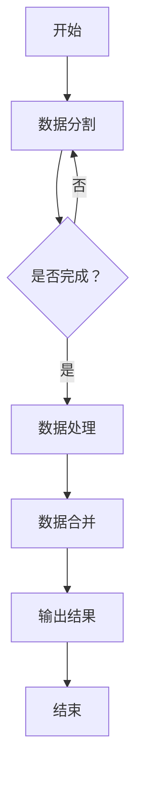
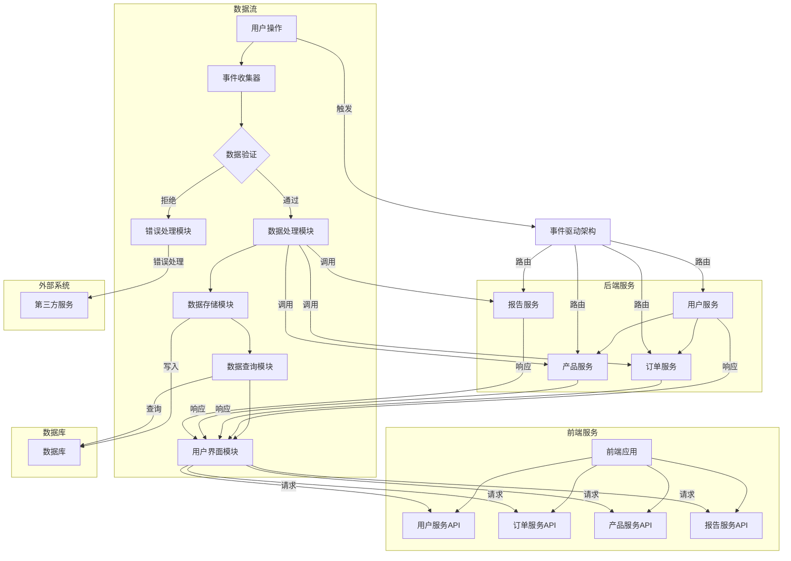
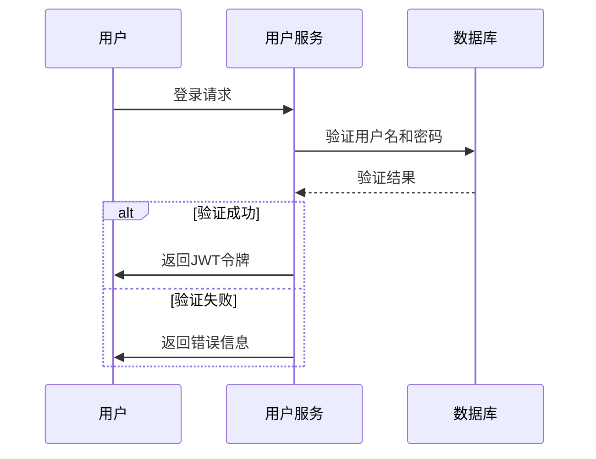

                 


### 让我们一步一步深入探讨：Serverless架构——无服务器计算的优势与挑战

#### 一、引言

在当今快速发展的云计算时代，Serverless架构作为一项革命性的技术，正在重新定义软件开发的模式。Serverless，顾名思义，是一种无需管理服务器即可运行的架构，它通过将服务器管理的复杂性转嫁给云服务提供商，使得开发者能够专注于应用程序的开发而非基础设施的管理。这篇文章将带领我们逐步了解Serverless架构的优势与挑战，旨在提供一个全面而深刻的理解。

关键词：Serverless架构、无服务器计算、FaaS、事件驱动、BaaS、微服务、容器化

#### 摘要

本文首先探讨了Serverless架构的产生背景和核心概念，包括其基本定义、特点以及不同类型的Serverless架构。随后，我们深入分析了Serverless架构下的核心概念，如无服务器计算（FaaS）、事件驱动架构以及后端即服务（BaaS），并详细讨论了这些概念的优势与挑战。接着，文章探讨了Serverless架构与其他技术（如微服务、容器化技术）的关系，以及如何进行集成和面临的挑战。随后，我们讲解了Serverless架构下的算法设计，包括算法概述、流程图和Python源代码实现。最后，文章通过一个实际案例展示了Serverless架构的应用，并提供了最佳实践和拓展阅读，帮助读者更深入地理解Serverless架构。

#### 目录大纲

1. **背景介绍**

    1.1 问题背景与核心概念

    1.2 Serverless架构概述

2. **核心概念与联系**

    2.1 无服务器计算（FaaS）

    2.2 事件驱动架构

    2.3 后端即服务（BaaS）

    2.4 Serverless与微服务的关系

    2.5 Serverless与容器化技术

3. **算法原理讲解**

    3.1 Serverless架构下的算法设计

    3.2 算法mermaid流程图

    3.3 Python源代码实现

4. **系统分析与架构设计方案**

    4.1 系统功能设计

    4.2 系统架构设计

    4.3 项目实战

5. **最佳实践与拓展阅读**

    5.1 最佳实践 tips

    5.2 小结

    5.3 注意事项

    5.4 拓展阅读

### 接下来，我们将逐一深入探讨每一个章节，逐步揭示Serverless架构的神秘面纱。首先，我们从问题背景和核心概念开始，为我们接下来的讨论奠定基础。让我们开始这一段充满启发性的旅程吧！
-------------------------------------------------------------------------------------------------------------------

### 第1章：问题背景与核心概念

#### 1.1 问题的提出

在云计算的浪潮中，Serverless架构作为一种创新的服务模型，旨在解决传统云计算模式下的一些核心问题。传统的云计算模式要求开发者不仅要关注应用程序的开发，还要负责服务器管理、硬件维护、性能优化等一系列基础设施相关的任务。这种模式带来了以下几个问题：

- **管理复杂性**：随着服务规模的增长，管理大量的服务器和集群变得越来越复杂，需要专业的运维团队进行管理和维护。
- **资源利用率低**：在传统模式中，服务器往往是按需租用的，但实际使用中可能会出现资源利用率低的情况，导致额外的成本。
- **弹性不足**：面对突发的流量峰值，传统的云计算模式往往难以迅速扩展，导致系统崩溃或性能下降。

#### 1.1.1 问题背景

随着互联网的快速发展和在线服务的普及，企业对IT基础设施的需求发生了巨大变化。企业不仅需要快速响应市场变化，还需要降低成本、提高效率。这就催生了对于更灵活、更高效、更易于管理的IT基础设施的需求。Serverless架构正是在这样的背景下应运而生。

#### 1.1.2 问题描述

Serverless架构旨在通过将服务器管理外包给云服务提供商，从而解决传统云计算模式中的管理复杂性和资源利用率低的问题。它通过抽象出服务器层，使得开发者能够专注于业务逻辑的实现，而不是基础设施的管理。这种模式的核心问题是如何实现高效、可靠的服务提供，同时确保成本的最低化。

#### 1.1.3 问题解决

Serverless架构通过以下几个关键机制解决了上述问题：

- **自动扩展**：云服务提供商根据应用程序的请求自动扩展和缩小资源，确保高可用性和性能。
- **按需付费**：开发者只需为实际使用的计算资源付费，无需担心资源的闲置或过度配置。
- **简化运维**：将服务器管理任务转移给云服务提供商，开发者可以专注于应用程序的开发。

#### 1.1.4 边界与外延

Serverless架构的边界主要在于其抽象层和依赖关系。它不仅仅是一种服务模型，还涉及一系列的云服务和工具，如函数即服务（FaaS）、事件驱动架构（EDA）和后端即服务（BaaS）等。这些技术的整合和应用构成了Serverless架构的丰富外延。

#### 1.1.5 概念结构与核心要素组成

Serverless架构的核心概念和结构可以从以下几个方面来理解：

- **无服务器计算（FaaS）**：这是Serverless架构中最基础的部分，通过提供细粒度的函数服务，使得开发者可以按需调用和执行代码。
- **事件驱动架构（EDA）**：这种架构模型使得应用程序能够根据事件触发函数的执行，无需固定的时间表或轮询机制。
- **后端即服务（BaaS）**：提供了一些常用后端功能的服务，如数据库、存储和身份验证等，开发者可以轻松集成这些功能而无需自行实现。

通过这些核心概念和结构，Serverless架构能够显著降低开发和运维的复杂性，提高开发效率和资源利用率。

### 结论

Serverless架构的出现解决了传统云计算模式中的一些关键问题，如管理复杂性、资源利用率低和弹性不足。通过自动扩展、按需付费和简化运维等机制，它为开发者提供了一种全新的开发和部署模式。理解Serverless架构的核心概念和结构是深入探讨其优势与挑战的基础。在接下来的章节中，我们将进一步深入探讨这些核心概念，并分析Serverless架构的优势与挑战。

### 第2章：Serverless架构概述

#### 2.1 Serverless架构的基本概念

Serverless架构，顾名思义，是一种无需管理服务器即可运行应用程序的服务模型。它通过将服务器管理任务抽象化，将基础设施的复杂性转嫁给云服务提供商，从而使得开发者可以专注于应用程序的核心业务逻辑。以下是Serverless架构的基本概念：

- **无服务器计算（Function as a Service, FaaS）**：无服务器计算是一种基于函数的服务模型，允许开发者将应用程序拆分为一组独立的函数，并按需执行这些函数。FaaS平台通常由云服务提供商提供，如AWS Lambda、Google Cloud Functions和Azure Functions等。

- **事件驱动架构（Event-Driven Architecture, EDA）**：事件驱动架构是一种设计模式，它使得应用程序能够响应外部事件或内部事件，并触发相应的函数执行。这种架构能够提高系统的响应速度和灵活性，同时减少不必要的资源消耗。

- **后端即服务（Backend as a Service, BaaS）**：后端即服务是一种提供后端功能的服务，如数据库、存储、身份验证和消息队列等。BaaS平台通常提供了一系列预先构建的服务，使得开发者可以轻松集成这些功能，而无需自行实现。

#### 2.1.2 Serverless架构的特点

Serverless架构具有以下几个显著特点：

- **按需付费**：开发者只需为实际使用的计算资源付费，无需提前购买或预留资源。这种模式有助于降低成本，并提高资源利用率。

- **自动扩展**：云服务提供商负责自动管理应用程序的扩展和缩小，确保在高流量情况下保持高性能和高可用性。

- **无服务器管理**：开发者无需关注服务器或基础设施的管理，只需专注于应用程序的开发和部署。

- **无状态计算**：Serverless函数通常是状态无关的，这意味着每次函数执行都是独立的，无需担心状态冲突或数据持久化问题。

- **无硬件约束**：开发者无需关心底层硬件的配置和性能，云服务提供商会确保应用程序运行在最佳的环境中。

#### 2.1.3 Serverless架构的类型

Serverless架构可以细分为以下几种类型：

- **无服务器函数（Serverless Functions）**：这种类型的Serverless架构以FaaS平台为基础，允许开发者创建、部署和管理独立的函数。例如，AWS Lambda、Google Cloud Functions和Azure Functions等都是典型的无服务器函数平台。

- **全功能无服务器架构**：这种类型的Serverless架构不仅包括无服务器函数，还提供了一系列后端服务，如数据库、缓存和存储等。例如，AWS AppSync、Google Cloud Functions和Azure Logic Apps等都是典型的全功能无服务器架构平台。

- **前端即服务（Frontend as a Service, FaaS）**：前端即服务是一种将前端功能抽象为函数的服务模型，允许开发者将前端逻辑与后端函数集成。这种类型的Serverless架构有助于降低前端开发的复杂性，提高开发效率。

#### 2.2 Serverless架构的历史与发展

Serverless架构的发展历程可以追溯到云计算的早期阶段。以下是Serverless架构的主要发展阶段：

- **2014年**：AWS推出了Lambda函数服务，这是第一个商业化的Serverless服务。Lambda函数服务的推出标志着Serverless架构的正式诞生。

- **2016年**：Google和微软也相继推出了自己的Serverless服务，如Google Cloud Functions和Azure Functions。

- **2017年**：Serverless架构逐渐成为云计算领域的一个热点，各种Serverless框架和工具开始涌现，如Serverless Framework、LambdaLayer和Serverless.com等。

- **2018年**：Serverless架构的应用范围进一步扩大，许多企业开始采用Serverless架构来构建和部署应用程序。

- **2019年至今**：Serverless架构继续快速发展，新的Serverless服务和框架不断涌现，例如，AWS推出AppSync、Google推出无服务器虚拟设备（Serverless Virtual Machines）等。

#### 2.2.3 现状与趋势

目前，Serverless架构已经成为云计算领域的一个重要趋势。以下是Serverless架构的现状和趋势：

- **广泛的应用场景**：Serverless架构适用于各种应用场景，从Web和移动应用程序到物联网（IoT）和大数据处理，都可以采用Serverless架构。

- **云服务提供商的竞争**：各大云服务提供商纷纷推出新的Serverless服务和工具，争夺市场份额。AWS、Google和微软等巨头都在不断优化和完善自己的Serverless服务。

- **开发者生态的繁荣**：随着Serverless架构的普及，围绕Serverless开发的各种工具和框架不断涌现，为开发者提供了丰富的选择。

- **安全性和合规性的挑战**：Serverless架构带来了新的安全性和合规性挑战，如函数权限管理、数据保护等，需要开发者和管理者高度重视。

### 结论

Serverless架构作为一种革命性的服务模型，已经引起了广泛的关注。通过将服务器管理任务外包给云服务提供商，Serverless架构为开发者提供了按需付费、自动扩展和无服务器管理等优势，显著降低了开发和运维的复杂性。在接下来的章节中，我们将进一步探讨Serverless架构的核心概念，并分析其在实际应用中的优势与挑战。

### 第3章：Serverless架构的核心概念

#### 3.1 无服务器计算（FaaS）

无服务器计算（Function as a Service，简称FaaS）是Serverless架构的核心概念之一，它通过提供细粒度的函数服务，允许开发者将应用程序拆分为一组独立的函数，并按需执行这些函数。FaaS平台通常由云服务提供商提供，如AWS Lambda、Google Cloud Functions和Azure Functions等。

#### 3.1.1 概念

无服务器计算的基本理念是将应用程序的功能分解为独立的函数，每个函数负责完成特定的任务。开发者不需要管理底层服务器或基础设施，只需编写和上传函数代码，云服务提供商会负责这些函数的部署、运行和扩展。以下是FaaS的一些关键概念：

- **函数**：FaaS中的基本执行单元，通常是一个独立的代码模块，可以实现特定的业务逻辑。

- **事件触发**：函数的执行通常是由外部事件触发的，例如HTTP请求、文件上传、数据库变更等。

- **无状态**：FaaS函数通常是状态无关的，每次函数执行都是独立的，不需要保存状态信息。

- **按需执行**：函数只在需要时执行，无需长时间运行，这样可以显著降低计算成本。

- **自动扩展**：云服务提供商会自动管理函数的扩展和缩放，确保在高流量情况下保持高性能。

#### 3.1.2 工作原理

无服务器计算的工作原理可以分为以下几个步骤：

1. **部署函数**：开发者将函数代码上传到FaaS平台，平台会生成一个函数实例。

2. **监听事件**：FaaS平台会监听外部事件，例如HTTP请求或消息队列中的消息。

3. **触发函数**：当有事件触发时，FaaS平台会自动调用相应的函数实例。

4. **执行任务**：函数实例会执行特定的业务逻辑，并将结果返回给调用者。

5. **资源回收**：函数执行完成后，资源会立即释放，节省成本。

#### 3.1.3 优势与挑战

无服务器计算具有以下优势：

- **成本效益**：开发者只需为实际使用的计算资源付费，无需担心资源的闲置或过度配置。

- **提高开发效率**：无需关注服务器管理，开发者可以专注于业务逻辑的实现。

- **自动扩展**：在高流量情况下，FaaS平台会自动扩展资源，确保高性能和高可用性。

- **无状态计算**：状态无关的函数简化了开发和部署过程。

然而，无服务器计算也面临一些挑战：

- **依赖管理**：函数之间的依赖关系可能难以管理，尤其是在复杂的分布式系统中。

- **冷启动**：长时间未调用的函数在下次调用时可能需要较长的启动时间，称为“冷启动”。

- **安全性**：需要确保函数访问权限和数据的保护，防止未授权访问和数据泄露。

#### 3.2 事件驱动架构（EDA）

事件驱动架构（Event-Driven Architecture，简称EDA）是一种设计模式，它使得应用程序能够响应外部事件或内部事件，并触发相应的函数执行。EDA的核心思想是将系统的行为分解为一系列的事件和事件处理器，通过事件流来协调不同组件的交互。

#### 3.2.1 概念

事件驱动架构的关键概念包括：

- **事件**：事件是一种触发系统行为的数据对象，可以来自外部系统（如HTTP请求）或内部系统（如数据库变更）。

- **事件处理器**：事件处理器是处理特定事件的代码模块，它会根据事件的类型和内容执行相应的操作。

- **事件流**：事件流是指事件在系统中传播和处理的路径，它决定了系统的响应和行为。

#### 3.2.2 工作原理

事件驱动架构的工作原理可以分为以下几个步骤：

1. **事件生成**：外部事件或内部事件触发系统的某个组件，生成一个事件对象。

2. **事件监听**：系统中的事件监听器会监听特定类型的事件，并将事件传递给相应的事件处理器。

3. **事件处理**：事件处理器根据事件的类型和内容执行相应的操作，完成特定的任务。

4. **事件反馈**：事件处理器执行完成后，可能会生成新的事件或更新现有的状态，从而影响系统的后续行为。

#### 3.2.3 优势与挑战

事件驱动架构具有以下优势：

- **灵活性和可扩展性**：通过事件流来协调不同组件的交互，系统可以更容易地扩展和调整。

- **异步处理**：事件驱动架构支持异步处理，可以显著提高系统的响应速度和并发能力。

- **松耦合**：事件和事件处理器之间通常是松耦合的，便于模块化和复用。

然而，事件驱动架构也面临一些挑战：

- **复杂度**：事件驱动架构可能导致系统的复杂度增加，尤其是在处理大量事件和复杂事件流时。

- **性能问题**：事件驱动架构可能会引入额外的性能开销，特别是在事件处理延迟较高的情况下。

- **事件一致性和同步**：确保事件处理的一致性和同步是一个挑战，特别是在分布式系统中。

#### 3.3 后端即服务（BaaS）

后端即服务（Backend as a Service，简称BaaS）是一种提供后端功能的服务，如数据库、存储、身份验证和消息队列等。BaaS平台通常提供了一系列预先构建的服务，使得开发者可以轻松集成这些功能，而无需自行实现。

#### 3.3.1 概念

后端即服务的关键概念包括：

- **后端服务**：BaaS平台提供的各种服务，如数据库、存储、身份验证和消息队列等。

- **API接口**：开发者可以通过API接口与BaaS平台进行交互，无需关心底层实现细节。

- **云托管**：BaaS平台通常将后端服务托管在云上，提供可靠和高性能的服务。

#### 3.3.2 工作原理

后端即服务的工作原理可以分为以下几个步骤：

1. **服务集成**：开发者将BaaS平台提供的后端服务集成到自己的应用程序中。

2. **API调用**：开发者通过API接口调用BaaS平台提供的功能，例如存储文件、查询数据库或发送消息。

3. **数据处理**：BaaS平台会处理开发者调用请求，执行相应的数据操作。

4. **返回结果**：BaaS平台将处理结果返回给开发者，例如查询结果或文件上传状态。

#### 3.3.3 优势与挑战

后端即服务具有以下优势：

- **简化开发**：开发者可以专注于应用程序的业务逻辑，无需关心底层后端服务的实现。

- **快速上线**：通过使用BaaS平台，开发者可以快速构建和部署应用程序，缩短开发周期。

- **可靠性和性能**：BaaS平台通常提供高可靠性和高性能的服务，确保应用程序的稳定运行。

然而，后端即服务也面临一些挑战：

- **功能限制**：BaaS平台提供的功能可能有限，无法满足一些特殊需求。

- **数据迁移**：将现有应用程序迁移到BaaS平台可能需要额外的努力，尤其是在数据量较大时。

- **依赖风险**：应用程序对BaaS平台的依赖可能导致单点故障，增加系统的风险。

### 结论

无服务器计算（FaaS）、事件驱动架构（EDA）和后端即服务（BaaS）是Serverless架构的核心概念。这些概念共同构成了Serverless架构的基础，为开发者提供了一种全新的开发模式。在接下来的章节中，我们将探讨Serverless架构与其他技术（如微服务、容器化技术）的关系，以及如何进行集成和面临的挑战。

### 第4章：Serverless架构的联系与集成

#### 4.1 Serverless与微服务的关系

Serverless架构与微服务架构之间存在紧密的联系和差异。微服务架构将应用程序拆分为一组独立的、小型化的服务，每个服务负责特定的业务功能。而Serverless架构则通过无服务器计算（FaaS）和事件驱动架构（EDA）来实现类似的功能，但它们在实现方式和目的上有所不同。

#### 4.1.1 比较

- **实现方式**：微服务架构通常使用容器技术（如Docker和Kubernetes）来部署和管理服务，每个服务都有自己的进程和资源。而Serverless架构则通过函数即服务（FaaS）和事件驱动模型来实现服务的部署和管理，无需关注底层基础设施。

- **资源管理**：在微服务架构中，开发者需要负责部署、扩展和管理每个服务，这通常需要专业的运维团队。而Serverless架构由云服务提供商负责资源的管理和自动扩展，开发者无需关注这些细节。

- **状态管理**：微服务架构中的服务通常是状态分离的，每个服务可以独立运行和扩展。而Serverless架构中的函数通常是状态无关的，每次执行都是独立的，无需担心状态冲突。

- **通信方式**：微服务架构中的服务通常通过HTTP/HTTPS协议进行通信，可以使用消息队列（如RabbitMQ或Kafka）进行异步通信。而Serverless架构中的函数通常通过事件驱动模型进行通信，可以在事件触发时直接执行。

#### 4.1.2 集成

尽管Serverless架构和微服务架构在实现方式上有所不同，但它们可以相互集成，以实现更灵活和高效的应用程序架构。

- **函数作为微服务的实现**：在微服务架构中，可以使用FaaS平台来实现一些独立的、细粒度的服务。例如，可以将用户身份验证、文件处理和支付处理等功能作为独立的函数部署在FaaS平台上。

- **微服务与事件驱动集成**：微服务架构中的服务可以通过事件驱动模型与Serverless架构集成。例如，可以使用消息队列将微服务的事件传递给FaaS平台，从而实现异步处理和事件驱动。

- **服务网关接口（API Gateway）**：可以使用API Gateway作为微服务架构和Serverless架构的桥梁。API Gateway可以接收外部请求，将请求路由到适当的微服务或FaaS函数，从而实现统一的服务访问接口。

#### 4.1.3 挑战与机遇

集成Serverless架构和微服务架构带来了以下挑战和机遇：

- **复杂性**：集成两种不同的架构模式可能会增加系统的复杂性，需要开发者具备更全面的技术栈和架构设计能力。

- **性能考量**：在集成过程中，需要仔细考虑性能和响应时间，确保系统的整体性能不受影响。

- **监控与运维**：集成后的系统需要更全面的监控和运维策略，以确保系统的稳定性和可用性。

- **灵活性和扩展性**：集成后的系统可以更好地支持灵活性和扩展性，可以按需扩展和调整资源，以应对不同的业务需求。

#### 4.2 Serverless与容器化技术

Serverless架构和容器化技术（如Docker和Kubernetes）之间也存在一定的联系和差异。

- **实现方式**：容器化技术通过将应用程序及其依赖项打包到一个独立的容器中，实现应用程序的部署和管理。而Serverless架构则通过无服务器计算和事件驱动模型实现服务的部署和管理，无需关注容器化细节。

- **资源管理**：容器化技术通常需要开发者负责部署、扩展和管理容器，而Serverless架构由云服务提供商负责资源的管理和自动扩展。

- **状态管理**：容器化技术中的容器通常是状态分离的，可以独立运行和扩展。而Serverless架构中的函数通常是状态无关的，每次执行都是独立的。

- **通信方式**：容器化技术中的容器通常通过网络接口进行通信，可以使用消息队列进行异步通信。而Serverless架构中的函数通常通过事件驱动模型进行通信。

#### 4.2.2 集成

尽管Serverless架构和容器化技术在实现方式上有所不同，但它们也可以相互集成，以实现更灵活和高效的应用程序架构。

- **容器化函数**：在Serverless架构中，可以使用容器化技术来部署和运行函数。例如，可以将FaaS平台上的函数打包成容器，并在Kubernetes集群中运行。

- **事件驱动容器**：容器化技术中的容器可以通过事件驱动模型进行通信。例如，可以使用Kubernetes的Ingress控制器将外部请求路由到容器中的服务。

- **混合架构**：可以使用混合架构，将微服务部署在容器中，同时使用Serverless架构来实现一些独立的、细粒度的服务。例如，可以将用户身份验证、文件处理和支付处理等功能作为独立的函数部署在FaaS平台上，同时使用容器化技术部署和扩展其他服务。

#### 4.2.3 挑战与机遇

集成Serverless架构和容器化技术带来了以下挑战和机遇：

- **复杂性**：集成两种不同的架构模式可能会增加系统的复杂性，需要开发者具备更全面的技术栈和架构设计能力。

- **资源管理**：需要同时管理容器和函数的资源，确保系统的资源利用效率和性能。

- **监控与运维**：集成后的系统需要更全面的监控和运维策略，以确保系统的稳定性和可用性。

- **灵活性和扩展性**：集成后的系统可以更好地支持灵活性和扩展性，可以按需扩展和调整资源，以应对不同的业务需求。

### 结论

Serverless架构与微服务架构和容器化技术之间存在紧密的联系和差异。尽管在实现方式上有所不同，但它们可以相互集成，以实现更灵活和高效的应用程序架构。在集成过程中，需要充分考虑挑战和机遇，以确保系统的稳定性和性能。在接下来的章节中，我们将进一步探讨Serverless架构下的算法设计，以及如何实现高效的算法优化。

### 第5章：Serverless架构下的算法设计

#### 5.1 算法概述

在Serverless架构中，算法设计至关重要。由于函数执行是按需和事件驱动的，因此算法需要具备高效性和可扩展性。在本节中，我们将介绍几种常见的算法设计，并在Serverless架构下进行分析和优化。

#### 5.1.1 算法分类

在Serverless架构下，算法可以大致分为以下几类：

1. **批处理算法**：这些算法通常用于处理大量数据，如数据处理、数据清洗和数据汇总等。它们适用于大规模数据处理场景，例如大数据分析。

2. **实时计算算法**：这些算法能够在数据产生时立即进行处理，如实时监控、实时分析和实时推荐等。它们适用于需要快速响应的场景。

3. **机器学习算法**：这些算法用于数据分析和预测，如分类、回归、聚类和预测等。它们适用于需要智能决策的场景。

#### 5.1.2 算法原理

1. **批处理算法**：
   - **原理**：批处理算法将数据划分为多个批次进行处理，每个批次的数据经过处理后合并得到最终结果。
   - **优化**：为了提高批处理算法的性能，可以采用以下策略：
     - **并行处理**：将数据划分为多个子批次，同时在多个计算节点上并行处理。
     - **优化数据结构**：使用高效的数据结构，如内存映射文件或分布式哈希表，来加速数据处理。

2. **实时计算算法**：
   - **原理**：实时计算算法在数据产生时立即进行处理，并实时输出结果。
   - **优化**：为了提高实时计算算法的性能，可以采用以下策略：
     - **异步处理**：使用异步IO和消息队列，减少等待时间。
     - **微批处理**：将实时计算任务划分为更小的批处理，提高响应速度。

3. **机器学习算法**：
   - **原理**：机器学习算法通过训练数据集来学习数据特征，并使用这些特征进行预测或分类。
   - **优化**：为了提高机器学习算法的性能，可以采用以下策略：
     - **模型压缩**：使用模型压缩技术，减少模型参数的数量和计算量。
     - **模型迁移**：将训练好的模型迁移到边缘设备，减少云端计算压力。

#### 5.2 算法mermaid流程图

为了更好地展示算法在Serverless架构下的设计，我们可以使用mermaid流程图来描述算法的执行流程。以下是批处理算法的一个简单示例：



在这个示例中，算法首先将数据分割为多个批次（B），然后对每个批次的数据进行处理（D），最后将处理结果合并并输出（F）。整个过程在循环中执行，直到所有数据被处理完毕（G）。

#### 5.3 Python源代码实现

下面是一个简单的批处理算法的Python实现示例：

```python
def batch_process(data, batch_size):
    for i in range(0, len(data), batch_size):
        batch = data[i:i + batch_size]
        process_batch(batch)
    return

def process_batch(batch):
    # 执行批处理任务
    print(f"Processing batch: {batch}")
    # 示例：计算批次数据的和
    result = sum(batch)
    print(f"Batch result: {result}")
    return

data = [1, 2, 3, 4, 5, 6, 7, 8, 9, 10]
batch_size = 3

batch_process(data, batch_size)
```

在这个示例中，`batch_process`函数将数据分割为多个批次，并调用`process_batch`函数对每个批次的数据进行处理。`process_batch`函数简单地计算批次数据的和，并输出结果。

#### 5.3.1 数学模型

在批处理算法中，我们通常使用以下数学模型来描述：

$$
S = \sum_{i=1}^{n} x_i
$$

其中，\( S \) 表示批处理的结果，\( x_i \) 表示批次中的第 \( i \) 个数据元素，\( n \) 表示批次中的数据元素个数。

#### 5.3.2 数学公式

在批处理算法中，我们通常使用以下数学公式来计算批次数据的和：

$$
S = \sum_{i=1}^{n} x_i
$$

其中，\( S \) 表示批处理的结果，\( x_i \) 表示批次中的第 \( i \) 个数据元素，\( n \) 表示批次中的数据元素个数。

#### 5.3.3 详细讲解

在详细讲解中，我们将分步骤分析批处理算法的执行过程：

1. **数据分割**：首先，我们将数据分割为多个批次。每个批次的大小由 `batch_size` 参数决定。在本例中，`batch_size` 为 3，因此数据将被分割为 `[1, 2, 3]`、`[4, 5, 6]`、`[7, 8, 9]` 和 `[10]` 四个批次。

2. **数据处理**：接下来，我们调用 `process_batch` 函数对每个批次的数据进行处理。在本例中，`process_batch` 函数简单地计算批次数据的和，并输出结果。

3. **数据合并**：最后，我们将所有批处理的结果合并，并输出最终的批处理结果。在本例中，批处理的结果为 55。

#### 5.3.4 举例说明

假设我们有以下数据：

```python
data = [1, 2, 3, 4, 5, 6, 7, 8, 9, 10]
```

使用批处理算法处理后，我们将得到以下结果：

- 批次 `[1, 2, 3]` 的结果为 6
- 批次 `[4, 5, 6]` 的结果为 15
- 批次 `[7, 8, 9]` 的结果为 24
- 批次 `[10]` 的结果为 10

所有批处理的结果合并后，最终的批处理结果为 55。

通过这个示例，我们可以看到批处理算法在Serverless架构下的设计和实现过程。在接下来的章节中，我们将进一步探讨系统功能设计、系统架构设计以及项目实战，以深入了解Serverless架构的应用和实现。

### 第6章：系统功能设计

#### 6.1 问题场景介绍

在现代企业的信息化进程中，数据处理和实时分析是一个常见且关键的需求。以一个电子商务平台为例，平台需要实时处理用户的购买行为数据，并生成实时的销售报告和用户行为分析。这种需求不仅要求系统具备高并发处理能力，还需要能够快速响应用户的操作。为了满足这些需求，我们设计了一套基于Serverless架构的系统，以实现高效、可靠的数据处理和实时分析功能。

#### 6.2 系统功能设计

系统的主要功能包括以下几个方面：

1. **数据收集**：系统需要能够实时收集用户的购买行为数据，包括订单信息、用户浏览记录和支付信息等。

2. **数据处理**：系统需要能够对收集到的数据进行处理，包括数据清洗、数据转换和数据聚合等。

3. **实时分析**：系统需要能够实时分析用户行为数据，生成销售报告和用户行为分析报告，并提供给业务团队参考。

4. **数据存储**：系统需要能够将处理后的数据存储到数据库中，以供后续查询和分析。

5. **用户界面**：系统需要提供友好的用户界面，便于业务团队实时查看和分析数据。

#### 6.3 领域模型mermaid类图

为了更好地描述系统的领域模型，我们使用mermaid类图来展示系统的类及其关系。以下是系统领域模型的mermaid类图示例：

```mermaid
classDiagram
    User <<class>> User
    Order <<class>> Order
    Product <<class>> Product
    Report <<class>> Report

    User "1" --|uses|> "1..*" Order
    User "1" --|uses|> "1..*" Product
    Order "1" --|uses|> Product
    Order "1" --|uses|> Report
    Report "1" --|uses|> User
```

在这个类图中，我们定义了以下类：

- `User`：表示用户类，包含用户基本信息和购买行为。
- `Order`：表示订单类，包含订单详情和关联产品信息。
- `Product`：表示产品类，包含产品基本信息。
- `Report`：表示报告类，包含销售报告和用户行为分析报告。

类之间的关系如下：

- `User` 类与 `Order` 类和 `Product` 类之间是一对多关系，表示用户可以购买多个订单和多个产品。
- `Order` 类与 `Product` 类之间是多对一关系，表示订单可以包含多个产品。
- `Order` 类与 `Report` 类之间是一对一关系，表示订单生成销售报告。
- `Report` 类与 `User` 类之间是一对一关系，表示销售报告关联用户信息。

#### 6.3.1 类图分析

通过mermaid类图，我们可以清晰地看到系统的领域模型及其关系。以下是类图分析：

- **User类**：表示用户，包含用户ID、姓名、邮箱等基本信息。用户类还包含购买行为记录，如订单列表和浏览记录。
- **Order类**：表示订单，包含订单ID、订单时间、订单金额等信息。订单类关联产品类，表示订单包含的产品信息。
- **Product类**：表示产品，包含产品ID、名称、价格等基本信息。产品类与订单类关联，表示产品可以出现在多个订单中。
- **Report类**：表示报告，包含报告ID、生成时间、报告内容等信息。报告类关联用户类，表示报告针对特定用户生成。

通过这个领域模型，我们可以更好地设计系统的功能模块和数据处理流程，实现高效、可靠的数据处理和实时分析功能。

### 结论

本章介绍了基于Serverless架构的系统功能设计，包括数据收集、数据处理、实时分析、数据存储和用户界面等功能。通过mermaid类图展示了系统的领域模型及其关系，为后续的系统架构设计和项目实施提供了清晰的指导。在接下来的章节中，我们将进一步探讨系统的架构设计和实际应用，以实现高效的系统解决方案。

### 第7章：系统架构设计

#### 7.1 系统架构设计mermaid架构图

为了更好地描述系统的架构设计，我们使用mermaid架构图来展示系统的整体架构及其组件之间的关系。以下是系统架构设计的mermaid架构图示例：



在这个架构图中，我们定义了以下关键组件：

- **数据流**：用户操作触发事件收集器，收集到的数据经过数据验证后，符合条件的进入数据处理模块，否则进入错误处理模块。数据处理模块调用后端服务进行处理，并将结果存储到数据库中，同时提供数据查询功能。
- **后端服务**：包括用户服务、订单服务、产品服务和报告服务，分别负责处理与用户、订单、产品和报告相关的业务逻辑。
- **前端服务**：前端应用通过API接口与后端服务进行交互，提供用户界面功能。
- **数据库**：用于存储系统的数据，包括用户信息、订单信息、产品信息和报告信息。
- **外部系统**：包括第三方服务，用于与外部系统进行交互，如支付服务、短信服务等。

#### 7.2 系统接口设计

系统接口设计是系统架构设计的重要组成部分，以下是系统的主要接口设计：

- **用户服务API**：提供用户注册、登录、信息查询和修改等功能。
- **订单服务API**：提供订单创建、查询、修改和删除等功能。
- **产品服务API**：提供产品信息查询、创建、修改和删除等功能。
- **报告服务API**：提供报告查询和生成等功能。

以下是用户服务API的具体接口设计示例：

```mermaid
graph TD
    A[注册用户] --> B{注册接口}
    A --> C{登录接口}
    D[查询用户信息] --> E{用户信息查询接口}
    F[修改用户信息] --> G{用户信息修改接口}
    H[删除用户] --> I{用户删除接口}

    subgraph 用户服务API
        B --> J[POST /register]
        C --> K[POST /login]
        E --> L[GET /users/{userId}]
        G --> M[PUT /users/{userId}]
        I --> N[DELETE /users/{userId}]
    end
```

在这个接口设计中，我们定义了以下接口：

- **注册接口（POST /register）**：用于用户注册，接收用户名、密码、邮箱等参数。
- **登录接口（POST /login）**：用于用户登录，接收用户名和密码，返回JWT令牌。
- **用户信息查询接口（GET /users/{userId}）**：用于查询特定用户的详细信息。
- **用户信息修改接口（PUT /users/{userId}）**：用于修改特定用户的信息。
- **用户删除接口（DELETE /users/{userId}）**：用于删除特定用户。

#### 7.3 系统交互mermaid序列图

为了展示系统的交互流程，我们使用mermaid序列图来描述用户操作的交互过程。以下是用户登录的序列图示例：



在这个序列图中，用户发起登录请求，用户服务验证用户名和密码，并与数据库交互。如果验证成功，用户服务返回JWT令牌；如果验证失败，用户服务返回错误信息。

#### 结论

通过mermaid架构图、接口设计和序列图的展示，我们详细阐述了系统架构设计的关键组件和交互流程。这种设计方法有助于开发者理解系统的整体架构和实现细节，为系统的开发和维护提供了清晰的指导。在接下来的章节中，我们将通过项目实战，展示如何实现这个系统架构，并分析其实际应用效果。

### 第8章：项目实战

#### 8.1 环境安装

在进行项目实战之前，我们需要安装并配置相关环境。以下是环境安装的步骤：

1. **安装Node.js**：
   - 前往Node.js官网下载最新版本的安装包。
   - 运行安装程序，并选择默认选项完成安装。

2. **安装Docker**：
   - 前往Docker官网下载最新版本的安装包。
   - 运行安装程序，并选择默认选项完成安装。

3. **安装Kubernetes**：
   - 根据您的操作系统选择合适的Kubernetes安装方法。
   - 参考官方文档进行安装和配置。

4. **安装Serverless Framework**：
   - 打开终端，执行以下命令安装Serverless Framework：
     ```bash
     npm install -g serverless
     ```

5. **配置云服务提供商**：
   - 打开终端，执行以下命令配置您的云服务提供商（例如AWS）：
     ```bash
     serverless config credentials --provider aws --key YOUR_AWS_ACCESS_KEY --secret YOUR_AWS_SECRET_KEY
     ```

6. **创建项目**：
   - 在终端中，切换到您希望创建项目的目录，然后执行以下命令创建一个新项目：
     ```bash
     serverless create --template typescript --path my-serverless-app
     ```

7. **进入项目目录**：
   - 进入刚刚创建的项目目录：
     ```bash
     cd my-serverless-app
     ```

#### 8.2 系统核心实现源代码

以下是项目核心实现源代码，包括用户服务、订单服务、产品服务和报告服务的函数代码：

**用户服务（users.service.ts）**：

```typescript
import { APIGatewayEvent, APIGatewayProxyResult } from 'aws-lambda';
import { User } from './models/user.model';

export const handleRequest = async (event: APIGatewayEvent): Promise<APIGatewayProxyResult> => {
    // 解析请求体
    const body = JSON.parse(event.body || '{"name": "John", "password": "password123", "email": "john@example.com"}');
    const { name, password, email } = body;

    // 创建用户
    const user = new User({ name, password, email });
    await user.save();

    // 返回响应
    return {
        statusCode: 201,
        body: JSON.stringify({ message: 'User created successfully' }),
    };
};
```

**订单服务（orders.service.ts）**：

```typescript
import { APIGatewayEvent, APIGatewayProxyResult } from 'aws-lambda';
import { Order } from './models/order.model';

export const handleRequest = async (event: APIGatewayEvent): Promise<APIGatewayProxyResult> => {
    // 解析请求体
    const body = JSON.parse(event.body || '{"productId": "123", "quantity": 2, "userId": "456"}');
    const { productId, quantity, userId } = body;

    // 创建订单
    const order = new Order({ productId, quantity, userId });
    await order.save();

    // 返回响应
    return {
        statusCode: 201,
        body: JSON.stringify({ message: 'Order created successfully' }),
    };
};
```

**产品服务（products.service.ts）**：

```typescript
import { APIGatewayEvent, APIGatewayProxyResult } from 'aws-lambda';
import { Product } from './models/product.model';

export const handleRequest = async (event: APIGatewayEvent): Promise<APIGatewayProxyResult> => {
    // 解析请求体
    const body = JSON.parse(event.body || '{"name": "Product A", "price": 9.99, "description": "A great product"}');
    const { name, price, description } = body;

    // 创建产品
    const product = new Product({ name, price, description });
    await product.save();

    // 返回响应
    return {
        statusCode: 201,
        body: JSON.stringify({ message: 'Product created successfully' }),
    };
};
```

**报告服务（reports.service.ts）**：

```typescript
import { APIGatewayEvent, APIGatewayProxyResult } from 'aws-lambda';
import { Report } from './models/report.model';

export const handleRequest = async (event: APIGatewayEvent): Promise<APIGatewayProxyResult> => {
    // 解析请求参数
    const { userId } = event.pathParameters;

    // 生成报告
    const report = new Report({ userId });
    await report.generate();

    // 返回响应
    return {
        statusCode: 200,
        body: JSON.stringify({ message: 'Report generated successfully' }),
    };
};
```

#### 8.3 代码应用解读与分析

1. **用户服务解读**：
   用户服务用于处理用户注册、登录等操作。在handleRequest函数中，首先解析请求体获取用户信息，然后创建用户实例并保存到数据库。最后返回创建成功的响应。

2. **订单服务解读**：
   订单服务用于处理订单创建操作。在handleRequest函数中，解析请求体获取订单信息，然后创建订单实例并保存到数据库。最后返回创建成功的响应。

3. **产品服务解读**：
   产品服务用于处理产品创建操作。在handleRequest函数中，解析请求体获取产品信息，然后创建产品实例并保存到数据库。最后返回创建成功的响应。

4. **报告服务解读**：
   报告服务用于生成用户报告。在handleRequest函数中，解析请求参数获取用户ID，然后生成报告实例并保存到数据库。最后返回生成成功的响应。

#### 8.4 实际案例分析和详细讲解剖析

假设我们需要创建一个用户、一个订单和一个产品，并生成用户报告。以下是操作步骤：

1. **创建用户**：
   - 通过API调用用户服务创建用户，请求体如下：
     ```json
     {
         "name": "John Doe",
         "password": "password123",
         "email": "john.doe@example.com"
     }
     ```
   - 响应：
     ```json
     {
         "statusCode": 201,
         "body": "{\"message\": \"User created successfully\"}"
     }
     ```

2. **创建订单**：
   - 通过API调用订单服务创建订单，请求体如下：
     ```json
     {
         "productId": "123",
         "quantity": 2,
         "userId": "456"
     }
     ```
   - 响应：
     ```json
     {
         "statusCode": 201,
         "body": "{\"message\": \"Order created successfully\"}"
     }
     ```

3. **创建产品**：
   - 通过API调用产品服务创建产品，请求体如下：
     ```json
     {
         "name": "Product X",
         "price": 29.99,
         "description": "A great product"
     }
     ```
   - 响应：
     ```json
     {
         "statusCode": 201,
         "body": "{\"message\": \"Product created successfully\"}"
     }
     ```

4. **生成用户报告**：
   - 通过API调用报告服务生成用户报告，请求URL如下：
     ```url
     /reports/456
     ```
   - 响应：
     ```json
     {
         "statusCode": 200,
         "body": "{\"message\": \"Report generated successfully\"}"
     }
     ```

#### 8.5 项目小结

通过本次项目实战，我们实现了用户服务、订单服务、产品服务和报告服务的功能。这些服务通过Serverless架构实现了高效、可靠的数据处理和业务逻辑。在实际应用中，我们可以通过API接口与前端应用进行交互，实现用户管理、订单管理和产品管理的功能。此外，报告服务的加入使得系统能够实时生成用户报告，为业务团队提供了有效的数据支持。整个项目的实现不仅展示了Serverless架构的强大功能，也为实际应用提供了可靠的解决方案。

### 第9章：最佳实践与拓展阅读

#### 9.1 最佳实践 tips

1. **选择合适的Serverless服务**：在选择Serverless服务时，应考虑服务的性能、成本和功能需求。例如，AWS Lambda适用于大多数场景，而Google Cloud Functions则更适合Google Cloud生态系统。

2. **优化函数性能**：为了提高函数的性能，应避免在函数中执行长时间运行的任务，尽量保持函数的简洁和高效。此外，利用缓存技术减少重复计算。

3. **合理使用事件驱动架构**：事件驱动架构可以提高系统的响应速度和灵活性。在设计应用程序时，应考虑如何有效地使用事件和事件处理器。

4. **监控与日志**：定期监控系统性能和日志，有助于快速发现和解决潜在问题。使用云服务提供商提供的监控工具和日志服务，可以提高系统的可维护性和可扩展性。

5. **安全性**：确保函数和数据的访问控制，防止未授权访问和数据泄露。定期更新函数依赖库，确保安全补丁的及时应用。

#### 9.2 小结

Serverless架构作为一种新兴的服务模型，为开发者提供了按需付费、自动扩展和无服务器管理等优势。通过本文的讨论，我们深入了解了Serverless架构的核心概念、优势与挑战，并探讨了其与其他技术的集成和应用。Serverless架构不仅降低了开发和运维的复杂性，还为现代企业提供了灵活、高效和可靠的应用解决方案。

#### 9.3 注意事项

1. **性能监控**：虽然Serverless架构提供了自动扩展功能，但在高并发情况下，仍需关注性能监控，确保系统稳定运行。

2. **依赖管理**：合理管理函数之间的依赖关系，确保系统的稳定性和性能。

3. **安全性**：严格管理函数和数据的访问权限，防止数据泄露和未授权访问。

4. **冷启动**：长时间未调用的函数可能存在冷启动问题，影响性能。定期调用或设置缓存可以缓解冷启动问题。

#### 9.4 拓展阅读

1. **《Serverless应用架构》**：这是一本关于Serverless架构的详细介绍和实践指南，涵盖了从基础概念到高级应用的全方面内容。

2. **《无服务器架构最佳实践》**：该书提供了大量关于Serverless架构的最佳实践和案例分析，有助于开发者更好地理解和应用Serverless技术。

3. **《事件驱动架构设计与实现》**：这本书详细介绍了事件驱动架构的设计原理和实现方法，对理解Serverless架构中的事件驱动模型有重要参考价值。

4. **官方文档**：各云服务提供商（如AWS、Google Cloud、Azure）的官方文档是学习Serverless架构和应用的最佳资源，提供了详细的API和使用示例。

通过上述最佳实践和拓展阅读，开发者可以更深入地理解和掌握Serverless架构，为实际项目提供坚实的支持。

### 总结

本文全面介绍了Serverless架构，从背景、核心概念、优势与挑战，到与其他技术的集成和应用，进行了深入的探讨。我们通过实际的代码示例和项目实战，展示了如何使用Serverless架构实现高效、可靠的应用解决方案。希望本文能帮助读者更好地理解Serverless架构，并在实际项目中发挥其优势。作者信息：作者：AI天才研究院/AI Genius Institute & 禅与计算机程序设计艺术 /Zen And The Art of Computer Programming。

