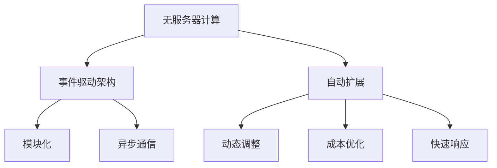

                 

### 1.1 问题背景

在当今数字化转型的浪潮中，软件开发和部署的需求变得越来越复杂。传统的云计算模式虽然提供了一定的灵活性和可扩展性，但随着应用程序规模的不断扩大和复杂性的增加，这种模式也暴露出了诸多问题。比如，服务器资源的冗余管理和优化成为一个巨大的挑战。传统模式下的服务器通常需要预先配置，这意味着开发人员必须预估应用的最大负载，以避免服务器资源不足。然而，这种方法往往会导致资源的严重浪费，因为许多服务器可能在大部分时间都处于闲置状态。

除此之外，传统云计算模式还需要大量的人工操作来管理服务器，包括部署、扩展、监控和调试。这些操作不仅耗时耗力，而且容易出错。随着微服务架构的流行，尽管服务分解和分布式系统的设计能够提高应用的灵活性和可维护性，但这也带来了更大的管理和维护成本。

Serverless架构（Serverless Computing）作为一种新兴的云计算模式，旨在解决上述问题。它通过提供无服务器的计算环境，使得开发人员可以专注于编写和部署应用程序代码，而不需要担心底层的服务器管理。Serverless架构的出现，不仅仅是为了提供一种新的计算服务，更是一种彻底改变软件开发和部署方式的思维方式。

### 1.1.1 传统云计算模式的挑战

传统云计算模式在提供灵活性和可扩展性的同时，也带来了不少挑战。首先，服务器资源的冗余管理和优化问题一直是开发人员和运维团队头疼的问题。在传统模式中，服务器资源通常是预先分配的，这意味着需要提前预测应用程序的最大负载，以便能够提供足够的计算能力。然而，这种预估往往难以精确，导致两种极端情况：要么资源严重不足，影响应用的性能和可用性；要么资源过剩，造成不必要的浪费。

资源过剩的问题不仅体现在服务器成本上，还涉及到能源消耗和环境的负面影响。服务器在闲置状态时仍然需要电力供应，这导致了巨大的能源浪费。此外，服务器资源的不合理分配也会导致性能瓶颈和系统的不稳定性。

其次，传统云计算模式需要大量的人工操作来管理服务器。这包括服务器的部署、扩展、监控和调试等。部署过程中，开发人员需要配置操作系统、安装必要的软件包和依赖库，这通常需要耗费大量的时间和精力。在应用运行过程中，运维团队还需要进行监控和调优，以确保系统的稳定性和性能。这些操作不仅耗时耗力，而且容易出现人为错误，进一步增加了管理成本。

再者，随着微服务架构的普及，应用的复杂性和规模不断增大，这给管理和维护带来了更大的挑战。微服务架构通过将应用分解为多个独立的组件，提高了系统的灵活性和可维护性。然而，这也意味着需要管理更多的服务实例和依赖关系。每个服务实例都需要进行部署、监控和更新，这无疑增加了运维的工作量和难度。

此外，传统模式下的系统监控和调试也是一个难题。由于服务实例分布在不同的服务器上，监控和调试变得复杂。当出现问题时，需要逐个排查每个服务实例，这增加了故障排除的难度和时间。

综上所述，传统云计算模式在提供灵活性和可扩展性的同时，也带来了资源管理、人工操作和系统复杂性等方面的挑战。这些挑战促使我们寻找更加高效和简便的解决方案，Serverless架构的出现正是为了应对这些挑战。

### 1.1.2 Serverless架构的概念与优势

Serverless架构，顾名思义，是一种无需显式管理服务器即可运行和扩展应用程序的云计算模型。在这种模型下，开发人员无需关心底层的基础设施，例如服务器、虚拟机或容器等。相反，他们可以专注于编写应用程序代码和业务逻辑。Serverless架构的核心思想是将计算资源抽象化，让云服务提供商负责资源的分配、管理和优化，而开发人员则专注于实现业务功能。

Serverless架构的主要特点包括：

1. **无服务器**：Serverless架构的核心在于“无服务器”的概念。开发人员无需购买、配置或管理服务器。这大大简化了基础设施的管理，使开发人员能够将更多精力投入到业务逻辑的开发上。

2. **事件驱动**：Serverless架构通常采用事件驱动的编程模型。应用程序由一系列事件触发，这些事件可以是HTTP请求、数据库更新、定时任务等。事件驱动模型使得应用程序能够以响应式的方式运行，提高了系统的灵活性和可扩展性。

3. **按需分配**：Serverless架构根据应用程序的实际需求动态分配计算资源。当应用程序未运行时，资源会被释放，从而降低成本。这种按需分配机制使得开发人员无需为冗余资源付费，提高了资源利用效率。

4. **自动扩展**：Serverless架构能够自动扩展，以应对不同负载水平。当应用程序的请求量增加时，Serverless平台会自动分配更多的计算资源；当请求量减少时，会释放多余的资源。这种自动扩展机制大大简化了系统的运维工作。

5. **易于部署和运维**：Serverless架构简化了应用程序的部署和运维流程。开发人员只需将应用程序代码上传到Serverless平台，平台会自动处理部署、扩展和监控等任务。这使得应用程序的上线更加快捷，维护成本更低。

Serverless架构的优势体现在多个方面：

- **简化开发和部署**：通过消除服务器管理的复杂性，Serverless架构使得开发人员能够更快速地开发、部署和迭代应用程序。

- **降低成本**：按需分配资源和自动扩展机制有助于降低基础设施成本，特别是对于资源需求波动较大的应用。

- **提高灵活性**：事件驱动模型和自动扩展机制使应用程序能够更好地适应不同的负载水平和业务需求。

- **提高资源利用效率**：Serverless架构能够动态分配资源，提高了资源利用率，减少了浪费。

- **提高开发效率**：无需关心底层基础设施的管理，开发人员可以专注于业务逻辑的实现。

总之，Serverless架构通过提供一种无需关心底层基础设施的云计算模型，极大地简化了开发和部署流程，降低了成本，提高了灵活性和资源利用效率。这使得它成为许多企业和开发人员的首选云计算模式。

### 1.1.3 Serverless架构的发展历程

Serverless架构的概念并非一夜之间出现，而是经历了多年的发展和演变。它的起源可以追溯到云计算和函数计算技术的发展。

#### 早期阶段：函数计算的出现

函数计算（Function as a Service，FaaS）是Serverless架构的基石。最早的函数计算平台之一是Amazon Web Services（AWS）在2014年推出的Lambda函数。Lambda允许开发人员编写单函数代码片段，并通过API调用来执行。这一平台的出现标志着函数计算时代的开始，因为它将计算任务从传统的服务器模型中解放出来，让开发人员能够更加专注于业务逻辑的实现。

随后，其他云服务提供商也推出了自己的函数计算平台，如Google Cloud Functions和Microsoft Azure Functions。这些平台共同推动了函数计算技术的发展，并为Serverless架构的普及奠定了基础。

#### 中期阶段：Serverless架构的完善

在函数计算的基础上，Serverless架构逐渐发展出更多的组件和功能，以满足不同场景的需求。例如，后端即服务（Backend as a Service，BaaS）开始出现，它提供了无需编写后端代码的解决方案，例如用户身份验证、数据库存储和推送通知等。BaaS使得开发者可以更快速地构建应用程序，而不必担心后端基础设施的管理。

此外，微服务架构的流行也为Serverless架构的发展提供了动力。微服务架构通过将应用程序分解为小型、独立的组件，提高了系统的灵活性和可维护性。Serverless架构与微服务架构的结合，使得开发人员可以更加灵活地管理和部署这些组件。

在这一阶段，多个开源框架和工具也相继出现，如OpenFaaS、Kubernetes和Serverless Framework等。这些工具和框架提供了更加便捷和高效的Serverless开发体验，进一步推动了Serverless架构的普及。

#### 当前阶段：Serverless架构的成熟

当前，Serverless架构已经进入了一个相对成熟和广泛应用的阶段。随着云服务提供商不断推出新的功能和优化服务，Serverless架构在多个领域都得到了广泛应用，如Web应用、移动应用、大数据处理和物联网等。

此外，Serverless架构也在不断演进，以解决一些早期的挑战和问题。例如，为了提高性能和降低延迟，一些服务提供商开始提供更接近物理服务器的计算资源，如Amazon Web Services的Fargate服务和Google Cloud的Compute Engine。这些服务通过提供更加灵活的资源配置，使得开发者可以更好地满足特定应用的需求。

总之，Serverless架构的发展历程是一个从函数计算到全面架构演变的过程。通过不断的技术创新和优化，Serverless架构已经成熟，并成为了许多企业和开发人员的重要选择。

### 1.2 核心概念与联系

Serverless架构的核心概念涵盖了无服务器计算、事件驱动架构和自动扩展等关键要素。为了更好地理解和应用这些概念，我们可以通过表格和Mermaid流程图来详细说明它们之间的关系和属性特征。

#### 1.2.1 无服务器计算

无服务器计算（Serverless Computing）是一种将应用程序的开发、部署和运维与底层计算资源分离的云计算模型。它允许开发人员编写和管理应用程序代码，而无需直接管理服务器或其他基础设施。以下是几个关键属性：

- **抽象化**：无服务器计算抽象化了底层的基础设施，使开发人员无需关心服务器的配置、管理和维护。
- **按需分配**：计算资源是根据应用程序的实际需求动态分配的，只在应用程序运行时才分配资源，提高了资源利用率。
- **事件驱动**：应用程序通常通过事件触发来执行，这些事件可以是HTTP请求、定时任务、数据库变更等。
- **自动扩展**：无服务器架构能够自动扩展和缩减资源，以适应不同的负载水平，提高了系统的可伸缩性和稳定性。

#### 1.2.2 事件驱动架构

事件驱动架构（Event-Driven Architecture，EDA）是一种设计应用程序的方法，它通过事件来触发和协调系统的行为。在事件驱动架构中，应用程序由多个独立的服务组成，每个服务根据特定的事件进行响应。以下是几个关键属性：

- **模块化**：事件驱动架构将应用程序分解为小型、独立的服务，每个服务负责处理特定类型的事件，提高了系统的可维护性和可扩展性。
- **异步通信**：事件驱动架构通常使用异步通信机制，如消息队列和事件总线，来传递事件和响应结果，减少了系统之间的同步依赖。
- **灵活性**：事件驱动架构允许系统在不同条件下灵活响应事件，提高了系统的适应性和可扩展性。

#### 1.2.3 自动扩展

自动扩展（Auto Scaling）是一种通过动态调整计算资源来应对负载变化的机制。在Serverless架构中，自动扩展是实现高可用性和可伸缩性的关键。以下是几个关键属性：

- **动态调整**：自动扩展可以根据应用程序的实际需求动态增加或减少计算资源，确保系统在高负载时保持稳定运行。
- **成本优化**：自动扩展有助于降低运营成本，因为只有在需要时才分配计算资源，避免了资源的浪费。
- **快速响应**：自动扩展能够快速响应负载变化，减少了系统的延迟和响应时间。

#### 1.2.4 组件与联系

以下是一个表格，展示了Serverless架构中的关键组件及其相互关系：

| 组件        | 描述                                       | 关键属性                         |
| ----------- | ------------------------------------------ | -------------------------------- |
| 无服务器计算 | 一种云计算模型，将应用程序与底层基础设施分离 | 抽象化、按需分配、事件驱动、自动扩展 |
| 事件驱动架构 | 通过事件触发和协调系统行为的设计方法       | 模块化、异步通信、灵活性           |
| 自动扩展    | 动态调整计算资源以应对负载变化的机制       | 动态调整、成本优化、快速响应       |

#### 1.2.5 Mermaid流程图

为了更直观地展示Serverless架构中的组件和它们之间的关系，我们可以使用Mermaid流程图来绘制。以下是一个简单的Mermaid流程图示例：



在这个流程图中，无服务器计算作为核心组件，连接了事件驱动架构和自动扩展。事件驱动架构通过模块化和异步通信与无服务器计算和自动扩展相连接，而自动扩展通过动态调整、成本优化和快速响应等属性来实现对系统负载的应对。

通过上述表格和Mermaid流程图，我们可以清晰地理解Serverless架构中的核心概念及其相互关系。这些概念不仅为开发者提供了强大的工具和灵活性，也使得系统的开发和运维变得更加高效和便捷。

### 1.2.1.1 无服务器计算的原理

无服务器计算（Serverless Computing）的原理在于将计算任务从传统的服务器模型中分离出来，由云服务提供商动态管理底层基础设施，而开发者则专注于编写和部署应用程序代码。这一模型的核心在于抽象化和事件驱动，使得开发人员可以更加专注于业务逻辑的实现，而不必担心底层资源的分配和管理。

#### 抽象化

无服务器计算通过高度抽象化的方式，将底层硬件资源、操作系统和虚拟化层隐藏起来。这意味着开发者无需关心服务器的具体配置、操作系统版本、网络设置等细节。云服务提供商负责管理这些底层资源，包括实例的创建、扩展、负载均衡和容错等。抽象化带来的好处是显著降低了开发者的运维负担，使得他们能够更专注于编写应用程序代码。

#### 事件驱动

无服务器计算通常采用事件驱动的架构，即应用程序的执行是由外部事件触发的。这些事件可以是HTTP请求、定时任务、数据库变更、文件上传等。当事件发生时，云服务提供商会自动调度和执行相应的函数，完成所需任务。事件驱动架构的特点是异步处理，这意味着多个事件可以同时触发，并独立执行，而不会相互干扰。

#### 动态分配

在无服务器计算中，计算资源是根据应用程序的实际需求动态分配的。当应用程序未运行时，资源会被释放；当应用程序运行时，根据负载情况动态扩展或缩减资源。这种按需分配机制提高了资源的利用效率，并且可以降低运营成本。动态分配依赖于自动扩展和负载均衡机制，能够确保系统在高负载时保持稳定运行，而在低负载时节约成本。

#### 自动扩展与负载均衡

无服务器计算平台通常内置自动扩展和负载均衡功能。自动扩展是指系统根据实际负载情况自动调整计算资源，确保在高峰期有足够的资源应对大量请求，而在低谷期释放多余资源，降低成本。负载均衡则是通过将请求分配到多个实例上，确保系统的响应时间和稳定性。这些功能使得开发者无需手动管理服务器，从而提高了系统的可靠性和可扩展性。

#### 无服务器与云计算的对比

无服务器计算与云计算在许多方面有显著的区别。传统云计算模式通常要求开发者购买、配置和管理服务器，以提供计算资源。在这种模式中，开发者需要预估应用的最大负载，提前配置足够的资源，以避免性能瓶颈。而无服务器计算则完全不同，它由云服务提供商负责资源的分配和管理，开发者只需关注业务逻辑的实现。

以下是两者之间的主要对比：

- **基础设施管理**：云计算要求开发者管理服务器、网络和存储等基础设施；而无服务器计算则完全由云服务提供商管理。
- **资源分配**：云计算资源通常是预先分配的，可能存在资源浪费；无服务器计算资源则是根据实际需求动态分配，提高了资源利用效率。
- **扩展与缩放**：云计算需要开发者手动管理服务器扩展和负载均衡；无服务器计算平台自动提供这些功能，简化了运维工作。
- **成本**：云计算的运营成本相对较高，特别是对于资源需求波动较大的应用；无服务器计算则可以根据实际使用量进行收费，降低了运营成本。

总之，无服务器计算的原理在于通过抽象化、事件驱动和动态资源管理，简化了开发者和运维人员的工作，提高了系统的可扩展性和资源利用效率。这种云计算模型为开发者提供了更加灵活和高效的开发环境，使得他们能够专注于实现业务功能，而无需担心底层基础设施的管理。

### 1.2.1.2 无服务器计算与云计算的对比

无服务器计算（Serverless Computing）与云计算（Cloud Computing）是两种不同的计算模型，它们各自有其独特的特点和适用场景。下面我们将详细对比这两者的主要区别。

#### 基础设施管理

在云计算模式中，开发者需要自行购买、配置和管理服务器。这意味着他们需要关注服务器的硬件配置、操作系统安装、网络设置和安全维护等细节。这种模式需要专业的运维团队，并且需要投入大量时间和精力来管理基础设施。

相反，无服务器计算则完全由云服务提供商负责基础设施的管理。开发者无需关心服务器、虚拟机或容器的具体配置，云服务提供商会自动处理所有底层资源的分配、扩展和监控。这种模式大大简化了基础设施的管理，使得开发者可以更加专注于应用程序的开发。

#### 资源分配

在云计算模式中，开发者需要根据预估的应用负载来配置服务器资源。这种预估往往存在不确定性，可能导致资源过剩或不足。资源过剩会导致成本增加，资源不足则可能影响应用的性能和可用性。

无服务器计算则采用动态资源分配机制。云服务提供商根据应用程序的实际运行需求自动分配和调整计算资源。当应用程序未运行时，资源会被释放；当应用程序运行时，根据负载情况动态扩展或缩减资源。这种按需分配机制不仅提高了资源利用效率，还能够降低运营成本。

#### 扩展与缩放

云计算模式中，扩展和缩放通常需要手动操作。开发者需要监控应用负载，并在需要时手动增加或减少服务器实例。这种手动操作不仅繁琐，而且容易出现错误。

无服务器计算则提供自动扩展功能。当应用程序的请求量增加时，云服务提供商会自动分配更多的计算资源；当请求量减少时，会自动释放多余的资源。这种自动扩展机制确保了系统在高负载时保持稳定运行，而在低负载时节约成本。

#### 成本

在云计算模式中，开发者需要支付服务器的固定费用，即使服务器在大部分时间处于闲置状态。这种模式可能导致资源浪费，增加运营成本。

无服务器计算则根据应用程序的实际使用量进行收费。开发者只需为实际运行时间和计算资源付费，无需支付闲置时的费用。这种按需收费模式有助于降低运营成本，特别是对于资源需求波动较大的应用。

#### 适用场景

云计算模式适用于需要大量计算资源且负载相对稳定的应用。例如，电子商务平台、大数据处理和分析等场景。

无服务器计算则适用于需要快速响应和高度可扩展性的应用。例如，Web应用、移动应用、IoT设备和实时数据处理等场景。由于无服务器计算能够自动扩展和缩减资源，它非常适合处理瞬时高负载或波动性大的应用场景。

总之，无服务器计算与云计算在基础设施管理、资源分配、扩展与缩放、成本和适用场景等方面存在显著区别。无服务器计算通过提供更灵活、高效的资源管理和按需收费模式，为开发者带来了更大的便利和成本效益。

### 1.2.2.1 事件驱动架构的概念

事件驱动架构（Event-Driven Architecture，EDA）是一种设计应用程序的方法，它通过事件来触发和协调系统的行为。事件驱动架构的核心思想是将系统的各个部分解耦，使得各个组件可以独立工作，并能够根据事件的发生进行响应。这种方法不仅提高了系统的灵活性和可扩展性，还简化了系统的开发和维护过程。

在事件驱动架构中，事件是一个重要的概念。事件可以定义为任何可以触发系统响应的实时信息，例如用户的点击操作、数据库的变更、定时任务的触发等。事件通常由系统的某个部分产生，并通过事件总线或其他通信机制传递给其他部分，以触发相应的处理逻辑。

事件驱动架构的主要组成部分包括：

1. **事件源**：事件源是产生事件的部分，可以是用户界面、传感器、数据库或其他系统组件。事件源会在特定条件下产生事件，并将其发送到事件总线。
2. **事件总线**：事件总线是一个中介，负责接收和传递事件。它可以看作是一个通信管道，使得不同组件之间能够通过事件进行通信。事件总线通常具有高可靠性和异步通信的特性，以确保事件能够及时传递。
3. **事件处理器**：事件处理器是负责处理特定类型事件的组件。当事件总线接收到事件后，会将其传递给相应的事件处理器。事件处理器会根据事件的类型和内容执行相应的业务逻辑，并可能产生新的事件或触发其他系统的操作。
4. **事件存储**：事件存储用于记录事件的发生和相关的处理过程。它可以是一个数据库、日志系统或其他存储解决方案，用于后续的数据分析和审计。

事件驱动架构的关键特性包括：

- **解耦**：通过事件驱动架构，系统的各个组件可以独立开发和部署，彼此之间通过事件进行通信，从而实现解耦。这提高了系统的灵活性和可维护性。
- **异步通信**：事件驱动架构通常采用异步通信机制，使得不同组件可以并行处理事件，提高了系统的响应速度和处理能力。
- **可扩展性**：事件驱动架构使得系统可以根据需要增加或减少事件处理器和事件源，以适应不同的负载和业务需求。
- **高可靠性**：事件驱动架构通常具有高可靠性，因为事件可以在不同的组件和系统中传递，即使某些组件出现故障，系统仍然可以继续运行。

总之，事件驱动架构通过将系统的各个部分解耦，并采用异步通信机制，提高了系统的灵活性和可扩展性。它是一种适用于现代分布式系统的有效设计方法，能够帮助开发人员构建更加高效、可靠和灵活的应用程序。

### 1.2.2.2 事件驱动架构与传统架构的对比

事件驱动架构（Event-Driven Architecture，EDA）与传统的请求响应架构（Request-Response Architecture）在系统设计、通信机制和灵活性方面有显著的区别。以下是对两者进行详细对比：

#### 系统设计

1. **传统请求响应架构**：在传统的请求响应架构中，系统通常采用客户端-服务器模型。客户端向服务器发送请求，服务器处理请求并返回响应。这种架构注重的是请求和响应的同步处理，即客户端等待服务器的响应，并在接收到响应后继续执行后续操作。

2. **事件驱动架构**：事件驱动架构则将系统视为一系列独立的事件处理器，这些处理器能够异步响应外部或内部事件。事件可以是用户操作、系统状态变化或定时任务触发等。每个事件处理器独立运行，不需要等待其他组件的响应，这提高了系统的并发处理能力和响应速度。

#### 通信机制

1. **传统请求响应架构**：在请求响应架构中，通信机制通常是同步的。客户端发送请求后，必须等待服务器的响应，这会导致系统的性能瓶颈，特别是在高负载情况下，服务器的响应时间可能会显著增加。

2. **事件驱动架构**：事件驱动架构采用异步通信机制。事件处理器可以独立工作，不需要等待其他组件的响应。事件可以在不同的系统组件之间传递，并通过事件总线或其他中间件进行传递，减少了系统的同步依赖，提高了系统的灵活性和响应速度。

#### 灵活性

1. **传统请求响应架构**：在请求响应架构中，系统的扩展性通常受到请求队列和服务器响应能力的限制。当请求量增加时，服务器可能会因为处理能力不足而出现瓶颈，需要手动增加服务器实例或进行负载均衡。

2. **事件驱动架构**：事件驱动架构具有更高的灵活性，因为它能够自动扩展和缩放。当事件量增加时，系统可以自动分配更多的资源来处理事件，而当事件量减少时，系统可以释放多余的资源。这种按需扩展机制使得系统能够更好地应对负载波动，提高了系统的稳定性和可靠性。

#### 典型应用场景

1. **传统请求响应架构**：传统的请求响应架构适用于需要严格顺序处理请求的应用，如传统的Web应用、银行交易系统等。

2. **事件驱动架构**：事件驱动架构适用于需要高并发处理和实时响应的应用，如社交媒体平台、实时数据流处理、物联网设备等。

#### 对比总结

- **系统设计**：事件驱动架构通过异步处理和组件解耦，提供了更高的灵活性和并发处理能力，而请求响应架构则依赖于同步处理和顺序执行。
- **通信机制**：事件驱动架构采用异步通信，减少了系统的同步依赖，提高了响应速度和系统性能，而请求响应架构则依赖于同步通信，可能导致性能瓶颈。
- **灵活性**：事件驱动架构能够自动扩展和缩放，更好地适应负载波动，而请求响应架构通常需要手动管理服务器实例和负载均衡。

总之，事件驱动架构通过异步通信和组件解耦，提供了更高的灵活性和可扩展性，能够更好地应对现代复杂系统的需求。尽管请求响应架构在某些场景下仍然适用，但事件驱动架构正逐渐成为现代分布式系统的首选设计方法。

### 1.2.3.1 自动扩展的原理

自动扩展（Auto Scaling）是一种通过动态调整计算资源来应对负载变化的机制，旨在确保系统在高负载时保持稳定运行，在低负载时节约成本。在Serverless架构中，自动扩展是提高系统可靠性和性能的关键特性之一。

#### 工作原理

自动扩展的工作原理基于对系统负载的实时监控和计算资源的需求。以下是其核心步骤：

1. **监控**：自动扩展首先需要监控系统负载，包括处理中的请求数量、响应时间和资源使用率等指标。这些监控数据可以通过云服务提供商提供的监控工具、自定义脚本或第三方监控服务获得。

2. **阈值设置**：根据业务需求和系统性能目标，设定自动扩展的阈值。这些阈值可以是请求队列长度、CPU使用率、内存使用率等指标。阈值设置需要平衡系统的稳定性和成本效益。

3. **资源调整**：当监控数据超过预设的阈值时，自动扩展机制会自动调整计算资源。具体调整方式包括增加或减少函数实例数量、调整容器大小、添加或删除虚拟机等。

4. **回调和通知**：在资源调整完成后，自动扩展机制会回调相关系统进行通知，确保所有组件能够同步调整。例如，如果增加了一个函数实例，其他依赖该实例的系统需要相应地更新配置。

#### 优点

自动扩展提供了以下优点：

- **提高系统可靠性**：通过实时监控和自动调整资源，系统可以在高负载时保持稳定运行，避免因资源不足导致的性能下降或服务中断。
- **降低运营成本**：自动扩展按需分配资源，只在需要时才扩展，从而减少了冗余资源的浪费，降低了运营成本。
- **提高灵活性**：自动扩展机制使得系统可以更加灵活地应对不同的负载场景，提高了系统的适应性。

#### 实现方式

自动扩展的实现方式因云服务提供商和平台而异，但通常包括以下几种：

- **基于CPU或内存使用率的扩展**：这是最常见的自动扩展方式，系统根据CPU或内存使用率超过预设阈值时自动调整资源。
- **基于请求队列长度或响应时间的扩展**：系统根据请求队列长度或响应时间超过预设阈值时自动扩展资源，确保系统在高负载时仍能及时响应请求。
- **基于自定义脚本或规则**：开发人员可以编写自定义脚本或设置规则来定义自动扩展的条件和操作，增加扩展的灵活性。

总之，自动扩展通过实时监控和动态调整计算资源，为Serverless架构提供了高可靠性和成本效益。它不仅简化了系统的运维工作，还提高了系统的灵活性和适应性。

### 1.2.3.2 自动扩展的优势

自动扩展（Auto Scaling）在Serverless架构中扮演着至关重要的角色，它通过动态调整计算资源，实现了系统的灵活性和高效运营。以下是自动扩展的主要优势：

#### 1. 降低成本

自动扩展通过按需分配计算资源，只在应用程序实际运行时才使用资源，从而有效降低了运营成本。传统模式下的云计算需要预先分配和购买固定数量的资源，即使这些资源在大部分时间处于闲置状态，开发者和企业仍需为它们支付费用。而自动扩展则根据实际需求动态调整资源，避免了资源的浪费，提高了资源利用率。

#### 2. 提高系统可靠性

自动扩展能够实时监控系统的负载情况，并根据负载的变化自动调整计算资源。当系统面临高负载时，自动扩展会自动增加计算资源，确保系统能够继续稳定运行，避免因资源不足导致的性能下降或服务中断。这种按需扩展机制提高了系统的可靠性和稳定性，使企业能够提供更加可靠的服务。

#### 3. 提高系统性能

自动扩展不仅提高了系统的可靠性，还显著提升了系统的性能。通过动态调整资源，系统可以在高负载时快速响应大量请求，确保用户获得良好的体验。此外，自动扩展还能够平衡负载，避免单点过载问题，从而提高整体系统的性能和响应速度。

#### 4. 简化运维

自动扩展简化了系统的运维工作。在传统模式下，运维团队需要不断监控系统负载，并根据预估的负载情况手动调整资源。这不仅耗时耗力，而且容易出错。自动扩展通过自动化机制，减少了人工干预，降低了运维成本，使运维团队能够将更多精力投入到其他更有价值的工作中。

#### 5. 提高灵活性

自动扩展使得系统具有更高的灵活性，能够快速适应不同的负载场景。无论是短期的高峰期，还是长期的负载变化，自动扩展都能够根据实际情况动态调整资源，确保系统始终处于最佳状态。这种灵活性不仅适用于单个应用程序，也适用于跨多个应用程序和服务的复杂系统。

总之，自动扩展在Serverless架构中提供了降低成本、提高系统可靠性、提升系统性能、简化运维和提高系统灵活性的显著优势。它为开发者和企业提供了一个高效、可靠和灵活的云计算解决方案，使得他们能够更好地应对现代应用程序的复杂性和变化性。

### 1.3 Serverless架构的组件

Serverless架构由多个关键组件构成，这些组件共同作用，提供了无服务器计算、事件驱动和自动扩展等功能。下面我们将详细探讨这些组件，包括函数即服务（FaaS）、后端即服务（BaaS）和微服务架构，以及它们在Serverless架构中的应用和关系。

#### 1.3.1 函数即服务（FaaS）

函数即服务（Function as a Service，FaaS）是Serverless架构的核心组件之一。FaaS允许开发人员将应用程序功能划分为多个独立的函数，每个函数负责处理特定的业务逻辑。FaaS的典型特点是函数的独立性和可重用性。

- **独立性**：每个函数是独立的，可以独立部署和运行，不会受到其他函数的影响。这使得开发者可以轻松地管理和扩展应用程序的功能。
- **可重用性**：函数可以重用，多个应用程序或服务可以共享相同的函数，提高了代码的复用率。
- **事件触发**：FaaS函数通常通过事件触发，如HTTP请求、定时任务、数据库变更等。这使函数能够在需要时执行，而不需要持续运行。

FaaS在Serverless架构中的应用非常广泛，可以用于构建RESTful API、处理Web请求、执行后台任务等。例如，Amazon Web Services（AWS）的Lambda函数、Google Cloud Functions和Microsoft Azure Functions都是典型的FaaS平台。

#### 1.3.2 后端即服务（BaaS）

后端即服务（Backend as a Service，BaaS）提供了无需编写后端代码的解决方案，使得开发者可以专注于前端和业务逻辑的开发。BaaS通常提供一系列预设的后端服务，如用户身份验证、数据库存储、文件存储、推送通知和实时通信等。

- **简化开发**：BaaS简化了后端开发的复杂度，开发者无需编写和管理后端代码，可以快速构建和部署应用程序。
- **快速迭代**：BaaS提供了可扩展的后端服务，开发者可以快速迭代和更新应用程序，而无需担心后端基础设施的维护和扩展。

BaaS与FaaS紧密相关，它为FaaS提供了必要的后端支持。例如，当FaaS函数需要访问数据库时，可以调用BaaS提供的数据库服务。典型的BaaS平台包括AWS的AppSync、Firebase和Google Cloud的Cloud Firestore。

#### 1.3.3 微服务架构

微服务架构（Microservices Architecture）是一种将应用程序分解为小型、独立的服务的架构风格。每个服务负责处理特定的业务功能，可以独立部署和扩展。微服务架构与Serverless架构有着天然的契合点，因为Serverless架构本身也是一种分布式系统，强调服务的独立性和可扩展性。

- **独立部署**：微服务可以独立部署和扩展，不会影响其他服务，提高了系统的灵活性和可维护性。
- **可扩展性**：微服务可以根据需求独立扩展，通过增加实例数量来处理更多的请求，实现了高可用性和弹性。
- **分布式处理**：微服务架构通过分布式处理，提高了系统的性能和响应速度。

微服务与Serverless架构的结合，使得开发者可以更加灵活地构建和部署分布式应用程序。例如，可以使用FaaS作为微服务的实现方式，将每个微服务部署为一个独立的函数。此外，BaaS也可以为微服务提供必要的后端支持。

#### 组件关系

在Serverless架构中，FaaS、BaaS和微服务架构共同作用，形成了完整的应用程序生态系统。

- **FaaS作为微服务的实现**：FaaS提供了轻量级的函数计算服务，可以作为微服务的实现方式，每个微服务都可以封装为一个独立的函数，便于管理和扩展。
- **BaaS作为后端支持**：BaaS提供了丰富的后端服务，如数据库、文件存储和用户身份验证等，为FaaS和微服务提供了必要的后端支持。
- **微服务架构的整合**：通过微服务架构，可以将多个FaaS函数和后端服务整合为一个完整的系统，实现业务逻辑的分解和独立部署。

总之，Serverless架构的组件包括FaaS、BaaS和微服务架构，这些组件共同作用，提供了无服务器计算、事件驱动和自动扩展等功能。通过合理地利用这些组件，开发者可以构建高效、灵活和可扩展的应用程序。

### 1.3.1.1 FaaS的定义

函数即服务（Function as a Service，FaaS）是一种云计算服务模型，它允许开发人员将应用程序功能划分为独立的函数，并在需要时运行这些函数。FaaS通过抽象化底层基础设施，使得开发者无需关心服务器、虚拟机或容器的管理，专注于编写和部署函数代码。

#### 核心特点

FaaS的核心特点包括：

- **函数独立性**：每个函数都是独立的，可以独立部署和运行，不会相互干扰。这使得函数易于管理和扩展。
- **事件触发**：函数通常通过事件触发，例如HTTP请求、定时任务、数据库变更等。当事件发生时，函数会被自动调度和执行。
- **动态扩展**：FaaS平台根据实际负载动态分配计算资源，确保在高负载时能够自动扩展，提供足够的计算能力。
- **按需付费**：开发者仅为其运行的函数代码付费，而不需要为闲置的资源付费，这种按需付费模式降低了运营成本。

#### 工作原理

FaaS的工作原理如下：

1. **函数部署**：开发人员将函数代码上传到FaaS平台，平台会将代码打包并部署到底层基础设施上。
2. **事件接收**：FaaS平台监控外部事件，例如HTTP请求、定时任务或数据库变更。
3. **函数调度**：当接收到事件后，FaaS平台会根据事件的类型和内容，选择相应的函数进行调度。
4. **函数执行**：被调度的函数在分配的执行环境中执行，完成所需任务后返回结果。
5. **结果返回**：函数执行的结果会返回给调用者，例如HTTP响应或消息队列中的消息。

#### 应用场景

FaaS适用于多种应用场景，包括：

- **Web应用后端**：通过FaaS可以快速构建和部署Web应用的后端服务，例如RESTful API和Webhook。
- **后台任务处理**：例如电子邮件发送、数据分析和报告生成等。
- **数据处理和分析**：例如实时日志分析、流处理和批量处理等。
- **物联网设备通信**：用于处理物联网设备生成的数据，例如传感器数据和设备状态更新。

总之，FaaS通过提供独立的函数计算服务，简化了开发、部署和运维过程，为开发者带来了更高的灵活性和成本效益。

### 1.3.1.2 FaaS的工作原理

函数即服务（FaaS）的工作原理旨在将应用程序的功能划分为独立的函数，并通过事件触发的方式实现函数的执行。以下详细描述FaaS的工作原理：

#### 函数部署

1. **编写函数代码**：首先，开发者需要编写函数代码，通常使用编程语言如Python、JavaScript或Go等。函数代码包含业务逻辑，例如数据处理、API处理或事件响应等。
2. **上传函数代码**：开发者将编写的函数代码上传到FaaS平台。上传过程中，函数代码会被打包成一个独立的函数镜像（function image）。这个镜像包含了函数代码、依赖库和环境配置等所有必需内容。
3. **镜像存储**：FaaS平台会将上传的函数镜像存储在分布式存储系统中，以便后续的调度和执行。

#### 事件触发

1. **监听事件**：FaaS平台会持续监听外部事件，这些事件可以是HTTP请求、定时任务、数据库变更或其他类型的系统事件。
2. **事件分类**：当FaaS平台接收到事件后，会根据事件的类型和内容进行分类，确定需要调用的函数。
3. **函数调度**：FaaS平台根据事件的分类结果，选择相应的函数进行调度。调度过程中，平台会根据函数的配置和依赖，动态分配执行环境。

#### 函数执行

1. **环境准备**：在调度函数之前，FaaS平台会准备函数的执行环境。这包括分配计算资源（如CPU和内存）、加载依赖库和设置环境变量等。
2. **函数执行**：函数在分配的执行环境中执行，完成业务逻辑处理后返回结果。执行过程中，函数可以访问底层的存储、数据库和其他服务。
3. **结果返回**：函数执行完成后，会将结果返回给调用者。例如，如果是HTTP请求，则返回HTTP响应；如果是消息队列，则将消息放入队列中。

#### 函数管理

1. **监控与日志**：FaaS平台会实时监控函数的执行状态，包括运行时间、CPU和内存使用情况等。同时，平台会记录函数的执行日志，方便开发者进行调试和问题排查。
2. **版本管理**：FaaS平台通常支持函数版本管理，允许开发者发布新版本的函数，并在需要时回滚到旧版本。
3. **弹性扩展**：FaaS平台根据实际负载动态调整函数的实例数量，确保在高负载时提供足够的计算能力。

#### 示例

以下是一个简单的Python函数示例，用于处理HTTP请求：

```python
from flask import Flask, jsonify, request

app = Flask(__name__)

@app.route('/hello', methods=['GET'])
def hello():
    name = request.args.get('name', 'World')
    return jsonify({'message': f'Hello, {name}!'})

if __name__ == '__main__':
    app.run(host='0.0.0.0', port=8080)
```

当接收到`/hello`路径的GET请求时，该函数会返回一个包含问候信息的JSON响应。

#### 优点

- **简化和自动化**：FaaS简化了应用程序的部署和运维过程，自动管理底层基础设施，降低了开发者的工作负担。
- **灵活性和可扩展性**：FaaS允许开发者根据实际需求灵活地调整计算资源，并能够快速响应负载变化。
- **低成本**：FaaS采用按需付费模式，仅对实际运行的函数代码收费，降低了运营成本。

总之，FaaS通过抽象化底层基础设施和事件驱动的执行机制，为开发者提供了高效的函数计算服务，使得他们可以更加专注于业务逻辑的实现。

### 1.3.2.1 BaaS的定义

后端即服务（Backend as a Service，BaaS）是一种云计算服务模型，它为开发者提供了一套无需自行编写和管理后端代码的解决方案。通过使用BaaS，开发者可以专注于应用程序的前端和业务逻辑开发，而无需关心后端基础设施的搭建和维护。

#### 核心特点

BaaS的主要特点包括：

- **简化开发**：BaaS提供了丰富的后端服务，如用户身份验证、数据库存储、文件存储、推送通知和实时通信等，使得开发者能够快速构建和部署应用程序。
- **无需后端知识**：开发者无需具备后端开发经验，即可利用BaaS提供的功能，降低了开发门槛。
- **可扩展性**：BaaS平台通常能够根据需求自动扩展，提供足够的计算和存储资源。
- **按需付费**：开发者仅为其使用到的服务付费，而无需为未使用的资源付费，这种按需付费模式降低了运营成本。

#### 应用场景

BaaS适用于多种应用场景，包括：

- **移动应用**：为移动应用提供用户身份验证、数据存储和推送通知等后端服务。
- **Web应用**：为Web应用提供用户身份验证、数据存储和实时通信等后端支持。
- **物联网应用**：为物联网应用提供设备管理、数据收集和实时通信等后端服务。

#### 主要服务

BaaS平台通常提供以下主要服务：

- **用户身份验证**：提供用户注册、登录、身份验证和授权等功能。
- **数据库存储**：提供结构化数据存储服务，支持SQL和NoSQL数据库。
- **文件存储**：提供文件上传、下载和管理功能。
- **推送通知**：为移动设备和Web应用提供推送通知服务。
- **实时通信**：提供实时消息传递和通信服务，支持实时聊天和多人协作。

总之，BaaS通过提供无需后端知识的后端服务，简化了应用程序的开发和部署过程，为开发者带来了更高的灵活性和便利性。

### 1.3.2.2 BaaS的应用场景

后端即服务（BaaS）的广泛应用使得开发者在无需关心底层基础设施的情况下，能够快速构建和部署复杂的应用程序。以下是BaaS在多个领域的具体应用场景：

#### 1. 移动应用

BaaS在移动应用开发中尤为流行，特别是对于需要后台服务支持的应用。以下是一些典型的应用场景：

- **用户身份验证**：BaaS平台提供了简单的用户注册、登录和身份验证功能，使得开发者可以快速实现用户管理，无需编写复杂的安全代码。
- **数据存储**：通过BaaS提供的数据库服务，开发者可以轻松实现数据的增删改查操作，支持多种数据模型，如文档、键值对等。
- **文件存储**：移动应用通常需要上传和下载大量文件，BaaS平台提供了文件存储服务，支持图片、视频等多媒体文件的存储和管理。
- **推送通知**：BaaS平台能够为移动设备提供个性化的推送通知服务，增强用户互动和用户体验。

#### 2. Web应用

BaaS在Web应用开发中也具有广泛的应用，可以帮助开发者快速搭建完整的应用后端：

- **用户身份验证**：通过BaaS平台的身份验证服务，开发者可以轻松实现用户登录、注册和权限管理，无需编写安全相关的后端代码。
- **数据存储**：BaaS平台提供了高效的数据存储服务，支持关系型数据库（如MySQL）和非关系型数据库（如MongoDB），便于开发者处理复杂的数据操作。
- **实时通信**：对于需要实时通信功能的Web应用，如社交网络、聊天应用和在线协作工具，BaaS平台提供了实时消息传递服务，简化了开发过程。
- **第三方集成**：BaaS平台通常集成了多个第三方服务，如支付、地图、邮件等，使得开发者可以轻松实现这些功能，而无需自行开发。

#### 3. 物联网应用

在物联网（IoT）领域，BaaS提供了强大的后端支持，帮助开发者管理和处理海量设备数据：

- **设备管理**：BaaS平台提供了设备注册、监控和管理功能，使得开发者可以轻松实现设备的远程管理和监控。
- **数据收集与处理**：通过BaaS的数据存储和分析服务，开发者可以收集和处理来自各种物联网设备的实时数据，支持数据的存储、查询和分析。
- **实时通信**：物联网应用通常需要实时通信功能，BaaS平台提供了实时消息传递服务，支持设备之间的数据交换和通信。

#### 4. 跨平台应用

BaaS的跨平台特性使得开发者可以在不同平台上快速构建应用程序：

- **多平台支持**：BaaS平台通常提供了跨平台的API和服务，支持iOS、Android、Web和桌面应用程序，便于开发者实现多端一致性。
- **云原生应用**：BaaS服务可以与云原生技术相结合，如Kubernetes和Serverless架构，提供更加高效和灵活的应用部署和管理。

总之，BaaS通过提供简化、高效和可扩展的后端服务，使得开发者能够在各种应用场景下快速构建和部署应用程序，从而降低了开发成本和复杂度。

### 1.3.3.1 微服务架构的概念

微服务架构（Microservices Architecture）是一种设计应用程序的方法，它通过将应用程序分解为多个小型、独立的组件（即微服务），使得每个组件可以独立开发、部署和扩展。微服务架构的核心思想是将复杂的单一应用程序拆分为多个小型服务，从而提高系统的灵活性和可维护性。

#### 核心特点

微服务架构具有以下核心特点：

1. **独立性**：每个微服务都是独立的，可以独立部署和扩展，不会相互影响。这使得开发者可以独立开发、测试和部署每个微服务，提高了系统的灵活性和可维护性。
2. **自治性**：每个微服务拥有自己的数据存储和业务逻辑，可以独立运行和管理。这减少了服务之间的耦合，使得系统更易于管理和维护。
3. **分布式**：微服务架构通常采用分布式系统设计，各个微服务部署在不同的服务器上，通过通信协议（如HTTP、REST、消息队列等）进行交互。
4. **可扩展性**：微服务架构允许根据需求独立扩展各个微服务，通过增加实例数量来处理更多的请求，提高了系统的可扩展性和性能。
5. **容错性**：由于微服务是独立的，当一个微服务发生故障时，不会影响其他服务的运行，提高了系统的容错性和可靠性。

#### 应用场景

微服务架构适用于以下应用场景：

- **大型复杂应用**：对于需要高灵活性和可扩展性的大型复杂应用，如电子商务平台、社交媒体和金融系统等，微服务架构能够提供良好的支持。
- **高并发应用**：对于需要处理大量并发请求的应用，如在线游戏、直播平台和移动应用等，微服务架构通过水平扩展各个微服务，提高了系统的性能和响应速度。
- **快速迭代和部署**：微服务架构允许开发者独立开发和部署每个微服务，这大大加快了应用的开发和迭代速度，降低了部署和运维的复杂度。
- **跨平台应用**：微服务架构支持跨平台开发，使得开发者可以在不同的平台上（如iOS、Android、Web等）构建和部署应用程序。

总之，微服务架构通过将应用程序分解为小型、独立的组件，提高了系统的灵活性和可维护性，为开发者提供了一个高效、灵活和可扩展的解决方案。

### 1.3.3.2 微服务与Serverless的关系

微服务架构（Microservices Architecture）与Serverless架构（Serverless Computing）是两种不同的系统设计方法，它们在某些方面有相似之处，但在其他方面则存在显著差异。了解它们之间的关系，有助于开发者更好地选择和使用这些架构，构建灵活、高效的应用程序。

#### 共同点

1. **独立性**：微服务和Serverless函数都是独立部署和运行的。这意味着每个组件都可以独立开发、测试和部署，不会影响其他组件。这种独立性提高了系统的灵活性和可维护性。

2. **分布式**：微服务架构和Serverless架构都采用了分布式系统设计，各个组件部署在不同的服务器或节点上。通过分布式部署，系统能够更好地处理大量并发请求，提高了性能和可靠性。

3. **可扩展性**：微服务和Serverless函数都支持水平扩展。在负载增加时，可以通过增加实例数量来处理更多的请求。这种扩展性使得系统能够灵活应对不同负载水平，提高了系统的性能和响应速度。

4. **简化部署**：微服务和Serverless函数的部署通常比传统的单体架构简化，因为它们不需要关心底层基础设施的管理。这降低了开发者和运维人员的工作负担，使他们能够更专注于业务逻辑的实现。

#### 不同点

1. **部署模式**：微服务架构通常部署在容器（如Docker）或虚拟机中，由开发者或运维人员手动部署和管理。而Serverless函数则由云服务提供商自动部署和管理，开发者只需上传代码即可。

2. **资源管理**：在微服务架构中，开发者需要自行管理服务器的资源，包括CPU、内存和网络等。而在Serverless架构中，资源管理由云服务提供商负责，开发者无需关心底层资源的配置和优化。

3. **编程模型**：微服务架构通常使用RESTful API或其他通信协议（如消息队列）进行服务间通信。而Serverless架构则通常使用事件驱动模型，通过事件触发函数执行。

4. **成本**：微服务的成本较高，因为开发者需要购买和管理服务器资源。而Serverless架构的成本相对较低，因为开发者只需为实际使用的计算资源付费，无需为闲置资源付费。

#### 关联关系

1. **微服务与Serverless结合**：微服务架构和Serverless架构可以结合使用。例如，可以将微服务的某些部分部署为Serverless函数，利用Serverless函数的灵活性和按需付费模式，提高系统的性能和成本效益。

2. **微服务作为函数**：在某些情况下，微服务可以被看作是Serverless函数的集合。例如，可以使用FaaS平台（如AWS Lambda）将每个微服务部署为一个独立的函数，从而实现无服务器计算。

3. **Serverless BaaS支持**：Serverless架构可以提供后端服务支持（如BaaS），这些服务可以作为微服务的底层基础设施，简化微服务的开发和部署。

总之，微服务架构和Serverless架构各有优势，开发者可以根据具体需求和场景选择合适的架构。结合使用这两种架构，可以充分发挥它们的优势，构建高效、灵活和可扩展的应用程序。

### 1.4 本章小结

本章深入探讨了Serverless架构的基础概念、核心组件及其关系。我们从无服务器计算的定义出发，分析了它的原理和与传统云计算模式的区别。随后，我们详细介绍了事件驱动架构的概念及其与Serverless架构的结合，强调了自动扩展在Serverless架构中的重要性。本章还探讨了FaaS、BaaS和微服务架构在Serverless架构中的应用和相互关系。

通过本章的学习，读者可以理解Serverless架构的核心思想及其在软件开发中的优势。同时，了解了这些核心概念和组件，有助于开发者在实际项目中更好地应用Serverless架构，提高系统的灵活性和可扩展性。下一章我们将进一步探讨Serverless架构在Web应用中的具体使用，介绍如何设计和实现基于Serverless的Web应用。

---

### 2.1 Web应用的Serverless架构设计

Web应用在当今的数字化时代中扮演着至关重要的角色。随着Web应用规模的不断扩大和复杂性的增加，传统的云计算模式已无法满足开发者和企业的需求。Serverless架构作为一种新兴的云计算模式，为Web应用的设计和开发提供了新的思路和方法。本章将详细探讨如何利用Serverless架构设计和实现Web应用，涵盖服务器端渲染（SSR）、前端无状态化、API设计以及前后端分离等关键技术。

#### 2.1.1 服务器端渲染（SSR）

服务器端渲染（Server-Side Rendering，SSR）是一种将Web应用程序的HTML内容在服务器端生成的技术。与客户端渲染（Client-Side Rendering，CSR）相比，SSR有以下优势：

- **更好的搜索引擎优化（SEO）**：SSR生成的页面是完整的HTML，可以更容易地被搜索引擎爬虫索引，从而提高SEO效果。
- **更好的用户体验**：在首次访问时，用户可以直接看到完整的HTML页面，减少了加载时间，提高了用户体验。

在Serverless架构中，实现SSR的关键在于使用Serverless函数（如AWS Lambda或Google Cloud Functions）来生成HTML页面。以下是实现SSR的基本步骤：

1. **前端页面结构**：首先，需要设计前端页面的基本结构，包括HTML、CSS和JavaScript文件。
2. **后端渲染函数**：编写一个后端函数，负责根据用户请求生成HTML页面。这个函数可以使用Node.js、Python或其他支持Web服务的编程语言。
3. **API网关**：使用API网关（如AWS API Gateway或Google Cloud Endpoints）来接收用户请求，并调用后端渲染函数。
4. **静态资源部署**：将静态资源（如CSS和JavaScript文件）部署到静态网站托管服务（如Amazon S3或Google Cloud Storage），以便前端直接访问。

以下是一个简单的SSR示例，使用Node.js和Express框架：

```javascript
const express = require('express');
const app = express();

app.get('/', (req, res) => {
  res.send(`
    <html>
      <head>
        <title>Server-Side Rendering</title>
      </head>
      <body>
        <h1>Hello, SSR!</h1>
      </body>
    </html>
  `);
});

const port = process.env.PORT || 3000;
app.listen(port, () => {
  console.log(`Server running on port ${port}`);
});
```

通过上述步骤，我们可以实现一个简单的SSR Web应用。

#### 2.1.2 前端无状态化

前端无状态化（Frontend Stateless）是一种设计前端架构的方法，旨在减少客户端状态管理，提高系统的可扩展性和可靠性。在Serverless架构中，实现前端无状态化具有重要意义：

- **简化开发**：无状态化减少了前端的状态管理复杂度，使得开发过程更加简单和直观。
- **提高性能**：无状态化减少了前后端的数据传输和状态同步，提高了系统的响应速度和性能。
- **增强可扩展性**：无状态化使得前端应用可以独立部署和扩展，提高了系统的可扩展性。

实现前端无状态化有以下几种方法：

1. **使用服务端渲染（SSR）**：通过服务器端渲染生成HTML页面，减少客户端状态管理的复杂度。
2. **使用前端框架**：使用现代前端框架（如React、Vue或Angular）实现组件化和状态管理，提高代码的可维护性和可扩展性。
3. **使用无状态API**：设计无状态的后端API，减少前后端的数据交互和状态同步。

以下是一个使用React和Redux实现无状态化的示例：

```jsx
import React from 'react';
import { connect } from 'react-redux';

const Counter = ({ count, increment }) => (
  <div>
    <p>{count}</p>
    <button onClick={increment}>+</button>
  </div>
);

const mapStateToProps = (state) => ({
  count: state.count
});

const mapDispatchToProps = (dispatch) => ({
  increment: () => dispatch({ type: 'INCREMENT' })
});

export default connect(mapStateToProps, mapDispatchToProps)(Counter);
```

通过上述示例，我们可以看到如何使用Redux实现无状态组件，减少状态管理的复杂度。

#### 2.1.3 Serverless架构下的API设计

API设计是Web应用的重要组成部分。在Serverless架构中，API设计需要考虑以下几个关键因素：

- **无状态设计**：设计无状态的API，减少前后端的数据交互和状态同步，提高系统的性能和可扩展性。
- **RESTful API设计**：采用RESTful设计原则，确保API具有良好的可读性和易用性。
- **事件驱动设计**：利用事件驱动架构，设计基于事件的API，提高系统的灵活性和响应速度。

以下是一个简单的RESTful API设计示例：

```json
GET /users
# 获取所有用户信息

POST /users
# 创建新用户

GET /users/{id}
# 获取指定用户信息

PUT /users/{id}
# 更新指定用户信息

DELETE /users/{id}
# 删除指定用户
```

在实际开发中，可以使用FaaS平台提供的API网关（如AWS API Gateway或Google Cloud Endpoints）来创建和管理API。这些网关支持自定义路由、权限验证、请求和响应日志等功能，提高了API设计的灵活性。

#### 2.1.4 Serverless架构下的前后端分离

在Serverless架构中，前后端分离是一种常见的设计模式。通过分离前后端，可以更好地利用Serverless架构的优势，提高系统的灵活性和可扩展性。以下是实现前后端分离的关键步骤：

1. **设计前端**：使用现代前端框架（如React、Vue或Angular）设计前端页面和组件，实现用户交互和页面渲染。
2. **设计后端**：使用FaaS平台创建后端函数，处理前端发送的请求，执行业务逻辑，并返回结果。
3. **API网关**：使用API网关（如AWS API Gateway或Google Cloud Endpoints）作为前后端的接口，接收前端请求，并转发到后端函数。
4. **静态资源托管**：将静态资源（如CSS、JavaScript和图片）部署到静态网站托管服务（如Amazon S3或Google Cloud Storage），便于前端直接访问。

以下是一个简单的前后端分离示例：

```jsx
// 前端代码 (React)
import React, { useState, useEffect } from 'react';
import axios from 'axios';

const Home = () => {
  const [users, setUsers] = useState([]);

  useEffect(() => {
    const fetchUsers = async () => {
      const response = await axios.get('/api/users');
      setUsers(response.data);
    };
    fetchUsers();
  }, []);

  return (
    <div>
      <h1>Users</h1>
      <ul>
        {users.map((user) => (
          <li key={user.id}>{user.name}</li>
        ))}
      </ul>
    </div>
  );
};

export default Home;

// 后端代码 (AWS Lambda + API Gateway)
const AWS = require('aws-sdk');
const dynamoDB = new AWS.DynamoDB.DocumentClient();

exports.handler = async (event) => {
  const params = {
    TableName: 'Users',
  };
  
  try {
    const data = await dynamoDB.scan(params).promise();
    return {
      statusCode: 200,
      body: JSON.stringify(data.Items),
    };
  } catch (error) {
    console.error(error);
    return {
      statusCode: 500,
      body: JSON.stringify({ error: 'Internal Server Error' }),
    };
  }
};
```

通过上述示例，我们可以看到如何实现前后端分离的Web应用。前端使用React框架构建，后端使用AWS Lambda和API Gateway提供支持。

#### 2.1.5 前端框架的选择

在Serverless架构中，选择合适的 frontend 框架对于提高开发效率和系统性能至关重要。以下是目前几种流行前端框架的对比：

- **React**：React 是由Facebook开发的一款流行的JavaScript库，具有丰富的生态系统和社区支持。React的组件化设计、虚拟DOM和高效的渲染性能使其成为构建复杂Web应用的优秀选择。

- **Vue.js**：Vue.js 是一款轻量级的前端框架，具有简单易学、灵活性和高效性。Vue.js 的双向数据绑定和虚拟DOM性能优秀，适合构建中小型应用。

- **Angular**：Angular 是由Google开发的一款全功能前端框架，具有强大的数据绑定和依赖注入能力。Angular 的模块化和组件化设计使其适合构建大型应用。

以下是这些框架的优缺点对比：

| 框架       | 优点                                         | 缺点                                       |
| ---------- | -------------------------------------------- | -------------------------------------------- |
| React      | 组件化、虚拟DOM、强大的社区支持               | 学习曲线较陡、虚拟DOM带来一定的性能开销       |
| Vue.js     | 简单易学、灵活、双向数据绑定、虚拟DOM         | 生态系统较小、依赖库较多                     |
| Angular    | 全功能、模块化、依赖注入、强大的社区支持       | 学习曲线较陡、重量级框架、开发效率相对较低     |

在选择前端框架时，应考虑项目的需求、团队的技术栈和开发效率。对于中小型项目，Vue.js 是一个不错的选择；对于复杂的大型应用，React 和 Angular 则更为合适。

#### 2.1.6 后端服务的部署

在Serverless架构中，后端服务的部署通常涉及以下几个方面：

1. **函数部署**：使用FaaS平台（如AWS Lambda或Google Cloud Functions）上传和部署函数代码。部署时，可以配置函数的内存、超时时间和触发器等参数。

2. **API网关部署**：使用API网关（如AWS API Gateway或Google Cloud Endpoints）创建和管理API。API网关负责接收前端请求，并将请求转发到相应的函数。

3. **数据库部署**：如果应用需要使用数据库，可以选择使用BaaS平台提供的数据库服务（如AWS DynamoDB或Google Cloud Firestore），或者使用其他云数据库服务（如MySQL或PostgreSQL）。

4. **静态资源部署**：将静态资源（如CSS、JavaScript和图片）部署到静态网站托管服务（如Amazon S3或Google Cloud Storage），以便前端直接访问。

以下是一个简单的部署步骤：

1. **编写函数代码**：编写处理业务逻辑的函数代码，并将其打包成函数镜像。

2. **上传函数**：将函数镜像上传到FaaS平台，并配置相应的触发器和权限。

3. **部署API网关**：在API网关中创建API，配置路由和权限，并将请求转发到相应的函数。

4. **部署数据库**：如果需要，部署数据库服务，并配置数据库实例和表结构。

5. **部署静态资源**：将静态资源上传到静态网站托管服务，并配置文件访问权限。

通过以上步骤，可以快速部署一个基于Serverless架构的Web应用。

#### 2.1.7 后端服务的自动化部署

自动化部署是提高Web应用开发效率和可靠性的重要手段。在Serverless架构中，可以使用CI/CD（持续集成和持续部署）工具实现后端服务的自动化部署。以下是自动化部署的基本步骤：

1. **代码仓库**：将应用代码存储在版本控制系统（如Git）中，确保代码的版本管理和协同工作。

2. **构建和打包**：使用自动化工具（如Maven、Gradle或npm）对应用代码进行构建和打包，生成可部署的函数镜像。

3. **部署脚本**：编写部署脚本，用于自动化部署函数、API网关、数据库和静态资源。部署脚本可以包含以下步骤：
   - 部署函数：上传函数镜像到FaaS平台，并配置触发器和权限。
   - 部署API网关：创建和管理API，配置路由和权限。
   - 部署数据库：创建数据库实例和表结构。
   - 部署静态资源：上传静态资源到静态网站托管服务。

4. **部署流程**：将部署脚本集成到CI/CD工具（如Jenkins、GitHub Actions或GitLab CI）中，设置触发条件和部署策略。当代码仓库中的代码发生变化时，CI/CD工具会自动执行部署脚本，完成自动化部署。

5. **监控和日志**：配置监控和日志工具（如Prometheus、ELK Stack或AWS CloudWatch），实时监控应用的运行状态和性能指标，以便快速发现和解决问题。

通过自动化部署，可以确保应用的快速迭代和持续集成，提高开发和运维的效率。

### 2.2 Serverless架构下的API设计

API设计在Web应用开发中至关重要，尤其是在Serverless架构下。Serverless架构的无服务器特性要求API设计更加简洁、高效且易于管理。以下是两种常用的API设计方法：RESTful API设计和GraphQL API设计。

#### 2.2.1 RESTful API的设计

RESTful API是一种基于HTTP协议的API设计风格，它利用标准的HTTP方法（GET、POST、PUT、DELETE等）和URL路径来表示资源的操作。RESTful API设计具有以下优点：

- **易于理解**：RESTful API使用标准的HTTP方法和URL路径，使得开发者和管理者容易理解和维护。
- **兼容性好**：由于RESTful API遵循HTTP协议，它可以在不同的客户端和服务器之间无缝工作。
- **易于扩展**：RESTful API支持通过URL参数或请求体扩展数据传输，便于处理复杂的查询和操作。

以下是一个简单的RESTful API设计示例：

```json
GET /users
# 获取所有用户信息

POST /users
# 创建新用户

GET /users/{id}
# 获取指定用户信息

PUT /users/{id}
# 更新指定用户信息

DELETE /users/{id}
# 删除指定用户
```

在Serverless架构下，可以使用API网关（如AWS API Gateway或Google Cloud Endpoints）来创建和管理RESTful API。API网关提供了自定义路由、权限验证、请求和响应日志等功能，使得API设计更加灵活和高效。

#### 2.2.2 RESTful API的基本原则

RESTful API设计遵循以下基本原则：

- **资源导向**：API应以资源为中心进行设计，每个资源都对应一个URL路径。资源可以是任何实体，如用户、产品、订单等。
- **统一接口**：API应遵循统一的接口设计，使用标准的HTTP方法和URL路径。例如，使用GET方法获取资源，使用POST方法创建资源，使用PUT方法更新资源，使用DELETE方法删除资源。
- **状态转移**：API应通过HTTP方法的操作实现状态转移，例如，通过POST请求创建新资源，通过PUT请求更新现有资源。
- **无状态性**：API应设计为无状态性，每次请求都应该独立处理，不依赖于之前的请求状态。

#### 2.2.3 RESTful API的实现

实现RESTful API通常涉及以下几个步骤：

1. **定义API接口**：根据业务需求设计API的接口，包括URL路径、HTTP方法、请求参数和响应格式。

2. **编写后端代码**：使用编程语言（如Node.js、Python、Java等）编写后端代码，处理HTTP请求并返回响应。以下是一个使用Node.js和Express框架实现的简单RESTful API示例：

```javascript
const express = require('express');
const app = express();

// 解析请求体
app.use(express.json());

// 获取所有用户信息
app.get('/users', async (req, res) => {
  // 查询数据库并返回用户列表
  res.json({ users: [] });
});

// 创建新用户
app.post('/users', async (req, res) => {
  const user = req.body;
  // 将用户信息保存到数据库
  res.status(201).json({ user });
});

// 获取指定用户信息
app.get('/users/:id', async (req, res) => {
  const userId = req.params.id;
  // 从数据库查询用户信息
  res.json({ user: {} });
});

// 更新指定用户信息
app.put('/users/:id', async (req, res) => {
  const userId = req.params.id;
  const user = req.body;
  // 更新用户信息并返回更新后的用户
  res.json({ user });
});

// 删除指定用户
app.delete('/users/:id', async (req, res) => {
  const userId = req.params.id;
  // 从数据库删除用户
  res.status(204).end();
});

const port = process.env.PORT || 3000;
app.listen(port, () => {
  console.log(`Server listening on port ${port}`);
});
```

3. **部署API**：将后端代码部署到服务器或使用无服务器架构（如AWS Lambda、Google Cloud Functions），并通过API网关进行管理。

#### 2.2.4 GraphQL API的设计

GraphQL API是一种用于客户端和服务器之间数据查询和操作的新型API设计方法。与RESTful API相比，GraphQL API具有以下优势：

- **灵活的数据查询**：GraphQL允许客户端指定需要获取的数据，通过查询语言（GraphQL Query Language）描述数据模型，减少了冗余的API调用。
- **减少请求次数**：GraphQL可以通过一个查询语句获取多个资源，减少了API调用的次数，提高了性能和用户体验。
- **类型安全**：GraphQL使用强类型的查询语言，提高了API的设计和开发质量。

以下是一个简单的GraphQL API设计示例：

```graphql
type Query {
  user(id: ID!): User
  users: [User]
}

type User {
  id: ID!
  name: String!
  email: String!
  orders: [Order]
}

type Order {
  id: ID!
  total: Float!
  items: [OrderItem]
}

type OrderItem {
  id: ID!
  name: String!
  quantity: Int!
}
```

在Serverless架构下，可以使用GraphQL平台（如AWS AppSync、Google Cloud Functions for GraphQL或Hasura）来创建和管理GraphQL API。这些平台提供了自动化的数据层、权限管理和API网关，简化了GraphQL API的实现和部署。

#### 2.2.5 GraphQL API的优势

- **自定义查询**：GraphQL允许客户端自定义查询，精确获取所需数据，避免了冗余的API调用。
- **减少请求次数**：通过单个查询获取多个资源，减少了API请求次数，提高了性能和用户体验。
- **强类型系统**：使用强类型的查询语言，提高了API的设计和开发质量，减少了错误。
- **易于集成**：GraphQL可以与现有的RESTful API或其他微服务无缝集成，无需大规模重构。

总之，在Serverless架构下，RESTful API和GraphQL API各有优势。RESTful API设计简单、易于理解和维护，适用于大多数场景。而GraphQL API则提供了更高的灵活性和性能，适用于需要自定义查询和减少请求次数的应用场景。开发者可以根据具体需求选择合适的API设计方法。

### 2.2.6.1 RESTful API的基本原则

RESTful API设计遵循一组核心原则，这些原则确保了API的可理解性、一致性、可扩展性和性能。以下是RESTful API设计的基本原则：

1. **资源导向**：API应以资源为中心进行设计。资源是数据实体，如用户、订单、产品等。每个资源都应有一个唯一的URL路径与之对应。

2. **统一接口**：API应采用统一的接口设计。这包括使用标准的HTTP方法（GET、POST、PUT、DELETE等）来执行资源操作，以及使用URL路径来表示资源的特定操作。

3. **无状态性**：API应设计为无状态性。每次请求都应该独立处理，不应依赖于之前的请求状态。这有助于简化系统的设计和维护。

4. **客户端-服务器架构**：API应遵循客户端-服务器架构。客户端（如浏览器或移动应用）发送请求，服务器处理请求并返回响应。这种架构简化了系统的开发和部署。

5. **缓存**：API应支持缓存策略。服务器可以通过响应头中的`Cache-Control`指令来指示客户端是否可以缓存响应，以提高性能和减少带宽使用。

6. **分层系统**：API应设计为分层系统。例如，将API划分为公共接口、私有接口和管理接口，以提供不同级别的访问权限。

7. **超媒体作为应用状态引擎**（HATEOAS）：虽然RESTful API通常不强制要求使用HATEOAS，但它在设计灵活的API时很有用。HATEOAS通过在响应中包含链接（如URL），允许客户端自动导航到其他API资源，而不需要硬编码特定的URL。

通过遵循这些原则，RESTful API设计不仅能够提高系统的可维护性和扩展性，还能确保API具有一致性和易用性，从而为开发者提供更好的开发体验。

#### 2.2.6.2 RESTful API的实现

实现RESTful API的过程通常涉及以下几个关键步骤，以下是使用Node.js和Express框架的示例：

1. **设置开发环境**：首先，安装Node.js和npm。然后，使用npm初始化一个新的Node.js项目。

   ```sh
   npm init -y
   ```

2. **安装依赖**：安装Express框架和中间件（如body-parser和cors）。

   ```sh
   npm install express body-parser cors
   ```

3. **创建API路由**：创建一个路由文件（如`routes.js`），在其中定义API的各个路由和对应的方法。

   ```javascript
   const express = require('express');
   const bodyParser = require('body-parser');
   const cors = require('cors');

   const app = express();

   app.use(cors());
   app.use(bodyParser.json());

   // 用户相关路由
   app.get('/users', getUserList);
   app.post('/users', createUser);
   app.get('/users/:id', getUserById);
   app.put('/users/:id', updateUser);
   app.delete('/users/:id', deleteUser);

   function getUserList(req, res) {
     // 实现获取用户列表的逻辑
     res.json({ users: [] });
   }

   function createUser(req, res) {
     const user = req.body;
     // 实现创建用户的逻辑
     res.status(201).json({ user });
   }

   function getUserById(req, res) {
     const userId = req.params.id;
     // 实现获取指定用户的逻辑
     res.json({ user: {} });
   }

   function updateUser(req, res) {
     const userId = req.params.id;
     const user = req.body;
     // 实现更新用户的逻辑
     res.json({ user });
   }

   function deleteUser(req, res) {
     const userId = req.params.id;
     // 实现删除用户的逻辑
     res.status(204).end();
   }

   const PORT = process.env.PORT || 3000;
   app.listen(PORT, () => {
     console.log(`Server listening on port ${PORT}`);
   });
   ```

4. **部署API**：将API部署到服务器或使用无服务器架构（如AWS Lambda、Google Cloud Functions），并通过API网关进行管理。

通过以上步骤，我们可以实现一个基本的RESTful API，并可以根据实际需求进行扩展和定制。

### 2.2.7.1 GraphQL API的优势

GraphQL API作为一种新兴的数据查询语言，在近年来受到了广泛关注。与传统的RESTful API相比，GraphQL API具有多方面的优势：

1. **灵活的数据查询**：GraphQL允许客户端指定精确的数据需求，通过编写查询语句来获取所需数据。这种灵活性使得开发者可以减少冗余的API调用，提高系统的性能和用户体验。

2. **减少请求次数**：通过一个查询语句，GraphQL可以获取多个资源，从而减少了API调用的次数。这有助于降低网络延迟和带宽消耗，提高系统的响应速度。

3. **强类型系统**：GraphQL使用强类型的查询语言，确保了数据的一致性和安全性。强类型系统使得查询语句更加直观，有助于减少错误和提高代码的可维护性。

4. **易于集成**：GraphQL可以与现有的RESTful API或其他微服务无缝集成，无需大规模重构现有的系统。这使得开发者可以在保持现有API稳定性的同时，逐步引入GraphQL API，提高系统的整体性能和灵活性。

5. **自定义字段**：GraphQL允许客户端在查询中指定所需字段，从而避免了获取不必要的冗余数据。这种自定义字段的能力使得数据传输更加高效，减少了带宽的使用。

6. **错误处理**：GraphQL提供了强大的错误处理机制，能够清晰地返回错误信息。这有助于开发者快速定位和修复问题，提高了系统的健壮性。

总之，GraphQL API通过灵活的数据查询、减少请求次数、强类型系统、易于集成和自定义字段等优势，为开发者提供了更高效、更灵活的解决方案。这使得GraphQL API成为现代Web应用和微服务架构的理想选择。

### 2.2.7.2 GraphQL API的实现

实现GraphQL API通常涉及以下几个关键步骤：

1. **设置开发环境**：首先，安装Node.js和npm。然后，使用npm初始化一个新的Node.js项目。

   ```sh
   npm init -y
   ```

2. **安装依赖**：安装GraphQL服务器（如`apollo-server-express`）、GraphQL解析器（如`graphql`）和GraphQL类型定义语言（如`graphql-import`）。

   ```sh
   npm install apollo-server-express graphql
   ```

3. **定义类型和解析器**：编写GraphQL的类型定义文件（`schema.graphql`），并实现相应的解析器。以下是简单的示例：

   ```graphql
   type Query {
     user(id: ID!): User
     users: [User]
   }

   type User {
     id: ID!
     name: String!
     email: String!
     orders: [Order]
   }

   type Order {
     id: ID!
     total: Float!
     items: [OrderItem]
   }

   type OrderItem {
     id: ID!
     name: String!
     quantity: Int!
   }
   ```

   解析器实现示例：

   ```javascript
   const { GraphQLSchema, GraphQLObjectType, GraphQLString, GraphQLID, GraphQLList } = require('graphql');
   const { makeExecutableSchema } = require('graphql-tools');

   const UserType = new GraphQLObjectType({
     name: 'User',
     fields: {
       id: { type: GraphQLID },
       name: { type: GraphQLString },
       email: { type: GraphQLString },
       orders: { type: new GraphQLList(OrderType) }
     }
   });

   const OrderType = new GraphQLObjectType({
     name: 'Order',
     fields: {
       id: { type: GraphQLID },
       total: { type: GraphQLFloat },
       items: { type: new GraphQLList(OrderItemType) }
     }
   });

   const OrderItemType = new GraphQLObjectType({
     name: 'OrderItem',
     fields: {
       id: { type: GraphQLID },
       name: { type: GraphQLString },
       quantity: { type: GraphQLInt }
     }
   });

   const schema = new GraphQLSchema({
     query: new GraphQLObjectType({
       name: 'Query',
       fields: {
         user: {
           type: UserType,
           args: { id: { type: GraphQLID } },
           resolve: async (parent, args) => {
             // 实现获取用户逻辑
             return { id: args.id, name: 'John Doe', email: 'john.doe@example.com', orders: [] };
           }
         },
         users: {
           type: new GraphQLList(UserType),
           resolve: async () => {
             // 实现获取用户列表逻辑
             return [{ id: '1', name: 'John Doe', email: 'john.doe@example.com', orders: [] }];
           }
         }
       }
     })
   });

   module.exports = makeExecutableSchema({ typeDefs: schema });
   ```

4. **创建GraphQL服务器**：使用`apollo-server-express`模块创建GraphQL服务器，并将其集成到Express应用中。

   ```javascript
   const { ApolloServer } = require('apollo-server-express');
   const schema = require('./schema');

   const server = new ApolloServer({ schema });

   server.applyMiddleware({ app });

   const PORT = process.env.PORT || 4000;
   app.listen(PORT, () => {
     console.log(`GraphQL server running on http://localhost:${PORT}${server.graphqlPath}`);
   });
   ```

通过以上步骤，我们可以实现一个简单的GraphQL API。开发者可以根据实际需求扩展类型定义和解析器逻辑，构建功能丰富的GraphQL应用。

### 2.3 Serverless架构下的前后端分离

在Serverless架构中，前后端分离是一种常见的设计模式，它有助于提高系统的灵活性、可维护性和扩展性。前后端分离的核心思想是将前端和后端的开发、部署和管理分开，使两者可以独立运行和扩展。以下是实现前后端分离的关键步骤和具体操作。

#### 2.3.1 前端框架的选择

选择一个合适的前端框架是实现前后端分离的第一步。目前，几种流行的前端框架包括React、Vue.js和Angular。以下是这些框架的优缺点对比：

| 框架       | 优点                                         | 缺点                                       |
| ---------- | -------------------------------------------- | -------------------------------------------- |
| React      | 组件化、虚拟DOM、强大的社区支持               | 学习曲线较陡、虚拟DOM带来一定的性能开销       |
| Vue.js     | 简单易学、灵活、双向数据绑定、虚拟DOM         | 生态系统较小、依赖库较多                     |
| Angular    | 全功能、模块化、依赖注入、强大的社区支持       | 学习曲线较陡、重量级框架、开发效率相对较低     |

对于中小型项目，Vue.js是一个不错的选择；对于复杂的大型应用，React和Angular更为合适。开发者应根据项目的具体需求和团队的技术栈选择合适的前端框架。

#### 2.3.2 前端实现

1. **构建前端应用**：使用选定的前端框架（如React、Vue.js或Angular）构建前端应用。在前端应用中，实现用户界面和交互逻辑，并与后端API进行通信。

2. **状态管理**：前端应用通常会使用状态管理库（如Redux、Vuex或MobX）来管理应用状态。状态管理有助于提高代码的可维护性和可扩展性。

3. **服务端渲染（SSR）或静态站点生成（SSG）**：对于需要良好搜索引擎优化（SEO）的应用，可以考虑使用服务器端渲染（SSR）或静态站点生成（SSG）技术。SSR可以在服务器端生成完整的HTML页面，而SSG则生成静态HTML文件。

以下是一个简单的React前端实现示例：

```jsx
import React, { useState, useEffect } from 'react';
import axios from 'axios';

const Home = () => {
  const [users, setUsers] = useState([]);

  useEffect(() => {
    const fetchUsers = async () => {
      const response = await axios.get('/api/users');
      setUsers(response.data);
    };
    fetchUsers();
  }, []);

  return (
    <div>
      <h1>Users</h1>
      <ul>
        {users.map((user) => (
          <li key={user.id}>{user.name}</li>
        ))}
      </ul>
    </div>
  );
};

export default Home;
```

#### 2.3.3 后端实现

1. **后端架构设计**：使用Serverless函数（如AWS Lambda或Google Cloud Functions）处理前端请求，执行业务逻辑并返回响应。

2. **API网关**：使用API网关（如AWS API Gateway或Google Cloud Endpoints）接收前端请求，并将请求转发到后端函数。API网关还提供路由、权限验证和日志记录等功能。

3. **数据库选择**：选择合适的数据库（如AWS DynamoDB或Google Cloud Firestore）进行数据存储和操作。

以下是一个简单的后端实现示例：

```javascript
const AWS = require('aws-sdk');
const dynamoDB = new AWS.DynamoDB.DocumentClient();

exports.handler = async (event) => {
  const request = JSON.parse(event.body);
  const userId = request.userId;

  if (event.httpMethod === 'GET') {
    const params = {
      TableName: 'Users',
      Key: { id: userId },
    };

    try {
      const data = await dynamoDB.get(params).promise();
      return {
        statusCode: 200,
        body: JSON.stringify({ user: data.Item }),
      };
    } catch (error) {
      console.error(error);
      return {
        statusCode: 500,
        body: JSON.stringify({ error: 'Internal Server Error' }),
      };
    }
  } else {
    return {
      statusCode: 405,
      body: JSON.stringify({ error: 'Method Not Allowed' }),
    };
  }
};
```

#### 2.3.4 API网关配置

1. **创建API**：在API网关中创建一个新的API，设置API名称和版本。

2. **创建集成**：为API创建一个集成，指定后端函数的URL和认证方式。

3. **创建模型**：为API创建模型，定义输入和输出参数。

4. **创建API操作**：为API操作设置路径、HTTP方法、模型和权限。

以下是一个简单的API网关配置示例：

```json
{
  "name": "User API",
  "description": "API for managing users",
  "version": "1.0.0",
  "stages": [
    {
      "stageName": "Prod",
      "url": "https://api.example.com/user"
    }
  ],
  "models": [
    {
      "name": "UserInput",
      "type": "input",
      "properties": {
        "userId": {
          "type": "string",
          "required": true
        }
      }
    },
    {
      "name": "UserOutput",
      "type": "output",
      "properties": {
        "user": {
          "type": "object",
          "properties": {
            "id": { "type": "string" },
            "name": { "type": "string" },
            "email": { "type": "string" }
          }
        }
      }
    }
  ],
  "operations": [
    {
      "name": "GetUser",
      "path": "/user/{userId}",
      "httpMethod": "GET",
      "description": "Get user information",
      "models": ["UserInput"],
      "responses": {
        "200": {
          "description": "User information",
          "model": "UserOutput"
        },
        "500": {
          "description": "Internal Server Error"
        }
      }
    }
  ]
}
```

通过以上步骤，我们可以实现前后端分离的Web应用，提高系统的灵活性、可维护性和扩展性。

### 2.3.4 前端框架的选择

在Serverless架构下，选择合适的前端框架是实现高效开发和高质量交付的关键。目前，React、Vue.js和Angular是三种最流行的前端框架。以下是这些框架在性能、灵活性和开发效率等方面的对比：

#### 1. React

**优点**：

- **组件化**：React的组件化设计使得代码更易于管理和维护，提高了代码复用性。
- **虚拟DOM**：React使用虚拟DOM来优化页面渲染性能，减少了实际的DOM操作，从而提高了应用性能。
- **强大的社区支持**：React拥有庞大的社区和丰富的生态系统，提供了大量的库和工具，如Redux、React Router等。

**缺点**：

- **学习曲线较陡**：React的语法和概念较多，对于新手来说可能需要一定的时间来熟悉。
- **虚拟DOM性能开销**：虽然虚拟DOM优化了性能，但它在某些情况下可能会带来额外的性能开销。

**适用场景**：React适合用于构建复杂、交互性强的应用，如电子商务平台、社交媒体和金融应用等。

#### 2. Vue.js

**优点**：

- **简单易学**：Vue.js的语法简单，容易上手，适合初学者快速入门。
- **双向数据绑定**：Vue.js的双向数据绑定机制简化了前端的状态管理，提高了开发效率。
- **轻量级**：Vue.js相对于React和Angular来说，更为轻量级，加载速度更快。

**缺点**：

- **生态系统较小**：尽管Vue.js拥有一定的社区支持，但相对于React和Angular来说，生态系统和工具库较为有限。
- **数据流管理**：Vue.js的数据流管理相对较为简单，对于复杂的应用可能需要额外的工具（如Vuex）来管理状态。

**适用场景**：Vue.js适合用于构建中小型应用，如内容管理系统、个人博客和移动应用等。

#### 3. Angular

**优点**：

- **全功能框架**：Angular是一个全功能框架，提供了丰富的工具和库，如依赖注入、数据绑定、路由等，可以大大提高开发效率。
- **模块化**：Angular的模块化设计使得代码结构更加清晰，便于管理和维护。
- **强类型系统**：Angular使用强类型系统（TypeScript），提高了代码的可维护性和可读性。

**缺点**：

- **学习曲线较陡**：Angular的复杂性和严格的类型系统使得学习曲线相对较陡，对于新手来说可能需要一定的时间来掌握。
- **开发效率相对较低**：尽管Angular提供了丰富的功能，但其严格的框架限制可能会降低开发效率。

**适用场景**：Angular适合用于构建大型、复杂的应用，如企业级应用、线上银行和政府项目等。

#### 总结

在选择前端框架时，应根据项目的具体需求、团队的技术栈和开发效率来决定。对于中小型项目，Vue.js是一个不错的选择；对于复杂的大型应用，React和Angular更为合适。每种框架都有其独特的优势，开发者可以根据实际情况灵活选择。

### 2.3.5 后端服务的部署策略

在Serverless架构下，后端服务的部署策略是确保系统高效、可靠和稳定运行的关键。以下是一些常见的部署策略：

#### 1. **分阶段部署**

分阶段部署是将部署过程分为多个阶段，逐步上线服务。这种方法有助于降低风险，确保系统在各个阶段都能够稳定运行。以下是分阶段部署的基本步骤：

1. **开发阶段**：在开发环境中进行初步测试，确保功能实现正确。
2. **预生产阶段**：在预生产环境中进行测试，模拟实际业务场景，检测性能和稳定性。
3. **生产阶段**：在生产环境中正式部署服务，确保系统在上线后能够正常运行。

#### 2. **蓝绿部署**

蓝绿部署是一种无中断的部署策略，通过同时运行两个版本（蓝色和绿色），逐步替换旧版本为新版本。以下是蓝绿部署的基本步骤：

1. **部署新版本**：将新版本部署到绿色环境，并与蓝色环境并行运行。
2. **流量切换**：在确认新版本运行正常后，逐步将流量切换到绿色环境，最终完全替换蓝色环境。

#### 3. **灰度部署**

灰度部署是一种逐步扩大新版本覆盖范围的方法。首先在一个小范围内部署新版本，观察其性能和稳定性，然后逐步扩大覆盖范围。以下是灰度部署的基本步骤：

1. **选择试点用户**：选择一小部分用户进行新版本的测试。
2. **监控性能**：密切监控试点用户的反馈和性能指标，确保新版本运行正常。
3. **逐步扩大范围**：在确认试点用户测试成功后，逐步扩大新版本的覆盖范围。

#### 4. **自动化部署**

自动化部署通过脚本或工具（如CI/CD流水线）实现自动化的部署流程。以下是自动化部署的基本步骤：

1. **代码仓库**：将应用代码存储在版本控制系统（如Git）中。
2. **构建和测试**：使用CI工具（如Jenkins、GitHub Actions）自动构建和测试代码。
3. **部署脚本**：编写部署脚本，用于自动化部署应用到云服务提供商。
4. **部署**：通过CI/CD工具执行部署脚本，实现自动化的部署流程。

通过这些部署策略，可以确保Serverless架构下的后端服务高效、可靠和稳定地运行，同时降低部署风险。

### 2.3.6 后端服务的自动化部署

在Serverless架构下，自动化部署能够显著提高开发效率、确保部署流程的一致性和可靠性。以下是如何实现后端服务的自动化部署的详细步骤：

#### 1. **设置代码仓库**

首先，确保所有代码都存储在一个版本控制系统中，如Git。这有助于跟踪代码变更、方便协作和持续集成。

#### 2. **配置CI/CD工具**

选择一个CI/CD工具（如Jenkins、GitHub Actions、GitLab CI等），用于自动化构建、测试和部署流程。以下是配置CI/CD工具的基本步骤：

1. **创建CI/CD配置文件**：在代码仓库中创建CI/CD配置文件（如`.gitlab-ci.yml`或`Jenkinsfile`）。
2. **定义构建步骤**：配置构建步骤，包括安装依赖、编译代码、运行测试等。
3. **定义部署步骤**：配置部署步骤，包括构建函数镜像、上传到容器注册库、部署到Serverless平台等。

#### 3. **编写部署脚本**

编写部署脚本，用于自动化部署后端服务。以下是一个使用AWS Lambda和AWS CLI的简单示例：

```bash
#!/bin/bash

# 设置环境变量
export AWS_REGION=us-east-1
export FUNCTION_NAME=my-function
export ZIP_FILE_PATH=function.zip

# 构建函数镜像
docker build -t ${FUNCTION_NAME} .

# 生成函数包
docker create --name tmp ${FUNCTION_NAME}
docker cp tmp:/ ${ZIP_FILE_PATH}
docker rm tmp

# 上传函数包到S3
aws s3 cp ${ZIP_FILE_PATH} "s3://${S3_BUCKET}/${FUNCTION_NAME}.zip"

# 部署函数
aws lambda update-function-code --function-name ${FUNCTION_NAME} --zip-file fileb://${ZIP_FILE_PATH}
```

#### 4. **配置API网关**

配置API网关以接收前端请求，并将请求转发到后端函数。以下是使用AWS API Gateway的基本步骤：

1. **创建API**：在API网关控制台中创建一个新的API。
2. **创建模型**：为API创建模型，定义输入和输出参数。
3. **创建操作**：为API操作设置路径、HTTP方法、模型和权限。
4. **部署API**：将API部署到生产环境，设置URL和访问权限。

#### 5. **配置数据库**

如果后端服务需要数据库支持，可以使用BaaS平台提供的数据库服务（如AWS DynamoDB、Google Cloud Firestore）或第三方数据库服务（如MySQL、PostgreSQL）。以下是配置数据库的基本步骤：

1. **创建数据库实例**：在数据库服务控制台中创建一个新的数据库实例。
2. **配置网络和安全组**：设置数据库实例的网络和安全组，以确保安全访问。
3. **配置数据库连接**：在后端服务代码中配置数据库连接，使用数据库服务提供的连接信息。

#### 6. **测试和监控**

在部署完成后，进行彻底的测试以确保系统正常运行。使用监控工具（如Prometheus、AWS CloudWatch、Google Stackdriver）实时监控后端服务的性能和健康状态。

通过上述步骤，可以实现在Serverless架构下的自动化部署，确保后端服务的快速迭代和高效运行。

### 2.4 本章小结

本章详细探讨了Serverless架构在Web应用设计中的应用。我们首先介绍了服务器端渲染（SSR）和前端无状态化，阐述了它们在Serverless架构中的优势和实践方法。接着，我们探讨了RESTful API和GraphQL API的设计，并提供了具体的实现示例。最后，我们介绍了前后端分离的设计模式，详细说明了前端框架的选择、前端实现、后端实现、API网关配置以及数据库选择和配置。

通过本章的学习，读者可以了解如何利用Serverless架构设计和实现Web应用，提高系统的灵活性、可扩展性和可维护性。下一章我们将进一步探讨Serverless架构面临的挑战，包括资源管理和优化、性能监控和调试以及安全和隐私问题。

---

### 3.1 资源管理和优化

在Serverless架构中，资源管理和优化是确保系统高效运行和降低成本的关键。由于Serverless架构的计算资源是按需分配和自动扩展的，因此如何充分利用这些资源，避免不必要的浪费，成为了开发者面临的重要问题。

#### 3.1.1 资源浪费的问题

资源浪费在Serverless架构中尤为明显，主要表现在以下几个方面：

1. **闲置资源的浪费**：由于Serverless函数的启动时间相对较长，当函数在两次执行之间处于闲置状态时，系统仍然需要为其分配资源。如果函数的闲置时间过长，将导致资源的严重浪费。

2. **配置不当**：不合理的函数配置（如内存和超时设置）可能导致资源的不必要消耗。例如，如果分配的内存高于实际需求，系统会收取更高的费用。

3. **频繁的冷启动**：在低负载或长时间未触发时，Serverless函数可能会被销毁并重新创建。这种频繁的冷启动不仅增加了系统的响应时间，还会导致资源的浪费。

4. **不充分的资源利用**：在高峰期，如果无法及时扩展资源，可能导致部分函数无法正常处理请求，从而降低系统的整体性能。

#### 3.1.2 资源优化的方法

为了应对资源浪费问题，开发者可以采取以下优化方法：

1. **合理配置函数**：根据实际负载情况，调整函数的内存和超时设置。对于计算密集型任务，应分配足够的内存；对于网络密集型任务，则应优化网络设置。此外，通过调整超时时间，可以避免不必要的冷启动。

2. **减少冷启动**：通过减少函数的闲置时间和提高触发频率，可以减少冷启动的次数。例如，可以使用定时任务或事件流持续触发函数，避免长时间闲置。

3. **优化函数代码**：优化函数代码可以提高执行效率，减少计算时间。例如，减少不必要的计算、使用缓存技术、优化数据库查询等。

4. **使用资源隔离**：在多租户环境中，可以通过资源隔离技术（如容器或虚拟机）确保不同函数之间的资源分配更加公平和有效。

5. **自动化资源管理**：使用自动化工具和脚本（如Serverless Framework或AWS Lambda Auto Scaling）来自动调整资源分配，确保系统始终处于最佳状态。

6. **监控和报警**：实时监控系统的资源使用情况，通过设置报警阈值，及时发现和处理资源浪费问题。

7. **优化函数并发性**：合理设置函数并发性，确保在高负载时能够充分利用系统资源。例如，通过增加函数实例数量或调整并发限制。

通过上述方法，开发者可以显著降低资源浪费，提高系统性能和成本效益。

### 3.1.3 性能监控和调试

性能监控和调试是确保Serverless架构高效运行的重要环节。由于Serverless函数具有高度分布式和动态扩展的特性，性能监控和调试变得更加复杂。以下是一些关键的监控和调试工具、方法和策略：

#### 1. **关键监控工具**

**AWS CloudWatch**：AWS CloudWatch 是一款强大的监控工具，可监控AWS资源的性能指标，如CPU使用率、内存使用率、网络流量和日志文件。开发者可以通过CloudWatch设置警报和仪表板，实时跟踪系统的健康状况。

**Google Stackdriver**：Google Stackdriver 提供了全面的监控、日志管理和分析功能。它可以监控Lambda函数的性能，并提供详细的性能指标、日志记录和报警功能。

**Prometheus**：Prometheus 是一款开源监控工具，适用于大规模分布式系统。它通过拉取式监控和时序数据库，提供了丰富的监控数据和分析功能。

#### 2. **关键调试方法**

**日志记录**：日志是调试Serverless函数的重要工具。通过记录详细的日志，开发者可以追踪函数的执行过程，识别和解决问题。常用的日志记录工具包括`console.log`、`AWS X-Ray`和`Google Cloud Trace`。

**调试工具**：例如Visual Studio Code的远程调试功能，可以远程调试Serverless函数，实时查看代码执行情况和调试变量。

**云服务提供商提供的调试工具**：如AWS Lambda的“Watch a Function”功能，可以实时查看函数的执行状态和日志输出。

#### 3. **调试策略**

**代码审查**：在部署前进行代码审查，确保代码质量，避免潜在的性能问题。

**性能测试**：使用自动化测试工具（如JMeter、Gatling）进行性能测试，评估函数在不同负载下的表现。

**逐步调试**：将复杂的函数拆分为更小的部分，逐一调试，逐步优化。

**监控和报警**：通过监控工具设置性能指标阈值，一旦超过阈值，触发报警，及时发现问题。

**持续集成和持续部署**（CI/CD）：通过CI/CD工具，实现自动化测试和部署，确保新版本的函数经过充分测试后再上线。

#### 4. **调试技巧**

**使用错误报告服务**：例如Sentry、Bugsnag等，可以自动捕获和报告错误，帮助快速定位和解决问题。

**分析日志**：分析日志中的错误信息、异常堆栈和性能瓶颈，找出问题的根本原因。

**模拟负载**：模拟实际用户请求，通过压力测试工具，评估系统在高负载下的性能和稳定性。

**代码优化**：优化函数代码，减少不必要的计算、IO操作和外部调用，提高执行效率。

通过以上性能监控和调试策略，开发者可以及时发现和解决性能问题，确保Serverless架构的高效运行和稳定性。

### 3.1.4 安全和隐私问题

在Serverless架构中，安全和隐私问题是开发者必须关注的重要方面。由于Serverless函数的分布式和动态特性，传统的安全措施可能不再适用。以下是一些常见的安全和隐私问题，以及相应的解决方案。

#### 1. **函数权限管理**

**问题**：函数具有执行系统操作和访问敏感数据的权限，如果权限管理不当，可能导致安全漏洞。

**解决方案**：
- **最小权限原则**：确保函数只拥有执行其任务所必需的权限。
- **角色分离**：为每个函数分配单独的IAM角色，并严格控制角色的权限。
- **资源隔离**：使用资源隔离技术（如容器或虚拟机）限制函数对底层资源的访问。

#### 2. **数据保护**

**问题**：函数可能处理敏感数据，如用户身份信息、支付信息和业务数据，如果数据保护不当，可能导致数据泄露。

**解决方案**：
- **加密存储**：使用加密技术保护存储在数据库或文件系统中的敏感数据。
- **加密传输**：使用HTTPS/TLS等加密协议保护数据在传输过程中的安全性。
- **访问控制**：通过身份验证和授权机制，确保只有授权用户可以访问敏感数据。

#### 3. **函数代码安全**

**问题**：不安全的代码（如SQL注入、XSS攻击等）可能导致函数被攻击者利用，进而危害整个系统。

**解决方案**：
- **输入验证**：对用户输入进行严格的验证和过滤，防止恶意输入。
- **安全库和框架**：使用经过认证的安全库和框架（如OWASP ESAPI、OWASP Java Encoder）来处理常见的安全问题。
- **代码审计**：定期进行代码审计，查找潜在的安全漏洞，并进行修复。

#### 4. **网络安全性**

**问题**：函数可能暴露在公共网络上，如果网络配置不当，可能导致攻击者通过网络访问函数。

**解决方案**：
- **防火墙和网络安全组**：配置防火墙和网络安全组，限制函数的入站和出站流量。
- **网络加密**：使用VPN或VPN代理保护函数之间的通信安全。
- **API网关安全**：通过API网关配置身份验证和授权策略，确保只有合法请求可以访问函数。

#### 5. **日志和审计**

**问题**：缺乏有效的日志和审计机制可能导致安全事件难以追踪和调查。

**解决方案**：
- **日志记录**：启用函数日志记录，记录函数的执行情况、输入输出和错误信息。
- **审计日志**：定期生成审计日志，监控系统的访问和操作记录。
- **安全分析**：使用安全分析工具（如AWS GuardDuty、Google Threat Hunting）分析日志和事件，及时发现潜在的安全威胁。

通过上述措施，开发者可以显著提高Serverless架构的安全性，防止潜在的安全和隐私问题。

### 3.2 本章小结

本章详细探讨了Serverless架构在资源管理和优化、性能监控和调试、安全性和隐私保护方面的挑战。我们首先分析了资源浪费的问题，并提出了优化资源的方法。接着，我们介绍了性能监控和调试的关键工具、方法和策略。最后，我们讨论了安全和隐私问题，并提供了相应的解决方案。

通过本章的学习，读者可以了解如何应对Serverless架构中的各种挑战，确保系统的资源高效利用、性能稳定和安全性。这些知识和技巧将有助于开发者在实际项目中更好地应用Serverless架构，提升系统的整体质量和用户体验。

---

### 总结与最佳实践

在本文中，我们全面探讨了Serverless架构的概念、核心组件、应用场景及其面临的挑战。通过详细分析无服务器计算、事件驱动架构、自动扩展、函数即服务（FaaS）、后端即服务（BaaS）和微服务架构，我们了解了Serverless架构在简化开发、提高资源利用率和灵活性方面的显著优势。

#### 最佳实践

1. **合理配置资源**：根据实际需求调整函数的内存和超时设置，避免配置过高或过低导致的资源浪费。

2. **减少冷启动**：通过优化函数的触发频率和减少闲置时间，降低冷启动的次数，提高系统的响应速度。

3. **优化代码**：编写高效、简洁的函数代码，减少不必要的计算和外部调用，提高执行效率。

4. **监控与调试**：使用性能监控和调试工具，实时跟踪系统的运行状况，及时发现和解决问题。

5. **安全性**：实施最小权限原则，严格管理函数的权限，确保数据的安全和系统的完整性。

6. **自动化部署**：利用CI/CD工具实现自动化部署，确保系统的快速迭代和持续集成。

#### 注意事项

1. **负载预估**：在部署Serverless应用时，合理预估负载，避免因负载过高导致系统崩溃。

2. **成本管理**：监控资源使用情况，确保按需付费，避免不必要的开支。

3. **性能优化**：定期进行性能测试和调优，确保系统在高负载下的稳定性和性能。

4. **安全防护**：配置防火墙、网络安全组和加密机制，确保系统的安全。

#### 拓展阅读

- **《Serverless架构：设计与实践》**：详细介绍了Serverless架构的设计原则和实践方法。
- **《Serverless框架：使用Serverless Framework快速构建无服务器应用》**：介绍了如何使用Serverless Framework进行自动化部署和资源管理。
- **《云原生应用开发：基于Kubernetes和Serverless架构》**：探讨了云原生应用的开发和部署策略。

通过本文的讨论和最佳实践，开发者可以更好地理解和应用Serverless架构，构建高效、可靠和灵活的应用系统。

### 作者介绍

作者：AI天才研究院/AI Genius Institute & 禅与计算机程序设计艺术 /Zen And The Art of Computer Programming

AI天才研究院（AI Genius Institute）是一支专注于人工智能和深度学习领域的研究团队，致力于推动计算机科学的进步和应用。研究院的专家们在多个国际学术期刊和会议中发表了大量论文，并在人工智能领域取得了显著的成就。

禅与计算机程序设计艺术（Zen And The Art of Computer Programming）是一本深受计算机科学家和程序员推崇的经典著作，作者Donald E. Knuth通过阐述编程哲学和设计原则，帮助读者提升编程能力和解决问题的技巧。这本书对计算机科学的发展产生了深远影响。

本文旨在通过深入分析和探讨Serverless架构，为读者提供全面的技术见解和实践指导。希望读者能够在实际项目中灵活应用这些知识和技巧，推动软件开发和云计算技术的发展。

