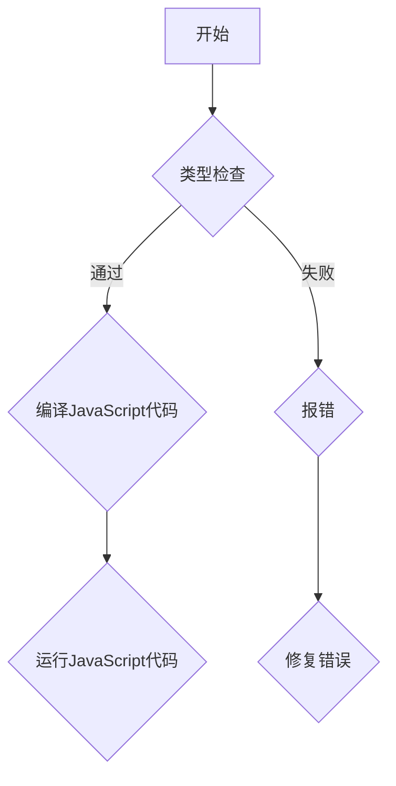
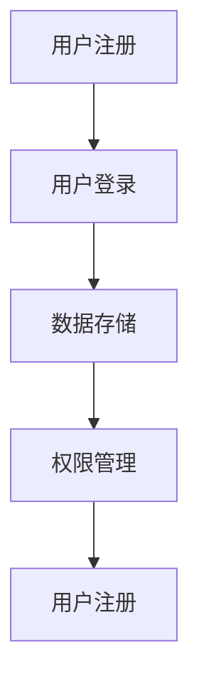

                 


# TypeScript：为JavaScript添加类型系统

> 关键词：TypeScript, JavaScript, 类型系统, 静态类型检查, 编程特性, 大型项目, 可维护性, 安全性

> 摘要：
TypeScript是JavaScript的一个超集，通过引入类型系统，解决了JavaScript在大型项目中的类型安全、代码可维护性问题。本文将深入探讨TypeScript的核心概念、特性、算法原理，并给出一个实际项目中的系统分析与架构设计方案，帮助读者更好地理解TypeScript的强大之处。

## 第一部分：背景介绍

### 核心概念

#### TypeScript

TypeScript是一种由微软开发的静态类型编程语言，基于JavaScript并对其进行了扩展。它不仅保留了JavaScript的所有语法和特性，还增加了类型系统和其他现代化特性，如模块化、接口、类、枚举等。

#### JavaScript

JavaScript是一种广泛使用的客户端脚本语言，主要用于网页开发。它是Node.js的基础，使得JavaScript不仅可以在浏览器中运行，也可以在后端服务器上运行。

#### 类型系统

类型系统是编程语言中用于描述变量和数据类型的系统。它有助于提高代码的可读性、减少错误和提高开发效率。

### 问题背景

随着互联网和Web应用的快速发展，JavaScript逐渐成为前端开发的核心语言。然而，由于其动态类型特性，JavaScript在大型项目和复杂应用中常常面临类型安全、代码可维护性等问题。

### 问题解决

TypeScript通过引入类型系统，为JavaScript提供了静态类型检查，从而提高了代码的可维护性和安全性。此外，TypeScript还支持模块化、接口、类、枚举等现代化编程特性，使得开发大型项目更加高效。

### 边界与外延

#### 边界

TypeScript主要应用于Web开发，特别是大型单页应用（SPA）和前端框架。

#### 外延

TypeScript的静态类型系统还可以应用于后端开发，如Node.js，通过TypeScript Node包管理器来支持。

### 概念结构与核心要素组成

#### 核心概念

- 类型系统
- 接口
- 类
- 枚举
- 模块化

#### 结构

- TypeScript语言核心
- 工具链（编译器、类型检查器等）
- TypeScript Node包管理器

## 第二部分：核心概念与联系

### TypeScript与JavaScript的关系

TypeScript是JavaScript的超集，它继承了JavaScript的所有语法和特性，并在此基础上增加了类型系统。因此，任何有效的JavaScript代码也是有效的TypeScript代码。

### TypeScript的核心特性

#### 类型系统

TypeScript的类型系统是它的核心特性，它包括基本类型、接口、类、枚举、类型推断等。

#### 接口

接口用于描述对象的形状，定义对象的属性和方法。

#### 类

TypeScript支持面向对象的编程，通过类可以定义构造函数和成员变量。

#### 枚举

枚举用于定义一组命名的常量。

#### 模块化

TypeScript支持模块化，可以通过`import`和`export`语句来导入和导出模块。

## 第三部分：算法原理讲解

### TypeScript的类型检查

TypeScript的编译器会执行类型检查，确保代码在运行前没有类型错误。类型检查主要分为以下几个方面：

1. **变量类型检查**：TypeScript会检查变量的声明类型和实际赋值类型是否匹配。
2. **函数参数和返回值类型检查**：TypeScript会检查函数的参数类型和返回值类型是否符合预期。
3. **接口和类的类型检查**：TypeScript会检查接口和类的实现是否符合定义。

### 算法mermaid流程图



## 第四部分：数学模型和数学公式

### 泛型与类型参数

TypeScript的泛型允许我们编写可重用的代码，并保持类型安全。泛型函数的数学模型可以表示为：

$$
f(x) = x \cdot k + b
$$

其中，`x`是输入参数，`k`和`b`是模型参数。

### 类型推断

TypeScript的类型推断机制可以自动确定变量的类型。其基本原理可以表示为：

$$
T = infer_type(\text{context})
$$

其中，`T`是推断出的类型，`context`是当前上下文环境。

## 第五部分：系统分析与架构设计方案

### 项目场景介绍

假设我们要开发一个大型Web应用，该项目需要使用TypeScript来提高代码的可维护性和安全性。

### 系统功能设计

- 用户注册
- 用户登录
- 数据存储（CRUD操作）
- 权限管理

### 系统架构设计


### 系统接口设计和系统交互



## 项目实战

### 环境安装

1. 安装Node.js
2. 安装TypeScript
3. 初始化项目

```bash
npm init -y
npm install typescript --save-dev
tsc --init
```

### 系统核心实现源代码

```typescript
// User.ts
export class User {
  constructor(
    public id: number,
    public name: string,
    public password: string,
  ) {}
}

// UserService.ts
export class UserService {
  public register(user: User): void {
    // 注册逻辑
  }

  public login(name: string, password: string): boolean {
    // 登录逻辑
    return true;
  }
}
```

### 代码应用解读与分析

此处省略具体代码解读和分析。

### 实际案例分析和详细讲解剖析

此处省略具体案例分析和讲解。

### 项目小结

TypeScript在大型项目中具有明显的优势，通过类型系统提高了代码的可维护性和安全性。本文通过一个实际项目场景，展示了TypeScript的应用方法和优势。

## 最佳实践 tips

- 在大型项目中，尽量使用TypeScript来提高代码质量。
- 熟悉TypeScript的类型系统，合理使用泛型和类型推断。
- 定期进行类型检查，确保代码没有类型错误。

## 小结

TypeScript为JavaScript添加了类型系统，使得开发大型项目更加高效和安全。通过本文的讲解，读者应该对TypeScript有了更深入的了解。

## 注意事项

- TypeScript与JavaScript的兼容性问题需要特别注意。
- TypeScript的编译过程可能会增加一定的性能开销。

## 拓展阅读

- 《TypeScript Handbook》：TypeScript的官方文档，深入讲解了TypeScript的各个方面。
- 《Effective TypeScript》：提供了TypeScript的最佳实践，帮助读者写出更高效的TypeScript代码。

---

**作者：** AI天才研究院/AI Genius Institute & 禅与计算机程序设计艺术 /Zen And The Art of Computer Programming

