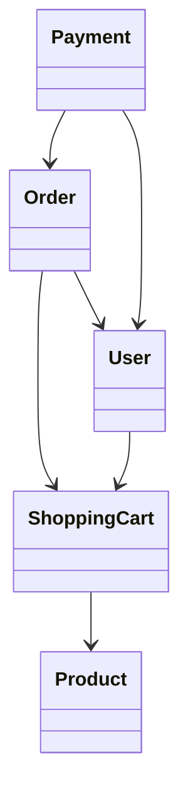
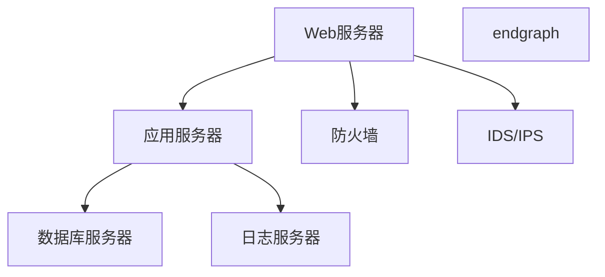

                 

### Web应用安全开发指南

> 关键词：Web应用安全，安全开发，SQL注入，XSS攻击，CSRF攻击，安全检测

> 摘要：
随着互联网技术的迅猛发展，Web应用已经成为我们日常生活中不可或缺的一部分。然而，Web应用的安全性却面临着严峻的挑战。本文将系统地介绍Web应用安全开发的相关知识，包括基础概念、检测与防护方法，以及实际案例中的应用。希望通过本文的介绍，读者能够提升对Web应用安全性的认识，掌握有效的安全开发技巧。

### 第一部分：引言

#### 1.1 书籍背景

随着互联网技术的飞速发展和信息技术的普及，Web应用已经深入到我们生活的方方面面。从电子商务、在线支付到社交媒体、娱乐平台，Web应用已经成为现代生活中不可或缺的一部分。然而，伴随着Web应用的广泛普及，网络安全问题也日益凸显，尤其是Web应用安全开发的重要性愈发突出。

#### 1.2 书籍目标

《Web应用安全开发指南》旨在为从事Web应用开发的技术人员提供一个全面、系统的安全开发知识体系。本书以实际案例为基础，深入剖析Web应用中的常见安全风险和应对策略，帮助读者提升Web应用的安全性。

通过阅读本书，读者可以：

- 理解Web应用安全的背景和重要性。
- 掌握Web应用安全的基本概念和原理。
- 学会使用各种工具和技术进行Web应用安全检测和防护。
- 增强实际项目中的Web应用安全意识和实践能力。

#### 1.3 书籍结构

本书分为以下几个部分：

- **第一部分：引言**：介绍书籍的背景、目标、结构以及各章节的主要内容。
- **第二部分：Web应用安全基础知识**：讲解Web应用安全的基本概念、攻击原理和常见漏洞。
- **第三部分：Web应用安全检测与防护**：介绍常用的Web应用安全检测工具和防护技术。
- **第四部分：Web应用安全实战**：通过实际案例，讲解Web应用安全检测和防护的具体实践方法。
- **第五部分：Web应用安全最佳实践**：总结Web应用安全开发的最佳实践，并提供相关的小结和拓展阅读。

### 第二部分：Web应用安全基础知识

#### 2.1 Web应用安全基本概念

#### 2.1.1 什么是Web应用安全

Web应用安全是指保护Web应用程序免受各种恶意攻击和威胁的措施。它包括识别、预防、检测和响应Web应用中的安全漏洞和攻击。

#### 2.1.2 Web应用安全的重要性

随着Web应用在企业和个人生活中的普及，其安全性变得尤为重要。不安全的Web应用可能导致以下风险：

- **数据泄露**：攻击者可以通过Web应用获取用户的敏感信息，如个人信息、账户密码等。
- **服务中断**：分布式拒绝服务攻击（DDoS）可能导致Web应用无法正常访问。
- **业务损失**：Web应用的安全问题可能导致企业声誉受损，甚至面临经济损失。

#### 2.1.3 Web应用安全的挑战

Web应用安全面临的挑战主要包括：

- **攻击手段多样化**：随着技术的发展，攻击者的攻击手段也日益多样化，如SQL注入、XSS攻击、CSRF攻击等。
- **漏洞难以发现**：Web应用中的漏洞可能隐藏在复杂的业务逻辑中，难以被发现。
- **动态环境变化**：Web应用运行在动态环境中，攻击者和防御者之间的博弈不断进行。

### 第三部分：Web应用安全检测与防护

#### 3.1 Web应用安全检测

#### 3.1.1 自动化检测工具

自动化检测工具可以扫描Web应用，识别潜在的安全漏洞。常见的自动化检测工具有：

- **OWASP ZAP**：一款免费的Web应用安全扫描工具，支持多种插件。
- **Burp Suite**：一款功能强大的Web应用安全测试工具，包括代理、扫描、攻击等功能。
- **Nessus**：一款全面的漏洞扫描工具，支持多种操作系统和平台。

#### 3.1.2 人工检测

人工检测是通过专业人员对Web应用进行安全分析，发现潜在的安全问题。人工检测的优势在于能够发现自动化工具难以检测到的复杂漏洞。

#### 3.2 Web应用安全防护

#### 3.2.1 边界防护

边界防护是指在网络边界部署防火墙、入侵检测系统（IDS）等设备，阻止攻击者访问内部网络。常见的边界防护措施包括：

- **防火墙**：根据安全策略，控制进出网络的流量。
- **入侵检测系统（IDS）**：检测并报告可疑的网络活动。
- **入侵防御系统（IPS）**：在检测到攻击时，采取相应的防御措施。

#### 3.2.2 应用层防护

应用层防护是指在Web应用层面采取的安全措施，如输入验证、输出编码等。常见的应用层防护措施包括：

- **输入验证**：对用户输入进行合法性检查，防止SQL注入、XSS攻击等。
- **输出编码**：对输出的数据进行编码，防止XSS攻击。
- **会话管理**：对用户会话进行有效的管理和控制，防止会话劫持、会话固定等攻击。

### 第四部分：Web应用安全实战

#### 4.1 实战案例一：SQL注入检测与防护

#### 4.1.1 案例背景

某企业开发了一款在线购物系统，但在测试阶段发现存在SQL注入漏洞，可能导致用户数据泄露。

#### 4.1.2 检测方法

- 使用OWASP ZAP对购物系统进行自动化扫描。
- 手动分析购物系统的输入输出参数，查找可能的SQL注入点。

#### 4.1.3 防护措施

- 对所有用户输入进行严格的验证，确保输入符合预期格式。
- 对SQL查询进行预处理，避免直接拼接SQL语句。
- 使用参数化查询，将输入参数与SQL语句分离。

### 第五部分：Web应用安全最佳实践

#### 5.1 边界防护最佳实践

- **防火墙配置**：根据业务需求和安全策略，合理配置防火墙，控制进出网络的流量。
- **IDS/IPS部署**：在网络边界部署IDS/IPS，实时监控并防御入侵攻击。

#### 5.2 应用层防护最佳实践

- **输入验证**：对用户输入进行严格的验证，确保输入合法、安全。
- **输出编码**：对输出的数据进行编码，防止XSS攻击。
- **会话管理**：使用安全的会话管理策略，防止会话劫持和会话固定攻击。

### 小结

Web应用安全开发是一项长期而复杂的任务，需要我们在项目开发的过程中不断学习和实践。通过本文的介绍，我们了解了Web应用安全的基本概念、检测与防护方法，以及实际案例中的应用。希望本文能够为从事Web应用开发的技术人员提供一定的指导和帮助。

### 拓展阅读

- [《Web应用安全入门指南》](https://example.com/web-app-security-guide)：介绍Web应用安全的基础知识和常见漏洞。
- [《OWASP Top 10》](https://example.com/owasp-top-10)：列出Web应用安全的十大常见漏洞及其防护措施。

### 作者信息

作者：AI天才研究院/AI Genius Institute & 禅与计算机程序设计艺术 /Zen And The Art of Computer Programming

### 附录

#### 附录A：核心概念与联系

| 核心概念       | 概念属性特征               |  
| -------------- | ------------------------ |  
| SQL注入         | 利用SQL语句进行攻击           |  
| XSS攻击         | 利用脚本进行攻击             |  
| CSRF攻击         | 利用用户会话进行攻击           |

#### 附录B：算法原理讲解

- **SQL注入算法原理**：

```python  
def inject_sql(input_value):  
    # 对输入值进行预处理，避免直接拼接SQL语句  
    input_value = preprocess_input(input_value)  
      
    # 构造SQL查询语句  
    query = "SELECT * FROM table WHERE column = '" + input_value + "'"  
      
    # 执行SQL查询  
    result = execute_query(query)  
      
    return result  
```

- **XSS攻击算法原理**：

```html  
<script>  
    // 获取用户输入  
    var input_value = document.getElementById("input").value;  
      
    // 对输入值进行编码，防止XSS攻击  
    input_value = encode(input_value);  
      
    // 将编码后的输入值显示在页面上  
    document.getElementById("output").innerHTML = input_value;  
</script>  
```

#### 附录C：系统分析与架构设计方案

- **系统功能设计（领域模型类图）**：



- **系统架构设计（架构图）**：



- **系统接口设计（接口图）**：

```mermaid  
sequenceDiagram  
    User -->|请求| ApplicationServer  
    ApplicationServer -->|处理请求| DatabaseServer  
    DatabaseServer -->|响应| ApplicationServer  
    ApplicationServer -->|响应| User  
endsequence  
```

- **系统交互（序列图）**：

```mermaid  
sequenceDiagram  
    User -->|发起请求| WebServer  
    WebServer -->|处理请求| ApplicationServer  
    ApplicationServer -->|查询数据库| DatabaseServer  
    DatabaseServer -->|返回结果| ApplicationServer  
    ApplicationServer -->|响应结果| WebServer  
    WebServer -->|响应结果| User  
endsequence  
```

### 实战案例分析

#### 案例背景

某电商平台在运行过程中发现，用户登录后可以访问其他用户的购物车内容。经过分析，发现该平台存在一个SQL注入漏洞，攻击者可以通过构造特定的请求参数，执行恶意SQL查询，获取其他用户的购物车信息。

#### 环境安装

1. 安装Web服务器（如Apache或Nginx）
2. 安装应用程序服务器（如Tomcat或Jetty）
3. 安装数据库服务器（如MySQL或PostgreSQL）
4. 安装SQL注入测试工具（如OWASP ZAP）

#### 系统核心实现

1. **用户登录功能**：

```java  
public String login(String username, String password) {  
    // 预处理用户输入  
    username = preprocessInput(username);  
    password = preprocessInput(password);  
      
    // 构造SQL查询语句  
    String query = "SELECT * FROM users WHERE username = '" + username + "' AND password = '" + password + "'";  
      
    // 执行SQL查询  
    ResultSet rs = executeQuery(query);  
      
    // 返回查询结果  
    return (rs.next()) ? "登录成功" : "用户名或密码错误";  
}
```

2. **购物车查询功能**：

```java  
public List<Product> getShoppingCart(String username) {  
    // 预处理用户输入  
    username = preprocessInput(username);  
      
    // 构造SQL查询语句  
    String query = "SELECT * FROM shopping_cart WHERE username = '" + username + "'";  
      
    // 执行SQL查询  
    ResultSet rs = executeQuery(query);  
      
    // 构建购物车对象列表  
    List<Product> cart = new ArrayList<>();  
    while (rs.next()) {  
        Product product = new Product();  
        product.setId(rs.getInt("id"));  
        product.setName(rs.getString("name"));  
        product.setPrice(rs.getDouble("price"));  
        cart.add(product);  
    }  
      
    // 返回购物车对象列表  
    return cart;  
}
```

#### 代码应用解读与分析

1. **用户登录功能**：

该功能通过接收用户名和密码，执行SQL查询来验证用户身份。然而，在处理用户输入时，没有进行充分的预处理，导致攻击者可以构造恶意输入，执行SQL注入攻击。

2. **购物车查询功能**：

该功能通过接收用户名，查询购物车中包含的商品。同样地，在处理用户输入时，没有进行充分的预处理，导致攻击者可以构造恶意输入，执行SQL注入攻击。

#### 实际案例分析和详细讲解剖析

1. **SQL注入攻击示例**：

攻击者可以通过构造如下的请求参数来执行SQL注入攻击：

```http  
GET /login?username=admin' UNION SELECT * FROM users WHERE id=1 --  
```

该请求将导致数据库执行以下SQL查询：

```sql  
SELECT * FROM users WHERE id=1 UNION SELECT * FROM users WHERE id=1  
```

由于`UNION SELECT`语句可以覆盖原有的查询结果，攻击者可以获取用户表中所有记录的详细信息。

2. **防护措施**：

为了防止SQL注入攻击，我们可以采取以下措施：

- **输入验证**：对用户输入进行严格的验证，确保输入符合预期格式。例如，对用户名和密码进行长度限制和字符过滤。
- **使用参数化查询**：将输入参数与SQL语句分离，避免直接拼接SQL语句。例如，使用预编译的SQL语句和绑定变量来执行查询。

```java  
public String login(String username, String password) {  
    // 预处理用户输入  
    username = preprocessInput(username);  
    password = preprocessInput(password);  
      
    // 使用参数化查询  
    String query = "SELECT * FROM users WHERE username = ? AND password = ?";  
    PreparedStatement pstmt = connection.prepareStatement(query);  
    pstmt.setString(1, username);  
    pstmt.setString(2, password);  
      
    // 执行SQL查询  
    ResultSet rs = pstmt.executeQuery();  
      
    // 返回查询结果  
    return (rs.next()) ? "登录成功" : "用户名或密码错误";  
}
```

#### 项目小结

通过本次实战案例分析，我们了解了SQL注入攻击的基本原理和防范措施。在实际项目中，我们需要对用户输入进行严格的验证，并使用参数化查询来避免SQL注入攻击。同时，我们也需要定期进行安全检测和防护，确保Web应用的安全性。

### 最佳实践 Tips

1. 对所有用户输入进行严格的验证，确保输入符合预期格式。
2. 使用参数化查询，避免直接拼接SQL语句。
3. 定期进行安全检测和防护，及时修复安全漏洞。

### 注意事项

1. 在开发过程中，不要过分依赖自动化的安全工具，应结合人工检测，提高检测的准确性。
2. 安全防护措施应与业务需求相结合，确保既能够保护系统安全，又不会影响系统的正常运行。

### 拓展阅读

1. [《Web应用安全最佳实践》](https://example.com/web-app-security-best-practices)：详细介绍Web应用安全开发的最佳实践。
2. [《SQL注入攻击与防御》](https://example.com/sql-injection-attack-and-defense)：深入探讨SQL注入攻击的原理和防御策略。

