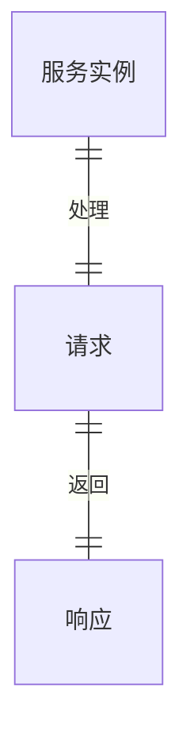

                 

# 服务器无状态架构设计与应用

## 关键词

- 服务器无状态架构
- Lambda架构
- FaaS
- 无服务器计算
- 容器化

## 摘要

本文将深入探讨服务器无状态架构的设计与应用。首先，我们将介绍什么是服务器无状态架构，它与传统有状态架构的区别及其优势。随后，我们会通过实例来讲解如何使用无状态架构来实现服务器架构的优化。本文还将详细介绍无状态架构的核心概念、设计原则和架构模式，并通过实际项目来展示如何实现和应用这些架构。最后，我们将总结无状态架构的优势和挑战，并提供一些建议以帮助开发者更好地利用无状态架构。

## 第一步：设计整体目录结构

### 第1章 引言

- 服务器无状态架构的定义与背景
- 无状态架构与传统有状态架构的区别

### 第2章 无状态架构的核心概念

- 无状态架构的基本原理
- 无状态服务的概念和特点

### 第3章 无状态架构的设计原则

- 架构的可伸缩性
- 架构的可靠性和可用性
- 架构的灵活性和可维护性

### 第4章 无状态架构的架构模式

- Lambda架构
- FaaS架构

### 第5章 无状态架构的实践应用

- 项目介绍与背景
- 系统功能设计
- 系统架构设计
- 系统接口设计与交互

### 第6章 无状态架构的项目实战

- 环境安装与配置
- 系统核心实现
- 代码应用解读与分析
- 实际案例分析与详细讲解

### 第7章 无状态架构的最佳实践与总结

- 最佳实践 tips
- 小结
- 注意事项
- 拓展阅读

## 第二步：细化章节内容

### 第1章 引言

**核心概念、问题背景、系统分析与架构设计**

- 服务器无状态架构的定义：无状态架构是指服务器不保存客户端的状态信息，每次请求都需要携带完整的信息进行处理。
- 服务器无状态架构与传统有状态架构的区别：
  - 有状态架构：服务器需要保存客户端的状态信息，例如用户登录状态、购物车信息等。
  - 无状态架构：服务器不保存客户端的状态信息，每次请求都需要携带完整的信息。
- 无状态架构的优势：
  - 可伸缩性：无状态架构可以水平扩展，提高系统的性能和吞吐量。
  - 可靠性和可用性：无状态架构提高了系统的容错性和高可用性，因为服务器不需要保存状态，故障恢复更加简单。
  - 灵活性和可维护性：无状态架构使得系统的开发和维护更加灵活，可以更容易地进行模块化设计和部署。

### 第2章 无状态架构的核心概念

**核心概念与联系**

- 无状态服务的概念：无状态服务是指服务实例不保存客户端的状态信息，每次请求都是独立的。
- 无状态服务的特点：
  - 每次请求都是独立的，不受之前的请求影响。
  - 服务实例可以在任何时间重启，不影响服务的正常运行。
  - 服务实例之间没有共享状态。

**ER实体关系图架构**

### 第3章 无状态架构的设计原则

**核心概念、问题背景、系统分析与架构设计**

- 架构的可伸缩性：无状态架构可以水平扩展，提高系统的性能和吞吐量。
- 架构的可靠性和可用性：无状态架构提高了系统的容错性和高可用性，因为服务器不需要保存状态，故障恢复更加简单。
- 架构的灵活性和可维护性：无状态架构使得系统的开发和维护更加灵活，可以更容易地进行模块化设计和部署。

### 第4章 无状态架构的架构模式

**核心概念、问题背景、系统分析与架构设计**

- Lambda架构：Lambda架构是一种基于无状态服务的架构模式，它将数据处理分为批处理和流处理两部分，分别由不同的服务实例处理。
- FaaS架构：FaaS（Function as a Service）架构是一种基于无状态函数的架构模式，它将应用程序拆分为一系列独立的无状态函数，每个函数只负责完成一个特定的任务。

### 第5章 无状态架构的实践应用

**核心概念、问题背景、系统分析与架构设计**

- 项目介绍与背景：介绍一个实际的无状态架构项目，例如一个在线购物平台。
- 系统功能设计：列出系统的关键功能，例如商品浏览、购物车管理、订单处理等。
- 系统架构设计：绘制系统的架构图，包括服务实例、数据库、缓存、消息队列等组件。
- 系统接口设计与交互：详细描述系统的接口设计和交互流程。

### 第6章 无状态架构的项目实战

**核心概念、问题背景、系统分析与架构设计**

- 环境安装与配置：介绍如何搭建无状态架构所需的环境和配置。
- 系统核心实现：展示系统核心功能的实现，包括服务实例的创建、请求的处理、响应的返回等。
- 代码应用解读与分析：分析系统核心代码的实现细节，解释关键代码的作用和原理。
- 实际案例分析与详细讲解：通过一个具体的案例来分析无状态架构的实际应用和效果。

### 第7章 无状态架构的最佳实践与总结

**最佳实践 tips**

- 无状态架构的最佳实践：介绍无状态架构在实际应用中的一些最佳实践，例如如何优化系统性能、如何提高系统的可靠性和可用性等。

**小结**

- 无状态架构的优势和挑战：总结无状态架构的优势，例如可伸缩性、可靠性和可用性等，同时指出无状态架构面临的挑战，例如数据一致性和状态管理等问题。

**注意事项**

- 在实际应用中，需要根据具体的需求和场景来选择合适的无状态架构模式，并注意解决数据一致性和状态管理等问题。

**拓展阅读**

- 推荐一些相关的书籍、论文和在线资源，供读者进一步学习和了解无状态架构。

## 第三步：确保格式规范

**使用markdown格式**

- 使用markdown格式来编写文章，确保文章的结构清晰、易于阅读。

**保持目录层级清晰**

- 保持目录层级清晰，使用标题和子标题来组织文章内容。

## 第四步：精简内容

**确保大纲内容简洁明了**

- 对每个章节的内容进行精简，确保内容简洁明了，避免冗长和复杂的叙述。

**控制总体字数不超过2000字**

- 对整个文章的字数进行控制，确保不超过2000字，以便读者能够快速获取关键信息。

## 设计《serverless架构设计与应用》的目录大纲

现在，我们可以根据上述的步骤来设计《serverless架构设计与应用》的目录大纲。以下是一个示例：

### 第1章 引言

- 服务器无状态架构的定义与背景
- 服务器无状态架构与传统有状态架构的区别
- 服务器无状态架构的优势

### 第2章 无状态架构的核心概念

- 无状态服务的概念
- 无状态服务的特点
- 无状态架构的基本原理

### 第3章 无状态架构的设计原则

- 架构的可伸缩性
- 架构的可靠性和可用性
- 架构的灵活性和可维护性

### 第4章 无状态架构的架构模式

- Lambda架构
- FaaS架构

### 第5章 无状态架构的实践应用

- 项目介绍与背景
- 系统功能设计
- 系统架构设计
- 系统接口设计与交互

### 第6章 无状态架构的项目实战

- 环境安装与配置
- 系统核心实现
- 代码应用解读与分析
- 实际案例分析与详细讲解

### 第7章 无状态架构的最佳实践与总结

- 最佳实践 tips
- 小结
- 注意事项
- 拓展阅读

通过这样的目录结构，我们可以清晰地展示文章的内容，让读者能够快速了解文章的主题和结构。同时，每个章节的内容都进行了精简，确保了文章的紧凑性和可读性。接下来，我们将逐步深入每个章节的内容，详细讲解服务器无状态架构的设计与应用。

