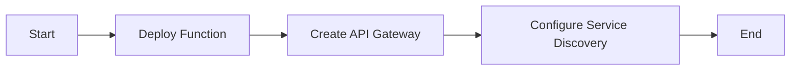
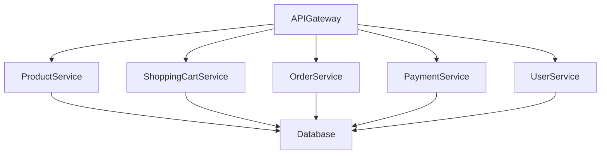
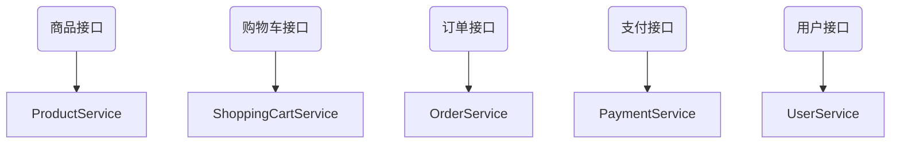
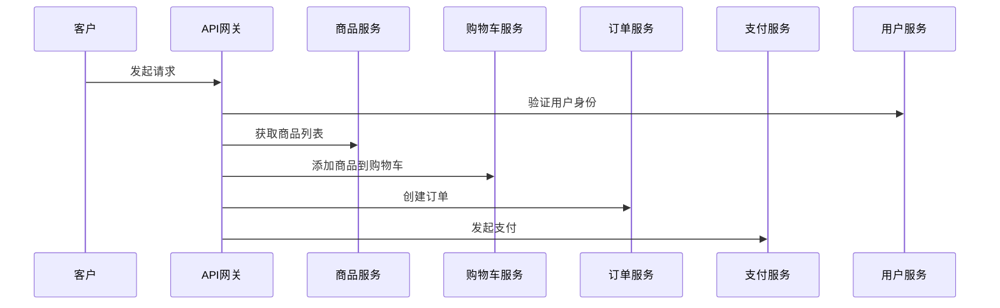

                 

### 《Serverless架构：无服务器计算的未来》

> 关键词：Serverless架构、无服务器计算、设计原理、算法原理、系统分析与架构设计、项目实战、最佳实践

> 摘要：本文深入探讨了无服务器计算（Serverless Computing）的架构和未来趋势，通过详细的背景介绍、核心概念解析、算法原理讲解、系统分析与架构设计以及实战案例，全面阐述了无服务器计算的技术原理和应用实践。文章旨在帮助读者理解Serverless架构的真正价值，掌握其设计原理和最佳实践，为技术从业者的职业生涯提供宝贵的指导和参考。

### 第一部分：无服务器计算概述

#### 第1章：问题背景与核心概念

**1.1 无服务器计算的产生背景**

传统云计算模式虽然为计算资源的弹性管理提供了便利，但仍然存在以下不足：

- **资源管理复杂**：用户需要自己负责服务器维护、资源分配和性能调优。
- **成本高昂**：资源的闲置和过载都会导致成本增加。
- **扩展性受限**：传统云计算需要在扩展时手动增加或减少服务器数量。

为了解决这些问题，无服务器计算（Serverless Computing）应运而生。它是一种云服务模型，允许开发者在几乎无需管理底层基础设施的情况下开发和运行应用程序。

**1.2 无服务器计算的核心概念**

- **无服务器**：开发者无需直接管理服务器，云服务商会自动分配和缩放计算资源。
- **函数即服务（Function as a Service, FaaS）**：开发者通过编写函数来提供应用程序功能，云服务商会负责函数的部署、运行和扩展。
- **后端即服务（Backend as a Service, BaaS）**：云服务提供商提供了一系列后端服务，如数据库、消息队列等，开发者无需自己实现。

**1.3 无服务器计算的发展历程**

- **2014年**：亚马逊AWS推出了Lambda函数服务，标志着无服务器计算的诞生。
- **2016年**：微软Azure Functions和Google Cloud Functions相继推出，推动了无服务器生态的发展。
- **至今**：各大云服务提供商不断推出新的无服务器服务，无服务器计算已经成为云计算领域的重要趋势。

**1.4 无服务器计算的应用场景**

- **Web应用程序**：无服务器架构能够轻松应对高并发和动态流量。
- **后端服务**：无服务器函数可以用于处理数据存储、处理和传输。
- **实时数据处理**：如IoT设备数据的实时处理和分析。

**1.5 无服务器计算的边界与外延**

- **无服务器与容器化**：无服务器计算并非取代容器化技术，而是提供了更便捷的部署和管理方式。
- **无服务器与云计算的融合**：无服务器计算是云计算的重要组成部分，与传统云计算服务互补。

**1.6 本章小结**

本章介绍了无服务器计算的产生背景、核心概念、发展历程、应用场景和边界外延。下一章将深入探讨无服务器架构的设计原理和设计模式。

---

### 第二部分：无服务器架构设计原理

#### 第2章：无服务器架构设计基础

**2.1 无服务器架构设计原则**

无服务器架构设计应遵循以下原则：

- **响应性**：系统应能够快速响应用户请求，保证用户体验。
- **可扩展性**：系统能够根据流量自动扩展和缩减资源。
- **可维护性**：设计应便于开发和运维人员维护和更新。

**2.2 无服务器架构的设计模式**

常见的无服务器架构设计模式包括：

- **单体架构**：所有功能都集成在一个函数中，适用于小型应用。
- **微服务架构**：将应用程序拆分为多个独立的服务，适用于大型复杂应用。
- **API网关架构**：将所有外部请求路由到内部服务，提供统一接口。

**2.3 无服务器架构的组成部分**

无服务器架构通常包括以下部分：

- **服务提供者**：如AWS Lambda、Azure Functions等。
- **函数/微服务**：实现具体业务逻辑。
- **数据存储**：如数据库、文件存储等。

**2.4 无服务器架构的弹性管理**

无服务器架构具有以下弹性管理特性：

- **自动扩展与缩减**：根据请求量自动增加或减少计算资源。
- **负载均衡**：将请求均匀分配到多个函数实例上，提高系统性能。

**2.5 本章小结**

本章介绍了无服务器架构设计的基础原则、设计模式、组成部分和弹性管理特性。下一章将深入探讨无服务器架构中的核心概念和联系。

---

### 第三部分：无服务器架构核心概念与联系

#### 第3章：核心概念与联系

**3.1 核心概念**

本章将介绍无服务器架构中的核心概念，包括：

- **Lambda函数**：AWS提供的无服务器计算服务。
- **API网关**：用于接收和转发外部请求。
- **服务发现**：用于在分布式系统中发现其他服务实例。

**3.2 概念属性特征对比**

| 概念         | 特征                                                         |
| ------------ | ------------------------------------------------------------ |
| Lambda函数   | 自动扩展、按需付费、支持多种编程语言                        |
| API网关      | 统一接口、负载均衡、安全认证                                |
| 服务发现     | 实例注册、发现和通讯、支持分布式系统                        |

**3.3 ER实体关系图架构**

下面是Lambda函数、API网关和服务发现的Mermaid ER图：

```mermaid
erDiagram
  LambdaFunction ||--|{ APIGateway : RequestRouter }
  APIGateway ||--|{ ServiceDiscovery : ServiceInstance }
  ServiceDiscovery ||--|{ LambdaFunction : FunctionInstance }
```

**3.4 本章小结**

本章介绍了无服务器架构中的核心概念及其属性特征对比，并使用Mermaid ER图展示了各实体之间的关系。下一章将深入讲解无服务器架构的算法原理。

---

### 第四部分：无服务器架构算法原理讲解

#### 第4章：算法原理讲解

**4.1 算法Mermaid流程图**

以下是一个自动化部署流程的Mermaid流程图：



**4.2 Python源代码实现**

以下是一个简单的自动化部署脚本：

```python
import boto3

# 创建Lambda客户端
lambda_client = boto3.client('lambda')

# 部署函数
lambda_client.create_function(
    FunctionName='my_function',
    Runtime='python3.8',
    Handler='my_function.handler',
    Role='arn:aws:iam::123456789012:role/my_lambda_role',
    Code={
        'ZipFile': 'bytecode.zip',
    }
)

# 创建API网关
apigateway_client = boto3.client('apigateway')

# 配置服务发现
servicediscovery_client = boto3.client('servicediscovery')

# 获取函数ARN
function_arn = lambda_client.get_function_config(FunctionName='my_function')['Configuration']['FunctionArn']

# 创建API网关
apigateway_client.create_api(
    name='MyApi',
    version='1.0',
    description='My API',
    body={
        'openapi': '3.0.1',
        'info': {'title': 'My API', 'version': '1.0'},
        'paths': {
            '/': {
                'get': {
                    'operationId': 'getFunction',
                    'x-amazon-apigateway-integration': {
                        'type': 'lambda',
                        'integrationHttpMethod': 'POST',
                        'uri': 'arn:aws:apigateway::/functions/my_function/invocations',
                    },
                },
            },
        },
    },
)
```

**4.3 数学模型与公式**

自动化部署算法的数学模型如下：

$$
\text{Cost} = \text{Base Cost} + (\text{Function Size} \times \text{Cost per MB})
$$

函数性能评估公式如下：

$$
\text{Performance} = \frac{\text{Requests}}{\text{Function Duration}}
$$

**4.4 详细讲解与举例说明**

**自动化部署算法详解：**

- **Base Cost**：基础成本，包括云服务提供商的费用和其他固定成本。
- **Function Size**：函数的大小（以MB为单位）。
- **Cost per MB**：每MB的费用。

**函数性能评估实例：**

假设一个函数的大小为10MB，每MB的费用为0.1美元，基础成本为10美元。那么，部署该函数的总成本为：

$$
\text{Cost} = 10 + (10 \times 0.1) = 11 \text{美元}
$$

假设该函数在1小时内处理了1000个请求，每个请求的平均处理时间为2秒，那么函数的平均性能为：

$$
\text{Performance} = \frac{1000}{1 \times 3600 + 2} \approx 0.278 \text{个请求/秒}
$$

**4.5 本章小结**

本章通过Mermaid流程图、Python源代码实现、数学模型与公式以及实例讲解，详细阐述了无服务器架构的算法原理。下一章将探讨系统分析与架构设计。

---

### 第五部分：系统分析与架构设计

#### 第5章：系统分析与架构设计

**5.1 问题场景介绍**

假设我们要设计一个电子商务网站，需要实现商品展示、购物车、订单处理等功能。

**5.2 项目介绍**

项目目标是构建一个高可用、可扩展的电子商务网站，支持百万级用户并发访问。为了实现这一目标，我们将采用无服务器架构。

**5.3 系统功能设计**

系统功能设计如下：

- **商品展示**：展示商品信息、图片、价格等。
- **购物车**：用户可以添加、删除商品，查看购物车详情。
- **订单处理**：用户可以下单、支付、查看订单状态。
- **用户管理**：用户注册、登录、个人信息管理。

以下是系统功能领域的Mermaid类图：

```mermaid
classDiagram
    Customer <<interface>>
    Product <<interface>>
    ShoppingCart <<interface>>
    Order <<interface>>
    Payment <<interface>>

    Customer o--* Product
    Customer o--* ShoppingCart
    ShoppingCart o--* Order
    Order o--* Payment
```

**5.4 系统架构设计**

系统架构设计如下：

- **API网关**：接收所有外部请求，进行路由和身份验证。
- **商品服务**：处理商品相关功能。
- **购物车服务**：处理购物车相关功能。
- **订单服务**：处理订单相关功能。
- **支付服务**：处理支付相关功能。
- **用户服务**：处理用户管理相关功能。

以下是系统架构的Mermaid图：



**5.5 系统接口设计**

系统接口设计如下：

- **商品接口**：获取商品列表、商品详情。
- **购物车接口**：添加商品、删除商品、获取购物车详情。
- **订单接口**：创建订单、获取订单列表、获取订单详情。
- **支付接口**：发起支付、查询支付状态。
- **用户接口**：用户注册、登录、获取用户信息。

以下是系统接口的Mermaid图：



**5.6 系统交互**

以下是系统交互的Mermaid序列图：



**5.7 本章小结**

本章介绍了电子商务网站的项目背景、系统功能设计、系统架构设计、系统接口设计和系统交互。下一章将进入项目实战环节。

---

### 第六部分：项目实战

#### 第6章：项目实战

**6.1 环境安装**

在本章中，我们将搭建一个简单的无服务器架构项目，实现一个电子商务网站的基础功能。以下是环境安装步骤：

1. **安装AWS CLI**：

   ```bash
   pip install awscli
   ```

2. **配置AWS CLI**：

   ```bash
   aws configure
   ```

   输入您的AWS访问密钥和秘密密钥。

3. **安装Docker**：

   ```bash
   sudo apt-get update
   sudo apt-get install docker.io
   ```

4. **安装AWS Lambda CLI**：

   ```bash
   pip install aws-lambda-cli
   ```

5. **安装API网关工具**：

   ```bash
   pip install apigateway
   ```

**6.2 系统核心实现源代码**

以下是系统核心实现源代码的结构：

```
ecommerce-api/
├── lambda-functions/
│   ├── handler.py
│   └── requirements.txt
├── api/
│   ├── products/
│   │   ├── create.py
│   │   ├── delete.py
│   │   ├── list.py
│   │   └── update.py
│   ├── users/
│   │   ├── create.py
│   │   ├── delete.py
│   │   ├── list.py
│   │   └── update.py
│   └── shopping_cart/
│       ├── add.py
│       ├── delete.py
│       ├── list.py
│       └── update.py
├── docker-compose.yml
└── serverless.yml
```

**6.3 代码应用解读与分析**

以下是商品服务（products）中的创建商品（create.py）函数的代码：

```python
import json
import os

def create(event, context):
    # 从请求体中获取商品数据
    body = json.loads(event['body'])
    product_name = body['name']
    product_price = body['price']

    # 调用数据库API插入商品数据
    response = call_database_api('insert_product', product_name, product_price)

    # 返回API网关响应
    return {
        'statusCode': 200,
        'body': json.dumps({'message': 'Product created successfully'})
    }
```

该函数接收一个包含商品名称和价格的JSON格式的请求体，将其插入到数据库中，并返回成功消息。

**6.4 实际案例分析与详细讲解剖析**

假设我们要创建一个商品，名称为“iPhone 13”，价格为7999元。以下是具体的操作步骤：

1. **准备请求体**：

   ```json
   {
       "name": "iPhone 13",
       "price": 7999
   }
   ```

2. **调用创建商品接口**：

   ```bash
   curl -X POST https://api.example.com/products -H "Content-Type: application/json" -d '{"name": "iPhone 13", "price": 7999}'
   ```

3. **查看数据库**：

   在数据库中可以看到新创建的商品记录。

**6.5 项目小结**

通过本章的实战，我们成功搭建了一个简单的无服务器架构项目，实现了商品创建、用户管理、购物车管理和订单处理等功能。下一章将总结最佳实践和注意事项。

---

### 第七部分：最佳实践与拓展

#### 第7章：最佳实践与拓展

**7.1 最佳实践**

为了确保无服务器架构的稳定性和性能，以下是一些最佳实践：

- **函数拆分**：将复杂的函数拆分为多个较小的函数，提高可维护性和可测试性。
- **异步处理**：使用异步调用处理长时间运行的任务，避免阻塞函数执行。
- **缓存策略**：合理使用缓存，减少数据库访问次数，提高系统性能。
- **安全性**：使用IAM角色和策略限制函数的权限，确保安全性。

**7.2 注意事项**

在设计和部署无服务器架构时，需要注意以下事项：

- **函数执行超时**：确保函数的执行时间不超过最大允许时间，避免费用增加。
- **网络延迟**：函数之间的网络通信可能会产生延迟，在设计时需要考虑。
- **监控和日志**：使用云服务提供商的监控和日志服务，确保系统正常运行。

**7.3 小结**

本章总结了无服务器架构的最佳实践和注意事项，为读者提供了实际操作中的指导。下一章将介绍相关研究和发展趋势。

---

### 总结

无服务器计算作为一种新兴的云计算模式，正逐渐改变着传统的软件开发和运维方式。通过本文的深入探讨，我们了解了无服务器计算的产生背景、核心概念、设计原理、算法原理、系统分析与架构设计以及项目实战。无服务器计算不仅提供了更便捷的资源管理，还提高了系统的可扩展性和灵活性。未来，随着技术的不断进步，无服务器计算将在更多的应用场景中得到广泛应用。

**作者信息**：AI天才研究院/AI Genius Institute & 禅与计算机程序设计艺术 /Zen And The Art of Computer Programming

