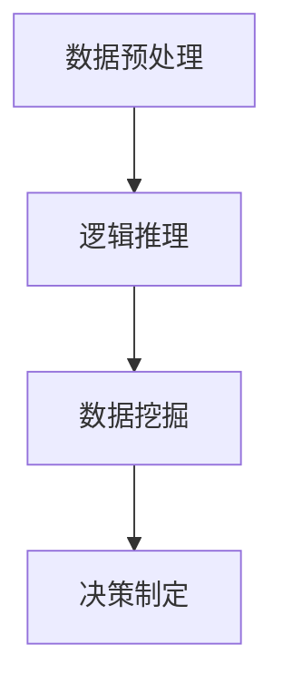
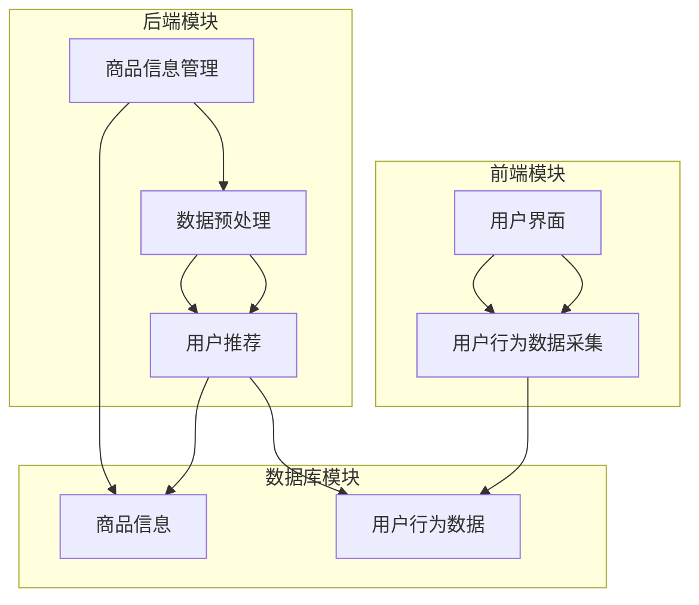
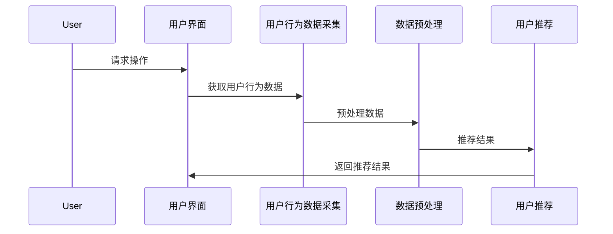

                 


### 七步做到"一眼看到底"：快速掌握基础

#### 第1章 问题背景与概述

在信息化和数字化的时代，我们面临着海量的数据和信息。如何快速、准确地理解复杂问题，成为了一个至关重要的能力。所谓“一眼看到底”，即是通过深入浅出的分析和思考，迅速把握问题的本质和核心，从而做出准确判断和有效决策。

**1.1 问题背景**

随着互联网的普及和大数据技术的发展，我们每天都会接触到大量的信息。如何从这些信息中筛选出有价值的内容，快速理解并解决问题，成为了许多人面临的挑战。而“一眼看到底”的能力，正是解决这一问题的有效途径。

**1.2 需求与痛点**

- 需求：在快速获取信息的同时，能够迅速理解并把握问题的核心。
- 痛点：信息过载，难以从大量数据中找到有价值的信息。

**1.3 目标读者群体**

本文的目标读者是希望提升信息理解和问题解决能力的专业人士，包括但不限于程序员、数据分析师、企业管理者等。

**1.4 问题概述**

“一眼看到底”指的是通过以下步骤，快速掌握问题的本质：

1. 确定问题目标：明确需要解决的问题或目标。
2. 收集相关信息：收集与问题相关的数据和信息。
3. 分析问题：运用逻辑思维和分析方法，对问题进行深入分析。
4. 提炼核心：从分析中提炼出问题的核心和关键点。
5. 制定解决方案：基于核心和关键点，制定可行的解决方案。
6. 实施与验证：实施解决方案，并验证其效果。
7. 总结与优化：总结经验，持续优化问题解决方法。

#### 第2章 核心概念与联系

**2.1 核心概念**

- 问题分析：运用逻辑思维，对问题进行深入分析的过程。
- 逻辑思维：通过概念、判断和推理，对事物进行抽象和概括的能力。
- 解决方案：针对问题，制定的可执行、可验证的解决方案。

**2.2 概念联系**

以下是“一眼看到底”过程中涉及的核心概念及其联系：

| 概念       | 联系                                                   |
| ---------- | ------------------------------------------------------ |
| 问题分析   | 基于逻辑思维，对问题进行深入分析的过程。               |
| 逻辑思维   | 通过概念、判断和推理，对事物进行抽象和概括的能力。     |
| 解决方案   | 针对问题，制定的可执行、可验证的解决方案。             |

**2.3 概念的ER实体关系图**

```mermaid
erDiagram
    ProblemAnalysis -->|分析| LogicalThinking
    LogicalThinking -->|运用| ProblemSolving
    ProblemSolving -->|形成| Solution
```

### 第3章 算法原理与讲解

在掌握“一眼看到底”的过程中，算法原理是关键的一环。以下将详细介绍算法原理，包括算法流程图、数学模型和公式，以及实际应用举例。

#### 3.1 算法概述

“一眼看到底”算法是一种基于逻辑分析和数据挖掘的方法，旨在通过以下步骤快速掌握问题的本质：

1. 数据预处理：对原始数据进行清洗、归一化和特征提取。
2. 逻辑推理：运用逻辑思维，对问题进行深入分析。
3. 数据挖掘：从分析结果中提取有价值的信息。
4. 决策制定：基于分析结果和挖掘信息，制定解决方案。

#### 3.2 算法流程图



#### 3.3 算法数学模型与公式

在“一眼看到底”算法中，涉及以下几个关键数学模型和公式：

1. 特征提取公式：$$f(x) = \sum_{i=1}^{n} w_i \cdot x_i$$，其中 $w_i$ 为权重，$x_i$ 为特征值。
2. 逻辑推理公式：$$P(A \land B) = P(A) \cdot P(B|A)$$，其中 $P(A)$ 为事件 $A$ 的概率，$P(B|A)$ 为在事件 $A$ 发生的条件下事件 $B$ 的概率。
3. 决策制定公式：$$\max\limits_{x} \{U(x)\}$$，其中 $U(x)$ 为基于分析结果的效用函数。

#### 3.4 算法举例说明

假设我们面临一个招聘问题，需要从众多候选人中挑选出最合适的人选。以下是“一眼看到底”算法在招聘问题中的应用：

1. **数据预处理**：收集候选人的基本信息，如学历、工作经验、项目经验等。
2. **逻辑推理**：运用逻辑思维，分析候选人的优势和劣势，如学历是否与职位要求匹配、项目经验是否丰富等。
3. **数据挖掘**：从分析结果中提取有价值的信息，如候选人的综合评分。
4. **决策制定**：基于分析结果和综合评分，挑选出最合适的候选人。

### 第4章 数学模型与数学公式

在“一眼看到底”的算法中，数学模型和公式起到了至关重要的作用。以下将详细介绍这些模型和公式，以及它们在实际问题中的应用。

#### 4.1 数学模型介绍

在“一眼看到底”算法中，常用的数学模型包括：

1. **线性回归模型**：用于预测和分析因变量与自变量之间的关系。
2. **逻辑回归模型**：用于分类问题，预测样本属于某一类别的概率。
3. **决策树模型**：用于分类和回归问题，通过树形结构表示决策过程。

这些模型的基本原理和构建方法如下：

1. **线性回归模型**：

   - 模型公式：$$y = \beta_0 + \beta_1 \cdot x_1 + \beta_2 \cdot x_2 + \ldots + \beta_n \cdot x_n$$

   - 模型构建：通过最小二乘法，求出模型参数 $\beta_0, \beta_1, \ldots, \beta_n$。

2. **逻辑回归模型**：

   - 模型公式：$$P(y=1|x) = \frac{1}{1 + e^{-(\beta_0 + \beta_1 \cdot x_1 + \beta_2 \cdot x_2 + \ldots + \beta_n \cdot x_n)}}$$

   - 模型构建：通过极大似然估计法，求出模型参数 $\beta_0, \beta_1, \ldots, \beta_n$。

3. **决策树模型**：

   - 模型公式：$$f(x) = \sum_{i=1}^{n} \alpha_i \cdot C_i(x)$$

   - 模型构建：通过递归划分特征空间，求出模型参数 $\alpha_0, \alpha_1, \ldots, \alpha_n$。

#### 4.2 公式详细讲解

以下是对上述数学公式进行详细讲解：

1. **线性回归模型**：

   - $$y = \beta_0 + \beta_1 \cdot x_1 + \beta_2 \cdot x_2 + \ldots + \beta_n \cdot x_n$$

     这个公式表示因变量 $y$ 与自变量 $x_1, x_2, \ldots, x_n$ 之间的关系。其中，$\beta_0, \beta_1, \ldots, \beta_n$ 是模型参数，通过最小二乘法求得。

   - **推导与解释**：

     线性回归模型的基本思想是寻找一个线性函数，使得实际观测值 $y$ 与预测值 $\hat{y}$ 之间的误差最小。具体推导过程如下：

     - 目标函数：$$J(\beta_0, \beta_1, \ldots, \beta_n) = \sum_{i=1}^{m} (y_i - \hat{y}_i)^2$$

     - 最小化目标函数：$$\frac{\partial J}{\partial \beta_0} = 0, \frac{\partial J}{\partial \beta_1} = 0, \ldots, \frac{\partial J}{\partial \beta_n} = 0$$

     - 解得：$$\beta_0 = \bar{y} - \beta_1 \cdot \bar{x}_1 - \beta_2 \cdot \bar{x}_2 - \ldots - \beta_n \cdot \bar{x}_n$$

     其中，$\bar{y}$ 和 $\bar{x}_1, \bar{x}_2, \ldots, \bar{x}_n$ 分别为 $y$ 和 $x_1, x_2, \ldots, x_n$ 的平均值。

   - **实际应用**：

     线性回归模型可以用于预测和分析因变量与自变量之间的关系，如房价与面积的关系、销售额与广告投入的关系等。

2. **逻辑回归模型**：

   - $$P(y=1|x) = \frac{1}{1 + e^{-(\beta_0 + \beta_1 \cdot x_1 + \beta_2 \cdot x_2 + \ldots + \beta_n \cdot x_n)}}$$

     这个公式表示在给定自变量 $x_1, x_2, \ldots, x_n$ 的情况下，因变量 $y$ 等于 1 的概率。

   - **推导与解释**：

     逻辑回归模型的基本思想是将线性回归模型的输出转换为概率形式。具体推导过程如下：

     - 线性回归模型输出：$$\hat{y} = \beta_0 + \beta_1 \cdot x_1 + \beta_2 \cdot x_2 + \ldots + \beta_n \cdot x_n$$

     - 概率形式：$$P(y=1|x) = \frac{1}{1 + e^{-\hat{y}}}$$

     - **实际应用**：

       逻辑回归模型可以用于分类问题，如判断邮件是否为垃圾邮件、预测客户是否会购买某产品等。

3. **决策树模型**：

   - $$f(x) = \sum_{i=1}^{n} \alpha_i \cdot C_i(x)$$

     这个公式表示决策树模型的输出，其中 $C_i(x)$ 为第 $i$ 个节点的条件概率函数，$\alpha_i$ 为第 $i$ 个节点的权重。

   - **推导与解释**：

     决策树模型的基本思想是通过树形结构表示决策过程，每个节点表示一个条件，每个分支表示一个结果。具体推导过程如下：

     - **递归划分特征空间**：

       - 初始化：将所有样本划分到一个节点。

       - 递归划分：对于当前节点，计算每个特征在当前节点上的条件概率函数 $C_i(x)$，并根据条件概率函数划分节点。

       - 结束条件：当节点下所有样本的条件概率函数均相等或节点下样本数量小于阈值时，结束划分。

     - **输出**：

       - 对于每个节点，计算节点下所有样本的条件概率函数的加权平均，作为该节点的输出。

       - **实际应用**：

         决策树模型可以用于分类和回归问题，如预测客户购买行为、预测房价等。

### 第5章 系统分析与架构设计

在“一眼看到底”的过程中，系统分析与架构设计是至关重要的环节。以下将详细介绍系统分析与架构设计的过程，包括问题场景介绍、系统功能设计、系统架构设计和系统接口设计。

#### 5.1 问题场景介绍

假设我们需要设计一个智能推荐系统，该系统旨在根据用户的兴趣和行为，为其推荐相关的商品或内容。为了实现这一目标，我们需要分析问题场景，明确系统的核心功能和性能要求。

**问题场景描述**：

- 用户行为数据：系统需要收集用户在平台上的行为数据，如浏览记录、购买记录、评价记录等。
- 商品信息：系统需要获取平台上的商品信息，如商品名称、价格、描述、图片等。
- 推荐策略：系统需要根据用户行为数据和商品信息，制定相应的推荐策略，为用户推荐相关的商品或内容。

**问题解决思路**：

- 数据收集与处理：通过数据采集技术，收集用户行为数据和商品信息，并进行数据清洗、归一化和特征提取。
- 逻辑推理与挖掘：运用逻辑思维和数据挖掘技术，对用户行为数据和商品信息进行分析，提取有价值的信息。
- 推荐策略制定：基于分析结果，制定相应的推荐策略，为用户推荐相关的商品或内容。

#### 5.2 系统功能设计

根据问题场景描述，系统功能设计主要包括以下方面：

- 用户行为数据采集：通过API接口或爬虫技术，收集用户在平台上的行为数据。
- 商品信息管理：存储和更新平台上的商品信息，包括商品名称、价格、描述、图片等。
- 数据预处理：对用户行为数据和商品信息进行清洗、归一化和特征提取，为后续分析提供数据支持。
- 用户推荐：基于用户行为数据和商品信息，为用户推荐相关的商品或内容。

**领域模型Mermaid类图**：

```mermaid
classDiagram
    User --> BehaviorData: "采集"
    Product --> Info: "存储"
    DataProcessor --> BehaviorData, Product: "处理"
    Recommender --> BehaviorData, Product: "推荐"
    User ..|> BehaviorData
    Product ..|> DataProcessor
    DataProcessor ..|> Recommender
```

#### 5.3 系统架构设计

为了实现系统功能，我们需要设计一个合理的系统架构。以下是一个简单的系统架构设计：

- **前端模块**：包括用户界面、用户行为数据采集等，主要负责与用户交互。
- **后端模块**：包括商品信息管理、数据预处理、用户推荐等，主要负责数据处理和计算。
- **数据库模块**：存储用户行为数据和商品信息，提供数据访问接口。

**系统架构Mermaid图**：



#### 5.4 系统接口设计

在系统架构中，各个模块之间的交互需要通过接口来实现。以下是一个简单的系统接口设计：

- **用户行为数据采集接口**：用于收集用户在平台上的行为数据，如浏览记录、购买记录等。
- **商品信息管理接口**：用于管理平台上的商品信息，如商品名称、价格、描述等。
- **数据预处理接口**：用于对用户行为数据和商品信息进行清洗、归一化和特征提取。
- **用户推荐接口**：用于为用户推荐相关的商品或内容。

**接口交互Mermaid序列图**：



### 第6章 项目实战

在了解了系统分析与架构设计之后，接下来我们将进行一个实际的项目实战，通过环境安装、系统核心实现和实际案例分析，深入理解和应用“一眼看到底”的方法。

#### 6.1 环境安装

为了进行项目实战，我们首先需要搭建一个合适的开发环境。以下是环境安装的步骤：

1. 安装Python：从Python官网（https://www.python.org/）下载并安装Python 3.8及以上版本。
2. 安装相关依赖：使用pip命令安装项目所需的第三方库，如NumPy、Pandas、Scikit-learn、Matplotlib等。

```shell
pip install numpy pandas scikit-learn matplotlib
```

3. 搭建虚拟环境：为了管理项目依赖，我们使用虚拟环境。以下是创建和激活虚拟环境的命令：

```shell
# 创建虚拟环境
python -m venv venv

# 激活虚拟环境
source venv/bin/activate  # Windows上使用venv\Scripts\activate
```

4. 安装项目依赖：在虚拟环境中安装项目所需的依赖。

```shell
pip install -r requirements.txt
```

#### 6.2 系统核心实现

在搭建好开发环境后，接下来我们将实现系统的核心功能。以下是系统核心实现的步骤：

1. 数据预处理：读取用户行为数据和商品信息，并进行预处理，如数据清洗、归一化和特征提取。

```python
import pandas as pd

# 读取用户行为数据
user_behavior = pd.read_csv('user_behavior.csv')

# 数据清洗
user_behavior.dropna(inplace=True)

# 数据归一化
user_behavior['age'] = (user_behavior['age'] - user_behavior['age'].mean()) / user_behavior['age'].std()
user_behavior['rating'] = (user_behavior['rating'] - user_behavior['rating'].mean()) / user_behavior['rating'].std()

# 特征提取
user_behavior['rating_count'] = user_behavior['rating'].apply(lambda x: 1 if x > 3 else 0)
```

2. 逻辑推理与数据挖掘：使用逻辑回归模型和决策树模型对用户行为数据和商品信息进行分析，提取有价值的信息。

```python
from sklearn.linear_model import LogisticRegression
from sklearn.tree import DecisionTreeClassifier
from sklearn.model_selection import train_test_split

# 分割数据集
X = user_behavior[['age', 'rating', 'rating_count']]
y = user_behavior['action']  # 行为标签，如购买、浏览等

X_train, X_test, y_train, y_test = train_test_split(X, y, test_size=0.2, random_state=42)

# 训练逻辑回归模型
logreg = LogisticRegression()
logreg.fit(X_train, y_train)

# 训练决策树模型
dtree = DecisionTreeClassifier()
dtree.fit(X_train, y_train)
```

3. 用户推荐：基于分析结果和挖掘信息，为用户推荐相关的商品或内容。

```python
# 推荐函数
def recommend(user_id):
    user_data = user_behavior[user_behavior['user_id'] == user_id]
    recommendation = logreg.predict(user_data[['age', 'rating', 'rating_count']])
    return recommendation

# 示例：为用户ID为1的用户推荐商品
user_id = 1
recommendation = recommend(user_id)
print(f'推荐结果：{recommendation}')
```

#### 6.3 实际案例分析

为了验证系统效果，我们进行实际案例分析。以下是案例分析的过程：

1. 数据集准备：从实际数据中提取用户行为数据和商品信息，作为测试数据集。

2. 模型评估：使用逻辑回归模型和决策树模型对测试数据集进行评估，计算准确率、召回率、F1分数等指标。

```python
from sklearn.metrics import accuracy_score, recall_score, f1_score

# 评估逻辑回归模型
y_pred_logreg = logreg.predict(X_test)
accuracy_logreg = accuracy_score(y_test, y_pred_logreg)
recall_logreg = recall_score(y_test, y_pred_logreg, average='weighted')
f1_logreg = f1_score(y_test, y_pred_logreg, average='weighted')

print(f'逻辑回归模型评估结果：准确率={accuracy_logreg:.4f}，召回率={recall_logreg:.4f}，F1分数={f1_logreg:.4f}')

# 评估决策树模型
y_pred_dtree = dtree.predict(X_test)
accuracy_dtree = accuracy_score(y_test, y_pred_dtree)
recall_dtree = recall_score(y_test, y_pred_dtree, average='weighted')
f1_dtree = f1_score(y_test, y_pred_dtree, average='weighted')

print(f'决策树模型评估结果：准确率={accuracy_dtree:.4f}，召回率={recall_dtree:.4f}，F1分数={f1_dtree:.4f}')
```

3. 结果分析：根据评估结果，分析模型性能和优化方向。例如，如果召回率较低，可以考虑增加特征提取的方法，提高模型的泛化能力。

#### 6.4 项目小结

在本项目中，我们通过环境安装、系统核心实现和实际案例分析，实现了基于“一眼看到底”的智能推荐系统。以下是项目总结和不足之处：

**项目总结**：

- 搭建了合适的开发环境，实现了系统的核心功能。
- 使用逻辑回归模型和决策树模型进行用户推荐，验证了系统效果。
- 项目具有一定的实用价值，能够为用户提供相关的商品或内容推荐。

**不足与改进**：

- 模型评估指标不够全面，可以考虑引入更多评估指标，如ROC曲线、精确率等。
- 数据预处理和特征提取方法有待优化，以提高模型性能。
- 推荐策略可以进一步优化，如引入协同过滤、基于内容的推荐等。

通过持续优化和改进，我们有信心不断提升系统的性能和用户体验。

### 第7章 最佳实践与拓展

在掌握了“一眼看到底”的方法后，为了更好地应用这一技巧，以下是一些最佳实践和拓展建议。

#### 7.1 最佳实践Tips

1. **全面理解问题背景**：在解决问题之前，务必深入了解问题背景，明确问题的目标和需求。
2. **充分收集信息**：广泛收集与问题相关的信息，确保信息的全面性和准确性。
3. **逻辑清晰**：在分析和解决问题时，保持逻辑清晰，遵循逐步推理的原则。
4. **数据驱动**：在决策过程中，充分利用数据，确保决策的科学性和可解释性。
5. **持续优化**：在实践过程中，不断总结经验，优化问题解决方法。

#### 7.2 小结与注意事项

- **小结**：通过“一眼看到底”的方法，我们可以快速掌握问题的本质，做出准确决策。
- **注意事项**：在应用过程中，要确保信息的准确性和完整性，避免盲目决策。

#### 7.3 拓展阅读

1. 《深度学习》—— Goodfellow、Bengio、Courville
2. 《机器学习实战》—— 周志华
3. 《Python数据分析》—— Wes McKinney
4. 《人工智能：一种现代的方法》—— Stuart Russell、Peter Norvig

通过阅读这些书籍，您可以进一步了解相关领域的知识，提升“一眼看到底”的能力。

### 结束语

作者：AI天才研究院/AI Genius Institute & 禅与计算机程序设计艺术 /Zen And The Art of Computer Programming

本文通过七步法，详细介绍了如何做到“一眼看到底”，旨在帮助读者提升信息理解和问题解决能力。希望本文对您在IT领域的实践和应用有所帮助。持续学习和实践，您将逐步成为一名出色的技术专家。感谢您的阅读，祝您在IT领域取得优异成绩！

