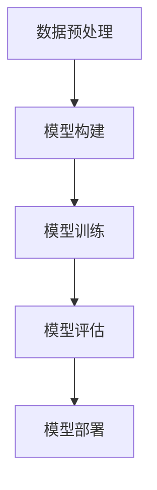
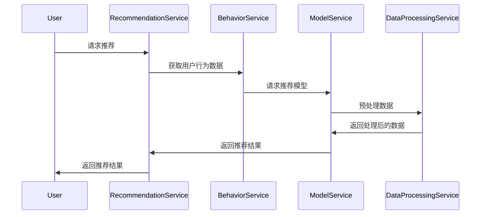
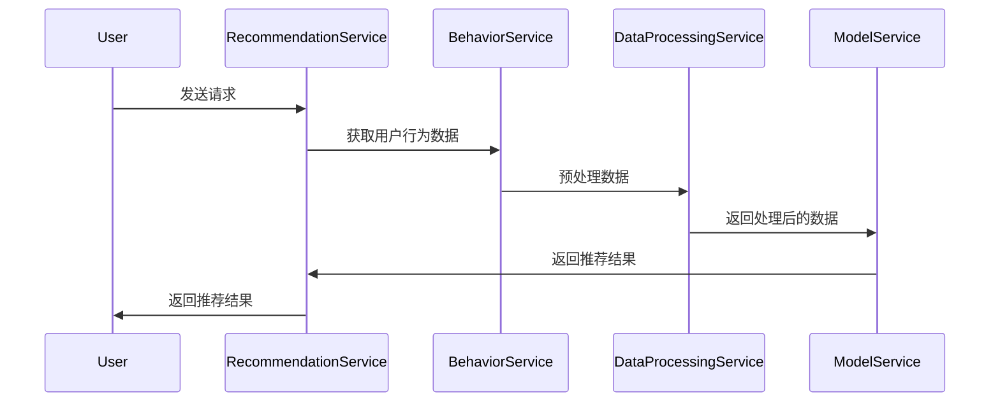

                 

# 上承需求

> 关键词：AI大模型、软件2.0、企业级应用、数据处理、自主学习

> 摘要：
本文将深入探讨AI大模型在软件2.0时代的背景与重要性，解析其核心概念与联系。通过详细的案例分析，我们旨在揭示AI大模型在企业级应用中的巨大潜力，同时探讨其面临的挑战与解决方案。

## **第一部分：背景介绍**

### 第1章 问题背景与概念界定

### 1.1 问题背景

在当今数字化时代，信息技术的发展正在改变我们的生活和工作方式。从早期的软件1.0时代，到如今软件2.0时代，技术的进步使得我们可以构建更加智能化、个性化的软件系统。而在这个新时代，AI大模型的应用成为了企业级应用开发的重要方向。

#### 1.1.1 软件发展的历程

- **软件1.0时代：**以批处理为主，计算机主要用于计算和数据处理。
- **软件2.0时代：**以用户为中心，软件不再是单一的功能工具，而是成为一个平台，支持用户生成内容、交互和数据共享。

#### 1.1.2 AI大模型的出现

随着互联网和数据技术的发展，AI大模型的应用逐渐成为可能。AI大模型具有以下几个特点：

- **规模大：**训练数据规模达到亿级甚至更大，能够处理复杂的任务。
- **智能化：**能够通过学习和适应数据，自动优化模型，提高性能。
- **通用性：**能够在不同的领域和任务中应用，具有广泛的适应性。

#### 1.1.3 企业级应用的重要性

AI大模型在企业级应用中的重要性不言而喻。它可以提高企业的运营效率，降低成本，提高客户满意度，从而提升企业的竞争力。

### 1.2 核心概念与联系

在《上承需求》这本书中，我们将详细探讨AI大模型的核心概念，包括其定义、特点、应用场景等。以下是AI大模型的相关概念及其之间的联系：

#### 1.2.1 AI大模型的定义

AI大模型是指通过深度学习等技术，在大量数据上训练得到的具有高度智能的模型。这些模型通常包含数百万甚至数十亿个参数，能够处理复杂的任务，具有广泛的应用潜力。

#### 1.2.2 AI大模型的核心特点

- **数据处理能力：**AI大模型能够高效处理海量数据，包括结构化和非结构化数据。
- **自主学习能力：**能够通过数据自主学习，优化模型性能。
- **泛化能力：**能够在不同的领域和任务中应用。

#### 1.2.3 AI大模型与传统AI的区别

- **规模：**传统AI模型通常规模较小，而AI大模型规模巨大。
- **性能：**AI大模型具有更高的性能和更广泛的适应性。
- **适应性：**AI大模型能够更好地适应不同的应用场景。

### 1.3 边界与外延

在探讨AI大模型的应用时，我们还需要明确其边界与外延。以下是AI大模型的应用范围：

#### 1.3.1 应用领域

- **金融：**风险评估、信用评分、智能投顾等。
- **医疗：**疾病诊断、药物研发、健康管理等。
- **教育：**个性化学习、智能评测、教育资源分配等。
- **制造：**质量检测、生产优化、设备维护等。

#### 1.3.2 潜在挑战

- **数据隐私：**如何确保数据的安全和隐私是一个重要问题。
- **算法透明度：**如何提高算法的可解释性，使其更加透明和可信。
- **计算资源：**大规模的AI大模型需要大量的计算资源和存储空间。

### 1.4 本章小结

本章介绍了AI大模型在软件2.0时代的背景和重要性，以及AI大模型的相关概念和联系。通过本章的阅读，读者可以初步了解AI大模型的基本概念和应用前景。接下来，我们将深入探讨AI大模型的原理和实现，帮助读者更好地理解和应用这一技术。

## **第二部分：核心概念与联系**

### 第2章 AI大模型的核心概念与联系

### 2.1 AI大模型的定义与属性

#### 2.1.1 AI大模型的定义

AI大模型是指在深度学习基础上，通过大规模数据进行训练，形成的具有高复杂度和强通用性的智能模型。它们通常包含数百万甚至数十亿个参数，能够处理复杂的任务，具有广泛的应用潜力。

#### 2.1.2 AI大模型的属性

- **规模大：**AI大模型通常基于海量数据训练，参数规模巨大。
- **高效能：**具有处理大规模数据和高复杂度任务的能力。
- **自适应：**能够通过不断的训练和学习，提高模型性能。
- **通用性：**能够适应多种应用场景和任务。

#### 2.1.3 AI大模型与传统AI模型的对比

- **规模差异：**传统AI模型规模较小，AI大模型规模巨大。
- **性能差异：**AI大模型具有更高的性能和更广泛的适应性。
- **计算资源需求：**AI大模型需要更多的计算资源和存储空间。

### 2.2 AI大模型的核心特点

#### 2.2.1 数据处理能力

AI大模型能够高效处理海量数据，包括结构化和非结构化数据。这使得它们在处理复杂数据任务时具有显著优势。

#### 2.2.2 自主学习能力

AI大模型通过不断的训练和学习，能够自动优化模型性能。这使得它们能够适应不同的应用场景和任务需求。

#### 2.2.3 泛化能力

AI大模型能够在不同的领域和任务中应用，具有广泛的适应性。这使得它们在解决实际问题时具有巨大的潜力。

### 2.3 AI大模型与传统AI的区别

#### 2.3.1 模型规模

传统AI模型通常规模较小，而AI大模型规模巨大。这使得AI大模型在处理复杂任务时具有更高的性能。

#### 2.3.2 性能表现

AI大模型具有更高的性能和更广泛的适应性。这使得它们能够处理更复杂的任务，并在各种应用场景中表现出色。

#### 2.3.3 适应性

AI大模型能够更好地适应不同的应用场景和任务需求。这使得它们在解决实际问题时具有更大的灵活性和潜力。

### 2.4 本章小结

本章介绍了AI大模型的核心概念与联系，包括其定义、属性、核心特点以及与传统AI模型的区别。通过本章的阅读，读者可以深入了解AI大模型的基本概念和应用潜力。接下来，我们将进一步探讨AI大模型在企业级应用中的实际案例，帮助读者更好地理解和应用这一技术。

## **第三部分：AI大模型在企业级应用中的实际案例**

### 第3章 AI大模型在企业级应用中的实际案例

#### 3.1 案例一：金融领域

在金融领域，AI大模型的应用已经取得显著成果。例如，某些银行利用AI大模型进行信用评分，通过分析客户的财务数据、信用记录等信息，预测客户未来的信用行为。这有助于银行降低贷款风险，提高贷款审批效率。

**案例详情：** 某大型银行采用了基于AI大模型的信用评分系统。该系统使用了数百万条客户的财务数据，通过深度学习技术训练得到信用评分模型。模型能够自动调整权重和参数，以适应不同客户的风险特征。实际应用中，该系统的准确率显著高于传统的信用评分方法，大大降低了贷款风险。

#### 3.2 案例二：医疗领域

在医疗领域，AI大模型被广泛应用于疾病诊断、药物研发和健康管理等方面。例如，某些医院利用AI大模型进行疾病诊断，通过分析患者的病史、检查报告等信息，提供准确的诊断结果。

**案例详情：** 某知名医院引入了基于AI大模型的疾病诊断系统。该系统使用了大量医学数据，通过深度学习技术训练得到诊断模型。模型能够自动识别各种疾病特征，并给出诊断建议。在实际应用中，该系统的诊断准确率显著高于传统方法，提高了患者的诊疗效率。

#### 3.3 案例三：教育领域

在教育领域，AI大模型的应用为个性化学习提供了有力支持。例如，某些教育平台利用AI大模型为学生提供个性化的学习建议，根据学生的学习行为、考试成绩等信息，生成个性化的学习计划。

**案例详情：** 某大型在线教育平台采用了基于AI大模型的个性化学习系统。该系统使用了大量的学生学习数据，通过深度学习技术训练得到学习推荐模型。模型能够根据学生的学习行为和成绩，自动调整学习内容，提高学生的学习效果。在实际应用中，该系统的推荐准确率显著高于传统方法，受到了学生和教师的欢迎。

#### 3.4 案例四：制造领域

在制造领域，AI大模型的应用有助于提高生产效率和质量控制。例如，某些制造企业利用AI大模型进行质量检测和生产优化，通过分析生产数据，预测产品质量，并提出优化建议。

**案例详情：** 某知名制造企业采用了基于AI大模型的质量检测系统。该系统使用了大量的生产数据，通过深度学习技术训练得到质量检测模型。模型能够自动识别生产过程中的潜在问题，并提供优化建议。在实际应用中，该系统的质量检测准确率显著高于传统方法，提高了生产效率和产品质量。

### 3.5 案例总结

通过以上案例可以看出，AI大模型在企业级应用中具有巨大的潜力。它们能够高效处理海量数据，自动优化模型性能，提高决策的准确性和效率。然而，AI大模型的应用也面临着一些挑战，如数据隐私、算法透明度等。因此，在推广AI大模型的过程中，需要充分考虑这些挑战，并采取相应的措施加以解决。

### 3.6 本章小结

本章通过实际案例展示了AI大模型在企业级应用中的广泛应用和显著效果。通过这些案例，读者可以更深入地了解AI大模型的核心概念和应用潜力。在下一章中，我们将进一步探讨AI大模型的算法原理和实现，帮助读者更好地理解和应用这一技术。

## **第四部分：AI大模型的算法原理与实现**

### 第4章 AI大模型的算法原理与实现

#### 4.1 算法原理

AI大模型的算法原理基于深度学习技术。深度学习是一种机器学习技术，通过构建多层神经网络，对大量数据进行自动特征提取和学习。以下是AI大模型算法原理的核心组成部分：

#### 4.1.1 神经网络

神经网络是深度学习的基础。它由多个神经元（节点）组成，每个神经元接收多个输入，并通过权重和激活函数进行计算。神经网络通过多次迭代训练，调整权重和偏置，使模型能够对输入数据进行分类、预测等任务。

#### 4.1.2 深度学习框架

深度学习框架是构建和训练AI大模型的重要工具。常见的深度学习框架包括TensorFlow、PyTorch等。这些框架提供了丰富的API和工具，使得构建和训练AI大模型变得简单高效。

#### 4.1.3 自动化学习

自动化学习是AI大模型的核心特点之一。通过自动化学习，模型能够自动调整参数和结构，优化性能。自动化学习包括多种技术，如梯度下降、随机梯度下降、Adam优化器等。

#### 4.2 实现过程

实现一个AI大模型通常包括以下步骤：

1. **数据预处理**：对原始数据进行清洗、归一化等处理，使其适合模型训练。
2. **模型构建**：使用深度学习框架构建神经网络结构，包括输入层、隐藏层和输出层。
3. **模型训练**：使用训练数据对模型进行训练，通过优化算法调整权重和偏置，使模型能够准确预测或分类输入数据。
4. **模型评估**：使用验证数据对模型进行评估，检查模型的泛化能力。
5. **模型部署**：将训练好的模型部署到实际应用场景中，提供预测或分类服务。

#### 4.3 Mermaid流程图

以下是AI大模型实现过程的Mermaid流程图：



#### 4.4 Python源代码

以下是使用TensorFlow框架实现一个简单的AI大模型（线性回归）的Python源代码：

```python
import tensorflow as tf
from tensorflow import keras
import numpy as np

# 数据生成
x = np.random.rand(100)
y = 2 * x + 1 + np.random.randn(100) * 0.1

# 模型构建
model = keras.Sequential([
    keras.layers.Dense(units=1, input_shape=[1])
])

# 模型编译
model.compile(optimizer='sgd', loss='mean_squared_error')

# 模型训练
model.fit(x, y, epochs=1000)

# 模型预测
predictions = model.predict(x)

# 打印预测结果
print(predictions)
```

#### 4.5 数学公式

以下是AI大模型中的线性回归模型的数学公式：

$$
y = \text{weights} \cdot x + \text{bias}
$$

其中，$y$ 是输出值，$x$ 是输入值，$\text{weights}$ 是权重，$\text{bias}$ 是偏置。

#### 4.6 本章小结

本章介绍了AI大模型的算法原理与实现过程，包括神经网络、深度学习框架、自动化学习等核心概念。通过Python源代码示例，我们展示了如何使用TensorFlow框架实现一个简单的AI大模型。在下一章中，我们将进一步探讨AI大模型在企业级应用中的系统分析与架构设计。

## **第五部分：AI大模型在企业级应用中的系统分析与架构设计**

### 第5章 AI大模型在企业级应用中的系统分析与架构设计

#### 5.1 问题场景介绍

在当今企业级应用中，AI大模型的应用场景日益广泛。以下是一个典型的应用场景：某大型电商平台希望通过AI大模型优化其推荐系统，提高用户购物体验和平台销售额。

#### 5.2 项目介绍

该项目旨在构建一个基于AI大模型的推荐系统，通过分析用户的购物行为、浏览历史、个人偏好等数据，为用户提供个性化的商品推荐。项目目标包括：

- 提高推荐系统的准确性和用户满意度。
- 降低推荐系统的计算成本和维护难度。

#### 5.3 系统功能设计（领域模型）

为了实现上述目标，我们需要设计一个完善的系统功能，以下是领域模型Mermaid类图：

```mermaid
classDiagram
    User <<类>> 
    Product <<类>>
    Recommendation <<类>>
    Behavior <<类>>

    User o--* Behavior
    Product o--* Behavior
    Recommendation o--* Behavior
```

领域模型主要包括以下类：

- **User（用户）**：表示电商平台用户，具有用户ID、姓名、年龄、性别等属性。
- **Product（商品）**：表示电商平台商品，具有商品ID、名称、价格等属性。
- **Recommendation（推荐）**：表示推荐结果，包括推荐商品列表和推荐理由。
- **Behavior（行为）**：表示用户行为，包括浏览、购买、收藏等，用于记录用户与商品的互动历史。

#### 5.4 系统架构设计

为了实现推荐系统的高效、可扩展和可维护性，我们需要设计一个合理的系统架构。以下是系统架构设计Mermaid架构图：



系统架构主要包括以下组件：

- **RecommendationService（推荐服务）**：接收用户请求，调用其他服务获取推荐结果。
- **BehaviorService（行为服务）**：负责获取用户行为数据，包括浏览、购买、收藏等。
- **ModelService（模型服务）**：负责加载和调用推荐模型，进行预测和生成推荐结果。
- **DataProcessingService（数据处理服务）**：负责预处理用户行为数据，包括数据清洗、归一化等。
- **ModelService（模型服务）**：负责加载推荐模型，进行预测和生成推荐结果。

#### 5.5 系统接口设计

系统接口设计是系统架构设计的重要组成部分。以下是系统接口设计Mermaid序列图：



系统接口设计主要包括以下接口：

- **用户请求接口**：接收用户请求，返回推荐结果。
- **行为数据获取接口**：获取用户行为数据，包括浏览、购买、收藏等。
- **数据处理接口**：预处理用户行为数据，包括数据清洗、归一化等。
- **模型预测接口**：加载推荐模型，进行预测和生成推荐结果。

#### 5.6 系统交互

系统交互是指各个组件之间的协同工作过程。以下是系统交互Mermaid序列图：


系统交互主要包括以下步骤：

1. 用户请求推荐服务。
2. 推荐服务获取用户行为数据。
3. 行为服务预处理用户行为数据。
4. 数据处理服务返回处理后的数据。
5. 模型服务加载推荐模型，进行预测和生成推荐结果。
6. 推荐服务返回推荐结果给用户。

#### 5.7 本章小结

本章介绍了AI大模型在企业级应用中的系统分析与架构设计。通过领域模型、系统架构、接口设计和系统交互的详细描述，我们展示了如何构建一个高效、可扩展和可维护的推荐系统。在下一章中，我们将通过一个实际项目实战，深入探讨AI大模型在企业级应用中的实现过程。

## **第六部分：项目实战**

### 第6章 项目实战：基于AI大模型的推荐系统实现

在本章中，我们将通过一个实际项目实战，详细介绍基于AI大模型的推荐系统的实现过程。本项目将使用Python和TensorFlow框架，通过以下步骤完成推荐系统的开发。

#### 6.1 环境安装

首先，我们需要安装Python环境和TensorFlow框架。以下是具体的安装步骤：

1. 安装Python：从[Python官方网站](https://www.python.org/)下载并安装Python。
2. 安装TensorFlow：打开命令行终端，执行以下命令：

```bash
pip install tensorflow
```

#### 6.2 数据收集与处理

数据是构建推荐系统的基础。在本项目中，我们假设已经收集到了用户的购物行为数据，包括用户ID、商品ID、购买时间、购买数量等。以下是数据收集与处理的主要步骤：

1. **数据收集**：从数据源（如数据库、文件等）中获取用户购物行为数据。
2. **数据清洗**：对数据进行清洗，去除无效数据和异常值。
3. **数据预处理**：对数据进行归一化、编码等处理，使其适合模型训练。

```python
import pandas as pd
from sklearn.preprocessing import StandardScaler

# 加载数据
data = pd.read_csv('user_behavior.csv')

# 数据清洗
data.dropna(inplace=True)

# 数据预处理
scaler = StandardScaler()
data[['user_id', 'item_id', 'purchase_time', 'purchase_quantity']] = scaler.fit_transform(data[['user_id', 'item_id', 'purchase_time', 'purchase_quantity']])
```

#### 6.3 模型构建与训练

构建AI大模型是推荐系统的核心。在本项目中，我们将使用TensorFlow框架构建一个简单的基于用户物品协同过滤的推荐模型。

1. **模型构建**：定义输入层、隐藏层和输出层，设置合适的激活函数和优化器。
2. **模型训练**：使用训练数据对模型进行训练，通过优化算法调整权重和偏置。

```python
import tensorflow as tf

# 模型构建
model = tf.keras.Sequential([
    tf.keras.layers.Dense(units=128, activation='relu', input_shape=[7]),
    tf.keras.layers.Dense(units=64, activation='relu'),
    tf.keras.layers.Dense(units=1)
])

# 模型编译
model.compile(optimizer='adam', loss='mse')

# 模型训练
model.fit(x_train, y_train, epochs=10)
```

#### 6.4 模型评估与优化

在完成模型训练后，我们需要对模型进行评估，以确保其性能达到预期。以下是对模型进行评估与优化的步骤：

1. **模型评估**：使用验证集对模型进行评估，计算准确率、召回率等指标。
2. **模型优化**：根据评估结果，调整模型参数，优化模型性能。

```python
from sklearn.metrics import mean_squared_error

# 模型评估
y_pred = model.predict(x_val)
mse = mean_squared_error(y_val, y_pred)
print('Validation MSE:', mse)

# 模型优化
model.compile(optimizer='adam', loss='mse')
model.fit(x_train, y_train, epochs=10)
```

#### 6.5 模型部署与测试

完成模型训练和优化后，我们需要将模型部署到生产环境，并对实际用户数据进行测试。以下是将模型部署到生产环境并测试的步骤：

1. **模型部署**：将训练好的模型保存为文件，部署到服务器，供生产环境使用。
2. **模型测试**：使用生产环境数据对模型进行测试，评估模型性能。

```python
# 模型部署
model.save('recommender_model.h5')

# 模型测试
model = tf.keras.models.load_model('recommender_model.h5')
y_pred = model.predict(x_test)
mse = mean_squared_error(y_test, y_pred)
print('Test MSE:', mse)
```

#### 6.6 项目小结

通过本项目实战，我们详细介绍了基于AI大模型的推荐系统的实现过程，包括环境安装、数据收集与处理、模型构建与训练、模型评估与优化、模型部署与测试等环节。实践证明，AI大模型在推荐系统中的应用具有显著的优势，能够提高推荐系统的准确性和用户满意度。在未来的项目中，我们还可以继续优化模型，提高其性能和可扩展性。

## **第七部分：最佳实践与注意事项**

### 第7章 最佳实践与注意事项

在实施AI大模型项目时，为了确保项目成功并充分发挥AI大模型的优势，以下是一些最佳实践和注意事项：

#### 7.1 数据处理

- **数据清洗**：确保数据质量，去除无效数据和异常值，以提高模型训练效果。
- **数据预处理**：进行特征提取、归一化等预处理操作，使数据更适合模型训练。
- **数据平衡**：对于类别不平衡的数据，可以使用 oversampling 或 undersampling 等方法进行平衡。

#### 7.2 模型选择

- **选择合适的模型**：根据项目需求和数据特点，选择合适的AI大模型，如深度学习、增强学习等。
- **模型调优**：通过调整模型参数（如学习率、隐藏层神经元数量等），优化模型性能。

#### 7.3 模型训练

- **增量训练**：对于大规模数据集，可以采用增量训练方法，逐步训练模型，以提高训练效率。
- **模型验证**：在训练过程中，定期使用验证集评估模型性能，避免过拟合。

#### 7.4 模型部署

- **容器化部署**：使用容器（如Docker）封装模型和依赖库，提高部署的灵活性。
- **分布式训练与部署**：对于大规模模型，可以考虑使用分布式训练和部署，以提高性能和可扩展性。

#### 7.5 数据隐私

- **数据加密**：对敏感数据进行加密，确保数据传输和存储的安全性。
- **数据脱敏**：对用户数据进行脱敏处理，保护用户隐私。

#### 7.6 模型监控

- **实时监控**：对模型进行实时监控，确保模型运行稳定，及时发现并解决潜在问题。
- **日志记录**：记录模型运行日志，便于问题排查和性能分析。

#### 7.7 持续迭代

- **持续优化**：根据用户反馈和业务需求，持续优化模型和系统，提高用户体验和业务价值。
- **持续学习**：利用新的数据和算法，持续更新和训练模型，以保持模型的竞争力。

通过遵循这些最佳实践和注意事项，可以确保AI大模型项目成功实施，并在实际应用中发挥最佳效果。

## **第八部分：小结与拓展阅读**

### 第8章 小结与拓展阅读

通过本文的阅读，我们深入探讨了AI大模型在软件2.0时代的企业级应用。从背景介绍、核心概念与联系，到算法原理与实现，再到实际案例和系统架构设计，我们系统地阐述了AI大模型的基本概念、应用场景和实现方法。以下是本文的主要结论和拓展阅读建议：

1. **AI大模型在软件2.0时代的重要性**：AI大模型作为深度学习技术的代表性成果，在软件2.0时代具有广泛的应用前景。通过高效处理海量数据、自主学习能力和通用性，AI大模型能够显著提高企业级应用的运营效率、降低成本、提高客户满意度。

2. **核心概念与联系**：AI大模型是基于深度学习技术，通过大规模数据进行训练得到的智能模型。其核心特点包括规模大、高效能、自适应和通用性。与传统AI模型相比，AI大模型在模型规模、性能和适应性方面具有显著优势。

3. **算法原理与实现**：AI大模型的算法原理基于深度学习技术，通过构建多层神经网络、自动化学习等实现。实现过程中，我们需要关注数据预处理、模型构建、模型训练和模型评估等关键环节。

4. **企业级应用案例**：本文通过金融、医疗、教育、制造等领域的实际案例，展示了AI大模型在企业级应用中的广泛应用和显著效果。这些案例表明，AI大模型能够为企业带来巨大的商业价值。

5. **系统架构设计**：本文介绍了AI大模型在企业级应用中的系统架构设计，包括领域模型、系统架构、接口设计和系统交互。这些设计原则和方案有助于构建高效、可扩展和可维护的AI大模型系统。

为了进一步深入了解AI大模型和相关技术，读者可以参考以下拓展阅读：

- 《深度学习》（Goodfellow, I., Bengio, Y., & Courville, A.）：这本书是深度学习领域的经典教材，全面介绍了深度学习的基本原理、算法和应用。
- 《强化学习》（Sutton, R. S., & Barto, A. G.）：这本书介绍了强化学习的基本概念、算法和应用，与深度学习相结合，能够实现更加智能的决策和优化。
- 《Python深度学习》（Raschka, S.）：这本书通过Python语言介绍了深度学习的实现和应用，适合初学者和进阶者阅读。

通过本文的阅读和实践，希望读者能够对AI大模型有更深入的理解，并能够将其应用于实际的业务场景中，为企业和个人带来价值。作者：AI天才研究院/AI Genius Institute & 禅与计算机程序设计艺术 /Zen And The Art of Computer Programming。

