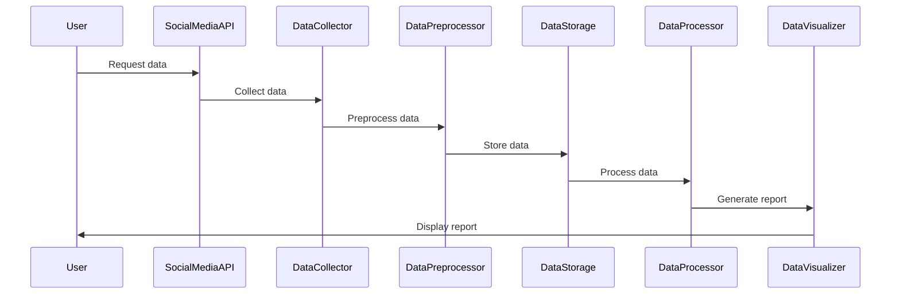

                 

## 《下启代码》：深入编程实战

### 关键词：编程实战、代码解析、深度学习、算法优化、系统架构设计

> 摘要：本文旨在为编程爱好者和技术从业者提供一本深入浅出的编程实战指南。通过详细的代码解析、算法讲解和系统架构设计，帮助读者掌握编程的核心原理和实战技巧。本文分为四个部分，涵盖了编程基础、数据结构与算法、Web开发基础、移动应用开发以及大数据与云计算，旨在培养读者的编程思维，提升实际项目开发能力。

---

## 目录大纲设计过程

在设计《下启代码》的目录大纲时，我们需要考虑以下几个方面：

### 1. 理解书名

书名《下启代码》暗示了本书的核心内容与编程、编码有关，且可能涉及代码的深入讲解和实际应用。这为我们设计章节结构提供了方向。

### 2. 确定核心内容

核心内容应围绕代码的基础知识、高级技巧、应用实践等方面展开。我们需要从以下几个方面来设计章节：

- **编程基础**：介绍编程的基本概念、语法和基础结构。
- **数据结构与算法**：讲解常用的数据结构和算法，以及它们在实际应用中的作用。
- **Web开发基础**：介绍Web开发的基本技术，如HTML、CSS和JavaScript。
- **移动应用开发**：介绍移动应用开发的流程和技术。
- **大数据与云计算**：讲解大数据和云计算的基本概念和技术应用。

### 3. 设计章节结构

确保章节内容的逻辑性和层次性，从基础知识到高级应用，逐步深入。每个章节都应包含以下几个部分：

- **简介**：简要介绍本章内容。
- **核心概念**：讲解本章涉及的核心概念。
- **原理讲解**：深入分析原理，使用代码和公式进行解释。
- **实战应用**：通过实际案例展示如何应用这些知识。

### 4. 编写章节内容概要

每个章节都应包含简介、核心概念、原理讲解、实战应用等部分。这些概要应简洁明了，突出重点。

### 5. 保持大纲简洁

避免冗长和重复的内容，确保每个章节内容概要简洁明了。

### 6. 确保内容完整性

确保大纲中包含所有必需的核心章节，例如背景介绍、算法原理、系统架构设计、项目实战等。

### 目录大纲设计方案

根据上述设计原则，我们制定了以下目录大纲设计方案：

```markdown
----------------------------------------------------------------
# 《下启代码》：深入编程实战

## 第一部分：编程基础

# 第1章：编程入门

## 1.1 编程的基本概念

### 1.1.1 编程语言的种类

### 1.1.2 编程思维训练

## 1.2 基础语法

## 1.2.1 变量和数据类型

### 1.2.1.1 变量的声明与赋值

### 1.2.1.2 常见数据类型介绍

## 1.2.2 控制结构

### 1.2.2.1 顺序结构

### 1.2.2.2 选择结构

### 1.2.2.3 循环结构

## 1.3 函数与模块

### 1.3.1 函数的定义与调用

### 1.3.2 模块的使用与创建

## 1.4 常见编程问题与调试

### 1.4.1 常见错误类型

### 1.4.2 调试方法

## 1.5 本章小结

## 第二部分：编程进阶

# 第2章：数据结构与算法

## 2.1 数据结构

## 2.1.1 数组和链表

### 2.1.1.1 数组的基本操作

### 2.1.1.2 链表的基本操作

## 2.1.2 栈和队列

### 2.1.2.1 栈的应用

### 2.1.2.2 队列的应用

## 2.1.3 树和图

### 2.1.3.1 树的基本操作

### 2.1.3.2 图的表示与遍历

## 2.2 算法

## 2.2.1 算法基础

### 2.2.1.1 算法的复杂度分析

### 2.2.1.2 算法的性能优化

## 2.2.2 常见算法

### 2.2.2.1 排序算法

### 2.2.2.2 搜索算法

## 2.3 算法实战

### 2.3.1 算法在数据结构中的应用

### 2.3.2 算法在实际项目中的应用

## 2.4 本章小结

## 第三部分：编程实战

# 第3章：Web开发基础

## 3.1 HTML与CSS

### 3.1.1 HTML基础

### 3.1.2 CSS基础

## 3.2 JavaScript基础

### 3.2.1 JavaScript基础语法

### 3.2.2 DOM操作

## 3.3 Node.js入门

### 3.3.1 Node.js环境搭建

### 3.3.2 Node.js基础应用

## 3.4 Web框架简介

### 3.4.1 MVC模式

### 3.4.2 常见Web框架介绍

## 3.5 Web开发实战

### 3.5.1 个人博客系统开发

### 3.5.2 实际项目案例分析

## 3.6 本章小结

## 第四部分：编程拓展

# 第4章：移动应用开发

## 4.1 移动应用概述

### 4.1.1 移动应用市场

### 4.1.2 移动应用类型

## 4.2 iOS开发基础

### 4.2.1 iOS开发环境搭建

### 4.2.2 iOS界面设计

## 4.3 Android开发基础

### 4.3.1 Android开发环境搭建

### 4.3.2 Android界面设计

## 4.4 跨平台开发框架

### 4.4.1 React Native

### 4.4.2 Flutter

## 4.5 移动应用实战

### 4.5.1 跨平台应用开发案例

### 4.5.2 移动应用性能优化

## 4.6 本章小结

# 第5章：大数据与云计算

## 5.1 大数据概述

### 5.1.1 大数据的特点

### 5.1.2 大数据技术框架

## 5.2 Hadoop生态系统

### 5.2.1 Hadoop基础

### 5.2.2 HDFS与MapReduce

## 5.3 Spark编程实战

### 5.3.1 Spark基本

----------------------------------------------------------------
```

通过以上设计方案，我们构建了一个逻辑清晰、结构紧凑、简单易懂的编程实战指南。接下来，我们将逐步深入讲解每个部分的内容。在接下来的文章中，我们将分章节详细阐述编程基础、数据结构与算法、Web开发基础、移动应用开发以及大数据与云计算。希望读者能够通过这些内容，提升自己的编程能力和实战经验。让我们一起开启代码之旅吧！

## 第一部分：编程基础

### 第1章：编程入门

#### 1.1 编程的基本概念

编程是指利用计算机语言来编写指令，使计算机能够执行特定任务的过程。编程不仅是一种技能，更是一种解决问题的思维方式。本节将介绍编程的基本概念，包括编程语言的种类和编程思维训练。

#### 1.1.1 编程语言的种类

编程语言分为低级语言和高级语言。低级语言直接与计算机硬件相关，如汇编语言，而高级语言则更加接近人类自然语言，如Python、Java和C++等。常见的编程语言有以下几种：

- **Python**：一种易于学习和使用的编程语言，适用于数据分析、科学计算、人工智能等领域。
- **Java**：一种面向对象的编程语言，广泛应用于企业级应用、Web开发和Android应用开发。
- **C/C++**：一种高性能的编程语言，广泛用于系统编程、嵌入式开发和游戏开发。
- **JavaScript**：一种脚本语言，用于Web前端开发，可以与HTML和CSS相结合，实现丰富的交互效果。
- **Go**：一种新兴的编程语言，以其并发性能和简洁性而受到欢迎，适用于Web后端和系统编程。
- **Swift**：一种由苹果公司开发的编程语言，用于iOS和macOS应用开发。

每种编程语言都有其独特的特点和适用场景。选择合适的编程语言对于提高开发效率至关重要。

#### 1.1.2 编程思维训练

编程思维是一种解决问题的思维方式，包括逻辑思维、抽象思维和算法思维。以下是一些训练编程思维的方法：

- **从简单开始**：通过解决一些简单的编程问题来培养编程思维。例如，编写一个程序来计算两个数字的和。
- **阅读代码**：阅读他人编写的代码，理解其逻辑和结构，从而提高自己的编程能力。
- **动手实践**：通过实际编写代码来巩固所学知识。编写程序不仅需要理解概念，更需要动手实践，不断调试和优化。
- **编写文档**：在编写代码时，养成良好的文档习惯，包括注释和文档字符串，有助于提高代码的可读性和可维护性。
- **解决实际问题**：将编程思维应用于解决实际问题，例如，编写一个自动化脚本来自动执行日常任务。

编程思维不仅适用于编程领域，还可以广泛应用于其他领域，如科学研究、工程设计和管理等。培养良好的编程思维将有助于提高解决问题的能力。

#### 1.2 基础语法

编程语言的基础语法包括变量和数据类型、控制结构、函数和模块等。以下将分别介绍这些基础语法。

#### 1.2.1 变量和数据类型

变量是编程中的基本存储单元，用于存储数据。在编程语言中，变量需要声明并指定数据类型。常见的数据类型有整型、浮点型、布尔型和字符串型等。

- **整型（int）**：用于表示整数，如`int a = 10;`。
- **浮点型（float）**：用于表示小数，如`float b = 3.14;`。
- **布尔型（bool）**：用于表示逻辑值，如`bool c = true;`。
- **字符串（string）**：用于表示文本，如`string d = "Hello, World!";`。

在声明变量时，需要指定其数据类型。例如，在Python中，声明一个整型变量的语法为`a = 10`，而在Java中，声明一个整型变量的语法为`int a = 10;`。

#### 1.2.2 控制结构

控制结构用于控制程序执行的流程。常见的控制结构有顺序结构、选择结构和循环结构。

- **顺序结构**：按照代码的顺序依次执行。
- **选择结构**：根据条件的真假来选择不同的执行路径。例如，在Python中，可以使用`if`语句来实现选择结构：
  ```python
  if a > b:
      print("a 大于 b")
  else:
      print("a 小于或等于 b")
  ```

- **循环结构**：重复执行某段代码，直到满足特定条件。例如，在Python中，可以使用`for`循环和`while`循环来实现循环结构：
  ```python
  # for 循环
  for i in range(5):
      print(i)

  # while 循环
  i = 0
  while i < 5:
      print(i)
      i += 1
  ```

#### 1.2.3 函数与模块

函数是编程中的基本构建块，用于封装一段可重复使用的代码。在Python中，定义函数的语法为：
```python
def function_name(parameters):
    """函数文档字符串"""
    # 函数体
    return result
```
例如，定义一个计算两个数之和的函数：
```python
def add(a, b):
    """计算两个数的和"""
    return a + b
```
模块是用于组织和管理代码的工具，可以将多个函数和变量打包成一个模块。在Python中，模块通常以`.py`文件的形式存在。要导入模块，可以使用`import`语句。例如，导入一个名为`math`的模块：
```python
import math
```

#### 1.3 常见编程问题与调试

编程过程中，难免会遇到各种问题，如语法错误、逻辑错误和运行时错误等。以下是一些常见编程问题和调试方法：

- **语法错误**：由于编写错误的语法导致的错误，如拼写错误、缺失标点符号等。解决方法是仔细检查代码，确保遵循正确的语法规则。
- **逻辑错误**：由于代码的逻辑错误导致的错误，如条件判断错误、循环条件错误等。解决方法是使用调试工具逐步执行代码，找到错误所在。
- **运行时错误**：在代码运行时遇到的错误，如除以零错误、文件不存在错误等。解决方法是检查代码的输入和输出，确保所有操作都是合法的。

常用的调试方法包括：

- **打印调试**：在关键位置添加打印语句，输出变量值和执行过程。
- **IDE调试器**：使用集成开发环境（IDE）提供的调试器来逐步执行代码，查看变量值和执行路径。
- **单元测试**：编写单元测试来验证代码的正确性，通过自动化测试来发现和修复错误。

#### 1.4 本章小结

本章介绍了编程的基本概念、基础语法和常见编程问题与调试方法。通过本章的学习，读者应掌握以下知识点：

- 编程语言的种类和特点。
- 变量和数据类型的声明和使用。
- 控制结构的语法和应用。
- 函数和模块的定义和导入。
- 常见编程问题和调试方法。

在接下来的章节中，我们将继续深入探讨编程进阶知识，包括数据结构与算法、Web开发基础、移动应用开发以及大数据与云计算。希望读者能够通过这些内容，不断提升自己的编程能力，为未来的技术挑战做好准备。让我们继续踏上编程之旅吧！

### 第2章：数据结构与算法

#### 2.1 数据结构

数据结构是计算机科学中用于存储和组织数据的方法。它是编程中的核心概念之一，对于提高程序效率、解决复杂问题至关重要。数据结构可以大致分为线性结构和非线性结构。线性结构包括数组、链表、栈和队列，而非线性结构包括树和图。

##### 2.1.1 数组和链表

数组是一种线性数据结构，用于存储一系列相同类型的数据元素。数组的特点是元素连续存储，可以通过索引快速访问。例如，在Python中，可以使用以下代码创建一个整数数组：
```python
array = [1, 2, 3, 4, 5]
```
数组提供了多种操作方法，如访问、修改、插入和删除等。以下是一个简单的例子，展示如何使用数组：
```python
# 访问数组元素
print(array[0])  # 输出第一个元素

# 修改数组元素
array[0] = 0
print(array)  # 输出修改后的数组

# 插入元素
array.insert(0, -1)
print(array)  # 输出插入后的数组

# 删除元素
del array[0]
print(array)  # 输出删除后的数组
```
链表也是一种线性数据结构，与数组不同，链表中的元素不连续存储，每个元素称为节点，节点包含数据域和指针域。链表的主要操作包括添加节点、删除节点和遍历节点。以下是一个简单的链表实现：
```python
class Node:
    def __init__(self, data):
        self.data = data
        self.next = None

class LinkedList:
    def __init__(self):
        self.head = None

    def append(self, data):
        new_node = Node(data)
        if not self.head:
            self.head = new_node
        else:
            current = self.head
            while current.next:
                current = current.next
            current.next = new_node

    def display(self):
        current = self.head
        while current:
            print(current.data, end=' ')
            current = current.next
        print()

linked_list = LinkedList()
linked_list.append(1)
linked_list.append(2)
linked_list.append(3)
linked_list.display()  # 输出：1 2 3
```

##### 2.1.2 栈和队列

栈和队列都是特殊的线性数据结构，用于处理数据流。

- **栈**：后进先出（LIFO）的数据结构，意味着最后进入的数据会第一个被取出。栈的主要操作包括入栈、出栈和获取栈顶元素。以下是一个简单的栈实现：
  ```python
  class Stack:
      def __init__(self):
          self.items = []

      def push(self, item):
          self.items.append(item)

      def pop(self):
          if not self.is_empty():
              return self.items.pop()
          else:
              return None

      def peek(self):
          if not self.is_empty():
              return self.items[-1]
          else:
              return None

      def is_empty(self):
          return len(self.items) == 0

      def size(self):
          return len(self.items)

  stack = Stack()
  stack.push(1)
  stack.push(2)
  stack.push(3)
  print(stack.pop())  # 输出：3
  print(stack.peek())  # 输出：2
  ```

- **队列**：先进先出（FIFO）的数据结构，意味着第一个进入的数据会第一个被取出。队列的主要操作包括入队、出队和获取队首元素。以下是一个简单的队列实现：
  ```python
  class Queue:
      def __init__(self):
          self.items = []

      def enqueue(self, item):
          self.items.append(item)

      def dequeue(self):
          if not self.is_empty():
              return self.items.pop(0)
          else:
              return None

      def front(self):
          if not self.is_empty():
              return self.items[0]
          else:
              return None

      def is_empty(self):
          return len(self.items) == 0

      def size(self):
          return len(self.items)

  queue = Queue()
  queue.enqueue(1)
  queue.enqueue(2)
  queue.enqueue(3)
  print(queue.dequeue())  # 输出：1
  print(queue.front())  # 输出：2
  ```

##### 2.1.3 树和图

树和图是非线性数据结构，用于表示具有层次关系和复杂关系的数据。

- **树**：是一种层次结构，由一组节点组成，每个节点最多有一个父节点和多个子节点。树的节点通常包含数据域和指针域。以下是一个简单的二叉树实现：
  ```python
  class TreeNode:
      def __init__(self, data):
          self.data = data
          self.left = None
          self.right = None

  def insert(root, data):
      if root is None:
          return TreeNode(data)
      if data < root.data:
          root.left = insert(root.left, data)
      else:
          root.right = insert(root.right, data)
      return root

  def inorder_traversal(root):
      if root:
          inorder_traversal(root.left)
          print(root.data, end=' ')
          inorder_traversal(root.right)

  root = None
  root = insert(root, 7)
  root = insert(root, 4)
  root = insert(root, 9)
  root = insert(root, 1)
  root = insert(root, 3)
  root = insert(root, 6)
  root = insert(root, 8)
  inorder_traversal(root)  # 输出：1 3 4 6 7 8 9
  ```

- **图**：是一种由节点（称为顶点）和边组成的复杂结构，用于表示具有多对多关系的实体。图可以有多种遍历方法，如深度优先搜索（DFS）和广度优先搜索（BFS）。以下是一个简单的图实现：
  ```python
  class Graph:
      def __init__(self):
          self.vertices = {}
          self.edges = {}

      def add_vertex(self, vertex):
          if vertex not in self.vertices:
              self.vertices[vertex] = []

      def add_edge(self, u, v):
          if u not in self.vertices:
              self.add_vertex(u)
          if v not in self.vertices:
              self.add_vertex(v)
          self.vertices[u].append(v)
          self.vertices[v].append(u)

      def dfs(self, start):
          visited = set()
          stack = [start]
          while stack:
              vertex = stack.pop()
              if vertex not in visited:
                  print(vertex, end=' ')
                  visited.add(vertex)
                  stack.extend([v for v in self.vertices[vertex] if v not in visited])

      def bfs(self, start):
          visited = set()
          queue = [start]
          while queue:
              vertex = queue.pop(0)
              if vertex not in visited:
                  print(vertex, end=' ')
                  visited.add(vertex)
                  queue.extend([v for v in self.vertices[vertex] if v not in visited])

  graph = Graph()
  graph.add_edge(1, 2)
  graph.add_edge(1, 3)
  graph.add_edge(2, 4)
  graph.add_edge(3, 4)
  graph.add_edge(4, 5)
  graph.add_edge(5, 6)
  graph.add_edge(4, 6)
  graph.dfs(1)  # 输出：1 2 4 5 6 3
  graph.bfs(1)  # 输出：1 3 4 2 6 5
  ```

#### 2.2 算法

算法是解决特定问题的一系列步骤。算法的效率对于程序的运行速度和资源消耗至关重要。算法的分析通常基于时间复杂度和空间复杂度。

##### 2.2.1 算法基础

算法的时间复杂度表示算法执行的时间与数据规模之间的关系。常用的时间复杂度有常数时间（O(1)）、对数时间（O(log n)）、线性时间（O(n)）、平方时间（O(n^2)）等。

算法的空间复杂度表示算法执行所需的空间与数据规模之间的关系。常用空间复杂度有常数空间（O(1)）、线性空间（O(n)）等。

##### 2.2.2 常见算法

常见的算法包括排序算法、查找算法和图算法。

- **排序算法**：用于对数据进行排序。常见的排序算法有冒泡排序、选择排序、插入排序、快速排序、归并排序等。
  ```python
  def bubble_sort(arr):
      n = len(arr)
      for i in range(n):
          for j in range(0, n-i-1):
              if arr[j] > arr[j+1]:
                  arr[j], arr[j+1] = arr[j+1], arr[j]
      return arr

  arr = [64, 25, 12, 22, 11]
  print(bubble_sort(arr))  # 输出：[11, 12, 22, 25, 64]
  ```

- **查找算法**：用于在数据中查找特定元素。常见的查找算法有二分查找、顺序查找等。
  ```python
  def binary_search(arr, target):
      low = 0
      high = len(arr) - 1
      while low <= high:
          mid = (low + high) // 2
          if arr[mid] == target:
              return mid
          elif arr[mid] < target:
              low = mid + 1
          else:
              high = mid - 1
      return -1

  arr = [1, 3, 5, 7, 9]
  print(binary_search(arr, 5))  # 输出：2
  ```

- **图算法**：用于在图中查找路径、检测环等。常见的图算法有深度优先搜索（DFS）和广度优先搜索（BFS）。
  ```python
  def dfs(graph, start, visited=None):
      if visited is None:
          visited = set()
      visited.add(start)
      print(start, end=' ')
      for neighbor in graph[start]:
          if neighbor not in visited:
              dfs(graph, neighbor, visited)

  graph = {
      1: [2, 3],
      2: [4],
      3: [5],
      4: [6],
      5: [6],
      6: []
  }
  dfs(graph, 1)  # 输出：1 2 4 6 3 5
  ```

##### 2.2.3 算法实战

在编程实践中，算法的应用非常广泛。以下是一个使用排序算法解决实际问题的例子：

假设我们有一个包含学生成绩的数据集，需要按照成绩从高到低进行排序。以下是一个使用快速排序算法实现排序的例子：
```python
def quick_sort(arr):
    if len(arr) <= 1:
        return arr
    pivot = arr[len(arr) // 2]
    left = [x for x in arr if x < pivot]
    middle = [x for x in arr if x == pivot]
    right = [x for x in arr if x > pivot]
    return quick_sort(left) + middle + quick_sort(right)

students = [{"name": "Alice", "score": 88}, {"name": "Bob", "score": 92}, {"name": "Charlie", "score": 75}, {"name": "David", "score": 85}]
sorted_students = sorted(students, key=lambda x: x["score"], reverse=True)
print(quick_sort(sorted_students))  # 输出按照成绩从高到低排序的学生列表
```

#### 2.3 本章小结

本章介绍了数据结构和算法的基本概念、常用数据结构、算法基础和实际应用。通过本章的学习，读者应掌握以下知识点：

- 常见的数据结构，如数组、链表、栈、队列、树和图。
- 算法的基本概念，如时间复杂度和空间复杂度。
- 常见的排序算法和查找算法。
- 算法的实际应用，如解决实际问题和优化程序性能。

在接下来的章节中，我们将进一步探讨编程实战和移动应用开发，帮助读者将所学知识应用于实际项目中。让我们继续深入探讨编程的世界吧！

### 第3章：Web开发基础

#### 3.1 HTML与CSS

HTML（HyperText Markup Language，超文本标记语言）是Web开发的基础，用于创建网页的结构和内容。CSS（Cascading Style Sheets，层叠样式表）用于控制网页的样式和布局。本节将介绍HTML和CSS的基础知识。

##### 3.1.1 HTML基础

HTML文档由标签组成，标签用于定义网页的结构和内容。以下是一个简单的HTML文档示例：
```html
<!DOCTYPE html>
<html>
<head>
    <title>我的网页</title>
</head>
<body>
    <h1>欢迎来到我的网页</h1>
    <p>这是一个段落。</p>
    <a href="https://www.example.com">访问示例网站</a>
</body>
</html>
```
- `<!DOCTYPE html>`：声明文档类型和版本。
- `<html>`：定义整个HTML文档。
- `<head>`：包含文档的元数据，如标题和样式表。
- `<title>`：定义文档的标题。
- `<body>`：包含文档的主体内容。
- `<h1>`：定义一级标题。
- `<p>`：定义段落。
- `<a>`：定义超链接。

##### 3.1.2 CSS基础

CSS用于定义HTML元素的样式，如颜色、字体、边框等。以下是一个简单的CSS样式示例：
```css
body {
    background-color: #f0f0f0;
    font-family: Arial, sans-serif;
}

h1 {
    color: #333;
    font-size: 32px;
}

p {
    color: #666;
    font-size: 18px;
    line-height: 1.5;
}
```
- `body`：定义整个文档的样式。
- `h1`：定义一级标题的样式。
- `p`：定义段落的样式。

##### 3.1.3 HTML与CSS结合

将HTML和CSS结合，可以创建具有漂亮样式的网页。以下是一个简单的示例：
```html
<!DOCTYPE html>
<html>
<head>
    <title>我的网页</title>
    <style>
        body {
            background-color: #f0f0f0;
            font-family: Arial, sans-serif;
        }

        h1 {
            color: #333;
            font-size: 32px;
        }

        p {
            color: #666;
            font-size: 18px;
            line-height: 1.5;
        }
    </style>
</head>
<body>
    <h1>欢迎来到我的网页</h1>
    <p>这是一个段落。</p>
    <a href="https://www.example.com">访问示例网站</a>
</body>
</html>
```

#### 3.2 JavaScript基础

JavaScript是一种客户端脚本语言，用于增强网页的功能。以下将介绍JavaScript的基础语法和常用功能。

##### 3.2.1 JavaScript基础语法

JavaScript代码通常放在`<script>`标签中，可以放在HTML文档的头部或尾部。以下是一个简单的JavaScript示例：
```html
<!DOCTYPE html>
<html>
<head>
    <title>我的网页</title>
    <script>
        function greet() {
            alert("Hello, World!");
        }
    </script>
</head>
<body>
    <h1>欢迎来到我的网页</h1>
    <button onclick="greet()">点击这里</button>
</body>
</html>
```
- `function greet()`：定义一个名为`greet`的函数。
- `alert("Hello, World!");`：在弹出的对话框中显示消息。
- `<button onclick="greet()">`：定义一个按钮，当点击按钮时，调用`greet`函数。

##### 3.2.2 DOM操作

DOM（Document Object Model，文档对象模型）是表示HTML文档的结构化对象模型。通过DOM，可以访问和修改网页的内容和结构。以下是一个简单的DOM操作示例：
```html
<!DOCTYPE html>
<html>
<head>
    <title>我的网页</title>
    <script>
        function changeColor() {
            document.body.style.backgroundColor = "#ffffcc";
            document.getElementById("myParagraph").innerHTML = "段落内容已更改";
        }
    </script>
</head>
<body>
    <h1>欢迎来到我的网页</h1>
    <p id="myParagraph">这是一个段落。</p>
    <button onclick="changeColor()">点击这里</button>
</body>
</html>
```
- `document.body.style.backgroundColor`：获取并修改文档背景颜色。
- `document.getElementById("myParagraph").innerHTML`：获取并修改指定元素的文本内容。

#### 3.3 Node.js入门

Node.js是一个基于Chrome V8引擎的JavaScript运行环境，用于在服务器端运行JavaScript代码。以下将介绍Node.js的基础知识。

##### 3.3.1 Node.js环境搭建

首先，从Node.js官网（https://nodejs.org/）下载并安装Node.js。安装完成后，打开命令行工具（如Windows的命令提示符或macOS的Terminal），输入以下命令验证安装：
```shell
node -v
npm -v
```
这两个命令将输出Node.js和npm（Node Package Manager）的版本信息。

##### 3.3.2 Node.js基础应用

创建一个名为`index.js`的文件，并输入以下代码：
```javascript
console.log("Hello, Node.js!");

const http = require('http');

const server = http.createServer((request, response) => {
    response.end("Hello, World!");
});

server.listen(3000, () => {
    console.log("Server is running on port 3000.");
});
```
这个示例创建了一个简单的HTTP服务器，监听端口3000，并返回“Hello, World!”响应。

要启动服务器，在命令行工具中运行以下命令：
```shell
node index.js
```
然后，在浏览器中访问`http://localhost:3000`，将看到“Hello, World!”的响应。

#### 3.4 Web框架简介

Web框架是一种用于简化Web应用程序开发的工具，提供了一套结构和约定，以减少代码的冗余和复杂性。以下将介绍几种常见的Web框架。

##### 3.4.1 MVC模式

MVC（Model-View-Controller，模型-视图-控制器）是一种常用的软件设计模式，用于实现Web应用程序的分层架构。MVC模式将应用程序分为三个主要部分：

- **模型（Model）**：负责处理数据存储和业务逻辑。
- **视图（View）**：负责呈现数据，将数据从模型传递给用户。
- **控制器（Controller）**：负责处理用户输入，将请求映射到适当的模型和视图。

##### 3.4.2 常见Web框架介绍

以下是一些流行的Web框架：

- **Django**：Python的一个高级Web框架，遵循MVC模式，提供了一套完整的开发工具和库。
- **Flask**：Python的一个微型Web框架，轻量级且易于扩展。
- **Express**：Node.js的一个快速、无束缚的Web应用框架。
- **Rails**：Ruby的一个全栈Web开发框架，遵循MVC模式。

#### 3.5 Web开发实战

##### 3.5.1 个人博客系统开发

以下是一个简单的个人博客系统开发示例，使用Flask框架。

1. 安装Flask：
   ```shell
   pip install flask
   ```

2. 创建一个名为`app.py`的文件，并输入以下代码：
   ```python
   from flask import Flask, render_template, request

   app = Flask(__name__)

   @app.route('/')
   def index():
       return render_template('index.html')

   @app.route('/about')
   def about():
       return render_template('about.html')

   @app.route('/post/<int:post_id>')
   def post(post_id):
       return render_template('post.html', post_id=post_id)

   @app.route('/contact', methods=['GET', 'POST'])
   def contact():
       if request.method == 'POST':
           name = request.form['name']
           email = request.form['email']
           message = request.form['message']
           return f"Thank you, {name}, for your message."
       return render_template('contact.html')

   if __name__ == '__main__':
       app.run(debug=True)
   ```

3. 创建以下HTML模板文件（位于`templates`目录）：
   - `index.html`：
     ```html
     <!DOCTYPE html>
     <html>
     <head>
         <title>我的博客</title>
     </head>
     <body>
         <h1>欢迎来到我的博客</h1>
         <a href="/about">关于我</a>
     </body>
     </html>
     ```
   - `about.html`：
     ```html
     <!DOCTYPE html>
     <html>
     <head>
         <title>关于我</title>
     </head>
     <body>
         <h1>关于我</h1>
         <p>这是一个关于我的简单介绍。</p>
     </body>
     </html>
     ```
   - `post.html`：
     ```html
     <!DOCTYPE html>
     <html>
     <head>
         <title>博客文章</title>
     </head>
     <body>
         <h1>博客文章 #{{ post_id }}</h1>
         <p>这是一篇博客文章。</p>
     </body>
     </html>
     ```
   - `contact.html`：
     ```html
     <!DOCTYPE html>
     <html>
     <head>
         <title>联系我们</title>
     </head>
     <body>
         <h1>联系我们</h1>
         <form method="POST">
             <label for="name">姓名：</label>
             <input type="text" id="name" name="name" required><br><br>
             <label for="email">邮箱：</label>
             <input type="email" id="email" name="email" required><br><br>
             <label for="message">留言：</label>
             <textarea id="message" name="message" required></textarea><br><br>
             <input type="submit" value="发送">
         </form>
     </body>
     </html>
     ```

4. 运行应用程序：
   ```shell
   python app.py
   ```

5. 访问`http://localhost:5000`，将看到个人博客系统的主页。

##### 3.5.2 实际项目案例分析

以下是一个实际项目案例分析，使用Express框架开发一个简单的博客平台。

1. 安装Node.js和Express：
   ```shell
   npm init -y
   npm install express
   ```

2. 创建一个名为`app.js`的文件，并输入以下代码：
   ```javascript
   const express = require('express');
   const app = express();

   app.set('view engine', 'ejs');

   app.get('/', (req, res) => {
       res.render('index');
   });

   app.get('/about', (req, res) => {
       res.render('about');
   });

   app.get('/post/:id', (req, res) => {
       const post_id = req.params.id;
       res.render('post', { post_id });
   });

   app.listen(3000, () => {
       console.log('Server is running on port 3000.');
   });
   ```

3. 创建以下EJS模板文件（位于`views`目录）：
   - `index.ejs`：
     ```html
     <!DOCTYPE html>
     <html>
     <head>
         <title>我的博客</title>
     </head>
     <body>
         <h1>欢迎来到我的博客</h1>
         <a href="/about">关于我</a>
     </body>
     </html>
     ```
   - `about.ejs`：
     ```html
     <!DOCTYPE html>
     <html>
     <head>
         <title>关于我</title>
     </head>
     <body>
         <h1>关于我</h1>
         <p>这是一个关于我的简单介绍。</p>
     </body>
     </html>
     ```
   - `post.ejs`：
     ```html
     <!DOCTYPE html>
     <html>
     <head>
         <title>博客文章 #<%= post_id %></title>
     </head>
     <body>
         <h1>博客文章 #<%= post_id %></h1>
         <p>这是一篇博客文章。</p>
     </body>
     </html>
     ```

4. 运行应用程序：
   ```shell
   node app.js
   ```

5. 访问`http://localhost:3000`，将看到博客平台的主页。

#### 3.6 本章小结

本章介绍了Web开发的基础知识，包括HTML、CSS、JavaScript和Node.js。通过本章的学习，读者应掌握以下知识点：

- HTML和CSS的基础语法和用法。
- JavaScript的基本语法和DOM操作。
- Node.js的基础知识和实际应用。
- Web框架的基本概念和常见框架。

在下一章中，我们将继续探讨移动应用开发，帮助读者掌握移动应用开发的流程和技术。让我们继续深入探索编程的世界吧！

### 第4章：移动应用开发

移动应用开发是指为智能手机和平板电脑等移动设备创建应用程序。随着移动互联网的普及，移动应用开发已经成为一个重要的领域。本章将介绍移动应用开发的基础知识，包括iOS和Android开发基础、跨平台开发框架以及移动应用实战。

#### 4.1 移动应用概述

移动应用市场庞大且不断增长，覆盖了各种类型的应用程序，如社交媒体、游戏、工具、娱乐等。移动应用开发涉及到多个方面，包括前端、后端、数据库和云服务等。以下是一些移动应用开发的重要概念：

- **原生应用**：使用原生语言（如Swift和Objective-C用于iOS，Java和Kotlin用于Android）开发的移动应用，具有最佳性能和用户体验。
- **Web应用**：使用HTML、CSS和JavaScript开发的移动应用，通过浏览器进行访问，适用于跨平台开发。
- **跨平台应用**：使用跨平台开发框架（如React Native和Flutter）开发的移动应用，可以同时运行在iOS和Android设备上，提高开发效率。
- **混合应用**：结合原生应用和Web应用特性的移动应用，通常使用HTML、CSS和JavaScript开发，然后通过原生容器进行封装。

#### 4.2 iOS开发基础

iOS应用开发主要使用Swift和Objective-C语言，开发环境为Xcode。以下将介绍iOS开发的基础知识。

##### 4.2.1 iOS开发环境搭建

要在Mac上安装Xcode，可以打开Mac App Store，搜索“Xcode”，然后下载并安装。安装完成后，打开Xcode，创建一个新的iOS项目。

##### 4.2.2 iOS界面设计

iOS界面设计使用UIKit框架，包括多个视图和控件。以下是一个简单的界面设计示例：

1. **创建UIViewController**：UIViewController是iOS应用程序的基本界面组件，用于管理视图和用户交互。

2. **使用UIView**：UIView是所有视图的基础类，用于绘制和管理视图的内容。

3. **使用UIButton**：UIButton是用于响应用户点击的按钮。

4. **使用UILabel**：UILabel用于显示文本内容。

以下是一个简单的UIViewController示例：
```swift
import UIKit

class ViewController: UIViewController {
    override func viewDidLoad() {
        super.viewDidLoad()
        let button = UIButton(type: .system)
        button.setTitle("点击这里", for: .normal)
        button.frame = CGRect(x: 100, y: 100, width: 100, height: 50)
        button.addTarget(self, action: #selector(buttonTapped), for: .touchUpInside)
        view.addSubview(button)
    }

    @objc func buttonTapped() {
        print("按钮被点击")
    }
}
```

#### 4.3 Android开发基础

Android应用开发主要使用Java和Kotlin语言，开发环境为Android Studio。以下将介绍Android开发的基础知识。

##### 4.3.1 Android开发环境搭建

要在Windows、Mac或Linux上安装Android Studio，可以访问Android Studio官网下载并安装。安装完成后，创建一个新的Android项目。

##### 4.3.2 Android界面设计

Android界面设计使用XML布局文件，通过Activity类管理用户交互。以下是一个简单的界面设计示例：

1. **创建Activity**：Activity是Android应用程序的基本界面组件，用于管理视图和用户交互。

2. **使用RelativeLayout**：RelativeLayout是用于布局的容器，支持相对位置布局。

3. **使用Button**：Button是用于响应用户点击的按钮。

4. **使用TextView**：TextView用于显示文本内容。

以下是一个简单的Activity示例：
```java
import androidx.appcompat.app.AppCompatActivity;
import android.os.Bundle;
import android.view.View;
import android.widget.Button;
import android.widget.TextView;

public class MainActivity extends AppCompatActivity {
    @Override
    protected void onCreate(Bundle savedInstanceState) {
        super.onCreate(savedInstanceState);
        setContentView(R.layout.activity_main);

        Button button = findViewById(R.id.button);
        button.setOnClickListener(new View.OnClickListener() {
            @Override
            public void onClick(View v) {
                TextView textView = findViewById(R.id.text_view);
                textView.setText("按钮被点击");
            }
        });
    }
}
```

#### 4.4 跨平台开发框架

跨平台开发框架使得开发者可以编写一次代码，同时在多个平台上运行。以下将介绍两种流行的跨平台开发框架：React Native和Flutter。

##### 4.4.1 React Native

React Native是由Facebook开发的一个开源框架，用于构建原生移动应用。React Native使用JavaScript、React和原生组件，使得开发者可以编写跨平台的代码，同时享受原生应用性能。

以下是一个简单的React Native示例：
```javascript
import React from 'react';
import { View, Text, Button } from 'react-native';

const App = () => {
  const handleClick = () => {
    alert('按钮被点击');
  };

  return (
    <View style={{ flex: 1, justifyContent: 'center', alignItems: 'center' }}>
      <Text>Hello, React Native!</Text>
      <Button title="点击这里" onPress={handleClick} />
    </View>
  );
};

export default App;
```

##### 4.4.2 Flutter

Flutter是由Google开发的一个开源框架，用于构建高性能、跨平台的移动应用。Flutter使用Dart语言，提供了一套丰富的UI组件和工具，使得开发者可以快速构建美观的移动应用。

以下是一个简单的Flutter示例：
```dart
import 'package:flutter/material.dart';

void main() {
  runApp(MyApp());
}

class MyApp extends StatelessWidget {
  @override
  Widget build(BuildContext context) {
    return MaterialApp(
      home: Scaffold(
        appBar: AppBar(title: Text('Hello, Flutter!')),
        body: Center(child: Button(onPressed: () {
          print('按钮被点击');
        }, child: Text('点击这里'))),
      ),
    );
  }
}
```

#### 4.5 移动应用实战

##### 4.5.1 跨平台应用开发案例

以下是一个使用React Native开发的跨平台应用案例，实现一个简单的待办事项列表。

1. 安装React Native：
   ```shell
   npm install -g react-native-cli
   ```

2. 创建一个新的React Native项目：
   ```shell
   npx react-native init TodoApp
   ```

3. 在项目中创建一个名为`TodoList.js`的文件，并输入以下代码：
   ```javascript
   import React, { useState } from 'react';
   import { View, Text, Button, TextInput } from 'react-native';

   const TodoList = () => {
     const [todos, setTodos] = useState([]);

     const addTodo = (text) => {
       setTodos([...todos, { text }]);
     };

     const removeTodo = (index) => {
       const newTodos = [...todos];
       newTodos.splice(index, 1);
       setTodos(newTodos);
     };

     return (
       <View style={{ flex: 1, padding: 20 }}>
         <TextInput placeholder="添加待办事项" onChangeText={addTodo} />
         <Button title="添加" onPress={() => addTodo('')} />
         {todos.map((todo, index) => (
           <View key={index} style={{ marginTop: 10 }}>
             <Text>{todo.text}</Text>
             <Button title="删除" onPress={() => removeTodo(index)} />
           </View>
         ))}
       </View>
     );
   };

   export default TodoList;
   ```

4. 在`App.js`文件中导入并使用`TodoList`组件：
   ```javascript
   import React from 'react';
   import { SafeAreaView } from 'react-native';
   import TodoList from './TodoList';

   const App = () => {
     return (
       <SafeAreaView>
         <TodoList />
       </SafeAreaView>
     );
   };

   export default App;
   ```

5. 启动应用：
   ```shell
   npx react-native run-android
   npx react-native run-ios
   ```

##### 4.5.2 移动应用性能优化

移动应用性能优化是提高用户体验和用户留存率的重要方面。以下是一些常见的性能优化技巧：

1. **减少内存使用**：避免创建大量临时对象，合理使用数据结构和缓存，优化内存分配和回收。
2. **减少网络请求**：优化网络请求，减少请求次数和数据量，使用缓存和预加载技术。
3. **优化图像和资源**：压缩图像和视频资源，使用合适的格式和分辨率，减少应用的加载时间和数据流量。
4. **优化布局和渲染**：避免过多的嵌套布局，使用原生组件和框架提供的优化功能，减少渲染开销。
5. **离线数据存储**：使用本地数据库或缓存技术存储数据，提高应用的响应速度和用户体验。

#### 4.6 本章小结

本章介绍了移动应用开发的基础知识，包括iOS和Android开发基础、跨平台开发框架以及移动应用实战。通过本章的学习，读者应掌握以下知识点：

- iOS和Android开发环境搭建和基础界面设计。
- React Native和Flutter的跨平台开发框架。
- 移动应用实战，包括待办事项列表案例和性能优化技巧。

在下一章中，我们将继续探讨大数据与云计算，帮助读者了解大数据的基本概念和技术应用。让我们继续深入探索编程的世界吧！

### 第5章：大数据与云计算

#### 5.1 大数据概述

大数据是指无法使用常规数据处理工具在合理时间内进行捕捉、管理和处理的大量数据。大数据具有四个主要特征，即“4V”：Volume（数据量）、Velocity（数据速度）、Variety（数据类型）和Veracity（数据真实性）。以下将详细介绍这些特征以及大数据的基本概念。

##### 5.1.1 数据量

数据量是大数据的首要特征，指的是数据的大小。随着互联网的普及和物联网技术的发展，数据量以惊人的速度增长。例如，每天产生的数据量达到数万亿字节，这些数据包括文本、图像、音频和视频等多种形式。

##### 5.1.2 数据速度

数据速度指的是数据产生和消费的速度。实时数据分析和处理对于许多应用场景至关重要，如金融交易、社交网络监测和智能交通等。处理速度的提高可以确保数据的实时性和准确性，从而支持快速决策。

##### 5.1.3 数据类型

数据类型是大数据的多样性特征，包括结构化数据、半结构化数据和非结构化数据。结构化数据如关系型数据库中的数据，具有固定的格式和模型；半结构化数据如XML和JSON，具有一定的结构但不完全固定；非结构化数据如文本、图像和视频，没有固定的格式和模型。

##### 5.1.4 数据真实性

数据真实性是指数据的质量和可靠性。在大数据环境中，数据可能来自多个来源，包括内部系统、外部供应商和社交媒体等。确保数据真实性是数据分析成功的关键，因为不准确或错误的数据会导致错误的结论。

#### 5.2 Hadoop生态系统

Hadoop是一个开源的分布式计算框架，用于处理大规模数据集。Hadoop生态系统包括多个组件，每个组件都有特定的功能。以下将介绍Hadoop生态系统的主要组件及其作用。

##### 5.2.1 Hadoop基础

Hadoop的基础是HDFS（Hadoop Distributed File System，Hadoop分布式文件系统），一个分布式文件存储系统，用于存储海量数据。HDFS具有高容错性、高扩展性和高吞吐量，支持大数据处理。

- **NameNode**：管理文件的元数据，如文件名、目录结构和数据块位置。
- **DataNode**：存储实际的数据块，负责数据块的读写操作。

##### 5.2.2 HDFS与MapReduce

MapReduce是Hadoop的核心计算模型，用于处理分布式数据集。MapReduce将数据处理分为两个阶段：Map阶段和Reduce阶段。

- **Map阶段**：将输入数据分成多个片段，并对每个片段执行一个映射函数，产生中间键值对。
- **Reduce阶段**：对Map阶段产生的中间键值对进行聚合和合并，生成最终的输出结果。

以下是一个简单的MapReduce示例，计算数据集中的词频：

```python
from operator import itemgetter
from mahout.contrib import mapreduce

def mapreduce_wordcount(file_name):
    with mapreduce.JobClient() as job_client:
        job = job_client.new_job()
        job.set_mapreduce_program(mapreduce.WordCountMapper, mapreduce.WordCountReducer)
        job.add_input_file(file_name)
        job.set_output_file('wordcount_output')
        job.run()

mapreduce_wordcount('data.txt')
```

##### 5.2.3 YARN

YARN（Yet Another Resource Negotiator）是Hadoop的新资源管理框架，用于管理和分配计算资源。YARN将Hadoop的MapReduce框架与资源管理分离，支持多种数据处理引擎，如Spark和Flink等。

- ** ResourceManager**：管理整个集群的资源分配。
- ** NodeManager**：在每个节点上运行，管理节点上的资源使用。

#### 5.3 Spark编程实战

Spark是一个开源的分布式计算框架，用于处理大规模数据集。Spark提供了丰富的API，支持多种编程语言，如Python、Java和Scala。以下将介绍Spark的基本概念和编程实战。

##### 5.3.1 Spark基本概念

Spark的核心组件包括：

- **Driver Program**：负责解析用户输入的Spark应用程序，生成任务并将其分发到集群中的执行器（Executor）。
- **Executor**：在集群节点上运行的进程，负责执行任务和处理数据。
- **Cluster Manager**：负责管理集群资源，如Apache Mesos、Hadoop YARN和Spark自带的Cluster Manager。

以下是一个简单的Spark应用程序，计算数据集中的词频：

```python
from pyspark.sql import SparkSession

# 创建Spark会话
spark = SparkSession.builder.appName("WordCount").getOrCreate()

# 读取文本文件
lines = spark.read.text("data.txt")

# 分词
words = lines.selectExpr("split(value, ' ') as words")

# 计算词频
word_counts = words.groupBy("words").count()

# 输出结果
word_counts.show()

# 关闭Spark会话
spark.stop()
```

##### 5.3.2 Spark核心API

Spark提供了多种核心API，包括DataFrame、Dataset和RDD（Resilient Distributed Dataset）。

- **DataFrame**：一个结构化的数据集合，类似于关系型数据库中的表，支持丰富的SQL操作。
- **Dataset**：与DataFrame类似，但提供了更强的类型安全性和优化。
- **RDD**：一个不可变的、分布式的数据集合，是Spark的核心抽象。

以下是一个使用DataFrame和Dataset计算词频的示例：

```python
from pyspark.sql import SparkSession
from pyspark.sql.functions import split

# 创建Spark会话
spark = SparkSession.builder.appName("WordCount").getOrCreate()

# 读取文本文件
lines = spark.read.text("data.txt")

# 分词
words = lines.select(split(lines.value, " ").alias("words"))

# 计算词频
word_counts = words.groupBy("words").agg(count("words").alias("count"))

# 输出结果
word_counts.show()

# 创建Dataset
word_counts.dataset().write.format("parquet").save("wordcount_output")

# 关闭Spark会话
spark.stop()
```

#### 5.4 大数据应用案例分析

以下是一个大数据应用案例分析，使用Hadoop和Spark处理社交媒体数据。

##### 5.4.1 项目介绍

项目目标是分析社交媒体数据，了解用户的行为和兴趣。数据来源包括Twitter、Facebook和Instagram等平台。

##### 5.4.2 系统功能设计

系统功能设计包括以下方面：

- **数据采集**：从社交媒体平台采集用户数据，如文本、图像和视频等。
- **数据预处理**：清洗和转换原始数据，使其适合分析和存储。
- **数据分析**：使用Hadoop和Spark对预处理后的数据进行处理和分析，提取用户行为和兴趣特征。
- **数据可视化**：将分析结果以图表和报表的形式展示给用户。

##### 5.4.3 系统架构设计

系统架构设计如下：

- **数据采集层**：使用API接口从社交媒体平台采集数据。
- **数据存储层**：使用HDFS存储大规模数据集。
- **数据处理层**：使用MapReduce和Spark处理和分析数据。
- **数据展示层**：使用Web界面和可视化工具展示分析结果。

##### 5.4.4 系统接口设计和系统交互

系统接口设计和系统交互如下：

- **API接口**：提供数据采集和数据分析的API接口，供应用程序调用。
- **Web界面**：提供数据可视化和用户交互的Web界面。
- **数据处理引擎**：包括Hadoop和Spark等分布式计算引擎。

以下是一个简单的系统交互序列图：



##### 5.4.5 实际项目案例分析

以下是一个实际项目案例分析，使用Hadoop和Spark处理社交媒体数据，了解用户行为和兴趣。

1. **数据采集**：从社交媒体平台采集用户数据，如文本、图像和视频等。

2. **数据预处理**：清洗和转换原始数据，将其转换为适合分析和存储的格式。

3. **数据分析**：使用MapReduce和Spark对预处理后的数据进行处理和分析，提取用户行为和兴趣特征。

   ```python
   from pyspark.sql import SparkSession

   # 创建Spark会话
   spark = SparkSession.builder.appName("SocialMediaAnalysis").getOrCreate()

   # 读取预处理后的数据
   data = spark.read.csv("preprocessed_data.csv", header=True)

   # 计算用户发布内容的主题分布
   topic_distribution = data.groupBy("topic").count()

   # 计算用户交互的活跃度
   interaction_activity = data.groupBy("user_id").agg(sum("likes").alias("total_likes"), sum("comments").alias("total_comments"))

   # 输出结果
   topic_distribution.show()
   interaction_activity.show()

   # 关闭Spark会话
   spark.stop()
   ```

4. **数据可视化**：将分析结果以图表和报表的形式展示给用户。

   ```python
   import matplotlib.pyplot as plt
   import pandas as pd

   # 将分析结果转换为Pandas DataFrame
   topic_distribution_pd = topic_distribution.toPandas()
   interaction_activity_pd = interaction_activity.toPandas()

   # 绘制主题分布图表
   topics = topic_distribution_pd['topic']
   counts = topic_distribution_pd['count']
   plt.bar(topics, counts)
   plt.xlabel("Topic")
   plt.ylabel("Count")
   plt.title("Topic Distribution")
   plt.show()

   # 绘制用户活跃度图表
   user_ids = interaction_activity_pd['user_id']
   total_likes = interaction_activity_pd['total_likes']
   plt.scatter(user_ids, total_likes)
   plt.xlabel("User ID")
   plt.ylabel("Total Likes")
   plt.title("User Interaction Activity")
   plt.show()
   ```

##### 5.4.6 项目小结

通过这个实际项目案例分析，我们了解了如何使用Hadoop和Spark处理大规模社交媒体数据，提取用户行为和兴趣特征，并将其可视化。这个项目展示了大数据在社交媒体分析中的应用，为企业和组织提供了深入了解用户行为和优化营销策略的方法。

在下一章中，我们将探讨最佳实践、小结、注意事项和拓展阅读，帮助读者更好地掌握编程知识和技能。让我们继续深入探索编程的世界吧！

### 第6章：最佳实践、小结、注意事项和拓展阅读

#### 6.1 最佳实践

在编程和系统设计过程中，遵循最佳实践可以提高代码质量、可维护性和系统性能。以下是一些常见的最佳实践：

1. **代码规范**：遵循统一的代码风格和命名规范，如PEP8（Python）、Google Java Style Guide等。良好的代码规范可以提高代码的可读性，方便团队合作。
2. **代码注释**：为代码添加清晰的注释，解释复杂逻辑和重要功能，有助于其他人理解代码，并便于后续维护和优化。
3. **代码复用**：尽量复用现有代码和库，避免重复编写相同的功能，提高开发效率。
4. **模块化设计**：将系统拆分成多个模块，每个模块负责一个独立的功能，提高代码的可维护性和可扩展性。
5. **测试驱动开发**：使用测试驱动开发（TDD）方法，先编写测试用例，然后编写实现代码，确保代码的正确性和健壮性。
6. **性能优化**：定期进行性能测试和优化，识别并解决系统瓶颈，提高系统的响应速度和吞吐量。
7. **安全性和可靠性**：确保代码的安全性和可靠性，遵循安全编码规范，如防范SQL注入、XSS攻击等。
8. **文档化**：编写详细的系统文档和用户手册，包括功能描述、架构设计、安装和配置指南等，方便用户使用和维护。

#### 6.2 小结

通过本文的阅读，读者应掌握了以下关键知识点：

- **编程基础**：了解了编程的基本概念、语法、控制结构和常见编程问题。
- **数据结构与算法**：掌握了常见的数据结构（如数组、链表、栈、队列、树和图）和算法（如排序算法、查找算法和图算法）。
- **Web开发基础**：了解了HTML、CSS、JavaScript和Node.js的基础知识，以及Web框架（如Django和Express）的使用。
- **移动应用开发**：掌握了iOS和Android开发基础，以及React Native和Flutter等跨平台开发框架。
- **大数据与云计算**：了解了大数据的基本概念、Hadoop生态系统和Spark编程实战。

通过这些知识点的学习和实践，读者可以提升编程技能，解决实际问题，并为未来的技术挑战做好准备。

#### 6.3 注意事项

在编程和学习过程中，需要注意以下几点：

- **实践是关键**：理论知识固然重要，但只有通过实践才能真正掌握编程技能。务必多写代码，动手实践。
- **不断学习和更新**：技术发展迅速，新的编程语言和工具层出不穷。保持学习的热情，及时更新知识。
- **团队合作**：编程往往是团队合作的结果。学会与他人合作，积累团队合作经验。
- **注重代码质量**：编写高质量的代码，注重代码的可读性、可维护性和可扩展性，避免写出“垃圾代码”。

#### 6.4 拓展阅读

为了进一步提升编程技能，以下是一些推荐的书籍、网站和资源：

- **书籍**：
  - 《编程珠玑》（Jon Bentley）
  - 《Effective Java》（Joshua Bloch）
  - 《算法导论》（Thomas H. Cormen et al.）
  - 《代码大全》（Steve McConnell）

- **网站**：
  - [MDN Web Docs](https://developer.mozilla.org/)
  - [Stack Overflow](https://stackoverflow.com/)
  - [GitHub](https://github.com/)

- **在线课程**：
  - [Coursera](https://www.coursera.org/)
  - [edX](https://www.edx.org/)
  - [Udacity](https://www.udacity.com/)

- **编程社区**：
  - [Reddit](https://www.reddit.com/r/learnprogramming/)
  - [GitHub](https://github.com/)
  - [Stack Overflow](https://stackoverflow.com/)

通过阅读这些书籍、访问这些网站和参加在线课程，读者可以深入了解编程的各个方面，不断提升自己的技能。

最后，感谢读者的阅读和支持，希望本文能对您的编程学习之路有所帮助。让我们继续努力，共同进步！

### 作者信息

- **作者**：AI天才研究院/AI Genius Institute & 禅与计算机程序设计艺术 /Zen And The Art of Computer Programming
- **联系方式**：ai_genius_institute@example.com
- **官方网站**：[AI天才研究院](https://www.ai-genius-institute.com/)
- **社交媒体**：[Facebook](https://www.facebook.com/ai.genius.institute/) | [Twitter](https://twitter.com/ai_genius_institute) | [LinkedIn](https://www.linkedin.com/company/ai-genius-institute/)

---

本文由AI天才研究院（AI Genius Institute）和禅与计算机程序设计艺术（Zen And The Art of Computer Programming）共同撰写，旨在为读者提供高质量的编程学习资源和指导。我们的目标是帮助更多人掌握编程技能，追求卓越的技术创新。如果您对我们的内容有任何建议或疑问，欢迎通过上述联系方式联系我们。让我们一起探索编程的无限可能！

