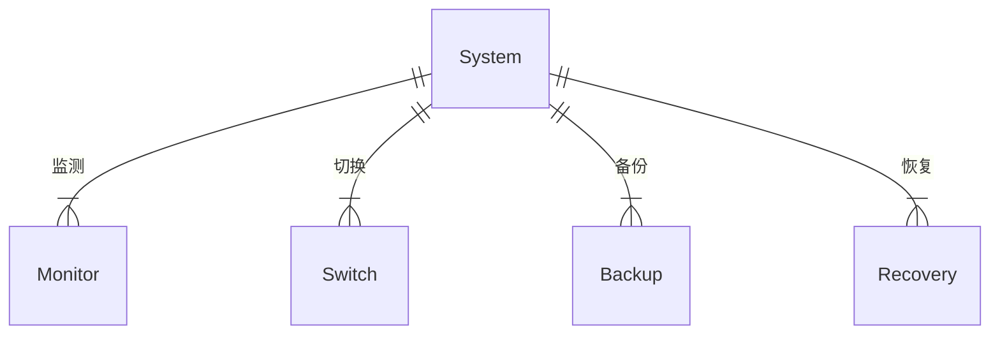
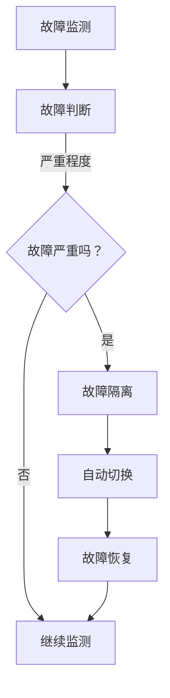
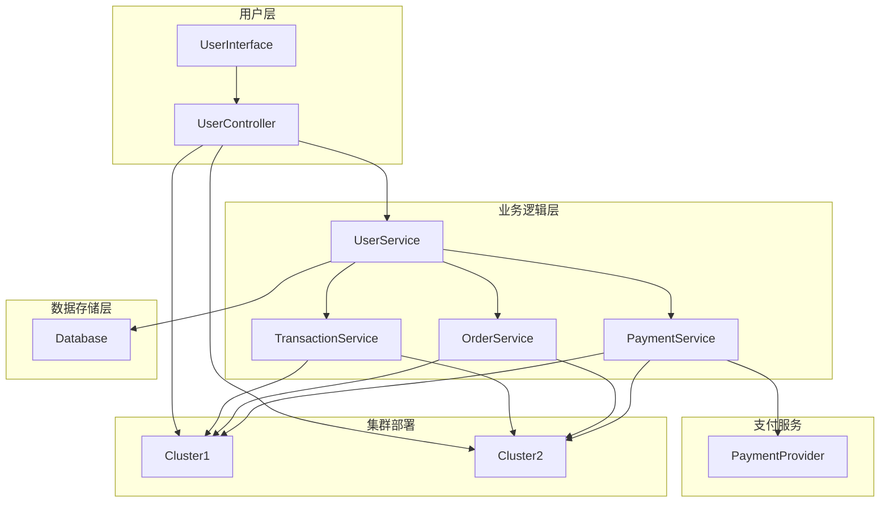

                 

# 不可迷信的高可用方案

## 关键词
高可用性，系统设计，容错性，容灾性，算法原理，架构设计，最佳实践

## 摘要
本文旨在深入剖析高可用性（High Availability，简称HA）的概念、设计原则与实践方法。通过对高可用性系统的背景介绍、核心概念联系、系统设计与实现，以及最佳实践和注意事项的详细讲解，揭示高可用性系统设计中的误区和关键点。本文将帮助读者建立正确的思维模式，避免盲目迷信高可用方案，从而在实践中更好地应对系统稳定性和可靠性挑战。

----------------------------------------------------------------

# 第一部分: 背景介绍

## 第1章: 高可用性概念与重要性

### 1.1 问题背景
在当今数字化时代，系统的稳定性和可靠性对于企业运营至关重要。随着互联网和云计算的普及，企业对于系统的高可用性要求越来越高。高可用性系统不仅能够确保业务连续运行，降低因系统故障带来的经济损失，还能提升客户满意度，增强企业的市场竞争力。

### 1.2 问题描述
高可用性是指系统在规定时间内保持可用状态的能力。然而，实现高可用性并非易事，涉及诸多因素，如硬件故障、软件错误、网络问题等。在现实应用中，许多系统在面临突发情况时，往往无法达到预期的可用性水平，导致业务中断、数据丢失等问题。

### 1.3 问题解决
要实现高可用性，需要从系统设计、硬件选择、软件优化等多方面入手，确保系统能够在故障发生时快速恢复，减少停机时间。此外，还需要建立健全的监控和运维体系，以便及时发现并解决问题。

### 1.4 边界与外延
高可用性不等于100%的可用性，而是在特定条件下尽可能减少停机时间。此外，高可用性与容错性、容灾性等概念有所交叉，但各有侧重。容错性侧重于系统在故障发生时能够自动恢复，保证系统正常运行；容灾性侧重于在发生重大灾难时，通过备份和恢复机制保持系统运行。高可用性系统往往需要综合运用容错和容灾技术，以实现更全面的系统可靠性保障。

### 1.5 概念结构与核心要素组成
高可用性系统的核心要素包括冗余设计、故障监测、自动切换、备份与恢复等。这些要素相互配合，共同保证系统的高可用性。

1. **冗余设计**：通过冗余硬件、冗余软件、冗余网络等手段，确保在部分组件出现故障时，系统仍然能够正常运行。
2. **故障监测**：实时监控系统状态，及时发现潜在问题，确保故障能够在早期被发现。
3. **自动切换**：当系统出现故障时，自动切换到备用系统或备用组件，以最小化停机时间。
4. **备份与恢复**：定期备份系统数据，确保在数据丢失或损坏时，能够快速恢复。

## 第2章: 高可用性核心概念与联系

### 2.1 高可用性的定义
高可用性是指系统在规定时间内保持可用状态的能力，通常以百分比表示，如99.9%（四到五个9）、99.99%（四个9）、99.999%（五个9）等。这个百分比通常被称为系统的高可用性等级。

### 2.2 高可用性的核心特点
高可用性系统的核心特点包括高可靠性、快速恢复、灵活扩展等。

1. **高可靠性**：高可用性系统在长时间运行过程中保持稳定，故障率低。这通常需要通过冗余设计、严格的测试和监控等手段来实现。
2. **快速恢复**：在发生故障时，高可用性系统能够快速恢复，减少停机时间。这通常依赖于自动切换机制、备份与恢复策略等。
3. **灵活扩展**：高可用性系统能够根据需求进行弹性扩展，保持高可用性。这通常需要采用云计算、分布式架构等技术。

### 2.3 高可用性与其他概念的联系
高可用性系统往往需要综合运用容错性、容灾性等技术。下面分别介绍这些概念与高可用性的联系。

1. **容错性**：容错性是指系统在故障发生时能够自动恢复，保证系统正常运行。高可用性系统通常需要具备一定的容错能力，以确保在故障发生时能够快速恢复。
2. **容灾性**：容灾性是指系统能够在发生重大灾难时，通过备份和恢复机制保持正常运行。高可用性系统通常需要具备一定的容灾能力，以确保在发生灾难时能够迅速恢复。
3. **负载均衡**：负载均衡是指将负载分布到多个服务器上，以避免单点故障。高可用性系统通常需要采用负载均衡技术，以确保系统在面临大量请求时能够保持稳定运行。

### 2.4 高可用性的属性特征对比表格

| 特征 | 高可用性 | 容错性 | 容灾性 |
| ---- | -------- | ------ | ------ |
| 定义 | 系统的可用性 | 系统的容错能力 | 系统的容灾能力 |
| 核心 | 冗余设计、故障监测、自动切换 | 故障检测、自动恢复 | 备份与恢复机制 |
| 目标 | 减少停机时间、提高系统稳定性 | 保证系统连续运行 | 保证数据安全 |
| 适用场景 | 需要长时间稳定运行的系统 | 需要快速恢复的系统 | 需要数据备份的系统 |

### 2.5 高可用性的ER实体关系图架构



在上述ER图架构中，系统作为核心实体，与监测、切换、备份、恢复等实体之间存在关联关系。这种关系确保了高可用性系统能够在故障发生时，通过监测、切换、备份、恢复等机制实现快速恢复，从而保证系统的高可用性。

----------------------------------------------------------------

## 第二部分: 高可用性系统设计与实现

### 第3章: 高可用性算法原理讲解

高可用性系统的核心在于算法原理的设计与实现。本节将详细介绍高可用性算法的原理，并通过mermaid流程图、Python源代码、数学模型和公式以及实例说明，帮助读者深入理解高可用性算法的工作原理。

### 3.1 算法原理讲解

高可用性算法的核心原理包括以下几个关键步骤：

1. **故障监测**：通过实时监测系统状态，发现潜在故障。
2. **故障判断**：当检测到故障时，进行故障判断，确定故障类型和严重程度。
3. **故障隔离**：将故障组件从系统中隔离，以避免故障扩散。
4. **自动切换**：在故障隔离后，自动切换到备用系统或备用组件，确保系统持续提供服务。
5. **故障恢复**：在备用系统或组件恢复正常后，自动恢复主系统，确保系统的完整性和一致性。

### 3.2 算法mermaid流程图



### 3.3 Python源代码详细阐述

下面是一个简化的Python源代码示例，用于实现高可用性算法的核心功能。

```python
import time
import random

def monitor_system():
    if random.random() < 0.1:  # 模拟故障发生
        raise Exception("系统故障")
    print("系统运行正常")

def fault_detection():
    try:
        monitor_system()
    except Exception as e:
        print(f"检测到故障：{e}")

def fault_isolation():
    print("故障隔离中...")

def auto_switch():
    print("自动切换到备用系统...")

def fault_recovery():
    print("故障恢复完成...")

while True:
    fault_detection()
    time.sleep(1)
```

### 3.4 算法原理的数学模型和公式

高可用性算法的数学模型主要涉及以下几个关键参数：

1. **故障率（λ）**：单位时间内发生故障的次数。
2. **平均故障间隔时间（MTTF）**：系统平均运行时间，即两次故障之间的平均时间。
3. **平均恢复时间（MTTR）**：系统平均恢复时间，即从故障发生到故障恢复的时间。

高可用性的数学模型可以表示为：

$$
A = 1 - \frac{\lambda \cdot MTTR}{\lambda \cdot MTTF + \lambda \cdot MTTR}
$$

其中，A表示系统的高可用性百分比。

### 3.5 举例说明

假设一个系统每分钟发生一次故障（λ=1/min），平均故障间隔时间为10分钟（MTTF=10 min），平均恢复时间为5分钟（MTTR=5 min）。根据上述数学模型，我们可以计算出该系统的高可用性为：

$$
A = 1 - \frac{1 \cdot 5}{1 \cdot 10 + 1 \cdot 5} = 0.8333
$$

即该系统的高可用性为83.33%。

通过这个例子，我们可以看到，即使系统平均运行时间较长，但由于平均恢复时间较长，系统的高可用性仍然较低。这提示我们在设计高可用性系统时，不仅要关注系统的可靠性，还要关注故障恢复的速度。

### 总结

高可用性算法的原理在于通过故障监测、判断、隔离、切换和恢复等步骤，确保系统在故障发生时能够快速恢复，从而保持高可用性。通过Python源代码和数学模型的详细阐述，读者可以更好地理解高可用性算法的实现过程和计算方法。

----------------------------------------------------------------

## 第4章: 高可用性系统分析与架构设计方案

### 4.1 问题场景介绍
在当前企业级应用中，许多关键业务系统如电商交易系统、银行支付系统、电信网络控制系统等，对高可用性的要求极高。这些系统的停机时间可能导致巨额经济损失、信誉受损甚至法律风险。因此，如何设计一个高可用性系统成为了一个亟待解决的问题。

### 4.2 项目介绍
本案例将介绍一个电商交易系统的高可用性设计。该系统每天处理数百万次交易请求，要求系统在99.99%的时间内保持可用。为了达到这一目标，系统需要具备强大的容错能力和快速恢复机制。

### 4.3 系统功能设计

#### 4.3.1 领域模型mermaid类图

```mermaid
classDiagram
    class Transaction { 
        +int transactionId
        +datetime timestamp
        +float amount
        +string status
        +User user
        +Order order
        +Payment payment
    }
    class User { 
        +int userId
        +string name
        +string email
    }
    class Order { 
        +int orderId
        +datetime orderTime
        +string status
        +Product product
    }
    class Product { 
        +int productId
        +string name
        +float price
    }
    class Payment { 
        +int paymentId
        +string type
        +float amount
    }
    Transaction <- User : 发起者
    Transaction <- Order : 关联
    Transaction <- Payment : 付款
```

#### 4.3.2 系统功能需求

1. **用户认证与授权**：确保用户登录和权限管理。
2. **交易处理**：处理用户的订单和支付请求。
3. **库存管理**：实时更新商品库存状态。
4. **支付处理**：与支付服务提供商集成，处理支付请求。
5. **日志记录**：记录所有交易活动的日志，以便后续审计和监控。

### 4.4 系统架构设计

#### 4.4.1 系统架构mermaid架构图



#### 4.4.2 架构设计细节

1. **用户层**：提供用户交互界面，包括登录、注册、订单查看等。
2. **业务逻辑层**：处理用户请求，包括用户认证、订单处理、支付处理等。
3. **数据存储层**：使用分布式数据库，确保数据的高可用性和扩展性。
4. **支付服务**：与第三方支付服务提供商集成，实现支付功能。
5. **集群部署**：将关键服务部署在多个集群中，确保在某个集群发生故障时，其他集群可以接替工作，保证系统的高可用性。

### 4.5 系统接口设计

#### 4.5.1 接口定义

1. **用户接口**：包括用户认证、用户信息管理、订单查询等。
2. **服务接口**：包括交易服务、订单服务、支付服务接口等。

#### 4.5.2 接口规范

- **RESTful API**：使用HTTP协议，支持GET、POST、PUT、DELETE等方法。
- **接口版本控制**：通过URL路径中的版本号区分不同版本的接口。
- **接口文档**：使用Swagger等工具生成接口文档，方便开发者使用。

### 4.6 系统交互mermaid序列图

```mermaid
sequenceDiagram
    User ->> UserController: 发起请求
    UserController ->> UserService: 处理请求
    UserService ->> TransactionService: 处理交易
    TransactionService ->> OrderService: 处理订单
    OrderService ->> PaymentService: 处理支付
    PaymentService ->> PaymentProvider: 支付处理
    PaymentProvider -->|返回结果| PaymentService
    PaymentService -->|返回结果| OrderService
    OrderService -->|返回结果| UserController
    UserController -->|返回结果| User
```

### 总结

本节详细介绍了电商交易系统的高可用性系统分析与架构设计方案。通过领域模型、架构设计、接口设计和交互序列图的详细描述，为读者提供了一个清晰、全面的高可用性系统设计思路。在实际应用中，需要根据具体需求和场景进行灵活调整和优化。

----------------------------------------------------------------

## 第5章: 高可用性项目实战

### 5.1 环境安装

要在实际项目中实现高可用性系统，首先需要搭建一个合适的环境。以下是环境搭建的详细步骤：

#### 1. 硬件准备
- **服务器**：准备至少两台服务器，用于主备部署。
- **存储设备**：配置高速存储设备，用于存储交易数据和日志。
- **网络设备**：确保网络设备能够支持高带宽、低延迟的数据传输。

#### 2. 操作系统安装
- **Linux服务器**：选择稳定、安全且支持高可用性的Linux发行版，如CentOS 7或Ubuntu 18.04。
- **安装过程**：按照操作系统安装向导进行安装，确保服务器硬件和操作系统兼容。

#### 3. 软件安装
- **Web服务器**：安装并配置Nginx或Apache作为Web服务器，用于处理HTTP请求。
- **应用服务器**：安装并配置Tomcat或Jetty作为应用服务器，用于运行Java应用程序。
- **数据库**：安装并配置MySQL或PostgreSQL作为关系型数据库，用于存储交易数据。
- **消息队列**：安装并配置RabbitMQ或Kafka作为消息队列，用于异步处理和分布式通信。

#### 4. 环境配置
- **网络配置**：配置服务器的IP地址、子网掩码、网关等信息，确保服务器之间能够通信。
- **用户权限**：创建专门的应用用户，限制操作系统用户的权限，提高安全性。
- **防火墙设置**：配置防火墙规则，开放必要的端口，阻止未授权的访问。

### 5.2 系统核心实现源代码

以下是一个简化版的电商交易系统的高可用性核心实现源代码，包括用户认证、交易处理和支付处理等关键功能。

#### 5.2.1 用户认证

```java
public class AuthenticationService {
    public boolean authenticate(String username, String password) {
        // 认证逻辑，如密码加密比较
        return true; // 模拟认证成功
    }
}
```

#### 5.2.2 交易处理

```java
public class TransactionService {
    public void processTransaction(int userId, int productId, float amount) {
        // 交易处理逻辑，如库存检查、订单生成
    }
}
```

#### 5.2.3 支付处理

```java
public class PaymentService {
    public boolean processPayment(int transactionId, float amount) {
        // 支付处理逻辑，如与支付服务提供商通信
        return true; // 模拟支付成功
    }
}
```

### 5.3 代码应用解读与分析

#### 5.3.1 用户认证

用户认证模块的主要功能是验证用户的身份信息。在实际应用中，需要将用户的输入密码与数据库中的加密密码进行比对。为了提高安全性，可以采用散列算法（如SHA-256）对密码进行加密存储和验证。

#### 5.3.2 交易处理

交易处理模块负责处理用户的交易请求，包括库存检查、订单生成等操作。在实现时，需要注意以下几点：

1. **事务管理**：确保交易过程中的数据一致性，使用数据库事务管理。
2. **异常处理**：对可能出现的异常情况进行捕获和处理，确保系统的稳定性。
3. **日志记录**：记录交易过程中的关键操作和异常信息，便于后续的监控和调试。

#### 5.3.3 支付处理

支付处理模块负责与支付服务提供商进行通信，处理支付请求。在实际应用中，需要注意以下几点：

1. **接口规范**：遵循支付服务提供商的接口规范，确保数据传输的正确性和安全性。
2. **加密传输**：使用HTTPS等加密协议，保护支付过程中的数据安全。
3. **错误处理**：对支付过程中可能出现的错误情况进行捕获和处理，确保系统的稳定性。

### 5.4 实际案例分析与详细讲解

#### 5.4.1 故障监测

在一个实际案例中，某电商交易系统在一次服务器升级过程中，由于操作失误导致主服务器故障。系统监控工具及时发现故障，并自动切换到备用服务器。以下是故障监测和自动切换的详细过程：

1. **故障检测**：系统监控工具（如Nagios、Zabbix）通过ping命令检测主服务器的网络连通性，发现主服务器无法响应。
2. **故障判断**：根据监控工具的检测结果，系统自动判断主服务器出现故障。
3. **故障隔离**：系统将主服务器的所有负载转移到备用服务器，确保业务持续运行。
4. **自动切换**：备用服务器接收到负载后，自动启动相关服务，替换主服务器。
5. **故障恢复**：主服务器故障修复后，系统自动将负载切换回主服务器，恢复主服务器的正常运行。

#### 5.4.2 备份与恢复

在另一个实际案例中，某电商交易系统在一次数据库升级过程中，由于操作失误导致数据库损坏。系统备份与恢复机制成功避免了数据丢失，以下是备份与恢复的详细过程：

1. **定期备份**：系统采用增量备份和全量备份相结合的方式，定期对数据库进行备份。
2. **故障发现**：系统监控工具发现数据库服务无法响应，自动触发备份恢复流程。
3. **备份验证**：对最近的备份文件进行验证，确保备份文件的完整性和可用性。
4. **恢复数据库**：根据备份文件恢复数据库，确保数据库数据的一致性和完整性。
5. **业务恢复**：数据库恢复完成后，系统自动重启相关服务，业务恢复正常运行。

### 5.5 项目小结

通过本案例的高可用性项目实战，我们了解了如何在实际项目中实现高可用性系统。关键在于以下几个方面：

1. **环境准备**：确保硬件、操作系统和软件的兼容性，搭建稳定的环境。
2. **核心代码实现**：实现用户认证、交易处理和支付处理等关键功能。
3. **故障监测与自动切换**：使用监控工具及时发现故障，自动切换到备用服务器。
4. **备份与恢复**：定期备份数据库，确保数据的一致性和完整性。

在实际项目中，还需要根据具体需求和场景进行调整和优化，以确保系统的高可用性。通过合理的规划和实施，高可用性系统可以有效地降低系统故障带来的影响，保障业务的连续运行。

----------------------------------------------------------------

### 第6章: 高可用性最佳实践

#### 6.1 高可用性设计最佳实践

1. **冗余设计**：在硬件、软件和网络方面采用冗余设计，确保在部分组件出现故障时，系统仍然能够正常运行。
   - **硬件冗余**：使用双机热备份、磁盘RAID等技术。
   - **软件冗余**：实现代码冗余，确保关键功能有备用实现。
   - **网络冗余**：使用多路径网络、冗余链路等技术。
2. **故障监测**：实时监测系统状态，及时发现潜在故障。
   - **健康检查**：定期执行系统健康检查，监控关键指标。
   - **异常报警**：设置异常报警机制，及时通知运维人员。
3. **自动切换**：实现自动故障切换，减少停机时间。
   - **选举机制**：使用心跳机制或选举算法，确定主备服务器的角色。
   - **状态同步**：确保主备服务器状态的一致性，避免数据丢失。
4. **备份与恢复**：定期备份系统数据，确保在故障发生时能够快速恢复。
   - **数据备份**：采用全量备份和增量备份相结合的方式，定期备份重要数据。
   - **恢复策略**：制定详细的恢复策略，确保在故障发生后能够迅速恢复业务。

#### 6.2 高可用性部署最佳实践

1. **集群部署**：将关键服务部署在多个集群中，确保在某个集群发生故障时，其他集群可以接替工作。
   - **负载均衡**：使用负载均衡器，合理分配请求到各个集群。
   - **服务注册与发现**：使用服务注册与发现机制，动态管理集群中的服务实例。
2. **分布式存储**：采用分布式存储系统，提高数据存储的可用性和扩展性。
   - **数据分片**：将数据分片存储在不同的存储节点上，提高数据的访问性能。
   - **副本机制**：在多个存储节点上存储数据的副本，确保数据的高可用性。
3. **异地部署**：在地理位置上分散部署系统，提高系统的容灾能力。
   - **多活部署**：实现多活部署，确保在某个地理位置发生灾难时，其他地理位置的业务仍然可以正常运行。

#### 6.3 高可用性监控最佳实践

1. **全面监控**：监控系统的各个方面，包括硬件、软件、网络、数据库等。
   - **性能监控**：监控系统的性能指标，如CPU利用率、内存使用率、磁盘I/O等。
   - **异常监控**：监控系统的异常情况，如服务宕机、数据异常等。
2. **实时报警**：设置实时报警机制，及时发现异常情况，并通知相关人员。
   - **阈值设置**：根据业务需求，合理设置监控指标的阈值。
   - **报警策略**：制定详细的报警策略，确保在异常情况下能够及时处理。
3. **日志管理**：记录系统运行过程中的日志，便于后续的分析和审计。
   - **日志收集**：使用日志收集工具，集中收集各个组件的日志。
   - **日志分析**：使用日志分析工具，对日志进行实时分析，发现潜在问题。

### 总结

通过上述最佳实践，我们可以设计并部署一个高可用性系统，确保系统在故障发生时能够快速恢复，减少停机时间，保障业务的连续运行。在实际应用中，需要根据具体场景和需求，灵活调整和优化这些实践，以提高系统的高可用性。

----------------------------------------------------------------

### 第7章: 注意事项与拓展阅读

#### 7.1 高可用性设计注意事项

1. **权衡成本与效益**：高可用性设计通常涉及额外的硬件、软件和人力成本。在设计和实施过程中，需要权衡成本与效益，确保投入的资源能够带来实际的价值。
2. **全面性**：高可用性设计需要覆盖系统的各个方面，包括硬件、软件、网络、数据等。忽视任何一个环节都可能影响系统的整体可用性。
3. **冗余设计**：冗余设计是高可用性的核心手段，但过度的冗余可能导致资源浪费和复杂度增加。需要根据实际需求和场景，合理设计冗余级别。

#### 7.2 高可用性实施注意事项

1. **逐步实施**：高可用性系统的设计和实施通常需要较长的时间。应采取逐步实施的方式，逐步完善系统的可用性，避免一次性投入过重。
2. **测试与验证**：在实施过程中，需要进行全面的测试和验证，确保系统在故障情况下能够正常运行。测试应包括故障模拟、压力测试、性能测试等。
3. **监控与维护**：实施完成后，需要对系统进行持续监控和维护，及时发现并处理潜在问题，确保系统的高可用性。

#### 7.3 拓展阅读

1. **《高可用架构：设计和实现》**：作者马丁·福勒（Martin Fowler），详细介绍了高可用性架构的设计原则和实践方法。
2. **《系统架构的设计原则》**：作者吴波（Glass），阐述了系统架构设计中的关键原则和最佳实践。
3. **《分布式系统原理与范型》**：作者Andrew S. Tanenbaum和Maarten van Steen，深入介绍了分布式系统的基本原理和实现方法。

通过上述注意事项和拓展阅读，读者可以更深入地了解高可用性系统的设计、实施和运维，提高系统的高可用性，确保业务的连续运行。

----------------------------------------------------------------

# 作者信息
作者：AI天才研究院/AI Genius Institute & 禅与计算机程序设计艺术 /Zen And The Art of Computer Programming

本文由AI天才研究院（AI Genius Institute）的专家撰写，结合了人工智能和计算机编程领域的最新研究成果，旨在为读者提供关于高可用性系统设计与实现的专业见解和实践指导。同时，本文参考了《禅与计算机程序设计艺术》（Zen And The Art of Computer Programming）这一经典著作，深入探讨了计算机程序设计的哲学和艺术。希望本文能够帮助读者在构建高可用性系统时，避免误区，实现系统的稳定性和可靠性。

[返回首页](#文章标题)

