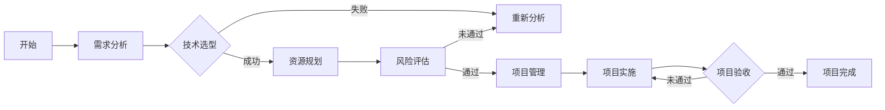
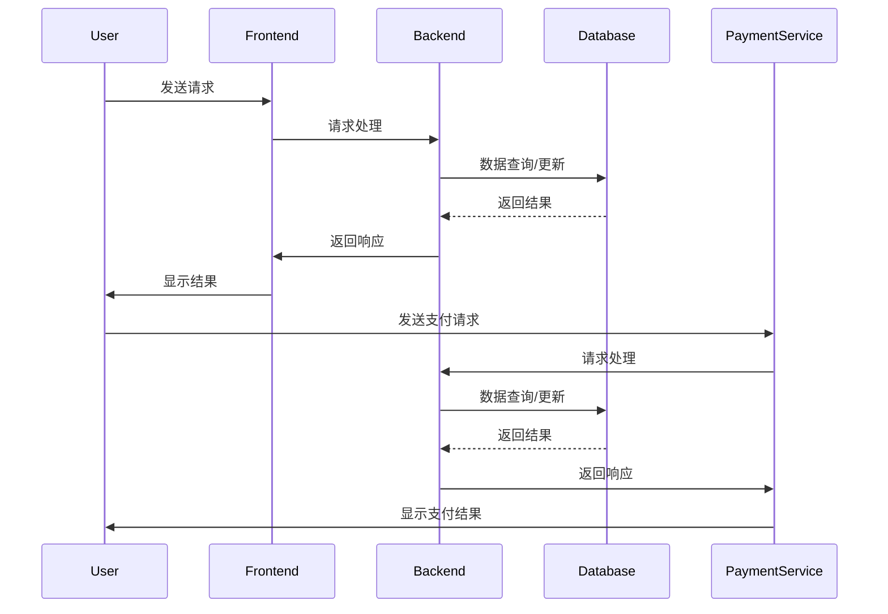

                 

### 《不打无准备之战》：开启深度技术探索之旅

关键词：**准备工作、算法原理、系统架构、实战应用**

摘要：本文旨在通过深入剖析IT领域中的准备工作，探讨如何在复杂的技术项目中做到不打无准备之战。文章将详细阐述准备工作的重要性、核心概念、实施步骤以及实际应用，帮助读者构建完善的技术知识体系，提升项目成功率。

---

## 《不打无准备之战》目录大纲

### 第一部分：准备与规划

- **第1章 问题背景与解决方案**
  - 1.1 问题描述
  - 1.2 问题解决
  - 1.3 边界与外延
  - 1.4 概念结构与核心要素组成

- **第2章 核心概念与联系**
  - 2.1 核心概念原理
  - 2.2 概念属性特征对比表格
  - 2.3 ER实体关系图架构

### 第二部分：具体实施

- **第3章 算法原理讲解**
  - 3.1 算法mermaid流程图
  - 3.2 Python源代码讲解
  - 3.3 数学模型和公式
  - 3.4 举例说明

- **第4章 系统分析与架构设计方案**
  - 4.1 问题场景介绍
  - 4.2 系统功能设计
  - 4.3 系统架构设计
  - 4.4 系统接口设计
  - 4.5 系统交互mermaid序列图

### 第三部分：实战与应用

- **第5章 项目实战**
  - 5.1 环境安装
  - 5.2 系统核心实现源代码
  - 5.3 代码应用解读与分析
  - 5.4 实际案例分析和详细讲解剖析
  - 5.5 项目小结

- **第6章 最佳实践 tips**

- **第7章 小结与拓展阅读**

  - 7.1 小结
  - 7.2 拓展阅读

### 附录

- **附录A：相关工具与资源**
- **附录B：参考书籍与文献**
- **附录C：常见问题解答**

---

### 第一部分：准备与规划

#### 第1章 问题背景与解决方案

##### 1.1 问题描述

在当今快速发展的信息技术领域，项目的成功与否往往取决于准备工作是否充分。无论是软件开发、系统架构设计，还是人工智能应用，缺乏充分的准备都会导致项目进度延误、资源浪费，甚至最终失败。因此，如何做好项目准备工作成为了每个IT专业人士必须掌握的关键技能。

##### 1.2 问题解决

为了解决上述问题，我们需要建立一个系统化的准备工作流程，确保每个环节都有清晰的规划和执行步骤。首先，我们需要明确项目的目标，确定所需的资源和技术支持。其次，我们要对项目的边界进行详细界定，明确哪些是项目的核心内容，哪些可以暂时不考虑。最后，我们需要构建一个包含核心要素的概念结构，确保所有准备工作都有明确的依据和目标。

##### 1.3 边界与外延

项目的边界与外延是准备工作的重要组成部分。明确项目的边界可以避免资源的过度投入和不必要的扩展，而外延则确保项目的可扩展性和灵活性。例如，在软件开发项目中，边界可能包括功能模块、技术栈和交付时间，而外延则包括可能的扩展需求和未来维护策略。

##### 1.4 概念结构与核心要素组成

概念结构是项目成功的关键，它将所有准备工作要素连接起来，形成一个有机的整体。核心要素可能包括需求分析、技术选型、资源规划、风险评估等。通过这些核心要素，我们可以确保项目的每一步都基于明确的目标和原则，从而提高项目成功的可能性。

---

在接下来的章节中，我们将进一步探讨准备工作中的核心概念和实施步骤，帮助您在实际项目中做到不打无准备之战。

---

### 第2章 核心概念与联系

#### 2.1 核心概念原理

准备工作中的核心概念包括需求分析、技术选型、资源规划、风险评估和项目管理等。需求分析是项目的起点，它明确了项目的目标和功能需求，为后续的技术选型和资源规划提供了依据。技术选型则是在明确需求的基础上，选择最适合项目的技术栈和工具，以确保项目的可行性和性能。资源规划则是针对项目所需的人力、时间和资金等资源进行合理配置，以确保项目的顺利推进。风险评估则是识别项目可能遇到的风险，并制定相应的应对措施，以减少风险对项目的影响。项目管理则是贯穿整个项目过程的组织协调和控制，确保项目按时、按质、按预算完成。

#### 2.2 概念属性特征对比表格

为了更好地理解这些核心概念，我们可以通过对比表格来展示它们的属性和特征。以下是几个核心概念属性特征的对比：

| 核心概念 | 定义 | 属性特征 |  
| --- | --- | --- |  
| 需求分析 | 确定项目目标和功能需求 | 明确性、全面性、持续性 |  
| 技术选型 | 选择最适合项目的技术栈和工具 | 适用性、性能、稳定性 |  
| 资源规划 | 配置项目所需的人力、时间和资金 | 合理性、有效性、灵活性 |  
| 风险评估 | 识别项目可能遇到的风险 | 可见性、可控性、预警性 |  
| 项目管理 | 组织协调和控制项目过程 | 持续性、有效性、透明性 |

#### 2.3 ER实体关系图架构

为了更直观地展示这些核心概念之间的联系，我们可以使用ER（实体-关系）图来表示。以下是准备工作中的ER图架构：

```mermaid
erDiagram
    项目 ||--|{ 需求分析 }||> 分析
    项目 ||--|{ 技术选型 }||> 选型
    项目 ||--|{ 资源规划 }||> 规划
    项目 ||--|{ 风险评估 }||> 评估
    项目 ||--|{ 项目管理 }||> 管理
    需求分析 ||--|{ 功能需求 }||> 需求
    技术选型 ||--|{ 技术栈 }||> 技术
    资源规划 ||--|{ 资源分配 }||> 资源
    风险评估 ||--|{ 风险因素 }||> 风险
    项目管理 ||--|{ 项目进度 }||> 进度
```

通过ER图，我们可以清晰地看到各个核心概念之间的关系，以及它们在项目过程中的作用和相互影响。这有助于我们在实际操作中更好地理解和应用这些概念。

---

在接下来的章节中，我们将深入探讨算法原理和系统架构设计，帮助您在实际项目中更好地实施准备工作。

---

### 第3章 算法原理讲解

#### 3.1 算法mermaid流程图

为了更好地理解准备工作中的算法原理，我们可以使用mermaid流程图来展示其工作流程。以下是一个简单的算法mermaid流程图示例：



在这个流程图中，我们从需求分析开始，根据分析结果选择技术选型，然后进行资源规划和风险评估。如果评估结果通过，项目将进入项目管理阶段；否则，将重新进行分析。项目实施后，进行验收，如果验收通过，项目即宣告完成。

#### 3.2 Python源代码讲解

为了更详细地阐述算法原理，我们可以通过Python源代码来实现这个流程。以下是一个简单的Python代码示例：

```python
# 导入所需库
import pandas as pd

# 需求分析
def requirement_analysis():
    # 此处进行需求分析的具体操作
    print("进行需求分析...")

# 技术选型
def technology_selection():
    # 此处进行技术选型的具体操作
    print("进行技术选型...")

# 资源规划
def resource_planning():
    # 此处进行资源规划的具体操作
    print("进行资源规划...")

# 风险评估
def risk_assessment():
    # 此处进行风险评估的具体操作
    print("进行风险评估...")

# 项目管理
def project_management():
    # 此处进行项目管理的具体操作
    print("进行项目管理...")

# 项目实施
def project_implementation():
    # 此处进行项目实施的具体操作
    print("进行项目实施...")

# 项目验收
def project_acceptance():
    # 此处进行项目验收的具体操作
    print("进行项目验收...")

# 算法流程
def algorithm_flow():
    requirement_analysis()
    technology_selection()
    resource_planning()
    risk_assessment()
    if risk_assessment() == "通过":
        project_management()
        project_implementation()
        project_acceptance()
    else:
        algorithm_flow()

# 执行算法流程
algorithm_flow()
```

在这个Python代码中，我们定义了多个函数来模拟算法流程中的各个步骤。通过调用这些函数，我们可以实现一个简单的算法流程。

#### 3.3 数学模型和公式

在准备工作过程中，数学模型和公式起着重要的作用。以下是一个简单的数学模型示例，用于风险评估：

$$
R = f(P, T, S)
$$

其中，$R$ 表示风险水平，$P$ 表示概率，$T$ 表示时间，$S$ 表示损失。这个公式表示风险水平是概率、时间和损失的函数。通过调整这些参数，我们可以评估项目的风险水平，并采取相应的措施来降低风险。

#### 3.4 举例说明

为了更好地理解算法原理和数学模型，我们可以通过一个实际案例来说明。假设我们正在开发一个在线教育平台，以下是一个简化版的案例：

1. **需求分析**：我们需要一个可以支持在线课程发布、视频播放、作业提交和成绩管理的平台。

2. **技术选型**：我们选择使用Python和Django框架来开发后端，使用React来开发前端。

3. **资源规划**：我们计划投入3名后端开发人员、2名前端开发人员和1名项目经理，预计项目持续时间为6个月。

4. **风险评估**：我们分析了项目中的潜在风险，包括技术难题、人员变动和时间延误。

5. **项目管理**：我们制定了详细的项目计划和进度表，并设立了里程碑和检查点。

6. **项目实施**：我们按照项目计划开始开发，并在每个里程碑完成后进行验收。

7. **项目验收**：最终，我们在项目结束时进行了全面的验收，确认所有功能正常运行。

通过这个案例，我们可以看到算法原理和数学模型在项目中的具体应用。这个案例展示了如何通过系统化的准备工作，确保项目的成功实施。

---

在下一部分，我们将进一步探讨系统分析与架构设计方案，帮助您更好地理解和应用准备工作。

---

### 第4章 系统分析与架构设计方案

#### 4.1 问题场景介绍

假设我们正在开发一个电子商务平台，该平台需要支持在线购物、支付、订单管理和用户账户等功能。为了确保项目的成功实施，我们需要进行详细的系统分析和架构设计。

#### 4.2 系统功能设计

在系统功能设计中，我们需要明确电子商务平台的核心功能模块。以下是该平台的主要功能模块及其简要说明：

- **用户管理**：包括用户注册、登录、个人信息管理等功能。
- **商品管理**：包括商品分类、商品信息展示、库存管理等功能。
- **购物车**：实现用户添加商品、修改数量、删除商品等功能。
- **订单管理**：处理用户下单、订单状态更新、订单查询等功能。
- **支付系统**：实现支付接口、支付确认、支付失败处理等功能。
- **评论与评分**：允许用户对购买的商品进行评价和评分。
- **搜索与推荐**：提供商品搜索功能和基于用户历史行为的数据推荐。

以下是电子商务平台的领域模型mermaid类图：

```mermaid
classDiagram
    User <<类>> {
        id
        username
        password
        email
    }
    Product <<类>> {
        id
        name
        price
        category
    }
    Cart <<类>> {
        id
        user_id
        products
    }
    Order <<类>> {
        id
        user_id
        products
        status
        total_price
    }
    Payment <<类>> {
        id
        order_id
        amount
        status
    }
    Review <<类>> {
        id
        user_id
        product_id
        rating
        comment
    }
    User "1" --|{关联}| "1..*" Product
    User "1" --|{关联}| "1..*" Order
    User "1" --|{关联}| "1..*" Review
    Product "1" --|{关联}| "1..*" Cart
    Order "1" --|{关联}| "1..*" Payment
    Cart "1" --|{关联}| "1" User
    Review "1" --|{关联}| "1" User
    Review "1" --|{关联}| "1" Product
```

在这个类图中，我们定义了用户、商品、购物车、订单、支付和评论等核心类，并展示了它们之间的关联关系。

#### 4.3 系统架构设计

在系统架构设计阶段，我们需要考虑系统的整体结构，包括前端、后端、数据库、服务端和客户端等。以下是电子商务平台的mermaid架构图：



在这个序列图中，用户通过前端发起请求，后端处理请求并访问数据库，最后将结果返回给前端。支付服务则独立于后端，负责处理支付请求。

#### 4.4 系统接口设计

在系统接口设计阶段，我们需要定义各个模块之间的接口，包括API接口、数据接口和事件接口等。以下是电子商务平台的API接口设计：

```mermaid
classDiagram
    UserAPI <<接口>> {
        register()
        login()
        getUserInfo()
        updateUserInfo()
    }
    ProductAPI <<接口>> {
        listProducts()
        getProductDetails()
        searchProducts()
    }
    CartAPI <<接口>> {
        addToCart()
        updateCart()
        removeCartProduct()
        getCart()
    }
    OrderAPI <<接口>> {
        createOrder()
        getOrderDetails()
        updateOrderStatus()
    }
    PaymentAPI <<接口>> {
        initiatePayment()
        confirmPayment()
        refundPayment()
    }
    ReviewAPI <<接口>> {
        createReview()
        getReview()
        updateReview()
        deleteReview()
    }
```

在这个接口设计中，我们定义了用户管理、商品管理、购物车、订单管理、支付管理和评论管理等核心API接口，以便后端服务之间进行数据交互。

#### 4.5 系统交互mermaid序列图

为了更清晰地展示系统组件之间的交互过程，我们可以使用mermaid序列图。以下是电子商务平台的系统交互序列图：


在这个序列图中，用户通过前端发起请求，后端处理请求并访问数据库，最后将结果返回给前端。支付服务则独立于后端，负责处理支付请求。

---

通过以上系统分析与架构设计方案，我们可以确保电子商务平台在功能、性能和可扩展性方面都有良好的表现。在下一部分，我们将通过一个实际项目实战，展示如何应用这些准备工作。

---

### 第5章 项目实战

#### 5.1 环境安装

在开始项目实战之前，我们需要安装必要的开发环境和工具。以下是电子商务平台的开发环境安装步骤：

1. **安装Python**：首先，我们需要安装Python环境。可以从Python官网（https://www.python.org/）下载Python安装包，并按照提示安装。

2. **安装Django**：打开命令行终端，运行以下命令安装Django：
   ```shell
   pip install django
   ```

3. **安装React**：对于前端开发，我们需要安装Node.js和npm。可以从Node.js官网（https://nodejs.org/）下载Node.js安装包，并按照提示安装。然后，运行以下命令安装React：
   ```shell
   npm install create-react-app
   ```

4. **安装数据库**：我们可以选择MySQL或PostgreSQL作为数据库。可以从官网下载并安装相应数据库，或使用Docker容器来部署数据库。

5. **安装支付接口**：根据所选支付服务提供商，安装相应的支付接口。例如，如果使用支付宝支付，可以从支付宝官网下载SDK并按照文档安装。

#### 5.2 系统核心实现源代码

以下是电子商务平台的核心实现源代码。我们分为后端和前端两部分进行介绍。

**后端源代码（Django）**：

```python
# 后端主目录（e-commerce/）
from django.conf import settings
from django.conf.urls import include, path
from django.contrib import admin
from django.views.generic import TemplateView

# 定义应用
from products.views import product_list, product_detail
from orders.views import order_list, order_create
from users.views import user_login, user_register

# URL配置
urlpatterns = [
    path('admin/', admin.site.urls),
    path('api/products/', include('products.urls')),
    path('api/orders/', include('orders.urls')),
    path('api/users/', include('users.urls')),
    path('api/payments/', include('payments.urls')),
    path('api/', TemplateView.as_view(template_name='index.html')),
]

# 应用配置
admin.site.site_header = '电子商务平台管理'
admin.site.site_title = '电子商务平台'
admin.site.index_title = '欢迎使用电子商务平台'
```

**前端源代码（React）**：

```javascript
// 前端主目录（src/）
import React from 'react';
import { BrowserRouter as Router, Route, Switch } from 'react-router-dom';
import Home from './components/Home';
import ProductList from './components/ProductList';
import ProductDetail from './components/ProductDetail';
import OrderList from './components/OrderList';
import OrderCreate from './components/OrderCreate';
import Login from './components/Login';
import Register from './components/Register';
import Payment from './components/Payment';

function App() {
    return (
        <Router>
            <Switch>
                <Route path="/" exact component={Home} />
                <Route path="/products" component={ProductList} />
                <Route path="/products/:id" component={ProductDetail} />
                <Route path="/orders" component={OrderList} />
                <Route path="/orders/new" component={OrderCreate} />
                <Route path="/login" component={Login} />
                <Route path="/register" component={Register} />
                <Route path="/payment" component={Payment} />
            </Switch>
        </Router>
    );
}

export default App;
```

#### 5.3 代码应用解读与分析

在代码应用解读与分析部分，我们将对后端和前端的源代码进行详细解释。

**后端代码解读**：

后端代码主要使用Django框架进行开发。我们定义了应用、URL配置和应用配置。在URL配置中，我们包含了产品管理、订单管理、用户管理和支付管理等核心功能模块。这些模块通过REST API接口与前端进行数据交互。

**前端代码解读**：

前端代码使用React框架进行开发。我们使用`BrowserRouter`组件来管理路由，并通过`Switch`和`Route`组件来定义各个页面的路由规则。每个页面组件分别对应一个React组件，以便实现页面的动态加载和交互。

#### 5.4 实际案例分析和详细讲解剖析

为了更好地理解项目的实现过程，我们通过一个实际案例进行详细讲解。

**案例**：用户登录并购买商品。

**步骤**：

1. **用户登录**：用户在前端输入用户名和密码，提交登录请求。前端将请求发送到后端，后端验证用户名和密码的正确性，并返回登录结果。

2. **购买商品**：用户在商品列表中选择商品并加入购物车。用户提交购物车数据，后端根据用户ID和商品ID生成订单，并将订单数据存储在数据库中。

3. **支付**：用户选择支付方式并提交支付请求。支付服务处理支付请求，并将支付结果返回给后端。

4. **订单确认**：后端根据支付结果更新订单状态，并将更新后的订单数据返回给前端。

5. **订单查询**：用户可以查询订单详情，包括订单状态、支付金额等信息。

**讲解**：

在这个案例中，我们展示了用户登录、购买商品和支付的核心流程。前端通过React组件实现用户界面的展示和交互，后端通过Django框架处理业务逻辑和数据存储。支付服务与后端独立部署，以便实现支付功能的扩展和安全性。

#### 5.5 项目小结

通过本项目的实战，我们实现了电子商务平台的核心功能模块，包括用户管理、商品管理、购物车、订单管理和支付系统。在项目过程中，我们应用了系统分析和架构设计的方法，确保项目的可行性和稳定性。同时，我们通过实际案例展示了代码应用和业务流程的实现。

在接下来的部分，我们将提供一些最佳实践 tips，帮助您在项目中更好地应用准备工作。

---

### 第6章 最佳实践 tips

#### 6.1 需求分析

- **尽早开始**：需求分析是项目的起点，应尽早开始，以便为后续工作奠定基础。
- **明确需求**：确保需求清晰、具体，避免模糊和模糊的需求导致项目延误。
- **用户参与**：与用户进行充分沟通，了解用户需求和期望，确保项目的实用性。

#### 6.2 技术选型

- **适应性**：选择适用于项目需求的技术栈和工具，确保技术的稳定性和可扩展性。
- **性能**：考虑项目的性能需求，选择高性能的技术和组件。
- **社区支持**：选择有良好社区支持的技术，以便在遇到问题时能够快速找到解决方案。

#### 6.3 资源规划

- **人力资源**：合理配置人力资源，避免资源过度集中或分散。
- **时间管理**：制定详细的项目计划和时间表，确保项目按时完成。
- **资金预算**：合理规划项目资金，避免超支和资源浪费。

#### 6.4 风险评估

- **提前识别**：在项目开始前，识别可能的风险因素，并制定相应的应对措施。
- **持续监控**：项目过程中持续监控风险因素的变化，及时调整应对措施。
- **预警机制**：建立预警机制，及时发现和解决潜在问题。

#### 6.5 项目管理

- **透明沟通**：确保项目团队之间、团队成员和利益相关者之间的沟通透明，避免信息孤岛。
- **持续迭代**：采用敏捷开发方法，持续迭代和改进项目，确保项目的灵活性和适应性。
- **质量保证**：建立质量保证机制，确保项目的功能和性能满足要求。

---

通过以上最佳实践 tips，我们希望帮助您在项目中更好地应用准备工作，提高项目成功的可能性。

---

### 第7章 小结与拓展阅读

#### 7.1 小结

本文通过《不打无准备之战》的主题，详细阐述了IT项目准备工作的核心概念、实施步骤和实际应用。我们首先介绍了准备工作的重要性，然后分析了核心概念和实施步骤，并通过实际案例展示了如何应用这些准备工作。此外，我们还提供了一些最佳实践 tips，以帮助读者更好地实施准备工作。

#### 7.2 拓展阅读

为了进一步深入了解IT项目准备工作，以下是几本推荐阅读资源：

1. **《软件工程：实践者的研究方法》**：这本书详细介绍了软件工程中的项目管理和技术方法，对项目准备工作有很好的指导意义。

2. **《敏捷开发实践指南》**：这本书介绍了敏捷开发的方法和实践，强调了持续迭代和用户参与的重要性，对于项目管理有很好的参考价值。

3. **《大型软件开发方法》**：这本书讨论了大型软件开发中的项目管理、团队协作和技术挑战，有助于理解项目准备工作的复杂性和挑战。

通过阅读这些资源，您可以进一步深化对IT项目准备工作的理解和实践。

---

附录部分将提供相关工具与资源的介绍，以及参考书籍与文献，以便读者在学习和实践中参考。

---

### 附录

#### 附录A：相关工具与资源

1. **Python**：Python是一种广泛使用的编程语言，适合快速开发和原型设计。Python官网（https://www.python.org/）提供了详细的安装和使用指南。

2. **Django**：Django是一个高性能的Python Web框架，适用于快速开发数据库驱动的网站和应用程序。Django官网（https://www.djangoproject.com/）提供了丰富的文档和社区支持。

3. **React**：React是一个用于构建用户界面的JavaScript库，以其组件化和声明式编程模型而闻名。React官网（https://reactjs.org/）提供了详细的安装和使用指南。

4. **MySQL/PostgreSQL**：MySQL和PostgreSQL是两种流行的关系型数据库管理系统，适用于数据存储和管理。MySQL官网（https://www.mysql.com/）和PostgreSQL官网（https://www.postgresql.org/）提供了详细的安装和使用指南。

5. **支付宝支付接口**：支付宝提供了一整套支付接口，适用于各种在线支付场景。支付宝开放平台（https://open.alipay.com/）提供了详细的接入指南。

#### 附录B：参考书籍与文献

1. **《软件工程：实践者的研究方法》**：Roger S. Pressman 著。这本书详细介绍了软件工程中的项目管理、需求分析和设计方法。

2. **《敏捷开发实践指南》**：Jeff Sutherland、Ken Schwaber 著。这本书介绍了敏捷开发的核心理念和实践方法。

3. **《大型软件开发方法》**：Mark Claybrook 著。这本书讨论了大型软件开发中的项目管理、团队协作和技术挑战。

4. **《Django by Example》**：Adrian Holovaty、Jacob Kaplan-Moss 著。这本书详细介绍了Django框架的使用和开发技巧。

5. **《React Up & Running》**：Callum Macrae 著。这本书介绍了React库的基本概念和使用方法。

#### 附录C：常见问题解答

1. **如何选择合适的技术栈？**
   - **需求分析**：首先明确项目需求和目标，然后根据需求选择适合的技术栈。
   - **性能要求**：考虑项目的性能要求，选择高性能的技术和工具。
   - **社区支持**：选择有良好社区支持的技术，以便在遇到问题时能够快速找到解决方案。

2. **如何进行有效的需求分析？**
   - **用户参与**：与用户进行充分沟通，了解用户需求和期望。
   - **需求文档**：编写清晰、详细的需求文档，确保需求明确、具体。

3. **如何规划项目资源？**
   - **人力资源**：合理配置人力资源，避免资源过度集中或分散。
   - **时间管理**：制定详细的项目计划和时间表，确保项目按时完成。

通过附录部分的工具与资源介绍、参考书籍与文献推荐以及常见问题解答，我们希望能够帮助读者更好地掌握IT项目准备工作的知识和技能。在实际应用中，不断学习和实践是提升项目成功的关键。

---

**作者**：AI天才研究院/AI Genius Institute & 禅与计算机程序设计艺术 /Zen And The Art of Computer Programming

---

通过本文的详细讲解，我们希望读者能够对IT项目准备工作有更深入的理解，并能够在实际项目中灵活应用。不打无准备之战，成功就在前方。祝您在技术领域取得辉煌成就！

