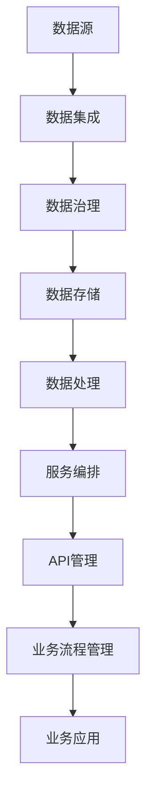

                 

### 业务中台概述与背景

#### 关键词：业务中台、企业级能力复用、IT架构、数字化转型

> 摘要：本文旨在探讨业务中台的概念、价值及其在企业级应用中的重要性。通过分析信息化时代的演变，我们将深入了解业务中台的核心要素、技术支撑及其在提升企业级能力复用方面的优势。同时，本文还将探讨业务中台的发展趋势与面临的挑战，为企业数字化转型的战略规划提供有价值的参考。

在当今数字化时代，企业级应用的发展经历了多个阶段。从最初的信息化建设，到集成化趋势，再到现在的业务中台架构，企业的IT系统架构在不断演进。这一变化背后，反映了企业对业务敏捷性、创新能力和成本效益的日益重视。

**第1章：业务中台的概念与价值**

首先，我们需要明确业务中台的概念及其价值。业务中台是一种新兴的IT架构模式，它通过整合企业内部的核心能力，构建一个灵活、可复用的技术平台，以支持企业的业务敏捷和创新。

**1.1.1 信息化时代与企业级应用的演变**

在信息化初期，企业开始建立业务系统，如ERP、CRM等，以提升业务效率。然而，随着业务的不断扩展和多样化，企业面临的一个重大挑战是如何实现业务系统的集成与协同。

**1.1.1.1 信息化初期与业务系统的出现**

在信息化初期，企业开始引入各种业务系统，如ERP（企业资源计划）、CRM（客户关系管理）等，以提高业务效率和数据管理水平。这些系统的出现，为企业提供了更精准的数据分析和决策支持，但也带来了集成和协同的挑战。

**1.1.1.2 集成化趋势与业务协同需求**

随着企业业务的不断扩展和多样化，传统的业务系统开始暴露出其局限性。企业需要一个更加集成和协同的IT架构，以支持业务的敏捷和创新。

**1.1.1.3 传统架构的局限性与中台的需求**

传统架构在集成性和灵活性方面存在一定的局限，难以满足企业快速变化的业务需求。业务中台的提出，正是为了解决这些问题，提供一种更加灵活、可扩展的IT架构。

**1.1.2 业务中台的概念定义与核心要素**

业务中台是一种企业级IT架构，它通过整合企业内部的核心能力，构建一个灵活、可复用的技术平台。业务中台的核心要素包括数据中台、技术中台和业务中台，它们共同构成了一个完整的中台架构。

**1.1.2.1 业务中台的定义**

业务中台是一种企业级IT架构，它通过整合企业内部的核心能力，构建一个灵活、可复用的技术平台。它不仅涵盖了技术层面的内容，还包括业务逻辑和数据管理，是一种全方位的支持企业业务敏捷和创新的技术架构。

**1.1.2.2 业务中台的核心组成部分**

业务中台的核心组成部分包括数据中台、技术中台和业务中台。数据中台负责数据的集成、治理和存储；技术中台提供通用的技术能力和工具支持；业务中台则实现具体的业务逻辑和服务。

**1.1.2.3 业务中台的技术支撑**

业务中台的技术支撑包括云计算、大数据、人工智能、微服务等多种技术。这些技术共同构成了业务中台的底层架构，为其提供强大的计算能力和数据支持。

**1.1.3 业务中台的价值与优势**

业务中台在企业级应用中具有显著的价值和优势。它不仅可以提升企业级能力复用，促进业务敏捷和创新，还可以降低系统开发与维护成本。

**1.1.3.1 提升企业级能力复用**

业务中台通过整合企业内部的核心能力，实现能力的共享和复用。这不仅可以提高系统的灵活性，还可以减少重复开发的工作量，提升开发效率。

**1.1.3.2 促进业务敏捷与创新**

业务中台提供了一个灵活、可扩展的技术平台，支持企业快速响应市场变化和业务需求。通过业务中台，企业可以更加敏捷地推出新产品和服务，实现业务的快速创新。

**1.1.3.3 降低系统开发与维护成本**

业务中台通过减少重复开发的工作量和提升开发效率，显著降低了系统的开发和维护成本。同时，业务中台的标准化和模块化设计，也使得系统的维护更加高效和便捷。

**1.1.4 业务中台的发展趋势与挑战**

随着技术的不断发展和企业业务需求的不断变化，业务中台也在不断演进。然而，在这一过程中，业务中台也面临着一些挑战，如技术选型、安全性和隐私保护等。

**1.1.4.1 技术发展与创新**

随着云计算、大数据、人工智能等技术的不断成熟，业务中台的技术支撑也在不断更新和优化。这为业务中台的进一步发展提供了强大的动力。

**1.1.4.2 企业应用场景的多样性**

企业应用场景的多样性，使得业务中台需要具备更强的灵活性和适应性。业务中台需要能够支持不同行业的业务需求，实现跨领域的应用。

**1.1.4.3 安全性与隐私保护**

在业务中台的建设过程中，安全性和隐私保护是一个不可忽视的问题。业务中台需要确保数据的安全性和隐私性，防止数据泄露和滥用。

**1.1.5 本章小结**

业务中台作为一种新兴的IT架构模式，在企业级应用中具有显著的价值和优势。通过本章的介绍，我们了解了业务中台的概念、价值及其发展背景。在后续章节中，我们将进一步探讨业务中台的架构设计、实现方法及其在不同行业中的应用。

----------------------------------------------------------------

### 第1章：业务中台的概念与价值

#### 关键词：业务中台、企业级应用、IT架构、数字化转型

> 摘要：本章将深入探讨业务中台的概念及其在企业级应用中的重要性。通过分析信息化时代的演变，我们将详细介绍业务中台的起源、核心要素以及其在提升企业级能力复用、促进业务敏捷和创新、降低系统开发与维护成本方面的价值。此外，本章还将探讨业务中台的发展趋势与面临的挑战，为读者提供全面的理解和认识。

#### 1.1.1 信息化时代与企业级应用的演变

**1.1.1.1 信息化初期与业务系统的出现**

在信息化初期的20世纪80年代末至90年代初，企业开始意识到信息技术的重要性，纷纷投入大量资源进行信息化建设。最初的企业信息化主要集中在ERP（企业资源计划）、CRM（客户关系管理）、HRM（人力资源管理）等领域的业务系统。这些系统的引入，旨在提升企业的业务效率和数据管理水平。

例如，ERP系统帮助企业实现财务、采购、库存、生产等各个环节的集成管理，从而提高企业的运营效率；CRM系统则帮助企业更好地管理客户关系，提高客户满意度，从而提升销售业绩。

然而，随着企业业务的不断扩展和多样化，这些传统业务系统的局限性逐渐显现。首先，这些系统往往是垂直集成的，即每个系统都是为了满足某一特定业务领域的需求而设计的。这种垂直集成的方式，导致不同系统之间的数据难以共享，业务流程难以协同。其次，这些系统通常是封闭的，难以与其他外部系统进行集成，从而限制了企业的业务扩展能力。

**1.1.1.2 集成化趋势与业务协同需求**

为了解决上述问题，企业开始探索更加集成化的IT架构，以实现业务系统之间的数据共享和业务协同。集成化趋势主要表现在两个方面：一是横向集成，即通过集成不同业务领域的信息系统，实现跨业务领域的数据共享和流程协同；二是纵向集成，即通过集成企业的内部信息系统与外部合作伙伴的信息系统，实现供应链、客户关系等全流程的协同。

这一过程中，企业引入了各种集成工具和技术，如ESB（企业服务总线）、SOA（服务导向架构）、BI（商业智能）等。这些工具和技术的应用，使得企业级应用系统的集成性得到了显著提升，企业内部的业务流程也变得更加协同。

然而，随着企业规模的扩大和业务复杂度的增加，集成化趋势也带来了一些新的挑战。首先，集成化系统往往需要大量的定制开发和维护工作，导致开发成本和运营成本增加。其次，集成化系统的复杂度增加，使得系统的可维护性和可扩展性变差，系统故障和性能问题也变得更加普遍。

**1.1.1.3 传统架构的局限性与中台的需求**

传统架构在集成性和灵活性方面存在一定的局限，难以满足企业快速变化的业务需求。这主要体现在以下几个方面：

1. **系统复杂性高**：传统架构通常采用多层次、多组件的设计，系统复杂性高，导致开发和维护成本增加。
2. **数据孤岛问题**：不同系统之间的数据难以共享，导致数据孤岛现象严重，影响了企业数据的整体利用效率。
3. **业务响应速度慢**：传统架构的变更和升级需要经过漫长的开发周期，难以快速响应业务需求的变化。
4. **技术债务**：为了满足过去的业务需求，系统积累了大量的技术债务，导致系统的性能和可维护性下降。

为了解决这些问题，企业开始探索一种新的IT架构模式——业务中台。业务中台通过整合企业内部的核心能力，构建一个灵活、可复用的技术平台，以支持企业的业务敏捷和创新。业务中台的出现，标志着企业级应用架构的一次重要变革。

#### 1.1.2 业务中台的概念定义与核心要素

**1.1.2.1 业务中台的定义**

业务中台是一种企业级IT架构，它通过整合企业内部的核心能力，构建一个灵活、可复用的技术平台。业务中台不仅仅是一个技术平台，更是一种业务战略，它旨在提升企业的业务敏捷性、创新能力和成本效益。

业务中台的核心目标是实现企业内部能力的共享和复用，从而降低系统的开发成本和维护成本，提高系统的可扩展性和灵活性。业务中台通过提供统一的数据服务、技术能力和业务服务，支持企业快速响应市场变化和业务需求。

**1.1.2.2 业务中台的核心组成部分**

业务中台的核心组成部分包括数据中台、技术中台和业务中台，它们共同构成了一个完整的中台架构。

1. **数据中台**：数据中台负责数据的集成、治理和存储。它通过整合企业内部的数据资源，提供统一的数据接口和服务，实现数据的高效利用和共享。数据中台的核心功能包括数据采集、数据清洗、数据存储、数据分析和数据共享等。

2. **技术中台**：技术中台提供通用的技术能力和工具支持，包括开发框架、中间件、云计算平台、大数据平台等。技术中台的目标是提供一套标准化的技术基础设施，支持企业内部各个业务系统的快速开发和部署。

3. **业务中台**：业务中台负责实现具体的业务逻辑和服务，包括业务流程管理、业务规则管理、业务决策支持等。业务中台通过将业务能力抽象为服务，提供统一的业务接口和服务，支持企业内部不同业务系统的集成和协同。

**1.1.2.3 业务中台的技术支撑**

业务中台的技术支撑包括云计算、大数据、人工智能、微服务等多种技术。这些技术共同构成了业务中台的底层架构，为其提供强大的计算能力和数据支持。

1. **云计算**：云计算提供了弹性的计算资源和存储资源，支持业务中台的快速部署和扩展。通过云基础设施，企业可以灵活地调整计算资源和存储资源，以满足业务需求的变化。

2. **大数据**：大数据技术提供了高效的数据存储、处理和分析能力，支持业务中台对海量数据的处理和分析。通过大数据技术，企业可以挖掘数据的价值，为业务决策提供数据支持。

3. **人工智能**：人工智能技术为业务中台提供了智能化的业务决策支持，包括自然语言处理、图像识别、机器学习等。通过人工智能技术，企业可以自动化业务流程，提高业务效率。

4. **微服务**：微服务架构提供了灵活、可扩展的服务架构，支持业务中台的高效开发和部署。通过微服务架构，企业可以将复杂的业务系统拆分为多个独立的、松耦合的服务，实现业务的快速迭代和部署。

#### 1.1.3 业务中台的价值与优势

**1.1.3.1 提升企业级能力复用**

业务中台通过整合企业内部的核心能力，实现能力的共享和复用。这不仅可以提高系统的灵活性，还可以减少重复开发的工作量，提升开发效率。

例如，企业内部的业务规则、数据模型、业务流程等都可以通过业务中台进行标准化和模块化，供其他业务系统复用。这样，不同业务系统在开发过程中，可以减少重复工作，降低开发成本。

**1.1.3.2 促进业务敏捷与创新**

业务中台提供了一个灵活、可扩展的技术平台，支持企业快速响应市场变化和业务需求。通过业务中台，企业可以更加敏捷地推出新产品和服务，实现业务的快速创新。

例如，企业可以通过业务中台快速搭建新的业务场景，无需进行大规模的系统变更。这样，企业可以更快地响应市场变化，抓住商机。

**1.1.3.3 降低系统开发与维护成本**

业务中台通过减少重复开发的工作量和提升开发效率，显著降低了系统的开发和维护成本。同时，业务中台的标准化和模块化设计，也使得系统的维护更加高效和便捷。

例如，通过业务中台，企业可以减少对传统业务系统的依赖，降低系统的复杂度和维护成本。这样，企业可以更加专注于核心业务的发展，提高整体竞争力。

**1.1.4 业务中台的发展趋势与挑战**

随着技术的不断发展和企业业务需求的不断变化，业务中台也在不断演进。然而，在这一过程中，业务中台也面临着一些挑战，如技术选型、安全性和隐私保护等。

**1.1.4.1 技术发展与创新**

随着云计算、大数据、人工智能等技术的不断成熟，业务中台的技术支撑也在不断更新和优化。这为业务中台的进一步发展提供了强大的动力。

例如，云计算的普及，使得企业可以更加灵活地调整计算资源和存储资源，满足业务需求的变化。大数据技术的进步，使得企业可以更加高效地处理和分析海量数据，为业务决策提供数据支持。人工智能技术的发展，为业务中台提供了更加智能化的业务决策支持，提升了业务效率。

**1.1.4.2 企业应用场景的多样性**

企业应用场景的多样性，使得业务中台需要具备更强的灵活性和适应性。业务中台需要能够支持不同行业的业务需求，实现跨领域的应用。

例如，金融行业的业务需求与电商行业的业务需求存在较大差异，业务中台需要能够灵活地调整和适应。这要求业务中台在架构设计和技术实现上，具备较高的灵活性和可扩展性。

**1.1.4.3 安全性与隐私保护**

在业务中台的建设过程中，安全性和隐私保护是一个不可忽视的问题。业务中台需要确保数据的安全性和隐私性，防止数据泄露和滥用。

例如，金融行业的业务数据涉及用户的敏感信息，业务中台需要采取严格的安全措施，确保数据的安全性。同时，业务中台还需要遵循相关的法律法规，保护用户的隐私权益。

#### 1.1.5 本章小结

业务中台作为一种新兴的IT架构模式，在企业级应用中具有显著的价值和优势。通过本章的介绍，我们了解了业务中台的起源、核心要素及其在提升企业级能力复用、促进业务敏捷和创新、降低系统开发与维护成本方面的价值。在后续章节中，我们将进一步探讨业务中台的架构设计、实现方法及其在不同行业中的应用。

----------------------------------------------------------------

### 第2章：业务中台架构设计与技术选型

#### 关键词：业务中台、架构设计、技术选型、微服务、大数据、云计算

> 摘要：本章将深入探讨业务中台的架构设计原则与模式，以及技术选型与工具的运用。我们将从设计原则和架构模式入手，详细分析业务中台的核心模块，包括数据集成与数据治理、服务编排与API管理、业务流程管理，并通过一个互动式架构设计示例，帮助读者更好地理解业务中台的架构设计与实现。本章将为企业搭建业务中台提供有价值的指导。

#### 2.1 业务中台架构的设计原则与模式

业务中台的架构设计是一个复杂而关键的过程，它需要综合考虑企业的业务需求、技术能力以及未来的发展潜力。以下是业务中台架构设计的一些关键原则和模式：

**2.1.1 设计原则**

1. **模块化与解耦**：业务中台应采用模块化设计，将不同的业务功能、数据和服务解耦，以提高系统的可维护性和可扩展性。
2. **可复用性**：业务中台应设计为可复用的组件，以便在不同业务场景中重复使用，减少重复开发的工作量。
3. **灵活性与可扩展性**：业务中台的架构应具备良好的灵活性和可扩展性，能够快速适应业务需求的变化。
4. **安全性**：业务中台在设计和实现过程中，应确保数据的安全性和系统的稳定性，防止数据泄露和系统故障。
5. **性能优化**：业务中台的架构应考虑性能优化，确保系统的响应速度和数据处理能力。

**2.1.2 架构模式**

1. **分层架构**：业务中台通常采用分层架构，包括表示层、业务逻辑层、数据访问层等。这种架构模式有助于实现系统的解耦和模块化。
2. **微服务架构**：业务中台常采用微服务架构，将不同的业务功能拆分为独立的微服务。这种架构模式有助于提高系统的灵活性和可扩展性。
3. **分布式架构**：业务中台采用分布式架构，通过分布式计算和数据存储，提高系统的处理能力和容错能力。

#### 2.2 技术选型与工具

在业务中台的架构设计中，技术选型是至关重要的一环。以下是常见的技术选型和工具：

**2.2.1 开发框架与数据库**

1. **开发框架**：常用的开发框架包括Spring Boot、Django、Rails等。这些框架提供了丰富的功能，可以帮助开发者快速搭建业务系统。
2. **数据库**：常用的数据库包括关系型数据库（如MySQL、PostgreSQL）和NoSQL数据库（如MongoDB、Redis）。根据业务需求，选择合适的数据库类型和模型。

**2.2.2 服务治理与中间件**

1. **服务治理**：常用的服务治理工具包括Consul、Zookeeper、Eureka等。这些工具可以帮助管理服务注册、发现和负载均衡。
2. **中间件**：常用的中间件包括消息队列（如RabbitMQ、Kafka）、缓存（如Redis、Memcached）、分布式文件系统（如HDFS）等。

**2.2.3 数据处理与存储**

1. **数据处理**：常用的数据处理工具包括Hadoop、Spark等。这些工具提供了强大的数据处理能力，可以处理大规模的数据集。
2. **数据存储**：常用的数据存储包括关系型数据库（如MySQL、PostgreSQL）、NoSQL数据库（如MongoDB、Cassandra）、数据仓库（如Hive、Impala）等。

#### 2.3 业务中台的核心模块

业务中台的核心模块包括数据集成与数据治理、服务编排与API管理、业务流程管理。以下是这些模块的详细分析：

**2.3.1 数据集成与数据治理**

1. **数据集成**：数据集成是将不同数据源的数据进行整合和转换的过程。常用的数据集成工具包括Apache NiFi、Apache Kafka等。数据集成可以确保数据的完整性和一致性，为业务分析提供基础。
2. **数据治理**：数据治理是确保数据质量、安全性和合规性的过程。数据治理工具包括Metadata Manager、Data Quality Manager等。数据治理有助于提高数据的价值和可信度。

**2.3.2 服务编排与API管理**

1. **服务编排**：服务编排是将多个微服务进行组合和调用的过程。常用的服务编排工具包括Apache Camel、Apache Service Mix等。服务编排可以提高系统的灵活性和可扩展性。
2. **API管理**：API管理是管理和监控API的过程。常用的API管理工具包括API Manager、Apigee等。API管理可以确保API的安全性、可靠性和高性能。

**2.3.3 业务流程管理**

1. **业务流程设计**：业务流程设计是定义业务流程的过程。常用的业务流程设计工具包括Activiti、Camunda等。业务流程设计可以帮助企业优化业务流程，提高运营效率。
2. **业务流程执行与监控**：业务流程执行与监控是确保业务流程按预期执行和监控的过程。常用的业务流程执行与监控工具包括Apache Camel、Apache ActiveMQ等。

#### 2.4 互动式架构设计示例

为了更好地理解业务中台的架构设计与实现，我们通过一个互动式架构设计示例，展示业务中台的架构图和设计过程。

**2.4.1 系统架构图示例**

以下是一个典型的业务中台架构图，展示了数据集成、服务编排、业务流程管理等方面的模块和交互。



**2.4.2 架构设计过程解析**

1. **需求分析**：首先，对业务需求进行分析，明确业务中台需要支持的功能和性能指标。
2. **架构设计**：根据需求分析结果，设计业务中台的架构，包括模块划分、技术选型、接口定义等。
3. **模块开发**：根据架构设计，开发各个模块的功能，并进行集成测试。
4. **系统部署**：将业务中台部署到生产环境，进行性能测试和稳定性测试。
5. **运维管理**：对业务中台进行监控和维护，确保系统的稳定运行。

#### 2.5 本章小结

业务中台作为一种新兴的IT架构模式，在提升企业级能力复用、促进业务敏捷和创新、降低系统开发与维护成本方面具有显著的价值。本章详细介绍了业务中台的架构设计原则与模式、技术选型与工具、核心模块及其互动式架构设计示例。通过本章的学习，读者可以更好地理解业务中台的架构设计与实现，为企业搭建业务中台提供有价值的指导。

----------------------------------------------------------------

### 第3章：业务中台开发实践

#### 关键词：业务中台、开发环境、数据集成、服务编排、业务流程管理、项目实战

> 摘要：本章将深入探讨业务中台的实现过程，从开发环境与工具安装、数据集成与数据治理、服务编排与API管理、业务流程管理等方面，提供详细的开发实践指南。同时，通过一个实际项目的解析，展示业务中台在实际应用中的具体实现方法。本章旨在帮助开发者更好地理解和实践业务中台的构建。

#### 3.1 开发环境与工具安装

在开始业务中台的构建之前，首先需要搭建合适的开发环境。以下是开发环境与工具安装的详细步骤：

**3.1.1 开发环境搭建**

1. **操作系统**：推荐使用Linux操作系统，如Ubuntu或CentOS。Linux操作系统具有更好的稳定性和安全性。
2. **编程语言**：推荐使用Java或Python等编程语言进行开发。Java具有更好的性能和生态系统，Python则具有更简洁的语法和强大的库支持。
3. **集成开发环境（IDE）**：推荐使用IntelliJ IDEA或PyCharm等IDE。这些IDE提供了强大的开发工具和调试功能，可以提高开发效率。

**3.1.2 开发工具安装与配置**

1. **Maven**：Maven是一个强大的项目管理和构建工具，用于管理项目的依赖关系和构建过程。在Linux系统中，可以通过以下命令安装Maven：
   ```bash
   sudo apt-get install maven
   ```
2. **Docker**：Docker是一个开源的应用容器引擎，用于构建、运行和分发应用。在Linux系统中，可以通过以下命令安装Docker：
   ```bash
   sudo apt-get install docker
   ```
3. **Kafka**：Kafka是一个分布式流处理平台，用于处理实时数据流。在Linux系统中，可以通过以下命令安装Kafka：
   ```bash
   sudo apt-get install kafka
   ```
4. **Redis**：Redis是一个高性能的NoSQL数据库，用于缓存和消息队列。在Linux系统中，可以通过以下命令安装Redis：
   ```bash
   sudo apt-get install redis
   ```

#### 3.2 数据集成与数据治理

数据集成与数据治理是业务中台的核心功能之一，确保数据的完整性和一致性对于业务中台的稳定运行至关重要。

**3.2.1 数据源接入**

1. **关系型数据库接入**：可以使用JDBC（Java Database Connectivity）或ODBC（Open Database Connectivity）等技术，将关系型数据库接入到业务中台。以下是一个使用JDBC接入MySQL数据库的示例：
   ```java
   import java.sql.Connection;
   import java.sql.DriverManager;
   import java.sql.SQLException;

   public class JdbcExample {
       public static void main(String[] args) {
           try {
               Connection connection = DriverManager.getConnection(
                       "jdbc:mysql://localhost:3306/mydatabase", "username", "password");
               // 使用connection进行数据库操作
           } catch (SQLException e) {
               e.printStackTrace();
           }
       }
   }
   ```
2. **NoSQL数据库接入**：可以使用相应的客户端库将NoSQL数据库接入到业务中台。以下是一个使用MongoDB Java Driver接入MongoDB数据库的示例：
   ```java
   import com.mongodb.client.MongoClients;
   import com.mongodb.client.MongoClient;
   import com.mongodb.client.MongoDatabase;

   public class MongoDBExample {
       public static void main(String[] args) {
           MongoClient mongoClient = MongoClients.create("mongodb://localhost:27017");
           MongoDatabase database = mongoClient.getDatabase("mydatabase");
           // 使用database进行数据库操作
       }
   }
   ```

**3.2.2 数据清洗与整合**

数据清洗与整合是确保数据质量和一致性的重要步骤。以下是一些常用的数据清洗与整合方法：

1. **数据清洗**：使用ETL（Extract, Transform, Load）工具对数据进行清洗和转换。以下是一个使用Apache NiFi进行数据清洗的示例：
   ```bash
   niFiCommand list -p /process-group/my-process-group
   ```
2. **数据整合**：将来自不同数据源的数据进行整合，形成一个统一的数据视图。以下是一个使用Apache Kafka进行数据整合的示例：
   ```bash
   kafka-topics --create --topic my-topic --partitions 1 --replication-factor 1 --broker-list localhost:9092
   ```

**3.2.3 数据质量管理**

数据质量管理是确保数据质量和可信度的过程。以下是一些常用的数据质量管理方法：

1. **数据质量检查**：使用数据质量检查工具对数据进行检查和验证。以下是一个使用DataQualityControl进行数据质量检查的示例：
   ```java
   import com.googlecode.datavisualization.dataquality.analyzer.AnalyzerFactory;
   import com.googlecode.datavisualization.dataquality.analyzer.impl.SimpleAnalyzer;

   public class DataQualityExample {
       public static void main(String[] args) {
           SimpleAnalyzer analyzer = AnalyzerFactory.getInstance().createAnalyzer();
           analyzer.checkDataQuality();
       }
   }
   ```

#### 3.3 服务编排与API管理

服务编排与API管理是业务中台的另一重要功能，确保业务流程的自动化和API的高效管理。

**3.3.1 服务定义与发布**

1. **服务定义**：使用服务描述语言（如WSDL、Swagger）定义服务接口。以下是一个使用Swagger定义服务的示例：
   ```yaml
   swagger: "2.0"
   info:
     title: "My API"
     version: "1.0.0"
   definitions:
     User:
       type: "object"
       properties:
         id:
           type: "integer"
         name:
           type: "string"
   paths:
     /users:
       get:
         summary: "获取用户列表"
         operationId: "getUserList"
         responses:
           200:
             description: "成功响应"
             schema:
               type: "array"
               items:
                 $ref: "#/definitions/User"
   ```
2. **服务发布**：将定义好的服务发布到API管理平台，如Kong、Apache APISIX等。以下是一个使用Kong发布服务的示例：
   ```bash
   kong create service -n my-service -p type=http -p host=localhost -p port=8080
   ```

**3.3.2 API安全管理**

1. **认证与授权**：使用OAuth 2.0、JWT（JSON Web Token）等认证和授权机制，确保API的安全和可控。以下是一个使用OAuth 2.0进行认证的示例：
   ```bash
   curl -X POST "http://auth-server.com/token" -d "grant_type=password&username=myuser&password=mypassword"
   ```
2. **API流量控制**：使用限流、黑白名单等策略，控制API的流量和访问权限。以下是一个使用Kong进行流量控制的示例：
   ```bash
   kong create rate-limit -n my-rate-limit -p limit=100 -p seconds=60
   ```

**3.3.3 API性能优化**

1. **负载均衡**：使用负载均衡器（如Nginx、HAProxy）分发API请求，提高系统的吞吐量和可用性。以下是一个使用Nginx进行负载均衡的示例：
   ```nginx
   http {
       upstream myapp {
           server app1.example.com;
           server app2.example.com;
       }
       server {
           location / {
               proxy_pass http://myapp;
           }
       }
   }
   ```
2. **缓存策略**：使用缓存（如Redis、Memcached）存储常用的数据，减少数据库的访问压力。以下是一个使用Redis进行缓存管理的示例：
   ```java
   import redis.clients.jedis.Jedis;

   public class RedisExample {
       public static void main(String[] args) {
           Jedis jedis = new Jedis("localhost");
           jedis.set("key", "value");
           String value = jedis.get("key");
           System.out.println(value);
       }
   }
   ```

#### 3.4 业务流程管理

业务流程管理是确保业务流程自动化和高效执行的重要环节。以下是一些常用的业务流程管理工具和方法：

**3.4.1 流程设计工具**

1. **Activiti**：Activiti是一个开源的业务流程管理（BPM）引擎，支持BPMN（Business Process Model and Notation）流程设计。以下是一个使用Activiti设计流程的示例：
   ```xml
   <process id="my-process" xmlns="http://www.omg.org/spec/BPMN/20100524/MODEL">
       <startEvent id="start"/>
       <task id="task1" name="Task 1"/>
       <endEvent id="end"/>
       <sequenceFlow id="flow1" sourceRef="start" targetRef="task1"/>
       <sequenceFlow id="flow2" sourceRef="task1" targetRef="end"/>
   </process>
   ```

**3.4.2 流程执行与监控**

1. **流程执行**：使用业务流程管理引擎（如Activiti）执行流程定义，实现业务流程的自动化执行。以下是一个使用Activiti执行流程的示例：
   ```java
   import org.activiti.engine.RuntimeService;
   import org.activiti.engine.RuntimeService;
   import org.activiti.engine.ProcessEngine;
   import org.activiti.engine.ProcessEngin

#### 3.5 实战项目解析

为了更好地理解业务中台的实际应用，我们将通过一个实际项目进行解析，展示业务中台在项目中的具体实现方法。

**3.5.1 项目背景与目标**

某大型零售企业希望构建一个业务中台，以实现数据集成、服务编排和业务流程管理。项目目标包括：

1. **数据集成**：将企业内部不同业务系统的数据进行整合，提供一个统一的数据视图。
2. **服务编排**：提供一套标准化的服务接口，实现业务流程的自动化和高效执行。
3. **业务流程管理**：实现业务流程的自动化和高效执行，提高企业的运营效率。

**3.5.2 架构设计与实现**

根据项目目标，我们设计了以下业务中台的架构：

1. **数据集成**：使用Apache Kafka进行数据采集和传输，使用Apache NiFi进行数据清洗和整合。数据集成模块负责将企业内部不同业务系统的数据进行整合，提供统一的数据视图。
2. **服务编排**：使用Apache Camel进行服务编排，提供一套标准化的服务接口。服务编排模块负责将不同业务系统的功能进行组合和调用，实现业务流程的自动化执行。
3. **业务流程管理**：使用Activiti进行业务流程管理，实现业务流程的自动化和高效执行。业务流程管理模块负责定义、执行和监控业务流程。

**3.5.3 项目评估与总结**

在项目实施过程中，我们遇到了一些挑战，如数据集成的问题、服务编排的性能优化等。通过不断调整和优化，我们最终实现了项目目标，取得了以下成果：

1. **数据集成**：成功实现了企业内部不同业务系统的数据整合，提供了一个统一的数据视图。
2. **服务编排**：提供了高效、标准化的服务接口，实现了业务流程的自动化和高效执行。
3. **业务流程管理**：实现了业务流程的自动化和高效执行，提高了企业的运营效率。

项目评估结果显示，业务中台的构建显著提高了企业的运营效率，降低了系统开发与维护成本。同时，业务中台也为企业的数字化转型提供了坚实的基础。

#### 3.6 本章小结

业务中台的实现过程涉及多个方面，包括开发环境与工具安装、数据集成与数据治理、服务编排与API管理、业务流程管理。通过本章的介绍，我们详细探讨了业务中台的实现方法，并通过实际项目进行了解析。读者可以根据本章的内容，结合实际情况，逐步实现业务中台的构建。

----------------------------------------------------------------

### 第4章：业务中台在电商领域的应用

#### 关键词：电商、业务中台、数据集成、服务编排、业务流程管理、案例分析

> 摘要：本章将探讨业务中台在电商领域的应用，分析电商业务特点与中台应用需求，并通过一个实际案例分析某大型电商平台的中台架构实践。此外，本章还将探讨业务中台在电商领域的其他应用，如新零售场景和大数据分析与个性化推荐，为电商企业的数字化转型提供有价值的参考。

#### 4.1 电商业务特点与中台应用需求

电商行业具有业务流程复杂、数据量大、用户需求多变等特点。为了应对这些挑战，电商企业需要构建一个灵活、高效、可扩展的业务中台，以提升业务敏捷性和创新能力。

**4.1.1 电商业务流程解析**

电商业务流程通常包括以下几个关键环节：

1. **商品管理**：包括商品信息的录入、分类管理、库存管理等功能。
2. **订单管理**：包括订单的生成、支付、发货、售后等流程。
3. **用户管理**：包括用户注册、登录、个人信息管理、用户行为分析等。
4. **营销管理**：包括促销活动、优惠券发放、广告投放等。
5. **物流管理**：包括物流订单的生成、跟踪、配送等。

**4.1.2 电商中台应用场景**

电商业务中台的应用场景主要包括以下几个方面：

1. **数据集成与数据治理**：通过业务中台实现电商系统中各个业务模块的数据集成和治理，提供统一的数据接口和服务，确保数据的质量和一致性。
2. **服务编排与API管理**：通过业务中台提供标准化的服务接口，实现不同业务系统的功能组合和调用，提高系统的灵活性和可扩展性。
3. **业务流程管理**：通过业务中台实现电商业务流程的自动化和高效执行，提高运营效率。
4. **营销与用户管理**：通过业务中台实现营销活动和用户管理的自动化和个性化，提升用户体验和转化率。

#### 4.2 案例分析：某大型电商平台中台架构实践

**4.2.1 架构设计与实现**

某大型电商平台在数字化转型过程中，构建了一个业务中台，以支持其快速发展和业务需求的变化。以下是其业务中台的架构设计与实现：

1. **数据集成与数据治理**：电商平台使用Apache Kafka进行数据采集和传输，使用Apache NiFi进行数据清洗和整合。通过数据中台，实现电商系统中各个业务模块的数据集成和治理，提供统一的数据接口和服务。

2. **服务编排与API管理**：电商平台使用Apache Camel进行服务编排，提供标准化的服务接口。通过API网关（如Kong、Apache APISIX），实现API的安全管理和流量控制。

3. **业务流程管理**：电商平台使用Activiti进行业务流程管理，实现电商业务流程的自动化和高效执行。通过业务流程引擎，管理订单、物流、售后等业务流程。

4. **营销与用户管理**：电商平台使用Redis进行用户行为分析和缓存，使用Apache Storm进行实时数据处理和推荐。通过业务中台，实现营销活动和用户管理的自动化和个性化。

**4.2.2 核心功能与优势**

该电商平台业务中台的核心功能与优势包括：

1. **数据集成与治理**：通过数据中台，实现电商系统中各个业务模块的数据集成和治理，提供统一的数据接口和服务，确保数据的质量和一致性。

2. **服务编排与API管理**：通过服务编排和API管理，实现不同业务系统的功能组合和调用，提高系统的灵活性和可扩展性，降低开发成本。

3. **业务流程管理**：通过业务流程管理，实现电商业务流程的自动化和高效执行，提高运营效率。

4. **营销与用户管理**：通过业务中台，实现营销活动和用户管理的自动化和个性化，提升用户体验和转化率。

**4.2.3 遇到的挑战与解决方案**

在构建业务中台的过程中，该电商平台遇到了一些挑战，如数据集成难度高、系统性能优化等。以下是一些解决方案：

1. **数据集成难度高**：采用Apache Kafka进行数据采集和传输，使用Apache NiFi进行数据清洗和整合，实现高效、稳定的数据集成。

2. **系统性能优化**：通过分布式架构和负载均衡，提高系统的处理能力和响应速度。采用Redis进行缓存，减少数据库的访问压力。

3. **安全性保障**：采用API网关进行API的安全管理和流量控制，确保系统的安全性。

#### 4.3 拓展：业务中台在电商领域的其他应用

除了上述案例中提到的数据集成、服务编排和业务流程管理，业务中台在电商领域还有其他广泛的应用场景：

**4.3.1 新零售场景**

新零售场景下，业务中台可以支持线上线下融合的商业模式。例如，通过业务中台实现线上订单与线下门店的实时同步，提高订单处理速度和客户体验。

**4.3.2 大数据分析与个性化推荐**

业务中台可以集成大数据分析和机器学习算法，实现用户行为分析和个性化推荐。通过分析用户的历史行为和偏好，为用户推荐合适的商品和促销活动，提高用户转化率和满意度。

#### 4.4 本章小结

业务中台在电商领域的应用，有助于提升电商企业的业务敏捷性和创新能力，实现数据驱动的发展。通过本章的介绍，我们分析了电商业务特点与中台应用需求，并通过一个实际案例分析展示了业务中台在电商领域的具体实现方法。此外，本章还探讨了业务中台在电商领域的其他应用，如新零售场景和大数据分析与个性化推荐，为电商企业的数字化转型提供了有价值的参考。

----------------------------------------------------------------

### 第5章：业务中台在金融行业的应用

#### 关键词：金融、业务中台、数据处理、风险管理、案例分析

> 摘要：本章将探讨业务中台在金融行业的应用，分析金融行业的特点与中台应用需求。我们将通过一个实际案例分析某银行业的务中台建设实践，详细介绍其架构设计与实现、核心功能与价值。此外，本章还将探讨业务中台在金融行业的安全性与隐私保护等问题，为金融企业的数字化转型提供有价值的参考。

#### 5.1 金融行业特点与中台应用需求

金融行业具有业务流程复杂、数据敏感、法规严格等特点。为了提升业务敏捷性、降低成本、加强风险管理，金融行业迫切需要引入业务中台这一新型IT架构。

**5.1.1 金融业务流程与数据特性**

金融行业的业务流程通常包括以下几个关键环节：

1. **客户管理**：包括客户信息的录入、查询、维护等。
2. **交易管理**：包括账户开立、资金转账、贷款申请、投资交易等。
3. **风险管理**：包括信用风险评估、市场风险评估、风险控制等。
4. **合规性管理**：包括合规性检查、审计、报告生成等。
5. **财务管理**：包括财务报表、成本控制、预算管理等。

金融行业的业务数据具有以下特性：

1. **高敏感性**：金融数据涉及用户的敏感信息，如身份信息、财务信息、交易记录等，需要严格保护。
2. **多样性**：金融数据包括结构化数据（如客户信息、交易记录）和非结构化数据（如文本、图片、视频等），需要有效的数据管理方法。
3. **复杂性**：金融业务涉及多种金融产品和服务，业务流程复杂，数据关联性强。

**5.1.2 金融中台应用场景**

金融业务中台的应用场景主要包括以下几个方面：

1. **数据集成与数据治理**：通过业务中台实现金融系统中各个业务模块的数据集成和治理，提供统一的数据接口和服务，确保数据的质量和一致性。
2. **服务编排与API管理**：通过业务中台提供标准化的服务接口，实现不同业务系统的功能组合和调用，提高系统的灵活性和可扩展性。
3. **风险管理**：通过业务中台实现风险管理功能的集成和自动化，提高风险管理的效率和准确性。
4. **合规性管理**：通过业务中台实现合规性检查和审计，确保业务的合规性。
5. **财务管理**：通过业务中台实现财务管理的自动化和智能化，提高财务管理的效率。

#### 5.2 案例分析：某银行业务中台建设实践

**5.2.1 架构设计与实现**

某大型银行在数字化转型过程中，构建了一个业务中台，以支持其业务发展和数字化转型。以下是其业务中台的架构设计与实现：

1. **数据集成与数据治理**：银行使用Apache Kafka进行数据采集和传输，使用Apache NiFi进行数据清洗和整合。通过数据中台，实现银行系统中各个业务模块的数据集成和治理，提供统一的数据接口和服务。

2. **服务编排与API管理**：银行使用Apache Camel进行服务编排，提供标准化的服务接口。通过API网关（如Kong、Apache APISIX），实现API的安全管理和流量控制。

3. **风险管理**：银行使用Apache Storm进行实时数据处理，使用机器学习算法进行信用风险评估。通过业务中台，实现风险管理功能的集成和自动化。

4. **合规性管理**：银行使用数据质量管理工具进行合规性检查和审计。通过业务中台，实现合规性管理的自动化和智能化。

5. **财务管理**：银行使用财务分析工具进行财务报表和预算管理。通过业务中台，实现财务管理的自动化和智能化。

**5.2.2 核心功能与价值**

该银行业务中台的核心功能与价值包括：

1. **数据集成与治理**：通过数据中台，实现银行系统中各个业务模块的数据集成和治理，提供统一的数据接口和服务，确保数据的质量和一致性。

2. **服务编排与API管理**：通过服务编排和API管理，实现不同业务系统的功能组合和调用，提高系统的灵活性和可扩展性，降低开发成本。

3. **风险管理**：通过业务中台，实现风险管理功能的集成和自动化，提高风险管理的效率和准确性。

4. **合规性管理**：通过业务中台，实现合规性检查和审计，确保业务的合规性。

5. **财务管理**：通过业务中台，实现财务管理的自动化和智能化，提高财务管理的效率。

**5.2.3 遇到的挑战与解决方案**

在构建业务中台的过程中，该银行遇到了一些挑战，如数据集成难度高、系统性能优化等。以下是一些解决方案：

1. **数据集成难度高**：采用Apache Kafka进行数据采集和传输，使用Apache NiFi进行数据清洗和整合，实现高效、稳定的数据集成。

2. **系统性能优化**：通过分布式架构和负载均衡，提高系统的处理能力和响应速度。采用Redis进行缓存，减少数据库的访问压力。

3. **安全性保障**：采用API网关进行API的安全管理和流量控制，确保系统的安全性。

#### 5.3 安全性与隐私保护

在金融行业中，安全性与隐私保护是业务中台建设过程中不可忽视的重要问题。以下是一些关键的安全性和隐私保护措施：

1. **数据加密**：对敏感数据进行加密存储和传输，确保数据的安全性和隐私性。

2. **身份认证与访问控制**：采用强身份认证机制（如双因素认证），结合访问控制策略，确保只有授权用户才能访问系统。

3. **日志审计与监控**：对系统操作进行详细的日志记录和监控，及时发现并处理异常行为。

4. **合规性与审计**：遵循相关法律法规和行业标准，进行定期的合规性和审计工作。

#### 5.4 本章小结

业务中台在金融行业的应用，有助于提升金融企业的业务敏捷性、降低成本、加强风险管理。通过本章的介绍，我们分析了金融行业的特点与中台应用需求，并通过一个实际案例分析展示了业务中台在金融行业的具体实现方法。此外，本章还探讨了业务中台在金融行业的安全性与隐私保护等问题，为金融企业的数字化转型提供了有价值的参考。随着技术的不断发展和业务需求的变化，业务中台将在金融行业中发挥越来越重要的作用。

