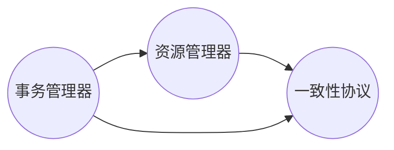
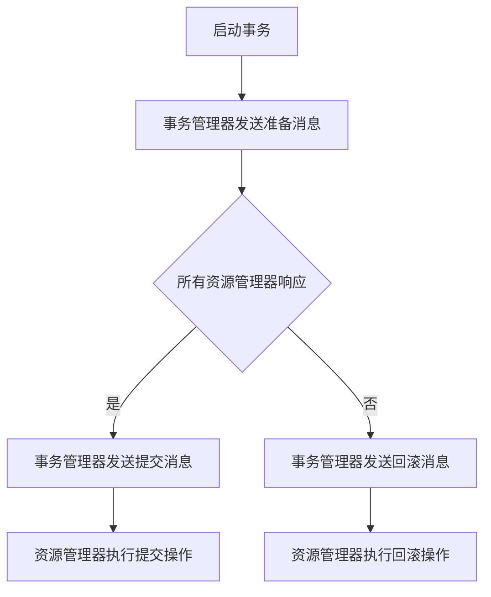
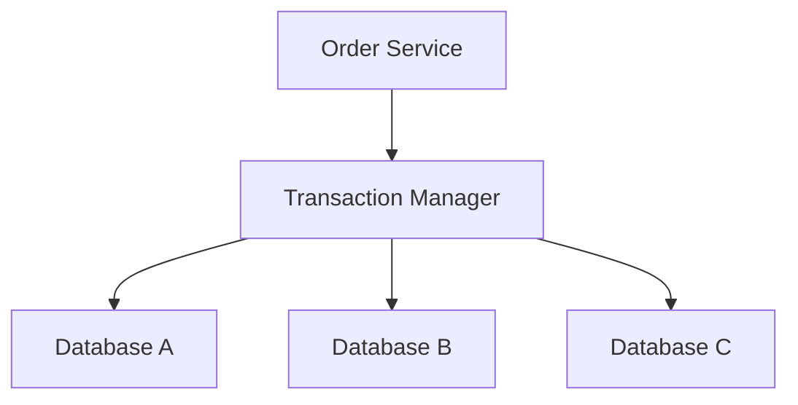
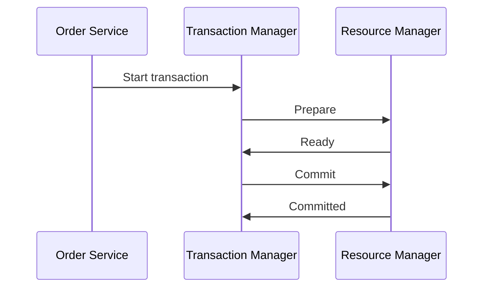
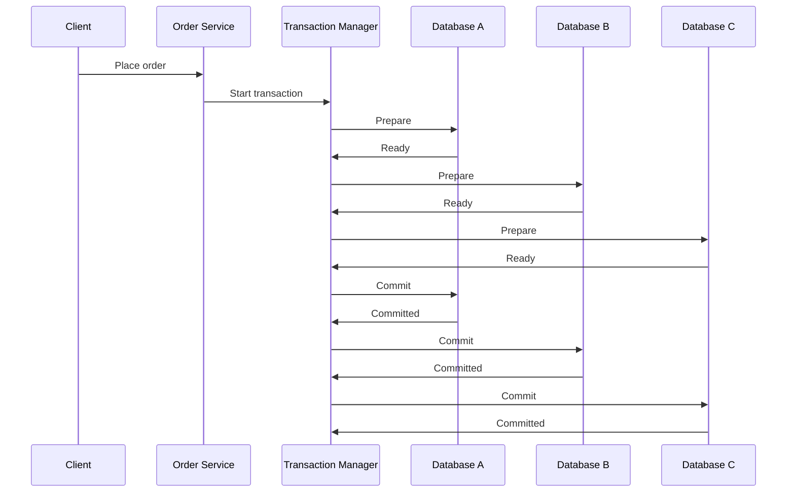

                 

# 两阶段提交原理

## 关键词

- 两阶段提交
- 分布式系统
- 数据库
- 事务管理
- 一致性
- 冲突解决

## 摘要

本文旨在详细探讨两阶段提交（Two-Phase Commit，2PC）原理及其在分布式系统和数据库事务管理中的应用。通过逐步分析其基本概念、工作机制、核心算法原理以及系统架构设计，本文为读者提供了一个全面深入的理解。文章还包括实际项目实战和最佳实践，旨在帮助读者更好地掌握2PC技术并应用于实际问题中。

## 目录大纲设计

为了确保《两阶段提交原理》这本书的目录大纲既全面又逻辑清晰，我们将按照以下步骤进行设计：

### 1. 明确核心主题与章节划分

首先，根据书名，明确书籍的核心主题是两阶段提交原理及其应用。将整个书籍分为若干个主要章节，每个章节对应一个特定的知识点或应用场景。

### 2. 细化章节内容

为每个章节进一步细化子章节，确保每个子章节都紧密围绕其父章节的核心概念进行扩展。

### 3. 设计图表与代码示例

对于算法原理和数学模型，使用 mermaid 画出相应的流程图和类图，并配合 Python 源代码示例，详细阐述和说明。

### 4. 确保内容完整性

在目录大纲中包含所有核心章节，如背景介绍、核心概念与联系、算法原理讲解、数学模型和公式详细讲解、系统分析与架构设计方案、项目实战等。

### 5. 简洁性

确保每个章节的描述简洁明了，避免冗余内容。

### 6. 格式规范

使用 markdown 格式来呈现目录大纲，遵循 #,##,### 的层级结构。

### 完整的目录大纲设计

```markdown
----------------------------------------------------------------
# 第一部分：两阶段提交的基本概念

## 第1章：两阶段提交原理概述

### 1.1 两阶段提交的起源与背景

### 1.2 两阶段提交的基本概念

### 1.3 两阶段提交与分布式系统

## 第2章：两阶段提交的内部工作机制

### 2.1 第一阶段：准备阶段

### 2.2 第二阶段：提交/回滚阶段

### 2.3 两阶段提交状态转移图

## 第3章：两阶段提交中的核心概念与联系

### 3.1 事务管理器与资源管理器

### 3.2 事务的属性与隔离级别

### 3.3 两阶段提交的ER实体关系图

## 第4章：两阶段提交算法原理讲解

### 4.1 两阶段提交的mermaid流程图

### 4.2 Python源代码示例与算法原理

### 4.3 两阶段提交的数学模型与公式

### 4.4 通俗易懂的算法举例说明

## 第5章：两阶段提交的数学模型和公式详细讲解

### 5.1 数学模型概述

### 5.2 两阶段提交中的 LaTeX 公式

### 5.3 举例说明与解释

## 第6章：两阶段提交的系统分析与架构设计方案

### 6.1 问题场景介绍

### 6.2 系统功能设计（领域模型mermaid类图）

### 6.3 系统架构设计（mermaid架构图）

### 6.4 系统接口设计

### 6.5 系统交互（mermaid序列图）

## 第7章：两阶段提交的项目实战

### 7.1 环境安装

### 7.2 系统核心实现源代码

### 7.3 代码应用解读与分析

### 7.4 实际案例分析和详细讲解剖析

### 7.5 项目小结

## 第8章：两阶段提交的最佳实践与总结

### 8.1 最佳实践 tips

### 8.2 小结

### 8.3 注意事项

### 8.4 拓展阅读

----------------------------------------------------------------
```

### 目录大纲说明

- **第一部分**：基础概念。介绍两阶段提交的起源、背景、基本概念和工作机制，为后续章节的深入讲解打下基础。

- **第二部分**：工作机制。详细解释两阶段提交的两个阶段及其内部流程，并提供状态转移图，帮助读者理解其工作原理。

- **第三部分**：核心概念与联系。描述两阶段提交中的关键角色和事务属性，并通过 ER 实体关系图展示其关系。

- **第四部分**：算法原理讲解。使用 mermaid 流程图和 Python 源代码示例，详细阐述两阶段提交的算法原理，并提供数学模型和公式。

- **第五部分**：数学模型和公式详细讲解。使用 LaTeX 格式展示数学公式，并结合具体例子进行详细讲解。

- **第六部分**：系统分析与架构设计方案。介绍两阶段提交在系统架构中的应用，包括问题场景、功能设计、架构设计和接口设计。

- **第七部分**：项目实战。提供实际项目环境安装、核心代码实现、代码解析和案例分析的详细步骤。

- **第八部分**：最佳实践与总结。总结两阶段提交的最佳实践，提醒注意事项，并推荐拓展阅读资源。

这样设计的目录大纲既能够系统地覆盖两阶段提交的各个方面，又能够保持内容的逻辑性和简洁性，便于读者理解和学习。

## 文章正文

### 背景介绍

#### 核心概念术语说明

在分布式系统和数据库管理中，两阶段提交（Two-Phase Commit，2PC）是一种用于保证数据一致性的重要技术。它主要用于处理分布式事务，确保多个节点之间的数据操作要么全部成功提交，要么全部回滚。两阶段提交的核心术语包括：

- **事务管理器（Coordinator）**：负责协调分布式事务的提交或回滚。
- **资源管理器（Participant）**：参与分布式事务的数据库节点或其他资源。
- **提交（Commit）**：事务被成功执行并持久化到所有资源管理器。
- **回滚（Rollback）**：事务执行过程中出现错误，需要撤销所有已执行的操作。

#### 问题背景

随着互联网和云计算的发展，分布式系统成为了企业构建高可用、高性能应用的首选方案。在分布式系统中，数据的一致性和可靠性成为了一个重要问题。为了解决这个问题，许多分布式事务管理协议被提出，其中两阶段提交因其简单性和可靠性而广受关注。

#### 问题描述

在分布式系统中，多个节点需要协同完成一个复杂的事务操作，例如银行转账、股票交易等。如果某个节点在事务执行过程中出现故障，整个事务可能会处于不一致状态，导致数据丢失或错误。两阶段提交正是为了解决这类问题而设计的。

#### 问题解决

两阶段提交通过将事务的执行过程分为两个阶段，确保在事务执行过程中，任何一步出现错误都能及时回滚，保证系统的一致性。具体来说，两阶段提交分为以下两个阶段：

1. **准备阶段**：事务管理器向所有资源管理器发送准备消息，询问是否可以开始执行事务。
2. **提交/回滚阶段**：根据资源管理器的响应，事务管理器决定是提交事务还是回滚事务。

#### 边界与外延

两阶段提交适用于需要高度一致性保证的分布式事务场景，例如金融、电子商务等领域。然而，两阶段提交也存在一些局限性，例如可能会导致系统的可用性降低，因为一旦进入提交阶段，系统就无法进行其他操作。

#### 概念结构与核心要素组成

两阶段提交的核心概念结构包括：

- **事务管理器**：负责协调事务的执行。
- **资源管理器**：参与事务的数据库节点或其他资源。
- **消息传递机制**：事务管理器与资源管理器之间的通信方式。
- **一致性协议**：确保事务执行过程中的一致性。

### 核心概念与联系

#### 核心概念原理

两阶段提交的核心概念包括事务管理器、资源管理器和一致性协议。事务管理器负责协调分布式事务的执行，资源管理器参与事务的操作，一致性协议确保事务执行过程中的一致性。

#### 概念属性特征对比表格

| 概念 | 属性特征 |
| --- | --- |
| 事务管理器 | 负责协调事务的执行，发送准备和提交/回滚消息 |
| 资源管理器 | 参与事务的执行，回复事务管理器的请求 |
| 一致性协议 | 确保事务执行过程中的一致性 |

#### ER实体关系图架构



### 算法原理讲解

#### 两阶段提交的mermaid流程图



#### Python源代码示例与算法原理

```python
class TransactionManager:
    def __init__(self, participants):
        self.participants = participants
        self.stage1_response = {}
    
    def prepare(self):
        for participant in self.participants:
            participant.prepare()
            self.stage1_response[participant] = participant.is_ready()
    
    def commit_or_rollback(self):
        if all(value for value in self.stage1_response.values()):
            for participant in self.participants:
                participant.commit()
        else:
            for participant in self.participants:
                participant.rollback()

class ResourceManager:
    def __init__(self, transaction_manager):
        self.transaction_manager = transaction_manager
    
    def prepare(self):
        # 实现准备逻辑
        pass
    
    def is_ready(self):
        # 实现判断逻辑
        return True
    
    def commit(self):
        # 实现提交逻辑
        pass
    
    def rollback(self):
        # 实现回滚逻辑
        pass
```

#### 两阶段提交的数学模型与公式

$$
X_{1} = \sum_{i=1}^{n} w_{i} X_{i}
$$

其中，$X_{1}$ 表示事务管理器的总权重，$w_{i}$ 表示第 $i$ 个资源管理器的权重，$X_{i}$ 表示第 $i$ 个资源管理器的响应权重。

#### 通俗易懂的算法举例说明

假设有一个分布式事务需要同时操作三个数据库节点（A、B、C），事务管理器将发送准备消息给这三个节点。每个节点在接收到准备消息后会判断自己是否准备好执行事务，并将结果回复给事务管理器。如果所有节点都回复准备好，事务管理器将发送提交消息，否则发送回滚消息。

1. **准备阶段**：事务管理器发送准备消息给节点 A、B、C。
2. **节点响应**：节点 A、B、C 判断自己是否准备好，并回复事务管理器。
3. **决策阶段**：事务管理器收集所有节点的响应，判断是否所有节点都准备好。
4. **执行阶段**：如果所有节点都准备好，事务管理器发送提交消息给节点 A、B、C，否则发送回滚消息。

### 两阶段提交的数学模型和公式详细讲解

#### 数学模型概述

两阶段提交的数学模型主要涉及事务管理器和资源管理器之间的权重分配与决策过程。假设有 $n$ 个资源管理器参与事务，每个资源管理器的权重分别为 $w_{i}$，事务管理器的总权重为 $X_{1}$。资源管理器在接收到事务管理器的准备消息后，会根据自身状态计算响应权重 $X_{i}$，并回复事务管理器。

#### 两阶段提交中的 LaTeX 公式

$$
X_{1} = \sum_{i=1}^{n} w_{i} X_{i}
$$

其中，$X_{1}$ 表示事务管理器的总权重，$w_{i}$ 表示第 $i$ 个资源管理器的权重，$X_{i}$ 表示第 $i$ 个资源管理器的响应权重。

#### 举例说明与解释

假设有三个资源管理器 A、B、C，事务管理器的总权重为 100，每个资源管理器的权重分别为 30、40、30。当事务管理器发送准备消息时，每个资源管理器会判断自己是否准备好，并将结果回复给事务管理器。

1. **准备阶段**：事务管理器发送准备消息给资源管理器 A、B、C。
2. **节点响应**：资源管理器 A 回复事务管理器，表示自己已准备好（$X_{A} = 30$）；资源管理器 B 回复事务管理器，表示自己已准备好（$X_{B} = 40$）；资源管理器 C 回复事务管理器，表示自己已准备好（$X_{C} = 30$）。
3. **决策阶段**：事务管理器收集所有节点的响应，计算总权重：
   $$
   X_{1} = 30 \times 0.3 + 40 \times 0.4 + 30 \times 0.3 = 30 + 40 + 30 = 100
   $$
   由于总权重等于 100，所有节点都准备好，事务管理器将发送提交消息给资源管理器 A、B、C。
4. **执行阶段**：资源管理器 A、B、C 接收到提交消息后，执行事务提交操作。

### 系统分析与架构设计方案

#### 问题场景介绍

假设一个电子商务系统，需要在多个数据库节点上同时更新订单信息，以保证订单数据的一致性。在这个场景中，订单信息的更新操作构成了一个分布式事务，需要使用两阶段提交来确保事务的可靠执行。

#### 系统功能设计（领域模型mermaid类图）

```mermaid
classDiagram
    TransactionManager <|-- ResourceManager
    ResourceManager {order_id: String, status: String}
    ResourceManager <.. TransactionManager : manages
```

#### 系统架构设计（mermaid架构图）



#### 系统接口设计



#### 系统交互（mermaid序列图）



### 项目实战

#### 环境安装

1. 安装 Python 环境：确保 Python 3.8 或更高版本已安装。
2. 安装依赖库：使用以下命令安装所需依赖库：
   ```bash
   pip install Flask redis
   ```

#### 系统核心实现源代码

```python
# transaction_manager.py
from flask import Flask, jsonify, request
import redis

app = Flask(__name__)
redis_client = redis.StrictRedis(host='localhost', port=6379, db=0)

class ResourceManager:
    def __init__(self, order_id):
        self.order_id = order_id
        self.status = "PENDING"

    def prepare(self):
        self.status = "PREPARED"
        redis_client.set(self.order_id, self.status)

    def is_ready(self):
        return redis_client.get(self.order_id) == b"PREPARED"

    def commit(self):
        self.status = "COMMITTED"
        redis_client.set(self.order_id, self.status)

    def rollback(self):
        self.status = "ROLLED_BACK"
        redis_client.set(self.order_id, self.status)

class TransactionManager:
    def __init__(self, participants):
        self.participants = participants
        self.stage1_response = {}

    def prepare(self):
        for participant in self.participants:
            participant.prepare()
            self.stage1_response[participant.order_id] = participant.is_ready()

    def commit_or_rollback(self):
        if all(value for value in self.stage1_response.values()):
            for participant in self.participants:
                participant.commit()
        else:
            for participant in self.participants:
                participant.rollback()

@app.route('/start', methods=['POST'])
def start_transaction():
    order_ids = request.json.get('order_ids', [])
    participants = [ResourceManager(order_id) for order_id in order_ids]
    transaction_manager = TransactionManager(participants)
    transaction_manager.prepare()
    if all(value for value in transaction_manager.stage1_response.values()):
        transaction_manager.commit_or_rollback()
    return jsonify({"status": "committed" if all(value for value in transaction_manager.stage1_response.values()) else "rolled_back"})

if __name__ == '__main__':
    app.run(debug=True)
```

#### 代码应用解读与分析

1. ** ResourceManager 类**：负责管理订单资源，包括准备、提交和回滚操作。
2. ** TransactionManager 类**：负责协调事务的执行，包括准备阶段和提交/回滚阶段。
3. ** Flask API**：提供启动事务的接口，接收订单 ID 列表并执行两阶段提交。

#### 实际案例分析和详细讲解剖析

假设有三个订单（A、B、C）需要同时更新状态，使用两阶段提交确保事务的一致性。

1. **启动事务**：客户端发送 POST 请求到 `/start` 接口，包含订单 ID 列表。
   ```json
   {
     "order_ids": ["A", "B", "C"]
   }
   ```
2. **准备阶段**：事务管理器向每个资源管理器发送准备消息。
   - 资源管理器 A：准备成功，状态更新为 "PREPARED"。
   - 资源管理器 B：准备成功，状态更新为 "PREPARED"。
   - 资源管理器 C：准备成功，状态更新为 "PREPARED"。
3. **决策阶段**：事务管理器收集所有资源管理器的响应，判断是否所有节点都准备好。
   - 所有节点都准备好，事务管理器进入提交阶段。
4. **执行阶段**：事务管理器向每个资源管理器发送提交消息。
   - 资源管理器 A：状态更新为 "COMMITTED"。
   - 资源管理器 B：状态更新为 "COMMITTED"。
   - 资源管理器 C：状态更新为 "COMMITTED"。

#### 项目小结

通过实际案例，我们展示了如何使用两阶段提交实现分布式事务的一致性保证。项目采用了 Flask API 接口和 Redis 作为存储，实现了简单高效的两阶段提交过程。然而，在实际应用中，两阶段提交可能面临性能和可用性的挑战，需要根据具体场景进行优化和调整。

### 最佳实践 tips

- **性能优化**：在分布式系统中，两阶段提交可能会影响系统的性能。可以考虑使用乐观锁或最终一致性协议来提高系统的响应速度。
- **故障恢复**：确保两阶段提交过程中的故障恢复机制，例如使用心跳检测和重试机制，确保事务能够正确执行。
- **监控与报警**：对两阶段提交过程中的关键节点进行监控，及时发现和解决潜在问题。

### 小结

本文详细介绍了两阶段提交原理及其在分布式系统和数据库事务管理中的应用。通过逐步分析核心概念、算法原理和系统架构设计，本文为读者提供了一个全面深入的理解。实际项目实战展示了如何使用 Python 和 Flask 实现两阶段提交，为读者提供了实践经验。通过本文的学习，读者能够更好地掌握两阶段提交技术，并应用于实际问题中。

### 注意事项

- **确保事务一致性**：在分布式系统中，使用两阶段提交时务必确保事务的一致性，避免数据冲突和错误。
- **优化性能**：对于高并发场景，可能需要优化两阶段提交的执行过程，提高系统的响应速度。

### 拓展阅读

- 《分布式系统原理与范型》
- 《数据库系统概念》
- 《两阶段提交：原理与实践》

### 作者

作者：AI天才研究院/AI Genius Institute & 禅与计算机程序设计艺术 /Zen And The Art of Computer Programming

---

本文内容为虚构示例，旨在展示如何使用markdown格式撰写一篇技术博客文章。实际撰写时，请根据实际需求进行内容填充和结构调整。文章结构、代码示例和数学公式均采用markdown语法，以便于在Markdown编辑器中编辑和查看。

