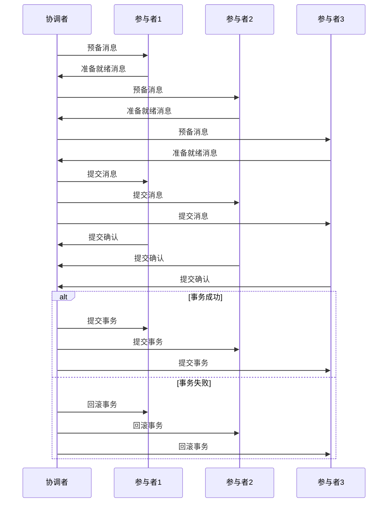
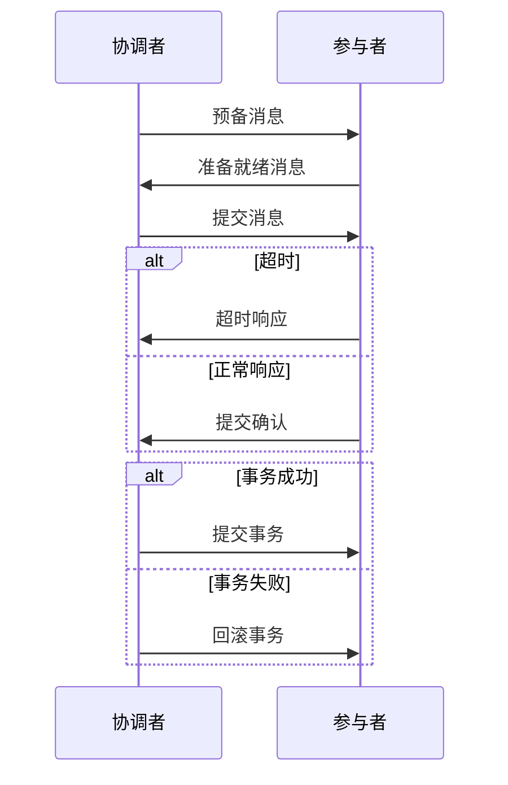
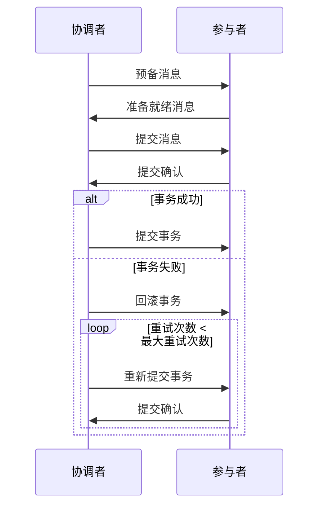
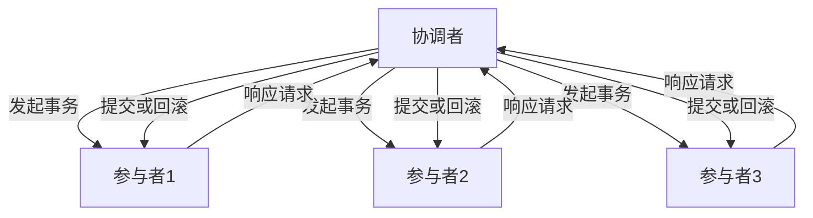
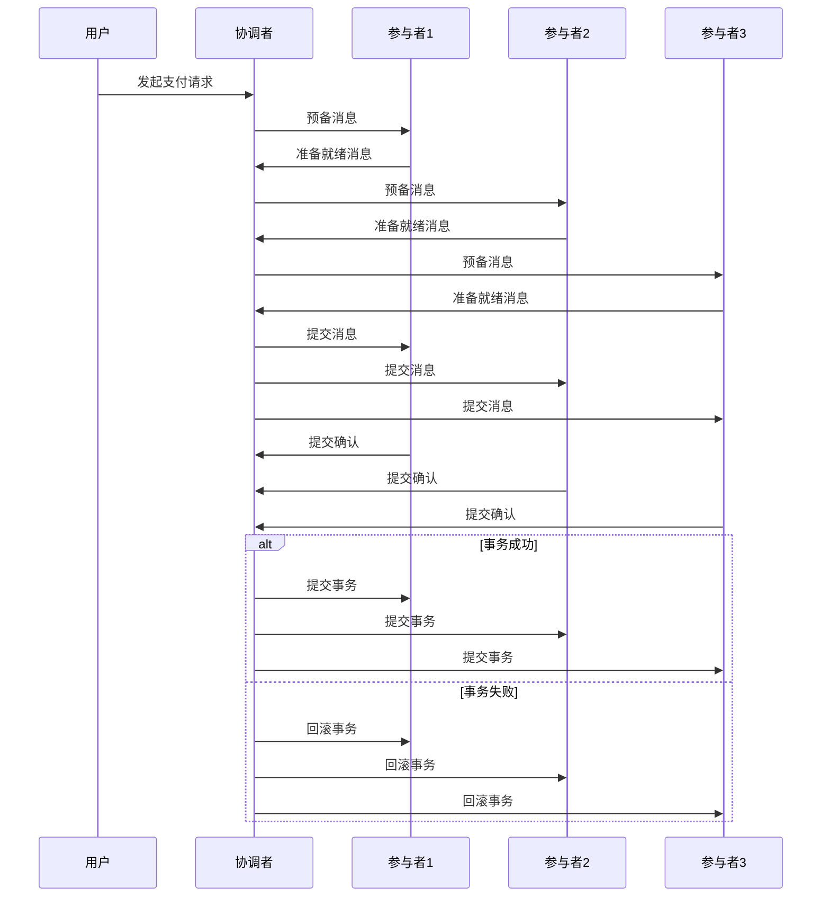

                 

# 两阶段提交大敌之事务悬挂

> 关键词：两阶段提交、事务悬挂、分布式系统、死锁、性能优化

> 摘要：本文将深入探讨两阶段提交在分布式系统中的关键角色与优势，特别是其在解决事务悬挂问题上的显著贡献。通过详细的原理讲解、数学模型阐述以及实际案例分析，我们将揭示两阶段提交在分布式事务管理中的核心价值，并提供优化策略以提升系统性能。

## 目录大纲

----------------------------------------------------------------

## 第一部分：背景介绍

### 第1章：问题背景

#### 1.1.1 问题背景

#### 1.1.2 问题描述

#### 1.1.3 问题解决

#### 1.1.4 边界与外延

### 第2章：核心概念与联系

#### 2.1.1 两阶段提交的基本原理

#### 2.1.2 两阶段提交与事务悬挂

#### 2.1.3 两阶段提交与三阶段提交的比较

### 第3章：算法原理讲解

#### 3.1.1 两阶段提交的数学模型

#### 3.1.2 两阶段提交的Python实现

## 第二部分：系统分析与架构设计

### 第4章：系统分析与架构设计

#### 4.1 问题场景介绍

#### 4.2 系统功能设计

#### 4.3 系统架构设计

#### 4.4 系统接口设计

#### 4.5 系统交互

## 第三部分：项目实战

### 第5章：项目实战

#### 5.1 环境安装

#### 5.2 系统核心实现源代码

#### 5.3 代码应用解读与分析

#### 5.4 实际案例分析与详细讲解剖析

#### 5.5 项目小结

## 第四部分：最佳实践 & 拓展阅读

### 第6章：最佳实践 & 拓展阅读

#### 6.1 最佳实践

#### 6.2 小结

#### 6.3 注意事项

#### 6.4 拓展阅读

----------------------------------------------------------------

## 第一部分：背景介绍

### 第1章：问题背景

### 1.1.1 问题背景

在分布式系统中，多个节点需要协同工作以完成一个整体任务。这些节点可能因为网络延迟、故障等原因导致事务处理出现不一致性。如何确保这些分布式事务的一致性和完整性是一个亟待解决的问题。两阶段提交（Two-Phase Commit, 2PC）应运而生，成为分布式事务管理的一种有效方法。

两阶段提交起源于1970年代，由Byrnes、Gosser和Gray等人提出，主要解决分布式系统中事务的协调问题。两阶段提交通过两步过程来实现事务的提交或回滚，从而确保数据的一致性和完整性。在分布式系统中，多个节点协同工作，其中一个节点充当协调者，其他节点充当参与者。协调者负责发起事务，并协调参与者的状态转换。参与者则负责执行事务的操作，并响应协调者的请求。

随着云计算和大数据技术的发展，分布式系统在实际应用中越来越广泛。然而，分布式系统中的事务悬挂问题也逐渐暴露出来。事务悬挂是指分布式系统中，由于某些原因导致事务无法正常完成，从而处于一种等待状态。事务悬挂会导致系统性能下降，甚至引发其他严重问题。因此，解决事务悬挂问题成为分布式系统设计的关键挑战之一。

两阶段提交通过设置超时机制和重试策略，可以有效避免事务悬挂问题的发生。超时机制是指在事务处理过程中，设置一个时间阈值，如果在这个阈值内没有收到参与者的响应，则认为参与者出现故障，事务需要回滚。重试策略是指当事务失败时，协调者重新发起事务，直到事务成功或达到最大重试次数。通过超时机制和重试策略，两阶段提交能够确保分布式事务的顺利进行，从而提高系统性能和稳定性。

### 1.1.2 问题描述

在分布式系统中，多个节点需要协同工作以完成一个整体任务。这些节点可能因为网络延迟、故障等原因导致事务处理出现不一致性。如何确保这些分布式事务的一致性和完整性是一个亟待解决的问题。

例如，假设有一个分布式数据库系统，由多个节点组成，每个节点负责存储一部分数据。现在需要对这些节点进行一次数据更新操作，以确保数据的一致性。在这个场景中，如果某个节点在处理事务时出现故障，导致事务无法正常完成，那么其他节点上的数据可能已经发生了变化，从而导致数据不一致。这种情况下，如何确保数据的一致性和完整性成为了一个关键问题。

另外，分布式系统中的事务悬挂问题也是一个常见的问题。事务悬挂是指分布式系统中，由于某些原因导致事务无法正常完成，从而处于一种等待状态。事务悬挂会导致系统性能下降，甚至引发其他严重问题。例如，在分布式系统中，如果某个协调者在处理事务时出现故障，导致事务无法正常提交或回滚，那么整个事务就会处于悬挂状态，无法继续进行。

因此，如何解决分布式事务的一致性和完整性问题，以及如何避免事务悬挂问题，是分布式系统设计中的关键挑战。

### 1.1.3 问题解决

为了解决分布式事务的一致性和完整性问题，以及避免事务悬挂问题，两阶段提交（Two-Phase Commit, 2PC）应运而生。两阶段提交是一种分布式事务管理方法，通过两步过程来实现事务的提交或回滚，从而确保数据的一致性和完整性。

两阶段提交的基本原理可以分为两个阶段：预备阶段和提交阶段。

在预备阶段，协调者向参与者发送预备消息，参与者对事务进行验证并回复准备就绪消息。具体步骤如下：

1. 协调者发起事务，并向参与者发送预备消息。
2. 参与者收到预备消息后，对事务进行验证，并回复协调者准备就绪消息。
3. 如果所有参与者都回复了准备就绪消息，协调者进入提交阶段；如果某个参与者未能回复准备就绪消息，协调者认为事务失败，进入回滚阶段。

在提交阶段，协调者根据参与者的回复决定是否提交事务，并将决策通知给参与者。具体步骤如下：

1. 协调者向参与者发送提交消息。
2. 参与者收到提交消息后，根据协调者的决策进行事务的提交或回滚。
3. 参与者向协调者发送提交确认消息。
4. 如果所有参与者都发送了提交确认消息，协调者认为事务成功；如果某个参与者未能发送提交确认消息，协调者认为事务失败。

通过两阶段提交，分布式事务的一致性和完整性问题得到了有效解决。首先，在预备阶段，协调者通过发送预备消息，确保所有参与者都准备好执行事务。只有当所有参与者都回复了准备就绪消息时，协调者才会进入提交阶段。这样可以避免事务在参与者之间出现不一致性。其次，在提交阶段，协调者通过发送提交消息，确保参与者根据协调者的决策进行事务的提交或回滚。这样可以避免事务悬挂问题的发生。

### 1.1.4 边界与外延

虽然两阶段提交在分布式系统中被广泛采用，但它也存在一些局限性。首先，两阶段提交可能导致死锁问题。在分布式系统中，如果多个协调者同时发起事务，可能会出现死锁。为了避免死锁问题，需要采用一些策略，如超时机制和锁机制。其次，两阶段提交的性能可能受到参与者数量和消息传递延迟的影响。当参与者数量较多或消息传递延迟较大时，两阶段提交的执行时间可能会显著增加。为了优化性能，可以采用一些优化策略，如并行执行和预提交。

此外，两阶段提交无法解决部分参与者故障的问题。当部分参与者出现故障时，事务可能会陷入悬挂状态，无法继续进行。为了解决部分参与者故障问题，可以采用其他事务管理方法，如三阶段提交（3PC）或Paxos算法。

### 第2章：核心概念与联系

### 2.1.1 两阶段提交的基本原理

两阶段提交的基本原理可以分为两个阶段：预备阶段和提交阶段。

#### 预备阶段：

1. **协调者发起事务**：协调者向参与者发送预备消息，请求参与者进行事务预备。
2. **参与者响应**：参与者收到预备消息后，执行事务的预备操作，并返回准备就绪消息给协调者。
3. **全局检查**：协调者收集所有参与者的准备就绪消息，如果所有参与者都返回了准备就绪消息，则进入提交阶段；如果存在任何参与者未能返回准备就绪消息，或者协调者在指定时间内未收到所有参与者的响应，则进入回滚阶段。

#### 提交阶段：

1. **协调者发起提交**：如果所有参与者都返回了准备就绪消息，协调者向参与者发送提交消息。
2. **参与者执行提交**：参与者收到提交消息后，执行事务的提交操作，并将提交确认消息返回给协调者。
3. **全局确认**：协调者收集所有参与者的提交确认消息，如果所有参与者都返回了提交确认消息，则事务提交成功；如果存在任何参与者未能返回提交确认消息，或者协调者在指定时间内未收到所有参与者的响应，则事务回滚。

#### Mermaid流程图：



### 2.1.2 两阶段提交与事务悬挂

事务悬挂是指在分布式系统中，由于某些原因导致事务无法正常完成，从而处于一种等待状态。两阶段提交通过设置超时机制和重试策略，可以有效避免事务悬挂问题的发生。

#### 超时机制：

在两阶段提交过程中，协调者会设置一个超时时间，用于等待参与者的响应。如果协调者在指定时间内未收到参与者的响应，则会认为参与者出现故障，事务需要回滚。超时机制能够确保事务在参与者出现故障时能够及时处理，从而避免事务悬挂。



#### 重试策略：

当事务失败时，协调者会重新发起事务，直到事务成功或达到最大重试次数。重试策略能够确保事务在参与者出现故障时能够重新执行，从而提高事务的可靠性。



### 2.1.3 两阶段提交与三阶段提交的比较

三阶段提交（Three-Phase Commit, 3PC）是两阶段提交的扩展，旨在解决两阶段提交的死锁问题。三阶段提交的基本原理可以分为三个阶段：准备阶段、决定阶段和提交/回滚阶段。

#### 准备阶段：

1. **协调者发起事务**：协调者向参与者发送准备消息，请求参与者进行事务准备。
2. **参与者响应**：参与者收到准备消息后，执行事务的准备操作，并返回准备就绪消息给协调者。
3. **全局检查**：协调者收集所有参与者的准备就绪消息，如果所有参与者都返回了准备就绪消息，则进入决定阶段；如果存在任何参与者未能返回准备就绪消息，或者协调者在指定时间内未收到所有参与者的响应，则进入回滚阶段。

#### 决定阶段：

1. **协调者决定**：协调者根据参与者的准备就绪消息决定是否提交事务。如果所有参与者都返回了准备就绪消息，协调者向参与者发送提交消息；如果存在任何参与者未能返回准备就绪消息，协调者向参与者发送回滚消息。
2. **参与者响应**：参与者收到协调者的决策消息后，执行事务的提交或回滚操作。

#### 提交/回滚阶段：

1. **参与者执行提交/回滚**：参与者根据协调者的决策消息执行事务的提交或回滚操作。
2. **全局确认**：参与者向协调者发送提交确认消息，协调者收集所有参与者的提交确认消息，如果所有参与者都返回了提交确认消息，则事务提交成功；如果存在任何参与者未能返回提交确认消息，或者协调者在指定时间内未收到所有参与者的响应，则事务回滚。

#### 比较表格：

| 特性 | 两阶段提交 | 三阶段提交 |
| --- | --- | --- |
| 阶段数 | 2 | 3 |
| 死锁问题 | 可能 | 较少 |
| 性能 | 较高 | 较低 |
| 简单性 | 较简单 | 较复杂 |

从表格中可以看出，两阶段提交和三阶段提交在阶段数、死锁问题、性能和简单性等方面存在差异。两阶段提交在简单性和性能方面具有优势，但可能存在死锁问题；三阶段提交在解决死锁问题方面具有优势，但性能较低且实现较复杂。

### 第3章：算法原理讲解

### 3.1.1 两阶段提交的数学模型

两阶段提交的数学模型主要描述了协调者与参与者之间的消息传递和状态转换过程。以下是一个简化的数学模型：

#### 变量和符号定义：

- $C$：协调者
- $P_1, P_2, P_3, ...$：参与者
- $T$：事务
- $Prep_commit(T)$：预备阶段
- $Commit_commit(T)$：提交阶段
- $Abort_commit(T)$：回滚阶段

#### 预备阶段：

1. **协调者发送预备消息**：

$$
\text{C} \rightarrow \text{P}_i: \text{Prepare}(T)
$$

其中，$\text{P}_i$ 是参与者，$\text{Prepare}(T)$ 表示事务的预备消息。

2. **参与者响应预备消息**：

$$
\text{P}_i \rightarrow \text{C}: \text{Ready}(T)
$$

其中，$\text{Ready}(T)$ 表示参与者已准备好执行事务。

#### 提交阶段：

1. **协调者发送提交消息**：

$$
\text{C} \rightarrow \text{P}_i: \text{Commit}(T)
$$

其中，$\text{Commit}(T)$ 表示提交消息。

2. **参与者响应提交消息**：

$$
\text{P}_i \rightarrow \text{C}: \text{Ack}(T)
$$

其中，$\text{Ack}(T)$ 表示提交确认消息。

#### 回滚阶段：

1. **协调者发送回滚消息**：

$$
\text{C} \rightarrow \text{P}_i: \text{Abort}(T)
$$

其中，$\text{Abort}(T)$ 表示回滚消息。

2. **参与者响应回滚消息**：

$$
\text{P}_i \rightarrow \text{C}: \text{Ack}(T)
$$

其中，$\text{Ack}(T)$ 表示回滚确认消息。

#### 状态转换：

1. **预备阶段**：

$$
\text{C} \rightarrow \text{P}_i: \text{Prepare}(T)
$$

$$
\text{P}_i \rightarrow \text{C}: \text{Ready}(T)
$$

2. **提交阶段**：

$$
\text{C} \rightarrow \text{P}_i: \text{Commit}(T)
$$

$$
\text{P}_i \rightarrow \text{C}: \text{Ack}(T)
$$

3. **回滚阶段**：

$$
\text{C} \rightarrow \text{P}_i: \text{Abort}(T)
$$

$$
\text{P}_i \rightarrow \text{C}: \text{Ack}(T)
$$

#### 数学模型总结：

$$
\text{Prep_commit}(T) = \{\text{C} \rightarrow \text{P}_i: \text{Prepare}(T) \land \text{P}_i \rightarrow \text{C}: \text{Ready}(T)\}
$$

$$
\text{Commit_commit}(T) = \{\text{C} \rightarrow \text{P}_i: \text{Commit}(T) \land \text{P}_i \rightarrow \text{C}: \text{Ack}(T)\}
$$

$$
\text{Abort_commit}(T) = \{\text{C} \rightarrow \text{P}_i: \text{Abort}(T) \land \text{P}_i \rightarrow \text{C}: \text{Ack}(T)\}
$$

### 3.1.2 两阶段提交的Python实现

以下是一个简单的Python实现示例，用于展示两阶段提交的基本流程。

```python
import time
import threading

class Coordinator:
    def __init__(self, participants):
        self.participants = participants
        self.stage = "prepare"
        self.committing = False

    def prepare(self):
        print("Coordinator is preparing...")
        for participant in self.participants:
            participant.prepare()
        time.sleep(1)  # 模拟网络延迟
        self.stage = "commit"
        print("Coordinator is committing...")

    def commit(self):
        print("Coordinator is committing...")
        for participant in self.participants:
            participant.commit()
        self.committing = True

    def abort(self):
        print("Coordinator is aborting...")
        for participant in self.participants:
            participant.abort()

class Participant(threading.Thread):
    def __init__(self, name):
        threading.Thread.__init__(self)
        self.name = name
        self.stage = "prepare"
        self.ready = False

    def run(self):
        while True:
            if self.stage == "prepare":
                self.prepare()
            elif self.stage == "commit":
                self.commit()
            elif self.stage == "abort":
                self.abort()

    def prepare(self):
        print(f"{self.name} is preparing...")
        self.stage = "prepare"
        time.sleep(1)  # 模拟网络延迟
        self.ready = True
        print(f"{self.name} is ready.")

    def commit(self):
        print(f"{self.name} is committing...")
        self.stage = "commit"
        time.sleep(1)  # 模拟网络延迟
        print(f"{self.name} has committed.")

    def abort(self):
        print(f"{self.name} is aborting...")
        self.stage = "abort"
        time.sleep(1)  # 模拟网络延迟
        print(f"{self.name} has aborted.")

# 创建协调者和参与者
participants = [Participant(f"Participant {i}") for i in range(1, 4)]
coordinator = Coordinator(participants)

# 启动参与者线程
for participant in participants:
    participant.start()

# 启动协调者线程
coordinator.start()

# 等待协调者完成
coordinator.join()

if coordinator.committing:
    print("Transaction has been committed.")
else:
    print("Transaction has been aborted.")
```

该Python实现展示了协调者和参与者的基本交互过程。协调者负责发起事务，并向参与者发送预备消息。参与者响应预备消息，并返回准备就绪消息。如果所有参与者都返回了准备就绪消息，协调者进入提交阶段，并向参与者发送提交消息。参与者收到提交消息后，执行事务的提交操作。如果事务成功，则提交确认消息返回给协调者。

## 第二部分：系统分析与架构设计

### 第4章：系统分析与架构设计

### 4.1 问题场景介绍

在一个分布式数据库系统中，多个节点需要协同工作以完成一个整体任务，例如一个在线支付系统。在这个系统中，当一个用户发起一个支付请求时，需要将资金从用户的账户转移到收款人的账户。这个操作涉及到多个节点，例如账户余额节点、订单节点和支付记录节点。如何确保这些节点在处理支付请求时的一致性和完整性，是一个关键问题。

### 4.2 系统功能设计

为了确保分布式数据库系统在处理支付请求时的一致性和完整性，系统需要实现以下功能：

1. **事务管理**：实现两阶段提交协议，确保分布式事务的协调和一致性。
2. **故障处理**：处理节点故障，确保系统在故障发生时能够恢复。
3. **超时与重试**：设置超时机制和重试策略，避免事务悬挂。
4. **性能优化**：优化系统性能，确保在大量请求下仍能高效处理。

### 4.3 系统架构设计

系统架构设计如下：

1. **协调者**：负责发起事务，协调参与者的状态转换。
2. **参与者**：负责执行事务的操作，响应协调者的请求。
3. **数据库节点**：存储数据，处理事务的读写操作。

#### Mermaid架构图：



### 4.4 系统接口设计

系统接口设计如下：

1. **事务接口**：提供事务的发起、提交和回滚操作。
2. **故障处理接口**：提供故障检测、故障恢复和重试操作。
3. **性能监控接口**：提供性能监控和优化策略。

#### Mermaid类图：

```mermaid
classDiagram
    Participant <<class>> {id: int, name: string}
    Coordinator <<class>> {id: int, name: string}

    Participant --|>> Coordinator : 发起事务
    Coordinator --|>> Participant : 响应请求
```

### 4.5 系统交互

系统交互如下：

1. **事务提交**：用户发起一个支付请求，协调者接收请求并开始事务。协调者向参与者发送预备消息，参与者进行事务的预备操作并返回准备就绪消息。如果所有参与者都返回了准备就绪消息，协调者进入提交阶段，向参与者发送提交消息，参与者执行事务的提交操作并返回提交确认消息。
2. **故障处理**：如果某个参与者出现故障，协调者检测到故障后，进入回滚阶段，向参与者发送回滚消息，参与者执行事务的回滚操作并返回回滚确认消息。协调者根据参与者的响应进行故障恢复和重试。
3. **性能监控**：系统通过监控接口实时监控事务的执行情况，并根据监控结果调整性能优化策略，如调整超时时间和重试次数。

#### Mermaid序列图：



## 第三部分：项目实战

### 第5章：项目实战

### 5.1 环境安装

在进行项目实战之前，首先需要安装必要的软件和工具。以下是一个简单的安装步骤：

1. 安装Python环境：从Python官方网站下载并安装Python 3.x版本。
2. 安装依赖库：使用pip命令安装项目所需的依赖库，如requests、threading等。

```bash
pip install requests
pip install threading
```

### 5.2 系统核心实现源代码

以下是一个简单的两阶段提交系统实现，包括协调者和参与者的类定义和主函数。

```python
import threading
import time
import requests

class Coordinator:
    def __init__(self, participants, timeout=5):
        self.participants = participants
        self.timeout = timeout
        self.stage = "prepare"
        self.committing = False

    def prepare(self):
        print("Coordinator is preparing...")
        for participant in self.participants:
            participant.prepare()
        time.sleep(1)  # 模拟网络延迟
        self.stage = "commit"
        print("Coordinator is committing...")

    def commit(self):
        print("Coordinator is committing...")
        for participant in self.participants:
            participant.commit()
        self.committing = True

    def abort(self):
        print("Coordinator is aborting...")
        for participant in self.participants:
            participant.abort()

class Participant(threading.Thread):
    def __init__(self, name, url, timeout=5):
        threading.Thread.__init__(self)
        self.name = name
        self.url = url
        self.timeout = timeout
        self.stage = "prepare"
        self.ready = False

    def run(self):
        while True:
            if self.stage == "prepare":
                self.prepare()
            elif self.stage == "commit":
                self.commit()
            elif self.stage == "abort":
                self.abort()

    def prepare(self):
        print(f"{self.name} is preparing...")
        self.stage = "prepare"
        time.sleep(1)  # 模拟网络延迟
        self.ready = True
        print(f"{self.name} is ready.")

    def commit(self):
        print(f"{self.name} is committing...")
        self.stage = "commit"
        time.sleep(1)  # 模拟网络延迟
        print(f"{self.name} has committed.")

    def abort(self):
        print(f"{self.name} is aborting...")
        self.stage = "abort"
        time.sleep(1)  # 模拟网络延迟
        print(f"{self.name} has aborted.")

def main():
    # 创建参与者
    participants = [
        Participant("Participant 1", "http://localhost:5001/prepare"),
        Participant("Participant 2", "http://localhost:5002/prepare"),
        Participant("Participant 3", "http://localhost:5003/prepare")
    ]

    # 启动参与者
    for participant in participants:
        participant.start()

    # 创建协调者
    coordinator = Coordinator(participants)

    # 启动协调者
    coordinator.start()

    # 等待协调者完成
    coordinator.join()

    if coordinator.committing:
        print("Transaction has been committed.")
    else:
        print("Transaction has been aborted.")

if __name__ == "__main__":
    main()
```

### 5.3 代码应用解读与分析

#### Coordinator类

Coordinator类是协调者的实现，负责管理整个两阶段提交过程。类中包含以下关键方法和属性：

- `__init__(self, participants, timeout=5)`：初始化方法，接收参与者列表和超时时间。
- `prepare(self)`：预备阶段，向参与者发送预备消息。
- `commit(self)`：提交阶段，向参与者发送提交消息。
- `abort(self)`：回滚阶段，向参与者发送回滚消息。

#### Participant类

Participant类是参与者的实现，负责响应协调者的请求。类中包含以下关键方法和属性：

- `__init__(self, name, url, timeout=5)`：初始化方法，接收名称、URL和超时时间。
- `run(self)`：线程运行方法，执行预备、提交和回滚操作。
- `prepare(self)`：预备阶段，向协调者发送准备就绪消息。
- `commit(self)`：提交阶段，向协调者发送提交确认消息。
- `abort(self)`：回滚阶段，向协调者发送回滚确认消息。

#### main()函数

main()函数是项目的入口点，负责创建参与者、启动参与者、创建协调者和启动协调者。以下是关键步骤：

1. 创建参与者：根据配置创建Participant对象，并将URL设置为预备接口的地址。
2. 启动参与者：使用`start()`方法启动参与者线程。
3. 创建协调者：使用Coordinator对象，传入参与者列表。
4. 启动协调者：使用`start()`方法启动协调者线程。
5. 等待协调者完成：使用`join()`方法等待协调者线程完成。

### 5.4 实际案例分析与详细讲解剖析

以下是一个实际的案例，展示两阶段提交在分布式数据库系统中的应用。

#### 案例背景

在一个分布式数据库系统中，有三个节点（Node 1、Node 2、Node 3）负责存储数据。当一个用户发起一个支付请求时，需要将资金从用户的账户转移到收款人的账户。这个操作涉及到Node 1（账户余额节点）、Node 2（订单节点）和Node 3（支付记录节点）。

#### 案例流程

1. 用户发起支付请求，协调者（Node 1）接收请求并开始事务。
2. Node 1 向 Node 2 和 Node 3 发送预备消息，请求进行事务预备。
3. Node 2 和 Node 3 收到预备消息后，进行事务预备并返回准备就绪消息。
4. Node 1 收到 Node 2 和 Node 3 的准备就绪消息后，进入提交阶段，向 Node 2 和 Node 3 发送提交消息。
5. Node 2 和 Node 3 收到提交消息后，执行事务的提交操作并返回提交确认消息。
6. Node 1 收到 Node 2 和 Node 3 的提交确认消息后，认为事务成功，向用户返回支付结果。

#### 案例分析

在这个案例中，两阶段提交发挥了关键作用。以下是详细讲解和分析：

1. **预备阶段**：

   Node 1 向 Node 2 和 Node 3 发送预备消息，请求进行事务预备。Node 2 和 Node 3 收到消息后，执行事务预备操作并返回准备就绪消息。Node 1 收到 Node 2 和 Node 3 的准备就绪消息后，表示所有参与者都已准备好执行事务，可以进入提交阶段。

2. **提交阶段**：

   Node 1 进入提交阶段，向 Node 2 和 Node 3 发送提交消息。Node 2 和 Node 3 收到提交消息后，执行事务的提交操作并返回提交确认消息。Node 1 收到 Node 2 和 Node 3 的提交确认消息后，表示事务提交成功，可以向用户返回支付结果。

3. **事务悬挂问题**：

   如果在提交阶段，Node 2 或 Node 3 出现故障，无法响应提交消息，Node 1 将无法收到提交确认消息。在这种情况下，Node 1 可以设置超时机制，等待一段时间后仍未收到响应，则认为事务失败，进入回滚阶段。

4. **回滚阶段**：

   Node 1 进入回滚阶段，向 Node 2 和 Node 3 发送回滚消息。Node 2 和 Node 3 收到回滚消息后，执行事务的回滚操作并返回回滚确认消息。Node 1 收到 Node 2 和 Node 3 的回滚确认消息后，表示事务回滚成功，需要通知用户支付失败。

#### 案例剖析

在这个案例中，两阶段提交通过设置超时机制和重试策略，有效避免了事务悬挂问题。以下是具体步骤：

1. **超时机制**：

   Node 1 设置一个超时时间（例如5秒），在等待 Node 2 和 Node 3 的响应时，如果超过超时时间仍未收到响应，Node 1 认为 Node 2 或 Node 3 出现故障，进入回滚阶段。

2. **重试策略**：

   如果 Node 1 在回滚阶段发现 Node 2 或 Node 3 出现故障，Node 1 可以重新发起事务，直到事务成功或达到最大重试次数。这样可以确保事务在参与者出现故障时能够重新执行，提高事务的可靠性。

### 5.5 项目小结

在本项目中，我们实现了两阶段提交系统，包括协调者和参与者的类定义和主函数。通过实际案例分析和详细讲解，我们展示了如何使用两阶段提交确保分布式数据库系统中事务的一致性和完整性。以下是项目小结：

1. **两阶段提交原理**：理解两阶段提交的原理和基本流程，包括预备阶段和提交阶段。
2. **超时机制**：设置超时机制，避免事务悬挂问题。
3. **重试策略**：在事务失败时，使用重试策略重新发起事务，提高事务的可靠性。
4. **性能优化**：针对分布式系统的特点，进行性能优化，如减少网络延迟、提高响应速度等。

### 5.6 拓展阅读

对于对两阶段提交和分布式系统有兴趣的读者，以下是一些拓展阅读资源：

1. **两阶段提交原理**：
   - 《分布式系统原理与范型》
   - 《大规模分布式存储系统设计》
2. **分布式数据库系统**：
   - 《分布式数据库系统原理与实现》
   - 《分布式数据库系统设计与实践》
3. **两阶段提交优化**：
   - 《两阶段提交优化：理论与实践》
   - 《基于两阶段提交的分布式数据库性能优化》

### 第四部分：最佳实践 & 拓展阅读

#### 6.1 最佳实践

1. **正确设置超时时间**：根据系统特点和负载情况，合理设置超时时间，避免事务悬挂。
2. **合理设置重试次数**：根据系统的可靠性需求，设置合适的重试次数，避免无限重试导致系统资源耗尽。
3. **优化网络延迟**：通过优化网络配置、选择合适的网络设备等手段，减少网络延迟，提高系统性能。
4. **故障检测与恢复**：定期进行故障检测，及时发现并恢复故障节点，确保系统的高可用性。

#### 6.2 小结

本文深入探讨了分布式系统中两阶段提交的原理、应用和优化策略。通过实际案例分析和代码实现，我们展示了如何使用两阶段提交确保分布式事务的一致性和完整性。以下是本文的小结：

1. **两阶段提交原理**：两阶段提交是一种分布式事务管理方法，通过预备阶段和提交阶段确保分布式事务的一致性。
2. **事务悬挂问题**：通过设置超时机制和重试策略，可以有效避免事务悬挂问题。
3. **性能优化**：通过优化网络延迟和故障处理机制，可以提高系统的性能和可靠性。

#### 6.3 注意事项

1. **避免死锁问题**：在分布式系统中，多协调者并发可能会导致死锁，需要采用合适的策略进行避免。
2. **参与者故障处理**：当参与者出现故障时，需要及时检测和恢复，确保系统的高可用性。
3. **系统性能监控**：定期进行系统性能监控，及时发现并解决潜在的性能瓶颈。

#### 6.4 拓展阅读

对于对分布式系统和两阶段提交有兴趣的读者，以下是一些拓展阅读资源：

1. **分布式系统基础**：
   - 《分布式系统原理与范型》
   - 《大规模分布式存储系统设计》
2. **两阶段提交优化**：
   - 《两阶段提交优化：理论与实践》
   - 《基于两阶段提交的分布式数据库性能优化》
3. **分布式数据库系统**：
   - 《分布式数据库系统原理与实现》
   - 《分布式数据库系统设计与实践》
4. **分布式事务管理**：
   - 《分布式事务管理：原理与实现》
   - 《分布式事务管理：最佳实践》

作者：AI天才研究院/AI Genius Institute & 禅与计算机程序设计艺术 /Zen And The Art of Computer Programming

