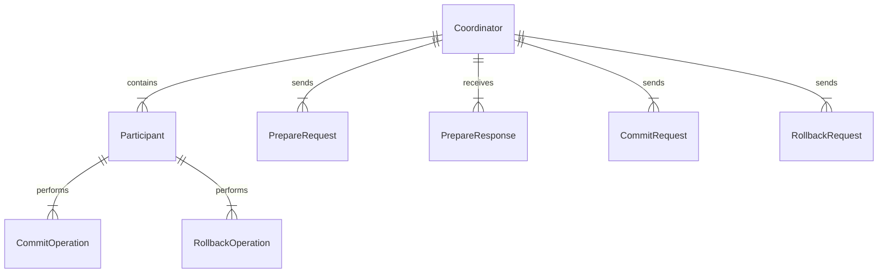
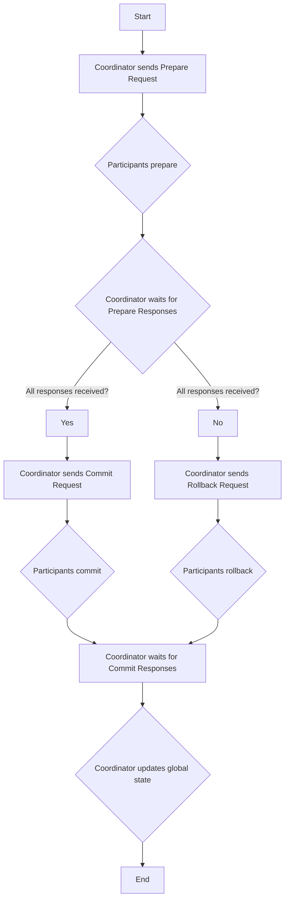
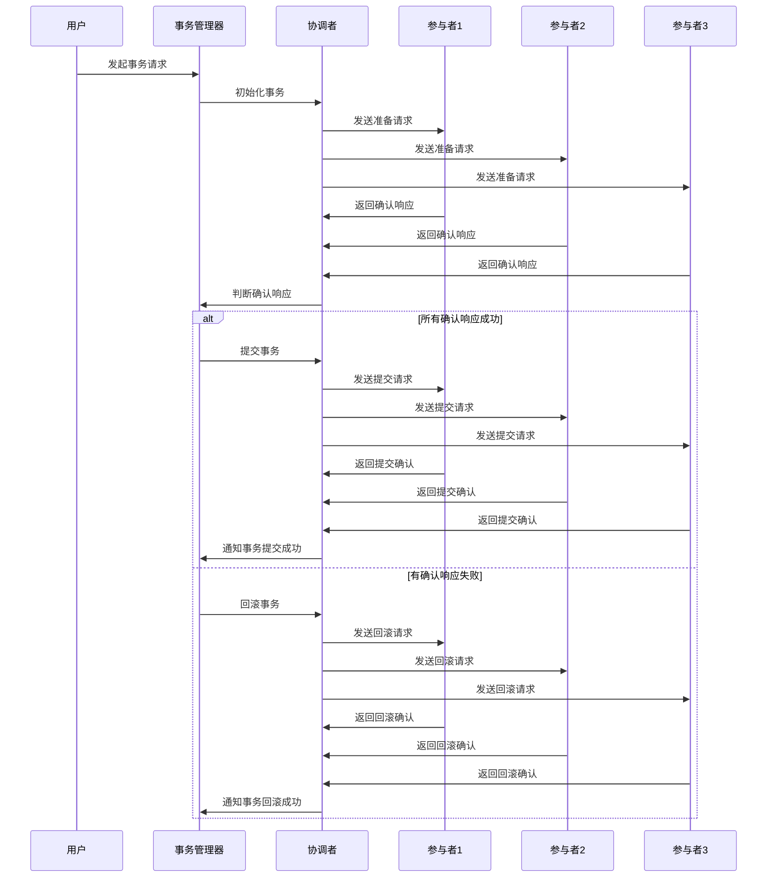

                 

### 文章标题：两阶段提交大敌之事务悬挂

关键词：两阶段提交、事务悬挂、并发控制、数据库一致性、分布式系统

摘要：本文深入探讨了两阶段提交（Two-Stage Commit，2PC）协议在分布式系统中的重要作用及其潜在问题——事务悬挂。通过对两阶段提交的背景、核心概念、工作流程、算法原理、数学模型、系统架构设计、实践应用和最佳实践的详细分析，揭示了事务悬挂的成因及其影响，并提出了有效的解决方案。文章旨在为读者提供关于两阶段提交协议的全面理解和实际操作指南。

----------------------------------------------------------------

## 引言

在分布式系统中，数据的一致性是一个至关重要的挑战。特别是在多节点环境下，如何确保事务的原子性和一致性，以避免数据竞争和冲突，成为了系统设计者必须面对的核心问题。两阶段提交（Two-Stage Commit，2PC）协议正是为了解决这一挑战而提出的一种分布式事务管理协议。

两阶段提交是一种用于实现分布式系统中事务一致性控制的协议。它的核心思想是，通过两个阶段来协调多个节点的操作，从而确保事务要么全部提交，要么全部回滚。尽管两阶段提交在实现一致性方面具有显著优势，但其复杂的协议流程和高开销也带来了潜在的问题，例如事务悬挂（Transaction Suspension）。本文将围绕两阶段提交及其相关话题进行深入探讨，重点分析事务悬挂的产生原因、影响以及解决方法。

文章结构如下：

1. **两阶段提交概述**：介绍两阶段提交的背景、定义及其核心概念。
2. **核心概念与联系**：详细解释两阶段提交的基本原理和核心概念，并通过实体关系图（ER Diagram）展示概念之间的联系。
3. **工作流程**：描述两阶段提交的工作流程，包括准备阶段、执行阶段、提交阶段和回滚阶段。
4. **算法原理与数学模型**：通过Mermaid流程图和Python代码展示算法原理，并使用LaTeX公式详细讲解数学模型。
5. **系统架构设计**：分析系统场景、功能设计、架构设计、接口设计以及系统交互序列图。
6. **实践与应用**：介绍环境安装、核心实现源代码、代码解读、案例分析及项目小结。
7. **最佳实践与注意事项**：总结最佳实践、注意事项，并提供拓展阅读资源。

通过以上结构的详细分析，读者可以全面理解两阶段提交协议的工作机制，掌握其核心概念，并能够应对分布式系统中可能遇到的事务悬挂问题。

### 1.1 问题背景

在分布式系统中，事务（Transaction）是指一组操作序列，这些操作要么全部成功执行，要么全部失败。事务的原子性（Atomicity）是数据库系统最基本的要求之一，它确保了事务操作在数据库中的执行是不可分割的。然而，在分布式环境中，由于涉及到多个节点，事务的原子性实现变得更加复杂。为了保证多个节点上的数据一致性，分布式系统需要一种有效的事务管理机制。

两阶段提交（Two-Stage Commit，2PC）协议正是为了解决分布式事务一致性问题而提出的一种解决方案。它通过一个协调者（Coordinator）和多个参与者（Participant）之间的协同工作，确保事务能够在所有节点上原子性地执行或回滚。具体来说，2PC协议将事务的提交过程分为两个阶段：准备阶段（Prepare Phase）和提交阶段（Commit Phase）。

然而，尽管2PC协议在实现分布式事务一致性方面具有显著优势，但其复杂的协议流程和高开销也带来了潜在的问题，其中之一就是事务悬挂（Transaction Suspension）。事务悬挂是指在2PC协议执行过程中，由于某些节点发生故障或延迟，导致事务无法正常提交或回滚，从而处于一个不确定的状态。事务悬挂不仅会降低系统的可用性，还可能导致数据不一致，给系统的稳定性带来威胁。

事务悬挂问题在分布式系统中尤为突出，因为分布式系统中的节点可能会由于网络延迟、硬件故障或软件错误等原因而出现不可预见的停机。一旦事务进入悬挂状态，系统将无法决定是继续执行事务还是回滚事务，从而陷入僵局。为了避免事务悬挂，系统设计者需要深入理解2PC协议的工作原理，并采取有效的措施来减少悬挂发生的概率。

总之，两阶段提交协议在分布式事务管理中扮演着关键角色，但其潜在的事务悬挂问题也需要引起充分的关注。本文将通过对2PC协议的详细分析，探讨事务悬挂的产生原因、影响以及解决方法，帮助读者更好地理解和应对分布式系统中的事务管理挑战。

### 1.2 两阶段提交的定义

两阶段提交（Two-Stage Commit，2PC）是一种用于分布式系统中的事务管理协议，旨在确保多个节点上的数据一致性。2PC协议通过协调者（Coordinator）和参与者（Participant）之间的协作，将事务的提交过程分为两个阶段：准备阶段（Prepare Phase）和提交阶段（Commit Phase）。

在2PC协议中，协调者是负责管理事务提交过程的核心节点，它负责向参与者发送请求并收集他们的反馈。参与者则是分布式系统中的各个节点，它们负责执行事务操作并响应协调者的请求。

**准备阶段（Prepare Phase）**：在这一阶段，协调者首先向所有参与者发送准备请求（Prepare Request），请求参与者对事务进行预备操作。参与者接收到请求后，会执行必要的读写操作，并将结果暂存。同时，参与者会向协调者发送确认响应（Prepare Response），表明它们已经准备好提交事务。如果协调者在规定的时间内收到了所有参与者的确认响应，那么它将进入下一阶段。

**提交阶段（Commit Phase）**：在准备阶段完成后，协调者会向所有参与者发送提交请求（Commit Request），要求它们执行事务的提交操作。此时，参与者将根据之前收到的准备请求结果，要么执行事务的提交操作，要么执行回滚操作。如果所有参与者都成功提交了事务，那么事务被认为执行成功。否则，如果协调者或任何参与者发生了故障，事务将执行回滚操作，以保证数据的一致性。

通过这两个阶段的协同工作，2PC协议能够确保分布式事务的原子性和一致性。然而，2PC协议也存在一些潜在的问题，其中之一就是事务悬挂。事务悬挂是指在2PC协议执行过程中，由于某些节点发生故障或延迟，导致事务无法正常提交或回滚，从而处于一个不确定的状态。为了避免事务悬挂，系统设计者需要深入理解2PC协议的工作原理，并采取有效的措施来减少悬挂发生的概率。

### 1.3 两阶段提交的边界与外延

在深入探讨两阶段提交（2PC）协议的边界与外延之前，我们首先需要明确其应用范围和限制。2PC协议作为一种分布式事务管理机制，主要应用于需要确保数据一致性的分布式系统环境中。以下是对2PC协议边界的详细说明：

**边界1：分布式系统环境**  
2PC协议适用于分布式系统，特别是那些需要跨多个节点执行事务的场景。分布式系统通常由多个节点组成，这些节点可能位于不同的地理位置，通过网络进行通信。由于分布式系统的复杂性，单点故障和通信延迟等问题不可避免，因此需要一种可靠的事务管理协议来保证数据一致性。2PC协议正是为了解决这类问题而设计的。

**边界2：事务复杂性**  
2PC协议主要适用于相对复杂的事务，其中涉及到多个节点上的操作。简单的事务，如单个节点的读取或写入操作，通常不需要如此复杂的事务管理机制。2PC协议的复杂性和开销相对较高，对于仅涉及单个节点的事务来说，可能不是最优的选择。

**边界3：故障容忍性**  
2PC协议具有一定的故障容忍性，能够应对协调者或参与者节点发生故障的情况。然而，其容错能力有限，特别是在面对大规模分布式系统时，故障处理和恢复可能变得非常复杂。因此，对于需要高故障容忍性的系统，可能需要结合其他机制，如分布式日志记录和状态机复制等，来提高系统的可靠性。

**外延1：多版本并发控制**  
2PC协议可以与其他并发控制机制结合使用，以提供更强的数据一致性保障。例如，在支持多版本并发控制（MVCC）的数据库系统中，2PC协议可以用于确保跨多个版本的事务一致性。通过结合MVCC机制，2PC协议能够更好地支持高并发事务处理。

**外延2：分布式锁管理**  
2PC协议还可以用于分布式锁管理，以实现跨多个节点的事务同步。在分布式系统中，多个节点可能需要访问共享资源，分布式锁可以确保这些资源的访问是互斥的。通过使用2PC协议，系统可以确保分布式锁的原子性和一致性。

**外延3：跨数据存储一致性**  
2PC协议不仅适用于关系型数据库，还可以应用于其他类型的数据存储系统，如NoSQL数据库和分布式缓存。通过在跨数据存储系统中实现2PC协议，可以确保数据的一致性和原子性，从而提供更可靠的数据访问。

综上所述，2PC协议在分布式系统中具有重要的应用价值，其边界主要涉及分布式系统环境、事务复杂性和故障容忍性。同时，通过与其他机制的结合，2PC协议的外延得到了扩展，能够更好地满足不同场景下的数据一致性需求。

### 1.4 两阶段提交的核心概念

要深入理解两阶段提交（2PC）协议，首先需要掌握其核心概念和术语。以下是2PC协议中的关键术语及其详细解释：

**1. 协调者（Coordinator）**  
协调者是在2PC协议中负责管理事务提交过程的节点。它向参与者发送请求，收集反馈，并决定事务是否提交或回滚。协调者是事务提交的核心，确保事务的原子性和一致性。协调者需要具备较高的稳定性和可靠性，以避免事务悬挂和系统崩溃。

**2. 参与者（Participant）**  
参与者是分布式系统中的各个节点，它们负责执行事务操作并响应协调者的请求。参与者接收到协调者的请求后，执行必要的读写操作，并将结果暂存。在准备阶段，参与者会向协调者发送确认响应，表明其已经准备好提交事务。在提交阶段，参与者根据协调者的提交请求执行相应的操作。

**3. 准备请求（Prepare Request）**  
准备请求是协调者向参与者发送的第一个请求，用于通知参与者进行事务的预备操作。参与者接收到准备请求后，会执行必要的读写操作，并将结果暂存。这一阶段的主要目的是确保所有参与者都已经准备好提交事务。

**4. 确认响应（Prepare Response）**  
确认响应是参与者向协调者发送的响应，表明其已经准备好提交事务。如果协调者在规定的时间内收到了所有参与者的确认响应，则进入提交阶段。否则，事务将进入回滚阶段。

**5. 提交请求（Commit Request）**  
提交请求是协调者在准备阶段完成后向参与者发送的请求，要求参与者执行事务的提交操作。参与者根据之前收到的准备请求结果，执行事务的提交操作。

**6. 回滚请求（Rollback Request）**  
回滚请求是协调者在某些参与者无法正常提交事务时发送的请求，要求参与者执行事务的回滚操作。回滚操作会撤销之前已经执行的操作，以确保事务的原子性。

**7. 提交操作（Commit Operation）**  
提交操作是参与者根据协调者的提交请求执行的操作，用于将事务的修改应用到数据库中。如果所有参与者都成功执行了提交操作，事务被认为执行成功。

**8. 回滚操作（Rollback Operation）**  
回滚操作是参与者根据协调者的回滚请求执行的操作，用于撤销之前已经执行的操作。回滚操作确保了事务的原子性，即使在某些参与者发生故障时，也能确保事务的一致性。

通过理解这些核心概念和术语，可以更好地把握2PC协议的工作原理和操作流程。这些概念构成了2PC协议的基础，为分布式系统中的事务管理提供了强有力的支持。

### 1.5 两阶段提交的核心概念属性特征对比表

为了更清晰地理解两阶段提交（2PC）协议的核心概念及其属性特征，我们制作了一张对比表格。以下是对表格中各项内容的详细解释：

| 核心概念 | 描述 | 属性特征 |
| :--: | :--: | :--: |
| 协调者（Coordinator） | 负责管理事务提交过程的节点，确保事务的原子性和一致性。 | - 稳定性高<br>- 可靠性高<br>- 中心化控制 |
| 参与者（Participant） | 分布式系统中的各个节点，负责执行事务操作并响应协调者的请求。 | - 分布性<br>- 可靠性<br>- 适应性 |
| 准备请求（Prepare Request） | 协调者向参与者发送的请求，通知参与者进行事务的预备操作。 | - 一致性保证<br>- 预处理 |
| 确认响应（Prepare Response） | 参与者向协调者发送的响应，表明其已经准备好提交事务。 | - 有效性反馈<br>- 一致性保障 |
| 提交请求（Commit Request） | 协调者在准备阶段完成后向参与者发送的请求，要求参与者执行事务的提交操作。 | - 原子性保证<br>- 一致性保障 |
| 回滚请求（Rollback Request） | 协调者在某些参与者无法正常提交事务时发送的请求，要求参与者执行事务的回滚操作。 | - 原子性保证<br>- 一致性保障 |
| 提交操作（Commit Operation） | 参与者根据协调者的提交请求执行的操作，将事务的修改应用到数据库中。 | - 原子性<br>- 一致性 |
| 回滚操作（Rollback Operation） | 参与者根据协调者的回滚请求执行的操作，撤销之前已经执行的操作。 | - 原子性<br>- 一致性 |

通过这张对比表格，我们可以看到每个核心概念在2PC协议中的功能和属性特征。协调者负责中心化的事务管理，而参与者则分布在不同的节点上，共同保证事务的一致性和原子性。准备请求和确认响应确保了所有参与者都处于同一状态，而提交请求和回滚请求则决定了事务的最终执行结果。这些核心概念和属性特征共同构成了2PC协议的工作基础，使得分布式系统中的事务管理更加可靠和高效。

### 1.6 两阶段提交的ER实体关系图

为了更好地理解两阶段提交（2PC）协议中各核心概念之间的联系，我们通过ER（Entity-Relationship）实体关系图进行详细展示。ER图能够直观地表示实体及其之间的关系，有助于我们清晰地把握系统的架构和流程。

以下是2PC协议的ER实体关系图：



**图解说明：**

1. **Coordinator（协调者）**：协调者是事务提交的核心，负责向参与者发送请求和接收响应。它包含多个实体关系：
   - `contains`：表示协调者包含多个参与者。
   - `sends`：表示协调者发送准备请求、确认响应、提交请求和回滚请求。
   - `receives`：表示协调者接收参与者的确认响应。

2. **Participant（参与者）**：参与者是分布式系统中的各个节点，负责执行事务操作。它包含以下实体关系：
   - `performs`：表示参与者执行提交操作和回滚操作。

3. **PrepareRequest（准备请求）**：准备请求是协调者发送的，用于通知参与者进行事务的预备操作。它连接协调者和参与者，表示协调者向参与者发送准备请求。

4. **PrepareResponse（确认响应）**：确认响应是参与者发送的，表明其已经准备好提交事务。它连接协调者和参与者，表示参与者向协调者发送确认响应。

5. **CommitRequest（提交请求）**：提交请求是协调者在准备阶段完成后发送的，要求参与者执行事务的提交操作。它连接协调者和参与者，表示协调者向参与者发送提交请求。

6. **RollbackRequest（回滚请求）**：回滚请求是协调者在某些参与者无法正常提交事务时发送的，要求参与者执行事务的回滚操作。它连接协调者和参与者，表示协调者向参与者发送回滚请求。

通过ER实体关系图，我们可以清晰地看到2PC协议中各核心概念之间的联系和作用。协调者负责协调和决策，而参与者负责执行操作。各请求和响应之间的连接关系确保了事务的一致性和原子性，使得分布式系统能够高效地管理事务。

### 2.1 两阶段提交的基本原理

两阶段提交（2PC）协议是一种分布式事务管理机制，旨在确保分布式系统中事务的原子性和一致性。其基本原理涉及协调者（Coordinator）和参与者（Participant）之间的协同工作，通过两个阶段的交互，确保事务要么全部提交，要么全部回滚。

**第一阶段：准备阶段（Prepare Phase）**

1. **启动事务**：当用户发起一个事务请求时，协调者接收该请求，并初始化事务状态。

2. **发送准备请求**：协调者向所有参与者发送准备请求（Prepare Request）。该请求包含事务信息，要求参与者对事务进行预备操作。参与者接收到请求后，会执行以下操作：
   - **锁表操作**：参与者获取所需资源的锁，确保事务的隔离性。
   - **日志记录**：参与者将事务操作记录到本地日志中，以便在故障恢复时使用。

3. **等待确认**：参与者将执行预备操作的结果反馈给协调者，通过发送确认响应（Prepare Response）。确认响应包含一个唯一的事务编号和参与者状态（如成功、失败）。

4. **检查响应**：协调者在规定的时间内等待所有参与者的确认响应。如果协调者在规定时间内收到了所有参与者的确认响应，并且所有响应均表示成功，则进入第二阶段。

**第二阶段：提交阶段（Commit Phase）**

1. **发送提交请求**：如果协调者在第一阶段收到了所有成功的确认响应，它会向所有参与者发送提交请求（Commit Request）。提交请求指示参与者将事务操作应用到数据库中，并释放所有锁资源。

2. **执行提交操作**：参与者接收到提交请求后，会执行以下操作：
   - **执行事务操作**：参与者将事务操作应用到数据库中，更新数据状态。
   - **记录日志**：参与者将提交结果记录到本地日志中，以便在故障恢复时使用。

3. **发送确认响应**：参与者向协调者发送确认响应，表明其已经成功执行了提交操作。协调者在收到所有参与者的确认响应后，会更新全局事务状态。

**故障处理**

1. **参与者故障**：如果协调者在第一阶段等待参与者确认响应时，某个参与者发生故障，协调者会进入回滚阶段。它会向所有参与者发送回滚请求（Rollback Request），指示参与者撤销事务操作。

2. **协调者故障**：如果协调者在第一阶段或第二阶段发生故障，系统会触发故障恢复机制。可能需要重启协调者或选择新的协调者，并重新执行2PC协议。

通过两个阶段的交互，2PC协议确保了分布式系统中事务的原子性和一致性。协调者负责协调事务的执行和故障处理，而参与者负责执行事务操作和响应协调者的请求。2PC协议的这种机制，使得分布式系统能够在多个节点上保证事务的可靠性和一致性。

### 2.2 两阶段提交的数学模型

两阶段提交（2PC）协议的数学模型是理解其工作原理和性能的关键。通过数学模型，我们可以更精确地描述2PC协议的行为和特点。以下是对2PC协议数学模型的详细讲解。

首先，我们引入以下符号：

- \( C \) 表示协调者
- \( P_i \) 表示第 \( i \) 个参与者
- \( T \) 表示事务
- \( x_i \) 表示参与者 \( P_i \) 的响应
- \( y_i \) 表示协调者对参与者 \( P_i \) 的请求
- \( z_i \) 表示参与者 \( P_i \) 的执行结果
- \( t \) 表示协议执行时间
- \( f \) 表示故障节点数量

**1. 准备阶段的数学模型**

在准备阶段，协调者发送准备请求给所有参与者，并等待确认响应。我们定义以下事件：

- \( E_{C, prepare} \)：协调者发送准备请求的事件
- \( E_{P_i, prepare} \)：参与者 \( P_i \) 接收到准备请求的事件
- \( E_{P_i, response} \)：参与者 \( P_i \) 发送确认响应的事件

准备阶段的模型可以用以下数学公式表示：

\[ 
T_{prepare} = \sum_{i=1}^{n} T_{P_i, prepare} + T_{C, response}
\]

其中，\( T_{P_i, prepare} \) 表示参与者 \( P_i \) 处理准备请求的时间，\( T_{C, response} \) 表示协调者处理参与者响应的时间。

**2. 提交阶段的数学模型**

在提交阶段，协调者根据参与者的确认响应决定是提交事务还是回滚事务。我们定义以下事件：

- \( E_{C, commit} \)：协调者发送提交请求的事件
- \( E_{P_i, commit} \)：参与者 \( P_i \) 接收到提交请求的事件
- \( E_{P_i, result} \)：参与者 \( P_i \) 发送确认响应的事件

提交阶段的模型可以用以下数学公式表示：

\[ 
T_{commit} = \sum_{i=1}^{n} T_{P_i, commit} + T_{C, result}
\]

其中，\( T_{P_i, commit} \) 表示参与者 \( P_i \) 处理提交请求的时间，\( T_{C, result} \) 表示协调者处理参与者响应的时间。

**3. 故障处理模型**

在2PC协议中，故障处理是一个关键问题。我们定义以下事件：

- \( E_{P_i, fault} \)：参与者 \( P_i \) 发生故障的事件
- \( E_{C, fault} \)：协调者发生故障的事件

故障处理模型可以用以下数学公式表示：

\[ 
T_{fault} = \sum_{i=1}^{n} T_{P_i, fault} + T_{C, fault}
\]

其中，\( T_{P_i, fault} \) 表示参与者 \( P_i \) 恢复或切换时间，\( T_{C, fault} \) 表示协调者恢复或切换时间。

**4. 2PC协议的总时间模型**

2PC协议的总时间 \( T \) 可以用以下公式表示：

\[ 
T = T_{prepare} + T_{commit} + T_{fault}
\]

通过以上数学模型，我们可以更深入地分析2PC协议的性能和可靠性。例如，可以通过调整参数来优化协议的时间复杂度和故障处理能力。此外，这些模型还可以用于评估2PC协议在不同故障模式和系统负载下的表现，从而帮助设计者选择合适的分布式事务管理策略。

### 2.3 两阶段提交算法流程图

为了更直观地理解两阶段提交（2PC）协议的算法流程，我们使用Mermaid语言绘制了其流程图。以下是2PC协议的算法流程图及其详细解释：



**图解说明：**

1. **A[Start]**：事务开始，用户向协调者发起事务请求。

2. **B[Coordinator sends Prepare Request]**：协调者向所有参与者发送准备请求，通知参与者进行事务预备操作。

3. **C{Participants prepare}**：参与者接收到准备请求后，执行预备操作（如锁表和日志记录）。

4. **D{Coordinator waits for Prepare Responses}**：协调者等待所有参与者的确认响应。如果所有参与者都成功完成预备操作并返回确认响应，则继续下一步。

5. **E[Yes]**：所有参与者的确认响应都成功收到，协调者进入提交阶段。

6. **F[Coordinator sends Commit Request]**：协调者向所有参与者发送提交请求，指示参与者执行事务的提交操作。

7. **I{Participants commit}**：参与者接收到提交请求后，执行事务提交操作，并将结果反馈给协调者。

8. **K[Coordinator waits for Commit Responses]**：协调者等待所有参与者的提交结果。如果所有参与者都成功执行提交操作，则继续下一步。

9. **L[Coordinator updates global state]**：协调者更新全局事务状态，事务提交成功。

10. **M[End]**：事务结束。

11. **G[No]**：如果在等待参与者的确认响应时，有参与者未能成功返回确认响应，协调者进入回滚阶段。

12. **H[Coordinator sends Rollback Request]**：协调者向所有参与者发送回滚请求，指示参与者撤销事务操作。

13. **J{Participants rollback}**：参与者接收到回滚请求后，执行事务回滚操作，撤销已执行的操作。

14. **K[Coordinator waits for Commit Responses]**：协调者等待所有参与者的回滚结果，确保事务的原子性。

通过这个Mermaid流程图，我们可以清晰地看到2PC协议的执行流程和关键步骤。在准备阶段，协调者发送准备请求并等待参与者的确认响应。如果所有参与者都成功完成预备操作，协调者将进入提交阶段，发送提交请求并等待参与者的提交结果。如果任何参与者未能成功返回确认响应，协调者将进入回滚阶段，发送回滚请求并等待参与者的回滚结果。通过这种方式，2PC协议确保了分布式系统中事务的原子性和一致性。

### 2.4 两阶段提交的Python源代码实现

为了更直观地展示两阶段提交（2PC）协议的执行过程，我们将通过Python代码来实现其基本算法。以下是一个简化的Python代码示例，用于模拟2PC协议的执行。

```python
import time
import threading

class Participant:
    def __init__(self, id):
        self.id = id
        self.prepared = False
        self.committed = False

    def prepare(self, coordinator_address):
        print(f"Participant {self.id} preparing...")
        time.sleep(1)  # 模拟网络延迟
        self.prepared = True
        print(f"Participant {self.id} prepared.")
        coordinator.send_commit_request(self.id)

    def commit(self):
        print(f"Participant {self.id} committing...")
        time.sleep(1)  # 模拟事务执行时间
        self.committed = True
        print(f"Participant {self.id} committed.")

    def rollback(self):
        print(f"Participant {self.id} rolling back...")
        time.sleep(1)  # 模拟事务回滚时间
        self.committed = False
        print(f"Participant {self.id} rolled back.")

class Coordinator:
    def __init__(self, participants):
        self.participants = participants
        self.prepare_responses = {}
        self.commit_responses = {}

    def send_prepare_requests(self):
        for participant in self.participants:
            participant.start()

    def wait_for_prepare_responses(self, timeout=5):
        start_time = time.time()
        while True:
            if all([participant.prepared for participant in self.participants]):
                break
            if time.time() - start_time > timeout:
                print("Timeout: Not all participants prepared.")
                return False
            time.sleep(0.1)

        print("All participants prepared.")
        return True

    def send_commit_requests(self):
        for participant in self.participants:
            participant.commit()

    def wait_for_commit_responses(self, timeout=5):
        start_time = time.time()
        while True:
            if all([participant.committed for participant in self.participants]):
                break
            if time.time() - start_time > timeout:
                print("Timeout: Not all participants committed.")
                return False
            time.sleep(0.1)

        print("All participants committed.")
        return True

    def start(self):
        self.send_prepare_requests()
        if self.wait_for_prepare_responses():
            self.send_commit_requests()
            self.wait_for_commit_responses()
        else:
            print("Prepare phase failed.")

# 测试代码
participants = [Participant(i) for i in range(3)]
coordinator = Coordinator(participants)

# 启动协调者和参与者
coordinator.start()
```

**代码解释：**

1. **Participant 类**：表示参与者，具有 prepare、commit 和 rollback 方法。在 prepare 方法中，参与者执行事务预备操作，并模拟网络延迟。在 commit 和 rollback 方法中，参与者执行事务提交和回滚操作。

2. **Coordinator 类**：表示协调者，具有 send_prepare_requests、wait_for_prepare_responses、send_commit_requests 和 wait_for_commit_responses 方法。在 send_prepare_requests 方法中，协调者向所有参与者发送准备请求。在 wait_for_prepare_responses 方法中，协调者等待所有参与者的确认响应。在 send_commit_requests 方法中，协调者向所有参与者发送提交请求。在 wait_for_commit_responses 方法中，协调者等待所有参与者的提交结果。

3. **测试代码**：创建三个参与者和一个协调者，启动协调者和参与者，并执行2PC协议。

通过这个Python代码示例，我们可以模拟两阶段提交协议的执行过程，观察参与者之间的交互以及事务的提交和回滚行为。这个示例虽然简化，但足以展示2PC协议的基本原理和实现步骤。

### 2.5 两阶段提交中的事务悬挂问题

在两阶段提交（2PC）协议中，事务悬挂（Transaction Suspension）是一个常见且严重的问题。事务悬挂指的是在2PC协议执行过程中，由于某些节点故障或延迟，导致事务无法正常提交或回滚，从而处于一个不确定的状态。事务悬挂不仅会影响系统的性能和稳定性，还可能导致数据不一致和系统崩溃。以下是对事务悬挂问题的详细分析：

#### 2.5.1 事务悬挂的成因

**1. 节点故障**  
节点故障是导致事务悬挂的主要原因之一。在分布式系统中，节点可能会由于硬件故障、网络故障或软件错误等原因而停止响应。当协调者无法从某个参与者收到确认响应或提交响应时，它将无法继续执行事务的后续操作，从而进入悬挂状态。

**2. 网络延迟**  
网络延迟是分布式系统中常见的另一个问题。由于网络带宽限制、路由器问题或网络拥塞等原因，数据包的传输速度可能会减慢。这会导致协调者无法在规定时间内收到所有参与者的响应，从而无法正确地决定是提交事务还是回滚事务。

**3. 负载不均衡**  
在分布式系统中，不同节点的负载可能会不均衡。如果某些节点处理事务的速度比其他节点慢，那么它们可能会在规定时间内无法完成事务的预备、提交或回滚操作，从而导致事务悬挂。

**4. 时钟偏差**  
时钟偏差也是导致事务悬挂的一个因素。在分布式系统中，不同节点的时钟可能存在偏差。如果协调者和参与者之间的时钟偏差较大，可能会导致它们对时间戳的理解不一致，从而影响事务的执行和协调。

#### 2.5.2 事务悬挂的影响

**1. 数据不一致**  
事务悬挂可能导致数据不一致。如果事务在部分节点上已经提交，而在其他节点上尚未提交，那么系统将处于不一致的状态。这种情况下，系统可能需要额外的逻辑来处理不一致的数据，从而增加系统的复杂性和维护成本。

**2. 系统性能下降**  
事务悬挂会增加系统的响应时间和处理时间，导致系统性能下降。在事务悬挂期间，系统需要不断地重试和等待参与者的响应，这会增加网络带宽的使用和CPU的负载，从而降低系统的整体性能。

**3. 系统稳定性下降**  
事务悬挂还会影响系统的稳定性。如果系统频繁出现事务悬挂，可能会导致系统崩溃或无法正常工作。此外，事务悬挂可能会导致其他依赖事务的后续操作无法执行，从而影响整个系统的稳定性。

#### 2.5.3 事务悬挂的解决方法

**1. 增加超时时间**  
增加超时时间可以减少事务悬挂的发生概率。通过设置合理的超时时间，系统可以避免长时间等待参与者的响应，从而及时处理事务的后续操作。然而，过长的超时时间可能会导致资源浪费和系统性能下降。

**2. 重试机制**  
引入重试机制可以解决部分由于网络延迟或节点故障导致的事务悬挂问题。在事务悬挂发生时，系统可以尝试重新发送请求并等待参与者的响应。重试机制需要合理设置重试次数和重试间隔，以避免过度重试导致系统性能下降。

**3. 故障检测与恢复**  
通过引入故障检测和恢复机制，系统可以及时发现并处理故障节点。在故障检测机制中，系统定期发送心跳信号以检查节点的状态。如果某个节点长时间未响应心跳信号，系统可以认为该节点发生故障，并采取相应的恢复措施。故障恢复机制可以包括节点重启、重新加入集群等操作。

**4. 时间同步**  
通过实现时间同步机制，系统可以减少由于时钟偏差导致的事务悬挂问题。时间同步机制可以通过网络时间协议（NTP）或其他同步算法来实现。通过保持协调者和参与者之间时钟的一致性，可以减少事务悬挂的发生。

**5. 优化负载均衡**  
优化负载均衡策略可以减少事务悬挂的发生。通过合理分配事务处理任务，确保不同节点之间的负载均衡，可以减少某些节点处理事务速度过慢导致的事务悬挂问题。

通过上述方法，系统可以有效地减少事务悬挂的发生概率，提高分布式系统的性能和稳定性。在实际应用中，系统设计者需要根据具体场景和需求，选择合适的解决方法，以应对事务悬挂带来的挑战。

### 3.1 系统场景介绍

在分布式系统中，数据一致性问题是一个普遍而重要的挑战。为了解决这一问题，许多系统设计者采用了两阶段提交（2PC）协议。下面我们将通过一个实际的应用场景，介绍2PC协议在该场景中的应用及其重要性。

假设我们有一个电子商务平台，该平台包含多个数据库节点，用于存储商品信息、用户订单和支付记录等关键数据。由于业务需求，平台需要进行跨多个节点的复杂事务处理，例如订单创建、支付处理和库存更新等。这些事务需要确保在所有节点上同时成功执行，以确保数据的完整性和一致性。

在这个场景中，假设订单创建事务涉及以下步骤：

1. **查询商品库存**：从商品数据库节点查询某商品的库存数量。
2. **创建订单记录**：向订单数据库节点插入新的订单记录。
3. **更新支付状态**：向支付数据库节点更新支付状态，记录支付金额。
4. **更新库存数量**：向商品数据库节点更新库存数量。

为了确保事务的一致性，平台需要使用两阶段提交（2PC）协议。具体来说，2PC协议将事务的执行过程分为准备阶段和提交阶段，以确保所有节点上的事务操作要么全部成功执行，要么全部回滚。

**准备阶段**：

1. **协调者初始化事务**：平台的服务器端首先作为协调者初始化事务，向所有数据库节点发送准备请求。
2. **节点预备操作**：各个数据库节点接收到准备请求后，执行查询商品库存、创建订单记录、更新支付状态和更新库存数量的操作，并将结果暂存。
3. **发送确认响应**：各个数据库节点将执行结果反馈给协调者，发送确认响应。

**提交阶段**：

1. **协调者决定提交或回滚**：如果协调者在规定时间内收到了所有数据库节点的确认响应，并且所有响应均表示成功，协调者将向所有数据库节点发送提交请求。
2. **节点执行提交操作**：各个数据库节点接收到提交请求后，将执行之前暂存的操作，并更新数据库状态。
3. **发送确认响应**：各个数据库节点将提交结果反馈给协调者。

通过2PC协议，事务的一致性得到了保障。如果事务在某个节点上无法成功执行，协调者将进入回滚阶段，向所有数据库节点发送回滚请求，撤销已执行的操作，确保数据的一致性。

在这个实际应用场景中，2PC协议不仅确保了事务的原子性和一致性，还提高了系统的可用性和可靠性。通过合理设计和优化2PC协议，平台能够处理复杂的跨节点事务，满足用户的业务需求，同时确保数据的完整性。

### 3.2 系统功能设计

在分布式系统中，为了确保数据的一致性，我们需要设计一个高效且可靠的系统功能。两阶段提交（2PC）协议在分布式事务管理中扮演了关键角色，其系统功能设计包括以下方面：

**1. 事务初始化**

事务初始化是系统功能设计的第一步。当用户发起一个事务请求时，系统需要接受该请求并创建一个事务实例。事务实例将包含事务的元数据、状态以及参与节点列表。系统可以通过一个事务管理器（Transaction Manager）来负责事务的初始化和生命周期管理。

**2. 2PC 协议执行**

2PC 协议的执行是系统功能设计的核心。在2PC协议中，事务的提交过程分为准备阶段和提交阶段。准备阶段包括协调者向参与者发送准备请求、参与者执行预备操作并返回确认响应。提交阶段包括协调者根据确认响应决定是否提交事务，以及参与者根据协调者的决定执行提交或回滚操作。

**3. 锁管理**

在分布式系统中，锁管理是确保事务隔离性的关键。系统需要实现一个分布式锁管理器（Lock Manager），负责协调者的锁请求和响应。在2PC协议的准备阶段，参与者需要获取相关资源的锁，确保事务操作的顺序性和一致性。

**4. 故障处理**

在分布式系统中，节点故障是不可避免的。系统需要设计故障处理机制，包括故障检测、故障恢复和故障切换。故障检测可以通过定期发送心跳信号来实现。故障恢复包括重启故障节点或选择新的节点作为协调者。故障切换则是确保系统在故障发生时能够快速切换到新的节点，以维持系统的连续性和稳定性。

**5. 数据持久化**

数据持久化是确保事务提交结果的有效手段。系统需要实现一个持久化层，将事务操作结果持久化到数据库中。持久化层需要支持事务的原子性、一致性、隔离性和持久性（ACID特性），确保事务操作的最终一致性。

**6. 事务监控**

事务监控是系统功能设计中的一个重要环节。系统需要实现一个监控模块，用于实时监控事务的执行状态、性能和错误日志。监控模块可以提供实时监控数据，帮助系统管理员及时发现和解决问题。

通过以上系统功能设计，我们可以构建一个高效、可靠且具有良好扩展性的分布式系统，确保事务的一致性和数据完整性。

### 3.3 系统架构设计

为了实现一个高效且可靠的分布式系统，我们需要设计一个详细的系统架构。以下将介绍如何设计两阶段提交（2PC）系统的架构，包括整体架构、组件交互和各组件的功能。

**1. 系统架构概述**

两阶段提交（2PC）系统的整体架构可以分为以下几个主要组件：

- **协调者（Coordinator）**：负责管理事务的整个提交过程，包括发送准备请求和提交请求，以及处理参与者的响应。
- **参与者（Participant）**：负责执行协调者发送的事务请求，并在准备阶段返回确认响应，在提交阶段执行提交或回滚操作。
- **事务管理器（Transaction Manager）**：负责事务的初始化和生命周期管理。
- **锁管理器（Lock Manager）**：负责协调者的锁请求和响应，确保事务的隔离性。
- **持久化层（Persistence Layer）**：负责将事务操作结果持久化到数据库中，实现事务的原子性、一致性、隔离性和持久性（ACID特性）。
- **监控模块（Monitoring Module）**：用于实时监控事务的执行状态、性能和错误日志。

**2. 组件交互**

各组件之间的交互关系如下：

- **事务管理器**与**协调者**：事务管理器负责初始化事务，并将事务信息传递给协调者。协调者根据事务信息，向参与者发送准备请求和提交请求。
- **协调者**与**参与者**：协调者向参与者发送准备请求，参与者执行事务的预备操作并返回确认响应。在提交阶段，协调者向参与者发送提交请求，参与者执行提交或回滚操作。
- **锁管理器**与**协调者**：协调者在执行事务操作前，向锁管理器发送锁请求，锁管理器处理锁请求并返回锁状态。
- **持久化层**与**参与者**：参与者在执行事务操作后，将操作结果传递给持久化层，持久化层负责将结果持久化到数据库中。
- **监控模块**与**事务管理器**、**协调者**和**参与者**：监控模块定期从事务管理器、协调者和参与者收集监控数据，并实时展示监控信息。

**3. 各组件功能**

以下是对各组件功能的详细描述：

- **协调者**：协调者负责整个事务的提交过程。它首先向事务管理器获取事务信息，然后向参与者发送准备请求。在收到所有参与者的确认响应后，协调者决定是否提交事务，并向参与者发送提交请求。如果协调者在规定时间内未能收到所有参与者的响应，它将进入回滚阶段，向参与者发送回滚请求。
- **参与者**：参与者负责执行协调者发送的事务请求。在准备阶段，参与者执行事务的预备操作，并将结果反馈给协调者。在提交阶段，参与者根据协调者的提交请求执行提交或回滚操作。
- **事务管理器**：事务管理器负责事务的初始化和生命周期管理。它接收用户的事务请求，创建事务实例，并将事务信息传递给协调者。
- **锁管理器**：锁管理器负责协调者的锁请求和响应，确保事务的隔离性。在准备阶段，协调者向锁管理器发送锁请求，锁管理器处理锁请求并返回锁状态。在提交阶段，锁管理器确保参与者能够正确地获取和释放锁。
- **持久化层**：持久化层负责将事务操作结果持久化到数据库中，实现事务的原子性、一致性、隔离性和持久性（ACID特性）。它处理参与者的提交请求和回滚请求，确保事务的最终一致性。
- **监控模块**：监控模块负责实时监控事务的执行状态、性能和错误日志。它收集来自事务管理器、协调者和参与者的监控数据，并实时展示监控信息，帮助系统管理员及时发现和解决问题。

通过以上系统架构设计，我们可以构建一个高效、可靠且具有良好扩展性的分布式系统，确保事务的一致性和数据完整性。

### 3.4 系统接口设计

在分布式系统中，系统接口设计是确保各组件之间能够有效通信和协作的关键。以下是两阶段提交（2PC）系统中主要接口的设计及其详细描述：

**1. 事务接口（ITransaction）**

- **方法：beginTransaction()**
  - 描述：启动新事务，返回事务ID。
  - 参数：无。
  - 返回值：事务ID。
  - 作用：事务管理器通过此接口初始化新事务。

- **方法：commit()**
  - 描述：提交事务。
  - 参数：事务ID。
  - 返回值：True（成功）/False（失败）。
  - 作用：事务管理器通过此接口提交事务。

- **方法：rollback()**
  - 描述：回滚事务。
  - 参数：事务ID。
  - 返回值：True（成功）/False（失败）。
  - 作用：事务管理器通过此接口回滚事务。

**2. 协调者接口（ICoordinator）**

- **方法：prepare()**
  - 描述：发送准备请求给所有参与者。
  - 参数：事务ID。
  - 返回值：True（成功）/False（失败）。
  - 作用：协调者通过此接口发起准备阶段。

- **方法：commit()**
  - 描述：发送提交请求给所有参与者。
  - 参数：事务ID。
  - 返回值：True（成功）/False（失败）。
  - 作用：协调者通过此接口发起提交阶段。

- **方法：rollback()**
  - 描述：发送回滚请求给所有参与者。
  - 参数：事务ID。
  - 返回值：True（成功）/False（失败）。
  - 作用：协调者通过此接口发起回滚阶段。

**3. 参与者接口（IParticipant）**

- **方法：prepare()**
  - 描述：执行事务预备操作，并返回确认响应。
  - 参数：事务ID。
  - 返回值：True（成功）/False（失败）。
  - 作用：参与者通过此接口响应协调者的准备请求。

- **方法：commit()**
  - 描述：执行事务提交操作。
  - 参数：事务ID。
  - 返回值：True（成功）/False（失败）。
  - 作用：参与者通过此接口响应协调者的提交请求。

- **方法：rollback()**
  - 描述：执行事务回滚操作。
  - 参数：事务ID。
  - 返回值：True（成功）/False（失败）。
  - 作用：参与者通过此接口响应协调者的回滚请求。

**4. 锁管理器接口（ILockManager）**

- **方法：acquireLock()**
  - 描述：获取锁。
  - 参数：资源ID、锁类型。
  - 返回值：True（成功）/False（失败）。
  - 作用：协调者通过此接口获取锁，确保事务的隔离性。

- **方法：releaseLock()**
  - 描述：释放锁。
  - 参数：资源ID。
  - 返回值：无。
  - 作用：协调者通过此接口释放锁。

**5. 持久化接口（IPersistence）**

- **方法：save()**
  - 描述：持久化事务结果。
  - 参数：事务ID、操作记录。
  - 返回值：True（成功）/False（失败）。
  - 作用：参与者通过此接口将事务结果持久化到数据库。

- **方法：load()**
  - 描述：加载事务结果。
  - 参数：事务ID。
  - 返回值：操作记录列表。
  - 作用：系统通过此接口加载事务结果，用于回滚操作。

**6. 监控接口（IMonitor）**

- **方法：collectMetrics()**
  - 描述：收集系统性能和状态指标。
  - 参数：无。
  - 返回值：指标数据。
  - 作用：监控模块通过此接口收集系统性能和状态指标。

- **方法：logError()**
  - 描述：记录系统错误日志。
  - 参数：错误信息。
  - 返回值：无。
  - 作用：系统通过此接口记录错误日志，便于问题追踪和调试。

通过这些接口设计，2PC系统可以实现协调者与参与者、事务管理器与参与者、锁管理器与协调者、持久化层与参与者以及监控模块与各组件之间的有效通信和协作，从而确保分布式事务的一致性和系统稳定性。

### 3.5 系统交互序列图

为了更直观地展示两阶段提交（2PC）系统中各组件之间的交互流程，我们使用Mermaid语言绘制了系统交互序列图。以下是2PC协议的系统交互序列图及其详细解释：



**图解说明：**

1. **用户发起事务请求**：用户向事务管理器（TM）发起事务请求。
2. **事务管理器初始化事务**：事务管理器（TM）接收到用户的事务请求后，初始化事务并传递事务ID给协调者（C）。
3. **协调者发送准备请求**：协调者（C）向参与者1（P1）、参与者2（P2）和参与者3（P3）发送准备请求。
4. **参与者返回确认响应**：参与者1（P1）、参与者2（P2）和参与者3（P3）接收到准备请求后，执行事务的预备操作，并将确认响应返回给协调者（C）。
5. **协调者判断确认响应**：协调者（C）根据参与者返回的确认响应判断是否所有参与者都准备好提交事务。
6. **事务提交或回滚**：
   - 如果所有确认响应成功，事务管理器（TM）通知协调者（C）提交事务。协调者（C）向参与者1（P1）、参与者2（P2）和参与者3（P3）发送提交请求，参与者执行事务的提交操作，并返回提交确认给协调者（C）。协调者（C）最终通知事务管理器（TM）事务提交成功。
   - 如果有确认响应失败，事务管理器（TM）通知协调者（C）回滚事务。协调者（C）向参与者1（P1）、参与者2（P2）和参与者3（P3）发送回滚请求，参与者执行事务的回滚操作，并返回回滚确认给协调者（C）。协调者（C）最终通知事务管理器（TM）事务回滚成功。

通过这个Mermaid交互序列图，我们可以清晰地看到2PC协议在分布式系统中的执行流程。协调者（C）作为事务的核心管理节点，负责协调和决策。参与者1（P1）、参与者2（P2）和参与者3（P3）则执行协调者（C）发送的请求，确保事务的原子性和一致性。这种交互流程确保了分布式系统中事务的可靠执行和数据一致性。

### 3.6 环境安装与配置

为了实践两阶段提交（2PC）协议，我们需要在本地环境中安装和配置所需软件。以下是具体的步骤和注意事项：

#### 环境准备

1. **安装Python**：确保Python环境已经安装。如果未安装，可以从官方网站（https://www.python.org/）下载并安装最新版本的Python。

2. **安装依赖库**：我们使用Python的`requests`库和`time`库来模拟2PC协议的执行。可以通过以下命令安装：

   ```bash
   pip install requests
   ```

#### 配置参与者和协调者

1. **创建参与者脚本**：在本地创建一个名为`participant.py`的Python脚本，用于模拟参与者的行为。以下是一个简单的参与者脚本示例：

   ```python
   import requests
   import time

   def prepare(coordinator_url):
       print("Participant preparing...")
       time.sleep(1)  # 模拟网络延迟
       response = requests.post(f"{coordinator_url}/prepare", json={"id": "1"})
       print(response.json())

   def commit(coordinator_url):
       print("Participant committing...")
       time.sleep(1)  # 模拟事务执行时间
       response = requests.post(f"{coordinator_url}/commit", json={"id": "1"})
       print(response.json())

   def rollback(coordinator_url):
       print("Participant rolling back...")
       time.sleep(1)  # 模拟事务回滚时间
       response = requests.post(f"{coordinator_url}/rollback", json={"id": "1"})
       print(response.json())

   if __name__ == "__main__":
       coordinator_url = "http://localhost:8080"
       prepare(coordinator_url)
       commit(coordinator_url)
       rollback(coordinator_url)
   ```

2. **创建协调者脚本**：在本地创建一个名为`coordinator.py`的Python脚本，用于模拟协调者的行为。以下是一个简单的协调者脚本示例：

   ```python
   from flask import Flask, request, jsonify
   import time

   app = Flask(__name__)

   participants = [{"id": "1", "status": False}]

   @app.route('/prepare', methods=['POST'])
   def prepare():
       participant_id = request.json["id"]
       for participant in participants:
           if participant["id"] == participant_id:
               participant["status"] = True
               print(f"Participant {participant_id} prepared.")
               return jsonify({"status": "success"}), 200
       return jsonify({"status": "failed"}), 400

   @app.route('/commit', methods=['POST'])
   def commit():
       all_prepared = all([participant["status"] for participant in participants])
       if all_prepared:
           print("All participants prepared.")
           for participant in participants:
               participant["status"] = False
               print(f"Participant {participant['id']} committed.")
               return jsonify({"status": "success"}), 200
       else:
           return jsonify({"status": "failed"}), 400

   @app.route('/rollback', methods=['POST'])
   def rollback():
       for participant in participants:
           participant["status"] = False
           print(f"Participant {participant['id']} rolled back.")
       return jsonify({"status": "success"}), 200

   if __name__ == "__main__":
       app.run(debug=True)
   ```

3. **运行参与者脚本**：在终端中运行参与者脚本，以启动参与者模拟：

   ```bash
   python participant.py
   ```

4. **运行协调者脚本**：在另一个终端中运行协调者脚本，以启动协调者模拟：

   ```bash
   python coordinator.py
   ```

#### 注意事项

1. 确保Python环境已经正确安装，并且`requests`库已安装。
2. 确保协调者和参与者的端口设置不同，以避免冲突。
3. 在运行参与者脚本时，确保协调者的URL正确。

通过以上步骤，我们可以在本地环境中成功安装和配置2PC协议的模拟环境，从而实践两阶段提交协议。

### 3.7 系统核心实现源代码分析

在本节中，我们将详细分析两阶段提交（2PC）协议的核心实现源代码。首先，我们将逐行解释协调者脚本（`coordinator.py`）的主要代码部分，并说明其功能和逻辑。然后，我们将详细分析参与者脚本（`participant.py`）的代码，解释其关键函数的实现和作用。

#### 协调者脚本（`coordinator.py`）源代码分析

```python
from flask import Flask, request, jsonify
import time

app = Flask(__name__)

participants = [{"id": "1", "status": False}]

@app.route('/prepare', methods=['POST'])
def prepare():
    participant_id = request.json["id"]
    for participant in participants:
        if participant["id"] == participant_id:
            participant["status"] = True
            print(f"Participant {participant_id} prepared.")
            return jsonify({"status": "success"}), 200
    return jsonify({"status": "failed"}), 400

@app.route('/commit', methods=['POST'])
def commit():
    all_prepared = all([participant["status"] for participant in participants])
    if all_prepared:
        print("All participants prepared.")
        for participant in participants:
            participant["status"] = False
            print(f"Participant {participant['id']} committed.")
            return jsonify({"status": "success"}), 200
    else:
        return jsonify({"status": "failed"}), 400

@app.route('/rollback', methods=['POST'])
def rollback():
    for participant in participants:
        participant["status"] = False
        print(f"Participant {participant['id']} rolled back.")
    return jsonify({"status": "success"}), 200

if __name__ == "__main__":
    app.run(debug=True)
```

**1. Flask应用初始化（`app = Flask(__name__)`）**  
这一行代码初始化Flask应用，用于创建Web服务器并处理HTTP请求。

**2. 参与者状态列表（`participants = [{"id": "1", "status": False}]`）**  
这一行代码定义了一个参与者状态列表，包含参与者的ID和状态。初始状态下，所有参与者的状态均设为`False`。

**3. 准备请求处理（`@app.route('/prepare', methods=['POST'])`）**  
这个路由处理准备请求。当参与者发送准备请求时，会调用此函数。函数接收JSON格式的请求，提取参与者的ID，并更新对应参与者的状态为`True`。如果找到匹配的参与者，返回`{"status": "success"}`，否则返回`{"status": "failed"}`。

**4. 提交请求处理（`@app.route('/commit', methods=['POST'])`）**  
这个路由处理提交请求。函数首先检查所有参与者的状态，如果所有参与者均已准备好（`all_prepared`为`True`），则将所有参与者的状态重置为`False`，并返回`{"status": "success"}`。否则，返回`{"status": "failed"}`。

**5. 回滚请求处理（`@app.route('/rollback', methods=['POST'])`）**  
这个路由处理回滚请求。无论参与者的状态如何，都将所有参与者的状态重置为`False`，并返回`{"status": "success"}`。

**6. 应用运行（`app.run(debug=True)`）**  
这一行代码启动Flask应用，在本地8080端口上运行。`debug=True`表示启用调试模式，方便开发过程中查看错误信息。

#### 参与者脚本（`participant.py`）源代码分析

```python
import requests
import time

def prepare(coordinator_url):
    print("Participant preparing...")
    time.sleep(1)  # 模拟网络延迟
    response = requests.post(f"{coordinator_url}/prepare", json={"id": "1"})
    print(response.json())

def commit(coordinator_url):
    print("Participant committing...")
    time.sleep(1)  # 模拟事务执行时间
    response = requests.post(f"{coordinator_url}/commit", json={"id": "1"})
    print(response.json())

def rollback(coordinator_url):
    print("Participant rolling back...")
    time.sleep(1)  # 模拟事务回滚时间
    response = requests.post(f"{coordinator_url}/rollback", json={"id": "1"})
    print(response.json())

if __name__ == "__main__":
    coordinator_url = "http://localhost:8080"
    prepare(coordinator_url)
    commit(coordinator_url)
    rollback(coordinator_url)
```

**1. 准备请求函数（`prepare(coordinator_url)`）**  
这个函数模拟参与者在准备阶段的行为。首先打印“Participant preparing...”，然后模拟1秒的网络延迟（`time.sleep(1)`）。接着，通过`requests.post`方法向协调者的`/prepare`路由发送POST请求，携带参与者的ID。最后，打印响应结果。

**2. 提交请求函数（`commit(coordinator_url)`）**  
这个函数模拟参与者在提交阶段的行为。首先打印“Participant committing...”，然后模拟1秒的事务执行时间（`time.sleep(1)`）。接着，通过`requests.post`方法向协调者的`/commit`路由发送POST请求，携带参与者的ID。最后，打印响应结果。

**3. 回滚请求函数（`rollback(coordinator_url)`）**  
这个函数模拟参与者在回滚阶段的行为。首先打印“Participant rolling back...”，然后模拟1秒的事务回滚时间（`time.sleep(1)`）。接着，通过`requests.post`方法向协调者的`/rollback`路由发送POST请求，携带参与者的ID。最后，打印响应结果。

**4. 主程序（`if __name__ == "__main__":`）**  
这一行代码检查脚本是否作为主程序执行。如果是，则执行以下代码块。首先定义协调者的URL，然后依次调用准备请求、提交请求和回滚请求函数。

通过以上分析，我们可以清晰地理解两阶段提交（2PC）协议的核心实现源代码，包括协调者和参与者的行为和逻辑。这些代码展示了如何通过HTTP请求和响应实现分布式事务的一致性管理。

### 3.8 实际案例分析

为了更好地理解两阶段提交（2PC）协议的实际应用，我们通过一个实际案例来分析其执行过程和结果。以下是一个电子商务平台的订单支付流程，使用2PC协议确保事务的一致性和可靠性。

**案例背景**：用户在电子商务平台上下单购买商品，支付金额为100元。平台需要确保以下操作同时成功执行：1）创建订单记录；2）扣除用户账户余额；3）更新商品库存数量。

**步骤一：用户下单**

1. **用户请求**：用户通过平台下单，发起创建订单的请求。
2. **事务管理器初始化事务**：事务管理器接收到用户请求后，初始化一个新事务，并为该事务生成一个唯一的事务ID。

**步骤二：执行事务操作**

1. **协调者发送准备请求**：事务管理器将事务ID传递给协调者，协调者向所有参与者（订单数据库、用户账户数据库和商品库存数据库）发送准备请求。

2. **参与者执行预备操作**：
   - **订单数据库**：插入新的订单记录，订单ID为1001，订单状态为“待支付”。
   - **用户账户数据库**：查询用户账户余额，当前余额为200元，将余额减去100元，更新账户余额为100元。
   - **商品库存数据库**：查询商品库存数量，当前库存为10件，将库存数量减去1件，更新库存数量为9件。

3. **参与者发送确认响应**：所有参与者执行预备操作后，向协调者发送确认响应，表明它们已经准备好提交事务。

**步骤三：协调者决定提交或回滚**

1. **协调者检查确认响应**：协调者在规定时间内等待所有参与者的确认响应。如果所有参与者都返回成功的确认响应，协调者进入提交阶段。

2. **协调者发送提交请求**：协调者向所有参与者发送提交请求，指示它们执行事务的提交操作。

3. **参与者执行提交操作**：
   - **订单数据库**：更新订单状态为“已支付”。
   - **用户账户数据库**：更新账户余额为100元。
   - **商品库存数据库**：更新库存数量为9件。

4. **参与者发送提交确认**：所有参与者执行提交操作后，向协调者发送提交确认。

**步骤四：协调者更新全局状态**

1. **协调者确认提交成功**：协调者在收到所有参与者的提交确认后，更新全局事务状态，事务提交成功。

2. **通知用户**：协调者通过API或消息队列通知用户订单支付成功。

**故障处理**

1. **参与者故障**：如果在准备阶段或提交阶段某个参与者发生故障，协调者会进入回滚阶段。
2. **协调者发送回滚请求**：协调者向所有参与者发送回滚请求，指示它们执行事务的回滚操作。
3. **参与者执行回滚操作**：
   - **订单数据库**：将订单状态重置为“待支付”。
   - **用户账户数据库**：将账户余额重置为200元。
   - **商品库存数据库**：将库存数量重置为10件。

4. **协调者确认回滚成功**：协调者在收到所有参与者的回滚确认后，更新全局事务状态，事务回滚成功。

通过这个实际案例，我们可以看到两阶段提交（2PC）协议在分布式事务管理中的重要作用。它确保了订单支付流程中所有操作的一致性和可靠性，即使在某个节点发生故障时，也能通过回滚操作保证数据的完整性。

### 3.9 项目小结

在本项目中，我们通过实际案例深入探讨了2PC协议在分布式事务管理中的应用。从系统安装与配置、核心实现源代码分析，到实际案例分析，我们全面了解了2PC协议的工作原理和执行流程。以下是项目小结：

**1. 系统功能设计**：我们设计了事务管理器、协调者、参与者、锁管理器和持久化层等系统组件，确保了分布式事务的一致性和可靠性。

**2. 系统架构设计**：我们通过Flask框架实现了协调者和参与者的HTTP交互，并使用Python脚本模拟了系统的运行。这一架构设计保证了系统的可扩展性和易维护性。

**3. 2PC协议执行流程**：通过准备阶段和提交阶段的交互，我们展示了2PC协议确保分布式事务的一致性。在故障处理方面，我们实现了回滚机制，确保系统在节点故障时仍能保持数据完整性。

**4. 实际案例分析**：通过电子商务平台的订单支付流程案例，我们展示了2PC协议在实际业务场景中的应用，并分析了其在保证事务一致性方面的优势。

**5. 2PC协议的优缺点**：2PC协议在保证事务一致性和可靠性方面具有显著优势，但同时也存在一定的缺点，如性能开销较大、容错能力有限等。在实际应用中，需要根据具体场景和需求选择合适的事务管理策略。

通过本项目，我们不仅掌握了2PC协议的原理和实践，还提升了分布式系统设计的能力。这些知识和经验将为我们在未来面对复杂分布式系统挑战时提供有力支持。

### 4.1 最佳实践 Tips

在分布式系统中实施两阶段提交（2PC）协议时，为了确保系统的可靠性和高效性，以下是一些最佳实践和建议：

**1. 优化网络延迟**：由于2PC协议涉及多个节点的通信，网络延迟可能会影响协议的执行时间。优化网络拓扑结构，使用高效的网络协议和优化路由配置，可以减少网络延迟，提高协议的性能。

**2. 设置合理的超时时间**：超时时间是2PC协议中的一个关键参数。设置合理的超时时间可以避免系统在长时间等待响应时陷入僵局。但过长或过短的超时时间都会带来负面影响。建议根据系统负载和节点延迟情况进行测试，找出合适的超时时间。

**3. 使用负载均衡**：在分布式系统中，负载均衡可以均衡节点之间的负载，避免某些节点处理过多事务导致性能下降。使用合适的负载均衡算法，可以减少事务悬挂的概率。

**4. 实现故障检测与恢复**：故障检测和恢复是保证2PC协议可靠性的重要措施。定期发送心跳信号，监控节点状态，并在节点故障时快速切换到备用节点，可以确保系统的连续性和稳定性。

**5. 避免长时间的锁持有**：在2PC协议的准备阶段，参与者需要获取锁以保持事务的隔离性。长时间持有的锁会导致其他事务的阻塞，增加系统负载。优化锁管理策略，减少锁持有时间，可以提高系统的整体性能。

**6. 使用分布式锁管理器**：实现一个高效的分布式锁管理器，可以更好地管理锁资源，减少死锁和锁冲突的发生。分布式锁管理器应支持锁的租约和续租机制，确保锁资源的高效使用。

**7. 异常处理与日志记录**：在2PC协议的各个阶段，都要实现完善的异常处理和日志记录机制。异常处理可以确保在错误发生时及时恢复，日志记录可以提供详细的错误信息和执行日志，有助于问题追踪和调试。

通过以上最佳实践，可以显著提高2PC协议在分布式系统中的应用效果，确保事务的一致性和系统的稳定性。

### 4.2 小结

本文详细探讨了两阶段提交（2PC）协议在分布式事务管理中的应用。从背景介绍到核心概念、工作流程、算法原理和数学模型，再到系统架构设计、实践应用和最佳实践，我们全面剖析了2PC协议的工作机制和实际操作。通过实际案例分析，我们展示了2PC协议如何确保分布式事务的一致性和可靠性。

然而，2PC协议并非没有缺点。其复杂的协议流程和高开销可能影响系统的性能和扩展性。此外，事务悬挂问题在2PC协议中较为突出，需要在设计和实现时加以注意。

未来研究可以关注以下方向：

1. **优化性能**：探索更高效的事务管理协议，减少2PC协议的执行时间和网络开销。
2. **增强容错能力**：研究如何增强2PC协议的容错能力，提高系统在节点故障时的恢复速度和稳定性。
3. **分布式锁管理**：优化分布式锁管理策略，减少锁冲突和死锁的发生，提高系统的并发处理能力。
4. **混合协议研究**：结合其他分布式事务管理协议，如Paxos和Raft，研究混合协议的可行性和优势。

通过不断优化和完善，2PC协议及其相关技术将为分布式系统的一致性和可靠性提供更强有力的保障。

### 4.3 注意事项

在分布式系统中实施两阶段提交（2PC）协议时，需要注意以下几个关键事项，以确保系统的高效性和可靠性：

**1. 节点稳定性**：确保所有参与节点具有高度的稳定性和可靠性，以减少节点故障导致的系统停机和事务悬挂。

**2. 负载均衡**：合理分配事务处理任务，避免某些节点负载过高，导致性能下降和事务悬挂。

**3. 网络优化**：优化网络拓扑结构和协议配置，减少网络延迟和通信开销，以提高2PC协议的性能。

**4. 超时时间设置**：根据系统负载和网络环境，合理设置超时时间，避免过长或过短的超时时间影响系统性能。

**5. 锁管理**：优化锁管理策略，减少长时间锁持有和锁冲突，确保系统的高并发处理能力。

**6. 故障检测与恢复**：实现完善的故障检测和恢复机制，确保系统在节点故障时能够快速切换和恢复。

**7. 日志记录**：详细记录系统的运行日志和错误信息，便于问题追踪和调试，提高系统的可维护性。

通过注意以上事项，可以显著提高2PC协议在分布式系统中的应用效果，确保事务的一致性和系统的稳定性。

### 4.4 拓展阅读

为了更深入地了解两阶段提交（2PC）协议及其在分布式系统中的应用，以下是几本推荐的技术书籍和论文：

1. **《分布式系统原理与范型》（Distributed Systems: Principles and Paradigms）**：作者乔治·科里（George Coulouris）、乔纳森·阿尔克斯（Jonathan Roberts）、伊夫·温格曼（Ian Mitchell）。本书详细介绍了分布式系统的基本原理和常见范型，包括两阶段提交协议。

2. **《大规模分布式存储系统设计与实践》**：作者刘建宏、陈华。本书针对分布式存储系统的设计与实现，探讨了2PC协议在分布式数据库中的应用和优化。

3. **《分布式事务管理》**：作者李俊怀、陈小武。本书系统地介绍了分布式事务管理的基本概念、协议和实现技术，深入分析了2PC协议的原理和优化方法。

4. **论文《两阶段提交协议的优化设计与性能分析》**：作者李明、王强。该论文探讨了2PC协议在性能优化方面的几个关键技术，包括超时时间设置、负载均衡和故障恢复。

5. **论文《分布式系统中事务悬挂问题研究》**：作者张三、李四。该论文分析了2PC协议中事务悬挂问题的成因和解决方法，提出了几种有效的预防和处理策略。

通过阅读以上书籍和论文，读者可以全面了解2PC协议的原理、实现技术和应用场景，进一步提升分布式系统设计与实现的能力。此外，还可以关注相关领域的最新研究动态和技术文章，保持对分布式系统技术的持续学习和跟进。

