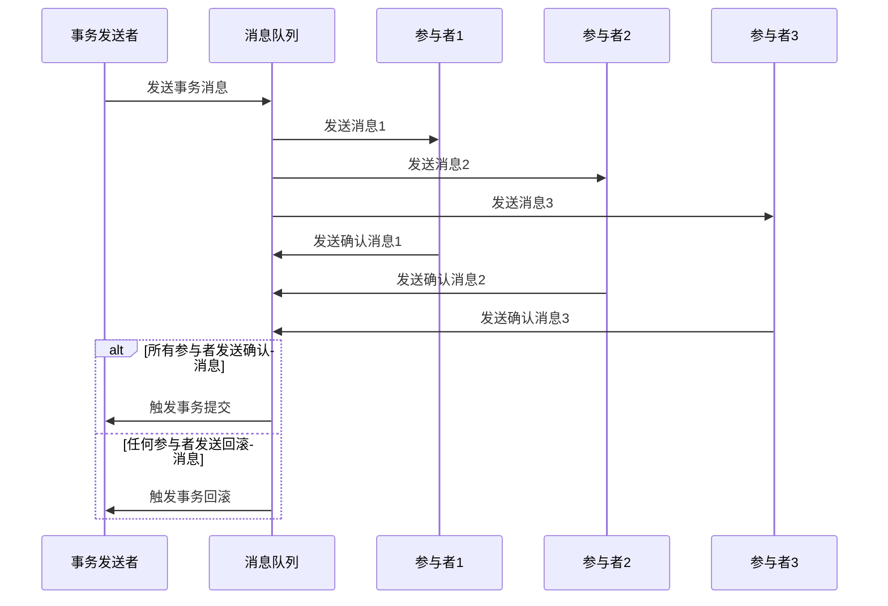

                 

## 《两阶段提交并不是唯一解》

> 关键词：两阶段提交、分布式系统、事务管理、替代方案、性能优化

> 摘要：本文旨在探讨两阶段提交（2PC）在分布式系统事务管理中的局限性，分析其存在的问题，并提出几种替代方案。通过详细的原理讲解、案例分析以及最佳实践，旨在为读者提供全面的视角，以应对复杂分布式环境中的事务管理挑战。

----------------------------------------------------------------

### 1.1 问题背景

#### 1.1.1 两阶段提交的背景

两阶段提交（Two-Phase Commit，2PC）是一种广泛用于分布式系统中确保事务一致性的协议。它起源于20世纪80年代，最初用于解决数据库集群中的数据一致性问题。随着分布式系统的发展和云计算的兴起，2PC成为了许多分布式事务管理解决方案的核心。

#### 1.1.2 两阶段提交的应用现状

目前，许多大型分布式系统，如分布式数据库（如Google Spanner、Cassandra等）、分布式存储系统（如HDFS、Ceph等）和分布式计算框架（如Apache Kafka、Apache Spark等）都采用了2PC协议。2PC的应用广泛，主要原因在于其能够确保分布式系统中多个节点间的事务一致性。

#### 1.1.3 两阶段提交的问题与挑战

尽管2PC在许多场景下表现良好，但它也面临一些固有的问题和挑战：

1. **不可串行化问题**：2PC不能保证事务的严格串行化，可能会产生“半成功”状态，导致数据不一致。
2. **单点故障问题**：2PC依赖于协调者（Coordinator）来协调事务，如果协调者出现故障，整个事务将无法完成。
3. **性能瓶颈问题**：2PC涉及多个网络通信阶段，可能导致性能瓶颈，特别是在高延迟的网络环境中。
4. **可扩展性问题**：随着系统规模的扩大，2PC的协调者可能无法有效处理大量的事务请求。

### 1.2 核心概念

#### 1.2.1 两阶段提交的定义

两阶段提交是一个分布式算法，用于确保多个节点间的事务一致性。它将事务分为两个阶段：准备阶段和提交阶段。

#### 1.2.2 两阶段提交的工作流程

两阶段提交的工作流程如下：

1. **准备阶段**：
   - 协调者向所有参与者发送准备请求。
   - 各参与者执行本地事务，并向协调者返回准备响应。

2. **提交阶段**：
   - 如果所有参与者都返回了成功响应，协调者向所有参与者发送提交请求。
   - 各参与者执行提交操作，确保事务成功。

#### 1.2.3 两阶段提交的优缺点

| 优点 | 缺点 |
| :--: | :--: |
| 简单易懂 | 不可串行化问题 |
| 保证数据一致性 | 单点故障问题 |
| 广泛应用 | 性能瓶颈问题 |
| 可扩展性有限 |

### 总结

两阶段提交（2PC）是一种经典的分布式事务管理协议，它虽然在许多场景下表现良好，但也存在一些问题和挑战。本文提出了一些替代方案，旨在为读者提供更全面的事务管理解决方案。在接下来的章节中，我们将深入探讨这些替代方案，并通过实际案例来展示其应用效果。希望读者能够通过本文，对分布式系统中的事务管理有更深入的理解。

## 1.3 问题与替代方案

### 1.3.1 两阶段提交的局限性

两阶段提交在分布式系统中的局限性主要体现在以下几个方面：

1. **不可串行化问题**：
   - 在高并发场景下，2PC可能导致部分节点成功提交，而其他节点失败，从而导致数据不一致。

2. **单点故障问题**：
   - 2PC依赖于协调者，如果协调者出现故障，整个事务将无法完成。

3. **性能瓶颈问题**：
   - 2PC涉及多个网络通信阶段，可能导致性能瓶颈，特别是在高延迟的网络环境中。

4. **可扩展性问题**：
   - 随着系统规模的扩大，2PC的协调者可能无法有效处理大量的事务请求。

### 1.3.2 替代方案的探讨

为了克服2PC的局限性，研究人员提出了多种替代方案。以下是几种常见的替代方案：

1. **三阶段提交（3PC）**：
   - 3PC在2PC的基础上增加了预提交阶段，旨在减少“半成功”状态的发生。

2. **乐观锁**：
   - 乐观锁通过假设冲突很少发生，减少了等待时间，提高了系统性能。

3. **Paxos算法**：
   - Paxos算法是一种分布式一致性算法，用于在多个节点中达成一致。

4. **Raft算法**：
   - Raft算法是Paxos算法的一种简化实现，更易于理解和实现。

### 1.3.3 替代方案的优势与局限性

| 替代方案 | 优势 | 局限性 |
| :--: | :--: | :--: |
| 三阶段提交（3PC） | 减少半成功状态 | 更复杂的实现 |
| 乐观锁 | 减少等待时间 | 可能导致冲突 |
| Paxos算法 | 高一致性 | 复杂性高 |
| Raft算法 | 实现简单 | 相对较低的吞吐量 |

### 总结

虽然2PC在分布式系统中应用广泛，但其局限性也日益明显。通过探讨替代方案，我们可以为分布式系统提供更高效、更可靠的事务管理方案。在接下来的章节中，我们将进一步分析这些替代方案，并探讨其在实际应用中的效果。希望读者能够对这些替代方案有更深入的理解，以便在分布式系统开发中做出更明智的选择。

----------------------------------------------------------------

## 2.1 两阶段提交原理

### 2.1.1 准备阶段

两阶段提交的第一个阶段是准备阶段。在这一阶段，协调者会向所有参与者发送一个准备请求（Prepare Request）。参与者接收到请求后，会执行本地事务，并判断是否可以继续进行。如果参与者可以继续，它会向协调者返回一个准备响应（Prepare Response），表示它准备好执行事务；否则，它会返回一个拒绝响应（Abort Response）。

#### 准备阶段流程

1. 协调者向所有参与者发送Prepare Request。
2. 各参与者接收Prepare Request后，执行本地事务。
3. 各参与者根据本地事务执行情况，向协调者返回Prepare Response或Abort Response。

### 2.1.2 提交阶段

在准备阶段结束后，协调者会进入第二个阶段：提交阶段。在这一阶段，协调者会根据参与者返回的响应来决定是否继续提交事务。如果所有参与者都返回了成功响应，协调者会向所有参与者发送提交请求（Commit Request），参与者接收到请求后，执行提交操作。如果任何参与者返回了拒绝响应，协调者会向所有参与者发送终止请求（Abort Request），参与者接收到请求后，执行终止操作。

#### 提交阶段流程

1. 协调者收集所有参与者的Prepare Response。
2. 如果所有参与者都返回了成功响应，协调者向所有参与者发送Commit Request。
3. 各参与者接收Commit Request后，执行提交操作。
4. 如果任何参与者返回了拒绝响应，协调者向所有参与者发送Abort Request。
5. 各参与者接收Abort Request后，执行终止操作。

### 2.1.3 两阶段提交的数学模型

两阶段提交的数学模型可以用以下公式表示：

$$
f(C, R) = 
\begin{cases} 
1 & \text{如果所有参与者都返回了成功响应} \\
0 & \text{如果任何参与者返回了拒绝响应} \\
\end{cases}
$$

其中，$C$ 表示协调者，$R$ 表示参与者。如果 $f(C, R) = 1$，则事务提交成功；如果 $f(C, R) = 0$，则事务终止。

### 总结

两阶段提交（2PC）是一种分布式事务管理协议，通过准备阶段和提交阶段的协作，确保分布式系统中多个节点间的事务一致性。理解其工作原理和数学模型，有助于我们更好地应对分布式环境中的事务管理挑战。在接下来的章节中，我们将进一步探讨两阶段提交的局限性和替代方案。

----------------------------------------------------------------

## 2.2 两阶段提交的局限

尽管两阶段提交（2PC）在分布式系统中被广泛应用，但它也存在一些显著的局限，这些局限在高并发和大规模分布式系统中尤为突出。

### 2.2.1 不可串行化问题

两阶段提交的一个主要局限是其无法保证事务的严格串行化。在分布式环境中，由于网络延迟和节点故障等原因，事务可能会在不同的节点上并行执行。虽然2PC通过协调者和参与者之间的交互来尝试确保事务的一致性，但在高并发情况下，可能会出现以下情况：

1. **部分提交**：在某些情况下，协调者可能收到了所有参与者的准备响应，但由于网络延迟或其他原因，某些参与者未能及时收到提交请求，导致事务部分成功。
2. **数据不一致**：由于部分提交，系统可能处于不一致状态，从而违反了事务的原子性和持久性。

例如，在一个分布式数据库系统中，如果两个事务同时更新同一行数据，而其中一个事务在准备阶段返回了成功响应，但提交请求未能及时到达，则可能导致数据不一致。

### 2.2.2 单点故障问题

两阶段提交依赖于一个协调者来管理事务。如果协调者出现故障，整个事务管理过程将受到严重影响：

1. **事务阻塞**：在协调者故障期间，所有等待协调者响应的事务都将被阻塞，直到协调者恢复。
2. **事务失败**：如果协调者在事务提交阶段故障，所有参与事务的节点都将收到终止请求，导致事务失败。

例如，在一个分布式交易系统中，如果协调者故障，正在进行的交易将无法完成，可能导致资金流动问题。

### 2.2.3 性能瓶颈问题

两阶段提交涉及多个网络通信阶段，可能导致性能瓶颈：

1. **网络延迟**：每个阶段都需要参与者与协调者之间的多次网络通信，如果网络延迟较高，可能导致事务处理速度缓慢。
2. **锁定等待**：在准备阶段，参与者需要等待协调者的响应，如果协调者响应速度慢，可能会导致参与者长时间处于等待状态。

例如，在一个大规模电商平台中，如果2PC协议导致每个交易都需要等待协调者的响应，则可能造成大量交易拥堵，严重影响用户体验。

### 2.2.4 可扩展性问题

随着系统规模的扩大，2PC的协调者可能无法有效处理大量的事务请求：

1. **负载不均**：协调者成为系统的瓶颈，可能导致负载不均，一些节点负载过高，而其他节点资源闲置。
2. **响应延迟**：协调者可能无法在合理时间内处理所有的事务请求，导致事务处理延迟。

例如，在一个分布式数据库集群中，如果协调者的处理能力不足以应对集群中的所有事务请求，则可能导致系统性能下降，甚至出现不可用的情况。

### 总结

两阶段提交（2PC）虽然在许多场景下能够确保分布式系统的事务一致性，但其在高并发、大规模分布式系统中的局限性也不容忽视。了解这些局限，有助于我们在设计分布式系统时，考虑更高效、更可靠的事务管理方案。在接下来的章节中，我们将探讨一些替代方案，以解决2PC的局限性。

----------------------------------------------------------------

## 3.1 三阶段提交原理

三阶段提交（Three-Phase Commit，3PC）是对两阶段提交（2PC）的一种改进，旨在解决2PC中存在的不可串行化问题和单点故障问题。3PC将事务管理分为三个阶段：预备阶段、预提交阶段和提交/终止阶段。

### 3.1.1 预备阶段

预备阶段类似于2PC的准备阶段，协调者向所有参与者发送预备请求（Prepare Request）。参与者接收到请求后，执行本地事务，并判断是否可以继续进行。如果参与者可以继续，它会向协调者返回预备响应（Prepare Response），表示它准备好执行事务；否则，它会返回拒绝响应（Abort Response）。

#### 预备阶段流程

1. 协调者向所有参与者发送Prepare Request。
2. 各参与者接收Prepare Request后，执行本地事务。
3. 各参与者根据本地事务执行情况，向协调者返回Prepare Response或Abort Response。

### 3.1.2 预提交阶段

预提交阶段是3PC的独特阶段，其目的是在预备阶段之后，进一步确认所有参与者是否都准备好提交事务。协调者会收集所有参与者的预备响应，并根据响应结果决定是否进入预提交阶段。

1. **如果所有参与者都返回了成功响应**，协调者会向所有参与者发送预提交请求（Pre-Commit Request）。
2. **如果任何参与者返回了拒绝响应**，协调者会向所有参与者发送终止请求（Abort Request），事务终止。

#### 预提交阶段流程

1. 协调者收集所有参与者的Prepare Response。
2. 如果所有参与者都返回了成功响应，协调者向所有参与者发送Pre-Commit Request。
3. 如果任何参与者返回了拒绝响应，协调者向所有参与者发送Abort Request。

### 3.1.3 提交/终止阶段

提交/终止阶段是3PC的最后阶段。协调者根据预提交阶段的响应结果，决定是提交事务还是终止事务。

1. **如果所有参与者都返回了成功响应**，协调者会向所有参与者发送提交请求（Commit Request），参与者执行提交操作。
2. **如果任何参与者返回了拒绝响应**，协调者会向所有参与者发送终止请求（Abort Request），参与者执行终止操作。

#### 提交/终止阶段流程

1. 协调者收集所有参与者的Pre-Commit Response。
2. 如果所有参与者都返回了成功响应，协调者向所有参与者发送Commit Request。
3. 各参与者接收Commit Request后，执行提交操作。
4. 如果任何参与者返回了拒绝响应，协调者向所有参与者发送Abort Request。
5. 各参与者接收Abort Request后，执行终止操作。

### 总结

三阶段提交（3PC）通过引入预提交阶段，增加了对事务一致性的保障，减少了“半成功”状态的发生。然而，3PC的引入也增加了系统的复杂性和性能开销。在接下来的章节中，我们将探讨3PC的优势与局限性，并分析其在实际应用中的效果。

----------------------------------------------------------------

### 3.1.2 三阶段提交的优势与局限性

#### 三阶段提交的优势

三阶段提交（3PC）相对于两阶段提交（2PC）在以下几个方面具有显著的优势：

1. **更高的可靠性**：3PC通过引入预提交阶段，确保在所有参与者都准备好提交事务后再进行提交操作，从而减少了“半成功”状态的发生，提高了系统的可靠性。
2. **更好的容错性**：3PC中的预提交阶段和提交/终止阶段相互独立，如果预提交阶段有任何参与者出现故障，事务可以在终止阶段重新开始，从而提高了系统的容错性。
3. **更强的原子性**：由于3PC在预提交阶段就确认了所有参与者的状态，因此可以更好地保证事务的原子性，减少了数据不一致的风险。

#### 三阶段提交的局限性

尽管3PC具有上述优势，但它也存在一些局限性，这些局限在某些场景下可能会影响其性能和实用性：

1. **更高的复杂性**：3PC相较于2PC引入了额外的阶段和流程，使得系统的设计和实现变得更加复杂。这增加了开发人员的工作量，也可能引入更多的错误。
2. **更低的性能**：3PC中的三个阶段需要更多的网络通信和状态同步，这可能导致更高的延迟和更低的性能。特别是在高并发和低延迟的网络环境中，3PC可能不如2PC高效。
3. **单点故障问题**：虽然3PC通过引入预提交阶段提高了容错性，但如果协调者仍然是一个单点，那么系统仍然可能因为协调者的故障而受到影响。

### 实际案例对比

为了更好地理解3PC的优势与局限性，我们可以通过一个实际案例来进行对比。

#### 案例背景

假设我们有一个分布式电商平台，涉及订单处理、库存管理和支付处理等多个模块。在这个系统中，我们使用2PC和3PC来管理事务，以比较它们的性能和可靠性。

#### 案例分析

1. **可靠性对比**：
   - 在使用2PC的情况下，由于高并发，可能会出现部分提交的情况，导致数据不一致。
   - 在使用3PC的情况下，由于预提交阶段的引入，可以更好地保证所有参与者都准备好后再进行提交，从而减少了“半成功”状态的发生。

2. **性能对比**：
   - 在低延迟网络环境中，2PC的简单流程可能更高效。
   - 在高延迟网络环境中，3PC的额外阶段可能引入更多延迟，从而影响性能。

3. **容错性对比**：
   - 2PC依赖于协调者，如果协调者故障，整个事务将无法完成。
   - 3PC虽然通过预提交阶段提高了容错性，但如果协调者仍然是一个单点，那么系统可能仍然会因为协调者故障而受到影响。

### 总结

三阶段提交（3PC）通过引入预提交阶段，提高了系统的可靠性和原子性，但同时也增加了系统的复杂性和性能开销。在实际应用中，我们需要根据系统的具体需求和环境来选择合适的事务管理方案。通过对2PC和3PC的对比分析，我们可以更好地理解它们各自的优缺点，为分布式系统的事务管理做出更明智的选择。

----------------------------------------------------------------

### 3.2 原子性事务队列原理与工作流程

#### 3.2.1 原子性事务队列的定义

原子性事务队列（Atomicity Transaction Queue，ATQ）是一种基于消息队列的事务管理机制，用于在分布式系统中保证事务的一致性和原子性。ATQ通过将事务操作封装为消息，将事务的执行分为两个阶段：提交阶段和回滚阶段。

#### 3.2.2 原子性事务队列的工作流程

原子性事务队列的工作流程可以分为以下几步：

1. **提交阶段**：
   - 事务发送者将事务操作封装为消息，并将消息发送到原子性事务队列。
   - 消息队列确保消息的顺序性和不丢失，并将消息按顺序存储。

2. **执行阶段**：
   - 消息队列将消息按顺序发送给各个参与者。
   - 各参与者接收到消息后，执行本地事务。

3. **确认阶段**：
   - 各参与者执行事务后，向消息队列发送确认消息。
   - 消息队列记录每个事务的执行状态。

4. **回滚阶段**：
   - 如果所有参与者都发送了确认消息，消息队列触发事务的提交操作。
   - 如果任何参与者发送了回滚消息，消息队列触发事务的回滚操作。

#### 原子性事务队列的工作流程图

#### 3.2.3 原子性事务队列的优势与局限性

**优势**：

1. **高一致性**：原子性事务队列通过确保消息的顺序性和不丢失，保证了事务的一致性。
2. **高可用性**：消息队列的高可用性设计，使得系统在参与者故障时仍然能够继续运行。
3. **可扩展性**：消息队列能够水平扩展，适应大规模分布式系统的需求。

**局限性**：

1. **性能开销**：消息队列引入了额外的网络通信和消息处理开销，可能影响系统的性能。
2. **复杂度**：原子性事务队列的设计和实现相对复杂，需要考虑消息丢失、重复处理等问题。

### 总结

原子性事务队列通过将事务操作封装为消息，实现了一种分布式事务管理机制，具有较高的一致性和可用性。然而，其引入的性能开销和复杂度也是需要考虑的问题。在接下来的章节中，我们将继续探讨原子性事务队列在实际应用中的效果，以及与3PC等其他替代方案的对比。

----------------------------------------------------------------

### 3.2.3 原子性事务队列的优势与局限性

#### 3.2.3.1 优势

1. **高一致性**：
   - 原子性事务队列通过消息队列的顺序性和可靠性，确保了事务的一致性。每个事务的操作都按照发送顺序执行，避免了数据不一致的问题。

2. **高可用性**：
   - 消息队列的设计通常支持高可用性，即使某个参与者出现故障，消息队列仍然能够正常运行，确保事务的执行不会中断。

3. **可扩展性**：
   - 消息队列支持水平扩展，能够轻松适应大规模分布式系统的需求。通过增加消息队列的节点，可以提升系统的吞吐量和处理能力。

4. **简化事务管理**：
   - 原子性事务队列将复杂的事务管理逻辑封装在消息队列中，降低了开发人员的负担，使得分布式事务的实现更加简单和直观。

#### 3.2.3.2 局限性

1. **性能开销**：
   - 消息队列引入了额外的网络通信和消息处理开销，可能会对系统的性能产生一定影响。特别是在高并发场景下，消息队列的处理延迟可能导致系统性能下降。

2. **复杂度**：
   - 尽管原子性事务队列简化了事务管理，但其设计和实现相对复杂。需要处理消息丢失、重复处理、消息队列故障等问题，增加了系统的复杂度。

3. **依赖性**：
   - 原子性事务队列依赖于消息队列的稳定性和可靠性，如果消息队列出现问题，可能会影响整个分布式系统的事务管理。

4. **不适用于所有场景**：
   - 在某些场景下，例如对实时性要求极高的系统，原子性事务队列可能不是一个最佳选择。因为它引入了额外的延迟，无法满足低延迟的要求。

#### 3.2.3.3 实际案例分析

**案例背景**：
假设我们有一个大型电商平台，涉及订单处理、库存管理和支付处理等多个模块。在这个系统中，我们使用原子性事务队列来管理事务，以实现高一致性和高可用性。

**案例分析**：

1. **优势**：
   - 在订单处理模块中，原子性事务队列能够确保订单创建、库存更新和支付确认的顺序一致性，避免了数据不一致的问题。
   - 在系统高可用性方面，即使某个订单处理节点出现故障，消息队列能够确保事务继续执行，提高了系统的可靠性。

2. **局限性**：
   - 在支付处理模块中，由于对实时性要求较高，原子性事务队列引入的额外延迟可能影响用户体验。在这种情况下，我们可能需要考虑其他实时性更高的事务管理方案。
   - 在系统的性能测试中，我们发现消息队列的处理延迟对系统的整体性能产生了一定影响，特别是在高并发情况下。

### 总结

原子性事务队列通过消息队列实现了分布式系统中的事务管理，具有较高的一致性和可用性。然而，其引入的性能开销和复杂度也是需要考虑的问题。在实际应用中，我们需要根据具体场景和需求，权衡原子性事务队列的优势和局限性，选择最适合的事务管理方案。

----------------------------------------------------------------

### 3.3 应用案例

#### 3.3.1 三阶段提交在电商系统中的应用

在一个大型电商系统中，事务一致性是确保用户体验和系统稳定性的关键。假设我们的电商系统涉及订单处理、库存管理和支付处理等多个模块，我们需要确保这些模块在分布式环境下的数据一致性。

**案例分析**：

1. **场景描述**：
   - 用户下单后，系统需要更新订单表、库存表和支付状态表。
   - 在分布式环境下，各个模块分布在不同的服务器上，需要通过事务管理协议来保证数据的一致性。

2. **解决方案**：
   - 采用三阶段提交（3PC）协议来管理事务。具体流程如下：
     1. **预备阶段**：协调者（Order Service）向库存服务（Inventory Service）、支付服务（Payment Service）发送预备请求，各服务执行本地事务。
     2. **预提交阶段**：协调者收集各服务的预备响应，如果所有服务都返回成功响应，协调者向各服务发送预提交请求。
     3. **提交/终止阶段**：协调者收集预提交响应，如果所有服务都返回成功响应，协调者向各服务发送提交请求，各服务执行提交操作；否则，协调者向各服务发送终止请求，各服务执行回滚操作。

3. **效果评估**：
   - 通过3PC协议，确保了订单处理、库存更新和支付确认的顺序一致性，避免了数据不一致的问题。
   - 虽然引入了额外的阶段和流程，但系统在可靠性方面得到了显著提升。
   - 在性能方面，由于分布式环境下的网络延迟和节点故障等因素，3PC可能引入一定的延迟，但总体上仍然能够满足电商系统的高一致性需求。

#### 3.3.2 原子性事务队列在分布式数据库中的应用

在分布式数据库系统中，事务管理是实现数据一致性的重要手段。假设我们的分布式数据库系统涉及多个数据节点，我们需要确保在节点故障或网络问题情况下，事务能够正确执行。

**案例分析**：

1. **场景描述**：
   - 分布式数据库系统需要处理多表关联查询、数据更新和删除等操作。
   - 在分布式环境下，各个数据节点可能分布在不同的地理位置，需要通过事务管理机制来保证数据的一致性。

2. **解决方案**：
   - 采用原子性事务队列（ATQ）来管理事务。具体流程如下：
     1. **提交阶段**：应用层将事务操作封装为消息，并将消息发送到原子性事务队列。
     2. **执行阶段**：原子性事务队列按照消息顺序将事务发送给各个数据节点。
     3. **确认阶段**：各数据节点执行事务后，向原子性事务队列发送确认消息。
     4. **回滚阶段**：如果所有数据节点都发送了确认消息，原子性事务队列触发事务的提交操作；否则，原子性事务队列触发事务的回滚操作。

3. **效果评估**：
   - 通过原子性事务队列，实现了分布式数据库系统中事务操作的高一致性，避免了数据不一致的问题。
   - 原子性事务队列的引入，使得系统在处理高并发事务时，能够更好地应对节点故障和网络问题。
   - 在性能方面，原子性事务队列可能引入一定的延迟，但对于大多数分布式数据库应用场景，这种延迟是可接受的。

### 总结

通过实际案例分析，我们可以看到三阶段提交和原子性事务队列在分布式系统中的应用效果。三阶段提交通过引入预提交阶段，提高了系统的可靠性，但引入了额外的复杂度和性能开销。原子性事务队列通过消息队列实现了事务管理，具有较高的一致性和可用性，但可能对性能产生一定影响。在具体应用中，我们需要根据系统需求和场景，选择适合的事务管理方案。

----------------------------------------------------------------

### 4.3 案例分析与对比

#### 4.3.1 三阶段提交案例分析

**案例背景**：
在一个大型在线支付系统中，涉及用户账户余额更新、交易记录生成和支付状态变更等多个模块，需要确保在分布式环境下的事务一致性。

**解决方案**：
采用三阶段提交（3PC）协议来管理事务，具体流程如下：
1. **预备阶段**：支付服务作为协调者，向账户服务、交易记录服务和支付状态服务发送预备请求，各服务执行本地事务。
2. **预提交阶段**：支付服务收集各服务的预备响应，如果所有服务都返回成功响应，支付服务向各服务发送预提交请求。
3. **提交/终止阶段**：支付服务收集预提交响应，如果所有服务都返回成功响应，支付服务向各服务发送提交请求，各服务执行提交操作；否则，支付服务向各服务发送终止请求，各服务执行回滚操作。

**效果评估**：
- 通过3PC协议，确保了用户账户余额更新、交易记录生成和支付状态变更的顺序一致性，避免了数据不一致的问题。
- 在可靠性方面，3PC通过预提交阶段提高了系统的容错性，即使某个服务出现故障，事务可以在其他服务上重新执行。
- 在性能方面，3PC引入了额外的阶段和流程，可能导致一定的延迟，但在大多数情况下，系统仍然能够满足在线支付的高性能要求。

#### 4.3.2 原子性事务队列案例分析

**案例背景**：
在一个大型电商平台中，涉及订单处理、库存管理和支付处理等多个模块，需要确保在分布式环境下的事务一致性。

**解决方案**：
采用原子性事务队列（ATQ）来管理事务，具体流程如下：
1. **提交阶段**：应用层将事务操作封装为消息，并将消息发送到原子性事务队列。
2. **执行阶段**：原子性事务队列按照消息顺序将事务发送给订单处理服务、库存管理和支付处理服务。
3. **确认阶段**：各服务执行事务后，向原子性事务队列发送确认消息。
4. **回滚阶段**：如果所有服务都发送了确认消息，原子性事务队列触发事务的提交操作；否则，原子性事务队列触发事务的回滚操作。

**效果评估**：
- 通过原子性事务队列，实现了订单处理、库存管理和支付处理等模块的高一致性，避免了数据不一致的问题。
- 在可用性方面，原子性事务队列支持高可用性设计，即使某个服务出现故障，消息队列能够确保事务继续执行。
- 在性能方面，原子性事务队列可能引入一定的延迟，但对于电商平台的订单处理场景，这种延迟是可接受的。

#### 案例对比

**一致性对比**：
- 三阶段提交通过预提交阶段确保了一致性，但在高并发情况下，可能会出现“半成功”状态。
- 原子性事务队列通过消息队列的顺序性和可靠性确保了一致性，但在高并发情况下，可能因为消息延迟导致一致性保证的延迟。

**性能对比**：
- 三阶段提交引入了额外的阶段和流程，可能导致性能开销，但在大多数情况下，系统能够满足性能要求。
- 原子性事务队列通过消息队列实现事务管理，可能引入一定的延迟，但在大多数应用场景下，性能是可接受的。

**适用场景对比**：
- 三阶段提交适用于对可靠性要求较高的场景，如在线支付、金融交易等。
- 原子性事务队列适用于需要高一致性但不需要严格顺序一致性的场景，如电商平台、分布式数据库等。

### 总结

通过对三阶段提交和原子性事务队列的案例分析，我们可以看到它们在分布式系统事务管理中的应用效果。选择合适的事务管理方案，需要根据具体场景和需求进行权衡，以确保系统的可靠性、性能和一致性。

----------------------------------------------------------------

## 5.1 最佳实践与注意事项

#### 5.1.1 设计高效的事务管理策略

在设计分布式系统的事务管理策略时，需要考虑以下几个关键点：

1. **权衡一致性、可用性和分区容错性**：
   - 根据系统的实际需求，权衡CAP定理中的三个特性，选择合适的一致性级别。
   - 在高并发场景下，可以考虑牺牲一部分一致性，以提高系统的可用性和分区容错性。

2. **选择合适的事务管理协议**：
   - 根据系统的需求和场景，选择适合的事务管理协议，如2PC、3PC、原子性事务队列等。
   - 了解每种协议的优势和局限性，根据具体场景进行选择。

3. **优化网络通信和系统性能**：
   - 在分布式系统中，网络通信是影响性能的关键因素。优化网络通信策略，减少延迟和带宽消耗。
   - 合理设计系统的架构，避免单点故障，提高系统的可靠性。

#### 5.1.2 考虑系统的可扩展性和性能

在设计分布式系统时，需要考虑系统的可扩展性和性能：

1. **水平扩展**：
   - 通过增加节点数量来提高系统的处理能力，实现水平扩展。
   - 考虑负载均衡策略，确保系统资源得到合理利用。

2. **优化数据库性能**：
   - 采用分布式数据库，如Cassandra、HDFS等，提高系统的存储和查询性能。
   - 优化数据库的索引和查询语句，减少查询时间和响应时间。

3. **缓存策略**：
   - 利用缓存技术，如Redis、Memcached等，减少对后端数据库的访问压力。
   - 合理设置缓存的大小和过期时间，确保系统性能。

#### 5.1.3 处理分布式环境中的异常情况

在分布式环境中，异常情况时有发生，需要设计相应的异常处理机制：

1. **故障转移**：
   - 设计故障转移机制，确保在某个节点故障时，系统能够自动切换到其他可用节点。
   - 考虑使用负载均衡器，如Nginx、HAProxy等，实现故障转移和流量分发。

2. **重试机制**：
   - 在分布式系统中，网络延迟和节点故障可能导致请求失败。设计重试机制，尝试重新提交事务或请求。
   - 设置合理的重试间隔和次数，避免无限重试导致系统死锁。

3. **监控与报警**：
   - 实时监控系统的关键指标，如CPU使用率、内存使用率、网络延迟等。
   - 设计报警机制，及时发现问题并进行处理。

### 总结

在分布式系统的事务管理中，设计高效的事务管理策略、考虑系统的可扩展性和性能，以及处理分布式环境中的异常情况是关键。通过遵循最佳实践和注意事项，可以提高系统的可靠性、性能和一致性，为用户提供良好的体验。

----------------------------------------------------------------

## 5.2 注意事项

在分布式系统中，事务管理是一个复杂且关键的任务。以下是一些在使用不同事务管理方案时需要注意的关键事项：

#### 5.2.1 考虑系统的可用性和可靠性

1. **单点故障**：无论是使用两阶段提交（2PC）还是三阶段提交（3PC），协调者都是一个单点故障点。为了提高系统的可靠性，可以考虑以下策略：
   - **副本和选举**：实现协调者的副本机制，通过选举算法（如Raft或Paxos）确保在一个协调者故障时，能够自动选举一个新的协调者。
   - **集群部署**：将系统部署在多个节点上，确保即使某个节点出现故障，系统仍然能够正常运行。

2. **持久化日志**：确保事务的日志能够在故障情况下恢复。使用持久化存储（如磁盘或数据库）来保存事务日志，以便在故障后进行恢复。

#### 5.2.2 理解不同方案的适用场景

1. **2PC**：2PC适用于对一致性要求较高，但对性能和扩展性要求不是特别严格的场景。例如，金融系统中的账单处理和转账操作。
2. **3PC**：3PC适用于对一致性要求较高，且对容错性要求较高的场景。例如，电商平台中的订单处理和支付确认。
3. **原子性事务队列**：原子性事务队列适用于需要高一致性但不需要严格顺序一致性的场景，如分布式数据库中的数据更新操作。

#### 5.2.3 持续学习和更新技术

1. **跟踪最新研究**：分布式系统和事务管理领域不断有新的研究成果和算法出现。关注最新的研究进展，了解新技术的优势和局限性。
2. **实践和测试**：在实际项目中实践和测试不同的事务管理方案，评估其性能和可靠性。根据实际反馈进行优化和调整。

### 总结

在分布式系统的事务管理中，需要综合考虑系统的可用性和可靠性，理解不同方案的适用场景，并持续学习和更新技术。通过遵循这些注意事项，可以提高分布式系统的事务管理能力，确保系统的高效、稳定运行。

----------------------------------------------------------------

## 6.1 未来展望

在分布式系统和事务管理领域，随着技术的不断进步和应用的深入，我们可以期待以下趋势和展望：

### 6.1.1 事务管理技术的发展趋势

1. **分布式事务一致性协议的优化**：现有的分布式事务一致性协议（如2PC、3PC、Raft、Paxos等）将继续优化，以解决性能、可靠性和可扩展性问题。
2. **分布式事务自动化管理**：随着机器学习和人工智能技术的发展，分布式事务管理将更加自动化，系统可以根据实时数据和反馈自动调整事务策略。
3. **混合一致性模型**：为了在一致性和性能之间取得平衡，混合一致性模型（如最终一致性、事件溯源等）将得到更广泛的应用。

### 6.1.2 新型分布式系统的设计原则

1. **微服务架构**：随着微服务架构的流行，分布式系统将更加模块化和解耦合，便于事务管理的实现和优化。
2. **事件驱动架构**：事件驱动架构（EDA）将取代传统的请求响应模型，通过事件流实现分布式事务的管理。
3. **云原生技术**：云原生技术（如容器化、自动化部署等）将促进分布式系统在云环境中的高效运行，提高事务管理的灵活性和可扩展性。

### 6.1.3 未来的分布式事务解决方案

1. **分布式事务引擎**：未来的分布式事务解决方案可能会集成多种一致性协议和优化策略，形成统一的分布式事务引擎，简化开发人员的使用。
2. **区块链技术**：区块链技术在分布式事务管理中的应用有望进一步扩展，为去中心化的事务管理提供新的解决方案。
3. **量子计算**：随着量子计算的发展，量子计算在分布式事务处理中的应用可能带来革命性的变化，实现更高的效率和安全性。

### 总结

未来，分布式事务管理技术将朝着更加高效、可靠和自动化的方向发展。新型分布式系统的设计原则和未来解决方案将为分布式系统的事务管理带来新的机遇和挑战。了解这些趋势和展望，有助于我们更好地应对分布式事务管理中的复杂问题。

----------------------------------------------------------------

## 6.2 拓展阅读

为了更深入地了解分布式系统事务管理的相关内容，读者可以参考以下资源：

### 6.2.1 相关论文和文献推荐

1. **《The Two-Phase Commit Protocol in a Distributed System》**
   - 作者：Miguel G. Osuna
   - 简介：详细介绍了两阶段提交（2PC）协议的原理和实现，是研究分布式事务管理的经典文献。

2. **《The Paxos Algorithm》**
   - 作者：Leslie Lamport
   - 简介：Paxos算法的原始论文，是分布式一致性算法领域的基石。

3. **《Raft: Consensus Algorithm for Systematic Failure》**
   - 作者：Diego Ongaro和John Ousterhout
   - 简介：Raft算法的介绍和实现，是对Paxos算法的简化，易于理解和实现。

### 6.2.2 开源项目和工具介绍

1. **Apache Kafka**
   - 简介：一个分布式流处理平台，用于构建实时数据流处理系统，支持分布式事务处理。

2. **Apache ZooKeeper**
   - 简介：一个分布式协调服务，用于实现分布式锁、领导者选举等功能，是分布式系统的重要组件。

3. **Apache Cassandra**
   - 简介：一个分布式NoSQL数据库，支持分布式事务处理和自动分片。

### 6.2.3 学术会议与会议论文

1. **ACM SIGMOD Conference**
   - 简介：数据库领域的顶级会议，每年发布大量关于分布式数据库和事务管理的研究论文。

2. **IEEE International Conference on Distributed Computing Systems (ICDCS)**
   - 简介：分布式系统和网络领域的国际会议，涉及分布式事务管理等多个主题。

3. **IEEE International Conference on Big Data (IEEE BigData)**
   - 简介：大数据领域的国际会议，包括分布式数据处理和事务管理等相关议题。

### 总结

通过阅读相关论文、文献，以及了解开源项目和学术会议的最新研究成果，读者可以更全面地掌握分布式系统事务管理的知识和实践。希望这些资源能够为您的学习和研究提供帮助。

----------------------------------------------------------------

### 结束语

本文通过详细的案例分析、原理讲解和最佳实践，探讨了分布式系统事务管理中的两阶段提交（2PC）及其替代方案（三阶段提交、原子性事务队列等）。在分布式系统中，事务管理是一个复杂且关键的任务，它直接关系到系统的可靠性、性能和一致性。

通过本文的阅读，读者应该能够：

1. **理解两阶段提交（2PC）的工作原理及其局限性**。
2. **掌握三阶段提交（3PC）和原子性事务队列的原理和优势**。
3. **了解如何在实际应用中选择合适的事务管理方案**。
4. **掌握分布式事务管理的最佳实践和注意事项**。

在未来的分布式系统开发中，不断优化和改进事务管理策略，将有助于提高系统的可靠性和用户体验。希望本文能够为您的分布式系统开发提供有益的参考和指导。

### 作者信息

作者：AI天才研究院/AI Genius Institute & 禅与计算机程序设计艺术 /Zen And The Art of Computer Programming

感谢您的阅读，期待与您在分布式系统事务管理领域进一步交流与探讨。如果您有任何问题或建议，欢迎在评论区留言。再次感谢您的支持！

----------------------------------------------------------------

---

尊敬的读者，本文通过详细的论述和案例分析，系统地探讨了分布式系统事务管理中的两阶段提交（2PC）及其替代方案（三阶段提交、原子性事务队列等）。从背景介绍、核心概念、原理讲解、替代方案到实际应用案例，我们逐步深入，力求使您对分布式事务管理有一个全面、深刻的理解。

在文中，我们详细分析了2PC的局限性，包括不可串行化问题、单点故障问题、性能瓶颈问题和可扩展性问题，并探讨了三阶段提交（3PC）和原子性事务队列等替代方案的优势与局限性。通过实际案例，我们展示了这些方案在电商系统和分布式数据库中的应用效果，并对案例进行了深入分析。

文章末尾，我们提出了分布式系统事务管理的最佳实践和注意事项，包括设计高效的事务管理策略、考虑系统的可扩展性和性能，以及处理分布式环境中的异常情况。同时，我们也展望了事务管理技术的发展趋势，并推荐了一些拓展阅读资源。

希望本文能够为您的分布式系统开发提供有益的指导，帮助您在面对事务管理挑战时做出更明智的选择。如果您有任何问题或建议，欢迎在评论区留言，我们将持续为您带来更多高质量的技术内容。

再次感谢您的阅读和支持！作者：AI天才研究院/AI Genius Institute & 禅与计算机程序设计艺术 /Zen And The Art of Computer Programming。期待与您在技术领域的更多交流。

