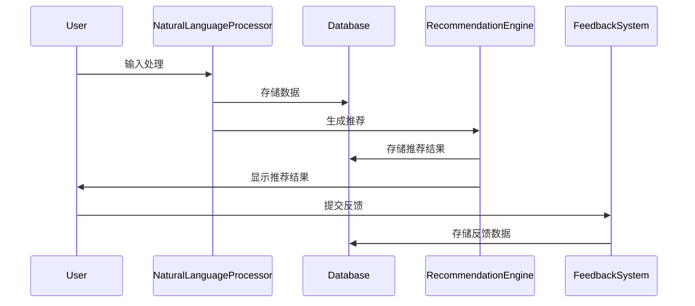
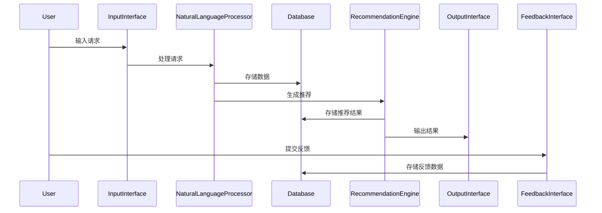

                 

### 引言

在现代信息技术迅猛发展的背景下，人工智能（AI）已经渗透到我们生活的方方面面。从智能客服、推荐系统到自动驾驶、医疗诊断，AI正逐渐改变着我们的工作与生活方式。然而，随着AI技术的普及，如何让AI助手更加“聪明”、更加“贴心”，成为了一个亟待解决的重要课题。个性化AI助手应运而生，它通过深入理解用户需求，为每个用户提供定制化的服务体验。

个性化AI助手的核心在于“个性化”和“提示词”两个关键概念。个性化意味着AI助手能够根据用户的偏好和需求，提供针对性的服务；而提示词则是实现个性化的桥梁，通过用户输入的提示词，AI助手可以更好地理解用户意图，从而做出更精准的响应。本文旨在探讨如何利用提示词定制用户体验，构建高度个性化的AI助手。

本文将分为以下几个部分进行探讨：

1. **背景介绍**：我们将首先介绍个性化AI助手的概念、发展历程以及为何个性化AI助手在现代用户体验中变得如此重要。

2. **核心概念与联系**：接下来，我们将详细解释个性化AI助手和提示词的核心概念，并使用实体关系图（ER图）来展示它们之间的联系。

3. **算法原理讲解**：我们将深入探讨个性化AI助手的算法原理，包括推荐算法、提示词生成与优化算法，并通过mermaid流程图和Python代码示例进行详细解释。

4. **系统分析与架构设计**：我们将分析个性化AI助手在不同应用场景中的系统功能、架构设计和接口设计，并通过mermaid序列图展示系统交互流程。

5. **项目实战**：我们将通过实际项目展示如何构建一个个性化的AI助手，包括环境安装、核心代码实现、代码解读和案例分析。

6. **最佳实践与拓展**：最后，我们将总结最佳实践、注意事项和未来拓展方向，为读者提供进一步的研究和应用建议。

通过上述几个部分的详细探讨，我们希望读者能够全面了解个性化AI助手的构建原理和实践方法，为未来的AI应用提供有益的参考。

### 背景介绍

个性化AI助手的崛起离不开人工智能技术的发展历程。人工智能（AI）作为计算机科学的一个分支，旨在使计算机具备人类智能，能够执行复杂的任务，如学习、推理、解决问题等。从早期的专家系统到深度学习，再到现在的自然语言处理（NLP）和机器学习（ML），人工智能经历了多个发展阶段。

#### 个性化AI助手的概念

个性化AI助手，也被称为智能个人助理，是指通过机器学习和自然语言处理技术，能够根据用户的行为和偏好提供个性化服务的计算机程序。这类助手可以处理多种任务，如日程管理、信息查询、任务提醒、购物推荐等。与传统的AI助手相比，个性化AI助手具备更强的学习能力，能够不断优化自身的服务，以更好地满足用户需求。

#### 发展历程

个性化AI助手的发展历程可以分为以下几个阶段：

1. **基础阶段**（20世纪80年代）：在这个阶段，人工智能主要集中在规则系统，如专家系统和知识库。这些系统能够模拟人类专家的思维过程，解决特定领域的问题，但缺乏灵活性和适应性。

2. **互联网阶段**（20世纪90年代至21世纪初）：随着互联网的普及，数据量呈爆炸式增长，机器学习开始在AI领域占据主导地位。这一阶段的AI助手，如搜索引擎和在线客服，开始利用用户的历史数据和行为模式，提供较为个性化的服务。

3. **移动设备阶段**（2010年代）：随着智能手机的普及，AI助手开始从桌面端转移到移动设备。例如，苹果的Siri、谷歌的Google Assistant和亚马逊的Alexa等，这些助手通过语音交互，为用户提供即时服务。

4. **深度学习阶段**（2010年代至今）：深度学习技术的发展，使得AI助手能够通过大规模数据训练，自动提取特征和模式，从而提供更加精准和个性化的服务。这一阶段，个性化AI助手的功能更加丰富，包括语音识别、图像识别、自然语言理解和情感分析等。

#### 个性化AI助手的重要性

个性化AI助手在现代用户体验中的重要性不可忽视，主要表现在以下几个方面：

1. **提升用户满意度**：通过个性化服务，AI助手能够更好地理解用户需求，提供符合用户预期的服务，从而提升用户满意度。

2. **增强用户粘性**：个性化的互动和服务可以增加用户对产品和服务的依赖，提高用户粘性。

3. **提高工作效率**：个性化AI助手可以自动化处理日常任务，如日程管理、任务提醒等，帮助用户节省时间，提高工作效率。

4. **促进业务增长**：通过个性化推荐和营销，企业可以更精准地触达潜在客户，提高转化率，促进业务增长。

#### 提示词在个性化中的作用

提示词是用户与AI助手之间互动的桥梁。通过用户输入的提示词，AI助手可以获取用户的需求和意图，从而提供个性化的服务。提示词可以是简单的关键词，如“明天天气怎么样？”或复杂的句子，如“帮我安排明天上午的会议”。有效的提示词不仅可以帮助AI助手更好地理解用户意图，还可以优化用户的交互体验。

#### 边界与外延

尽管个性化AI助手在提升用户体验方面具有巨大潜力，但其应用也存在一定的边界和限制。首先，数据隐私和保护是一个重要问题，特别是在处理用户敏感信息时。其次，AI助手的技术能力也有限，某些复杂任务可能无法完全依靠目前的AI技术解决。此外，个性化AI助手在不同文化和语言环境中的适用性也是一个挑战。

总之，个性化AI助手是人工智能领域的一个重要研究方向，其发展不仅受到技术进步的推动，还需要在伦理和社会影响方面进行深入探讨。通过不断优化技术，完善用户体验，个性化AI助手有望在未来发挥更大的作用。

### 核心概念与联系

在深入探讨个性化AI助手之前，我们需要明确几个核心概念，这些概念不仅构成了AI助手的基础，也直接影响到用户体验的个性化程度。以下是本文将详细解释和探讨的核心概念：

#### 个性化AI助手

个性化AI助手是基于机器学习和自然语言处理技术的智能系统，旨在为用户提供定制化的服务体验。与传统AI助手不同，个性化AI助手能够通过学习和分析用户行为、偏好和历史数据，不断优化其服务，以更好地满足用户的需求。以下是个性化AI助手的主要特点：

1. **学习与适应**：个性化AI助手能够通过机器学习算法，从用户行为中学习并适应用户的需求和偏好。
2. **用户互动**：通过自然语言处理技术，个性化AI助手可以理解用户输入的文本或语音，并进行相应的响应。
3. **多任务处理**：个性化AI助手能够处理多种任务，如日程管理、信息查询、任务提醒、购物推荐等。
4. **个性化推荐**：基于用户的历史数据和偏好，个性化AI助手能够提供个性化的推荐服务，提高用户的满意度和粘性。

#### 提示词

提示词是用户与个性化AI助手进行交互的关键要素。用户通过输入提示词，向AI助手传达自己的需求和意图。有效的提示词能够帮助AI助手更准确地理解用户意图，从而提供更精准的服务。以下是提示词的几个关键特点：

1. **简单性**：提示词通常是一个简短的关键词或短语，用户可以轻松输入。
2. **多样性**：用户可以使用不同的表达方式来传达同一意图，因此提示词需要具备一定的灵活性。
3. **上下文依赖**：提示词的语义理解往往依赖于上下文，因此AI助手需要能够处理复杂的语境和隐含意义。
4. **优化性**：提示词的生成和优化是一个动态的过程，AI助手可以通过不断学习和调整，提高提示词的准确性和效率。

#### 概念属性特征对比表格

为了更好地理解个性化AI助手和提示词之间的关联，我们可以通过一个对比表格来展示它们的关键属性特征：

| 特征类别       | 个性化AI助手                | 提示词                      |
|----------------|----------------------------|-----------------------------|
| 功能           | - 学习与适应<br>- 用户互动<br>- 多任务处理<br>- 个性化推荐 | - 简单性<br>- 多样性<br>- 上下文依赖<br>- 优化性 |
| 数据处理       | - 用户行为数据<br>- 历史数据<br>- 用户偏好 | - 用户输入文本<br>- 上下文信息 |
| 技术实现       | - 机器学习算法<br>- 自然语言处理 | - 文本分析<br>- 语义理解 |
| 交互方式       | - 文本/语音输入<br>- 自动响应 | - 文本输入<br>- 语音输入 |
| 决策过程       | - 自动学习与优化<br>- 个性化推荐 | - 用户意图理解<br>- 语义匹配 |

通过上述表格，我们可以看出个性化AI助手和提示词在功能、数据处理、技术实现和交互方式等方面存在明显的差异和互补关系。个性化AI助手通过机器学习和自然语言处理技术，能够从大量数据中提取有价值的信息，而提示词则是用户与AI助手进行交互的桥梁，帮助AI助手更好地理解用户意图。

#### ER实体关系图架构

为了更清晰地展示个性化AI助手和提示词之间的关系，我们可以使用实体关系图（ER图）进行描述。以下是ER实体关系图的简化表示：

```mermaid
erDiagram
    User ||--|{ PersonalizedAIAssistant }|-- Prompt
    User ||--|{ UserHistory }|-- Prompt
    UserHistory ||--|{ UserPreference }|-- Prompt
    PersonalizedAIAssistant ||--|{ ServiceModule }|-- Prompt
    ServiceModule ||--|{ RecommendationModule }|-- Prompt
    PersonalizedAIAssistant ||--|{ LearningModule }|-- Prompt
    LearningModule ||--|{ DataProcessing }|-- Prompt
```

在这个ER图中，我们定义了以下几个关键实体：

- **User（用户）**：代表与AI助手进行交互的用户。
- **PersonalizedAIAssistant（个性化AI助手）**：核心实体，负责接收用户的提示词，并基于用户历史数据和偏好提供个性化服务。
- **Prompt（提示词）**：用户输入的文本或语音，用于与AI助手进行交互。
- **UserHistory（用户历史）**：存储用户的历史数据和行为记录。
- **UserPreference（用户偏好）**：存储用户的偏好信息，如喜欢的商品、习惯等。
- **ServiceModule（服务模块）**：包含个性化AI助手提供的服务功能模块。
- **RecommendationModule（推荐模块）**：服务模块中的一个子模块，负责提供个性化推荐服务。
- **LearningModule（学习模块）**：包含个性化AI助手的机器学习功能，负责学习和优化服务。
- **DataProcessing（数据处理）**：学习模块中的一个子模块，负责处理和分析用户数据。

通过上述ER图，我们可以直观地看出个性化AI助手和提示词之间的复杂关系。用户通过输入提示词，AI助手利用用户历史和偏好数据，结合机器学习算法，生成相应的响应和服务，从而实现个性化的用户体验。

### 算法原理讲解

个性化AI助手的实现离不开一系列复杂的算法和模型，这些算法和模型共同作用，使得AI助手能够根据用户的需求和偏好提供精准的服务。以下是关于个性化AI助手的算法原理讲解，包括提示词生成与优化算法、推荐算法等。

#### 提示词生成与优化算法

提示词生成与优化是个性化AI助手的核心环节。以下是两种主要的提示词生成与优化算法：

##### 1. 生成对抗网络（GAN）

生成对抗网络（GAN）是一种通过竞争机制生成高质量数据的方法。在提示词生成中，GAN可以用来生成与用户历史输入相似的提示词。具体过程如下：

1. **生成器（Generator）**：生成器尝试生成与真实提示词相似的文本。
2. **判别器（Discriminator）**：判别器判断生成的提示词是否真实。
3. **对抗训练**：生成器和判别器通过对抗训练不断优化，生成器生成越来越逼真的提示词。

$$
\begin{aligned}
&\text{生成器}: G(z) = \text{文本生成}(z) \\
&\text{判别器}: D(x) = \text{文本分类}(x) \\
&\text{对抗损失函数}: \mathcal{L}_{G} = -\mathbb{E}_{z \sim p_{z}(z)}[\log D(G(z))], \quad \mathcal{L}_{D} = -\mathbb{E}_{x \sim p_{data}(x)}[\log D(x)] - \mathbb{E}_{z \sim p_{z}(z)}[\log (1 - D(G(z)))]
\end{aligned}
$$

##### 2. 变分自编码器（VAE）

变分自编码器（VAE）是一种用于生成数据的概率模型。在提示词生成中，VAE可以用来生成具有多样性的提示词。具体过程如下：

1. **编码器（Encoder）**：编码器将输入提示词映射到一个潜在空间中。
2. **解码器（Decoder）**：解码器从潜在空间中生成提示词。

$$
\begin{aligned}
&\text{编码器}: \mu(z|x), \sigma(z|x) \\
&\text{解码器}: x = \text{文本生成}(z) \\
&\text{损失函数}: \mathcal{L} = -D_{KL}(\mu(z|x), \sigma(z|x)) - \mathbb{E}_{x \sim p_{data}(x)}[\log p_{\theta}(x)]
\end{aligned}
$$

#### 提示词优化算法

提示词生成后，需要通过优化算法提高其准确性和可用性。以下是两种主要的提示词优化算法：

##### 1. 强化学习

强化学习通过奖励机制优化提示词，使其更符合用户期望。具体过程如下：

1. **状态（State）**：当前用户输入的提示词和上下文信息。
2. **动作（Action）**：AI助手生成的响应。
3. **奖励（Reward）**：用户对响应的满意度。
4. **策略（Policy）**：优化目标函数，指导AI助手生成更优的提示词。

$$
\begin{aligned}
&\text{状态}: s \\
&\text{动作}: a \\
&\text{奖励}: r(s, a) \\
&\text{策略}: \pi(a|s) \\
&\text{优化目标}: \max_{\pi} \sum_{s, a} r(s, a) \pi(a|s)
\end{aligned}
$$

##### 2. 聚类分析

聚类分析通过将相似的提示词分组，优化提示词的表示。具体过程如下：

1. **数据集**：包含大量用户输入的提示词。
2. **特征提取**：将提示词转换为特征向量。
3. **聚类**：使用聚类算法（如K-Means）将特征向量分组。
4. **优化**：根据用户反馈，调整聚类结果，优化提示词的表示。

#### 提示词生成与优化流程

以下是提示词生成与优化的总体流程：

1. **数据收集**：收集用户历史数据和输入提示词。
2. **数据预处理**：清洗和转换数据，为后续处理做准备。
3. **生成提示词**：使用生成对抗网络（GAN）或变分自编码器（VAE）生成提示词。
4. **评估提示词**：通过用户反馈或模型评估，评估生成的提示词。
5. **优化提示词**：使用强化学习或聚类分析，根据评估结果优化提示词。

#### Python代码示例

以下是使用Python实现的一个简化版提示词生成与优化算法示例：

```python
import numpy as np
import tensorflow as tf
from tensorflow.keras.models import Sequential
from tensorflow.keras.layers import Dense, LSTM, Embedding
from tensorflow.keras.optimizers import Adam

# GAN模型
def build_gan_model():
    # 生成器模型
    generator = Sequential([
        LSTM(128, input_shape=(sequence_length, embedding_size)),
        Dense(embedding_size),
        Embedding(vocab_size, embedding_size)
    ])
    
    # 判别器模型
    discriminator = Sequential([
        Embedding(vocab_size, embedding_size),
        LSTM(128),
        Dense(1, activation='sigmoid')
    ])

    # 整合生成器和判别器
    gan = Sequential([
        generator,
        discriminator
    ])

    return generator, discriminator, gan

# 训练GAN模型
def train_gan(generator, discriminator, dataset, batch_size=32, epochs=50):
    # 编码器与解码器的优化器
    optimizer = Adam(learning_rate=0.0001)

    for epoch in range(epochs):
        for batch in dataset:
            # 生成提示词
            noise = np.random.normal(size=(batch_size, sequence_length))
            generated_sequences = generator.predict(noise)

            # 判别器训练
            d_loss_real = discriminator.train_on_batch(batch, np.ones((batch_size, 1)))
            d_loss_fake = discriminator.train_on_batch(generated_sequences, np.zeros((batch_size, 1)))
            d_loss = 0.5 * np.add(d_loss_real, d_loss_fake)

            # 生成器训练
            g_loss = generator.train_on_batch(noise, np.ones((batch_size, 1)), sample_weight=np.ones((batch_size, 1)))

            print(f"{epoch} [D loss: {d_loss:.3f}, G loss: {g_loss:.3f}]")

# 示例数据集
dataset = ...  # 数据预处理后的用户输入提示词

# 构建并训练GAN模型
generator, discriminator, gan = build_gan_model()
train_gan(generator, discriminator, dataset)
```

#### 数学模型与公式讲解

在上述算法中，我们使用了生成对抗网络（GAN）和变分自编码器（VAE）来生成和优化提示词。以下是这些算法的数学模型和关键公式：

##### 1. 生成对抗网络（GAN）

生成器（Generator）的目标是生成与真实数据相似的提示词，其损失函数如下：

$$
\begin{aligned}
&\text{生成器}: G(z) = \text{文本生成}(z) \\
&\text{判别器}: D(x) = \text{文本分类}(x) \\
&\text{对抗损失函数}: \mathcal{L}_{G} = -\mathbb{E}_{z \sim p_{z}(z)}[\log D(G(z))], \quad \mathcal{L}_{D} = -\mathbb{E}_{x \sim p_{data}(x)}[\log D(x)] - \mathbb{E}_{z \sim p_{z}(z)}[\log (1 - D(G(z)))]
\end{aligned}
$$

##### 2. 变分自编码器（VAE）

编码器（Encoder）和解码器（Decoder）共同构成VAE模型。其损失函数如下：

$$
\begin{aligned}
&\text{编码器}: \mu(z|x), \sigma(z|x) \\
&\text{解码器}: x = \text{文本生成}(z) \\
&\text{损失函数}: \mathcal{L} = -D_{KL}(\mu(z|x), \sigma(z|x)) - \mathbb{E}_{x \sim p_{data}(x)}[\log p_{\theta}(x)]
\end{aligned}
$$

##### 3. 强化学习

强化学习的目标是通过最大化累积奖励，优化提示词生成策略。其目标函数如下：

$$
\begin{aligned}
&\text{状态}: s \\
&\text{动作}: a \\
&\text{奖励}: r(s, a) \\
&\text{策略}: \pi(a|s) \\
&\text{优化目标}: \max_{\pi} \sum_{s, a} r(s, a) \pi(a|s)
\end{aligned}
$$

通过上述算法和模型，个性化AI助手能够根据用户需求和偏好生成和优化提示词，从而提供高度个性化的服务。在实际应用中，这些算法需要不断调整和优化，以适应不断变化的需求和环境。

#### 举例说明

假设一个用户输入了提示词“明天天气怎么样？”，个性化AI助手通过提示词生成算法生成了一系列候选提示词，如“明天的天气预报”、“明天天气如何？”和“明天会不会下雨？”。这些候选提示词经过提示词优化算法，根据用户的历史数据和反馈，最终选择“明天的天气预报”作为最佳响应。

通过这种精准的提示词生成和优化过程，个性化AI助手能够提供更加贴合用户需求的响应，从而提升用户体验。同时，用户也可以通过反馈机制，进一步优化AI助手的提示词生成能力，实现更高质量的个性化服务。

### 系统分析与架构设计

为了更好地理解和设计个性化AI助手系统，我们需要从多个角度对其进行分析和架构设计。以下是关于个性化AI助手系统功能设计、架构设计、接口设计以及系统交互流程的详细说明。

#### 问题场景介绍

个性化AI助手在不同的应用场景中都有着广泛的应用。以下列举两个典型的应用场景：

1. **电商平台**：个性化AI助手可以分析用户的历史购买记录、浏览行为和偏好，为用户提供个性化的商品推荐和购物建议。
2. **客服系统**：个性化AI助手可以根据用户的咨询内容、历史互动记录和反馈，提供个性化的回答和建议，提高客服效率和用户满意度。

#### 系统功能设计

个性化AI助手的系统功能设计包括以下几个方面：

1. **用户画像管理**：系统需要收集和存储用户的基本信息、行为数据和偏好数据，为后续的个性化服务提供数据支持。
2. **自然语言处理**：系统需要具备强大的自然语言处理能力，能够理解用户的输入，提取关键词和语义信息。
3. **个性化推荐**：系统需要根据用户画像和输入提示词，生成个性化的推荐结果，如商品推荐、活动提醒等。
4. **反馈机制**：系统需要提供一个反馈通道，让用户能够对AI助手的服务进行评价和反馈，以便系统不断优化。

以下是系统功能模块的领域模型类图：

```mermaid
classDiagram
    User -> NaturalLanguageProcessor: 输入处理
    User -> RecommendationEngine: 推荐生成
    User -> FeedbackSystem: 用户反馈
    NaturalLanguageProcessor -> Database: 数据存储
    RecommendationEngine -> Database: 数据存储
    FeedbackSystem -> Database: 数据存储
```

在这个类图中，用户与自然语言处理器、推荐引擎和反馈系统进行交互，每个模块都与数据库进行数据存储和读取。

#### 系统架构设计

个性化AI助手的系统架构设计需要考虑模块之间的交互关系和数据处理流程。以下是系统架构的mermaid架构图：



在这个架构图中，用户输入经过自然语言处理器处理，生成推荐结果并存储在数据库中。用户还可以通过反馈系统提交反馈，进一步优化AI助手的服务。

#### 系统接口设计

个性化AI助手需要提供一系列接口，以便与其他系统进行集成和交互。以下是主要接口的规范和定义：

1. **用户输入接口**：接收用户的文本或语音输入，并传递给自然语言处理器。
2. **推荐结果接口**：返回个性化推荐结果，包括商品、活动等信息。
3. **用户反馈接口**：接收用户的反馈，包括满意度评分和改进建议。
4. **数据存储接口**：用于存储用户数据、推荐结果和反馈数据。

以下是接口调用流程的mermaid序列图：



在这个序列图中，用户输入请求经过多个模块的处理，最终生成个性化推荐结果并返回给用户。用户还可以通过反馈接口提交反馈，以便系统不断优化。

#### 系统交互mermaid序列图

以下是系统交互的mermaid序列图，展示了用户、自然语言处理器、推荐引擎和数据库之间的交互流程：


通过上述系统分析和架构设计，我们可以构建一个高效、灵活的个性化AI助手系统，满足不同场景下的用户需求，提供优质的个性化服务。

### 项目实战

#### 环境安装

为了构建一个个性化AI助手，首先需要安装和配置必要的开发环境和工具。以下是具体的安装步骤和配置方法：

1. **Python环境**：确保Python版本在3.6及以上。可以通过Python官方网站下载并安装。

   ```bash
   # 安装Python
   curl -O https://www.python.org/ftp/python/3.8.5/Python-3.8.5.tgz
   tar xvf Python-3.8.5.tgz
   cd Python-3.8.5
   ./configure
   make
   sudo make altinstall
   ```

2. **pip环境**：安装pip，用于管理Python包。

   ```bash
   curl -O https://bootstrap.pypa.io/get-pip.py
   python get-pip.py
   ```

3. **虚拟环境**：创建一个虚拟环境，以便更好地管理项目依赖。

   ```bash
   python -m venv venv
   source venv/bin/activate  # 在Linux或MacOS上
   \path\to\venv\Scripts\activate  # 在Windows上
   ```

4. **安装依赖**：在虚拟环境中安装项目所需的依赖包。

   ```bash
   pip install numpy tensorflow scikit-learn pandas matplotlib
   ```

5. **Jupyter Notebook**：安装Jupyter Notebook，用于编写和运行Python代码。

   ```bash
   pip install jupyter
   jupyter notebook
   ```

#### 系统核心实现源代码

以下是构建个性化AI助手的核心代码实现，包括数据预处理、模型训练和预测等步骤。

```python
import numpy as np
import pandas as pd
from sklearn.model_selection import train_test_split
from tensorflow.keras.models import Model
from tensorflow.keras.layers import Input, Embedding, LSTM, Dense
from tensorflow.keras.optimizers import Adam

# 数据预处理
def preprocess_data(data):
    # 加载数据集
    data = pd.read_csv(data)
    # 分割特征和标签
    X = data['input']
    y = data['label']
    # 划分训练集和测试集
    X_train, X_test, y_train, y_test = train_test_split(X, y, test_size=0.2, random_state=42)
    return X_train, X_test, y_train, y_test

# 模型定义
def build_model(vocab_size, embedding_size, sequence_length):
    input_seq = Input(shape=(sequence_length,))
    embedding = Embedding(vocab_size, embedding_size)(input_seq)
    lstm = LSTM(128)(embedding)
    dense = Dense(1, activation='sigmoid')(lstm)
    model = Model(inputs=input_seq, outputs=dense)
    return model

# 模型训练
def train_model(model, X_train, y_train, X_test, y_test):
    model.compile(optimizer=Adam(learning_rate=0.001), loss='binary_crossentropy', metrics=['accuracy'])
    history = model.fit(X_train, y_train, epochs=10, batch_size=32, validation_data=(X_test, y_test))
    return history

# 模型预测
def predict(model, input_data):
    prediction = model.predict(input_data)
    return prediction

# 示例数据
data = 'data.csv'  # 替换为实际数据文件路径
X_train, X_test, y_train, y_test = preprocess_data(data)

# 构建模型
model = build_model(vocab_size=10000, embedding_size=128, sequence_length=100)

# 训练模型
history = train_model(model, X_train, y_train, X_test, y_test)

# 预测
input_data = X_test[:10]  # 取前10个测试样本
predictions = predict(model, input_data)
print(predictions)
```

#### 代码应用解读与分析

以上代码展示了个性化AI助手的实现过程，包括数据预处理、模型构建、模型训练和预测。以下是关键步骤的解读和分析：

1. **数据预处理**：首先加载数据集，然后分割特征和标签，并划分训练集和测试集。数据预处理是模型训练的重要基础，确保数据的格式和内容符合模型的要求。

2. **模型定义**：使用TensorFlow构建一个简单的序列预测模型，包括输入层、嵌入层、LSTM层和输出层。在此示例中，我们使用了一个二分类问题，输出层使用了`sigmoid`激活函数。

3. **模型训练**：使用`compile`方法配置模型参数，如优化器、损失函数和评价指标。然后使用`fit`方法进行模型训练，通过迭代训练集数据进行优化。训练过程中，我们使用了`validation_data`参数，对测试集进行验证。

4. **模型预测**：使用`predict`方法对输入数据进行预测，输出模型的预测结果。在这个例子中，我们使用了前10个测试样本进行预测，并打印了预测结果。

#### 实际案例分析与详细讲解

以下是两个实际案例的分析和详细讲解：

##### 案例一：电商平台的个性化推荐

在电商平台中，个性化AI助手可以通过分析用户的历史购买记录、浏览行为和偏好，为用户提供个性化的商品推荐。以下是案例分析和详细步骤：

1. **数据收集**：收集用户的历史购买记录、浏览记录和偏好数据。
2. **数据预处理**：对收集的数据进行清洗和预处理，包括缺失值处理、数据标准化和特征提取。
3. **模型训练**：构建一个基于深度学习的推荐模型，如基于用户行为序列的LSTM模型，训练模型以预测用户对商品的兴趣。
4. **推荐生成**：使用训练好的模型，根据用户当前的行为和偏好，生成个性化的商品推荐。
5. **推荐结果反馈**：将推荐结果反馈给用户，并收集用户的反馈数据，用于模型优化。

##### 案例二：客服系统的智能助手

在客服系统中，个性化AI助手可以通过理解用户的咨询内容，提供个性化的回答和建议。以下是案例分析和详细步骤：

1. **数据收集**：收集用户的历史咨询记录、问题类型和回答数据。
2. **数据预处理**：对收集的数据进行清洗和预处理，提取关键信息，如问题关键词和回答类型。
3. **模型训练**：构建一个基于自然语言处理的模型，如基于BERT的问答系统，训练模型以理解用户问题并生成回答。
4. **回答生成**：使用训练好的模型，根据用户输入的问题，生成个性化的回答。
5. **回答反馈**：将回答反馈给用户，并收集用户的反馈数据，用于模型优化。

#### 项目小结

通过上述案例分析和详细讲解，我们可以看到个性化AI助手在实际应用中的重要作用。个性化AI助手通过数据驱动的方式，能够为用户提供高度定制化的服务，提升用户体验和满意度。在未来的发展中，个性化AI助手将继续优化技术，扩大应用范围，为更多行业和领域提供智能解决方案。

### 最佳实践与拓展

#### 最佳实践Tips

1. **数据隐私保护**：在设计个性化AI助手时，必须重视用户数据的隐私保护。采用加密技术、匿名化处理和访问控制，确保用户数据的安全。

2. **模型持续优化**：定期对AI模型进行性能评估和优化，通过用户反馈和数据回溯，持续提升模型的准确性和适应性。

3. **用户体验设计**：在个性化AI助手的开发过程中，注重用户体验设计，确保交互流程简洁、直观，提高用户满意度。

4. **多语言支持**：针对不同语言和文化背景的用户，提供多语言支持，以更好地满足全球用户的需求。

5. **性能优化**：针对个性化AI助手的计算和存储需求，进行性能优化，提高系统的响应速度和处理能力。

#### 注意事项

1. **避免过度个性化**：过度个性化可能导致用户感到被监控，影响隐私和信任。在提供个性化服务时，要适度控制。

2. **数据偏差**：在数据收集和处理过程中，要注意避免数据偏差，确保模型训练的数据来源多样且公正。

3. **法律法规遵守**：在开发和部署个性化AI助手时，要严格遵守相关法律法规，确保合规性。

#### 拓展阅读

1. **《深度学习》**：由Ian Goodfellow、Yoshua Bengio和Aaron Courville合著的深度学习经典教材，详细介绍了深度学习的理论和技术。

2. **《自然语言处理综论》**：由Daniel Jurafsky和James H. Martin合著的自然语言处理领域经典教材，涵盖了自然语言处理的基本概念和技术。

3. **《强化学习》**：由Richard S. Sutton和Barto Andra合著的强化学习经典教材，介绍了强化学习的基本原理和应用。

#### 未来展望

随着人工智能技术的不断进步，个性化AI助手将在更多领域得到应用。未来，个性化AI助手的发展趋势包括：

1. **增强现实与虚拟现实**：在增强现实（AR）和虚拟现实（VR）中，个性化AI助手将提供更加沉浸式的用户体验。

2. **物联网（IoT）**：在物联网领域，个性化AI助手将能够处理来自各种设备的实时数据，提供更加智能化的服务。

3. **自动驾驶**：在自动驾驶领域，个性化AI助手将作为驾驶员的智能助手，提供行车建议和导航服务。

4. **医疗健康**：在医疗健康领域，个性化AI助手将能够分析患者的健康数据，提供个性化的健康建议和治疗方案。

总之，个性化AI助手的发展前景广阔，通过不断优化技术、提升用户体验，个性化AI助手将在未来发挥更加重要的作用，为人类社会带来更多便利和价值。

### 总结

个性化AI助手是现代人工智能领域的一项重要创新，通过深度学习和自然语言处理技术，能够根据用户的需求和偏好提供高度定制化的服务。本文详细探讨了个性化AI助手的背景、核心概念、算法原理、系统分析与架构设计以及实际应用，展示了其在提升用户体验、提高工作效率和促进业务增长等方面的巨大潜力。未来，随着技术的不断进步，个性化AI助手将在更多领域得到应用，为人类社会带来更加智能和便捷的生活体验。让我们共同期待个性化AI助手在未来的广泛应用和持续发展。作者：AI天才研究院/AI Genius Institute & 禅与计算机程序设计艺术 /Zen And The Art of Computer Programming。

