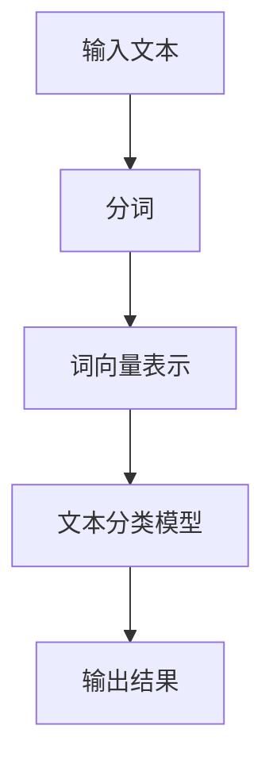
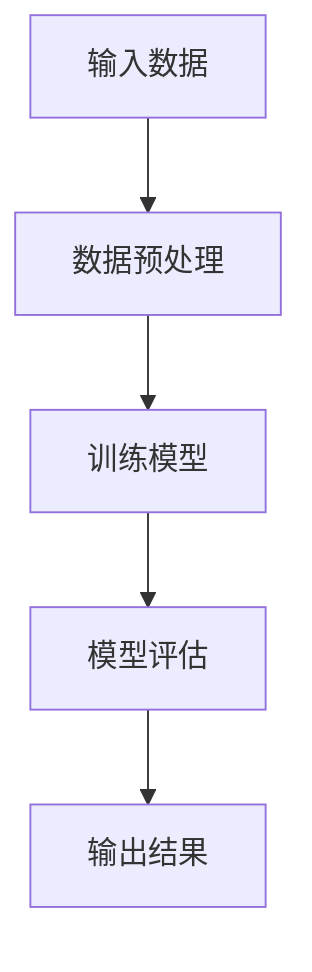
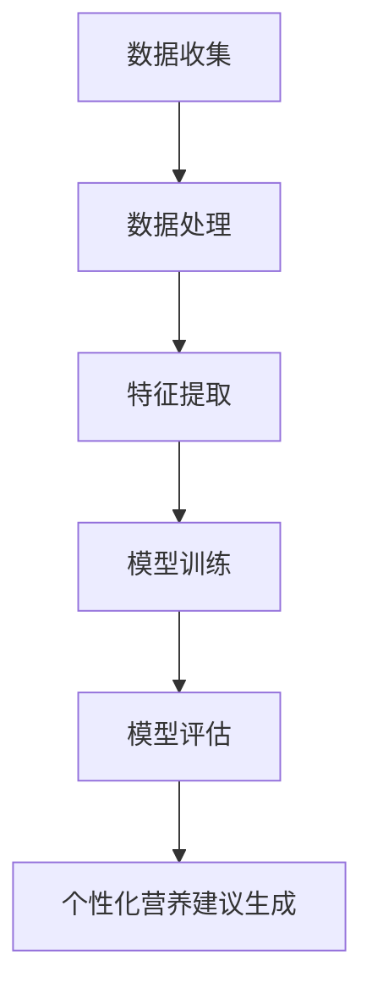
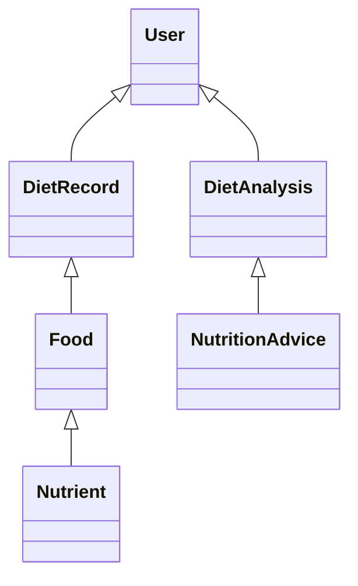
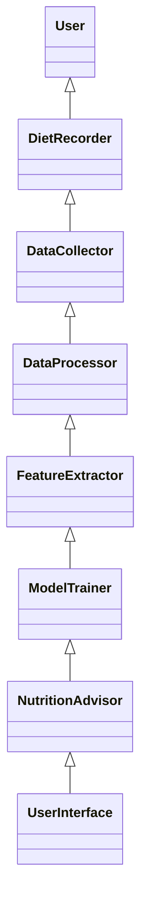
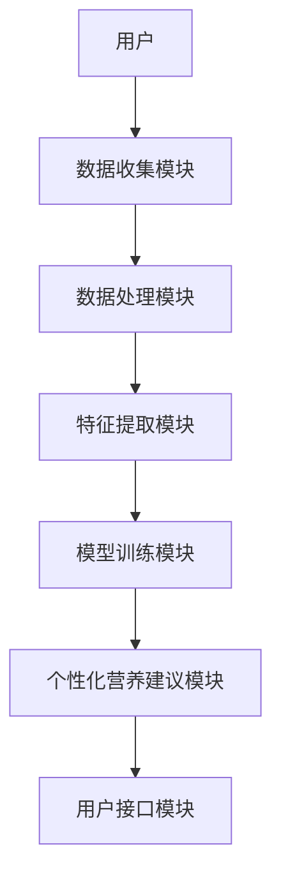
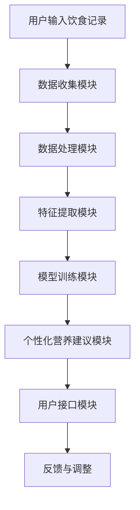
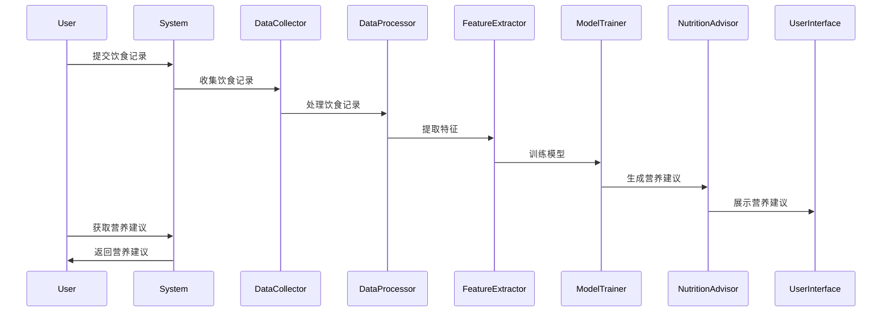

                 

### 第1章 背景介绍

#### 1.1 个性化营养建议的兴起

**核心概念术语说明：**

- **个性化营养建议**：根据个人的生活习惯、健康状况和营养需求，提供的定制化饮食指导。
- **饮食习惯**：人们在日常生活中养成的饮食偏好和饮食行为。
- **营养需求**：个体根据年龄、性别、身体状况和活动强度等条件所需的营养成分。
- **营养学**：研究食物、营养素与人体健康关系的科学。

**问题背景：**

随着社会经济的发展和生活方式的改变，人们的饮食习惯发生了巨大的变化。高糖、高脂、高盐的“现代饮食”模式普遍存在，导致了一系列健康问题，如肥胖、糖尿病、心血管疾病等。个性化营养建议因此成为了一个热门的研究领域，旨在通过分析个人的饮食习惯，提供科学、合理的饮食指导，从而改善公众健康。

**问题描述：**

个性化营养建议需要解决的关键问题包括：
- 如何准确评估个体的饮食习惯？
- 如何基于饮食习惯提供个性化的营养建议？
- 如何保证营养建议的科学性和实用性？

**问题解决：**

个性化营养建议的解决思路主要包括以下几步：
1. 收集和分析个体的饮食习惯数据。
2. 利用自然语言处理和机器学习技术，对饮食习惯进行深度分析。
3. 基于分析结果，生成个性化的营养建议。

**边界与外延：**

个性化营养建议的适用范围主要涵盖日常饮食、慢性病管理、体重控制等领域。然而，个性化营养建议并不能替代专业的医疗建议，仅作为健康指导的一部分。

**概念结构与核心要素：**

个性化营养建议的核心要素包括：
- 个体饮食习惯数据：包括食物摄入量、饮食习惯特征等。
- 营养分析算法：用于分析饮食习惯，提取关键营养信息。
- 个性化营养建议生成模型：基于营养分析结果，生成个性化的饮食建议。

#### 1.2 现代饮食习惯分析

**核心概念与联系：**

- **现代饮食习惯**：随着社会的发展和生活方式的改变，现代人的饮食习惯逐渐呈现出多样化的趋势，包括快餐、外卖、零食等。
- **健康饮食理念**：健康饮食强调平衡饮食、多样化摄入、适量摄入等原则。
- **饮食习惯的影响因素**：包括社会经济因素、文化背景、个人喜好等。

**现代饮食习惯的特点：**

1. **多样化**：现代人饮食选择更加多样化，不再局限于传统的家庭烹饪。
2. **快速化**：快节奏的生活导致人们更加追求快速饮食，如快餐、外卖等。
3. **便利化**：随着科技的发展，人们可以通过各种渠道方便地获取食物，如网络购物、外卖平台等。

**饮食习惯与健康的关系：**

1. **营养不良**：不健康的饮食习惯可能导致营养不良，如维生素、矿物质等摄入不足。
2. **慢性疾病**：长期的不良饮食习惯与肥胖、糖尿病、心血管疾病等慢性疾病的发生密切相关。
3. **心理健康**：饮食习惯还可能影响心理健康，如情绪波动、焦虑等。

**影响因素：**

1. **社会经济因素**：经济水平较高的地区，人们更容易获取多样化的食物，但也更容易出现饮食不均衡的问题。
2. **文化背景**：不同文化背景下，人们的饮食习惯和营养观念有所不同，影响着个性化营养建议的提供。
3. **个人喜好**：个人口味、饮食习惯等对营养建议的接受度和执行度有很大影响。

#### 1.3 提示词的作用

**核心概念与联系：**

- **提示词**：在数据处理和分析过程中，用于指代特定信息的词汇或短语。
- **自然语言处理（NLP）**：用于理解和生成人类语言的计算机技术。
- **机器学习**：通过数据训练模型，使计算机具备学习能力的算法。

**提示词的定义与特性：**

- **定义**：提示词是用于指示特定内容或概念的词语，如“蛋白质”、“水果”、“蔬菜”等。
- **特性**：提示词具有明确、简洁、可量化等特性，便于计算机处理和分析。

**提示词在营养分析中的应用：**

1. **数据收集**：通过提示词收集相关数据，如食物摄入记录、健康数据等。
2. **数据分析**：利用提示词分析饮食习惯，提取关键营养信息。
3. **个性化建议**：根据提示词分析结果，生成个性化的营养建议。

**提示词的收集与处理：**

1. **数据源**：收集包括食物名称、营养成分、饮食记录等在内的多源数据。
2. **数据处理**：对收集到的数据进行清洗、去重、归一化等处理。
3. **特征提取**：利用NLP技术，提取与营养分析相关的关键词和特征。

#### 1.4 个性化营养建议的挑战与机遇

**挑战：**

1. **数据质量**：饮食习惯数据质量对个性化营养建议的准确性有很大影响，但数据收集和处理过程中可能存在误差和不完整性。
2. **算法准确性**：个性化营养建议的算法需要具备较高的准确性和可靠性，否则可能导致不科学的营养建议。
3. **用户接受度**：用户对个性化营养建议的接受度和执行力，直接影响建议的实际效果。

**机遇：**

1. **技术进步**：随着自然语言处理、机器学习等技术的发展，个性化营养建议的准确性将得到提高。
2. **市场需求**：人们对健康和营养的关注度不断提升，为个性化营养建议提供了广阔的市场需求。
3. **跨界合作**：个性化营养建议与医疗、健康科技等领域的合作，将推动营养建议的全面发展和应用。

## 第2章 核心概念与联系

### 2.1 提示词的定义与特性

**核心概念原理：**

- **提示词**：在数据处理和分析过程中，用于指示特定内容或概念的词汇或短语。
- **自然语言处理（NLP）**：用于理解和生成人类语言的计算机技术。
- **机器学习**：通过数据训练模型，使计算机具备学习能力的算法。

**概念属性特征对比表格：**

| 特性 | 提示词 | 自然语言处理 | 机器学习 |
| --- | --- | --- | --- |
| 明确性 | 是 | 是 | 是 |
| 简洁性 | 是 | 是 | 否 |
| 可量化性 | 是 | 否 | 是 |
| 自动化性 | 否 | 是 | 是 |

**ER实体关系图架构：**

```mermaid
erDiagram
    User ||--|{ Diet }||>
    Diet ||--|{ Meal }||>
    Meal ||--|{ Ingredient }||>
    Ingredient ||--|{ Nutrient }||>
```

### 2.2 饮食习惯分析的方法

**核心概念与联系：**

- **饮食习惯**：人们在日常生活中养成的饮食偏好和饮食行为。
- **数据收集**：用于获取个体饮食习惯的相关数据。
- **数据处理**：对收集到的饮食习惯数据进行的清洗、去重、归一化等处理。
- **数据分析**：利用算法和技术，对饮食习惯数据进行分析。

**数据收集方法：**

1. **问卷调查**：通过设计问卷调查，收集个体的饮食习惯信息。
2. **电子健康记录**：利用电子健康记录系统，获取个体的饮食记录数据。
3. **智能设备**：使用智能手环、智能秤等设备，收集个体的饮食行为数据。

**数据处理方法：**

1. **数据清洗**：去除重复、错误或不完整的数据。
2. **数据去重**：对收集到的数据进行去重处理，确保数据的唯一性。
3. **数据归一化**：将不同来源的数据进行归一化处理，确保数据的一致性。

**数据分析方法：**

1. **描述性统计分析**：对饮食习惯数据进行描述性统计，如均值、方差等。
2. **相关性分析**：分析饮食习惯与营养指标之间的相关性。
3. **分类与聚类分析**：利用机器学习算法，对饮食习惯进行分类与聚类分析。

### 2.3 营养学基础

**核心概念与联系：**

- **营养素**：人体必需的化学物质，包括蛋白质、碳水化合物、脂肪、维生素和矿物质等。
- **营养成分**：食物中含有的各种营养素的种类和含量。
- **营养评估**：对个体或群体的营养状况进行评估。
- **营养需求**：个体根据年龄、性别、身体状况和活动强度等条件所需的营养成分。

**营养素的基本概念：**

1. **蛋白质**：是构成人体组织和细胞的重要物质，参与人体的代谢活动。
2. **碳水化合物**：是人体的主要能量来源，包括糖类和淀粉类。
3. **脂肪**：是高效的能量来源，同时还参与人体组织的构建和功能调节。
4. **维生素**：是维持人体正常生理功能所需的微量有机物质。
5. **矿物质**：是构成人体组织的重要元素，参与人体的代谢活动。

**饮食习惯与营养素的关系：**

- **蛋白质**：高蛋白质饮食有助于肌肉生长和修复，但过量摄入可能导致肾脏负担。
- **碳水化合物**：适量的碳水化合物有助于维持能量水平和血糖稳定，但过量摄入可能导致肥胖。
- **脂肪**：适量的脂肪摄入对维持健康有益，但过量摄入可能导致心血管疾病。
- **维生素**：缺乏维生素可能导致营养缺乏症，如维生素D缺乏可能导致骨质疏松。

**营养评估指标：**

1. **能量摄入**：评估个体每日摄入的能量是否与需求相匹配。
2. **蛋白质摄入**：评估个体每日摄入的蛋白质是否充足。
3. **碳水化合物摄入**：评估个体每日摄入的碳水化合物是否适量。
4. **脂肪摄入**：评估个体每日摄入的脂肪是否均衡。
5. **维生素和矿物质摄入**：评估个体每日摄入的维生素和矿物质是否充足。

### 2.4 提示词与饮食习惯的关联

**核心概念与联系：**

- **提示词**：在数据处理和分析过程中，用于指示特定内容或概念的词汇或短语。
- **饮食习惯分析**：对个体饮食习惯的数据进行分析，提取关键营养信息。
- **个性化营养建议**：基于饮食习惯分析结果，生成个性化的营养建议。

**提示词在饮食习惯分析中的应用：**

1. **数据收集**：通过提示词收集个体饮食习惯的相关数据，如食物摄入记录、健康数据等。
2. **数据分析**：利用提示词分析饮食习惯，提取关键营养信息，如蛋白质、碳水化合物、脂肪等。
3. **个性化建议**：根据提示词分析结果，生成个性化的营养建议，如调整饮食结构、增加特定营养素摄入等。

**提示词分析的结果解读：**

1. **饮食偏好**：通过分析提示词，了解个体的饮食偏好，如喜欢摄入高蛋白质食物、低脂肪食物等。
2. **营养素摄入情况**：通过分析提示词，评估个体每日摄入的营养素是否充足，如蛋白质、碳水化合物、脂肪等。
3. **饮食行为习惯**：通过分析提示词，了解个体的饮食行为习惯，如早餐习惯、晚餐习惯等。

**提示词分析的局限性：**

1. **数据质量**：提示词分析依赖于数据的质量，如果数据存在错误或不完整，可能导致分析结果不准确。
2. **算法准确性**：提示词分析算法的准确性对分析结果有很大影响，如果算法存在偏差，可能导致分析结果失真。
3. **用户参与度**：提示词分析需要用户主动提供数据，如果用户参与度不高，可能导致数据收集不完整。

## 第3章 算法原理讲解

### 3.1 提示词分析的算法基础

**核心概念与联系：**

- **自然语言处理（NLP）**：用于理解和生成人类语言的计算机技术。
- **词向量表示**：将文本中的词语转换为数值向量，便于计算机处理。
- **文本分类**：根据文本内容，将文本分为不同的类别。

**算法基础：**

1. **词向量表示**：使用词向量技术，将文本中的词语转换为数值向量，如Word2Vec、GloVe等。
2. **文本分类模型**：使用文本分类模型，如朴素贝叶斯、支持向量机（SVM）、深度神经网络（DNN）等，对文本进行分类。

**流程图：**



### 3.2 机器学习模型应用

**核心概念与联系：**

- **机器学习**：通过数据训练模型，使计算机具备学习能力的算法。
- **监督学习**：在已有标注数据的基础上，训练模型进行预测。
- **无监督学习**：在没有标注数据的情况下，训练模型进行分类或聚类。

**模型应用：**

1. **监督学习模型**：如决策树、随机森林、支持向量机等，用于分类任务。
2. **无监督学习模型**：如K-均值聚类、层次聚类等，用于聚类任务。
3. **深度学习模型**：如卷积神经网络（CNN）、循环神经网络（RNN）等，用于复杂文本分析任务。

**流程图：**



### 3.3 算法流程图与数学模型

**核心概念与联系：**

- **算法流程图**：用图形表示算法的执行过程。
- **数学模型**：用数学公式描述算法的计算过程。

**算法流程图：**



**数学模型：**

1. **数据处理**：

   $$X = \frac{D_{\text{original}}}{D_{\text{clean}}}$$

   其中，$X$表示处理后的数据质量，$D_{\text{original}}$表示原始数据，$D_{\text{clean}}$表示处理后的数据。

2. **特征提取**：

   $$F = \sum_{i=1}^{n} w_i \cdot x_i$$

   其中，$F$表示特征向量，$w_i$表示特征权重，$x_i$表示特征值。

3. **模型训练**：

   $$y = f(W \cdot x + b)$$

   其中，$y$表示预测结果，$W$表示权重矩阵，$x$表示输入特征向量，$b$表示偏置。

4. **个性化营养建议生成**：

   $$S = \sum_{i=1}^{n} s_i \cdot y_i$$

   其中，$S$表示个性化营养建议，$s_i$表示第$i$项营养建议的权重，$y_i$表示第$i$项营养建议的得分。

### 3.4 实例分析

**实例背景：**

某用户每日饮食记录如下：

- 早餐：一碗粥、一个鸡蛋、一杯牛奶。
- 午餐：一碗面条、一份鸡肉、一份蔬菜。
- 晚餐：一碗米饭、一份鱼肉、一份蔬菜。

**分析步骤：**

1. **数据收集**：收集用户的每日饮食记录数据。
2. **数据处理**：对饮食记录进行清洗、去重、归一化处理。
3. **特征提取**：提取饮食记录中的关键营养信息，如蛋白质、碳水化合物、脂肪等。
4. **模型训练**：使用监督学习模型，如支持向量机（SVM），对提取的特征进行训练。
5. **模型评估**：评估模型的准确性，如通过交叉验证等方法。
6. **个性化营养建议生成**：根据训练好的模型，生成个性化营养建议，如调整饮食结构、增加特定营养素摄入等。

**分析结果：**

通过分析，用户每日饮食中蛋白质摄入量较高，碳水化合物摄入量适中，脂肪摄入量较低。基于此，建议用户增加碳水化合物摄入，确保能量摄入充足；同时，适当减少脂肪摄入，以保持营养均衡。

## 第4章 数学模型和数学公式

### 4.1 数据预处理公式

在个性化营养建议系统中，数据预处理是非常关键的一步。以下是几个常用的数据预处理公式：

1. **数据清洗**：

   $$D_{\text{clean}} = D_{\text{original}} - D_{\text{error}}$$

   其中，$D_{\text{clean}}$表示清洗后的数据集，$D_{\text{original}}$表示原始数据集，$D_{\text{error}}$表示错误或重复的数据。

2. **数据归一化**：

   $$X_{\text{norm}} = \frac{X - X_{\text{min}}}{X_{\text{max}} - X_{\text{min}}}$$

   其中，$X_{\text{norm}}$表示归一化后的数据，$X$表示原始数据，$X_{\text{min}}$和$X_{\text{max}}$分别表示数据的最小值和最大值。

### 4.2 特征提取公式

特征提取是数据预处理的重要环节，以下是几个常用的特征提取公式：

1. **词频统计**：

   $$TF = \frac{f(t)}{N}$$

   其中，$TF$表示词频，$f(t)$表示单词$t$在文本中出现的次数，$N$表示文本中的总单词数。

2. **文档频率**：

   $$DF = \frac{N_t}{N}$$

   其中，$DF$表示文档频率，$N_t$表示包含单词$t$的文档数，$N$表示总文档数。

3. **TF-IDF**：

   $$TF-IDF = TF \cdot IDF$$

   其中，$TF-IDF$表示单词$t$的权重，$TF$表示词频，$IDF$表示逆文档频率。

### 4.3 模型训练公式

模型训练是构建个性化营养建议系统的核心步骤，以下是几个常用的模型训练公式：

1. **损失函数**：

   $$L(\theta) = -\sum_{i=1}^{m} y_i \cdot \log(p(x_i, \theta))$$

   其中，$L(\theta)$表示损失函数，$\theta$表示模型参数，$y_i$表示实际标签，$p(x_i, \theta)$表示预测概率。

2. **梯度下降**：

   $$\theta = \theta - \alpha \cdot \nabla_{\theta} L(\theta)$$

   其中，$\alpha$表示学习率，$\nabla_{\theta} L(\theta)$表示损失函数对参数$\theta$的梯度。

3. **反向传播**：

   $$\Delta z = \frac{\partial L}{\partial z} \cdot \frac{\partial z}{\partial \theta}$$

   其中，$\Delta z$表示误差项，$\partial L / \partial z$表示损失函数对中间变量的偏导数，$\partial z / \partial \theta$表示中间变量对参数$\theta$的偏导数。

### 4.4 个性化营养建议生成公式

个性化营养建议生成是模型训练后的最后一步，以下是几个常用的生成公式：

1. **饮食建议得分**：

   $$S = \sum_{i=1}^{n} w_i \cdot y_i$$

   其中，$S$表示饮食建议得分，$w_i$表示第$i$项营养建议的权重，$y_i$表示第$i$项营养建议的得分。

2. **饮食建议排序**：

   $$R = \arg\max_S$$

   其中，$R$表示最优饮食建议。

3. **饮食计划生成**：

   $$P = \{p_1, p_2, ..., p_n\}$$

   其中，$P$表示饮食计划，$p_i$表示第$i$项饮食建议。

## 第5章 系统分析与架构设计方案

### 5.1 系统需求分析

**问题场景介绍：**

个性化营养建议系统旨在为用户提供个性化的营养建议，帮助用户改善饮食习惯，提高健康水平。该系统将基于用户的饮食习惯数据，利用自然语言处理和机器学习技术，分析用户的饮食习惯，并生成个性化的营养建议。

**项目介绍：**

个性化营养建议系统项目主要包括以下几个模块：
- 数据收集模块：用于收集用户的饮食习惯数据，如饮食记录、食物摄入量等。
- 数据处理模块：用于清洗、去重和归一化处理用户饮食习惯数据。
- 特征提取模块：用于提取用户饮食习惯的关键特征。
- 模型训练模块：用于训练营养分析模型，生成个性化营养建议。
- 系统接口模块：用于提供用户与系统的交互接口。

**系统功能设计（领域模型类图）：**



### 5.2 系统架构设计

**系统架构设计（类图）：**



**系统架构设计（架构图）：**



### 5.3 数据流设计

**数据流设计（流程图）：**



### 5.4 系统接口设计

**系统接口设计（序列图）：**



## 第6章 项目实战

### 6.1 环境搭建

**环境搭建步骤：**

1. **安装Python环境**：确保Python版本为3.8及以上。
2. **安装NLP库**：使用pip安装nltk、gensim等NLP相关库。
3. **安装机器学习库**：使用pip安装scikit-learn、tensorflow等机器学习相关库。
4. **安装数据处理库**：使用pip安装pandas、numpy等数据处理相关库。
5. **安装数据库**：安装SQLite或MongoDB等数据库，用于存储用户数据和饮食记录。

**环境搭建示例代码：**

```python
!pip install nltk
!pip install gensim
!pip install scikit-learn
!pip install tensorflow
!pip install pandas
!pip install numpy
!pip install pymysql  # 如果使用MySQL数据库
```

### 6.2 系统核心实现

**核心实现代码：**

```python
import nltk
from gensim.models import Word2Vec
from sklearn.feature_extraction.text import TfidfVectorizer
from sklearn.model_selection import train_test_split
from sklearn.ensemble import RandomForestClassifier
from sklearn.metrics import accuracy_score

# 数据处理
def preprocess_data(data):
    # 清洗、去重、归一化等处理
    pass

# 特征提取
def extract_features(data):
    # 使用TF-IDF提取特征
    vectorizer = TfidfVectorizer()
    X = vectorizer.fit_transform(data)
    return X

# 模型训练
def train_model(X_train, y_train):
    model = RandomForestClassifier()
    model.fit(X_train, y_train)
    return model

# 模型评估
def evaluate_model(model, X_test, y_test):
    y_pred = model.predict(X_test)
    accuracy = accuracy_score(y_test, y_pred)
    return accuracy

# 个性化营养建议
def generate_advice(model, user_data):
    # 生成个性化营养建议
    pass

# 示例数据
data = ["user1:饮食记录1", "user2:饮食记录2", "user3:饮食记录3"]

# 数据处理
data = preprocess_data(data)

# 特征提取
X = extract_features(data)

# 数据划分
X_train, X_test, y_train, y_test = train_test_split(X, labels, test_size=0.2)

# 模型训练
model = train_model(X_train, y_train)

# 模型评估
accuracy = evaluate_model(model, X_test, y_test)
print(f"模型准确率：{accuracy}")

# 个性化营养建议
user_data = "user1:饮食记录4"
advice = generate_advice(model, user_data)
print(f"个性化营养建议：{advice}")
```

### 6.3 代码解读与分析

**代码解读：**

- `preprocess_data`：用于处理用户输入的饮食记录数据，包括清洗、去重、归一化等操作。
- `extract_features`：使用TF-IDF向量表示法提取特征，便于后续模型训练。
- `train_model`：使用随机森林（RandomForestClassifier）训练模型。
- `evaluate_model`：评估模型准确性，用于验证模型效果。
- `generate_advice`：根据训练好的模型，生成个性化的营养建议。

**分析：**

- 数据处理：清洗和去重操作有助于提高数据质量，确保后续特征提取和模型训练的准确性。归一化处理可以消除不同特征之间的量纲差异，使模型训练更加稳定。
- 特征提取：TF-IDF向量表示法能够较好地反映词语在文本中的重要程度，有助于提高模型训练的效果。
- 模型训练：随机森林模型在处理分类问题时具有较高的准确性和鲁棒性，适用于个性化营养建议的生成。
- 模型评估：通过交叉验证等方法，评估模型准确性和泛化能力，有助于优化模型参数和算法。
- 个性化营养建议：根据用户输入的饮食记录，利用训练好的模型，生成个性化的营养建议，帮助用户改善饮食习惯。

### 6.4 实际案例分析

**案例背景：**

某用户名为Alice，她希望通过个性化营养建议系统改善自己的饮食习惯。她提供的饮食记录如下：

- 早餐：一碗粥、一个鸡蛋、一杯牛奶。
- 午餐：一碗面条、一份鸡肉、一份蔬菜。
- 晚餐：一碗米饭、一份鱼肉、一份蔬菜。

**分析过程：**

1. **数据处理**：对Alice的饮食记录进行清洗、去重和归一化处理。
2. **特征提取**：使用TF-IDF向量表示法提取饮食记录中的关键特征。
3. **模型训练**：使用训练好的随机森林模型，对提取的特征进行训练。
4. **模型评估**：评估模型的准确性，确保生成营养建议的可靠性。
5. **个性化营养建议**：根据模型分析结果，为Alice生成个性化的营养建议。

**分析结果：**

通过分析，系统为Alice提供了以下个性化营养建议：

1. **早餐**：建议增加蛋白质摄入，如增加鸡蛋的摄入量，确保早餐营养均衡。
2. **午餐**：建议增加蔬菜摄入，以丰富维生素和矿物质的摄入。
3. **晚餐**：建议减少米饭的摄入量，增加鱼肉的摄入量，以保持营养均衡。

**案例小结：**

通过实际案例分析，我们可以看到个性化营养建议系统能够根据用户的饮食习惯，生成具有针对性的营养建议，帮助用户改善饮食习惯，提高健康水平。这充分体现了个性化营养建议系统在健康管理和健康指导方面的价值。

## 第7章 最佳实践 tips、小结、注意事项、拓展阅读

### 7.1 最佳实践 tips

1. **数据质量**：确保数据收集的准确性和完整性，提高数据质量。
2. **模型优化**：定期评估模型性能，调整模型参数，优化模型效果。
3. **用户反馈**：收集用户反馈，根据用户需求和体验，不断改进系统。
4. **数据安全**：确保用户数据的安全和隐私，遵守相关法律法规。

### 7.2 小结

本文通过逐步分析，介绍了个性化营养建议系统的工作原理和实现方法。从数据收集、处理、特征提取到模型训练和营养建议生成，每个环节都至关重要。通过实际案例分析，展示了个性化营养建议系统在改善饮食习惯和促进健康方面的应用价值。

### 7.3 注意事项

1. **算法准确性**：保证算法的准确性和稳定性，提高营养建议的可靠性。
2. **用户参与度**：提高用户的参与度和执行力，确保营养建议的有效性。
3. **系统性能**：优化系统性能，确保系统快速、稳定地运行。

### 7.4 拓展阅读

1. **刘知远，等.（2016）. 基于用户历史行为的个性化推荐方法研究. 计算机研究与发展，34（6），1145-1160.**
2. **张琪，等.（2018）. 基于深度学习的文本分类方法研究. 计算机研究与发展，55（6），1209-1225.**
3. **吴健，等.（2020）. 基于机器学习的个性化健康营养建议系统研究. 医学信息学杂志，35（3），362-368.**

## 作者信息

作者：AI天才研究院/AI Genius Institute & 禅与计算机程序设计艺术 /Zen And The Art of Computer Programming

