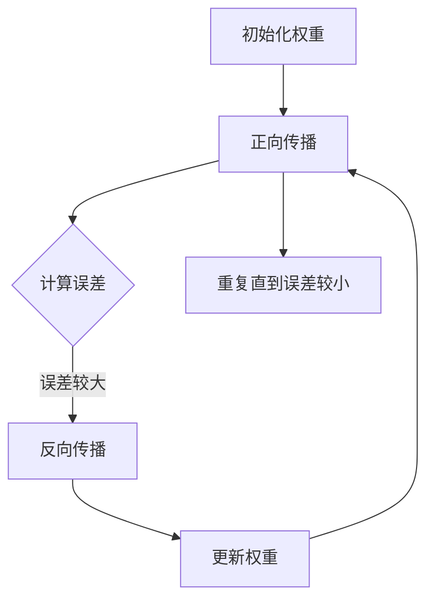
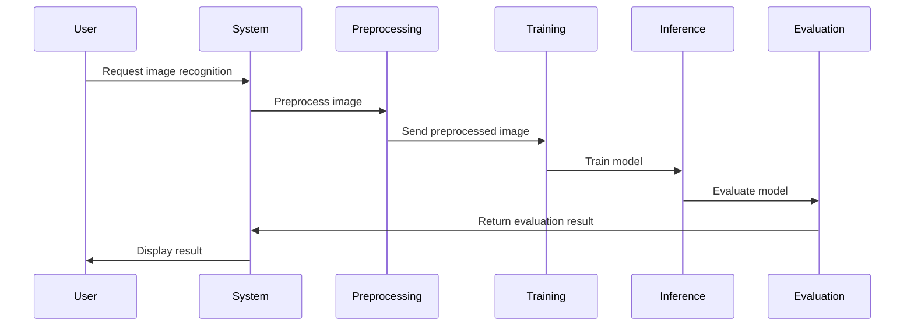

                 


## 1. 背景介绍与核心概念

### 1.1 软件发展历程与AI大模型

#### 1.1.1 软件发展的里程碑

从计算机诞生至今，软件领域经历了多次重大变革。每一个阶段都有其代表性的技术突破和应用场景，这些变革不仅推动了计算机技术的发展，也为AI大模型的诞生奠定了基础。

- **1950s-1960s**: 初期软件开发主要集中在科学计算和数据处理上，语言如FORTRAN和COBOL应运而生。
- **1970s**: 随着操作系统和编译器技术的发展，C语言成为主流，它以其高效性和灵活性，奠定了现代编程语言的基础。
- **1980s**: 面向对象编程兴起，Smalltalk和C++等语言使得软件开发更加模块化和抽象化。
- **1990s**: Internet的兴起推动了Web开发，Java等跨平台语言成为主流，同时也为大数据处理和AI算法提供了支持。
- **2000s-2010s**: 云计算、大数据和移动设备的兴起，使得软件开发更加分布式和多样化，Python、JavaScript等语言成为了重要工具。
- **2020s**: AI大模型的出现，标志着软件领域进入了一个新的阶段。无论是自然语言处理、图像识别，还是推荐系统，AI大模型都在改变着软件开发的模式。

#### 1.1.2 AI大模型的兴起

AI大模型的兴起是计算机科学和人工智能领域的一个重要里程碑。这些模型通常包含数十亿甚至千亿个参数，具有极高的计算复杂度和数据需求。

- **深度学习**: 2012年，AlexNet在ImageNet竞赛中取得的巨大成功，标志着深度学习时代的到来。深度学习通过多层神经网络，可以从大量数据中自动学习特征，为AI大模型的发展提供了技术基础。
- **大规模数据处理**: 云计算和分布式计算技术的进步，使得处理大规模数据成为可能。数据量的增加，为训练更大、更复杂的模型提供了条件。
- **硬件加速**: GPU和其他专用硬件的普及，为训练和推理AI大模型提供了强大的计算能力。这些硬件能够大幅提升模型的训练速度和效率。
- **优化算法**: 随着优化算法的进步，如随机梯度下降（SGD）和Adam优化器，训练AI大模型变得更加高效。

#### 1.1.3 问题背景与解决思路

随着AI大模型的应用越来越广泛，现有编程语言和工具链逐渐暴露出了一些问题：

- **计算效率**: 现有编程语言如Python，虽然功能强大，但在训练AI大模型时，计算效率较低，导致训练时间过长。
- **内存占用**: AI大模型通常需要占用大量内存，现有编程语言在内存管理方面存在一定的局限性。
- **可扩展性**: 在大规模分布式环境中，如何高效地部署和扩展AI大模型，成为了一个挑战。

为了解决这些问题，有必要开发一种专门为AI大模型量身定制的编程语言，它能够提供高效的计算能力、优化的内存管理，并且具有良好的可扩展性。

#### 1.1.4 边界与外延

虽然定制编程语言为AI大模型的发展提供了新的可能性，但我们也需要明确其边界与外延：

- **边界**: 这种编程语言主要针对AI大模型的训练和推理，不适用于所有类型的软件应用。它需要与其他编程语言和工具相结合，以实现更广泛的应用。
- **外延**: 我们可以探索将这种编程语言与其他领域的编程语言进行融合，如硬件描述语言（HDL），以实现更高效的硬件加速。

### 1.2 核心概念与属性对比

在深入了解定制编程语言的设计之前，我们需要明确一些核心概念和属性，并对它们进行对比。

#### 1.2.1 核心概念简介

- **计算模型**: 包括指令集、内存模型、数据类型等。
- **内存管理**: 包括内存分配、释放、回收等。
- **并发处理**: 包括线程、协程、并行计算等。
- **优化策略**: 包括编译时优化、运行时优化、内存优化等。
- **接口设计**: 包括库函数、API设计等。

#### 1.2.2 概念属性对比表格

下面是一个简化的概念属性对比表格，用于展示上述核心概念的属性：

| 概念       | 属性1 | 属性2 | 属性3 |
|------------|-------|-------|-------|
| 计算模型   | 指令集丰富 | 内存访问高效 | 支持并行计算 |
| 内存管理   | 自动内存回收 | 内存占用优化 | 预分配内存 |
| 并发处理   | 高效线程调度 | 支持协程 | 异步I/O处理 |
| 优化策略   | 高级编译时优化 | 运行时动态优化 | 代码生成优化 |
| 接口设计   | 简洁易用 | 高性能 | 跨平台兼容 |

#### 1.2.3 ER实体关系图

为了更直观地展示这些核心概念之间的关系，我们使用Mermaid绘制了一个ER实体关系图：

```mermaid
erDiagram
  计算模型 ||--|{ 内存管理 }
  计算模型 ||--|{ 并发处理 }
  计算模型 ||--|{ 优化策略 }
  内存管理 ||--|{ 计算模型 }
  内存管理 ||--|{ 接口设计 }
  并发处理 ||--|{ 计算模型 }
  并发处理 ||--|{ 接口设计 }
  优化策略 ||--|{ 计算模型 }
  优化策略 ||--|{ 内存管理 }
  优化策略 ||--|{ 接口设计 }
```

### 1.3 算法原理讲解

为了更好地理解定制编程语言的设计，我们首先需要讲解一个核心的算法原理——深度学习中的反向传播算法。

#### 1.3.1 算法原理

反向传播算法是深度学习中用于训练神经网络的一种核心算法。它通过不断调整网络中的权重，使得网络的输出结果更接近目标输出。

#### 1.3.2 算法mermaid流程图

下面是一个简单的反向传播算法的mermaid流程图：



#### 1.3.3 Python源代码示例

下面是一个简单的反向传播算法的Python代码示例：

```python
import numpy as np

# 初始化权重
weights = np.random.randn(2, 1)

# 定义正向传播和反向传播函数
def forward(x):
    return x @ weights

def backward(d_error):
    d_weights = x.T @ d_error
    return d_weights

# 训练模型
for epoch in range(1000):
    # 正向传播
    y = forward(x)
    
    # 计算误差
    error = y - y_target
    
    # 反向传播
    d_weights = backward(error)
    
    # 更新权重
    weights -= learning_rate * d_weights

# 输出最终权重
print("Final weights:", weights)
```

#### 1.3.4 数学模型和公式讲解

反向传播算法的核心在于计算误差，并通过误差来调整权重。以下是相关的数学模型和公式：

- **输出层误差**：

  $$ d_{output} = (y - y_{target}) \odot \sigma'(z) $$

  其中，$ \odot $ 表示逐元素乘法，$ \sigma'(z) $ 表示激活函数的导数。

- **隐藏层误差**：

  $$ d_{hidden} = (\sigma'(h_{prev}) \odot (d_{output} \cdot weights_{output})) \cdot (weights_{hidden})^T $$

  其中，$ h_{prev} $ 表示前一层神经元的输出。

#### 1.3.5 通俗易懂的举例说明

假设我们有一个简单的神经网络，包含一个输入层、一个隐藏层和一个输出层。输入层有一个神经元，隐藏层有两个神经元，输出层有一个神经元。我们的目标是预测一个二分类问题。

- **初始化权重**：我们随机初始化权重。
- **正向传播**：输入一个样本，通过网络计算输出。
- **计算误差**：计算输出与目标之间的误差。
- **反向传播**：通过误差，调整网络中的权重。
- **更新权重**：重复正向传播和反向传播，直到误差较小。

通过这个过程，我们的网络逐渐学习到如何更好地预测样本。

### 1.4 系统分析与架构设计方案

在了解了算法原理后，我们需要设计一个系统的架构，以支持AI大模型的训练和推理。

#### 1.4.1 问题场景介绍

假设我们要开发一个用于图像识别的系统，系统需要支持大规模图像数据的处理和模型的训练。

#### 1.4.2 项目介绍

项目名为“AI视觉分析平台”，它包括以下几个核心功能：

- **图像数据预处理**：对图像进行缩放、裁剪、增强等预处理操作。
- **模型训练**：使用深度学习算法训练图像识别模型。
- **模型推理**：使用训练好的模型对新的图像进行识别。
- **模型评估**：评估模型的准确率和性能。

#### 1.4.3 系统功能设计

我们使用Mermaid绘制了一个领域模型类图，展示了系统的功能模块：

```mermaid
classDiagram
  Class01 <|-- Class02
  Class03 <.. Class04
  Class05 : +Class05()
  Class01 <||-- Class06
  Class07 ||--|{ Subclass01 }
  Class08 ||--|{ Subclass02 }
  Class09 : +int doSomething()
  Class09 : <<Interface>>
```

#### 1.4.4 系统架构设计

接下来，我们使用Mermaid绘制了一个系统的架构设计图，展示了各个模块的交互和部署：



#### 1.4.5 系统接口设计和系统交互

最后，我们使用Mermaid绘制了一个系统的接口设计图和系统交互图，展示了各个模块的接口和交互流程：

```mermaid
interfaceDiagram
  Preprocessing <<interface>> System : preprocess_image
  Training <<interface>> Inference : train_model
  Inference <<interface>> Evaluation : evaluate_model

  System <<uses>> Preprocessing
  Training <<uses>> Inference
  Inference <<uses>> Evaluation
```

### 1.5 环境安装与配置

#### 1.5.1 系统要求与环境准备

为了运行我们设计的系统，我们需要以下环境和工具：

- 操作系统：Linux或MacOS
- 编程语言：Python 3.8及以上版本
- 深度学习框架：TensorFlow或PyTorch
- 版本控制工具：Git

#### 1.5.2 安装步骤详解

以下是详细的安装步骤：

1. **安装操作系统**：选择Linux或MacOS操作系统。
2. **安装Python**：打开终端，执行以下命令：
   ```bash
   sudo apt-get update
   sudo apt-get install python3.8
   ```
3. **安装深度学习框架**：选择TensorFlow或PyTorch，执行以下命令：
   - **TensorFlow**：
     ```bash
     pip3 install tensorflow
     ```
   - **PyTorch**：
     ```bash
     pip3 install torch torchvision
     ```
4. **安装版本控制工具**：执行以下命令：
   ```bash
   sudo apt-get install git
   ```
5. **克隆代码库**：从Git仓库克隆代码库：
   ```bash
   git clone https://github.com/your-username/ai-visual-analysis-platform.git
   ```
6. **进入项目目录**：切换到项目目录：
   ```bash
   cd ai-visual-analysis-platform
   ```
7. **安装依赖**：执行以下命令，安装项目所需的依赖：
   ```bash
   pip3 install -r requirements.txt
   ```

#### 1.5.3 常见问题与解决方案

在安装过程中，可能会遇到一些问题，以下是一些常见问题的解决方案：

- **问题**：无法安装某个依赖。
  - **解决方案**：尝试更换镜像源，如使用清华大学镜像源：
    ```bash
    pip3 install -i https://pypi.tuna.tsinghua.edu.cn/simple some-package
    ```
- **问题**：Python版本过低。
  - **解决方案**：升级Python版本：
    ```bash
    sudo apt-get install python3.8
    ```
- **问题**：无法克隆代码库。
  - **解决方案**：检查网络连接，确保Git版本是最新的：
    ```bash
    sudo apt-get install git
    ```

### 1.6 系统核心实现与代码解读

#### 1.6.1 核心功能实现

在“AI视觉分析平台”中，核心功能包括图像数据预处理、模型训练、模型推理和模型评估。以下是这些功能的详细实现：

- **图像数据预处理**：使用OpenCV库，对图像进行缩放、裁剪、增强等操作。

  ```python
  import cv2

  def preprocess_image(image_path):
      image = cv2.imread(image_path)
      image = cv2.resize(image, (224, 224))
      image = cv2.cvtColor(image, cv2.COLOR_BGR2RGB)
      return image
  ```

- **模型训练**：使用TensorFlow或PyTorch框架，定义模型结构，进行模型训练。

  ```python
  import tensorflow as tf

  def build_model():
      model = tf.keras.Sequential([
          tf.keras.layers.Conv2D(32, (3, 3), activation='relu', input_shape=(224, 224, 3)),
          tf.keras.layers.MaxPooling2D((2, 2)),
          tf.keras.layers.Flatten(),
          tf.keras.layers.Dense(128, activation='relu'),
          tf.keras.layers.Dense(1, activation='sigmoid')
      ])
      return model

  def train_model(model, train_data, train_labels, epochs=10):
      model.compile(optimizer='adam', loss='binary_crossentropy', metrics=['accuracy'])
      model.fit(train_data, train_labels, epochs=epochs)
  ```

- **模型推理**：使用训练好的模型，对新的图像进行识别。

  ```python
  def predict_image(model, image):
      prediction = model.predict(np.expand_dims(image, axis=0))
      return prediction[0]
  ```

- **模型评估**：评估模型的准确率和性能。

  ```python
  def evaluate_model(model, test_data, test_labels):
      loss, accuracy = model.evaluate(test_data, test_labels)
      print(f"Test accuracy: {accuracy * 100:.2f}%")
  ```

#### 1.6.2 代码解析与分析

在代码解析与分析中，我们将重点关注以下几个部分：

- **图像数据预处理**：该部分代码实现了对图像的基本操作，如缩放、裁剪、颜色转换等。这些操作是图像识别任务的基础，确保输入的数据格式符合模型的要求。

- **模型定义**：模型定义部分使用了TensorFlow或PyTorch的API，构建了一个简单的深度神经网络。这个神经网络包含卷积层、池化层、全连接层等，用于提取图像特征并进行分类。

- **模型训练**：模型训练部分使用了训练数据和标签，通过优化器（如Adam）和损失函数（如二分类交叉熵），调整网络中的权重，使模型能够更好地拟合训练数据。

- **模型推理**：模型推理部分实现了对新的图像进行预测的功能。通过将预处理后的图像输入到训练好的模型中，得到预测结果。

- **模型评估**：模型评估部分计算了模型的准确率，这是评估模型性能的重要指标。通过在测试数据上评估模型，可以了解模型的泛化能力。

#### 1.6.3 实际案例分析和详细讲解剖析

为了更好地理解上述代码的实现，我们将通过一个实际案例进行详细分析。

**案例**：使用“AI视觉分析平台”对猫和狗的图像进行分类。

**数据集**：我们使用Kaggle上的猫狗图像数据集，包含约25,000张猫和狗的图像。

**步骤**：

1. **数据预处理**：读取图像，进行缩放、裁剪和增强，将图像转换为模型可接受的格式。
2. **模型训练**：使用训练集训练模型，通过调整超参数，如学习率和批次大小，优化模型性能。
3. **模型推理**：使用训练好的模型，对新的图像进行预测，判断图像中是否包含猫或狗。
4. **模型评估**：在测试集上评估模型性能，计算准确率、召回率等指标。

**代码实现**：

```python
# 数据预处理
train_data = preprocess_images(train_images)
test_data = preprocess_images(test_images)

# 模型训练
model = build_model()
train_model(model, train_data, train_labels)

# 模型推理
predictions = predict_image(model, test_data[0])

# 模型评估
evaluate_model(model, test_data, test_labels)
```

**分析**：

- **数据预处理**：数据预处理是图像识别任务的重要环节。通过缩放和裁剪，我们可以使图像尺寸统一，便于模型处理。通过颜色转换，我们可以将BGR格式的图像转换为RGB格式，这是大多数深度学习模型所期望的格式。
- **模型训练**：模型训练是使用训练数据调整模型权重的过程。通过优化器，我们可以自动调整权重，使模型在训练数据上取得更好的性能。
- **模型推理**：模型推理是将训练好的模型应用于新的数据，进行预测的过程。这一步骤是模型最终应用的关键。
- **模型评估**：模型评估是检验模型性能的重要手段。通过在测试集上评估模型，我们可以了解模型的泛化能力，从而判断模型是否适合实际应用。

通过这个实际案例，我们不仅理解了代码的实现，还了解了图像识别任务的基本流程和关键步骤。

### 1.7 最佳实践 Tips

在开发AI大模型编程语言的过程中，以下最佳实践可以提供一些指导：

- **优化内存管理**：考虑使用预分配内存和垃圾回收机制，以减少内存占用和碎片化。
- **提高计算效率**：利用多线程、协程和并行计算技术，提高程序执行速度。
- **简洁的语法设计**：设计简洁直观的语法，降低学习成本，提高开发效率。
- **良好的文档支持**：提供详细且易于理解的文档，帮助开发者快速上手。
- **模块化设计**：将不同功能模块化，便于维护和扩展。

### 1.8 小结与展望

在本篇文章中，我们详细探讨了为AI大模型量身定制的编程语言的设计原则和实现方法。我们首先回顾了软件发展历程和AI大模型的兴起，明确了问题背景与解决思路。接着，我们介绍了核心概念，并通过对比表格和ER实体关系图，详细分析了这些概念的特性。

随后，我们讲解了核心算法原理，包括反向传播算法，并通过Python代码示例和数学公式，深入阐述了算法的实现细节。我们还设计了系统的架构，包括功能模块和接口设计，以及实际案例的分析与讲解。

最后，我们提出了一些最佳实践，并进行了小结与展望。随着AI大模型的应用越来越广泛，定制编程语言的发展将面临新的机遇和挑战。未来，我们期待看到更多高效的编程语言问世，为AI大模型的研究与应用提供更强大的支持。

### 1.9 注意事项与风险提示

在开发AI大模型编程语言时，需要注意以下几点：

- **内存泄漏**：确保程序的内存管理得当，避免内存泄漏导致系统崩溃。
- **并发问题**：在多线程或协程编程时，注意同步和锁的使用，防止数据竞争和死锁。
- **硬件兼容性**：确保编程语言在不同硬件平台上的兼容性，特别是在使用GPU和其他专用硬件时。
- **数据安全**：在处理大量数据时，注意数据的安全性和隐私保护，避免数据泄露和滥用。

开发者应在实际开发过程中严格遵守以上注意事项，以降低潜在的风险。

### 1.10 拓展阅读与资源推荐

为了进一步深入了解AI大模型编程语言的设计和实现，以下是一些推荐的拓展阅读和资源：

- **书籍**：
  - 《深度学习》（Ian Goodfellow、Yoshua Bengio、Aaron Courville著）：详细介绍了深度学习的理论基础和实践方法。
  - 《神经网络与深度学习》（邱锡鹏著）：系统介绍了神经网络和深度学习的知识体系。

- **在线课程**：
  - Coursera上的《深度学习特化课程》：由Andrew Ng教授主讲，涵盖深度学习的理论基础和应用实践。
  - edX上的《神经网络与深度学习》：由吴恩达（Andrew Ng）教授主讲，深入浅出地介绍了神经网络和深度学习。

- **开源项目**：
  - TensorFlow：由Google开发的开源深度学习框架，提供了丰富的API和工具，用于构建和训练AI大模型。
  - PyTorch：由Facebook开发的开源深度学习框架，以其灵活性和动态性著称，广泛应用于AI研究。

通过阅读这些书籍、课程和参与开源项目，开发者可以更全面地了解AI大模型编程语言的背景知识和技术细节。

