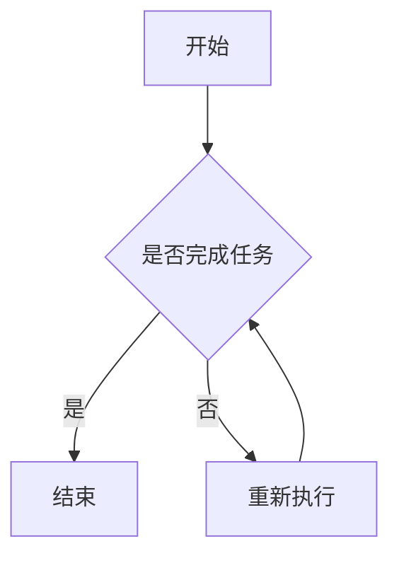

                 

## 引言

随着技术的迅猛发展和市场竞争的日益激烈，技术团队在企业发展中的地位愈发重要。为了确保团队高效运作、目标明确且成果显著，有效的管理方法成为了关键。OKR（Objectives and Key Results，目标与关键结果）作为一种目标和绩效管理工具，已被众多企业广泛应用于各个领域，尤其是在技术团队的管理中。

### 什么是OKR？

OKR是由英特尔前CEO安迪·格鲁夫（Andy Grove）在1970年代初期提出的，后来被约翰·杜尔（John Doerr）在谷歌等公司推广。OKR由两个核心部分组成：目标（Objective）和关键结果（Key Results）。目标描述了想要实现的战略意图，而关键结果则是可量化的指标，用来衡量目标是否实现。

### OKR的优势

OKR具有以下几个显著优势：

1. **明确目标**：通过设定明确的目标，确保团队成员了解他们需要达成的目标。
2. **量化绩效**：关键结果使得绩效评价变得客观且可量化，有助于提高透明度和协作效率。
3. **持续反馈**：定期回顾OKR，有助于团队成员及时调整方向，确保团队始终朝着正确方向前进。
4. **激励创新**：OKR鼓励团队成员跳出舒适区，追求更高的目标和更好的结果。
5. **提高执行力**：通过明确的目标和关键结果，团队可以更加高效地规划和执行工作。

### 为什么在技术团队中使用OKR？

技术团队通常面临复杂的项目和快速变化的技术环境，这使得传统的管理方法难以奏效。OKR能够帮助技术团队：

1. **统一目标**：确保团队成员的目标与公司战略保持一致，提高团队协作效率。
2. **管理复杂项目**：通过明确的目标和关键结果，简化项目管理和任务分配。
3. **快速适应变化**：OKR使得团队能够快速响应市场变化和技术进步。
4. **提高创新动力**：鼓励团队成员追求更高的技术目标，推动技术突破。

### 文章结构

本文将分为以下几个部分：

1. **背景介绍**：详细解释OKR的起源、发展及其在技术团队管理中的重要性。
2. **核心概念**：阐述OKR的定义、核心要素及其与KPI的区别。
3. **设定方法**：讲解如何设定OKR，包括流程、关键因素和常见挑战。
4. **应用实例**：通过实际案例展示如何在技术团队中应用OKR。
5. **实施问题与解决策略**：分析实施过程中遇到的问题和解决策略。
6. **实践技巧与最佳实践**：分享OKR实践中的最佳技巧和注意事项。
7. **小结与展望**：回顾文章要点，展望OKR的未来发展趋势。

通过本文，我们将深入探讨如何为技术团队设定OKR，帮助团队实现高效管理、目标明确和成果显著。

### 关键词

- 目标管理
- OKR
- 技术团队
- 绩效评估
- 管理工具
- 目标设定
- 关键结果
- 团队协作
- 项目管理
- 创新激励

### 摘要

本文旨在深入探讨如何为技术团队设定OKR（目标与关键结果），以实现高效管理、明确目标并推动创新。通过分析OKR的起源、定义及其优势，本文将详细讲解如何设定OKR，包括流程、关键因素和常见挑战。此外，本文将通过实际案例展示OKR在技术团队中的应用，并分析实施过程中遇到的问题及解决策略。最后，本文将分享OKR实践中的最佳技巧和注意事项，为技术团队提供实用的指导。

### 第一部分：了解OKR

#### 第1章: OKR的起源与发展

OKR（Objectives and Key Results）是一种目标和绩效管理工具，起源于20世纪70年代的英特尔公司。当时，英特尔的首席执行官安迪·格鲁夫（Andy Grove）在管理公司时，发现需要一种更有效的方式来管理公司的目标和绩效。在他的推动下，OKR开始逐步应用于英特尔，并取得了显著的成效。后来，约翰·杜尔（John Doerr）将OKR引入谷歌等知名科技公司，进一步推广其应用。

1. **OKR的起源**：

OKR起源于安迪·格鲁夫在1970年代早期在英特尔公司的工作经历。当时，英特尔正处于高速发展期，但公司内部的管理模式存在诸多问题，如目标不明确、绩效评估困难等。为了解决这些问题，格鲁夫开始思考如何将目标管理引入到公司运营中。经过研究和实践，他提出了OKR方法，并应用于英特尔。

2. **OKR在全球的发展现状**：

自英特尔以来，OKR在全球范围内得到了广泛的应用和推广。许多知名科技公司，如谷歌、微软、亚马逊等，都将OKR作为其管理和目标设定的核心工具。这些公司通过实施OKR，不仅提高了团队效率和绩效，还推动了创新和企业发展。目前，OKR已被广泛应用于各个行业和企业，成为了一种普遍接受的管理方法。

3. **OKR的优势与适用范围**：

OKR具有以下优势：

- **明确目标**：OKR帮助团队和员工明确目标，确保每个人都知道他们需要做什么。
- **量化绩效**：通过关键结果，绩效评估变得客观且可量化，有助于提高透明度和协作效率。
- **持续反馈**：定期回顾OKR，可以帮助团队成员及时调整方向，确保团队始终朝着正确方向前进。
- **激励创新**：OKR鼓励团队成员跳出舒适区，追求更高的目标和更好的结果。
- **提高执行力**：通过明确的目标和关键结果，团队可以更加高效地规划和执行工作。

OKR适用于各种规模的企业和团队，无论是初创公司还是大型企业，无论是研发团队还是销售团队，都可以通过实施OKR来实现高效管理和目标达成。尤其是在技术团队中，OKR可以帮助团队更好地管理复杂项目、提高创新动力和响应市场变化。

### 第2章: OKR的基本概念

#### 2.1 定义与核心要素

OKR由两个核心部分组成：目标（Objective）和关键结果（Key Results）。目标描述了想要实现的战略意图，而关键结果则是用来衡量目标是否实现的量化指标。

1. **目标（Objective）**：

目标是指团队或个人希望达成的具体目标。目标应当是清晰、具体、可衡量的，通常使用动词来描述。一个好的目标应该满足SMART原则，即具体（Specific）、可衡量（Measurable）、可实现（Achievable）、相关（Relevant）和有时限（Time-bound）。

例如，一个团队的目标可以是“提升产品用户体验”，而具体的目标可以是“在下一版本中，将用户满意度提高至90%”。

2. **关键结果（Key Results）**：

关键结果是对目标实现程度的量化指标。关键结果应当是具体、可量化的，通常包括数量、百分比、时间等具体指标。关键结果用于衡量目标的实现情况，通常设定为3-5个，以确保目标的明确性和可衡量性。

例如，对于“提升产品用户体验”这个目标，关键结果可以是：

- **结果1**：用户满意度评分提高至90%。
- **结果2**：新增用户数量增加20%。
- **结果3**：用户留存率提高10%。

#### 2.2 OKR的属性特征对比

为了更好地理解OKR，我们可以将其与KPI（关键绩效指标）进行对比。

1. **与KPI的区别**：

- **目标导向**：OKR强调目标的明确性和导向性，而KPI更多是关注绩效的衡量。
- **动态调整**：OKR可以根据实际情况进行动态调整，而KPI通常是一年一度的固定指标。
- **激励创新**：OKR鼓励团队追求更高的目标和更好的结果，而KPI可能过于注重短期绩效，不利于长期发展。

2. **与KPI的联系**：

- **互补关系**：OKR和KPI可以相互补充，OKR帮助设定目标和方向，而KPI用于衡量绩效和成果。
- **共同目标**：OKR和KPI都是为了实现企业或团队的战略目标，只是实现方式和侧重点不同。

#### 2.3 OKR与KPI的区别

1. **目标导向**：

OKR强调目标的明确性和导向性，每个OKR都应该有一个明确的目标。而KPI更多是关注绩效的衡量，通常是为了满足企业或团队的具体需求而设定。

2. **动态调整**：

OKR可以根据实际情况进行动态调整，以确保目标的实现。而KPI通常是一年一度的固定指标，不容易进行调整。

3. **激励创新**：

OKR鼓励团队追求更高的目标和更好的结果，从而激发创新和突破。而KPI可能过于注重短期绩效，不利于长期发展。

4. **共同目标**：

尽管OKR和KPI在实现方式上有所不同，但它们都是为了实现企业或团队的战略目标。OKR侧重于设定目标和方向，而KPI用于衡量绩效和成果。

通过了解OKR的基本概念和与KPI的区别，我们可以更好地理解如何设定和实施OKR，从而为技术团队的管理提供有力支持。

### 第3章: 设定OKR的方法

#### 3.1 设定OKR的流程

设定OKR是一个系统化的过程，包括以下几个步骤：

1. **确定目标（Objective）**：

目标应当是明确、具体、可衡量的，通常使用动词来描述。一个好的目标应该满足SMART原则，即具体（Specific）、可衡量（Measurable）、可实现（Achievable）、相关（Relevant）和有时限（Time-bound）。

例如，一个团队的目标可以是“提升产品性能”，具体的目标可以是“在下一版本中，将产品加载时间减少50%”。

2. **设定关键结果（Key Results）**：

关键结果是衡量目标实现程度的量化指标，通常设定为3-5个。关键结果应当是具体、可量化的，并能够反映目标的实现情况。

例如，对于“提升产品性能”这个目标，关键结果可以是：

- **结果1**：产品加载时间从10秒减少到5秒。
- **结果2**：产品崩溃率从5%降低到1%。
- **结果3**：用户反馈满意度评分从80分提升到90分。

3. **制定行动计划**：

在确定目标和关键结果后，需要制定具体的行动计划，以实现这些目标和关键结果。行动计划应包括任务分配、时间安排、责任分配等。

例如，为了实现“产品加载时间减少50%”的目标，可以制定以下行动计划：

- **任务1**：优化前端代码，减少不必要的HTTP请求。
- **任务2**：升级服务器硬件，提高处理能力。
- **任务3**：定期进行性能测试，发现并解决性能瓶颈。

4. **定期回顾和调整**：

设定OKR后，需要定期进行回顾和调整。通常，OKR的回顾周期为季度或半年，以确保目标的实现情况得到及时反馈。

在回顾过程中，需要评估关键结果的实现情况，并根据实际情况进行调整。如果关键结果未能达到预期，需要分析原因并制定改进措施。

#### 3.2 设定OKR的关键因素

设定OKR时，需要考虑以下几个关键因素：

1. **目标相关性**：

设定的目标应当与团队或公司的战略目标保持一致。目标相关性有助于确保团队的努力方向正确，避免分散精力。

2. **关键结果可衡量性**：

关键结果应当是具体、可量化的，以便于衡量目标的实现情况。可衡量性有助于提高透明度和协作效率。

3. **目标难度**：

目标应当既具挑战性，又能够实现。过于容易的目标可能导致团队懈怠，而过于困难的目标可能导致团队失去信心。合理的目标难度有助于激发团队的积极性和创造力。

4. **团队协作**：

OKR的设定需要团队参与，确保每个成员都了解目标和关键结果，并为之共同努力。团队协作有助于提高目标的实现效果。

#### 3.3 常见挑战与解决方案

在设定和实施OKR的过程中，可能会遇到以下挑战：

1. **目标不明确**：

解决方案：确保目标具体、明确，符合SMART原则。可以通过讨论、反馈等方式，确保每个成员对目标有清晰的理解。

2. **关键结果难以衡量**：

解决方案：设定具体、可量化的关键结果，确保能够反映目标的实现情况。如果难以找到合适的衡量指标，可以考虑重新设定目标。

3. **团队协作不足**：

解决方案：加强团队沟通和协作，确保每个成员都了解目标和关键结果。可以通过定期的团队会议、讨论等方式，提高团队协作效率。

4. **调整不及时**：

解决方案：定期回顾OKR，根据实际情况进行调整。确保每个成员都能及时了解目标的实现情况，并采取必要的措施。

通过以上步骤和关键因素，可以为技术团队设定有效的OKR，提高团队绩效和创新能力。

### 第二部分: OKR在技术团队中的应用

#### 第4章: 技术团队背景介绍

技术团队在现代企业中扮演着至关重要的角色，他们的工作不仅影响产品的质量和技术水平，还直接影响企业的创新能力和市场竞争力。随着技术的快速发展和市场竞争的日益激烈，技术团队面临着前所未有的挑战和机遇。

1. **技术团队的构成**：

技术团队通常由以下几部分组成：

- **研发团队**：负责产品的研发和创新，包括软件工程师、硬件工程师、系统架构师等。
- **运维团队**：负责产品的部署、维护和运营，确保系统的稳定性和可靠性。
- **测试团队**：负责产品的测试和质量保证，确保产品符合预期要求。
- **项目管理团队**：负责项目的规划、执行和监控，确保项目按时完成并达到预期目标。

2. **技术团队的挑战**：

技术团队在运营过程中面临着以下几个主要挑战：

- **项目复杂度**：随着技术的不断发展，项目的复杂度不断增加，技术团队需要不断学习新知识、新技术，以应对复杂的项目需求。
- **时间压力**：市场竞争激烈，技术团队需要在有限的时间内完成高质量的项目，这对团队的效率和执行力提出了更高的要求。
- **技术更新**：技术更新速度非常快，技术团队需要不断跟进最新的技术趋势，以保证产品的竞争力。
- **沟通协作**：技术团队的成员往往分布在不同的地理位置，如何高效地进行沟通和协作是一个重要挑战。

3. **OKR在技术团队中的应用前景**：

OKR作为一种目标和绩效管理工具，非常适合应用于技术团队。通过OKR，技术团队可以：

- **明确目标**：确保团队成员了解他们的工作方向和目标，提高团队的协作效率。
- **量化绩效**：通过关键结果，量化团队成员的绩效，提高绩效评估的透明度和客观性。
- **持续反馈**：定期回顾OKR，帮助团队成员及时调整方向，提高项目的成功率。
- **激励创新**：鼓励团队成员追求更高的目标，推动技术突破和创新。

总之，OKR为技术团队提供了一种系统化的管理方法，有助于提高团队的绩效、创新能力和市场竞争力。

### 第5章: 技术团队OKR设定实例

为了更好地理解如何在技术团队中应用OKR，我们可以通过一个实际案例来详细分析OKR的设定过程。

#### 5.1 OKR设定实例分析

假设我们有一个技术团队，负责开发一款智能推荐系统。该团队的目标是在下一个季度内提高推荐系统的准确性和用户满意度。

1. **目标（Objective）**：

   **目标1**：提高推荐系统的准确性。

   **目标2**：提升用户满意度。

2. **关键结果（Key Results）**：

   **目标1：提高推荐系统的准确性**

   - **关键结果1**：将推荐系统的准确率从当前的平均85%提高到90%。
   - **关键结果2**：减少用户对推荐结果的不满意反馈数量，从平均每周20条减少到10条。

   **目标2：提升用户满意度**

   - **关键结果1**：将用户满意度评分从当前的4.5分提升到4.8分。
   - **关键结果2**：增加用户对推荐系统的使用时长，从平均每周5小时增加到7小时。

3. **行动计划**：

   为了实现上述目标，团队制定了以下行动计划：

   - **行动计划1**：优化推荐算法，通过数据分析找到提高准确性的关键因素。
   - **行动计划2**：增加用户互动功能，如用户反馈和个性化推荐，以提升用户满意度。
   - **行动计划3**：定期进行用户调研，收集用户反馈，及时调整推荐策略。

4. **责任分配**：

   - **研发工程师**：负责优化推荐算法和开发用户互动功能。
   - **数据分析师**：负责分析用户数据，找出提高准确性的关键因素。
   - **产品经理**：负责制定用户调研计划，收集用户反馈，并协调团队内部的工作。

#### 5.2 实例解析

通过上述实例，我们可以看到如何设定一个技术团队的OKR。具体步骤如下：

1. **确定目标**：首先，明确团队在下一个季度内想要实现的目标，例如提高推荐系统的准确性和用户满意度。
2. **设定关键结果**：针对每个目标，设定3-5个具体、可量化的关键结果，以便于衡量目标的实现情况。
3. **制定行动计划**：为了实现这些目标和关键结果，制定具体的行动计划，包括任务分配、时间安排和责任分配。
4. **责任分配**：确保每个团队成员都了解他们的职责和任务，以便于高效地协作。

通过上述步骤，技术团队可以确保目标明确、责任清晰，从而提高工作效率和项目成功率。

#### 5.3 实例拓展与优化

在实际应用中，技术团队的OKR设定可能需要根据实际情况进行调整和优化。以下是一些可能的拓展和优化措施：

1. **定期调整**：随着项目的进展，关键结果和行动计划可能需要根据实际情况进行调整。定期回顾OKR，确保它们仍然符合团队的目标和实际情况。

2. **增加团队参与度**：在设定OKR时，鼓励团队成员积极参与，确保每个成员都了解目标和关键结果，并为之共同努力。

3. **跨部门协作**：技术团队往往需要与产品、运营、市场等部门紧密合作，确保OKR的设定和实现能够得到各部门的支持。

4. **优先级调整**：在设定OKR时，需要考虑项目的优先级，确保关键结果和行动计划能够优先完成。

5. **激励机制**：为激励团队成员，可以根据OKR的实现情况设置奖励机制，提高团队的工作积极性和创新动力。

通过以上拓展和优化措施，技术团队可以更好地应用OKR，提高项目的成功率和团队的绩效。

### 第6章: OKR实施过程中的问题与解决

在实施OKR的过程中，技术团队可能会遇到各种问题和挑战。如何识别这些问题，并采取有效的解决策略，是确保OKR成功实施的关键。以下是一些常见的问题及其解决策略：

#### 6.1 实施中的常见问题

1. **目标设定不明确**：
   - **问题表现**：目标模糊，难以量化，团队成员对目标的理解不一致。
   - **解决策略**：确保目标具体、明确，使用SMART原则（具体、可衡量、可实现、相关、有时限）来设定目标。定期与团队成员沟通，确保目标的理解和认同。

2. **关键结果难以衡量**：
   - **问题表现**：关键结果过于主观，难以量化，无法准确衡量目标的实现情况。
   - **解决策略**：设定具体、可量化的关键结果，使用数据或指标来衡量目标的实现。例如，可以使用用户满意度评分、性能指标等作为关键结果。

3. **执行力不足**：
   - **问题表现**：团队成员缺乏动力，行动计划没有得到有效执行。
   - **解决策略**：提高团队的目标感和责任感，通过激励机制鼓励团队成员。确保行动计划的具体性，为每个任务分配明确的责任人和时间表。

4. **沟通协作不足**：
   - **问题表现**：团队成员之间沟通不畅，协作效率低下。
   - **解决策略**：建立有效的沟通机制，定期进行团队会议和反馈，确保团队成员了解项目进展和目标实现情况。使用协作工具提高团队协作效率。

5. **调整不及时**：
   - **问题表现**：无法及时识别和解决问题，导致项目进展受阻。
   - **解决策略**：定期回顾OKR，及时调整目标和关键结果。建立快速反馈机制，确保团队成员能够及时发现问题并采取措施。

#### 6.2 问题分析与解决策略

1. **目标设定不明确**：
   - **原因分析**：目标设定时缺乏清晰的战略规划，或者团队成员对目标的理解不一致。
   - **解决策略**：明确团队的战略目标，确保目标与公司战略保持一致。使用SMART原则来设定目标，并进行团队讨论，确保每个成员对目标有清晰的理解。

2. **关键结果难以衡量**：
   - **原因分析**：关键结果设定时缺乏量化指标，或者选择了难以衡量的指标。
   - **解决策略**：选择具体、可量化的关键结果，使用数据或指标来衡量目标的实现。例如，可以使用用户满意度评分、性能指标等作为关键结果。

3. **执行力不足**：
   - **原因分析**：团队成员缺乏动力，或者行动计划没有得到有效执行。
   - **解决策略**：提高团队的目标感和责任感，通过激励机制鼓励团队成员。确保行动计划的具体性，为每个任务分配明确的责任人和时间表。

4. **沟通协作不足**：
   - **原因分析**：团队成员之间缺乏有效的沟通机制，或者协作工具使用不当。
   - **解决策略**：建立有效的沟通机制，定期进行团队会议和反馈，确保团队成员了解项目进展和目标实现情况。使用协作工具提高团队协作效率。

5. **调整不及时**：
   - **原因分析**：无法及时识别和解决问题，或者调整机制不健全。
   - **解决策略**：定期回顾OKR，及时调整目标和关键结果。建立快速反馈机制，确保团队成员能够及时发现问题并采取措施。

通过识别和分析实施过程中的问题，并采取有效的解决策略，技术团队可以确保OKR的有效实施，提高项目的成功率和团队的绩效。

### 第7章: OKR实践技巧

在实施OKR的过程中，掌握一些最佳实践技巧可以显著提高其效果。以下是一些实用的技巧和注意事项：

#### 7.1 实践中需要注意的事项

1. **目标设定的清晰性**：
   - **注意事项**：确保目标具体、明确，避免模糊和不切实际的目标。
   - **技巧**：使用SMART原则（具体、可衡量、可实现、相关、有时限）来设定目标。定期与团队成员讨论和澄清目标，确保共识。

2. **关键结果的量化性**：
   - **注意事项**：关键结果必须是具体、可量化的指标，以便于衡量和追踪。
   - **技巧**：选择与目标紧密相关的关键结果，使用数据或指标来衡量。确保关键结果的实现是有意义的，并且可以反映目标的实现程度。

3. **团队的参与度**：
   - **注意事项**：确保团队成员积极参与OKR的设定和实施，提高他们的认同感和责任感。
   - **技巧**：鼓励团队成员提出目标和关键结果，进行讨论和修改。定期与团队成员沟通，收集他们的反馈和意见。

4. **灵活调整**：
   - **注意事项**：根据实际情况及时调整OKR，确保其与团队的当前状态和目标保持一致。
   - **技巧**：定期（如季度或半年）回顾OKR，评估目标的实现情况，并根据实际情况进行调整。鼓励团队成员提出改进建议，并灵活应对变化。

#### 7.2 最佳实践分享

1. **跨部门协作**：
   - **实践经验**：在设定OKR时，技术团队不仅需要内部协作，还需要与产品、市场、运营等部门紧密合作。
   - **最佳实践**：建立跨部门的OKR协同机制，确保各部门的目标和关键结果相互协调。定期召开跨部门会议，分享进展和挑战，共同解决问题。

2. **目标分解**：
   - **实践经验**：将大目标分解为小目标，有助于团队成员更清晰地理解目标，并逐步实现。
   - **最佳实践**：将OKR分解为短期目标和长期目标，制定阶段性行动计划。确保每个阶段性目标都有明确的实现路径和时间表。

3. **持续反馈**：
   - **实践经验**：定期回顾和反馈是OKR实施过程中的重要环节，有助于及时发现和解决问题。
   - **最佳实践**：建立定期的OKR回顾会议，团队成员共同讨论目标实现情况和进展。鼓励开放沟通，分享成功经验和挑战，共同寻找改进措施。

4. **激励机制**：
   - **实践经验**：激励机制能够提高团队成员的积极性和工作动力，促进OKR的达成。
   - **最佳实践**：根据OKR的实现情况设置奖励和激励措施，如奖金、晋升机会、表彰等。确保激励机制公平、透明，能够真正激励团队成员。

#### 7.3 案例分享

以下是一个实际案例，展示了如何通过OKR实践提高技术团队的绩效：

**案例背景**：某互联网公司技术团队在实施OKR前，项目进度常常延误，团队成员工作积极性不高，团队内部沟通不畅。

**解决方案**：

1. **目标设定**：技术团队与产品、市场等部门协作，共同制定了清晰的目标，如“提高产品稳定性”、“提升用户满意度”等。
2. **关键结果**：针对每个目标，设定了具体、可量化的关键结果，如“减少系统崩溃率50%”、“提高用户满意度评分至4.8分”等。
3. **行动计划**：制定了详细的行动计划，包括任务分配、时间表和责任人，确保每个任务都有明确的执行路径。
4. **团队参与**：鼓励团队成员参与目标的设定和关键结果的制定，提高他们的认同感和责任感。
5. **定期回顾**：定期召开OKR回顾会议，讨论目标实现情况，及时调整目标和行动计划。

**结果**：通过OKR的实施，技术团队的工作效率显著提高，项目进度得到有效控制，系统崩溃率减少了60%，用户满意度评分提升了10%，团队成员的工作积极性也显著提高。

通过这个案例，我们可以看到，合理的OKR实践可以帮助技术团队实现目标，提高绩效和团队凝聚力。

### 第8章: 小结与展望

#### 8.1 本书要点回顾

本书详细探讨了如何为技术团队设定OKR，帮助团队实现高效管理、明确目标并推动创新。主要内容包括：

1. **背景介绍**：解释了OKR的起源、发展及其在技术团队管理中的重要性。
2. **核心概念**：阐述了OKR的定义、核心要素及其与KPI的区别。
3. **设定方法**：讲解了如何设定OKR，包括流程、关键因素和常见挑战。
4. **应用实例**：通过实际案例展示了如何在技术团队中应用OKR。
5. **实施问题与解决策略**：分析了实施过程中遇到的问题和解决策略。
6. **实践技巧与最佳实践**：分享了OKR实践中的最佳技巧和注意事项。

#### 8.2 OKR的未来发展趋势

随着技术的不断进步和市场竞争的加剧，OKR在技术团队中的应用前景将更加广阔。未来，OKR的发展趋势可能包括：

1. **智能化**：利用人工智能和大数据技术，实现OKR的自动分析和优化，提高目标设定的科学性和精准性。
2. **个性定制**：根据不同团队和项目的特点，定制化的OKR工具和模板，提高OKR的实施效果。
3. **跨部门协同**：加强不同部门之间的OKR协同，实现企业内部目标的一致性和协同性。
4. **持续改进**：通过持续反馈和改进机制，不断提高OKR的实施效果和团队绩效。

#### 8.3 拓展阅读与资源推荐

为了更深入地了解OKR及其在技术团队中的应用，读者可以参考以下拓展阅读和资源：

1. **书籍**：
   - 《OKR：目标与关键结果的无限游戏》
   - 《目标管理：如何让目标驱动团队达成卓越》
   - 《精益创新：如何通过目标导向的方法实现持续创新》

2. **在线资源**：
   - OKR官方指南：[https://www.okr.org/](https://www.okr.org/)
   - 知乎OKR话题：[https://www.zhihu.com/topic/19622353](https://www.zhihu.com/topic/19622353)
   - 谷歌OKR教程：[https://rework.google/books/introduction](https://rework.google/books/introduction)

通过这些资源和书籍，读者可以更深入地了解OKR的理论和实践，进一步提升技术团队的管理水平和绩效。

### 总结

本文详细探讨了如何为技术团队设定OKR，从背景介绍、核心概念、设定方法、应用实例到实施问题和解决策略，全面阐述了OKR在技术团队管理中的重要性。通过合理的OKR实践，技术团队可以实现目标明确、绩效提升和持续创新。展望未来，OKR将继续在技术团队管理中发挥重要作用，为团队和企业的成功贡献力量。

#### 作者信息

**作者：AI天才研究院/AI Genius Institute & 禅与计算机程序设计艺术 /Zen And The Art of Computer Programming**

---

## 附录

### 附录A: Mermaid流程图示例

以下是一个使用Mermaid绘制的简单流程图示例：



### 附录B: Python源代码示例

以下是一个简单的Python源代码示例，用于计算两个数的和：

```python
def add_numbers(a, b):
    return a + b

# 示例调用
result = add_numbers(3, 5)
print("结果是:", result)
```

### 附录C: LaTex公式示例

以下是一个LaTex公式的示例：

```latex
$$
E = mc^2
$$

$$
f(x) = ax^2 + bx + c
$$
```

通过这些附录，读者可以更好地理解和应用文章中提到的技术和方法。

---

感谢您的阅读，希望本文能为您的技术团队管理提供有益的启示和指导。如果对本文有任何建议或疑问，欢迎随时反馈。祝您工作愉快！

