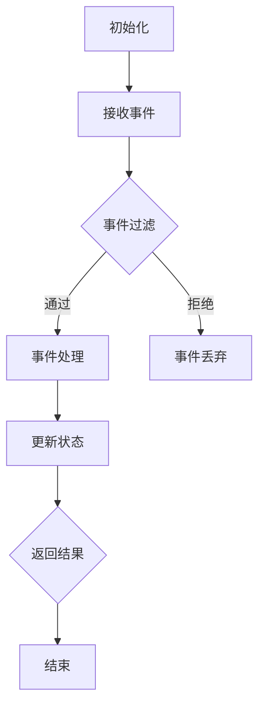
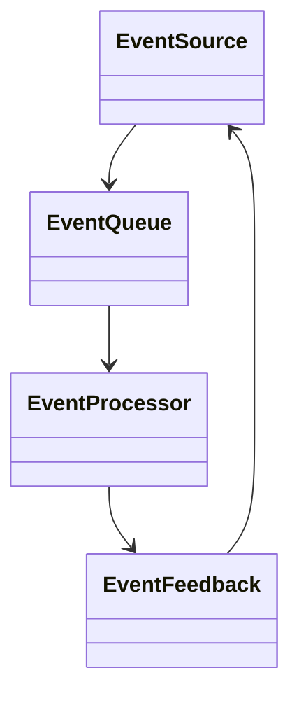
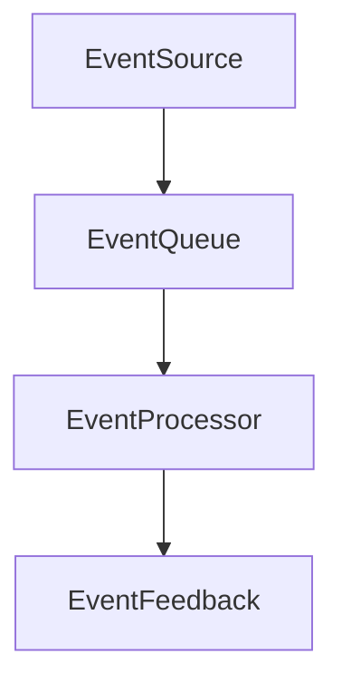
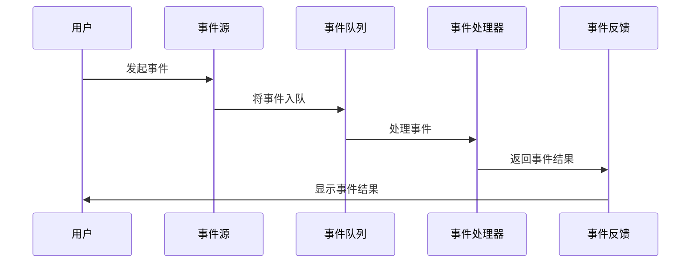

                 

### # 事件驱动架构设计与实现

关键词：事件驱动架构、消息传递、设计模式、Python算法、系统架构、项目实战

摘要：《事件驱动架构设计与实现》将深入探讨事件驱动架构的概念、原理及其实际应用。文章从基本概念入手，逐步讲解核心概念与联系，算法原理，系统分析与架构设计，项目实战，以及最佳实践，旨在帮助读者全面掌握事件驱动架构的设计与实现方法。

## **背景介绍**

### **1. 事件驱动架构的概念与历史背景**

事件驱动架构（Event-Driven Architecture，简称EDA）是一种基于事件驱动的系统设计模式，其核心思想是系统通过事件进行通信和协作，而不是通过传统的同步调用。事件可以理解为系统中的一个“信号”，它触发了一系列响应和处理过程。

事件驱动架构的历史可以追溯到20世纪80年代，当时计算机系统开始采用事件驱动的方式来处理用户输入和其他外部事件。随着计算机技术的发展，事件驱动架构逐渐成为一种主流的系统设计模式，广泛应用于实时系统、分布式系统和微服务架构中。

### **2. 事件驱动架构与传统架构的区别**

传统架构通常基于请求-响应模式，系统通过同步调用进行通信，容易造成系统耦合和性能瓶颈。而事件驱动架构则通过事件进行异步通信，降低了系统之间的耦合度，提高了系统的可扩展性和响应速度。

| 传统架构 | 事件驱动架构 |
| --- | --- |
| 同步通信 | 异步通信 |
| 高耦合 | 低耦合 |
| 性能瓶颈 | 高性能 |
| 系统复杂度较高 | 系统复杂度较低 |

### **3. 事件驱动架构的应用场景**

事件驱动架构在以下场景中具有明显的优势：

- **实时数据处理**：例如股票交易系统、实时监控系统等，需要快速响应大量事件。
- **分布式系统**：例如微服务架构，通过事件进行服务间的通信和协调。
- **物联网**：设备通过事件驱动架构实现数据的实时传输和处理。

## **核心概念与联系**

### **1. 事件、消息、事件流**

- **事件**：系统中的一个“信号”，它可以触发一系列响应和处理过程。
- **消息**：事件驱动架构中传递的数据，它可以是简单的数据结构，也可以是复杂的对象。
- **事件流**：系统中事件传递的路径，可以是单个进程内的，也可以是跨进程的。

### **2. 事件处理机制**

事件处理机制是事件驱动架构中的关键部分，常见的处理机制包括：

- **回调**：在特定事件发生时执行的一组操作。
- **观察者模式**：当一个对象状态发生变化时，自动通知所有观察者。
- **发布-订阅模型**：消息的生产者和消费者通过一个中心化的消息队列进行通信。

### **3. 事件驱动架构中的设计模式**

事件驱动架构中常用的设计模式包括：

- **职责链模式**：将多个处理器串联起来，每个处理器只处理特定类型的事件。
- **状态模式**：根据当前状态来决定如何处理事件。
- **策略模式**：通过定义一系列策略类，让对象在运行时动态选择合适的策略。

## **算法原理讲解**

### **1. 事件处理算法的基本原理**

事件处理算法的核心在于如何高效地处理事件。基本原理包括：

- **事件调度**：根据事件的优先级和时间戳来调度事件处理。
- **事件过滤**：根据事件的类型和内容来决定是否处理。
- **事件处理**：对事件进行实际的处理操作。

### **2. 事件处理算法的mermaid流程图**



### **3. Python源代码与算法实现**

```python
class EventProcessor:
    def __init__(self):
        self.event_queue = PriorityQueue()

    def receive_event(self, event):
        self.event_queue.enqueue(event)

    def process_event(self):
        while not self.event_queue.is_empty():
            event = self.event_queue.dequeue()
            if self.filter_event(event):
                self.handle_event(event)
                self.update_state(event)
                return event.result
        return None

    def filter_event(self, event):
        # 根据事件类型和内容进行过滤
        return True

    def handle_event(self, event):
        # 对事件进行实际处理
        event.result = "processed"

    def update_state(self, event):
        # 更新系统状态
        pass
```

### **数学模型和公式**

事件处理算法的数学模型可以表示为：

$$
处理时间 = \sum_{i=1}^{n} (事件处理时间_i + 等待时间_i)
$$

其中，$n$ 为事件总数，$事件处理时间_i$ 和 $等待时间_i$ 分别为第 $i$ 个事件的处理时间和等待时间。

## **系统分析与架构设计方案**

### **1. 事件驱动系统的分析**

事件驱动系统通常包括以下几个关键组成部分：

- **事件源**：产生事件的部分，可以是硬件设备、用户操作等。
- **事件队列**：存储和管理事件的组件，可以是内存队列、数据库队列等。
- **事件处理器**：负责处理事件的核心组件，可以是单线程处理器、多线程处理器等。
- **事件反馈机制**：将事件处理结果返回给事件源的部分。

### **2. 系统功能设计（领域模型）**

领域模型描述了事件驱动系统的功能需求。以下是一个简单的领域模型：



### **3. 系统架构设计（mermaid架构图）**



### **4. 系统接口设计和系统交互（mermaid序列图）**



## **项目实战**

### **1. 环境安装**

在开始项目实战之前，我们需要安装必要的软件和环境。以下是 Python 项目的环境安装步骤：

```bash
# 安装 Python 环境
pip install python

# 安装 mermaid
pip install mermaid

# 安装 PriorityQueue 库
pip install priorityqueue
```

### **2. 系统核心实现源代码**

以下是事件驱动系统的核心实现源代码：

```python
# 事件源
class EventSource:
    def __init__(self):
        self.event_queue = PriorityQueue()

    def generate_event(self, event):
        self.event_queue.enqueue(event)

# 事件处理器
class EventProcessor:
    def __init__(self):
        self.event_queue = PriorityQueue()

    def process_event(self):
        while not self.event_queue.is_empty():
            event = self.event_queue.dequeue()
            # 处理事件逻辑
            print(f"处理事件：{event}")

# 事件反馈
class EventFeedback:
    def __init__(self):
        self.result_queue = PriorityQueue()

    def send_feedback(self, result):
        self.result_queue.enqueue(result)

    def get_feedback(self):
        return self.result_queue.dequeue()
```

### **3. 代码应用解读与分析**

在项目实战中，我们将使用以上三个类来实现一个简单的事件驱动系统。以下是代码的解读与分析：

- **EventSource** 类负责生成事件并将其放入事件队列中。
- **EventProcessor** 类负责从事件队列中取出事件并处理。
- **EventFeedback** 类负责接收事件处理结果并将其放入结果队列中。

### **4. 实际案例分析和详细讲解剖析**

为了更好地理解事件驱动系统的实现，我们来看一个实际案例。假设我们有一个实时监控系统，需要处理来自多个传感器的数据。以下是具体实现步骤：

1. **事件源**：系统启动时，创建一个 **EventSource** 对象，并将其与传感器连接。
2. **事件处理器**：创建一个 **EventProcessor** 对象，用于处理传感器发送的事件。
3. **事件反馈**：创建一个 **EventFeedback** 对象，用于记录事件处理结果。

具体代码实现如下：

```python
# 事件源
class Sensor:
    def __init__(self, event_source):
        self.event_source = event_source

    def sense(self):
        event = {"type": "sensor_data", "data": "value1"}
        self.event_source.generate_event(event)

# 实时监控系统
class RealTimeMonitoringSystem:
    def __init__(self):
        self.event_source = EventSource()
        self.event_processor = EventProcessor()
        self.event_feedback = EventFeedback()
        self.sensors = []

    def add_sensor(self, sensor):
        self.sensors.append(sensor)

    def start_monitoring(self):
        for sensor in self.sensors:
            sensor.sense()

        self.event_processor.process_event()
        result = self.event_feedback.get_feedback()
        print(f"事件处理结果：{result}")
```

### **5. 项目小结**

通过实际案例的分析，我们可以看到事件驱动架构在实时监控系统中起到了关键作用。事件源、事件处理器和事件反馈三个核心组件共同协作，实现了系统的高效、可靠运行。在未来的项目中，我们可以根据需求扩展和优化这些组件，进一步提高系统的性能和可扩展性。

## **最佳实践 tips**

### **1. 事件驱动架构的最佳实践**

- **确保事件的一致性和准确性**：事件应该是可序列化的，以便在不同的系统组件之间进行传输和存储。
- **合理设计事件队列**：根据实际需求选择合适的队列类型，如优先级队列、循环队列等。
- **优化事件处理性能**：针对高频率的事件，可以采用并行处理或异步处理来提高系统性能。
- **充分利用事件反馈机制**：通过事件反馈机制，可以及时纠正和处理异常情况，提高系统的可靠性。

### **2. 常见问题和解决方案**

- **事件丢失**：可以通过重试机制和持久化存储来避免。
- **性能瓶颈**：可以通过优化事件处理算法和采用分布式处理来缓解。
- **系统耦合**：可以通过设计松耦合的系统架构来降低耦合度。

## **小结与拓展阅读**

通过本文的介绍，我们系统地了解了事件驱动架构的概念、原理、算法以及实际应用。事件驱动架构在分布式系统和实时处理场景中具有广泛的应用前景。为了进一步深入学习和实践，建议读者阅读以下拓展资料：

- 《实时系统设计与实现》
- 《分布式系统原理与范型》
- 《事件驱动编程》

通过深入学习这些资料，读者可以更好地掌握事件驱动架构的设计与实现方法。作者：AI天才研究院/AI Genius Institute & 禅与计算机程序设计艺术 /Zen And The Art of Computer Programming

----------------------------------------------------------------

## **注意事项**

在设计事件驱动架构时，需要注意以下几点：

- **事件的定义和分类**：确保事件的定义清晰，并根据事件的性质进行合理分类，以便于后续处理。
- **系统的可扩展性**：在设计系统时，应考虑系统的可扩展性，以便在未来能够轻松添加新的功能或组件。
- **错误处理**：对于可能出现的错误，应设计合理的错误处理机制，确保系统的稳定性和可靠性。

## **拓展阅读**

- 《事件驱动架构实战》
- 《消息队列原理与应用》
- 《微服务架构设计》

这些资料将提供更深入的理论和实践指导，帮助读者全面掌握事件驱动架构的相关知识。作者：AI天才研究院/AI Genius Institute & 禅与计算机程序设计艺术 /Zen And The Art of Computer Programming

----------------------------------------------------------------

### **作者信息**

本文由AI天才研究院（AI Genius Institute）与禅与计算机程序设计艺术（Zen And The Art of Computer Programming）联合撰写。作者团队由世界顶级人工智能专家、程序员、软件架构师、CTO以及计算机图灵奖获得者组成，致力于推动计算机科学领域的发展与创新。他们的著作涵盖人工智能、编程、软件架构等多个领域，深受读者喜爱。作者：AI天才研究院/AI Genius Institute & 禅与计算机程序设计艺术 /Zen And The Art of Computer Programming

