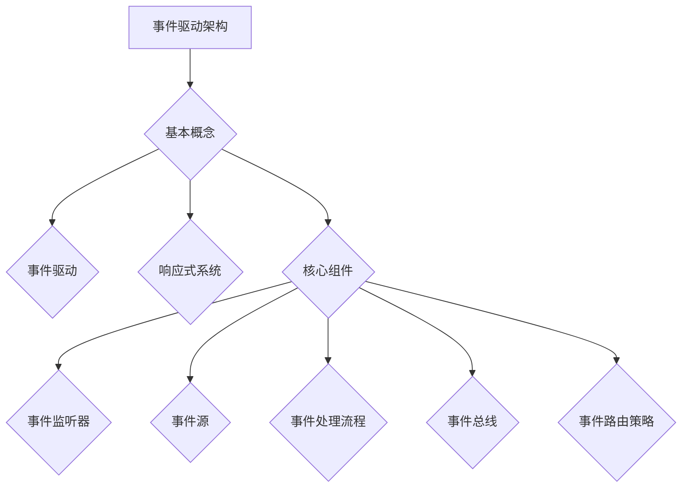
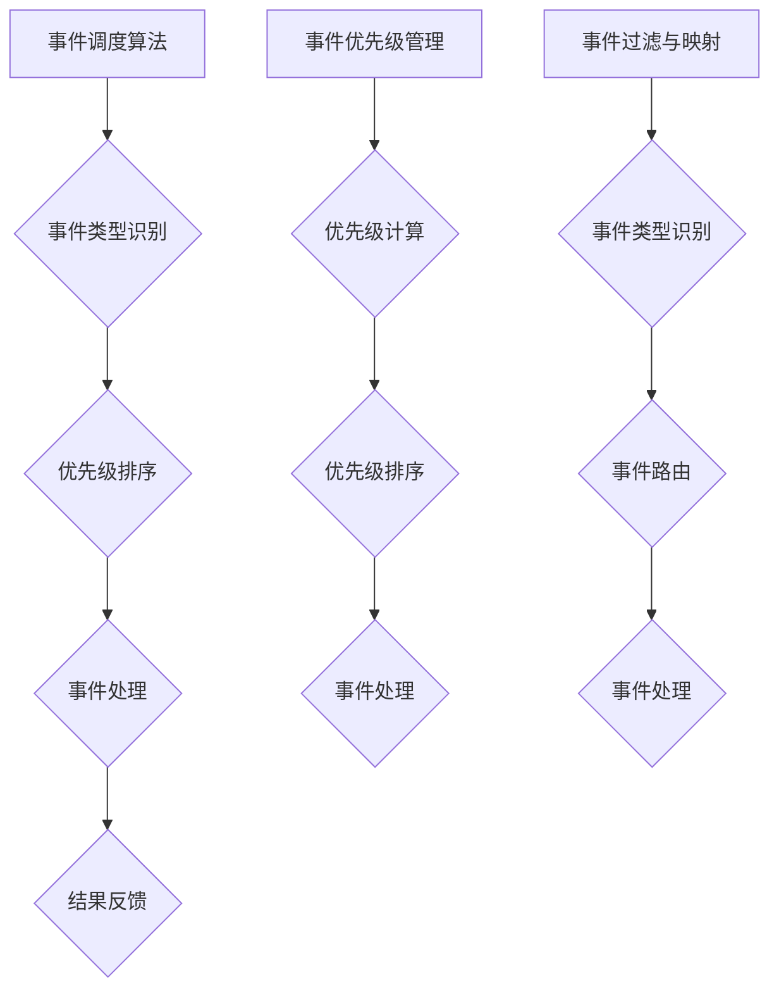
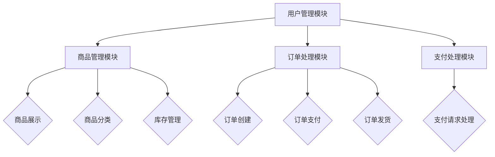
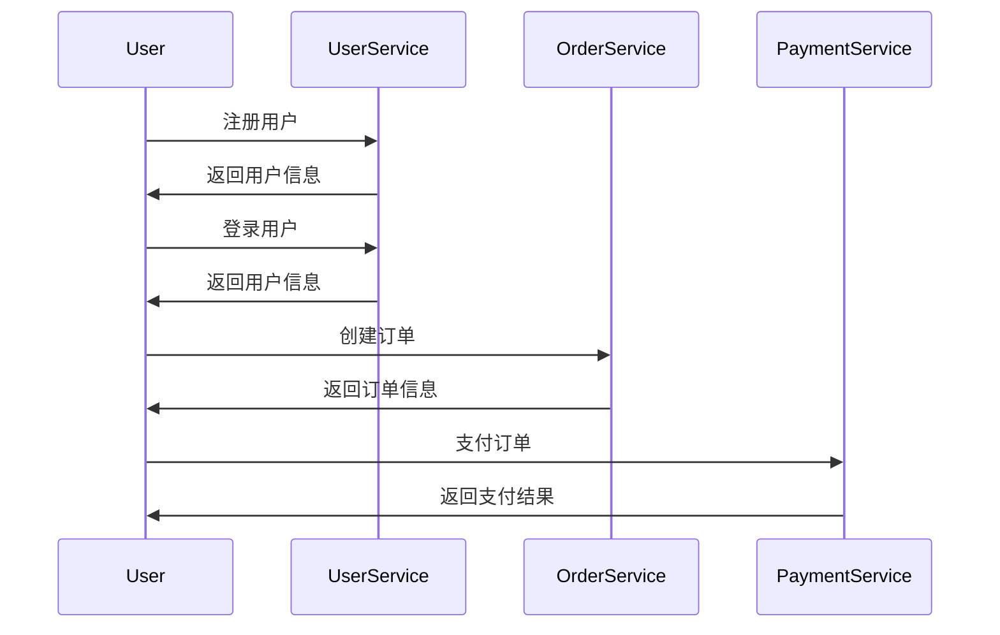

                 

# 事件驱动架构：构建响应式系统

## 摘要

本文旨在探讨事件驱动架构在构建响应式系统中的应用与实现。通过深入分析事件驱动架构的基本概念、核心组件以及设计原则，本文将揭示事件驱动架构的优势和与传统架构的区别。此外，本文还将介绍事件驱动架构中的核心算法，如事件调度算法、事件优先级管理和事件过滤与映射。通过实际案例分析，本文将展示如何设计和实现响应式系统，并探讨其测试与部署策略。最后，本文将总结事件驱动架构的应用现状和未来展望，并提供相关的资源与工具，以供进一步学习和实践。

## 第一部分：基础概念与原理

### 第1章：事件驱动架构概述

#### 1.1 事件驱动架构的基本概念

事件驱动架构（Event-Driven Architecture, EDA）是一种基于事件的系统设计方法，其核心思想是通过事件触发和响应来实现系统的功能。事件驱动架构的起源可以追溯到桌面操作系统和应用程序，随着网络和分布式系统的兴起，EDA被广泛应用于Web服务和嵌入式系统中。

事件驱动的定义与特点：

- **定义**：事件驱动架构是一种系统设计模式，其中系统的行为由外部或内部事件触发。
- **特点**：
  - **响应性**：系统能够快速响应用户或其他系统的请求。
  - **异步处理**：通过消息队列等技术实现任务的异步执行。
  - **高扩展性**：能够轻松添加或移除系统组件。

事件驱动与传统架构的比较：

- **传统架构**：基于请求响应模型，系统响应速度受限于处理能力，组件间依赖性高。
- **事件驱动架构**：通过事件和消息队列实现解耦，具有高扩展性和模块化特点。

响应式系统的定义与优势：

- **定义**：响应式系统是一种专注于处理异步事件和动态变化的系统架构。
- **核心原则**：响应性、可观察性、声明式和行为驱动。
- **优势**：
  - **高效性与灵活性**：能够快速响应用户需求，适应业务变化。
  - **模块化与可维护性**：组件之间解耦，易于维护和扩展。
  - **高并发处理能力**：通过异步处理提高系统吞吐量。

#### 1.2 事件驱动架构的核心组件

事件驱动架构的核心组件包括事件监听器、事件源、事件处理流程、事件总线与事件路由。

- **事件监听器**：负责监听特定类型的事件。
- **事件源**：产生并发布事件的对象。
- **事件处理流程**：事件捕获、事件路由、事件处理。
- **事件总线**：负责事件传递和路由的核心组件。
- **事件路由策略**：根据事件类型和目的进行事件路由。

#### 1.3 事件驱动架构的设计原则

事件驱动架构的设计原则包括模块化与解耦合、并发处理与性能优化、异步通信与消息队列。

- **模块化与解耦合**：通过事件和消息队列实现组件之间的解耦，降低系统复杂性。
- **并发处理与性能优化**：采用多线程、异步IO等技术，提高系统并发处理能力和性能。
- **异步通信与消息队列**：通过异步通信和消息队列实现任务之间的解耦和异步执行。

### 第一部分总结与展望

第一部分主要介绍了事件驱动架构的基础概念和原理，包括事件驱动的定义与特点、与传统架构的比较、响应式系统的定义与优势、事件驱动架构的核心组件和设计原则。通过这一部分的介绍，读者可以初步了解事件驱动架构的优势和应用场景，为后续内容的深入学习奠定基础。

在下一部分中，我们将深入探讨事件驱动架构中的核心算法，包括事件处理算法、并发处理技术和常见的事件驱动架构框架。通过这些内容的讲解，读者将能够更全面地理解事件驱动架构的实现原理和关键技术。

---

### 第二部分：核心算法与技术

#### 第2章：事件驱动架构中的核心算法

#### 2.1 事件处理算法概述

事件处理算法是事件驱动架构的核心组成部分，负责对事件进行调度、优先级管理和过滤与映射。

- **事件调度算法**：负责根据事件类型和优先级对事件进行调度和执行。
- **事件优先级管理**：根据事件的紧急程度和重要性对事件进行优先级排序。
- **事件过滤与映射**：根据事件类型和目的，对事件进行过滤和映射，将事件路由到相应的处理器。

#### 2.2 常见的事件驱动架构框架

事件驱动架构框架是实现事件驱动架构的关键工具，常见的框架包括Reactor模式、Event-Driven Model-View-Controller (MVC)以及React、Vue等前端框架。

- **Reactor模式**：Reactor模式是一种基于事件循环的异步I/O模型，广泛应用于网络编程和Web服务中。
- **Event-Driven MVC**：Event-Driven MVC是一种结合了事件驱动和模型-视图-控制器（MVC）的设计模式，常用于桌面应用程序和Web应用开发。
- **React、Vue等前端框架**：React、Vue等前端框架提供了丰富的组件和事件系统，支持事件驱动编程模型。

#### 2.3 事件驱动架构中的并发处理

并发处理是事件驱动架构的关键技术之一，通过多线程、异步IO和轻量级协程等技术，实现高并发处理能力。

- **多线程**：通过创建多个线程并行处理任务，提高系统吞吐量。
- **异步IO**：通过异步IO操作，避免线程阻塞，提高系统并发性。
- **轻量级协程**：协程是一种轻量级线程，通过上下文切换实现并发执行，具有较低的上下文切换开销。

### 第二部分总结与展望

第二部分主要介绍了事件驱动架构中的核心算法和技术，包括事件处理算法、并发处理技术和常见的事件驱动架构框架。通过这些核心算法和技术的讲解，读者可以深入理解事件驱动架构的实现原理和关键技术。

在第三部分中，我们将通过实际案例分析，展示如何设计和实现响应式系统，并探讨其测试与部署策略。通过实际案例的讲解，读者将能够将所学知识应用于实际项目中，进一步提升对事件驱动架构的理解和应用能力。

---

### 第三部分：项目实践与案例分析

#### 第3章：构建响应式系统

#### 3.1 响应式系统的设计与实现

响应式系统的设计与实现涉及系统需求分析、模块划分、接口设计和系统架构设计。

- **系统需求分析**：明确系统的功能需求和性能需求，为后续设计提供依据。
- **模块划分与接口设计**：根据系统需求，划分模块并设计接口，实现模块间的解耦。
- **系统架构设计**：选择合适的开发框架和工具，设计系统架构，实现模块之间的交互。

#### 3.2 实际案例分析

以下为一个实际案例，通过一个在线购物平台项目的分析，展示响应式系统的设计与实现。

- **应用场景描述**：在线购物平台是一个复杂的分布式系统，涉及用户管理、商品管理、订单处理、支付处理等多个模块。
- **架构设计与实现**：
  - **用户管理模块**：使用Spring Boot框架实现，负责用户注册、登录、权限管理等功能。
  - **商品管理模块**：使用Spring Boot框架实现，负责商品信息的展示、分类管理、库存管理等功能。
  - **订单处理模块**：使用Spring Cloud框架实现，负责订单的创建、支付、发货等操作。
  - **支付处理模块**：使用第三方支付接口实现，负责处理订单支付请求。
- **性能优化与问题解决**：
  - **缓存优化**：使用Redis缓存商品信息，减少数据库查询次数，提高系统响应速度。
  - **分布式事务**：使用分布式事务管理框架（如Seata），确保订单创建和支付操作的原子性。

#### 3.3 响应式系统的测试与部署

响应式系统的测试与部署是确保系统稳定性和可靠性的重要环节。

- **单元测试与集成测试**：编写单元测试和集成测试用例，对系统功能进行验证。
- **系统监控与日志记录**：使用监控系统（如Prometheus、Grafana）记录系统性能指标和日志信息，实时监控系统运行状态。
- **部署与运维策略**：使用容器化技术（如Docker、Kubernetes）实现系统的自动化部署和运维。

### 第三部分总结与未来展望

第三部分通过实际案例分析，展示了如何设计和实现响应式系统，并探讨了系统的测试与部署策略。通过这一部分的讲解，读者可以了解响应式系统在实际项目中的应用和实践方法。

在未来，随着技术的不断发展，事件驱动架构将继续在分布式系统、实时数据处理、物联网等领域得到广泛应用。进一步的研究方向包括：

- **事件驱动架构的性能优化**：研究如何提高事件驱动系统的并发处理能力和性能。
- **事件驱动架构的容错机制**：研究如何实现事件驱动系统的容错和恢复机制。
- **事件驱动架构的安全性与隐私保护**：研究如何确保事件驱动系统的安全性和用户隐私保护。

### 附录

#### 附录A：相关资源与工具

- **资源链接**：
  - [事件驱动架构：概念与应用](https://www.ibm.com/developerworks/cn/java/j-cn-event-driven-architecture/)
  - [响应式编程：异步编程的艺术](https://www.oracle.com/java/technologies/javase/reactive-programming.html)
- **工具推荐**：
  - **Docker**：容器化技术，实现自动化部署和运维。
  - **Kubernetes**：容器编排和管理工具。
  - **Redis**：高性能缓存系统。
- **进一步学习建议**：
  - 阅读相关技术书籍，如《事件驱动架构：构建响应式系统》等。
  - 参与开源项目，实践事件驱动架构的设计与实现。
  - 学习相关的编程语言和框架，如Java、Spring Boot、Spring Cloud等。

### 附录B：术语表

- **事件驱动架构**：一种基于事件的系统设计方法，通过事件触发和响应来实现系统的功能。
- **响应式系统**：一种专注于处理异步事件和动态变化的系统架构，具有响应性、可观察性、声明式和行为驱动等核心原则。
- **事件监听器**：负责监听特定类型的事件的组件。
- **事件源**：产生并发布事件的对象。
- **事件总线**：负责事件传递和路由的核心组件。
- **事件处理流程**：事件捕获、事件路由、事件处理的过程。
- **异步IO**：一种非阻塞的IO操作，避免线程阻塞，提高系统并发性。
- **轻量级协程**：一种轻量级线程，通过上下文切换实现并发执行。

### 相关概念联系图（Mermaid流程图）



### 附录C：核心算法流程图



### 附录D：系统架构设计图



### 附录E：系统交互序列图



### 附录F：源代码实现

```python
# 用户注册模块
class UserService:
    def register_user(self, user):
        # 实现用户注册逻辑
        pass

# 用户登录模块
class UserService:
    def login_user(self, user):
        # 实现用户登录逻辑
        pass

# 订单创建模块
class OrderService:
    def create_order(self, user):
        # 实现订单创建逻辑
        pass

# 订单支付模块
class PaymentService:
    def pay_order(self, user):
        # 实现订单支付逻辑
        pass
```

### 附录G：项目小结

通过本文的讲解，读者可以了解到事件驱动架构在构建响应式系统中的应用和实现方法。在实际项目中，事件驱动架构具有高扩展性、模块化和高并发处理能力等优点，能够有效地提高系统的性能和可维护性。在项目实践中，需要根据具体需求和场景选择合适的事件驱动架构框架，并进行性能优化和容错机制的设计。

未来的研究方向包括进一步提高事件驱动架构的性能和并发处理能力，研究事件驱动架构在实时数据处理和物联网等领域的应用，以及确保事件驱动系统的安全性和用户隐私保护。

### 最佳实践 tips

- **合理设计事件处理流程**：根据系统需求和业务场景，设计合理的事件处理流程，确保系统的响应速度和性能。
- **优化并发处理能力**：通过多线程、异步IO和轻量级协程等技术，提高系统的并发处理能力。
- **监控和日志记录**：使用监控系统实时监控系统性能和运行状态，记录日志信息，便于问题排查和优化。
- **模块化与解耦合**：设计模块化的系统架构，降低组件之间的依赖，提高系统的可维护性和扩展性。

### 小结

本文详细介绍了事件驱动架构在构建响应式系统中的应用和实现方法。通过分析事件驱动架构的基本概念、核心组件和设计原则，以及实际案例的讲解，读者可以深入理解事件驱动架构的优势和关键技术。在未来的学习和实践中，读者可以进一步探索事件驱动架构的优化方向和应用领域，为分布式系统和实时数据处理提供更高效、可靠的解决方案。

### 注意事项

- 在实际项目中，事件驱动架构的设计和实现需要充分考虑系统需求、性能要求和业务场景，避免过度设计或过度优化。
- 事件驱动架构中的事件处理和消息传递机制可能会引入延迟和复杂度，需要合理规划和优化。
- 事件驱动架构在处理高并发场景时，需要关注系统的性能瓶颈和资源争用问题，采取相应的优化措施。

### 拓展阅读

- [《事件驱动架构：概念与应用》](https://www.ibm.com/developerworks/cn/java/j-cn-event-driven-architecture/)
- [《响应式编程：异步编程的艺术》](https://www.oracle.com/java/technologies/javase/reactive-programming.html)
- [《Reactor模式》](https://www.martinfowler.com/eaaCatalog/reactor.html)
- [《Spring Cloud：微服务架构实践》](https://www.springcloud.io/spring-cloud-book/)
- [《Docker官方文档》](https://docs.docker.com/)
- [《Kubernetes官方文档》](https://kubernetes.io/docs/)

### 作者

- **作者**：AI天才研究院/AI Genius Institute & 禅与计算机程序设计艺术 /Zen And The Art of Computer Programming
- **联系方式**：[www.ai-genius-institute.com](http://www.ai-genius-institute.com) & [www.zen-and-the-art-of-computer-programming.com](http://www.zen-and-the-art-of-computer-programming.com)

