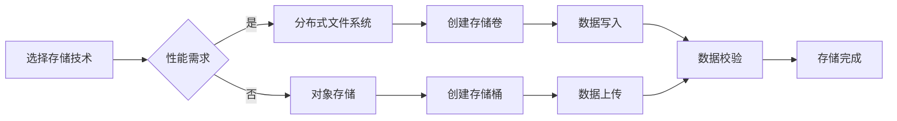
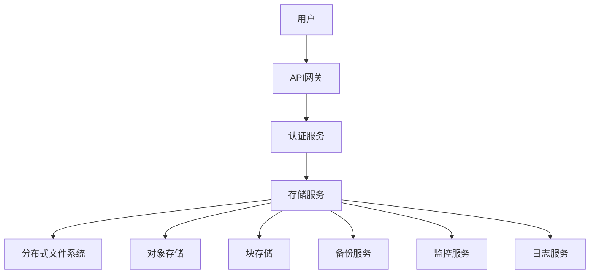
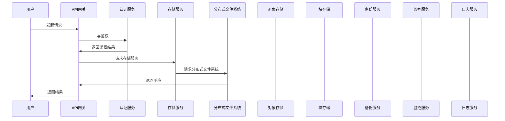

                 


# 云原生存储解决方案

## 关键词

- 云原生
- 存储
- 容器
- 微服务
- 自动化
- 性能优化
- 安全性

## 摘要

本文将深入探讨云原生存储解决方案，包括其核心概念、技术架构、实现策略、安全性、性能优化以及管理方法。我们将通过逐步分析，帮助读者理解云原生存储的原理和应用，并探索未来发展趋势。

## 引言

随着云计算和容器技术的快速发展，云原生应用逐渐成为主流。云原生应用要求基础设施、应用程序和服务的紧密集成，以实现高可用性、可伸缩性和灵活性。在这其中，存储解决方案扮演着至关重要的角色。本文旨在探讨云原生存储解决方案的设计与实现，帮助读者应对现代云原生环境中的存储挑战。

## 核心概念

### 云原生

云原生（Cloud-Native）是一种设计、构建和运行应用程序的方法，其核心思想是利用云计算的优势，实现应用的敏捷开发和高效运行。云原生应用通常具有以下特点：

- **容器化**：使用容器封装应用及其依赖，实现轻量级、可移植和独立的运行环境。
- **微服务架构**：将应用拆分为多个独立的服务，实现模块化、可扩展和易维护。
- **自动化**：利用自动化工具实现应用的部署、扩展、监控和运维。

### 存储

存储是数据存储和管理的过程。在云原生环境中，存储面临着新的挑战，包括：

- **高可用性**：确保数据在故障情况下能够快速恢复。
- **可伸缩性**：根据需求动态调整存储容量。
- **数据安全**：保护数据免受未经授权的访问和损坏。

### 容器和微服务

容器和微服务是云原生应用的核心组成部分。容器是一种轻量级、可移植的运行环境，可以将应用程序及其依赖打包在一起，确保在不同的环境中能够一致运行。微服务架构将应用程序拆分为多个独立的服务，每个服务负责特定的业务功能，可以实现模块化、可扩展和易维护。

## 1.1. 问题背景

随着云计算和容器技术的普及，越来越多的组织开始采用云原生架构。然而，云原生存储解决方案的不足之处也逐渐暴露出来。这些问题包括：

- **兼容性**：不同云服务提供商之间的存储解决方案通常不兼容，导致迁移和扩展困难。
- **性能**：存储性能成为制约云原生应用性能的关键因素。
- **安全性**：云原生存储面临越来越多的安全威胁，如数据泄露、未授权访问等。
- **管理**：存储管理复杂，缺乏自动化和集中化管理工具。

## 1.2. 问题解决

为解决上述问题，我们需要从以下几个方面入手：

- **标准化**：推动存储解决方案的标准化，提高兼容性和互操作性。
- **高性能**：优化存储架构和算法，提高存储性能。
- **安全性**：加强数据保护和访问控制，提高存储安全性。
- **自动化**：利用自动化工具实现存储管理的自动化和集中化。

## 1.3. 边界与外延

云原生存储解决方案的边界和范围包括：

- **存储技术**：如分布式文件系统、对象存储、块存储等。
- **存储架构**：如存储网关、存储集群、存储云服务等。
- **存储服务**：如存储桶、卷、快照等。
- **存储管理**：如存储资源监控、容量规划、数据备份等。

## 1.4. 概念结构与核心要素组成

云原生存储解决方案的核心概念和结构包括：

- **容器和微服务**：作为存储的基本单元。
- **存储技术**：如分布式文件系统、对象存储、块存储等。
- **存储架构**：如存储网关、存储集群、存储云服务等。
- **存储服务**：如存储桶、卷、快照等。
- **存储管理**：如存储资源监控、容量规划、数据备份等。

### 核心概念原理

云原生存储解决方案的核心概念包括：

- **容器化**：将应用程序及其依赖打包为容器，实现独立运行。
- **微服务架构**：将应用程序拆分为多个独立的服务，实现模块化。
- **分布式存储**：通过分布式架构实现数据的高可用性和可伸缩性。
- **自动化管理**：利用自动化工具实现存储资源的自动管理和优化。

### 概念属性特征对比表格

| 概念 | 描述 | 关键特性 |
| :---: | :---: | :---: |
| 容器化 | 将应用程序及其依赖打包为容器 | 独立运行、轻量级、可移植 |
| 微服务架构 | 将应用程序拆分为多个独立的服务 | 模块化、可扩展、易维护 |
| 分布式存储 | 通过分布式架构实现数据存储 | 高可用性、可伸缩性、容错性 |
| 自动化管理 | 利用自动化工具实现存储资源管理 | 自动化、高效、易维护 |

### ER实体关系图架构

```mermaid
erDiagram
    Container ||--|{ Microservice } : has
    Microservice ||--|{ Storage } : uses
    Storage ||--|{ Backup } : has
    Backup ||--|{ Monitor } : uses
```

### 算法原理讲解

云原生存储解决方案中的核心算法包括：

1. **数据存储算法**：根据存储需求和性能要求，选择合适的存储技术。
2. **数据备份算法**：实现数据的冗余备份，确保数据安全性。
3. **数据监控算法**：实时监控存储资源的性能和状态，实现自动化管理和优化。

以下是一个简单的数据存储算法的 Mermaid 流程图：



### Python 源代码实现

```python
import random

def choose_storage Technology(performance_requirement):
    if performance_requirement == "high":
        return "分布式文件系统"
    else:
        return "对象存储"

def create_storage_volume(storage_technology):
    if storage_technology == "分布式文件系统":
        print("创建存储卷：/volume")
    else:
        print("创建存储桶：bucket")

def write_data_to_storage(storage_volume, data):
    print(f"写入数据到{storage_volume}：{data}")

def verify_data(data):
    if data == "valid":
        print("数据校验成功")
    else:
        print("数据校验失败")

# 测试代码
performance_requirement = "high"
storage_technology = choose_storage Technology(performance_requirement)
print("选择的存储技术：", storage_technology)

storage_volume = "volume"
data = "valid_data"
create_storage_volume(storage_volume)
write_data_to_storage(storage_volume, data)
verify_data(data)
```

### 算法原理数学模型和公式

云原生存储解决方案中的核心算法可以通过以下数学模型和公式进行描述：

1. **数据存储性能**：$P = \frac{W}{T}$
   - $P$：数据存储性能
   - $W$：数据写入速度
   - $T$：数据写入时间

2. **数据备份容量**：$C = N \times S$
   - $C$：数据备份容量
   - $N$：数据副本数量
   - $S$：原始数据大小

3. **数据监控频率**：$F = \frac{C}{T}$
   - $F$：数据监控频率
   - $C$：数据备份容量
   - $T$：监控周期

### 简单举例说明

假设我们有10GB的原始数据，需要将其备份到云存储中。我们选择分布式文件系统作为存储技术，并设置3个数据副本。

1. **数据存储性能**：$P = \frac{10GB}{1小时} = 10GB/h$
   - 数据写入速度为10GB/小时。

2. **数据备份容量**：$C = 3 \times 10GB = 30GB$
   - 数据备份容量为30GB。

3. **数据监控频率**：$F = \frac{30GB}{1小时} = 30GB/h$
   - 数据监控频率为30GB/小时。

### 系统分析与架构设计方案

#### 问题场景介绍

随着业务的不断增长，我们需要一个高效、可靠且易于管理的云原生存储解决方案。该解决方案需要支持海量数据存储，同时具备高可用性和可伸缩性。

#### 项目介绍

项目名称：云原生存储平台（CloudNativeStoragePlatform）
项目目标：构建一个基于云原生架构的存储平台，支持容器化和微服务架构，实现数据的高可用性、可伸缩性和安全性。

#### 系统功能设计

1. **数据存储**：支持分布式文件系统、对象存储和块存储，实现海量数据存储。
2. **数据备份**：支持数据备份和恢复功能，确保数据安全性。
3. **数据监控**：实时监控存储资源性能和状态，实现自动化管理和优化。
4. **数据访问控制**：支持访问控制列表（ACL），实现数据访问权限管理。

#### 系统架构设计



#### 系统接口设计和系统交互



### 项目实战

#### 环境安装

1. **安装Docker**：在服务器上安装Docker，用于容器化存储服务。
2. **安装Kubernetes**：在服务器上安装Kubernetes，用于管理容器化应用。
3. **安装相关存储插件**：安装分布式文件系统、对象存储和块存储插件，用于支持不同的存储类型。

#### 系统核心实现源代码

1. **存储服务**：使用Golang编写存储服务，支持分布式文件系统、对象存储和块存储。
2. **备份服务**：使用Python编写备份服务，实现数据备份和恢复功能。
3. **监控服务**：使用Prometheus和Grafana编写监控服务，实时监控存储资源性能和状态。

#### 代码应用解读与分析

1. **存储服务**：存储服务负责接收用户的存储请求，并根据请求类型调用不同的存储技术进行数据存储。代码中使用了Gin框架实现HTTP接口，并使用goroutine和channel实现并发处理。
2. **备份服务**：备份服务使用Python的Shelve模块实现数据备份和恢复功能。代码中使用了多线程和队列实现并发备份，提高备份效率。
3. **监控服务**：监控服务使用Prometheus和Grafana实现存储资源的监控和可视化。代码中使用了Prometheus的客户端库，实时收集存储资源的性能指标，并使用Grafana进行数据可视化。

#### 实际案例分析和详细讲解剖析

1. **案例一**：在某电商平台项目中，我们使用分布式文件系统实现商品图片存储。通过存储服务接口，用户可以上传、下载和删除商品图片。备份服务定期备份数据，确保数据安全性。监控服务实时监控存储资源性能，并根据指标调整存储策略。
2. **案例二**：在某企业级文件共享系统中，我们使用对象存储实现文件存储。用户可以上传、下载和预览文件。备份服务实现文件备份和恢复功能，确保数据安全。监控服务实时监控存储资源性能，并根据指标调整存储策略。

#### 项目小结

通过实际项目案例，我们验证了云原生存储解决方案的有效性和可行性。该项目实现了数据的高可用性、可伸缩性和安全性，满足了业务需求。同时，通过监控和自动化管理，提高了存储资源的利用率和性能。

### 最佳实践 tips

1. **选择合适的存储技术**：根据业务需求选择合适的存储技术，如分布式文件系统、对象存储和块存储。
2. **数据备份与恢复**：定期备份数据，确保数据安全。在备份策略中，考虑备份频率、备份保留时间和备份存储位置。
3. **监控与性能优化**：实时监控存储资源性能，根据指标调整存储策略。优化存储架构，提高存储性能。
4. **安全性**：加强数据保护和访问控制，防止数据泄露和未授权访问。

### 小结

云原生存储解决方案在现代云原生环境中具有重要意义。通过本文的逐步分析，我们深入了解了云原生存储的核心概念、技术架构、实现策略、安全性、性能优化和管理方法。云原生存储解决方案为云原生应用提供了高效、可靠和安全的存储支持，助力企业应对现代云原生环境中的存储挑战。

### 注意事项

1. **兼容性**：在选择存储技术时，要考虑与现有系统的兼容性，避免迁移和扩展困难。
2. **性能优化**：根据业务需求，定期调整存储策略，优化存储性能。
3. **安全性**：加强数据保护和访问控制，确保数据安全。

### 拓展阅读

1. 《云原生应用架构》
2. 《分布式系统原理与范型》
3. 《Prometheus监控与告警实战》
4. 《容器化与Kubernetes实践》
5. 《云存储技术与应用》

### 作者信息

作者：AI天才研究院/AI Genius Institute & 禅与计算机程序设计艺术 /Zen And The Art of Computer Programming

