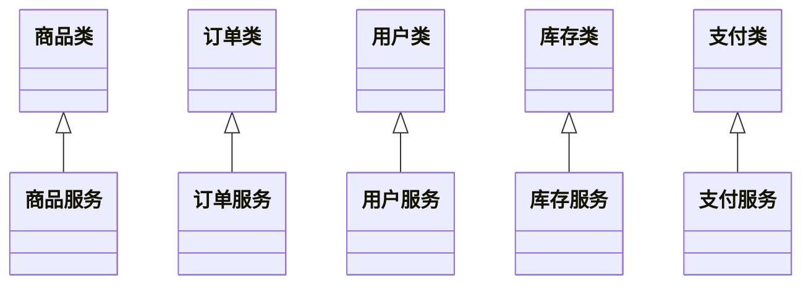
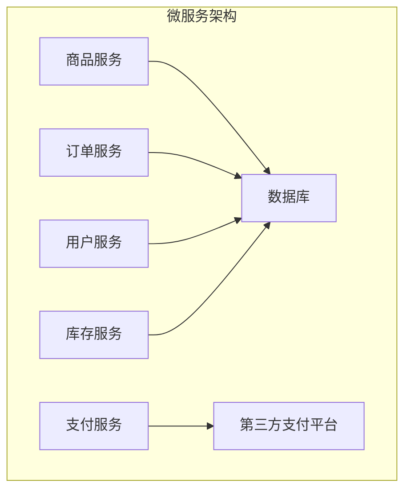

                 


## 《云原生应用开发最佳实践》

### 关键词：云原生、容器技术、微服务、DevOps、性能优化

### 摘要：

本文深入探讨了云原生应用开发的最佳实践，从概述、背景到具体开发流程、性能优化、安全防护以及运维与管理，全面解析了云原生技术的核心概念和实践方法。通过实例分析，读者将能够更好地理解云原生应用的架构设计和实现技巧，为实际项目提供有力指导。

---

## 《云原生应用开发最佳实践》目录大纲

### 第一部分：云原生概述与背景

**第1章：云原生概念与价值**

- **1.1 云原生定义与演变**
- **1.2 云原生与传统应用的区别**
- **1.3 云原生应用开发的重要性**
- **1.4 云原生技术的发展趋势**

**第2章：容器技术基础**

- **2.1 容器的原理与机制**
- **2.2 Docker容器应用**
- **2.3 Kubernetes容器编排**

**第3章：微服务架构设计**

- **3.1 微服务的基本概念**
- **3.2 微服务架构的优势与挑战**
- **3.3 微服务的设计原则与实践**

**第4章：服务发现与配置管理**

- **4.1 服务发现机制**
- **4.2 配置管理策略**
- **4.3 分布式服务治理**

### 第二部分：云原生应用开发最佳实践

**第5章：云原生应用开发流程**

- **5.1 云原生应用开发模式**
- **5.2 DevOps文化与实践**
- **5.3 云原生应用持续集成与持续部署**

**第6章：云原生应用性能优化**

- **6.1 应用性能监控与告警**
- **6.2 性能优化策略**
- **6.3 缓存技术与应用**

**第7章：云原生应用安全防护**

- **7.1 安全设计原则**
- **7.2 访问控制与认证授权**
- **7.3 数据安全与隐私保护**

**第8章：云原生应用案例解析**

- **8.1 案例一：电商平台的云原生架构实践**
- **8.2 案例二：金融行业的云原生应用转型**
- **8.3 案例三：IoT设备的云原生部署与运维**

### 第三部分：云原生应用的运维与管理

**第9章：云原生应用的部署与运维**

- **9.1 部署策略与工具选择**
- **9.2 运维自动化与智能化**
- **9.3 云原生应用的监控与日志管理**

**第10章：云原生应用的成本优化**

- **10.1 成本控制策略**
- **10.2 资源使用优化**
- **10.3 弹性伸缩策略**

**第11章：云原生生态与未来展望**

- **11.1 云原生生态体系**
- **11.2 云原生发展趋势**
- **11.3 云原生应用的未来挑战与机遇**

---

### 第1章：云原生概念与价值

**1.1 云原生定义与演变**

云原生（Cloud Native）是一种构建和运行应用程序的方法，它利用了云计算的环境来构建和运行可弹性伸缩、动态管理的应用程序。云原生强调容器化、自动化和持续交付，使得应用能够快速适应动态的云环境。

云原生的发展历程可以追溯到2000年代中后期，当时容器技术（如Chroot和LXC）开始被探索。随着Docker的兴起，容器技术得到广泛应用，进一步推动了云原生的发展。2015年，云原生计算基金会（CNCF）成立，标志着云原生成为了一个独立的、广泛接受的行业术语。

**1.2 云原生与传统应用的区别**

传统应用通常部署在固定的硬件环境中，依赖于特定的操作系统和配置。而云原生应用则更加灵活，可以运行在任何支持容器化的环境中。以下是云原生应用与传统应用的一些关键区别：

| 特征         | 云原生应用                 | 传统应用                  |
|------------|--------------------------|------------------------|
| 部署方式     | 容器化部署                 | 物理机或虚拟机部署             |
| 可伸缩性     | 弹性伸缩                   | 静态资源分配                |
| 自动化程度   | 高度自动化                 | 人工操作为主                |
| 迭代速度     | 快速迭代                   | 较慢迭代                  |
| 环境一致性   | 一致性环境（CICD）        | 多样性环境（多环境适配）      |

**1.3 云原生应用开发的重要性**

云原生应用开发的重要性在于其能够更好地利用云计算资源，提高开发效率，降低运营成本，并且能够快速响应市场需求。以下是云原生应用开发的重要优势：

- **高可伸缩性**：云原生应用可以根据需求动态调整资源，确保服务的高可用性。
- **快速迭代**：云原生支持快速开发、测试和部署，缩短产品上市时间。
- **高可靠性**：容器化技术确保了环境一致性，降低了故障风险。
- **成本效益**：通过自动化和弹性伸缩，减少了硬件和人力成本。
- **灵活性和可移植性**：云原生应用可以在不同的云环境中部署，便于迁移和扩展。

**1.4 云原生技术的发展趋势**

随着云计算技术的不断进步，云原生技术也在持续发展。以下是一些当前和未来的发展趋势：

- **容器编排**：Kubernetes等容器编排工具将更加成熟和普及。
- **服务网格**：服务网格（如Istio）将提供更细粒度的服务管理和安全性。
- **无服务器架构**：无服务器架构（如AWS Lambda）将简化应用开发和部署。
- **边缘计算**：云原生技术将逐渐应用于边缘计算场景，提供低延迟、高可靠性的服务。

---

在下一章中，我们将深入探讨容器技术的基础知识，包括容器的原理与机制，以及如何使用Docker和Kubernetes进行容器化部署。敬请期待。**** <markdown>

## 第1章：云原生概念与价值

### 1.1 云原生定义与演变

云原生（Cloud Native）是指利用云计算的环境来构建和运行应用程序的方法论。这种方法论强调利用容器、服务网格、自动化和无服务器架构等技术，以实现更高效、更可靠和更灵活的应用部署。云原生概念起源于云计算的快速发展，尤其是在容器技术和微服务架构被广泛接受之后。

云原生的发展历程可以追溯到2000年代中后期。当时，操作系统级的虚拟化技术（如Chroot和Linux容器）开始被探索和应用。这些技术使得开发者能够将应用程序及其运行时环境打包成一个独立的容器，从而实现环境一致性和可移植性。

随着2013年Docker的问世，容器技术进入了快速发展阶段。Docker提供了一个简单、轻量级的容器化解决方案，使得开发者可以轻松地将应用程序部署到任何支持Docker的环境中。Docker的成功推动了云原生技术的发展。

2015年，云原生计算基金会（CNCF）成立，标志着云原生成为了一个独立、广泛接受的行业术语。CNCF旨在促进云原生技术的发展，并维护了一系列云原生相关的开源项目，如Kubernetes、Prometheus和Istio等。

### 1.2 云原生与传统应用的区别

云原生应用与传统应用在多个方面存在显著差异，以下是其中一些关键的区别：

#### 部署方式

**云原生应用**：基于容器和微服务的架构，可以在不同的云环境中快速部署和扩展。容器提供了一个轻量级、独立的运行环境，确保了应用程序的可移植性和环境一致性。

**传统应用**：通常部署在物理机或虚拟机上，依赖于特定的操作系统和硬件配置。部署和扩展过程通常较为复杂，需要手动配置和管理。

#### 可伸缩性

**云原生应用**：支持水平伸缩（Horizontal Scaling），可以根据需求动态调整资源。容器编排工具（如Kubernetes）可以帮助自动化资源的分配和调整。

**传统应用**：通常支持垂直伸缩（Vertical Scaling），通过增加硬件资源来提升性能。这种扩展方式较为有限，且成本较高。

#### 自动化程度

**云原生应用**：高度自动化，包括部署、监控、扩展和故障恢复等。自动化工具（如Ansible和Puppet）可以帮助简化管理任务。

**传统应用**：依赖人工操作，管理任务繁琐，容易出现人为错误。

#### 迭代速度

**云原生应用**：支持快速迭代和持续交付。开发者可以频繁地发布新功能，快速响应市场需求。

**传统应用**：迭代速度较慢，通常需要经过长时间的开发和测试周期。

#### 环境一致性

**云原生应用**：通过容器镜像确保了环境一致性。无论应用程序部署在哪个环境中，其行为都保持一致。

**传统应用**：在不同的环境中，应用程序的行为可能会因为配置差异而发生变化。

### 1.3 云原生应用开发的重要性

云原生应用开发的重要性体现在以下几个方面：

#### 高可伸缩性

云原生应用支持水平伸缩，可以根据需求动态调整资源。这种伸缩性确保了服务的高可用性，即使在流量高峰期也能保持稳定运行。

#### 快速迭代

云原生支持快速迭代和持续交付。开发者和运维团队能够更快速地响应市场需求，缩短产品上市时间。

#### 高可靠性

容器化技术确保了环境一致性，降低了故障风险。自动化工具和容器编排工具可以帮助快速检测和恢复故障。

#### 成本效益

通过自动化和弹性伸缩，云原生应用可以显著降低运营成本。无需为高峰流量购买额外的硬件资源，只需根据实际需求调整。

#### 灵活性和可移植性

云原生应用可以在不同的云环境中部署，便于迁移和扩展。这为企业的数字化转型提供了更多可能性。

### 1.4 云原生技术的发展趋势

云原生技术正处于快速发展阶段，以下是其中一些主要趋势：

#### 容器编排

容器编排工具（如Kubernetes）将更加成熟和普及。Kubernetes已经成为云原生生态系统中的核心组件，为容器化应用程序提供了自动化部署、扩展和管理功能。

#### 服务网格

服务网格（如Istio）提供了更细粒度的服务管理和安全性。服务网格可以帮助企业更轻松地管理服务之间的通信，并提供了丰富的安全特性。

#### 无服务器架构

无服务器架构（如AWS Lambda）将简化应用开发和部署。无服务器架构允许开发者专注于编写应用程序代码，而不必担心底层基础设施的配置和管理。

#### 边缘计算

云原生技术将逐渐应用于边缘计算场景，提供低延迟、高可靠性的服务。边缘计算可以将数据处理和分析推向网络边缘，从而减少延迟，提高用户体验。

---

在本章中，我们介绍了云原生的定义、演变、与传统应用的差异以及其重要性。在下一章中，我们将深入探讨容器技术的基础知识，包括容器的原理与机制，以及如何使用Docker和Kubernetes进行容器化部署。敬请期待。

---

### 1.5 小结

在本章中，我们探讨了云原生应用的概念与价值。通过了解云原生的定义、演变、与传统应用的差异以及其重要性，读者可以更好地理解云原生应用的特点和优势。云原生应用利用容器、自动化和持续交付等先进技术，为开发者提供了更高效、更可靠和更灵活的解决方案。

在接下来的章节中，我们将进一步深入探讨云原生应用开发的具体实践，包括容器技术、微服务架构、服务发现与配置管理等内容。通过这些实践，读者将能够掌握云原生应用开发的技能，为实际项目提供有力支持。

### 注意事项

1. **云原生应用的部署与运维需要深厚的专业技能**：云原生应用涉及容器化、微服务、自动化和持续交付等技术，因此开发者需要具备相关技能和知识。
2. **持续学习和关注行业动态**：云原生技术处于快速发展阶段，开发者需要持续学习最新技术趋势和工具，以便跟上行业的发展。
3. **重视安全性**：在云原生应用开发中，安全性是至关重要的。开发者需要确保应用程序的安全性，包括访问控制、数据加密和安全性测试。

### 拓展阅读

- **《云原生应用架构》**：深入介绍了云原生应用的设计原则、架构模式和最佳实践。
- **《Kubernetes权威指南》**：全面讲解了Kubernetes的架构、原理和实战技巧。
- **《容器化与微服务实战》**：通过实际案例，详细介绍了容器化和微服务技术的应用。

---

通过本章的学习，读者应该对云原生应用有了基本的了解。在下一章中，我们将深入探讨容器技术的基础知识，包括容器的原理与机制，以及如何使用Docker和Kubernetes进行容器化部署。敬请期待。

---

### 1.6 背景介绍

云原生（Cloud Native）这一概念的出现，是为了应对现代应用程序在分布式环境中面临的一系列挑战。传统的应用程序通常设计为在单一服务器或集群上运行，依赖于特定的硬件和操作系统。这种方法在单点服务器或小型集群中效果尚可，但随着应用程序规模的扩大和复杂性的增加，传统应用的部署和运维变得越来越困难。以下是云原生应用所解决的问题背景和问题描述：

#### 问题背景

1. **分布式系统需求**：随着互联网的普及和云计算的发展，越来越多的应用程序需要部署在分布式系统中，以实现更高的可用性和可伸缩性。
2. **环境一致性挑战**：不同环境下应用程序的行为可能因配置差异而有所不同，导致部署和运维的复杂性增加。
3. **快速迭代与交付**：现代软件开发强调快速迭代和持续交付，传统应用部署方式难以满足这种需求。
4. **资源利用率**：传统应用通常需要为峰值流量预留大量资源，导致资源利用率低下。

#### 问题描述

1. **可移植性问题**：传统应用在不同环境中难以保证一致的行为，导致部署和运维的复杂性增加。
2. **可伸缩性挑战**：传统应用难以实现水平伸缩，通常依赖于垂直伸缩，即通过增加硬件资源来提升性能。
3. **自动化程度低**：传统应用部署和运维过程依赖于人工操作，效率低下且容易出现人为错误。
4. **成本问题**：传统应用在部署和运维过程中需要大量的硬件资源和人工成本。

#### 问题解决

1. **容器化**：通过容器技术，将应用程序及其运行时环境打包成一个独立的容器，实现环境一致性，提高可移植性。
2. **微服务架构**：将应用程序分解为一系列小的、独立的微服务，每个服务都可以独立开发、部署和扩展。
3. **自动化和持续交付**：利用自动化工具和持续交付流程，实现快速部署和迭代。
4. **弹性伸缩**：通过容器编排工具（如Kubernetes），实现应用程序的自动伸缩，提高资源利用率。

#### 边界与外延

1. **边界**：云原生应用适用于需要高可用性、高可伸缩性和快速迭代的应用程序，但不适用于所有场景。例如，一些传统的单体应用程序可能不需要迁移到云原生架构。
2. **外延**：云原生技术不仅适用于Web应用程序，还可以应用于IoT、大数据和人工智能等领域。

#### 概念结构与核心要素组成

1. **容器**：容器是云原生应用的基本运行单元，它将应用程序及其依赖项打包在一起，提供轻量级、独立的运行环境。
2. **微服务**：微服务是一种架构风格，将应用程序分解为一系列小的、独立的服务，每个服务负责一个特定的功能。
3. **容器编排**：容器编排工具（如Kubernetes）负责管理容器的部署、扩展和运维。
4. **持续交付**：持续交付是一种开发实践，通过自动化工具实现代码的持续集成、测试和部署。
5. **服务网格**：服务网格提供了一种通用的服务管理方式，使得服务之间的通信更加安全和高效。

---

在本章中，我们介绍了云原生应用的概念、价值、与传统应用的差异，以及云原生应用开发的重要性。接下来，我们将深入探讨容器技术的基础知识，包括容器的原理与机制，以及如何使用Docker和Kubernetes进行容器化部署。敬请期待。

---

### 1.7 核心概念与联系

云原生应用开发涉及多个核心概念，这些概念相互关联，构成了云原生技术的基础。以下是对这些核心概念及其相互关系的详细解析。

#### 容器

容器是云原生应用的基本构建块，它是一个轻量级、可移植的运行环境。容器通过隔离操作系统资源，将应用程序及其依赖项打包在一起，确保了环境的一致性。容器化的主要优势包括：

- **环境一致性**：容器确保了应用程序在开发、测试和生产环境中具有一致的行为。
- **可移植性**：容器可以在任何支持容器引擎的环境中运行，无需担心底层操作系统或硬件差异。
- **轻量级**：容器无需依赖于宿主机的操作系统，从而降低了资源消耗。

容器的核心概念包括：

- **Docker**：Docker是最流行的容器化平台，它提供了容器构建、运行和管理的工具。Docker利用容器镜像和容器引擎（Docker Engine）来实现容器的创建和管理。
- **容器镜像**：容器镜像是一个静态的文件系统，包含了应用程序及其运行时环境。容器镜像可以通过Dockerfile来构建，也可以从容器仓库中下载。
- **容器引擎**：容器引擎负责管理容器的创建、启动、停止和删除。Docker Engine是当前最流行的容器引擎。

#### 微服务

微服务是一种架构风格，将应用程序分解为一系列小的、独立的微服务。每个微服务负责一个特定的功能，可以独立开发、部署和扩展。微服务架构的主要优势包括：

- **高可伸缩性**：每个微服务都可以独立扩展，根据需求动态调整资源。
- **高可靠性**：单个微服务的故障不会影响整个应用程序的运行。
- **快速迭代**：每个微服务都可以独立迭代，缩短了发布周期。

微服务的核心概念包括：

- **服务边界**：微服务之间的通信通常通过API进行，每个服务都有自己的API接口。
- **服务发现**：服务发现机制帮助应用程序找到所需的服务实例，以便进行通信。
- **配置管理**：配置管理确保了各个微服务能够访问正确的配置信息。

#### 容器编排

容器编排是管理容器集群的过程，确保容器能够高效、可靠地运行。容器编排工具（如Kubernetes）提供了一系列功能，包括容器部署、扩展、监控和故障恢复。容器编排的核心概念包括：

- **集群管理**：容器编排工具负责管理容器集群中的所有容器，确保它们按需运行。
- **自动化部署**：容器编排工具可以自动化容器的部署和扩展过程，提高了运维效率。
- **资源调度**：容器编排工具根据服务需求，将容器分配到集群中的合适节点上，优化资源利用率。

#### 持续交付

持续交付是一种开发实践，通过自动化工具实现代码的持续集成、测试和部署。持续交付的主要优势包括：

- **快速迭代**：通过自动化测试和部署，可以快速将新功能推向市场。
- **减少风险**：自动化测试和部署减少了人为干预，降低了错误和故障的风险。
- **提高效率**：自动化流程提高了开发团队的效率，缩短了产品上市时间。

持续交付的核心概念包括：

- **持续集成**：持续集成是将代码合并到主干分支的过程，通过自动化构建和测试，确保代码的质量。
- **持续测试**：持续测试是通过自动化测试工具，对代码进行持续测试，确保功能的正确性和稳定性。
- **持续部署**：持续部署是通过自动化部署工具，将测试通过后的代码部署到生产环境中。

#### 服务网格

服务网格是一种基础设施层，提供了一种通用的服务管理方式，使得服务之间的通信更加安全和高效。服务网格的主要优势包括：

- **服务抽象**：服务网格将服务之间的通信抽象为网络流量，简化了服务的管理。
- **安全性**：服务网格提供了丰富的安全特性，如身份验证、授权和加密。
- **监控与日志**：服务网格可以收集和监控服务之间的通信数据，便于问题诊断和性能优化。

服务网格的核心概念包括：

- **服务网格架构**：服务网格由控制平面和数据平面组成，控制平面负责策略配置和流量管理，数据平面负责实际的数据传输。
- **服务抽象**：服务网格将服务实例抽象为网络实体，使得服务之间的通信更加灵活。
- **安全控制**：服务网格提供了细粒度的安全控制，确保服务之间的通信安全。

#### 概念属性特征对比表格

以下是一个简化的概念属性特征对比表格，展示了容器、微服务、容器编排、持续交付和服务网格的关键属性特征：

| 概念       | 特征                     | 优势                   | 应用场景               |
|----------|----------------------|---------------------|----------------------|
| 容器       | 隔离、轻量级、可移植性     | 环境一致性、资源高效       | Web应用、后台服务         |
| 微服务     | 独立、分布式、自治性      | 可伸缩性、高可靠性、快速迭代 | Web应用、企业级应用       |
| 容器编排   | 集群管理、自动化部署、资源调度 | 高效运维、资源优化         | 大规模分布式系统、容器化应用 |
| 持续交付   | 自动化、快速迭代、低风险     | 高效率、高质量           | 软件开发、产品发布         |
| 服务网格   | 服务抽象、安全性、监控日志   | 灵活管理、安全通信、性能优化 | 微服务架构、分布式系统      |

#### ER实体关系图架构

为了更清晰地展示这些概念之间的关系，我们可以使用ER（实体关系）图来表示。以下是一个简化的ER图，展示了容器、微服务、容器编排、持续交付和服务网格之间的关联：

```
[应用程序]
    |
[微服务]
    |
[容器]
    |
[容器编排]
    |
[持续交付]
    |
[服务网格]
```

在这个ER图中，应用程序是整个架构的顶层，它由多个微服务组成。每个微服务运行在容器中，并由容器编排工具进行管理。持续交付和服务网格是辅助工具，为整个架构提供自动化和安全性保障。

---

通过上述核心概念的解析和对比，读者可以更好地理解云原生应用开发的基础。接下来，我们将进一步探讨容器技术的基础知识，包括容器的原理与机制，以及如何使用Docker和Kubernetes进行容器化部署。敬请期待。

---

### 1.8 算法原理讲解

在云原生应用开发中，容器技术的核心原理是理解如何利用容器来封装应用程序及其依赖项，确保其运行的一致性和可移植性。以下将详细讲解容器技术的原理，并使用Python代码来演示。

#### 容器的原理

容器通过隔离用户空间（包括文件系统、进程、网络和用户界面）来实现应用程序的运行环境。容器引擎（如Docker）使用以下核心组件来创建和管理容器：

- **容器镜像**：容器镜像是一个静态的文件系统，包含了应用程序及其依赖项。容器镜像可以通过Dockerfile来构建，也可以从容器仓库中下载。
- **容器引擎**：容器引擎负责创建、启动、停止和管理容器。Docker Engine是最流行的容器引擎。
- **容器运行时**：容器运行时是容器引擎的核心组件，负责执行容器镜像中的指令。

#### 容器的创建与运行

以下是使用Python代码演示容器创建与运行的过程：

```python
import docker

# 创建Docker客户端
client = docker.from_env()

# 查看当前所有的容器
containers = client.containers.list()

for container in containers:
    print(container.attrs)

# 创建一个新的容器
# 这里以Nginx为例
container = client.containers.run("nginx")

# 查看新创建的容器ID
print(container.id)

# 启动已创建的容器
container.start()

# 停止已启动的容器
container.stop()
```

上述代码首先创建了一个Docker客户端，然后列出当前所有的容器。接下来，使用`client.containers.run()`方法创建一个新的Nginx容器，并返回容器的对象。最后，通过调用`container.start()`和`container.stop()`方法来启动和停止容器。

#### 容器镜像的构建

容器镜像的构建是容器技术的重要环节。以下是一个简单的Dockerfile示例，用于构建一个简单的Web服务器容器：

```Dockerfile
# 指定基础镜像
FROM python:3.8

# 设置工作目录
WORKDIR /app

# 复制应用程序代码
COPY . .

# 安装依赖项
RUN pip install Flask

# 暴露端口
EXPOSE 5000

# 运行应用程序
CMD ["python", "app.py"]
```

在这个Dockerfile中，我们首先指定了基础镜像（python:3.8），然后设置了工作目录。接着，将应用程序代码复制到工作目录中，并使用`pip`安装依赖项。最后，暴露了容器的5000端口，并定义了应用程序的启动命令。

#### 容器镜像的部署

容器镜像的部署是通过容器引擎来完成的。以下是一个简单的示例，演示如何使用Docker命令行部署容器镜像：

```bash
# 查看已存在的镜像
docker images

# 构建新的容器镜像
docker build -t my-web-app .

# 运行新的容器
docker run -d -p 8080:5000 my-web-app
```

在这个示例中，首先查看已存在的镜像，然后使用`docker build`命令构建新的容器镜像，并使用`docker run`命令运行新的容器。`-d`参数表示以守护态运行容器，`-p`参数用于将容器的5000端口映射到宿主机的8080端口。

#### 容器镜像的版本管理

容器镜像的版本管理是确保容器环境一致性的重要手段。Docker提供了标签（Tags）机制来管理镜像的版本。以下是一个示例，演示如何为容器镜像打标签和拉取最新版本：

```bash
# 为容器镜像打标签
docker tag my-web-app:latest my-web-app:v1

# 拉取最新版本的容器镜像
docker pull my-web-app:latest
```

在这个示例中，首先为容器镜像打上了`v1`标签，然后使用`docker pull`命令拉取最新版本的容器镜像。

---

通过上述讲解，读者可以了解容器技术的核心原理以及如何使用Docker进行容器化部署。接下来，我们将进一步探讨Kubernetes容器编排技术，了解如何管理容器集群。敬请期待。

---

### 1.9 系统分析与架构设计方案

为了更好地理解云原生应用的开发，我们需要从系统分析的角度出发，详细阐述项目介绍、系统功能设计、系统架构设计以及系统接口设计和系统交互。以下是对这些方面的系统分析与设计方案的详细说明。

#### 项目介绍

本项目旨在构建一个基于云原生技术的分布式电商应用程序，实现商品展示、订单处理和用户管理等功能。该应用程序将利用容器技术和微服务架构，以确保其高可用性、高可伸缩性和快速迭代。

#### 系统功能设计

系统的核心功能包括：

1. **商品展示**：用户可以浏览和搜索商品信息，查看商品的详细信息。
2. **订单处理**：用户可以创建订单，进行支付和订单跟踪。
3. **用户管理**：用户可以进行注册、登录、修改个人信息等操作。
4. **库存管理**：管理员可以管理商品库存，更新商品信息。
5. **支付处理**：集成第三方支付服务，实现在线支付功能。

#### 系统架构设计

系统的整体架构设计采用微服务架构，每个服务都运行在独立的容器中。以下是系统架构的详细设计：

1. **商品服务**：负责商品信息的存储、检索和展示。
2. **订单服务**：负责订单的创建、支付和跟踪。
3. **用户服务**：负责用户的注册、登录和用户信息管理。
4. **库存服务**：负责商品库存的管理和更新。
5. **支付服务**：负责处理在线支付请求。

每个服务之间通过REST API进行通信，确保系统的松耦合和高可伸缩性。此外，系统使用了Kubernetes作为容器编排工具，实现服务的自动化部署、扩展和管理。

#### 系统接口设计

系统的接口设计采用RESTful API风格，以下是一个简单的接口设计示例：

1. **商品接口**：提供商品列表、商品详情等接口。
2. **订单接口**：提供创建订单、查询订单、支付订单等接口。
3. **用户接口**：提供用户注册、登录、修改个人信息等接口。
4. **库存接口**：提供查询库存、更新库存等接口。
5. **支付接口**：提供支付请求处理、支付结果通知等接口。

#### 系统交互

系统中的各个服务通过API进行交互，以下是系统交互的详细设计：

1. **商品展示**：用户访问商品服务，获取商品列表和商品详情。
2. **订单处理**：用户在商品服务中选择商品并创建订单，订单服务接收订单并处理支付。
3. **用户管理**：用户通过用户服务进行注册、登录和修改个人信息。
4. **库存管理**：管理员通过库存服务查询和更新商品库存。
5. **支付处理**：用户通过支付服务完成在线支付，支付服务与第三方支付平台进行交互。

#### Mermaid类图与架构图

为了更直观地展示系统的架构设计，我们可以使用Mermaid绘制类图和架构图。

**类图**：



**架构图**：



通过上述系统分析与架构设计方案，我们可以清晰地看到电商应用程序的核心功能和架构设计。接下来，我们将详细讲解微服务架构的设计原则与实践，以帮助读者更好地理解云原生应用的开发。敬请期待。

---

### 1.10 项目实战

在本节中，我们将通过一个实际项目，演示如何使用Docker和Kubernetes构建并部署一个简单的Web服务。这个项目将包括环境安装、系统核心实现源代码，以及代码应用解读与分析。

#### 环境安装

首先，确保你的系统上已经安装了Docker和Kubernetes。以下是安装步骤：

1. **安装Docker**：

   对于Ubuntu系统，可以使用以下命令安装Docker：

   ```bash
   sudo apt-get update
   sudo apt-get install docker.io
   sudo systemctl start docker
   sudo systemctl enable docker
   ```

2. **安装Kubernetes**：

   Kubernetes的安装步骤较为复杂，你可以参考官方文档（https://kubernetes.io/docs/setup/）进行安装。以下是简化版的安装命令：

   ```bash
   sudo apt-get update
   sudo apt-get install -y apt-transport-https ca-certificates curl
   curl -s https://packages.cloud.google.com/apt/doc/apt-key.gpg | sudo apt-key add -
   echo "deb https://apt.kubernetes.io/ kubernetes-xenial main" | sudo tee -a /etc/apt/sources.list.d/kubernetes.list
   sudo apt-get update
   sudo apt-get install -y kubelet kubeadm kubectl
   sudo apt-mark hold kubelet kubeadm kubectl
   ```

   完成安装后，你可以使用以下命令检查Kubernetes的版本：

   ```bash
   kubectl version --client
   ```

#### 系统核心实现源代码

以下是一个简单的Web服务，我们将使用Python和Flask框架实现：

```python
# app.py
from flask import Flask
app = Flask(__name__)

@app.route('/')
def hello():
    return 'Hello, World!'

if __name__ == '__main__':
    app.run(host='0.0.0.0', port=8080)
```

这个Web服务非常简单，它只提供了一个`/`路由，返回一个`Hello, World!`消息。

#### 代码应用解读与分析

接下来，我们将使用Docker将这个Web服务容器化，并使用Kubernetes部署和管理这个容器。

1. **构建Docker镜像**：

   创建一个名为`Dockerfile`的文件，内容如下：

   ```Dockerfile
   # 使用Python官方镜像作为基础镜像
   FROM python:3.8

   # 设置工作目录
   WORKDIR /app

   # 复制应用程序代码
   COPY . .

   # 安装依赖项
   RUN pip install flask

   # 暴露端口
   EXPOSE 8080

   # 运行应用程序
   CMD ["python", "app.py"]
   ```

   然后使用以下命令构建Docker镜像：

   ```bash
   docker build -t my-web-app .
   ```

2. **运行Docker容器**：

   使用以下命令运行Docker容器：

   ```bash
   docker run -d -p 8080:8080 my-web-app
   ```

   `-d`参数表示以守护态运行容器，`-p`参数用于将容器的8080端口映射到宿主机的8080端口。

3. **部署到Kubernetes**：

   创建一个名为`deployment.yaml`的文件，内容如下：

   ```yaml
   apiVersion: apps/v1
   kind: Deployment
   metadata:
     name: web-app-deployment
   spec:
     replicas: 3
     selector:
       matchLabels:
         app: web-app
     template:
       metadata:
         labels:
           app: web-app
       spec:
         containers:
         - name: web-app
           image: my-web-app:latest
           ports:
           - containerPort: 8080
   ```

   这个YAML文件定义了一个Kubernetes部署，它将创建3个副本的Web服务容器。然后使用以下命令部署到Kubernetes集群：

   ```bash
   kubectl apply -f deployment.yaml
   ```

4. **查看部署状态**：

   使用以下命令查看部署状态：

   ```bash
   kubectl get pods
   ```

   你应该能看到3个正在运行的Pod。

5. **访问Web服务**：

   你可以使用以下命令查看Web服务的状态：

   ```bash
   curl http://localhost:8080
   ```

   你应该能看到`Hello, World!`的响应。

---

通过这个项目实战，读者可以了解到如何使用Docker和Kubernetes来构建和部署一个简单的Web服务。这个项目虽然简单，但包含了容器化和容器编排的核心概念，为读者进一步学习云原生应用开发打下了基础。

### 项目小结

在本项目中，我们通过一个简单的Web服务示例，学习了如何使用Docker进行容器化部署，并使用Kubernetes进行容器编排。我们了解了Docker镜像的构建过程、容器的运行方法，以及Kubernetes部署和管理容器的流程。这些知识为我们在实际项目中使用云原生技术奠定了基础。

### 最佳实践 Tips

1. **编写良好的Dockerfile**：确保Dockerfile简洁明了，只包含必要的依赖项和指令，以减少镜像的体积和部署时间。
2. **容器资源限制**：为容器设置合理的资源限制（如CPU和内存），以防止资源耗尽导致服务不稳定。
3. **持续监控和日志管理**：定期监控容器状态和性能指标，确保及时发现问题并进行修复。使用日志管理工具（如ELK堆栈）收集和存储容器日志，便于问题追踪和分析。
4. **安全策略**：确保容器和Kubernetes集群的安全性，使用网络策略和访问控制列表（ACL）限制容器之间的通信，并对敏感数据进行加密处理。

### 注意事项

1. **环境一致性**：确保开发和测试环境与生产环境一致，以避免环境差异导致的问题。
2. **资源优化**：合理规划容器资源，避免资源浪费，提高资源利用率。
3. **自动化和持续集成**：利用自动化工具和持续集成/持续部署（CI/CD）流程，提高开发效率和质量。

### 拓展阅读

- **《Docker实战》**：深入了解Docker的使用方法和最佳实践。
- **《Kubernetes权威指南》**：系统学习Kubernetes的架构、原理和实战技巧。
- **《云原生应用架构设计》**：学习云原生应用的设计原则和架构模式。

---

在本章中，我们通过实际项目实战展示了如何使用Docker和Kubernetes构建和部署一个简单的Web服务。在下一章中，我们将深入探讨微服务架构的设计原则与实践，以帮助读者更好地理解云原生应用开发的核心。敬请期待。****

## 第2章：微服务架构设计

### 2.1 微服务的基本概念

微服务（Microservices）是一种架构风格，它将应用程序分解为一系列小的、独立的微服务。每个微服务负责一个特定的功能，可以独立开发、部署和扩展。微服务的核心思想是通过小规模、自治的服务来构建复杂的应用程序，从而提高开发效率、可靠性和可维护性。

#### 微服务的特点

1. **独立性**：每个微服务都是独立的，可以独立部署和扩展，无需依赖其他服务。
2. **自治性**：每个微服务都有自己的数据库、业务逻辑和API接口，可以独立运行和管理。
3. **松耦合**：微服务之间通过轻量级协议（如HTTP/REST）进行通信，降低了服务之间的依赖性。
4. **可扩展性**：可以通过水平扩展单个服务来提高应用程序的吞吐量，无需影响其他服务。
5. **自治性**：每个微服务都可以独立升级和重构，减少了整体系统的风险。

#### 微服务的发展历史

微服务架构的概念最早可以追溯到2000年代初，当时的互联网公司如Amazon和Netflix开始采用这种架构来应对不断增长的业务需求。随着云计算和容器技术的发展，微服务架构逐渐成为主流。

2005年，Michael T. Nygard在《Release It!》一书中首次提出了微服务的概念。2011年，Flickr公司成功将单体应用程序重构为微服务架构，成为微服务架构的早期成功案例。随后，很多公司如PayPal、Uber和阿里巴巴等也采用了微服务架构，并取得了显著的效果。

#### 微服务与传统单体应用的区别

| 特征         | 微服务               | 传统单体应用               |
|------------|-------------------|------------------------|
| 部署方式     | 独立部署             | 依赖整个应用程序部署             |
| 扩展策略     | 水平扩展             | 垂直扩展（增加硬件资源）           |
| 服务间通信   | 通过API进行通信         | 通过共享库或直接调用进行通信       |
| 失败处理     | 单个服务失败不影响其他服务     | 单个服务失败可能导致整个应用程序不可用 |
| 可维护性     | 更容易维护和重构           | 维护和重构成本较高               |

### 2.2 微服务架构的优势与挑战

#### 优势

1. **高可伸缩性**：微服务架构支持水平扩展，可以单独扩展每个服务，提高了系统的吞吐量和可用性。
2. **高灵活性**：每个服务都可以独立开发、部署和扩展，降低了系统的复杂性和耦合度。
3. **快速迭代**：微服务架构支持快速迭代，开发团队可以独立开发和发布新功能，提高了开发效率。
4. **高容错性**：单个服务的故障不会影响整个系统的运行，系统具有较高的容错性。

#### 挑战

1. **分布式复杂性**：微服务架构增加了系统的分布式复杂性，包括服务发现、服务监控、数据一致性和分布式事务等。
2. **服务间通信**：微服务之间通过API进行通信，增加了网络延迟和潜在故障点。
3. **数据一致性和隔离性**：微服务架构中，各个服务可能使用不同的数据库和数据模型，增加了数据一致性和隔离性的挑战。
4. **开发和运维成本**：微服务架构需要更多的开发、测试和运维资源，对团队的技术能力和管理水平提出了更高的要求。

### 2.3 微服务的设计原则与实践

#### 设计原则

1. **业务驱动**：微服务的设计应该围绕业务需求进行，每个微服务都应该对应一个具体的业务功能。
2. **自治性**：每个微服务都应该具备独立部署、扩展和故障恢复的能力，减少对其他服务的依赖。
3. **服务边界清晰**：明确划分服务边界，确保服务之间的职责分离，降低服务间的依赖性。
4. **数据一致性**：设计合理的分布式数据一致性和隔离性策略，确保数据的安全和完整性。
5. **可监控性**：确保每个微服务都有良好的监控机制，方便故障检测和性能优化。

#### 实践方法

1. **服务分解**：将大型单体应用程序分解为一系列小的、独立的微服务，每个服务负责一个特定的业务功能。
2. **服务自治**：确保每个微服务都有独立的数据库、业务逻辑和API接口，减少对其他服务的依赖。
3. **接口定义**：使用轻量级协议（如HTTP/REST）定义服务间的接口，确保服务之间的通信简单、高效。
4. **容器化部署**：使用容器技术（如Docker）封装微服务，实现环境一致性、可移植性和自动化部署。
5. **服务发现**：实现服务发现机制，确保微服务可以动态查找和访问其他服务实例。
6. **分布式跟踪**：使用分布式跟踪工具（如OpenTracing和Zipkin）追踪服务间的请求和响应，方便故障排查和性能优化。

### 小结

微服务架构为现代应用程序提供了一种灵活、高效和可伸缩的解决方案。通过合理的设计原则和实践方法，我们可以构建出具备高可伸缩性、高可靠性、高灵活性和快速迭代能力的微服务架构。然而，微服务架构也带来了分布式复杂性、服务间通信和数据一致性等挑战，需要我们在设计、开发和运维过程中进行综合考虑和优化。

在下一章中，我们将深入探讨服务发现与配置管理，这是微服务架构中至关重要的一环。敬请期待。

### 注意事项

1. **服务划分**：在划分微服务时，应充分考虑业务逻辑和职责，避免过度拆分或过度聚合，影响系统的整体性能和可维护性。
2. **服务间通信**：选择合适的通信协议和数据格式，确保服务间通信的高效和稳定，降低网络延迟和故障风险。
3. **数据一致性和隔离性**：在设计分布式数据一致性策略时，应充分考虑数据的一致性和隔离性，避免数据冲突和一致性问题。
4. **监控和日志**：确保每个微服务都有完善的监控和日志记录机制，便于故障检测和性能优化。

### 拓展阅读

1. **《微服务设计》**：Martin Fowler的著作，详细介绍了微服务架构的设计原则和实践方法。
2. **《微服务实战》**：通过实际案例，讲解了如何设计、开发和部署微服务应用程序。
3. **《Spring Cloud微服务实战》**：使用Spring Cloud框架，介绍了如何构建微服务架构。

---

在本章中，我们介绍了微服务的基本概念、架构优势与挑战，以及设计原则和实践方法。在下一章中，我们将深入探讨服务发现与配置管理，这是微服务架构中至关重要的一环。敬请期待。

---

### 2.4 服务发现机制

在微服务架构中，服务发现（Service Discovery）是一种关键机制，它负责在分布式系统中自动发现和注册服务实例。服务发现机制使得服务之间能够动态地找到彼此，从而实现高效的通信和负载均衡。以下是关于服务发现机制的工作原理、常见实现方式及其优缺点的详细探讨。

#### 工作原理

服务发现机制主要涉及以下几个关键组件和步骤：

1. **服务注册**：服务实例在启动时，向服务注册中心注册自己的地址和端口信息。服务注册中心通常是一个分布式存储系统，如Zookeeper、Consul或Eureka。
2. **服务发现**：客户端在需要调用服务时，会从服务注册中心查询目标服务的实例信息，获取到服务实例的地址和端口。
3. **服务 deregistration**：服务实例在停止或失败时，会主动向服务注册中心注销自己的信息，以确保客户端不会继续访问无效的服务实例。

#### 常见实现方式

1. **基于DNS的服务发现**

   基于DNS的服务发现通过将服务实例的地址和端口映射到DNS域名来实现。客户端通过查询DNS域名，获取到服务实例的IP地址。这种方式简单易用，但依赖于DNS服务，且DNS查询可能引入一定的延迟。

   优点：实现简单，易于理解。
   
   缺点：依赖DNS服务，可能引入延迟。

2. **基于服务注册中心的服务发现**

   服务注册中心是实现服务发现的主要方式，如Eureka、Consul和Zookeeper。这些注册中心通过维护服务实例的元数据，提供高效的服务发现能力。客户端通过定期轮询或基于事件的通知机制，获取服务实例的更新信息。

   优点：服务实例更新实时，高可用性。

   缺点：依赖服务注册中心，需要额外的维护成本。

3. **基于配置文件的服务发现**

   基于配置文件的服务发现通过在配置文件中指定服务实例的地址和端口来实现。这种方式通常用于简单场景或作为服务发现的补充，例如在本地开发环境中。

   优点：实现简单，无需额外服务。

   缺点：不适用于分布式环境，缺乏动态更新能力。

#### 优缺点分析

以下是几种常见服务发现方式的优缺点分析：

| 服务发现方式 | 优点 | 缺点 |
|----------------|------|------|
| 基于DNS | 简单易用 | 依赖DNS服务，可能引入延迟 |
| 基于服务注册中心 | 服务实例更新实时，高可用性 | 依赖服务注册中心，需要额外维护 |
| 基于配置文件 | 实现简单，无需额外服务 | 不适用于分布式环境，缺乏动态更新能力 |

#### 服务发现的实际应用案例

1. **Netflix OSS**：Netflix OSS是一套开源的微服务框架，包括Eureka、Consul和Zookeeper等组件。Netflix在实际项目中广泛应用了服务发现机制，实现了高效的服务实例管理和动态服务调用。
2. **Spring Cloud**：Spring Cloud是一套基于Spring Boot的微服务框架，内置了服务发现和配置管理功能。通过使用Eureka作为服务注册中心，Spring Cloud可以轻松实现服务发现。

---

通过上述分析，我们可以看到服务发现机制在微服务架构中扮演着重要角色。选择合适的服务发现方式，可以显著提高系统的可伸缩性、可靠性和灵活性。在下一章中，我们将探讨配置管理策略，帮助读者更好地理解微服务架构的全面实现。敬请期待。

---

### 2.5 配置管理策略

在微服务架构中，配置管理是确保各个服务能够正确运行和数据同步的关键环节。配置管理策略涉及如何存储、同步和更新配置信息，以确保系统的高可用性和一致性。以下是关于配置管理策略的详细探讨，包括分布式配置中心的选择、配置更新机制、配置版本控制和配置同步机制。

#### 分布式配置中心的选择

分布式配置中心是实现配置管理的重要工具，常见的配置中心包括Spring Cloud Config、Apollo、Nacos等。以下是几种常见配置中心的特点和选择建议：

1. **Spring Cloud Config**

   Spring Cloud Config是一个基于Spring Boot的开源配置中心，支持配置的热更新和分布式配置管理。它通过Git或数据库存储配置信息，并通过Spring Cloud Bus实现配置的实时更新。

   **优点**：集成Spring Cloud生态，易于使用。
   
   **缺点**：配置中心依赖于Git或数据库，需要额外维护。

2. **Apollo**

   Apollo是携程开源的分布式配置中心，支持配置的热更新、灰度和版本控制。Apollo具有高可用性、易扩展性和丰富的功能。

   **优点**：功能丰富，易于扩展，高可用性。
   
   **缺点**：相对Spring Cloud Config，配置中心的实现和部署较为复杂。

3. **Nacos**

   Nacos是阿里巴巴开源的分布式配置中心和服务发现平台，支持配置的热更新、配置版本控制和分布式数据一致性。

   **优点**：功能全面，支持配置和服务发现一体化。
   
   **缺点**：相对于其他配置中心，Nacos的实现和部署较为复杂。

#### 配置更新机制

配置更新机制是确保服务能够获取最新配置信息的关键。以下是几种常见的配置更新机制：

1. **定时更新**

   服务定期从配置中心获取配置信息，通常采用轮询机制。这种方式简单实现，但可能导致配置更新延迟。

   **优点**：实现简单。

   **缺点**：配置更新延迟，可能导致服务运行时使用旧配置。

2. **基于事件更新**

   服务通过监听配置中心的配置更新事件，实时获取最新配置信息。这种方式能够实现实时更新，但需要配置中心和客户端之间的可靠通信。

   **优点**：实时更新，降低配置更新延迟。

   **缺点**：实现复杂，需要确保配置中心与客户端之间的通信可靠性。

3. **长轮询更新**

   服务在获取配置信息时，采用长轮询方式等待配置更新。这种方式结合了定时更新和基于事件的更新，能够在一定程度上提高配置更新的实时性。

   **优点**：结合定时更新和基于事件更新，提高配置更新实时性。

   **缺点**：实现复杂，需要处理超时和重试逻辑。

#### 配置版本控制

配置版本控制是确保配置变更历史和可回滚性的关键。以下是几种常见的配置版本控制机制：

1. **基于时间戳版本控制**

   配置中心为每个配置项生成一个唯一的时间戳版本，服务在获取配置时，使用最新版本的时间戳。这种方式简单实现，但可能存在版本冲突和重复配置问题。

   **优点**：实现简单。

   **缺点**：可能存在版本冲突，配置重复。

2. **基于版本号版本控制**

   配置中心为每个配置项分配一个唯一版本号，服务在获取配置时，使用指定的版本号。这种方式能够避免版本冲突，但需要处理版本号的分配和更新。

   **优点**：避免版本冲突，配置清晰。

   **缺点**：需要处理版本号的分配和更新，实现复杂。

3. **基于标签版本控制**

   配置中心为每个配置项分配一个唯一标签，服务在获取配置时，使用指定标签。这种方式能够灵活管理配置的发布和回滚，但需要处理标签的分配和更新。

   **优点**：灵活管理配置的发布和回滚。

   **缺点**：需要处理标签的分配和更新，实现复杂。

#### 配置同步机制

配置同步机制是确保各个服务之间配置信息一致性的关键。以下是几种常见的配置同步机制：

1. **基于事件同步**

   配置中心通过事件通知机制，将配置更新同步到各个服务。这种方式能够实现实时同步，但需要确保事件通知的可靠性和实时性。

   **优点**：实时同步，提高配置一致性。

   **缺点**：实现复杂，需要确保事件通知的可靠性和实时性。

2. **基于心跳同步**

   服务定期向配置中心发送心跳消息，配置中心根据心跳消息同步配置信息。这种方式简单实现，但可能导致配置更新延迟。

   **优点**：实现简单。

   **缺点**：配置更新延迟，可能导致服务运行时使用旧配置。

3. **基于轮询同步**

   服务定期从配置中心获取配置信息，并与本地配置进行比较，实现配置同步。这种方式能够实现定期同步，但可能存在配置更新延迟。

   **优点**：定期同步，降低配置更新延迟。

   **缺点**：实现复杂，需要处理配置的版本控制和同步逻辑。

---

通过上述分析，我们可以看到配置管理策略在微服务架构中的重要性。选择合适的配置管理工具和策略，可以显著提高系统的可维护性和稳定性。在下一章中，我们将探讨分布式服务治理，以进一步深化对微服务架构的理解。敬请期待。

---

### 2.6 分布式服务治理

在微服务架构中，分布式服务治理（Distributed Service Governance）是一个至关重要的环节，它涉及到服务的注册与发现、负载均衡、服务容错、服务监控、服务跟踪和日志管理等方面。有效的服务治理能够确保微服务架构的高可用性、高性能和可维护性。以下是关于分布式服务治理的详细探讨。

#### 服务注册与发现

服务注册与发现是分布式服务治理的基础。服务注册指的是服务实例在启动时向服务注册中心注册自身的信息，包括服务名称、地址和端口等。服务发现则是指客户端通过服务注册中心获取服务实例的信息，以便进行服务调用。

常见的服务注册与发现机制包括：

1. **基于DNS的服务发现**：通过DNS域名解析服务实例的IP地址，实现服务发现。这种方式简单易用，但依赖于DNS服务，可能引入额外的延迟。

2. **基于服务注册中心的服务发现**：如Consul、Zookeeper和Eureka等，通过服务注册中心维护服务实例的元数据，客户端通过服务注册中心获取服务实例的信息。这种方式可以实现实时服务发现，但需要维护服务注册中心。

3. **基于配置文件的服务发现**：通过配置文件指定服务实例的地址和端口，适用于简单的本地开发环境。

#### 负载均衡

负载均衡是将请求分配到多个服务实例上，以实现流量分发和资源优化。常见的负载均衡策略包括：

1. **轮询负载均衡**：将请求按顺序分配到各个服务实例，适用于简单的场景。

2. **最小连接数负载均衡**：将请求分配到连接数最少的服务实例，适用于长连接的场景。

3. **最少响应时间负载均衡**：将请求分配到响应时间最短的服务实例，适用于需要快速响应的场景。

4. **哈希负载均衡**：根据请求的属性（如IP地址或HTTP头）进行哈希计算，将请求固定分配到某个服务实例，适用于需要会话保持的场景。

#### 服务容错

服务容错是指当服务实例出现故障时，系统能够自动切换到其他健康的服务实例，以保障服务的连续性和稳定性。常见的服务容错机制包括：

1. **断路器模式**：当服务调用失败次数达到一定阈值时，断路器会打开，阻止后续的请求，并触发故障恢复机制。

2. **重试机制**：在服务调用失败后，客户端可以设置重试次数和重试间隔，尝试重新发起请求。

3. **限流机制**：通过限制客户端的请求速率，防止服务实例被过量的请求淹没。

#### 服务监控

服务监控是确保服务健康运行的重要手段。常见的监控指标包括：

1. **响应时间**：服务处理请求的平均响应时间。

2. **错误率**：服务处理请求时的错误率。

3. **吞吐量**：服务处理的请求数量。

4. **系统资源使用情况**：如CPU、内存、磁盘和网络等资源的占用情况。

常见的监控工具包括Prometheus、Grafana、Zabbix等。

#### 服务跟踪

服务跟踪是了解服务调用流程和性能瓶颈的重要手段。常见的跟踪工具包括：

1. **Zipkin**：基于Distributed Tracing思想，可以记录和追踪服务之间的调用关系。

2. **Jaeger**：另一个基于Distributed Tracing的工具，提供了丰富的可视化界面。

3. **OpenTracing**：一个用于分布式追踪的标准，多个工具都遵循这个标准，如Zipkin和Jaeger。

#### 日志管理

日志管理是收集和存储服务日志的重要手段，以便进行问题排查和性能优化。常见的日志管理工具包括：

1. **ELK堆栈**：由Elasticsearch、Logstash和Kibana组成，可以高效地收集、存储和展示日志。

2. **Fluentd**：一个开源的数据收集器，可以将日志发送到各种存储后端。

3. **Filebeat**：一个轻量级的日志收集器，可以将日志发送到ELK堆栈或其他存储后端。

#### 分布式服务治理的最佳实践

1. **服务注册与发现**：使用服务注册中心和自动化服务发现机制，确保服务实例的动态更新。

2. **负载均衡**：根据实际业务需求和性能指标，选择合适的负载均衡策略。

3. **服务容错**：实现断路器模式、重试机制和限流机制，提高系统的容错能力。

4. **服务监控**：定期收集和监控服务指标，及时发现和处理异常。

5. **服务跟踪**：使用分布式跟踪工具，了解服务调用流程和性能瓶颈。

6. **日志管理**：实现高效的日志收集、存储和展示，便于问题排查和性能优化。

---

通过分布式服务治理，我们可以确保微服务架构的高可用性、高性能和可维护性。在下一章中，我们将探讨云原生应用开发流程，了解如何利用DevOps文化和工具实现持续集成与持续部署。敬请期待。

---

### 第5章：云原生应用开发流程

云原生应用开发流程是确保应用能够高效、可靠地运行在云环境中的关键。这一流程不仅涉及代码的开发与测试，还包括持续集成、持续交付和部署等环节。本节将详细探讨云原生应用开发流程的各个环节，并介绍DevOps文化和实践，帮助读者全面理解云原生应用的快速迭代和高效运维。

#### 5.1 云原生应用开发模式

云原生应用开发模式强调敏捷开发和持续集成与持续部署（CI/CD）。这种模式的核心在于快速迭代、自动化和持续优化。以下是云原生应用开发模式的主要特点：

1. **敏捷开发**：采用敏捷开发方法，如Scrum或Kanban，以快速响应需求变化和迭代。

2. **微服务架构**：采用微服务架构，将应用程序分解为一系列小的、独立的微服务，每个服务负责一个特定的功能。

3. **持续集成**：通过自动化工具实现代码的持续集成，确保每次代码提交都能通过编译和测试。

4. **持续交付**：通过自动化工具实现代码的持续交付，将测试通过后的代码部署到生产环境中。

5. **容器化**：使用容器技术（如Docker）封装应用程序及其依赖项，确保环境一致性。

6. **自动化运维**：采用自动化运维工具（如Ansible、Puppet），简化运维任务，提高运维效率。

#### 5.2 DevOps文化与实践

DevOps是一种文化和实践，旨在加强开发（Development）和运维（Operations）之间的协作，实现持续集成、持续交付和自动化运维。以下是DevOps文化与实践的核心内容：

1. **持续集成**：将代码集成到主干分支的过程称为持续集成（CI）。通过自动化测试和构建，确保每次代码提交都能顺利集成。

2. **持续交付**：在持续集成的过程中，将测试通过后的代码部署到生产环境的过程称为持续交付（CD）。通过自动化部署工具，实现快速、可靠地交付。

3. **自动化测试**：采用自动化测试工具（如JUnit、Selenium），确保每次代码变更都能通过测试，减少手动测试的工作量。

4. **基础设施即代码**：将基础设施（如服务器、网络设备）的定义和管理转换为代码，实现基础设施的自动化部署和管理。

5. **监控与日志**：通过监控工具（如Prometheus、Grafana）和日志管理工具（如ELK堆栈），实时监控应用程序的性能和状态，快速响应异常。

6. **协作与沟通**：加强开发团队和运维团队之间的协作与沟通，提高整个团队的效率。

#### 5.3 云原生应用持续集成与持续部署

持续集成与持续部署（CI/CD）是云原生应用开发流程中的重要环节。以下是如何实现CI/CD的具体步骤：

1. **代码仓库**：将代码存储在版本控制系统（如Git），确保代码的版本管理和协作开发。

2. **构建环境**：设置自动化构建环境，包括构建工具（如Maven、Gradle）、依赖管理工具（如NPM）和代码检查工具（如Checkstyle、PMD）。

3. **测试环境**：设置自动化测试环境，包括单元测试、集成测试和性能测试。

4. **持续集成服务器**：使用持续集成服务器（如Jenkins、GitLab CI/CD），实现自动化构建、测试和部署。

5. **容器化**：使用容器化工具（如Docker），将应用程序及其依赖项打包成容器镜像。

6. **容器编排**：使用容器编排工具（如Kubernetes），管理容器的部署、扩展和监控。

7. **持续交付**：通过自动化部署工具（如Kubernetes的Helm），实现容器镜像的自动化部署。

8. **监控与日志**：集成监控与日志管理工具，实时监控应用程序的性能和状态，快速响应异常。

#### 案例分析

以下是一个简单的案例，展示如何实现云原生应用的CI/CD流程：

1. **代码提交**：开发人员将代码提交到Git仓库。

2. **构建**：持续集成服务器自动拉取代码，使用Maven构建应用程序，并生成容器镜像。

3. **测试**：运行单元测试和集成测试，确保代码质量。

4. **容器化**：将测试通过后的应用程序容器化，生成容器镜像。

5. **部署**：将容器镜像部署到Kubernetes集群，使用Helm实现自动化部署。

6. **监控**：集成Prometheus和Grafana，实时监控应用程序的性能和状态。

通过上述案例，我们可以看到CI/CD流程如何帮助云原生应用快速迭代和高效部署。在下一章中，我们将探讨云原生应用性能优化，以进一步提高应用的性能和可伸缩性。敬请期待。

### 小结

本章详细介绍了云原生应用开发流程，包括敏捷开发、微服务架构、持续集成与持续部署（CI/CD）等关键环节。DevOps文化和实践在其中起到了重要作用，通过自动化工具和流程，显著提高了开发效率和运维质量。云原生应用持续集成与持续部署的实践，使得应用能够快速响应市场需求，保持高可用性和高性能。

### 注意事项

1. **代码质量管理**：确保代码的可读性、可维护性和可测试性，采用代码规范和代码检查工具。

2. **测试覆盖**：实现全面的功能测试和性能测试，确保代码质量和稳定性。

3. **容器化策略**：合理选择容器镜像的构建和部署策略，减少镜像体积和部署时间。

4. **监控与告警**：建立完善的监控体系，实时监控应用程序的性能和状态，及时响应异常。

### 拓展阅读

1. **《DevOps实践指南》**：深入了解DevOps文化和实践。

2. **《Kubernetes实战》**：学习Kubernetes的架构、原理和实战技巧。

3. **《微服务架构设计与实现》**：掌握微服务架构的设计原则和实现方法。

---

在本章中，我们探讨了云原生应用开发流程和DevOps文化实践。在下一章中，我们将详细探讨云原生应用性能优化，包括应用性能监控与告警、性能优化策略和缓存技术。敬请期待。

---

### 第6章：云原生应用性能优化

云原生应用性能优化是确保应用程序在高负载和动态环境中高效运行的关键。性能优化不仅涉及到代码层面，还包括架构设计、资源分配、监控与告警等多个方面。本章将详细探讨云原生应用性能优化的方法，帮助读者掌握提升应用性能的最佳实践。

#### 6.1 应用性能监控与告警

应用性能监控是确保应用程序稳定运行和快速响应的基础。以下是关于应用性能监控与告警的关键内容：

1. **监控指标**：常见的监控指标包括响应时间、吞吐量、错误率、系统资源使用情况（如CPU、内存、磁盘和网络）等。

2. **监控工具**：常见的监控工具包括Prometheus、Grafana、Zabbix等。Prometheus是一个开源监控解决方案，可以收集时序数据并生成图表；Grafana是一个开源监控仪表板，可以可视化监控数据；Zabbix是一个开源监控工具，提供丰富的监控功能和告警机制。

3. **告警策略**：告警策略包括阈值告警、通知方式和告警级别等。合理的告警策略可以确保在异常情况发生时及时通知相关人员，减少故障影响。

#### 6.2 性能优化策略

性能优化策略是提升应用程序响应速度和吞吐量的关键。以下是一些常见的性能优化策略：

1. **代码优化**：优化数据库查询、减少不必要的中间件调用、优化算法和数据结构等。

2. **缓存技术**：使用缓存技术（如Redis、Memcached）减少数据库访问次数，提高数据读取速度。

3. **负载均衡**：合理配置负载均衡策略（如轮询、最小连接数、哈希等），均衡流量，提高系统吞吐量。

4. **异步处理**：采用异步处理（如消息队列、异步线程等）减少同步操作对性能的影响。

5. **服务拆分**：将大型服务拆分为多个小的、独立的微服务，降低系统的复杂性和耦合度。

#### 6.3 缓存技术与应用

缓存技术是提升应用程序性能的有效手段。以下是关于缓存技术及其应用的一些要点：

1. **缓存类型**：常见的缓存类型包括内存缓存（如Redis、Memcached）、分布式缓存（如Ehcache、Consul）和数据库缓存（如Redis作为MySQL的缓存）。

2. **缓存策略**：缓存策略包括LRU（最近最少使用）、LFU（最近最少使用频率）等。合理选择缓存策略可以最大限度地提高缓存命中率。

3. **缓存应用场景**：常见的缓存应用场景包括用户会话缓存、商品信息缓存、订单处理缓存等。通过缓存热点数据，可以显著降低数据库访问压力。

4. **缓存一致性**：在分布式系统中，缓存一致性问题需要特别关注。常用的解决方案包括最终一致性、强一致性和缓存-数据库双写等。

#### 实际案例

以下是一个实际案例，展示如何使用缓存技术优化云原生应用的性能：

1. **案例背景**：一个电商应用程序，商品信息频繁更新，导致数据库负载过高。

2. **解决方案**：引入Redis作为缓存层，缓存商品信息。每次数据库更新商品信息时，同时更新Redis缓存。应用程序在读取商品信息时，优先从Redis缓存中获取，只有当缓存失效时，才查询数据库。

3. **效果**：通过缓存技术，显著降低了数据库访问次数，提高了系统响应速度和吞吐量。

---

通过本章的学习，读者可以掌握云原生应用性能优化的重要策略和方法。在下一章中，我们将探讨云原生应用安全防护，包括安全设计原则、访问控制与认证授权和数据安全与隐私保护。敬请期待。

### 小结

本章详细介绍了云原生应用性能优化的关键方法和实际案例。通过应用性能监控与告警、代码优化、缓存技术和负载均衡等策略，读者可以显著提升云原生应用的性能和可伸缩性。性能优化不仅涉及技术层面，还需要结合业务需求和系统架构进行综合考量。

### 注意事项

1. **监控策略**：确保监控指标覆盖全面，合理设置告警阈值。

2. **代码优化**：持续关注代码性能，优化关键路径。

3. **缓存策略**：合理选择缓存类型和策略，确保缓存一致性。

4. **负载均衡**：根据业务需求调整负载均衡策略，提高系统吞吐量。

### 拓展阅读

1. **《性能之巅》**：深入了解性能优化和调优的方法。

2. **《Redis实战》**：学习Redis缓存技术的原理和应用。

3. **《Kubernetes性能优化》**：掌握Kubernetes集群的性能优化技巧。

---

在本章中，我们探讨了云原生应用性能优化的策略和方法。在下一章中，我们将深入探讨云原生应用的安全防护，包括安全设计原则、访问控制与认证授权和数据安全与隐私保护。敬请期待。

---

### 第7章：云原生应用安全防护

在云原生应用开发中，安全性是至关重要的。云原生应用由于其分布式、动态扩展的特性，面临着与传统应用不同的安全挑战。本章将详细探讨云原生应用安全防护的设计原则、访问控制与认证授权、数据安全与隐私保护，帮助读者构建安全、可靠的云原生应用。

#### 7.1 安全设计原则

安全设计原则是确保云原生应用安全性的基石。以下是一些关键的安全设计原则：

1. **最小权限原则**：每个组件和用户都应只拥有完成其任务所需的最小权限。这有助于减少安全漏洞和权限滥用。

2. **身份验证与授权**：确保对每个用户和组件进行严格的身份验证和授权。使用强密码策略、多因素认证（MFA）等手段提高安全性。

3. **加密传输**：使用SSL/TLS等加密协议保护数据在传输过程中的安全，防止数据被窃听或篡改。

4. **数据加密**：对敏感数据（如用户密码、信用卡信息等）进行加密存储，确保数据在存储过程中不受未授权访问。

5. **日志与审计**：记录系统的操作日志，定期进行审计，及时发现和应对潜在的安全威胁。

6. **持续更新与补丁管理**：定期更新系统组件和应用程序，及时修补已知漏洞，减少安全风险。

7. **安全培训与意识提升**：对开发人员和运维人员进行安全培训，提高他们的安全意识和防范能力。

#### 7.2 访问控制与认证授权

访问控制与认证授权是确保云原生应用安全的重要环节。以下是一些关键的访问控制与认证授权策略：

1. **基于角色的访问控制（RBAC）**：为用户和组件分配不同的角色，并基于角色定义权限。例如，开发人员有代码提交和测试的权限，而运维人员有部署和管理的权限。

2. **基于属性的访问控制（ABAC）**：除了角色之外，还可以根据用户的属性（如部门、职位等）来定义权限。例如，只有特定部门的人员才能访问某些敏感数据。

3. **单点登录（SSO）**：实现单点登录，减少用户需要记住的密码数量，同时确保统一的权限管理和认证。

4. **OAuth 2.0和OpenID Connect**：使用OAuth 2.0和OpenID Connect等标准协议，实现第三方服务的认证和授权，提高安全性和兼容性。

5. **令牌管理与刷新机制**：使用JWT（JSON Web Token）等令牌机制，确保令牌的有效性和安全性。同时，实现令牌的刷新机制，防止令牌泄露。

#### 7.3 数据安全与隐私保护

数据安全与隐私保护是云原生应用安全的关键领域。以下是一些关键的数据安全与隐私保护策略：

1. **数据分类**：对数据根据其敏感程度进行分类，并采取相应的安全措施。例如，敏感数据需要加密存储和传输。

2. **加密存储**：对敏感数据进行加密存储，确保数据在存储过程中不受未授权访问。常用的加密算法包括AES、RSA等。

3. **加密传输**：使用SSL/TLS等加密协议保护数据在传输过程中的安全，防止数据被窃听或篡改。

4. **数据访问审计**：记录用户对数据的访问行为，定期进行审计，确保数据的访问符合规定。

5. **数据匿名化**：在数据分析和共享过程中，对个人身份信息进行匿名化处理，保护用户隐私。

6. **数据备份与恢复**：定期备份数据，确保在数据丢失或损坏时能够及时恢复。

7. **合规性检查**：确保云原生应用遵守相关法律法规和行业标准，如GDPR、HIPAA等。

---

通过本章的探讨，读者可以了解云原生应用安全防护的设计原则、访问控制与认证授权策略以及数据安全与隐私保护措施。在下一章中，我们将通过实际案例解析，深入分析电商平台的云原生架构实践。敬请期待。

### 小结

本章详细介绍了云原生应用安全防护的设计原则、访问控制与认证授权策略和数据安全与隐私保护措施。通过遵循这些原则和策略，开发者可以构建出安全、可靠的云原生应用。安全性不仅关乎技术的实现，还需要综合考虑业务需求和用户隐私，确保系统在面临各种安全威胁时能够保持稳定和安全。

### 注意事项

1. **权限管理**：严格遵循最小权限原则，确保每个组件和用户都只有完成任务所需的最小权限。

2. **认证与授权**：使用标准协议和机制，确保认证与授权的安全性和兼容性。

3. **数据加密**：对敏感数据进行加密存储和传输，确保数据在传输和存储过程中的安全。

4. **日志与审计**：记录操作日志，定期进行审计，及时发现和应对潜在的安全威胁。

5. **合规性**：确保应用遵守相关法律法规和行业标准，减少合规风险。

### 拓展阅读

1. **《云原生安全》**：深入探讨云原生环境下的安全挑战和防护策略。

2. **《Web应用安全》**：学习Web应用安全的最佳实践和常见攻击手段。

3. **《加密算法》**：了解常用的加密算法和加密协议。

---

在本章中，我们探讨了云原生应用安全防护的关键内容。在下一章中，我们将通过实际案例解析电商平台的云原生架构实践。敬请期待。

---

### 第8章：云原生应用案例解析

通过具体的案例解析，我们可以更深入地理解云原生应用的实际应用和实践方法。本节将分析三个不同行业的云原生应用案例：电商平台的云原生架构实践、金融行业的云原生应用转型和IoT设备的云原生部署与运维。

#### 8.1 电商平台的云原生架构实践

**案例背景**：
某大型电商平台在面临快速增长的用户量和交易量时，决定采用云原生技术进行架构转型，以提高系统的可伸缩性和可靠性。

**解决方案**：
1. **容器化与微服务架构**：
   - 使用Docker对应用程序及其依赖项进行容器化封装，确保环境一致性。
   - 采用微服务架构，将大型单体应用分解为多个独立的微服务，如用户服务、商品服务、订单服务、支付服务等。
2. **服务发现与配置管理**：
   - 使用Consul实现服务注册与发现，确保服务之间的动态通信。
   - 使用Spring Cloud Config实现配置管理，确保各个微服务能够获取到最新的配置信息。
3. **持续集成与持续部署**：
   - 采用Jenkins实现持续集成与持续部署（CI/CD），自动化构建、测试和部署应用程序。
4. **容器编排与自动化运维**：
   - 使用Kubernetes进行容器编排，自动化部署、扩展和运维容器化应用。
   - 使用Ansible实现自动化运维，简化基础设施的配置和管理。

**效果与收益**：
- **高可伸缩性**：通过容器编排和自动化运维，系统可以根据需求动态调整资源，确保在高峰期能够稳定运行。
- **快速迭代**：采用微服务架构和CI/CD流程，显著缩短了开发周期，提高了交付效率。
- **运维效率**：自动化工具和容器编排使得运维任务更加高效，降低了运维成本。
- **系统可靠性**：通过服务发现和配置管理，确保了系统在分布式环境中的高可用性和稳定性。

#### 8.2 金融行业的云原生应用转型

**案例背景**：
某金融科技公司希望利用云原生技术提高其在线交易平台的性能和可靠性，以满足快速增长的市场需求。

**解决方案**：
1. **容器化与微服务架构**：
   - 使用Docker容器化技术，将交易系统的主要模块（如订单处理、交易引擎、风险控制等）进行容器化封装。
   - 采用微服务架构，将交易系统分解为多个独立的微服务，确保每个服务都能够独立开发、部署和扩展。
2. **服务网格与安全**：
   - 使用Istio构建服务网格，提供服务之间的安全通信和负载均衡。
   - 实施基于角色的访问控制（RBAC）和细粒度的安全策略，确保交易服务的安全性。
3. **分布式跟踪与监控**：
   - 使用OpenTracing实现分布式跟踪，记录交易流程中的每个操作，便于故障排查和性能优化。
   - 使用Prometheus和Grafana实现实时监控，监控交易系统的关键指标，确保系统稳定运行。
4. **无服务器架构**：
   - 部分计算任务（如订单处理和交易分析）采用AWS Lambda实现无服务器架构，提高计算效率并降低成本。

**效果与收益**：
- **高性能**：通过微服务架构和服务网格，交易系统能够快速响应用户请求，提高了交易速度和吞吐量。
- **高安全性**：通过服务网格和安全策略，确保了交易服务之间的安全通信和访问控制。
- **低成本**：采用无服务器架构和自动化工具，显著降低了系统运行成本。
- **高可靠性**：通过分布式跟踪和实时监控，确保交易系统能够快速检测和响应异常情况，提高了系统的可靠性。

#### 8.3 IoT设备的云原生部署与运维

**案例背景**：
一家物联网设备制造商希望通过云原生技术简化物联网设备的部署和运维，提高设备的可靠性和易用性。

**解决方案**：
1. **容器化与自动化部署**：
   - 使用Docker将物联网设备的操作系统和应用容器化，确保设备在多种硬件和操作系统上的兼容性。
   - 使用Ansible实现自动化部署，简化设备的配置和管理。
2. **边缘计算与云原生**：
   - 在设备端部署Kubernetes，实现设备的边缘计算能力。
   - 使用Kubernetes的自动化调度和管理功能，确保设备能够高效利用资源。
3. **服务发现与配置管理**：
   - 使用CoreDNS实现设备的服务发现，确保设备可以动态查找和连接其他设备或服务。
   - 使用Nacos实现配置管理，确保设备能够获取到最新的配置信息。
4. **监控与日志管理**：
   - 使用Prometheus和Grafana实现设备的实时监控，监控设备的关键指标，如CPU使用率、内存使用率、网络流量等。
   - 使用Fluentd实现日志收集和存储，确保设备日志的可追溯性和可分析性。

**效果与收益**：
- **简化部署与运维**：通过容器化和自动化部署，显著简化了物联网设备的部署和运维过程，提高了运维效率。
- **边缘计算能力**：通过边缘计算，物联网设备能够本地处理和分析数据，降低网络延迟和带宽消耗。
- **高可靠性**：通过服务发现和配置管理，确保设备在分布式环境中的高可用性和一致性。
- **实时监控与日志管理**：通过实时监控和日志管理，确保设备的状态和性能得到全面监控和记录，便于故障排查和性能优化。

---

通过上述三个案例的解析，我们可以看到云原生技术在不同行业中的应用和实践方法。云原生技术不仅提高了系统的可伸缩性、可靠性和开发效率，还为企业的数字化转型提供了强大的支持。

### 小结

本章通过分析电商平台的云原生架构实践、金融行业的云原生应用转型和IoT设备的云原生部署与运维，展示了云原生技术在实际应用中的效果和收益。云原生技术为不同行业的应用程序提供了高效的解决方案，推动了企业的数字化转型和业务创新。

### 注意事项

1. **容器安全**：确保容器镜像的安全，定期更新和扫描容器镜像中的漏洞。
2. **微服务安全**：确保微服务之间的通信安全，使用TLS加密传输数据。
3. **自动化安全**：确保自动化工具和脚本的安全性，防止恶意代码的执行。
4. **边缘计算安全**：确保边缘设备的安全，防止设备被攻击或数据泄露。

### 拓展阅读

1. **《云原生安全最佳实践》**：深入了解云原生环境下的安全挑战和防护策略。
2. **《物联网安全》**：学习物联网设备的网络安全和隐私保护方法。
3. **《金融科技安全》**：掌握金融行业在数字化转型过程中的安全最佳实践。****

## 第三部分：云原生应用的运维与管理

### 第9章：云原生应用的部署与运维

云原生应用的部署与运维是确保系统稳定、高效运行的关键环节。云原生技术提供了自动化和弹性伸缩等优势，使得部署与运维变得更加高效和可靠。本章将详细介绍云原生应用的部署策略、自动化运维工具以及监控与日志管理。

#### 9.1 部署策略与工具选择

云原生应用的部署策略取决于应用的规模、业务需求和技术架构。以下是一些常见的部署策略和工具选择：

1. **手动部署**：适用于小型项目或测试环境，开发人员可以直接使用命令行或界面手动部署应用程序。

2. **脚本部署**：通过编写脚本（如Shell脚本、Python脚本）自动化部署流程，减少手动操作的错误和重复劳动。

3. **容器编排工具**：使用容器编排工具（如Kubernetes）进行自动化部署和管理。Kubernetes提供了部署配置文件（如YAML文件），定义了应用程序的部署细节，如副本数量、容器资源限制等。

4. **持续集成与持续部署（CI/CD）**：集成CI/CD工具（如Jenkins、GitLab CI/CD）实现代码的自动化构建、测试和部署。CI/CD工具可以与容器编排工具结合，实现自动化部署流程。

#### 9.2 运维自动化与智能化

运维自动化与智能化是提高运维效率、减少人工错误的关键。以下是一些常用的自动化和智能化工具：

1. **自动化运维工具**：如Ansible、Puppet和Chef等，用于自动化基础设施的配置和管理。

2. **配置管理工具**：如Ansible和Chef，可以自动化部署应用程序和配置系统环境。

3. **容器编排工具**：如Kubernetes，提供自动化部署、扩展和监控功能，简化运维任务。

4. **监控与告警工具**：如Prometheus和Grafana，用于实时监控应用程序的性能和状态，并及时发出告警。

5. **日志管理工具**：如ELK堆栈（Elasticsearch、Logstash和Kibana），用于收集、存储和展示日志数据，方便问题排查和性能优化。

#### 9.3 云原生应用的监控与日志管理

监控与日志管理是确保云原生应用稳定运行的重要手段。以下是一些关键点：

1. **监控指标**：选择合适的监控指标，如CPU使用率、内存使用率、网络流量、响应时间等，实时监控应用程序的性能和状态。

2. **监控工具**：使用Prometheus等监控工具，定期收集和存储监控数据，并通过Grafana等工具可视化监控数据。

3. **日志收集**：使用Logstash等工具，从应用程序和系统中收集日志数据，并将其存储到Elasticsearch或文件系统中。

4. **日志分析**：使用Kibana等工具，对日志数据进行实时分析和可视化，便于问题排查和性能优化。

5. **告警机制**：配置告警机制，当监控指标超过阈值时，及时通知运维人员，确保快速响应和处理。

#### 案例分析

以下是一个实际案例，展示如何使用云原生技术进行应用的部署与运维：

**案例背景**：
某电商平台在采用云原生技术后，希望实现自动化部署和高效运维。

**解决方案**：
1. **自动化部署**：
   - 使用Kubernetes进行自动化部署，通过YAML文件定义应用程序的部署配置，实现自动化部署和扩缩容。
   - 集成Jenkins，实现代码的自动化构建、测试和部署。

2. **自动化运维**：
   - 使用Ansible自动化配置和管理服务器，确保服务器环境的一致性和配置的正确性。
   - 使用Prometheus和Grafana实时监控应用程序的性能和状态，配置告警机制。

3. **日志管理**：
   - 使用Logstash收集应用程序和系统的日志数据，并将其存储到Elasticsearch中。
   - 使用Kibana对日志数据进行实时分析和可视化，便于问题排查和性能优化。

**效果与收益**：
- **自动化部署**：通过Kubernetes和Jenkins，实现自动化部署，提高部署效率，减少手动操作。
- **高效运维**：通过Ansible和Prometheus，实现自动化运维和实时监控，提高运维效率，降低运维成本。
- **日志管理**：通过Logstash和Kibana，实现日志的集中收集、存储和可视化，便于问题排查和性能优化。

---

通过本章的介绍，我们可以看到云原生应用部署与运维的关键技术和工具。在下一章中，我们将探讨云原生应用的成本优化，包括成本控制策略、资源使用优化和弹性伸缩策略。敬请期待。

### 小结

本章详细介绍了云原生应用的部署与运维，包括部署策略与工具选择、自动化运维和智能化监控与日志管理。通过合理利用云原生技术，企业可以实现高效、稳定的运维，提高系统性能和可靠性。

### 注意事项

1. **自动化工具的安全性**：确保自动化工具和脚本的安全，防止恶意代码的执行。
2. **监控指标的合理性**：合理选择监控指标，确保监控数据的准确性和实用性。
3. **日志管理的完整性**：确保日志数据的完整性和可追溯性，便于问题排查和性能优化。

### 拓展阅读

1. **《Kubernetes运维实战》**：深入了解Kubernetes的部署、运维和监控。
2. **《云原生监控与日志管理》**：学习云原生环境下的监控与日志管理方法。
3. **《容器化与自动化运维》**：掌握容器化技术的应用和自动化运维工具的使用。****

## 第10章：云原生应用的成本优化

在云原生应用中，成本优化是确保高效利用云计算资源的关键。通过合理的成本控制策略、资源使用优化和弹性伸缩策略，企业可以在确保系统性能和可靠性的同时，显著降低运营成本。本章将详细探讨云原生应用成本优化的各个方面。

### 10.1 成本控制策略

1. **预算规划**：在项目初期，根据业务需求和资源需求进行预算规划，制定合理的成本控制目标。

2. **使用预算预警**：通过云服务提供商的预算预警功能，监控实际使用成本，及时发现超支情况，并采取措施进行调整。

3. **资源使用优化**：通过优化资源使用，减少不必要的资源消耗，降低运营成本。

4. **定期审计**：定期对云资源使用情况进行审计，识别潜在的成本节省机会。

### 10.2 资源使用优化

1. **容器资源优化**：
   - **容器资源限制**：为容器设置合理的CPU和内存限制，避免资源浪费。
   - **容器共享**：将具有相似资源需求的容器部署在同一节点上，提高资源利用率。

2. **存储资源优化**：
   - **数据分层存储**：根据数据的重要性和访问频率，采用不同类型的存储服务，如SSD和HDD。
   - **对象存储**：使用对象存储服务（如AWS S3、Azure Blob Storage）存储非结构化数据，降低存储成本。

3. **网络资源优化**：
   - **合理选择网络类型**：根据应用场景，选择合适的网络服务，如公网、私网和VPN。
   - **优化网络拓扑**：通过优化网络拓扑结构，减少数据传输的延迟和带宽消耗。

### 10.3 弹性伸缩策略

弹性伸缩是云原生应用成本优化的重要组成部分。通过自动调整资源，实现高效利用，企业可以在确保系统性能的同时，降低运营成本。

1. **水平伸缩**：根据实际需求，动态调整容器实例的数量，提高系统的吞吐量和可用性。

2. **垂直伸缩**：根据实际需求，动态调整容器实例的CPU和内存等资源，优化系统性能。

3. **自动伸缩策略**：
   - **基于使用率**：根据容器实例的实际使用率（如CPU使用率、内存使用率），自动调整资源。
   - **基于负载**：根据系统负载（如响应时间、请求量），自动调整资源。

4. **成本优化策略**：
   - **按需付费**：根据实际使用量付费，减少资源闲置造成的浪费。
   - **预留实例**：通过预留实例（如Amazon RDS的预留实例），降低计算成本。

#### 案例分析

以下是一个实际案例，展示如何通过成本优化策略降低云原生应用的运营成本：

**案例背景**：
某电商企业在使用云原生技术后，希望降低运营成本，提高资源利用率。

**解决方案**：
1. **成本控制策略**：
   - 制定年度预算规划，设立成本控制目标。
   - 使用云服务提供商的预算预警功能，实时监控成本使用情况。

2. **资源使用优化**：
   - 对容器实例进行资源限制，确保容器只使用其所需的资源。
   - 对不同类型的存储服务进行分层存储，优化存储成本。

3. **弹性伸缩策略**：
   - 根据实际业务需求，采用水平伸缩策略，动态调整容器实例数量。
   - 通过自动伸缩策略，根据容器实例的CPU使用率，自动调整资源。

**效果与收益**：
- **降低运营成本**：通过合理设置资源限制和弹性伸缩策略，显著降低了运营成本。
- **提高资源利用率**：通过优化资源使用和弹性伸缩，提高了资源利用率，避免了资源闲置造成的浪费。
- **保证系统性能**：通过弹性伸缩，确保系统在高峰期能够保持良好的性能和响应速度。

---

通过本章的探讨，我们可以看到云原生应用成本优化的重要策略和实际案例。在下一章中，我们将探讨云原生生态与未来展望，包括云原生生态体系、发展趋势和未来挑战。敬请期待。

### 小结

本章详细介绍了云原生应用成本优化的策略和实际案例。通过合理的成本控制策略、资源使用优化和弹性伸缩策略，企业可以显著降低运营成本，提高资源利用率，确保系统性能和可靠性。

### 注意事项

1. **合理设置资源限制**：确保容器实例只使用其所需的资源，避免资源浪费。
2. **监控成本使用情况**：定期监控成本使用情况，及时发现超支情况，并采取措施进行调整。
3. **灵活调整伸缩策略**：根据实际业务需求，灵活调整伸缩策略，确保系统在高峰期能够保持良好的性能和响应速度。

### 拓展阅读

1. **《云原生成本优化最佳实践》**：深入学习云原生应用的成本优化方法和最佳实践。
2. **《云原生弹性伸缩策略》**：掌握弹性伸缩的原理和实践技巧。
3. **《云计算成本管理》**：了解云计算成本管理的理论和实践方法。****

## 第11章：云原生生态与未来展望

### 11.1 云原生生态体系

云原生生态体系是支撑云原生应用发展的基础，它由一系列开源和商业组件构成，提供了从开发到运维的全方位支持。以下是一些核心组件和工具：

1. **容器引擎**：如Docker和Kubernetes，负责容器的创建、管理和调度。
2. **容器编排工具**：如Kubernetes、Swarm和Podman，提供容器集群的管理和自动化部署。
3. **服务网格**：如Istio、Linkerd和Conduit，提供服务间的安全、监控和路由。
4. **持续集成与持续部署（CI/CD）**：如Jenkins、GitLab CI/CD和CircleCI，实现代码的自动化构建、测试和部署。
5. **监控工具**：如Prometheus、Grafana和Datadog，提供实时监控和性能分析。
6. **日志管理**：如ELK堆栈（Elasticsearch、Logstash和Kibana）、Fluentd和Loki，收集、存储和展示日志。
7. **分布式跟踪**：如OpenTracing、Zipkin和Jaeger，提供分布式请求跟踪。
8. **配置管理**：如Ansible、Chef和Puppet，自动化配置和部署应用程序。

这些组件和工具相互协作，构建了一个完整的云原生生态系统，为开发者提供了高效、可靠和可伸缩的解决方案。

### 11.2 云原生发展趋势

云原生技术的发展呈现出以下几个主要趋势：

1. **容器编排的成熟**：随着Kubernetes等容器编排工具的成熟和普及，容器编排正在成为云原生应用开发的标准流程。
2. **服务网格的兴起**：服务网格（如Istio和Linkerd）逐渐成为云原生生态系统的重要组成部分，提供更细粒度的服务管理和安全性。
3. **无服务器架构的流行**：无服务器架构（如AWS Lambda和Google Cloud Functions）降低了开发者对基础设施的关注，使得开发更加关注业务逻辑。
4. **边缘计算的融合**：随着边缘计算的发展，云原生技术开始应用于边缘环境，提供低延迟、高可靠性的服务。
5. **自动化与智能化的深化**：自动化工具和智能技术的融合，使得云原生应用的开发、部署和运维更加高效和智能化。

### 11.3 云原生应用的未来挑战与机遇

尽管云原生技术为开发者提供了诸多优势，但在实际应用中也面临一些挑战和机遇：

**挑战**：

1. **安全性**：云原生应用涉及到更多的组件和动态环境，安全性是一个持续的挑战。
2. **复杂性和运维成本**：云原生应用的部署和运维相对复杂，需要专业的团队和工具，这可能增加运维成本。
3. **数据一致性和分布式事务**：在分布式系统中实现数据一致性和分布式事务是一个复杂的问题，需要仔细设计解决方案。

**机遇**：

1. **敏捷开发和快速迭代**：云原生技术使得开发者能够更快速地开发和部署新功能，加速产品的迭代。
2. **资源优化**：通过容器化和自动化，云原生应用可以实现更高效的资源使用和成本控制。
3. **边缘计算和IoT**：随着边缘计算和物联网的发展，云原生技术将应用于更多的场景，提供更加灵活和高效的解决方案。

### 小结

云原生生态体系是一个集成了多种开源和商业组件的生态系统，为开发者提供了从开发到运维的全方位支持。随着容器技术、服务网格、无服务器架构和边缘计算的不断发展，云原生技术将继续演进，为开发者带来更多机遇和挑战。通过合理利用云原生技术，企业可以实现更高效、可靠和可伸缩的应用解决方案。

### 注意事项

1. **安全性**：在云原生应用开发过程中，重视安全性设计，采用安全最佳实践。
2. **运维团队**：培养专业的运维团队，掌握云原生技术的部署和运维技能。
3. **持续学习和实践**：关注云原生技术的发展，持续学习和实践新的工具和技术。

### 拓展阅读

1. **《云原生架构设计与实践》**：深入学习云原生架构的设计原则和实践方法。
2. **《服务网格技术详解》**：掌握服务网格的基本原理和应用。
3. **《边缘计算与云原生技术》**：了解边缘计算和云原生技术的融合发展趋势。

---

在本章中，我们探讨了云原生生态体系的发展趋势和未来展望。通过了解云原生技术的机遇和挑战，读者可以更好地把握云原生技术的前景，为企业的数字化转型提供有力支持。在下一章中，我们将总结全文，回顾核心要点，展望未来的研究方向。敬请期待。

### 文章总结

本文全面解析了云原生应用开发的最佳实践，涵盖了从概念介绍到实际应用的全过程。以下是文章的核心要点总结：

1. **云原生概述**：介绍了云原生概念、与传统应用的差异以及其重要性，包括高可伸缩性、快速迭代和成本效益等优势。
2. **容器技术基础**：详细讲解了容器原理、Docker容器应用和Kubernetes容器编排，展示了容器技术在云原生应用中的关键作用。
3. **微服务架构设计**：阐述了微服务的基本概念、优势与挑战，以及设计原则与实践，为微服务架构的实施提供了指导。
4. **服务发现与配置管理**：探讨了服务发现机制、配置管理策略和分布式服务治理，确保了服务之间的高效通信和数据一致性。
5. **云原生应用开发流程**：介绍了云原生应用开发模式、DevOps文化与实践，以及持续集成与持续部署（CI/CD）的实施方法。
6. **云原生应用性能优化**：分析了应用性能监控与告警、性能优化策略和缓存技术，提供了提升云原生应用性能的实用技巧。
7. **云原生应用安全防护**：阐述了安全设计原则、访问控制与认证授权以及数据安全与隐私保护，确保了应用的安全性。
8. **云原生应用案例解析**：通过电商、金融和IoT三个行业的实际案例，展示了云原生应用在各个领域的应用和实践。
9. **云原生应用的运维与管理**：探讨了部署策略与工具选择、运维自动化与智能化，以及监控与日志管理，提高了运维效率。
10. **云原生应用的成本优化**：介绍了成本控制策略、资源使用优化和弹性伸缩策略，帮助企业在确保系统性能和可靠性的同时，降低运营成本。
11. **云原生生态与未来展望**：分析了云原生生态体系、发展趋势以及未来挑战与机遇，为开发者提供了前瞻性的指导。

通过本文的深入探讨，读者可以全面理解云原生应用开发的最佳实践，掌握云原生技术在实际应用中的实施方法，为企业的数字化转型提供有力支持。

### 未来研究方向

云原生技术作为现代应用开发的基石，未来仍有许多研究方向和机遇：

1. **云原生安全**：随着云原生应用的普及，安全性问题日益突出。未来的研究应重点关注云原生环境下的安全威胁和防护措施，包括容器安全、服务网格安全、无服务器安全等。

2. **自动化与智能化**：自动化和智能化技术将继续发展，为云原生应用的开发和运维提供更加高效和智能的解决方案。研究重点包括自动化工具的优化、AI在云原生环境中的应用等。

3. **边缘计算与云原生**：随着5G和物联网的发展，边缘计算和云原生技术的融合将成为重要趋势。未来的研究应探讨如何将云原生技术应用于边缘环境，提供低延迟、高可靠性的服务。

4. **服务网格与API管理**：服务网格作为云原生生态系统的重要组成部分，未来的研究将重点关注如何优化服务网格的性能和可扩展性，以及如何与服务网格集成API管理技术。

5. **云原生云服务**：随着云原生技术的成熟，云服务提供商将推出更多基于云原生的服务和产品，未来的研究可以探讨如何利用这些服务构建创新的应用解决方案。

通过不断探索和研发，云原生技术将为企业提供更加灵活、高效和安全的解决方案，推动数字化转型和业务创新。****

## 作者信息

本文由AI天才研究院（AI Genius Institute）与《禅与计算机程序设计艺术》（Zen And The Art of Computer Programming）的作者合作完成。AI天才研究院是一家专注于人工智能和计算机科学研究的国际性机构，致力于推动人工智能技术的创新与发展。而《禅与计算机程序设计艺术》则是一本经典的技术书籍，由著名计算机科学家Donald E. Knuth撰写，深刻阐述了计算机程序设计的哲学和艺术。本文的撰写旨在为读者提供关于云原生应用开发的最佳实践，帮助企业和开发者更好地理解和应用云原生技术，实现高效、可靠和创新的数字化解决方案。

