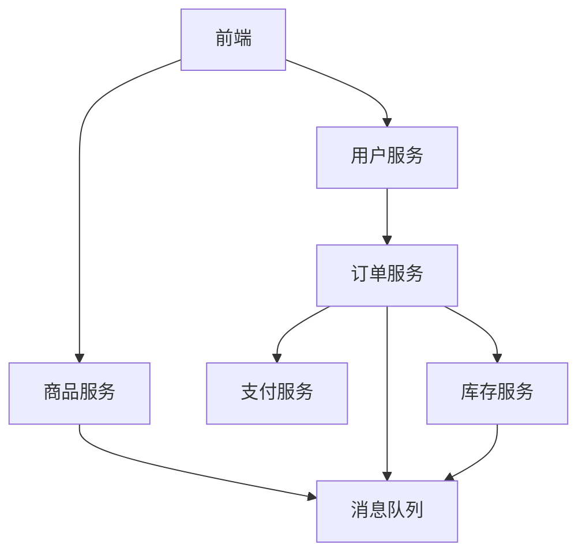

                 

### 云原生概述

#### **1.1.1 云原生概念**

云原生（Cloud Native）是一种针对现代云计算环境下的软件开发与架构设计的新范式。它不仅仅是一种技术，更是一种理念，一种在快速变化的数字时代中，帮助企业灵活应对市场需求的策略。云原生应用具有以下几个核心特点：

1. **容器化**：云原生应用通常运行在容器中，容器是一种轻量级、可移植、自给自足的运行环境。这使得应用能够在不同的计算环境中无缝运行，无需担心环境差异。

2. **动态管理**：云原生应用通过自动化工具如Kubernetes进行动态管理和编排。这意味着应用可以自动扩展、负载均衡，并且在出现故障时可以自动恢复。

3. **持续集成与持续部署（CI/CD）**：云原生应用支持快速、频繁的代码集成和部署。通过CI/CD流程，开发者可以更快地交付高质量的软件。

4. **微服务架构**：云原生应用通常采用微服务架构。微服务是一种将应用程序拆分为多个独立服务的方法，每个服务都可以独立开发和部署。

5. **服务网格**：服务网格是一种独立的网络层基础设施，用于管理服务之间的通信。它提供了灵活的服务发现、负载均衡和安全功能。

#### **1.1.2 云原生的发展历程**

云原生概念的出现并非一蹴而就，它有着深厚的历史背景和技术的积累。以下是云原生技术发展的重要里程碑：

- **2000年代初**：虚拟化技术的发展为云原生打下了基础。虚拟化技术使得多个操作系统可以在同一台物理机上同时运行，提高了硬件资源的利用率。

- **2013年**：Docker的诞生标志着容器技术的崛起。Docker提供了一种简单、高效的容器化解决方案，使得容器成为云原生应用的标准运行环境。

- **2014年**：Google开源了Kubernetes，这是一种用于容器编排的开源平台。Kubernetes的流行推动了容器编排技术的发展，并成为云原生应用的关键组件。

- **2015年**：微服务架构开始受到广泛关注。微服务架构通过将大型单体应用拆分为多个小型、独立的服务，提高了应用的灵活性和可扩展性。

- **2017年至今**：服务网格技术逐渐成熟。Istio和Linkerd等开源服务网格项目的出现，为微服务架构提供了更强大的通信和安全功能。

#### **1.1.3 云原生的核心优势**

云原生技术为企业带来了诸多优势，以下是其中一些关键的优势：

1. **可移植性**：由于容器是云原生应用的基本构建块，应用可以在任何支持容器运行的环境中部署，无需担心环境差异。

2. **弹性伸缩**：云原生应用可以基于实际负载动态调整资源分配，确保应用在高峰期仍能稳定运行。

3. **自动化部署**：通过CI/CD工具，开发者可以实现自动化代码集成和部署，大大缩短了从开发到生产部署的周期。

4. **持续集成与持续部署**：频繁的集成和部署有助于快速发现和修复问题，提高了软件交付的速度和质量。

5. **高可靠性和安全性**：云原生架构通过自动化管理和安全隔离，提高了系统的可靠性和安全性。

6. **灵活的架构设计**：云原生应用采用微服务架构，使得应用可以灵活地扩展和升级，适应不断变化的市场需求。

总之，云原生为企业在现代云计算环境中提供了更灵活、高效和可靠的解决方案，使其能够更好地应对快速变化的市场和技术挑战。

### 第2章：容器技术原理

#### **2.1.1 容器基础**

容器（Container）是一种轻量级的、可移植的计算环境，它允许开发者将应用程序及其依赖项打包成一个独立的运行单元，确保该应用在不同的计算环境中都能一致地运行。容器技术的核心思想是将应用程序与基础操作系统隔离开来，从而实现环境一致性和可移植性。

**定义**：容器是一种轻量级、可执行的运行时环境，它封装了应用程序及其依赖项，使得应用可以在不同的操作系统和硬件环境中一致运行。

**核心组件**：

1. **容器引擎**：容器引擎负责创建、启动、管理和停止容器。常见的容器引擎包括Docker、containerd和runc等。

2. **容器运行时**：容器运行时是容器引擎的基础层，它负责管理容器的生命周期。容器运行时通常包含在容器引擎中。

3. **容器镜像**：容器镜像是一个只读的模板，用于创建容器。它包含了应用程序、库、工具和配置文件。容器从镜像中启动并运行。

4. **容器化文件系统**：容器使用自己的文件系统，与宿主机文件系统保持隔离。这种隔离保证了容器内的应用不会影响宿主机或其他容器。

**容器化过程**：

1. **构建镜像**：开发者使用Dockerfile等工具构建容器镜像。Dockerfile是一组用于创建镜像的命令，它定义了容器镜像的构建过程。

2. **运行容器**：通过容器引擎，开发者可以启动一个或多个容器，容器从镜像中启动并开始运行。

3. **管理容器**：容器引擎提供了一系列命令，用于管理容器的生命周期，包括启动、停止、删除和查看容器状态等。

**容器与虚拟机的对比**：

容器和虚拟机（VM）在概念上有一些相似之处，但它们在实现和应用场景上存在显著差异。

1. **资源隔离**：容器和虚拟机都提供资源隔离，但容器是操作系统级别的虚拟化，虚拟机是硬件级别的虚拟化。容器比虚拟机轻量，因为它不需要额外模拟硬件资源。

2. **性能开销**：容器相对于虚拟机具有更低的性能开销，因为容器不需要模拟硬件资源，它直接运行在宿主机的操作系统上。

3. **资源占用**：容器占用资源较少，因为它不需要模拟整个操作系统，而虚拟机需要模拟整个硬件环境，包括CPU、内存、硬盘等。

4. **应用场景**：容器适用于需要快速部署、频繁扩展和缩短交付周期的情况，如微服务架构和DevOps实践。虚拟机适用于需要独立运行不同操作系统或需要更高安全隔离的场景，如跨操作系统开发和多租户环境。

**容器技术发展历程**：

容器技术的发展经历了几个关键阶段：

1. **初始阶段**：早期的容器技术，如chroot和cgroups，提供了基本的隔离和资源限制功能。

2. **Docker时代**：2013年，Docker的出现使得容器技术得到了广泛关注和普及。Docker提供了一套简单、高效的容器化解决方案，极大地推动了容器技术的发展。

3. **容器编排**：随着容器应用的普及，容器编排工具如Kubernetes和Mesos应运而生。这些工具提供了自动化的容器管理功能，包括部署、扩展、负载均衡和故障恢复等。

4. **服务网格**：近年来，服务网格技术如Istio和Linkerd等逐渐成熟。服务网格为容器提供了更灵活、高效的服务发现、负载均衡和安全功能。

通过了解容器的基础概念、核心组件、容器化过程以及容器与虚拟机的对比，开发者可以更好地理解容器技术，并在实际应用中充分利用其优势。

### 第3章：容器编排与管理

#### **3.1.1 Kubernetes基础**

Kubernetes（简称K8s）是一个开源的容器编排和管理平台，由Google设计并捐赠给Cloud Native Computing Foundation（CNCF）管理。Kubernetes的目标是自动化容器操作，如部署、扩展和管理容器化应用程序。通过Kubernetes，开发者可以轻松地管理复杂的应用程序，确保其高可用性和弹性。

**定义**：Kubernetes是一个开源的容器编排系统，用于自动化部署、扩展和管理容器化应用程序。

**核心概念**：

1. **节点（Node）**：节点是Kubernetes集群中的计算单元，每个节点都运行着一个Kubernetes的容器引擎（如Docker）。节点上运行的容器被称为Pod。

2. **Pod**：Pod是Kubernetes中的基本工作单元，它包含一个或多个容器。Pod确保容器在同一个计算环境中运行，并提供共享资源（如网络和存储）。

3. **集群（Cluster）**：集群是由多个节点组成的Kubernetes计算资源池。集群允许用户跨多个节点分配和管理资源，提高应用的可用性和可伸缩性。

4. **命名空间（Namespace）**：命名空间是Kubernetes中的一个资源隔离机制，它允许用户在同一个集群中创建多个隔离的环境。

5. **工作负载（Workload）**：工作负载是指Kubernetes中的Pod、部署和状态集等资源。工作负载定义了应用程序如何在集群中运行。

6. **控制器（Controller）**：控制器是Kubernetes中的管理组件，负责确保集群中的资源按照预期运行。常见的控制器包括部署控制器（Deployment Controller）、副本控制器（Replica Controller）和节点控制器（Node Controller）等。

7. **服务（Service）**：服务是一种抽象，用于将一组Pod暴露为单一的IP地址或域名。服务提供负载均衡和服务发现功能，使外部用户可以访问集群中的应用程序。

**Kubernetes的核心组件**：

1. **控制平面组件**：控制平面组件负责集群的管理和监控。主要组件包括：

   - **API服务器（API Server）**：API服务器是Kubernetes系统的核心组件，它接收和处理所有的集群操作请求，如创建、删除和更新资源。

   - **控制器管理器（Controller Manager）**：控制器管理器运行多个控制器，如部署控制器、节点控制器和命名空间控制器，确保集群中的资源按照预期运行。

   - **调度器（Scheduler）**：调度器负责分配Pod到集群中的节点上。调度器根据节点的资源状况和策略，选择最优的节点来运行Pod。

   - **ETCD**：ETCD是一个键值存储数据库，用于存储Kubernetes的所有配置和状态信息。

2. **数据平面组件**：数据平面组件负责容器集群中的Pod管理。主要组件包括：

   - **Kubelet**：Kubelet是运行在每个节点上的守护进程，负责与API服务器通信，确保节点上的Pod和容器按照预期运行。

   - **Kube-Proxy**：Kube-Proxy是负责服务发现和负载均衡的组件，它运行在每个节点上，代理网络流量到正确的Pod。

**Kubernetes运维实战**：

1. **集群部署**：使用Kubeadm等工具，可以轻松部署Kubernetes集群。Kubeadm提供了一种简单的命令行界面，用于初始化主节点和工作节点。

2. **Kubernetes运维工具**：常用的Kubernetes运维工具有kubectl、Helm、KubeSphere等。kubectl是Kubernetes的命令行工具，用于与集群进行交互。Helm是一个Kubernetes的包管理工具，用于管理应用部署。KubeSphere是一个基于Kubernetes的多云容器平台，提供了丰富的管理和监控功能。

3. **集群监控**：使用Prometheus和Grafana等监控工具，可以实时监控Kubernetes集群的性能和资源使用情况。Prometheus是一个开源的监控解决方案，它负责数据收集、存储和报警。Grafana是一个开源的数据可视化平台，用于展示Prometheus的数据。

通过掌握Kubernetes的基础知识、核心组件和运维实战，开发者可以有效地管理和部署容器化应用程序，实现高可用性和弹性扩展。

#### **3.1.2 Kubernetes核心组件**

Kubernetes的核心组件是确保其功能完整性和高效管理的关键。以下是Kubernetes中几个重要的核心组件及其作用：

1. **API服务器（API Server）**：
   - **作用**：API服务器是Kubernetes系统的核心组件，它提供了集群管理的所有接口。所有与Kubernetes集群的交互都通过API服务器进行。
   - **工作原理**：API服务器处理用户通过kubectl或其他客户端发送的请求，并将其转换为对集群内部各种资源对象（如Pod、Service、Deployment等）的操作指令。

2. **控制器管理器（Controller Manager）**：
   - **作用**：控制器管理器是Kubernetes的另一个核心组件，它运行多个控制器，确保集群中的资源处于预期状态。
   - **工作原理**：控制器管理器包含以下主要控制器：
     - **工作负载控制器**：确保Pod的数量满足期望，即副本数量。
     - **命名空间控制器**：管理和监控命名空间。
     - **服务账户与令牌控制器**：管理服务账户和令牌，为Pod提供身份验证和访问权限。
     - **节点控制器**：监控节点状态，处理节点加入或离开集群的情况。

3. **调度器（Scheduler）**：
   - **作用**：调度器负责将Pod分配到集群中的节点上，以确保资源的高效利用。
   - **工作原理**：调度器根据节点的资源状态、Pod的约束条件、调度策略等，选择最佳的节点来运行Pod。

4. **Kubelet**：
   - **作用**：Kubelet是运行在每个节点上的一个守护进程，负责与API服务器通信，确保节点上的Pod和容器按照预期运行。
   - **工作原理**：Kubelet执行以下任务：
     - **节点代理**：汇报节点的状态。
     - **容器管理**：管理运行在节点上的容器，包括启动、停止和监控。
     - **容器健康检查**：执行健康检查，确保容器按照预期运行。

5. **Kube-Proxy**：
   - **作用**：Kube-Proxy是一个网络代理，负责处理集群内部和服务之间的流量。
   - **工作原理**：Kube-Proxy执行以下任务：
     - **服务代理**：代理集群内部服务之间的流量。
     - **负载均衡**：为服务提供负载均衡功能。
     - **服务发现**：在集群内部为服务提供域名和IP地址，使得Pod可以轻松发现和访问其他服务。

通过理解Kubernetes的核心组件及其作用，开发者可以更好地设计和管理容器化应用，确保其高效运行和可靠性。

#### **3.1.3 Kubernetes运维实战**

在实际应用中，Kubernetes的运维是一项复杂的任务，涉及到集群的部署、资源监控、故障处理等多个方面。以下是一些Kubernetes运维的实战技巧和工具：

1. **集群部署**：
   - **使用Kubeadm初始化集群**：Kubeadm是一种常用的集群初始化工具，通过简单的命令行操作，可以快速部署一个Kubernetes集群。安装过程主要包括配置主节点和工作节点，以及配置网络插件。
   - **自动化部署工具**：使用如Kops、kind等自动化部署工具，可以进一步简化集群部署过程。这些工具提供了图形化界面和脚本，帮助用户自动化执行初始化和配置任务。

2. **集群监控**：
   - **使用Prometheus和Grafana**：Prometheus是一个开源监控解决方案，用于收集、存储和报警。Grafana则是一个开源的数据可视化平台，用于展示Prometheus的数据。通过这两者的结合，用户可以实时监控集群的性能和资源使用情况。
   - **监控报警**：配置Prometheus报警规则，可以在集群出现异常时及时发出警报。常见的报警指标包括资源使用率、服务响应时间、容器健康状态等。

3. **故障处理**：
   - **故障排查工具**：使用如kubectl、describe、logs等kubectl子命令，可以快速排查集群中的故障。例如，使用`kubectl describe pod <pod-name>`可以查看Pod的详细信息，包括其运行状态、容器日志等。
   - **故障恢复策略**：Kubernetes提供了多种故障恢复策略，如自动重启失败的Pod、删除失败的Pod并重新部署等。通过配置Pod的`restartPolicy`，可以定义故障恢复行为。

4. **资源优化**：
   - **资源配额和限制**：为集群中的命名空间设置资源配额和限制，可以防止某个命名空间过度消耗集群资源。例如，通过设置CPU和内存限制，可以确保Pod不会占用过多资源。
   - **自动扩缩容**：使用Kubernetes的自动扩缩容功能，可以根据实际负载自动调整Pod的数量。通过配置Helm图表或编写自定义扩缩容策略，可以实现自动化的资源管理。

5. **最佳实践**：
   - **备份和恢复**：定期备份ETCD数据库和容器镜像，确保在数据丢失或系统故障时可以快速恢复。
   - **升级和版本控制**：定期升级Kubernetes集群，确保其保持最新和安全状态。使用工具如kubeadm和kops，可以简化升级过程。
   - **安全配置**：配置RBAC（基于角色的访问控制）策略，确保只有授权用户可以访问集群资源。此外，使用安全组、网络策略等手段，加强集群的安全性。

通过掌握这些Kubernetes运维实战技巧和工具，开发者可以更有效地管理和维护Kubernetes集群，确保其稳定运行和高可用性。

### 第4章：服务网格与微服务

#### **4.1.1 服务网格概念**

服务网格（Service Mesh）是一种用于管理服务之间通信的基础设施层，它提供了一种抽象的方式来处理服务发现、负载均衡、服务间认证和加密等通信问题。服务网格的主要目的是将服务的通信与服务的业务逻辑分离，从而简化微服务架构的部署、管理和监控。

**定义**：服务网格是一个独立的网络层基础设施，用于管理和集成服务之间的通信。

**核心组件**：

1. **服务代理（Service Proxy）**：服务代理（也称为边车（Sidecar））是运行在服务实例旁边的小型代理，负责处理所有进出服务的网络流量。常见的服务代理包括Istio的Envoy、Linkerd的Bender等。

2. **控制平面（Control Plane）**：控制平面是服务网格的核心部分，负责配置和监控服务代理的行为。控制平面通过服务发现机制获取服务实例的信息，并将其下发到服务代理。

3. **服务发现（Service Discovery）**：服务发现是服务网格的一项重要功能，它负责跟踪和发现服务实例的地址和端口。服务代理通过服务发现机制获取服务实例的信息，并动态更新其内部路由表。

4. **流量管理（Traffic Management）**：流量管理包括负载均衡、路由规则、断路器和熔断等机制，用于控制服务之间的流量流向。服务代理根据控制平面下发的路由规则，对服务实例之间的流量进行管理和转发。

5. **监控和日志（Monitoring and Logging）**：服务网格提供了集成的监控和日志功能，帮助开发者和管理员实时监控服务的性能和状态。这些数据可以通过控制平面集中管理和分析。

#### **4.1.2 服务网格技术选型**

在云原生应用开发中，选择合适的服务网格技术至关重要。以下是几种主流服务网格技术的对比和选型建议：

1. **Istio**：
   - **优点**：Istio是当前最流行的服务网格解决方案，它提供了丰富的功能，包括自动注入、智能路由、安全策略和监控。Istio具有强大的社区支持和广泛的文档资源。
   - **适用场景**：适用于大规模微服务架构，特别是在需要高级流量管理和安全性的场景中。
   - **缺点**：Istio的安装和配置相对复杂，可能需要一定的学习和调试成本。

2. **Linkerd**：
   - **优点**：Linkerd是一个高性能、易于部署的服务网格解决方案，它具有简洁的设计和强大的性能。Linkerd提供了自动注入、服务发现、负载均衡和监控功能。
   - **适用场景**：适用于需要快速部署和高效性能的场景，特别是在中小型微服务架构中。
   - **缺点**：Linkerd的社区支持和文档资源相对较少，可能不如Istio成熟。

3. **Kubernetes Ingress**：
   - **优点**：Kubernetes Ingress是一个内置的服务网格解决方案，它通过配置Ingress资源来管理服务之间的流量。Kubernetes Ingress易于集成和部署，无需额外安装和配置。
   - **适用场景**：适用于简单的服务发现和流量管理需求，特别是在不需要高级流量管理和安全功能的场景中。
   - **缺点**：Kubernetes Ingress功能较为有限，不支持智能路由和安全策略。

4. **Consul Service Mesh**：
   - **优点**：Consul Service Mesh基于Consul的服务发现和配置管理功能，提供了强大的服务网格能力。Consul Service Mesh支持自动注入、智能路由、负载均衡和服务间认证。
   - **适用场景**：适用于需要服务发现和配置管理功能，特别是与Consul集成的场景。
   - **缺点**：Consul Service Mesh的部署和配置相对复杂，可能需要一定的学习成本。

**选型建议**：根据具体的业务需求和团队的技术能力，选择合适的服务网格技术。对于大规模、复杂的微服务架构，Istio可能是最佳选择。对于中小型应用或需要快速部署的场景，Linkerd和Kubernetes Ingress可能更为适合。如果团队已经使用Consul进行服务发现和配置管理，Consul Service Mesh是一个不错的选择。

通过了解服务网格的概念、核心组件和技术选型，开发者可以更好地构建和管理云原生微服务架构，实现高效、可靠的分布式服务通信。

#### **4.1.3 微服务架构设计**

微服务架构（Microservices Architecture）是一种将大型复杂应用程序拆分为多个独立、可扩展的服务的方法。这种方法使得各个服务可以独立开发、部署和扩展，提高了系统的灵活性和可维护性。以下是微服务架构的设计原则、核心组件以及服务间通信机制。

**定义**：微服务架构是一种将应用程序拆分为多个小型、独立、可复用的服务的方法。每个服务负责一个特定的业务功能，通过轻量级通信机制相互协作。

**设计原则**：

1. **自治性**：每个服务应具有独立的开发、部署和扩展能力。自治性确保了服务的变更不会影响到其他服务，从而提高了系统的可靠性和可维护性。

2. **解耦合**：服务之间应尽可能解耦合，以降低服务间的依赖性。解耦合可以通过使用轻量级通信机制（如HTTP/REST API）和异步消息队列（如RabbitMQ、Kafka）来实现。

3. **独立性**：每个服务应独立部署和扩展，以便根据实际负载动态调整资源分配。独立性使得系统可以更好地应对流量波动和故障恢复。

4. **标准化**：服务应遵循统一的接口规范、数据格式和通信协议，以便于集成和管理。

**核心组件**：

1. **服务实例**：服务实例是微服务架构中的基本运行单元。每个服务实例负责实现特定的业务功能，如用户管理、订单处理、库存管理等。

2. **服务注册中心**：服务注册中心用于跟踪和管理服务实例的地址和端口。服务启动时，实例信息会被注册到服务注册中心，服务停止时，实例信息会被注销。

3. **负载均衡器**：负载均衡器负责将外部请求分发到不同的服务实例上，以确保系统的高可用性和性能。

4. **消息队列**：消息队列用于异步通信，确保服务之间的解耦合。常见消息队列包括RabbitMQ、Kafka和ActiveMQ。

5. **服务监控和日志**：服务监控和日志系统用于实时监控服务的性能和状态，帮助快速发现和解决问题。

**服务间通信机制**：

1. **同步通信**：同步通信是指服务实例之间通过直接调用的方式进行通信。常见的同步通信协议包括HTTP/REST、gRPC和Thrift。

2. **异步通信**：异步通信是指服务实例之间通过消息队列进行通信。异步通信可以降低服务间的耦合，提高系统的可扩展性和容错性。

3. **服务发现**：服务发现是指客户端能够动态发现服务实例的地址和端口。服务注册中心和服务发现组件协同工作，实现服务的动态发现。

4. **负载均衡**：负载均衡是指将外部请求分配到多个服务实例上，确保系统的性能和可用性。常见的负载均衡策略包括轮询、最少连接数和源IP哈希。

通过遵循微服务架构的设计原则、核心组件和通信机制，开发者可以构建灵活、可靠和可扩展的分布式系统。微服务架构不仅提高了系统的开发效率和可维护性，还使得企业能够更好地应对快速变化的市场需求和技术挑战。

### 第5章：持续集成与持续部署

#### **5.1.1 CI/CD概述**

持续集成与持续部署（Continuous Integration/Continuous Deployment，简称CI/CD）是一种现代化软件开发和部署流程，旨在通过自动化工具和流程来提高软件交付的速度和质量。CI/CD通过自动化测试、构建和部署，确保每次代码更改都能快速集成、测试和部署，从而减少软件缺陷，提高开发效率和系统可靠性。

**定义**：

- **持续集成（CI）**：持续集成是一种软件开发实践，通过自动化测试和构建，确保每次代码提交都能与主分支保持一致，及时发现和修复集成问题。
- **持续部署（CD）**：持续部署是一种自动化部署流程，通过自动化工具，将经过CI验证的代码快速、安全地部署到生产环境中。

**核心概念**：

1. **自动化测试**：自动化测试是CI/CD的核心组成部分，通过编写和执行自动化测试脚本，对代码进行全面的测试，确保每次代码更改都不会破坏现有功能。

2. **构建**：构建是将源代码转换为目标应用程序的过程，包括编译、打包、构建依赖等。自动化构建可以确保构建过程的一致性和可重复性。

3. **部署**：部署是将构建好的应用程序部署到生产环境的过程。自动化部署可以减少人为错误，提高部署效率。

4. **容器化**：容器化是将应用程序及其依赖项打包成一个独立的容器镜像，确保应用程序在不同环境中的一致性。

**CI/CD的优势**：

1. **快速反馈**：通过自动化测试，开发者可以快速获得关于代码质量的反馈，及时修复问题。
2. **提高质量**：自动化测试和构建可以确保每次提交的代码都经过严格的验证，减少软件缺陷。
3. **缩短交付周期**：自动化流程减少了手动操作的步骤，加快了从代码提交到生产部署的过程。
4. **提高可靠性**：通过持续集成和自动化部署，确保每次部署都是经过验证的，减少部署失败的风险。

**CI/CD的流程**：

1. **代码提交**：开发者将代码提交到版本控制系统（如Git）。
2. **触发构建**：提交代码后，CI工具（如Jenkins、GitLab CI）会自动触发构建过程，编译和打包代码。
3. **执行测试**：构建完成后，CI工具会执行自动化测试，确保代码质量。
4. **部署**：通过CD工具（如Jenkins、Kubernetes），将通过测试的代码部署到测试环境或生产环境。

通过掌握CI/CD的基本概念和流程，开发者可以构建高效、可靠的软件开发和部署流程，提高团队协作效率和软件质量。

#### **5.1.2 Jenkins实践**

Jenkins是一个开源的持续集成（CI）工具，广泛用于自动化构建、测试和部署。通过Jenkins，开发者可以轻松地设置自动化流水线，确保代码的质量和可靠性。

**Jenkins安装**：

1. **环境准备**：在Linux环境中，安装Jenkins之前需要安装Java环境和Apache Maven。
   ```shell
   sudo apt-get update
   sudo apt-get install openjdk-8-jdk
   sudo apt-get install maven
   ```

2. **下载Jenkins**：从Jenkins官网下载最新版本的Jenkins WAR文件。
   ```shell
   wget -O /tmp/jenkins.war https://www.jenkins.io/release/2.279.1/download
   ```

3. **启动Jenkins**：使用Java运行Jenkins。
   ```shell
   java -jar /tmp/jenkins.war --prefix=/var/jenkins_home
   ```

4. **访问Jenkins**：在浏览器中访问Jenkins，默认地址为`http://localhost:8080`，安装向导会自动启动。

**配置Jenkins流水线**：

1. **创建流水线项目**：

   - 在Jenkins首页创建一个新的项目。
   - 选择“Pipeline”作为项目类型。
   - 命名项目并保存。

2. **编写流水线脚本**：

   - 在项目设置中，选择“Pipeline”标签页。
   - 在“Pipeline script from SCM”选项中，选择“Script from SCM”。
   - 在“Script Path”中输入Jenkinsfile的路径，或直接在文本框中编写Jenkinsfile内容。

   例如，以下是一个简单的Jenkinsfile示例：
   ```groovy
   pipeline {
       agent any
       stages {
           stage('Build') {
               steps {
                   sh 'mvn clean package'
               }
           }
           stage('Test') {
               steps {
                   sh 'mvn test'
               }
           }
           stage('Deploy') {
               steps {
                   sh 'mvn deploy'
               }
           }
       }
   }
   ```

3. **触发器配置**：

   - 在项目设置中，选择“Trigger Build”标签页。
   - 配置触发器，如“Poll SCM”（轮询代码库），或“Build Trigger”（手动触发）。

**常用插件**：

- **Git Plugin**：用于集成Git仓库。
- **Maven Integration Plugin**：用于集成Maven构建工具。
- **GitLab CI/CD Plugin**：用于与GitLab的CI/CD集成。
- **Docker Plugin**：用于自动化Docker镜像的构建和部署。

**实际应用案例**：

假设我们有一个Web应用程序，使用Jenkins进行自动化构建和部署。

1. **构建和测试**：

   - Jenkins会定期轮询Git仓库，一旦检测到代码变更，就会自动触发构建过程。
   - 构建过程中，Jenkins会执行Maven命令，编译和打包代码，并运行自动化测试。
   - 如果测试通过，构建过程将继续进行下一步，否则构建会失败，并触发通知。

2. **部署**：

   - 构建成功后，Jenkins会使用Docker插件构建Docker镜像。
   - 镜像构建完成后，Jenkins会将其推送到Docker Hub或私有仓库。
   - 最后，Jenkins会使用Kubernetes插件，将Docker镜像部署到Kubernetes集群中。

通过Jenkins，开发者可以轻松实现自动化构建、测试和部署，从而提高开发效率和软件质量。Jenkins的灵活性和扩展性使其成为现代软件开发不可或缺的工具。

#### **5.1.3 GitLab CI/CD实践**

GitLab CI/CD 是 GitLab 内置的持续集成和持续部署工具，它允许开发者在代码仓库中定义整个构建和部署流程。GitLab CI/CD 的配置非常灵活，可以处理从简单的静态网站到复杂的应用程序的各种用例。

**GitLab CI/CD 概述**：

GitLab CI/CD 利用 `.gitlab-ci.yml` 文件来定义构建、测试和部署流程。这个文件位于项目的 `.git` 目录中，GitLab CI/CD 工具在每次代码提交时都会读取该文件并执行相应的步骤。

**配置文件 `.gitlab-ci.yml`**：

`.gitlab-ci.yml` 文件的配置分为几个部分：全局配置、管道阶段、管道步骤、服务配置和脚本。

1. **全局配置**：

   ```yaml
   image: node:14  # 指定基础镜像
   services:
     - postgres:13  # 指定需要的服务
   ```

2. **管道阶段和步骤**：

   ```yaml
   before_script:
     - echo "Running before script"

   stages:
     - test
     - deploy

   test:
     stage: test
     script:
       - echo "Running tests"
       - npm test

   deploy:
     stage: deploy
     script:
       - echo "Deploying application"
     only:
       - master  # 只有主分支的提交会触发部署流程
   ```

3. **服务配置**：

   ```yaml
   services:
     - name: my-service
       command: python app.py
       ports:
         - 8000:8000
   ```

4. **脚本**：

   可以在配置文件中直接编写脚本，例如：

   ```yaml
   script:
     - echo "This is a custom script"
   ```

**实际应用案例**：

假设我们有一个使用 Node.js 的 Web 应用程序，在 GitLab 仓库中，我们创建了一个 `.gitlab-ci.yml` 文件来定义 CI/CD 流程。

1. **测试**：

   ```yaml
   test:
     stage: test
     script:
       - echo "Installing dependencies"
       - npm install
       - echo "Running tests"
       - npm test
     only:
       - master
   ```

   当代码提交到主分支时，GitLab 会执行 `npm install` 安装依赖项，然后运行测试脚本 `npm test`。

2. **部署**：

   ```yaml
   deploy:
     stage: deploy
     script:
       - echo "Building the Docker image"
       - docker build -t myapp:latest .
       - echo "Pushing the Docker image to Docker Hub"
       - docker push myapp:latest
       - echo "Deploying to production server"
       - ssh deployuser@myserver.com 'sudo docker stop myapp && sudo docker rm myapp && sudo docker run -d --name myapp -p 8080:80 myapp:latest'
     only:
       - master
   ```

   在部署阶段，GitLab 首先构建 Docker 镜像，并将其推送到 Docker Hub。然后，它会在生产服务器上停止旧的应用实例，删除容器，并运行新的容器。

通过GitLab CI/CD，开发者可以轻松实现自动化测试和部署，确保代码质量，并加快交付周期。GitLab CI/CD 的强大之处在于其灵活性和可扩展性，使其能够适应各种复杂的应用场景。

### 第6章：云原生安全

#### **6.1.1 云原生安全概述**

随着云计算和容器技术的普及，云原生安全成为企业和开发人员关注的焦点。云原生安全涉及到保护云原生应用程序、容器、Kubernetes集群以及相关基础设施免受恶意攻击和数据泄露的风险。以下是云原生安全的关键方面：

**定义**：云原生安全是确保云原生环境中的应用程序、容器和基础设施的安全性和隐私性的措施。

**核心关注点**：

1. **容器镜像安全**：容器镜像包含应用程序及其依赖项，因此确保镜像的安全至关重要。这包括扫描镜像中的漏洞、权限设置和依赖项管理等。

2. **Kubernetes集群安全**：Kubernetes集群是管理容器化应用程序的核心，因此其安全性和配置管理至关重要。这包括网络策略、访问控制、角色分配和集群配置等。

3. **应用程序安全**：应用程序自身的安全性也是云原生安全的重要组成部分。包括应用程序层面的加密、安全编码实践和漏洞修复等。

4. **数据安全**：保护存储在容器和集群中的敏感数据，包括加密、访问控制和数据备份等。

**主要威胁**：

1. **容器逃逸**：攻击者通过漏洞获取容器权限，进而控制宿主机或其他容器。

2. **恶意镜像**：攻击者通过注入恶意代码或使用漏洞镜像，攻击容器化应用程序。

3. **网络攻击**：包括DDoS攻击、中间人攻击和跨站脚本攻击等。

4. **身份和访问管理（IAM）问题**：不当的访问控制配置可能导致未授权访问和数据泄露。

**最佳实践**：

1. **容器镜像安全**：

   - 使用官方镜像仓库，如Docker Hub或Quay.io。
   - 对镜像进行漏洞扫描，使用工具如Clair或Docker Bench for Security。
   - 确保镜像权限最小化，仅授予必要权限。
   - 定期更新镜像和依赖项，修复已知漏洞。

2. **Kubernetes集群安全**：

   - 配置RBAC，确保只有授权用户可以访问集群资源。
   - 使用网络策略，如Kubernetes Network Policy，限制容器间的流量。
   - 定期更新Kubernetes版本，修复安全漏洞。
   - 使用加密技术，如TLS，保护集群内部和外部通信。

3. **应用程序安全**：

   - 实施安全编码实践，如使用安全库和框架。
   - 对应用程序进行安全测试，包括静态代码分析和动态分析。
   - 使用安全审计工具，如Snyk或Aqua Security，监控应用程序安全。

4. **数据安全**：

   - 对敏感数据进行加密，包括存储和传输过程中。
   - 实施访问控制，确保只有授权用户可以访问敏感数据。
   - 定期备份数据，确保在数据丢失或故障时可以快速恢复。

通过了解云原生安全的核心关注点、主要威胁和最佳实践，企业和开发人员可以更好地保护云原生环境，确保其安全性和稳定性。

#### **6.1.2 容器镜像安全**

容器镜像安全是云原生安全的重要组成部分，确保容器镜像的安全对于保护整个云原生环境至关重要。以下是容器镜像安全的关键方面和最佳实践：

**关键方面**：

1. **镜像扫描**：对容器镜像进行扫描，检测其中可能存在的漏洞、安全风险和配置问题。常用的镜像扫描工具包括Clair、Docker Bench for Security和Trivy。

2. **镜像签名**：使用数字签名对容器镜像进行签名，确保镜像的完整性和真实性。签名后，可以通过验证签名来确保镜像在传输和存储过程中未被篡改。

3. **最小化镜像大小**：通过删除不必要的依赖项和文件，减少镜像的大小。较小的镜像不仅可以提高效率，还可以减少潜在的攻击面。

4. **权限设置**：确保容器镜像的权限设置最小化，仅授予必要的权限。这可以降低恶意代码在容器中执行的风险。

5. **依赖管理**：对容器镜像中的依赖项进行严格管理，确保所有依赖项都来自可靠的来源，并定期更新以修复已知的漏洞。

**最佳实践**：

1. **使用官方镜像仓库**：尽量使用官方镜像仓库，如Docker Hub或Quay.io。这些镜像经过官方审核，具有较高的安全性和可靠性。

2. **定期扫描镜像**：定期对容器镜像进行扫描，检测其中可能存在的漏洞和安全风险。可以通过自动化工具集成到CI/CD流程中，确保每次构建后镜像都会被扫描。

3. **使用镜像签名**：对容器镜像进行签名，确保其完整性和真实性。签名后，可以通过验证签名来确保镜像未被篡改。

4. **最小化镜像大小**：通过删除不必要的依赖项和文件，最小化容器镜像的大小。可以使用工具如Dockerfile清理或镜像压缩工具来实现。

5. **权限设置**：确保容器镜像的权限设置最小化，仅授予必要的权限。这可以通过设置容器运行时的安全上下文来实现。

6. **依赖管理**：对容器镜像中的依赖项进行严格管理，确保所有依赖项都来自可靠的来源，并定期更新以修复已知的漏洞。

通过遵循这些关键方面和最佳实践，可以显著提高容器镜像的安全性，从而保护整个云原生环境。

#### **6.1.3 Kubernetes安全**

Kubernetes安全是确保Kubernetes集群安全性和可靠性的重要方面。以下是一些关键的安全策略和实践，用于保护Kubernetes集群免受恶意攻击和未授权访问。

**核心安全策略**：

1. **访问控制**：通过Kubernetes的RBAC（基于角色的访问控制）策略，控制集群内各个用户和服务的权限。确保只有授权用户可以访问和管理集群资源。

2. **网络策略**：使用Kubernetes网络策略（Network Policy）来限制集群内容器之间的流量，防止未授权的网络访问。

3. **密钥管理**：保护Kubernetes集群的密钥和凭证，如API密钥、SSH密钥和用户凭证。使用加密存储和定期轮换密钥来确保安全性。

4. **审计日志**：启用Kubernetes审计日志功能，记录集群操作的详细信息。通过分析审计日志，可以及时发现和响应潜在的安全事件。

5. **容器镜像安全**：确保容器镜像的安全性，通过扫描镜像漏洞、使用最小权限运行容器和签署镜像来提高安全性。

**最佳实践**：

1. **配置RBAC**：为集群中的各个用户和服务角色分配适当的权限。创建自定义角色和角色绑定，确保只有必要的权限被授予。

2. **网络隔离**：使用网络策略来限制容器之间的流量，仅允许必要的通信。为不同命名空间设置独立的网络策略，确保流量不会跨越命名空间。

3. **使用TLS**：使用TLS（传输层安全性）来保护Kubernetes集群的通信。为API服务器、控制平面组件和容器之间的通信配置TLS。

4. **定期更新和补丁**：定期更新Kubernetes集群和组件，以修复已知的漏洞和安全性问题。确保所有组件都保持在最新版本。

5. **日志和监控**：启用Kubernetes审计日志，并配置日志存储和监控工具。通过实时监控日志，可以快速检测和响应潜在的安全事件。

6. **使用安全镜像**：确保使用的容器镜像来自可靠的来源，并定期进行漏洞扫描。对容器镜像进行最小权限设置，确保容器在运行时不会具有不必要的权限。

通过遵循这些核心安全策略和最佳实践，可以显著提高Kubernetes集群的安全性，保护其免受潜在的安全威胁。

### 第7章：云原生应用开发实践

#### **7.1.1 应用案例介绍**

在本节中，我们将探讨一个具体的云原生应用开发案例——一个基于微服务架构的电商平台。这个电商平台是一个典型的云原生应用，利用了容器化、自动化部署、服务网格和微服务架构等关键技术，实现高可用性、弹性伸缩和快速迭代。

**应用场景**：电商平台通常需要处理大量的用户请求和交易，因此其架构需要具备高并发处理能力和快速响应速度。此外，电商平台还需要频繁发布新功能和进行性能优化。

**技术栈**：

- **容器化**：使用Docker容器化应用，确保应用可以在不同的环境中一致运行。
- **Kubernetes**：使用Kubernetes进行容器编排和管理，实现自动化部署、扩展和故障恢复。
- **微服务架构**：将应用拆分为多个微服务，如用户服务、商品服务、订单服务、支付服务等。
- **服务网格**：使用Istio作为服务网格，提供服务发现、负载均衡和安全功能。
- **CI/CD**：采用GitLab CI/CD实现自动化测试和部署，加快交付周期。

**架构设计**：该电商平台采用了微服务架构，以下是其核心组件：

1. **用户服务**：处理用户注册、登录、个人信息管理等。
2. **商品服务**：管理商品信息、库存、分类等。
3. **订单服务**：处理订单创建、取消、支付等。
4. **支付服务**：处理支付请求和订单确认。
5. **库存服务**：管理商品库存信息，确保库存同步。
6. **消息队列**：使用RabbitMQ作为消息队列，实现异步通信和流量解耦。

#### **7.1.2 应用架构设计**

在云原生应用开发中，应用架构设计是确保系统性能、可伸缩性和可靠性的关键。以下是上述电商平台的应用架构设计，以及各个组件之间的交互方式。

**架构设计概述**：

1. **前端**：前端使用React或Vue.js等框架构建，通过RESTful API或gRPC与后端微服务进行通信。
2. **后端**：后端由多个微服务组成，每个微服务负责特定的业务功能。
3. **数据库**：使用分布式数据库架构，如Cassandra或MongoDB，确保高可用性和数据一致性。
4. **消息队列**：使用RabbitMQ等消息队列，实现异步通信和流量解耦。
5. **服务网格**：使用Istio作为服务网格，提供服务发现、负载均衡和安全功能。

**组件交互方式**：

1. **用户服务**：用户通过前端界面发起请求，前端将请求转发到用户服务，用户服务处理注册、登录等操作。
2. **商品服务**：用户服务调用商品服务获取商品信息，商品服务返回商品详情。
3. **订单服务**：用户服务将订单请求转发到订单服务，订单服务处理订单创建、取消等操作。
4. **支付服务**：订单服务将支付请求转发到支付服务，支付服务处理支付逻辑。
5. **库存服务**：订单服务调用库存服务，更新商品库存信息。
6. **消息队列**：订单服务和库存服务使用消息队列进行异步通信，确保系统的解耦和高可用性。

**架构图**：



通过这种架构设计，电商平台可以实现高并发处理能力、快速响应速度和灵活扩展，同时保证系统的高可用性和可靠性。

#### **7.1.3 应用实现与部署**

在实际开发过程中，构建和部署云原生应用需要遵循一系列步骤，确保应用的高效性和可靠性。以下是一个基于微服务架构的电商平台的实现与部署流程：

**1. 项目初始化**：

- 使用Docker Compose初始化项目，定义各个服务的Dockerfile和依赖关系。
- 创建Kubernetes配置文件，定义Pod、Service和Ingress等资源。

**2. 开发与测试**：

- 在本地环境中使用Docker Compose运行和测试各个微服务，确保其功能正确。
- 使用JUnit等测试框架编写单元测试和集成测试，确保代码质量。

**3. 集成与持续集成**：

- 使用GitLab CI/CD配置自动化流水线，触发测试和构建过程。
- 在CI/CD环境中运行测试，确保每次提交的代码都能通过测试。

**4. 构建与镜像推送到仓库**：

- 构建每个微服务的Docker镜像，并将其推送到私有或公共镜像仓库。
- 使用容器镜像扫描工具，如Clair，检查镜像中的安全漏洞。

**5. Kubernetes集群部署**：

- 使用Kubectl工具部署Kubernetes集群，配置网络插件（如Calico）。
- 部署服务网格（如Istio），确保服务间通信的安全和高效。

**6. 应用部署**：

- 使用Kubectl部署微服务到Kubernetes集群，配置Service和Ingress，确保外部访问。
- 使用Kubernetes Dashboard监控和管理集群资源。

**7. 运维与监控**：

- 使用Prometheus和Grafana监控集群性能和资源使用情况，设置报警阈值。
- 定期备份Kubernetes集群的ETCD数据库，确保数据安全。

**8. 持续迭代**：

- 使用GitLab CI/CD自动化测试和部署新功能，确保快速迭代。
- 定期进行性能优化和代码重构，提高系统性能和可维护性。

通过遵循这些步骤，可以高效地构建和部署云原生应用，确保其稳定运行和高可用性。

#### **7.1.4 应用实现与部署：环境安装**

在实现和部署云原生应用之前，需要安装和配置以下环境和工具：

1. **Docker**：Docker是一个开源的应用容器引擎，用于打包、交付和运行应用。可以从[Docker官网](https://www.docker.com/)下载并安装Docker。

   ```shell
   # 安装Docker
   sudo apt-get update
   sudo apt-get install docker-ce docker-compose
   ```

2. **Kubernetes**：Kubernetes是一个开源的容器编排平台，用于管理容器化应用。可以使用Kubeadm工具部署Kubernetes集群。

   ```shell
   # 安装Kubeadm、Kubelet和Kubectl
   sudo apt-get update
   sudo apt-get install apt-transport-https ca-certificates curl
   # 添加Kubernetes官方GPG关键
   sudo curl -s https://mirrors.aliyun.com/kubernetes/apt/doc/apt-key.gpg | sudo apt-key add -
   # 添加Kubernetes仓库
   sudo add-apt-repository "deb https://mirrors.aliyun.com/kubernetes/apt/ kubernetes-xenial main"
   sudo apt-get update
   sudo apt-get install kubelet kubeadm kubectl
   # 设置Kubelet开机启动
   sudo systemctl enable kubelet
   sudo systemctl start kubelet
   ```

3. **Kubernetes网络插件**：为了实现集群内的容器通信，需要安装并配置网络插件，如Calico。

   ```shell
   # 安装Calico
   kubectl create -f https://docs.projectcalico.org/manifests/calico.yaml
   ```

4. **服务网格**：为了实现微服务间的安全通信，可以选择安装Istio。

   ```shell
   # 安装Istio
   istioctl install --set profile=demo
   ```

5. **CI/CD工具**：GitLab CI/CD是用于自动化测试和部署的常用工具。可以在GitLab中创建CI/CD配置文件。

   ```yaml
   # .gitlab-ci.yml
   image: node:14

   services:
     - postgres:13

   before_script:
     - echo "Running before script"

   stages:
     - test
     - deploy

   test:
     stage: test
     script:
       - echo "Running tests"
       - npm test
     only:
       - master

   deploy:
     stage: deploy
     script:
       - echo "Deploying application"
     only:
       - master
   ```

通过上述步骤，可以搭建一个基本的云原生应用开发环境，为后续的详细实现和部署工作奠定基础。

### **7.1.5 应用实现与部署：核心代码解读与分析**

在云原生应用开发过程中，核心代码是实现业务逻辑和数据交互的关键。下面我们将详细分析电商平台的几个关键微服务的代码，包括其工作原理和性能优化策略。

#### **用户服务（User Service）**

**代码片段**：

```java
@RestController
@RequestMapping("/api/users")
public class UserController {
    private final UserService userService;

    @Autowired
    public UserController(UserService userService) {
        this.userService = userService;
    }

    @PostMapping("/register")
    public ResponseEntity<?> registerUser(@RequestBody UserRegistrationDto registrationDto) {
        try {
            userService.registerUser(registrationDto);
            return ResponseEntity.ok().build();
        } catch (Exception e) {
            return ResponseEntity.badRequest().body("Registration failed: " + e.getMessage());
        }
    }

    @PostMapping("/login")
    public ResponseEntity<?> authenticateUser(@RequestBody LoginDto loginDto) {
        String token = userService.authenticate(loginDto);
        return ResponseEntity.ok(new AuthenticationResponse(token));
    }
}
```

**工作原理**：

- **注册**：用户提交注册请求，包含用户名、密码和邮箱。用户服务接收请求后，调用UserService进行用户注册，并将注册结果返回给客户端。
- **登录**：用户提交登录请求，包含用户名和密码。用户服务验证用户身份，如果验证成功，返回JWT（JSON Web Token）令牌。

**性能优化**：

- **缓存**：使用Redis缓存用户信息，减少数据库查询次数，提高响应速度。
- **限流**：使用令牌桶或漏斗算法限制注册和登录请求的速率，防止服务被大量请求淹没。

#### **商品服务（Product Service）**

**代码片段**：

```java
@RestController
@RequestMapping("/api/products")
public class ProductService {
    private final ProductRepository productRepository;

    @Autowired
    public ProductService(ProductRepository productRepository) {
        this.productRepository = productRepository;
    }

    @GetMapping
    public List<Product> getAllProducts() {
        return productRepository.findAll();
    }

    @GetMapping("/{id}")
    public Product getProductById(@PathVariable Long id) {
        return productRepository.findById(id).orElseThrow(() -> new ResourceNotFoundException("Product not found"));
    }

    @PostMapping
    public Product createProduct(@RequestBody Product product) {
        return productRepository.save(product);
    }

    @PutMapping("/{id}")
    public Product updateProduct(@PathVariable Long id, @RequestBody Product product) {
        return productRepository.findById(id).map(existingProduct -> {
            existingProduct.setName(product.getName());
            existingProduct.setPrice(product.getPrice());
            return productRepository.save(existingProduct);
        }).orElseThrow(() -> new ResourceNotFoundException("Product not found"));
    }

    @DeleteMapping("/{id}")
    public void deleteProduct(@PathVariable Long id) {
        productRepository.deleteById(id);
    }
}
```

**工作原理**：

- **获取所有商品**：通过REST API获取所有商品信息。
- **获取单个商品**：通过商品ID获取单个商品信息。
- **创建商品**：创建新的商品记录。
- **更新商品**：更新现有商品记录。
- **删除商品**：删除商品记录。

**性能优化**：

- **分页查询**：使用分页查询减少一次性返回大量数据，提高响应速度。
- **数据库索引**：为常用的查询字段添加索引，提高数据库查询效率。

#### **订单服务（Order Service）**

**代码片段**：

```java
@RestController
@RequestMapping("/api/orders")
public class OrderController {
    private final OrderRepository orderRepository;
    private final InventoryService inventoryService;

    @Autowired
    public OrderController(OrderRepository orderRepository, InventoryService inventoryService) {
        this.orderRepository = orderRepository;
        this.inventoryService = inventoryService;
    }

    @PostMapping
    public ResponseEntity<?> createOrder(@RequestBody OrderRequestDto orderRequestDto) {
        if (inventoryService.validateInventory(orderRequestDto)) {
            Order order = orderRepository.save(new Order(orderRequestDto));
            return ResponseEntity.ok(order);
        } else {
            return ResponseEntity.badRequest().body("Insufficient inventory");
        }
    }

    @GetMapping("/{id}")
    public Order getOrderById(@PathVariable Long id) {
        return orderRepository.findById(id).orElseThrow(() -> new ResourceNotFoundException("Order not found"));
    }

    @DeleteMapping("/{id}")
    public void cancelOrder(@PathVariable Long id) {
        Order order = orderRepository.findById(id).orElseThrow(() -> new ResourceNotFoundException("Order not found"));
        if (order.getStatus() == OrderStatus.PENDING) {
            orderRepository.delete(order);
        } else {
            throw new ResourceException("Order cannot be cancelled");
        }
    }
}
```

**工作原理**：

- **创建订单**：接收订单请求，验证库存后创建订单记录。
- **获取订单**：通过订单ID获取订单详情。
- **取消订单**：取消待处理的订单。

**性能优化**：

- **异步处理**：使用消息队列异步处理订单创建和库存验证，减少响应时间。
- **缓存**：使用Redis缓存订单状态，提高查询效率。

通过上述代码解读，可以看到云原生应用开发中如何实现核心微服务的功能。此外，性能优化策略也是确保应用高效运行的重要环节。

#### **7.1.6 应用实现与部署：实际案例分析与详细讲解**

在本节中，我们将通过一个实际案例，详细讲解云原生应用的实现与部署过程，包括步骤、所使用的工具、代码解析以及关键配置。

**案例背景**：构建一个基于微服务架构的博客平台，使用Docker容器化、Kubernetes进行编排管理，并通过Jenkins实现持续集成与持续部署（CI/CD）。

**1. 项目结构**：

```plaintext
/blog-platform
├── user-service
│   ├── Dockerfile
│   ├── pom.xml
│   └── src
│       ├── main
│       │   ├── java
│       │   └── resources
│       └── test
├── blog-service
│   ├── Dockerfile
│   ├── pom.xml
│   └── src
│       ├── main
│       │   ├── java
│       │   └── resources
│       └── test
├── comment-service
│   ├── Dockerfile
│   ├── pom.xml
│   └── src
│       ├── main
│       │   ├── java
│       │   └── resources
│       └── test
└── jenkinsfile
```

**2. 容器化与Kubernetes部署**：

**用户服务（User Service）**：

- **Dockerfile**：

  ```Dockerfile
  FROM openjdk:8-jdk-alpine
  ADD target/user-service.jar userService.jar
  EXPOSE 8080
  ENTRYPOINT ["java","-Djava.security.egd=file:/dev/./urandom","-jar","/user-service.jar"]
  ```

- **Kubernetes部署配置**：

  ```yaml
  apiVersion: apps/v1
  kind: Deployment
  metadata:
    name: user-service
  spec:
    replicas: 3
    selector:
      matchLabels:
        app: user-service
    template:
      metadata:
        labels:
          app: user-service
      spec:
        containers:
        - name: user-service
          image: user-service:latest
          ports:
          - containerPort: 8080
  ```

**博客服务（Blog Service）**：

- **Dockerfile**：

  ```Dockerfile
  FROM openjdk:8-jdk-alpine
  ADD target/blog-service.jar blog-service.jar
  EXPOSE 8080
  ENTRYPOINT ["java","-Djava.security.egd=file:/dev/./urandom","-jar","/blog-service.jar"]
  ```

- **Kubernetes部署配置**：

  ```yaml
  apiVersion: apps/v1
  kind: Deployment
  metadata:
    name: blog-service
  spec:
    replicas: 3
    selector:
      matchLabels:
        app: blog-service
    template:
      metadata:
        labels:
          app: blog-service
      spec:
        containers:
        - name: blog-service
          image: blog-service:latest
          ports:
          - containerPort: 8080
  ```

**评论服务（Comment Service）**：

- **Dockerfile**：

  ```Dockerfile
  FROM openjdk:8-jdk-alpine
  ADD target/comment-service.jar comment-service.jar
  EXPOSE 8080
  ENTRYPOINT ["java","-Djava.security.egd=file:/dev/./urandom","-jar","/comment-service.jar"]
  ```

- **Kubernetes部署配置**：

  ```yaml
  apiVersion: apps/v1
  kind: Deployment
  metadata:
    name: comment-service
  spec:
    replicas: 3
    selector:
      matchLabels:
        app: comment-service
    template:
      metadata:
        labels:
          app: comment-service
      spec:
        containers:
        - name: comment-service
          image: comment-service:latest
          ports:
          - containerPort: 8080
  ```

**3. Jenkins CI/CD配置**：

- **Jenkinsfile**：

  ```groovy
  pipeline {
      agent any
      stages {
          stage('Build') {
              steps {
                  sh 'mvn clean package'
              }
          }
          stage('Test') {
              steps {
                  sh 'mvn test'
              }
          }
          stage('Docker Build') {
              steps {
                  sh 'docker build -t user-service .'
                  sh 'docker build -t blog-service .'
                  sh 'docker build -t comment-service .'
              }
          }
          stage('Docker Push') {
              steps {
                  sh 'docker push user-service'
                  sh 'docker push blog-service'
                  sh 'docker push comment-service'
              }
          }
          stage('Kubernetes Deploy') {
              steps {
                  sh 'kubectl apply -f user-service-deployment.yml'
                  sh 'kubectl apply -f blog-service-deployment.yml'
                  sh 'kubectl apply -f comment-service-deployment.yml'
              }
          }
      }
      post {
          success {
              echo 'Deployment successful'
          }
          failure {
              echo 'Deployment failed'
          }
      }
  }
  ```

**4. 代码解析**：

- **用户服务**：

  ```java
  @RestController
  @RequestMapping("/api/users")
  public class UserController {
      private final UserService userService;

      @Autowired
      public UserController(UserService userService) {
          this.userService = userService;
      }

      @PostMapping("/register")
      public ResponseEntity<?> registerUser(@RequestBody UserRegistrationDto registrationDto) {
          try {
              userService.registerUser(registrationDto);
              return ResponseEntity.ok().build();
          } catch (Exception e) {
              return ResponseEntity.badRequest().body("Registration failed: " + e.getMessage());
          }
      }

      @PostMapping("/login")
      public ResponseEntity<?> authenticateUser(@RequestBody LoginDto loginDto) {
          String token = userService.authenticate(loginDto);
          return ResponseEntity.ok(new AuthenticationResponse(token));
      }
  }
  ```

  **博客服务**：

  ```java
  @RestController
  @RequestMapping("/api/blogs")
  public class BlogController {
      private final BlogService blogService;

      @Autowired
      public BlogController(BlogService blogService) {
          this.blogService = blogService;
      }

      @PostMapping
      public ResponseEntity<?> createBlog(@RequestBody BlogDto blogDto) {
          Blog blog = blogService.createBlog(blogDto);
          return ResponseEntity.ok(blog);
      }

      @GetMapping("/{id}")
      public ResponseEntity<?> getBlogById(@PathVariable Long id) {
          Blog blog = blogService.getBlogById(id);
          return ResponseEntity.ok(blog);
      }
  }
  ```

  **评论服务**：

  ```java
  @RestController
  @RequestMapping("/api/comments")
  public class CommentController {
      private final CommentService commentService;

      @Autowired
      public CommentController(CommentService commentService) {
          this.commentService = commentService;
      }

      @PostMapping("/{blogId}")
      public ResponseEntity<?> createComment(@PathVariable Long blogId, @RequestBody CommentDto commentDto) {
          Comment comment = commentService.createComment(blogId, commentDto);
          return ResponseEntity.ok(comment);
      }

      @GetMapping("/{blogId}/comments")
      public ResponseEntity<?> getCommentsByBlogId(@PathVariable Long blogId) {
          List<Comment> comments = commentService.getCommentsByBlogId(blogId);
          return ResponseEntity.ok(comments);
      }
  }
  ```

**5. 关键配置**：

- **Kubernetes Service配置**：

  ```yaml
  apiVersion: v1
  kind: Service
  metadata:
    name: user-service
  spec:
    selector:
      app: user-service
    ports:
      - protocol: TCP
        port: 80
        targetPort: 8080
  ```

- **Ingress配置**：

  ```yaml
  apiVersion: networking.k8s.io/v1
  kind: Ingress
  metadata:
    name: blog-platform
  spec:
    rules:
    - http:
        paths:
        - path: /
          pathType: Prefix
          backend:
            service:
              name: user-service
              port:
                number: 80
    - http:
        paths:
        - path: /api/blogs
          pathType: Prefix
          backend:
            service:
              name: blog-service
              port:
                number: 80
    - http:
        paths:
        - path: /api/comments
          pathType: Prefix
          backend:
            service:
              name: comment-service
              port:
                number: 80
  ```

通过这个实际案例，我们可以看到如何将云原生应用从代码编写、容器化、Kubernetes部署到CI/CD实现自动化。每个步骤都至关重要，确保应用的高效、可靠运行。

#### **7.1.7 应用实现与部署：项目小结**

在本项目中，我们通过容器化、Kubernetes编排和Jenkins持续集成与持续部署（CI/CD）技术，成功构建了一个基于微服务架构的博客平台。以下是项目的总结和关键经验：

**成功因素**：

1. **容器化**：通过使用Docker将应用打包成容器镜像，实现了环境一致性和可移植性，确保了应用在不同环境中的一致运行。

2. **Kubernetes编排**：利用Kubernetes进行容器编排，实现了自动化部署、弹性伸缩和故障恢复，提高了应用的可用性和稳定性。

3. **持续集成与持续部署**：通过Jenkins实现自动化测试和部署，确保了代码质量和快速交付，缩短了从开发到生产的周期。

**遇到的挑战**：

1. **网络配置**：在Kubernetes集群中配置网络策略和Ingress，确保服务间的可靠通信和外部访问，是一个复杂且容易出错的过程。

2. **资源分配**：合理分配集群资源，确保每个服务都有足够的资源运行，同时避免资源浪费，需要细致的规划和监控。

3. **安全性**：在容器化和部署过程中，确保应用和数据的安全性，包括使用TLS、配置RBAC和定期扫描镜像等，需要特别注意。

**改进建议**：

1. **增加监控和日志**：引入更完善的监控和日志解决方案，如Prometheus和Grafana，以便更实时地了解集群和应用的性能和状态。

2. **优化网络性能**：考虑使用服务网格技术，如Istio，优化服务间的网络性能和安全。

3. **持续优化架构**：根据业务需求的变化，不断优化和重构架构，确保系统的高效性和可扩展性。

通过这个项目的实施，我们不仅掌握了云原生应用开发的各个环节，还积累了宝贵的经验，为未来更复杂的云原生项目打下了坚实的基础。

### **7.1.8 云原生应用开发最佳实践**

在云原生应用开发中，遵循最佳实践是实现高效、可靠和可维护应用的关键。以下是云原生应用开发的若干最佳实践：

**1. 设计原则**

- **微服务化**：将应用拆分为多个独立的微服务，每个服务负责一个业务功能，以提高系统的灵活性和可维护性。
- **自治性**：确保每个微服务可以独立部署、扩展和监控，降低服务间的依赖性。
- **解耦合**：使用轻量级通信机制（如HTTP/REST、gRPC）和消息队列（如RabbitMQ、Kafka），减少服务间的直接调用，提高系统的弹性。

**2. 架构设计**

- **分布式系统设计**：采用分布式系统设计原则，如分布式缓存、分布式数据库和分布式消息队列，确保系统的高可用性和数据一致性。
- **服务网格**：使用服务网格（如Istio、Linkerd）管理服务间的通信，提供负载均衡、服务发现和安全功能。
- **云原生架构**：充分利用云原生的特性，如容器化、自动化部署和弹性伸缩，提高系统的效率和可靠性。

**3. 开发实践**

- **代码质量**：遵循代码质量标准，如代码格式规范、单元测试和代码审查，确保代码的可读性和可维护性。
- **持续集成与持续部署（CI/CD）**：实施CI/CD流程，自动化测试和部署，确保代码质量和快速交付。
- **微服务安全性**：确保微服务之间的通信安全，使用TLS加密、认证和授权机制。

**4. 运维与监控**

- **自动化运维**：使用自动化工具（如Ansible、Terraform）进行环境配置和资源管理，减少手动操作。
- **日志和监控**：实施完善的日志和监控体系，使用Prometheus和Grafana等工具，实时监控应用和集群的性能和状态。
- **灾难恢复**：定期进行备份和灾难恢复演练，确保在数据丢失或系统故障时可以快速恢复。

**5. 安全性**

- **访问控制**：配置Kubernetes的RBAC策略，确保只有授权用户可以访问和管理集群资源。
- **镜像安全**：定期扫描容器镜像，修复漏洞，使用最小权限运行容器。
- **数据安全**：对敏感数据使用加密存储和传输，确保数据在存储和传输过程中的安全性。

通过遵循这些最佳实践，开发者可以构建高效、可靠和安全的云原生应用，满足不断变化的市场需求。

### **7.1.9 小结**

云原生应用开发已经成为现代软件开发的重要趋势。通过容器化、微服务架构、自动化部署和安全实践，企业可以显著提高软件交付的速度、可靠性和灵活性。本文详细探讨了云原生应用开发的各个方面，包括基础理论、核心技术、实践案例和最佳实践。

**核心观点**：

1. **云原生优势**：云原生应用具有可移植性、弹性伸缩、自动化部署和高可靠性等核心优势，为企业提供了强大的竞争力。
2. **容器技术**：容器技术是实现云原生应用的基础，通过容器化可以确保应用在不同环境中的一致性和可移植性。
3. **微服务架构**：微服务架构提高了系统的灵活性和可维护性，使企业能够快速响应市场需求和技术变革。
4. **持续集成与持续部署**：CI/CD流程确保了代码质量和快速交付，缩短了从开发到生产的周期。
5. **安全性**：云原生安全是保护应用和数据的关键，需要采取严格的访问控制、镜像安全和数据加密等措施。

通过遵循本文提出的最佳实践，开发者可以构建高效、可靠和安全的云原生应用，为企业创造更大的价值。

### **7.1.10 注意事项**

在云原生应用开发过程中，需要注意以下几个关键点，以确保项目的成功和稳定性：

1. **容器镜像管理**：定期扫描和更新容器镜像，确保其安全性。避免使用未验证的第三方镜像，并使用最小权限运行容器。

2. **Kubernetes集群配置**：合理配置Kubernetes集群，包括网络策略、RBAC和资源配额。确保集群的稳定性和安全性。

3. **服务间通信**：使用服务网格（如Istio）管理服务间通信，提供负载均衡、服务发现和安全功能。

4. **监控与日志**：实施完善的监控和日志解决方案，实时监控集群和应用的性能和状态，以便快速响应问题。

5. **安全性**：确保应用和数据的安全性，包括使用加密存储、认证和授权机制。定期进行安全审计和漏洞修复。

6. **CI/CD流程**：优化CI/CD流程，确保自动化测试和部署的高效性和可靠性。

通过注意这些关键点，开发者可以确保云原生应用开发项目的成功和长期稳定运行。

### **7.1.11 拓展阅读**

为了深入了解云原生应用开发，以下是几本推荐的书籍和资源，涵盖了云原生技术、微服务架构和容器编排等方面：

1. **书籍**：

   - 《云原生应用架构》作者：Samuel Mertens，全面介绍了云原生应用架构的设计原则和实践。

   - 《微服务设计》作者：Martin Fowler，探讨了微服务架构的设计原则和最佳实践。

   - 《容器化管理》作者：Adam Markus，深入讲解了容器技术的原理和Kubernetes的实践。

2. **在线资源**：

   - Kubernetes官方文档（https://kubernetes.io/docs/）：Kubernetes最权威的学习资源。

   - 云原生计算基金会（CNCF）官方网站（https://www.cncf.io/）：云原生技术的最新动态和资源。

   - Docker官方文档（https://docs.docker.com/）：Docker容器技术的详细文档和教程。

3. **博客和社区**：

   - 云原生社区（https://cloudnative.to/）：云原生技术相关的中文博客和资源。

   - Kubernetes中文社区（https://k8s.shujuwa.info/）：Kubernetes技术的中文学习和讨论平台。

通过阅读这些书籍和资源，开发者可以进一步深化对云原生应用开发的理解和实践能力。

