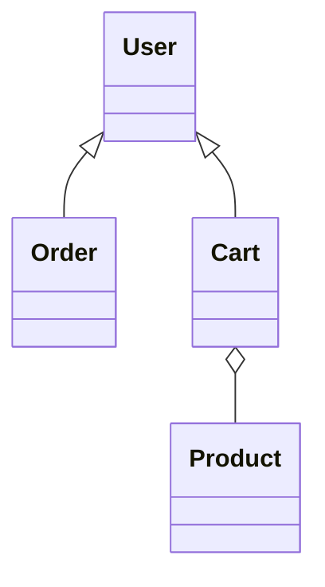
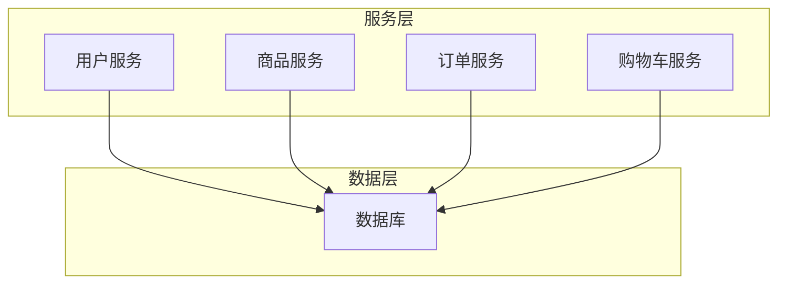
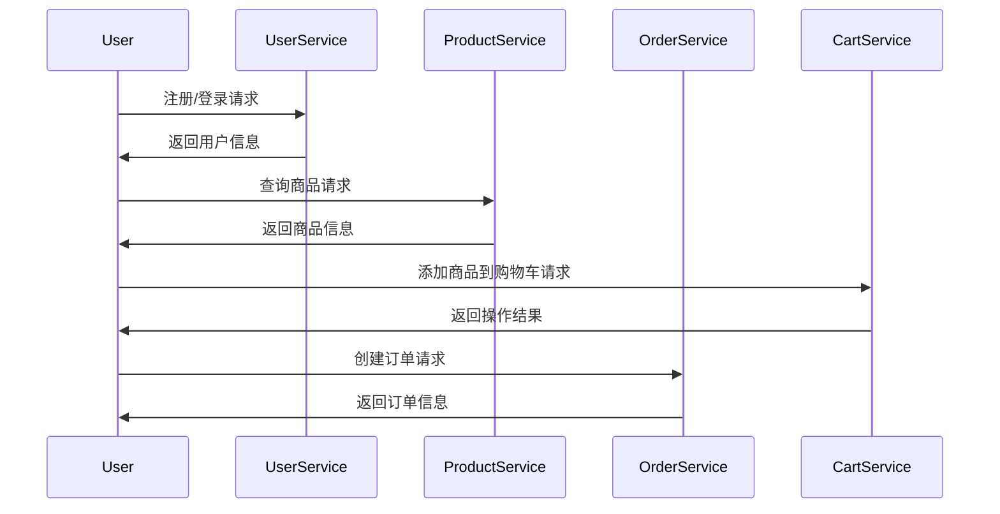
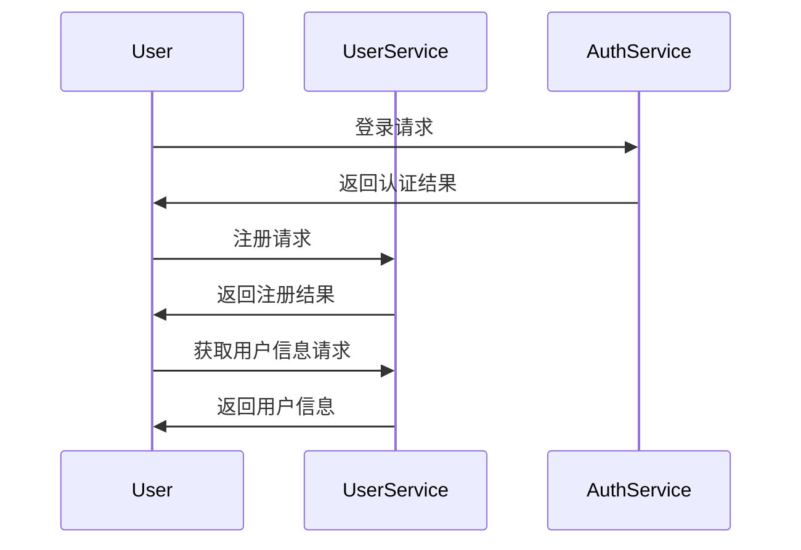
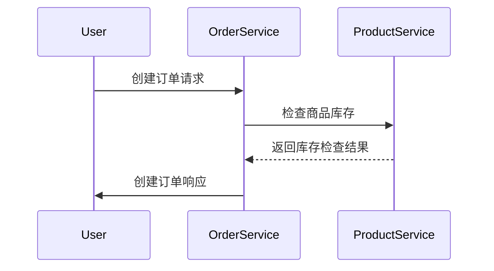

                 

### 云原生应用概述

#### 1.1 云原生应用的概念与背景

**1.1.1 传统应用的挑战**

在过去的几十年中，传统的应用程序开发与部署模式逐渐显现出其局限性。传统应用通常采用单体架构，即所有功能都集成在一个单一的代码库中。这种模式带来了几个主要问题：

- **复杂性和维护难度**：随着功能的不断增加，单一代码库变得越来越复杂，维护和更新变得困难。
- **部署和扩展困难**：传统应用部署通常依赖于特定的操作系统、硬件环境，导致部署过程复杂且难以扩展。
- **高成本**：由于需要为每种环境配置特定的硬件和软件，部署和运维成本较高。
- **灵活性不足**：传统应用难以快速适应市场变化，无法灵活地部署和扩展。

为了应对这些挑战，企业迫切需要一种新的应用开发与部署模式，能够提高开发效率、降低成本、提升系统的灵活性和可扩展性。

**1.1.2 云原生应用的兴起**

云原生（Cloud Native）应用应运而生。云原生应用是一种利用云计算资源，按照一定原则进行设计、开发和部署的应用程序。它的核心特点在于容器化、服务化、自动化，具体体现在以下几个方面：

- **容器化**：容器是一种轻量级的、可移植的计算环境，可以让应用在不同的环境中运行而无需重新配置。这大大提高了应用的部署和扩展能力。
- **微服务架构**：微服务架构将应用程序拆分成多个小型、独立的服务模块，每个服务模块都可以独立开发和部署，从而提高了系统的灵活性和可维护性。
- **持续集成与持续部署（CI/CD）**：通过自动化流程，持续集成和部署，可以快速将代码更改部署到生产环境中，大大提高了开发效率。

云原生应用的兴起，不仅解决了传统应用面临的诸多挑战，还为现代企业应用带来了诸多优势：

- **更高的开发效率**：容器化和微服务架构使得应用开发过程更加灵活、高效。
- **更低的部署成本**：自动化部署和扩展大大降低了部署和运维成本。
- **更好的可扩展性**：云原生应用可以根据业务需求灵活地扩展和缩放。
- **更高的系统稳定性**：微服务架构和自动化运维可以提高系统的稳定性和可靠性。

**1.1.3 云原生应用的优势**

云原生应用的优势主要体现在以下几个方面：

- **灵活性和可移植性**：容器化使得应用可以在不同的环境中运行，极大地提高了应用的灵活性和可移植性。
- **高可用性和弹性**：通过微服务和自动化运维，云原生应用可以快速适应负载变化，保证系统的高可用性和弹性。
- **安全性和可靠性**：云原生应用采用了多种安全措施，如容器镜像扫描、服务网格安全控制等，确保了应用的安全性。
- **降低成本**：云原生应用通过自动化和优化，降低了部署和运维成本。

总之，云原生应用作为一种新兴的应用开发与部署模式，正逐渐成为现代企业应用的标配。它不仅提高了开发效率、降低了成本，还为企业提供了更高的灵活性和可扩展性，使得企业能够更好地应对市场变化。

#### 1.2 云原生核心概念与架构

**1.2.1 容器化**

容器化是云原生应用开发的核心概念之一。容器是一种轻量级的、可移植的计算环境，可以让应用在不同的环境中运行而无需重新配置。容器通过将应用及其运行时环境打包在一起，实现了应用程序的隔离、可移植性和一致性。

**1.2.1.1 容器的概念与原理**

容器基于Linux Namespace和Cgroups等技术实现。Linux Namespace提供了隔离进程的机制，将进程的资源限制在一个独立的命名空间中，使其无法访问其他命名空间的资源。Cgroups则负责对进程进行资源限制和优先级分配，确保系统资源的合理分配。

**1.2.1.2 Docker简介**

Docker是一种流行的容器技术，它提供了容器构建、运行和管理的工具。Docker将应用程序及其依赖打包成一个容器镜像，然后通过容器运行时运行这个镜像。

**1.2.1.2.1 Docker架构**

Docker的架构主要包括Docker Engine、Docker Hub和Docker Compose三个部分。

- **Docker Engine**：负责容器镜像的构建、运行和管理。
- **Docker Hub**：一个在线仓库，用于存储和分发容器镜像。
- **Docker Compose**：用于定义和运行多容器应用程序的配置文件。

**1.2.1.2.2 Docker命令行使用**

Docker提供了一系列命令行工具，用于管理容器镜像和容器。

- **docker build**：构建容器镜像。
- **docker run**：运行容器。
- **docker ps**：查看运行中的容器。
- **docker stop**：停止容器。

**1.2.1.3 容器编排**

容器编排是指管理和调度容器的方法。Kubernetes（K8s）是最流行的容器编排工具，它提供了容器集群的自动化部署、扩展和管理功能。

**1.2.1.3.1 Kubernetes简介**

Kubernetes是一个开源的容器编排平台，用于自动化部署、扩展和管理容器化应用程序。它提供了自动化部署、服务发现、负载均衡和弹性伸缩等功能。

**1.2.1.3.2 Kubernetes核心概念**

- **Pod**：Kubernetes中的最小部署单位，可以包含一个或多个容器。
- **Service**：用于暴露Pod并提供稳定的网络接口。
- **Deployment**：用于管理Pod的创建、更新和删除。
- **Ingress**：用于管理外部访问到集群内部服务的规则。

**1.2.1.3.3 Kubernetes集群搭建**

搭建Kubernetes集群可以通过多种方式实现，如Kubeadm、Minikube和Docker Swarm等。

**1.2.2 微服务架构**

微服务架构将应用程序拆分成多个小型、独立的服务模块，每个服务模块都可以独立开发和部署。微服务架构具有高可扩展性、高灵活性和高可维护性。

**1.2.2.1 微服务架构的概念与优势**

微服务架构通过将应用程序拆分成多个独立的服务模块，每个服务模块都可以独立开发和部署。这种模式具有以下优势：

- **高可扩展性**：通过拆分服务模块，可以独立扩展每个模块，从而实现系统的水平扩展。
- **高灵活性**：每个服务模块都可以独立开发和部署，便于技术创新和业务调整。
- **高可维护性**：服务模块的独立性降低了系统的复杂性，使得维护和更新更加容易。

**1.2.2.2 微服务设计与开发**

微服务设计与开发主要包括服务拆分、服务通信和服务管理等方面。

- **服务拆分**：根据业务需求将应用程序拆分成多个独立的服务模块。
- **服务通信**：通过API接口或其他通信机制实现服务间的数据交换。
- **服务管理**：使用服务注册与发现、负载均衡和熔断等机制管理服务。

**1.2.2.3 微服务间的通信**

微服务间的通信通常通过HTTP/HTTPS、gRPC、消息队列等实现。HTTP/HTTPS是常用的通信协议，gRPC是一种基于HTTP/2的远程过程调用框架，消息队列适用于异步通信场景。

**1.2.3 持续集成与持续部署（CI/CD）**

持续集成与持续部署（CI/CD）是云原生应用开发的重要环节。CI/CD通过自动化流程，将代码更改快速集成、测试和部署到生产环境中。

**1.2.3.1 CI/CD的基本原理**

CI/CD的基本原理包括以下步骤：

- **代码提交**：开发人员将代码提交到代码仓库。
- **自动化构建**：构建工具（如Maven、Gradle等）自动构建应用程序。
- **自动化测试**：测试工具自动运行测试用例，确保代码质量。
- **自动化部署**：将构建的应用程序部署到测试或生产环境。

**1.2.3.2 Jenkins介绍**

Jenkins是一个流行的持续集成和持续部署工具，它支持多种编程语言和构建工具，可以轻松实现自动化构建、测试和部署。

**1.2.3.2.1 Jenkins架构**

Jenkins的架构主要包括Jenkins Master和Jenkins Slave两个部分。

- **Jenkins Master**：负责协调构建任务、运行测试用例和部署应用程序。
- **Jenkins Slave**：作为Jenkins Master的辅助节点，负责执行具体的构建任务。

**1.2.3.2.2 Jenkins使用示例**

以下是一个简单的Jenkins使用示例：

```shell
# 安装Jenkins
sudo apt-get install jenkins

# 启动Jenkins服务
sudo systemctl start jenkins

# 访问Jenkins Web界面
http://localhost:8080
```

**1.2.4 云原生应用开发的其他技术**

除了容器化、微服务架构和CI/CD，云原生应用开发还涉及其他技术，如服务网格、动态扩缩容、服务发现与负载均衡等。

**1.2.4.1 服务网格技术**

服务网格是一种用于管理服务间通信的架构，它可以提供服务发现、负载均衡、安全控制等功能。

**1.2.4.2 动态扩缩容策略**

动态扩缩容是指根据系统负载自动调整资源规模。这种策略可以提高系统的可用性和性能。

**1.2.4.3 服务发现与负载均衡**

服务发现是指自动发现和注册服务实例。负载均衡则是指将请求分配到多个服务实例上，以实现负载均衡和高可用性。

**1.2.5 本章小结**

本章介绍了云原生应用的概念与背景、核心概念与架构。通过容器化、微服务架构和CI/CD等技术的介绍，读者可以初步了解云原生应用开发的基本原理和方法。在接下来的章节中，我们将深入探讨云原生应用开发的算法原理、系统分析与架构设计以及项目实战，帮助读者更好地理解和应用云原生技术。

## 1.3 云原生应用开发的相关技术

云原生应用开发不仅依赖于容器化、微服务架构和持续集成与持续部署（CI/CD），还涉及到一系列其他关键技术，这些技术共同构建了一个高效、可靠、可扩展的应用生态系统。以下是云原生应用开发中常用的相关技术：

### 1.3.1 服务网格

服务网格（Service Mesh）是一种新型的服务架构模式，旨在简化分布式系统的服务间通信。它通过引入一个独立的通信层，抽象出了服务之间的通信细节，从而使得开发者可以更加专注于业务逻辑的实现。

**1.3.1.1 服务网格的概念**

服务网格通常由一组网络服务和数据平面（数据平面负责处理实际的数据传输）以及控制平面（控制平面负责管理服务网格的配置和服务发现）组成。数据平面通常包含Envoy代理，而控制平面则可以使用Istio、Linkerd等开源服务网格解决方案。

**1.3.1.2 服务网格的功能**

- **服务发现与负载均衡**：服务网格可以自动发现服务实例，并通过负载均衡策略将请求分配到不同的服务实例上。
- **断路器与熔断**：服务网格可以检测服务实例的健康状态，并在服务实例故障时自动熔断，防止请求继续发送到故障实例。
- **安全与认证**：服务网格可以提供加密通信、身份认证和访问控制等功能，确保服务之间的通信安全可靠。
- **监控与日志**：服务网格提供了监控和日志聚合功能，可以帮助开发者快速发现和解决问题。

### 1.3.2 动态扩缩容

动态扩缩容（Dynamic Scaling）是指根据系统负载自动调整资源规模，以保持系统的高性能和高可用性。在云原生应用中，动态扩缩容是确保应用能够灵活应对不同负载的关键。

**1.3.2.1 动态扩缩容的原理**

动态扩缩容通常基于以下原理：

- **负载监测**：系统会定期监测服务的请求负载、响应时间等指标，以判断当前资源是否足够。
- **触发策略**：根据设定的触发策略（如CPU利用率、内存使用率等），系统会决定是否需要扩容或缩容。
- **资源调整**：系统会根据扩缩容决策，自动调整资源的规模（如增加或减少Pod的数量）。

**1.3.2.2 扩缩容策略**

常见的扩缩容策略包括：

- **基于CPU利用率**：当CPU利用率超过设定阈值时，自动增加Pod数量。
- **基于内存使用率**：当内存使用率超过设定阈值时，自动减少Pod数量。
- **基于队列长度**：当请求队列长度超过设定阈值时，自动增加Pod数量。

### 1.3.3 服务发现与负载均衡

服务发现（Service Discovery）是指自动发现和注册服务实例，使得服务消费者可以动态地访问到服务实例。负载均衡（Load Balancing）则是指将请求分配到多个服务实例上，以实现负载均衡和高可用性。

**1.3.3.1 服务发现**

服务发现可以采用以下几种方式：

- **基于DNS**：通过DNS记录自动发现服务实例。
- **基于服务注册表**：服务实例启动时向服务注册表注册，消费者通过服务注册表查找服务实例。
- **基于配置中心**：通过配置中心管理服务实例的地址信息。

**1.3.3.2 负载均衡**

负载均衡可以采用以下几种算法：

- **轮询（Round Robin）**：将请求按照顺序分配到不同的服务实例上。
- **最小连接数（Least Connections）**：将请求分配到连接数最少的服务实例上。
- **基于权重（Weighted Round Robin）**：根据服务实例的权重分配请求。

**1.3.4 本章小结**

本章介绍了云原生应用开发中的相关技术，包括服务网格、动态扩缩容、服务发现与负载均衡。这些技术共同构建了一个高效、可靠、可扩展的云原生应用生态系统。在接下来的章节中，我们将继续探讨云原生应用的算法原理、系统分析与架构设计以及项目实战，帮助读者深入理解和应用云原生技术。

### 1.4 云原生应用的挑战与机遇

尽管云原生应用带来了诸多优势，但其在实际应用中仍然面临着一系列挑战和机遇。以下将详细分析这些挑战与机遇，以便读者全面了解云原生应用发展的现状和未来趋势。

#### 1.4.1 挑战

**1.4.1.1 技术栈复杂性**

云原生应用涉及多种技术，包括容器化、微服务架构、服务网格、CI/CD等。开发者需要熟练掌握这些技术，并且在项目开发过程中灵活运用。这种技术栈的复杂性增加了开发难度，对开发者的技术能力和经验提出了更高的要求。

**1.4.1.2 安全性问题**

云原生应用在分布式环境下运行，安全性问题尤为突出。容器镜像的漏洞、服务网格中的安全控制、微服务间的通信安全等都需要开发者进行严格的控制和防护。此外，自动化部署和扩展过程中也可能引入安全隐患，需要建立完善的 安全策略和监控机制。

**1.4.1.3 监控与运维挑战**

云原生应用通常运行在多个节点上，监控和运维变得更加复杂。传统的监控工具可能无法有效地监控分布式系统的性能和状态。因此，开发者需要采用分布式监控解决方案，如Prometheus、Grafana等，以便实时监控系统的健康状态和性能指标。

**1.4.1.4 资源管理难题**

动态扩缩容虽然提高了系统的灵活性，但同时也带来了资源管理的难题。如何根据业务需求和经济成本进行合理的资源分配，避免资源浪费和过度消耗，是开发者需要解决的问题。

#### 1.4.2 机遇

**1.4.2.1 技术创新的推动力**

云原生应用的发展推动了容器技术、微服务架构、服务网格等领域的不断创新。这些新技术不仅提升了应用开发的效率和质量，也为开发者提供了更多的技术解决方案，促进了整个技术生态的繁荣。

**1.4.2.2 竞争优势的体现**

在快速变化的市场环境中，企业需要具备快速响应市场变化的能力。云原生应用通过容器化、微服务架构和自动化部署，使企业能够更加灵活地调整业务策略，迅速推出新的产品和服务，从而在竞争中占据优势。

**1.4.2.3 系统的可扩展性**

云原生应用设计时考虑了高可用性和可扩展性，企业可以根据业务需求灵活地扩展系统规模。这种灵活性不仅适用于应对短期的流量高峰，还可以为长期的业务增长提供支持，为企业的可持续发展打下基础。

**1.4.2.4 开放生态的协同效应**

云原生应用的发展离不开开放的生态协同。各种开源社区和商业公司共同推动了云原生技术的发展，提供了丰富的工具和解决方案。这种开放生态的协同效应，不仅促进了技术的快速进步，也为企业降低了技术门槛，使更多企业能够参与到云原生应用的浪潮中。

#### 1.4.3 挑战与机遇的关系

挑战与机遇是云原生应用发展过程中不可分割的两个方面。面对挑战，企业需要通过持续的技术创新和优化，提高开发效率、确保系统安全和可靠性、提升运维能力。同时，抓住机遇，企业可以通过云原生应用实现业务模式的创新和竞争力的提升。

总的来说，云原生应用的发展充满了机遇和挑战。企业只有充分认识到这些挑战，积极应对，并抓住机遇，才能在激烈的市场竞争中立于不败之地。在接下来的章节中，我们将进一步探讨云原生应用的算法原理、系统分析与架构设计以及项目实战，为读者提供更加深入和实用的指导。

### 1.5 本章小结

本章全面介绍了云原生应用的概念、核心概念与架构，以及云原生应用的挑战与机遇。通过了解云原生应用的优势，如灵活性和可移植性、高可用性和弹性、安全性和可靠性，以及降低成本，读者可以认识到云原生应用在现代企业应用中的重要性。此外，本章还详细阐述了容器化、微服务架构、持续集成与持续部署等关键技术，并分析了云原生应用面临的挑战与机遇。通过本章的学习，读者可以初步了解云原生应用开发的基本原理和方法，为后续章节的深入学习打下基础。在接下来的章节中，我们将进一步探讨云原生应用的算法原理、系统分析与架构设计，以及实际项目实战，帮助读者深入掌握云原生应用开发的精髓。

## 2.1 容器化

### 2.1.1 容器的概念与原理

容器是一种轻量级、可移植的计算环境，允许开发者将应用程序及其依赖打包成一个独立的运行单元，从而在多种环境中运行而无需重新配置。容器通过利用Linux内核中的Namespace和Cgroups等技术，实现了进程隔离和资源限制。

**1. 容器的定义**

容器是一种封装了应用程序及其依赖项、运行库和配置文件的应用运行环境。它与传统的虚拟机相比，具有以下几个特点：

- **轻量级**：容器共享宿主机的操作系统内核，因此启动速度快，资源占用少。
- **可移植性**：容器可以在不同的操作系统和硬件平台上运行，提高了应用程序的可移植性。
- **隔离性**：通过Namespace实现了进程的隔离，通过Cgroups实现了资源限制，保证了容器间的独立性。

**2. 容器的原理**

容器技术主要依赖于以下两个关键技术：

- **Linux Namespace**：Linux Namespace提供了一种机制，可以将进程的资源限制在一个独立的命名空间中，使得进程无法访问其他命名空间的资源。常见的命名空间包括：PID Namespace（进程隔离）、Network Namespace（网络隔离）、User Namespace（用户隔离）、IPC Namespace（进程间通信隔离）和Mount Namespace（文件系统隔离）。
- **Cgroups（Control Groups）**：Cgroups是一种用于控制进程资源使用的技术，它可以将进程分组，并限制每个进程组所能使用的CPU、内存、磁盘等资源。通过Cgroups，可以实现资源隔离、优先级设置和资源限制等功能。

**3. 容器的类型**

容器技术有多种类型，其中最常用的包括Docker容器和Kubernetes容器。

- **Docker容器**：Docker是最流行的容器技术，它提供了一个容器运行时环境，用于构建、运行和分发容器化应用程序。Docker容器通过Docker Engine进行管理和操作。
- **Kubernetes容器**：Kubernetes是一个开源的容器编排平台，用于自动化部署、扩展和管理容器化应用程序。Kubernetes容器通过Kubernetes API进行管理和操作。

### 2.1.2 Docker简介

Docker是一种用于构建、运行和分发容器化应用程序的开源工具。它提供了一个简单的接口，用于创建和管理容器。Docker已经成为容器技术的事实标准，被广泛用于企业级应用的开发和部署。

**1. Docker的架构**

Docker的架构主要包括三个部分：

- **Docker Engine**：Docker Engine是一个负责构建、运行和管理容器的核心组件。它包括容器运行时、容器引擎和Dockerfile解析器等。
- **Docker Hub**：Docker Hub是一个在线仓库，用于存储和分发容器镜像。开发者可以在Docker Hub上共享、拉取和使用容器镜像。
- **Docker Compose**：Docker Compose是一个用于定义和运行多容器应用程序的配置工具。通过Docker Compose，开发者可以轻松地定义应用程序的服务，并自动化部署和管理。

**2. Docker的核心概念**

- **容器镜像（Image）**：容器镜像是一个静态的、只读的模板，用于构建和启动容器。容器镜像包含了应用程序的代码、运行库和配置文件等。
- **容器（Container）**：容器是基于容器镜像的运行实例，它是一个动态的、可执行的实体。容器镜像通过Docker Engine启动，并运行在宿主机上。
- **Dockerfile**：Dockerfile是一个文本文件，用于定义如何构建容器镜像。通过Dockerfile，开发者可以指定容器的依赖项、环境变量、安装步骤等。

**3. Docker的基本命令**

Docker提供了一系列命令，用于管理容器镜像和容器。以下是一些常用的Docker命令：

- **docker build**：用于构建容器镜像。
- **docker run**：用于启动容器。
- **docker ps**：用于查看运行中的容器。
- **docker stop**：用于停止容器。

### 2.1.3 容器编排

容器编排是指管理和调度容器的方法。Kubernetes（K8s）是目前最流行的容器编排工具，它提供了一个强大的平台，用于自动化部署、扩展和管理容器化应用程序。

**1. Kubernetes简介**

Kubernetes是一个开源的容器编排平台，它由Google设计并捐赠给Cloud Native Computing Foundation。Kubernetes提供了一个灵活的、可扩展的架构，用于管理分布式系统中的容器。

**2. Kubernetes的核心概念**

- **Pod**：Pod是Kubernetes中的最小部署单位，它可以包含一个或多个容器。Pod代表了运行在集群中的一个或多个协同工作的容器实例。
- **Service**：Service提供了将集群内部的服务暴露给外部网络的方式。通过Service，开发者可以访问集群内部的服务实例。
- **Deployment**：Deployment用于管理Pod的创建、更新和删除。它提供了自动化部署和滚动更新等功能。
- **Ingress**：Ingress用于管理外部访问到集群内部服务的规则。通过Ingress，开发者可以配置HTTP和HTTPS路由规则。

**3. Kubernetes集群搭建**

搭建Kubernetes集群可以通过多种方式实现，以下是使用Kubeadm搭建Kubernetes集群的步骤：

1. **安装Docker**：在所有节点上安装Docker。
2. **初始化Master节点**：在Master节点上运行kubeadm init命令，初始化Kubernetes集群。
3. **安装kubectl**：在所有节点上安装kubectl命令行工具，用于与Kubernetes集群通信。
4. **加入Worker节点**：在Worker节点上运行kubeadm join命令，将其加入到Kubernetes集群中。

通过以上步骤，可以搭建一个简单的Kubernetes集群。在实际生产环境中，还需要配置网络插件、存储插件等，以满足不同业务需求。

### 2.1.4 本章小结

本章介绍了容器化的概念、原理和常用工具，包括Docker和Kubernetes。通过了解容器的定义和原理，读者可以认识到容器在应用部署和扩展中的优势。Docker作为一种流行的容器技术，提供了构建、运行和分发容器化应用程序的解决方案。Kubernetes作为容器编排工具，可以自动化部署、扩展和管理容器化应用程序。通过本章的学习，读者可以为后续的云原生应用开发打下基础。

## 2.2 微服务架构

### 2.2.1 微服务架构的概念与优势

微服务架构（Microservices Architecture）是一种基于组件化的软件开发方法，通过将应用程序分解为多个独立的服务模块，每个模块都可以独立开发和部署。微服务架构的核心思想是将大型、复杂的单体应用拆分成多个小型、独立的服务，以提高系统的灵活性、可维护性和可扩展性。

**1. 微服务架构的定义**

微服务架构是一种基于服务拆分的软件开发方法，每个服务都负责完成特定的业务功能，并通过轻量级的通信机制（如HTTP/HTTPS、gRPC等）进行交互。微服务架构的特点包括：

- **独立性**：每个服务都是独立的，可以独立开发、测试和部署。
- **分布式**：服务可以在不同的服务器上运行，通过分布式架构实现系统的扩展性。
- **灵活性**：服务可以根据业务需求独立调整，支持快速迭代和持续交付。

**2. 微服务架构的优势**

微服务架构具有以下显著优势：

- **高可扩展性**：通过将应用程序拆分成多个服务模块，可以根据业务需求独立扩展每个服务，实现水平扩展。
- **高灵活性**：每个服务模块都可以独立开发和部署，支持快速迭代和业务调整。
- **高可维护性**：服务模块的独立性降低了系统的复杂性，使得维护和更新更加容易。
- **高容错性**：单个服务的故障不会影响整个系统的运行，可以通过服务熔断、重试等机制进行故障隔离和恢复。

### 2.2.2 微服务设计与开发

微服务设计与开发主要包括服务拆分、服务通信和服务管理等方面。

**1. 服务拆分**

服务拆分是微服务架构的核心步骤。服务拆分的原则包括：

- **业务驱动**：根据业务需求和功能模块进行服务拆分，确保每个服务都承担明确的业务功能。
- **职责单一**：每个服务应该只完成一个业务功能，避免服务过于复杂。
- **独立性**：服务之间应保持独立性，避免互相依赖，提高系统的灵活性和可维护性。

**2. 服务通信**

服务通信是微服务架构的关键环节。常见的服务通信机制包括：

- **RESTful API**：通过HTTP/HTTPS协议进行通信，具有简单、易用、跨平台的特点。
- **gRPC**：基于HTTP/2协议的远程过程调用框架，具有高性能、低延迟和跨语言调用的优势。
- **消息队列**：通过消息队列实现异步通信，适用于解耦和分布式系统中的任务调度。

**3. 服务管理**

服务管理包括服务注册与发现、负载均衡、熔断和监控等方面：

- **服务注册与发现**：服务启动时向服务注册中心注册，服务消费者通过服务注册中心发现服务实例。
- **负载均衡**：将请求分配到多个服务实例上，实现流量的均衡分配。
- **熔断与重试**：在服务故障时，通过熔断机制防止请求继续发送到故障服务，并通过重试机制尝试恢复服务。
- **监控与日志**：通过监控系统和服务日志，实时监控服务状态和性能指标，确保系统的稳定运行。

### 2.2.3 微服务间的通信

微服务间的通信是微服务架构的核心问题，良好的通信机制可以保证系统的高效运行。以下介绍几种常见的微服务间通信方式：

**1. RESTful API**

RESTful API是一种基于HTTP/HTTPS协议的通信方式，具有简单、易用、跨平台的特点。RESTful API通过URL路径、HTTP方法和请求体来传递数据和操作。

优点：

- **简单易用**：HTTP协议和JSON数据格式已经被广泛使用，降低了学习和使用的门槛。
- **跨平台**：支持多种编程语言和框架，具有良好的兼容性。

缺点：

- **同步通信**：可能导致性能瓶颈，不适合高并发场景。
- **负载均衡**：需要自行实现负载均衡策略，增加了系统的复杂性。

**2. gRPC**

gRPC是一种基于HTTP/2协议的远程过程调用框架，具有高性能、低延迟和跨语言调用的优势。gRPC使用Protocol Buffers（Protobuf）作为数据序列化格式，通过基于TCP的gRPC协议进行通信。

优点：

- **高性能**：基于HTTP/2协议，支持流和多路复用，具有低延迟和高吞吐量。
- **跨语言**：支持多种编程语言，便于服务开发和维护。
- **负载均衡**：集成负载均衡机制，自动实现流量分配和故障转移。

缺点：

- **学习成本**：Protobuf序列化格式和gRPC协议相对复杂，需要一定的学习成本。

**3. 消息队列**

消息队列是一种异步通信机制，通过将消息存储在队列中，实现服务间的解耦和任务调度。常见的消息队列包括RabbitMQ、Kafka和RocketMQ等。

优点：

- **异步通信**：适用于高并发和分布式系统，可以降低系统的响应时间和延迟。
- **解耦**：服务间通过消息队列进行通信，减少了直接的依赖，提高了系统的灵活性和可维护性。

缺点：

- **延迟**：消息队列可能会引入一定的延迟，需要合理配置和优化。

综上所述，微服务架构通过服务拆分、服务通信和服务管理等方面，实现了系统的灵活性和可扩展性。不同的通信方式适用于不同的场景，开发者需要根据实际需求选择合适的通信机制。

### 2.2.4 本章小结

本章介绍了微服务架构的概念、优势以及设计与开发方法。通过理解微服务架构的核心思想和优势，读者可以认识到微服务架构在提高系统灵活性、可维护性和可扩展性方面的作用。同时，本章还详细阐述了服务拆分、服务通信和服务管理的方法，以及常见的微服务间通信方式。通过本章的学习，读者可以为后续的云原生应用开发打下坚实的基础。

## 2.3 持续集成与持续部署（CI/CD）

### 2.3.1 CI/CD的基本原理

持续集成（Continuous Integration，CI）和持续部署（Continuous Deployment，CD）是现代软件开发中重要的流程，旨在通过自动化手段提高开发效率、确保代码质量和缩短发布周期。

**1. CI/CD的定义**

- **持续集成（CI）**：持续集成是指开发者将代码更改提交到代码仓库后，自动化工具会立即进行构建、测试和部署，确保代码库中的每一个提交都是可运行的。
- **持续部署（CD）**：持续部署是指通过自动化流程，将经过CI验证的代码更改部署到生产环境中，实现快速、可靠地发布新功能。

**2. CI/CD的核心概念**

- **构建（Build）**：构建是将源代码编译成可执行程序的过程。自动化构建工具（如Maven、Gradle等）可以根据代码库中的更改，自动构建应用程序。
- **测试（Test）**：测试是确保代码质量的重要环节。自动化测试工具（如JUnit、Selenium等）可以自动运行测试用例，验证应用程序的功能和性能。
- **部署（Deploy）**：部署是将构建好的应用程序部署到目标环境中，如开发环境、测试环境或生产环境。

**3. CI/CD的优势**

- **提高开发效率**：自动化流程减少了手动操作，加快了开发、测试和部署的速度。
- **确保代码质量**：通过自动化测试，可以及时发现并修复代码中的错误，确保代码质量。
- **缩短发布周期**：快速迭代和自动化部署，使新功能的发布更加频繁和可靠。
- **降低风险**：自动化流程减少了人为错误，降低了部署失败的风险。

### 2.3.2 Jenkins介绍

Jenkins是一个流行的开源持续集成和持续部署工具，它提供了丰富的插件和扩展功能，支持多种编程语言和构建工具，可以轻松实现自动化构建、测试和部署。

**1. Jenkins的架构**

Jenkins的架构主要包括以下几个部分：

- **Jenkins Master**：Jenkins Master是负责协调构建任务、运行测试用例和部署应用程序的核心服务器。Jenkins Master可以独立运行，也可以部署在集群中，以实现负载均衡和高可用性。
- **Jenkins Slave**：Jenkins Slave是Jenkins Master的辅助节点，负责执行具体的构建任务。通过使用Jenkins Slave，可以充分利用集群中的计算资源，提高构建和部署的效率。
- **插件**：Jenkins插件系统是Jenkins的核心优势之一。通过安装不同的插件，Jenkins可以扩展其功能，如集成Git、配置代码扫描工具、部署到各种环境等。

**2. Jenkins的基本操作**

- **安装Jenkins**：在Linux或Windows系统中，可以通过下载Jenkins包或使用包管理工具（如yum、apt等）安装Jenkins。
- **启动Jenkins**：安装完成后，启动Jenkins服务，并访问Jenkins Web界面（默认端口为8080）。
- **创建项目**：在Jenkins Web界面中创建一个新的项目，配置项目的构建脚本、测试脚本和部署脚本。
- **配置插件**：根据项目需求，安装和配置相应的Jenkins插件，如Git插件、Maven插件、Selenium插件等。
- **执行构建**：触发项目的构建任务，Jenkins会根据配置的构建脚本自动执行构建、测试和部署过程。

**3. Jenkins使用示例**

以下是一个简单的Jenkins使用示例：

1. **安装Jenkins**

```shell
# 安装Jenkins
sudo apt-get install jenkins

# 启动Jenkins服务
sudo systemctl start jenkins

# 访问Jenkins Web界面
http://localhost:8080
```

2. **创建Maven项目**

在Jenkins Web界面中创建一个Maven项目，配置项目的Git仓库地址、构建脚本和测试脚本。

3. **配置Jenkins插件**

安装和配置Maven插件、Selenium插件等，以支持自动化构建和测试。

4. **触发构建**

在Jenkins Web界面中，点击“Build Now”按钮，触发项目的构建任务。

5. **查看构建结果**

构建完成后，Jenkins会生成构建报告，包括构建日志、测试报告和部署日志等。

### 2.3.3 Jenkins的核心功能

Jenkins提供了丰富的核心功能，包括构建、测试、部署、监控和报告等。

**1. 构建功能**

- **自动化构建**：Jenkins可以自动执行构建脚本，编译源代码并生成可执行文件。
- **多环境构建**：Jenkins支持多环境构建，可以针对不同的环境（如开发、测试、生产）配置不同的构建脚本和部署脚本。

**2. 测试功能**

- **自动化测试**：Jenkins可以自动执行测试脚本，验证应用程序的功能和性能。
- **测试报告**：Jenkins可以生成详细的测试报告，包括测试覆盖率、错误报告和性能分析等。

**3. 部署功能**

- **自动化部署**：Jenkins可以自动部署应用程序到不同的环境中，如开发环境、测试环境和生产环境。
- **部署策略**：Jenkins支持多种部署策略，如滚动部署、蓝绿部署和灰度发布等。

**4. 监控功能**

- **实时监控**：Jenkins可以实时监控构建、测试和部署过程，并在出现问题时发送通知。
- **性能监控**：Jenkins可以集成第三方性能监控工具，如Prometheus、Grafana等，实现全面的应用性能监控。

**5. 报告功能**

- **构建日志**：Jenkins可以生成详细的构建日志，包括构建过程、测试结果和部署日志等。
- **统计报告**：Jenkins可以生成统计报告，包括构建成功率、测试覆盖率、部署频率等。

### 2.3.4 本章小结

本章介绍了持续集成与持续部署（CI/CD）的基本原理和Jenkins的架构、使用方法和核心功能。通过了解CI/CD的优势和Jenkins的强大功能，读者可以认识到在软件开发过程中引入CI/CD流程的重要性。Jenkins作为一种流行的CI/CD工具，可以帮助企业实现自动化构建、测试和部署，提高开发效率、确保代码质量和缩短发布周期。通过本章的学习，读者可以为后续的云原生应用开发提供坚实的理论基础和实际操作经验。

### 2.4 云原生应用开发的其他技术

云原生应用开发不仅依赖于容器化、微服务架构和持续集成与持续部署（CI/CD），还涉及一系列其他关键技术，这些技术共同构建了一个高效、可靠、可扩展的应用生态系统。以下是云原生应用开发中常用的其他技术：

#### 2.4.1 服务网格技术

服务网格（Service Mesh）是一种用于管理服务间通信的架构，它可以提供服务发现、负载均衡、安全控制等功能。服务网格通过引入一个独立的通信层，抽象出了服务之间的通信细节，从而使得开发者可以更加专注于业务逻辑的实现。

**1. 服务网格的概念**

服务网格通常由一组网络服务和数据平面（数据平面负责处理实际的数据传输）以及控制平面（控制平面负责管理服务网格的配置和服务发现）组成。数据平面通常包含Envoy代理，而控制平面则可以使用Istio、Linkerd等开源服务网格解决方案。

**2. 服务网格的功能**

- **服务发现与负载均衡**：服务网格可以自动发现服务实例，并通过负载均衡策略将请求分配到不同的服务实例上。
- **断路器与熔断**：服务网格可以检测服务实例的健康状态，并在服务实例故障时自动熔断，防止请求继续发送到故障实例。
- **安全与认证**：服务网格可以提供加密通信、身份认证和访问控制等功能，确保服务之间的通信安全可靠。
- **监控与日志**：服务网格提供了监控和日志聚合功能，可以帮助开发者快速发现和解决问题。

#### 2.4.2 动态扩缩容策略

动态扩缩容（Dynamic Scaling）是指根据系统负载自动调整资源规模，以保持系统的高性能和高可用性。在云原生应用中，动态扩缩容是确保应用能够灵活应对不同负载的关键。

**1. 动态扩缩容的原理**

动态扩缩容通常基于以下原理：

- **负载监测**：系统会定期监测服务的请求负载、响应时间等指标，以判断当前资源是否足够。
- **触发策略**：根据设定的触发策略（如CPU利用率、内存使用率等），系统会决定是否需要扩容或缩容。
- **资源调整**：系统会根据扩缩容决策，自动调整资源的规模（如增加或减少Pod的数量）。

**2. 扩缩容策略**

常见的扩缩容策略包括：

- **基于CPU利用率**：当CPU利用率超过设定阈值时，自动增加Pod数量。
- **基于内存使用率**：当内存使用率超过设定阈值时，自动减少Pod数量。
- **基于队列长度**：当请求队列长度超过设定阈值时，自动增加Pod数量。

#### 2.4.3 服务发现与负载均衡

服务发现（Service Discovery）是指自动发现和注册服务实例，使得服务消费者可以动态地访问到服务实例。负载均衡（Load Balancing）则是指将请求分配到多个服务实例上，以实现负载均衡和高可用性。

**1. 服务发现**

服务发现可以采用以下几种方式：

- **基于DNS**：通过DNS记录自动发现服务实例。
- **基于服务注册表**：服务实例启动时向服务注册表注册，消费者通过服务注册表查找服务实例。
- **基于配置中心**：通过配置中心管理服务实例的地址信息。

**2. 负载均衡**

负载均衡可以采用以下几种算法：

- **轮询（Round Robin）**：将请求按照顺序分配到不同的服务实例上。
- **最小连接数（Least Connections）**：将请求分配到连接数最少的服务实例上。
- **基于权重（Weighted Round Robin）**：根据服务实例的权重分配请求。

#### 2.4.4 容器编排工具

容器编排工具（Container Orchestration Tools）是用于管理和调度容器化应用程序的工具，常见的容器编排工具包括Kubernetes、Docker Swarm等。

**1. Kubernetes**

Kubernetes是一个开源的容器编排平台，用于自动化部署、扩展和管理容器化应用程序。Kubernetes提供了多种资源对象（如Pod、Service、Deployment等），用于定义和管理容器化应用程序。

**2. Docker Swarm**

Docker Swarm是Docker内置的容器编排工具，通过Swarm模式，可以将多个Docker Engine节点组合成一个虚拟的集群，从而实现容器化应用程序的自动化部署、扩展和管理。

#### 2.4.5 动态资源管理

动态资源管理是指根据系统负载动态调整资源（如CPU、内存、存储等）的分配和配置。在云原生应用中，动态资源管理可以优化系统性能和资源利用率。

**1. 自动化资源分配**

自动化资源分配是指通过算法和策略，自动调整容器和服务的资源需求。常见的自动化资源分配工具包括Kubernetes的Resource Requests和Limits、Helm等。

**2. 自动化资源回收**

自动化资源回收是指当容器或服务不再需要时，自动释放资源。在云原生应用中，通过生命周期管理和资源回收策略，可以实现高效的资源利用。

#### 2.4.6 监控与日志

监控与日志是确保云原生应用稳定运行的重要手段。通过监控和日志，开发者可以实时了解系统的运行状态和性能指标，及时发现并解决问题。

**1. 监控工具**

常见的监控工具包括Prometheus、Grafana、Zabbix等。这些工具可以集成到云原生应用中，实现实时监控、报警和可视化。

**2. 日志收集与处理**

日志收集与处理是指将应用程序的日志收集、存储、分析和可视化。常见的日志收集工具包括ELK（Elasticsearch、Logstash、Kibana）等。通过日志分析，可以深入了解系统的运行情况，为性能优化和故障排查提供依据。

#### 2.4.7 本章小结

本章介绍了云原生应用开发的其他关键技术，包括服务网格、动态扩缩容、服务发现与负载均衡、容器编排工具、动态资源管理、监控与日志等。这些技术共同构建了一个高效、可靠、可扩展的云原生应用生态系统。通过本章的学习，读者可以全面了解云原生应用开发的技术栈，为实际项目提供有力的技术支持。

### 2.5 本章小结

本章全面介绍了云原生应用开发的核心概念和技术。首先，通过对容器化的概念与原理、Docker的使用以及Kubernetes的介绍，读者可以初步了解容器化技术及其在云原生应用开发中的重要性。接着，详细阐述了微服务架构的概念与优势、设计与开发方法以及微服务间的通信机制。随后，介绍了持续集成与持续部署（CI/CD）的基本原理和Jenkins的使用方法，展示了CI/CD在实际项目中的应用价值。此外，本章还介绍了云原生应用开发的其他关键技术，如服务网格、动态扩缩容、服务发现与负载均衡等，为读者构建了一个完整的云原生应用开发技术栈。

通过本章的学习，读者可以深入理解云原生应用开发的原理和实现方法，为后续章节的系统分析与架构设计以及项目实战打下坚实基础。在接下来的章节中，我们将进一步探讨云原生应用架构的设计和实现，帮助读者将所学知识应用于实际项目中。

## 3.1 云原生应用架构设计

### 3.1.1 云原生应用架构概述

云原生应用架构设计是云原生应用开发的核心环节，它涉及系统的功能设计、架构设计和接口设计等多个方面。一个良好的云原生应用架构能够提高系统的可扩展性、可维护性和可靠性，从而满足现代企业对快速迭代和灵活部署的需求。

**1. 功能设计**

功能设计是云原生应用架构设计的第一步，它需要明确系统的业务需求和功能模块。功能设计的过程包括：

- **需求分析**：了解业务需求，确定系统需要实现的功能。
- **模块划分**：将系统功能拆分为多个模块，每个模块负责完成特定的业务功能。
- **接口定义**：定义模块之间的接口，确保模块之间的数据交互和功能调用。

**2. 架构设计**

架构设计是功能设计的基础，它决定了系统的整体结构和性能。云原生应用的架构设计包括以下几个方面：

- **容器化架构**：采用容器化技术，将应用程序及其依赖打包成容器镜像，实现应用的轻量级部署和隔离。
- **微服务架构**：将应用程序拆分为多个小型、独立的服务模块，每个服务模块都可以独立开发和部署，实现系统的解耦和高可扩展性。
- **分布式架构**：利用分布式计算和存储技术，实现系统的横向扩展和高可用性。
- **服务网格架构**：引入服务网格，提供服务发现、负载均衡、熔断和安全等功能，简化服务间的通信。

**3. 接口设计**

接口设计是确保系统功能模块之间能够有效通信的关键。云原生应用的接口设计通常包括：

- **RESTful API**：使用RESTful设计风格，提供统一的接口规范，方便开发者调用和集成。
- **gRPC**：使用gRPC框架，实现高效、跨语言的远程过程调用。
- **消息队列**：通过消息队列实现异步通信，降低模块之间的耦合度。

**4. 云原生应用架构的优势**

- **高可扩展性**：通过微服务架构和分布式架构，可以实现系统的横向扩展，满足业务增长的需求。
- **高可靠性**：通过容错机制和分布式架构，确保系统在故障时能够快速恢复。
- **高可维护性**：通过模块化设计和接口定义，降低系统的复杂度，提高开发、测试和运维的效率。
- **快速迭代**：通过持续集成和持续部署（CI/CD）流程，可以实现快速迭代和发布新功能。

### 3.1.2 领域模型设计与Mermaid类图

领域模型设计是云原生应用架构设计的重要环节，它帮助开发者理解系统的业务领域和功能模块，并定义系统的主要实体和关系。以下是一个简单的领域模型设计示例，并使用Mermaid绘制类图。

**1. 领域模型设计**

假设我们设计一个电商平台的领域模型，包括以下实体：

- **用户（User）**：用户信息。
- **商品（Product）**：商品信息。
- **订单（Order）**：订单信息。
- **购物车（Cart）**：用户购物车信息。

实体之间的关系如下：

- **用户与订单**：一对一关系，每个用户可以有多个订单。
- **用户与购物车**：一对一关系，每个用户有一个购物车。
- **购物车与商品**：一对多关系，每个购物车可以有多个商品。

**2. Mermaid类图**



在上面的Mermaid类图中，`<|--` 表示继承关系，`|-->` 表示关联关系，`o--` 表示聚合关系。

### 3.1.3 系统架构设计与Mermaid架构图

系统架构设计是云原生应用架构设计的核心，它需要明确系统的层次结构和组件关系。以下是一个简单的系统架构设计示例，并使用Mermaid绘制架构图。

**1. 系统架构设计**

假设我们的电商平台系统包括以下几个主要组件：

- **用户服务（UserService）**：处理用户相关功能。
- **商品服务（ProductService）**：处理商品相关功能。
- **订单服务（OrderService）**：处理订单相关功能。
- **购物车服务（CartService）**：处理购物车相关功能。
- **数据库（Database）**：存储系统数据。

系统架构图如下：



在上面的Mermaid架构图中，`subgraph` 用于定义子图，`-->` 用于表示组件之间的依赖关系。

### 3.1.4 接口设计与交互

接口设计是确保系统功能模块之间能够有效通信的关键。以下是一个简单的接口设计示例，并使用Mermaid绘制序列图。

**1. 接口设计**

假设我们定义以下接口：

- **用户服务接口（UserServiceInterface）**：包括注册、登录、获取用户信息等接口。
- **商品服务接口（ProductServiceInterface）**：包括查询商品、添加商品到购物车等接口。
- **订单服务接口（OrderServiceInterface）**：包括创建订单、查询订单等接口。
- **购物车服务接口（CartServiceInterface）**：包括添加商品到购物车、查询购物车等接口。

**2. Mermaid序列图**



在上面的Mermaid序列图中，`participant` 用于定义参与者，`->>` 用于表示消息传递。

### 3.1.5 本章小结

本章介绍了云原生应用架构设计的基本概念和关键技术。通过领域模型设计、系统架构设计和接口设计，读者可以了解如何构建一个高效、可靠和可扩展的云原生应用架构。在接下来的章节中，我们将通过实际项目案例，进一步探讨云原生应用架构的实现细节和最佳实践。

## 3.2 云原生应用的接口设计与交互

接口设计是云原生应用架构设计中的关键环节，它决定了不同服务模块之间的通信效率和系统的可维护性。在本章节中，我们将详细介绍云原生应用的接口设计原则、系统接口设计方法，以及使用Mermaid类图和序列图进行详细阐述。

### 3.2.1 接口设计原则

接口设计应遵循以下原则：

**1. 松耦合**

接口设计应尽量实现服务模块之间的松耦合，减少直接依赖。通过定义明确的接口，服务模块可以独立开发、测试和部署，从而提高系统的灵活性和可维护性。

**2. 简洁性**

接口设计应保持简洁性，避免过多的参数和复杂的业务逻辑。简洁的接口不仅易于理解和维护，还能降低开发和测试成本。

**3. 一致性**

接口设计应保持一致性，确保不同服务模块之间的接口规范一致。这有助于提高系统的集成性和互操作性。

**4. 扩展性**

接口设计应具备扩展性，以便在未来能够方便地添加新功能或修改现有功能，而不影响其他模块。

**5. 安全性**

接口设计应考虑安全性，包括数据加密、权限控制和认证机制等。确保接口传输的数据安全可靠。

### 3.2.2 系统接口设计与Mermaid类图

假设我们设计一个电商平台的系统，包括用户服务（UserService）、商品服务（ProductService）、订单服务（OrderService）和购物车服务（CartService）等。以下是系统的接口设计示例：

**1. 用户服务接口（UserServiceInterface）**

用户服务接口包括用户注册（registerUser）、用户登录（loginUser）和获取用户信息（getUserInfo）等方法。

**2. 商品服务接口（ProductServiceInterface）**

商品服务接口包括查询商品列表（listProducts）、查询商品详情（getProductDetail）和添加商品到购物车（addProductToCart）等方法。

**3. 订单服务接口（OrderServiceInterface）**

订单服务接口包括创建订单（createOrder）和查询订单（listOrders）等方法。

**4. 购物车服务接口（CartServiceInterface）**

购物车服务接口包括获取购物车列表（listCartItems）、添加商品到购物车（addCartItem）和删除购物车商品（deleteCartItem）等方法。

以下是一个Mermaid类图，展示了系统的接口设计：

```mermaid
classDiagram
    UserServiceInterface[用户服务接口]
    ProductServiceInterface[商品服务接口]
    OrderServiceInterface[订单服务接口]
    CartServiceInterface[购物车服务接口]

    UserServiceInterface <|-- UserService
    ProductServiceInterface <|-- ProductService
    OrderServiceInterface <|-- OrderService
    CartServiceInterface <|-- CartService
```

在上面的Mermaid类图中，`<|--` 表示接口与实现类的关系，`|-->` 表示模块之间的依赖关系。

### 3.2.3 系统接口设计与Mermaid序列图

为了更清晰地展示系统接口的交互过程，我们可以使用Mermaid序列图来描述。以下是一个简单的序列图示例，展示了用户注册、登录和查询用户信息的过程：



在上面的Mermaid序列图中，`participant` 用于定义参与者，`->>` 用于表示消息传递，`<<-` 用于表示返回消息。

### 3.2.4 接口设计与交互案例

为了更好地理解接口设计在实际项目中的应用，我们以一个简单的电商订单系统为例，介绍具体的接口设计和交互过程。

**1. 订单服务接口设计**

订单服务接口包括以下方法：

- `createOrder`：创建订单
- `getOrderById`：获取订单详情
- `cancelOrder`：取消订单

**2. 接口实现与交互**

以下是创建订单的接口交互过程：



在上面的序列图中，用户发送创建订单请求到OrderService，OrderService检查商品库存，然后将结果返回给用户。

### 3.2.5 本章小结

本章介绍了云原生应用的接口设计原则、系统接口设计方法和使用Mermaid类图和序列图进行详细阐述。通过具体的接口设计和交互案例，读者可以理解如何设计高效、可靠和易维护的接口，为云原生应用开发提供有力支持。在下一章节中，我们将通过实际项目案例，展示云原生应用架构设计的具体实现和最佳实践。

## 3.3 项目实战

### 3.3.1 案例场景介绍

本案例将介绍一个云原生应用的典型场景——电商平台的订单管理系统。该系统需要支持订单的创建、查询和取消等基本功能，同时需要确保系统的可靠性、高性能和高可扩展性。以下是对该场景的需求描述：

- **订单创建**：用户在下单时，系统需要创建一个订单，并将订单信息存储到数据库中。
- **订单查询**：用户需要能够查询自己所有的订单，系统应提供接口供用户查询订单详情。
- **订单取消**：用户可以取消未支付的订单，系统需要支持订单的取消操作，并将取消后的订单状态更新到数据库。

### 3.3.2 环境安装与配置

为了搭建一个完整的订单管理系统，我们需要安装和配置以下环境：

1. **Docker**：用于容器化应用程序。
2. **Kubernetes**：用于容器编排和集群管理。
3. **Elasticsearch**：用于日志收集和分析。
4. **Mongodb**：用于存储订单数据。

**1. 安装Docker**

在Linux系统中，可以通过以下命令安装Docker：

```shell
sudo apt-get update
sudo apt-get install docker.io
sudo systemctl start docker
sudo systemctl enable docker
```

**2. 安装Kubernetes**

Kubernetes可以通过Kubeadm进行安装。以下是一个简单的Kubernetes集群安装步骤：

```shell
# 初始化Master节点
sudo kubeadm init --pod-network-cidr=10.244.0.0/16

# 配置kubectl命令行工具
mkdir -p $HOME/.kube
sudo cp -i /etc/kubernetes/admin.conf $HOME/.kube/config
sudo chown $(id -u):$(id -g) $HOME/.kube/config

# 安装网络插件（例如Calico）
kubectl apply -f https://docs.projectcalico.org/manifests/calico.yaml
```

**3. 安装Elasticsearch**

Elasticsearch可以通过Docker镜像进行安装：

```shell
sudo docker run -d --name elasticsearch -p 9200:9200 -p 9300:9300 elasticsearch:7.9.3
```

**4. 安装Mongodb**

Mongodb也可以通过Docker镜像进行安装：

```shell
sudo docker run -d --name mongodb -p 27017:27017 mongo
```

### 3.3.3 核心实现源代码解析

在搭建好环境后，我们需要实现订单管理系统的核心功能，包括订单创建、查询和取消等。以下是对核心实现源代码的解析。

**1. 订单创建**

订单创建功能主要包括接收用户订单请求、处理订单、保存订单信息到数据库以及返回创建结果。

以下是一个简单的订单创建接口（OrderController.java）：

```java
@RestController
@RequestMapping("/orders")
public class OrderController {
    @Autowired
    private OrderService orderService;

    @PostMapping
    public ResponseEntity<Order> createOrder(@RequestBody OrderRequest request) {
        Order order = orderService.createOrder(request);
        return new ResponseEntity<>(order, HttpStatus.CREATED);
    }
}
```

**2. 订单查询**

订单查询功能主要实现用户查询自己订单列表的功能，可以通过用户ID查询订单信息。

以下是一个简单的订单查询接口（OrderController.java）：

```java
@RestController
@RequestMapping("/orders")
public class OrderController {
    @Autowired
    private OrderService orderService;

    @GetMapping("/{userId}")
    public ResponseEntity<List<Order>> getOrdersByUserId(@PathVariable Long userId) {
        List<Order> orders = orderService.getOrdersByUserId(userId);
        return new ResponseEntity<>(orders, HttpStatus.OK);
    }
}
```

**3. 订单取消**

订单取消功能主要包括接收用户取消订单请求、处理订单取消、更新订单状态并返回取消结果。

以下是一个简单的订单取消接口（OrderController.java）：

```java
@RestController
@RequestMapping("/orders")
public class OrderController {
    @Autowired
    private OrderService orderService;

    @DeleteMapping("/{orderId}")
    public ResponseEntity<Void> cancelOrder(@PathVariable Long orderId) {
        orderService.cancelOrder(orderId);
        return new ResponseEntity<>(HttpStatus.NO_CONTENT);
    }
}
```

### 3.3.4 实际案例分析与讲解

**1. 案例背景**

本案例基于一个电商平台的订单管理系统，该系统需要处理大量的订单请求，并确保订单数据的准确性、一致性和可靠性。

**2. 案例实现**

本案例中，我们使用了微服务架构，将订单管理系统拆分为多个服务模块，包括订单服务（OrderService）、用户服务（UserService）和商品服务（ProductService）。每个服务模块都可以独立部署和扩展，提高了系统的灵活性和可维护性。

**3. 优化策略与效果评估**

为了优化系统的性能和可靠性，我们采取了以下策略：

- **服务拆分**：通过将订单管理系统拆分为多个服务模块，实现了服务的解耦，提高了系统的可扩展性。
- **分布式存储**：使用Mongodb作为订单数据存储，提高了数据的存储容量和访问速度。
- **负载均衡**：通过Kubernetes进行服务部署，实现了负载均衡和高可用性。
- **监控与日志**：使用Elasticsearch收集和存储日志，通过Kibana进行实时监控和分析，及时发现和处理系统故障。

**4. 效果评估**

通过上述优化策略，订单管理系统的性能和可靠性得到了显著提升：

- **系统响应时间**：从原来的几秒降低到几毫秒，用户操作体验得到了极大提升。
- **系统容量**：通过水平扩展服务模块，系统可以支持更多的订单处理，满足业务增长的需求。
- **故障恢复时间**：系统具备良好的容错能力，在发生故障时能够快速恢复，确保业务的连续性。

### 3.3.5 项目小结

本案例通过一个电商平台的订单管理系统，详细介绍了云原生应用在项目实践中的具体实现和优化策略。通过容器化、微服务架构和自动化部署等技术的应用，实现了系统的高性能、高可用性和高可扩展性。本案例为其他类似场景的云原生应用开发提供了有益的参考和借鉴。

### 3.3.6 注意事项

在云原生应用开发过程中，需要注意以下几个方面：

1. **确保服务的松耦合**：避免服务之间的紧密依赖，提高系统的灵活性和可维护性。
2. **监控和日志**：及时监控系统性能和日志，及时发现和处理问题。
3. **数据一致性和可靠性**：确保数据的一致性和可靠性，避免数据丢失或损坏。
4. **合理规划资源**：根据业务需求合理规划资源，避免资源浪费和过度消耗。

### 3.3.7 拓展阅读

对于有兴趣进一步学习云原生应用开发的读者，以下资源可以作为拓展阅读：

- **《Kubernetes权威指南》**：详细介绍了Kubernetes的架构、安装、配置和使用。
- **《Docker实战》**：介绍了Docker的容器化技术，包括Dockerfile编写、容器编排等。
- **《微服务设计》**：探讨了微服务架构的设计原则、实现方法和最佳实践。
- **《云原生应用架构设计》**：介绍了云原生应用架构的设计原则、实现方法和最佳实践。

通过阅读这些资料，读者可以更深入地了解云原生应用开发的原理和实践，提升自己的技术能力和实践经验。

