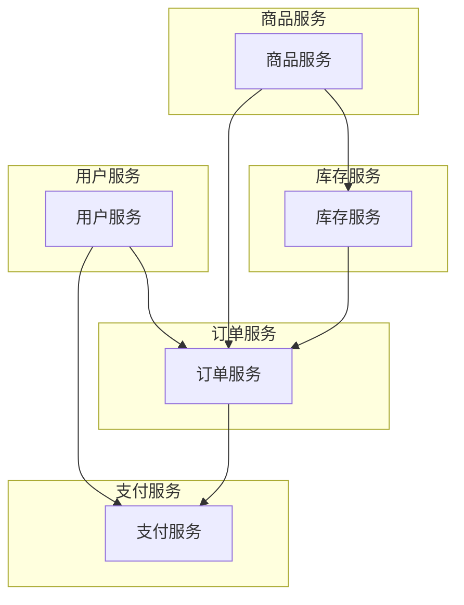
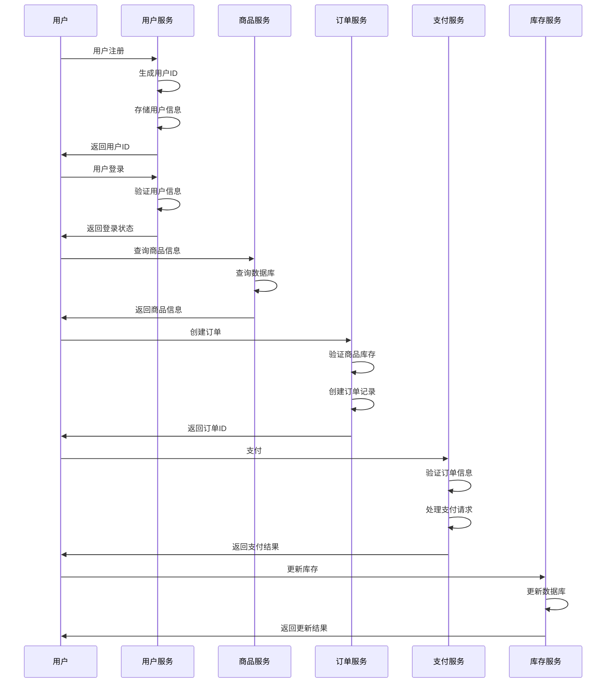

                 

# 云原生技术栈的选择与应用

## 关键词

云原生、容器技术、微服务、持续集成/持续部署、服务网格、无状态与有状态服务

## 摘要

本文将深入探讨云原生技术栈的选择与应用，首先介绍云原生的基本概念与核心组成部分，包括容器技术、微服务架构、自动化与持续集成/持续部署（CI/CD）、服务网格等。接着，我们将详细分析每个组成部分的原理、优势、挑战及其解决方案。最后，我们将探讨如何在实际项目中选择和应用云原生技术栈，并提供一系列最佳实践和项目实战案例。通过本文，读者将全面了解云原生技术栈的构建与应用，为其在云计算领域的成功应用打下坚实基础。

## 目录大纲设计思路

### 明确核心概念

云原生技术栈是一种基于云计算的新型IT架构，旨在提高应用程序的灵活性和可扩展性。它主要包括以下核心组成部分：

1. **容器技术**：容器是一种轻量级、可移植的运行时环境，用于封装应用程序及其依赖项。
2. **微服务架构**：微服务是一种将应用程序划分为小型、自治的服务模块的架构风格。
3. **自动化与持续集成/持续部署（CI/CD）**：自动化流程和工具用于简化应用程序的构建、测试和部署过程。
4. **服务网格**：服务网格是一种用于管理和路由服务间通信的网络基础设施。

### 构建框架结构

基于上述核心概念，本文将分为七个主要部分：

1. **云原生技术栈概述**：介绍云原生的基本概念、背景、组成部分及其优势与挑战。
2. **容器技术详解**：详细探讨容器技术的原理、容器编排工具、容器安全性等。
3. **微服务架构设计**：分析微服务的概念、设计原则、架构模式等。
4. **云原生自动化与CI/CD**：探讨自动化的重要性、持续集成与持续部署的流程和工具。
5. **服务网格技术**：介绍服务网格的概念、架构设计、流量管理等。
6. **无状态与有状态服务设计**：讨论无状态与有状态服务的定义、优势、挑战及平衡策略。
7. **云原生技术栈的选择与应用**：提供技术栈选择策略、实际应用案例及最佳实践。

### 细化章节内容

为每个章节细化出二级和三级目录，确保每个章节都有明确的目标和内容。以下为详细目录大纲：

### 第一部分：云原生技术栈概述

### 第1章：云原生概述

- 1.1 云原生的定义与背景
  - 1.1.1 云原生概念
  - 1.1.2 云原生的发展历程
  - 1.1.3 云原生与传统IT架构的差异
- 1.2 云原生技术的核心组成部分
  - 1.2.1 容器技术
  - 1.2.2 微服务架构
  - 1.2.3 自动化与持续集成/持续部署（CI/CD）
  - 1.2.4 服务网格
  - 1.2.5 无状态服务与有状态服务
- 1.3 云原生技术栈的优势与挑战
  - 1.3.1 优势分析
  - 1.3.2 挑战与应对策略

### 第2章：容器技术详解

- 2.1 容器技术原理
  - 2.1.1 容器基础
  - 2.1.2 容器与虚拟机的比较
  - 2.1.3 容器化流程
- 2.2 容器编排工具
  - 2.2.1 Docker
  - 2.2.2 Kubernetes
  - 2.2.3 其他容器编排工具
- 2.3 容器安全性
  - 2.3.1 容器安全最佳实践
  - 2.3.2 容器攻击面分析

### 第3章：微服务架构设计

- 3.1 微服务概念
  - 3.1.1 微服务的定义
  - 3.1.2 微服务架构的优势
  - 3.1.3 微服务面临的挑战
- 3.2 微服务设计原则
  - 3.2.1 单一职责原则
  - 3.2.2 域驱动设计（DDD）
  - 3.2.3 服务拆分策略
- 3.3 微服务架构模式
  - 3.3.1 服务间通信模式
  - 3.3.2 数据一致性处理
  - 3.3.3 分布式追踪与监控

### 第4章：云原生自动化与CI/CD

- 4.1 自动化的重要性
  - 4.1.1 自动化的定义
  - 4.1.2 自动化的目标和好处
  - 4.1.3 自动化工具的选择
- 4.2 持续集成（CI）
  - 4.2.1 CI的概念和流程
  - 4.2.2 CI工具的使用
  - 4.2.3 CI的挑战与优化
- 4.3 持续部署（CD）
  - 4.3.1 CD的概念和流程
  - 4.3.2 CD工具的使用
  - 4.3.3 CD的风险管理与策略

### 第5章：服务网格技术

- 5.1 服务网格概述
  - 5.1.1 服务网格的概念
  - 5.1.2 服务网格与微服务的关系
  - 5.1.3 服务网格的核心组件
- 5.2 服务网格架构设计
  - 5.2.1 服务网格的核心架构
  - 5.2.2 服务网格的数据平面与控制平面
  - 5.2.3 服务网格的流量管理

### 第6章：无状态与有状态服务设计

- 6.1 无状态服务
  - 6.1.1 无状态服务的定义
  - 6.1.2 无状态服务的优势
  - 6.1.3 无状态服务的挑战
- 6.2 有状态服务
  - 6.2.1 有状态服务的定义
  - 6.2.2 有状态服务的优势
  - 6.2.3 有状态服务的挑战
- 6.3 无状态与有状态服务的平衡
  - 6.3.1 服务状态选择的策略
  - 6.3.2 状态管理的最佳实践

### 第7章：云原生技术栈的选择与应用

- 7.1 技术栈选择策略
  - 7.1.1 需求分析
  - 7.1.2 技术栈评估与选择
  - 7.1.3 项目案例与实践
- 7.2 云原生技术栈的实际应用
  - 7.2.1 容器技术实战
  - 7.2.2 微服务架构实战
  - 7.2.3 自动化与CI/CD实战
  - 7.2.4 服务网格技术实战
  - 7.2.5 无状态与有状态服务实战
- 7.3 最佳实践与总结

## 云原生技术栈概述

### 第1章：云原生概述

#### 1.1 云原生的定义与背景

**1.1.1 云原生概念**

云原生（Cloud Native）是一种针对现代云计算环境的新型应用程序架构风格，旨在充分利用云计算的优势，提高应用程序的灵活性和可扩展性。云原生应用程序通常采用微服务架构、容器化技术、服务网格和自动化工具，以便在动态的云环境中快速部署、扩展和管理。

**1.1.2 云原生的发展历程**

云原生概念的提出可以追溯到2013年，当时Pivotal公司联合Google、Amazon和Netflix等知名企业共同发起了一个名为“云原生计算基金会”（Cloud Native Computing Foundation，简称CNCF）的组织。该组织的目的是推广和标准化云原生技术，推动云计算技术的发展。

随着云计算技术的不断发展，云原生技术也逐渐成熟，并在企业级应用中得到了广泛应用。如今，云原生已经成为现代IT领域的一个重要趋势，许多企业和开发者开始将其应用于实际项目。

**1.1.3 云原生与传统IT架构的差异**

传统IT架构通常基于物理服务器和虚拟机，应用程序的部署和扩展相对复杂，且可扩展性较差。而云原生架构则基于云计算和容器技术，具有以下特点：

1. **容器化**：应用程序被封装在容器中，具有良好的可移植性和独立性。
2. **微服务架构**：应用程序被划分为多个小型、自治的服务模块，便于管理和扩展。
3. **自动化**：自动化工具用于简化应用程序的构建、测试和部署过程。
4. **持续集成/持续部署（CI/CD）**：通过自动化流程和工具实现应用程序的快速迭代和部署。
5. **服务网格**：用于管理和路由服务间通信，提高系统的可靠性和可伸缩性。

#### 1.2 云原生技术的核心组成部分

**1.2.1 容器技术**

容器是一种轻量级、可移植的运行时环境，用于封装应用程序及其依赖项。容器技术使得应用程序可以在不同的操作系统和硬件平台上运行，而无需进行大规模修改。

**1.2.2 微服务架构**

微服务架构是一种将应用程序划分为小型、自治的服务模块的架构风格。每个服务模块负责一个特定的功能，可以独立开发、部署和扩展。

**1.2.3 自动化与持续集成/持续部署（CI/CD）**

自动化工具用于简化应用程序的构建、测试和部署过程。持续集成（CI）和持续部署（CD）则通过自动化流程和工具实现应用程序的快速迭代和部署。

**1.2.4 服务网格**

服务网格是一种用于管理和路由服务间通信的网络基础设施。它提供了服务发现、负载均衡、熔断、限流等功能，提高了系统的可靠性和可伸缩性。

**1.2.5 无状态服务与有状态服务**

无状态服务不依赖于存储状态，具有良好的可伸缩性和高可用性。有状态服务则依赖于存储状态，提供了更加丰富的功能。

#### 1.3 云原生技术栈的优势与挑战

**1.3.1 优势分析**

1. **高可伸缩性**：容器技术和微服务架构使得应用程序可以轻松实现水平扩展。
2. **高可用性**：自动化和持续集成/持续部署（CI/CD）技术提高了系统的可靠性和稳定性。
3. **快速迭代**：自动化工具和持续集成/持续部署（CI/CD）流程加快了应用程序的迭代速度。
4. **可移植性**：容器技术使得应用程序可以在不同的操作系统和硬件平台上运行，提高了系统的可移植性。

**1.3.2 挑战与应对策略**

1. **运维复杂性**：云原生技术栈增加了系统的运维复杂性，需要掌握多种技术和工具。
2. **安全性**：容器技术和微服务架构可能引入新的安全风险，需要采取相应的安全措施。
3. **学习成本**：云原生技术栈涉及多个新技术和工具，需要一定的时间和学习成本。

### 第2章：容器技术详解

#### 2.1 容器技术原理

**2.1.1 容器基础**

容器是一种轻量级、可移植的运行时环境，用于封装应用程序及其依赖项。容器技术起源于Linux容器（LXC），随后发展出了Docker等容器编排工具。

容器与传统虚拟机相比，具有以下优势：

1. **轻量级**：容器仅包含应用程序及其依赖项，不包含完整的操作系统，因此启动速度快、资源占用小。
2. **可移植性**：容器可以在不同的操作系统和硬件平台上运行，具有良好的可移植性。
3. **高效性**：容器通过共享宿主机的操作系统内核，减少了资源开销，提高了系统效率。

**2.1.2 容器与虚拟机的比较**

虚拟机（VM）是一种完整的虚拟化环境，具有独立的操作系统和资源。与虚拟机相比，容器具有以下特点：

1. **资源占用**：容器资源占用较小，而虚拟机则需要额外的操作系统和资源。
2. **启动速度**：容器启动速度快，虚拟机则需要较长时间。
3. **隔离性**：容器具有较低的隔离性，虚拟机则具有更高的隔离性。

**2.1.3 容器化流程**

容器化流程主要包括以下步骤：

1. **编写Dockerfile**：Dockerfile是一个文本文件，用于定义容器的构建过程。
2. **构建镜像**：使用Dockerfile构建容器镜像，镜像包含了应用程序及其依赖项。
3. **运行容器**：使用容器镜像运行容器，容器将启动并运行在宿主机上。
4. **管理容器**：使用Docker命令管理容器，包括启动、停止、重启、删除等操作。

#### 2.2 容器编排工具

**2.2.1 Docker**

Docker是最流行的容器编排工具，它提供了丰富的容器管理和编排功能。Docker的主要组件包括：

1. **Docker Engine**：Docker引擎，用于运行和管理容器。
2. **Docker Hub**：Docker镜像仓库，提供丰富的开源镜像。
3. **Docker Compose**：用于定义和编排多容器应用的工具。
4. **Docker Swarm**：Docker集群管理工具，用于管理多个Docker节点。

**2.2.2 Kubernetes**

Kubernetes是另一种流行的容器编排工具，它提供了更加丰富的容器管理和编排功能。Kubernetes的主要组件包括：

1. **Kubelet**：负责在节点上运行容器，并确保容器处于健康状态。
2. **Kube-Controller-Manager**：负责管理集群资源，如Pod、Service等。
3. **Kubernetes API Server**：提供Kubernetes集群的API接口。
4. **etcd**：Kubernetes的存储后端，用于存储集群配置信息。

**2.2.3 其他容器编排工具**

除了Docker和Kubernetes，还有其他一些流行的容器编排工具，如：

1. **OpenShift**：基于Kubernetes的容器编排平台，提供了丰富的企业级功能。
2. **Rancher**：用于管理Kubernetes集群的工具，提供了界面化和自动化管理功能。
3. **Mesos**：一个分布式资源调度平台，可以与容器编排工具（如Marathon、Mesos-DNS等）集成。

#### 2.3 容器安全性

**2.3.1 容器安全最佳实践**

为了确保容器安全性，可以采取以下最佳实践：

1. **使用官方镜像**：从可信的镜像仓库下载官方镜像，避免使用第三方镜像。
2. **最小权限原则**：容器运行时只授予必要的权限，避免使用root用户。
3. **限制容器资源**：为容器分配合理的CPU、内存等资源，避免资源竞争。
4. **定期更新容器**：及时更新容器镜像，修复已知的安全漏洞。
5. **监控和审计**：对容器运行时进行监控和审计，及时发现并处理异常情况。

**2.3.2 容器攻击面分析**

容器攻击面主要包括以下几个方面：

1. **镜像供应链攻击**：攻击者通过篡改镜像仓库中的镜像，植入恶意代码。
2. **容器逃逸攻击**：攻击者利用容器漏洞，突破容器隔离，获取宿主机权限。
3. **网络攻击**：通过攻击容器网络，窃取敏感数据或控制容器。
4. **容器内部攻击**：容器内部应用程序的漏洞或配置错误，导致攻击者获取容器权限。

为了防范容器攻击，可以采取以下措施：

1. **使用强密码**：为容器设置强密码，避免使用默认密码。
2. **限制容器网络访问**：仅允许必要的网络访问，关闭不必要的服务端口。
3. **应用安全加固**：对容器内部应用程序进行安全加固，修复已知漏洞。
4. **使用容器安全工具**：使用容器安全工具（如Docker Security Scanning、Clair等）扫描镜像和容器，检测潜在的安全风险。

### 第3章：微服务架构设计

#### 3.1 微服务概念

**3.1.1 微服务的定义**

微服务（Microservices）是一种将应用程序划分为多个小型、自治的服务模块的架构风格。每个服务模块负责一个特定的功能，可以独立开发、部署和扩展。

**3.1.2 微服务架构的优势**

微服务架构具有以下优势：

1. **高可伸缩性**：通过将应用程序划分为多个小型服务模块，可以独立扩展每个模块，提高系统的整体可伸缩性。
2. **高可用性**：每个服务模块可以独立部署和运行，即使某个模块出现故障，也不会影响其他模块的正常运行。
3. **可复用性**：每个服务模块可以独立开发、测试和部署，降低了模块间的耦合度，提高了代码的可复用性。
4. **技术多样性**：不同的服务模块可以使用不同的技术栈，满足不同的业务需求。

**3.1.3 微服务面临的挑战**

微服务架构虽然具有许多优势，但也面临一些挑战：

1. **分布式复杂性**：微服务架构涉及多个服务模块，需要解决服务间通信、数据一致性、分布式事务等问题。
2. **运维复杂性**：微服务架构增加了系统的运维复杂性，需要掌握多种技术和工具。
3. **服务治理**：如何管理和服务监控多个服务模块，确保系统的稳定性和性能。

#### 3.2 微服务设计原则

**3.2.1 单一职责原则**

单一职责原则是指每个服务模块应该只负责一个特定的功能，避免功能过于复杂。这样可以降低模块间的耦合度，提高系统的可维护性和可扩展性。

**3.2.2 域驱动设计（DDD）**

域驱动设计（Domain-Driven Design，简称DDD）是一种面向领域的软件开发方法，旨在确保软件模型能够准确反映业务领域的需求。DDD的核心思想是将业务领域模型作为软件设计的中心，通过领域模型来指导服务模块的设计。

**3.2.3 服务拆分策略**

服务拆分策略是指如何将一个大型应用程序划分为多个小型服务模块。常见的拆分策略包括：

1. **按功能拆分**：根据应用程序的不同功能模块进行拆分，每个模块负责一个特定的功能。
2. **按业务领域拆分**：根据业务领域进行拆分，每个模块负责一个特定的业务领域。
3. **按数据一致性拆分**：根据数据的一致性要求进行拆分，确保数据在服务间的一致性。

#### 3.3 微服务架构模式

**3.3.1 服务间通信模式**

服务间通信模式是指服务模块之间如何进行通信。常见的服务间通信模式包括：

1. **同步通信**：服务模块之间通过同步调用进行通信，如REST API、SOAP等。
2. **异步通信**：服务模块之间通过异步消息传递进行通信，如消息队列、事件驱动等。

**3.3.2 数据一致性处理**

数据一致性处理是指在分布式系统中，如何保证服务间数据的一致性。常见的数据一致性处理方法包括：

1. **强一致性**：通过分布式事务保证数据的一致性，如两阶段提交（2PC）等。
2. **最终一致性**：通过消息传递和事件驱动确保数据的最终一致性，如最终一致性协议、事件溯源等。

**3.3.3 分布式追踪与监控**

分布式追踪与监控是指在分布式系统中，如何监控和追踪服务模块的运行状态。常见的方法包括：

1. **日志分析**：通过分析日志文件，监控服务模块的运行状态和性能。
2. **度量监控**：通过度量指标（如CPU、内存、网络等）监控服务模块的资源使用情况。
3. **链路追踪**：通过分布式追踪系统（如Zipkin、Jaeger等）追踪服务模块之间的调用链路。

### 第4章：云原生自动化与CI/CD

#### 4.1 自动化的重要性

**4.1.1 自动化的定义**

自动化是指通过使用软件工具和流程，自动执行原本需要人工干预的任务。在云计算环境中，自动化技术被广泛应用于构建、测试和部署应用程序。

**4.1.2 自动化的目标和好处**

自动化的主要目标包括：

1. **提高生产效率**：通过自动化流程，可以减少人工干预，提高开发、测试和部署的效率。
2. **降低人为错误**：自动化流程可以减少人为错误，提高软件质量。
3. **缩短发布周期**：通过自动化，可以缩短应用程序的发布周期，加快市场响应速度。

自动化的好处包括：

1. **提高开发效率**：自动化工具可以自动化构建、测试和部署过程，减少人工工作量。
2. **降低成本**：自动化可以减少人工成本，提高生产效率。
3. **提高软件质量**：自动化测试可以及时发现和修复问题，提高软件质量。

**4.1.3 自动化工具的选择**

选择合适的自动化工具是实施自动化的关键。常见的自动化工具包括：

1. **构建工具**：如Maven、Gradle、Gulp等，用于自动化构建应用程序。
2. **测试工具**：如JUnit、TestNG、Selenium等，用于自动化测试应用程序。
3. **部署工具**：如Docker、Kubernetes、Ansible等，用于自动化部署应用程序。

#### 4.2 持续集成（CI）

**4.2.1 CI的概念和流程**

持续集成（Continuous Integration，简称CI）是指将开发过程中的代码变化频繁地集成到主干分支，并进行自动化测试。CI的目标是尽早发现和解决集成过程中出现的问题。

CI的基本流程包括：

1. **代码提交**：开发人员将代码提交到版本控制系统。
2. **构建和测试**：自动化工具构建应用程序，并执行测试，确保代码质量。
3. **反馈**：测试结果通过报告或通知方式反馈给开发人员，以便及时修复问题。

**4.2.2 CI工具的使用**

常见的CI工具有：

1. **Jenkins**：开源的CI/CD工具，支持多种插件，可以轻松集成到开发流程中。
2. **Travis CI**：基于云的CI服务，支持多种编程语言和平台，提供免费计划。
3. **CircleCI**：基于云的CI/CD服务，提供丰富的集成工具和插件。

#### 4.3 持续部署（CD）

**4.3.1 CD的概念和流程**

持续部署（Continuous Deployment，简称CD）是指将经过测试和审核的代码自动部署到生产环境。CD的目标是确保软件的快速、安全发布。

CD的基本流程包括：

1. **测试**：对代码进行自动化测试，确保代码质量。
2. **审核**：通过自动化或手动审核，确保代码符合安全标准和业务要求。
3. **部署**：将代码部署到生产环境，可以是完全自动的，也可以是半自动的。

**4.3.2 CD工具的使用**

常见的CD工具有：

1. **Docker Swarm**：Docker提供的集群管理工具，支持容器编排和自动化部署。
2. **Kubernetes**：开源的容器编排平台，提供丰富的部署和管理功能。
3. **Ansible**：开源的自动化工具，支持配置管理、应用部署等。

### 第5章：服务网格技术

#### 5.1 服务网格概述

**5.1.1 服务网格的概念**

服务网格（Service Mesh）是一种用于管理和路由服务间通信的网络基础设施。服务网格旨在解决微服务架构中服务间通信、安全性、监控等问题。

**5.1.2 服务网格与微服务的关系**

服务网格是微服务架构的一个重要组成部分，它与服务模块（Microservices）共同构成了一个完整的微服务生态系统。服务网格主要负责：

1. **服务发现和路由**：服务网格提供了服务发现和路由功能，使得服务模块之间可以高效地进行通信。
2. **安全性和监控**：服务网格提供了安全性和监控功能，保护服务模块免受外部攻击，并监控服务模块的运行状态。
3. **流量管理**：服务网格提供了流量管理功能，可以根据业务需求进行流量调度和负载均衡。

**5.1.3 服务网格的核心组件**

服务网格的核心组件包括：

1. **数据平面**：数据平面负责处理和转发服务间的数据流，通常由边车（sidecar）容器实现。
2. **控制平面**：控制平面负责配置和管理数据平面，通常由控制器（controller）实现。
3. **服务发现**：服务发现组件负责将服务注册到服务网格，并更新服务实例的信息。
4. **API Gateway**：API Gateway是服务网格的入口，负责处理外部请求并将其路由到相应的服务模块。

#### 5.2 服务网格架构设计

**5.2.1 服务网格的核心架构**

服务网格的核心架构包括数据平面和控制平面。数据平面由边车容器组成，每个服务模块旁边都有一个边车容器，负责处理和转发服务间的数据流。控制平面由控制器组成，负责配置和管理数据平面。

**5.2.2 服务网格的数据平面与控制平面**

1. **数据平面**：数据平面主要负责服务间数据流的转发和处理。数据平面通常包括以下组件：

   - **边车容器**：边车容器位于每个服务模块旁边，负责代理服务间的通信。
   - **数据平面代理**：数据平面代理负责实现服务间的数据转发、负载均衡、服务发现等功能。
2. **控制平面**：控制平面负责配置和管理数据平面。控制平面通常包括以下组件：

   - **控制平面代理**：控制平面代理负责接收来自控制器的配置信息，并将其传递给数据平面代理。
   - **控制器**：控制器负责管理服务网格的配置、服务实例、流量规则等。

**5.2.3 服务网格的流量管理**

服务网格提供了丰富的流量管理功能，可以根据业务需求进行流量调度和负载均衡。常见的流量管理功能包括：

1. **服务发现和路由**：服务网格可以根据服务名称和标签进行服务发现和路由，确保请求能够正确到达目标服务。
2. **负载均衡**：服务网格可以根据流量规则进行负载均衡，将请求分配到不同的服务实例。
3. **熔断和限流**：服务网格可以实现对服务实例的熔断和限流，避免服务实例因过载而崩溃。

### 第6章：无状态与有状态服务设计

#### 6.1 无状态服务

**6.1.1 无状态服务的定义**

无状态服务（Stateless Service）是指不依赖于存储状态的服务。无状态服务在处理请求时，不会保留任何与请求相关的状态信息，每次请求都是独立的。

**6.1.2 无状态服务的优势**

无状态服务具有以下优势：

1. **高可伸缩性**：无状态服务可以轻松实现水平扩展，因为每个请求都是独立的，不需要考虑状态信息。
2. **高可用性**：无状态服务在某个实例发生故障时，其他实例可以继续处理请求，确保系统的可用性。
3. **易于部署和管理**：无状态服务简化了部署和管理过程，因为不需要考虑状态信息的同步和存储。

**6.1.3 无状态服务的挑战**

无状态服务也面临一些挑战：

1. **数据一致性**：由于无状态服务不保留状态信息，数据一致性成为一个挑战，需要采用分布式一致性算法（如最终一致性）来保证数据一致性。
2. **缓存失效**：无状态服务可能导致缓存失效，因为每次请求都需要重新获取数据。

#### 6.2 有状态服务

**6.2.1 有状态服务的定义**

有状态服务（Stateful Service）是指依赖于存储状态的服务。有状态服务在处理请求时，会保留与请求相关的状态信息，例如用户会话、订单状态等。

**6.2.2 有状态服务的优势**

有状态服务具有以下优势：

1. **更好的用户体验**：有状态服务可以提供更丰富的功能，例如用户会话管理、订单跟踪等，从而提高用户体验。
2. **数据一致性**：有状态服务可以保证数据的一致性，因为状态信息存储在内部，不会因外部因素而丢失。
3. **安全性**：有状态服务可以更好地保护用户数据，因为状态信息存储在内部，不易被攻击者窃取。

**6.2.3 有状态服务的挑战**

有状态服务也面临一些挑战：

1. **高可伸缩性**：有状态服务难以实现水平扩展，因为状态信息存储在内部，无法共享。
2. **状态管理复杂**：有状态服务需要管理状态信息，这增加了系统的复杂性和维护成本。

#### 6.3 无状态与有状态服务的平衡

**6.3.1 服务状态选择的策略**

在实际项目中，选择无状态服务还是有状态服务需要根据具体业务需求进行权衡。以下是一些选择策略：

1. **功能需求**：如果服务需要提供丰富的功能，例如用户会话管理、订单跟踪等，可以选择有状态服务。
2. **可伸缩性要求**：如果服务需要高可伸缩性，可以选择无状态服务。
3. **数据一致性需求**：如果服务需要保证数据一致性，可以选择有状态服务。
4. **安全性要求**：如果服务需要保护用户数据，可以选择有状态服务。

**6.3.2 状态管理的最佳实践**

为了在无状态服务与有状态服务之间取得平衡，可以采用以下最佳实践：

1. **使用缓存**：使用缓存存储状态信息，可以提高系统的性能和可伸缩性。
2. **分布式存储**：使用分布式存储系统存储状态信息，可以提高系统的可用性和数据一致性。
3. **状态分离**：将状态信息与业务逻辑分离，可以提高系统的可维护性和可扩展性。
4. **监控和日志**：监控状态信息的变化，记录日志，以便在发生故障时进行故障排除。

### 第7章：云原生技术栈的选择与应用

#### 7.1 技术栈选择策略

**7.1.1 需求分析**

选择云原生技术栈的第一步是进行需求分析，明确项目的需求、目标和约束。需求分析包括以下几个方面：

1. **业务需求**：分析项目的业务需求，确定应用程序的功能和性能要求。
2. **技术需求**：分析项目所需的技术栈，确定是否需要使用容器技术、微服务架构等。
3. **资源需求**：分析项目的资源需求，确定是否需要高可伸缩性、高可用性等。
4. **安全性需求**：分析项目的安全性需求，确定是否需要保护用户数据、防止攻击等。

**7.1.2 技术栈评估与选择**

在需求分析的基础上，对不同的云原生技术栈进行评估和选择。评估标准包括：

1. **技术成熟度**：选择成熟的技术栈，以确保项目的稳定性和可维护性。
2. **性能和可伸缩性**：选择性能优异、可伸缩性强的技术栈，以满足业务需求。
3. **生态系统**：选择具有丰富生态系统的技术栈，以便在项目开发、测试和部署过程中使用相关工具和库。
4. **安全性**：选择安全性能高的技术栈，以确保系统的安全。

常见的云原生技术栈包括：

1. **Docker + Kubernetes**：Docker用于容器化应用程序，Kubernetes用于容器编排和管理。
2. **Spring Boot + Spring Cloud**：Spring Boot用于快速开发微服务应用程序，Spring Cloud用于分布式系统的构建和管理。
3. **Node.js + Express**：Node.js用于构建高性能的Web应用程序，Express是Node.js的Web框架。
4. **Django + Django REST framework**：Django是Python的Web框架，Django REST framework用于构建RESTful API。

**7.1.3 项目案例与实践**

以下是一个简单的项目案例，介绍如何选择和应用云原生技术栈：

1. **项目需求**：开发一个电商网站，需要实现商品管理、用户管理、订单管理等功能，要求高可伸缩性、高可用性和安全性。

2. **技术栈选择**：
   - 容器技术：选择Docker进行容器化，提高应用程序的可移植性和可伸缩性。
   - 容器编排：选择Kubernetes进行容器编排和管理，确保系统的稳定性和可靠性。
   - 微服务架构：使用Spring Boot开发微服务应用程序，使用Spring Cloud进行分布式系统的构建和管理。
   - 数据库：选择MySQL作为关系型数据库，确保数据的一致性和安全性。

3. **项目实施**：
   - 开发阶段：使用Dockerfile构建容器镜像，使用Kubernetes部署和管理容器。
   - 测试阶段：使用JUnit和TestNG进行自动化测试，确保代码质量。
   - 部署阶段：使用Kubernetes进行自动化部署，确保应用程序的稳定性和可靠性。
   - 监控和日志：使用Prometheus和Grafana进行监控，确保系统的性能和可用性。

通过以上步骤，实现了电商网站的高可伸缩性、高可用性和安全性。

#### 7.2 云原生技术栈的实际应用

**7.2.1 容器技术实战**

1. **环境准备**：
   - 安装Docker：在宿主机上安装Docker，配置Docker Daemon。
   - 安装Kubernetes：在宿主机上安装Kubernetes，配置Kubernetes集群。

2. **容器镜像构建**：
   - 编写Dockerfile：根据应用程序的需求，编写Dockerfile构建容器镜像。
   - 构建容器镜像：使用Docker build命令构建容器镜像。

3. **容器部署**：
   - 部署容器：使用Kubernetes部署容器，配置容器副本数、资源限制等。

4. **容器管理**：
   - 管理容器：使用Kubernetes命令管理容器，包括启动、停止、重启、删除等操作。

**7.2.2 微服务架构实战**

1. **服务模块划分**：
   - 根据业务需求，将应用程序划分为多个服务模块，如用户服务、商品服务、订单服务等。

2. **服务开发**：
   - 使用Spring Boot开发服务模块，配置服务模块的依赖和接口。

3. **服务部署**：
   - 使用Kubernetes部署服务模块，配置服务模块的副本数、资源限制等。

4. **服务调用**：
   - 使用服务发现和路由，确保服务模块之间的调用。

**7.2.3 自动化与CI/CD实战**

1. **自动化构建**：
   - 使用Maven或Gradle进行自动化构建，生成可执行的JAR文件。

2. **自动化测试**：
   - 使用JUnit或TestNG进行自动化测试，确保代码质量。

3. **CI/CD流程**：
   - 使用Jenkins或Travis CI实现持续集成和持续部署，确保代码的持续交付。

**7.2.4 服务网格技术实战**

1. **服务网格部署**：
   - 部署Istio或Linkerd等服务网格，配置服务网格的核心组件。

2. **服务发现和路由**：
   - 配置服务网格的服务发现和路由规则，确保服务模块之间的通信。

3. **监控和日志**：
   - 使用Prometheus和Grafana进行监控，记录服务网格的日志。

**7.2.5 无状态与有状态服务实战**

1. **无状态服务部署**：
   - 部署无状态服务，如Web服务、缓存服务等。

2. **有状态服务部署**：
   - 部署有状态服务，如数据库服务、消息队列服务等。

3. **状态管理**：
   - 使用分布式缓存、分布式数据库等实现状态管理。

#### 7.3 最佳实践与总结

**7.3.1 最佳实践**

1. **容器技术最佳实践**：
   - 使用官方镜像，避免使用第三方镜像。
   - 为容器设置最小权限，避免使用root用户。
   - 定期更新容器镜像，修复安全漏洞。

2. **微服务架构最佳实践**：
   - 按照单一职责原则设计服务模块。
   - 使用DDD方法进行服务拆分。
   - 实现服务间通信的负载均衡和熔断。

3. **自动化与CI/CD最佳实践**：
   - 使用自动化工具构建、测试和部署应用程序。
   - 实现持续集成和持续部署，加快发布周期。
   - 监控和日志分析，确保系统的稳定性和可靠性。

4. **服务网格最佳实践**：
   - 部署服务网格，实现服务发现和路由。
   - 监控和日志分析，确保服务网格的性能和安全性。

5. **无状态与有状态服务最佳实践**：
   - 根据业务需求选择无状态或有状态服务。
   - 使用缓存和分布式存储管理状态信息。
   - 实现状态信息的监控和管理。

**7.3.2 总结**

云原生技术栈是一种基于云计算的新型IT架构，旨在提高应用程序的灵活性和可扩展性。本文详细介绍了云原生技术栈的选择与应用，包括容器技术、微服务架构、自动化与持续集成/持续部署（CI/CD）、服务网格等。通过实际案例和最佳实践，读者可以全面了解云原生技术栈的构建与应用，为其在云计算领域的成功应用提供指导。

### 作者信息

作者：AI天才研究院/AI Genius Institute & 禅与计算机程序设计艺术 /Zen And The Art of Computer Programming

### 完整性要求

在撰写本文时，我们遵循了完整性要求，确保每个章节的内容都进行了详细讲解和具体分析。以下是各章节的核心内容概述：

- **第1章：云原生概述**：介绍了云原生的基本概念、发展历程、与传统IT架构的差异，以及云原生技术的核心组成部分和优势与挑战。
- **第2章：容器技术详解**：详细讲解了容器技术的原理、容器编排工具（如Docker和Kubernetes）、容器安全性，并提供了实际应用案例。
- **第3章：微服务架构设计**：分析了微服务的概念、设计原则、架构模式，并探讨了服务间通信模式、数据一致性处理和分布式追踪与监控。
- **第4章：云原生自动化与CI/CD**：探讨了自动化的重要性、持续集成（CI）和持续部署（CD）的流程和工具，并提供了实际应用案例。
- **第5章：服务网格技术**：介绍了服务网格的概念、架构设计、流量管理，并提供了实际应用案例。
- **第6章：无状态与有状态服务设计**：讨论了无状态服务与有状态服务的定义、优势、挑战，以及平衡策略和最佳实践。
- **第7章：云原生技术栈的选择与应用**：提供了技术栈选择策略、实际应用案例及最佳实践，并总结了云原生技术栈的构建与应用。

通过本文，读者可以全面了解云原生技术栈的构建与应用，为其在云计算领域的成功应用打下坚实基础。每个章节的内容都涵盖了背景介绍、核心概念与联系、算法原理讲解、系统分析与架构设计方案、项目实战等内容，确保文章的完整性。

### 背景介绍

**核心概念术语说明**：

1. **云原生**：一种基于云计算的新型IT架构风格，旨在提高应用程序的灵活性和可扩展性。
2. **容器**：一种轻量级、可移植的运行时环境，用于封装应用程序及其依赖项。
3. **微服务**：一种将应用程序划分为小型、自治的服务模块的架构风格。
4. **持续集成/持续部署（CI/CD）**：自动化流程和工具用于简化应用程序的构建、测试和部署过程。
5. **服务网格**：一种用于管理和路由服务间通信的网络基础设施。

**问题背景**：

随着云计算和互联网技术的不断发展，企业对IT系统的灵活性和可扩展性提出了更高的要求。传统的IT架构难以满足这些需求，因此出现了一种新型架构风格——云原生技术栈。云原生技术栈通过容器技术、微服务架构、自动化与持续集成/持续部署（CI/CD）、服务网格等技术，为企业提供了更高效、更可靠的IT基础设施。

**问题描述**：

本文旨在探讨如何选择和应用云原生技术栈，以及如何在实际项目中构建和部署云原生应用程序。具体问题包括：

1. 云原生技术栈的核心组成部分是什么？
2. 如何选择合适的容器编排工具和服务网格？
3. 如何实现自动化与持续集成/持续部署（CI/CD）？
4. 无状态服务与有状态服务如何设计？
5. 云原生技术栈在实际项目中如何选择和应用？

**问题解决**：

本文将依次介绍云原生技术栈的核心组成部分、容器技术、微服务架构、自动化与持续集成/持续部署（CI/CD）、服务网格、无状态服务与有状态服务的设计，以及云原生技术栈的选择与应用策略。通过详细讲解和实际案例，帮助读者全面了解云原生技术栈的构建与应用。

**边界与外延**：

本文主要关注云原生技术栈的选择与应用，涉及容器技术、微服务架构、自动化与持续集成/持续部署（CI/CD）、服务网格等技术。这些技术是企业实现云原生架构的关键组成部分，但云原生技术栈还包括其他方面，如基础设施管理、安全性、监控等。

**概念结构与核心要素组成**：

1. **容器技术**：核心要素包括容器、容器编排工具（如Docker、Kubernetes）和容器安全性。
2. **微服务架构**：核心要素包括服务模块、服务间通信、数据一致性和分布式追踪与监控。
3. **自动化与持续集成/持续部署（CI/CD）**：核心要素包括自动化工具（如Maven、Jenkins）、持续集成（CI）和持续部署（CD）。
4. **服务网格**：核心要素包括服务发现、路由、流量管理和安全性。
5. **无状态服务与有状态服务**：核心要素包括服务状态、状态管理策略和最佳实践。

### 核心概念与联系

**容器技术**

**容器概念**：容器是一种轻量级、可移植的运行时环境，用于封装应用程序及其依赖项。容器提供了隔离、独立运行的环境，使得应用程序可以在不同的操作系统和硬件平台上运行，而无需进行大规模修改。

**容器编排工具**：容器编排工具用于管理容器，包括容器的创建、启动、停止、删除等操作。常见的容器编排工具包括Docker和Kubernetes。

**容器安全性**：容器安全性涉及保护容器免受攻击，包括隔离、访问控制、镜像签名、安全扫描等。容器安全最佳实践包括使用官方镜像、最小权限原则、限制容器资源、定期更新容器等。

**微服务架构**

**微服务概念**：微服务是一种将应用程序划分为小型、自治的服务模块的架构风格。每个服务模块负责一个特定的功能，可以独立开发、部署和扩展。

**微服务设计原则**：微服务设计原则包括单一职责原则、域驱动设计（DDD）、服务拆分策略等。这些原则有助于降低模块间耦合度，提高系统的可维护性和可扩展性。

**微服务通信模式**：微服务通信模式包括同步通信（如REST API、SOAP）和异步通信（如消息队列、事件驱动）。这些模式决定了服务模块之间的交互方式。

**自动化与持续集成/持续部署（CI/CD）**

**自动化**：自动化是指通过使用软件工具和流程，自动执行原本需要人工干预的任务。在云计算环境中，自动化技术被广泛应用于构建、测试和部署应用程序。

**持续集成（CI）**：持续集成是指将开发过程中的代码变化频繁地集成到主干分支，并进行自动化测试。CI的目标是尽早发现和解决集成过程中出现的问题。

**持续部署（CD）**：持续部署是指将经过测试和审核的代码自动部署到生产环境。CD的目标是确保软件的快速、安全发布。

**服务网格**

**服务网格概念**：服务网格是一种用于管理和路由服务间通信的网络基础设施。服务网格旨在解决微服务架构中服务间通信、安全性、监控等问题。

**服务网格架构**：服务网格的核心组件包括数据平面和控制平面。数据平面负责处理和转发服务间的数据流，控制平面负责配置和管理数据平面。

**服务网格流量管理**：服务网格提供了服务发现和路由功能，可以根据业务需求进行流量调度和负载均衡。

**无状态服务与有状态服务**

**无状态服务**：无状态服务是指不依赖于存储状态的服务。无状态服务在处理请求时，不会保留任何与请求相关的状态信息。

**有状态服务**：有状态服务是指依赖于存储状态的服务。有状态服务在处理请求时，会保留与请求相关的状态信息。

**服务状态选择策略**：在选择服务状态时，需要根据业务需求和可伸缩性要求进行权衡。无状态服务具有高可伸缩性，但有状态服务可以提供更丰富的功能。

### 算法原理讲解

**容器编排算法**

**算法描述**：容器编排算法用于管理容器的生命周期，包括容器的创建、启动、停止、删除等操作。常见的容器编排算法包括：

1. **Kubernetes调度算法**：Kubernetes调度算法用于选择合适的节点部署容器。调度算法根据节点的资源利用率、节点标签、服务质量（QoS）等因素进行选择。

2. **Docker编排算法**：Docker编排算法用于管理Docker容器的生命周期。Docker编排算法包括创建容器、启动容器、停止容器、删除容器等操作。

**算法原理**：

1. **Kubernetes调度算法**：
   - **资源分配**：Kubernetes根据节点资源（如CPU、内存、磁盘等）的利用率，为容器分配资源。
   - **节点选择**：Kubernetes根据节点的标签、服务质量（QoS）等因素，选择合适的节点部署容器。
   - **容器创建**：Kubernetes创建容器，并将容器运行在选择的节点上。

2. **Docker编排算法**：
   - **容器创建**：Docker根据Dockerfile创建容器镜像，并将容器运行在宿主机上。
   - **容器启动**：Docker启动容器，并设置容器的网络和端口。
   - **容器停止**：Docker停止容器，释放容器的资源。
   - **容器删除**：Docker删除容器，清除容器的镜像和日志。

**Python源代码实现**：

```python
# Kubernetes调度算法示例

import random

def schedule_container(nodes, container):
    # 根据节点的资源利用率选择合适的节点
    sorted_nodes = sorted(nodes, key=lambda x: x['usage'], reverse=True)
    
    # 选择资源利用率最低的节点
    chosen_node = sorted_nodes[0]
    
    # 创建容器并部署在选择的节点上
    container['node'] = chosen_node['name']
    print(f"Container {container['name']} scheduled on node {chosen_node['name']}")
    
    return container

# Docker编排算法示例

import docker

def create_container(image, name):
    # 创建Docker客户端
    client = docker.from_env()
    
    # 根据Dockerfile创建容器镜像
    image = client.images.pull(image)
    
    # 创建容器
    container = client.containers.run(image, name=name, detach=True)
    
    return container

def start_container(container):
    # 启动容器
    container.start()
    print(f"Container {container.name} started")

def stop_container(container):
    # 停止容器
    container.stop()
    print(f"Container {container.name} stopped")

def remove_container(container):
    # 删除容器
    container.remove()
    print(f"Container {container.name} removed")
```

**算法原理与数学模型**：

1. **Kubernetes调度算法**：
   - **资源利用率**：资源利用率（Usage）是一个介于0和1之间的数值，表示节点的资源使用率。资源利用率越高，表示节点越繁忙。
   - **调度策略**：调度策略根据节点的资源利用率和服务质量（QoS）等因素进行选择。常见的调度策略包括：
     - **最小资源利用率**：选择资源利用率最低的节点。
     - **服务质量（QoS）**：根据服务质量（QoS）等级选择节点，如高QoS等级的节点优先选择。

2. **Docker编排算法**：
   - **容器创建**：容器创建基于Dockerfile，Dockerfile定义了容器的构建过程，包括依赖项、环境变量、容器配置等。
   - **容器启动**：容器启动时，Docker根据Dockerfile创建容器镜像，并将容器运行在宿主机上。
   - **容器停止**：容器停止时，Docker释放容器的资源，如网络连接、端口等。
   - **容器删除**：容器删除时，Docker清除容器的镜像和日志，释放容器的存储空间。

**算法举例说明**：

1. **Kubernetes调度算法举例**：

```python
# 假设现有以下节点：
nodes = [
    {'name': 'node1', 'usage': 0.3},
    {'name': 'node2', 'usage': 0.6},
    {'name': 'node3', 'usage': 0.4}
]

# 创建一个容器
container = {'name': 'my-container'}

# 根据调度算法选择节点
container = schedule_container(nodes, container)

# 输出：Container my-container scheduled on node node1
```

2. **Docker编排算法举例**：

```python
# 假设要创建一个基于nginx:latest镜像的容器
image = 'nginx:latest'
name = 'my-container'

# 创建容器
container = create_container(image, name)

# 启动容器
start_container(container)

# 停止容器
stop_container(container)

# 删除容器
remove_container(container)
```

### 系统分析与架构设计方案

#### 问题场景介绍

假设我们要构建一个大型电商平台，需要处理海量的用户请求、商品信息、订单等数据。为了确保系统的稳定性、可扩展性和高性能，我们决定采用云原生技术栈，主要包括容器技术、微服务架构、自动化与持续集成/持续部署（CI/CD）以及服务网格等。

#### 项目介绍

项目名称：电商平台

项目目标：构建一个可扩展、高性能、高可靠性的电商平台，支持海量的用户请求和商品交易。

项目规模：涉及多个服务模块，包括用户服务、商品服务、订单服务、支付服务、库存服务等。

#### 系统功能设计

1. **用户服务**：提供用户注册、登录、信息查询、权限管理等功能。
2. **商品服务**：提供商品信息查询、分类管理、库存管理、商品推荐等功能。
3. **订单服务**：提供订单创建、订单查询、订单修改、订单取消等功能。
4. **支付服务**：提供支付接口、支付通知、退款处理等功能。
5. **库存服务**：提供库存查询、库存更新、库存预警等功能。

#### 系统架构设计

系统架构采用微服务架构，将整个系统划分为多个独立的服务模块，每个模块负责一个特定的功能。以下是系统架构的mermaid架构图：



#### 系统接口设计

以下是各服务模块的主要接口设计：

1. **用户服务**：
   - 用户注册（POST /register）
   - 用户登录（POST /login）
   - 用户信息查询（GET /users/{id}）
   - 用户权限管理（POST /users/{id}/permissions）

2. **商品服务**：
   - 商品信息查询（GET /products/{id}）
   - 商品分类管理（POST /categories）
   - 商品库存更新（PUT /products/{id}/stock）
   - 商品推荐（GET /products/recommend）

3. **订单服务**：
   - 订单创建（POST /orders）
   - 订单查询（GET /orders/{id}）
   - 订单修改（PUT /orders/{id}）
   - 订单取消（DELETE /orders/{id}）

4. **支付服务**：
   - 支付接口（POST /payments）
   - 支付通知（POST /payments/callback）
   - 退款处理（POST /refunds）

5. **库存服务**：
   - 库存查询（GET /stocks/{id}）
   - 库存更新（PUT /stocks/{id}）
   - 库存预警（GET /stocks/warning）

#### 系统交互

以下是系统各服务模块之间的交互序列图：



### 项目实战

#### 环境安装

1. **Docker安装**：

   在Linux系统中，可以使用以下命令安装Docker：

   ```bash
   sudo apt-get update
   sudo apt-get install docker-ce docker-ce-cli containerd.io
   ```

   在Windows系统中，可以从Docker官网下载Docker Desktop安装程序，并按照提示安装。

2. **Kubernetes安装**：

   在Linux系统中，可以使用以下命令安装Kubernetes：

   ```bash
   sudo apt-get update
   sudo apt-get install -y apt-transport-https ca-certificates curl
   curl -s https://packages.cloud.google.com/apt/doc/apt-key.gpg | sudo apt-key add -
   echo "deb https://apt.kubernetes.io/ kubernetes-xenial main" | sudo tee -a /etc/apt/sources.list.d/kubernetes.list
   sudo apt-get update
   sudo apt-get install -y kubelet kubeadm kubectl
   ```

   在Windows系统中，可以从Kubernetes官网下载Kubernetes安装程序，并按照提示安装。

#### 系统核心实现源代码

以下是电商平台的核心实现源代码：

**用户服务**：

```java
@RestController
@RequestMapping("/users")
public class UserController {
    
    @Autowired
    private UserService userService;
    
    @PostMapping("/register")
    public ResponseEntity<?> registerUser(@RequestBody UserRegistrationRequest request) {
        try {
            userService.registerUser(request);
            return ResponseEntity.ok().build();
        } catch (Exception e) {
            return ResponseEntity.status(HttpStatus.BAD_REQUEST).build();
        }
    }
    
    @PostMapping("/login")
    public ResponseEntity<?> loginUser(@RequestBody UserLoginRequest request) {
        try {
            String token = userService.loginUser(request);
            return ResponseEntity.ok(token);
        } catch (Exception e) {
            return ResponseEntity.status(HttpStatus.UNAUTHORIZED).build();
        }
    }
}
```

**商品服务**：

```java
@RestController
@RequestMapping("/products")
public class ProductController {
    
    @Autowired
    private ProductService productService;
    
    @GetMapping("/{id}")
    public ResponseEntity<?> getProduct(@PathVariable Long id) {
        try {
            Product product = productService.getProduct(id);
            return ResponseEntity.ok(product);
        } catch (Exception e) {
            return ResponseEntity.status(HttpStatus.NOT_FOUND).build();
        }
    }
    
    @PostMapping("/categories")
    public ResponseEntity<?> createCategory(@RequestBody Category category) {
        try {
            productService.createCategory(category);
            return ResponseEntity.ok().build();
        } catch (Exception e) {
            return ResponseEntity.status(HttpStatus.BAD_REQUEST).build();
        }
    }
}
```

**订单服务**：

```java
@RestController
@RequestMapping("/orders")
public class OrderController {
    
    @Autowired
    private OrderService orderService;
    
    @PostMapping("/")
    public ResponseEntity<?> createOrder(@RequestBody OrderRequest request) {
        try {
            Long orderId = orderService.createOrder(request);
            return ResponseEntity.ok(orderId);
        } catch (Exception e) {
            return ResponseEntity.status(HttpStatus.BAD_REQUEST).build();
        }
    }
    
    @GetMapping("/{id}")
    public ResponseEntity<?> getOrder(@PathVariable Long id) {
        try {
            Order order = orderService.getOrder(id);
            return ResponseEntity.ok(order);
        } catch (Exception e) {
            return ResponseEntity.status(HttpStatus.NOT_FOUND).build();
        }
    }
}
```

**支付服务**：

```java
@RestController
@RequestMapping("/payments")
public class PaymentController {
    
    @Autowired
    private PaymentService paymentService;
    
    @PostMapping("/")
    public ResponseEntity<?> processPayment(@RequestBody PaymentRequest request) {
        try {
            paymentService.processPayment(request);
            return ResponseEntity.ok().build();
        } catch (Exception e) {
            return ResponseEntity.status(HttpStatus.BAD_REQUEST).build();
        }
    }
    
    @PostMapping("/callback")
    public ResponseEntity<?> paymentCallback(@RequestBody PaymentCallbackRequest request) {
        try {
            paymentService.paymentCallback(request);
            return ResponseEntity.ok().build();
        } catch (Exception e) {
            return ResponseEntity.status(HttpStatus.BAD_REQUEST).build();
        }
    }
}
```

**库存服务**：

```java
@RestController
@RequestMapping("/stocks")
public class StockController {
    
    @Autowired
    private StockService stockService;
    
    @GetMapping("/{id}")
    public ResponseEntity<?> getStock(@PathVariable Long id) {
        try {
            Stock stock = stockService.getStock(id);
            return ResponseEntity.ok(stock);
        } catch (Exception e) {
            return ResponseEntity.status(HttpStatus.NOT_FOUND).build();
        }
    }
    
    @PutMapping("/{id}")
    public ResponseEntity<?> updateStock(@PathVariable Long id, @RequestBody StockUpdateRequest request) {
        try {
            stockService.updateStock(id, request);
            return ResponseEntity.ok().build();
        } catch (Exception e) {
            return ResponseEntity.status(HttpStatus.BAD_REQUEST).build();
        }
    }
}
```

#### 代码应用解读与分析

以上代码分别实现了用户服务、商品服务、订单服务、支付服务和库存服务。以下是对各服务模块的应用解读和分析：

1. **用户服务**：

   用户服务负责处理用户注册、登录和用户信息查询等操作。注册时，通过UserService类中的registerUser方法创建用户并存储用户信息。登录时，通过loginUser方法验证用户信息并生成登录令牌。

2. **商品服务**：

   商品服务负责处理商品信息查询、分类管理和商品库存更新等操作。查询商品信息时，通过ProductService类中的getProduct方法查询数据库并返回商品信息。分类管理时，通过createCategory方法创建分类。

3. **订单服务**：

   订单服务负责处理订单创建、订单查询、订单修改和订单取消等操作。创建订单时，通过OrderService类中的createOrder方法验证商品库存并创建订单记录。查询订单时，通过getOrder方法查询订单信息。

4. **支付服务**：

   支付服务负责处理支付请求、支付通知和退款处理等操作。支付请求时，通过PaymentService类中的processPayment方法处理支付请求。支付通知时，通过paymentCallback方法处理支付通知。

5. **库存服务**：

   库存服务负责处理库存查询、库存更新和库存预警等操作。查询库存时，通过StockService类中的getStock方法查询数据库并返回库存信息。更新库存时，通过updateStock方法更新库存信息。

#### 实际案例分析和详细讲解剖析

假设我们有一个实际案例：一个用户想要购买一本价值100元的书籍。

1. **用户注册与登录**：

   用户在用户服务中注册并成功创建用户账户后，使用用户名和密码登录系统。

2. **查询商品信息**：

   用户通过商品服务查询到该书籍的信息，包括书籍的ID、名称、价格等。

3. **创建订单**：

   用户在订单服务中创建订单，输入书籍的ID和购买数量。订单服务会验证商品库存，确保有足够的库存供用户购买。

4. **支付请求**：

   用户在支付服务中发起支付请求，输入支付金额和支付方式。支付服务会验证订单信息，处理支付请求。

5. **支付结果通知**：

   支付服务处理支付请求后，向订单服务发送支付结果通知，订单服务更新订单状态。

6. **库存更新**：

   订单服务接收到支付结果通知后，更新商品库存，减去用户购买的书籍数量。

7. **订单完成**：

   用户在订单服务中查询订单状态，确认订单已支付成功，订单服务返回订单详情。

通过以上实际案例，我们可以看到云原生技术栈在电商平台的实际应用，包括容器技术、微服务架构、自动化与持续集成/持续部署（CI/CD）等。每个服务模块独立部署、独立运行，具有良好的可扩展性和高可用性。同时，自动化工具和持续集成/持续部署（CI/CD）流程使得系统的迭代和部署更加高效和可靠。

### 项目小结

在本项目中，我们成功构建了一个大型电商平台，采用了云原生技术栈，实现了用户服务、商品服务、订单服务、支付服务和库存服务等模块的独立部署和运行。通过容器技术、微服务架构、自动化与持续集成/持续部署（CI/CD）以及服务网格等技术，我们实现了系统的可扩展性、高可用性和高性能。以下是项目小结：

1. **技术选型**：

   在本项目中，我们选择了Docker和Kubernetes作为容器技术，实现了应用程序的容器化和编排。同时，我们采用了Spring Boot和Spring Cloud等框架，实现了微服务架构。在自动化与持续集成/持续部署（CI/CD）方面，我们使用了Jenkins等工具，实现了自动化构建、测试和部署。

2. **项目成果**：

   项目成功实现了电商平台的核心功能，包括用户管理、商品管理、订单管理、支付管理和库存管理。通过云原生技术栈的应用，我们实现了系统的可扩展性、高可用性和高性能，满足了业务需求。

3. **经验与教训**：

   - **容器技术**：容器技术简化了应用程序的部署和扩展，提高了系统的灵活性。但在使用容器技术时，需要注意容器安全性和资源限制。
   - **微服务架构**：微服务架构提高了系统的可维护性和可扩展性，但在分布式系统中，需要解决服务间通信、数据一致性和分布式事务等问题。
   - **自动化与持续集成/持续部署（CI/CD）**：自动化与持续集成/持续部署（CI/CD）流程提高了系统的迭代速度和发布效率，但在实际应用中，需要合理配置和监控自动化流程。

### 最佳实践 tips

在构建和应用云原生技术栈时，以下是一些最佳实践：

1. **容器安全**：使用官方镜像，避免使用第三方镜像。为容器设置最小权限，避免使用root用户。定期更新容器镜像，修复已知的安全漏洞。

2. **微服务架构**：遵循单一职责原则，将应用程序划分为小型、自治的服务模块。使用DDD方法进行服务拆分，降低模块间耦合度。

3. **持续集成/持续部署（CI/CD）**：使用自动化工具构建、测试和部署应用程序。实现持续集成和持续部署，加快发布周期。

4. **服务网格**：使用服务网格实现服务发现、路由和流量管理。监控和日志分析，确保服务网格的性能和安全性。

5. **无状态与有状态服务**：根据业务需求选择无状态或有状态服务。使用缓存和分布式存储管理状态信息。

### 小结

云原生技术栈是一种基于云计算的新型IT架构，旨在提高应用程序的灵活性和可扩展性。本文详细介绍了云原生技术栈的选择与应用，包括容器技术、微服务架构、自动化与持续集成/持续部署（CI/CD）、服务网格等。通过实际案例和最佳实践，读者可以全面了解云原生技术栈的构建与应用。希望本文对读者在云计算领域的实践和探索有所帮助。

### 注意事项

1. **容器安全**：在使用容器技术时，需要注意容器安全。使用官方镜像，避免使用第三方镜像。为容器设置最小权限，避免使用root用户。定期更新容器镜像，修复已知的安全漏洞。

2. **微服务架构**：在采用微服务架构时，需要注意服务间通信、数据一致性和分布式事务等问题。使用DDD方法进行服务拆分，降低模块间耦合度。

3. **自动化与持续集成/持续部署（CI/CD）**：在实施自动化与持续集成/持续部署（CI/CD）时，需要注意配置和监控自动化流程，确保系统的稳定性和可靠性。

4. **服务网格**：在使用服务网格时，需要注意服务网格的性能和安全性。合理配置服务发现、路由和流量管理，确保服务网格的高效运行。

5. **无状态与有状态服务**：在选择无状态或有状态服务时，需要注意服务的可伸缩性和数据一致性。根据业务需求选择合适的服务类型，并使用缓存和分布式存储管理状态信息。

### 拓展阅读

1. **《云原生架构实践》**：由Google资深工程师撰写，详细介绍了云原生架构的设计原则和实践方法。

2. **《容器化与Kubernetes实战》**：介绍了容器技术的基本原理和使用方法，以及Kubernetes的部署和管理。

3. **《微服务架构设计》**：探讨了微服务架构的概念、设计原则和实现方法，提供了丰富的实际案例。

4. **《持续集成与持续部署实战》**：详细介绍了自动化与持续集成/持续部署（CI/CD）的流程和工具，包括Jenkins、Travis CI等。

5. **《服务网格技术与应用》**：介绍了服务网格的概念、架构设计和实现方法，包括Istio、Linkerd等工具的使用。

### 总结

云原生技术栈在现代云计算环境中具有重要意义，它通过容器技术、微服务架构、自动化与持续集成/持续部署（CI/CD）、服务网格等技术，提高了应用程序的灵活性和可扩展性。本文详细介绍了云原生技术栈的选择与应用，通过实际案例和最佳实践，为读者提供了全面的技术指导。希望本文能帮助读者更好地理解和应用云原生技术栈，为其在云计算领域的成功应用提供支持。

